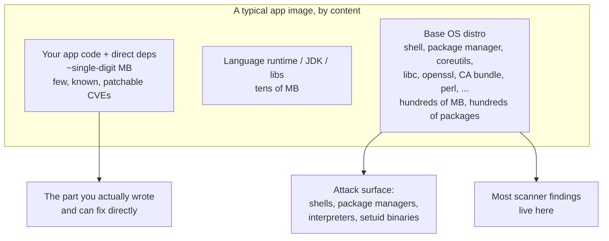
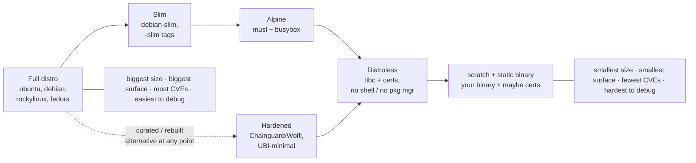
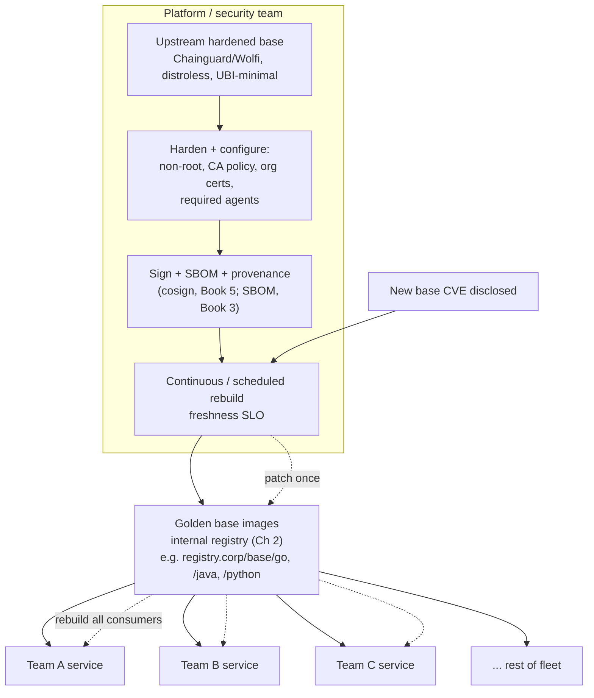
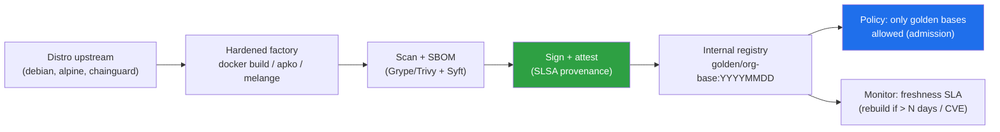
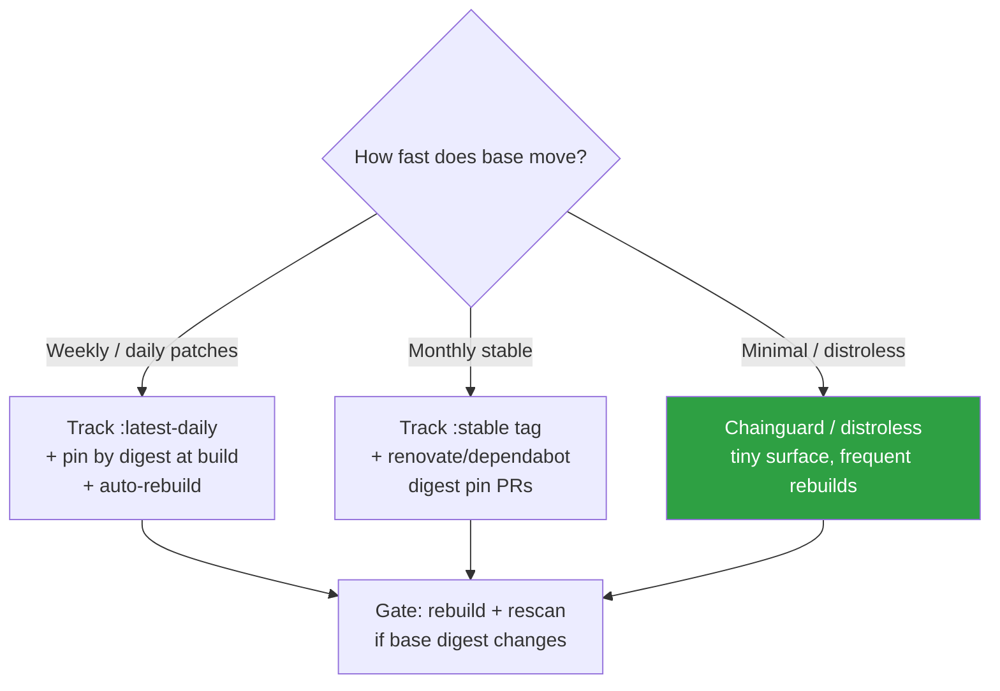
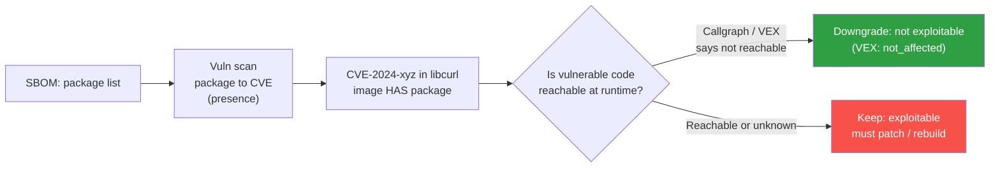

# Chapter 3 — Base Image Strategy: Minimal, Distroless, Hardened

*What this chapter covers.* Every image you build starts with a `FROM` line, and that one line
decides most of what ends up in the running container. Chapter 1 mapped the image attack surface
and observed, almost in passing, that the base OS layers dominate an image by size, by component
count, and by CVE count. This chapter takes that observation seriously and makes it the subject.
The base image is the largest *inherited* dependency in a container: you did not write it, you may
not read it, and yet it ships in every process on every node — the container analogue of a
transitive dependency you never chose (Book 2 — the dependency supply chain). Choosing and managing
base images well is, after signing, the single highest-leverage supply-chain decision you make for
a containerized fleet, because one base choice multiplies across every service that builds on it.
We build the argument from the ground up: why the base dominates risk; the concrete spectrum of
base images from full distros through slim, Alpine, distroless, `scratch`/static, and hardened
curated images like Chainguard's Wolfi; the CVE-reduction argument and its honest limits; the
lifecycle discipline — freshness, digest-pinning, provenance — that keeps a minimal base from
silently rotting; and the fleet-scale answer, a **golden base image program** that lets a platform
team patch once and rebuild everything.
_All tool versions, spec references, and defaults verified as of early 2026._

Learning goals — after this chapter you should be able to:

- Explain **why the base image dominates** an app image's size, component count, and CVE count,
  and why that makes it a shared, load-bearing dependency across a fleet.
- Place the common base choices on a **spectrum** from full distro to `scratch`, and articulate
  the size / attack-surface / CVE-count / debuggability trade-off each one makes.
- Describe precisely **what distroless is** (it is not "no OS"), what Alpine's **musl** trade-offs
  actually are, and what **Chainguard Images / Wolfi** do differently (glibc, continuous rebuild,
  signed, SBOM'd).
- Make the **CVE-reduction argument correctly** — the operational win is real and large, but fewer
  findings is not automatically "more secure" (Book 2, Chapter 7 — reachability).
- Run the **base-image lifecycle**: pin by **digest**, then **automate digest bumps** (Renovate /
  Dependabot for Docker) so pinning does not mean staleness, and verify base **provenance**.
- Design a **golden base image program** — curated, signed, SBOM'd, continuously-rebuilt internal
  bases enforced by admission policy — as the fleet-scale control.

## Why the base image dominates risk

Open a shell in a typical Ubuntu-based application image and count what is there. You will find the
distribution's package database and its several hundred installed packages: `glibc`, `coreutils`,
`bash`, `dash`, `apt` and `dpkg`, `perl` as a dependency of something, `libssl`, `zlib`, a CA
certificate bundle, `login`/`passwd` and the shadow suite, `tar`, `gzip`, `sed`, `grep`, maybe
`python3` pulled in transitively. Then, near the top, a thin sliver: your application binary and
its runtime dependencies. On a Java or Node image the runtime (a full JDK, a Node distribution) is
itself large, but it too sits on the distro. The proportions are lopsided. Of a few hundred
megabytes, your code is often single-digit megabytes; the rest is inherited.

This has three consequences that run through the whole chapter.

**Most reported CVEs are not in your code.** When a scanner (Chapter 4) reports on that image, the
overwhelming majority of findings are in base OS packages — `openssl`, `glibc`, `bash`, the distro's
`libxml2`, a `zlib` that has not been rebuilt since the base was cut. These are packages you did not
choose individually and mostly cannot patch individually; they arrive as a set with the base. A
scan report on a full-distro image is, first and foremost, a report card on the base image. Change
the base and the report changes wholesale, before you touch a line of application code.

**Attack surface is what is in the image.** Every shell, every package manager, every interpreter,
every setuid binary, every library in the image is two things at once: a potential vulnerability to
patch, and a potential *tool for an attacker who lands inside the container*. This second point is
the one operations teams underweight. A container compromise — an RCE in your app, a deserialization
bug, an SSRF that becomes command execution — does not end at the process boundary. The attacker
now wants to **live off the land**: read secrets from the environment and mounted files, resolve and
reach internal services, pull a second-stage payload, escalate. A `bash`, a `curl`, an `apt-get`, a
`python3`, a writable package manager, an `nc` from busybox — these are the attacker's toolkit,
pre-installed, at their disposal. Remove them and the same code-execution bug lands the attacker in
a near-empty room. This is the deepest argument for minimalism, and it is independent of the CVE
count: even a shell with zero known CVEs is attacker infrastructure.

**The base is a shared, inherited dependency.** Chapter 1 described layer sharing — many images
built `FROM` the same base share the identical base layers by digest, stored once and pulled once.
That efficiency is also a coupling. One base choice is not a per-service decision; it propagates to
every service that builds on it. A vulnerability in that base is simultaneously present in every one
of those services. This is the concentration property that Book 1, Chapter 9 (Distributed Systems
Lens) frames as both leverage and risk, and it is why the back half of this chapter is about
managing the base as *fleet* infrastructure rather than a per-repo `FROM` line.



The strategic conclusion writes itself: if the base dominates size, surface, and CVEs, then
*shrinking and controlling the base* is where the leverage is. The rest of the chapter is how.

## The spectrum of base images

There is no single "secure base image." There is a spectrum, and every point on it trades a
different mix of size, attack surface, CVE count, developer convenience, and debuggability. The
engineering skill is placing each workload on the spectrum deliberately rather than defaulting to
whatever the language's `Dockerfile` tutorial used. We walk it from heaviest to lightest, then treat
the hardened/curated category, which cuts across the whole range.



The axes move together but not identically. Size and attack surface track each other closely.
CVE count tracks package count, which tracks size. Debuggability moves the *opposite* way — the
things that make an image small (no shell, no package manager) are exactly the things that make it
hard to poke at when something breaks in production. Keep that inversion in mind; it is the tax you
pay for minimalism, and later sections show how ephemeral debug containers pay it down.

### Full distribution images

`ubuntu`, `debian`, `rockylinux` and `centos` derivatives, `fedora`: a complete general-purpose
Linux userland in a container. Everything works, every tutorial assumes them, every tool you might
`apt-get install` at debug time is one command away. That convenience is the whole value
proposition, and it is a real one — for **development images**, for **CI build stages**, and for
runtimes with genuinely complex or dynamically-discovered native dependencies, a full distro is the
pragmatic choice.

The cost is everything the previous section listed, at maximum. A `debian:bookworm` or
`ubuntu:24.04` base carries the full package set, the full shell-and-package-manager toolkit for an
attacker, and the largest CVE surface of any option. It is also the base most likely to be *stale*:
because it "just works," teams pin it to a tag and forget it, and it accretes unpatched CVEs between
rebuilds. A full distro is a defensible **build-stage** base and a poor **runtime** base for most
services. The multi-stage pattern later in the chapter lets you have the first without paying for
the second.

### Slim variants

`debian:bookworm-slim`, the `-slim` tags generally: the same distribution with the documentation,
locales, and optional tooling stripped — a smaller footprint, fewer packages, meaningfully fewer
CVEs than the full tag, but still a distro with a shell (`dash` or `bash`), still `dpkg`/`apt`,
still `glibc` and the C toolchain's runtime. Slim is the sensible default when you have decided you
need a distro at runtime — you get most of the convenience at a fraction of the surface. It is a
strict improvement over the full tag for production runtimes and rarely the wrong first step. It is
not, however, the end of the road: it still hands an attacker a shell and a package manager.

### Alpine: small, musl, and honest trade-offs

Alpine Linux is the reflexive answer to "make the image smaller." A base `alpine` image is a few
megabytes, because it replaces the GNU userland with **BusyBox** (a single multi-call binary that
provides `sh`, `ls`, `wget`, and dozens of other applets) and the GNU C library with **musl libc**,
a small, cleanly-implemented alternative. It uses `apk` as its package manager. For many services
Alpine is a genuinely good choice and a large improvement over a full distro.

But "just use Alpine" is folk wisdom that hides real trade-offs, and a senior engineer should know
them before defaulting to it:

- **musl is not glibc, and the difference is observable.** The two libraries implement the same
  C standard but differ in behavior at the edges. The historically painful one is **DNS
  resolution**: musl's resolver has, at various points, diverged from glibc's in how it handles
  multiple `nameserver` entries, `search` domains, `ndots`, and large responses — behavior that
  matters enormously in Kubernetes, where service discovery leans hard on the resolver and
  `ndots:5` is the default. Teams have chased intermittent DNS failures for days that vanished on a
  glibc base. musl has closed much of the gap over time, but the class of problem is real.
- **glibc-only binaries do not run.** Anything shipped as a dynamically-linked glibc binary — many
  vendor tools, some proprietary agents, certain database drivers, Nvidia userland — will not run
  on musl without a compatibility shim, and shims are their own source of subtle breakage.
- **Python and other compiled wheels.** The Python ecosystem's binary wheels (`manylinux`) are
  built against glibc. On Alpine, `pip install` frequently cannot use a prebuilt wheel and falls
  back to **compiling from source**, which means dragging a full build toolchain into your image
  (bloating it, ironically) or fighting long, fragile builds. `musllinux` wheels exist but coverage
  is thinner than `manylinux`.
- **Performance and defaults.** musl's default per-thread stack size is smaller than glibc's, which
  has surprised threaded applications into stack-overflow crashes; its `malloc` and some string
  routines have different performance characteristics under specific workloads. These are edge
  cases, not everyday problems, but they are the kind of edge case that surfaces at scale and is
  miserable to diagnose.

None of this makes Alpine wrong. It makes Alpine a *deliberate* choice: excellent for Go and Rust
static-ish builds, for simple services, for anything where you have validated musl behavior; risky
as a thoughtless default for glibc-dependent stacks, especially Python-with-native-deps and
DNS-sensitive services. And note the deeper point: Alpine is still a **distro with a shell and a
package manager**. It is small, but it is not distroless. It shrinks the CVE surface; it does not
remove the attacker's toolkit.

### Distroless: your app, libc, and almost nothing else

**Distroless** is the category most misunderstood, so be precise. Google's `distroless` images
(published under `gcr.io/distroless`) are **not** "no operating system." They contain exactly the
runtime dependencies an application needs and nothing else: **glibc**, the CA certificate bundle,
`tzdata` for timezone handling, `/etc/passwd` and `/etc/nsswitch.conf` so a non-root user and NSS
resolution work, and — for the language variants — the language runtime. What they deliberately
*omit* is the entire general-purpose userland: **no shell** (`sh`, `bash`), **no package manager**
(`apt`, `apk`), **no `coreutils`**, no `curl`, no `wget`, no interpreters you did not ask for.

That omission is the point. The distroless attack-surface reduction is not primarily about CVE
counts (though those drop sharply); it is that **an attacker who achieves code execution lands in a
container with no tools to pivot with**. There is no shell to spawn, no package manager to fetch a
second stage, no `curl` to exfiltrate. They must bring everything themselves, over whatever channel
your app's own code gives them, which is a dramatically harder position than "you now have a root
shell with `apt`."

Distroless comes in language-specific flavors, and choosing the right one matters:

- `gcr.io/distroless/static` — for **statically-linked** binaries (typically Go with
  `CGO_ENABLED=0`, or static Rust). Contains CA certs, `tzdata`, `/etc/passwd`, and a nonroot user;
  no libc, because a static binary carries its own.
- `gcr.io/distroless/base` — adds **glibc** and `libssl`, for dynamically-linked binaries (Go with
  cgo, C/C++ that links against system libc).
- `gcr.io/distroless/cc` — adds the C/C++ runtime (`libgcc`, `libstdc++`) for compiled languages
  that need it.
- `gcr.io/distroless/java`, `.../python3`, `.../nodejs` — bundle the respective runtime. (Note that
  Google's Python and Node distroless images have historically carried caveats about version
  pinning and support; verify current status before standardizing on them, and consider Chainguard
  or Wolfi's language images as alternatives.)

The cost of distroless is **debuggability**, and it is the honest downside. With no shell, you
cannot `kubectl exec -it pod -- /bin/sh` your way into a running container to look around — there is
nothing to exec. The modern answer is the **ephemeral debug container**: `kubectl debug` attaches a
*separate*, temporary container with a full toolset into the target pod's namespaces, so you get
your shell and `curl` and `ps` sharing the process and network namespace of the distroless container
without those tools ever living in the production image.

```bash
# Attach a throwaway debug container that shares the target's namespaces.
$ kubectl debug -it payments-7c9f-abcde \
    --image=cgr.dev/chainguard/busybox:latest \
    --target=payments --profile=general
# You now have a shell that can see the distroless container's processes,
# filesystem (/proc/1/root), and network — without a shell in the image itself.
```

Google also publishes `:debug` tags (for example `gcr.io/distroless/static:debug`) that include a
BusyBox shell, intended for local troubleshooting — but the discipline is to run the **non-debug**
image in production and reach for `kubectl debug` when you need to look inside, so the shell is never
resident in the deployed artifact.

### `scratch` and static binaries: the empty base

The floor of the spectrum is `FROM scratch` — the reserved, **completely empty** base image: zero
bytes, no files at all. On top of it you place a **statically-linked binary** and, if the app makes
outbound TLS calls, a CA certificate bundle, plus perhaps `/etc/passwd` for a non-root UID and
`tzdata` if it does timezone math. The result is the smallest possible image: your binary and a
handful of data files, and *nothing else* — no libc, therefore no libc CVEs; no shell; no userland;
nothing for an attacker to use and nearly nothing for a scanner to find in the base.

This is where **Go and Rust shine**, because both can produce fully static binaries. A Go build with
`CGO_ENABLED=0` links no libc and needs no dynamic loader. Rust can target `x86_64-unknown-linux-musl`
for a static binary. A multi-stage `Dockerfile` compiles in a full builder stage, then copies the
single binary into `scratch`:

```dockerfile
# ---- build stage: full toolchain, thrown away ----
FROM golang:1.23 AS build
WORKDIR /src
COPY go.mod go.sum ./
RUN go mod download
COPY . .
# Static build: no cgo, no dynamic linking.
RUN CGO_ENABLED=0 GOOS=linux go build -trimpath -ldflags="-s -w" -o /app ./cmd/server

# ---- runtime stage: an empty base ----
FROM scratch
# CA roots for outbound TLS, copied from a trusted stage.
COPY --from=build /etc/ssl/certs/ca-certificates.crt /etc/ssl/certs/
# A non-root identity (UID 65532) so the process need not run as root.
COPY --from=build /etc/passwd /etc/passwd
COPY --from=build /app /app
USER 65532
ENTRYPOINT ["/app"]
```

The trade-offs are real and worth stating. Static linking means your binary **bundles everything**,
so a vulnerability in a statically-linked library is not "the base's `openssl` CVE" that a base
rebuild fixes — it is *your* dependency, which you fix by rebuilding *your* app (this is where SBOMs
of the binary's own dependencies, Book 3, matter, because the scanner can no longer read packages
off a distro database). You give up NSS-based name resolution niceties, you must remember the CA
bundle or every HTTPS call fails with an opaque error, and debugging is `kubectl debug` or nothing.
For a Go or Rust network service, though, `scratch` (or the near-identical `distroless/static`,
which throws in the certs and nonroot user for you) is frequently the correct production base and
the cleanest supply-chain story you can tell: the image *is* your code plus data.

### Hardened and curated images

Cutting across the whole spectrum is a category defined not by *how much* it contains but by *how it
is produced and attested*: continuously-rebuilt, minimal, signed, SBOM-carrying base images from a
curator who treats freshness and provenance as the product.

**Chainguard Images**, built on the **Wolfi** undistribution, are the standard-bearer of this
modern trend, and precision matters because they are easy to conflate with Alpine. Wolfi is a
minimal, **glibc-based** Linux distribution — this is the key difference from Alpine, and it means
Wolfi avoids the musl compatibility class of problems entirely while keeping images tiny. It uses
the `apk` package format and tooling (borrowed from Alpine's ecosystem) but ships its own
glibc-based packages. It is a **rolling** distribution with **no traditional release**, built to be
**continuously rebuilt from source** so that images are always fresh — the freshness problem the
next section describes is attacked at the source rather than left to downstream rebuild schedules.
Chainguard's runtime images are **distroless by default** (no shell, no package manager), with
`-dev` variants that add a shell, `apk`, and BusyBox for building and debugging. Critically, every
image ships with a **cosign signature** and a build-time **SBOM** (Book 3) as standard artifacts,
and provenance is part of the product. The pitch is a base that is minimal like distroless, glibc-
compatible unlike Alpine, continuously patched unlike a pinned distro, and signed-and-SBOM'd unlike
almost everything else — a "secure base" as a managed dependency.

**Red Hat Universal Base Image (UBI)** is the curated option from the RHEL world: a RHEL-derived
base that Red Hat licenses for **free redistribution** (you can build on and ship UBI without a RHEL
subscription), so it brings RHEL's package hygiene and long support lifecycle to anyone. `ubi9` is
the full base; `ubi9-minimal` is the small variant that swaps `dnf` for the lightweight `microdnf`
and strips the footprint substantially; `ubi9-micro` goes further still. UBI is the natural base for
RHEL-aligned shops and for anything that wants an enterprise support lifecycle, and it is a common
requirement in regulated environments.

Beyond these, **Docker Official Images** (the curated `library/` namespace on Docker Hub) and
**Docker Verified Publisher** images are a *baseline* trust signal — maintained, documented,
reasonably fresh — but they are still ordinary distro-based images with the surface that implies;
"official" is a curation claim, not a minimalism or hardening claim. **Bitnami** publishes a large
catalog of hardened, regularly-updated application and language images that many teams standardize
on. The unifying theme of this category is that *someone else runs the freshness-and-provenance
discipline for you* — which is exactly the discipline the next two sections argue you cannot skip.

### The spectrum as a decision table

| Base type | Typical size | Attack surface | Typical CVE count | Debuggability | When to use |
|---|---|---|---|---|---|
| **Full distro** (`ubuntu`, `debian`) | 70–300 MB+ | Highest: shell, pkg mgr, full userland | Highest | Easiest: full toolset resident | Dev images, CI build stages, complex/dynamic native runtime deps |
| **Slim** (`debian-slim`) | 30–80 MB | High: still shell + pkg mgr | High, but well below full | Easy | Default when a distro *is* required at runtime |
| **Alpine** | ~5–15 MB | Medium: BusyBox shell + `apk` | Low–medium | Easy: BusyBox shell present | Go/Rust, simple services, validated-musl stacks; avoid for glibc/DNS-sensitive or native-Python workloads |
| **Distroless** (`gcr.io/distroless`) | ~2–25 MB (varies by runtime) | Very low: no shell, no pkg mgr | Very low | Hard: `kubectl debug` / `:debug` tag | Production runtime for most services; language-matched variant |
| **`scratch` + static** | ~app size (single-digit MB) | Minimal: only your binary | Minimal (no base pkgs) | Hardest: `kubectl debug` only | Static Go/Rust network services |
| **Hardened/curated** (Chainguard/Wolfi, `ubi-minimal`) | ~2–40 MB | Very low (distroless-style) to low | Very low / near-zero, continuously rebuilt | Hard (`-dev`/`-minimal` variants ease it) | Fleet-wide secure base; signed + SBOM'd + fresh out of the box; UBI for RHEL/regulated |

Read the table as guidance, not law. The size and CVE figures move constantly and depend on the
language runtime you add; treat them as orders of magnitude. The stable truth is the *ordering* and
the *shape* of the trade-off: as you move down, size / surface / CVE count fall and debugging
difficulty rises, and the hardened category lets you buy a low point on the surface axis while
someone else carries the freshness-and-provenance cost.

## The CVE-reduction argument, made honestly

Switching a fleet from full-distro bases to distroless or Chainguard bases collapses scanner
findings — often by an order of magnitude, sometimes to near zero on the base layers. That number is
seductive and it is worth having a precise, honest theory of *what it buys*, because it is easy to
oversell and the overselling invites a justified backlash.

**What is genuinely won.** Two things, both large.

First, the **operational win**, which is the biggest and least disputable. Fewer packages means
fewer CVEs to triage, and CVE triage at fleet scale is a dominant, demoralizing cost — the alert
fatigue that Book 2, Chapters 6–7 diagnose. Every base CVE a scanner reports is a ticket someone
must assess: is it reachable, is it exploitable in our configuration, is there a fix, do we rebuild
now or wait. Cut the base from three hundred packages to twenty and you have cut that triage load
proportionally. Fewer findings also means **lower MTTR to patch** what remains: when a real,
reachable base CVE lands, an image with twenty packages is faster to rebuild, re-test, and roll than
one with three hundred, and the signal is not buried under noise. This alone justifies minimal bases
in most shops.

Second, the **real attack-surface reduction**, which is independent of any CVE count. Removing the
shell and the package manager removes *attacker capability*, as argued above. That win is not
measured by the scanner at all — a `bash` with zero CVEs is still the thing that turns an RCE into a
foothold — and it is arguably the more important of the two. Less in the image is less to exploit,
less to patch, and less to go wrong, full stop.

**Where the naïve version is wrong.** The seductive but sloppy claim is "fewer CVEs equals more
secure," as if the security of an image were a decreasing function of its scanner finding count.
It is not, for a reason Book 2, Chapter 7 (reachability) develops in full: **most CVEs in a base
image are in packages your application never calls.** A CVE in `libxml2` in a base whose only job is
to host a Go binary that never parses XML is not exploitable *in that image*, regardless of the
package's CVSS score. Removing that package removes a scanner finding but changes your actual
exposure by roughly nothing, because the finding was never reachable. If you judged the switch to
distroless purely by the drop in finding count, you would be measuring partly noise — you would take
credit for "fixing" vulnerabilities that were never a threat.

So hold both truths at once. The finding-count drop **overstates** the pure vulnerability-exposure
improvement, because much of what disappears was unreachable anyway. But the switch is still a large
real win, because (a) the operational relief — less triage, faster MTTR, less noise hiding real
signal — is genuine and enormous, and (b) the attack-surface reduction — no shell to pivot with — is
genuine and does not show up in the CVE count at all. The correct executive summary is not "we
eliminated 95% of our vulnerabilities." It is: "we eliminated 95% of the *triage load* and removed
the attacker's on-box toolkit; the fraction of those findings that were ever exploitable was small,
but not paying to chase the rest is exactly the point." That is a defensible claim. The inflated one
invites a security team to notice, correctly, that you did not actually change your exploitable
surface as much as the dashboard suggests — and to distrust the whole program.

## Base image lifecycle: freshness, pinning, provenance

A minimal base is not a set-and-forget artifact. Three lifecycle disciplines separate a base
strategy that works from one that quietly decays, and they interact in a way that is easy to get
half-right.

### Freshness: bases go stale

An image is a **point-in-time snapshot** of packages. The moment it is built, it begins to age:
upstream projects publish patches, distributions push updated packages, and the frozen snapshot in
your base accumulates known-but-unpatched CVEs. A base image built six months ago and never rebuilt
is, by definition, missing six months of security updates, no matter how minimal it was on day one.
Minimalism reduces the *rate* of staleness (fewer packages, fewer things to go stale) but does not
stop the clock.

The only cure is **rebuilding**: producing a fresh image that pulls current upstream packages, on a
schedule fast enough that no service runs on a base older than your tolerance. There are three
common models:

- **Automated periodic rebuilds** of your own images — a scheduled CI job that rebuilds nightly or
  weekly against the latest base, the image analogue of the dependency-update automation in Book 2,
  Chapter 9.
- **Curator continuous rebuild** — this is precisely Chainguard/Wolfi's model: the *base provider*
  rebuilds continuously from source so freshness is upstream of you; you inherit it by re-pulling.
- **Pin plus scheduled bump** — pin the base for reproducibility (next), and run automation that
  proposes a bump on a schedule. This is the pattern most teams should run, and it resolves the
  tension the next subsection sets up.

The distributed-systems framing is to make freshness a **fleet SLO**: *no service runs on a base
image older than N days.* That single objective, measured against inventory, converts "we should
rebuild sometime" into an operable, alertable target — and it is only achievable if base usage is
inventoried, which the golden-image section makes possible.

### Pinning: by digest, not by tag

Chapter 1 established that **tags are mutable pointers and digests are immutable content addresses**.
`FROM node:20` resolves to *whatever* `node:20` points at when the build runs — and that moves. Two
builds of the identical `Dockerfile` a week apart can produce different images because the base tag
advanced underneath them. That is fatal to **reproducibility** (Book 4, Chapter 2 — reproducible
builds): you cannot reason about, reproduce, or trust a build whose inputs silently change. Worse,
it is a supply-chain exposure: if an attacker (or a compromised registry account, Chapter 2)
republishes the base tag, your next build ingests it with no signal.

The fix is to pin the base by **digest**:

```dockerfile
# Mutable — the base can change under you, build to build.
FROM node:20-slim

# Pinned — this exact content, or the build fails. Reproducible and tamper-evident.
FROM node:20-slim@sha256:9d0e0b1f6f3a...c2a1
```

With a digest pin, `FROM` names a specific set of bytes. The build is reproducible with respect to
its base, and a republished tag cannot substitute different content — the digest would not match. Pin
your base by digest, and (Chapter 1) deploy your *own* images by digest too, so immutability runs
end to end.

But digest pinning creates the very problem freshness warns against: **a pinned digest never
advances**, so a naïvely pinned base is a *frozen* base that rots. Pinning without automation is how
teams end up running eighteen-month-old bases full of patched-upstream-but-not-here CVEs, having
mistaken reproducibility for safety.

### Pin-and-automate: the pattern that resolves the tension

The resolution is not to choose between reproducibility and freshness but to **pin by digest and
automate the digest bumps** — the pin-and-automate pattern (Book 2, Chapter 9). You keep the digest
pin, so every individual build is reproducible and tamper-evident; and you run a bot that watches for
new base versions, opens a pull request updating the pinned digest, and lets CI test the bump before
it merges. The pin gives you determinism; the automation gives you freshness; the PR gives you a
review-and-test gate.

**Renovate** and **Dependabot** both support Docker `FROM` lines as first-class dependencies.
Renovate's `docker` and `docker-compose` managers will even maintain the *tag-plus-digest* form —
keeping a human-readable tag as a comment while bumping the pinned digest — so you get readable
`Dockerfile`s and immutable builds together:

```json
{
  "$schema": "https://docs.renovatebot.com/renovate-schema.json",
  "extends": ["config:recommended"],
  "docker": { "enabled": true },
  "packageRules": [
    {
      "matchDatasources": ["docker"],
      "pinDigests": true,
      "schedule": ["before 6am on monday"]
    }
  ]
}
```

```dockerfile
# Renovate maintains the digest; the tag comment stays human-readable and gets bumped too.
FROM cgr.dev/chainguard/static:latest@sha256:3f1c...ab90
```

```mermaid
sequenceDiagram
  autonumber
  participant Up as Upstream base<br/>(registry)
  participant Bot as Renovate / Dependabot
  participant Repo as Your repo (pinned FROM)
  participant CI as CI (build + scan + test)
  participant Reg as Your registry

  Up->>Bot: new base digest published
  Bot->>Repo: open PR: bump FROM ...@sha256 old to new
  Repo->>CI: PR triggers build against new pinned digest
  CI->>CI: build · scan (Ch 4) · run tests
  alt green
    CI-->>Repo: checks pass, merge
    Repo->>Reg: publish rebuilt, freshly-based image (signed, Book 5)
  else regression / new CVE
    CI-->>Bot: fail; hold the bump for a human
  end
```

This loop is the mechanical heart of a working base strategy: **reproducible because pinned, fresh
because automated, safe because gated.** Skipping either half breaks it — no pin means
irreproducible and tamper-prone builds; no automation means frozen, rotting bases.

### Provenance: trust the base you inherit

A base image is code you did not write, running in every one of your containers. If it is
compromised, everything built on it is compromised — the base is a **fleet-wide blast radius** and a
prime target for exactly the registry threats Chapter 2 catalogs (tag replacement, poisoned public
images, typosquatting the base name). You verify your *own* images (Book 5); you must extend the same
skepticism upstream.

Ask of any base you adopt: **Is it signed?** Can you verify a cosign signature from a publisher you
trust before you build on it (Book 5)? Chainguard images ship signatures as standard; you can and
should verify them:

```bash
# Verify a Chainguard image's signature before trusting it as a base.
$ cosign verify \
    --certificate-oidc-issuer=https://token.actions.githubusercontent.com \
    --certificate-identity-regexp='.*chainguard.*' \
    cgr.dev/chainguard/static@sha256:3f1c...ab90
```

**Does it carry an SBOM?** (Book 3.) Can you enumerate what is actually in the base, so that when the
next Log4Shell-class disclosure lands you can answer "is that component in our base?" from data
rather than archaeology? **Is the source trustworthy** — an official curated namespace, a verified
publisher, your own internal build — rather than a random Docker Hub account whose `python-fast` tag
you pulled because it was small? The strongest posture pulls bases only from sources that are signed,
SBOM'd, and pinned by digest, and re-anchors that provenance in an internal registry (Chapter 2) so
the whole fleet inherits verified bytes. A base you cannot verify is a base you are trusting on
faith, multiplied across every service that builds on it.

### Minimizing what you ship: multi-stage and non-root

Two build-time practices convert base strategy into shipped reality. Both were introduced in Chapter
1 and Book 4, Chapter 2; here they are the mechanism that lets you *use* a heavy base for building
while *shipping* a minimal one.

**Multi-stage builds** let you compile in a full-toolchain stage and copy only the finished artifact
into a minimal final stage, so build-time bulk, secrets, and tooling never reach the runtime image:

```dockerfile
# Build stage: full JDK + Maven, everything the build needs.
FROM eclipse-temurin:21-jdk AS build
WORKDIR /src
COPY . .
RUN ./mvnw -q -DskipTests package

# Runtime stage: distroless Java — JRE, glibc, certs, tzdata; no shell, no pkg mgr.
FROM gcr.io/distroless/java21-debian12@sha256:....
COPY --from=build /src/target/app.jar /app/app.jar
USER 65532
ENTRYPOINT ["java", "-jar", "/app/app.jar"]
```

The build stage's `jdk`, its Maven cache, any credentials in the build context — none of it exists
in the final image. You paid for a heavy base at build time and shipped a minimal one.

**Not running as root** (`USER`, Chapter 1) is the other half. Even a minimal image should not run
its process as UID 0: a container escape or a mounted-secret read is worse from root. Distroless and
Chainguard images ship a `nonroot` user (commonly UID 65532) precisely so you can `USER nonroot`
without inventing one. Combined with a minimal base, the running container is a non-root process in
an image with no shell — a genuinely hard target.

## A golden base image program

Everything so far is a per-image discipline. At fleet scale — many services, many teams, many repos
(the distributed-systems reality this suite is written for) — leaving each team to independently pick
a base, pin it, automate bumps, and verify provenance produces exactly the sprawl you would expect:
dozens of different bases, most unpinned, few verified, patched on no schedule, with no one able to
answer "which services are on a vulnerable base?" The fleet-scale answer is a **golden base image
program**: the platform team curates a small set of blessed bases and everyone builds on them.

A golden base image is **hardened** (minimal, non-root, distroless-style), **signed** (Book 5),
**SBOM'd** (Book 3), **continuously rebuilt** (fresh), and **published from an internal registry**
(Chapter 2) that the whole fleet pulls from. The platform team owns its lifecycle; application teams
consume it with a single `FROM`. This is the **paved road** pattern (Book 1, Chapter 10; Book 4,
Chapter 10) applied to base images: the secure default is the *easy* default, so teams follow it not
by mandate but because it is less work than rolling their own.



The payoff is **centralized patching**, and it is the whole reason the program exists. When a base
CVE lands — the next `openssl` or `glibc` or Log4Shell-class event — the platform team patches the
golden base *once*, and every service is remediated by rebuilding against the new golden digest
(driven by the same Renovate/Dependabot loop from the previous section, now pointed at the internal
base). Contrast the alternative: a hundred teams each discovering the CVE, each finding their own
base, each patching independently on their own schedule, some never. Concentration turns a
hundred-team scramble into one platform action plus an automated fleet rebuild. That is Book 1,
Chapter 9's "concentration as leverage" made concrete.

Concentration is also **risk**, and the program must respect it. A compromised golden base is a
fleet-wide compromise — the very blast radius the provenance section warned about, now centralized by
design. This is *why* the golden base must be the most rigorously signed, SBOM'd, and access-
controlled artifact in the organization: you have deliberately concentrated trust, so you must
concentrate assurance to match. The golden base build pipeline deserves the tier-0 treatment the
registry gets in Chapter 2 and the CI control plane gets in Book 4.

### Enforcing base policy

A golden base program that is merely *available* becomes a golden base program that half the fleet
ignores. Enforcement makes it real, and it rests on three mechanisms this book develops elsewhere:

- **Admission / policy control** (Chapter 6): a cluster policy (Kyverno, OPA/Gatekeeper) that
  **requires images to derive from an approved base** — implemented as an allowed-registry/repository
  rule (only `registry.corp/base/*` and images built from it may run), often combined with the
  signature-verification policy of Book 5, Chapter 5. An image on an unapproved base is refused
  admission. This is the hard backstop that turns "please use the golden base" into "the cluster
  will not run anything else."
- **Scan bases at ingest** (Chapter 4): scan the golden bases themselves as they are built and
  before they are published, so a base never enters the fleet's supply with a known-and-unassessed
  critical CVE. The base is the highest-leverage thing to scan because its findings are inherited by
  everything downstream.
- **Inventory base usage** (Book 3, Chapter 5 — SBOMs at scale): maintain a fleet-wide record of
  *which service runs which base at which digest*, derived from image SBOMs and deploy metadata. This
  is what makes the freshness SLO measurable ("show every service on a base older than N days") and
  what makes incident response fast ("show every service whose base contains the vulnerable
  package"). Without inventory, a golden base program is patching in the dark; with it, the
  Log4Shell question — *which of our services are affected?* — is a query, not an archaeology
  project.

Put the three together and the program is self-enforcing and self-observing: policy keeps everyone
on approved bases, scanning keeps the approved bases clean at ingest, and inventory tells you at any
moment where every base is deployed and how old it is. That is the difference between owning your
base supply and hoping about it.

## Distributed-systems lens

The base image is the clearest small example of a theme that runs through this entire suite: **a
shared, load-bearing dependency, concentrated across the fleet, is simultaneously your greatest
point of leverage and your greatest point of risk.**

- **Concentration as leverage.** A golden-image program concentrates base security into one owned
  artifact: patch the base once, rebuild everything (Book 1, Chapter 9). The same
  Renovate/Dependabot loop that bumps one repo's `FROM` becomes, pointed at an internal golden base,
  a fleet-wide remediation mechanism. Nothing else in container supply chain gives you this much
  reach from a single action.
- **Concentration as risk.** A base compromise is not a service incident; it is a fleet incident,
  because every image inherits the base's bytes (Chapter 2's registry threats aimed at the base).
  The mitigation is to match concentrated trust with concentrated assurance: sign the base, SBOM it,
  pull it only through a verified internal chokepoint, and treat its build pipeline as tier-0.
- **Fleet-wide triage load.** Minimal bases cut CVE-triage volume across every service at once — the
  operational win of the CVE section, multiplied by the fleet. At one service, distroless saves a
  few tickets a month; at a thousand services, it is the difference between a security team that
  drowns in base-package noise (Book 2, Chapters 6–7) and one that can attend to reachable,
  application-level findings.
- **MTTR as a fleet property.** When a real base CVE lands, mean-time-to-remediate across the fleet
  is dominated by how fast you can rebuild-and-roll every affected service — which is fastest when
  bases are minimal, pinned-and-automated, and centralized. Base strategy is, in effect, a lever on
  fleet-wide patch latency.
- **Freshness as an SLO.** "No service on a base older than N days" is an operable objective only
  when base usage is inventoried; then it is measurable and alertable like any other SLO, and the
  golden-image program is the thing that makes it achievable.
- **Inventory as incident response.** The Log4Shell lesson (Book 3) is that the expensive question
  in a supply-chain incident is *which of our things are affected?* A base-usage inventory answers
  the base-layer form of that question as a query. That single capability repays the whole
  golden-image program the first time a base-package disclosure lands.

The synthesis: the **golden base image + automated rebuild + digest pin** pattern is the highest-ROI
container supply-chain control after signing itself. Signing (Book 5) tells you an image is what its
publisher says it is; a governed base tells you that what the publisher built on is minimal, fresh,
verified, and centrally patchable. Together they convert the base image from the largest, most
inherited, least-examined part of your fleet into a controlled, observable, patch-once dependency.

### Golden image pipeline (factory model)



### Update strategy decision matrix



### CVE presence vs reachability



## Key takeaways

- The **base image dominates** an app image's size, component count, and CVE count. Most scanner
  findings are in base OS packages you inherited, not code you wrote — so shrinking and governing the
  base is the highest-leverage container decision after signing.
- **Attack surface is what is in the image.** Every shell, package manager, and interpreter is both
  a CVE to patch and a tool for an attacker living off the land inside a compromised container.
  Removing them is a security win independent of any CVE count.
- The base-image **spectrum** runs full distro → slim → Alpine → distroless → `scratch`/static, with
  hardened/curated images (Chainguard/Wolfi, UBI-minimal) cutting across it. Down the spectrum,
  size / surface / CVE-count fall and debuggability worsens.
- **Distroless is not "no OS":** it is libc + CA certs + tzdata + your runtime, with **no shell and
  no package manager**. **Alpine** trades glibc for **musl** and BusyBox — real DNS, native-wheel,
  and compatibility gotchas make "just use Alpine" a deliberate choice, not a default. **`scratch` +
  static** (Go/Rust) is the minimal floor. **Chainguard/Wolfi** is glibc-based, continuously
  rebuilt, distroless-by-default, and signed + SBOM'd out of the box.
- **Fewer CVEs is not automatically more secure** (Book 2, Chapter 7 — reachability): much of what a
  minimal base removes was never reachable. The honest wins are the **operational** one (far less
  triage, faster MTTR, less noise) and the **real attack-surface** one (no on-box toolkit) — both
  large, neither identical to the raw finding-count drop.
- Run the base **lifecycle**: pin by **digest** for reproducibility and tamper-evidence, then
  **automate digest bumps** (Renovate/Dependabot for Docker) so pinning never means staleness; keep
  bases **fresh** (rebuild on a schedule or inherit a continuously-rebuilt base); and **verify base
  provenance** — signed, SBOM'd, from a trusted source — because a poisoned base is a fleet-wide
  compromise.
- A **golden base image program** — a small set of hardened, signed, SBOM'd, continuously-rebuilt
  internal bases, enforced by admission policy, scanned at ingest, and tracked in a base-usage
  inventory — concentrates patching (fix once, rebuild the fleet) and provenance. It is the
  paved-road, highest-ROI base control at scale, provided you match the concentrated trust with
  concentrated assurance.

## Further reading

- **Google Distroless** — the images, their exact contents, language variants, and the `:debug`
  tags. https://github.com/GoogleContainerTools/distroless
- **Chainguard Images and the Wolfi undistribution** — continuously-rebuilt, glibc-based, minimal,
  signed + SBOM'd base images; read on both the images and the Wolfi build model.
  https://www.chainguard.dev/chainguard-images · https://github.com/wolfi-dev
- **Alpine Linux and musl libc** — the distribution, BusyBox, and the musl functional-differences
  page that documents glibc divergences. https://alpinelinux.org/ · https://wiki.musl-libc.org/functional-differences-from-glibc.html
- **Red Hat Universal Base Image (UBI)** — the freely-redistributable RHEL base and its `-minimal` /
  `-micro` variants. https://catalog.redhat.com/software/base-images
- **`FROM scratch` and Go static binaries** — the empty base and building fully static images.
  https://docs.docker.com/build/building/base-images/
- **Docker multi-stage builds** — the mechanism for shipping a minimal final stage (see also Book 4,
  Chapter 2 and Book 6, Chapter 1). https://docs.docker.com/build/building/multi-stage/
- **Renovate — Docker digest pinning and updates** — the pin-and-automate pattern for `FROM` lines
  (Book 2, Chapter 9). https://docs.renovatebot.com/docker/
- **`kubectl debug` — ephemeral debug containers** — how to debug shell-less images without shipping
  a shell. https://kubernetes.io/docs/tasks/debug/debug-application/debug-running-pod/
- **Sigstore / cosign** — verifying base-image signatures before you build on them (Book 5, Chapter
  3). https://docs.sigstore.dev/
- Cross-references within this suite: Book 1, Chapters 9–10 (concentration and paved roads); Book 2,
  Chapters 6–7 and 9 (alert fatigue, reachability, update automation); Book 3, Chapter 5 (SBOMs at
  scale and inventory); Book 4, Chapters 2 and 10 (reproducible builds, platform paved roads); Book
  5 (signing and verification); and Book 6, Chapters 1, 2, 4, and 6.
```