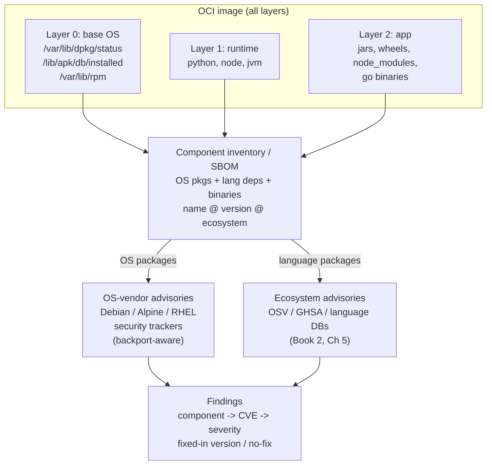
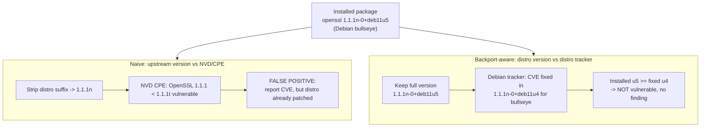
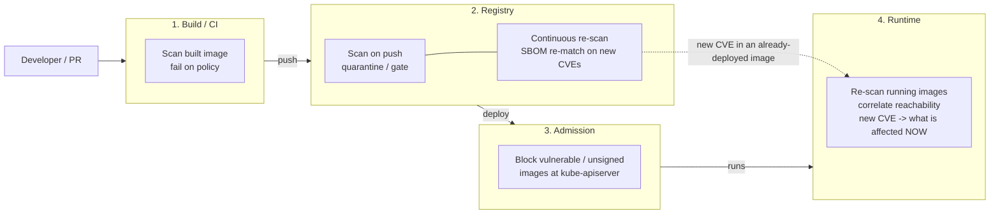
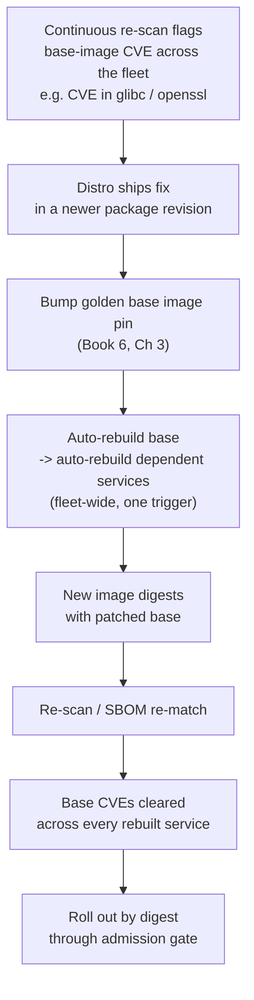
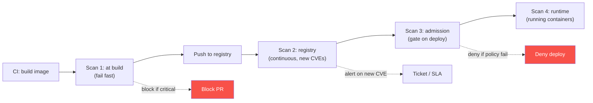
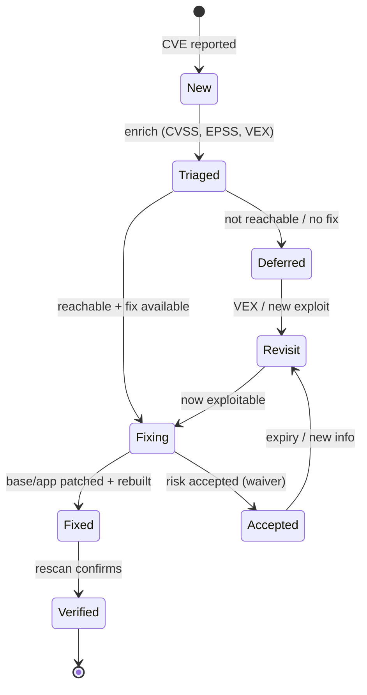
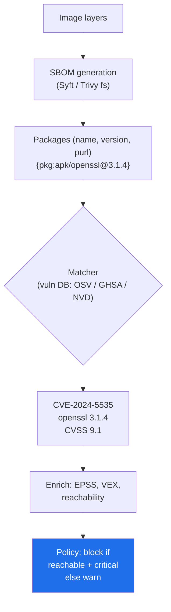

# Chapter 4 — Image Scanning and Vulnerability Management

*What this chapter covers.* You already know what Software Composition Analysis is (Book 2,
Chapter 6 — Software Composition Analysis in Depth): enumerate the components an artifact
contains, match them against vulnerability data (Book 2, Chapter 5 — Vulnerability Databases and
Identifiers), and produce a list of findings. **Container image scanning is exactly that, applied
to an OCI image** — but the container substrate changes the mechanics, the tooling, the error
modes, and, above all, the *scale* at which you must operate. An image is not one dependency
manifest; it is a stack of layers (Book 6, Chapter 1 — Container Images) containing an entire OS
distribution's worth of packages *plus* your application's language dependencies *plus* whatever
binaries and secrets leaked in during the build. And you do not have one image; you have hundreds
of services, each with many versions, each rebuilt continuously, all sitting in a registry (Book
6, Chapter 2 — Registries) waiting for the next Log4Shell.

This chapter is deliberately *not* a re-teaching of SCA internals — version-range matching, CVE
vs. GHSA vs. OSV identifiers, reachability analysis, EPSS and KEV prioritization. Those live in
Book 2 and Book 3 and we reference them rather than repeat them. What this chapter adds is
everything that is *specific to containers*: how a scanner reconstructs a component inventory
across layers, the **distro-backporting nuance** that is the single largest source of false
positives in image scanning, where in the pipeline scanning happens (and why it must happen
*continuously*, not once), and the operational reality that the dominant remediation for image
CVEs is not patching packages one by one — it is **rebasing onto a fresher base image and
rebuilding the fleet**.

Learning goals — after this chapter you should be able to:

- Explain the **mechanics** of image scanning: layer walk → OS package DB + language-manifest +
  binary inventory → SBOM → match against OS-vendor advisories *and* ecosystem advisories →
  findings.
- Explain **distro backporting** precisely — why a "vulnerable" upstream version string can be
  a *patched* distro package, why version-matching against upstream data produces false positives,
  and why scanners must use Debian/Alpine/Red Hat security-tracker data.
- Describe what modern scanners find **beyond CVEs**: embedded secrets, Dockerfile
  misconfigurations, license issues, and (for some) malware.
- Compare the real tooling honestly: **Trivy, Grype + Syft, Clair, Docker Scout**, cloud-built-in
  scanning (ECR/GAR/ACR), Harbor's integrated scanning, and commercial platforms — by *what* they
  scan and *how* they are deployed.
- Explain **SBOM-based scanning** (scan the inventory once, re-match forever) and why decoupling
  inventory from matching is the key move at fleet scale.
- Place scanning at the four **scan points** — build/CI, registry, admission, runtime — and argue
  why **continuous re-scan** is non-negotiable.
- Run an **operational vulnerability-management program for images**: manage volume with minimal
  bases, backport-aware matching, VEX, and prioritization; remediate primarily by **rebase**;
  gate with warn-then-enforce policy; and aggregate centrally so you can answer "which running
  images are affected by CVE-X" fleet-wide.
- State the honest **limits**: scanning finds *known* vulns in *known* components — not zero-days,
  not your logic bugs, not runtime misconfiguration. Necessary, not sufficient.

## What image scanning actually does

Scanning an image is two steps that Book 2 already named: **build a component inventory**, then
**match that inventory against vulnerability data**. The container-specific difficulty is entirely
in the first step and in the *data source* you match against in the second. Everything else is SCA.

### Step 1 — inventory the image across all layers

An OCI image is an ordered set of layers, each a tar of filesystem changes, that overlay into a
single root filesystem (Book 6, Chapter 1). A scanner does not run the container. It reads the
image's blobs from the registry or local store, applies the layers in order to reconstruct the
final filesystem (or walks each layer's tar directly), and then does what a package manager and a
language toolchain would recognize: it finds the **evidence of installed software** and reads it.

There are three broad classes of evidence, and a good scanner harvests all three:

- **OS packages.** Every mainstream distro records what it installed in an on-disk database that
  lives *inside the image's layers*:
  - Debian/Ubuntu: `/var/lib/dpkg/status` — a flat text file listing every `.deb`, its exact
    version, and its architecture.
  - Alpine: `/lib/apk/db/installed` — the apk database, one stanza per package.
  - RHEL/Fedora/CentOS/Amazon Linux: the RPM database (`/var/lib/rpm/`, an SQLite or BerkeleyDB
    file depending on version) queried the way `rpm -qa` would.
  The scanner parses these directly. It does **not** shell out to `dpkg`/`apk`/`rpm` inside the
  image — it reads the database format itself, which is why a scanner can inventory an Alpine
  image on an amd64 CI runner with no Alpine present.
- **Language dependencies.** The same ecosystem-specific evidence SCA uses (Book 2, Chapter 6),
  now found by walking the reconstructed filesystem: Java `.jar`/`.war` files (read the embedded
  `pom.properties`/`MANIFEST.MF` for group/artifact/version), Python wheels and
  `*.dist-info/METADATA`, Node `package.json` and `node_modules`, Ruby gems, Rust and Go. Go is a
  special and pleasant case: a statically linked Go binary embeds its **module build info**
  (`go version -m binary`), so the scanner can read the exact module versions out of the compiled
  ELF with no manifest present at all. Modern scanners extract this from binaries directly.
- **Binaries and "the rest."** Some scanners fingerprint standalone binaries and language runtimes
  that were dropped in without a package manager (a hand-copied `node`, a `busybox`, a vendored
  `openssl`), and detect the language interpreter versions themselves.

The output of step 1 *is an SBOM* (Book 3, Chapter 4 — SBOM Generation). This is not an analogy;
it is literally the same operation. Syft generates an SBOM; Trivy generates the same inventory
internally and can emit it as SPDX or CycloneDX. **Scanning = SBOM generation + vulnerability
matching.** Holding that equation in your head is what unlocks the scale strategy later in this
chapter.



### Step 2 — match against the *right* vulnerability data

Matching is the SCA engine from Book 2, Chapter 6: for each component `(name, version, ecosystem)`,
find advisories whose affected-range covers that version. The identifiers (CVE, GHSA, OSV), the
NVD/OSV data model, and the version-comparison logic are all as described there. The
**container-specific twist is which database you match against**, and it is the difference between
a useful scanner and a false-positive generator.

Language dependencies match against **ecosystem advisories** — OSV, GHSA, PyPA, RustSec, the npm
advisory DB — keyed by the ecosystem's own version scheme (Book 2, Chapter 5). A `log4j-core`
2.14.1 jar is CVE-2021-44228 (Log4Shell) regardless of which image it sits in, because the JAR's
identity and the advisory's affected-range are both in Maven-coordinate space. This half behaves
like ordinary SCA.

OS packages are where containers diverge, and the reason is **distro backporting**.

## The distro-backporting nuance

This is the most important container-scanning concept in the chapter, because getting it wrong
turns your scanner into a false-positive firehose that teams learn to ignore — and an ignored
scanner is worse than no scanner.

**Distributions do not ship upstream version numbers, and they do not upgrade to fix
vulnerabilities. They backport.** When a CVE is found in, say, OpenSSL 1.1.1, Debian's security
team does not bump the Debian package to the next upstream OpenSSL release — that would risk API
breakage across everything linked against it in a stable release. Instead they take the *specific
security patch*, apply it on top of the OpenSSL version already in the Debian release, and ship a
package whose version string still says `1.1.1n-0+deb11u5`. The upstream marketing version is
unchanged; the vulnerability is *fixed*; the fix is encoded in the **distro's own revision suffix**
(`-0+deb11u5`, `~deb11u1`, the Alpine `-r5` revision, the RPM `.el9_3` dist tag).

The consequence for scanning is stark. If you take the OpenSSL package's *upstream* version
(`1.1.1n`) and match it against NVD's CPE range for OpenSSL, NVD may well say "1.1.1 is vulnerable
to CVE-XXXX" — and you report a finding for a package the distro **already patched weeks ago**.
That is a false positive, and if you scan a few hundred images this way you generate thousands of
them.

The correct behavior is to match OS packages against the **distribution's own security tracker**,
which speaks in distro-package version space and knows the exact revision at which each CVE was
fixed *for that release*:

- **Debian Security Tracker** — per-CVE, per-suite (bullseye, bookworm) status: fixed in version
  X, or "no-dsa" (won't fix), or open. https://security-tracker.debian.org
- **Ubuntu Security (USN)** and the OVAL data behind it — per-CVE, per-release, with the exact
  `.deb` version that carries the fix.
- **Alpine secdb** — per-branch (`v3.19`, `edge`) mapping of package → fixed-in `-rN` revision.
- **Red Hat Security Data / OVAL**, and the equivalents from SUSE, Amazon Linux (ALAS), Oracle,
  Wolfi/Chainguard. Red Hat additionally publishes per-CVE **impact ratings** that often differ
  from NVD's CVSS, because Red Hat rates the vulnerability *as shipped and configured in RHEL*.

A scanner that consumes these sources compares your installed package version against the *fixed
version for your specific release* and only reports a finding when your version is genuinely below
it. Trivy, Grype, and Clair all do this — it is a defining feature of a container-aware scanner,
and it is precisely what a naive "grep the version and hit NVD" approach gets wrong.



The mirror-image failure also exists: a distro can mark a CVE **won't-fix** ("no-dsa",
"end-of-life", "affected but low priority") for a package that upstream *has* fixed. A
backport-aware scanner will still surface those as open findings with a "no fix available" status,
which is correct — the package in your image really is vulnerable and the distro has chosen not to
patch it. This is exactly the kind of finding that should drive you toward a **different base
image** (Book 6, Chapter 3 — Base Image Strategy) rather than waiting for a fix that is never
coming.

## Beyond CVEs: what modern scanners also find

Early image scanners did CVE matching and nothing else. Modern scanners — Trivy is the clearest
example — treat the image as a target for *several* analyses that happen to share the same
layer-walk:

- **Secret detection.** Layers never delete (Book 6, Chapter 1): a `RUN` that copies in an AWS
  key, a `.npmrc` with a token, an SSH private key, or a `.env`, followed by a later `rm`, leaves
  the secret in the earlier layer's tar forever. Scanners run regex/entropy rules (the same family
  of detectors as Book 7, Chapter 4 — Secrets in Source, and the CI-side scanning in Book 4,
  Chapter 6) across the *layer contents*, catching credentials that a filesystem-only view would
  miss because the file no longer exists in the merged root. This is one of the highest-value,
  lowest-noise things an image scanner does.
- **Misconfiguration.** Dockerfile and image-config checks: running as `root` (no `USER`
  directive), `ADD` of a remote URL, use of `:latest` base tags, unnecessary `setuid` binaries,
  sensitive ports. Trivy folds this together with its IaC scanning (Book 6, Chapter 8 —
  Infrastructure as Code) so the same tool checks the Dockerfile, the Kubernetes manifests, and
  the Terraform.
- **License detection.** The SBOM already carries declared and detected licenses; the scanner can
  flag policy-violating licenses (GPL in a proprietary image, unknown/unlicensed components) —
  license risk management rather than security, but it rides the same inventory.
- **Malware.** A minority of scanners (mostly commercial runtime platforms — Prisma Cloud, Aqua,
  Sysdig) add signature/heuristic malware detection over image contents. Note the honest caveat
  carried forward from Book 2, Chapter 4 (Malicious Packages): CVE scanning does **not** detect
  malware or backdoors, because a backdoor is not a *known vulnerable version of a known
  component* — it is malicious code with no CVE. Malware detection is a separate capability bolted
  alongside, not a property of vulnerability matching.

The unifying point: the layer walk is expensive and you only want to do it once, so scanners
amortize it across every analysis they can. But keep the categories distinct in your head — a
clean CVE scan says nothing about secrets, misconfig, or malware unless the tool ran those passes
too.

## The tooling

The landscape sorts into open-source scanners, cloud-provider built-ins (usually one of the OSS
engines under the hood), registry-integrated scanning, and commercial platforms. Treat vendor
capability claims skeptically and evaluate by *what the tool actually inventories and what data it
matches against* (Book 3, Chapter 7 — SBOM Quality and Limitations: different tools, different
results).

| Tool | Kind | Vuln | Secret | Misconfig | License | Malware | Notes |
|---|---|---|---|---|---|---|---|
| **Trivy** (Aqua) | OSS | ✓ | ✓ | ✓ | ✓ | – | Ubiquitous. Scans images, filesystems, repos, Git, K8s, IaC; SBOM in *and* out (SPDX/CycloneDX). Backport-aware for major distros. |
| **Grype** (Anchore) | OSS | ✓ | – | – | – | – | Pure vuln matcher; pairs with **Syft** for SBOM. Consumes an SBOM as input (scan-once-match-forever). |
| **Syft** (Anchore) | OSS | – (SBOM only) | – | – | ✓ (detect) | – | SBOM generator, not a matcher. The inventory half of the equation. |
| **Clair** (Quay/RH) | OSS | ✓ | – | – | – | – | Server/API model; the engine behind Quay and (historically) Harbor. Layer-indexed, backport-aware. |
| **Docker Scout** | OSS-ish / SaaS | ✓ | – | ✓ | ✓ | – | Docker's built-in; `docker scout cves`, SBOM-based, base-image recommendation ("update base to fix N CVEs"). |
| **osv-scanner** (Google) | OSS | ✓ | – | – | – | – | OSV-native; strongest for language deps, lighter on OS-distro backport data. |
| **ECR / GAR / ACR scanning** | Cloud built-in | ✓ | some | some | – | – | On-push + continuous. ECR "enhanced" uses Amazon Inspector; GAR/ACR use Clair/Trivy-family engines. Zero-integration for images already in-cloud. |
| **Harbor** integrated | Registry | ✓ | – | – | – | – | Pluggable Trivy/Clair; scan-on-push, project **quarantine/gate**, periodic re-scan (Book 6, Ch 2). |
| **Prisma Cloud / Aqua / Sysdig / Snyk Container / Wiz** | Commercial | ✓ | ✓ | ✓ | ✓ | ✓ (most) | Add runtime correlation, reachability, registry+cluster inventory, VEX workflows, and central dashboards. Buy the *program*, not the matcher. |

A few honest distinctions worth internalizing:

- **Matcher vs. generator.** Syft generates; Grype matches. Trivy and Clair do both internally.
  The separation matters because it is the seam along which the scale strategy is built (next
  section).
- **The engine under the cloud button.** "ECR image scanning" and "GAR vulnerability scanning" are
  convenient because the images are already there and the scan runs with no pipeline changes — but
  they are OSS engines (Inspector, Clair/Trivy lineages) wearing a cloud badge, with the cloud's
  advisory feeds. Do not assume the cloud button finds more than Trivy; often it finds the same
  things with less configurability, traded for zero integration cost and native continuous
  re-scan.
- **Commercial value is operational, not detection.** For the *core* CVE-matching task, a
  well-fed Trivy is competitive with anything. What the commercial platforms sell is the layer
  *around* matching: fleet inventory, runtime reachability ("this vulnerable package is actually
  loaded in a running container"), central VEX/exception management, and admission integration.
  Whether that is worth the price is a program decision, not a detection-quality one.

### SBOM-based scanning: scan once, match forever

Here is the move that makes scanning tractable at fleet scale, and it falls straight out of
"scanning = SBOM + matching." The two halves have very different cost and cadence:

- **Inventory** is expensive (pull and unpack every layer of a large image) but only changes when
  the *image* changes — i.e., at build time.
- **Matching** is cheap (compare versions against a database) but its *result* changes every time
  the vulnerability data changes — i.e., every few hours, as new CVEs land.

Coupling them — re-pulling and re-unpacking every image every time you want fresh results — is
what makes naive "scan the whole registry nightly" jobs so slow. Decouple them instead (Book 3,
Chapter 5 — SBOM Distribution and Querying at Scale):

1. Generate the SBOM **once** per image build (Syft, or Trivy's SBOM output), store it as an OCI
   referrer to the image or in a central store keyed by image digest.
2. **Re-match** the stored SBOMs against the latest vulnerability database as often as you like —
   Grype and Trivy both accept an SBOM as input (`grype sbom:./sbom.json`, `trivy sbom
   sbom.spdx.json`). Re-matching a hundred thousand stored SBOMs is a database join, not a
   hundred thousand image pulls.

```bash
# Build time: expensive inventory, done once, attached to the image by digest.
syft registry.internal/payments@sha256:abcd... -o spdx-json > payments.sbom.json
cosign attach sbom --sbom payments.sbom.json registry.internal/payments@sha256:abcd...

# Anytime later, on every DB refresh: cheap re-match, no image pull.
grype sbom:payments.sbom.json          # new CVEs surface without touching the registry
```

This is the technical foundation of **continuous scanning** and of the central-aggregation
program at the end of the chapter. An image whose bytes never change still develops new CVEs as
the world learns about them (Log4Shell is the canonical case — Book 1, Chapter 5); the SBOM
re-match pattern is how you learn *today* which of yesterday's clean images are affected, without
re-scanning the world.

## Where scanning happens: the scan points

Scanning is not a single gate; it is the same analysis wired in at four points in the image
lifecycle, each answering a different question and taking a different action. "Shift left" is real
and valuable — catch it in CI where the developer who caused it can fix it — but shift-left alone
is a trap, because it is a **point-in-time** verdict and vulnerabilities are discovered *after* the
build. You need the left-hand gates *and* the continuous right-hand re-scan.



| Scan point | Question it answers | Typical action |
|---|---|---|
| **Build / CI** | Is the image I just built clean *right now*, by policy? | Fail the pipeline; block the push. Fast feedback to the author (Book 4). |
| **Registry (on push)** | Did anything vulnerable get into our store? | Scan on ingest at the chokepoint (Book 6, Ch 2); **quarantine** / mark not-deployable (Harbor gate, ECR findings). |
| **Registry (continuous)** | Which stored images became vulnerable *since* we scanned them? | Periodic SBOM re-match; open tickets / notify owners; feed admission and runtime. |
| **Admission** | Should this specific image be allowed to run in *this* cluster? | Deny the Pod at the kube-apiserver on failing policy or missing scan verdict (Book 6, Ch 5–6). |
| **Runtime** | Of the images *actually running*, which are affected by the CVE that dropped this morning, and is the vulnerable code reachable? | Re-scan running inventory; prioritize by exposure; drive emergency rebase/redeploy. |

The four are complementary, not redundant:

- **Build/CI** gives the fastest, cheapest feedback and stops obviously-bad images at the source —
  but its verdict is stale the moment a new CVE is published, and it cannot see images built before
  the gate existed. This is where you *fail the build* on policy (Book 4, Chapter 3 — SLSA, and the
  gating patterns of Book 4).
- **Registry-on-push** catches what bypassed CI (hand-pushed images, third-party images pulled
  through your mirror) at the one chokepoint every image transits (Book 6, Chapter 2). Harbor can
  **quarantine** an image — refuse to serve it — on a failing scan.
- **Registry-continuous** is the part people forget and the part that matters most. Because it
  re-matches stored SBOMs against fresh vuln data, it is your early-warning system: it turns
  "CVE-2021-44228 published" into "these 47 images in our registry contain vulnerable log4j"
  within a scan cycle, *without* anyone rebuilding anything.
- **Admission** is the *enforcement* point — the only place you can actually prevent a vulnerable
  image from running (Book 6, Chapters 5–6). It typically checks a *verdict* produced elsewhere
  (an attestation, a registry annotation, a policy-engine query) rather than scanning inline,
  because you do not want to block a Pod for the seconds-to-minutes a fresh scan takes. Deploy-by-
  digest (Book 6, Chapters 1–2) is what makes the admission verdict trustworthy: the digest the
  scanner rated is the digest that runs.
- **Runtime** closes the loop for images that were already deployed when a CVE dropped. It also
  adds information the other points cannot: *reachability in context* — a runtime platform can see
  that the vulnerable library is loaded into a running process, or that the exposed port is
  actually served, sharpening prioritization (Book 2, Chapter 7 — Reachability and
  Prioritization).

**Continuous re-scan is the load-bearing idea.** An image scanned clean at build and at push is
not clean forever; it is clean *as of the vuln data on that date*. The Log4Shell reality (Book 1,
Chapter 5) is that a component sitting untouched in thousands of images for years became
critically exploitable overnight. A program without continuous re-scan learns about that from the
news; a program with it learns from its own dashboard, scoped to its own fleet, before the news.

## Operational vulnerability management for images

This is the hard part, and it is where Book 2, Chapters 6–7 (SCA and prioritization) meet the
brutal arithmetic of containers.

### The volume problem, intensified

A single dependency manifest might have a handful of CVEs. A container image starts with an entire
base OS. A stock `ubuntu` or `debian` base carries dozens to low-hundreds of OS-package CVEs at any
given moment — many low-severity, many won't-fix, many in packages you never invoke. Now multiply:
hundreds of services × several live versions each × that base-image CVE count, and you have tens of
thousands of raw findings. Dumped into a dashboard undifferentiated, this number is not just
useless — it is *harmful*, because it trains every engineer who sees it to treat the scanner as
noise. The entire discipline of image vuln management is **turning that raw number into a small,
ranked, actionable list**, and there are six levers, roughly in order of impact:

**1. Minimal / distroless bases — cut findings at the source.** The most effective noise reduction
is to *have fewer components*. A distroless or minimal base (Book 6, Chapter 3) with no shell, no
package manager, and a handful of libraries has a single-digit CVE count where a full distro base
has hundreds. You cannot have a CVE in a package that is not in the image. This is the highest-
leverage move because it reduces findings *and* attack surface *and* image size simultaneously, and
it does so for every service that adopts the base. Chainguard/Wolfi "zero-CVE" images push this to
its logical end.

**2. Backport-aware matching — do not manufacture false positives.** Covered above. This is table
stakes: use a scanner that consumes distro security-tracker data, or a large fraction of your OS
findings are fictional and your team is right to ignore them.

**3. VEX — suppress the non-exploitable, with a paper trail.** A Vulnerability Exploitability
eXchange document (Book 3, Chapter 6 — VEX) is the machine-readable assertion that a given CVE in a
given product is `not_affected` (and why: "vulnerable code not present," "not in execution path,"
"inline mitigation exists") or `affected`/`fixed`. VEX is what lets the *producer* of an image
(who knows the code) tell the *consumer's scanner* to stop reporting a CVE that is present-but-not-
exploitable — turning a recurring false-positive into a one-time, auditable decision. Trivy and
Grype both consume VEX (OpenVEX, CSAF). At fleet scale VEX is how you keep a suppression from being
a silent per-scanner mute: it travels with the image and is reviewable.

**4. Reachability — is the vulnerable code actually invoked?** For *application* dependencies,
reachability analysis (Book 2, Chapter 7) can downgrade a CVE in a library whose vulnerable
function your code never calls. For *OS* packages this is genuinely hard — a shared library may be
linked by many processes and "reachability" is murky — which is one more reason OS-package findings
are better addressed by *removing or rebasing* than by per-CVE reachability triage. Runtime
platforms approximate reachability differently: is the package loaded in a running process, is the
port exposed. Use it to *rank*, not to dismiss without a VEX record.

**5. Prioritization — EPSS and KEV.** Severity (CVSS) alone is a poor sort key; a fleet has too
many "high" CVEs to fix them all at once. Rank by *likelihood and reality of exploitation* (Book 2,
Chapters 5 and 7): **EPSS** (the FIRST exploit-prediction score, a 0–1 probability of exploitation
in the wild) and **CISA KEV** (the Known Exploited Vulnerabilities catalog — CVEs *observed* being
exploited). A `KEV`-listed CVE with a high EPSS in a reachable, exposed component is a
drop-everything; a high-CVSS CVE with EPSS near zero, no KEV listing, in a non-reachable package,
is a backlog item. This is the difference between a program that fixes what matters and one that
drowns.

**6. Fix by rebasing — the dominant remediation.** The single most important operational fact about
image CVEs: **most of them are fixed by bumping the base image, not by patching individual
packages.** The OS-package CVEs that dominate the raw count were fixed *by the distro*, and the way
you get those fixes is to rebuild on a newer base that already contains them. You do not `apt
upgrade openssl` in a running container; you rebuild the image on `debian:bookworm-<newer>` (or a
freshly-rebuilt golden base) and the whole cluster of OS CVEs clears at once. This reframes
remediation from "triage 40 CVEs" to "advance one base-image pin," which is a far more tractable
and automatable operation — and it is the direct link to the base-image freshness/auto-rebuild
program of Book 6, Chapter 3.

### Remediation for images, specifically

Image remediation has three moves, and their relative frequency is the opposite of what naive
per-CVE triage assumes:

- **Rebuild on an updated base (the common case).** Bump the base-image reference to a version that
  incorporates the distro's fixes and rebuild. Most OS-package findings vanish in one action. When
  a **golden base image** (Book 6, Chapter 3) is auto-rebuilt centrally and downstream services
  auto-rebuild on top of it, this is a fleet-wide operation triggered once.
- **Update application dependencies (the language half).** For findings in your jars/wheels/modules,
  the fix is the ordinary dependency bump of Book 2, Chapter 9 (Dependency Update Strategy) —
  Dependabot/Renovate raising the version, re-resolving the lockfile, rebuilding. Rebasing does
  *not* fix these; they are your code's dependencies, not the OS's.
- **Remove the unneeded package.** If the vulnerable component is not needed at runtime, delete it —
  drop the build-only toolchain via multi-stage builds (Book 6, Chapter 1), switch to a base
  without it, or explicitly remove it. A removed package has no CVEs. This overlaps with the
  minimal-base strategy: much "remediation" is really "stop shipping things you do not run."



The metric that captures this whole program is **MTTR-to-rebase across the fleet**: from "a
critical CVE with a distro fix is published" to "every running image has been rebuilt on a base
that contains the fix and redeployed." A mature program measures and drives that number down; it is
a far better health signal than "count of open findings," which minimal bases and VEX can move
without any real risk reduction.

### Policy and gating

Gating is where scan verdicts become enforcement, and the cardinal rule is **warn before you
enforce** (the rollout discipline of Book 1, Chapter 10 — Building a Program). A gate that blocks
builds on day one, before anyone has cleaned the backlog, gets an emergency exception carved
through it within a week and never recovers its authority. Turn it on in *warn* mode, publish the
findings, give teams a remediation window, then flip to *enforce*.

A workable policy has these dimensions:

- **Thresholds combining severity + exploitability + fixability.** Not "block on any CVSS ≥ 7."
  Something like: *block on `Critical`, or on `KEV`-listed, or on `EPSS > 0.5`, **and** a fix is
  available* — the last clause matters because blocking on a *won't-fix* CVE just wedges teams with
  no action to take. Reachability and KEV/EPSS keep the gate focused on what is both dangerous and
  actionable.
- **Grace periods.** A newly-published CVE gets a window (e.g., 7/14/30 days by severity) before it
  becomes blocking, so a Friday-night disclosure does not brick Monday's deploys. The clock and the
  policy should be explicit and visible.
- **Exceptions with expiry.** Every suppression is time-boxed and owned. A permanent exception is a
  policy hole; an exception that auto-expires forces re-justification. Back exceptions with **VEX**
  where the claim is "not exploitable," so the reasoning is machine-readable and portable rather
  than a dashboard mute.
- **Base-image-age policy.** Independent of specific CVEs, gate on *freshness*: refuse an image
  whose base is older than N days, or not the current golden base (Book 6, Chapter 3). Because
  rebase is the dominant remediation, enforcing base freshness pre-empts most CVE gate failures —
  you fix the class instead of the instances.

```yaml
# Sketch of a Trivy gating config used in CI (trivy.yaml) — fail the build
# only on actionable, exploitable, fixable findings.
severity:
  - CRITICAL
  - HIGH
scan:
  security-checks: [vuln, secret, misconfig]
vulnerability:
  ignore-unfixed: true        # do not block on won't-fix / no-patch findings
# .trivyignore or VEX carries time-boxed, justified exceptions.
```

### Central aggregation — the fleet query

The final operational necessity: **do not scan 500 images into 500 dashboards.** A per-image scan
result answers "is *this* image vulnerable?" The question a security team actually gets paged with
is the inverse and fleet-wide: **"which of our running images are affected by CVE-2021-44228, right
now?"** You can only answer that from a *central* store that holds every image's SBOM plus current
vuln data plus VEX (Book 2, Chapter 6; Book 3, Chapter 5).

Concretely, that is **Dependency-Track** (ingests CycloneDX SBOMs, continuously re-matches them
against OSV/NVD, tracks findings and VEX per project), **Harbor's** aggregated scan view for images
in the registry, or the fleet inventory in a commercial platform. The pattern is the SBOM-re-match
one from earlier, operated centrally: SBOMs flow in at build time, the matcher re-runs on every DB
update, and the store supports the pivot query — *component → images → running deployments*. That
pivot is your Log4Shell capability. When the next Log4Shell lands, the difference between "we
queried the aggregator and had the list of 47 affected services in minutes" and "we spent three
days grepping build logs across 500 repos" is entirely whether you built the central store *before*
you needed it.

## The limits — honest, and important

Scanning is necessary and it is not sufficient. State the boundaries plainly so no one mistakes a
green scan for a safe image (Book 2, Chapter 6; Book 3, Chapter 7):

- **It finds *known* vulns in *known* components.** The whole mechanism is "match my inventory
  against a database of disclosed vulnerabilities." A vulnerability nobody has disclosed
  (**zero-day**) is invisible. A component the scanner failed to identify (an unpackaged binary, a
  renamed jar, a vendored library with stripped metadata) contributes *no* findings — absence of
  findings is not absence of vulnerability, it can be absence of *inventory* (Book 3, Chapter 7).
- **It is not malware detection.** CVE matching cannot find a backdoor, because a backdoor is not a
  known-vulnerable version of a known component (Book 2, Chapter 4; Book 1's SolarWinds and xz
  cases in Chapters 3 and 5). The xz backdoor shipped *inside a legitimately-versioned package*; no
  version-matching scanner would flag it. Some scanners add a separate malware pass — that is a
  different capability, not a property of the CVE scan.
- **It says nothing about your application's logic.** SQL injection, broken authz, SSRF in *your*
  code (Book 9, Volume-1 appsec territory) are not components with CVEs. Image scanning does not
  see them.
- **It says nothing about runtime configuration.** An image can scan perfectly and still be
  deployed with a mounted host path, a privileged securityContext, or a leaked service-account
  token. That is admission and runtime posture (Book 6, Chapters 5–6), not image contents.
- **Scanner results disagree.** Different tools, different advisory feeds, different matching
  heuristics → different results on the same image (Book 3, Chapter 7). One scanner's `Critical` is
  another's non-finding, often because of backport-data quality or identifier mismatches. Pick a
  scanner deliberately, understand its data sources, and do not treat any single tool's number as
  ground truth.

None of this argues against scanning. It argues against *complacency* about scanning: it is one
control in a stack that also includes provenance (Book 5), signing and admission (Book 6, Chapters
5–6), minimal bases (Book 6, Chapter 3), and secrets and source integrity (Book 4, Book 7). A green
scan means "no *known* vulnerabilities in *identified* components as of today's data" — a precise
and useful statement, and a much narrower one than "safe."

## Distributed-systems lens

Every theme in this chapter is really the same theme: **image scanning is fleet-scale
vulnerability management, and the only way it works is by placing the work at chokepoints and doing
matching continuously.** You cannot secure hundreds of services by scanning each in isolation; you
secure them by exploiting the structure of the container supply chain.

- **Scan at the registry chokepoint** (Book 6, Chapter 2), and **re-match SBOMs continuously**
  (Book 3, Chapter 5). Because every image transits the internal registry once, and because the
  SBOM decouples expensive inventory from cheap matching, *one* pipeline covers every service and
  keeps covering it as new CVEs arrive. The registry is to images what the internal proxy is to
  packages: the single place worth instrumenting.
- **The dominant remediation is rebase, and rebase is a fleet operation.** Pair scanning with the
  golden-base-image + auto-rebuild program (Book 6, Chapter 3): patch the base *once*, rebuild the
  fleet, and most image CVEs vanish across every service simultaneously. This is the property that
  makes container vuln management tractable at all — the fix is centralized even though the findings
  are distributed.
- **Central aggregation answers the fleet question.** "Which running images are affected by CVE-X"
  is unanswerable per-image and trivial from a central SBOM+vuln store (Dependency-Track, Harbor,
  commercial). Build it before the incident; it is your Log4Shell response capability.
- **Minimal bases cut the fleet's noise at the source** (Book 6, Chapter 3). Fewer components,
  fleet-wide, means fewer findings, fleet-wide — the cheapest scale lever there is.
- **Gate at admission** (Book 6, Chapters 5–6) so a vulnerable image *cannot deploy*, and
  **deploy by digest** (Book 6, Chapters 1–2) so the verdict binds to the bytes that run.
- **The metric is MTTR-to-rebase across the fleet**, not raw finding count. A program is healthy
  when a critical, exploited, fixable CVE goes from disclosure to fully-redeployed-fleet fast — and
  when it can *prove* that state from its central store, image by image, on demand.

### Scanner placement in the pipeline



### Triage state machine



### SBOM to CVE correlation flow



## Key takeaways

- **Image scanning is SCA on an image**: build a component inventory across all layers (OS package
  DBs — dpkg/apk/rpm — plus language deps plus binaries), then match against vulnerability data.
  The inventory step *is* SBOM generation (Book 3, Chapter 4).
- **Distro backporting is the defining nuance.** Distros patch by backporting fixes without
  changing upstream version strings, so OS packages must be matched against **distro security
  trackers** (Debian/Alpine/Red Hat), not upstream/NVD version ranges — else you generate massive
  false positives. This is the single biggest quality difference between scanners.
- **Modern scanners do more than CVEs**: secret detection across layers (catching secrets a later
  `rm` could not remove), Dockerfile/misconfig checks, license flags, and — for some — malware. But
  CVE matching does *not* find malware, backdoors, zero-days, or your logic bugs.
- **Trivy, Grype+Syft, Clair, Docker Scout** are the OSS core; cloud built-ins (ECR/GAR/ACR) and
  Harbor wrap OSS engines with zero-integration deployment; commercial platforms sell the
  operational layer (fleet inventory, runtime reachability, VEX workflows), not better matching.
- **SBOM-based scanning — generate the inventory once, re-match forever** — decouples expensive
  inventory from cheap matching and is the technical foundation of continuous scanning at scale.
- **Scan at four points**: build/CI (fail fast), registry-on-push (quarantine at the chokepoint),
  registry-continuous (early warning as new CVEs drop), admission (the actual enforcement gate),
  and runtime (what's affected *now*, with reachability). **Continuous re-scan is non-negotiable** —
  yesterday's clean image has today's CVEs (Log4Shell).
- **Manage volume with six levers**: minimal/distroless bases (cut at source), backport-aware
  matching (no false positives), VEX (suppress non-exploitable with a paper trail), reachability
  (rank, don't dismiss), EPSS/KEV prioritization (fix what's exploited), and **rebase-to-fix** (the
  dominant remediation — bump the base, rebuild the fleet, most OS CVEs clear at once).
- **Gate with warn-then-enforce**, thresholds that combine severity + KEV/EPSS + *fixability*,
  grace periods, time-boxed VEX-backed exceptions, and a **base-image-age** policy that pre-empts
  most CVE failures by keeping the base fresh.
- **Aggregate centrally** (Dependency-Track / Harbor / commercial) so you can answer the fleet-wide
  "which running images are affected by CVE-X" — the pivot query is your incident-response
  capability.
- Scanning is **necessary, not sufficient**. A green scan means "no known vulns in identified
  components as of today's data" — precise, useful, and much narrower than "safe."

## Further reading

- **Trivy** — the scanner, its target types, and its backport-aware distro data sources.
  https://trivy.dev/latest/docs/
- **Grype** and **Syft** (Anchore) — the matcher and the SBOM generator, and the
  SBOM-in / scan-once model. https://github.com/anchore/grype · https://github.com/anchore/syft
- **Clair** — the layer-indexed scanning engine behind Quay and Harbor.
  https://quay.github.io/clair/
- **Docker Scout** — SBOM-based scanning and base-image update recommendations.
  https://docs.docker.com/scout/
- **osv-scanner** and the **OSV** database — ecosystem-native vulnerability matching (Book 2,
  Chapter 5). https://google.github.io/osv-scanner/ · https://osv.dev
- **Debian Security Tracker**, **Ubuntu Security Notices**, **Alpine secdb**, and **Red Hat
  Security Data** — the distro advisory sources that make backport-aware matching possible.
  https://security-tracker.debian.org · https://ubuntu.com/security/notices ·
  https://secdb.alpinelinux.org · https://access.redhat.com/security/data
- **CISA KEV** (Known Exploited Vulnerabilities) and **EPSS** (FIRST) — exploitation-based
  prioritization (Book 2, Chapters 5 and 7). https://www.cisa.gov/known-exploited-vulnerabilities-catalog ·
  https://www.first.org/epss/
- **OpenVEX** and the **CSAF/VEX** profile — machine-readable exploitability assertions to suppress
  non-exploitable findings (Book 3, Chapter 6). https://github.com/openvex ·
  https://docs.oasis-open.org/csaf/csaf/v2.0/csaf-v2.0.html
- **Dependency-Track** — central SBOM ingestion, continuous re-analysis, and fleet-wide component
  queries (Book 3, Chapter 5). https://dependencytrack.org
- **Amazon Inspector / ECR enhanced scanning**, **Google Artifact Registry scanning**, and **Azure
  Container Registry / Defender** — cloud-built-in continuous image scanning.
  https://docs.aws.amazon.com/inspector/ · https://cloud.google.com/artifact-analysis/docs ·
  https://learn.microsoft.com/azure/defender-for-cloud/
- **Harbor** — registry-integrated scanning, project quarantine gates, and periodic re-scan (Book
  6, Chapter 2). https://goharbor.io/docs/latest/administration/vulnerability-scanning/
- Cross-references within this suite: Book 2, Chapters 5–7 (vuln data, SCA, reachability), Book 2,
  Chapter 9 (dependency updates); Book 3, Chapters 4–7 (SBOM generation, scale, VEX, limitations);
  Book 1, Chapter 5 (Log4Shell) and Chapter 10 (building a program); and Book 6, Chapters 1–3, 5–6
  and 8.
