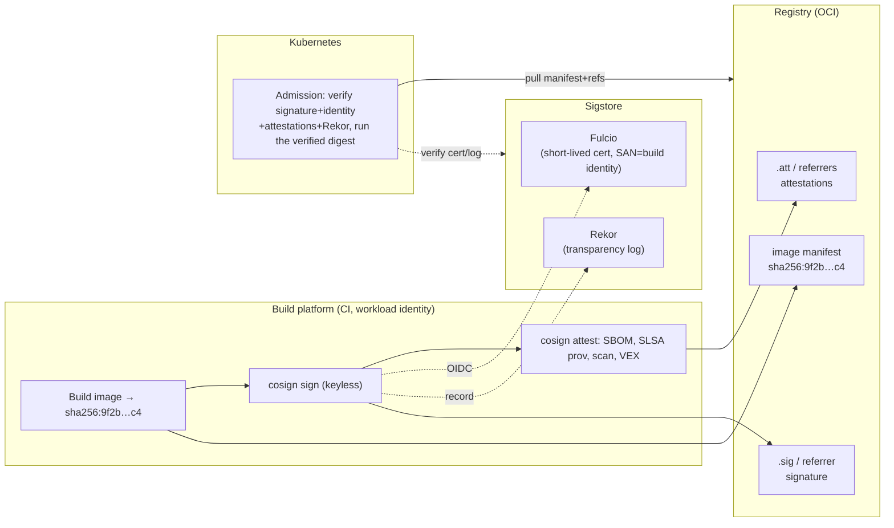
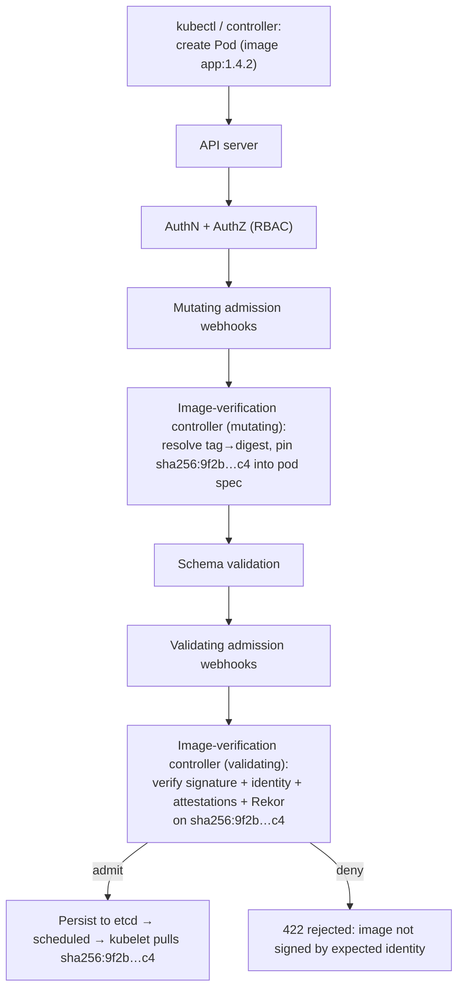
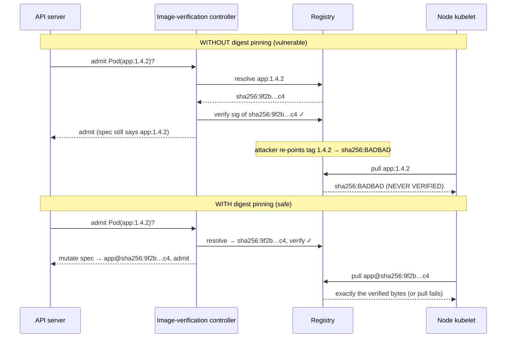
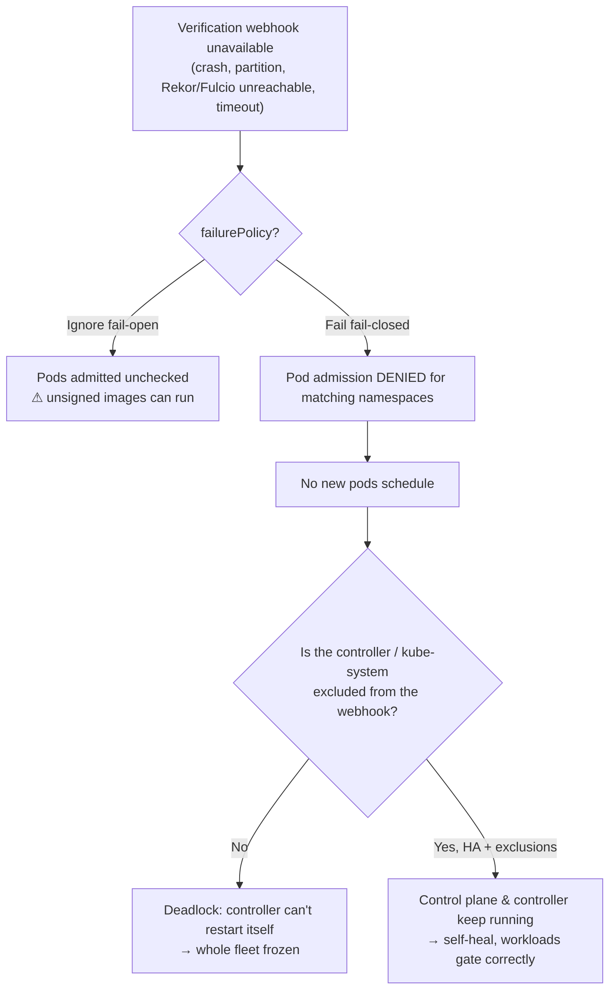
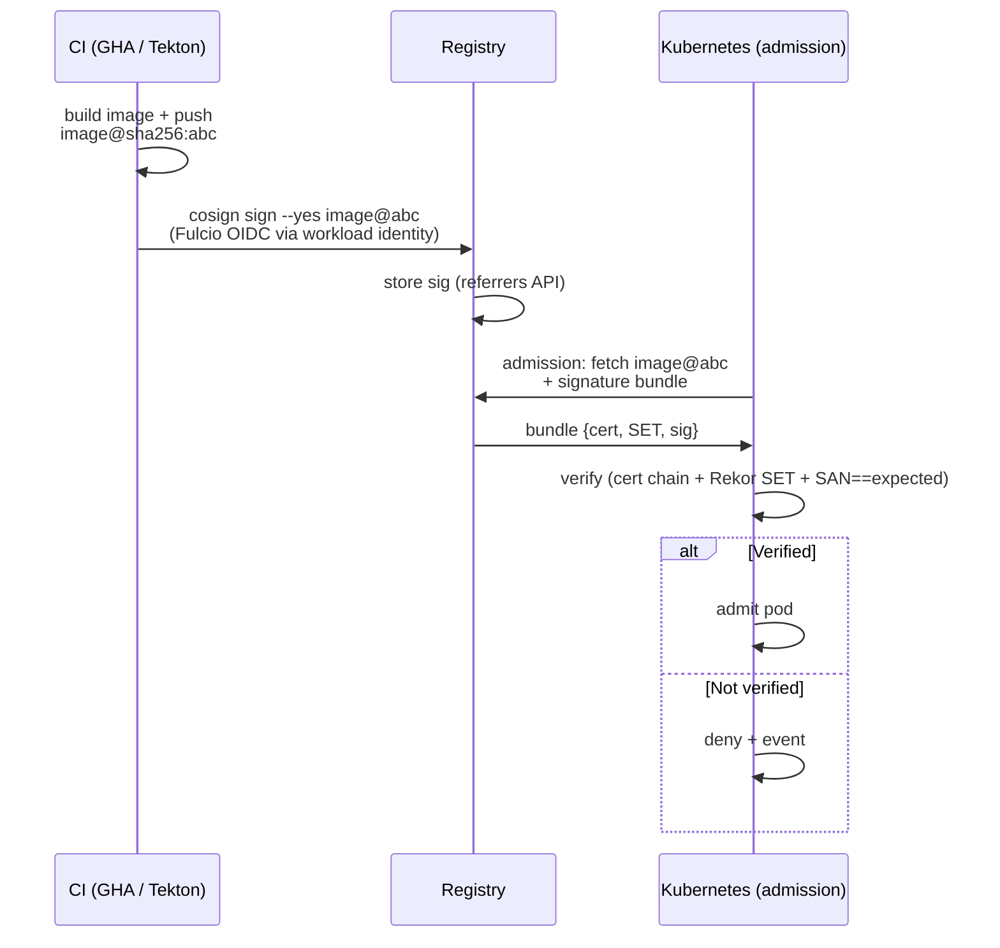
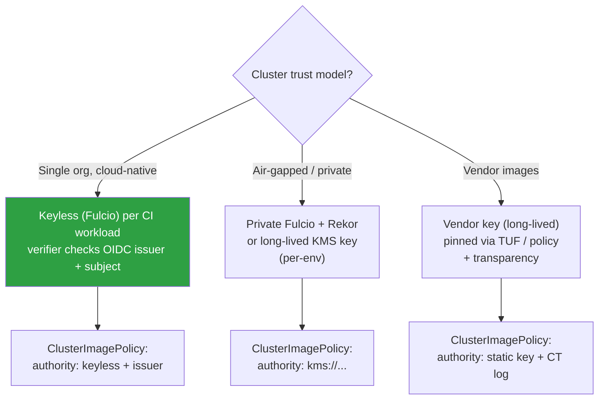
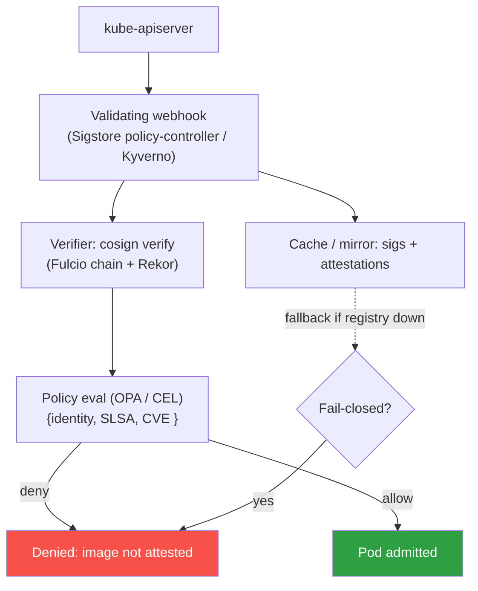

# Chapter 5 — Image Signing and Verification in Kubernetes

*What this chapter covers.* Book 5 built the general machinery of signing and attestation:
content-addressed digests (Chapter 1), Sigstore's cosign/Fulcio/Rekor architecture (Chapter 3),
keyless signing from workload identity (Chapter 4), transparency logs (Chapter 5), in-toto
attestations (Chapter 6), verification in practice (Chapter 8), and the design of
attestation-based deployment gates (Chapter 10). This chapter takes that machinery and points it
at one specific artifact — the **container image** — and one specific enforcement point — the
**Kubernetes cluster**. The signing half is a short recap: cosign signs an image *by digest* and
stores the signature next to the image in the registry (Book 6, Chapter 1's referrers model). The
verification half is the substance, because it is where the whole edifice earns its keep. A
signature nobody checks is theatre (Book 5, Chapter 8); the check that matters for containerized
backends happens at **admission**, the moment the API server decides whether a pod may run. This
chapter explains the Kubernetes admission flow, where image-verification controllers plug into
it, what they actually verify, the real controllers (Sigstore policy-controller, Kyverno,
Connaisseur, Ratify+Gatekeeper, Binary Authorization) with working policy, the
**verify-and-run-the-same-digest** imperative that closes the TOCTOU gap from Book 6, Chapter 1,
and the brutal operational reality that this webhook sits in the critical path of *every pod in
the fleet*. The policy language itself — Rego, CEL, Kyverno's engine — is Chapter 6; here we stay
on the image-verification aspect.
_All tool versions, spec references, and defaults verified as of early 2026._

Learning goals — after this chapter you should be able to:

- Recap how **cosign signs an image by digest** and stores the signature and attestations
  (SBOM, SLSA provenance, vuln scan, VEX) as OCI artifacts referencing that digest.
- Explain the **Kubernetes admission flow** (API server → mutating webhooks → schema validation →
  validating webhooks → etcd) and where image-verification controllers register.
- State exactly **what an admission-time image check verifies**: resolve tag→digest, verify
  signature and expected signer identity, verify required attestations, check Rekor inclusion.
- Explain the **verify-and-run-the-same-digest** rule and why a controller that verifies a tag
  but lets the kubelet re-resolve it later has closed nothing.
- Compare **policy-controller, Kyverno verifyImages, Connaisseur, Ratify+Gatekeeper, and Binary
  Authorization**, and write a working `ClusterImagePolicy` or Kyverno `verifyImages` rule.
- Reason about **fail-open vs fail-closed**, `failurePolicy`, namespace exclusions, HA, and why
  this webhook is **tier-0** — a down webhook can stop the whole fleet from scheduling.
- Design a **tiered rollout**: audit → enforce, strict policy for internal images, relaxed policy
  for third-party images, fleet-wide.

---

## Signing the image: a Book 5 recap, image-specific

You have seen this in Book 5, Chapter 3; the image-specific mechanics are small and worth stating
precisely because the verification side depends on them being exactly right.

An image's identity is its **manifest digest** — `sha256:...` over the manifest bytes (Book 6,
Chapter 1). A tag like `registry.example.com/app:1.4.2` is a mutable pointer; the digest is the
immutable thing. **Cosign signs the digest, never the tag.** When you run:

```bash
cosign sign registry.example.com/app@sha256:9f2b...c4
```

cosign does not modify the image. It computes a signature over a small **payload** that binds the
image digest (a `simplesigning` claim referencing `sha256:9f2b...c4`), and it *pushes the
signature back into the registry* as a separate OCI artifact that references the image by digest.
Two storage conventions exist, both covered in Book 6, Chapter 1:

- **The `.sig` tag convention (legacy).** The signature manifest is pushed to a derived tag
  `sha256-9f2b...c4.sig` in the same repository. Attestations go to `...c4.att`, SBOMs attached
  with `cosign attach sbom` to `...c4.sbom`. This works on any OCI registry, including old ones.
- **OCI 1.1 Referrers (current).** The signature manifest carries a `subject` field pointing at
  the image digest, and the registry's **Referrers API** lets a verifier list "everything that
  refers to `sha256:9f2b...c4`." This is cleaner — no tag-name games, garbage-collected with the
  image — and cosign uses it when the registry supports it (`--registry-referrers-mode oci-1-1`),
  falling back to the tag scheme otherwise (Book 3, Chapter 5).

The important invariant for verification: **the signature is addressed to a digest.** A verifier
that has the digest can find and check the signature; a verifier holding only a tag must first
resolve the tag to a digest, and *that resolution is the security-critical step* we return to
below.

### Keyless is the norm for CI-built images

For images built in CI, **keyless signing (Book 5, Chapter 4)** is the default, not an
optimization. The build job has a workload identity — a GitHub Actions OIDC token, a GitLab CI
JWT, a Google/AWS service-account token — and cosign exchanges that token with **Fulcio** for a
short-lived (≈10-minute) X.509 certificate whose Subject Alternative Name *is the build identity*:
the workflow ref, the repository, the issuer. cosign signs, records the certificate and signature
in **Rekor** (the transparency log, Book 5, Chapter 5), and throws the key away. No long-lived
signing key exists to steal or rotate (Book 5, Chapter 9). The command in a GitHub Actions job is
just:

```bash
cosign sign --yes \
  registry.example.com/app@sha256:9f2b...c4
# OIDC identity is picked up from the ambient GITHUB_TOKEN / id-token; Fulcio
# issues a cert whose SAN is:
#   https://github.com/example-org/app/.github/workflows/release.yml@refs/tags/v1.4.2
# and the entry lands in Rekor.
```

That SAN — the workflow file, the ref, the issuer — is precisely what the *cluster* will later
demand. The build platform's identity is the anchor of trust for the whole scheme (Book 4,
Chapter 10; Book 5, Chapter 4). Verification does not ask "is this signed?"; it asks "is this
signed **by the identity we expect to build this image**?"

### Signing attestations too

A signature says *this exact image was blessed by this identity*. An **attestation** (Book 5,
Chapter 6) says *this exact image has this property*, signed by an identity. The same
build platform that signs the image attaches, as signed attestations referencing the same digest:

- an **SBOM** (SPDX or CycloneDX — Book 3), so the cluster and downstream tooling know what is
  inside;
- **SLSA provenance** (Book 4, Chapter 3), the signed record of *how* and *where* the image was
  built — which builder, which source commit, which parameters;
- a **vulnerability-scan** attestation (Book 6, Chapter 4), the scan result at build time;
- optionally a **VEX** statement (Book 3, Chapter 6), asserting which known vulnerabilities are
  not exploitable in this image.

```bash
# SLSA provenance produced by the build, attached as a signed attestation:
cosign attest --yes --type slsaprovenance \
  --predicate provenance.json \
  registry.example.com/app@sha256:9f2b...c4

# SPDX SBOM as a signed attestation:
cosign attest --yes --type spdxjson \
  --predicate sbom.spdx.json \
  registry.example.com/app@sha256:9f2b...c4
```

The result is a **metadata bundle in the registry**, all hanging off the one digest: the image,
its signature, and one signed attestation per predicate type. This is the produce side of the
produce-and-verify loop (Book 4, Chapter 10). The cluster is where the loop closes.

### Who signs, and when

The answer is a design principle, not a preference: **the build platform signs at build time with
its own workload identity, automatically, for every image.** Signing is not a step an engineer
remembers to run; it is a stage of the paved-road pipeline (Book 4, Chapter 10) that no team opts
out of and none can forge, because the identity in the signature is the CI system's, minted fresh
per run and unavailable to humans. If signing is a manual afterthought, coverage is partial,
coverage gaps are exactly where malware lands, and the admission policy below cannot be set to
"require a signature" without breaking half the fleet. Automatic, paved-road signing is the
precondition for enforceable verification.



---

## Verifying in Kubernetes: admission control is the enforcement point

Here is the goal, stated as a negative because negatives are what policies enforce:
**Kubernetes must refuse to run a pod whose image is not signed by an expected identity, or lacks
the attestations we require.** Everything upstream — the signing, the attestations, the Rekor
entries — is inert until something *checks* it at the moment of deployment. In Book 5, Chapter 10
we called this the deployment gate. In a Kubernetes fleet the gate is **admission control**, and it
is the one place where enforcement is both **fleet-wide** and **non-bypassable**: it is not a CI
step a `git push --force` can skip, not a scanner a developer can silence, but a check the API
server itself performs before the object is ever persisted.

### The Kubernetes admission flow

When any client — `kubectl`, a Deployment controller creating a pod, an autoscaler — sends a
create/update request to the API server, the request passes through a fixed pipeline before the
object reaches etcd:

1. **Authentication** — who is the caller.
2. **Authorization** (RBAC) — may the caller do this.
3. **Mutating admission webhooks** — external HTTP callbacks that may *modify* the object
   (inject sidecars, set defaults, and — for our purposes — **rewrite an image tag to a digest**).
4. **Object schema validation** — the API server validates the (possibly mutated) object against
   the resource schema.
5. **Validating admission webhooks** — external HTTP callbacks that may *only accept or reject*
   the object; they cannot change it.
6. **Persist to etcd** — the object is stored, and controllers/kubelet act on it.

The two webhook phases are configured by `MutatingWebhookConfiguration` and
`ValidatingWebhookConfiguration` objects. Each names an endpoint (a Service in the cluster, or an
external URL), the resources/operations it intercepts (`rules`), which namespaces/objects
(`namespaceSelector`, `objectSelector`), a `timeoutSeconds` (max 30), and — the field that decides
your fleet's fate — a **`failurePolicy`** of `Ignore` (fail-open) or `Fail` (fail-closed).

**Image-verification controllers plug in at both phases.** They register a **validating** webhook
to do the actual verification (accept the pod only if its images verify) and, crucially, a
**mutating** webhook to *resolve the tags they verified to digests and pin them into the pod
spec*. The mutating phase runs first, so by the time the validating webhook and later the kubelet
see the pod, the image references are digests. We will see why that ordering is not incidental but
load-bearing.



### What the controller actually verifies

Verification at admission is Book 5, Chapter 8 applied to an image. In order:

1. **Resolve the image reference to a digest.** If the pod spec says `app:1.4.2`, the controller
   asks the registry "what digest does `1.4.2` point to *right now*?" and gets `sha256:9f2b...c4`.
   Everything after this operates on the digest. **The controller must run this resolution once
   and then verify and pin that same digest** — the TOCTOU point of the next section.
2. **Verify the signature and the expected signer identity.** The controller fetches the
   signature (via referrers or the `.sig` tag), verifies the cryptographic signature over the
   digest, and — for keyless — verifies the Fulcio certificate: that it chains to the Fulcio root
   the cluster trusts, and that its SAN matches the **expected identity**. In cosign terms this is
   `--certificate-identity` and `--certificate-oidc-issuer` (Book 5, Chapter 4). "Signed" is not
   enough; "signed by `https://github.com/example-org/app/.github/workflows/release.yml@refs/tags/*`
   via `https://token.actions.githubusercontent.com`" is the check. An attacker who signs a
   malicious image with *their own* keyless identity produces a perfectly valid signature under
   the *wrong* identity, which the policy rejects.
3. **Verify required attestations.** For each required predicate type (SLSA provenance, SBOM,
   scan), fetch the attestation, verify *its* signature and signer identity the same way, and
   optionally evaluate a predicate policy over its contents (e.g., provenance's `builder.id` is
   our builder; SLSA build level ≥ 3). Missing or wrongly-signed attestation → deny.
4. **Check Rekor inclusion.** For keyless, the short-lived certificate has long since expired by
   the time the pod is admitted. The proof that the signature was created *while the certificate
   was valid* is the **Rekor** entry and its signed timestamp (Book 5, Chapter 5). The controller
   verifies the Rekor inclusion proof / signed entry timestamp against the log's public key. This
   is what makes keyless verification sound offline-of-the-signer: the log, not a live key, is the
   witness. A private Sigstore deployment supplies its own Fulcio/Rekor roots — in policy-controller
   via a `TrustRoot` custom resource, in cosign via a TUF root (Book 5, Chapter 7).

Only if all four hold does the controller admit — and it admits the pod **running the digest it
just verified.**

---

## The digest-pinning imperative: verify-and-run the same bytes

This is the single most important idea in the chapter, and it is where naïve implementations
silently fail. Recall the mutable-tag / immutable-digest TOCTOU problem from Book 6, Chapter 1:

> A **time-of-check-to-time-of-use** gap opens whenever you *verify* one thing and *use* another.

A pod spec that references `app:1.4.2` is a reference to *whatever `1.4.2` points to at pull
time*. Suppose the controller does this: sees `app:1.4.2`, resolves it to `sha256:9f2b...c4`,
verifies that digest, admits the pod — and leaves the pod spec saying `app:1.4.2`. The pod is
persisted with a **tag**. Later, the kubelet on the node resolves `app:1.4.2` **again** to pull
it. Between the controller's resolution and the kubelet's pull, an attacker with push access (or a
compromised CI, or a registry-account takeover — Book 6, Chapter 2) re-points the tag `1.4.2` to
`sha256:BADBAD...`. The kubelet pulls and runs `BADBAD`, which was **never verified**. The check
happened; the use happened on different bytes. Signing accomplished nothing.

The defense is a rule with two halves, and **both** are mandatory:

1. **Verify by digest.** Resolve tag→digest once, verify *that digest*.
2. **Run the verified digest.** Mutate the pod spec so the image reference is
   `app@sha256:9f2b...c4` — the exact digest verified. Now there is no second resolution: the
   kubelet pulls by digest, the registry is content-addressed, and the bytes it gets are the bytes
   the controller checked, or the pull fails.

This is why image-verification controllers register a **mutating** webhook and not only a
validating one, and why the mutating phase running *before* validation matters: the controller
pins the digest, then verifies the pinned digest, then the pod is stored with the digest.
**policy-controller, Kyverno (`mutateDigest: true`), and Connaisseur all do this tag→digest
mutation.** A validation-only integration that admits pods still bearing tags — the default shape
of a plain Gatekeeper-plus-external-data setup that lacks a mutation step — leaves the TOCTOU gap
wide open. When you evaluate a tool, "does it mutate the pod spec to the verified digest?" is a
gating question, not a nice-to-have.



Deploy manifests should already pin digests — a paved-road GitOps pipeline (Book 6, Chapter 7)
resolves tags to digests at render time, so the manifest that lands in git says
`app@sha256:...`. The admission controller is the *enforcement backstop*: it guarantees the
running digest is a verified one **even when** a manifest slipped through with a bare tag, and it
guarantees the tag was not moved between render and run. Belt and braces: pin in the pipeline,
enforce at admission.

---

## The tools

Several controllers implement admission-time image verification. They differ in policy model,
whether they mutate to digest, and how they source verification results. The policy-*engine*
comparison (OPA vs Kyverno vs CEL) is Book 6, Chapter 6; here we compare them **as
image-verification controllers.**

| Tool | Kind | Policy object | Keyless | Attestations | Mutates tag→digest | Notes |
|---|---|---|---|---|---|---|
| **Sigstore policy-controller** | Validating + mutating webhook | `ClusterImagePolicy` (CRD) | Yes (native) | Yes | **Yes** | The Sigstore project's own controller; namespace opt-in label |
| **Kyverno** | Validating + mutating webhook | `ClusterPolicy` `verifyImages` | Yes | Yes | **Yes** (`mutateDigest`) | General policy engine; also does everything in Ch 6 |
| **Connaisseur** | Mutating webhook | Helm values / CRD config | Yes | Notary v1/v2, cosign | **Yes** | Multi-validator; pins digests |
| **Ratify + Gatekeeper** | Gatekeeper (OPA) + external data | Rego `Constraint` + Ratify config | Yes | Yes | **No** (validation only) | Ratify is a verification *engine* feeding OPA; digest mutation is a gap |
| **Google Binary Authorization** | GKE control-plane admission | Cloud policy + attestors | Yes (Sigstore attestors) | Attestation-based | Managed | No webhook you run; also continuous validation |

### Sigstore policy-controller and `ClusterImagePolicy`

policy-controller is the Sigstore project's admission controller. It enforces only in namespaces
labeled `policy.sigstore.dev/include: "true"` (an explicit opt-in so you can roll it out namespace
by namespace), and it resolves image references to digests via its mutating webhook. Policy lives
in the **`ClusterImagePolicy`** CRD: match images by glob, require signatures from keyless
identities (or keys), require attestations, and set a `mode` of `enforce` or `warn`.

Within one policy, `authorities` are **OR'd** — any one satisfied admits the image. Across multiple
policies that match the same image, **all** must be satisfied (AND). That AND-across-policies rule
is what makes tiering work: scope globs so that internal images match the strict policy and
third-party images match a separate, relaxed one.

Here is a complete, strict policy for internal images: it requires a **keyless signature from a
specific GitHub Actions build workflow**, an **SLSA provenance** attestation and an **SPDX SBOM**
attestation from the same identity, with Rekor checked:

```yaml
apiVersion: policy.sigstore.dev/v1beta1
kind: ClusterImagePolicy
metadata:
  name: internal-images-require-signed-provenance
spec:
  mode: enforce
  images:
    - glob: "registry.example.com/apps/**"
  authorities:
    - name: build-platform-keyless
      keyless:
        url: https://fulcio.sigstore.dev
        identities:
          - issuer: https://token.actions.githubusercontent.com
            subjectRegExp: "^https://github.com/example-org/[^/]+/\\.github/workflows/release\\.yml@refs/tags/v.*$"
      ctlog:
        url: https://rekor.sigstore.dev
      attestations:
        - name: must-have-slsa-provenance
          predicateType: slsaprovenance
          policy:
            type: cue
            data: |
              // provenance must name our builder and SLSA build level >= 3
              predicate: {
                builder: id: "https://github.com/example-org/build-platform/.github/workflows/release.yml@refs/heads/main"
              }
        - name: must-have-sbom
          predicateType: spdxjson
```

Notes on accuracy: `subjectRegExp`/`subject` and `issuer`/`issuerRegExp` are the real fields under
`keyless.identities`; `predicateType` accepts the short names (`slsaprovenance`, `spdxjson`,
`vuln`, `custom`) or a full predicate-type URI; the per-attestation `policy` block evaluates
**CUE** or **Rego** over the predicate. `ctlog.url` is where Rekor inclusion is checked. For a
private Sigstore stack, a `TrustRoot` resource supplies your own Fulcio/Rekor/CT roots and you
drop the public `url`s.

For **third-party images** you cannot demand your build identity — nobody at Docker Hub signs with
your workflow. A separate, relaxed policy handles them, either verifying the *vendor's* signature
or (pragmatically, during rollout) allowing them via a `static` authority while a scan-only gate
covers them elsewhere:

```yaml
apiVersion: policy.sigstore.dev/v1beta1
kind: ClusterImagePolicy
metadata:
  name: third-party-images-allow
spec:
  mode: enforce
  images:
    - glob: "index.docker.io/**"
    - glob: "registry.k8s.io/**"
  authorities:
    - name: allow-external
      static:
        action: pass   # do not require OUR identity on upstream images; gate them via scanning instead
```

### Kyverno `verifyImages`

Kyverno is a general Kubernetes policy engine (broad coverage in Book 6, Chapter 6); its
image-verification feature is the **`verifyImages`** rule. It mutates the image to its digest by
default (`mutateDigest: true`) and verifies the digest (`verifyDigest: true`). Attestors describe
who must have signed; `attestations` describe required predicates with optional CEL/JMESPath
conditions over their contents.

```yaml
apiVersion: kyverno.io/v1
kind: ClusterPolicy
metadata:
  name: verify-internal-images
spec:
  validationFailureAction: Enforce      # Audit during rollout, then Enforce
  webhookTimeoutSeconds: 30
  failurePolicy: Fail                    # fail-closed — see operational section
  background: false
  rules:
    - name: require-keyless-signature-and-provenance
      match:
        any:
          - resources:
              kinds: [Pod]
      verifyImages:
        - imageReferences:
            - "registry.example.com/apps/*"
          mutateDigest: true             # pin the verified digest into the pod spec
          verifyDigest: true
          required: true
          attestors:
            - count: 1
              entries:
                - keyless:
                    subject: "https://github.com/example-org/app/.github/workflows/release.yml@refs/tags/*"
                    issuer: "https://token.actions.githubusercontent.com"
                    rekor:
                      url: https://rekor.sigstore.dev
          attestations:
            - type: https://slsa.dev/provenance/v1
              attestors:
                - entries:
                    - keyless:
                        subject: "https://github.com/example-org/app/.github/workflows/release.yml@refs/tags/*"
                        issuer: "https://token.actions.githubusercontent.com"
                        rekor:
                          url: https://rekor.sigstore.dev
              conditions:
                - all:
                    - key: "{{ buildDefinition.externalParameters.workflow.repository || '' }}"
                      operator: Equals
                      value: "https://github.com/example-org/app"
```

The `attestations[].conditions` block is where you assert facts *about* the provenance — the
source repo, the builder, the SLSA level — using Kyverno's expression engine over the predicate
JSON. `attestors[].count` lets you require *m-of-n* signers. As with policy-controller, the subject
pattern is the load-bearing part: it pins the *identity*, so an image signed by anyone else fails.

The corresponding verify command a developer would run locally to reproduce what the cluster does:

```bash
cosign verify \
  --certificate-identity-regexp "^https://github.com/example-org/app/\.github/workflows/release\.yml@refs/tags/v.*$" \
  --certificate-oidc-issuer https://token.actions.githubusercontent.com \
  registry.example.com/apps/app@sha256:9f2b...c4

cosign verify-attestation --type slsaprovenance \
  --certificate-identity-regexp "^https://github.com/example-org/app/.*$" \
  --certificate-oidc-issuer https://token.actions.githubusercontent.com \
  registry.example.com/apps/app@sha256:9f2b...c4
```

### Connaisseur, Ratify + Gatekeeper, Binary Authorization

**Connaisseur** is a mutating admission controller focused squarely on image verification. It
supports multiple validators (cosign/Sigstore, Notary v1 and v2) and **mutates image references to
digests**, so it closes the TOCTOU gap by design. It is a good fit when you want a single-purpose,
opinionated verifier rather than a general policy engine.

**Ratify + Gatekeeper** is a two-part design worth understanding because it exposes an
architectural seam. **Gatekeeper** is the OPA-based validating admission controller; **Ratify** is
a *verification engine* that plugs into Gatekeeper as an **external data provider**. When a pod is
admitted, Gatekeeper's Rego constraint calls out to Ratify with the image references; Ratify pulls
signatures/SBOMs/attestations, verifies them (cosign, Notary, license/vuln reports via verifier
plugins), and returns structured results; the Rego constraint decides admit/deny on those results.
The strength is composability — Ratify is a general artifact-verification engine and OPA is a
general policy engine, both reusable. The **weakness for our purposes**: Gatekeeper is a
*validating* controller and does not mutate the pod spec, so a plain Ratify+Gatekeeper deployment
**verifies a digest but can admit a pod still bearing a tag** unless you add a separate mutation
mechanism. If you choose this stack, pair it with a digest-pinning mutator (in the pipeline and/or
a mutating webhook); do not assume validation alone closed the gap.

**Google Binary Authorization** (GKE, with analogues on other clouds) moves the gate into the
**managed control plane** rather than a webhook you operate. You define attestors — each backed by a
KMS key or, increasingly, by Sigstore/cosign identities — and a policy that says "images admitted
to this cluster must carry attestations from these attestors." The GKE admission controller
enforces it, and **continuous validation** re-checks already-running pods and flags ones that fall
out of policy (e.g., an attestation revoked after deploy). The trade-off is the usual managed one:
less operational burden and no webhook of your own in the critical path, at the cost of cloud
lock-in and a policy model narrower than Kyverno/OPA. For a GKE-only fleet it is often the pragmatic
choice; for multi-cloud, a portable webhook (policy-controller/Kyverno) applied identically
everywhere wins on consistency (Book 8, Chapter 4).

---

## Operational realities: this webhook is tier-0

An image-verification webhook is not an ordinary integration. It sits in the admission path of
**every pod in the cluster**. That fact drives every operational decision below.

### Fail-open vs fail-closed

The `failurePolicy` decides what happens when the webhook cannot be reached or times out —
Fulcio/Rekor roots unreachable, the controller pods down, a network partition, a 31-second
registry call against a 30-second timeout:

- **`failurePolicy: Ignore` (fail-open).** Admission proceeds *as if the check passed*. Availability
  is preserved; **security is not** — during any outage, unsigned and unverified images sail
  through, which is precisely when a clever attacker would arrange for the webhook to be "busy"
  (Book 5, Chapters 8 and 10).
- **`failurePolicy: Fail` (fail-closed).** Admission is *denied* when the webhook is unreachable.
  Security is preserved; **availability is at risk** — and the risk is not subtle.

The fail-closed failure mode is genuinely dangerous and specific to this being tier-0: **if the
verification webhook is down and set to fail-closed, no pod that matches its selector can be
scheduled — including, potentially, the controller's own pods and the platform components needed to
recover.** You can deadlock a cluster: the webhook is unhealthy, so it can't admit the replacement
webhook pod, so it stays unhealthy. A crash loop in the controller becomes a fleet-wide inability
to schedule anything.



The resolution is not to pick a side but to **engineer the fail-closed posture so its blast radius
is bounded**:

- **Exclude the control plane and the controller itself.** `kube-system`, the controller's own
  namespace, and other bootstrap namespaces must be exempted via `namespaceSelector` /
  `objectSelector`, so a broken webhook can never block its own recovery or core components.
  policy-controller's opt-in-by-label model gives this for free (only labeled namespaces are
  gated); with Kyverno/Gatekeeper you set the selectors explicitly.
- **Run the controller HA.** Multiple replicas across nodes/zones with a
  `PodDisruptionBudget`, so a single node or rollout can't take the webhook to zero.
- **Bound the timeout and the dependencies.** Keep `timeoutSeconds` modest, cache verification
  results (Kyverno's `useCache`), and consider the availability of Rekor/Fulcio — a public-Sigstore
  dependency on the hot path is an external SLA you don't control; a private/mirror deployment or
  aggressive caching de-risks it.

The honest recommendation: **fail-closed, with rigorous exclusions and HA**, is the target for
production-tier namespaces, because fail-open verification is only slightly better than no
verification (it's off exactly when you need it). But you reach fail-closed *after* the rollout
below proves the policy is correct and the controller is reliable — flipping straight to
fail-closed on day one is how you learn about a missing exclusion the hard way.

### Bootstrapping and exclusions

You cannot require *your* build identity on images you didn't build. The cluster runs plenty:

- **System / infrastructure images** — `registry.k8s.io/*` (kube-proxy, CoreDNS, CSI drivers),
  the CNI, monitoring agents. Signed by *their* projects, not you.
- **The verification controller itself**, and the rest of the platform's bootstrap set.
- **Third-party application images** — databases, message brokers, vendor sidecars — signed (if at
  all) by *their* vendors.

The answer is **tiered policy** (Book 5, Chapter 10): different rules for different image classes,
scoped by registry glob. Internal images (`registry.example.com/apps/**`) get the strict
keyless-plus-provenance policy. Upstream images get a policy that verifies the *vendor's* signature
where one exists (many CNCF projects now sign keyless; you can pin *their* GitHub identity the same
way), or, where no signature exists, are gated by **scanning** instead (Book 6, Chapter 4) and
exempted from signature requirements. System namespaces are excluded outright. The taxonomy is
"trust boundary": *we built it* → demand our identity; *a vendor built it* → demand theirs or scan
it; *the platform needs it to boot* → exempt.

### Rollout: audit before enforce

Never flip an image-verification policy straight to enforce across a live fleet. The failure mode
is not subtle — it is *every unsigned image in the cluster is suddenly unschedulable* — and the
first thing you'll discover is how much of your fleet was never actually signed. The rollout
mirrors Book 5, Chapter 10 and Book 1, Chapter 10:

1. **Audit / warn mode.** Deploy the policy in `mode: warn` (policy-controller) or
   `validationFailureAction: Audit` (Kyverno). It **logs would-be-denials and emits events but
   admits everything.** Run it long enough to see the true state: which images fail, which teams
   are unsigned, which upstream images lack policy. This is your coverage gap, made visible without
   an outage.
2. **Fix coverage.** Get the build platform signing every internal image (Book 4, Chapter 10);
   write the tiered upstream policy; add exclusions. Watch the would-be-denials drop toward zero.
3. **Enforce per namespace / per tier.** Move low-risk, well-covered namespaces to enforce first,
   then production. policy-controller's opt-in label makes this literally namespace-by-namespace.
   Keep `failurePolicy: Ignore` until the controller has proven reliable under enforce, *then* move
   the gated namespaces to `Fail`.
4. **Only then, fleet-wide fail-closed** for tier-0/tier-1 namespaces, with the exclusions and HA
   above.

Audit mode is not a formality; it is the difference between "we turned on verification" and "we
took down every deploy in the company at 2pm."

### Performance and availability at scale

Every pod creation — every deploy, every scale-up, every node drain that reschedules pods, every
CronJob firing — calls this webhook. At fleet scale that is a high, bursty request rate against a
service that does registry round-trips and cryptographic verification. Consequences to design for:

- **Cache aggressively.** The same digest is admitted thousands of times; verify it once and cache
  the result (with a bounded TTL and cache-key that includes the *digest*, so a moved tag can't
  serve a stale allow). Kyverno's image-verification cache and policy-controller's in-memory
  caching exist for exactly this.
- **Keep verification off slow external dependencies on the hot path** where possible — mirror or
  cache Fulcio/Rekor roots; the roots change rarely and don't need a live fetch per admission.
- **Budget the timeout against the failurePolicy.** A 30-second timeout with fail-closed means a
  slow registry can start denying pods; a too-short timeout with a genuinely slow verify means
  spurious denials. Tune with the cache in mind.
- **Scale the controller with the fleet.** It is a tier-0 service; give it the SLO, the alerting,
  and the capacity of one. A p99 admission-latency alert on this webhook is not optional.

---

## Distributed-systems lens

Admission-based image verification is the **fleet-wide, non-bypassable enforcement point** the
whole supply chain has been building toward (Book 5, Chapter 10), realized at the Kubernetes
boundary. A few properties make it the right place for the gate:

- **One policy, all clusters, no bypass.** Unlike a CI check (skippable, per-repo, per-team), the
  API server *always* runs admission. A single `ClusterImagePolicy` or Kyverno policy, distributed
  identically to every cluster, guarantees that no service anywhere in the fleet runs an unsigned or
  unverified image — regardless of which team shipped it, which pipeline built it, or whether they
  meant to comply. Enforcement lives below the layer where humans make mistakes.
- **It is tier-0, and you must treat it as such.** Being in every pod's critical path is exactly
  what gives it its power and exactly what makes it dangerous: HA, careful `failurePolicy`, and
  ruthless exclusions of the control plane are the price of admission (literally). A gate this
  strong that is engineered like an ordinary microservice will one day freeze your fleet.
- **The trust anchor is the build platform's identity.** The policy doesn't trust images; it trusts
  a *signer* — the CI workflow's keyless identity (Book 4, Chapter 10; Book 5, Chapter 4). This is
  why paved-road, automatic, per-build signing is a precondition, not a nicety: the cluster can only
  demand an identity that the build reliably produces.
- **Verify-and-run-by-digest closes the TOCTOU gap fleet-wide.** The mutation-to-digest step turns
  every admitted pod's mutable tag into the immutable bytes that were verified (Book 6, Chapter 1),
  across the whole fleet at once. A tool that verifies but doesn't pin leaves the gap open on every
  cluster.
- **Tiered policy models the real world.** Fleets run a mix of first-party (strict: our identity +
  provenance) and third-party (relaxed: vendor signature or scan-only) images; the tiering (Book 5,
  Chapter 10) is what lets a single non-bypassable gate coexist with images you didn't build.
- **The loop closes here.** The controller *consumes* exactly the signatures and attestations the
  paved-road build *produced* (Book 4, Chapter 10) — produce-and-verify, closed at the cluster
  boundary. Everything upstream is inert until this check runs, and this check is inert unless the
  upstream produced what it demands. The two halves only have value together.
- **Multi-cluster policy distribution is its own problem.** Getting the *same* policy to hundreds of
  clusters, versioned and drift-free, is a GitOps/governance concern (Book 6, Chapter 7; Book 8,
  Chapter 4). A gate is only fleet-wide if its policy is; a cluster running last quarter's policy is
  a hole in the fleet.

The one-line synthesis: **signing is a claim, admission is the enforcement, and the digest is what
ties the claim to the bytes that run.** Book 5 taught you to make the claim; this chapter is how a
Kubernetes fleet refuses to run anything that can't back it up.

---

### Cosign sign and verify with workload identity



### Signing key strategy for Kubernetes



### Admission integration architecture



## Key takeaways

- **Cosign signs an image by its manifest digest**, not its tag, and stores the signature (and
  SBOM/SLSA-provenance/scan/VEX attestations) as OCI artifacts referencing that digest — via OCI
  1.1 referrers or the legacy `.sig`/`.att` tag scheme (Book 6, Chapter 1). For CI images, **keyless
  signing from the build's workload identity** (Book 5, Chapter 4) is the norm; the certificate's
  SAN *is* the build identity the cluster will later demand.
- **Signing without verification is theatre.** The enforcement point in Kubernetes is **admission
  control**: an image-verification controller registers validating and mutating webhooks; on pod
  create it resolves the image to a digest, verifies signature + expected signer identity + required
  attestations + Rekor inclusion, and admits or denies.
- **Verify-and-run the same digest.** The controller must resolve tag→digest *once*, verify that
  digest, and **mutate the pod spec to that digest** so the kubelet runs the exact verified bytes.
  A controller that verifies a tag but doesn't pin it leaves the Book 6, Chapter 1 **TOCTOU** gap
  open — an attacker moves the tag between check and pull. policy-controller, Kyverno
  (`mutateDigest`), and Connaisseur pin; **Ratify+Gatekeeper (validation-only) does not** — pair it
  with a mutator.
- **The webhook is tier-0.** It is in every pod's admission path. `failurePolicy: Ignore` is
  fail-open (unsigned images run during any outage); `failurePolicy: Fail` is fail-closed (a down
  webhook can freeze all scheduling and even deadlock its own recovery). Target **fail-closed with
  rigorous control-plane/self exclusions, HA, PDBs, caching, and bounded timeouts**.
- **Tier the policy.** Strict keyless-plus-provenance for internal images (`registry.example.com/**`
  matched to your build workflow's identity); relaxed policy for third-party images (vendor
  signature or scan-only — you can't demand your identity on upstream); exempt system namespaces.
- **Roll out audit-first.** Deploy in `warn`/`Audit` to surface the real coverage gap without an
  outage, fix signing coverage, then enforce per namespace/tier, then flip gated namespaces to
  fail-closed. Never flip straight to enforce fleet-wide.
- **Distributed-systems payoff:** one policy across all clusters gives non-bypassable, fleet-wide
  guarantees that nothing unsigned/unverified runs; the trust anchor is the build platform's
  identity; verify-and-run-by-digest closes TOCTOU everywhere at once; and the controller consuming
  what the paved-road build produced closes the produce-and-verify loop at the cluster boundary.

---

## Further reading

- **Sigstore policy-controller** — the `ClusterImagePolicy` CRD, keyless/key authorities,
  attestation policies (CUE/Rego), `TrustRoot`, and tag→digest resolution.
  https://docs.sigstore.dev/policy-controller/overview/
- **Kyverno — Verify Images** — `verifyImages` rules, `mutateDigest`/`verifyDigest`, attestors and
  attestations, keyless and key-based verification.
  https://kyverno.io/docs/writing-policies/verify-images/
- **cosign** — `sign`, `attest`, `verify`, `verify-attestation`, `--certificate-identity` /
  `--certificate-oidc-issuer`, referrers vs tag storage. https://docs.sigstore.dev/cosign/
- **Kubernetes — Dynamic Admission Control** — mutating/validating webhooks, `failurePolicy`,
  selectors, timeouts, ordering.
  https://kubernetes.io/docs/reference/access-authn-authz/extensible-admission-controllers/
- **Ratify** — artifact verification as a Gatekeeper external-data provider; verifiers for cosign,
  Notary, SBOM/scan. https://ratify.dev/docs/
- **OPA Gatekeeper** — the OPA-based validating admission controller and external data.
  https://open-policy-agent.github.io/gatekeeper/website/docs/
- **Connaisseur** — admission controller for image-signature verification (cosign, Notary), with
  digest pinning. https://sse-secure-systems.github.io/connaisseur/
- **Google Binary Authorization** — attestation-based admission and continuous validation on GKE,
  including Sigstore attestors. https://cloud.google.com/binary-authorization/docs
- **OCI Distribution Specification v1.1 — Referrers API** — how signatures/attestations attach to
  an image by digest (Book 6, Chapter 1). https://github.com/opencontainers/distribution-spec
- **SLSA v1.0 — Provenance** — the provenance predicate an admission policy inspects (Book 4,
  Chapter 3). https://slsa.dev/spec/v1.0/provenance
