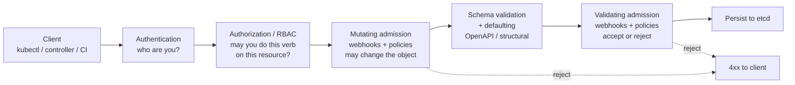
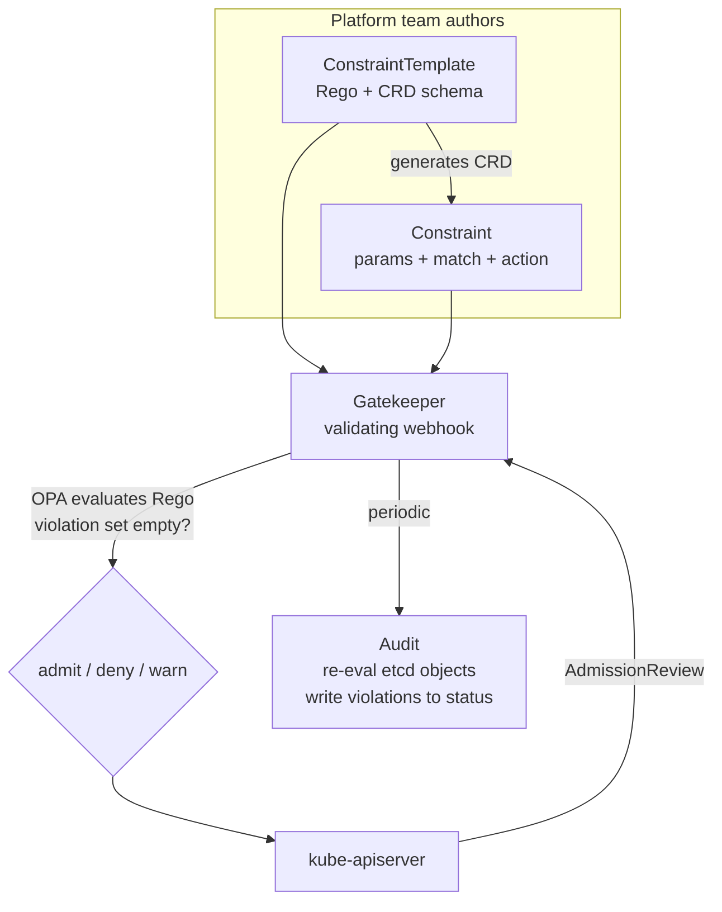
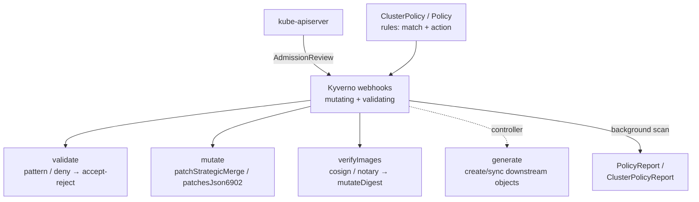
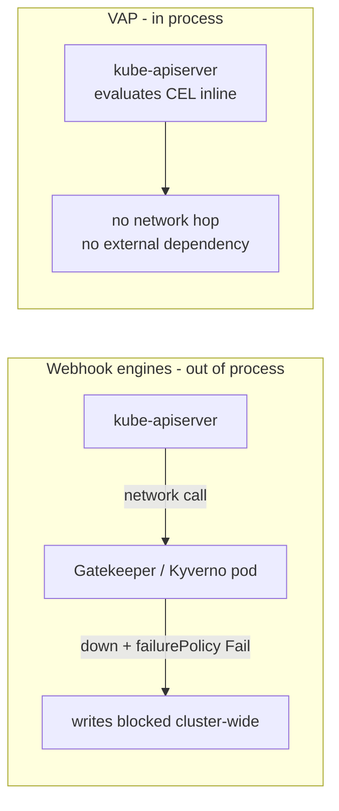

# Chapter 6 — Admission Control and Policy Engines: OPA and Kyverno

*What this chapter covers.* The previous chapter pointed one specific mechanism — Kubernetes
admission control — at one specific problem — image signature verification (Book 6, Chapter 5 —
Image Signing and Verification in Kubernetes). This chapter zooms back out and treats admission
control *as a general enforcement substrate*: the last-chance-before-persistence hook where the
API server hands every proposed object to your code and asks "should this be allowed, and does it
need changing first?" It is the machinery behind image verification, but also behind approved-registry
enforcement (Book 6, Chapter 2 — Registries), base-image policy (Book 6, Chapter 3 — Base Images),
digest pinning (Book 6, Chapter 1 — Container Images), workload hardening, required ownership
metadata, and the deployment gates of Book 5, Chapter 10 — Attestation-Based Deployment Gates.
We cover the admission request lifecycle in precise detail, then the three policy engines that
matter in 2026 — **OPA/Gatekeeper** (Rego), **Kyverno** (YAML), and in-tree **ValidatingAdmissionPolicy**
(CEL) — with real, working policy for each; the catalogue of supply-chain policies worth enforcing;
and the hard operational reality that a webhook-based policy engine sits in the critical path of
*every write to the cluster* and can, if you get it wrong, wedge the whole control plane.

Learning goals — after this chapter you should be able to:

- Trace a write request through the API server — **authentication → authorization → mutating
  admission → schema validation → validating admission → etcd** — and say exactly why admission is
  the policy enforcement point.
- Explain **mutating vs validating admission webhooks**: what each may do, why mutating runs first,
  and the meaning of `failurePolicy`, `timeoutSeconds`, `namespaceSelector`/`objectSelector`,
  `matchPolicy`, and `reinvocationPolicy`.
- Write and read policy in **all three engines**: a Gatekeeper `ConstraintTemplate` + `Constraint`
  in Rego, a Kyverno `ClusterPolicy` in YAML, and a `ValidatingAdmissionPolicy` in CEL — and choose
  the right one for a given rule.
- Enumerate the **supply-chain policies** worth enforcing at admission and map each to the book that
  produced the evidence it consumes.
- Run a **safe rollout**: audit/warn before enforce, `failurePolicy` and HA tuning, control-plane
  exclusions, policy exceptions with expiry, CI testing of policy, and GitOps distribution across a
  fleet.
- Reason about the engine as a **tier-0, in-critical-path dependency** and why in-tree VAP changes
  that risk calculus.

---

## Where admission sits: the API request lifecycle

Every mutation to cluster state — `kubectl apply`, a controller reconciling, a CI deploy — is an
HTTP request to the kube-apiserver. Before those bytes become a row in etcd, the request passes
through a fixed pipeline. Admission is the last stage, and its position is the whole point.



Read the ordering carefully, because policy correctness depends on it:

1. **Authentication** establishes *who* the caller is — a user, a group, a ServiceAccount. It does
   not look at the object.
2. **Authorization (RBAC, and Node/ABAC/webhook authorizers)** decides whether that identity may
   perform this *verb* (`create`, `update`, `delete`, `patch`) on this *resource kind* in this
   *namespace*. RBAC is coarse: it reasons about verbs and resources, never about the *contents* of
   the object. RBAC can say "this ServiceAccount may create Pods." It cannot say "…but only Pods
   whose images come from `registry.example.com` and run as non-root." That gap is exactly what
   admission fills.
3. **Mutating admission** runs. Registered mutating webhooks and (newer) mutating policies may
   *change* the incoming object — inject a sidecar, set a default, pin a tag to a digest (Book 6,
   Chapter 5), add a label.
4. **Object schema validation and defaulting** run *after* mutation. The (possibly mutated) object
   is validated against the resource's OpenAPI/structural schema and API defaults are applied. This
   is why a mutating webhook must emit a patch that still validates — you cannot mutate an object
   into something the schema rejects.
5. **Validating admission** runs last. Validating webhooks and validating policies get the final,
   mutated, schema-valid object and may only say **yes** or **no** (optionally with warnings). They
   cannot change it.
6. If nothing rejected it, the object is **persisted to etcd** and becomes real.

Admission is the enforcement point because it is the **last checkpoint before the object exists**,
and the first checkpoint that can reason about the object's *content* rather than merely the
caller's identity. Authentication and authorization gate the *actor*; admission gates the *artifact*.
A policy such as "no image may run unless it is signed by our build identity" is a statement about
the object's contents and is therefore, structurally, an admission concern. There is nowhere else
in the pipeline it can live.

One subtlety that trips people up: admission fires on the API path, not the kubelet path. If an
object already in etcd violates a newly added policy, admission never re-examines it — admission
only sees *writes*. Catching pre-existing violations is the job of **audit/background scanning**
(discussed below), not the admission webhook.

### Built-in admission controllers and Pod Security Admission

Before any of your webhooks run, a chain of **compiled-in admission controllers** executes inside
the API server: `NamespaceLifecycle`, `LimitRanger`, `ServiceAccount`, `ResourceQuota`,
`DefaultStorageClass`, `MutatingAdmissionWebhook`, `ValidatingAdmissionWebhook`, and a few dozen
others, enabled via `--enable-admission-plugins`. Two of these plugins — `MutatingAdmissionWebhook`
and `ValidatingAdmissionWebhook` — are the dispatchers that call *out* to your webhooks; the rest
are in-process logic Kubernetes ships itself.

The most relevant built-in for supply-chain hardening is **Pod Security Admission (PSA)**, the
in-tree successor to the removed **PodSecurityPolicy (PSP)**. PSP was deprecated in 1.21 and
**removed entirely in Kubernetes 1.25** — if a document tells you to write a PSP, it is describing
a mechanism that no longer exists. PSA replaced it with something deliberately simpler: a built-in
validating controller that enforces the three **Pod Security Standards** — `privileged` (no
restrictions), `baseline` (blocks known privilege escalations — hostNetwork, hostPID, privileged
containers, most hostPath), and `restricted` (hardened — must run as non-root, drop all
capabilities, seccomp `RuntimeDefault`, no privilege escalation). You opt a namespace into a level
and mode with labels:

```yaml
apiVersion: v1
kind: Namespace
metadata:
  name: payments
  labels:
    pod-security.kubernetes.io/enforce: restricted
    pod-security.kubernetes.io/enforce-version: latest
    pod-security.kubernetes.io/warn: restricted
    pod-security.kubernetes.io/audit: restricted
```

PSA is fixed-function: three levels, no custom rules, and it only evaluates Pods. It is the right
baseline for workload hardening and costs you no external webhook (it runs in-process, so none of
the availability risk discussed later). But the moment you need "…and images must come from an
approved registry, and must be signed, and must carry an owner label," you have left PSA's remit
and need a general policy engine. That is the rest of this chapter.

---

## Admission webhooks: the mechanism the engines are built on

OPA/Gatekeeper and Kyverno are both, underneath, **admission webhooks**. Understanding the webhook
contract is understanding both engines' failure modes, so we spend a section on it.

A webhook is registered with a `MutatingWebhookConfiguration` or `ValidatingWebhookConfiguration`
object. The registration tells the API server *when* to call the webhook and *how*:

```yaml
apiVersion: admissionregistration.k8s.io/v1
kind: ValidatingWebhookConfiguration
metadata:
  name: example-policy.example.com
webhooks:
  - name: validate.example.com
    admissionReviewVersions: ["v1"]
    sideEffects: None
    clientConfig:
      service:
        name: policy-webhook
        namespace: policy-system
        path: /validate
      caBundle: <base64 CA cert>
    rules:
      - apiGroups: [""]
        apiVersions: ["v1"]
        operations: ["CREATE", "UPDATE"]
        resources: ["pods"]
        scope: "Namespaced"
    failurePolicy: Fail
    matchPolicy: Equivalent
    timeoutSeconds: 5
    namespaceSelector:
      matchExpressions:
        - key: kubernetes.io/metadata.name
          operator: NotIn
          values: ["kube-system", "kube-node-lease"]
    objectSelector: {}
```

When a matching request arrives, the API server serializes the object into an **`AdmissionReview`**
and POSTs it to the webhook's `clientConfig` endpoint. The request half carries `request.uid`, the
`object` (and `oldObject` on updates), the `operation`, `userInfo`, and `dryRun`. The webhook must
reply with an `AdmissionReview` whose `response` echoes the same `uid` and carries `allowed: true|false`,
an optional `status` message, optional `warnings`, and — for mutating webhooks — a base64
`patch` of type `JSONPatch`.

```json
{
  "apiVersion": "admission.k8s.io/v1",
  "kind": "AdmissionReview",
  "response": {
    "uid": "705ab4f5-6393-11e8-b7cc-42010a800002",
    "allowed": false,
    "status": {
      "code": 403,
      "message": "image registry docker.io is not in the approved list"
    }
  }
}
```

The registration fields are the levers you tune, and each one is a security-vs-availability decision:

- **`failurePolicy: Fail | Ignore`** — what happens when the webhook *does not answer* (times out,
  returns 5xx, is unreachable, has no endpoints). `Fail` = **fail-closed**: the request is rejected,
  so nothing unpoliced gets in — but a dead webhook now blocks writes. `Ignore` = **fail-open**: the
  request is admitted unchecked — the cluster keeps working but your policy silently stops enforcing.
  This is the single most consequential setting in the chapter and we return to it under operational
  realities. It is the same availability-vs-security lever discussed in Book 5, Chapter 8 —
  Verification in Practice and Book 5, Chapter 10.
- **`timeoutSeconds`** (1–30, default 10) — how long the API server waits before applying
  `failurePolicy`. Every matching write pays up to this latency. Keep it small (1–5s) for anything
  in the hot path.
- **`namespaceSelector` / `objectSelector`** — scoping. The example above **excludes `kube-system`**,
  which is not optional hygiene — it is how you avoid the webhook policing (and potentially blocking)
  the very control-plane pods that keep it alive.
- **`matchPolicy: Exact | Equivalent`** — `Equivalent` (recommended) means the webhook is also
  called for requests that arrive via a different API version that maps to the same resource, so a
  policy written for `apps/v1` Deployments isn't silently bypassed by a client using another version.
- **`reinvocationPolicy: Never | IfNeeded`** (mutating only) — if an *earlier* mutating webhook's
  patch changes the object after *this* webhook already ran, `IfNeeded` calls this webhook again so
  it can react. Order among mutating webhooks is not guaranteed, so a webhook that must see the final
  state (e.g., inject a sidecar only if no sidecar is present) sets `IfNeeded`. Note the API server
  caps reinvocation at a bounded number of passes and does not guarantee convergence — order-independent
  mutations are still the safer design.
- **`sideEffects: None | NoneOnDryRun`** — declares whether the webhook mutates external state. It
  must be `None`/`NoneOnDryRun` for the webhook to be called on `dryRun` requests. Policy engines are
  pure evaluators and should always be `None`.

The mutating dispatcher runs *before* the validating dispatcher (matching the pipeline diagram), so
a mutating policy can, for example, pin a tag to a digest and a validating policy can then require
that all images be digest-pinned — the mutation makes the validation pass. Order matters and the
engines exploit it.

---

## OPA and Gatekeeper

**Open Policy Agent (OPA)** is a general-purpose, CNCF-graduated policy engine. It is not
Kubernetes-specific: OPA evaluates a policy written in **Rego** against arbitrary JSON input and
returns a decision. People use OPA for API authorization, Terraform plan checking, and CI gates as
well as Kubernetes. **Gatekeeper** is the project that packages OPA as a Kubernetes validating (and,
more recently, mutating) admission webhook and gives it a native CRD-driven policy model.

### Rego in one section

Rego is a declarative, query-based language descended from Datalog. You do not write "if/else that
returns allow"; you write **rules that define values**, and the absence of a violation *is* the
allow. The mental model that matters: a Gatekeeper policy accumulates entries in a set called
`violation`; if the set is empty, the object is admitted; if it contains messages, the object is
rejected with those messages.

```rego
package k8sallowedrepos

violation[{"msg": msg}] {
  container := input.review.object.spec.containers[_]
  not startswith_any(container.image, input.parameters.repos)
  msg := sprintf("container <%v> image %v is not from an approved registry %v",
    [container.name, container.image, input.parameters.repos])
}

startswith_any(str, prefixes) {
  startswith(str, prefixes[_])
}
```

Reading it: `input.review.object` is the admitted Kubernetes object (Gatekeeper wraps the
`AdmissionReview` under `input.review`). `input.parameters` are values supplied by the *Constraint*
(below). `container := input.review.object.spec.containers[_]` iterates every container — the `[_]`
is Rego's "for all elements" iteration. The rule body is an implicit AND; it *fires* (adds a
violation) when a container's image does **not** start with any approved prefix. Empty violation set
⇒ admit. This is Rego's power and its notorious learning curve in one example: it is genuinely
expressive — you can express constraints a YAML matcher cannot — but "define the negative space by
accumulating a set" is a real cognitive shift for engineers used to imperative validation, and Rego
debugging (`opa eval`, `opa test`, the trace explorer) is a skill of its own.

### ConstraintTemplate + Constraint

Gatekeeper splits policy into two objects so that platform teams write Rego once and application
teams (or the platform team, per environment) instantiate it many times with different parameters.

The **ConstraintTemplate** carries the Rego and *defines a new CRD* — the constraint kind:

```yaml
apiVersion: templates.gatekeeper.sh/v1
kind: ConstraintTemplate
metadata:
  name: k8sallowedrepos
spec:
  crd:
    spec:
      names:
        kind: K8sAllowedRepos
      validation:
        openAPIV3Schema:
          type: object
          properties:
            repos:
              type: array
              items:
                type: string
  targets:
    - target: admission.k8s.gatekeeper.sh
      rego: |
        package k8sallowedrepos
        violation[{"msg": msg}] {
          container := input.review.object.spec.containers[_]
          not startswith_any(container.image, input.parameters.repos)
          msg := sprintf("image %v not from approved registry", [container.image])
        }
        startswith_any(str, prefixes) { startswith(str, prefixes[_]) }
```

The **Constraint** is an instance of that generated `K8sAllowedRepos` kind. It supplies parameters,
scopes to resource kinds via `match`, and — critically — sets `enforcementAction`:

```yaml
apiVersion: constraints.gatekeeper.sh/v1beta1
kind: K8sAllowedRepos
metadata:
  name: prod-approved-registries
spec:
  enforcementAction: deny        # or: warn | dryrun
  match:
    kinds:
      - apiGroups: [""]
        kinds: ["Pod"]
    namespaces: ["payments", "checkout"]
  parameters:
    repos:
      - "registry.example.com/"
      - "ghcr.io/example-org/"
```



`enforcementAction: dryrun` and `warn` are how you roll out without breaking anyone — `dryrun`
records violations in the constraint's `status` and Gatekeeper's audit results but admits
everything; `warn` returns an admission warning to the user but still admits; `deny` rejects. The
progression `dryrun → warn → deny` is the safe path and we return to it.

### Gatekeeper's other capabilities

- **Audit** — every `constraint_violations` interval (default 60s), Gatekeeper re-evaluates *existing*
  objects in etcd against all constraints and writes violations to each constraint's `status.violations`.
  This is how you find pre-existing offenders that admission never saw, and how you measure coverage
  before flipping to `deny`.
- **Mutation** — Gatekeeper added mutation via separate CRDs: `Assign`, `AssignMetadata` (labels/annotations
  only), and `ModifySet`. These are declarative field-setters, not Rego — deliberately weaker than
  validation, because a Turing-complete mutator is a footgun. To *verify image signatures*, Gatekeeper
  is typically paired with **Ratify** as an **external data provider** (Book 6, Chapter 5) — Rego
  calls out to Ratify, which does the cosign/Notary verification and returns a verdict the policy
  consumes.
- **External data** — the `external_data` builtin lets Rego call a provider mid-evaluation (registry
  lookups, signature verification, CMDB checks). Powerful, but it puts a *second* network call in the
  admission hot path; budget the latency.

Gatekeeper's honest trade-off: maximum expressiveness and a mature ecosystem (a large community
constraint-template library exists), at the cost of Rego. For a platform team that already runs OPA
for other decision points, the leverage is real. For a team whose only policy engine is Kubernetes
admission, Rego is often more language than the problem needs — which is precisely the gap Kyverno
set out to fill.

---

## Kyverno

**Kyverno** is a CNCF-incubating policy engine designed from the start for Kubernetes and *only*
Kubernetes. Its central bet: policy is expressed as **Kubernetes YAML** — no new language — using
resource-shaped patterns and overlays that will feel familiar to anyone who reads manifests. It runs
as an admission webhook (both mutating and validating configurations) plus a background controller.

A Kyverno policy is a `ClusterPolicy` (cluster-scoped) or `Policy` (namespaced) containing one or
more **rules**. Each rule has a `match` block and exactly one action: **`validate`**, **`mutate`**,
**`generate`**, or **`verifyImages`**.



### validate

The workhorse. A `validate` rule either matches the object against a **pattern** (an overlay where
`?`/`*` wildcards, `+`/`=`/`X()` anchors, and operators like `>`, `!`, `|` express constraints) or
uses **`deny`** with `conditions` for explicit boolean logic.

Require every container to run as non-root and drop all capabilities:

```yaml
apiVersion: kyverno.io/v1
kind: ClusterPolicy
metadata:
  name: require-non-root-drop-caps
spec:
  validationFailureAction: Enforce      # or: Audit
  background: true
  rules:
    - name: containers-non-root
      match:
        any:
          - resources:
              kinds: ["Pod"]
      validate:
        message: "containers must run as non-root and drop ALL capabilities"
        pattern:
          spec:
            =(securityContext):
              runAsNonRoot: true
            containers:
              - name: "*"
                securityContext:
                  allowPrivilegeEscalation: false
                  capabilities:
                    drop: ["ALL"]
```

Restrict registries using `deny` with a JMESPath condition — semantically the Rego example from
earlier, in YAML:

```yaml
    - name: approved-registries
      match:
        any:
          - resources:
              kinds: ["Pod"]
      validate:
        message: "images must come from registry.example.com or ghcr.io/example-org"
        foreach:
          - list: "request.object.spec.containers"
            deny:
              conditions:
                any:
                  - key: "{{ regex_match('^(registry.example.com|ghcr.io/example-org)/.*', '{{ element.image }}') }}"
                    operator: Equals
                    value: false
```

`validationFailureAction: Audit` vs `Enforce` is Kyverno's audit-vs-block lever — the exact analogue
of Gatekeeper's `dryrun`/`deny` and, as of newer Kyverno, this field is also expressible per-rule.
`Audit` records results in a PolicyReport without blocking; `Enforce` rejects.

### mutate

Set a default, inject a label, add a sidecar. Mutations use strategic-merge overlays or JSON6902
patches. Adding an owner label if missing:

```yaml
    - name: default-owner-label
      match:
        any:
          - resources:
              kinds: ["Pod"]
      mutate:
        patchStrategicMerge:
          metadata:
            labels:
              +(app.example.com/owner): "unassigned"   # +() = add only if absent
```

### generate

Kyverno can *create* dependent objects when a trigger appears — the classic being: when a namespace
is created, generate its default NetworkPolicy, ResourceQuota, and the imagePullSecret needed to pull
from your registry. `generate` with `synchronize: true` keeps the generated object in sync and
recreates it if deleted. No other admission engine does this; it is a genuine Kyverno differentiator.

### verifyImages

Covered in depth in Book 6, Chapter 5 — this is Kyverno's image-signature verification action. It
resolves the tag, verifies the cosign signature and expected identity (and required attestations),
and — importantly — **mutates the pod spec to the verified digest** (`mutateDigest: true`, default),
closing the Book 6, Chapter 1 TOCTOU gap:

```yaml
    - name: verify-signed-by-our-ci
      match:
        any:
          - resources:
              kinds: ["Pod"]
      verifyImages:
        - imageReferences: ["registry.example.com/*"]
          mutateDigest: true
          attestors:
            - entries:
                - keyless:
                    subject: "https://github.com/example-org/*/.github/workflows/release.yml@refs/tags/*"
                    issuer: "https://token.actions.githubusercontent.com"
                    rekor:
                      url: "https://rekor.sigstore.dev"
```

### Background scanning and policy reports

Kyverno's background controller periodically re-evaluates existing resources against `background: true`
policies and emits **`PolicyReport`** (namespaced) and **`ClusterPolicyReport`** objects — the same
role as Gatekeeper audit. `kubectl get policyreport -A` gives you fleet-wide pass/fail per policy per
resource, which is the data you drive the rollout with. (Note: `mutate`, `generate`, and `verifyImages`
rules can't run in background the way `validate` can, since they depend on the admission request; only
validation-style checks fully populate reports.)

### Why teams pick Kyverno

The pitch is simple and mostly true: policy authors already know YAML, patterns look like the
manifests they constrain, and the four verbs (validate/mutate/generate/verifyImages) cover the vast
majority of Kubernetes policy needs without a second language. The cost is expressiveness at the
edges — genuinely novel logic that a pattern can't express pushes you into JMESPath conditions and
CEL expressions (Kyverno added CEL support in `validate.cel`), at which point the "no new language"
advantage narrows. For most platform teams that trade is worth it, which is why Kyverno adoption has
grown fast. But "no new language" becomes "well, some CEL" at the hard cases — know that going in.

---

## Kubernetes-native: ValidatingAdmissionPolicy (VAP)

Both engines above share one structural liability: they are **external webhooks**. The API server
makes a network call, out of process, for every matching request. That call can be slow, can fail,
and — depending on `failurePolicy` — can take the cluster down with it. Kubernetes' answer is to
move policy evaluation *back inside the API server*.

**ValidatingAdmissionPolicy (VAP)** is an in-tree admission mechanism that evaluates policy written
in **CEL (Common Expression Language)** directly within the API server — **no webhook, no external
process, no network hop**. It graduated to **beta in Kubernetes 1.28 and to GA (`admissionregistration.k8s.io/v1`)
in Kubernetes 1.30**. CEL is a small, non-Turing-complete expression language (the same one used in
CRD validation rules and in Kyverno's `validate.cel`); every expression is guaranteed to terminate,
which is precisely why it is safe to run inside the API server's request path.

VAP splits into two objects, mirroring Gatekeeper's template/constraint separation:

- **`ValidatingAdmissionPolicy`** — the CEL logic and (optional) parameter schema.
- **`ValidatingAdmissionPolicyBinding`** — binds the policy to resources/namespaces, supplies params,
  and sets `validationActions`.

```yaml
apiVersion: admissionregistration.k8s.io/v1
kind: ValidatingAdmissionPolicy
metadata:
  name: "approved-registries.example.com"
spec:
  failurePolicy: Fail
  matchConstraints:
    resourceRules:
      - apiGroups:   [""]
        apiVersions: ["v1"]
        operations:  ["CREATE", "UPDATE"]
        resources:   ["pods"]
  variables:
    - name: prefixes
      expression: "['registry.example.com/', 'ghcr.io/example-org/']"
  validations:
    - expression: >-
        object.spec.containers.all(c,
          variables.prefixes.exists(p, c.image.startsWith(p)))
      message: "all images must come from an approved registry"
      reason: Forbidden
---
apiVersion: admissionregistration.k8s.io/v1
kind: ValidatingAdmissionPolicyBinding
metadata:
  name: "approved-registries-binding"
spec:
  policyName: "approved-registries.example.com"
  validationActions: ["Deny"]           # any of: Deny, Warn, Audit
  matchResources:
    namespaceSelector:
      matchExpressions:
        - key: kubernetes.io/metadata.name
          operator: NotIn
          values: ["kube-system"]
```

The CEL reads almost like the intent: "every container's image starts with one of the approved
prefixes." The variables `object`, `oldObject`, `request`, `params`, `namespaceObject`, and
`authorizer` are available to expressions; `object.spec.containers.all(...)` and `.exists(...)` are
CEL macros. `validationActions` is the rollout lever, and note you can set **multiple** — `["Audit", "Warn"]`
during rollout, then `["Deny"]` — and even list `["Deny", "Audit"]` to both block and record.



**Why in-tree matters:** for any policy VAP can express, there is *no webhook to be down*, no extra
latency beyond a bounded in-process CEL evaluation, and no `failurePolicy: Fail` scenario that wedges
the control plane. Policies that were previously the scariest to run fail-closed become safe to run
fail-closed. This is a real reduction in tier-0 risk and the reason VAP is the emerging default for
the *expressible* subset of policy.

The catch is that CEL is deliberately limited. It cannot call out to a registry, verify a Sigstore
signature, or consult external data — those require I/O, which VAP forbids by design. So
signature/attestation verification (Book 6, Chapter 5) and anything needing a network lookup **stay
on webhooks** (Kyverno `verifyImages`, policy-controller, Ratify+Gatekeeper). VAP handles the large
class of *structural* policy — approved registries, required labels, non-root, no `:latest`, replica
limits — and takes it off the webhook, shrinking the webhook's blast radius to only the policies that
genuinely need out-of-process evaluation.

A **MutatingAdmissionPolicy** (in-tree, CEL-based, using `ApplyConfiguration`/JSONPatch) is the
mutating counterpart. It is newer — introduced alpha in Kubernetes 1.32 and promoted to beta in 1.34
— so treat it as emerging rather than settled, and check your cluster version before depending on it;
the validating VAP is the GA, production-ready piece today.

---

## Choosing an engine

| | OPA / Gatekeeper | Kyverno | ValidatingAdmissionPolicy (VAP) |
|---|---|---|---|
| **Language** | Rego | Kubernetes YAML (+ some CEL/JMESPath) | CEL |
| **Runs as** | External webhook | External webhook | **In-tree (API server)** |
| **CNCF status** | Graduated (OPA) | Incubating | Kubernetes core (GA 1.30) |
| **Scope** | K8s + anything (general engine) | Kubernetes only | Kubernetes only |
| **Actions** | validate; mutate (Assign/ModifySet); external data | validate, mutate, generate, verifyImages | validate (mutate via MAP, newer) |
| **Image signature verify** | via Ratify external-data | native `verifyImages` | no (needs I/O) |
| **Availability risk** | Webhook in critical path | Webhook in critical path | **None external** |
| **Audit / background** | Audit controller | Background scan + PolicyReports | `validationActions: Audit` |
| **Learning curve** | High (Rego) | Low–moderate (YAML) | Moderate (CEL) |
| **Best for** | Orgs already running OPA; maximally expressive policy; cross-domain | Most Kubernetes teams; image verification; generate/mutate | Structural policy you want off the webhook and safely fail-closed |

The pragmatic 2026 pattern is not "pick one" but **layer them**:

1. **Pod Security Admission** for the workload-hardening baseline (in-tree, free, no webhook).
2. **VAP** for every *structural* policy it can express — approved registries, required labels,
   no `:latest`, resource limits — because moving these in-tree removes them from the webhook's blast
   radius entirely.
3. **A webhook engine (Kyverno for most, Gatekeeper for OPA shops)** for what VAP cannot do:
   **image signature/attestation verification**, `generate`, complex external-data lookups.

This minimizes the number of policies that depend on an external webhook being up, which is the whole
game for tier-0 risk.

---

## What to enforce: the supply-chain policy catalogue

Admission is where the entire preceding curriculum becomes *mandatory* rather than *advisory*. Each
policy below consumes evidence produced upstream; the enforcement point is the cluster boundary.

**Image provenance (consumes Books 4–5).** Only images **signed by the expected build identity**,
carrying **required attestations** (SLSA provenance, SBOM, vuln scan, optionally VEX). This is the
Book 6, Chapter 5 material — Kyverno `verifyImages`, Sigstore policy-controller `ClusterImagePolicy`,
or Ratify+Gatekeeper. It is the one policy VAP *cannot* do, because it requires verifying signatures
against a registry and Rekor.

**Approved registries only (Book 6, Chapter 2).** No pulls from `docker.io` or arbitrary hosts —
only `registry.example.com` and specific vendored mirrors. Expressible in all three engines; put it
in **VAP**. This is a surprisingly high-value, low-cost policy: it forecloses a whole class of
typosquat/dependency-confusion image attacks at the cluster.

**Approved base images (Book 6, Chapter 3).** Harder, because the base isn't in the pod spec — you
enforce it upstream (build-time) and *attest* it, then verify the attestation at admission. Admission
can enforce the *registry/repo* of the final image directly and the *base* via a provenance
attestation predicate.

**No `:latest`, require digests (Book 6, Chapter 1).** Mutable tags defeat reproducibility and
digest pinning. A structural VAP rule — `object.spec.containers.all(c, c.image.contains('@sha256:'))`
— or Kyverno pattern rejects any un-pinned image; a `verifyImages` mutation pins tag→digest for you.

**Workload hardening (defense in depth, adjacent to supply chain).** Non-root, no `privileged`, drop
`ALL` capabilities, read-only root filesystem, seccomp `RuntimeDefault`, no `hostPath`/`hostNetwork`/
`hostPID`. Mostly covered by **PSA `restricted`**; anything beyond the three standard levels goes in
VAP/Kyverno. These aren't supply-chain policies per se, but they cap what a compromised image can do
once admitted, which is why they belong in the same policy bundle.

**Required metadata (Book 3 inventory; Book 8 governance).** Ownership labels
(`app.example.com/owner`, `team`), cost-allocation labels, criticality/tier annotations. Cheap to
enforce, disproportionately valuable at fleet scale: it is what makes "which team owns the thing
running CVE-X" answerable during an incident (Book 8). A VAP or Kyverno `validate` requiring the
label set, plus a `mutate`/MAP to default it, is the standard construction.

All of these are **policy-as-code**: versioned in a repo, reviewed, tested, and GitOps'd — the
governance dimension of which is Book 8, Chapter 4.

---

## Operational realities

This is the section that separates a policy engine that hardens your fleet from one that pages you at
3 a.m. because nobody can create a pod.

### Roll out audit-first, always

**Never enforce blind.** A policy that looks obviously correct will, on contact with a real fleet,
match objects you didn't anticipate: a monitoring DaemonSet that legitimately needs `hostPath`, a
vendor operator whose images come from `quay.io`, a namespace full of Jobs that predate your label
convention. Enforcing that policy `deny` on day one turns those into an outage.

The disciplined path, identical in shape across all three engines:

| Stage | Gatekeeper | Kyverno | VAP |
|---|---|---|---|
| Observe | `enforcementAction: dryrun` | `validationFailureAction: Audit` | `validationActions: ["Audit"]` |
| Nudge | `warn` | (per-rule `Audit` + admission warnings) | `["Warn"]` |
| Enforce | `deny` | `Enforce` | `["Deny"]` |

Run in observe mode, read the audit output (Gatekeeper constraint `status.violations`, Kyverno
`PolicyReport`s, VAP audit annotations in the API audit log), and *fix the real violations you find*
— either by remediating the workloads or by adding a scoped exception (below). Only when the audit
report is clean for a namespace do you flip that namespace to enforce. This is the Book 1, Chapter 10
and Book 5, Chapter 10 rollout discipline applied to admission: measure, then enforce, per scope,
never fleet-wide in one move.

### The webhook is tier-0

A webhook-based engine (Gatekeeper, Kyverno, any `verifyImages` controller) is in the admission path
of **every matching write in the cluster**. Think through the failure modes explicitly:

- **`failurePolicy: Ignore` (fail-open).** If the engine is down, writes are admitted *unchecked*.
  Your policy silently stops enforcing during exactly the window an attacker would exploit. Safe for
  availability, unsafe for security.
- **`failurePolicy: Fail` (fail-closed).** If the engine is down, matching writes are *rejected*.
  Secure, but now a crashed policy pod blocks deployments — and worse, can **deadlock its own
  recovery**: if the webhook matches on `Pods` cluster-wide and its own pods get rescheduled, the API
  server calls a webhook that is down to admit the pod that would bring the webhook back up. The
  cluster wedges.

Mitigations you apply regardless of engine:

- **Exclude the control plane and the engine's own namespace.** The `namespaceSelector` must exclude
  `kube-system` and the policy engine's namespace so a broken policy cannot block the components that
  recover it. This is non-negotiable for fail-closed.
- **Scope `rules` tightly.** Match only the resources you actually police. A webhook matching `"*"`
  on every resource multiplies both latency and blast radius.
- **Run the engine HA** with multiple replicas, a `PodDisruptionBudget`, anti-affinity across nodes,
  and generous priority (`system-cluster-critical`) so it is scheduled and stays scheduled.
- **Bound `timeoutSeconds`** to a few seconds so a slow engine degrades to `failurePolicy` quickly
  rather than adding seconds of latency to every write.
- **Prefer a hybrid `failurePolicy`.** A common production posture: fail-*open* for broad,
  low-severity mutating/labeling webhooks (availability wins), fail-*closed* only for the
  high-severity validating policies where admitting an unverified image is worse than a deployment
  freeze — and even then, only after the exclusions above are proven correct.

**This is the single strongest argument for VAP:** every policy you can move in-tree is a policy that
*has no webhook to be down*, so its fail-closed behavior can never wedge the control plane. Push
structural policy to VAP precisely to shrink the set of policies that carry this risk.

### Exceptions, exclusions, and break-glass

Real fleets need principled escape hatches, or teams route around the engine entirely.

- **Namespace / label exclusions** for system and infra namespaces that legitimately violate baseline
  policy. Keep the list small and reviewed.
- **Scoped, expiring exceptions.** Kyverno has a first-class **`PolicyException`** CRD — it names the
  exact policy, rule, and resource selector that is exempted. Gatekeeper does exceptions via
  `excludedNamespaces` in its `Config`, per-constraint `match`, and (newer) `Assign`/constraint-level
  exemptions. The discipline that matters more than the mechanism: **every exception has an owner, a
  reason, and an expiry.** An exception without an expiry is a permanent hole nobody remembers
  opening.

```yaml
apiVersion: kyverno.io/v2
kind: PolicyException
metadata:
  name: monitoring-hostpath-exception
  namespace: monitoring
  annotations:
    owner: platform-observability
    reason: "node-exporter requires hostPath /proc; JIRA PLAT-4821"
    expires: "2026-10-01"          # convention; enforce via CI/cleanup job
spec:
  exceptions:
    - policyName: disallow-host-path
      ruleNames: ["host-path"]
  match:
    any:
      - resources:
          kinds: ["Pod"]
          namespaces: ["monitoring"]
          names: ["node-exporter-*"]
```

- **Break-glass** for incidents: a documented, audited procedure to disable or scope-down a policy
  when it is *itself* the outage (a bad policy blocking a critical deploy). This means the ability to
  quickly flip `Enforce → Audit` or delete a constraint — via the same GitOps path, with an audit
  trail — not a shared admin credential that bypasses everything. And because `expires`/`reason` are
  annotations, not enforced fields, back them with a CI job that fails the repo when an exception is
  past expiry.

### Test policies before they touch a cluster

Policy is code; untested policy is untested code in the critical path. Test it in CI:

- **Rego:** `conftest test` and `opa test` run Rego unit tests against fixture inputs. Gatekeeper's
  `gator` CLI (`gator test`, `gator verify`) evaluates ConstraintTemplates + Constraints against
  sample manifests offline.
- **Kyverno:** the `kyverno` CLI — `kyverno test` runs a declarative test manifest (policy × resource
  × expected result), and `kyverno apply` evaluates policies against manifests locally. This runs in
  CI on every policy PR.
- **VAP:** validate CEL expressions with the same CEL tooling used for CRD rules, and dry-run the
  policy with `validationActions: ["Audit"]` in a non-prod cluster before adding `Deny`.

```bash
# Kyverno: unit-test a policy against fixtures in CI
kyverno test ./policies/

# Gatekeeper: evaluate templates+constraints against manifests offline
gator test --filename=constraint.yaml --filename=template.yaml -f pod.yaml
```

A policy PR should not merge without passing tests, exactly like application code (Book 4, Chapter 4).

---

## Distributed-systems lens

Admission policy is the **cluster-boundary enforcement of fleet-wide supply-chain requirements**. Its
power comes from being non-bypassable at exactly the point where an artifact becomes a running
workload — and its risk comes from that same universality.

The move that makes it a *distributed-systems* control rather than a per-cluster hack is **authoring
once and distributing everywhere**. The platform/security team writes one bundle — image verification,
approved registries and bases, digest pinning, provenance requirements, workload hardening, ownership
metadata — and **GitOps'ss it to every cluster** in the fleet (Book 6, Chapter 7 — GitOps and Cluster
Reconciliation; Book 8, Chapter 4 — Policy as Code and Governance). The policy repo is the source of
truth; a reconciler (Argo CD / Flux) applies it to each cluster; drift is corrected automatically.
This is the paved road: application teams inherit the secure default without writing a line of policy,
and "secure" becomes the *only* state the cluster will accept, uniformly, everywhere — not a checklist
each team may or may not follow.

The engine is the **consumer** at the end of the produce-and-verify loop. Books 3–5 produced the
evidence: SBOMs (Book 3), SLSA provenance from the build platform (Book 4), cosign signatures and
in-toto attestations in the registry (Book 5). None of that evidence *does* anything until something
demands it. Admission is that something. `verifyImages` demanding a signature by the build workflow's
identity is the cluster consuming what CI produced — closing the loop at the boundary where it matters.

And it is **tier-0**: in the critical path of every object in every cluster. That is why the
availability engineering in this chapter is not optional polish. The fleet-wide version of the
audit-first rule is stark: a bad policy pushed via GitOps to fifty clusters is a fifty-cluster outage
if it was enforcing and fail-closed. So the fleet discipline is *audit-first across the fleet* — roll
the policy out in `Audit`/`dryrun` to all clusters, read the aggregated PolicyReports, fix the real
violations, then progressively flip scopes to enforce, canarying clusters the way you canary code.
The emergence of in-tree **VAP** is the structural answer to the tier-0 problem: every policy that
moves from a webhook into the API server is one fewer external dependency in every cluster's critical
path — which is why, at fleet scale, "what can we push to VAP?" is now a first-order design question.

---

## Key takeaways

- **Admission is the policy enforcement point** because it is the last checkpoint before an object is
  persisted and the first that can reason about the object's *content* rather than the caller's
  identity. RBAC gates the actor; admission gates the artifact.
- The pipeline order is fixed and load-bearing: **authn → authz → mutating admission → schema
  validation → validating admission → etcd**. Mutating runs first so a mutation (e.g., digest pinning)
  can make a later validation pass.
- A webhook's behavior lives in its registration: **`failurePolicy` (Fail=fail-closed vs
  Ignore=fail-open)** is the availability-vs-security lever, `timeoutSeconds` is latency in the hot
  path, `namespaceSelector` must exclude the control plane, `reinvocationPolicy` handles mutation
  ordering.
- **Pod Security Admission** (privileged/baseline/restricted) is the in-tree hardening baseline and
  the PSP successor — **PSP was removed in 1.25**. Use PSA for the standard levels; a general engine
  for anything more.
- **Three engines, layered, not chosen:** PSA for the baseline; **VAP (CEL, in-tree, GA 1.30)** for
  structural policy you want off the webhook and safely fail-closed; a **webhook engine — Kyverno
  (YAML) for most teams, Gatekeeper (Rego) for OPA shops** — for signature verification, `generate`,
  and external-data policy that VAP cannot express.
- **VAP's decisive advantage is that it has no webhook** — no network hop, no external dependency, no
  `failurePolicy: Fail` scenario that wedges the control plane. Push everything expressible to VAP to
  shrink the webhook's blast radius.
- **Enforce the whole book at the boundary:** signed images from expected identities with required
  attestations, approved registries and bases, digest pins (no `:latest`), workload hardening, and
  ownership metadata — all as versioned, tested, GitOps'd policy-as-code.
- **Operate it like tier-0:** audit/warn before enforce (per scope, never blind), HA + control-plane
  exclusions + bounded timeouts for fail-closed webhooks, exceptions with owner/reason/expiry, and
  policy tested in CI (`kyverno test`, `gator test`, `conftest`) before it reaches a cluster.

## Further reading

- **Kubernetes — Dynamic Admission Control.** Mutating/validating webhooks, `failurePolicy`,
  `reinvocationPolicy`, selectors, ordering, `AdmissionReview`.
  https://kubernetes.io/docs/reference/access-authn-authz/extensible-admission-controllers/
- **Kubernetes — Validating Admission Policy.** The in-tree CEL mechanism, `ValidatingAdmissionPolicy`
  + `ValidatingAdmissionPolicyBinding`, `validationActions`, variables.
  https://kubernetes.io/docs/reference/access-authn-authz/validating-admission-policy/
- **Kubernetes — Pod Security Admission** and the **Pod Security Standards** (privileged/baseline/
  restricted). https://kubernetes.io/docs/concepts/security/pod-security-admission/ and
  https://kubernetes.io/docs/concepts/security/pod-security-standards/
- **Open Policy Agent** and **Rego** language reference. https://www.openpolicyagent.org/docs/ and
  https://www.openpolicyagent.org/docs/policy-language
- **OPA Gatekeeper.** ConstraintTemplates, Constraints, audit, mutation, external data, `gator` CLI.
  https://open-policy-agent.github.io/gatekeeper/website/docs/
- **Kyverno documentation.** ClusterPolicy/Policy, validate/mutate/generate/verifyImages,
  PolicyException, policy reports, the `kyverno` CLI.
  https://kyverno.io/docs/
- **CEL language definition** (the expression language behind VAP and CRD validation).
  https://github.com/google/cel-spec
- **Kubernetes Enhancement Proposals** — KEP-3488 (mutating admission policies / MutatingAdmissionPolicy)
  and the ValidatingAdmissionPolicy KEP-3492, for the design rationale and version history.
  https://github.com/kubernetes/enhancements
