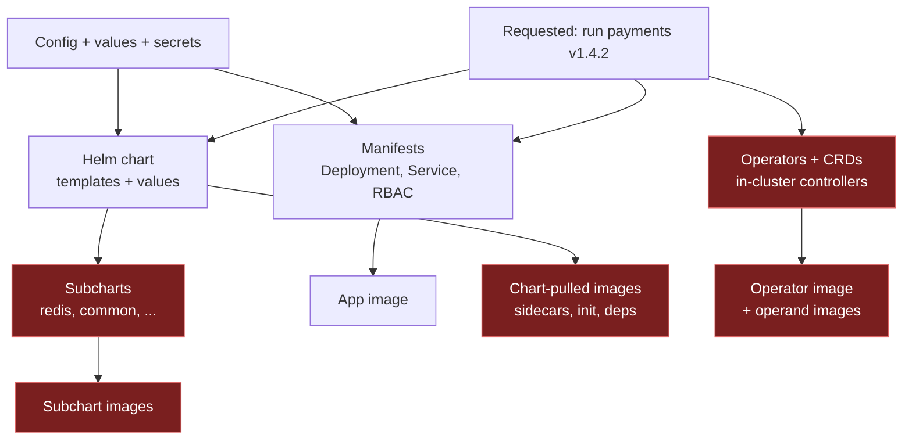
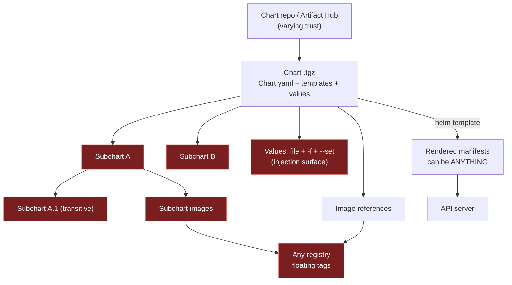
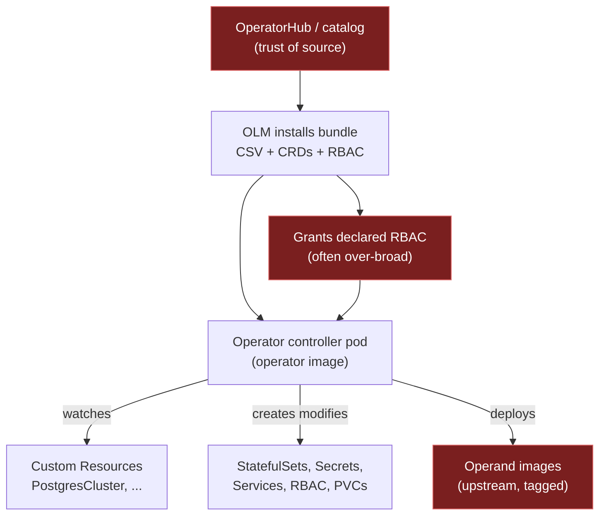
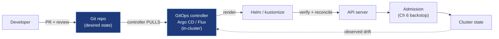
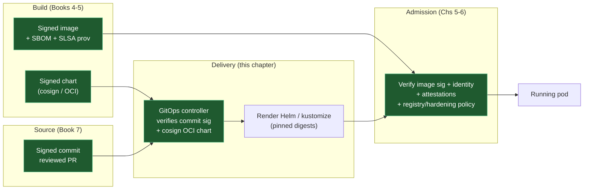
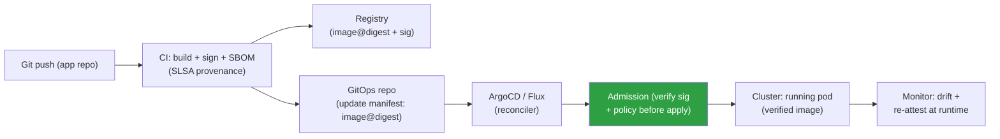
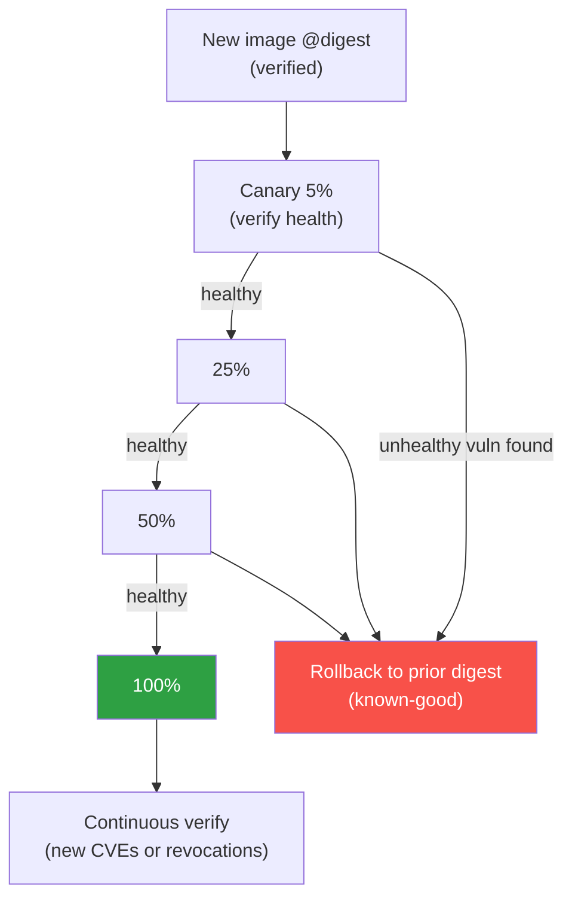

# Chapter 7 — Kubernetes Delivery Chains: Helm, Operators, GitOps

*What this chapter covers.* Chapters 1–5 of this book secured the **container image** as an
artifact: how it is built (Book 4), scanned (Chapter 4), signed (Chapter 5), and verified at
admission (Chapters 5–6). But an image is not a deployment. Something has to *package* that image
together with the manifests, RBAC, config, secrets, and dozens of other images it depends on, and
something has to *deliver* that package into a running cluster. That packaging-and-delivery layer —
**Helm charts, Kubernetes Operators, and GitOps controllers** — is its own supply chain, with its
own artifacts, its own repositories, its own transitive dependencies, and its own attack surface.
It is also the *least* secured link in most organizations: teams that meticulously sign and scan
images will `helm install` a chart pulled from a public index over TLS-and-a-prayer, granting it
the power to deploy anything. This chapter treats the delivery layer as a supply chain in its own
right. We cover Helm's architecture and its provenance and OCI-signing story; the Operator pattern
and why an in-cluster controller with broad RBAC is a supply-chain risk of the first order; GitOps
(Argo CD and Flux) as the modern pull-based delivery model, its genuine security advantages, and
its genuine new failure modes; and finally how these compose into a single **delivery chain of
custody** — signed commit → verified chart → verified image → admission backstop — where every link
must hold or the whole chain is theatre.
_All tool versions, spec references, and defaults verified as of early 2026._

Learning goals — after this chapter you should be able to:

- Explain why **what gets deployed is not just an image** but a graph of manifests, charts,
  subcharts, CRDs, operators, and images, each a tamperable supply-chain artifact.
- Describe **Helm 3's architecture** (client-side, no Tiller), state precisely why **Helm 2's
  Tiller** was a security disaster, and reason about charts as *code* that can deploy anything.
- Secure a Helm workflow: **provenance files (`.prov`) and `helm verify`**, **OCI-registry charts
  signed with cosign**, digest pinning, internal chart repositories, and **rendering-then-policy-
  checking** chart output before it ever reaches a cluster.
- Analyze **Operators** as privileged in-cluster software: the CRD-plus-controller pattern,
  OperatorHub/OLM as a distribution channel, over-broad RBAC as a least-privilege failure, and how
  to scope and monitor them.
- Analyze **GitOps** (Argo CD, Flux): git as source of truth, pull-based reconciliation, the
  security appeal *and* the fact that the repo and the controller become **tier-0**, plus what
  Flux and Argo actually do (and do not) verify.
- Compose the whole into a **defensible chain of custody** and place admission (Chapter 6) as the
  backstop that verifies whatever the delivery chain produces.

---

## The delivery layer is a supply chain

Return to the mental model from Book 2, Chapter 1 — Dependencies as a Supply Chain. A package
manager takes a *manifest* of what you want, resolves it against one or more *repositories*,
downloads *artifacts* (often with *transitive* dependencies you never named), and assembles them
into something that runs. Every one of those steps is an integrity boundary: a compromised
repository, a typosquatted artifact, an unpinned transitive dependency, an unsigned download.

Kubernetes delivery is exactly this pattern, one level up. The thing you *want* is "run version
1.4.2 of the payments service." The thing that actually lands in etcd is a Deployment, a Service,
an Ingress, a HorizontalPodAutoscaler, a ServiceAccount, three Roles and RoleBindings, a
ConfigMap, a couple of Secrets, and — pulled in behind your back — an init-container image, a
sidecar image, and whatever a charted subdependency decided to deploy. None of that is the image
you signed. All of it is a supply-chain artifact.



The highlighted nodes are the ones teams routinely *fail* to vet. You chose the app image; you did
not choose the Redis subchart's image, the operator's operand images, or the sidecar a chart
injects. Each is pulled "from wherever" — often a public registry, often by a floating tag, often
with no signature check. And unlike an application dependency (Book 2), a Kubernetes delivery
artifact is *directly executable at the highest privilege in your cluster*: a chart template is Go
code that emits manifests, and a manifest can request a privileged pod, a hostPath mount, a
cluster-admin binding, or an exfiltration sidecar. There is no sandbox between "the chart rendered
this" and "the API server persisted this" except the one you build: admission (Chapter 6).

This is the framing for the whole chapter. **Securing images (Chapters 1–5) secures one node in
this graph.** The delivery layer is the rest of the graph, and it is where an attacker who cannot
forge your signed image will instead attack the chart that deploys it, the operator that manages
it, or the git repo that describes it.

---

## Helm: the Kubernetes package manager

Helm is the de facto package manager for Kubernetes. A **chart** is a directory (or a `.tgz`
archive of one) containing:

- `Chart.yaml` — metadata: name, version, `appVersion`, and a `dependencies` list.
- `values.yaml` — the default configuration, a tree of keys the templates read.
- `templates/` — Go `text/template` files that, rendered against the values, produce Kubernetes
  manifests.
- optionally `charts/` — vendored **subcharts** (dependencies), and a `Chart.lock`.

You render a chart with `helm template` (produce YAML, apply it yourself) or install it with
`helm install`, which renders *and* submits the objects to the API server, recording the result as
a **release** — a named, versioned, revisionable unit you can `upgrade`, `rollback`, or
`uninstall`. Charts live in **chart repositories**: historically an HTTP server hosting an
`index.yaml` plus `.tgz` files (the model behind **Artifact Hub**, the public index of thousands of
charts); increasingly, **OCI registries** (Book 6, Chapters 1–2), where a chart is just another OCI
artifact stored next to your images. The repository model is a direct parallel to Book 2, Chapter 1
(npm/PyPI/Maven registries) and Book 2, Chapter 8 (running an internal registry): same trust
questions, same typosquatting and dependency-confusion exposure, same "who can publish" problem.

### The Tiller lesson: Helm 2's server-side agent

You cannot reason about Helm's security without understanding what Helm 3 *removed*. Helm 2 had a
server-side component called **Tiller**: an in-cluster pod that received your rendering requests,
did the templating, and applied the resulting objects to the API server on your behalf. The client
(`helm`) talked to Tiller over gRPC; Tiller talked to the API server.

The security consequences were severe and are worth stating precisely because they are the archetype
of a badly-designed delivery agent:

- **Tiller held a broad, usually cluster-admin, ServiceAccount.** It had to, because it deployed
  arbitrary charts into arbitrary namespaces. So *every* release ran with Tiller's privileges, not
  the caller's. A developer who could reach Tiller could deploy anything Tiller could — which was
  everything.
- **In its default install, the gRPC endpoint had no authentication and no TLS.** Anyone who could
  reach Tiller's port in the cluster network could ask it to install charts. TLS and cert-based auth
  were opt-in and widely skipped. This turned an unauthenticated in-cluster endpoint into a
  cluster-admin remote-code-execution primitive; it was a staple of Kubernetes pentest findings for
  years.
- **RBAC was effectively bypassed.** The point of Kubernetes RBAC is that *your* identity bounds
  what you can do. Tiller collapsed every user's authority into its own.

**Helm 3 deleted Tiller entirely.** Helm 3 is a **client-side** tool: it renders templates locally
and talks to the API server *as you*, using your kubeconfig and your RBAC. Release state moved from
Tiller's memory into Secrets in the release namespace. The lesson generalizes to everything else in
this chapter: **a delivery agent that runs in-cluster with broad privilege and accepts work over
the network is a cluster-takeover primitive.** Hold that thought — it is exactly the shape of an
Operator (below) and a GitOps controller (further below), and the reason both must be secured with
care Helm 2 did not take.

### Charts are code: the risk surface

A chart is not data. `templates/` is Turing-adjacent Go templating with functions (`tpl`, `lookup`,
`include`, Sprig helpers), conditionals, and loops, and its *output* is unrestricted Kubernetes
YAML. A malicious or compromised chart can therefore deploy anything the applying identity is
permitted to create:

- **Privileged workloads** — `securityContext.privileged: true`, `hostPID`, `hostNetwork`,
  `hostPath: /`, or a pod that mounts the node's container runtime socket and breaks out.
- **Bad RBAC** — a ClusterRoleBinding to `cluster-admin` for the chart's ServiceAccount, quietly
  granting the workload the keys to the cluster.
- **Exfiltration sidecars** — an extra container in the pod that ships secrets or traffic outbound.
- **Attacker-controlled images** — the chart's `values.yaml` points `image.repository` at a
  registry you do not control, or an unpinned tag that can be re-pushed.

And the risk is transitive. `Chart.yaml` dependencies pull **subcharts** from other repositories.
`helm dependency update` resolves them into `charts/` — a classic transitive-dependency graph (Book
2, Chapter 3 — Transitive Dependencies), except each node can emit privileged manifests. A subchart
you never audited can inject a sidecar into a pod defined by the parent chart. Worse, the *images* a
chart deploys are a second, parallel dependency graph: the chart references image references, and
those images are pulled at pod-creation time from wherever the values say — sources you almost
never vet with the rigor you apply to your own app image.

Add **values injection**: values flow from `values.yaml`, `-f overrides.yaml`, and `--set` flags on
the command line, with later sources overriding earlier ones. A value that lands in a template
position that renders into a command, an image reference, or an annotation consumed by another
controller is an injection point. `--set image.repository=evil.example.com/x` is a one-line
supply-chain substitution, and it is *the intended interface*.



### Securing Helm

There is no single control; you layer several, mirroring the image controls from earlier chapters
but applied to the chart artifact and to its rendered output.

**1. Chart provenance: `.prov` files and `helm verify`.** Helm has a native provenance mechanism
predating Sigstore. When you `helm package --sign`, Helm computes a checksum of the chart archive
and writes a **provenance file** (`<chart>.tgz.prov`) containing the `Chart.yaml`, the archive's
SHA-256, and a **clear-signed PGP block** over that data. Consumers run `helm verify chart.tgz`
(which requires the `.prov` alongside the `.tgz` and a keyring), or `helm install --verify`, to
check that the signature is valid and the checksum matches:

```bash
# Publisher: package and sign with a PGP key
helm package --sign --key 'release@example.com' \
  --keyring ~/.gnupg/secring.gpg ./payments

# produces payments-1.4.2.tgz  and  payments-1.4.2.tgz.prov

# Consumer: verify integrity + signature before install
helm verify --keyring ./pubring.gpg payments-1.4.2.tgz
helm install payments ./payments-1.4.2.tgz --verify --keyring ./pubring.gpg
```

This works, but it is PGP: key distribution and trust are on you, there is no transparency log, and
in practice adoption on public repos is thin. Treat it as available and better-than-nothing, not as
the modern default.

**2. The modern default: OCI charts signed with cosign.** Since Helm 3.8, charts are first-class
**OCI artifacts** — you `helm push chart.tgz oci://registry.example.com/charts` and it lands in the
registry by digest, exactly like an image (Book 6, Chapters 1–2). Because it is an OCI artifact with
a digest, you can sign it with **cosign** and verify it with the *same* Sigstore machinery you use
for images (Book 5, Chapter 3), including keyless signing from CI identity (Book 5, Chapter 4) and
Rekor transparency (Book 5, Chapter 5):

```bash
# Publish the chart to an OCI registry (returns a digest)
helm push payments-1.4.2.tgz oci://registry.example.com/charts
# Pushed: registry.example.com/charts/payments:1.4.2
# Digest: sha256:5c9e...a1

# Sign the chart artifact by digest, keyless, from CI
cosign sign registry.example.com/charts/payments@sha256:5c9e...a1

# Consumer verifies signer identity before pulling
cosign verify registry.example.com/charts/payments@sha256:5c9e...a1 \
  --certificate-identity-regexp 'https://github.com/example/charts/.*' \
  --certificate-oidc-issuer https://token.actions.githubusercontent.com
```

This is the recommendation: **sign charts like images, verify at pull/deploy time, and pin by
digest.** One trust model, one toolchain, one transparency log across every artifact in the delivery
graph.

**3. Pin chart *and* image digests.** A chart pinned to `payments:1.4.2` is pinned to a mutable tag;
pin the chart to its `@sha256:` digest, and inside the chart pin every image to a digest too. This
closes the same re-push window as digest-pinning images (Book 6, Chapter 1) and lets admission
enforce "no floating tags" against chart output (Chapter 6).

**4. Vet, then host internally: golden charts.** Do not `helm repo add` a public index and install
straight from it any more than you would `pip install` from an unknown source into production. Vet
charts once, then serve them from an **internal chart repository** (an OCI registry works fine — Book
2, Chapter 8's internal-registry pattern). This is the delivery-layer analogue of **golden base
images** (Book 6, Chapter 3): a curated, versioned, signed set of **golden charts** that encode your
security defaults (non-root, pinned images, sane RBAC, resource limits). Teams consume the paved
road; the surface of "any chart from anywhere" collapses to "our charts."

**5. Render, scan, and policy-check the *output*.** The single most under-used Helm control:
`helm template` renders the chart to plain YAML *without touching a cluster*, and you can inspect
what it actually produces before anything is applied. Run policy over that output in CI:

```bash
# Render, then policy-check the manifests the chart would create
helm template payments ./payments -f prod-values.yaml > rendered.yaml

# conftest (OPA/Rego) against the rendered manifests
conftest test rendered.yaml --policy ./policy

# or Kyverno CLI applying the same ClusterPolicies you enforce at admission
kyverno apply ./policy -r rendered.yaml
```

```rego
# policy/deny_privileged.rego — reject privileged output from ANY chart
package main

deny contains msg if {
  input.kind == "Deployment"
  c := input.spec.template.spec.containers[_]
  c.securityContext.privileged == true
  msg := sprintf("container %q requests privileged mode", [c.name])
}

deny contains msg if {
  input.kind == "ClusterRoleBinding"
  input.roleRef.name == "cluster-admin"
  msg := "chart binds a subject to cluster-admin"
}
```

Now a chart that *tries* to deploy a privileged pod or a cluster-admin binding fails in CI, before
it is ever proposed to a cluster — regardless of which subchart smuggled it in. Reuse the *same*
policies you enforce at admission (Chapter 6) so CI and the cluster agree.

**6. Backstop at admission.** Everything above is shift-left. The cluster-side backstop is
Chapter 6: admission verifies image signatures, rejects floating tags and privileged pods, and
enforces approved registries on *whatever the chart rendered*, no matter how it was rendered. CI
policy and admission policy are defense in depth, not alternatives.

---

## Operators: the CRD-plus-controller pattern

An **Operator** extends Kubernetes with domain knowledge. It is two things: one or more **Custom
Resource Definitions (CRDs)** that add new object kinds to the API (e.g., `PostgresCluster`,
`Kafka`, `CertificateRequest`), and a **controller** — a pod running a reconciliation loop that
watches those custom resources and drives the real world to match them. You create a
`PostgresCluster` object; the operator's controller creates the StatefulSets, Services, Secrets,
and backup CronJobs that constitute a running database, and keeps reconciling them forever.

That reconciliation power is exactly the problem. To manage StatefulSets, Secrets, PVCs, Services,
and RBAC on your behalf, the controller needs RBAC to *create and modify* all of those — often
across all namespaces. **An operator is privileged, long-running, in-cluster software with broad
authority.** In the taxonomy of the Tiller lesson, it is Tiller-shaped: a persistent agent holding
wide permissions. The difference is that a good operator's authority is *scoped*, and its interface
is the API server (subject to RBAC and admission) rather than an unauthenticated gRPC port. Those
differences are only real if you enforce them.

### The risks

- **A compromised or malicious operator is a cluster compromise.** If the operator holds
  `secrets: [get, list]` cluster-wide (many do, to wire credentials into operands), an attacker who
  controls the operator image or its inputs can read every secret in the cluster. If it can create
  Deployments and RBAC, it can schedule attacker workloads and escalate. The operator *image* is a
  supply-chain artifact (Book 6, Chapters 1–5): sign it, scan it, demand provenance, exactly as you
  would any tier-0 workload.
- **The distribution channel.** Operators are distributed through **OperatorHub** and installed via
  the **Operator Lifecycle Manager (OLM)**, which packages an operator as a **bundle**
  (CSV — `ClusterServiceVersion` — plus CRDs and RBAC) and resolves it from a **catalog**. This is a
  package registry with the same trust question as any other (Book 2, Chapter 1): *who published
  this, and did anyone verify it?* Community operators vary wildly in quality and permission hygiene.
- **Over-broad RBAC.** The CSV *declares* the RBAC the operator wants, and OLM grants it at install.
  Many operators request far more than they need — cluster-wide `*` verbs on `secrets`, or blanket
  access to core resources — because it is easier than scoping. Installing such an operator is a
  least-privilege failure (Book 1, Chapter 6) baked in at delivery time. **Read the CSV's `install`
  permissions before you install; treat a request for cluster-wide secret access or `*/*` as a
  finding.**
- **Operands pull their own images.** The operator deploys operand images (the actual Postgres,
  Kafka, etc.), frequently by tag from upstream registries — a second image supply chain you did
  not choose, arriving through the operator.
- **CRDs are API surface.** A CRD can register conversion/validation webhooks that sit in the
  admission path (Chapter 6); a malicious CRD is another way into the request pipeline.



### Securing operators

- **Vet the source and the image.** Prefer operators you can point to a signed image, an SBOM (Book
  3), and SLSA provenance (Book 5) for. Verify the operator image's signature at admission like any
  workload (Chapter 5). Mirror it into your internal registry (Book 6, Chapter 2) rather than pulling
  from upstream at install.
- **Scope RBAC to least privilege.** Read the CSV. If the operator only manages resources in the
  namespaces it owns, it should hold **namespaced** Roles, not ClusterRoles. Constrain secret access
  to specific namespaces. An operator that demands `cluster-admin` should be rejected or run in a
  tightly isolated cluster. This is the single highest-leverage control: it bounds the blast radius
  of a compromise to what the operator can actually touch.
- **Use OLM's operator groups and install modes** to constrain which namespaces an operator watches;
  a single-namespace install mode is far safer than `AllNamespaces` for an operator that does not
  need cluster-wide scope.
- **Policy the operator's *output* at admission.** The operator creates objects like anything else;
  those objects pass through admission. Enforce your image, registry, and hardening policies
  (Chapter 6) on operator-created pods so a compromised operator still cannot schedule an unsigned or
  privileged workload. The operator is not exempt from the boundary.
- **Monitor behavior.** An operator's normal action set is narrow and knowable. Audit-log its
  ServiceAccount (Book 8, incident response) and alert on out-of-profile actions — creating RBAC it
  never created before, reading secrets outside its namespaces, scheduling pods with unusual specs.

---

## GitOps: git as the source of truth

GitOps is the delivery model that ties this all together, and it is where the delivery layer becomes
most clearly a supply chain. The idea: **the desired state of the cluster lives in git**, and an
in-cluster controller **continuously reconciles** the real cluster to match what git says. You do
not `kubectl apply` to production; you open a pull request, it merges, and the controller
(**Argo CD** or **Flux**) notices the change and converges the cluster to it. The two dominant
implementations differ in ergonomics but share the model: Argo CD is application-centric with a UI
and an `Application` CRD; Flux is a set of composable controllers (source, kustomize, helm,
image-automation) driven by CRDs.

The security appeal is real and worth naming precisely, because it is the reason GitOps is a
*better* delivery model, not just a fashionable one:

- **Declarative and auditable.** The entire desired state is in git. What is deployed is what is in
  the repo at a commit, and git history is a signed-or-signable, immutable-ish audit log of who
  changed what and when (Book 7 — Source Security).
- **Pull-based.** The controller *pulls* from git and reconciles from *inside* the cluster. There is
  no CI system holding cluster-admin credentials and pushing to the API server from outside; the
  cluster's write path does not require inbound access. This shrinks the credential-exposure surface
  compared to push-based CI deploys dramatically — there is no long-lived kubeconfig in a runner to
  steal (Book 4, Chapter 8).
- **Reviewable.** Changing production is a pull request. Branch protection, required reviews, and CI
  checks (Book 7, Chapters 2–3) now gate deployment the same way they gate code.



### The supply-chain implication: repo and controller are tier-0

The pull-based model does not remove risk; it **relocates** it. Two things become the most
security-critical assets in your entire delivery chain, highlighted above:

**1. The GitOps repository is now production.** Whoever can merge to the GitOps repo can deploy
anything to the cluster the controller manages. The repo *is* the deploy button. A compromised commit
— a malicious `Deployment`, an image swap in a values file, a new ClusterRoleBinding — reconciles
straight into production with no further human in the loop, because reconciliation is the whole
point. **Book 7's source-control security is now deployment security.** Every SCM control from Book 7
applies with production stakes: branch protection with required reviews, **signed commits** (verify
them — see below), protected `main`, no direct pushes, restricted merge rights, and CI that scans and
policy-checks the manifests before merge. A GitOps repo with a weak review policy is a cluster with a
weak deploy policy.

**2. The controller is Tiller, done right — if you do it right.** Argo CD and Flux run in-cluster
with broad permissions: to reconcile arbitrary objects into arbitrary namespaces, they need wide
create/update/delete RBAC. Compromise the controller — its image (Book 6, Chapters 1–5), its
service account token, or its config — and you have cluster-wide deploy access. This is the Tiller
shape again, and the mitigations are the Tiller lessons: the controller must run with **scoped
RBAC** where possible (Argo's app-project restrictions, per-cluster/per-namespace destinations;
Flux's per-Kustomization `serviceAccountName` impersonation so a reconciliation runs as a bounded
identity, not the controller's full authority), its image must be verified, and its blast radius
bounded.

Beyond those two, GitOps inherits everything above:

- **It renders Helm and kustomize** — so every Helm risk (malicious chart, unvetted subchart,
  chart-pulled images) and every kustomize risk applies to what the controller renders.
- **Multi-source and remote refs.** A `Kustomization` can reference remote bases (`github.com/...`
  URLs), and an Argo `Application` or Flux `HelmRelease` can pull charts from remote repos. These are
  **untrusted remote content pulled at reconcile time** — a remote base can change under you unless
  pinned to a commit/digest. Pin remote references; do not float them.
- **Secrets.** You must not commit plaintext secrets to the GitOps repo; git history is forever and
  the repo is widely readable. The three standard answers: **Sealed Secrets** (encrypt to a
  cluster-held key with `kubeseal`; only the in-cluster controller can decrypt, so the ciphertext is
  safe in git), **SOPS** (encrypt values with age/KMS/PGP; Flux and Argo can decrypt at reconcile
  with a key they hold), and **External Secrets Operator** (commit only a *reference*; the operator
  fetches the real value from Vault/cloud KMS at runtime). All three keep plaintext out of git; they
  differ in where the trust root sits.
- **Drift and manual overrides.** A human `kubectl edit` in production is drift. Reconciliation will
  revert it (self-heal) — good for integrity, but it also means the controller's view of git is
  authoritative, which is exactly why the repo must be locked down. Argo can be set to auto-heal;
  treat manual changes as incidents, not workflow.

### What Argo CD and Flux actually verify

Be precise here, because it is easy to overstate. GitOps controllers are not, by default,
verifying signatures on what they deploy. You must turn verification on, and each tool supports a
specific, bounded set of checks.

**Flux** has the more built-in verification story:

- **Git commit signature verification.** The `GitRepository` source can require that the tip commit
  (or tag) be signed by a key in a configured keyring, via `spec.verify`. Flux refuses to reconcile a
  source whose commit is not signed by a trusted key — enforcing Book 7's signed-commit control at
  the *deployment* boundary.
- **Cosign verification of OCI artifacts.** For **OCI-stored** content — an `OCIRepository` (charts
  or manifests pushed as OCI artifacts) — Flux can verify a **cosign** signature (keyed or keyless
  with identity/issuer matching) via `spec.verify.provider: cosign` before reconciling. Flux's
  Helm/OCI path can thus verify a signed chart artifact.
- **Image signature verification for image automation** is *not* a general admission-time image
  gate; Flux's image controllers automate updating image tags in git, and signature enforcement on
  running pods still belongs at admission (Chapter 6).

```yaml
# Flux: require a cosign-verified OCI chart, signed by our CI identity
apiVersion: source.toolkit.fluxcd.io/v1
kind: OCIRepository
metadata:
  name: payments
  namespace: apps
spec:
  interval: 5m
  url: oci://registry.example.com/charts/payments
  ref:
    digest: sha256:5c9e...a1        # pin by digest, not tag
  verify:
    provider: cosign
    matchOIDCIdentity:
      - issuer: "https://token.actions.githubusercontent.com"
        subject: "https://github.com/example/charts/.*"
```

```yaml
# Flux: refuse to reconcile a Git source unless the commit is signed
apiVersion: source.toolkit.fluxcd.io/v1
kind: GitRepository
metadata:
  name: fleet
  namespace: flux-system
spec:
  interval: 1m
  url: https://github.com/example/fleet-infra
  ref:
    branch: main
  verify:
    mode: HEAD               # verify the tip commit
    secretRef:
      name: git-signing-pubkeys   # keyring of trusted signers
```

**Argo CD** verifies **GPG signatures on git commits**: you configure a set of trusted GPG public
keys, enable signature verification **per AppProject**, and Argo refuses to sync an application whose
target commit is not signed by a trusted key. Argo does **not** ship a built-in cosign
image/chart-signature gate the way Flux's OCI path does; for image-signature enforcement you pair
Argo with an admission-time verifier (policy-controller, Kyverno `verifyImages`, Ratify — Chapter 5).
The accurate summary: **Argo enforces commit provenance; image/artifact-signature verification is
delegated to admission.** Do not claim Argo verifies image signatures natively; claim it verifies
*commits* and relies on admission for the rest.

```yaml
# Argo CD: require signed commits for everything in this project
apiVersion: argoproj.io/v1alpha1
kind: AppProject
metadata:
  name: payments
  namespace: argocd
spec:
  signatureKeys:
    - keyID: 4AEE18F83AFDEB23   # trusted GPG key; unsigned/foreign commits refused
  sourceRepos:
    - "https://github.com/example/fleet-infra.git"
  destinations:
    - server: https://kubernetes.default.svc
      namespace: payments
```

### Securing GitOps: the checklist

- **Protect the repo like production:** branch protection, required review, signed commits, no direct
  push to `main`, least-privilege merge rights, and CI that renders + policy-checks manifests before
  merge (Book 7, Chapters 2–3; the `helm template | conftest` pattern above).
- **Make the controller verify provenance:** Flux `spec.verify` for commits and cosign for OCI
  charts; Argo `signatureKeys` for commits. Turn these on — they are opt-in.
- **Pin everything:** commits (not branches) for remote bases, digests (not tags) for OCI charts and
  images. Floating refs reintroduce mutability the whole model is meant to remove.
- **Least-privilege the controller:** Flux per-Kustomization service-account impersonation; Argo
  AppProject destination and source restrictions. The controller should not be able to deploy
  anywhere it does not manage.
- **Manage secrets out of plaintext:** Sealed Secrets, SOPS, or External Secrets — never commit a
  plaintext Secret.
- **Backstop at admission (Chapter 6):** verify image signatures, enforce registries and hardening on
  whatever reconciles. Defense in depth: the controller verifying charts and commits does not remove
  the need for the cluster to verify images at the boundary.
- **GitOps the policies themselves.** Manage your Kyverno/Gatekeeper/VAP policies (Chapter 6) *in the
  GitOps repo* so the enforcement layer is versioned, reviewed, and fleet-distributed exactly like
  the workloads it governs.

---

## Bringing it together: the delivery chain of custody

Each preceding section secured one link. Composed, they form a continuous chain of custody from a
developer's commit to a running pod, where every artifact is signed by an identity you trust and
verified by the next link before it is used. A break in any link is a break in the chain; the value
is in the *composition*, not any single control.



Read the chain as a sequence of *verify-before-use* boundaries, each consuming the evidence produced
by the link before:

| Link | Artifact | Signed by (Book) | Verified by (this chain) |
|------|----------|------------------|--------------------------|
| Source | Git commit | Developer / CI key (Book 7) | Flux `spec.verify` / Argo `signatureKeys` |
| Package | Helm chart (OCI) | CI keyless identity (Book 5) | Flux cosign OCI verify; cosign in CI |
| Image | Container image + attestations | CI keyless identity (Books 4–5) | Admission verifier (Chs 5–6) |
| Config | Rendered manifests | (integrity via pinning) | CI conftest/Kyverno + admission (Ch 6) |
| Deploy | Persisted objects | — | Admission is the final gate (Ch 6) |

The crucial property is that **no single compromised link deploys a malicious workload**, because
each link's output is re-verified downstream. Forge a chart but not a commit signature, and the
GitOps controller rejects the source. Compromise the git repo but not the image-signing identity,
and admission rejects the unsigned image. Slip past the chart-rendering CI check, and admission still
enforces registry and hardening policy on the output. The chain is defensible precisely because
verification is *layered and redundant*, not concentrated at one point that, if bypassed, opens
everything.

---

## Distributed-systems lens

At fleet scale the delivery chain's economics and risk both concentrate, and the design has to
account for that.

**GitOps centralizes fleet delivery — and thereby concentrates risk.** One control plane (an Argo CD
or a Flux install, often a management cluster) reconciles desired state onto *many* clusters. This is
the operational win of GitOps at scale: you change a golden config once and it propagates across the
fleet, with git as the audit trail. But it makes the **GitOps repo and the controller tier-0 for the
entire fleet** (Book 1, Chapter 9 — Tiered Trust and Blast Radius). Compromise of the repo is
fleet-wide deploy access; compromise of the management controller is fleet-wide cluster access. The
mitigation is the same one that makes any tier-0 dependency tolerable: bound its blast radius (scoped
per-cluster/per-namespace destinations, impersonation, network isolation of the management cluster),
verify what it consumes (signed commits, signed charts), and monitor it as the critical asset it is.

**Sign and verify at every layer so no single link is load-bearing alone.** The recurring theme of
Books 4–6 — commit, chart, image, admission — is not four independent controls; it is one chain where
each link verifies the previous. At fleet scale you cannot manually review every deploy, so the chain
of custody *is* the review: an artifact reaches a pod only by carrying signatures that verify at each
boundary. This is what lets you deploy thousands of times a day across many clusters without a human
in every loop — the machines verify what humans cannot re-check by hand.

**The paved road shrinks the delivery-layer surface.** An internal chart repository of **golden
charts** (this chapter) is the delivery analogue of golden base images (Book 6, Chapter 3): most
teams consume a small, curated, signed set that encodes your security defaults, so the effective
attack surface is your charts, not the public long tail. Least-privilege for controllers and
operators bounds what any single compromise can reach. And **admission (Chapter 6) is the backstop**
that catches whatever the delivery chain — with all its rendering, remote refs, and third-party
charts and operators — actually produces, at the one point every object must pass through. The
result is a delivery chain of custody that is auditable (git history + signed commits), verifiable
(signed charts and images checked at each hop), and bounded (least-privilege controllers,
admission-enforced output) — which is the standard a distributed backend platform, deploying
constantly across a fleet, has to meet.

---

### GitOps delivery chain with verification



### Progressive delivery gates



## Key takeaways

- **What deploys is not just an image.** It is a graph of manifests, charts, subcharts, CRDs,
  operators, and the images each pulls in — every node a supply-chain artifact, most of them never
  vetted with image-level rigor. The delivery layer is the under-secured attack surface.
- **Helm charts are code.** Go templating emits unrestricted Kubernetes YAML: a malicious chart can
  deploy privileged pods, cluster-admin bindings, and exfil sidecars, and its subcharts and
  chart-pulled images are a transitive dependency graph you did not choose.
- **Helm 2's Tiller was the archetypal bad delivery agent** — an in-cluster, usually cluster-admin,
  unauthenticated gRPC endpoint that collapsed every user's RBAC into its own. **Helm 3 removed it;
  Helm runs client-side as you.** The lesson recurs in operators and GitOps controllers.
- **Secure Helm by signing charts like images.** Native provenance (`.prov` + `helm verify`) exists
  but is PGP-bound; the modern default is **OCI charts + cosign** (Books 5–6), pinned by digest,
  served from an internal repo of **golden charts**, with `helm template` output policy-checked in CI
  and re-checked at admission.
- **Operators are privileged in-cluster software.** A CRD-plus-controller holds broad RBAC (often
  cluster-wide secret access); a compromised operator is a cluster compromise. Vet the source and
  image, **read the CSV and scope RBAC to least privilege**, constrain watched namespaces, and policy
  the operator's output at admission.
- **GitOps is a better delivery model that relocates risk.** Pull-based, declarative, auditable,
  reviewable — but the **repo and controller become tier-0**: the repo is the deploy button (Book 7
  is now deployment security) and the controller is Tiller-shaped.
- **Turn on verification; do not overstate it.** **Flux** verifies signed **git commits**
  (`spec.verify`) and **cosign-signed OCI charts/images**; **Argo CD** verifies **GPG-signed
  commits** per AppProject and delegates image/artifact-signature checks to admission. Pin commits and
  digests; keep plaintext secrets out of git (Sealed Secrets / SOPS / External Secrets).
- **The chain of custody is the point.** Signed commit → verified chart → verified image → admission
  backstop, each link re-verified downstream, so no single compromised link deploys a malicious
  workload. Admission (Chapter 6) is the final gate on whatever the delivery chain produces.

## Further reading

- **Helm documentation** — charts, dependencies, releases, and the security-model page (Helm 3
  architecture, no Tiller). https://helm.sh/docs/ and https://helm.sh/docs/topics/security/
- **Helm — Provenance and Integrity.** The `.prov` provenance file format, `helm package --sign`,
  and `helm verify`/`--verify`. https://helm.sh/docs/topics/provenance/
- **Helm — Registries (OCI).** Storing and signing charts as OCI artifacts; `helm push`/`helm pull`
  against OCI registries. https://helm.sh/docs/topics/registries/
- **Sigstore cosign** — signing and verifying OCI artifacts (images *and* charts), keyless identity,
  Rekor. https://docs.sigstore.dev/ and https://github.com/sigstore/cosign
- **Operator Framework / OLM.** ClusterServiceVersion, bundles, catalogs, install modes and operator
  groups, and the RBAC an operator declares. https://olm.operatorframework.io/docs/ and
  https://operatorhub.io/
- **Kubernetes — Operator pattern** and **Custom Resources / CRDs.**
  https://kubernetes.io/docs/concepts/extend-kubernetes/operator/ and
  https://kubernetes.io/docs/concepts/extend-kubernetes/api-extension/custom-resources/
- **Flux — security and verification.** GitRepository/OCIRepository `spec.verify` (Git commit
  signatures and cosign), Kustomization service-account impersonation.
  https://fluxcd.io/flux/security/ and https://fluxcd.io/flux/components/source/
- **Argo CD — signature verification** (GPG-signed commits per AppProject) and **AppProject**
  restrictions. https://argo-cd.readthedocs.io/en/stable/user-guide/gpg-verification/ and
  https://argo-cd.readthedocs.io/en/stable/user-guide/projects/
- **OpenGitOps principles** (declarative, versioned/immutable, pulled automatically, continuously
  reconciled). https://opengitops.dev/
- **Secrets in GitOps:** Sealed Secrets (https://github.com/bitnami-labs/sealed-secrets), Mozilla
  SOPS (https://github.com/getsops/sops), and External Secrets Operator
  (https://external-secrets.io/).
- **Conftest / Open Policy Agent** for policy-checking rendered manifests, and **Kyverno CLI** for
  applying admission policies in CI. https://www.conftest.dev/ and https://kyverno.io/docs/
