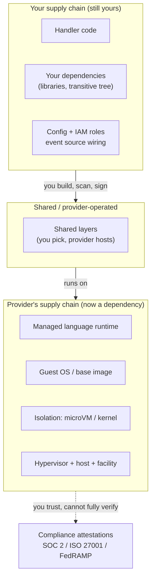
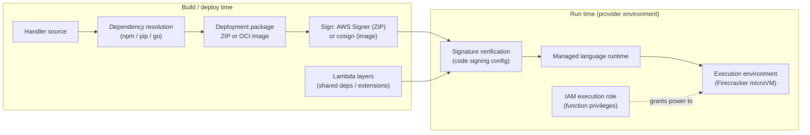
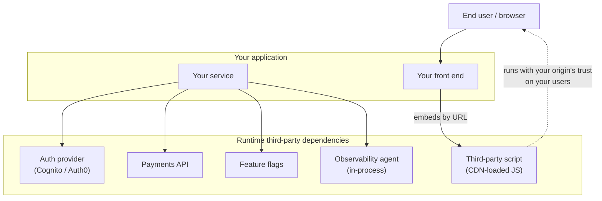
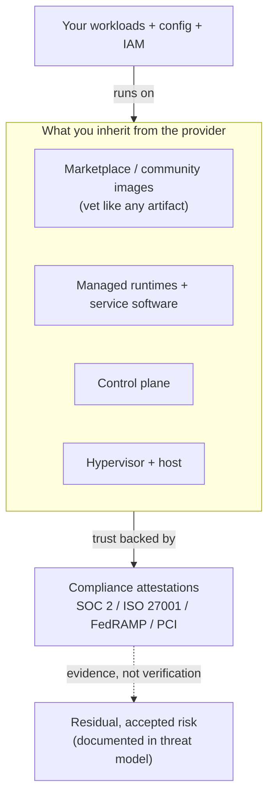
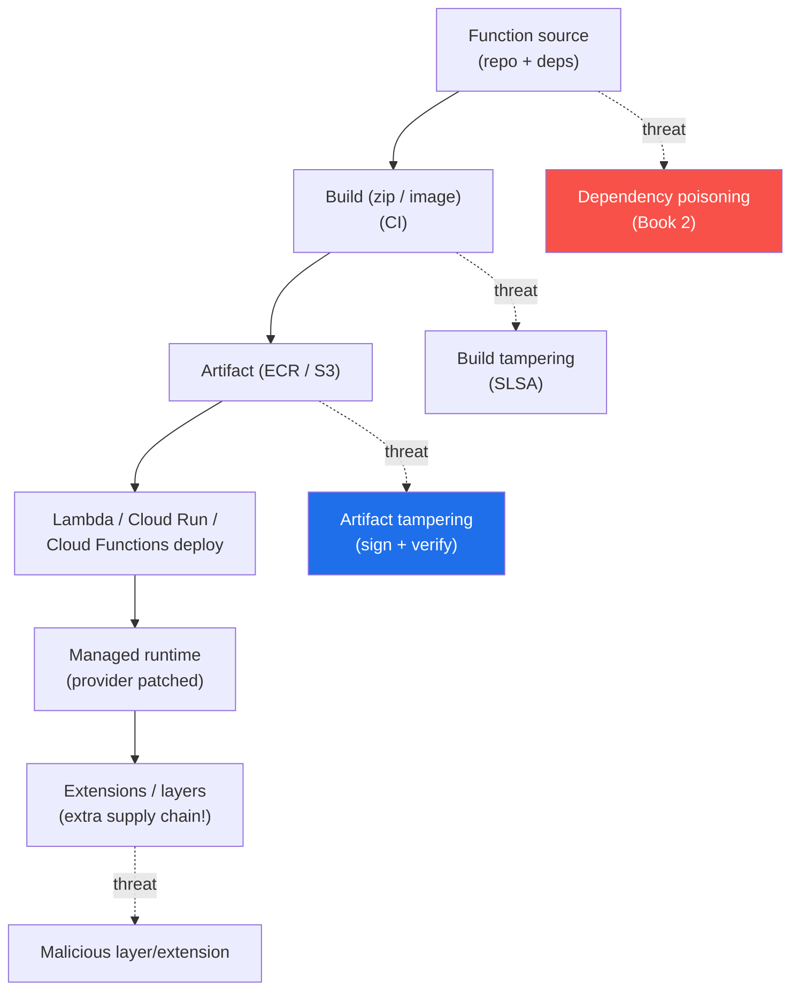
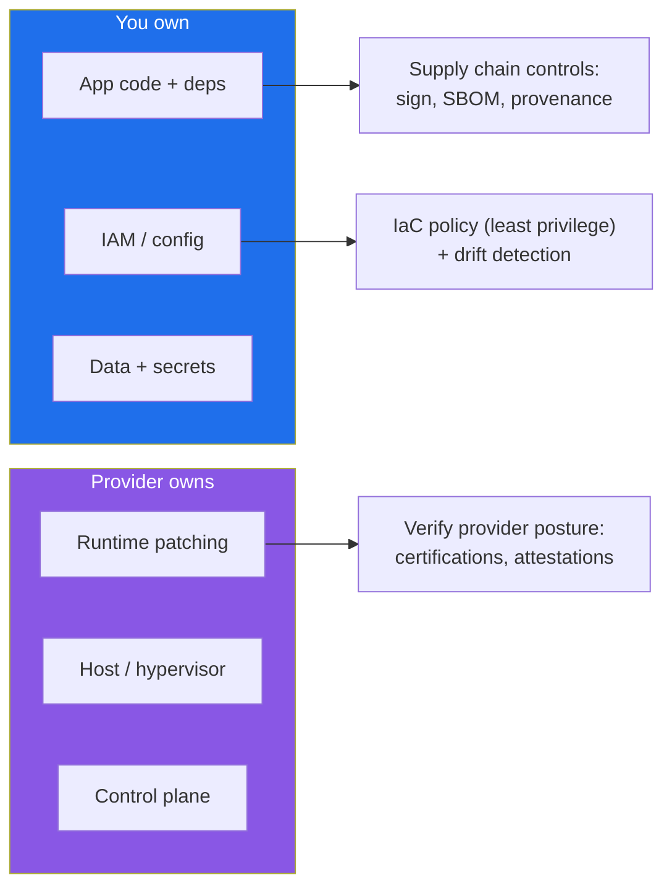
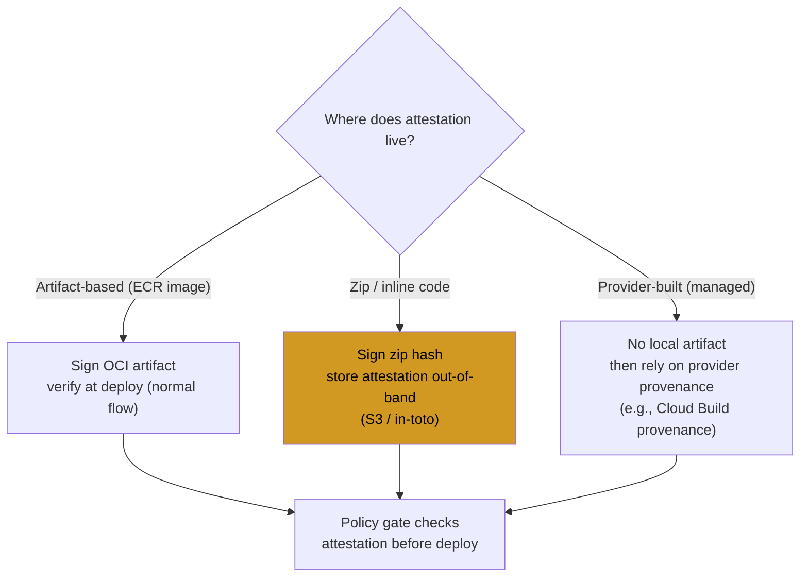

# Chapter 9 — Serverless, Managed Services, and the Cloud Provider Chain

*What this chapter covers.* The previous eight chapters of this book treated the artifact you
ship — a container image — as a thing you own end to end: you choose the base (Book 6, Chapter 3 —
Base Image Strategy), you scan it (Chapter 4), you sign it (Chapter 5), and an admission controller
you configure decides whether it runs (Chapter 6). Serverless and managed services move that
boundary. When you deploy an AWS Lambda function, a Google Cloud Run job, a managed Postgres, or a
Cognito user pool, a large part of the stack that you used to own — the operating system, the
language runtime, the patch cadence, the host kernel, the hypervisor — becomes the provider's
responsibility. That is a genuine security win: there is no base-image CVE for you to patch in the
Lambda runtime, because you do not build or own that runtime. But the supply chain does not
disappear when the boundary moves. It splits. On your side of the line you still own your code and
its dependencies (Book 2 — Dependency Management and Open Source Risk), and you have acquired a new,
large, mostly-opaque dependency: the cloud provider's own supply chain — their runtime, their
control plane, their marketplace, their build systems. This chapter is about where that boundary
actually sits for FaaS and managed services, what supply-chain controls survive on your side of it,
and how to reason about the irreducible trust you place in the provider on the other side.

Learning goals — after this chapter you should be able to:

- State the **shared-responsibility shift** precisely for FaaS and managed services: what the
  provider now owns (OS, runtime, patching, infra), what you still own (code, dependencies, config,
  IAM), and the fact that you now *depend on* the provider's supply chain as a new upstream.
- Map the **serverless supply chain** concretely on AWS Lambda, Google Cloud Functions, and Azure
  Functions — the deployment package, dependency bundling, **Lambda layers** as a shared-dependency
  vector, the managed runtime as a visibility gap, and **container-image Lambda** as an OCI artifact
  you scan and sign like any other.
- Describe **Lambda code signing with AWS Signer** accurately — what it signs, when it verifies, and
  its scope limits — as the FaaS equivalent of image signing (Book 6, Chapter 5).
- Treat **managed services and third-party SaaS** in the runtime path as supply-chain dependencies,
  and understand the **polyfill.io** and **Ledger connect-kit** incidents as runtime third-party
  compromises.
- Reason about the **cloud provider as an accepted, attested trust relationship**, vet marketplace
  and community images as third-party artifacts, and document the shared-responsibility boundary
  per service for both security and incident response.

---

## The boundary moves; it does not disappear

Start with the mental model everyone already carries and then correct it. The **shared
responsibility model** — AWS's phrasing, but Google, Microsoft, and every other provider publish
their own version of the same idea — draws a line between *security **of** the cloud* (the
provider's job) and *security **in** the cloud* (yours). For raw IaaS the line sits low: on EC2 you
own the guest OS, every package on it, the runtime, the app, and its dependencies; AWS owns the
hypervisor, the physical host, the network fabric, and the facility. As you move up the abstraction
ladder — from EC2 to a managed container platform to Lambda to a fully managed SaaS-like service —
the line rises, and the provider absorbs more of the stack.

The supply-chain consequence is the part that is usually left implicit. Everything below the line is
a slice of the supply chain the provider now operates *on your behalf*. When AWS patches the Amazon
Linux base that the Lambda Python runtime is built on, that is a base-image update you did not have
to schedule, test, or roll out. That is real and it is good: a meaningful fraction of the CVE churn
that dominates Chapter 4's vulnerability-management treadmill simply becomes someone else's treadmill.
But two things remain true. First, everything *above* the line is still yours, unchanged: your
handler code, the libraries it imports, the transitive dependency tree behind them, the same
malicious-package and known-vulnerability risks Book 2 spent ten chapters on. A dependency-confusion
attack (Book 2, Chapter 3) or a compromised transitive package (Book 1, Chapter 4 — event-stream,
ua-parser-js) lands in your Lambda deployment package exactly as it would in a container. Second, the
stack *below* the line did not vanish — it became a dependency. You now consume the provider's
runtime the way you consume any upstream, except you cannot see inside it, cannot generate an SBOM
for most of it, and cannot verify it independently. You have traded operational burden for opacity.



The rest of the chapter walks this diagram from top to bottom: your code and dependencies first
(where nothing has changed and everything from Book 2 still applies), then the shared and managed
runtime layers (where the interesting new mechanics live), then the provider trust relationship at
the bottom (where the only honest answer is "documented, accepted risk backed by attestation").

## The serverless supply chain, concretely

### What you actually ship

A serverless function is deployed in one of two forms, and the form determines which chapters of
this book apply to it.

The first form is a **deployment package**: a ZIP archive on AWS Lambda (up to 250 MB unzipped, 50
MB zipped for direct upload), a source or ZIP upload on Google Cloud Functions, or a package deployed
through the Functions host on Azure. The archive contains your handler plus your bundled
dependencies — `node_modules/`, a `site-packages`/vendored directory, compiled Go or Rust binaries.
This is your supply chain in the most literal sense: whatever your package manager resolved is now
sitting in that ZIP, and it was resolved by the same npm/pip/Go tooling, from the same registries,
with the same trust model, that Book 2 dissected. There is no container base image here, but there is
absolutely a dependency tree, and it deserves the same treatment: a lockfile with pinned, hashed
versions (Book 2, Chapter 2 — Versioning, Resolution, and Lockfiles), SCA scanning (Book 2, Chapter
6), and an **SBOM generated from the built package**, not from the source repo. Book 3, Chapter 8 —
SBOMs for Services covers exactly this: `syft` and equivalent tools can inventory a Lambda ZIP or a
function source tree, and that SBOM is what feeds your vulnerability correlation and VEX workflow
(Book 3, Chapter 6). The absence of a Dockerfile does not mean the absence of a bill of materials —
it means the bill of materials is easier to overlook.

The second form is a **container image** — Lambda has supported OCI images (up to 10 GB) since 2020,
and Cloud Run, Azure Container Apps, and Google Cloud Functions (2nd gen, which builds a container
under the hood) are container platforms by construction. When your function is an image, *everything*
in Book 6 Chapters 1–5 applies unchanged: it has a base image you should choose deliberately
(distroless or a minimal provider base — Chapter 3), layers you can inspect (Chapter 1), a digest you
scan (Chapter 4) and sign (Chapter 5), and a registry it lives in (Chapter 2 — for Lambda, an ECR
repository in your account). Container-image serverless is the case where the serverless supply chain
is *least* special: it is a container supply chain that happens to be invoked by an event instead of
scheduled by Kubernetes.

| Deployment model | What you own | What the provider owns | Supply-chain controls available to you |
|---|---|---|---|
| ZIP / package Lambda or function | Handler + bundled deps | Language runtime, OS, microVM, host | Lockfile + hashes; SCA; SBOM of the ZIP; **AWS Signer code signing**; least-privilege IAM |
| Container-image Lambda / Cloud Run / Container Apps | Image (base + deps + code) | Runtime base beneath your base; microVM/host | Full Book 6 Ch 1–5: base choice, scan, **cosign sign/verify**, digest pinning, registry controls |
| Lambda layer (shared dependency) | The layer *you* build/own | Hosting of the layer | Build reproducibly; pin by version ARN; SBOM the layer; avoid unvetted third-party layers |
| Managed service (DB, queue, auth, gateway) | Configuration (IaC) + your integration code | The service software + its supply chain | IaC security (Book 6 Ch 8); secure config; least-privilege; rely on provider attestation |
| Third-party SaaS in runtime path | The decision to depend + integration | The SaaS vendor's entire stack | Vendor risk (Book 8 Ch 3); SRI/pinning for scripts; egress monitoring; SaaSBOM |

### Lambda layers: shared dependencies with a shared blast radius

A **Lambda layer** is a ZIP archive of libraries, a runtime, or other content that Lambda extracts
to `/opt` in the execution environment before your handler runs. A function can attach up to five
layers, and their contents are merged onto the filesystem in order. The intent is DRY: share a fat
dependency (the AWS SDK, a data-science stack, an image-processing library, a custom runtime) across
many functions instead of bundling it into each ZIP. Extensions — long-running sidecar processes for
observability, secrets injection, or security agents — are also commonly delivered as layers.

Structurally, a layer is to a function what a base image is to a container: shared, reused code that
executes with the function's privileges but that the function author did not necessarily write or
review. That makes it the same class of supply-chain vector. A layer you build yourself carries your
own dependency risk (bundle a malicious npm package into a layer and every function that attaches it
inherits the package). A **third-party layer** — published by a vendor, a community author, or a
partner, referenced by ARN — is code you are executing without owning, and a compromise of that
layer's publisher poisons every function across every account that references it. The observability
agents shipped as extension layers are a particularly sharp example: they run as separate processes
in the execution environment, often with network egress, precisely so they can see and export your
telemetry — which is exactly the position a malicious extension would want.

Layers are versioned and referenced by a fully qualified ARN that ends in a version number
(`arn:aws:lambda:us-east-1:123456789012:layer:my-layer:7`). That version is immutable, which is your
friend: pin to a specific version ARN, never to a floating alias, so that a re-publish of the layer
cannot silently change what your functions execute — the same digest-pinning discipline Chapter 1
argued for images, applied to layers. The defenses are the familiar ones: prefer layers you build in
your own pipeline over third-party layers; when you must use a third-party layer, treat its publisher
as a vendor (Book 8, Chapter 3 — Vendor and Third-Party Software Risk); build layers reproducibly and
SBOM them like any other artifact; and re-publish trusted third-party layer contents into your own
account rather than referencing a foreign account's ARN across a trust boundary.



### The managed runtime: the visibility gap

Beneath your handler and your layers sits the **managed runtime**: the language runtime (a specific
Node.js, Python, Java, .NET, Go, or Ruby version), the bootstrap that invokes your handler, and the
Amazon Linux (or provider equivalent) userland it all runs on, inside a Firecracker microVM on
AWS's side. You do not build this, you do not patch it, and you cannot fully see into it. That is the
trade at its purest. The upside is concrete: when a CVE lands in the OpenSSL that ships with the
managed runtime, AWS patches the runtime fleet and you inherit the fix without a deploy — no base
image to rebuild, no rollout to coordinate, none of Chapter 4's operational load for *that* layer.
The downside is equally concrete: you cannot generate a complete, authoritative SBOM of the managed
runtime, so there is a slice of your running software's bill of materials that is permanently below
your visibility line (Book 3, Chapter 7 — SBOM Quality, Completeness, and Limitations; Chapter 8 —
SBOMs for Services names this gap explicitly). Providers publish the runtime's included libraries and
patch bulletins, and you can and should consume those, but that is *their* attestation about *their*
software, not something you verified. This is the trust relationship of Book 1, Chapter 6 (Trust,
Threat Models, and the Economics of Supply Chain Risk) made physical: you have chosen to trust the
provider's runtime supply chain, and the correct posture is to make that choice explicit rather than
to pretend the runtime is not part of your attack surface.

One operational wrinkle that is genuinely a supply-chain event: **runtime deprecation**. Providers do
not maintain old language runtimes forever. AWS publishes a deprecation schedule; once a runtime (say,
an old Node.js or Python minor) reaches end of support, Lambda first blocks you from *updating*
functions on it and later can block *creating* them, and the runtime stops receiving security patches.
The provider is, in effect, force-upgrading your dependency on their schedule, not yours. For a fleet
of hundreds of functions this is a recurring migration obligation you must track and budget for — the
managed-runtime analogue of a base image reaching EOL (Chapter 3), except the timeline is the
provider's to set.

### Deployment integrity: AWS Signer and Lambda code signing

For container-image functions the signing story is the one you already know: sign the image with
cosign, record it in a transparency log (Book 5, Chapter 3 — Sigstore Architecture; Chapter 5 —
Transparency Logs), and verify the signature before the image is allowed to run. For **ZIP-package**
Lambda functions there is a purpose-built equivalent: **AWS Signer** and **Lambda code signing**.

Mechanically: you create a **signing profile** in AWS Signer, which is backed by a code-signing
certificate AWS manages. When you build a deployment package, you sign it with that profile; Signer
produces a signed object stored in S3. On the Lambda side, you attach a **code signing configuration**
to the function. That configuration lists the ARNs of the signing profiles you trust and sets two
policies: what to do on an **untrusted signature** (a package not signed by a listed profile, or an
altered package whose signature no longer validates) and what to do on an **expired or revoked**
signature. Each policy is either `Warn` (allow but log) or `Enforce` (reject the deployment). With
`Enforce`, Lambda **verifies the signature at the point of deployment** — when you publish a new
version or update the function's code — and refuses to accept a package that is unsigned, signed by
an untrusted profile, or tampered with after signing. This is the FaaS realization of the same
control Chapter 5 built for images and Chapter 6 enforced at admission: a cryptographic check that
the code about to run is the code an authorized identity produced, gating the moment it enters the
runtime.

Two accuracy caveats you must carry, because getting them wrong leads to a false sense of coverage.
First, **Lambda code signing applies to ZIP deployment packages, not to container-image functions**.
If your function is an OCI image, AWS Signer's Lambda code-signing flow does not cover it; you secure
it as a container (sign the image, verify it in your delivery pipeline and via your registry/policy
controls — Book 6, Chapters 5 and 6). Do not assume a code-signing configuration protects an
image-based function. Second, signing establishes *authenticity and integrity* — that a trusted
identity produced this exact package — it does **not** establish that the package's *contents* are
free of vulnerable or malicious dependencies. A signed ZIP with a compromised npm dependency is a
faithfully signed compromised artifact. Signing and SCA/SBOM are orthogonal controls; you need both,
for the same reason a signed container still has to pass a scan.

### Event sources and the IAM execution role as blast radius

A function does not run in a vacuum; it is wired to **event sources** (an API Gateway route, an SQS
queue, an S3 bucket notification, an EventBridge rule, a Kinesis stream) and it runs with an **IAM
execution role** that grants it whatever permissions its code needs — read this bucket, write that
table, publish to this topic. That role is the function's blast radius, and it is entirely on your
side of the responsibility line. If a supply-chain compromise reaches into the function — a malicious
dependency, a poisoned layer, a tampered package that somehow bypassed signing — the attacker's reach
is bounded by exactly what that role can do. An over-broad role (`dynamodb:*` on all tables, `s3:*`
on all buckets, or the catastrophic `AdministratorAccess`) converts a single compromised function
into an account-wide incident; a least-privilege role scoped to the specific resources and actions
the function genuinely uses contains the same compromise to one bucket or one table. This is the
serverless instance of the argument Book 6, Chapter 8 made about IaC execution identity and Book 1,
Chapter 9 made about blast radius generally: at fleet scale, with thousands of functions, the
aggregate over-provisioning of execution roles *is* your serverless attack surface. Least-privilege
per function is not hygiene theater here — it is the primary containment mechanism for exactly the
supply-chain failures the rest of this chapter is about.

## Managed services as supply-chain dependencies

Serverless functions are the most visible managed offering, but the larger and quieter dependency is
the fleet of **managed services** a modern backend leans on: RDS/Aurora/Cloud SQL for databases, SQS
and Pub/Sub and managed Kafka for queues, ElastiCache/Memorystore for caches, Cognito and Auth0 and
Azure AD B2C for authentication, API Gateway for the edge, managed OpenSearch, managed secrets
stores, and so on. You do not run the software behind any of these. That means you have taken on
three distinct supply-chain dependencies for each one, and it helps to name them separately because
they are defended differently.

The first is the **provider's own software supply chain**. The managed database is running the
provider's build of PostgreSQL or their proprietary engine, patched by their pipeline, on their
infrastructure. A compromise in *their* build or patch process would reach you, and there is
essentially nothing you can do to detect or prevent it directly — this is the same irreducible trust
as the managed runtime, and it is discharged the same way: through the provider's compliance
attestations and your acceptance of the residual risk. The second is the **configuration supply
chain**: managed services are provisioned and configured by IaC (Book 6, Chapter 8 — Infrastructure
as Code Supply Chain Risks), and a poisoned module or a misconfigured resource is entirely yours to
own. The single most common managed-service breach is not a provider compromise at all; it is a
storage bucket, database, or search cluster left publicly accessible or with default weak settings.
Secure defaults and IaC misconfiguration scanning (Checkov, Trivy, Terrascan — Chapter 8) are your
controls here, and they matter far more day to day than the exotic provider-compromise scenario.

The third dependency is the sharpest one for supply-chain purposes: **managed services that run
*your* code**. A managed database executes stored procedures and functions you wrote. Edge platforms
run functions you deploy — **Lambda@Edge** and CloudFront Functions on AWS, Cloudflare Workers,
Fastly Compute — pushing your code and its dependencies out to hundreds of points of presence.
Managed event platforms run your transformation logic. In every one of these, your dependency tree
has been shipped into an environment the provider operates but that executes code you authored, which
means your Book 2 dependency risk now runs at the edge, in the database, or in the event pipeline —
often with weaker SBOM and scanning coverage than your core services get, precisely because these
deployment surfaces are easy to forget when you inventory "your software." The rule is simple and
frequently violated: if it runs your code, it is in scope for your SBOM, your SCA, and your signing —
no matter how managed the platform around it is.

## Third-party SaaS in the runtime path

There is a category of dependency that never appears in your `package.json`, your Dockerfile, or your
Terraform, yet executes in the critical path of every request: **third-party SaaS invoked at
runtime**. An external auth provider your login flow redirects through. A payments API your checkout
calls synchronously. A feature-flag service your code polls to decide behavior. An observability
agent that runs in-process and exports telemetry. And — the most dangerous of all because it executes
in your users' browsers with your origin's privileges — **third-party scripts** loaded from a vendor's
CDN. These are runtime supply-chain dependencies in the fullest sense (Book 1, Chapter 9 — Supply
Chain Security in Distributed Backend Systems; Book 3, Chapter 8): you did not build them, you cannot
scan them, and if the vendor turns malicious or is compromised, their code runs with your
application's trust, on your users, immediately, with no deploy on your part.

Two incidents make this concrete and should anchor how you think about the category.

**Ledger connect-kit, December 2023.** `@ledgerhq/connect-kit` is a library that decentralized
applications embed to let users connect Ledger hardware wallets. On 14 December 2023, an attacker
phished a former Ledger employee whose npm publishing access was still live, and pushed malicious
versions of the package (in the 1.1.x line) to npm. Crucially, many dApps loaded connect-kit not as a
pinned npm dependency but via a **CDN**, pulling the latest published build at runtime — so the
malicious code propagated into live front ends within minutes of publication. The injected payload was
a wallet-draining script that prompted users to approve transactions sending their assets to the
attacker. It was live for a few hours and drained on the order of hundreds of thousands of dollars
before Ledger and the ecosystem rotated the package and CDN. This is simultaneously an npm account
compromise (Book 2, Chapter 4 — Malicious Packages) and a runtime third-party-script compromise: the
CDN loading pattern is what turned a bad npm publish into an immediate live-site incident.

**polyfill.io, June 2024.** For years, `cdn.polyfill.io` served JavaScript polyfills to hundreds of
thousands of sites that embedded a `<script src="https://cdn.polyfill.io/...">` tag — a classic
third-party-script dependency loaded fresh on every page view. In early 2024 the domain and its
associated GitHub project changed hands to a new operator (widely reported as a Chinese company,
Funnull). In June 2024 the service began serving **malicious code** to a subset of visitors —
targeting mobile users, dynamically injecting redirects to scam and gambling sites, and evading
detection by varying the payload. The original polyfill author publicly warned that no site should
ever have trusted the domain after the handover, and Cloudflare and Fastly stood up clean mirrors so
sites could repoint. The mechanism is the one that matters: a script you embed by URL is a standing
grant of code execution to whoever controls that URL, and control can change hands or be compromised
without any change on your side. The number of affected sites was in the six figures.



The defenses are a blend of vendor risk management and technical pinning. For browser scripts:
prefer **Subresource Integrity (SRI)** hashes so a changed script fails to load rather than silently
executing; better still, self-host vetted copies so there is no standing third-party grant at all;
and use a Content Security Policy to constrain what embedded code can reach. For CDN-loaded npm
packages like connect-kit: pin an exact version *and its integrity hash*, never "latest." For
server-side SaaS in the request path: treat each vendor as exactly what it is — a dependency whose
compromise is your incident — and manage it as vendor risk (Book 8, Chapter 3), with contractual
attestations, egress monitoring to catch a SaaS integration suddenly talking to somewhere new, and a
tested fallback for when the dependency is unavailable or has to be cut off. And inventory them: the
CycloneDX notion of a services BOM — a **SaaSBOM** — exists precisely so that your third-party
*runtime* dependencies are enumerated with the same rigor as your build-time ones (Book 3, Chapter 8).
You cannot manage a dependency you have not written down.

## The cloud provider as a supply-chain dependency

Step back to the widest frame. Underneath the functions, the managed services, and even the IaaS VMs,
you are trusting the cloud provider's supply chain in its entirety: the hypervisor that isolates your
workload from your neighbors, the control plane that fulfills your API calls, the managed runtimes and
service software already discussed, and the catalog of **images and marketplace offerings** they hand
you as starting points. This is the largest single trust relationship in your stack and the most
opaque. You are not going to audit AWS's or Google's or Microsoft's internal build systems. The honest
framing, straight out of Book 1, Chapter 6, is that this is a **documented, accepted risk** — you
have decided the provider is trustworthy, and the engineering task is to make that decision explicit,
bounded, and backed by the best evidence available rather than by assumption.

What you *can* rely on: the provider's **compliance attestations and certifications** — SOC 2 Type II,
ISO 27001, PCI DSS, FedRAMP authorizations for government workloads, and the audit reports they make
available (through AWS Artifact, Google's compliance reports portal, the Microsoft Service Trust
Portal). These are independent third-party assessments of the provider's controls, including their
software-development and change-management practices. They are not the same as you verifying the
provider's runtime yourself — no attestation is — but they are structured, audited evidence, and they
are the currency in which cloud provider trust is actually denominated. Relying on them is not a
cop-out; it is the correct control for a dependency you cannot inspect directly, and it is what your
own auditors and customers will expect you to have done.

What you cannot do is verify the provider's internals, and you should be clear-eyed that a
**provider-side supply-chain compromise would be catastrophic and largely undetectable to you**. A
backdoor introduced into a managed runtime's build, a compromise of the control plane, or a tampered
service binary would reach every customer on that surface at once, and you would inherit the breach
with no signal on your side of the line. This is not a reason for paralysis — the probability is low,
the provider's incentives and scrutiny are enormous, and the attestations exist to raise the bar — but
it *is* a reason to keep the residual risk written down in your threat model rather than pretending the
managed stack has no attack surface because you cannot see it.

The place where provider trust becomes a concrete, everyday supply-chain decision is the **image and
marketplace catalog**. Cloud providers offer three tiers of pre-built images, and they are not equally
trustworthy. Provider-owned base images (Amazon Linux, the official managed-runtime bases) carry the
provider's own trust. **Marketplace** images and machine images are published by vendors and are
subject to some provider vetting, but the security posture and patch discipline of the *contents* are
the publisher's, not the provider's. **Community images** — community AMIs on AWS being the canonical
example — can be published by essentially anyone, and there is a documented history of malicious and
backdoored community AMIs: images seeded with cryptocurrency miners, hard-coded SSH keys, or
credential-exfiltration payloads, waiting for someone to launch them by name. Launching a random
community AMI is exactly the same act as `docker pull`-ing an unknown image from an untrusted registry
(Book 6, Chapter 2) or `npm install`-ing an unvetted package (Book 2) — it is running someone else's
code at high privilege on the strength of a name. Vet these artifacts like any third-party dependency:
prefer provider-owned or your own hardened images (build your own golden images — Book 6, Chapter 3),
treat marketplace images as vendor software subject to Book 8, Chapter 3 review, and treat community
images as untrusted until proven otherwise. The convenience of "just launch this AMI / deploy this
marketplace stack" is the exact convenience that makes it a supply-chain vector.



| Concern | You can control | You must trust (backed by attestation) |
|---|---|---|
| Handler / function code + dependencies | Yes — lockfiles, SCA, SBOM, signing | — |
| Lambda layers / extensions you build | Yes — build, pin, SBOM, own the ARN | — |
| Third-party layers / marketplace / community images | Vetting decision + re-hosting | Publisher's internal integrity |
| IAM roles, event wiring, service config | Yes — least privilege, IaC scanning | — |
| Managed language runtime + its patching | Consume bulletins; track deprecation | Provider's runtime build + patch pipeline |
| Managed service software (DB, queue, auth) | Configuration only | Provider's build + operation of the service |
| Hypervisor, control plane, host | — | Provider entirely (SOC 2 / ISO / FedRAMP) |

## What you can actually do

Strip away the framing and a concrete program falls out — a checklist that is deliberately the same
set of controls you have met throughout this suite, re-aimed at the serverless and managed surface.

- **Own your code and dependencies as if nothing changed** — because for that layer nothing did.
  Pinned, hashed lockfiles; SCA on every function and every managed-service integration; and an SBOM
  generated from the *built* artifact (the ZIP, the image, the edge bundle), not the source repo
  (Book 2; Book 3, Chapter 8). The most common serverless mistake is assuming "serverless" means
  "someone else's dependencies."
- **Sign what you deploy and verify before it runs.** AWS Signer with a `Enforce` code-signing
  configuration for ZIP-package Lambdas; cosign signing plus registry/admission verification for
  container-image functions and Cloud Run (Book 5; Book 6, Chapters 5–6). Remember the scope limit:
  Lambda code signing covers ZIPs, not images.
- **Vet layers, marketplace images, and SaaS as vendors.** Prefer your own layers and golden images;
  re-host trusted third-party layer contents into your own account and pin by immutable version ARN;
  treat marketplace and community images as untrusted third-party artifacts; and run every runtime SaaS
  and third-party script through vendor risk review (Book 8, Chapter 3), with SRI/self-hosting for
  browser scripts and exact-version-plus-hash pinning for CDN-loaded packages.
- **Least-privilege everything.** Scope every function's IAM execution role and every managed
  service's access to exactly what it uses. This is the containment layer that decides whether a
  supply-chain compromise is one bucket or the whole account.
- **Secure the configuration supply chain.** Managed services are provisioned by IaC; scan it for
  misconfiguration and enforce policy on it (Book 6, Chapter 8). Public buckets and default-open
  databases are a bigger real-world risk than provider compromise.
- **Document the shared-responsibility boundary per service** and rely on provider attestations for
  their side. Write down, for each managed surface, what is yours and what is theirs — for security
  design *and* for incident response, where "who patches this / who can even see the logs" must be
  answered before the incident, not during it (Book 8, Chapter 6 — Incident Response for Supply Chain
  Events).
- **Monitor the runtime third-party dependencies** you cannot pin away — egress monitoring to catch a
  SaaS integration or edge script suddenly reaching a new destination, and a tested plan to cut off a
  compromised dependency fast, because polyfill.io and connect-kit both measured their damage window in
  hours.

## Distributed-systems lens

At the scale this suite assumes — many teams, many repos, high deploy frequency — serverless and
managed services are a genuine reduction in supply-chain burden *and* a genuine expansion in
supply-chain surface, and mature organizations hold both facts at once. The reduction is real: across
a fleet of hundreds of functions and dozens of managed services, the provider has absorbed the OS and
runtime patching that would otherwise be the dominant line item in Chapter 4's vulnerability program.
You get to stop patching what you no longer own. The expansion is equally real: that same fleet is now
hundreds of small deployment surfaces (every function a ZIP or image with its own dependency tree),
plus dozens of managed services, plus a long tail of runtime SaaS integrations and edge scripts that
never show up in a source-tree scan. The failure mode at scale is not any single dramatic compromise;
it is *sprawl* — functions and integrations that no one has inventoried, deployed by teams that
treated "serverless" as "not my supply chain."

The operating discipline follows directly. **Inventory everything** with SBOMs for what you build and
SaaSBOMs for what you consume at runtime (Book 3, Chapter 8), so the fleet is enumerable rather than
folkloric. **Sign and verify** every artifact you deploy, uniformly, so provenance holds across the
whole surface and not just the container-shaped part of it. **Least-privilege everything**, because
with hundreds of execution roles the aggregate blast radius is set by your worst-provisioned function,
not your best. **Make the shared-responsibility boundary explicit per service** — a written line, not
an assumption — because at fleet scale the ambiguity of "who owns this layer" is what turns a routine
CVE or a provider deprecation notice into an unowned, unpatched gap, and it is what makes incident
response flounder when the affected component sits on the provider's side of a line nobody drew (Book
8, Chapter 6). And **accept the provider trust deliberately** — write it into the threat model as a
residual risk backed by SOC 2 / ISO 27001 / FedRAMP attestation, so that the one part of the chain you
truly cannot control is a conscious, bounded decision rather than a blind spot.

The sentence to leave with is the one this chapter has been arguing from the first paragraph: managed
and serverless is not "no supply chain." It is a *different, provider-shared* supply chain — smaller on
your side of the line, larger and more opaque on theirs — and securing it means being precise about
where the line sits, owning your side of it completely, and trusting the other side explicitly.

### Serverless supply chain threat map



### Managed service: shared responsibility



### Serverless attestation gap



## Key takeaways

- **The boundary moves; it does not disappear.** FaaS and managed services shift the OS, runtime,
  patching, and infrastructure to the provider — a real win, no managed-runtime CVEs for you to
  patch — but your code and dependencies remain fully yours, and the provider's supply chain becomes a
  new upstream dependency you cannot fully verify.
- **Your function dependencies are your supply chain, unchanged.** ZIP or image, the dependency tree
  is resolved by the same tooling from the same registries with the same risks as Book 2. Lockfile,
  SCA, and SBOM the built artifact — the absence of a Dockerfile does not mean the absence of a bill of
  materials.
- **Lambda layers are shared dependencies with a shared blast radius.** A poisoned or unvetted
  third-party layer or extension affects every function that attaches it. Prefer your own layers, pin
  by immutable version ARN, and re-host trusted third-party layers into your own account.
- **The managed runtime is a visibility gap you trust, plus a forced-upgrade obligation.** You cannot
  fully SBOM it, and runtime deprecation force-migrates you on the provider's schedule — a recurring
  fleet-wide task to budget for.
- **Sign what you deploy — with the right tool and its real scope.** AWS Signer plus an `Enforce`
  code-signing configuration verifies ZIP deployment packages at deploy time; container-image
  functions are signed and verified as containers (Book 6, Chapters 5–6). Signing proves authenticity,
  not the absence of vulnerable dependencies — you need both.
- **Managed services are three dependencies:** the provider's software supply chain (trust +
  attestation), the configuration supply chain (yours — IaC security, Book 6, Chapter 8), and any
  surface that runs *your* code (edge functions, stored procedures — in scope for your SBOM/SCA/signing).
- **Runtime SaaS and third-party scripts execute with your trust.** polyfill.io (June 2024) and Ledger
  connect-kit (December 2023) show that a CDN-loaded script or SaaS integration turning malicious is
  your live incident within hours. Pin with SRI/self-hosting, exact-version-plus-hash for CDN packages,
  manage as vendor risk, and inventory with a SaaSBOM.
- **The cloud provider is a documented, accepted trust relationship** backed by SOC 2 / ISO 27001 /
  FedRAMP attestations — evidence, not verification. Vet marketplace and especially community images
  like any untrusted third-party artifact; a malicious community AMI is `npm install` at host privilege.
- **Least-privilege IAM per function and per service is the containment layer** that decides whether a
  supply-chain compromise is one bucket or the whole account.


```bash
# Verify a Lambda code-signing configuration still enforces the expected publisher (as of early 2026, ZIP only)
aws lambda get-code-signing-config --code-signing-config-arn arn:aws:lambda:us-east-1:123456789012:code-signing-config:csc-abc123 \
  --query 'CodeSigningConfig.CodeSigningPolicies.UntrustedArtifactOnDeployment'
# Expected: "Enforce"  —  "Warn" lets unsigned code deploy; audit regularly with AWS Config rule
```

```json
{
  "CodeSigningConfig": {
    "CodeSigningConfigId": "csc-abc123",
    "AllowedPublishers": { "SigningProfileVersionArns": ["arn:aws:signer:us-east-1:123456789012:/signing-profiles/acme-lambda/AbCdEf123"] },
    "CodeSigningPolicies": { "UntrustedArtifactOnDeployment": "Enforce" }
  }
}
```

## Further reading

- AWS, "Shared Responsibility Model" — the canonical statement of security *of* vs *in* the cloud;
  Google Cloud and Microsoft publish equivalent shared-responsibility documentation.
- AWS Lambda Developer Guide — "Lambda layers," "Lambda extensions," "Deploying Lambda functions as
  container images," and "Runtime deprecation policy."
- AWS, "Configuring code signing for AWS Lambda" and AWS Signer Developer Guide — signing profiles,
  code-signing configurations, and the `Warn`/`Enforce` signature-validation policies (note the
  ZIP-only scope).
- Google Cloud Functions and Cloud Run documentation; Azure Functions documentation — deployment
  models, runtimes, and the managed-runtime patching posture for the other major providers.
- The Sansec and BleepingComputer reporting on the **polyfill.io** supply-chain attack (June 2024),
  and Cloudflare's and Fastly's mirror announcements.
- Ledger's incident disclosure and community post-mortems on the **@ledgerhq/connect-kit** compromise
  (14 December 2023).
- W3C, "Subresource Integrity (SRI)" specification, and MDN's SRI and Content Security Policy guides —
  the browser-side controls for third-party scripts.
- CycloneDX documentation on **services** and the SaaSBOM concept — enumerating runtime third-party
  dependencies.
- Provider compliance portals — AWS Artifact, Google Cloud compliance reports, Microsoft Service Trust
  Portal — for SOC 2, ISO 27001, PCI DSS, and FedRAMP attestations.
- Cross-references in this suite: Book 1, Chapter 6 — Trust, Threat Models, and the Economics of Supply
  Chain Risk; Book 1, Chapter 9 — Supply Chain Security in Distributed Backend Systems; Book 2 —
  Dependency Management and Open Source Risk (Chapters 2, 3, 4, 6); Book 3, Chapter 7 — SBOM Quality,
  Completeness, and Limitations; Book 3, Chapter 8 — SBOMs for Services: Containers, Serverless, and
  SaaS; Book 5, Chapters 3 and 5 — Sigstore Architecture and Transparency Logs; Book 6, Chapters 1–6
  and Chapter 8 — the container and IaC supply chain; Book 8, Chapter 3 — Vendor and Third-Party
  Software Risk; Book 8, Chapter 6 — Incident Response for Supply Chain Events.


- **Shared Responsibility Model** — https://aws.amazon.com/compliance/shared-responsibility-model/ , https://cloud.google.com/architecture/framework/security/shared-responsibility , https://learn.microsoft.com/en-us/azure/security/fundamentals/shared-responsibility
- **AWS Lambda and code signing** — https://docs.aws.amazon.com/lambda/latest/dg/lambda-layers.html and https://docs.aws.amazon.com/lambda/latest/dg/configuration-codesigning.html
- **W3C Subresource Integrity (SRI) and CSP** — https://www.w3.org/TR/SRI/ and https://developer.mozilla.org/en-US/docs/Web/Security/Subresource_Integrity
- **CycloneDX services / SaaSBOM** — https://cyclonedx.org/capabilities/saasbom/ and https://cyclonedx.org/specification/overview/
- **Sigstore, SLSA, and provider compliance portals** — https://docs.sigstore.dev/ , https://slsa.dev/spec/v1.0/ , https://aws.amazon.com/artifact/ , https://cloud.google.com/security/compliance
- **Polyfill.io and Ledger connect-kit incident write-ups** — https://sansec.io/research/polyfill-supply-chain-attack and https://www.ledger.com/blog/security-incident-disclosure
