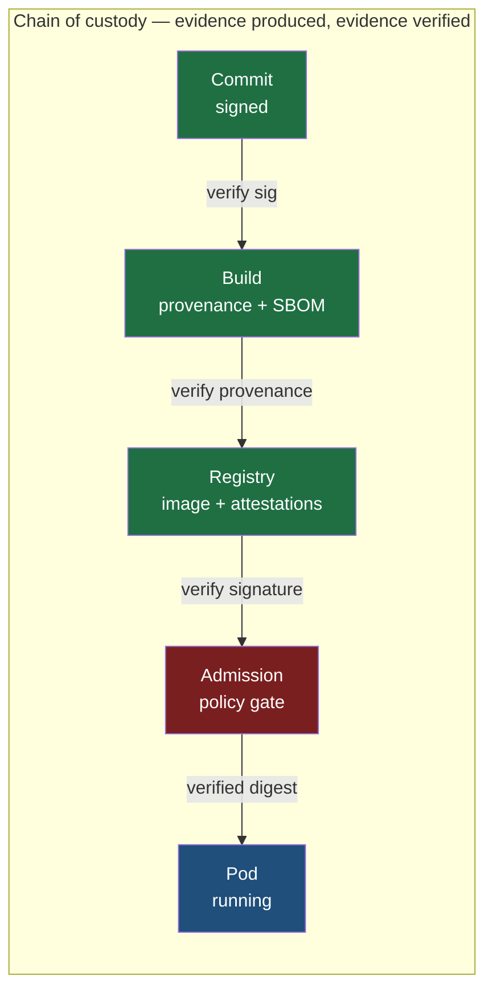
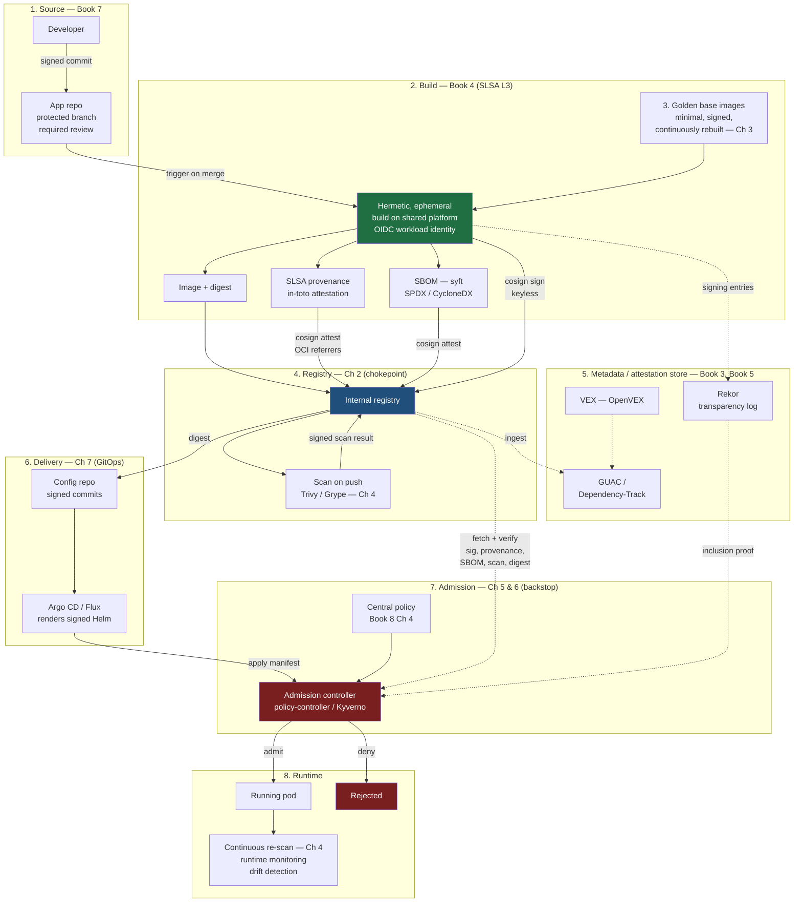
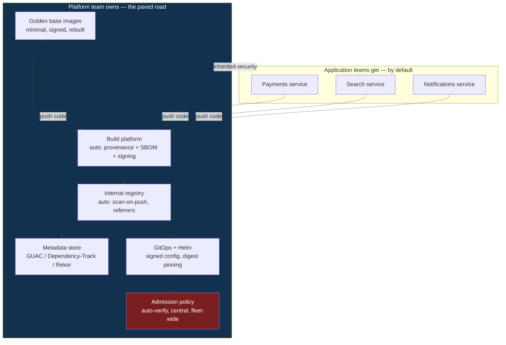
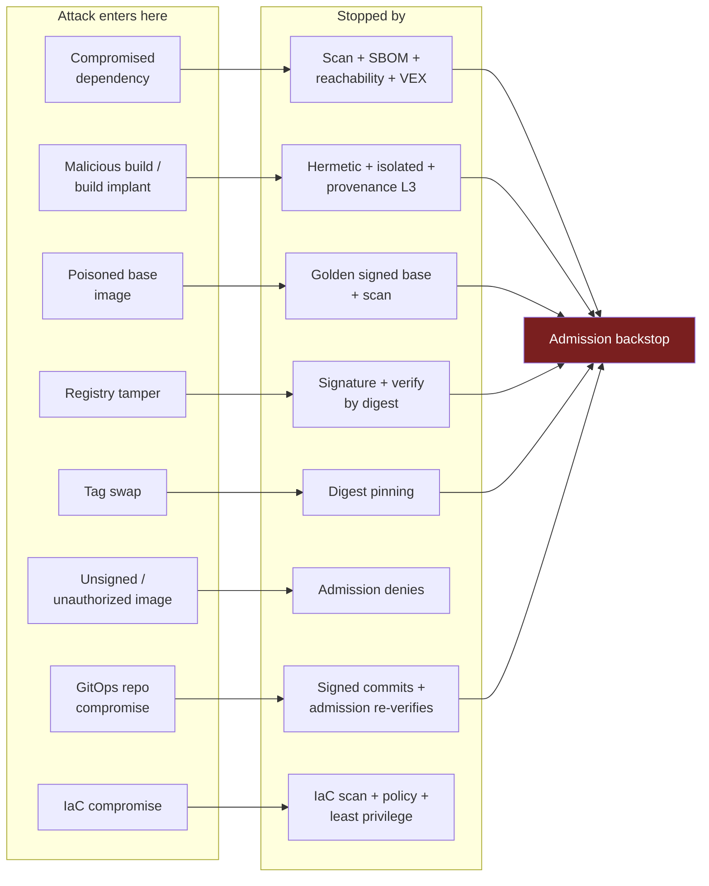
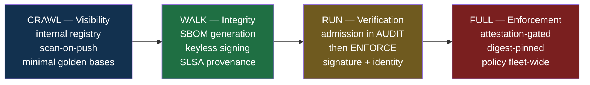
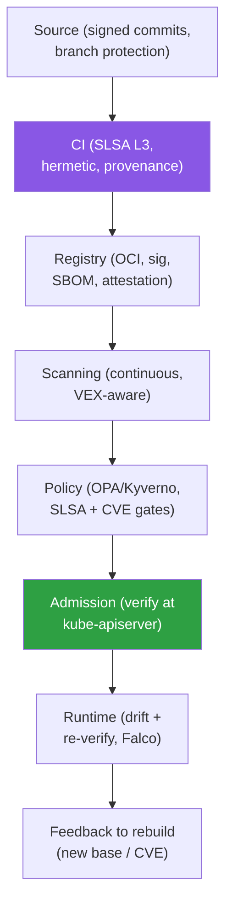
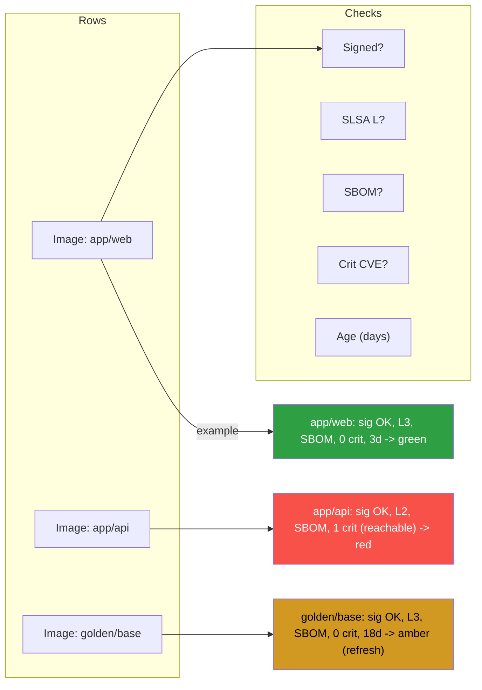

# Chapter 10 — A Cloud-Native Supply Chain Reference Architecture

*What this chapter covers.* Every prior chapter in this book handed you one control. Chapter 1
(Container Images) explained the OCI format and content-addressable digests. Chapter 2 (Container
Registries) made the registry the storage chokepoint and the referrers API the place attestations
live. Chapter 3 (Base Image Strategy) gave you golden, minimal, continuously-rebuilt bases. Chapter
4 (Image Scanning) gave you vulnerability visibility on push and at rest. Chapter 5 (Image Signing
and Verification in Kubernetes) put a cryptographic signature on the image and a verifier at the
cluster edge. Chapter 6 (Admission Control and Policy Engines) turned that verifier into an
enforcing gate. Chapter 7 (Kubernetes Delivery Chains) wired GitOps between the registry and the
cluster. Chapter 8 (Infrastructure as Code Supply Chain Risks) secured the substrate the cluster
runs on. Chapter 9 (serverless) extended the model past long-lived pods.

This chapter does something different: it **integrates** them, and integrates them with the rest of
the suite — build provenance from Book 4, signing and attestation from Book 5, SBOMs from Book 3,
source integrity from Book 7 — into a single, concrete, buildable reference architecture for
securing the supply chain of a cloud-native, containerized, distributed backend. It is the capstone.
It is opinionated on purpose. The thesis is simple and load-bearing: **no single control secures a
cloud-native supply chain; security is an unbroken, verified chain of custody from a signed commit to
a running pod, in which every artifact carries verifiable metadata and every boundary verifies it.**

Learning goals — after this chapter you should be able to:

- State the **chain-of-custody thesis** precisely and name what evidence each stage produces and
  what each boundary verifies.
- Walk the **end-to-end reference architecture** stage by stage — source, build, base, registry,
  metadata store, delivery, admission, runtime — and say what artifact and what attestation crosses
  each edge.
- Describe the **paved-road control plane**: what the platform team owns so that application teams
  inherit the entire secure chain by default, and where central policy is enforced fleet-wide.
- **Map the architecture to frameworks** — SLSA v1.0 Build L3, image signing and verification, SBOM
  coverage, verified deployment — and to the regulatory drivers behind them.
- **Validate the design against a threat model**: for each classic supply-chain attack, name the
  control that stops it and the chapter it came from.
- Sequence a realistic **crawl/walk/run adoption roadmap** with warn-then-enforce rollout, tiered
  policy for internal versus third-party images, and an exception process with expiry.
- Choose **coverage and MTTR metrics** that prove the chain is closed — and answer the end-state
  test: can an unsigned, unscanned, unauthorized-source, tag-mutable image reach production?

---

## The thesis: chain of custody, not a pile of controls

Most organizations accumulate supply-chain controls the way they accumulate monitoring dashboards:
one at a time, each solving a local pain, none aware of the others. They turn on registry scanning
after an audit finding. They add image signing after reading about a registry breach. They stand up
Kyverno after a crypto-miner runs in a namespace. Each control is real, and each is nearly worthless
in isolation, because an attacker does not need to defeat your strongest control — they need to find
the one edge no control watches.

Signing without verification is theatre: you sign every image and admit unsigned ones anyway.
Verification without provenance proves *someone* signed the image, not that a *trusted build* produced
it — a signature from a leaked key or a compromised laptop verifies just fine. Provenance without
admission enforcement produces a beautiful, unread attestation sitting in the registry while the
cluster pulls whatever digest the deployment names. Scanning without a gate produces a report nobody
blocks on. SBOMs without a queryable store are JSON nobody can answer "am I affected?" with when the
next Log4Shell (Book 1, Chapter 5 — Case Studies III) drops at 2 a.m.

The architecture in this chapter is built on one idea, borrowed from physical evidence handling and
from **in-toto** (Book 5, Chapter 6 — in-toto: Attestations, Layouts, and Policies): a **chain of
custody**. Each stage of the pipeline is a link. Each link *produces verifiable evidence* about what
it did — a signed provenance statement, a signed SBOM, a signed scan result, a signature over the
image digest. Each *boundary between links verifies* the evidence from the prior link before it acts.
The image digest is the thread that runs through the whole chain: because an OCI digest is the
SHA-256 of the manifest (Book 6, Chapter 1 — Container Images), every attestation binds to a digest,
and every verifier can confirm that the thing it is about to run is *the exact bytes* the evidence
describes. Break any link and the next boundary refuses to proceed. That is the whole design. The
rest of the chapter is mechanism.



Two properties make this more than a slogan. First, the evidence is **cryptographically bound** to
content, not to names: a signature over `sha256:abc…` cannot be transplanted onto a different image,
and a tag pointing somewhere else cannot smuggle unverified bytes past a digest-checking gate.
Second, the verification is **enforced at a chokepoint that cannot be bypassed** — the admission
controller — so that even if every earlier link is compromised, the last boundary still refuses an
image that lacks the required, valid evidence. Produce verifiable evidence at every step; verify at
every boundary. Everything below is the concrete wiring.

---

## The end-to-end reference architecture

Here is the whole thing. Read it top to bottom; the sections that follow walk each stage and say
exactly what crosses each edge.



### Stage 1 — Source: establishing a trusted origin

The chain starts before any container exists, at the commit. Book 7 (Source, Code, and Insider
Threat Security) is the authority here; the reference architecture *requires* three things from it.
Commits to the release branch are **signed** — Sigstore `gitsign` for keyless commit signing tied to
an OIDC identity, or GPG/SSH signing — so the build system can attribute a commit to a real
developer identity rather than trusting an unauthenticated `Author:` header. The release branch is
**protected**: no direct pushes, linear history or merge-commit rules enforced, force-push disabled.
And every change is **reviewed** under a required-reviewers rule, so no single account — human or
compromised token — can move code to the branch the build system trusts. The output of this stage is
not an artifact; it is a *property*: the commit the build will consume is attributable, reviewed, and
tamper-evident. That property is the first link, and the build stage verifies it before it starts.

### Stage 2 — Build: producing signed evidence (SLSA Build L3)

The build is where evidence is born. This is the domain of Book 4, and specifically of Chapter 4.10
(Designing a Secure Build Platform at Scale) and Chapter 4.3 (SLSA Build Levels and Provenance). The
reference build has four non-negotiable properties, and they map directly onto **SLSA v1.0 Build
Level 3**:

- **Hermetic** (Book 4, Chapter 2 — Hermetic and Reproducible Builds): dependencies are fetched
  before the build from pinned, verified sources; the build step itself has no arbitrary network
  egress, so a malicious `postinstall` cannot phone home or pull an attacker payload mid-build.
- **Isolated and ephemeral** (Book 4, Chapter 8 — Ephemeral and Isolated Build Environments): each
  build runs in a fresh environment that is destroyed afterward, so one tenant's build cannot
  influence another's and no persistent implant survives between runs.
- **Provenance-generating**: the platform — not the user's build script — generates a **SLSA
  provenance** in-toto attestation describing what was built, from which source commit, with which
  builder, and records it. Because the platform controls provenance generation and the build cannot
  forge it, this is what lifts the build from L2 to **L3**.
- **Signed by build identity**: the image, the provenance, and the SBOM are all signed using
  **keyless signing** (Book 5, Chapter 4 — Keyless Signing and Workload Identity). The build's OIDC
  workload identity is exchanged with **Fulcio** for a short-lived certificate; the signing event is
  recorded in **Rekor**. There is no long-lived signing key to steal.

Concretely, on the shared build platform, the tail of a build looks like this:

```bash
# 1. Build the image (hermetic; base pulled from the internal golden-base registry, by digest)
IMAGE="registry.internal/team-payments/api"
DIGEST=$(buildctl build ... --output type=image,name=$IMAGE,push=true | grep -oE 'sha256:[a-f0-9]+')
REF="$IMAGE@$DIGEST"

# 2. Generate the SBOM from the built image and attest it (keyless)
syft "$REF" -o spdx-json > sbom.spdx.json
COSIGN_EXPERIMENTAL=1 cosign attest --yes \
  --predicate sbom.spdx.json --type spdxjson "$REF"

# 3. Sign the image itself (keyless — OIDC identity -> Fulcio cert -> Rekor entry)
COSIGN_EXPERIMENTAL=1 cosign sign --yes "$REF"

# 4. SLSA provenance is emitted by the *platform*, not this script, and attested to the same digest:
#    cosign attest --type slsaprovenance --predicate provenance.json "$REF"
```

The critical discipline: **the build script cannot opt out.** Signing, SBOM generation, and
provenance are platform behaviors wrapped around the user's build, not steps the user's YAML is
trusted to include. A team cannot ship an unsigned image by deleting a line, because the line is not
theirs to delete. This is the paved-road principle applied to the most sensitive stage.

### Stage 3 — Base images: a golden, signed foundation

The build does not pull `FROM ubuntu:latest` off the public internet. It pulls a **golden base**
(Book 6, Chapter 3 — Base Image Strategy) from the internal registry, *by digest*, and the base is
itself a signed artifact produced by the same secure build platform. Golden bases are minimal
(distroless or a hardened slim image), which shrinks the vulnerability surface the scanner will find
in Stage 4; they are **continuously rebuilt** so that a CVE in the base is fixed by a rebase-and-roll
rather than by a per-team scramble; and they are signed and attested exactly like application images.
The base is a link in the chain of custody too: its signature and provenance are verifiable, so an
application image's SBOM transitively covers a *trusted* base rather than an arbitrary one. A
poisoned public base (the analog of the attack the golden-base program exists to stop) never enters
the chain because the build platform is configured to pull bases only from the internal, signed set.

### Stage 4 — Registry: the storage chokepoint

Every artifact converges on the internal registry (Book 6, Chapter 2 — Container Registries). This is
deliberately the **chokepoint** of the architecture: one place through which all images flow, which
means one place to scan, one place to store attestations, and one place admission can trust as the
source of truth. The registry stores, keyed to each image digest:

- the **image** manifest and layers;
- the **image signature** (a `cosign` signature is itself an OCI artifact);
- the **SBOM attestation** and the **provenance attestation**, discoverable via the **OCI referrers
  API** (Book 6, Chapter 1) so a verifier can ask "what attestations reference `sha256:abc…`?" and
  get back the signed SBOM, provenance, and scan results;
- the **scan result**, produced by **scan-on-push** (Book 6, Chapter 4 — Image Scanning) with Trivy
  or Grype, and itself signed and attested so admission can trust it later.

Because attestations are attached *by digest* through referrers, moving or deleting a tag cannot orphan
or swap the evidence — the evidence is bound to bytes. The registry is a tier-0 dependency of the
whole platform; its availability gates every deploy, and its integrity gates every verification.

### Stage 5 — Metadata and attestation store: making evidence queryable

Attestations attached in the registry answer "what is true about this one image?" A separate
**metadata store** answers the fleet-wide questions: "which running images depend on `log4j-core`?",
"which images were built from an unpatched base?", "does this CVE actually reach code we run?"
(Book 3, Chapter 5 — SBOM Distribution, Storage, and Querying at Scale). The architecture centralizes
SBOMs, provenance, and **VEX** (Vulnerability Exploitability eXchange — OpenVEX; Book 3, Chapter 6 —
VEX and Vulnerability Correlation) into a queryable graph — **GUAC** ingesting attestations and SBOMs,
or **Dependency-Track** for continuous component-level monitoring. VEX is what converts a raw scan
finding ("this CVE is present in a bundled library") into an actionable one ("…and it is reachable,
so it is affected" versus "…but the vulnerable path is not built in, so it is not_affected"), which
is the difference between a page and a note (Book 2, Chapter 7 — Reachability, Exploitability, and
Prioritization).

Orthogonally, every signing event lives in the **Rekor transparency log** (Book 5, Chapter 5 —
Transparency Logs). Rekor gives the whole system a tamper-evident, append-only record of *what was
signed, by which identity, when* — so that even a later compromise of a signing identity cannot
rewrite history, and admission can demand a Rekor inclusion proof as part of verification.

### Stage 6 — Delivery: GitOps between registry and cluster

Nothing pushes to the cluster imperatively. Deployment is **GitOps** (Book 6, Chapter 7 — Kubernetes
Delivery Chains): the desired state of each cluster lives in a config repository, changes to it are
**signed commits** through the same protected-branch discipline as source, and **Argo CD** or **Flux**
reconciles the cluster to match. Helm charts are rendered from pinned, signed chart versions. Critically,
the deployment manifest names images **by digest, not by tag** — the digest that came out of the build
and through the registry — so the thing GitOps asks the cluster to run is the exact thing the evidence
describes. The config repo is a high-value target (whoever controls it controls what deploys), which is
why it does not stand alone: the next stage verifies regardless of what GitOps applied.

### Stage 7 — Admission: the backstop that cannot be bypassed

The admission controller is the last boundary and the one that makes the architecture enforcing rather
than advisory (Book 6, Chapter 5 — Image Signing and Verification in Kubernetes; Chapter 6 — Admission
Control and Policy Engines). Every pod-creating request in every cluster passes through it. For each
image, the controller — Sigstore's **policy-controller** or **Kyverno** — verifies, against **central
policy**:

1. the image is **signed** by the expected identity;
2. the signer is the **expected build workload identity** (the OIDC subject and issuer of the CI
   platform), not merely *some* valid Fulcio certificate — this is the check that distinguishes "our
   build signed it" from "someone with a working laptop signed it";
3. the required **attestations exist and verify**: a SLSA provenance whose builder and source repo
   match policy, an SBOM, and a passing scan result;
4. the reference is **digest-pinned** — tags are rejected, so nothing mutable can slip through;
5. optionally, a **Rekor inclusion proof** confirms the signature is logged.

A Kyverno rule that ties several of these together:

```yaml
apiVersion: kyverno.io/v1
kind: ClusterPolicy
metadata:
  name: verify-supply-chain
spec:
  validationFailureAction: Enforce      # audit first, then Enforce (Ch 6)
  rules:
    - name: require-signed-and-attested
      match:
        any:
          - resources:
              kinds: ["Pod"]
      verifyImages:
        - imageReferences:
            - "registry.internal/*"
          # keyless: identity must be OUR build platform, not any Fulcio cert
          attestors:
            - entries:
                - keyless:
                    issuer: "https://token.actions.githubusercontent.com"
                    subject: "https://github.com/acme/build-platform/.github/workflows/build.yaml@refs/heads/main"
                    rekor:
                      url: "https://rekor.internal"
          # require SLSA provenance whose source repo matches
          attestations:
            - type: "https://slsa.dev/provenance/v1"
              conditions:
                - all:
                    - key: "{{ buildDefinition.externalParameters.source }}"
                      operator: Equals
                      value: "git+https://github.com/acme/*"
    - name: reject-mutable-tags
      match:
        any:
          - resources: { kinds: ["Pod"] }
      validate:
        message: "images must be pinned by digest"
        pattern:
          spec:
            containers:
              - image: "*@sha256:*"
```

Admission is where the whole chain of custody is *cashed in*. Every earlier link produced evidence;
this boundary is where the evidence is finally required. Note the design property that gives the
architecture its resilience: **admission verifies independently of how the image arrived.** If the
GitOps repo is compromised and points at a malicious digest, admission still demands a valid signature
from the expected build identity — which the attacker's image will not have. The gate does not trust
the pipeline; it trusts the evidence.

### Stage 8 — Runtime: the chain does not end at admission

Admission verifies a point in time; production is continuous. A CVE disclosed tomorrow was invisible
to yesterday's scan. So the architecture keeps working after the pod starts: **continuous re-scanning**
of running images against fresh vulnerability data (Book 6, Chapter 4), correlated back through the
metadata store so "which running workloads are affected by CVE-2026-xxxx?" is a query, not an
investigation; **runtime monitoring** for anomalous process, file, and network behavior (the runtime
analog of build observability, Book 4, Chapter 9 — Build Observability and Anomaly Detection); and
**drift detection** — GitOps controllers already flag when live state diverges from the signed config
repo, which turns "someone `kubectl edit`-ed a Deployment" into an alert. The loop closes: findings at
runtime feed VEX and prioritization, which feed the next rebuild and redeploy.

---

## The control plane view: a paved road

The architecture above has eight stages and a dozen components. No application team can or should
assemble that themselves. The organizing principle — the one that makes this adoptable rather than
aspirational — is the **paved road** (Book 1, Chapter 10 — Building a Supply Chain Security Program;
Book 4, Chapter 10 — Designing a Secure Build Platform at Scale): a central platform team owns the
secure chain, and application teams *inherit the entire thing by using the platform*, at little or no
extra effort of their own.



The division of labor is exact. The platform provides golden bases, the hardened build platform that
auto-generates provenance and SBOMs and signs everything, the internal registry that auto-scans and
stores attestations by digest, the metadata store, the GitOps machinery, and the admission policy. A
team's obligation is to *push reviewed, signed code to a repo the platform builds.* In return they get
a signed image with provenance and an SBOM, stored and scanned, deployed via GitOps, and verified at
admission — the full chain — without writing a single `cosign` command or Kyverno policy. Security is
**inherited, not implemented per team.**

Two design properties make the paved road strong. First, **the secure path is the easy path** — often
the *only* supported path. A team that wants to deploy uses the platform because the platform is how
you deploy; the security comes along for free, which defeats the usual failure mode where the secure
option is the inconvenient option and nobody chooses it. Second, **enforcement is central and uniform**:
admission policy is authored once by the platform/security team (Book 8, Chapter 4 — Policy as Code and
Continuous Compliance), distributed to every cluster, and applied identically fleet-wide. There is no
per-cluster policy drift, no cluster where the rule is quietly disabled, and — because the gate sits at
admission in the API server request path — **no bypass**. An image that skips the paved road and gets
pushed straight to a cluster still hits the same gate and still lacks the evidence, so it is still
denied. The paved road is a default, not a fence; admission is the fence.

---

## Mapping to SLSA and framework requirements

Auditors, customers, and regulators do not ask "is your chain of custody unbroken?" They ask "what
SLSA level do you attest?" and "do you produce SBOMs?" and "can you show verified deployment?" The
architecture answers these directly; the mapping is not a retrofit, it is how the components were
chosen. (Framework background: Book 1, Chapter 7 — Risk Frameworks and Maturity Models; adoption
roadmaps: Book 8, Chapter 2 — Adopting SLSA and S2C2F; regulatory drivers such as EO 14028, NIST SSDF,
and the EU Cyber Resilience Act: Book 8, Chapter 1 — The Regulatory Landscape.)

| Requirement | Framework anchor | How the architecture satisfies it |
|---|---|---|
| Scripted, provenance-emitting build | SLSA v1.0 Build L1–L2 | Platform build emits SLSA provenance in-toto attestation for every image (Stage 2; Book 4 Ch 3) |
| Provenance unforgeable by the build | SLSA v1.0 Build L3 | Provenance generated by the *platform*, not user build steps; hermetic + isolated + ephemeral builds (Stages 2–3; Book 4 Ch 2, 8) |
| Signed artifacts, verifiable identity | Sigstore / code signing | Keyless signing via Fulcio + workload identity; Rekor transparency log (Stages 2, 5; Book 5 Ch 4–5) |
| Component transparency | SBOM (SPDX 2.3 / CycloneDX 1.6) | syft-generated SBOM attested per image; centralized, queryable store (Stages 2, 5; Book 3) |
| Vulnerability status, not just presence | VEX (OpenVEX) | VEX statements in the metadata store gate real exploitability (Stage 5; Book 3 Ch 6, Book 2 Ch 7) |
| Verified, policy-gated deployment | NIST SSDF PW/PS; internal policy | Admission verifies signature + build identity + provenance + SBOM + scan + digest, fleet-wide (Stage 7; Book 6 Ch 5–6) |
| Tamper-evident record of decisions | Transparency / audit | Rekor inclusion proofs; GitOps signed-commit history; admission audit logs (Stages 5–7) |

The point of the table is that **SLSA Build L3 is not a checkbox bolted on at the end**; it is an
emergent property of a build platform that is hermetic, isolated, ephemeral, and the sole author of
provenance. Likewise "SBOM everywhere" is not a compliance chore but the substrate that makes runtime
CVE response a query. The frameworks are satisfied because the architecture is right, not the other way
around.

---

## Threat-model validation: showing the chain holds

An architecture is only as good as the attacks it stops. Below, each row is a real class of
supply-chain attack (grounded in the incidents of Book 1, Chapters 3–5), the control or controls in
this architecture that stop it, and where in the suite that control was built. The design principle to
notice: most attacks are stopped by *more than one* control, so a single failed link does not open the
door — this is defense in depth realized as a chain where later boundaries re-verify.



The full mapping, attack to control to chapter:

| Attack | What the attacker does | Control(s) in the architecture | Chapter(s) |
|---|---|---|---|
| Compromised dependency | Ships malware in a transitive library (event-stream, ua-parser-js) | SBOM makes the component visible; scan flags the known CVE; reachability + VEX decide if it matters; continuous re-scan catches later disclosure | Book 2 Ch 6–7; Book 3; Book 6 Ch 4 |
| Malicious build / build implant | Injects a payload during the build step (Codecov, the general SolarWinds class) | Hermetic build blocks mid-build network fetch; isolated + ephemeral prevents persistence; SLSA L3 provenance records what actually ran and is checked at admission | Book 4 Ch 2, 3, 8 |
| SolarWinds-class build backdoor | Long-lived implant modifies artifacts between source and release | Provenance ties artifact to exact source commit; reproducibility lets an independent rebuild detect divergence; build isolation denies the implant a home | Book 1 Ch 3; Book 4 Ch 2–3 |
| Poisoned base image | Backdoors a public base everyone pulls `FROM` | Build pulls only golden, signed bases by digest; bases are scanned and continuously rebuilt; a public poisoned base never enters the chain | Book 6 Ch 3 |
| Registry tamper | Overwrites stored layers/manifest with malicious bytes | Signature is over the digest; verify-by-digest at admission fails for tampered content; attestations bound by referrers cannot be swapped | Book 6 Ch 1–2, 5 |
| Tag swap / mutable-tag attack | Repoints `:latest` or `:v1.2` at a malicious image | Deploy and admission use digests only; a Kyverno/policy-controller rule rejects tag references outright | Book 6 Ch 1, 5–6 |
| Unsigned / unauthorized image | Pushes an image built outside the platform | Admission requires a valid signature from the *expected build identity*; an image without it — or signed by any other identity — is denied | Book 6 Ch 5–6 |
| GitOps repo compromise | Edits the config repo to deploy a malicious digest | Config commits are signed and reviewed; and admission re-verifies signature + provenance regardless of what GitOps applied, so the malicious image still lacks valid evidence | Book 6 Ch 7; Book 7 |
| IaC compromise | Backdoors a Terraform module / provider to weaken the cluster | IaC misconfiguration scanning + policy-as-code + least-privilege execution identity; plan/apply separation | Book 6 Ch 8 |
| Signing-key theft | Steals a long-lived signing key to forge signatures | No long-lived key exists — keyless signing issues short-lived Fulcio certs; Rekor logs every signing event so forgery is detectable | Book 5 Ch 4–5 |

Read the "unsigned / unauthorized image" and "GitOps repo compromise" rows together, because they are
the architecture's thesis in miniature. An attacker who fully owns the deployment path — the config
repo, the CI YAML, even push access to the registry — still cannot get a workload to run, because the
last boundary demands evidence they cannot manufacture: a signature from the *specific* build workload
identity, over *this* digest, with matching provenance, logged in Rekor. Every other control is depth;
this is the floor.

---

## Adoption roadmap: crawl, walk, run

You do not deploy this architecture on a Tuesday. Turning on enforcing admission across a fleet before
your images are signed will halt every deploy in the company and get the whole program cancelled by
Wednesday. The order of adoption matters as much as the design, and the sequence has a logic:
**visibility before integrity, integrity before verification, verification in audit before enforce.**
You cannot verify signatures that do not exist, and you cannot safely enforce a policy you have not
first watched run in audit mode against real traffic.



- **Crawl — visibility and hygiene.** Stand up the internal registry as the chokepoint, turn on
  scan-on-push, and move teams onto minimal golden bases. Nothing blocks yet. The win is that you now
  *know* what images exist, what is in them, and what CVEs they carry — the prerequisite for every
  later gate. This stage alone repays its cost in incident response.
- **Walk — integrity.** Add SBOM generation, keyless signing, and SLSA provenance to the build
  platform. Still nothing blocks. Every new image now carries verifiable evidence, and the metadata
  store starts filling with SBOMs and provenance. You are producing the evidence the next stage will
  require, and you can measure coverage climbing before you depend on it.
- **Run — verification.** Deploy admission policy in **audit** mode first: it evaluates every image
  and *records* what it would have denied, without denying anything. Watch the audit stream, fix the
  images and pipelines it flags, and only when the would-deny rate on paved-road images reaches ~zero
  do you flip individual policies to **Enforce**. Warn, then enforce — always, per policy.
- **Full enforcement.** Tighten to attestation-gated, digest-pinned, fleet-wide policy: require
  provenance and passing scans, reject mutable tags, and demand the expected build identity. The chain
  is now closed by construction.

Warn-then-enforce is not a one-time transition; it is how you ship *every* new rule forever. A new
policy — "require an SBOM attestation," say — goes out in audit, you watch, you fix the long tail, you
enforce. The discipline is what keeps a security control from becoming a company-wide outage.

### Handling reality: third-party images, legacy, and the long tail

A pristine internal chain meets an untidy world, and the architecture has to survive contact with it.
The tool is **tiered policy** (Book 5, Chapter 10 — Designing Attestation-Based Deployment Gates):
different classes of image are held to different, appropriate standards, all enforced at the same gate.

- **Third-party and vendor images.** You cannot demand *your* provenance from an image you did not
  build. You can demand what is reasonable: pull it through your internal registry (never let workloads
  pull from arbitrary external registries), scan it, and — where the vendor participates — verify the
  *vendor's* signature against *their* published identity. A separate policy tier applies to
  `registry.internal/third-party/*`: signature-by-vendor-identity plus a passing scan, no SLSA L3
  provenance required. The gate still gates; the bar is set to what the artifact can actually prove.
- **Legacy workloads.** Systems that predate the platform and cannot be rebuilt get a scoped,
  time-boxed exemption tier — not a blanket bypass. They are pinned by digest, scanned, and tracked, on
  an explicit path to migration.
- **Exceptions with expiry.** Every exception — a temporarily unfixable CVE, an unsigned legacy image —
  is a policy object with an **owner and an expiry date**. It is granted in code (so it is auditable and
  reviewable), it shows up in metrics, and it *expires*, forcing re-justification rather than becoming
  permanent debt. An exception that cannot expire is a hole; the process makes holes self-closing.

The tiered gate is the same admission controller with a policy that branches on image class. That is
the key architectural move: reality is absorbed by *widening the policy vocabulary*, never by *turning
the gate off* for a namespace or a cluster.

---

## Metrics: proving the chain is closed

You manage what you measure, and a supply-chain program lives or dies on whether leadership can see it
working (Book 8, Chapter 8 — Metrics, Audits, and Executive Reporting). The metrics that matter are
**coverage** metrics — what fraction of the fleet is actually inside the chain — and **response**
metrics — how fast the chain reacts when something is found.

| Metric | Definition | Target | Why it matters |
|---|---|---|---|
| Signature coverage | % of running images with a valid signature from the expected build identity | → 100% internal | The floor of the whole model |
| Provenance coverage | % of running images with a verified SLSA L3 provenance | → 100% internal | Proves builds are trustworthy, not just present |
| SBOM coverage | % of running images with an attested SBOM in the metadata store | → 100% | Enables fleet-wide CVE queries |
| Verified-admission coverage | % of deploys that passed enforcing admission (vs. audit/exempt) | → 100% | Measures how much of the fleet the gate actually gates |
| Golden-base adoption | % of images built `FROM` a golden signed base | → 100% internal | Shrinks attack surface; enables rebase |
| Policy coverage | % of clusters under the central admission policy | 100% | No cluster is a soft target |
| Scan/patch MTTR (rebase) | Median time from CVE disclosure to rebuilt, redeployed image | hours–days | The speed of the response loop |
| Open exceptions | Count of active exceptions, and count past expiry | trending down; zero expired | Measures the size and hygiene of the exception debt |

Coverage and MTTR are complementary. High coverage with slow MTTR means the chain is complete but
sluggish — a Log4Shell would be *visible* everywhere and *fixed* nowhere fast. Fast MTTR with low
coverage means you can patch quickly but only for the fraction of the fleet you can see. You want both,
and you want the trend, not the snapshot: a program is healthy when coverage climbs and MTTR falls
quarter over quarter.

The single sharpest metric is not on the table because it is a yes/no property, and it is the test the
entire architecture exists to pass:

> **Can an unsigned, unscanned, unauthorized-source, or tag-mutable image reach production?**

In this architecture the answer is **structurally no** — not "we would probably catch it," but "the
admission gate on every cluster demands a signature from the expected build identity, over a pinned
digest, with provenance and a passing scan, and refuses anything that lacks them." The controls make
the bad state *unreachable*, which is a stronger guarantee than making it detectable. If you can build
the chain to the point where you can honestly answer "no" to that question, you have built the thing
this book set out to build.

---

## Distributed-systems lens

Step back and look at what you have actually constructed, because it is easy to see it as "security
tooling" and miss what it is. This reference architecture **is a distributed system** — one you build,
run, and operate, with all the properties Book 6 (the Distributed Systems volume) would recognize. Its
components are a build platform, an internal registry, a metadata and attestation store, a transparency
log, GitOps controllers, and admission engines, deployed across many clusters, many teams, and many
regions. And every one of those components is **tier-0 or tier-1**: if the registry is down, no service
can deploy; if admission is down or fails open, the gate is gone; if Fulcio, Rekor, or the policy
distribution path is unavailable, signing or verification stalls. This architecture therefore inherits
every hard problem of distributed systems, and you must design for them explicitly.

- **Availability and blast radius.** The gate sits in the pod-creation critical path on every cluster.
  Its failure mode is a first-class design decision: fail-closed protects integrity but can wedge the
  fleet during a control-plane incident; fail-open preserves availability but opens the exact hole the
  gate exists to close. The right answer is usually fail-closed with aggressive HA — the verifier
  replicated, its policy and trust roots cached locally on each cluster so an admission decision does
  not depend on a synchronous call to a remote service — plus a break-glass procedure that is itself
  audited (Book 8). The registry and metadata store need HA and DR to match their tier-0 status.
- **Consistency of policy and trust roots.** Policy and trust roots (Fulcio's root, Rekor's public
  key, the set of expected build identities) are replicated state distributed to every cluster. That
  is a consistency problem. A key rotation or a policy tightening that reaches some clusters before
  others produces exactly the split-brain you would expect: the same image admitted here and denied
  there. Policy distribution must be versioned, monotonic, and observable, and rollouts must be
  staged the same warn-then-enforce way as everything else.
- **Evidence flows artifact-to-gate, asynchronously.** The metadata that a gate consumes is produced
  far upstream and far earlier, and it must be *present and consistent* when the gate reads it. If an
  attestation has not yet propagated to the registry a cluster is pulling from, verification fails on a
  legitimate image — a distributed-systems race, not a security event, that you must design around with
  read-after-write guarantees on the registry and referrers path.

The reason to endure all of this is the payoff, and the payoff is also a distributed-systems property:
**security is inherited by every service through the platform, and enforced uniformly at admission with
no bypass.** In a fleet of thousands of services owned by hundreds of teams, you cannot secure the
supply chain service by service — the coverage will always have holes where the attacker walks in. You
secure it by making the platform produce verifiable evidence at every step and by making one
un-bypassable boundary verify that evidence for every workload. That is the concrete, cloud-native
realization of the thesis that runs through this entire suite: **produce verifiable evidence at every
step; verify at every boundary; centralize the machinery into a platform; enforce it fleet-wide.**
Books 1 through 8 built the pieces. This chapter wired them into a system. What you do next is build it.

---

### Hardened pipeline reference (Book 6 end-to-end)



### Compliance and freshness heatmap



## Key takeaways

- **The chain of custody is the architecture.** No single control secures a cloud-native supply chain;
  security is the integration of source integrity, build provenance, signing, SBOMs, image hygiene, and
  verified admission into an unbroken chain where every artifact carries verifiable, digest-bound
  metadata and every boundary verifies it.
- **Walk the stages, know each edge.** Source (signed commits) → build (SLSA L3 provenance + SBOM +
  signature, all platform-generated) → golden signed bases → registry (chokepoint: attestations by OCI
  referrers, scan-on-push) → metadata store (GUAC/Dependency-Track + Rekor) → GitOps delivery (signed
  config, digest-pinned) → admission (the un-bypassable backstop) → runtime (re-scan, drift).
- **The paved road makes it adoptable.** The platform team owns the whole secure chain; application
  teams inherit it by pushing reviewed, signed code. Security is inherited, not implemented per team,
  and enforced centrally and uniformly at admission.
- **Admission is the floor, everything else is depth.** Even with the pipeline, GitOps repo, and
  registry fully compromised, an image without a valid signature from the expected build identity —
  over a pinned digest, with matching provenance — cannot run. The gate trusts the evidence, not the
  pipeline.
- **Sequence it: visibility → integrity → verification → enforcement,** always warn-then-enforce.
  Tiered policy and expiring exceptions absorb third-party images and legacy reality by widening the
  policy, never by turning the gate off.
- **Measure coverage and MTTR,** and hold yourself to the end-state test: an unsigned, unscanned,
  unauthorized-source, or tag-mutable image must be *structurally* unable to reach production.
- **It is a distributed system.** Every component is tier-0/1 with HA/DR and consistency demands;
  design the gate's failure mode, the propagation of policy and trust roots, and the artifact-to-gate
  evidence flow as deliberately as you would design any critical-path service.

## Further reading

- SLSA v1.0 specification — Build levels, provenance, and the threats each level addresses
  (slsa.dev/spec/v1.0).
- Sigstore documentation — Cosign, Fulcio, and Rekor: keyless signing, certificate transparency for
  code, and the transparency log (docs.sigstore.dev).
- in-toto Attestation Framework specification — predicate/statement structure and the SLSA provenance
  and SBOM predicate types (github.com/in-toto/attestation).
- OpenVEX specification and the CISA "Minimum Requirements for Vulnerability Exploitability eXchange
  (VEX)" — expressing not_affected/affected status against SBOM components.
- SPDX 2.3 / 3.0 and CycloneDX 1.6 specifications — SBOM formats used by syft and the attestation
  predicates.
- OCI Distribution and Image specifications, including the Referrers API — how signatures and
  attestations attach to an image by digest (github.com/opencontainers).
- GUAC documentation (guac.sh) and OWASP Dependency-Track documentation — ingesting and querying
  SBOMs, provenance, and VEX at scale.
- Kyverno documentation, "Verify Images," and Sigstore policy-controller documentation — admission-time
  signature, identity, and attestation verification in Kubernetes.
- Argo CD and Flux documentation on GitOps, and the CNCF "Software Supply Chain Best Practices" white
  paper (github.com/cncf/tag-security).
- NIST SP 800-218 (Secure Software Development Framework, SSDF) and NIST SP 800-204D (supply-chain
  security for cloud-native applications) — control mappings behind the framework table.
- Cross-references in this suite: Book 1, Chapter 7 — Risk Frameworks and Maturity Models; Book 1,
  Chapter 10 — Building a Supply Chain Security Program; Book 3 — SBOMs (esp. Chapters 5–6); Book 4,
  Chapters 2, 3, 8, 10 — Hermetic Builds, SLSA Provenance, Isolated Build Environments, Secure Build
  Platform; Book 5, Chapters 4–6, 10 — Keyless Signing, Transparency Logs, in-toto, Attestation Gates;
  Book 6, Chapters 1–8 — this book; Book 7 — Source, Code, and Insider Threat Security; Book 8,
  Chapters 1, 2, 4, 8 — Regulatory Landscape, Adopting SLSA/S2C2F, Policy as Code, Metrics and Reporting.


- **SLSA v1.0 and Sigstore** — https://slsa.dev/spec/v1.0/ and https://docs.sigstore.dev/
- **in-toto Attestation Framework and OpenVEX** — https://github.com/in-toto/attestation and https://github.com/openvex/spec
- **SPDX and CycloneDX** — https://spdx.dev/ and https://cyclonedx.org/specification/overview/
- **OCI Distribution / Image / Referrers API** — https://github.com/opencontainers/distribution-spec and https://github.com/opencontainers/image-spec
- **GUAC, Dependency-Track, Kyverno, policy-controller** — https://guac.sh/ , https://dependencytrack.org/ , https://kyverno.io/docs/ , https://github.com/sigstore/policy-controller
- **NIST SSDF (SP 800-218) and SP 800-204D** — https://csrc.nist.gov/pubs/sp/800/218/final and https://csrc.nist.gov/pubs/sp/800/204/d/final
