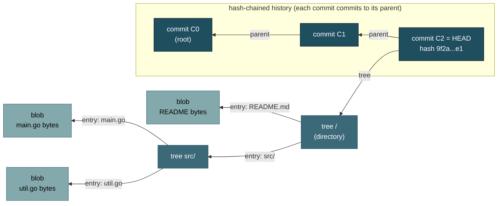
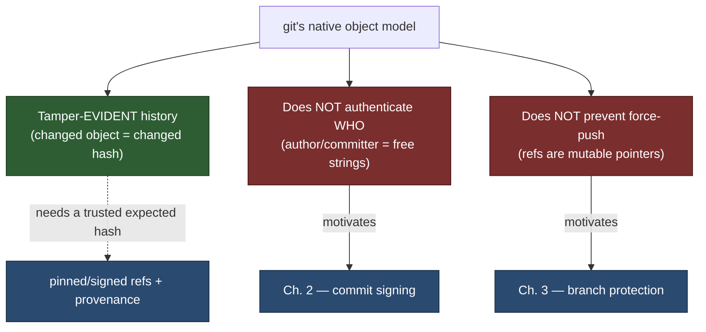
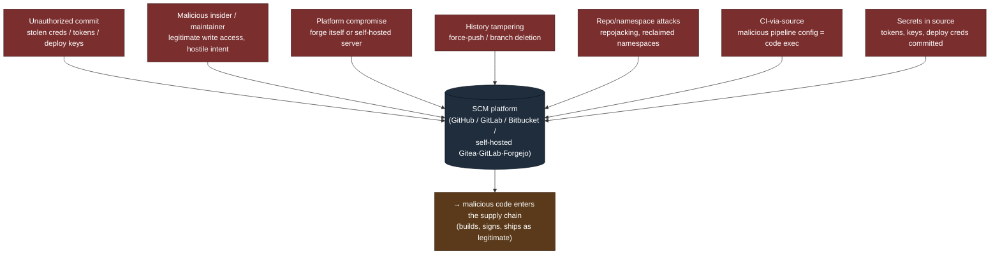
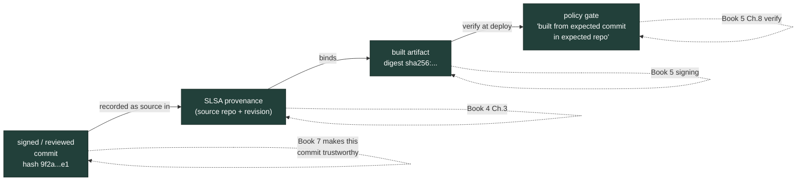

# Chapter 1 — Source Code Management: Threat Model and Integrity

*What this chapter covers.* Everything a build produces — every binary, container image,
package, and deployment manifest — is a *transformation of source*. The build system in
Book 4, the signatures in Book 5, the SBOMs in Book 3 all describe and protect the *output*
of a process whose *input* is a git repository somewhere. That makes source code management
(SCM) the origin of the supply chain: it is threat **"A"** in the SLSA threat model (Book 1,
Chapter 2 — Attack Taxonomy; Book 1, Chapter 7 — Frameworks Overview), the point at which
code first enters the pipeline. Compromise the source, or the platform that hosts it, and you
inject code that *looks legitimate* and flows downstream through every later stage — unless a
later gate happens to catch it. This chapter establishes the ground truth the rest of Book 7
builds on: how git actually works as a content-addressed, hash-chained data structure; what
integrity properties that structure does and — crucially — does *not* give you; and the full
threat model of an SCM platform at fleet scale. We are precise about git's object model
because nearly every control in the following chapters (commit signing in Chapter 2, branch
protection in Chapter 3, secret scanning in Chapter 4) is a patch over a specific gap in what
git guarantees natively. Get the primitives wrong and the controls look like magic; get them
right and each one is an obvious, necessary response to a named weakness.

Learning goals — after this chapter you should be able to:

- Explain why SCM is the **root trust anchor** of the software supply chain and why source
  write access is, in practice, **production access**.
- Describe git's **content-addressed object model** — blobs, trees, commits, tags — and how
  hash-chained commits form a **Merkle DAG** that makes history **tamper-evident**.
- State precisely what git integrity **does** guarantee (a changed object is a changed hash,
  detectable if you know the expected hash) and what it **does not** (it authenticates *no
  one*, and it does not prevent force-pushes or history rewrites).
- Give an accurate account of git's **SHA-1 legacy**, the **SHAttered** collision, the
  **hardened-SHA-1** (collision-detecting) mitigation git ships, and the state of the
  **SHA-256** transition.
- Enumerate the **SCM threat model**: unauthorized commits, malicious insiders, platform
  compromise (the **git.php.net 2021** incident), history tampering, repojacking, CI-via-source,
  and secrets in source — and map each to the Book 7 control that addresses it.
- Explain how source integrity connects forward to **build provenance** (Book 4, Chapter 3)
  and the developing **SLSA Source track**, closing the loop from "this commit" to "this
  artifact."

## SCM is the root of the supply chain

Draw the supply chain as a pipeline — source → build → artifact → registry → deploy — and one
fact dominates the security analysis: it is a *derivation*. Each stage is a function of the
one before it. The build does not invent code; it compiles what the source repository hands
it. The registry stores what the build emitted. The cluster runs what the registry served.
Trace any running process in production backward and you arrive, without exception, at one or
more commits in one or more repositories. Source is not *a* link in the chain. It is the
*first* link, and every later link inherits whatever the first link let through.

This is why an attacker who can write to your source has a uniquely powerful position. Other
supply chain attacks — a poisoned dependency (Book 2), a compromised build server
(Book 4, Chapter 4), a tampered artifact in transit (Book 5) — must *inject* malice into a
process that was supposed to be clean, and each injection point may leave forensic residue or
trip a downstream check. Malicious source does none of that. It enters through the *front
door*. It is reviewed (or not) like any other change, committed like any other change, built
like any other change, and signed with the same provenance as legitimate code, because *it is*
the legitimate input as far as every downstream system can tell. The build faithfully
transforms a backdoor into a signed, attested, SBOM-documented artifact. Provenance
(Book 4, Chapter 3) proves the artifact came from that commit — which is exactly the problem
if the commit is the attack. Signing proves who built it, not whether what they built is safe;
this is the SolarWinds lesson restated one stage earlier (Book 5, Chapter 1). A perfect,
SLSA-L3, fully-attested pipeline built from a malicious commit produces a perfect,
fully-attested backdoor.

The SCM platform itself — GitHub, GitLab, Bitbucket, or a self-hosted Gitea/GitLab/Forgejo
server — is therefore a **tier-0 trust anchor** (Book 1, Chapter 9 — Distributed-Systems
Lens). It is the system of record for the input to every build you run. If it lies, or if
someone can make it lie, the lie propagates through the entire chain. The remainder of this
book is, in a sense, the study of one question: *how do you know the source you are about to
build is the source you intended to build, written by the people you intended to trust?* We
cannot answer that until we know exactly what git gives us for free — and what it does not.

## How git works: the content-addressed object model

Git is not a diff-tracking tool. Internally it is a small **content-addressed object store**
— a key-value database in which the key of every value is the cryptographic hash of that
value. This design decision is the source of every integrity property git has, so it is worth
stating precisely.

Git stores exactly four kinds of object, and every one is named by the hash of its own
contents:

- A **blob** is the raw contents of a file — just the bytes, with no filename and no
  metadata. Two files with identical contents anywhere in the repository are the same blob,
  stored once.
- A **tree** represents a directory. It is a list of entries, each mapping a name and mode
  (file, executable, subdirectory, symlink) to the hash of a blob (a file) or another tree (a
  subdirectory). A tree is thus a hash-referenced snapshot of a directory's structure.
- A **commit** is a snapshot of the whole working tree at a point in time. It contains: the
  hash of the *top-level tree*, the hash(es) of its *parent commit(s)* (zero for the root, one
  for a normal commit, two or more for a merge), an **author** (name, email, timestamp), a
  **committer** (name, email, timestamp), and the commit message.
- A **tag** (an *annotated* tag object, as opposed to a lightweight tag which is just a ref)
  points at another object — usually a commit — with a name, tagger, message, and optional
  signature.

The naming rule is the whole game. An object's name is `H(header ‖ content)`, where `H` was
historically **SHA-1** and is, in the transition described below, **SHA-256**. Because the
name is derived from the content, you cannot change the content without changing the name. You
cannot forge an object to a chosen name without finding a hash collision. And — this is the
part that gives git its power — because a commit *contains the hashes of its tree and its
parents*, a commit's hash is a function of its entire reachable history.

Walk the references outward from a commit. The commit hash depends on the tree hash. The tree
hash depends on the hashes of every blob and subtree it contains. The commit hash also depends
on the parent hash — which in turn depends on *its* tree and *its* parent, recursively, all
the way back to the root commit. A single commit hash is therefore a cryptographic commitment
to every byte of every file in that snapshot *and* to every commit that preceded it. This is
precisely a **Merkle DAG** (directed acyclic graph): the same hash-linked structure that
underlies transparency logs (Book 5, Chapter 5) and the Merkle-tree machinery of
Book 5, Chapter 1. Git is a Merkle DAG of commits over Merkle trees of file contents.



Change one byte of `main.go` and its blob hash changes. That changes the `src/` tree hash,
which changes the root tree hash, which changes commit `C2`'s hash. If `C2` were not the tip
but somewhere in the middle of history, *every commit after it* would change too, because each
child names its parent by hash. You cannot quietly edit the past. Any alteration to a historical
object ripples forward and rewrites every hash downstream of it. That ripple is the entire
basis of git's integrity guarantee, and it has a precise name: **tamper-evidence**.

A **ref** — a branch or tag name like `refs/heads/main` — is just a mutable pointer to one
commit hash. Refs are the *only* mutable state in git. The object store is append-only and
immutable by construction; `HEAD` and branch names are sticky notes that say "the tip is
currently *this* hash." Keep that distinction sharp, because it is where the guarantees end.

## What git integrity does — and does not — give you

Engineers routinely overstate what git's cryptographic structure buys them. The tamper-evidence
is real and strong, but it is *narrow*. Three properties people assume git has, it does not,
and each missing property is the reason for a chapter later in this book.

**What git does give you: tamper-evident history — *if you know the expected hash.*** Given a
commit hash you trust — say, `9f2a...e1`, pinned in a deployment manifest or a provenance
record — you can `git fsck` the repository or simply re-derive hashes and detect *any*
modification to that commit or anything it reaches. The integrity check is self-verifying: the
name proves the content. This is genuinely valuable. It means that once you have a trusted hash,
the bytes behind it cannot be swapped without detection. It is the foundation on which every
later control rests.

But notice the precondition, in italics above: *if you know the expected hash*. Git tells you
that a commit's content matches its hash. It says nothing about whether *that hash is the one
you should trust*. Nothing in a bare `git pull` verifies that the tip you just fetched is the
tip you intended. Which brings us to the two things git conspicuously does not do.

**What git does *not* give you (1): authentication of *who* made a commit.** The `author` and
`committer` fields of a commit are **arbitrary, unauthenticated strings**. Git never checks
them against any credential, key, or identity. Anyone can set them to anything:

```bash
git -c user.name="Linus Torvalds" \
    -c user.email="torvalds@linux-foundation.org" \
    commit -m "totally legitimate change"
```

The resulting commit will display, in every `git log` and in most SCM web UIs, as authored by
Linus Torvalds. This is not a bug; git simply was never designed to authenticate authorship at
the object layer. The commit hash faithfully commits to the *string* "torvalds@…" — it makes
that string tamper-evident — but the string is a self-assertion, like a return address written
on an envelope. **Git authenticates content, not identity.** The only thing that binds a commit
to a cryptographically verifiable identity is a **signature** over the commit, and signing is
opt-in, off by default, and unverified unless something checks it. That "something" is the
subject of Chapter 2 — Commit Signing and Developer Identity.

**What git does *not* give you (2): prevention of history rewriting.** Because branch refs are
mutable pointers, whoever can write to a ref can move it *anywhere* — including backward or
onto a divergent history. This is a **force-push** (`git push --force`), and it is a normal,
supported git operation. An attacker (or a careless developer) with push access can:

- rewrite a commit's contents and force the branch to the rewritten history, erasing the
  original;
- drop commits from the middle of history via an interactive rebase and force-push the result;
- delete a branch entirely.

Git's tamper-evidence does *not* stop this. It only means the rewrite *changes the hashes* — it
is *evident* to anyone who recorded the old tip, but it is not *prevented*, and anyone who did
not record the old hash may never notice. The garbage-collector will eventually reap the
orphaned original objects. Preventing force-pushes and history deletion on the branches that
matter is not a git-object-layer property at all; it is a *server-side policy* — **branch
protection** — the subject of Chapter 3.

The following table is the mental model to carry through the rest of the book. Every "NO" in
the right column is a control we have to add on top of git.

| Property | Protected natively? | What actually provides it |
| --- | --- | --- |
| A stored object's bytes match its hash | **Yes** — content addressing | git itself (`git fsck`) |
| Historical commits can't be silently altered | **Yes** — Merkle-DAG hash chaining | git itself (tamper-evident) |
| You know *which* hash to trust as the real tip | No | signed tags/commits + pinned refs + provenance |
| The commit author/committer is who it claims | **No** — fields are unauthenticated | commit/tag **signing** (Ch. 2) |
| Branch history can't be rewritten/force-pushed | **No** — refs are mutable | **branch protection** (Ch. 3) |
| A commit was reviewed before landing | **No** | required reviews / two-person rule (Ch. 3) |
| No secrets committed | **No** | secret scanning (Ch. 4) |
| Committed code isn't malicious | **No** | review, SAST, backdoor analysis (Ch. 5) |



## The SHA-1 problem and the SHA-256 transition

Everything above depends on the hash function being **collision-resistant**: an attacker must
not be able to produce two *different* objects with the *same* hash. If they could, they could
substitute a malicious object for a benign one at the same name, and git — which trusts the
name — would serve the malicious content as if it were the original. Content addressing is only
as strong as `H`.

Git was designed in 2005 around **SHA-1**, a 160-bit hash. SHA-1's collision resistance is
generically ~80 bits (the birthday bound, `2^(n/2)`; Book 5, Chapter 1), and it had been
theoretically weakening for over a decade before the decisive blow. In **February 2017**,
researchers from **CWI Amsterdam** and **Google** published **SHAttered**: the first practical
SHA-1 collision, two distinct PDF files with the same SHA-1 digest, produced with roughly
2^63 computations — expensive but demonstrably feasible. SHA-1 was, from that point,
cryptographically broken for collision resistance.

Two facts keep this from being a five-alarm fire for git specifically, and it is important to
state them accurately rather than either dismissing or overstating the risk.

First, git does not hash raw file bytes; it hashes objects with a length-prefixed header
(`blob <len>\0`, `commit <len>\0`, and so on). A generic collision on file contents is not
automatically a collision on git objects, and mounting a *chosen-prefix* collision inside git's
object framing — such that the colliding object is also a *valid, malicious* git object — is
substantially harder than the SHAttered PDFs. The attack is real but not trivial to weaponize
against a repository in the wild.

Second, and more directly, git ships a **hardened SHA-1**. Since 2017 the reference
implementation uses the **sha1collisiondetection** library (`sha1dc`, by Marc Stevens — a
SHAttered co-author — and Dan Shumow). It computes SHA-1 normally but *detects the specific
disturbance-vector patterns* that the known cryptanalytic collision attacks require, and aborts
with an error rather than producing a digest when it sees them. In effect git computes standard
SHA-1 for all benign inputs (so hashes are unchanged and interoperable) but refuses to hash an
input that bears the fingerprint of a collision attack. This does not restore SHA-1's collision
resistance in general, but it neutralizes the known practical attacks against git.

The durable fix is a stronger hash. Git has, for several years, supported repositories that use
**SHA-256** as the object hash instead of SHA-1. The object model is unchanged — same blobs,
trees, commits, tags, same Merkle DAG — only the hash function differs, restoring ~128-bit
collision resistance. The obstacle is not the format but the **ecosystem**: a SHA-256 repository
uses 256-bit names everywhere, and interoperability between SHA-1 and SHA-256 repositories
(so that a SHA-256 client can push to a SHA-1 server and vice versa) is still incomplete.
Tooling, forges, and CI that assume 40-hex-character object names must be updated. As a result,
adoption remains limited: the format works, but the world has not moved, and the overwhelming
majority of repositories — including essentially all hosted on the major forges — are still
SHA-1 with the hardened-SHA-1 mitigation carrying the load. The honest status is: *a real but
mitigated weakness, with a specified successor that is slowly, unevenly arriving.* Do not
architect a control that *relies* on SHA-1 collision resistance for its security; do rely on the
hardened-SHA-1 defense and plan for SHA-256 over a multi-year horizon.

## The SCM threat model

With the primitives established, we can enumerate the ways an SCM system is actually attacked.
The through-line is that git's integrity model protects *stored bytes against silent alteration*
and nothing else — so every threat below is either about **getting malicious bytes accepted as
legitimate**, or about **rewriting what "legitimate" means**, or about compromising the
**platform** that decides both.



### Unauthorized commits and write access

The most direct attack: an adversary who does not legitimately have write access obtains it,
then pushes malicious code that builds and ships as any developer's would. The credential is the
target, and the modern SCM offers many:

- **Stolen developer credentials** — a phished password, a session cookie, an OAuth token from a
  compromised laptop.
- **Leaked personal access tokens (PATs)** and **deploy keys** — long-lived bearer secrets that
  frequently end up in CI configuration, `.env` files, shell history, or (recursively) committed
  into a repository. A leaked PAT with `repo` scope *is* write access to every repo the owner can
  reach.
- **Over-broad access** — a token or team grant with `write`/`maintain` where `read` would do, so
  that a low-value compromise yields high-value capability.
- **Compromised accounts** — full account takeover (ATO), covered in Chapter 6.

The defense is least-privilege access, short-lived and scoped tokens, enforced MFA, and secret
scanning to catch the leaks (Chapters 4 and 6). But note the asymmetry: the attacker needs *one*
valid write credential to *one* consequential repo. At fleet scale (below) that is a large attack
surface.

### Malicious maintainer / insider

Not every threat comes from outside. Someone with *legitimate* write access — an employee, a
contractor, an open-source co-maintainer — can insert a backdoor directly. This is the hardest
case because none of the access controls fire: the person is *supposed* to be able to commit.
The **xz-utils** attack (Book 1, Chapter 5 — Case Studies: xz, Codecov, Log4Shell) is the
canonical study: an attacker spent roughly two years building reputation as a helpful
contributor, was granted co-maintainer status by the exhausted original maintainer, and then
committed a carefully obfuscated backdoor into the build tooling of a library that flows into
OpenSSH on most Linux distributions. No credential was stolen; the trust was *earned* and then
*betrayed*. Insider and long-con-maintainer threats are the subject of Chapters 5 (Backdoors and
Malicious Code) and 6 (Insider Threats and Account Takeover); the SCM-layer mitigations are
review requirements and two-person rules (Chapter 3), which force a second trusted party into
the path even for someone with write access.

### SCM platform compromise

If the *platform* is compromised, git's integrity model does not save you, because the platform
is the authority that tells clients what the "correct" hashes are. Two variants:

- **The hosted forge itself.** A compromise of GitHub, GitLab.com, or Bitbucket at the
  infrastructure level would give an attacker the ability to alter repositories, rewrite refs,
  or serve tampered objects to clients who have no independent record of the expected hashes.
  These providers are hardened tier-0 infrastructure, but "trusted" is not "invulnerable," and
  the concentration risk is exactly why signed, out-of-band commit verification and pinned
  provenance matter — they let a client detect a lying server.
- **A self-hosted server.** Many organizations run their own GitLab, Gitea, Forgejo, or
  Bitbucket. That server is now *your* tier-0 infrastructure, with your patch cadence and your
  hardening. The definitive example is the **git.php.net compromise of March 2021**. Attackers
  pushed two malicious commits to the canonical **php-src** repository, forged to appear authored
  by core maintainers **Rasmus Lerdorf** and **Nikita Popov**, inserting a backdoor (guarded by a
  check for a `Zerodium`-referencing HTTP header) that would have enabled remote code execution
  on any server built from the tampered source. The PHP team investigated and concluded the most
  likely cause was **compromise of the self-hosted git.php.net server itself** rather than theft
  of the maintainers' individual accounts. The commits were caught in review before any release
  shipped, but the strategic response is the instructive part: the PHP project **abandoned
  self-hosting and moved its canonical repository to GitHub**, judging that maintaining a
  hardened git server was not a job the project could do better than a dedicated forge. The
  lesson is not "self-hosting is forbidden" — it is "self-hosted SCM is critical production
  infrastructure and must be secured, monitored, and patched as such, or handed to someone who
  will."

Note how the php.net case fuses two properties from earlier in the chapter: the commits were
**forged authors** (git authenticates no one) pushed by rewriting a **mutable ref** on a
**compromised platform**. Every layer that could have made the forgery self-evident —
required signing, verified authorship — was absent, so the only backstop was a human noticing
in review.

### History tampering and force-push

As established, refs are mutable and force-pushes are a supported operation. An attacker with
write access can rewrite history to *inject* a change into a past commit (so it looks like it was
always there) or to *hide* a change (drop the commit that added a backdoor after a build has
already consumed it, leaving no trace in the current tree). Git's tamper-evidence makes this
*detectable to anyone holding the old hash* but does nothing to *prevent* it. The controls are
branch protection that forbids force-pushes and deletions on protected branches (Chapter 3), and
recording trusted commit hashes out of band — in signed tags, in deployment manifests, and in
build provenance (below), so that a rewrite is contradicted by an independent record.

### Repository and namespace attacks

The *name* of a repository is itself an attack surface. **Repojacking** (Book 2, Chapter 3)
exploits the reuse of freed namespaces: when a user or organization renames or deletes an account,
its old `owner/repo` paths may become available for re-registration. Anyone who then claims the
old name controls a repository that thousands of `go get github.com/oldowner/…`, submodule
references, and install scripts still point at — a live redirect from mutable references to
attacker-controlled code. Related patterns include **reclaiming a deleted namespace** to
resurrect a trusted-looking package path and **fork confusion**, where a malicious fork in a
popular network is mistaken for, or surfaced alongside, the upstream. These are supply chain
attacks that operate at the *source-reference* layer, and they connect SCM security to the
dependency-resolution security of Book 2.

### CI/CD driven by source

This is the threat that makes source write access so consequential, and it is under-appreciated:
**the CI pipeline runs code defined in the source**. Your `.github/workflows/*.yml`,
`.gitlab-ci.yml`, `Jenkinsfile`, build scripts, `Makefile`, and pre-/post-build hooks are all
*in the repo*, and the CI runner *executes them* — often with access to secrets, artifact-signing
identities, and deployment credentials (Book 4, Chapter 6 — Secrets in CI/CD; Book 4, Chapter 7 —
Pipeline Poisoning, which analyzes **PPE**, Poisoned Pipeline Execution). Therefore:

> **Write access to source is, in the general case, code-execution access to the build system.**

An attacker who can modify a workflow file — or, via **PPE**, merely influence which
attacker-controlled script runs in a privileged pipeline — can exfiltrate CI secrets, tamper with
build outputs, or pivot into production. This collapses the comfortable mental separation between
"source" and "infrastructure." They are the same blast radius. It is why, in the
distributed-systems lens below, we treat SCM write access as production access and why the CI
hardening of Book 4 and the source controls of Book 7 are two halves of one problem.

### Secrets in source

Credentials committed into a repository — API keys, database passwords, cloud access keys,
signing keys, other systems' tokens — are a perennial and high-frequency failure. Git makes it
worse in a specific way: because history is immutable and content-addressed, a secret committed
once is *retained in history forever* unless the history is actively rewritten. Deleting the file
in a later commit does not remove the blob; the credential remains reachable at its old commit and
is trivially recovered by anyone who clones the repo. And CI tokens and deploy keys are frequently
stored *near* the SCM (in CI variables, in `.env`, in config), widening the target. Detection and
remediation — including the crucial point that leaked secrets must be *rotated*, not merely
deleted, because they may already be cloned — is the whole of Chapter 4 (Secrets in Source).

### Dependency on SCM-hosted, mutable references

Finally, source is not only what *you* write; it is also what you *pull* from other repositories.
`go get github.com/foo/bar` fetches source directly from a forge. Git **submodules** and vendored
dependencies pin to a repository — and if they pin to a *branch* or *tag* rather than an immutable
commit hash, the referenced code can change under you (a tag can be force-moved; a branch tip
advances). A submodule pointing at a mutable ref in a repo you do not control is a
source-level supply chain dependency with the same trust properties as the upstream's SCM. This is
the source-layer face of the dependency security in Book 2; the mitigation is to pin to immutable
commit hashes and, ideally, to verify them.

## Integrity controls: a roadmap to Book 7

Each threat above maps to a control, and those controls are the chapters of this book. Organize
them by the question each answers.

| Threat | Control mechanism | Where in Book 7 |
| --- | --- | --- |
| Forged author / unauthenticated identity | Commit & tag **signing** + verified identity | Ch. 2 — Commit Signing and Developer Identity |
| Unreviewed / force-pushed malicious change | **Branch protection**, required reviews, status checks, two-person rule | Ch. 3 — Branch Protection, Review, and Two-Person Rules |
| Secrets committed into source | **Secret scanning** + rotation + push protection | Ch. 4 — Secrets in Source |
| Backdoors / deliberately malicious code | Malicious-code review, SAST/code scanning | Ch. 5 — Backdoors and Malicious Code |
| Stolen creds, ATO, malicious insider | Least-privilege access, MFA, ATO defenses | Ch. 6 — Insider Threats and Account Takeover |
| Untrustworthy AI-generated code / model supply | Provenance and review of AI-assisted code | Ch. 7 — AI-Generated Code and the Model Supply Chain |
| Inconsistent controls across a large fleet | Org-wide policy enforcement, repo integrity at scale | Ch. 8 — Repository Integrity at Scale |

Read as a system, these controls answer four questions:

- **WHO** made this change? — signing and verified identity (Ch. 2). This is the direct patch for
  git's "authenticates no one."
- **WHAT** is allowed to enter? — branch protection, required review, required status checks
  (Ch. 3). This is the patch for "refs are mutable and anyone with write can land anything."
- **WHAT is in the content?** — secret scanning (Ch. 4), backdoor and malicious-code review
  (Ch. 5), SAST/code scanning. This is the patch for "git doesn't know if the code is safe."
- **WHO can touch it at all?** — least-privilege access, MFA, ATO defenses (Ch. 6), enforced
  org-wide (Ch. 8). This shrinks the population that can even attempt the above.

None of these is provided by git. Every one is a deliberate addition, and the map above is the
reason each exists.

## From verified source to build provenance

The controls in Book 7 make a *commit* trustworthy. The final step is to carry that trust
*forward* into what gets built and deployed — to close the loop from "this is the right commit"
to "this artifact came from the right commit." That bridge is **provenance**.

Recall from Book 4, Chapter 3 (SLSA Build Levels and Provenance) that a SLSA provenance
attestation records, among other things, the **source repository and revision** the artifact was
built from — the exact `owner/repo` and commit hash that were the build's input. Verifying that
provenance (Book 5, Chapter 8 — Provenance Verification) therefore includes checking that the
*source is the expected source*: not just "some build produced this," but "the build that
produced this consumed *this commit in this repo*, and that is the commit I intended." Compose the
two and you get an end-to-end integrity chain:



Source integrity + provenance = *"this artifact came from this verified commit in this repo."*
Neither half suffices alone. Provenance that faithfully records a *malicious* source commit is a
faithful record of an attack (the point we opened with). A trustworthy commit whose relationship
to the deployed artifact is *unverified* leaves a gap where the build could have substituted
something else. Together they extend the tamper-evidence of the git object model all the way to
the running container.

This is also where the **SLSA Source track** enters — and here we must hedge carefully, per the
accuracy rules. SLSA **v1.0** (April 2023) defines the **Build track** normatively; a **Source
track** is **under development** and is *not* finalized in v1.0. Its intent, in the drafts, is to
attest *source-side* controls analogous to the Build levels: that a revision was produced through a
reviewed, protected process, with history **retained** and changes **authenticated** — in other
words, machine-checkable attestations that the controls in Chapters 2 and 3 were actually in force
for a given commit. When it lands, the Source track will let a verifier demand "this commit came
from a repo that enforced two-person review and signed history," alongside "this artifact came
from that commit." Treat it today as a **developing** specification whose direction is clear but
whose normative details you should read from the current SLSA drafts rather than from any summary
— including this one.

## Distributed-systems lens

Everything above is sharper at scale, and the scale is the point of this book. A single team with
one repository can manage source integrity by hand and habit. A backend organization does not have
one repository. It has *hundreds or thousands*, across dozens of teams, all on a *shared* SCM
platform, deploying many times a day. That changes the problem in specific ways.

**The SCM is tier-0 concentration.** Every team's source lives on one platform (or a small number).
Compromise of that platform — or of an org-admin account, or of a single over-scoped machine
token — is not a compromise of *a* repo; it is potential access to *all* source, which is a
supply chain foothold *everywhere at once* (Book 1, Chapter 9). The blast radius of the SCM is the
whole engineering organization. This is the definition of a tier-0 system, and it should be
threat-modeled, monitored, and access-controlled like one — including the self-hosted case, where
the php.net lesson is that running the server is running critical infrastructure.

**Controls must be enforced org-wide, not left to per-repo discretion.** With thousands of repos,
"each team configures branch protection and 2FA correctly" is a guarantee of *inconsistency*:
some repo, somewhere, will have protection off, MFA unenforced, or an ancient PAT with `admin`
scope. Security at fleet scale is the *floor*, and floors must be set at the organization level:
**enforced 2FA** for all members, **org-level branch protection / rulesets** that apply to every
repository by default, **org-wide secret scanning and push protection**, and **access policies**
expressed centrally rather than clicked per-repo. The mechanics of expressing and enforcing these
across a large fleet — rulesets, policy-as-code, drift detection — are Chapter 8 (Repository
Integrity at Scale). The principle here is simply that *discretionary per-repo security does not
survive contact with a thousand repositories.*

**Source write access is production access — grant it accordingly.** Because CI executes
source-defined pipelines with privileged credentials (Book 4, Chapters 6 and 7), a write grant to
a repo whose pipeline can deploy is, functionally, a deploy credential. At fleet scale, mass-granted
`write` on shared repos, broad team memberships, and long-lived PATs quietly hand out production
access under the label of "source access." Least privilege on the SCM is not hygiene; it is access
control on production. Audit who can write to repos whose pipelines are privileged with the same
seriousness you audit who can `kubectl apply` to prod — because they are, transitively, the same
capability.

**The integrity chain must be machine-verified end to end.** No human reviews a thousand repos'
worth of daily deploys. The only way source integrity holds at scale is to *chain the primitives
into an automated verification*: git's tamper-evidence gives content integrity; signed commits and
tags (Ch. 2) give authenticated identity; branch protection (Ch. 3) gives a reviewed,
non-rewritable history; build provenance (Book 4, Ch. 3) binds a verified commit to an artifact;
and a deployment gate (Book 5, Ch. 8, Ch. 10) refuses anything whose chain doesn't check. Each
link is weak alone — git authenticates no one, a signature says nothing about safety, provenance
faithfully records whatever it's given — but composed and *enforced by policy at the gate*, they
extend the trust from a reviewed commit to a running workload across the entire fleet, without a
human in each loop.

The chapters that follow build these links one at a time. We start, in Chapter 2, with the most
glaring gap this chapter exposed: git authenticates *no one*, and until a commit carries a verified
signature, "authored by" is just a string on an envelope.

## Key takeaways

- **Source is the root of the supply chain.** Every downstream artifact is a derivation of
  source; malicious code entering at the source flows through build, signing, and deploy *looking
  legitimate*, because it *is* the legitimate input. The SCM platform is a tier-0 trust anchor and
  a top-tier target.
- **Git is a content-addressed Merkle DAG.** Blobs, trees, commits, and tags are all named by the
  hash of their contents; a commit's hash commits to its entire tree and its entire ancestry. This
  makes history **tamper-evident**: any change to a stored object changes its hash and every hash
  downstream of it.
- **Git's integrity is narrow.** It guarantees that stored bytes match their hash *if you already
  know the expected hash*. It does **not** authenticate *who* made a commit (author/committer are
  unauthenticated strings) and does **not** prevent force-pushes or history rewrites (refs are
  mutable). Those gaps motivate commit signing (Ch. 2) and branch protection (Ch. 3).
- **SHA-1 is broken but mitigated.** SHAttered (2017) produced a practical SHA-1 collision; git
  defends with hardened, collision-detecting SHA-1 (`sha1dc`) and supports SHA-256 repositories,
  though ecosystem interop keeps SHA-256 adoption limited. Do not build controls that depend on
  SHA-1 collision resistance.
- **The SCM threat model** spans unauthorized commits (stolen creds/tokens/deploy keys), malicious
  insiders (xz), platform compromise (git.php.net, 2021 — a self-hosted-server compromise with
  forged-author commits), history tampering, repojacking, CI-via-source (write access ≈ code
  execution), and secrets in source.
- **Write access to source is production access.** CI runs source-defined pipelines with privileged
  credentials, so influencing the source can mean executing code in the build and reaching
  production. Treat SCM write grants as production grants.
- **Source integrity chains forward into provenance.** SLSA provenance records the source repo and
  revision; verifying it lets you assert "this artifact came from this verified commit in this
  repo." The **SLSA Source track** (under development) aims to attest source-side controls
  directly — treat it as developing.
- **At fleet scale, enforce centrally.** Hundreds or thousands of repos on a shared platform demand
  org-wide 2FA, org-level branch protection, org-wide secret scanning, and least-privilege access —
  not per-repo discretion — with the whole integrity chain verified by policy at the deployment
  gate.

## Further reading

- **Pro Git**, 2nd ed., Chapter 10 — "Git Internals" (Chacon & Straub). The authoritative account
  of git's object model, references, and packfiles. <https://git-scm.com/book/en/v2>
- **Git documentation — object format and hash function transition.** `gitformat-hash(5)` /
  "Git's SHA-256 support" and the transition plan in the git source tree
  (`Documentation/technical/hash-function-transition.txt`). <https://git-scm.com/docs>
- **SHAttered** — "The first collision for full SHA-1," Stevens, Bursztein, Karpman, Albertini,
  Markov (CWI Amsterdam / Google, 2017). <https://shattered.io>
- **sha1collisiondetection** — Marc Stevens & Dan Shumow, the hardened-SHA-1 library git uses.
  <https://github.com/cr-marcstevens/sha1collisiondetection>
- **PHP git.php.net incident (March 2021)** — the php.net news post and mailing-list postmortem
  describing the malicious commits and the move to GitHub. <https://news-web.php.net/php.internals/113838>
- **SLSA v1.0** — the specification, threat model, and the (in-development) Source track.
  <https://slsa.dev/spec/v1.0/> and <https://slsa.dev/spec/draft/source-requirements>
- **OpenSSF / GitHub — securing repositories:** GitHub's documentation on branch protection,
  rulesets, secret scanning, and required reviews, and the OpenSSF Scorecard checks that assess
  these controls programmatically. <https://securityscorecards.dev>
- **Book 1, Chapter 2 — Attack Taxonomy** and **Chapter 7 — Frameworks Overview** (SLSA threat
  "A", source integrity); **Book 4, Chapter 3 — SLSA Provenance** and **Chapter 7 — Pipeline
  Poisoning**; **Book 5, Chapter 1 — Cryptographic Foundations** (hashes, Merkle trees) and
  **Chapter 8 — Provenance Verification**.
