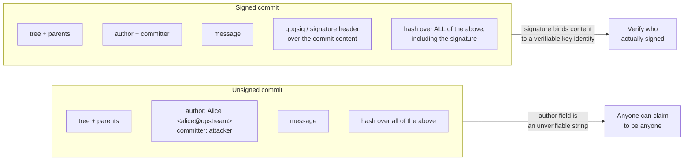
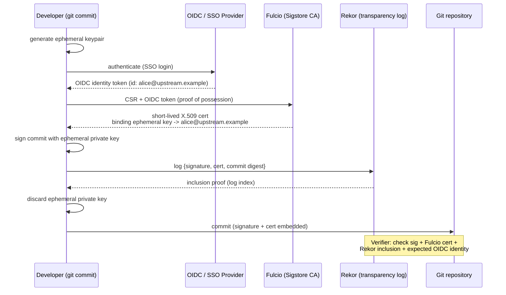
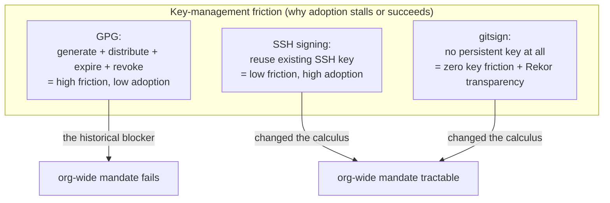
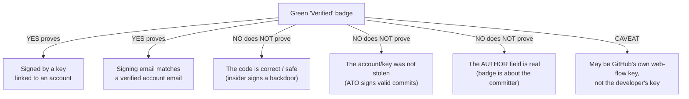
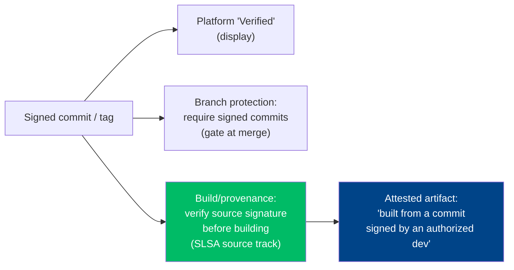
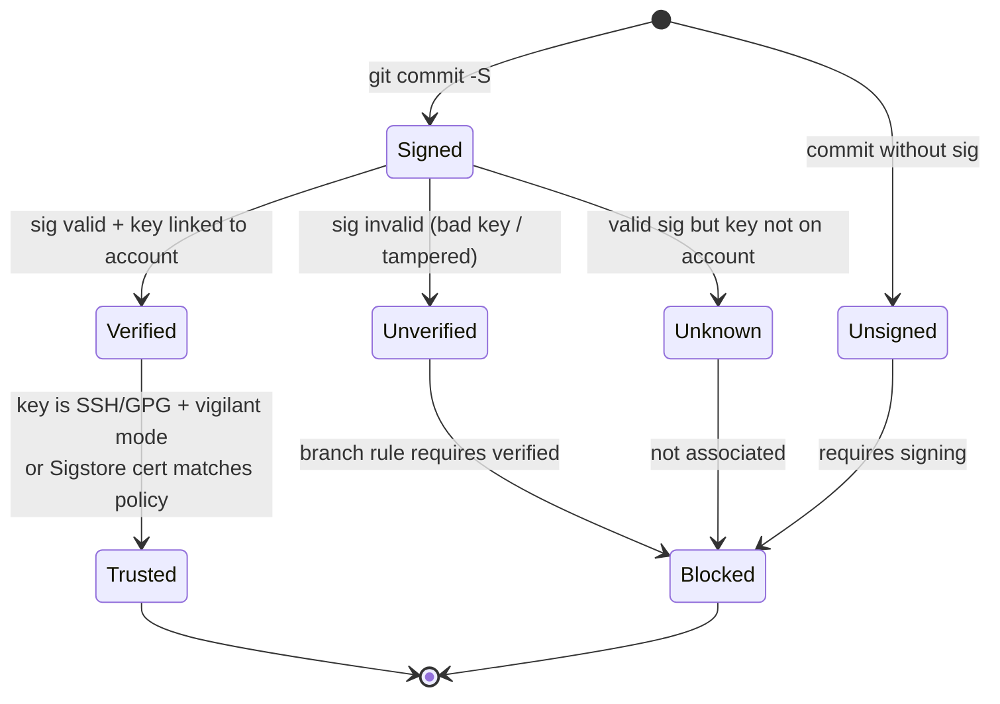
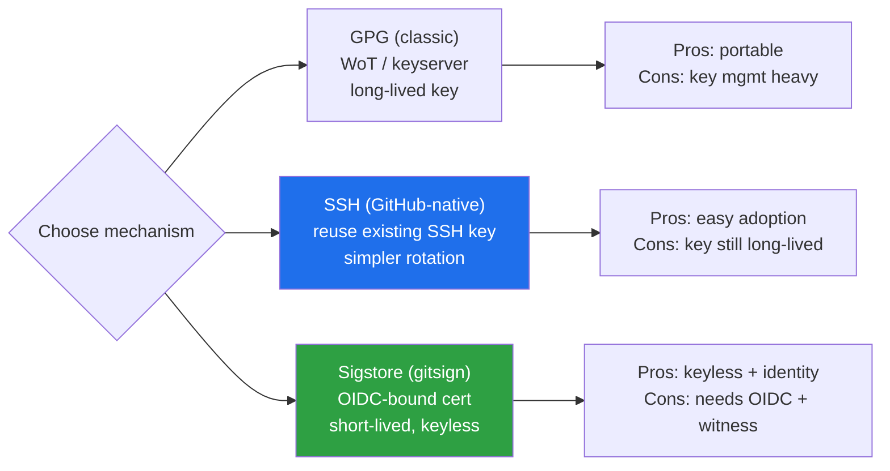

# Chapter 2 — Commit Signing and Developer Identity

*What this chapter covers.* Chapter 1 established the uncomfortable ground truth: git
authenticates **content** but not **identity**. A commit's hash is a cryptographic commitment
to every byte of its tree and every commit before it — tamper-evident, hash-chained, a Merkle
DAG you can verify with nothing but the objects themselves. But the `author` and `committer`
fields inside that commit are *plain strings that git never checks*. Anyone with write access
to a repository — or anyone who can open a pull request — can attribute a commit to anyone
they like. The integrity story of Chapter 1 tells you a commit *has not changed since it was
written*; it says nothing about *who wrote it*. This chapter closes that gap. Commit and tag
signing cryptographically bind a commit to a key, and that key to an identity you can verify —
turning the unauthenticated `author` string into an attributable, non-repudiable claim. We
cover the full landscape of how that binding is made: GPG (the classic, high-friction
approach), SSH signing (the low-friction one that finally made org-wide signing tractable),
S/MIME, and Sigstore's **gitsign** — keyless commit signing that mirrors the keyless artifact
signing of Book 5 exactly. We are precise about what platform "Verified" badges actually prove
(less than most engineers assume), and relentlessly honest about the chapter's central
limitation: **signing proves who, not whether what they wrote is honest.** A signature is a
control for *accountability*, not *correctness*. It is necessary for a defensible source supply
chain and sufficient for none of it.
_All tool versions, spec references, and defaults verified as of early 2026._

Learning goals — after this chapter you should be able to:

- Explain precisely why git's `author`/`committer` fields are **unauthenticated**, and
  demonstrate commit **spoofing** with stock git.
- Describe the mechanics of **GPG**, **SSH**, **S/MIME**, and **keyless (gitsign)** commit and
  tag signing — what each signs, where the signature lives, and how it is verified.
- Compare the four approaches on the axis that actually drives adoption at scale: **key-management
  friction**, and explain why **SSH signing** and **gitsign** changed the calculus.
- State exactly what a GitHub/GitLab **"Verified"** badge proves and what it does *not* — including
  GitHub's own **web-flow** signing key and the **author vs committer** distinction.
- Bind git identity to **corporate identity** (SSO/SAML, verified domains, enforced MFA) and
  handle the **bot/automation** identity problem.
- Separate **attribution** (who) from **authorization** (allowed to), and locate where
  signatures must actually be **verified** — including in **build provenance** — for signing to
  be more than theater.

## The problem: git identity is a string, not a proof

Recall the anatomy of a commit object from Chapter 1: a top-level tree hash, one or more parent
hashes, an **author** (name, email, timestamp), a **committer** (name, email, timestamp), and a
message. The hash over that object makes it tamper-evident. But look at what the author and
committer fields *are*: UTF-8 text that the person running `git commit` supplies, sourced from
`user.name` and `user.email` in their local config. Git performs no check that the name is
yours, that the email belongs to you, or that you control any account anywhere. There is no
authentication step in `git commit`. There cannot be — git is a local, offline content store;
it has no notion of an identity provider.

The consequence is that impersonation is a one-liner. Set your identity to a trusted
maintainer's and commit:

```bash
# Spoof a commit as a maintainer you are not
git config user.name  "Alice Maintainer"
git config user.email "alice@upstream.example"
git commit -m "Refactor auth middleware"

# Or spoof only the author on a single commit, keeping your own committer identity
git commit --author="Alice Maintainer <alice@upstream.example>" -m "Refactor auth middleware"
```

The resulting commit is a perfectly valid git object. `git log` renders it with Alice's name.
`git blame` attributes the lines to Alice. Every tool that reads the author field — changelog
generators, `CODEOWNERS` audit scripts, "who last touched this" tooling, forensics after an
incident — reports Alice. If you push this to a shared repository (or open a pull request from a
fork), colleagues browsing history see Alice's name and, absent signing, have **no way to tell
it is false.** This is not a git bug; it is the deliberate design of a distributed system where
the author of a patch and the person who applies it are frequently different people. Git even
uses the split deliberately: when a maintainer applies your emailed patch, *you* are the author
and *they* are the committer. The `--author` flag exists precisely to preserve original
authorship. The same flexibility that makes distributed collaboration work makes the author
field a liar's tool.

This is impersonation in the source supply chain, and it is threat **"A"** from Chapter 1 wearing
a disguise. A forged commit that appears to come from a trusted developer is more dangerous than
an obviously-external one: it inherits the reviewer's trust, the branch's history, the
reputation of the name on it. In a repository of thousands of commits, no reviewer re-derives
provenance by hand. They read the name, recognize it, and relax. The fix is not to make the
author field trustworthy — it is intrinsically untrustworthy — but to add, *alongside* it, a
cryptographic proof that a specific key produced this commit, and to bind that key to a real
identity you can independently verify. That proof is a **signature**.



## Signing mechanics: what gets signed, and where the signature lives

A commit signature is a signature over the **commit object's own bytes** — the tree, parents,
author, committer, and message — with the signature itself carried inside the commit as an extra
header. Because the signature is computed over that content and then stored *in* the commit, the
commit hash (computed last, over the whole object including the signature header) still binds
everything: change any signed field and both the hash and the signature break. This is the same
principle across all four methods below; they differ only in *what kind of key* signs and *how
you verify the signer's identity*.

Two orthogonal things get signed in practice, and you should configure both:

- **Commits** (`git commit -S`, or `commit.gpgsign = true` to sign every commit). Attributes the
  change.
- **Annotated tags** (`git tag -s`, or `tag.gpgsign = true`). This is the more security-critical
  one for releases: a signed tag is the anchor a release build should verify. A signed
  `v2.4.0` tag says "this exact commit is the release, vouched for by this key."

### GPG signing: the classic approach

GPG (GnuPG, an OpenPGP implementation) is the original git signing mechanism. You generate a
long-lived asymmetric keypair, publish the public half, tell git your key, and sign:

```bash
gpg --full-generate-key                      # create a long-lived keypair
git config --global user.signingkey 3AA5C34371567BD2
git config --global commit.gpgsign true      # sign every commit
git config --global tag.gpgsign true         # sign every annotated tag

git commit -S -m "Fix TOCTOU in token refresh"   # -S is redundant if commit.gpgsign is set
git tag -s v2.4.0 -m "Release 2.4.0"
```

The signature is stored in the commit object as a `gpgsig` header — an ASCII-armored detached
OpenPGP signature over the rest of the commit. Verification re-hashes the commit content and
checks the signature against the signer's public key from your GPG keyring:

```bash
git verify-commit HEAD
git log --show-signature -1
# gpg: Good signature from "Alice Maintainer <alice@upstream.example>" [ultimate]
```

The cryptography is sound; the **operational model is where GPG fails**, and it fails for exactly
the reasons Book 5, Chapter 2 (Classic Code Signing and Its Failure Modes) enumerates for
classic long-lived keys. A developer must generate a key, protect the private key for its
multi-year lifetime, distribute the public key so others can verify (keyservers, or uploading to
the platform), set and track an expiry, and — the part nobody does well — **revoke** it if it is
lost or compromised, which requires a pre-generated revocation certificate and a functioning
distribution channel. Web-of-trust key signing never achieved usable scale. The result, observed
across two decades, is that mandating GPG signing org-wide **fails**: the friction is high enough
that adoption stalls, developers disable it to get work done, or the keys rot (expired, lost, on
a laptop that was reimaged). GPG signing works beautifully for a handful of disciplined
maintainers on a critical project and poorly for a fleet of thousands of engineers. That gap is
the entire reason the next two approaches exist.

### SSH signing: reuse the keys developers already have (git 2.34+)

Since **git 2.34** (November 2021), git can sign with **SSH keys** instead of GPG. This is the
single most important adoption unlock in the chapter, and the reason is mundane: **every
developer with push access already has an SSH key**, already protects its private half, and has
already uploaded the public half to GitHub/GitLab for authentication. Signing reuses that
existing, already-distributed, already-managed key material. There is no second key to generate,
publish, or expire.

Configuration switches the signing format to `ssh` and points `user.signingkey` at your public
key (or the key itself):

```bash
git config --global gpg.format ssh
git config --global user.signingkey ~/.ssh/id_ed25519.pub
git config --global commit.gpgsign true
git config --global tag.gpgsign true

git commit -m "Rotate KMS grant on token issuance"
```

Under the hood git shells out to `ssh-keygen -Y sign`, producing an **SSHSIG**-format signature
(the standardized SSH signature format, with a namespace of `git` so a git signature can't be
replayed in another context). The signature is stored in the commit's signature header just as
the GPG one is.

Verification is where SSH signing differs meaningfully from GPG. There is no keyring and no web
of trust; instead you maintain an **allowed-signers file** — an explicit allowlist mapping
identities (email addresses / principals) to their public keys. This is a deliberate, auditable
trust root: you are stating "these keys belong to these people, and I trust signatures from
them."

```bash
git config --global gpg.ssh.allowedSignersFile ~/.config/git/allowed_signers
```

```text
# ~/.config/git/allowed_signers
# principal  [options]        keytype  key-data
alice@upstream.example  namespaces="git"  ssh-ed25519  AAAAC3NzaC1lZDI1NTE5AAAAIK...alice
bob@upstream.example    namespaces="git"  ssh-ed25519  AAAAC3NzaC1lZDI1NTE5AAAAIL...bob
release-bot@ci.example  namespaces="git"  ssh-ed25519  AAAAC3NzaC1lZDI1NTE5AAAAIM...bot
```

```bash
git verify-commit HEAD
# Good "git" signature for alice@upstream.example with ED25519 key SHA256:...
```

The trade-off is explicit and worth naming: SSH signing has **lower key-generation friction**
(reuse existing keys) but moves the trust problem into **allowed-signers file management** — a
file you must keep current as people join, leave, and rotate keys. At small scale you commit it
to the repo; at fleet scale you generate it from your identity provider (see *Operationalizing at
scale*). Crucially, when you sign on a *platform*, the platform maintains this mapping for you: it
already knows which SSH keys belong to which account, so GitHub and GitLab can render a "Verified"
badge for SSH-signed commits without you managing any allowed-signers file at all.

### S/MIME (X.509) signing

Git also supports **S/MIME** signing using X.509 certificates via `gpgsm`
(`git config gpg.format x509`). Here the signer's identity is vouched for not by a web of trust or
an explicit allowlist but by a **certificate chain** rooted in a Certificate Authority — typically
a corporate PKI that already issues employee certificates (smartcards, PIV cards). For an
enterprise that has already invested in X.509 identity, this reuses that infrastructure the way SSH
signing reuses SSH keys. In practice, outside of organizations with mature internal PKI, S/MIME
commit signing is rare; it inherits both the power and the operational weight of full X.509 PKI,
covered in Book 5, Chapter 9 (Key Management and PKI for the Enterprise).

### Keyless signing with gitsign: Sigstore for commits

The most modern approach eliminates developer key management entirely. **gitsign** (a Sigstore
project) brings the **keyless signing** model of Book 5, Chapter 3–4 (Sigstore Architecture;
Keyless Signing and Workload Identity) to git commits. Instead of a long-lived key, the developer
authenticates with an **OIDC identity** (their Google/GitHub/Microsoft/corporate SSO account); a
short-lived signing keypair is generated **on the fly**; **Fulcio** issues a short-lived X.509
certificate binding that ephemeral public key to the OIDC identity; the commit is signed with the
ephemeral private key; the certificate and signature are recorded in the **Rekor** transparency
log; and the ephemeral private key is thrown away. There is nothing to manage because there is
nothing that persists.

Setup treats gitsign as git's X.509 signing program:

```bash
git config --global commit.gpgsign true
git config --global tag.gpgsign true
git config --global gpg.x509.program gitsign
git config --global gpg.format x509

git commit -m "Add rate limiter to /login"
# Browser opens; you authenticate to your OIDC provider (SSO).
# gitsign: signed commit, uploaded to Rekor tlog index NNNN
```

Verification checks the signature, checks that Fulcio issued the certificate, checks the Rekor
inclusion proof, and — this is the point — checks that the **certificate identity** matches an
identity you expect:

```bash
gitsign verify \
  --certificate-identity=alice@upstream.example \
  --certificate-oidc-issuer=https://accounts.google.com \
  HEAD
```

The flow is structurally identical to keyless artifact signing with cosign (Book 5, Chapter 3–4),
just applied to a commit object instead of a container digest:



What gitsign buys you is the disappearance of the entire key lifecycle — no generation, no
distribution, no expiry tracking, no revocation, because the signing key exists for seconds — plus
**transparency**: every signature is publicly logged in Rekor, so misuse is *detectable after the
fact*. If someone induces Fulcio to issue a certificate for `alice@upstream.example` and signs a
commit, that event is now an immutable, monitorable record in the log, exactly as with keyless
artifact signing. The cost is dependency on the OIDC issuer and the Sigstore services at verify
time, and a verification model that checks *certificate identity + issuer* rather than a key
fingerprint — you must know which OIDC identities are legitimate for your project. The short-lived
certificate is expired by the time anyone verifies, which is *why* the Rekor timestamp matters: it
proves the signature was made while the certificate was valid.

### The four methods, compared

The axis that decides fleet adoption is not cryptographic strength (all four are fine) but
**key-management friction**:

| Method | What signs | Identity vouched by | Dev key-gen friction | Key lifecycle burden | Transparency log |
|---|---|---|---|---|---|
| **GPG** | Long-lived PGP key | Web of trust / uploaded pubkey | High (new keypair) | High: distribute, expire, revoke | No |
| **SSH** (2.34+) | Existing SSH key | `allowed_signers` allowlist / platform account | Low (reuse existing key) | Medium: maintain allowed-signers | No |
| **S/MIME** | X.509 cert (corp PKI) | CA chain | Medium (cert issuance) | High: full PKI lifecycle | No |
| **gitsign** | Ephemeral key | OIDC identity via Fulcio | None (no persistent key) | None (ephemeral) | **Yes (Rekor)** |



## What platform "Verified" badges actually prove

GitHub and GitLab render a green **"Verified"** badge next to signed commits. Engineers routinely
over-read this badge, so be precise about its semantics.

"Verified" means exactly one thing: **the platform checked the commit's signature against a key it
associates with an account, and it validated.** For GPG, that is a GPG public key you uploaded to
your account. For SSH, an SSH key on your account (marked as a *signing* key). For S/MIME, a
certificate chain the platform trusts. For gitsign, a Sigstore certificate whose OIDC identity the
platform recognizes. In every case the badge asserts: *this commit was signed by a key linked to
this account, and the signing email matches a verified email on that account.* That is a real,
useful property — it is the impersonation resistance we came here for. It is also **all** the badge
asserts.

What "Verified" does **not** prove, and what people wrongly infer:

- **It does not prove the code is good.** A malicious insider signs their backdoor with a
  perfectly valid key and gets a green badge. The badge verifies the *signer's key*, not the
  *content's honesty*. This is the recurring lesson of Book 5 (Chapters 2 and 3) restated for
  commits: **signing proves who, not whether what they did is safe.**
- **It does not prove the *right person* authored it if the account is compromised.** A stolen key
  or a taken-over account (Book 7, Chapter 6 — Insider Threats and Account Takeover) signs valid
  commits that show Verified. The badge is only as trustworthy as the account behind the key.
- **It does not distinguish author from committer.** The badge is about the *committer's*
  signature. The **author** field can still say anyone. A commit can show "Verified" (signed by
  the committer) while the author is a spoofed name — the signature vouches for the committer's
  identity, not the author's claim.

### GitHub's own web-flow signing key

There is a specific, widely-misunderstood case: **GitHub signs commits it creates on your behalf
with its own key.** When you edit a file in the web UI, click "Merge pull request," squash-merge,
or accept a suggestion, GitHub creates the commit server-side and signs it with GitHub's internal
`web-flow` GPG key. Those commits show **"Verified"** — but *the developer never signed anything.*
GitHub is vouching that "GitHub itself created this commit as the authenticated user," which is a
true and useful statement, but it is categorically different from "the developer's own key signed
this." The committer on such commits is often `GitHub <noreply@github.com>` while the author is
you. If your mental model is "Verified means a human's key signed this," web-flow commits break it.
This matters for policy design: a rule that merely requires "Verified" commits is satisfied by
GitHub's own signing on web merges, which may or may not be what you intended.



### Vigilant mode and requiring signatures

By default, GitHub shows *no* badge on unsigned commits — their absence is easy to miss.
**Vigilant mode** (a GitHub account setting) changes the display so that *every* commit is labeled:
signed-and-valid as "Verified," and **unsigned commits attributed to you as "Unverified."** This
turns the absence of a signature into a visible, suspicious signal rather than a silent default,
which is what you want if you sign consistently — an unsigned commit bearing your name becomes an
anomaly a reviewer notices. GitLab exposes analogous verification status on commits.

Displaying status is passive. The active control — covered in depth in Chapter 3 — is
**requiring** signatures on protected branches: GitHub's branch-protection / ruleset option
**"Require signed commits"**, and GitLab's **"Reject unsigned commits"** push rule. These reject a
push whose commits are not validly signed, moving signing from "nice badge" to "enforced gate."

## Developer identity in the enterprise

A signature is only as meaningful as the identity it binds to. In a company, that identity must
trace to a **real, accountable person or system**. Three moving parts make that trace reliable.

**Binding git identity to corporate identity.** GitHub Enterprise and GitLab support **SSO/SAML**,
tying every platform account to your **identity provider** (Okta, Entra ID, Google Workspace). With
SAML enforced, access to org repositories requires an active IdP session, and platform accounts map
to directory entries. Combined with **verified domains** — proving you control `upstream.example`
so the platform can attest that a given email genuinely belongs to your org — you get a chain:
**commit → committer key → platform account → SSO/IdP identity → real employee.** That chain is the
thing an incident responder walks to answer "who made this change?" and the thing an auditor needs
for accountability. **Enforced MFA/2FA** hardens the account end of the chain against takeover
(Book 7, Chapter 6): a signature bound to an account protected only by a phishable password is a
signature bound to whoever phished it.

With **gitsign**, this binding is even more direct: the signature's certificate *is* an OIDC
identity from your SSO provider. There is no separate "upload your key and hope the email matches"
step — the same SSO login that governs everything else in the company is what the commit signature
attests to. This is the identity-fabric point developed in the distributed-systems lens below.

**The bot and automation identity problem.** A large fraction of commits in any active org are made
by **machines**, not humans: Dependabot/Renovate opening dependency-bump PRs, release bots tagging
versions, CI jobs committing generated code or updating lockfiles. These need identities too, and
they should be *distinguishable* from human commits — you do not want a bot's commit to look like a
person's, and you do not want to force a human's key onto a bot.

- On GitHub, automation should act as a **GitHub App** (or bot account), whose commits are
  attributed to the app's bot identity (e.g., `dependabot[bot]`) and can be signed by GitHub's key
  when created via the API. This gives the bot a first-class, non-human identity that policies can
  reason about separately.
- In CI, a service should sign with a **machine identity**, not a human's checked-in key. The
  clean pattern is **keyless/OIDC workload identity** (Book 5, Chapter 4): the CI job presents its
  workload OIDC token, Fulcio issues a certificate bound to *the workload's* identity (e.g., a
  specific GitHub Actions workflow), and the resulting signature says "signed by *this pipeline*,"
  not "signed by a human who exported a secret." The same keyless mechanism that signs the bot's
  commits signs the artifacts it builds — one identity model end to end.

The security payoff of clean machine identity is that "human vs machine" becomes a *checkable
attribute*. A policy can require that commits on `main` are signed by a human SSO identity, or that
release tags are signed only by the release bot's identity, precisely because those identities are
distinct and attributable rather than a shared secret in a config file.

**Attribution is not authorization.** This distinction runs through the whole chapter and deserves
its own sentence: **a signature tells you *who*, never *whether they were allowed to.*** A perfectly
valid signature from a real, SSO-bound employee on a commit to a repository they should never touch
is still a policy violation — the signature just makes it an *attributable* one. Authorization is
the job of **access control** (Chapter 3 — branch protection, `CODEOWNERS`, two-person review;
Chapter 6 — least privilege and ATO defenses). Signing and authorization are complementary: signing
tells you who to hold accountable, access control decides who is permitted, and review decides
whether the change is acceptable. Confusing the two — treating "it's signed" as "it's allowed" — is
a category error that leaves the actual gate wide open.

## What signing does and does not give you (the honest account)

It is worth stating the security value of commit signing bluntly, in both directions, because
over-claiming here is how organizations end up with a false sense of security.

**What signing gives you:**

- **Authenticity.** A validly-signed commit was signed by the holder of a specific key, and (with
  identity binding) that key maps to a known identity. The `author`/`committer` string is no longer
  the only claim; there is a cryptographic one alongside it.
- **Impersonation resistance.** The `--author` spoofing trick from the top of the chapter produces
  an *unsigned* or wrongly-signed commit. On a repo that requires signatures and verifies identity,
  the forgery is rejected or flagged. You can no longer cheaply commit as someone else.
- **Non-repudiation and tamper-evidence bound to identity.** Chapter 1 gave tamper-evidence bound to
  *content*. Signing adds tamper-evidence bound to *identity*: the signer cannot later plausibly
  deny having signed, and any alteration of the signed commit breaks the signature. With **gitsign +
  Rekor**, you additionally get **transparency** — a public, append-only record enabling *misuse
  detection* (a signature you did not expect is discoverable in the log).

**What signing does *not* give you:**

- **Proof the code is good.** This is the one that matters most and is most often forgotten. A
  malicious insider signs their backdoor and it verifies perfectly. Turn it around with the canonical
  example: had the **xz-utils** attacker (the `Jia Tan` persona; see Book 7, Chapters 5–6) signed
  every one of their commits, each would show a flawless "Verified" badge. The signature would
  correctly attribute the backdoor to the identity that inserted it — and prove *nothing* about
  whether the change was safe. Signing establishes *who*; it says nothing about *honesty*. This is
  the SolarWinds/keyless lesson from Book 5, Chapters 2–3, one stage earlier in the pipeline.
- **Protection when the key or account is compromised.** A stolen SSH key, an exfiltrated GPG key, or
  a taken-over account (Book 7, Chapter 6) produces *valid* signatures. The badge stays green while
  the attacker is the one signing. Signing raises the bar — the attacker now needs the key or the
  account, not just the ability to type a name — but it is not a defense against a compromise of the
  signing identity itself.
- **Anything about commits you never verify.** A signature that is produced but never *checked* is
  security theater (Book 5, Chapter 8 — Provenance Verification in Practice). If no branch rule, no
  platform badge policy, and no build step verifies signatures, the signing effort buys you exactly
  nothing beyond a warm feeling.

The honest summary: **signing is necessary for accountability and insufficient for security.** It
makes source changes attributable, non-repudiable, and impersonation-resistant. It does not make
them *correct*. It is one layer — the identity layer — that must be combined with review and access
control (Chapter 3) and monitoring (Chapter 6) before you have actual protection. Its job is to
*catch, deter, and trace*, not to *prevent* a determined authorized-but-malicious actor.

## Operationalizing signing at scale

Turning the primitives above into a fleet-wide property is an engineering and lifecycle problem, not
a cryptographic one.

**Rollout: pick a low-friction method.** The historical reason org-wide signing mandates failed was
GPG friction, full stop. The modern rollout choice is between **SSH signing** (reuse the SSH keys
everyone already has; nearly zero incremental friction; platform manages the account-to-key mapping
for badges) and **gitsign** (zero persistent key management; SSO-native identity; Rekor
transparency). SSH signing is the pragmatic default for most orgs because it requires no new
services and no change to developer habits; gitsign is compelling where you already run Sigstore for
artifacts and want one keyless identity model across source and build, plus transparency. Either way,
the sequence is: (1) configure signing (ideally via managed dotfiles / a bootstrap script so every
developer is consistent), (2) turn on **require signed commits** on protected branches (Chapter 3),
and (3) map the signing identity to **SSO**.

**Verify where it counts — and beware theater.** A signature is only load-bearing where it is
*checked*. There are three tiers of checking, in increasing order of value:

1. **Platform "Verified" badge** — passive display; useful signal, not a gate.
2. **Branch protection "require signed commits"** — an active gate at push/merge time; this is the
   minimum enforcement worth having.
3. **Build/provenance verification** — the strongest and most overlooked: *does your build verify
   that the source commit or release tag it is building was signed by an authorized identity, before
   it builds?* A pipeline that checks out a tag, verifies the tag's signature against an allowed-signer
   set, and refuses to build otherwise, chains **source identity into the build's provenance**. This
   is where the **SLSA Source track** is heading (Book 7, Chapter 1; Book 4, Chapter 3 — SLSA Build
   Levels and Provenance): making "this artifact was built from a commit signed by an authorized
   developer" a *verifiable* attestation rather than an assumption. Signing that stops at the platform
   badge and never reaches the build is the theater Book 5, Chapter 8 warns against — you produced the
   proof and then never used it.



**Key and identity lifecycle.** Whatever method you choose, identities move:

- **Onboarding** — register the developer's signing key (SSH public key marked as a signing key, or
  simply ensure their SSO identity is provisioned for gitsign) and, if you maintain your own
  allowed-signers file, add them.
- **Rotation** — SSH and GPG keys should rotate on a schedule and immediately on suspected exposure;
  gitsign sidesteps this entirely by having no long-lived key to rotate.
- **Offboarding / revocation** — when someone leaves, remove their key from the allowed set and their
  account from SSO. This is the step most often botched, and the one that matters: a signing identity
  that stays valid after someone departs is a standing risk. Keyless again simplifies it — revoking
  the person's *SSO access* revokes their ability to obtain new signing certificates, so there is no
  separate key to hunt down.
- **allowed-signers at scale** — do not hand-edit the file across thousands of engineers.
  **Generate** it from your identity provider / directory as a build artifact, so joins, departures,
  and key rotations flow automatically from the same source of truth that governs the rest of access.
  The file becomes a *derived* view of your IdP, not a hand-maintained list that drifts out of date.

## Distributed-systems lens

At the scale of one repo and a handful of maintainers, commit signing is a personal-discipline
question. At the scale of *thousands of developers and repositories with high merge frequency* it
becomes an **identity-fabric** question, and that reframing is where the value compounds.

First, **friction is the only thing that scales or doesn't.** A control that adds thirty seconds and
a key-management chore per developer will be disabled, worked around, or left to rot across a fleet —
which is exactly the two-decade history of GPG. **SSH signing** (reuse existing keys) and **gitsign**
(no keys at all) are what make org-wide "**require signed commits**" tractable rather than aspirational.
The distributed-systems win is not a better signature; it is a signature cheap enough that *everyone*
produces one, turning every commit fleet-wide into an accountable, attributable, tamper-evident record.

Second, and more strategically: **it is one identity system, not three.** The same **OIDC/SSO** fabric
that authenticates a developer for **commit signing** (gitsign) authenticates a **CI workload** for
**build signing** (Book 5, Chapter 4 — keyless signing and workload identity) and authenticates a
**service** for runtime identity (the workload/service identity of Volume 9 — Security, Authentication,
and Cryptography). A single organizational IdP underwrites *who wrote the code*, *what built the
artifact*, and *what runs in production* — one trust root, three surfaces. Keyless signing is what
collapses them: because both developer identity and workload identity are OIDC identities that Fulcio
turns into short-lived certificates, source signing and artifact signing stop being separate PKI
kingdoms and become two applications of the same identity plane, both transparency-logged in Rekor.
The historical blocker — per-developer key management — simply disappears, and misuse becomes globally
detectable in the log.

Third, **signing is one link, and it only closes the loop when the build verifies it.** The endgame is
a chain: a commit **signed** by an SSO-bound developer identity, merged only through a
**require-signed-commits** gate with two-person review (Chapter 3), built by a pipeline that
**verifies the source signature** and emits **provenance** (Book 4, Chapter 3) attesting "this
artifact came from that signed commit," itself **signed** by the build's workload identity and logged
in Rekor. Now "this running binary traces to a commit signed by an authorized human" is a *verifiable
statement end to end*, which is precisely the property Chapter 1 said we could not yet assert and the
direction of the **SLSA Source track**.

And finally, the sober counterweight that keeps the whole edifice honest: **all of this is
accountability, not prevention.** Fleet-wide signing plus SSO binding plus enforced gates gives you a
world where every change is attributable to an identity and every artifact traceable to a signed
source — a world where an attacker can no longer act *anonymously* and misuse leaves a logged trail.
It does **not** stop an authorized insider or a compromised account from signing a backdoor that
verifies flawlessly (Book 7, Chapters 5–6). Signing catches, deters, and traces. **Access control**
(Chapter 3), **review** (Chapter 3), and **monitoring** (Chapter 6) are what actually prevent. Deploy
signing for the accountability it genuinely provides — and never mistake a green badge for a safe
change.

### Commit signature verification states



### Signing mechanism comparison



## Key takeaways

- Git's `author`/`committer` fields are **unauthenticated strings**; `git commit --author=...`
  spoofs anyone. Signing adds a cryptographic, verifiable claim *alongside* the untrustworthy string.
- A commit signature is computed over the commit's content and stored in the object; the four methods
  differ only in **what key signs** and **how the signer's identity is vouched for**: GPG (long-lived
  key, high friction), **SSH** (reuse existing keys + allowed-signers, low friction, git 2.34+), S/MIME
  (corporate X.509 PKI), and **gitsign** (keyless — OIDC identity, ephemeral key via Fulcio, logged in
  Rekor).
- **Key-management friction**, not cryptography, decides adoption. SSH signing and gitsign are what
  finally made org-wide "**require signed commits**" viable after GPG's two-decade failure to scale.
- A platform **"Verified"** badge proves only that *a key linked to an account signed this and the email
  matches*. It does **not** prove the code is good, that the account/key wasn't stolen, or that the
  **author** field is real — and it may be **GitHub's own web-flow key**, not the developer's.
- **Attribution is not authorization.** Signing tells you *who*; access control (Chapter 3) decides who
  is *allowed*, and review decides whether the change is *acceptable*. Treating "signed" as "authorized"
  is a category error.
- Signing is **necessary for accountability, insufficient for security**: a malicious insider or a
  compromised account signs a backdoor that verifies perfectly (the xz lesson). Signing catches, deters,
  and traces; it does not prevent.
- Signing only earns its keep where signatures are **verified** — ideally not just at the platform badge
  or branch gate but in the **build**, chaining source identity into provenance (SLSA Source track).
  Unverified signing is theater.
- At fleet scale, one **OIDC/SSO identity fabric** spans commit signing, build signing (Book 5, Ch 4),
  and service identity — keyless collapses three PKI problems into one identity plane, with Rekor
  transparency for misuse detection.

## Further reading

- **Git documentation** — `git commit` (`-S`, `commit.gpgsign`), `git tag` (`-s`), `git verify-commit`,
  `git verify-tag`, and the `gpg.format` / `gpg.ssh.allowedSignersFile` configuration:
  https://git-scm.com/docs/git-config.
- **Git 2.34 release notes** — introduction of SSH-based commit/tag signing:
  https://github.blog/open-source/git/highlights-from-git-2-34/.
- **`ssh-keygen(1)` — `-Y sign` / `-Y verify` and the `allowed_signers` format** (OpenSSH), the
  machinery beneath git SSH signing: https://man.openbsd.org/ssh-keygen.1.
- **GitHub Docs — Commit signature verification**, including SSH/GPG/S-MIME, vigilant mode, and the
  web-flow signing key:
  https://docs.github.com/en/authentication/managing-commit-signature-verification/about-commit-signature-verification.
- **GitHub Docs — Require signed commits** (branch protection / rulesets):
  https://docs.github.com/en/repositories/configuring-branches-and-merges-in-your-repository/managing-protected-branches/about-protected-branches.
- **GitLab Docs — Signing commits** (GPG, SSH, X.509) and the reject-unsigned-commits push rule:
  https://docs.gitlab.com/ee/user/project/repository/signed_commits/.
- **gitsign** (Sigstore) — keyless git commit signing: https://github.com/sigstore/gitsign.
- **Sigstore** — Fulcio and Rekor architecture (context for gitsign): https://www.sigstore.dev/.
- **SLSA v1.0 — Source track** (developing) and the threat model tying source to build provenance:
  https://slsa.dev/spec/v1.0/.
- Cross-references in this suite: Book 5, Chapter 2 (Classic Code Signing and Its Failure Modes),
  Chapter 3 (Sigstore Architecture), Chapter 4 (Keyless Signing and Workload Identity), Chapter 5
  (Transparency Logs), Chapter 8 (Provenance Verification in Practice), Chapter 9 (Key Management and PKI
  for the Enterprise); Book 4, Chapter 3 (SLSA Build Levels and Provenance); Book 7, Chapter 1 (SCM
  Threat Model), Chapter 3 (Branch Protection, Review, and Two-Person Rules), Chapters 5–6 (Backdoors;
  Insider Threats and Account Takeover).
