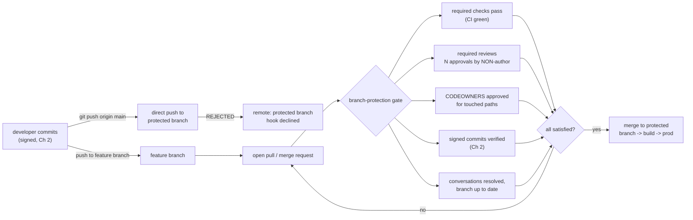
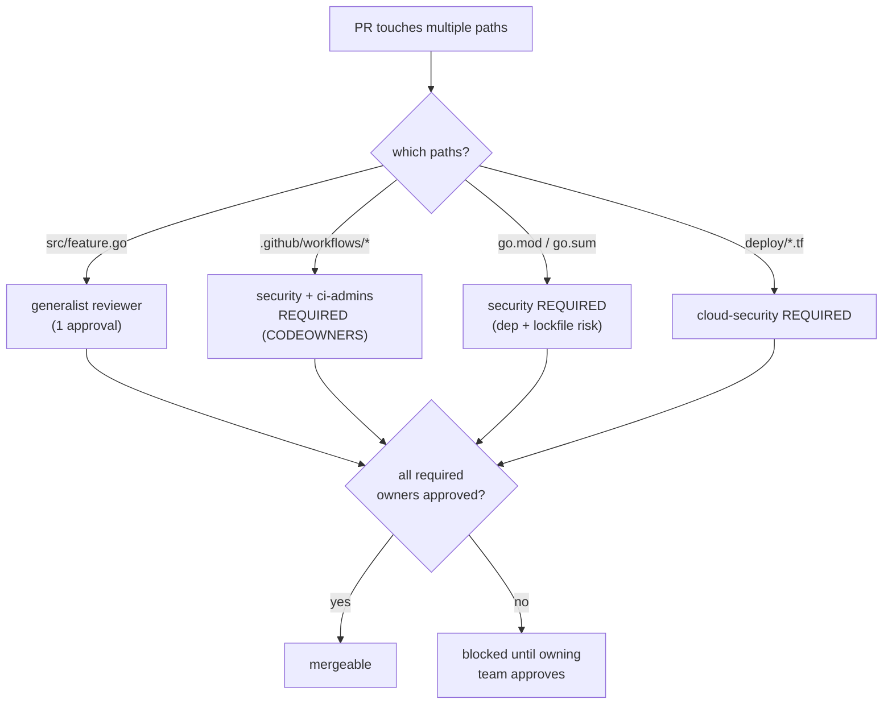
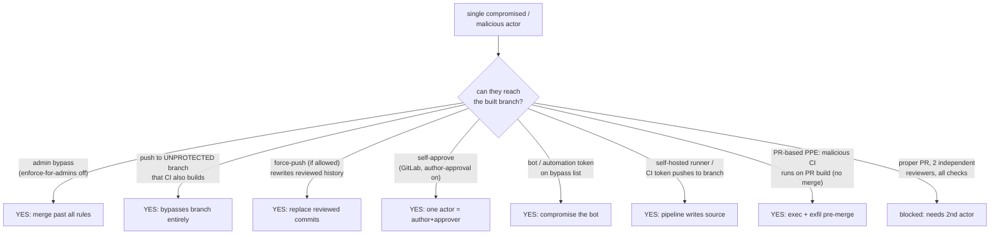
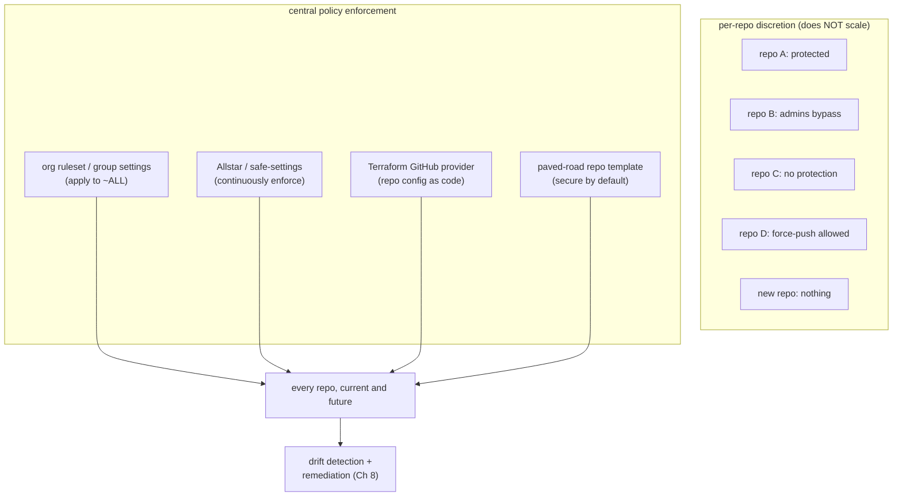

# Chapter 3 — Branch Protection, Review, and Two-Person Rules

*What this chapter covers.* Chapter 2 gave you **attribution**: a verified signature turns
"authored by" from an unauthenticated string into a cryptographic claim about *who* produced a
commit. But attribution is not authorization. Knowing that a commit was really signed by
`alice` tells you nothing about whether `alice`'s change *should be allowed into the branch that
feeds your build*. A signed commit from a compromised laptop is a perfectly valid signature over
a backdoor. This chapter is about the gate that stands between a change and a protected branch —
the mechanism that decides *what enters the codebase*, and therefore what enters every build,
artifact, and deployment derived from it. The controlling idea is old and boring and exactly
right: **no single identity should be able to unilaterally put code into a branch that reaches
production.** That is separation of duties — the two-person rule — applied to source. We will be
concrete about how you actually configure it on GitHub and GitLab, honest about the many ways it
is bypassed in the real world, and clear-eyed that code review catches obvious malice and misses
subtle malice. Branch protection is not a magic wall; it is a set of specific, individually
defeatable controls that, composed correctly and enforced org-wide, bound the blast radius of a
single compromised or malicious actor.
_All tool versions, spec references, and defaults verified as of early 2026._

Learning goals — after this chapter you should be able to:

- Explain the **two-person principle for source** as a separation-of-duties control, and state
  precisely what single-actor threats it bounds (account takeover, malicious insider, honest
  mistake) and how it maps to the **SLSA Source track** expectation of reviewed changes.
- Configure **branch protection** correctly on GitHub (classic protection **and** rulesets) and
  GitLab (protected branches **and** approval rules), including the settings most often gotten
  wrong: enforce-for-admins, dismiss-stale-approvals, and prevent-author-approval.
- Use **CODEOWNERS** to require review from the owning team on the highest-leverage
  supply-chain paths — CI config, build scripts, dependency manifests, IaC — as a targeted
  two-person control.
- Reason honestly about **what code review catches and what it misses**: obvious malicious
  changes versus underhanded C, review fatigue, large-diff rubber-stamping, and the
  **trusted-contributor / social-engineering** problem (the xz playbook).
- Map the **bypass surface** — admin bypass, unprotected branches, force-push, PR-based
  poisoned pipeline execution, self-approval, automation with bypass — to concrete mitigations.
- Enforce source-integrity controls **at fleet scale** with org-level rulesets, group settings,
  policy-as-code (Allstar, safe-settings, Terraform), and a paved-road default repo template,
  rather than per-repo discretion that inevitably drifts.

## Why two-person control for source

Chapter 1 established that write access to source is, in practice, production access: the build
runs source-defined pipelines with privileged credentials, so influencing what lands in the
built branch means influencing what runs in production. If that is true — and it is — then the
single most dangerous capability in your entire supply chain is the ability of *one identity* to
land a commit on the branch your pipeline builds from. Everything downstream (Books 3–6: SBOMs,
build provenance, signing, admission control) faithfully processes whatever that identity put
there. A backdoor merged to `main` becomes an SBOM-documented, SLSA-attested, cosign-signed,
admission-approved backdoor. The place to stop it is *before* it enters the branch, and the
control that stops it is the requirement that a *second* identity agrees.

This is separation of duties, the oldest integrity control there is, restated for git. In
finance you do not let one person both initiate and approve a wire transfer; in nuclear command
you do not let one person both hold the key and turn it. The security property is not that any
one person is trusted less — it is that the system no longer depends on any *single* person being
uncompromised. Two-person control converts a class of single-actor failures into a requirement
for **collusion or double-compromise**, which is strictly harder to achieve and far more likely
to be noticed.

Look at exactly which single-actor failures it bounds:

- **Account takeover (Book 7, Chapter 6 — Insider Threats and Account Takeover).** An attacker
  who phishes `alice`'s credentials, steals her session token, or plants a malicious OAuth grant
  now *is* `alice` as far as the platform is concerned. Signing (Chapter 2) does not help if the
  attacker also has her signing key on the same compromised laptop. Two-person review means the
  stolen account still cannot merge without a *second, independent* human — one the attacker has
  not also compromised — approving the change.
- **Malicious insider (Book 7, Chapters 5 and 6).** A developer with legitimate write access who
  decides to plant a backdoor is authenticated, is signed, is *authorized* to push. The only
  thing standing between their intent and the built branch is another human who has to look at
  the change. Review is the control that makes an insider's malicious commit require an
  accomplice or an evasion, not just a `git push`.
- **Honest mistakes.** The un-glamorous majority. A secret pasted into a config file, a
  dependency bumped to a malicious version, a debug endpoint left enabled, a `rm -rf` in a
  Makefile. A second reader catches a meaningful fraction of these before they reach the branch
  that ships.

The **SLSA Source track** (developing, alongside SLSA v1.0's build track — Book 4, Chapter 3)
formalizes exactly this expectation. Its higher source levels require that changes to the
protected branch went through a **review process by a second person** and that the platform
*attests* to that fact, so a downstream verifier can assert not merely "this artifact came from
commit `abc123`" but "…and that commit reached the protected branch through a two-party review."
Source-side controls become verifiable provenance. That is the whole arc of Book 7: reviewed
(this chapter) plus signed (Chapter 2) source, enforced at the branch, feeds a build provenance
statement that carries those facts downstream.



The rest of this chapter is the mechanics of building that gate, the honest limits of each part
of it, and the many ways it leaks.

## Branch protection: the mechanics

"Branch protection" is an umbrella for a set of *independent* rules a platform enforces on a
named branch (or a pattern of branches). Each rule closes one gap in what git gives you natively
(recall from Chapter 1 that git refs are mutable and git authorizes no one). Enable the wrong
subset and you have theater; enable the right subset and you have a real two-person gate. Here is
the full control surface, platform-neutral, before we get into per-platform specifics.

| Protection setting | What it stops |
|---|---|
| Require pull/merge request (no direct push) | A single actor pushing straight to the branch, bypassing all review |
| Block force-push | History rewrite that erases or replaces reviewed commits (Chapter 1) |
| Block branch deletion | Destroying the branch and its protection along with it |
| Require status checks to pass | Merging code that fails CI, tests, scanners, or policy gates |
| Require branch up to date before merge | Merging against a stale base (the "semantic merge" gap; also linearizes) |
| Require N approving reviews | Merging without a second human agreeing |
| Require review from Code Owners | Merging changes to sensitive paths without the owning team's sign-off |
| Dismiss stale approvals on new push | An approved PR being silently changed after approval, then merged |
| Require approval of the most recent push | The author sneaking commits *after* approval (approve-then-push) |
| Prevent author self-approval | One person acting as both initiator and approver |
| Require signed commits | Unsigned / unattributed commits entering the branch (Chapter 2) |
| Require linear history | Merge commits that obscure what was actually reviewed |
| Require conversation resolution | Merging with unresolved review objections still open |
| Restrict who can push/merge | Widening the set of actors who can land code beyond an allowlist |
| Enforce for administrators | Privileged users quietly bypassing every rule above |

Note that these are *orthogonal*. "Require pull request" without "require reviews" means PRs can
be self-merged instantly. "Require reviews" without "prevent self-approval" (on platforms where
that's possible) means the author approves their own change. "Require reviews" without
"dismiss stale approvals" means approve-then-force-push-a-backdoor. The gate is only as strong as
its weakest enabled rule, and the defaults are almost never strong enough. Configure deliberately.

### GitHub: classic branch protection

GitHub's original mechanism is a **branch protection rule** attached to a branch name pattern in
`Settings → Branches`. A rule for `main` might look, in the UI's terms, like this — and it is
worth knowing the exact setting names, because the security depends on the ones people skip:

- **Require a pull request before merging** — turns off direct pushes. Sub-options:
  - **Require approvals** (count, default 1; set to 2 for high-risk repos).
  - **Dismiss stale pull request approvals when new commits are pushed** — critical. Without it,
    an approval sticks even if the diff changes underneath it.
  - **Require review from Code Owners** — activates CODEOWNERS (below).
  - **Require approval of the most recent reviewable push** — the pusher of the latest commits
    cannot be the sole approver; forces a genuinely different pair of eyes on the final state.
- **Require status checks to pass before merging** — pick the exact check names (your CI jobs,
  scanners, `slsa`/policy gates). Sub-option **Require branches to be up to date before merging**
  forces the PR to be rebased/merged against current base first.
- **Require conversation resolution before merging.**
- **Require signed commits** (Chapter 2).
- **Require linear history** — disallows merge commits; forces squash or rebase.
- **Require deployments to succeed** — gate on a named environment deploying cleanly first.
- **Lock branch** — read-only.
- **Do not allow bypassing the above settings** — **this is the include-administrators control.**
  If it is unchecked, repository admins (and anyone with admin) merge past every rule above with
  no review, no checks, nothing. More on this gap below; it is the single most common way a
  well-configured repo turns out to be unprotected in practice.
- **Restrict who can push to matching branches** / **Allow force pushes** / **Allow deletions** —
  the force-push and deletion toggles should be off on protected branches.

Classic protection is per-repository and matches a single branch name pattern per rule. That is
its limitation, and the reason GitHub built rulesets.

### GitHub: rulesets

**Rulesets** are the newer, more capable model, available at both **repository** and
**organization** level. A ruleset targets a set of branches or tags via patterns (`main`,
`release/*`, `~DEFAULT_BRANCH`, `~ALL`), and it changes the enforcement model in three ways that
matter for fleet security:

1. **Org-level scope.** One org ruleset can require pull-request review, signed commits, and
   passing checks across *every* repository (or a filtered set) in the org — the answer to
   per-repo drift (see "at scale" below).
2. **Layering.** Multiple rulesets apply simultaneously and their requirements *aggregate* — the
   most restrictive wins. A repo cannot weaken an org ruleset by adding a laxer local one.
3. **Explicit bypass lists and an evaluate mode.** Instead of a single "include admins" checkbox,
   a ruleset has a named **bypass list** — specific roles, teams, or apps allowed to bypass — so
   you grant break-glass narrowly and auditably rather than to "all admins." **Evaluate** mode
   lets you roll a rule out in report-only mode across the fleet, see what would break, then flip
   to **Active**.

The available rules mirror classic protection — restrict creations/updates/deletions, require
linear history, require deployments, require signed commits, require a pull request before
merging (with approval count, dismiss-stale, require-code-owner-review, require-last-push-
approval), require status checks to pass, require code-scanning results, and block force pushes.
Rulesets can be authored in the API/UI or exported/imported as JSON, which makes them amenable to
policy-as-code. A trimmed org-level ruleset payload:

```json
{
  "name": "org-protect-default-branches",
  "target": "branch",
  "enforcement": "active",
  "conditions": {
    "ref_name": { "include": ["~DEFAULT_BRANCH", "refs/heads/release/*"], "exclude": [] },
    "repository_name": { "include": ["~ALL"], "exclude": ["sandbox-*"] }
  },
  "bypass_actors": [
    { "actor_type": "Team", "actor_id": 42, "bypass_mode": "pull_request" }
  ],
  "rules": [
    { "type": "deletion" },
    { "type": "non_fast_forward" },
    { "type": "required_signatures" },
    { "type": "pull_request",
      "parameters": {
        "required_approving_review_count": 2,
        "dismiss_stale_reviews_on_push": true,
        "require_code_owner_review": true,
        "require_last_push_approval": true,
        "required_review_thread_resolution": true
      }
    },
    { "type": "required_status_checks",
      "parameters": {
        "strict_required_status_checks_policy": true,
        "required_status_checks": [ { "context": "ci/build" }, { "context": "policy/slsa" } ]
      }
    }
  ]
}
```

`non_fast_forward` is the block-force-push rule; `strict_required_status_checks_policy` is
require-up-to-date. Note the bypass actor is a *specific team* in *`pull_request` mode* (they
still open a PR, they just can bypass some requirements), not a blanket admin escape hatch.

### GitHub: CODEOWNERS

A `CODEOWNERS` file (in `.github/`, repo root, or `docs/`) maps path patterns to owning users or
teams. With **Require review from Code Owners** enabled in the protection rule/ruleset, a PR that
touches a matched path *cannot merge* until a listed owner approves. This turns branch protection
from a blanket "someone reviewed it" into a **targeted, path-based two-person control** aimed at
the highest-leverage files. The last matching pattern wins (order matters), and only patterns
with an owner enforce a requirement:

```text
# CODEOWNERS — path-based required review for high-risk supply-chain paths

# Default: any change needs a platform reviewer
*                               @acme/platform-reviewers

# CI/build config is the crown jewels — pipeline poisoning lives here (Book 4, Ch 7)
/.github/workflows/             @acme/security @acme/ci-admins
/.github/actions/               @acme/security
/Makefile                       @acme/ci-admins
/Dockerfile                     @acme/security

# Dependency manifests and lockfiles — dependency & lockfile poisoning (Book 2, Ch 2 & 10)
/go.mod                         @acme/security
/go.sum                         @acme/security
/package.json                   @acme/security
/package-lock.json              @acme/security
/requirements*.txt              @acme/security

# Infrastructure-as-code — cloud blast radius (Book 6, Ch 8)
/deploy/**/*.tf                 @acme/cloud-security
/k8s/                           @acme/cloud-security

# Auth / crypto / access config
/internal/auth/                 @acme/security
```

The rationale is leverage. A change to `/.github/workflows/` can rewrite what the pipeline does
(exfiltrate secrets, alter the artifact, inject a build step) — a far higher-impact change than
an edit to a feature file. A change to a lockfile can silently swap a transitive dependency for a
malicious build without touching a single line of application code (Book 2, Chapter 2 — lockfile
poisoning). CODEOWNERS lets you demand that *the team who understands the risk* looks at exactly
those changes, without imposing that team as a bottleneck on every routine PR.

### GitLab: protected branches and approval rules

GitLab splits the same job across two features. **Protected branches**
(`Settings → Repository → Protected branches`) control *who can push and merge* and *whether
force-push is allowed*, per branch pattern, using access levels: **No one**, **Developers +
Maintainers**, or **Maintainers**. The secure default for a release/default branch is
"Allowed to push and merge: No one" (nobody pushes directly), "Allowed to merge: Maintainers"
(only via MR), "Allowed to force push: off."

**Merge request approval rules** (`Settings → Merge requests`, plus per-project and instance/
group-level policies) are where the two-person control lives:

- **Approvals required** — a count, on a named rule; you can scope rules so a specific rule with
  specific eligible approvers must be satisfied.
- **Code Owner approval** — GitLab reads a `CODEOWNERS` file too, and a protected branch can be
  set to **require approval from Code Owners** for matched paths.
- **Prevent approval by the author** — GitLab's explicit self-approval block. Without it, an
  author can (historically) approve their own MR and defeat the two-person property entirely.
- **Prevent approvals by users who add commits** — closes the co-author loophole: someone who
  pushed commits to the MR cannot be counted as an independent approver.
- **Prevent editing approval rules in merge requests** — stops the author from lowering the
  required approvals or swapping approvers on their own MR (a self-service bypass otherwise).
- **Remove all approvals when commits are added** — the dismiss-stale-approvals equivalent; a new
  push resets approvals so the *changed* diff must be re-approved.
- **Require re-authentication (password/SAML) to approve** — raises the bar for a hijacked
  session to rubber-stamp.

GitLab also runs **merge request pipelines** (and **merge trains** / **merged results
pipelines**) that build the *merge result* rather than the source branch alone, which matters for
"require pipeline succeeds" to actually reflect what lands. As with GitHub, a required pipeline is
part of the gate.

A concrete GitLab approval rule via the API (equivalently set in the UI):

```bash
# Require 2 approvals from the security group on the "protected" default branch,
# with author and committers excluded from counting as approvers.
curl --request POST --header "PRIVATE-TOKEN: $GL_TOKEN" \
  "https://gitlab.example.com/api/v4/projects/$PID/approval_rules" \
  --data "name=security-two-person" \
  --data "approvals_required=2" \
  --data "group_ids[]=$SECURITY_GROUP_ID" \
  --data "applies_to_all_protected_branches=true"

# Project-level MR settings that harden the two-person property:
curl --request PUT --header "PRIVATE-TOKEN: $GL_TOKEN" \
  "https://gitlab.example.com/api/v4/projects/$PID" \
  --data "merge_requests_author_approval=false" \
  --data "merge_requests_disable_committers_approval=true" \
  --data "reset_approvals_on_push=true" \
  --data "disable_overriding_approvers_per_merge_request=true"
```

`merge_requests_author_approval=false` is prevent-author-approval;
`merge_requests_disable_committers_approval=true` is prevent-approval-by-committers;
`disable_overriding_approvers_per_merge_request=true` is prevent-editing-rules.

### The enforce-for-admins gap

The most common way a repository that *looks* protected is actually wide open: **the protection
does not apply to administrators.** On classic GitHub protection this is the unchecked
**"Do not allow bypassing the above settings"** box; historically it was an "Include
administrators" checkbox. On rulesets it is an over-broad **bypass list**. On GitLab it is a
protected-branch access level or approval configuration that Maintainers/Owners can edit or merge
past.

The problem is subtle because it is usually *well-intentioned*. Admins keep bypass "for
emergencies." But an unenforced admin is exactly the single actor the whole control exists to
neutralize — and admins are the highest-value account-takeover targets (Book 7, Chapter 6). If
one compromised admin token can merge to `main` with no review and no checks, your two-person
rule is documentation, not a control. The mature posture is **enforce for everyone**, including
admins, and handle the genuine emergency with a *deliberate, audited break-glass procedure*
(temporarily grant a named bypass, merge, revoke, review the audit log) rather than a standing
bypass that quietly becomes the routine path. We return to break-glass under the
distributed-systems lens.

## Code review as a security control

Branch protection *requires* review; whether that requirement buys you security depends entirely
on what review actually does. It is tempting to treat "2 approvals required" as a binary the
platform enforces and be done. But the platform enforces that a *button was clicked by a second
account*, not that a second brain *understood the change*. Review is a human control, and its
security value spans a spectrum from "genuinely read and reasoned about the diff" to
"clicked approve on a 4,000-line PR in eleven seconds." Design your process for the former;
assume attackers exploit the latter.

Two distinct security jobs are riding on review, and it is worth separating them:

1. **The two-person gate.** The *structural* value — independent of whether the reviewer is
   brilliant. Even a mediocre review forces an attacker to either compromise a second account or
   convince a second human. That is the separation-of-duties property, and it holds as long as
   the second approver is genuinely independent (hence prevent-self-approval,
   prevent-committer-approval).
2. **Malicious-code detection.** The *substantive* value — the reviewer actually noticing that a
   change is bad. This is where review is most oversold. A good reviewer will catch an *obvious*
   backdoor: a hardcoded credential, a suspicious network call in an unrelated file, an
   `authorized_keys` write, a base64 blob decoded and `eval`ed. A good reviewer will **not**
   reliably catch a *subtle* backdoor — and Book 7, Chapter 5 is a catalogue of exactly how subtle
   malicious code can be.

### What makes review effective for security

Three things separate security-relevant review from quality-only review:

- **Reviewers actually read and understand the change.** This sounds trivial and is the whole
  ballgame. A backdoor hidden in a large diff survives when the reviewer scrolls to the bottom and
  approves. Practices that help: small PRs (a PR you can't understand you can't secure), requiring
  the author to explain *why*, and refusing to approve code you don't understand rather than
  deferring to the author's confidence.
- **Elevated scrutiny on high-leverage changes.** Not all diffs carry equal risk, and reviewers
  should not spend equal attention on all of them. The changes that deserve a security reviewer's
  full attention are, roughly in order:
  - **Build/CI config** — a PR editing `.github/workflows/`, `.gitlab-ci.yml`, `Makefile`,
    `Dockerfile`, or any build script. This is where **pipeline poisoning** lives (Book 4,
    Chapter 7). A one-line addition to a workflow can exfiltrate every secret the pipeline holds.
    Treat every CI-config diff as security-critical.
  - **Dependency additions and version bumps** (Book 2, Chapter 10 — Evaluating Dependencies). A
    new dependency is new attack surface and new maintainers to trust; a reviewer should ask
    "do we need this, and do we trust it?" not just "does it compile?"
  - **Lockfile changes** (Book 2, Chapter 2). A diff to `package-lock.json` / `go.sum` /
    `poetry.lock` that does not correspond to a matching manifest change is a red flag — it can
    silently pin a transitive dependency to a poisoned version. Lockfile diffs are noisy and
    tempting to skim; that is exactly why they are a hiding place.
  - **Secrets/access config, auth, crypto, IaC** (Book 6, Chapter 8) — anything that changes who
    can access what.
- **The tooling narrows what humans must catch.** Review does not stand alone. Required status
  checks should include SAST, secret scanning (Chapter 4), dependency/SCA scanning (Book 2), and
  IaC policy — so the human reviewer is looking for the *reasoning-level* problems the scanners
  can't see (is this change *appropriate*?), not the mechanical ones they can.

CODEOWNERS, covered above, is the mechanism that ties "elevated scrutiny on high-leverage
changes" to enforcement: it *guarantees* the CI-config change reaches the CI-admins and the
security team, rather than hoping a generalist reviewer happens to notice.



### The limits of review — be honest

Review is necessary and it is not sufficient, and pretending otherwise is how organizations get
surprised. The honest limits:

- **Subtle malicious code evades review.** This is the **underhanded-C** problem (Book 7,
  Chapter 5): code that is malicious yet looks correct even under careful reading — an
  off-by-one that weakens a bounds check, a misplaced `=` in a comparison, a locale-dependent
  parsing quirk, a use-after-free that only matters under a specific race. The Underhanded C
  Contest exists precisely to demonstrate that skilled reviewers miss deliberately-hidden bugs.
  Review raises the *skill* required to plant a backdoor; it does not make it impossible.
- **Social engineering of reviewers — the trusted-contributor problem.** The most important limit,
  and the one the **xz-utils** attack (Book 1, Chapter 5) demonstrated at civilizational scale.
  The attacker ("Jia Tan") did not defeat review by finding a clever code trick that fooled a
  reviewer. They spent **years** building the social standing to *become* a trusted maintainer —
  contributing legitimately, cultivating the original author, applying sockpuppet pressure — until
  they had commit and release authority themselves and no longer needed anyone else's approval.
  Two-person review assumes the second person is independent and honest; a patient adversary can
  arrange to *be* the second person, or to be trusted enough that their changes get rubber-stamped.
  No branch-protection setting defends against a reviewer who is the attacker.
- **Review fatigue and large-diff rubber-stamping.** Reviewers are human, throughput is finite,
  and "LGTM" is the path of least resistance under deadline pressure. A 3,000-line refactor gets
  less real scrutiny per line than a 30-line fix, and attackers know it — the backdoor goes in
  the boring, giant, "mechanical" PR, or buried in a vendored-dependency update. Metrics like
  time-to-approve and diff-size distribution are worth watching; a repo where large PRs are
  approved in seconds has a review process in name only.
- **The requirement is a click, not a cognition.** The platform cannot tell "read and reasoned"
  from "approved to unblock a teammate." Culture — a genuine expectation that approving means
  vouching — is the only thing that closes this gap, and it does not scale by configuration.

The correct conclusion is not "review is worthless." It is: **review is a strong control against
opportunistic and moderately-skilled single actors, a real bound on account takeover and honest
mistakes, and a weak control against a patient, skilled, trusted adversary.** Layer it — with
signing (Chapter 2), provenance (Book 4), reproducible builds (Book 4, Chapter 2), and
dependency scrutiny (Book 2) — and do not treat "2 approvals required" as the end of your source
integrity story.

## Two-person and separation-of-duties specifics

The generic "require reviews" setting has to be tightened into a real four-eyes control, because
the default configurations leak the property in specific, exploitable ways.

**Author ≠ approver.** The foundational rule: the person who wrote the change cannot be the
person who approves it. GitHub enforces this structurally — you *cannot* approve your own pull
request (the approve action is unavailable on your own PR), so "require 1 approval" already means
"require 1 *other* person." GitLab does **not** enforce this by default; you must set
**Prevent approval by the author**. If you run GitLab and have not set it, your two-person rule is
a one-person rule with extra steps.

**Committers ≠ approvers.** The subtler loophole. A PR can have multiple contributors; if anyone
who pushed a commit to the branch can approve it, an attacker who lands even one commit gains an
approval slot. Close it with GitLab's **Prevent approvals by users who add commits** and GitHub's
**Require approval of the most recent reviewable push** (which forces the *latest* pusher not to
be the sole approver — defeating the approve-then-push-a-change trick).

**No self-service rule editing.** If the author can edit the approval rules on their own MR/PR —
lower the count, remove a required approver, remove themselves from CODEOWNERS scope — they can
dismantle the gate from inside it. GitLab's **Prevent editing approval rules in merge requests**
and treating CODEOWNERS itself as a CODEOWNERS-protected path (so changing *who reviews what*
requires the security team) close this.

**Review even for maintainers.** The rule must apply to the most senior, most trusted engineers —
in fact *especially* to them, because their accounts are the highest-value ATO targets and their
changes get the least skeptical review. "Maintainers can push directly" is the xz gap in policy
form. Enforce-for-admins (above) is the technical enforcement of this.

**Extra control for high-risk change classes.** Uniform "1 approval everywhere" spends review
budget evenly across changes of wildly different risk. Concentrate it:

| Change class | Why high-risk | Suggested control |
|---|---|---|
| CI/CD config (`.github/workflows`, `.gitlab-ci.yml`) | Pipeline poisoning; runs with pipeline secrets (Book 4, Ch 7) | CODEOWNERS → security + CI-admins; 2 approvals |
| Build scripts (`Makefile`, `Dockerfile`, build plugins) | Alters what the build produces | CODEOWNERS → CI-admins |
| Dependency add / bump / lockfile | Malicious package, lockfile poisoning (Book 2, Ch 2 & 10) | CODEOWNERS → security; manifest-lockfile consistency check |
| Secrets / access / auth / crypto config | Directly widens who can access what | CODEOWNERS → security; 2 approvals |
| IaC (Terraform, K8s manifests) | Cloud blast radius (Book 6, Ch 8) | CODEOWNERS → cloud-security; policy check (OPA/Kyverno) |
| Release / publish / tagging steps | Controls what actually ships and is signed | CODEOWNERS → release-eng; protected tags; 2 approvals |

Protected *tags* deserve a note: on both platforms you can protect tag patterns (`v*`) the way
you protect branches, so that cutting a release — the moment source becomes a shipped, signed
artifact — is itself a controlled, two-person action rather than something any developer can do
with `git push --tags`.

## Bypasses and gaps — where single-actor injection still gets through

A branch-protection configuration is a claim: "no single actor can land code on this branch."
The security review of that claim is finding every path that falsifies it. In practice the gate
leaks in a depressing number of places, and mature teams treat the bypass surface as a
first-class thing to audit, not an afterthought.



Walk each path, with the mitigation:

| Bypass | Mechanism | Risk | Mitigation |
|---|---|---|---|
| Admin/owner bypass | Enforce-for-admins off; over-broad ruleset bypass list; GitLab owner override | High — admins are top ATO targets | Enforce for everyone; narrow, named break-glass only |
| Unprotected branch | Protection matches `main` but CI builds/deploys other branches, or new branches are unprotected by default | High — sidesteps the gate entirely | Protect by pattern (`~ALL`/`release/*`); protect the default; deploy only from protected refs |
| Force-push | "Allow force pushes" on; rewrites/erases reviewed commits | High — replaces reviewed history (Ch 1) | Block force-push (`non_fast_forward`); block deletion |
| Self-approval | GitLab author-approval enabled; co-committer approval | High — collapses two-person to one | Prevent author + committer approval; require latest-push approval |
| Bot / automation bypass | A CI bot or app on the bypass list gets compromised; a PAT with admin | Medium–High — bots are hard to phish but easy to over-privilege | Least-privilege tokens; keep bots off bypass lists; short-lived/OIDC creds (Book 4, Ch 6) |
| Self-hosted runner / CI token push | Pipeline holds a token that can push to the protected branch | High — pipeline compromise ⇒ source compromise | CI tokens must not have branch-write; scope `GITHUB_TOKEN` read-only |
| PR-based PPE | Malicious workflow in a PR runs on the PR build with secrets, exfiltrates — no merge needed | High — defeats the gate without merging | See below; treat fork/PR CI as untrusted |
| Config drift | Protection removed/weakened over time, on some repos, unnoticed | High at fleet scale | Policy-as-code enforcement + drift detection (Ch 8) |

Two of these deserve expansion because they surprise people.

**PR-based poisoned pipeline execution (PPE).** The gate we have described guards *merge to the
protected branch*. But CI often runs *on the pull request itself, before any merge*. If your
pipeline builds untrusted PR code with access to secrets or a writable token, an attacker does not
need to merge anything — the malicious code executes at PR-build time. The classic GitHub
instance is the **`pull_request_target`** trigger, which runs the workflow *from the base branch*
(so it has repo secrets and a write-scoped token) but is frequently misused to check out and
build the *PR's* head code — handing an external contributor's code the base repo's secrets.
Self-hosted runners building fork PRs are the same hazard: attacker-controlled code runs on your
infrastructure. This is **poisoned pipeline execution** (Book 4, Chapters 5 and 7 — Hardening
GitHub Actions, and Pipeline Poisoning), and it means "we require review before merge" is not the
whole story: you must *also* ensure untrusted PR code cannot execute with privileges *before*
review. Mitigations live in Book 4 — don't run untrusted code with secrets, use `pull_request`
(not `pull_request_target`) for fork PRs, require approval to run workflows on first-time
contributors' PRs, and keep self-hosted runners off public/fork PR builds.

**Protection scope misconfiguration.** The rule protects `main`, but the deploy pipeline builds
from `release/2024-06` (unprotected), or a developer creates `main-v2` and it inherits nothing, or
the org protects `main` while half the fleet's default branch is `master` or `trunk`. The gate is
only meaningful on branches that (a) are actually protected and (b) are actually what you build
and deploy. Enforce protection by *pattern* against the *actual* set of built refs, use
`~DEFAULT_BRANCH` so renamed defaults stay covered, and — the belt-and-suspenders control —
verify at the *deployment* gate (Book 6, Chapter 6) that the artifact's provenance points at a
commit on a protected, reviewed branch, rather than trusting the source-side config alone.

**Config drift** is the quiet one and the reason the next section exists. Protections are added,
then someone disables a check to unblock a release, then never re-enables it; a repo is forked or
migrated and loses its rules; a new repo is created from scratch with nothing. At one repo you
notice. At three thousand repos, drift is not a possibility, it is a certainty, and per-repo
vigilance does not scale. This is a fleet configuration-management problem (Book 7, Chapter 8 —
Repository Integrity at Scale).

## Enforcing at scale — the enterprise reality

Everything above configures *one repository*. A real organization has hundreds to tens of
thousands, spread across teams, created continuously, some imported, some abandoned. Per-repo
branch protection set by hand does not survive contact with that reality: someone will forget,
someone will weaken a rule and not restore it, and every new repo starts unprotected. The
distributed-systems truth is that **source-integrity controls must be enforced centrally, as
policy, or they will not hold** — the same lesson as configuration management for any large fleet.
There are three complementary layers.



**1. Native org/group-level policy.** The first-class answer. GitHub **organization rulesets**
(above) apply required PR review, signed commits, passing checks, and force-push blocks across
`~ALL` repositories at once, and they *aggregate* with (and override) per-repo settings so a team
cannot opt out downward. GitLab offers **group-level** push rules and **compliance frameworks /
security policies** (including scan-result and approval policies) that cascade to member projects.
Use these as the baseline floor for the whole org; they are the least-effort, highest-coverage
control and they cover *future* repos automatically.

**2. Policy-as-code for repository settings.** Where native policy doesn't reach, or where you want
continuous *detection and remediation* rather than just enforcement, treat repo configuration as
code:

- **Allstar** (OpenSSF) is a GitHub App that *continuously monitors* an org for policy adherence
  and can **log**, **open an issue**, or **auto-fix** violations. Its **Branch Protection** policy
  enforces required reviews, dismiss-stale, up-to-date, enforce-for-admins, and force-push/deletion
  blocks across every repo; other policies cover Binary Artifacts, Outside Collaborators, dangerous
  workflows, and GitHub Actions pinning. Configuration lives in an org-level `.allstar` repo (opt-
  out or opt-in per org preference):

  ```yaml
  # .allstar/branch_protection.yaml — enforced across the org
  optConfig:
    optOutStrategy: true          # applies to all repos unless they opt out
  action: issue                   # log | issue | fix
  requireApproval: true
  approvalCount: 2
  dismissStale: true
  blockForce: true
  enforceOnAdmins: true           # closes the include-admins gap fleet-wide
  requireUpToDateBranch: true
  requireStatusChecks:
    - context: ci/build
    - context: policy/slsa
  ```

  ```yaml
  # .allstar/allstar.yaml — org-wide enablement
  optConfig:
    optOutStrategy: true
    optOutRepos:
      - archived-legacy-thing
  ```

  With `action: fix`, Allstar will *re-apply* the required protection when someone weakens it —
  turning drift into a self-healing condition rather than a standing hole.

- **safe-settings** (GitHub's own app) manages repo/branch settings from a central config repo,
  reconciling actual settings to the declared desired state — the same reconcile-to-desired-state
  model as Kubernetes controllers, applied to repo config.

- **Infrastructure-as-code** with the **Terraform GitHub provider** (`github_repository`,
  `github_branch_protection`, `github_repository_ruleset`, `github_team`) makes repo and protection
  configuration reviewable, version-controlled, and auditable like any other infrastructure — with
  the pleasing recursion that changes to the protection-as-code themselves go through a protected,
  reviewed PR.

**3. Detection and remediation.** Even with all of the above, you need to *know* the fleet's
actual posture: which repos lack protection, which have admin bypass on, which allow force-push.
**OpenSSF Scorecard** runs the `Branch-Protection`, `Code-Review`, and related checks and scores
repos programmatically; you can run it across the org and alert on regressions. This continuous
inventory-and-remediate loop is the subject of Book 7, Chapter 8 — Repository Integrity at Scale.

**4. The paved road.** The cheapest control is making the secure configuration the *default* one
nobody has to think about. A **golden repository template** — with branch protection / rulesets,
CODEOWNERS, required checks, signed-commit enforcement, and secret scanning **pre-configured** —
means every new repo starts protected, and "secure" is the path of least resistance rather than an
after-the-fact cleanup. Combined with org rulesets that cover the template's blind spots, the
paved road is how protection becomes the norm instead of the exception.

**Balancing control against velocity.** Two-person review is not free — it adds latency and
reviewer load, and applied uniformly it becomes a tax people route around (which is itself a
security risk: bypasses that exist "to move fast" are bypasses attackers use too). The resolution
is *risk-proportionate* control: strictest on protected branches and high-leverage paths (CI,
deps, IaC, release), lighter on experimental repos and low-risk paths, with CODEOWNERS
concentrating the expensive scrutiny exactly where the leverage is. The goal is not maximum
friction; it is that the *change classes capable of compromising the supply chain* cannot be made
by a single actor, while routine work stays fast.

## Distributed-systems lens

At fleet scale, source-integrity control stops being a per-repository checkbox and becomes a
*policy-enforcement problem over a large, mutable population of repositories* — the same shape as
config management, admission control, or fleet compliance anywhere else in a large backend estate.
Several consequences follow.

**Central enforcement is not optional; it is the only thing that holds.** Thousands of repos,
created and modified continuously by many teams, guarantee configuration drift and unprotected
repos if protection is left to per-repo discretion. Org-level rulesets (GitHub), group policies
(GitLab), and policy-as-code (Allstar / safe-settings / Terraform) are the fleet-configuration
answer — declare the desired protection once, reconcile continuously, self-heal drift — exactly as
you would manage any other critical config across a fleet (Book 7, Chapter 8).

**The two-person rule is a fleet-wide bound on single-actor compromise.** Its value is not per-PR;
it is that *across every repository*, one compromised account or one malicious insider cannot
unilaterally reach production. That property is only true if it holds *everywhere*, including the
repo someone spun up last Tuesday and the one an admin can bypass — which is why the enforcement
has to be central and enforce-for-admins has to be on.

**Target the highest-leverage changes, not all changes equally.** Path-based required review
(CODEOWNERS) on CI config, dependency manifests, lockfiles, build scripts, and IaC concentrates the
expensive human control on the small fraction of changes that can actually subvert the pipeline —
the pipeline-poisoning and dependency-poisoning surfaces of Books 2 and 4. This is
security-budget allocation as an engineering discipline.

**Source-side controls feed downstream provenance.** Reviewed (this chapter) and signed
(Chapter 2) source is not an end state; it is an *input to verifiable build provenance*. The SLSA
Source track aims to attest that the source reached the protected branch through two-party review,
so a deployment-time verifier (Book 6, Chapter 6) can check "reviewed + signed source" as a
property of the artifact, not merely trust that the repo was configured well. Source integrity
becomes a claim you can *verify at the gate*, closing the loop from "this commit" to
"this artifact was built from reviewed, signed source" (Book 4, Chapter 3).

**Enforce-for-everyone plus break-glass is the mature posture.** The choice is not between
rigid enforcement and pragmatic bypass. It is between a *standing* bypass (admins always can — the
common, weak state) and a *deliberate, audited, temporary* break-glass (grant a named bypass,
merge, revoke, and every step is logged and reviewed). The former is a single-actor hole that
never closes; the latter preserves the two-person property in the normal case while leaving a
controlled path for the genuine emergency. Design for the emergency you will actually have without
leaving the door open the other 364 days.

**The paved road makes secure the default.** In a large org, the config nobody has to think about
is the config that actually holds. Secure-by-default repo templates and org rulesets mean
protection is the ambient condition, not a per-team project — the same principle as secure base
images (Book 6, Chapter 3) or a hardened service scaffold: make the right thing the easy thing and
the fleet trends secure without heroics.

### Branch protection hierarchy

```mermaid
flowchart TB
  REPO["Repository"] --> RULESET["Rulesets (new) / Branch protection (classic)"]
  RULESET --> MAIN["main / master<br/>(strictest)"]
  RULESET --> REL["release/*<br/>(strict)"]
  RULESET --> FEAT["feature/*<br/>(lighter)"]
  MAIN --> C1["Require PR (1-2 reviews)<br/>+ dismiss stale<br/>+ CODEOWNERS"]
  MAIN --> C2["Require status checks<br/>(CI green)"]
  MAIN --> C3["No force-push / no deletion<br/>+ require signed commits"]
  MAIN --> C4["Restrict pushers /<br/>bypass list (audited)"]
  style MAIN fill:#f85149,color:#fff
  style C4 fill:#2ea043,color:#fff
```text
### PR review assignment and CODEOWNERS

```mermaid
sequenceDiagram
    participant A as Author
    participant H as Hosting (GitHub)
    participant O as CODEOWNERS
    participant CI as CI
    A->>H: open PR (feature to main)
    H->>O: auto-request review<br/>(matching owned paths)
    H->>CI: trigger required checks
    CI->>H: status: pass/fail
    O->>H: approve(s) (1-2 required)
    H->>H: evaluate ruleset:<br/>reviews OK + checks OK + no conflicts?
    alt All gates pass
        H->>A: merge enabled (squash/merge)
    else Any gate fails
        H->>A: merge blocked
    end
```text
### Bypass and break-glass audit flow

```mermaid
flowchart TD
  REQ["Need to bypass<br/>branch protection?"] --> Q1{"Is actor on<br/>bypass list?"}
  Q1 -->|No| DENY["Denied — normal PR flow"]
  Q1 -->|Yes (admin/bot)| Q2{"Reason + ticket<br/>provided?"}
  Q2 -->|No| DENY2["Denied — justification required"]
  Q2 -->|Yes| ALLOW["Allowed (push/merge)"]
  ALLOW --> LOG["Logged: actor, reason,<br/>bypass event to SIEM"]
  LOG --> REVIEW["Post-merge review<br/>(audit queue)"]
  style DENY fill:#f85149,color:#fff
  style LOG fill:#1f6feb,color:#fff
```

## Key takeaways

- **Two-person control is the core source-integrity control.** No single identity should be able
  to unilaterally land code on a branch that reaches production. This converts single-actor
  failures — account takeover (Ch 6), malicious insider (Ch 5/6), honest mistakes — into a
  requirement for collusion or double-compromise, and it is the SLSA Source track's
  reviewed-changes expectation.
- **Branch protection is a set of orthogonal rules; the defaults are too weak.** Require PRs,
  block force-push and deletion, require passing checks, require N reviews by a non-author,
  dismiss stale approvals, require signed commits, and — the setting people skip — **enforce for
  administrators**. A gate is only as strong as its weakest enabled rule.
- **GitHub: prefer org-level rulesets over per-repo classic protection**; use CODEOWNERS +
  "require review from Code Owners" for path-based two-person control; the include-admins gap is
  the "Do not allow bypassing" box / a narrow ruleset bypass list. **GitLab: protected branches +
  approval rules**, and you *must* set **Prevent approval by author** (and by committers) — it is
  not the default.
- **Review catches obvious malice and misses subtle malice.** It is a strong bound on
  opportunistic actors, ATO, and mistakes; it is weak against the underhanded-C problem and, above
  all, against a patient adversary who *becomes* a trusted reviewer — the xz playbook (Book 1,
  Ch 5). Scrutinize CI config, dependency/lockfile changes, build scripts, and IaC hardest; those
  are the highest-leverage supply-chain diffs.
- **Know the bypass surface.** Admin bypass, unprotected/other branches you actually build,
  force-push, self-approval, over-privileged bots, CI tokens that can push source, and **PR-based
  PPE** (malicious CI running on the PR build *before* merge, Book 4, Ch 5/7). Map each to a
  mitigation and audit it as a first-class thing.
- **Enforce at fleet scale with policy, not discretion.** Org rulesets, group policies, Allstar /
  safe-settings, and Terraform make protection universal, self-healing, and drift-resistant across
  thousands of repos; Scorecard detects gaps; a paved-road secure-by-default template makes
  protection the norm. Per-repo hand-configuration guarantees drift and unprotected repos (Ch 8).
- **Reviewed + signed source feeds provenance.** Source-side controls are verifiable downstream:
  the deployment gate can check that an artifact was built from a reviewed, signed commit on a
  protected branch, closing the loop into build provenance (Book 4, Ch 3).

## Further reading

- **SLSA v1.0 specification and the (in-development) Source track** — the reviewed-changes and
  source-integrity expectations. https://slsa.dev/spec/v1.0/ and
  https://slsa.dev/spec/draft/source-requirements
- **GitHub docs — About protected branches, About rulesets, and About code owners.** The
  authoritative reference for classic protection, org/repo rulesets, bypass lists, and CODEOWNERS
  syntax. https://docs.github.com/en/repositories/configuring-branches-and-merges-in-your-repository
- **GitLab docs — Protected branches, Merge request approvals, and Code Owners.** Access levels,
  approval rules, prevent-author/committer-approval, and reset-on-push.
  https://docs.gitlab.com/ee/user/project/protected_branches.html and
  https://docs.gitlab.com/ee/user/project/merge_requests/approvals/
- **Allstar (OpenSSF)** — continuous enforcement of branch protection and other repo security
  policies across a GitHub org, with log/issue/fix actions.
  https://github.com/ossf/allstar
- **safe-settings (GitHub)** — reconcile repository and branch settings from central config.
  https://github.com/github/safe-settings
- **OpenSSF Scorecard** — programmatic checks including Branch-Protection and Code-Review; run
  across an org to detect drift. https://securityscorecards.dev
- **Terraform GitHub provider** — `github_branch_protection`, `github_repository_ruleset`, and
  related resources for protection-as-code.
  https://registry.terraform.io/providers/integrations/github/latest/docs
- **The Underhanded C Contest** — demonstrations that deliberately-hidden malicious code survives
  careful review. <http://www.underhanded-c.org/>
- **The xz-utils backdoor (CVE-2024-3094)** — the trusted-contributor / social-engineering limit
  of review, analyzed in Book 1, Chapter 5. See Andres Freund's original oss-security disclosure
  and subsequent analyses. https://www.openwall.com/lists/oss-security/2024/03/29/4
- **Book cross-references:** Book 7, Chapter 1 — SCM Threat Model; Chapter 2 — Commit Signing and
  Developer Identity; Chapter 5 — Backdoors and Malicious Code; Chapter 6 — Insider Threats and
  Account Takeover; Chapter 8 — Repository Integrity at Scale. **Book 4, Chapters 5 and 7** —
  Hardening GitHub Actions and Pipeline Poisoning (PR-based PPE); **Chapter 3** — SLSA Provenance.
  **Book 2, Chapters 2 and 10** — lockfiles/versioning and evaluating dependencies.
  **Book 6, Chapter 8** — IaC risks.
