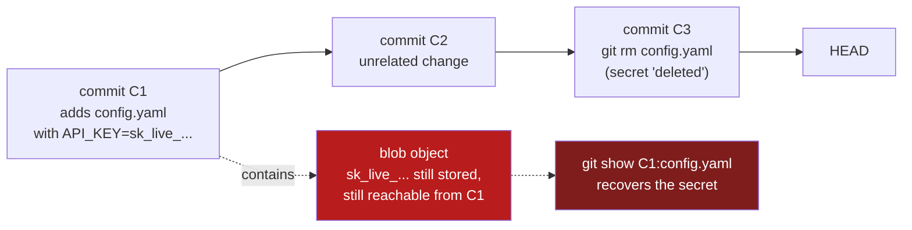
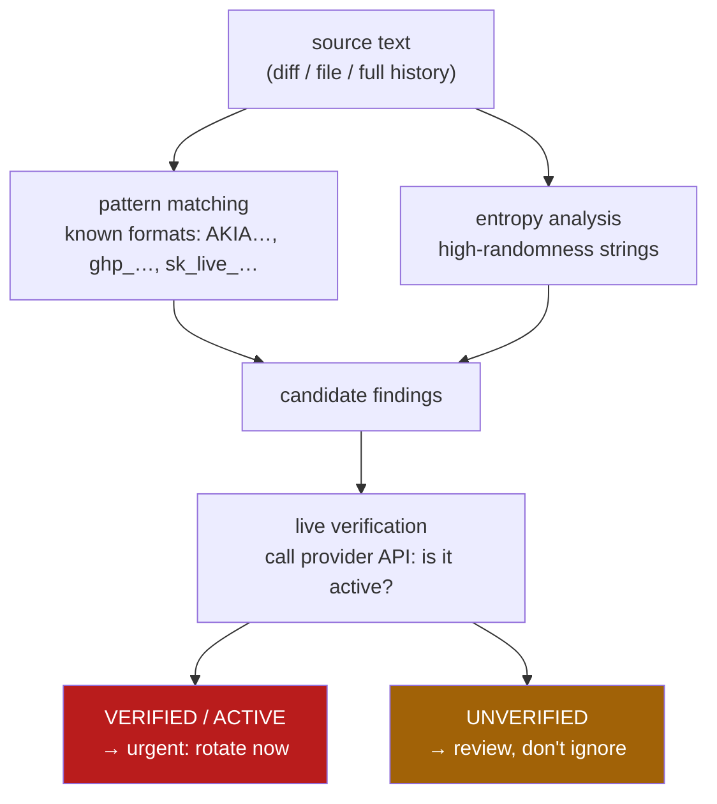
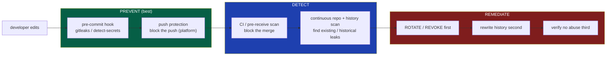
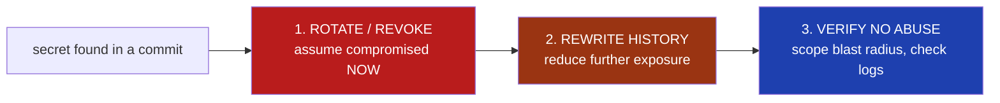
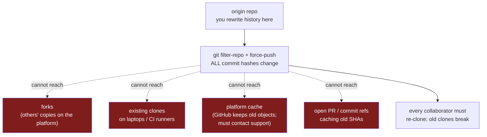

# Chapter 4 — Secrets in Source: Detection and Remediation

*What this chapter covers.* A secret committed to a repository is not a bug you can patch, a
config you can flip, or a line you can delete. It is a **live credential in a public place**,
and git's content-addressed object model — the same Merkle DAG that gives you tamper-evidence in
Chapter 1 — makes it a credential that *stays* in that place. `git rm` does not remove it. A new
commit does not remove it. It sits in the history, reachable to anyone who can clone the repo now
or exfiltrate it later, until you rewrite history everywhere the repo exists — which, as we will
see, you cannot fully do. This chapter is the deep, operational treatment of the whole lifecycle:
why secrets end up in source, why the consequence is a live credential rather than an embarrassment,
how secret scanners actually work (pattern matching, entropy analysis, and the crucial capability of
**live verification**), where to place scans so you *prevent* rather than merely detect, and — the
part teams most often get backwards — how to remediate in the correct order. The single most
important idea here is a matter of sequence: when a secret hits source you **rotate first and scrub
history second**, because the credential is burned the instant it is committed and history-scrubbing
does nothing to un-burn it. This is the source-side counterpart to Book 4, Chapter 6 — Secrets in
CI, which concerns secrets a *pipeline* handles at runtime; here the secret is *committed to the
repo itself*.

Learning goals — after this chapter you should be able to:

- Explain **how and why** secrets end up committed, and why a committed secret is a *live
  credential* that automated adversaries find and abuse very quickly on public hosts.
- Describe why git history makes secrets **permanent**: deletion in a later commit never removes
  the object from earlier history, and anyone with repo access can recover it.
- Explain the three detection techniques — **pattern matching**, **entropy analysis**, and **live
  verification** — and why verification is the capability that makes findings *actionable* at scale.
- Compare the real tooling honestly: **git-secrets**, **TruffleHog**, **Gitleaks**,
  **detect-secrets**, **GitHub secret scanning + push protection**, **GitLab Secret Detection**,
  and commercial options — by technique and by where they run.
- Place scans correctly across the lifecycle — **pre-commit hook → push protection → CI →
  continuous repo/history scan** — and understand why **push protection is the single
  highest-value control**.
- Remediate in the correct order: **rotate/revoke first, rewrite history second, verify no abuse
  third**, using `git-filter-repo` / BFG (not the deprecated `filter-branch`), while understanding
  why history rewriting is incomplete (forks, clones, platform caches).
- Operationalize all of the above across thousands of repos, and connect it to the real fix —
  **fewer long-lived secrets** via workload identity and short-lived credentials.

## The problem: how secrets get into source, and why it is severe

### How they get committed

Nobody sets out to publish a production database password. Secrets enter source through the path of
least resistance, and the path of least resistance is almost always *convenience under deadline*.
The recurring patterns:

- **Hardcoded credentials for convenience.** A developer wires up a new integration, pastes the
  API token straight into the client constructor to "make it work," and means to move it to config
  later. Later never comes; the commit ships.
- **Config files with real values.** `config.yaml`, `application.properties`, `settings.py` — files
  that *are supposed* to be committed — get filled with real endpoints and real credentials instead
  of placeholders, because someone tested against a real environment and forgot to scrub before
  committing.
- **`.env` files committed.** The `.env` convention exists precisely to keep secrets *out* of
  source, but a missing `.gitignore` entry, a `git add -A`, or a `git add -f` overriding the ignore
  puts the whole file — DB URL, JWT signing key, third-party tokens — into history in one shot.
- **Private keys and certificates.** SSH keys, TLS private keys, service-account JSON, GPG keys,
  and PKCS#12 bundles get committed alongside the code that uses them, often in a `certs/` or
  `deploy/` directory that "obviously" belongs with the app.
- **Cloud credentials and API tokens.** Long-lived AWS access keys, GCP service-account keys, Azure
  client secrets, and SaaS tokens (Slack, Stripe, Datadog, PagerDuty) — the credentials with the
  widest blast radius — are exactly the ones developers most often hardcode, because standing up
  the "right" identity-based alternative is more work than pasting a key.
- **Accidental paste.** A credential copied for a terminal session lands in a source file, a code
  comment, a committed shell script, or a checked-in `Makefile` target.
- **Test fixtures with real credentials.** "I'll just use my real staging key so the test passes,"
  and the fixture — real key and all — is committed as part of the test suite, where it is easy to
  forget it was ever real.

Notice that these are not the mistakes of careless engineers. They are the *default outcome* of a
system where hardcoding is easier than not-hardcoding. That observation drives the entire prevention
section: the durable fix is to make the secure path the easy path, not to exhort people to be
careful.

### Why it is severe: a committed secret is a live credential

The reason this chapter exists — the reason "secrets in source" is a named control in every serious
supply-chain framework — is that a committed secret is not *information about* a credential. It **is**
the credential. An attacker who reads `AKIA...`/`wJalrXUt...` out of your repo does not need to
crack anything. They authenticate. The gap between "secret is in a commit" and "attacker is calling
your cloud API as you" is a single `aws configure`.

On public hosts, the window between *commit* and *abuse* is measured in **minutes, not days**.
Adversaries run continuous, automated pipelines against the public GitHub firehose (the events API,
the public commit stream) that clone, scan, and *test* candidate credentials the moment they appear.
This is well documented across many security-vendor and academic studies over the past decade;
avoid quoting a specific "N seconds" figure, but the qualitative reality is robust and repeatedly
reproduced: **a valid cloud key pushed to a public repo is frequently found and used before the
developer has finished reading the "you just pushed" email.** The classic outcome for a leaked AWS
key is crypto-mining spun up across every region within minutes and a five- or six-figure bill by
morning; the more dangerous outcome is quiet lateral movement using whatever that key could reach.

Internal repositories are **not** a safe harbor. "It's only on our private GitHub org" assumes the
threat model is *external anonymous internet*, when the real threat model (Chapter 1) includes the
malicious insider, the compromised developer laptop, the stolen PAT or OAuth token, and account
takeover (ATO). A secret in a private repo is exposed to everyone who can read that repo *now* —
which at fleet scale is often hundreds of engineers — and to anyone who compromises a single one of
their credentials *later*. Many real breaches begin with an attacker who gains modest read access to
an internal SCM, greps history for secrets, and pivots on what they find. The credential's exposure
is the union of everyone who can read the repo across all of time, not the snapshot of who can read
it today.

And this is where the second half of the problem — **permanence** — makes the first half so much
worse.

### The git-history permanence problem

Chapter 1 established that git is a content-addressed Merkle DAG: every blob, tree, and commit is
named by the hash of its own contents, and a commit's hash commits to its entire reachable history.
That property is a gift for integrity and a curse for secrets.

When you "delete" a secret the way people instinctively delete things — edit the file to remove the
line, or `git rm` the file, then commit — you have **not removed the secret**. You have created a
*new* commit whose tree no longer contains it. The old commit, and the old blob containing the
secret, are still in the object store, still reachable by walking the parent chain, and still
present in every clone and every fork. `git log -p`, `git show <old-sha>`, or `git cat-file blob
<blob-sha>` retrieves it in one command. This is the direct source-control analogue of the container
layer lesson in Book 6, Chapter 1 — Image Layers: deleting a file in a *later* layer does not remove
it from the *earlier* layer where it was added; the bytes are still shipped, just hidden from the
top-level view. Git is the same. A later commit hides the secret from `HEAD`; it does not remove it
from the history that `HEAD` still descends from.



The consequences compound. Because the secret is reachable from history, *the only* way to truly
remove it is to **rewrite history** — produce a new set of commits, from the poisoned commit
forward, whose trees never contained the secret — which, per Chapter 3's treatment of force-pushes,
changes every commit hash from the rewrite point onward and requires a force-push plus a coordinated
re-clone by everyone. And even that does not reach **forks, existing clones on other machines, CI
caches, and the hosting platform's own cached views** of the old objects. We return to this in the
remediation section; for now, hold onto the conclusion it forces: because you can rarely guarantee
the secret is gone from *everywhere*, you must treat it as *already gone to an adversary*. That is
the whole argument for rotation-first.

## Detection: how secret scanners actually work

A secret scanner reads text — a diff, a file, a whole commit history — and decides which strings are
credentials. It has three techniques available, of increasing sophistication, and the good tools
combine them.

### Technique 1: pattern matching (known credential formats)

The workhorse. Most high-value credentials have **structured, recognizable formats** by design,
because the issuing providers want them to be machine-identifiable. A regex tuned to a provider's
format finds its keys with high precision and low false-positive rate:

| Provider / type | Illustrative pattern (simplified) |
|---|---|
| AWS access key ID | `AKIA[0-9A-Z]{16}` (also `ASIA` for STS temp keys) |
| GitHub token | `ghp_[0-9A-Za-z]{36}` (PAT); `gho_`, `ghu_`, `ghs_`, `ghr_` variants |
| Stripe live secret | `sk_live_[0-9A-Za-z]{24,}` |
| Google API key | `AIza[0-9A-Za-z\-_]{35}` |
| Slack token | `xox[baprs]-[0-9A-Za-z-]+` |
| Private key header | `-----BEGIN (RSA|EC|OPENSSH|PGP) PRIVATE KEY-----` |
| JWT | `eyJ[A-Za-z0-9_-]+\.eyJ[A-Za-z0-9_-]+\.[A-Za-z0-9_-]+` |

Modern providers deliberately make this *easier* by adding fixed prefixes and even checksums. GitHub
tokens gained the `ghp_`/`gho_`/… prefixes precisely so scanners (theirs and everyone else's) can
find them with near-zero ambiguity, and they carry a checksum so a scanner can reject typos before
even hitting the network. Pattern matching's weakness is the flip side of its strength: it only
finds credentials whose format it *knows*. A homegrown internal token, a database password, or a
generic API key with no distinctive shape sails straight through a purely pattern-based scanner.

### Technique 2: entropy analysis (high-randomness strings)

To catch secrets with no known format, scanners fall back to **entropy**. A well-generated
credential is, by construction, high-entropy: it looks random, because it *is* random. English
identifiers, prose, and code are low-entropy — they have structure and repetition. So a scanner
computes the **Shannon entropy** of candidate tokens (often per-charset: a threshold for base64-like
strings, another for hex-like strings) and flags anything above a cutoff as a *possible* secret.

Entropy analysis is how you catch `DB_PASSWORD="Xk9$mQ2vLp8@wRt4"` and random-looking internal
tokens that no regex knows about. Its cost is **false positives**: hashes, UUIDs, minified JS
bundles, base64-encoded test data, checksums, and long git SHAs are all high-entropy and all
harmless. A scanner run in pure-entropy mode on a real codebase produces a wall of findings, most of
them noise. Tuning the threshold trades recall against precision, and there is no setting that gives
you both. This false-positive problem is exactly what the third technique exists to solve.

### Technique 3: live verification (does the credential actually work?)

The capability that changes secret scanning from a noisy linter into an incident-grade signal is
**verification**: the scanner takes a candidate credential and *makes an API call to the issuing
provider to test whether it is live*. A found `AKIA...` plus its secret key becomes an
`sts:GetCallerIdentity` call; a found `ghp_...` becomes a request to the GitHub API's `/user`
endpoint; a found Stripe key becomes a lightweight authenticated call to Stripe. If the call
succeeds, the credential is **verified/active** — a real, working key, right now. If it fails, it is
**unverified** — expired, revoked, a placeholder, or a false positive.

This is the headline capability of **TruffleHog** (Truffle Security), which ships hundreds of
provider-specific *detectors*, each of which knows both how to recognize its credential type and how
to verify it against that provider's API. Verification collapses the false-positive problem: instead
of triaging thousands of high-entropy candidates by hand, you look first at the handful the tool has
*proven* are live. It also raises confidence to the level an incident responder needs — "verified
active AWS key in a public repo" is not a maybe, it is a page.

Verification has honest caveats you must understand before you lean on it. It makes network calls to
third-party APIs, which is a data-egress and rate-limit consideration and, in the wrong context, a
way to trip a provider's anomaly detection. It can produce false *negatives* (the tool marks a real
secret unverified because the provider endpoint changed, the network was blocked, or the credential
is valid but scoped so narrowly the verification call is denied). And a verification call is,
technically, *using* the credential — you are exercising a key you found, which is fine when it is
your own key and worth thinking about in a multi-tenant scanning service. None of this outweighs its
value; it means you treat "unverified" as *lower priority*, never as *safe*.



Prioritizing by verification status is the same move as prioritizing vulnerabilities by
exploitability in Book 2, Chapter 7 — Prioritization and Reachability: the raw finding count is
unmanageable, so you rank by *proven, live risk* and work the top of the list first. A verified-live
leaked key is the secret-scanning equivalent of a reachable, exploited-in-the-wild CVE.

### The tools, compared honestly

| Tool | Pattern | Entropy | Verification | Baseline | Primary scan point(s) | Notes |
|---|---|---|---|---|---|---|
| **git-secrets** (AWS Labs) | Yes | No | No | No | pre-commit / pre-push hook | Small, AWS-focused; register providers/regexes; hook-driven. Effectively unmaintained but still deployed. |
| **TruffleHog** (Truffle Security) | Yes (many detectors) | Yes | **Yes** (800+ detectors) | Partial | CLI, CI, pre-commit, full history, live systems | Verification is its differentiator; scans git history, filesystems, S3, and more. |
| **Gitleaks** | Yes | Yes | No (native) | Yes (`.gitleaksignore` / allowlist) | pre-commit, CI, history | Fast Go single-binary; TOML rule config; the de-facto CI-friendly scanner. |
| **detect-secrets** (Yelp) | Yes (plugins) | Yes | Limited (some plugins) | **Yes** (`.secrets.baseline`) | pre-commit, CI | Baseline model is its differentiator: snapshot accepted findings, flag only *new* ones. |
| **GitHub secret scanning** | Yes (partner + custom) | Limited | Via partners | N/A | platform (all pushes + history) | Native to GitHub; **partner program** auto-notifies issuers to revoke. |
| **GitHub push protection** | Yes | — | — | N/A | **at push time (blocks)** | *Prevents* the commit from landing; highest-value control. |
| **GitLab Secret Detection** | Yes | Yes | No | Yes | CI pipeline | Runs Gitleaks under the hood as a CI job; pipeline-native. |
| **GitGuardian / Spectral (commercial)** | Yes | Yes | Yes | Yes | pre-commit, CI, platform, history, dashboards | Managed detection, org dashboards, remediation workflows, incident tracking. |

A few clarifications the table compresses. **git-secrets** is deliberately minimal — it is git hooks
plus a registry of prohibited patterns, born to stop AWS keys, and it does exactly that and little
more. **Gitleaks** has no native live-verification, but it is fast, trivially embeddable in CI, and
configured entirely through a readable TOML file, which is why it is the most common default and why
GitLab's own Secret Detection wraps it. **detect-secrets**' distinctive contribution is not a
detection technique but a *workflow*: the **baseline**, discussed under prevention, which is how you
make scanning usable on a repo that already contains a hundred grandfathered findings. And **GitHub
secret scanning** is not just a scanner but a *revocation network*: through its partner program, when
it detects a supported provider's credential in a public repo it notifies the *issuer* (AWS, Stripe,
Slack, npm, …), who can automatically revoke or quarantine the key — remediation the repo owner did
not have to initiate.

### Where to scan: prevent, detect, remediate

The same detection engine has wildly different value depending on *where in the lifecycle* you run
it. There are four positions, and they form a defense-in-depth chain from cheapest-and-earliest to
most-expensive-and-latest:



- **Pre-commit** (client-side git hook): the secret never even becomes a commit. Cheapest possible
  fix, but *bypassable* — a hook lives on the developer's machine and any developer can skip it with
  `git commit --no-verify` or by not installing it.
- **Push protection** (platform, at push time): the platform inspects the pushed commits and
  **rejects the push** if it contains a detected secret. This is the best place, because it is
  *server-side prevention* — it stops the secret at the door, cannot be silently skipped like a
  local hook, and there is nothing to clean up afterward because nothing landed.
- **CI / pre-receive** (server-side, before merge): a scan that fails the build or blocks the merge.
  The secret may already be in a branch's history, but you can stop it reaching the protected branch.
- **Continuous repo + history scanning**: periodic full scans of every repo and its *entire history*
  to find secrets that were committed before you had the earlier gates, or that slipped through.
  This is *detection after the fact*, and it feeds remediation.

The ordering principle is blunt: **prevention beats detection beats cleanup**, and the earlier you
catch a secret the less you have to do. A secret stopped by push protection costs a developer thirty
seconds. The same secret caught by a continuous history scan three months later is a full incident —
rotate, investigate abuse, rewrite history, chase forks — because by then it has been exposed for
three months.

## Prevention: stop them entering, because entering is the expensive part

### Push protection: the single highest-value control

If you do one thing after reading this chapter, enable **push protection** org-wide. Both major
platforms offer it — GitHub secret scanning **push protection** and GitLab's equivalent — and the
mechanism is exactly what you want: at `git push`, the server scans the incoming commits for known
secret formats *before accepting the ref update*, and if it finds one it **rejects the push** with a
message naming the secret type and location. The developer fixes it and re-pushes. The secret never
enters the repository, so there is no history to rewrite, no fork to chase, and — critically — in
the common case no rotation to perform, because the credential never became public.

Push protection includes a **bypass** path (with a reason, logged and often alertable) for the
genuine false positive, and org administrators can configure whether bypass is allowed and who is
notified. Enabling it as an **org-level setting for all repositories**, rather than leaving it to
per-repo opt-in, is the fleet move (Chapter 8 — Fleet Configuration): the value of "no repo can
receive a secret push" comes only from *every* repo having it on.

Push protection's limit is the same as any pattern-based gate: it catches credentials whose *format*
it recognizes — the AKIAs and ghp_s and sk_lives — and not the shapeless internal token or the
generic database password. It is a high-precision net, not a total one. That is why you layer it with
the controls below.

### Pre-commit hooks — necessary, but client-side and bypassable

Run a scanner as a **pre-commit hook** so the developer gets feedback *before* the secret is even
committed locally. The de-facto framework is [pre-commit](https://pre-commit.com), which manages
hooks across a repo:

```yaml
# .pre-commit-config.yaml
repos:
  - repo: https://github.com/gitleaks/gitleaks
    rev: v8.18.4
    hooks:
      - id: gitleaks
  - repo: https://github.com/Yelp/detect-secrets
    rev: v1.5.0
    hooks:
      - id: detect-secrets
        args: ["--baseline", ".secrets.baseline"]
```

This is genuinely useful — it shifts detection as far left as it can go and teaches developers the
moment they make the mistake. But be clear-eyed about its guarantee, which is **none**. A pre-commit
hook is code on the developer's machine that the developer controls. `git commit --no-verify` skips
it. A developer who never ran `pre-commit install` never had it. A fresh clone on a new laptop does
not have it until someone sets it up. Client-side hooks are a *developer-experience* control, not a
*security boundary*. Their correct role is to catch honest mistakes early and cheaply; they must
always be **paired with a server-side gate** (push protection and/or CI) that the developer cannot
bypass. Treat the hook as the fast feedback loop and push protection as the enforcement.

### `.gitignore` for secret files — necessary but insufficient

Keeping `.env`, `*.pem`, `id_rsa`, `credentials.json`, and friends in `.gitignore` prevents the
*whole-file* accident — the `git add -A` that would otherwise sweep a `.env` into a commit:

```gitignore
.env
.env.*
*.pem
*.key
id_rsa
credentials.json
service-account*.json
```

Do it — it is free and it stops a common failure. But understand what it does *not* do. `.gitignore`
prevents *untracked* files matching those patterns from being added by accident; it does nothing
about a secret **hardcoded inside a file that is supposed to be committed** (the API key pasted into
`client.go`), and it is overridden by `git add -f`. It is a guard against one specific mechanism, not
a secrets control. A repo with a perfect `.gitignore` and a Stripe key hardcoded in the payment
service is fully compromised.

### The real prevention: never hardcode — make not-hardcoding the easy path

Every control above is a *net under the trapeze*. The prevention that actually reduces leaks is
**removing the reason to put a secret in source at all**. Secrets belong in a **secret manager** —
Vault, AWS Secrets Manager, GCP Secret Manager, Azure Key Vault, Kubernetes secrets backed by an
external store — and source should contain only *references*, injected at deploy or runtime, never
values. This is the same discipline as Book 4, Chapter 6 — Secrets in CI and Book 5, Chapter 9 —
Secrets Management, applied at the source layer: the repo names the secret; the platform resolves it.

```go
// Wrong: the credential is the source.
db := sql.Open("postgres", "postgres://app:S3cr3tP@ss@db.prod:5432/app")

// Right: source names a reference; the value is injected from the environment,
// which a secret manager populates at deploy time.
db := sql.Open("postgres", os.Getenv("DATABASE_URL"))
```

But "just use a secret manager" is an instruction, not a system, and instructions lose to deadlines.
The engineering job is to build the **paved road** (Book 4, Chapter 6; Book 8, Chapter 8 — Metrics
and Paved Roads): make fetching a secret from the manager *easier* than pasting one into a file. A
service template that already wires up secret injection, a local-dev tool that pulls short-lived
credentials with one command, a framework that reads references transparently — these change the
default outcome. When the secure path is the low-effort path, hardcoding stops being the thing a
tired engineer reaches for at 6pm. You cannot scan your way to zero leaks; you *design* your way to
few leaks and scan for the rest.

### Baselines: making scanning usable on repos that already leak

There is a practical obstacle to turning scanning on: an existing repo of any age already contains
findings — some real-but-already-rotated, some false positives, some test data — and a scanner that
fails CI on all of them is a scanner everyone disables on day one. The **baseline** solves this.
**detect-secrets** pioneered the pattern: you snapshot the current set of known/accepted findings
into a `.secrets.baseline` file, and thereafter the scanner reports only findings **not** in the
baseline — i.e., *new* secrets:

```bash
# Create the baseline once, capturing existing (triaged) findings.
detect-secrets scan > .secrets.baseline

# Audit each entry: is it a real secret, a false positive, or already rotated?
detect-secrets audit .secrets.baseline

# In CI / pre-commit, scan against the baseline — only NEW secrets fail.
detect-secrets scan --baseline .secrets.baseline
```

Gitleaks offers the same capability via allowlists and a `.gitleaksignore` file keyed by finding
fingerprint. The baseline is what makes org-wide rollout tractable: you turn scanning on *today*
without a flag-day cleanup of every historical finding, you gate against *regressions*, and you burn
down the baseline's real entries as a separate, prioritized backlog. Two discipline notes: audit the
baseline honestly — do not baseline a *live* secret to make CI green — and treat a growing baseline
as debt, not as resolution.

## Remediation: the hard part, and the order that matters

Detection and prevention are the easy 80%. Remediation is the hard 20%, and it is where teams
routinely do the right things in the wrong order and leave themselves compromised. Internalize one
sequence:



### Step 1 (primary): rotate/revoke the secret — first, always

The moment a secret is committed, treat it as **compromised**. Not "possibly exposed" — *burned*. On
a public repo, automated adversaries may already have it; on a private repo, everyone with read
access across all of time is in the exposure set and you cannot prove none of them or their
credentials is hostile. There is no forensic finding that returns a leaked secret to *trusted*
status. So the *real* fix — the one that actually closes the risk — is to **rotate or revoke the
credential** so the leaked value no longer authenticates anything: cut a new AWS key and delete the
old, revoke the token, re-issue the certificate, roll the database password. Once the leaked value is
dead, its presence in history is a disclosure of a *useless string*.

This is the step teams get backwards. The instinct is to *hide the evidence* — scramble to rewrite
history and make the secret "disappear" — while the live key keeps working the entire time. That is
exactly wrong. History-scrubbing is cosmetic until the secret is dead; a beautifully scrubbed repo
whose leaked key still authenticates is a repo that is still compromised, now with the added false
comfort of a clean `git log`. **Rotation is primary; history rewriting is secondary.** If you can
only do one, rotate.

### Step 2 (secondary): remove it from history

*After* rotation, remove the (now-dead) secret from history to reduce residual exposure and stop it
being scraped, re-triaged, or mistaken for live in future scans. This is where the modern tooling
matters, and where one common tool is *wrong*.

**Use `git-filter-repo`.** It is the actively maintained, purpose-built history-rewriting tool
(written by a git maintainer) and it is what the git project itself now points people to. To purge a
file or replace secret literals across all of history:

```bash
# Remove a file from all of history:
git filter-repo --path config/secrets.yaml --invert-paths

# Or redact specific secret strings wherever they appear, across every commit:
#   expressions.txt contains, e.g.:  sk_live_51H8xY2abcdEFGH==>REDACTED
git filter-repo --replace-text expressions.txt
```

**BFG Repo-Cleaner** is a reasonable alternative — a JVM tool optimized for the common cases
(delete files matching a glob, replace strings) and notably fast on large repos:

```bash
bfg --replace-text passwords.txt my-repo.git
bfg --delete-files id_rsa my-repo.git
```

**Do not use `git filter-branch`.** It is officially discouraged in git's own documentation: it is
extremely slow, has numerous sharp edges that silently corrupt rewrites, and `git-filter-repo` exists
specifically to replace it. If a runbook you inherit says `filter-branch`, update the runbook.

### Why history rewriting is incomplete — the fork/cache/clone problem

Here is the crux, and the reason step 1 is primary and step 2 is only secondary: **history rewriting
cannot fully remove a secret from the world.** It is not a "delete" so much as a "rewrite the copy I
control and hope."



Rewriting history has two categories of cost. First, the **mechanical disruption** covered in
Chapter 3 — Branch Protection and Force-Push Controls: because every rewritten commit gets a new
hash (the content changed, so the content-address changed, all the way down the DAG), the rewrite is
a **force-push** that breaks every existing clone, every open pull request built on the old SHAs,
every fork's relationship to the base, and every pinned commit reference. Everyone must re-clone;
in-flight work must be rebased onto the new history; CI configs pinned to old SHAs break. On a busy
repo with dozens of contributors this is a genuine coordination event.

Second — and this is the part that makes rotation non-negotiable — the rewrite **cannot reach copies
you do not control**:

- **Forks** on the platform are independent repositories with their own object stores. Your rewrite
  does not touch them; the secret persists in every fork until each fork owner also rewrites.
- **Existing clones** on laptops, build agents, and backup systems still contain the old objects.
- **The hosting platform's own cache.** GitHub, specifically, retains unreachable commit objects and
  can continue to serve them by SHA even after your force-push; a commit is not truly gone from
  GitHub just because nothing references it. To purge cached views and forks you must **contact
  GitHub Support** and ask them to garbage-collect and remove the cached commits — it is not
  something a force-push accomplishes on its own.
- **Open pull requests and refs** may cache the old SHAs and keep them retrievable.

So even a flawless rewrite leaves the secret recoverable from *somewhere* for some window, possibly
indefinitely. This is not a reason to skip step 2 — do it, it reduces exposure and cleans the repo —
but it is the ironclad reason step 2 can never be your *primary* control. You cannot guarantee the
secret is gone; you *can* guarantee the credential is dead. Kill the credential.

### It's an incident, not a chore

A committed secret — especially a *verified-live* one — is a security **incident**, and it belongs
in your incident-response process (Book 8, Chapter 6 — Incident Response). The full response is not
"scrub and move on":

1. **Rotate/revoke** immediately (step 1).
2. **Scope the blast radius.** What did that credential access? A leaked read-only metrics token and
   a leaked AWS key with `AdministratorAccess` are different incidents. Enumerate the permissions and
   the systems reachable through them — a leaked cloud key or CI token is *lateral-movement fuel*
   (Book 4, Chapter 6), and the blast radius is every system that trusts it.
3. **Check for abuse.** Pull the provider's audit logs (CloudTrail, GitHub audit log, the SaaS
   access log) for use of the credential between commit time and revocation. Look for calls from
   unexpected IPs, unusual regions, resource creation, or data access. *Assume* the public-repo case
   was used until logs show otherwise.
4. **Then clean history** (step 2), and contact the platform about forks/caches if the exposure was
   public or high-severity.
5. **Feed it back.** Record the finding, MTTR, and root cause into metrics (Book 8, Chapter 8) and
   ask the paved-road question: *why was hardcoding the easy path here, and how do we close it?*

The remediation checklist, in order:

| # | Step | Why | Primary/secondary |
|---|---|---|---|
| 1 | **Rotate / revoke** the credential | The secret is already exposed; only rotation actually closes the risk | **Primary** |
| 2 | Scope blast radius | Know what the key could reach to size the incident | Investigation |
| 3 | Check audit logs for abuse | Detect whether it was used before revocation | Investigation |
| 4 | Rewrite history (`git-filter-repo`/BFG) | Reduce residual exposure; clean the repo | Secondary |
| 5 | Contact platform re: forks/caches | Rewrite can't reach them; only support can purge | Secondary |
| 6 | Record metrics + fix the paved road | Prevent recurrence | Follow-up |

## Operationalizing at scale

Everything above describes handling *a* secret. At fleet scale — thousands of repos, hundreds of
engineers, thousands of pushes a day — secrets leak *continuously*, and the strategy is not heroics
on each one but a standing system across three layers.

**Prevent, org-wide.** Enable **push protection on every repository** via the org setting, not
per-repo opt-in (Chapter 8 — Fleet Configuration). The value of "no repo can receive a secret push"
is realized only when the coverage is total; a single opted-out repo is where the next leak lands.
Pair it with organization-mandated pre-commit hooks distributed through your paved-road templates so
developers get the fast local feedback loop by default.

**Detect, continuously.** Run continuous scanning across **all repos *and their full history***, not
just new commits — because the existing leaks predate your gates and are exactly the ones an
adversary greps for. This is a scheduled fleet-wide job (native platform scanning, or Gitleaks/
TruffleHog in a central pipeline, or a commercial platform) whose output is a managed queue of
findings, deduplicated against baselines.

**Remediate, automatically where you can.** The highest-leverage automation is **auto-revocation**.
GitHub's **secret scanning partner program** does this for you on public repos: on detecting a
supported provider's credential, GitHub notifies the *issuer*, who can revoke or quarantine it
without waiting for the repo owner. For your own internal credentials, wire the scanner's findings
into your secret manager and cloud IAM so a detected key can be **programmatically revoked** and
re-issued — closing the loop from detection to a dead credential in seconds rather than the hours a
human ticket takes. The faster the auto-revoke, the smaller the abuse window that dominates your risk.

**Measure.** Track the numbers that tell you whether the system works (Book 8, Chapter 8 — Metrics):
secrets found, secrets rotated, **push-protection catches** (leaks *prevented* — the number you want
going *up* as a share of total, because it means the door is holding), mean time to remediate (MTTR)
from detection to revocation, and the standing size of un-remediated findings. A rising
push-protection-catch ratio and a falling MTTR is a healthy program; a growing backlog of unverified
findings nobody triages is a program drowning in noise — which is the cue to lean harder on
verification.

**Prioritize by verification.** At fleet scale you will have far more *findings* than you can
manually chase, and most are stale, revoked, or false positives. **Live verification** (TruffleHog,
GitGuardian's validity checks, GitHub's partner validation) is how you find the signal in that noise:
sort by *verified-active* and work those first, exactly as Book 2, Chapter 7 — Prioritization ranks
vulnerabilities by reachable, exploitable risk rather than raw CVE count. A verified-live key is a
page; an unverified twenty-month-old match is a backlog item. Without verification, a fleet-scale
scanning program produces a finding count so large it becomes noise that everyone learns to ignore —
the worst outcome, because it means real leaks hide in the pile.

## Distributed-systems lens

At the scale this curriculum assumes — many services, many teams, thousands of repos, thousands of
pushes a day — the individual-secret framing dissolves and only the systemic one survives. **Secrets
leak constantly**; it is a base rate, not an anomaly. The only tractable operating model is the
three-layer system above: **org-wide push protection to prevent**, **continuous history scanning to
detect**, and **automated revocation to remediate** — because no volume of manual diligence scales to
a fleet, and any control that depends on per-repo opt-in or per-developer discipline has already
failed on the repos that matter most.

The **blast radius is a fleet property, not a repo property.** A leaked credential's damage is not
bounded by the repo it leaked from; it is bounded by *what the credential can reach*. A hardcoded
cloud key or CI token is **lateral-movement fuel** (Book 4, Chapter 6): the attacker who reads it
out of one repo's history uses it to authenticate to your cloud, your registry, your Kubernetes
control plane, your data stores — wherever that identity is trusted. In a fleet with broad IAM
trust, one leaked key from one forgotten repo can traverse to systems whose engineers never touched
that repo. This is why the secret-scanning program cannot be a repo-local concern owned by each team;
it is a fleet-security concern, because the credentials that leak are fleet-scoped.

**Rotation is primary precisely because history cleanup does not scale to a fleet.** For a single
repo with three contributors you might, with effort, coordinate a rewrite and even chase the forks.
Across thousands of repos with forks, mirrors, thousands of clones on laptops and CI agents, and the
platform's own caches, you **cannot guarantee** the secret is gone from everywhere — the fork/cache
problem is unbounded at scale. So you never rely on removal; you rely on the one action whose effect
*is* global and *is* under your control: killing the credential. Rotate-first is not just correct
per-incident; it is the only remediation posture that is *sound* at fleet scale.

**Push protection org-wide is the single highest-value control** — the fleet corollary of
"prevention beats detection beats cleanup." One server-side gate, enabled once at the org level,
stops the majority of formatted-credential leaks at the door across every repo simultaneously, with
no cleanup tail, no fork chase, and usually no rotation. Nothing else in this chapter has that
leverage: every detection-and-remediate path is per-incident labor, while push protection is a single
configuration that removes the incidents before they start.

And the deepest fix is to **have fewer long-lived secrets to leak at all.** Every control here is
managing the risk of static, long-lived credentials sitting in files. The structural solution is to
stop issuing those credentials: adopt **workload identity** and **short-lived credentials** (Book 4,
Chapter 6; Book 5, Chapter 4 — Keyless Signing and OIDC) so services authenticate with ephemeral,
automatically-rotated, identity-derived tokens instead of static keys a human could paste into a
commit. A credential that lives for five minutes and is minted from the workload's identity is
nearly worthless to an attacker who scrapes it from history an hour later, and there is no static
value to hardcode in the first place. Secret scanning defends the world of long-lived secrets;
workload identity shrinks that world. The mature program does both — scans aggressively for the
secrets that still exist, while systematically reducing how many long-lived secrets exist to be
found.

Finally, the program only *works* if it closes the loop into the rest of your security operation:
findings feed **incident response** (Book 8, Chapter 6), verified-live leaks page like any other
severity-one, and the whole thing is instrumented with **metrics** (Book 8, Chapter 8) that measure
prevention rate and MTTR — because at fleet scale you manage secrets in source the way you manage any
other continuous failure mode: as a system with a base rate, a set of controls, and a dashboard, not
as a series of surprises.

## Key takeaways

- **A committed secret is a live credential, not a disclosure.** On public hosts, automated
  adversaries find and abuse valid keys within *minutes*; internal repos are not safe either, because
  the exposure set is everyone who can read the repo across all of time plus anyone who later
  compromises one of them. Treat every committed secret as compromised the instant it lands.
- **Git history makes secrets permanent.** `git rm` and later edits hide a secret from `HEAD` but do
  not remove the object from history — anyone with repo access recovers it with one command. This is
  the container-layer lesson (Book 6, Ch. 1) in git: deleting later never removes it from earlier.
- **Scanners use three techniques.** Pattern matching (known formats: `AKIA…`, `ghp_…`,
  `sk_live_…`) is precise but format-bound; entropy analysis catches shapeless secrets but is noisy;
  **live verification** — testing whether a found credential actually authenticates — is the
  capability that turns a noisy finding list into an actionable, prioritized one.
- **Know the tools by technique and scan point.** git-secrets (AWS, hooks), Gitleaks (fast, CI,
  config-driven), detect-secrets (baseline workflow), **TruffleHog (live verification)**, GitHub
  secret scanning + **push protection** + partner auto-revocation, GitLab Secret Detection
  (Gitleaks-based), and commercial platforms (GitGuardian, Spectral).
- **Prevention beats detection beats cleanup.** Place controls across pre-commit → push protection →
  CI → continuous history scan. **Push protection is the single highest-value control**: server-side,
  org-wide, it stops formatted secrets at the door with no cleanup tail. Pre-commit hooks are
  fast-feedback but client-side and bypassable — always pair with a server-side gate.
- **The real prevention is not hardcoding.** Put secrets in a secret manager and keep only
  *references* in source, and — decisively — build the paved road that makes fetching a secret
  *easier* than pasting one, so the secure path is the default path.
- **Remediate in order: rotate first, scrub second, verify third.** Rotation/revocation is the only
  action that actually closes the risk; history rewriting is cosmetic until the credential is dead.
  Many teams get this backwards and scrub a clean-looking repo while the leaked key keeps working.
- **History rewriting is incomplete by construction.** Use `git-filter-repo` (or BFG) — never the
  deprecated `filter-branch` — but know the rewrite changes all hashes (a force-push that breaks
  clones, PRs, and forks) and **cannot reach forks, existing clones, or the platform's cache**
  (GitHub retains objects; you must contact support). This incompleteness is *why* rotation is
  primary.
- **At fleet scale it is a system, not a series of incidents.** Org-wide push protection (prevent) +
  continuous history scanning (detect) + automated revocation (remediate), prioritized by
  verification, measured by push-protection catch-rate and MTTR — and, underneath it all, the
  structural fix of **workload identity and short-lived credentials** so there are fewer long-lived
  secrets to leak in the first place.

## Further reading

- **TruffleHog** — Truffle Security's scanner and detector engine, with live credential verification
  across hundreds of providers. https://github.com/trufflesecurity/trufflehog
- **Gitleaks** — fast, config-driven secret scanner; the de-facto CI and pre-commit default, and the
  engine behind GitLab Secret Detection. https://github.com/gitleaks/gitleaks
- **detect-secrets** (Yelp) — the baseline-model scanner; see the project README and audit workflow.
  https://github.com/Yelp/detect-secrets
- **git-secrets** (AWS Labs) — hook-based AWS-credential prevention.
  https://github.com/awslabs/git-secrets
- **GitHub secret scanning and push protection** — native detection, push-time blocking, and the
  partner program that auto-notifies credential issuers for revocation.
  https://docs.github.com/en/code-security/secret-scanning
- **GitLab Secret Detection** — pipeline-native detection documentation.
  https://docs.gitlab.com/ee/user/application_security/secret_detection/
- **git-filter-repo** — the recommended modern history-rewriting tool (and why `filter-branch` is
  discouraged). https://github.com/newren/git-filter-repo and `git help filter-branch`.
- **BFG Repo-Cleaner** — fast history cleaner for large repos.
  https://rtyley.github.io/bfg-repo-cleaner/
- **GitHub — "Removing sensitive data from a repository"** — the official runbook, including the
  critical note that you must contact Support to purge cached views and that forks persist.
  https://docs.github.com/en/authentication/keeping-your-account-and-data-secure/removing-sensitive-data-from-a-repository
- **OWASP — Secrets Management Cheat Sheet.**
  https://cheatsheetseries.owasp.org/cheatsheets/Secrets_Management_Cheat_Sheet.html
- **Book 4, Chapter 6 — Secrets in CI** and **Book 5, Chapter 9 — Secrets Management** (runtime and
  platform secret handling); **Book 5, Chapter 4 — Keyless Signing and OIDC** (short-lived,
  identity-derived credentials); **Book 7, Chapter 1 — SCM Threat Model** (git internals, insider/ATO
  threats) and **Chapter 3 — Branch Protection and Force-Push Controls** (why a rewrite is a
  force-push); **Book 8, Chapter 6 — Incident Response** and **Chapter 8 — Metrics and Paved Roads**.
