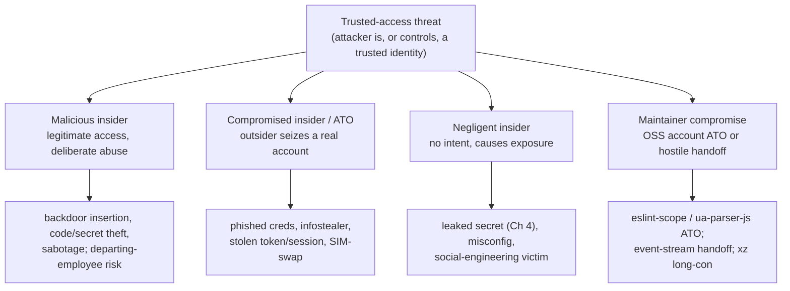
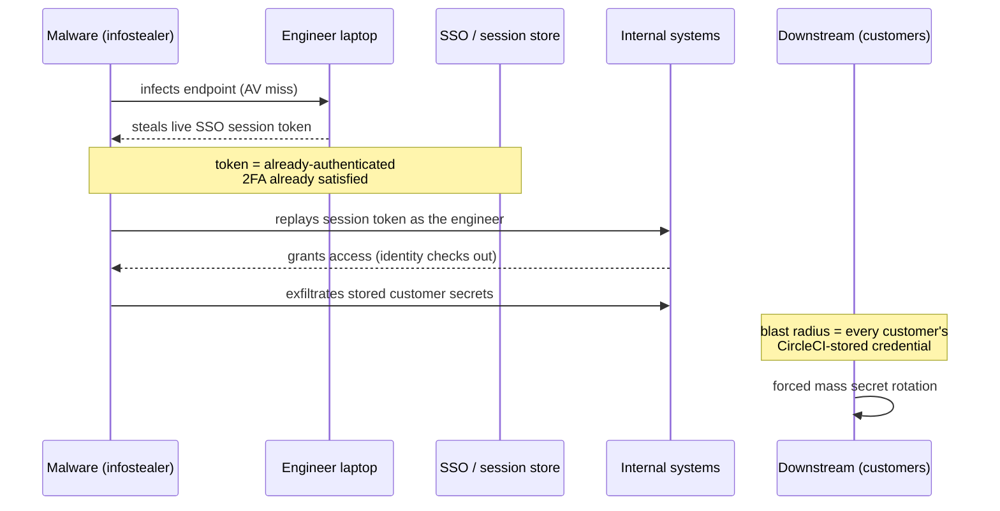
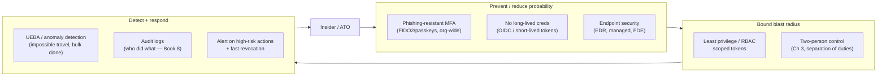

# Chapter 6 — Insider Threats and Account Takeover

*What this chapter covers.* Every control in the preceding chapters — commit signing (Chapter 2),
branch protection and two-person review (Chapter 3), secret scanning (Chapter 4) — assumes one
thing that the attacks in this chapter deliberately break: that the identity behind an action is
honest, and that the account behind that identity is under the control of the right person. A
signature proves *which key* signed a commit, not that the person holding the key is acting in good
faith. A required review proves *that two accounts approved*, not that both belong to
non-colluding humans who are who they say they are. When the attacker **is** a trusted insider, or
**controls** a trusted account, the identity is real, the signature verifies, the login succeeds —
and the machinery designed to keep bad code out waves it through, because from the machinery's
point of view nothing is wrong. This is the trusted-access threat, and it is, at fleet scale, the
single largest attack surface an engineering organization has. This chapter is about the two faces
of it: the **malicious insider** who abuses access they were legitimately given, and **account
takeover** (ATO), where an outsider seizes an insider's access. We will build the taxonomy, work
through the real mechanics of how developer accounts fall (phishing, infostealers, token theft,
session hijack — with the CircleCI 2023 and OAuth-token incidents as the load-bearing examples),
and then get to the actionable core: phishing-resistant MFA, the elimination of long-lived
credentials, least privilege, two-person control, and behavioral detection — the layers that,
together, bound damage that no single control can prevent.

Learning goals — after this chapter you should be able to:

- Explain **why trusted access defeats single controls**, and why insider/ATO is the reason
  "verified identity" is necessary but never sufficient.
- Distinguish the four trusted-access threat classes — **malicious insider, compromised insider
  (ATO), negligent insider, and maintainer compromise** — and match each to the controls that
  actually bound it.
- Describe the real **ATO mechanics**: targeted phishing of developers, credential stuffing,
  infostealer malware on developer endpoints, OAuth/PAT/session-token theft, and SIM-swap — using
  the CircleCI 2023 breach and the 2021–2022 OAuth-token incidents.
- Explain **why phishing-resistant MFA (FIDO2/WebAuthn/passkeys, hardware keys) is categorically
  different** from SMS and TOTP, and enforce it org-wide.
- Argue that the **structural fix is fewer long-lived credentials** — workload identity/OIDC,
  short-lived scoped tokens — because you cannot steal a credential that does not persist.
- Apply **least privilege, separation of duties, prompt offboarding, and behavioral/audit-log
  detection (UEBA)** to bound and detect trusted-access abuse across thousands of accounts.

## The trusted-access threat: why single controls fail

Return to the trust boundary the whole book is built on. In Chapter 1 we modeled the SCM as a
system whose integrity rests on *who can write what, where*. Chapters 2 and 3 hardened that: a
push must be signed by a known key, a merge must clear review by a second party, protected
branches refuse force-pushes. Every one of those controls is a function of **identity** — it asks
"is this actor authorized?" and, satisfied that they are, permits the action.

Insider threat and ATO attack the premise, not the mechanism. They do not defeat the signature
check; they present a **valid signature**. They do not bypass required review; a **real reviewer
approves**, because the reviewer is the attacker, or is colluding, or is deceived. The account is
legitimate. The 2FA prompt was answered. The audit log will show a normal-looking action by a
normal user. This is what makes the class so dangerous and so different from the external attacks
in Book 1: there is no exploit, no CVE, no anomalous protocol — there is a trusted identity doing
something it is technically permitted to do.

That is exactly why no single control suffices. Signing does not help if the signing key is in the
attacker's hands. Review does not help if the reviewer is the attacker or is fooled by underhanded
code (Chapter 5). MFA does not help if the attacker already holds a live session token. Each
control is defeated *by construction* the moment trusted access is in the wrong hands. The only
workable posture is **defense-in-depth around a bounded blast radius**: assume any single account
can be compromised or turn malicious, and arrange things so that when one does, it cannot
unilaterally reach the supply chain, and the abuse is detectable after the fact. Concretely, that
means four independent layers — reduce the chance of takeover (phishing-resistant MFA, endpoint
security), reduce what there is to steal (no long-lived credentials), reduce what any one account
can do (least privilege, two-person control), and detect abuse when it happens (behavioral
analytics, audit logs). The rest of the chapter is those four layers.

## A taxonomy of trusted-access threats

Four classes, distinguished by *who* the attacker is relative to the trusted identity.

### Malicious insider

An employee, contractor, or maintainer who deliberately abuses access they were legitimately
granted. The catalogue of abuse is exactly the catalogue of what trusted access permits:
**inserting a backdoor** (the deniable, review-surviving kind from Chapter 5, made far easier when
you are the author *and* can influence review); **stealing** source, secrets (Chapter 4), or data;
and **sabotage** — deleting history, corrupting artifacts, disabling controls. Motivations are the
familiar set: money (selling access or code, or being paid to plant a backdoor), coercion,
ideology (the "protestware" phenomenon — a maintainer sabotaging their own package to make a
political point, as with the node-ipc case discussed in Book 1, Chapter 4), disgruntlement, and
state-sponsored espionage. The malicious insider is the hardest class to *prevent*, precisely
because they hold real access and often real knowledge of your controls; the realistic goal is to
**bound** what they can do alone and to **detect** what they do.

The sharpest, most common variant is the **departing-employee risk**. A resignation or termination
is a window in which motive spikes (grievance, or a new employer who wants the code) and access
frequently *lingers* — the SSO account is disabled but a personal-access token minted a year ago
still works, an SSH deploy key is still authorized, a service-account credential they created is
still live, a session on a personal device is still valid. Offboarding that revokes the human
identity but misses the machine credentials the human created is the recurring failure.

### Compromised insider (account takeover)

A legitimate account seized by an external attacker: credentials phished, a password reused and
credential-stuffed, a token or session cookie lifted by malware, a session hijacked, SMS-2FA
defeated by SIM-swap. The attacker now **acts as** the trusted user. The critical property — and
what makes ATO so much more dangerous than a smash-and-grab intrusion — is that at first it is
**indistinguishable from the real user**. Same account, valid credentials, satisfied MFA, normal
permissions. Every identity-based control the account passes, the attacker passes. Detection has to
come from *behavior* (Section 7), because *identity* checks out by definition.

### Negligent insider

No malicious intent, but the trusted access causes exposure anyway: committing a live secret
(Chapter 4), misconfiguring a repo to public or disabling a protection "to unblock CI," falling for
a social-engineering pretext and running an attacker's script or approving a rogue OAuth app. The
negligent insider is not an attacker but is an *enabler* — the most common first domino in an ATO
chain (the phished developer) and a steady source of self-inflicted exposure. The controls overlap
heavily with the malicious-insider controls (least privilege, two-person, detection) plus the
human layer: training, and — far more reliably — **making the safe path the easy path** so that
negligence has fewer opportunities to matter.

### The maintainer-specific case

Open source turns every one of the above into a *supply-chain* event, because a single maintainer's
account is a write path into thousands of downstream builds. Three sub-patterns, all real:

- **Maintainer account takeover.** The maintainer did nothing wrong beyond weak account hygiene,
  and their registry account is seized. **eslint-scope** (July 2018): a maintainer's npm account —
  reportedly protected only by a reused password and no 2FA — was compromised, and a malicious
  `eslint-scope@3.7.2` was published that attempted to read the victim's `~/.npmrc` and exfiltrate
  the npm token, turning one ATO into a token-harvesting worm across everyone who installed it.
  **ua-parser-js** (October 2021): the maintainer's npm account was hijacked and malicious
  versions (0.7.29, 0.8.0, 1.0.0) shipped a cryptominer and a password-stealer to a package with
  millions of weekly downloads; the maintainer publicly stated the account had been taken over.
- **Hostile handoff / social-engineered maintainership.** **event-stream** (2018): the original
  maintainer, no longer interested, handed publish rights to a volunteer who had asked for them;
  that volunteer later added a malicious transitive dependency (`flatmap-stream`) targeting a
  specific Bitcoin wallet application (Book 1, Chapter 4). No account was "hacked" — the access was
  *given*. The attack surface is the maintainer-succession process itself.
- **The long-con: becoming a trusted maintainer legitimately.** **xz-utils / CVE-2024-3094**
  (2024): an actor operating as "Jia Tan" spent roughly two years making genuine contributions,
  building reputation, and — with the help of sockpuppet accounts applying social pressure on the
  overworked original maintainer — was granted co-maintainer status and release authority, then
  used it to slip a backdoor into the release tarballs' build machinery, targeting `sshd` via
  `liblzma`. Discovered by Andres Freund in March 2024 by chance. This is the case that no amount
  of 2FA prevents: the trust was *earned*, the access was *real*. It is covered in depth in Book 1,
  Chapter 5; here it stands as the limit case of the whole class — when the attacker becomes a
  legitimate insider, only oversight (two-person control, scrutiny of high-leverage diffs) and
  detection remain.

## Account takeover mechanics: how developer accounts fall

Why is a developer a high-value target? Because a developer's access **is** supply-chain access. A
single engineer routinely holds: git push rights to source, publish rights to a package registry,
cloud credentials, CI/CD secrets and pipeline write access, and SSH/deploy keys. Compromise one
developer and you may inherit a write path all the way to production for millions of downstream
consumers. That leverage justifies *targeted, expensive* attacks that would never be worth it
against an ordinary user. Treat the following not as a list of tricks but as a map of what you must
make expensive.

### Credential attacks

- **Phishing — including sophisticated, targeted phishing.** The commodity "your account is locked,
  click here" mail is the floor. The ceiling, aimed at developers, is a convincing clone of the
  GitHub/Okta/Google login behind an **adversary-in-the-middle (AitM) proxy** (Evilginx and
  similar) that relays the victim's credentials *and their MFA response* to the real site in real
  time, then steals the resulting **session cookie**. AitM defeats any MFA whose response can be
  replayed — which, crucially, includes SMS codes, TOTP codes, and push approvals. This is the
  central reason "we have MFA" is not the same as "we are protected from phishing."
- **Credential stuffing and reuse.** A password reused between a breached third-party site and a
  developer's registry or SCM account is stuffed straight in. eslint-scope is the canonical
  supply-chain outcome of exactly this.
- **Password leaks** from unrelated breaches, combined into the credential-stuffing corpus.
- **Malware / infostealers on the developer's machine.** This is the modern workhorse. Infostealer
  families (RedLine, Raccoon, Lumma, and kin) are built to sweep a machine for exactly what a
  developer has: browser-stored passwords, **session/auth cookies**, cloud credential files
  (`~/.aws/credentials`), `~/.npmrc` and `~/.git-credentials` tokens, SSH private keys, and
  `.env` files. Because they steal *live sessions and tokens*, they routinely bypass MFA
  entirely — the account is already authenticated.
- **OAuth token theft and abuse.** OAuth apps and GitHub Apps hold delegated, often long-lived
  tokens with broad scopes. In **April 2022**, attackers used OAuth user tokens **stolen from two
  third-party integrators (Heroku and Travis CI)** to clone data from dozens of organizations'
  private repositories, including some of npm's; the tokens were the master key, no password or MFA
  involved. Related in spirit is **Codecov** (2021): a flaw in Codecov's Docker image creation
  leaked a credential that let attackers modify Codecov's Bash Uploader script so that it
  exfiltrated environment variables — i.e., CI secrets and tokens — from customers' pipelines to an
  attacker server, harvesting credentials at scale (Book 1, Chapter 5). Together these show the
  OAuth/token-delegation surface: a token you granted to an integration is a credential someone
  else now holds on your behalf.
- **Session hijacking.** Steal or replay a valid session cookie/token (via AitM, infostealer, or
  XSS) and you are logged in without ever touching the password or MFA.
- **SIM-swap.** Social-engineer or bribe a mobile carrier into porting the victim's number, and
  every **SMS** OTP now arrives at the attacker's phone. This is the specific, repeatedly-exploited
  reason SMS is not an acceptable second factor for high-value accounts.

### The developer machine as the weak point

Every credential above lives, at some moment, on a developer's laptop. That laptop is therefore the
softest, highest-value target in the whole chain: compromise it and you inherit — without any
further phishing — the developer's git credentials, npm/PyPI tokens, cloud keys, SSH keys, and live
session cookies (see Book 4, Chapter 6 on where these secrets live in the developer/CI environment).
An infostealer does not need to defeat GitHub's MFA; it copies the cookie that says MFA already
happened. This is why endpoint security (Section 6) is not a "corporate IT" concern orthogonal to
supply-chain security — the endpoint **is** a supply-chain control point.

### The CircleCI 2023 breach: the pattern in one incident

CircleCI's January 2023 disclosure is the cleanest illustration of the modern ATO chain, and worth
internalizing. Per CircleCI's own post-incident report: malware on **one engineer's laptop** stole
a **valid, 2FA-backed single-sign-on session token**. Because the token represented an
*already-authenticated* session, the attacker's reuse of it **bypassed 2FA** — there was no second
login to challenge. The malware was not caught by CircleCI's antivirus. With that engineer's
access, the attacker reached systems holding customer secrets and exfiltrated a subset of them,
which is why CircleCI's remediation guidance was the drastic "**rotate all secrets**" — every
customer had to assume their CircleCI-stored credentials were burned. Read the chain deliberately:

Notice what did *not* fail: the engineer had 2FA; identity checks passed at every step because the
identity was genuine. What failed is that a **long-lived, replayable session credential** existed
on an endpoint, and there was no behavioral trip-wire on its reuse from a new context. Both of
those are structural, and both are fixable — which is the whole argument of the next three
sections.

## Defenses against ATO: the actionable core

### Phishing-resistant MFA is a different thing from MFA

The single highest-leverage account control for developers is **phishing-resistant MFA**, and it is
worth being precise about *why* it is categorically stronger than the MFA most organizations
deploy. The distinction is not "more secure" in a hand-wavy sense; it is a structural property of
the protocol.

**FIDO2 / WebAuthn** (the standards behind hardware security keys like YubiKeys, platform
authenticators like Touch ID / Windows Hello, and **passkeys**) works by public-key
challenge-response in which the authenticator's response is **cryptographically bound to the origin
(the RP ID — the real domain)** and to a server-issued challenge. The browser hands the
authenticator the origin it is actually talking to; the authenticator will only produce an
assertion for the origin that registered the credential; and it signs a fresh challenge, so nothing
is replayable. Put a phishing proxy in the middle and it breaks on both counts: the origin the
victim's browser sees is `github-login.evil.com`, not `github.com`, so the authenticator either has
no credential for it or refuses to sign for it — and even a relayed challenge cannot be reused
because the origin binding is baked into the signed assertion. **There is nothing for the AitM
proxy to steal and replay.** That is what "phishing-resistant" means, mechanically.

Contrast the phishable factors:

- **SMS OTP** — the user reads a code and types it; an AitM proxy captures and relays it in real
  time. Separately, SMS is defeated wholesale by **SIM-swap**. Weakest acceptable factor; not
  acceptable for developers.
- **TOTP** (authenticator-app codes) — no SIM-swap exposure, but still a code the user types, so
  still relayable through an AitM proxy in real time. Better than SMS, still phishable.
- **Push approval** — one-tap "Approve?" prompts. Relayable through AitM (the attacker triggers the
  real push, victim approves) and independently vulnerable to **MFA-fatigue / push-bombing**, where
  the attacker spams prompts until the victim taps approve to make it stop. Number-matching helps
  but does not make it phishing-resistant.

| MFA method | User action | Bound to origin? | AitM-phishable? | SIM-swap? | Phishing-resistant? |
|---|---|---|---|---|---|
| SMS OTP | type code | No | Yes | Yes | No |
| Email OTP | type code | No | Yes | No | No |
| TOTP app | type code | No | Yes | No | No |
| Push approval | tap approve | No | Yes (+ fatigue) | No | No |
| Push + number match | type number | No | Yes | No | No (harder) |
| **FIDO2 / WebAuthn security key** | touch key | **Yes** | **No** | No | **Yes** |
| **Passkey (synced/platform)** | biometric/PIN | **Yes** | **No** | No | **Yes** |

The developer is worth a sophisticated, targeted AitM phish precisely because of the leverage
described above — so the *only* MFA that meaningfully protects a developer is the phishing-resistant
kind. The empirical case is strong: Google publicly reported that after mandating hardware security
keys for its workforce in 2017, it observed **no successful phishing takeovers** of employee
accounts. That is the bar. TOTP raises the cost of commodity phishing; only FIDO2/passkeys change
the *outcome* against a real adversary.

**Enforce it org-wide, not per-user.** Optional MFA protects the security-conscious and leaves the
weakest accounts — the ones an attacker will find and target — exposed. The ecosystem has, slowly,
moved to mandatory enforcement, and you should mirror it:

- **GitHub / GitLab organizations** can *require* 2FA for all members (GitHub org setting "Require
  two-factor authentication," GitLab group-level 2FA enforcement), and GitHub supports requiring
  security keys/passkeys specifically. Require it; prefer WebAuthn.
- **npm** rolled out mandatory 2FA for maintainers in stages starting in 2022 — first for the
  maintainers of the most-depended-on packages (the top cohorts), then broadening — and supports
  WebAuthn security keys as the second factor, plus scoped **granular access tokens** and
  **automation tokens** to reduce interactive-password exposure. Describe these accurately: 2FA on a
  maintainer account is the direct countermeasure to the eslint-scope/ua-parser-js failure mode.
- **PyPI** made 2FA **mandatory for all accounts that maintain projects or organizations** (phased
  through 2023, fully required from the start of 2024), supporting TOTP and WebAuthn — and,
  importantly, paired it with **Trusted Publishing** (OIDC), which we get to next as the structural
  fix.

### The structural fix: eliminate long-lived credentials

MFA reduces the odds of a *takeover*. It does nothing about the CircleCI failure mode, where the
attacker stole a **live token** and never logged in at all. The deeper fix is to arrange that there
are **no long-lived credentials to steal** — because the strongest credential-theft defense is not
protecting the credential, it is not having a persistent one.

- **Workload identity / OIDC instead of stored keys.** In CI, replace long-lived cloud keys and
  registry tokens with short-lived, federated credentials minted per-run from the platform's OIDC
  identity — GitHub Actions / GitLab CI OIDC federated to AWS/GCP/Azure, and **PyPI Trusted
  Publishing** (OIDC) so a publish is authorized by a verifiable, ephemeral pipeline identity rather
  than a stored API token that can leak or be stolen. This is developed in depth in Book 4,
  Chapter 6 (Secrets in CI/CD) and Book 5, Chapter 4 (Keyless Signing and Workload Identity); the
  point here is that it *removes the stealable artifact*. An infostealer that sweeps a runner finds
  a token that expired minutes ago and was scoped to one repository.
- **Short-lived, scoped PATs and SSO sessions.** Where a token must exist, make it **expiring and
  narrowly scoped** — GitHub fine-grained PATs with an expiration and per-repository, per-permission
  scope; SSO sessions with short lifetimes and re-authentication for sensitive operations. A stolen
  credential that is dead in an hour and can touch one repo is a categorically smaller incident than
  a non-expiring `repo`-scoped classic PAT.
- **Attack the session-token problem too.** The CircleCI lesson is that even *session* tokens are
  stealable. Shorten session lifetimes, bind sessions to device posture where the IdP supports it,
  and require step-up (re-auth) for high-risk actions so a stolen session cannot silently perform
  the dangerous operation.

This is the single most important strategic move in the chapter, and it is worth stating plainly:
**every other ATO defense reduces probability; eliminating long-lived credentials reduces the thing
there is to attack.** You cannot phish, exfiltrate, or replay a credential that does not persist.

### Least privilege: bound the blast radius

MFA and short-lived credentials reduce the chance and the theft surface; **least privilege** decides
how bad it is when, despite them, an account is compromised or an insider turns. If a developer's
account can push to one service's repo and nothing else, an ATO of that account is a one-service
incident, not a fleet incident. Concretely:

- **RBAC scoped to need.** Default developers to their own repos/teams; do not grant org-owner or
  admin as a convenience. The org-owner account is the crown-jewel ATO target — minimize how many
  exist and require the strongest MFA on them.
- **Separate publish/deploy rights from commit rights.** The ability to *publish a package* or
  *deploy to prod* is a different, higher-privilege grant than the ability to commit code, and
  should be held by fewer identities (ideally automated, OIDC-authenticated pipeline identities, not
  humans). This is the direct structural defense against maintainer-ATO: if publishing requires a
  pipeline identity plus review, a stolen interactive account cannot publish alone.
- **Scope tokens and deploy keys** to the minimum repo/permission, read-only where possible.

Least privilege connects directly to the two-person control of Chapter 3: RBAC bounds what one
account *can reach*, two-person control bounds what one account can *do unilaterally to protected
paths*. They are complementary blast-radius limits.

### Device security: the endpoint holds the keys

Because the developer machine is where every credential briefly lives, endpoint security is a
first-class supply-chain control. The realistic baseline for machines with production/publish
access: **managed devices** (MDM-enrolled, patched, configuration-enforced), **full-disk
encryption**, **EDR** (endpoint detection and response) tuned to catch the infostealer behaviors
that AV misses — as the CircleCI malware did — and, where the IdP supports it, **device-posture
signals** feeding conditional access so that an unmanaged or unhealthy device cannot present a
session at all. This does not make the endpoint impregnable; it makes the CircleCI-style silent
session theft materially harder and more detectable, and it is the layer that most directly
protects credentials that must, transiently, exist locally.

### Session management

Round out the account layer with session discipline: **short session lifetimes**, **re-auth
(step-up) for sensitive actions** (adding a maintainer, changing branch protection, publishing,
rotating org settings), and **fast, complete revocation** — the ability to kill all sessions and
tokens for an identity in one action. Revocation is the operational bridge to offboarding and to
incident response (Book 8, Chapter 6): when you detect ATO, the containment step is to invalidate
every session and token the identity holds, everywhere.

## Defenses against malicious insiders: bounding trusted abuse

The malicious insider holds real access, so prevention is only partial; the strategy is **bound and
detect**.

- **Two-person control / separation of duties** is the primary bound, and it is the Chapter 3
  material read through this lens: if no single account can merge to a protected branch, publish, or
  disable a protection *alone*, then no single malicious insider can unilaterally ship a backdoor
  (Chapter 5) or sabotage the mainline. Required reviews, CODEOWNERS on high-leverage paths, and
  "prevent author from approving own change" turn a one-actor attack into a two-actor collusion
  problem — a dramatically higher bar. This is *the* control that most directly answers the
  malicious insider, and its limits are the underhanded-code and become-a-reviewer cases of
  Chapter 5 and the xz long-con.
- **Least privilege and need-to-know** minimize what any one insider can reach: not every engineer
  needs read access to every repo (limiting mass code-exfil), and very few need publish/prod rights.
  The smaller each grant, the smaller each insider's unilateral reach.
- **Offboarding — the lingering-access problem.** Departure is the peak-risk window. Robust
  offboarding must revoke the human identity **and every credential that identity created**: SSO
  disable, but also PATs, OAuth grants, SSH/deploy keys, service-account keys, CI tokens, and active
  sessions. Human de-provisioning that misses machine credentials is the standard failure mode.
  Pair revocation with an **audit of the departing employee's recent activity** — unusual bulk
  clones, new tokens minted shortly before departure, access to repos outside their normal scope.
- **Detection** (next section) is the backstop, because a determined insider with legitimate access
  will, at the margin, get *something* through the bounds — so you must be able to see it after the
  fact.
- **Maintainer-specific measures** for the OSS case: **2FA for maintainers** (now mandatory on npm
  and PyPI, closing the eslint-scope/ua-parser-js hole); **multi-maintainer / organization models**
  so that no single account is both the sole bus factor *and* an unchecked publish path (the
  event-stream and xz failures both trace partly to a single overburdened maintainer); **vetting new
  maintainers** where feasible (the honest lesson of xz is that this is *hard* for volunteer
  projects, and social-pressure campaigns specifically exploit maintainer burnout); and
  **monitoring maintainer changes** as a security signal — a new maintainer, a change of publish
  ownership, or a first release from a new identity are exactly the events dependency-evaluation
  tooling should flag (Book 2, Chapter 10).

## Detection: since prevention is imperfect

Because trusted-access abuse passes every identity check by definition, detection cannot rest on
identity — it must rest on **behavior**. The discipline is **UEBA** (User and Entity Behavior
Analytics): build a baseline of what each account/entity normally does, and alert on deviations.
Applied to source and developer activity, the high-value signals are:

- **Access-pattern anomalies** — a developer suddenly cloning repos far outside their normal scope,
  or accessing a breadth of repos they never touch.
- **Bulk download / exfiltration** — mass clone or download volume inconsistent with the account's
  history (the code-exfil signature, and a classic departing-insider and ATO indicator).
- **Off-hours and geo/device anomalies** — activity at unusual times, from a new geography, or from
  a new device; **impossible travel** (two logins from locations too far apart for the elapsed
  time) is a strong ATO indicator.
- **Anomalous commit/publish patterns** — a first-ever publish from a new location or CI context, a
  sudden burst of commits, or commits touching build/CI/dependency files by someone who never does
  (the highest-leverage supply-chain diffs, per Chapter 3).
- **Credential and permission events** — a **new PAT/token minted**, a **new maintainer added**,
  **branch protection or a required check disabled**, a repo flipped to public, a new deploy key or
  OAuth grant. These are precisely the actions an attacker takes after takeover to entrench and to
  clear a path, and they are rare enough in normal operation to alert on directly rather than
  merely log.

Behavioral detection runs on top of **audit logs** — the durable "who did what, when, from where"
record that both feeds the analytics and, after an incident, drives the investigation and scoping.
SCM audit logs (GitHub/GitLab organization audit logs), IdP sign-in logs, cloud access logs, and
registry publish logs are the substrate; ship them somewhere immutable and queryable *before* you
need them, because during an ATO investigation the questions are all historical — when did the
attacker's session first appear, what did it touch, what did it change, what must be rotated. This
is the subject of Book 8, Chapter 5 (Detecting Supply Chain Compromise) and Chapter 6 (Incident
Response); the connection to make here is that the same **identity fabric** (SSO/OIDC) that lets you
*enforce* phishing-resistant MFA is what *produces* these logs and what lets you *revoke* fast — one
system underwrites prevention, detection, and response together.

A note on **detecting ATO specifically**: the tell-tales are all "same identity, different
behavior" — a new-device or new-location login, impossible travel, a session appearing in a context
the user's real session never uses, and a **sudden privilege escalation or high-risk action** by an
account that never does such things. None of these fire on identity; all of them fire on deviation.
That is the whole reason UEBA exists, and it is why "we verified their identity" and "we detected
the takeover" are answered by entirely different systems.

## Distributed-systems lens

At the scale of a real backend organization — thousands of engineers, tens of thousands of
credentials and tokens, thousands of repositories, a fleet of developer laptops, hundreds of CI
pipelines — **trusted access is the dominant attack surface**, larger than any external-facing
service, because every one of those accounts, tokens, and machines is a potential write path to the
supply chain, and any single one being compromised or turning malicious is sufficient. You cannot
manually secure that surface; you have to make the safe posture **structural and default**:

- **Org-wide phishing-resistant MFA** as an enforced policy, not a per-user choice — the weakest
  account is the one the attacker finds, so the floor must be raised for everyone at once, via the
  IdP.
- **Systematic elimination of long-lived credentials** — workload identity / OIDC everywhere it
  reaches (Book 4, Chapter 6; Book 5, Chapter 4), short-lived scoped tokens where it does not. This
  is the highest-leverage fleet move: it shrinks the stealable-credential population from
  "everything on every laptop and in every CI config" toward "ephemeral, scoped, self-expiring."
- **Least privilege as the default grant**, so that the blast radius of any single ATO or insider is
  bounded to a service or a team rather than the fleet — RBAC and scoped tokens applied uniformly,
  not case-by-case.
- **Two-person control on the protected paths** (Chapter 3), applied by org ruleset across all
  repos, so that no single actor — compromised or malicious — can unilaterally inject into the
  supply chain.
- **Behavioral detection and centralized audit across all accounts and repos** (Book 8,
  Chapters 5–6), because at fleet scale you will not prevent every takeover and every insider, and
  the only tractable response is to detect the deviation and scope it from the logs.
- **The developer endpoint as a first-class control point** — a compromised laptop is
  supply-chain access, so managed devices, EDR, and device-posture conditional access are
  supply-chain controls, not merely IT hygiene.
- **Offboarding automation** — at scale you cannot hand-revoke; de-provisioning must be driven from
  the identity system and must reach *machine* credentials (tokens, keys, sessions), not only the
  human login, or the lingering-access risk compounds with headcount.

The unifying observation is that the **same identity fabric** — SSO/OIDC as the single source of
authentication — is what makes all of this tractable at once: it is where you *enforce*
phishing-resistant MFA, it is what *emits* the audit and sign-in telemetry detection runs on, and it
is the *single point of revocation* that incident response pulls. Centralizing identity is what
turns "thousands of independently-secured accounts" (unmanageable) into "one policy surface"
(manageable).

And the through-line back to the rest of the book: insider threat and ATO are the standing proof
that **trusted identity alone is never sufficient**. Signing tells you which key signed; review
tells you two accounts approved; neither tells you the key is in honest hands or the accounts are
non-colluding humans under their rightful owners' control. Only the *combination* — verified
identity, plus least privilege, plus two-person control, plus behavioral detection — bounds a threat
that, by construction, wears a trusted face.

## Key takeaways

- **Insider/ATO breaks the premise every other control assumes** — an honest identity in rightful
  hands. The signature verifies, the review passes, the login succeeds, because the attacker *is* or
  *controls* a trusted identity. No single identity-based control can stop this; only
  defense-in-depth can bound and detect it.
- **Four classes, matched to four responses.** Malicious insider → two-person control + least
  privilege + detection. ATO → phishing-resistant MFA + no long-lived creds + endpoint security +
  detection. Negligent insider → make the safe path the default + the same bounds. Maintainer
  compromise → mandatory 2FA + multi-maintainer oversight + change monitoring (and, for the xz
  long-con, only oversight and detection remain).
- **Phishing-resistant MFA is categorically different.** FIDO2/WebAuthn/passkeys bind the
  authenticator response to the real origin and to a fresh challenge, so an AitM proxy has nothing
  to relay. SMS (also SIM-swappable), TOTP, and push are all real-time-phishable. Developers are
  worth targeted phishing, so only origin-bound factors actually protect them — enforce them
  org-wide.
- **The structural fix is fewer long-lived credentials.** MFA lowers takeover odds; workload
  identity/OIDC and short-lived scoped tokens remove the thing there is to steal. CircleCI 2023
  fell to a stolen *live session token* that bypassed 2FA entirely — you cannot replay a credential
  that has already expired.
- **Least privilege and two-person control bound the blast radius.** Scope every account and token
  to need; separate publish/deploy from commit; require a second party on protected paths. A single
  compromised or malicious account should be a bounded incident, not a fleet-wide one.
- **The developer endpoint is a supply-chain control point.** Infostealers harvest tokens, cookies,
  and keys straight off the laptop, bypassing MFA. Managed devices, EDR, disk encryption, and
  device-posture conditional access protect the credentials that must transiently live locally.
- **Prevention is imperfect, so detect on behavior.** UEBA and audit logs catch what identity checks
  cannot: impossible travel, new-device logins, bulk clones, first-time publishes, and high-risk
  events (new maintainer, protection disabled, token minted). The same SSO/OIDC fabric that enforces
  MFA also produces the telemetry and enables the fast revocation that response depends on.

## Further reading

- **CircleCI — January 4 & 13, 2023 security incident report.** The authoritative account of the
  stolen-session-token / infostealer chain and the mass-rotation guidance.
  <https://circleci.com/blog/jan-4-2023-incident-report/>
- **GitHub — "Security alert: Attack campaign involving stolen OAuth user tokens" (April 15, 2022).**
  The Heroku/Travis CI OAuth-token theft used to clone private repositories.
  <https://github.blog/2022-04-15-security-alert-stolen-oauth-user-tokens/>
- **Codecov (2021) Bash Uploader compromise** — CI-secret exfiltration via a modified uploader
  script; analyzed in Book 1, Chapter 5. See Codecov's incident disclosures.
- **NIST SP 800-63B — Digital Identity Guidelines (Authentication).** Authenticator assurance
  levels and the treatment of phishing resistance and restricted authenticators (SMS).
  <https://pages.nist.gov/800-63-3/sp800-63b.html>
- **FIDO Alliance / W3C WebAuthn** — the specifications behind origin-bound, phishing-resistant
  authentication, hardware security keys, and passkeys. <https://www.w3.org/TR/webauthn-2/> and
  <https://fidoalliance.org/passkeys/>
- **Google — "Landing on the moon: hardware security keys" / BeyondCorp reporting** on eliminating
  employee phishing takeovers after mandating security keys (2017).
- **npm — mandatory 2FA rollout and account-security posts** (enhanced login verification,
  staged 2FA enforcement for high-impact maintainers, granular access tokens).
  <https://github.blog/2022-11-01-raising-the-bar-for-software-security-github-2fa-begins-march-13/>
  and npm docs on 2FA and access tokens.
- **PyPI — 2FA requirement and Trusted Publishing (OIDC).** The mandatory-2FA announcement and the
  Trusted Publishers (OIDC) mechanism that removes long-lived upload tokens.
  <https://blog.pypi.org/posts/2023-05-25-securing-pypi-with-2fa/> and
  <https://docs.pypi.org/trusted-publishers/>
- **CISA — "Implementing Phishing-Resistant MFA" fact sheet.** Practical guidance on FIDO/WebAuthn
  versus phishable factors. <https://www.cisa.gov/resources-tools/resources/implementing-phishing-resistant-mfa>
- **The xz-utils backdoor (CVE-2024-3094)** — the trusted-maintainer long-con; Andres Freund's
  original oss-security disclosure and Book 1, Chapter 5.
  <https://www.openwall.com/lists/oss-security/2024/03/29/4>
- **Book cross-references:** Book 7, Chapter 2 — Commit Signing and Developer Identity; Chapter 3 —
  Branch Protection, Review, and Two-Person Rules; Chapter 4 — Secrets in Source; Chapter 5 —
  Backdoors and Malicious Code; Chapter 8 — Repository Integrity at Scale. **Book 1, Chapters 4–5**
  — event-stream, ua-parser-js, xz-utils, and Codecov. **Book 4, Chapter 6** — Secrets in CI/CD
  (where developer/CI credentials live). **Book 5, Chapter 4** — Keyless Signing and Workload
  Identity. **Book 2, Chapter 10** — Evaluating Dependencies (maintainer-change signals). **Book 8,
  Chapters 5–6** — Detecting Supply Chain Compromise and Incident Response.
