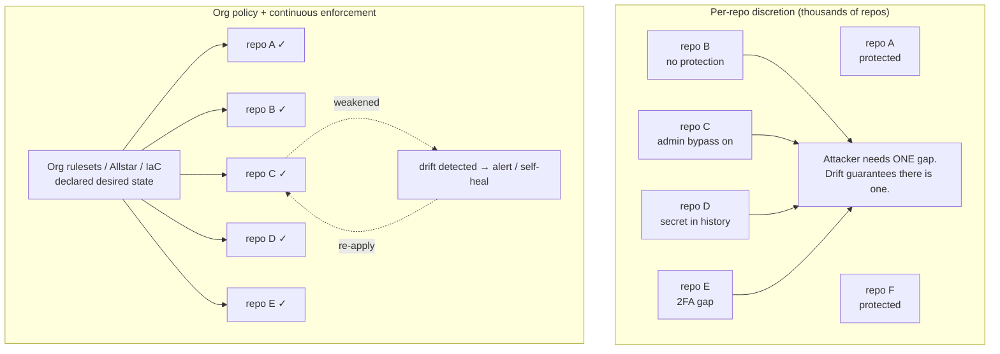
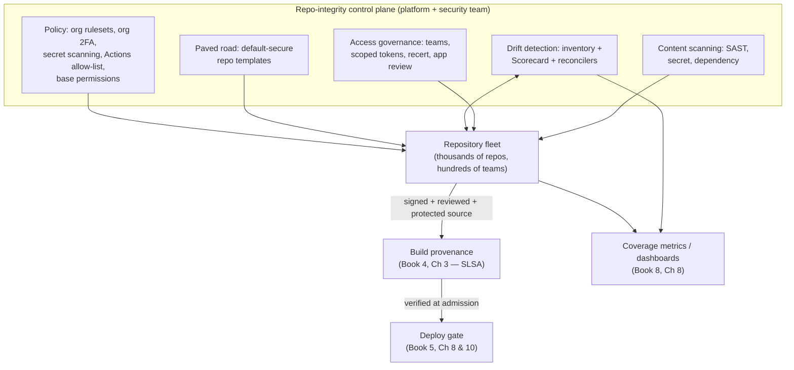
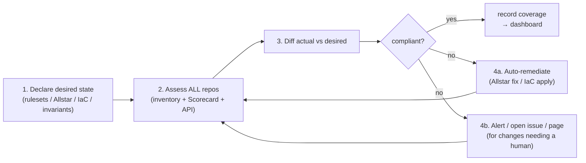
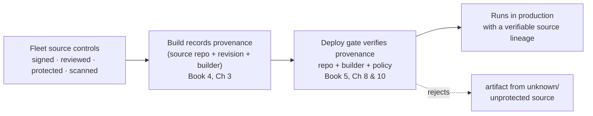
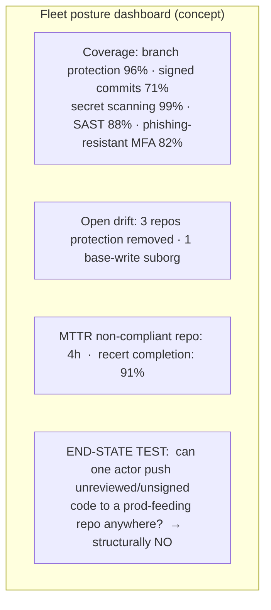
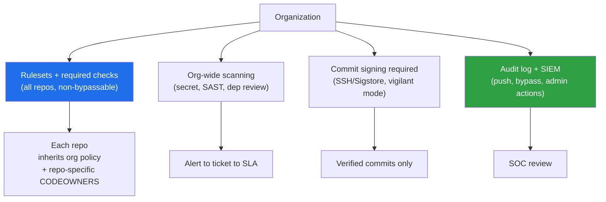
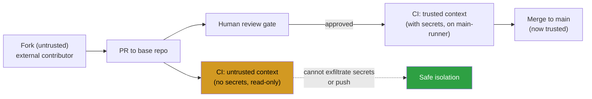

# Chapter 8 — Repository Integrity at Scale

*What this chapter covers.* Every previous chapter of this book handed you a control: commit
signing (Chapter 2), branch protection and required review (Chapter 3), secret scanning and push
protection (Chapter 4), backdoor-resistant review and detection (Chapter 5), phishing-resistant MFA
and account-takeover defense (Chapter 6), and the treatment of AI-generated code as untrusted input
(Chapter 7). Each was described as something you configure and enforce. This chapter confronts the
question those chapters deferred: **you do not have one repository. You have thousands.** You have
thousands of developers, hundreds of teams, dozens of bot identities, a rotating population of
outside collaborators, and a repository count that grows every week as people spin up services,
libraries, forks, and experiments. A control that is "configured correctly" on the repo you are
looking at is worthless if it is missing on the four hundred repos you are not looking at — and one
of those four hundred is the one an attacker will use.

The shift is from a *configuration* question to a *fleet-management* question. Not "is this repo
secure?" but "are **all** repos secure, how do I **know**, and how do I keep them that way as the
fleet churns?" That is not a security-tooling problem in the narrow sense; it is a distributed
configuration-management and governance problem, structurally identical to fleet compliance,
admission control, or desired-state reconciliation anywhere else in a large backend estate. This is
the capstone of Book 7: how to run source integrity as a **program** — a control plane over the
whole repository fleet — rather than a checklist you apply repo by repo and hope holds.
_All tool versions, spec references, and defaults verified as of early 2026._

Learning goals — after this chapter you should be able to:

- Explain why **per-repo, per-developer security decisions do not scale**, why configuration
  **drift is inevitable** across thousands of repos, and why the meaningful unit of assurance is
  fleet coverage, not the individual repository.
- Design **centralized policy and enforcement**: GitHub organization rulesets, org-wide 2FA,
  org-wide secret scanning and push protection, Actions allow-lists, base permissions, and the
  GitLab group-level equivalents — set once at the org, inherited by all.
- Apply the **declare-desired-state, reconcile-continuously** model to repository configuration
  with Allstar, safe-settings, the Terraform GitHub provider, and custom API automation — detecting
  *and* remediating non-compliant repos.
- Build **fleet visibility**: a live inventory of repos and their security posture, OpenSSF
  Scorecard across the org as a posture signal, and a **drift-detection loop** that alerts or
  self-heals.
- Manage **access at scale**: least privilege across thousands of repos, scoped short-lived tokens,
  access recertification, offboarding, machine-identity governance, and third-party OAuth/GitHub App
  governance.
- Chain source controls into **build provenance** (Book 4) and **deploy verification** (Book 5) so
  that "signed, reviewed, protected" becomes a *verifiable property of what runs*, and measure the
  whole program with coverage metrics tied to a single **end-state test**.

## The scale problem

Take a control you already understand — two-person review on the default branch (Chapter 3). On one
repository it is a checkbox and a CODEOWNERS file. The security of that repository is a decision a
human made once and can inspect at any time. Now project that decision across an organization with,
say, 3,000 repositories owned by 200 teams. The control is no longer a decision; it is a
*distribution* — some fraction of repositories have it, some do not, and the fraction changes daily
as repos are created, archived, forked, transferred in from an acquisition, or reconfigured by an
admin who needed to "just merge this one thing." The security-relevant quantity is not whether any
particular repo is protected. It is the **coverage**: what fraction of repositories that feed
production have the control, and — the part everyone forgets — whether that fraction is stable or
quietly eroding.

Drift is not a risk; it is the default. Left to per-repo discretion, a large fleet trends toward
gaps for reasons that have nothing to do with malice:

- **New repos start unprotected.** A repo created today has whatever defaults the platform ships,
  which historically means *no* branch protection, *no* required review, *no* signing requirement.
  Every new repo is a fresh hole until someone remembers to configure it.
- **Protections get weakened.** An admin disables "include administrators" to unblock a release at
  2 a.m., or drops the required-review count to one during an incident, and it never gets restored.
  Each such change is locally reasonable and globally corrosive.
- **People fall out of policy.** A developer joins from an acquisition without 2FA. A service
  account gets `admin` because that was the fastest way to make CI work. A departing contractor's
  access lingers because offboarding missed one org.
- **Secrets accumulate.** Chapter 4's point restated at scale: across thousands of repos and years
  of history, *some* repo has a live credential in it, and without org-wide scanning you will not
  know which.

A per-repo audit cannot keep up with a fleet that mutates continuously. By the time a human has
reviewed the last repo on the list, the first fifty have changed. This is exactly the problem that
made configuration management (Puppet, Chef, then desired-state reconcilers like Kubernetes
controllers and Terraform) displace hand-configured servers a decade earlier, for the same reason:
**at scale, the only configuration that holds is the one a machine continuously enforces.**



The left side is what any large organization gets by default. The right side is the subject of this
chapter. The difference is not better per-repo configuration; it is that configuration has been
lifted off the repository and onto a **control plane**.

## The repository-integrity control plane

Think of source integrity at fleet scale the way you think about any other control plane in a
distributed system: a central component that holds *declared desired state*, projects it onto a
large population of managed objects, observes their *actual state*, and reconciles the difference.
The managed objects are repositories. The declared state is "every production-feeding repo requires
two reviews, signed commits, secret scanning, and passing CI; no repo grants write access to more
than its team; no unreviewed OAuth app touches our code." The reconciliation is continuous.



Five capabilities make up the control plane, and the rest of this chapter is one section per
capability plus the downstream chain and the measurement that proves it works. The organizing
principle throughout: **secure is the default and the enforced state, not an opt-in a busy team must
remember.** Every control from Chapters 2–6 is re-expressed here as something the control plane
applies uniformly, so the per-repo controls hold everywhere without per-team effort — the "paved
road" of Book 1, Chapter 10 and Book 4, Chapter 10, applied to source integrity.

## Centralized policy: set once at the org, inherit everywhere

The first-class answer — and the one to reach for before any external tooling — is native
organization-level policy. Modern SCM platforms let you set a control *once* at the organization (or
GitLab group) and have it apply to every repository underneath, present and future, without
per-repo action. This is the difference between a policy that *is* the fleet's posture and a policy
that is a suggestion 3,000 repos may or may not have adopted.

### GitHub organization-level controls

- **Organization rulesets** (Chapter 3) are the centerpiece. One org ruleset targets branches by
  pattern (`~DEFAULT_BRANCH`, `refs/heads/release/*`) across a repository selection (`~ALL`, or by
  property/name pattern) and requires pull-request review, signed commits, status checks, and
  linear history — for every matching repo at once. Crucially, rulesets *aggregate*: a repo cannot
  weaken an org ruleset with a laxer local one; the most restrictive requirement wins, and bypass is
  a named, auditable list rather than a blanket admin escape hatch. This is the mechanism that makes
  Chapter 3's controls a fleet property instead of a per-repo hope.
- **Org-wide 2FA requirement** (Chapter 6). The organization setting "Require two-factor
  authentication for everyone" removes non-2FA accounts from the org and blocks non-2FA members from
  joining. Combined with SAML/SSO enforcement and, ideally, a policy toward phishing-resistant
  factors, this closes the account-takeover surface Chapter 6 dissected — at the org boundary, not
  repo by repo.
- **Org-wide secret scanning and push protection** (Chapter 4). Enable secret scanning and *push
  protection* for the whole org (free for public repositories; via GitHub's Advanced Security /
  Secret Protection product for private ones), with "enable for new repositories" so coverage does
  not decay as the fleet grows. Push protection stops a credential *before* it enters history
  fleet-wide — the highest-leverage placement of that control.
- **Actions permissions policy** (Book 4, Chapter 5). The org-level "allowed actions" setting
  restricts which third-party Actions any workflow may use — GitHub-authored only, verified
  creators, or an explicit allow-list — plus mandatory SHA-pinning expectations. This is an org
  control over the *build* surface that source feeds, and it belongs in the same policy layer.
- **Base permissions.** The org's default repository permission for members should be **`none`** or
  at most `read`. When base permission is `write`, every member can push to every repo by default —
  the single largest over-provisioning mistake at scale, and one that silently inflates the blast
  radius of every insider and every account takeover (Chapter 6). Access should be *granted*
  through teams, never inherited by default.

### GitLab group-level controls

GitLab expresses the same idea through the **group** hierarchy. Settings applied at a top-level
group cascade to subgroups and projects: group-level **push rules** (reject unsigned commits,
enforce committer-email domains, block secrets by regex, prevent force-push to protected branches),
**protected branches** and **approval rules** defined at the group, and — for enforcement that
projects cannot silently drop — **compliance frameworks** with associated **security policies**
(scan execution policies that force SAST/secret/dependency scanning to run, and merge-request
approval policies that require review and block on findings). A compliance framework applied to
projects makes the required pipeline and approval rules *non-removable by the project*, which is the
GitLab analogue of a non-bypassable org ruleset.

The common thread: **inheritance beats discretion.** A control defined at the org/group and
inherited downward has coverage by construction. A control left to per-repo configuration has
coverage equal to whatever fraction of teams got around to it — which is never 100%, and never
stable.

## Policy-as-code: declare desired repo state, reconcile continuously

Native org policy covers the settings the platform exposes at org scope, but not everything, and not
every platform offers a non-bypassable org control for every setting. The general answer — and the
one that turns "we set a policy" into "the policy is continuously true" — is to treat **repository
configuration itself as code** and run a reconciler against it, exactly as you would with Kubernetes
manifests or Terraform state. You declare the desired state once; a controller observes actual
state, detects drift, and either alerts or corrects it. Three tools implement this model for GitHub;
GitLab and Bitbucket have analogues, and a modest amount of custom API automation covers the rest.

### Allstar (OpenSSF) — continuous enforcement with self-healing

**Allstar** is a GitHub App from the OpenSSF that *continuously monitors* an org against a declared
policy and can **log**, **open an issue**, or **auto-fix** (`action: fix`) violations. Its policies
cover branch protection, outside collaborators, binary artifacts checked into source, dangerous
GitHub Actions patterns, and SHA-pinning. Configuration lives in a central org repo and applies with
an opt-out (or opt-in) strategy so coverage defaults to *all* repos:

```yaml
# .allstar/allstar.yaml — org-wide enablement, all repos unless they opt out
optConfig:
  optOutStrategy: true
  optOutRepos:
    - archived-legacy-thing
```

```yaml
# .allstar/branch_protection.yaml — the Chapter 3 controls, enforced fleet-wide
optConfig:
  optOutStrategy: true
action: fix                     # log | issue | fix  — 'fix' makes drift self-healing
requireApproval: true
approvalCount: 2
dismissStale: true
blockForce: true
enforceOnAdmins: true           # closes the include-admins gap on every repo
requireUpToDateBranch: true
requireStatusChecks:
  - context: ci/build
  - context: policy/slsa
```

The important property is `action: fix`. With it, when someone weakens protection on any repo,
Allstar *re-applies* the required configuration on its next reconcile pass — drift becomes a
transient, self-correcting condition rather than a standing hole. This is the reconcile loop from
control theory, applied to repo settings: the deviation between actual and desired is measured and
driven back to zero automatically, with no human in the path for the common case.

### safe-settings — repo configuration as a central manifest

**safe-settings** (a GitHub-maintained app) manages repository, branch, team, and label settings
from a single central config repo, reconciling each managed repo's actual settings to the declared
desired state. Where Allstar focuses on security policies with strong opinions, safe-settings is a
general settings reconciler: you describe the intended configuration for all repos (with per-repo
and per-suborg overrides) in one place, and it converges the fleet to it. The mental model is
identical to a Kubernetes controller watching a resource and issuing updates until observed matches
declared.

### Terraform GitHub provider — repos and settings as reviewed IaC

The **Terraform GitHub provider** (`github_repository`, `github_branch_protection`,
`github_repository_ruleset`, `github_team`, `github_actions_organization_permissions`, …) makes the
entire org configuration **infrastructure-as-code** (Book 6, Chapter 8): version-controlled,
plan-reviewed, and auditable like any other infrastructure. A trimmed module that stamps a
default-secure repo:

```hcl
resource "github_repository" "svc" {
  name                   = var.name
  visibility             = "internal"
  vulnerability_alerts   = true
  delete_branch_on_merge = true
}

resource "github_branch_protection" "main" {
  repository_id  = github_repository.svc.node_id
  pattern        = "main"
  enforce_admins = true
  required_signatures = true

  required_pull_request_reviews {
    required_approving_review_count = 2
    require_code_owner_reviews      = true
    dismiss_stale_reviews           = true
    require_last_push_approval      = true
  }
  required_status_checks {
    strict   = true
    contexts = ["ci/build", "policy/slsa"]
  }
}
```

IaC has a pleasing recursion: changes to the protection-as-code *themselves* flow through a
protected, reviewed pull request, so the two-person rule guards the very definition of the two-person
rule. Its trade-off relative to Allstar is that Terraform reconciles when you run `apply` (typically
on a schedule or on merge), so between applies a determined admin can still drift a setting — which
is precisely why the strongest programs run **both**: IaC as the source of truth for *what the
config is*, and a continuous enforcer (Allstar, or an org ruleset that simply cannot be locally
overridden) for *keeping it that way between applies*.

### Custom API automation

Whatever the tools do not cover, the platform API does. A scheduled job walking the org's repos via
the REST/GraphQL API can assert any invariant you can express — "no repo has base `write`", "every
repo in the `prod` topic has secret scanning on", "no OAuth app has `write:org`" — and open issues,
page, or remediate. This is the escape hatch that keeps the model complete: **anything you can
observe through the API, you can make a continuously-enforced policy.**

### The paved road: default-secure templates

The cheapest control is the one nobody has to apply, because the insecure configuration was never
reachable. A **golden repository template** — branch protection/rulesets, CODEOWNERS, required
checks, signed-commit enforcement, secret scanning, a starter CI workflow with SHA-pinned actions,
and a `SECURITY.md` — means every new repo starts protected. Wire repo *creation* through a
self-service portal or a Terraform module (Book 4, Chapter 10) so that the only way to get a repo is
to get a protected one, and org rulesets cover any blind spot the template misses. On the paved
road, "secure" is the path of least resistance and "insecure" requires deliberately leaving the
road — the inverse of the default-open posture that produces drift.

## Visibility and drift detection: you cannot secure what you cannot see

Enforcement presumes you know actual state. Before (and alongside) any reconciler, you need a **live
inventory** of the fleet and its security posture: for every repository, whether it has branch
protection, required review, signed-commit enforcement, secret scanning, code scanning, and Actions
pinning; whether admin bypass is on; who has write access; which apps are installed. This inventory
is the observed-state half of the control loop, and it is valuable on its own — it is how you answer
"are all repos secure, and how do we know?" with a number instead of a shrug.

### OpenSSF Scorecard across the org

**OpenSSF Scorecard** (Book 2, Chapter 10) runs a battery of checks against a repository and emits a
0–10 score plus per-check results. Several checks are exactly the source-integrity signals this book
cares about: `Branch-Protection`, `Code-Review`, `Token-Permissions` (are workflow `GITHUB_TOKEN`
permissions minimized), `Dangerous-Workflow`, `Pinned-Dependencies` (are actions SHA-pinned),
`Signed-Releases`, and `Security-Policy`. Run Scorecard across the *whole org* on a schedule and you
have a repeatable, programmatic posture signal for every repo — not a one-time audit but a recurring
measurement you can trend, alert on, and diff.

```bash
# Score every repo in an org; collect JSON for a posture dashboard
for repo in $(gh repo list my-org --limit 5000 --json name -q '.[].name'); do
  scorecard --repo="github.com/my-org/${repo}" --format=json \
    --checks=Branch-Protection,Code-Review,Token-Permissions,Dangerous-Workflow,Pinned-Dependencies \
    > "posture/${repo}.json"
done
```

Scorecard is a *signal*, not a gate — a low score flags a repo for attention, and specific check
failures (e.g., `Branch-Protection` regressed on a production repo) drive the drift loop below. Do
not turn a composite 0–10 number into a hard pass/fail; treat the individual checks that map to your
policy as the actionable events.

### The drift-detection loop

Inventory plus policy plus a reconciler is a closed control loop. Stated generically:



The loop runs continuously, and its output is two things: a stream of drift events (protection
removed, a new unprotected repo appeared, secret scanning got disabled, an over-permissioned grant
was created) and a rolling **coverage number** that becomes the top-line metric of the program. Some
drift is safe to auto-remediate (re-applying branch protection); some should alert a human first
(revoking access, which might be legitimate). The design choice per control is: *can the reconciler
safely correct this without judgment, or does correcting it risk breaking legitimate work?* Branch
protection: correct it. Access grants and app installs: alert and let a human decide. Both are drift;
they differ only in remediation policy.

## Access management at scale

Over the fleet, the dominant risk is not exotic — it is **over-provisioned access**. Everyone tends
to accumulate more repository access than they need, service accounts get broad grants because that
was the fastest path to a green build, and old grants never get removed. The aggregate effect is a
fleet where the *blast radius* of any single compromised human or bot identity (Chapter 6) is far
larger than it should be. Least privilege at scale is not a per-grant virtue; it is a structural
property you must engineer and continuously reassert.

- **Team-based access, minimal base permissions.** Grant repo access through teams that map to
  ownership, never via individual collaborator grants scattered across repos (which are impossible
  to audit) and never via a permissive org base permission. Base `none`/`read`, access through
  teams, is the shape that keeps grants legible.
- **Scoped, short-lived tokens.** Personal access tokens and machine credentials are standing keys;
  at scale they are the credential most likely to leak (Chapter 4) or linger. Prefer **fine-grained
  PATs** scoped to specific repos and permissions with mandatory **expiry**, and for automation
  prefer **short-lived, workload-identity-based** credentials (GitHub App installation tokens, OIDC
  to cloud — Book 5, Chapter 4) over long-lived secrets entirely. A token that expires in an hour is
  not a token an attacker can hoard.
- **Access recertification.** Periodic reviews where team owners re-attest that each member and each
  bot still needs its access, with automatic revocation of grants nobody re-attests. This is the only
  mechanism that counters the ratchet of accumulating access, and completion rate is itself a metric.
- **Prompt offboarding.** The departing-employee/contractor flow from Chapter 6, done fleet-wide:
  SSO deprovisioning that revokes org membership and, transitively, all team-derived access in one
  action — plus token and SSH-key revocation. The failure mode at scale is access that survives
  departure in some org or some direct grant the offboarding script missed; SSO-anchored membership
  is what makes revocation total.
- **Machine and bot identity governance.** Bots are identities too, and often the most
  over-privileged (a CI account with org-wide `admin` is a catastrophe waiting for an ATO). Inventory
  every non-human identity, scope it to exactly the repos it touches, prefer app-based short-lived
  tokens, and put bots through the same recertification as humans.
- **SSO enforcement.** All access mediated by the identity provider, so that authentication policy
  (phishing-resistant MFA, conditional access, session controls — Chapter 6) applies uniformly and
  deprovisioning is a single control point.

### Third-party OAuth app and GitHub App governance

An organization's installed **OAuth apps** and **GitHub Apps** hold access to its repositories, and
a compromised app is access to everything it was granted — this is not hypothetical. Book 1, Chapter
5's Codecov incident and GitHub's April 2022 disclosure of stolen OAuth tokens (used to clone
private repositories via Heroku and Travis integrations) are both *app-access* compromises: the
attacker never needed a developer's password because the app already had the repos. At fleet scale,
installed apps are a first-class supply-chain surface that must be governed like any other access:

- **Inventory** every installed OAuth app and GitHub App and the permissions/repos each holds.
- **Restrict installation** to org-approved apps (GitHub's OAuth App access restrictions and
  approval flow), so a single developer cannot grant a random third party access to org repos.
- **Least privilege per app** — an app that needs read access to one repo should not hold write to
  all of them — and periodic review of app grants exactly as you recertify human access.

Treat an installed app's permission set the way you treat a service account's: as standing access
whose blast radius on compromise equals its scope, therefore to be minimized and monitored.

## Code and content scanning across the fleet

The content controls of Chapters 4, 5, and 7 — and dependency scanning from Book 2 — are only fleet
controls if they are **on by default across all repos via policy**, not a per-repo opt-in that half
the fleet forgot. The pattern is uniform: enable at the org, require via compliance policy, and
consume results centrally.

- **SAST / code scanning at scale.** CodeQL (via GitHub code scanning) or Semgrep, enabled
  org-wide — GitHub's **default setup** can turn CodeQL on across an org including new repos, and
  Semgrep runs as a required CI check or via GitLab scan-execution policy. The goal is that *no*
  production-feeding repo lacks static analysis, and that findings flow to a central place rather
  than dying in per-repo tabs nobody watches.
- **Secret scanning + push protection** (Chapter 4), org-wide with enable-for-new-repos, as above.
- **Dependency scanning** (Book 2) — Dependabot/`osv-scanner`/GitLab dependency scanning — enabled
  by policy so vulnerable and malicious dependencies are caught fleet-wide.
- **Central consumption.** Findings from all of the above aggregate into a central view (Book 8,
  Chapter 8 — Metrics, Audits, and Executive Reporting), so the security team sees fleet posture and
  mean-time-to-remediate rather than 3,000 disconnected repo dashboards. Coverage of *scanning
  itself* — what fraction of repos have each scanner enabled — is a first-order metric, because a
  scanner that is off on the repo that matters found nothing precisely where it mattered.

## Tying source integrity to the downstream chain

Fleet source controls are not the end of the story; they are the *first attested link* in a chain
that ends at deployment. This is what makes the investment pay off beyond "our repos are configured
well": source integrity, enforced uniformly, becomes a **verifiable property of what runs in
production.**

The chain works like this. A build records **provenance** (Book 4, Chapter 3 — SLSA build track): an
attestation naming the source repository and the exact revision (commit) that was built, produced by
a trusted builder. That provenance is **verified at admission/deploy** (Book 5, Chapter 8 —
Provenance Verification in Practice; Chapter 10 — Attestation-Based Deployment Gates): the deploy
gate refuses artifacts whose provenance does not point at an approved repo and an expected builder.
Because the source that provenance points to was produced under fleet-wide source controls — signed
commits (Chapter 2), required two-person review (Chapter 3), protected branches — the deploy gate is
transitively asserting *those* properties too. "This artifact came from `github.com/my-org/payments`
at commit `abc123`, on the protected `main` branch, which by org ruleset required two reviews and
signed commits" is a statement the deploy gate can rest on **only because** the source controls hold
uniformly across the fleet.



The emerging piece that closes this loop explicitly is the **SLSA source track**. SLSA's build track
(v1.0) attests how an artifact was *built*; the **source track** is a parallel, still-**developing**
effort (draft as of this writing — Chapter 1) to attest properties of the *source revision itself*:
that it was produced through a reviewed, controlled process on a protected branch, with change
history retained and identities authenticated. When mature, the source track is precisely the
fleet-scale source-integrity *attestation* — a machine-verifiable claim that the source met the
controls this book describes, consumable by the same downstream gates that already verify build
provenance. Describe it to stakeholders as developing, not shipped, but architect toward it: the
whole point of enforcing source controls uniformly is to be able to *attest* that uniformity and
verify it downstream, and the source track is the standard shape that attestation is converging on.

## Metrics and governance

A program you cannot measure is a program you cannot defend to leadership or trust yourself. The
control plane's output is coverage, and coverage is the language of source integrity at scale (Book
8, Chapter 8). Track **leading** indicators (posture that predicts safety) and **lagging** ones
(what actually happened):

| Metric | Type | What it tells you |
|---|---|---|
| % repos with branch protection / required review on default+release branches | Leading | Core Chapter 3 coverage; the headline number |
| % repos requiring signed commits | Leading | Chapter 2 coverage |
| % repos with secret scanning + push protection enabled | Leading | Chapter 4 coverage; falling → history exposure risk |
| % repos with code scanning (SAST) enabled | Leading | Static-analysis coverage across the fleet |
| % developers on phishing-resistant MFA (not just any 2FA) | Leading | Chapter 6 — ATO exposure |
| % repos created from the paved-road template | Leading | How much of the fleet is secure-by-default |
| Base permission = none/read at org level | Leading | Over-provisioning at the root |
| Drift incidents / week (protection removed, unprotected repo created) | Lagging | Is the fleet eroding or holding? |
| Mean-time-to-remediate a non-compliant repo | Lagging | How fast the loop closes |
| Access-review / recertification completion rate | Lagging | Is least-privilege being reasserted? |
| Installed apps reviewed / over-scoped apps remediated | Lagging | Third-party access hygiene |



The single most useful thing a source-integrity program can answer is a **binary end-state test**,
and every metric above exists to support it:

> **Can a single actor push unreviewed, unsigned code to any production-feeding repository anywhere
> in the organization?**

If the honest answer is anything other than a structural *no*, you have a gap — and the metrics tell
you *where*. A structural "no" means there is no repo in the fleet, no matter who created it or when,
where a lone identity (compromised or malicious) can land code into the production path without a
second reviewer and a verifiable signature. That is the property fleet enforcement exists to
guarantee, and it is the property the whole of Book 7 has been building toward.

### Governance: ownership, exceptions, guardrails not gates

- **Ownership.** The **platform/security team owns the control plane** — the org policy, the
  reconcilers, the templates, the scanning, the dashboards. Individual **teams own their repos
  within those guardrails.** This division is what makes the program scale: teams do not each
  reinvent source security (and get it wrong 200 different ways); they inherit it and work inside it.
- **Exceptions with expiry.** Some repo genuinely needs a laxer rule (a mirror, a throwaway, an
  emergency). Grant exceptions explicitly, scoped, **time-boxed with automatic expiry**, and logged —
  never a permanent silent bypass. An exception that does not expire is drift with paperwork.
- **Guardrails, not gates, where possible.** The strongest programs make the secure path the *easy*
  path (paved road, self-healing reconcilers, defaults) rather than a wall of manual approvals that
  teams route around — because a control people bypass "to move fast" is a control attackers use too.
  Reserve hard gates for the highest-leverage change classes (release branches, CI config, IaC,
  dependencies); make everything else secure-by-default and low-friction. The aim is not maximum
  friction; it is that the *change classes capable of compromising the supply chain* cannot be made
  by a single actor, while routine work stays fast.

## The capstone: Book 7 as one program

This chapter has been re-expressing every control in the book as something the control plane applies
uniformly. Stated as a single table — each per-repo control from Chapters 2–6, how it becomes a
*fleet* control, and the tooling that enforces it:

| Control (chapter) | Per-repo form | How enforced at fleet scale | Tooling |
|---|---|---|---|
| Signed commits (Ch 2) | Repo requires signed commits | Org ruleset `required_signatures`; verified in provenance downstream | Org rulesets; Allstar; IaC |
| Branch protection + 2-person review (Ch 3) | Protected branch, CODEOWNERS | Org ruleset across `~ALL`; self-healed on drift | Org rulesets; Allstar `fix`; safe-settings; Terraform |
| Secret scanning + push protection (Ch 4) | Enable on repo | Org-wide enablement, enable-for-new-repos | GitHub org security settings; GitLab push rules/policies |
| Backdoor-resistant review + detection (Ch 5) | CODEOWNERS, careful review | Required review by policy; SAST + Scorecard fleet-wide | Rulesets; CodeQL/Semgrep; Scorecard |
| Phishing-resistant MFA / ATO defense (Ch 6) | Developer enables MFA | Org-wide 2FA requirement + SSO + FIDO policy | Org 2FA setting; IdP/SSO |
| Least privilege / access (Ch 6) | Grant minimal repo access | Base perms none/read; teams; scoped tokens; recert | Teams; fine-grained PATs; access reviews; SSO deprovisioning |
| AI-generated code as untrusted input (Ch 7) | Review + scan AI code | Same required review + SAST/SCA + secret scanning by policy | Same fleet scanning + review controls |
| Third-party app access (Ch 1, Ch 6) | Vet an installed app | Inventory + install restrictions + least privilege + review | OAuth app policies; app inventory automation |

The integrated program is the union of all of this, applied uniformly and measured: **default-secure
repos (paved road) + org-enforced policy (rulesets / group compliance) + continuous drift detection
and remediation (Allstar / IaC / Scorecard) + least-privilege access (teams, scoped tokens, recert,
app governance) + phishing-resistant MFA + signed commits + required two-person review + secret
scanning and push protection + fleet-wide code scanning — all chained into build provenance and
verified at deploy, all trended as coverage.** No repository is an unguarded island, because no
repository's security depends on its own team remembering to configure it. Security is inherited from
the control plane, enforced continuously, and provable at the deploy gate.

## Distributed-systems lens

Source integrity at fleet scale is a distributed **configuration-management and governance** problem,
and every instinct you have from running large backend systems transfers directly.

The platform/security team runs a **control plane** — org policy, reconcilers, templates, scanning,
dashboards — over a large, mutable **data plane** of thousands of repositories. The control plane
holds declared desired state; it observes actual state through an inventory and Scorecard; it drives
the difference to zero through rulesets that cannot be locally overridden and reconcilers that
self-heal drift. This is the *identical shape* to a Kubernetes controller reconciling pods to a
desired spec, to Terraform converging infrastructure to declared state, to admission control
enforcing policy on every workload. The per-repo controls of Chapters 2–6 are the *desired spec*; the
control plane is what makes that spec hold across the whole population without per-team effort — the
paved road, where secure is inherited rather than achieved.

The SCM organization is **tier-0** (Book 1, Chapter 9). Its *policy state* is not one input among
many; it **is** the fleet's source-integrity posture. If the org's rulesets, 2FA requirement,
scanning, and access policy are correct, the fleet is secure; if they drift, the fleet drifts with
them. That concentration is why the control plane itself must be held to the highest standard —
its configuration in reviewed IaC, its admins on phishing-resistant MFA, its changes two-person
reviewed — because compromising the control plane compromises every repo at once.

Fleet source controls **chain downstream**. Because they hold uniformly, the source repo and
revision that build provenance records (Book 4) carry known properties — reviewed, signed,
protected — that the deploy gate verifies (Book 5). Source integrity becomes an *end-to-end
verifiable* property of what runs, not a local claim about one repo, and the developing SLSA source
track is the standard attestation shape that makes that claim machine-checkable. And it is all
**measured** as coverage (Book 8, Chapter 8), because at fleet scale the meaningful assurance is not
"this repo is secure" but "we can prove *all* production-feeding repos are, and know within hours
when one drifts."

This is the source-side statement of the entire suite's thesis, which every book has approached from
its own edge: **enforce uniformly through a platform, verify downstream, and measure coverage.**
Dependencies, builds, signing, cloud-native, and now source all reduce to the same discipline. A
control that is not enforced fleet-wide is a control an attacker finds the gap in; a property that is
not verified downstream is a property you are trusting rather than checking; and a program that is
not measured is a program you cannot know is working. Repository integrity at scale is that
discipline applied to the place all of it begins — the source.

### Org-scale repo integrity stack



### Fork and PR isolation model



## Key takeaways

- **Coverage, not configuration, is the unit of assurance.** At thousands of repos the question is
  never "is this repo secure?" but "are all production-feeding repos secure, how do we know, and how
  do we keep them so as the fleet churns?" Drift toward gaps is the default; only continuous
  enforcement holds.
- **Lift configuration onto a control plane.** Set controls once at the org/group (rulesets, org 2FA,
  org-wide secret scanning and push protection, Actions allow-list, base permissions) so every repo
  inherits them. Inheritance beats per-repo discretion, which never reaches full coverage and never
  stays stable.
- **Declare desired repo state and reconcile continuously.** Allstar (with `action: fix`),
  safe-settings, the Terraform GitHub provider, and custom API automation turn repo configuration
  into desired-state that a controller drives back to compliance — drift becomes self-healing, not a
  standing hole. The strongest programs run IaC as source of truth *and* a continuous enforcer.
- **Make secure the default: pave the road.** Golden repo templates and gated repo creation mean new
  repos start protected and "insecure" requires deliberately leaving the road.
- **You cannot secure what you cannot see.** Maintain a live inventory of fleet posture and run
  OpenSSF Scorecard across the org as a recurring signal; the drift-detection loop (declare → assess
  all repos → diff → remediate/alert) is the closed control loop that keeps the fleet in policy.
- **Least privilege is a structural property, not a per-grant virtue.** Base `none`/`read`,
  team-based access, scoped short-lived tokens with expiry, recertification, SSO-anchored
  offboarding, machine-identity governance, and installed-app (OAuth/GitHub App) inventory and
  least privilege — because over-provisioned access is the dominant blast-radius multiplier at scale.
- **Chain source into build provenance and deploy verification.** Uniform source controls make
  "signed, reviewed, protected" a *verifiable* property of what runs; the developing SLSA source
  track is the emerging attestation for it.
- **Measure it, and hold to one end-state test.** Track coverage of each control plus drift and
  MTTR, and demand a structural *no* to: can a single actor push unreviewed, unsigned code to any
  production-feeding repo anywhere? Own the control plane centrally; let teams own repos within
  guardrails; time-box every exception. No repo is an unguarded island.

## Further reading

- **GitHub — Organization rulesets and repository rulesets.** The org-level enforcement mechanism for
  branch protection, required signatures, and status checks across many repos.
  https://docs.github.com/en/organizations/managing-organization-settings/managing-rulesets-for-repositories-in-your-organization
- **GitHub — Requiring two-factor authentication in your organization**, and enterprise policies for
  2FA and SSO. https://docs.github.com/en/organizations/keeping-your-organization-secure/managing-two-factor-authentication-for-your-organization/requiring-two-factor-authentication-in-your-organization
- **GitHub — Secret scanning and push protection at the organization level.**
  https://docs.github.com/en/code-security/secret-scanning/enabling-secret-scanning-features/enabling-secret-scanning-for-your-repository
  and push-protection documentation.
- **Allstar (OpenSSF)** — continuous security policy enforcement for GitHub organizations, including
  the Branch Protection policy and `action: fix` auto-remediation.
  https://github.com/ossf/allstar
- **safe-settings (GitHub)** — repository configuration as code, reconciled from a central config
  repo. https://github.com/github/safe-settings
- **Terraform GitHub provider** — `github_repository`, `github_branch_protection`,
  `github_repository_ruleset`, `github_team`, org Actions permissions.
  https://registry.terraform.io/providers/integrations/github/latest/docs
- **OpenSSF Scorecard** — automated checks (`Branch-Protection`, `Code-Review`, `Token-Permissions`,
  `Dangerous-Workflow`, `Pinned-Dependencies`, …) runnable across an org.
  https://github.com/ossf/scorecard
- **GitLab — Compliance frameworks, security policies, and push rules** at the group level.
  https://docs.gitlab.com/ee/user/group/compliance_frameworks/ and
  https://docs.gitlab.com/ee/user/application_security/policies/
- **SLSA source track** — the developing source-integrity attestation track (draft), parallel to the
  build track of SLSA v1.0. https://slsa.dev/spec/v1.0/ (see the source-track working material — source track draft at https://slsa.dev/spec/draft/source-requirements).
- **CodeQL default setup for organizations** and **Semgrep** for org-wide static analysis.
  https://docs.github.com/en/code-security/code-scanning and https://semgrep.dev/docs/
- **GitHub — Restricting and reviewing OAuth apps and GitHub Apps** installed on an organization; and
  GitHub's April 15, 2022 disclosure of stolen OAuth tokens used to clone private repos.
  https://github.blog/2022-04-15-security-alert-stolen-oauth-user-tokens/
- **Book cross-references:** Book 7, Chapters 2–7 (the controls synthesized here); **Book 1, Chapter
  9** — Supply Chain Security in Distributed Backend Systems (tier-0); **Book 1, Chapter 10** and
  **Book 4, Chapter 10** — the paved road / building a program and a secure build platform; **Book 4,
  Chapter 3** — SLSA Build Levels and Provenance; **Book 4, Chapter 5** — Hardening GitHub Actions
  (allowed-actions policy); **Book 5, Chapters 8 & 10** — Provenance Verification and
  Attestation-Based Deployment Gates; **Book 6, Chapter 8** — Infrastructure as Code; **Book 2,
  Chapter 10** — Evaluating Dependencies (Scorecard); **Book 8, Chapter 8** — Metrics, Audits, and
  Executive Reporting.
