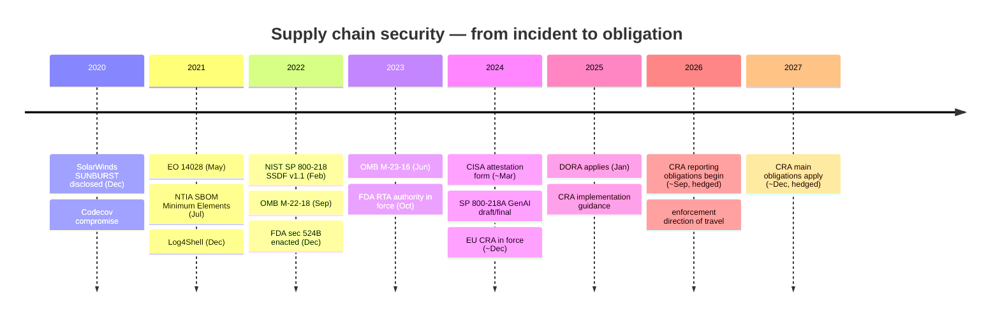
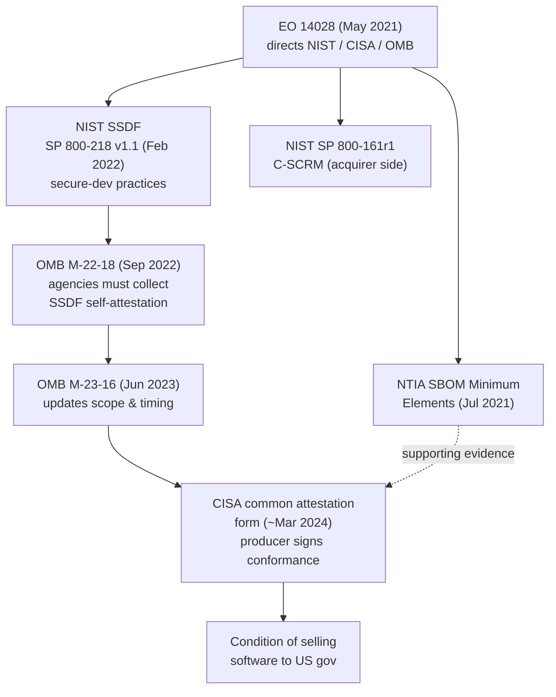
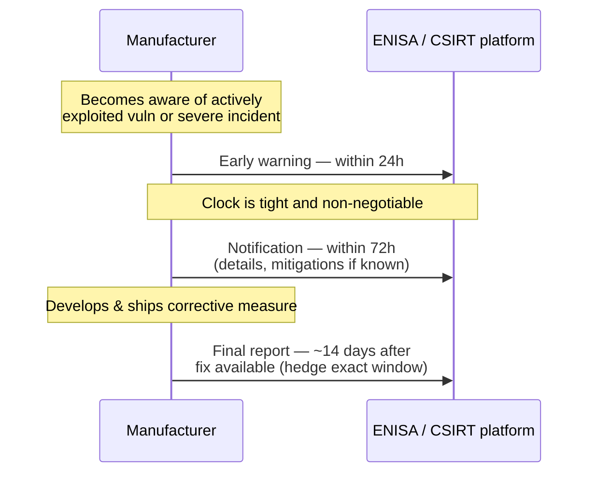
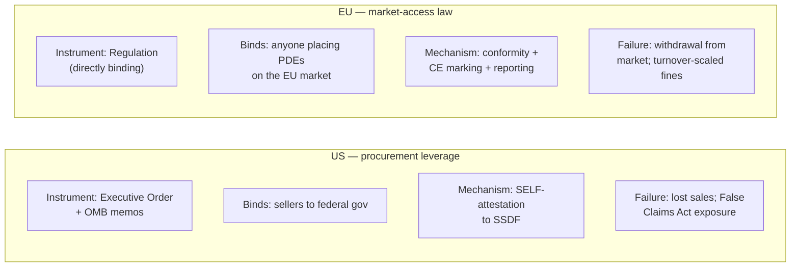
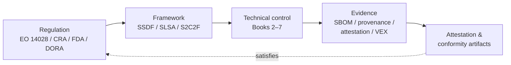
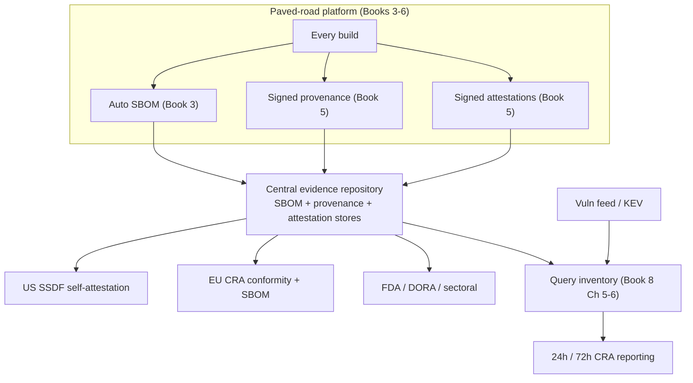
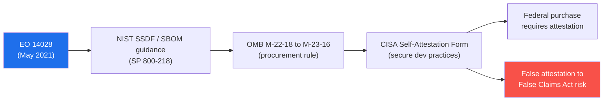
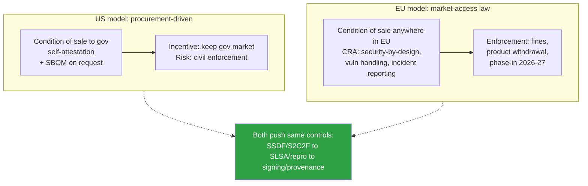

# Chapter 1 — The Regulatory Landscape: EO 14028, NIST SSDF, EU CRA

*What this chapter covers.* For most of the history of software, how you built your code was
your own business. A buyer might ask about your security posture in a procurement
questionnaire; a regulator in a handful of sectors might impose process requirements. But the
default was that build integrity, dependency hygiene, and provenance were engineering choices,
not legal obligations. That default is gone. In the space of roughly five years — bracketed by
the SolarWinds disclosure at the end of 2020 and the phase-in of the EU Cyber Resilience Act
across 2026–2027 — supply chain security crossed the line from best practice to *condition of
sale*. In the United States, you cannot sell software to the federal government without
attesting that you follow specific secure-development practices. In the European Union, you
will soon be unable to place a "product with digital elements" on the market at all unless it
meets security-by-design, vulnerability-handling, and incident-reporting requirements backed by
fines. This chapter is the comprehensive, accurate map of that regulatory terrain: what each
regime actually says, whom it binds, on what timeline, and — the part that matters to you as an
engineer — how each abstract legal obligation lands as a concrete technical requirement that
the work in Books 2 through 7 already produces.

The earlier books touched this. Book 1, Chapter 7 introduced the SSDF as one of three
frameworks; Book 3, Chapter 1 sketched the regulatory drivers behind SBOMs. This chapter is the
authoritative treatment. Accuracy here is not optional garnish — dates, scope, and thresholds
have real consequences, and much of this landscape is still moving. Where something is settled,
this chapter says so. Where it is evolving (and much of it is, as of early 2026), the chapter
hedges deliberately and tells you *what kind* of uncertainty you are dealing with.

Learning goals — after this chapter you should be able to:

- Explain **why** government regulation entered supply chain security when it did, and what
  "prove your software is built securely" means as a market condition rather than a virtue.
- Trace the **US thread**: EO 14028 → NIST SSDF and SBOM guidance → OMB M-22-18 / M-23-16 →
  the CISA attestation form, and describe the **self-attestation mechanism** precisely.
- Describe the **EU Cyber Resilience Act** accurately — its scope ("products with digital
  elements"), its core obligations, its **incident-reporting timeline**, its open-source
  steward provisions, and its phase-in — and contrast the EU's market-access-law model with the
  US's procurement-driven self-attestation model.
- Place the **sector-specific regimes** (FDA, PCI DSS, DORA, NERC CIP, UNECE R155) on the map
  without over-claiming, and name the **standards** (SSDF, SLSA, S2C2F, ISO 27001/27036) that
  the regulations lean on.
- Perform the **mapping** every compliance program depends on: regulation → framework →
  technical control → evidence, and explain why, done right, compliance is a *byproduct* of the
  technical work rather than a separate workstream.
- Reason about compliance **at fleet scale**: why an org selling a portfolio of products needs
  fleet-wide SBOMs, provenance, and vulnerability response, and why the paved-road platforms of
  Books 3–6 are what make that tractable.

## Why regulation entered supply chain security

Regulation is a lagging indicator. It arrives after a market failure large enough that the
people harmed have the political weight to demand it. Supply chain security got its regulation
the same way industrial safety, food safety, and financial disclosure got theirs: a
catastrophe made the externality undeniable.

The catastrophe was SolarWinds. Book 1, Chapter 3 dissects the mechanism in detail; the summary
that matters for this chapter is that in 2020 a nation-state actor compromised the *build
system* of SolarWinds' Orion product and inserted the SUNBURST backdoor into legitimately
signed, legitimately distributed updates. The compromise was public by mid-December 2020.
Roughly 18,000 organizations received the trojanized update, and a smaller set — including
multiple US federal agencies — were actively exploited. The defining feature was that every
downstream victim did everything "right" by the standards of the day: they applied a signed
update from a trusted vendor through a trusted channel. The trust was real. The vendor's build
system was not trustworthy. That is the whole thesis of supply chain security compressed into
one incident, and it is why SolarWinds, not any of the equally instructive attacks around it,
is the one that moved governments.

It did not arrive alone. The 2020–2021 window stacked incidents that each hit a different link
in the chain: the Codecov Bash Uploader compromise (early 2021) exfiltrated secrets from CI
environments; the Kaseya VSA ransomware (July 2021) rode a trusted management tool into
downstream networks; and Log4Shell (CVE-2021-44228, December 2021) demonstrated that a single
transitive dependency could put a critical vulnerability into a large fraction of all deployed
Java software simultaneously. Book 1, Chapters 3–5 treat these. Collectively they made two
arguments that a procurement officer or a legislator could understand without a security
background: first, that the software supply chain is a *systemic* risk — one compromised
supplier fans out to thousands of victims — and second, that buyers had no way to *see* into
the supply chains they depended on. There was no bill of materials, no build provenance, no
attestation. You bought software the way you might buy a sealed can with no ingredients label.

The government's response was to change what it means to sell software to it, and — in the EU's
case — what it means to sell software at all. The shift is worth stating precisely because
everything downstream follows from it: **the burden of proof moved onto the producer.** It is
no longer enough to *be* secure, or even to be breached-and-recovered gracefully. You must now
be able to *demonstrate*, in a form a non-expert third party can check, that your software was
built under specific practices — and increasingly, to carry ongoing obligations (vulnerability
handling, reporting, updates) for its lifetime. "Prove your software is built securely" is
becoming a precondition of market access. The rest of this chapter is about who is demanding
that proof, in what form, and by when.

## The US thread: Executive Order 14028 and its progeny

### EO 14028 as the root

On 12 May 2021, roughly five months after SolarWinds became public, the White House issued
**Executive Order 14028, "Improving the Nation's Cybersecurity."** An executive order is not a
statute — it directs the executive branch, not private parties directly — and this is the key
to understanding how the entire US regime works. EO 14028 could not simply *command* software
vendors to be secure. What it could do, and did, was direct federal agencies to change what
they *buy* and how. Because the US federal government is one of the largest software purchasers
on earth, changing its procurement rules exerts enormous gravitational pull on the whole
market. This is regulation by purchasing power, and it explains why the US model is built on
*attestation to the government* rather than *law binding everyone*.

Section 4 of the order — "Enhancing Software Supply Chain Security" — is the part that concerns
us. It instructed the National Institute of Standards and Technology (NIST), the Cybersecurity
and Infrastructure Security Agency (CISA), and the Office of Management and Budget (OMB) to
develop, on aggressive deadlines, the machinery of a new procurement regime. The order did not
itself specify the controls; it commissioned them. Three lines of output flowed from that
commission, and the rest of the US thread is those three lines maturing:

1. **Secure development practices** — which NIST delivered as the SSDF (below).
2. **Software Bills of Materials** — for which NTIA published the *Minimum Elements* in July
   2021 (Book 3, Chapter 1 treats this in depth).
3. **Attestation** — a mechanism by which producers would formally assert conformance, which
   OMB and CISA operationalized in 2022–2024.

### NIST's guidance under the order

NIST produced two documents that carry most of the technical weight. The first is the one you
will hear named constantly in compliance conversations: the **Secure Software Development
Framework (SSDF), NIST Special Publication 800-218**, whose current version, **v1.1**, was
published in **February 2022**. The SSDF is the catalog of secure-development *practices* that
the federal attestation regime references. Book 1, Chapter 7 introduced it as one of three
frameworks; the next major section of this chapter deepens it in its compliance role.

The second is **NIST SP 800-161**, *Cybersecurity Supply Chain Risk Management (C-SCRM)
Practices for Systems and Organizations* (Revision 1, May 2022). Where the SSDF is about how an
organization builds its *own* software securely, 800-161 is about how an organization manages
the risk of the software and hardware it *acquires* — supplier assessment, tiering, contractual
flow-down, and monitoring across the enterprise. The two compose: 800-218 is producer-facing,
800-161 is acquirer-facing, and a large organization is simultaneously both. In practice, most
engineers encounter the SSDF directly (because their build practices are what gets attested to)
and 800-161 indirectly (because their vendor-risk program, the subject of Book 8, Chapter 3, is
shaped by it).

### The OMB memoranda: turning guidance into a procurement rule

Guidance from NIST is just guidance until someone with authority over the purse makes it
binding. That someone is OMB, and the instrument is a *memorandum* to federal agencies. Two
matter.

**OMB M-22-18** ("Enhancing the Security of the Software Supply Chain through Secure Software
Development Practices"), issued **14 September 2022**, is the pivot. It required federal
agencies to obtain, from the producers of the software they use, a **self-attestation** that
the software was developed in conformance with the SSDF. The word *self* is load-bearing and is
the defining characteristic of the US model as it stands in early 2026: the producer attests to
its own conformance. There is, at this stage, no mandatory independent third-party audit of the
attestation. The attestation is a signed assertion by a responsible officer of the producing
organization. M-22-18 also allowed agencies to require additional artifacts — notably an SBOM,
or evidence of participation in a vulnerability disclosure program — as supporting or backup
material.

**OMB M-23-16**, issued **9 June 2023**, updated and clarified M-22-18: it adjusted timelines,
clarified scope (for instance, how the requirement applies to different categories of software,
and carve-outs such as software developed by the agencies themselves or freely obtained
open-source components — though components *assembled into* a product remain the attesting
producer's responsibility), and generally tried to make the regime implementable. Treat the
precise deadlines from these memos as having shifted more than once; the durable facts are the
*mechanism* (agencies must collect SSDF self-attestations) and the *direction* (scope and rigor
trending upward), not any single date.

### The CISA attestation form

The memos told agencies to collect attestations but did not, at first, standardize *what* the
attestation says. If every agency invented its own form, producers would drown in variants. So
CISA — with OMB — developed a **common Secure Software Development Attestation Form**, which
completed its approval process and was released for use in approximately **March 2024** (the
form went through a public-comment and information-collection-approval process across 2023 into
early 2024; treat "around March 2024" as the operative window). The common form is what a
software producer actually signs.

Mechanically, the form asks a responsible executive of the producing organization to attest
that the software's development conforms to a *specific subset* of SSDF practices — not the
entire 800-218 catalog, but a set of high-leverage items covering, in essence: that builds run
in secure, controlled environments; that build integrity and provenance are maintained; that
components are subject to trust and integrity checks; and that the producer maintains
vulnerability-disclosure and remediation processes. The attestation is signed at the level of
the *company*, and it can be scoped to a product line or made enterprise-wide. Where a producer
cannot fully attest, the framework allows for a **Plan of Action and Milestones (POA&M)** —
essentially, "we do not yet meet this, and here is our remediation plan" — backed if necessary
by a third-party assessment. SBOMs and other artifacts sit behind the attestation as
supporting evidence an agency may demand.

The practical bottom line for an engineering organization: **to sell software to the US federal
government, an officer of your company signs a statement that you follow SSDF practices, and you
must be prepared to produce the evidence — SBOMs, provenance, secure-build documentation — that
backs that signature.** The signature is cheap; the ability to back it truthfully is the entire
program this book describes.

### The direction of travel

Everything above is settled as of early 2026. What is *not* settled is where it goes. Several
vectors are worth watching, all hedged as evolving:

- **Enforcement.** Self-attestation with a signature by a company officer is not toothless — a
  knowingly false attestation to the federal government exposes the producer to civil
  liability, and the US Department of Justice's Civil Cyber-Fraud Initiative has signaled that
  false cybersecurity attestations are actionable under the False Claims Act. Expect this
  enforcement posture to harden.
- **Third-party assessment.** The current regime is self-attestation; the plausible trajectory
  is toward *independent* assessment for higher-risk software, mirroring how other assurance
  regimes matured from self-declaration to audit.
- **Scope expansion.** The set of software in scope, and the depth of the required practices,
  has trended outward with each revision. Guidance on secure development for AI systems (below)
  is one axis of that expansion.

Do not build a program that satisfies the letter of the March-2024 form and nothing more. Build
one that can survive the direction of travel.

## NIST SSDF in the compliance context

Book 1, Chapter 7 introduced the SSDF as an *outcome-oriented, organizational-process*
framework — the quadrant that neither SLSA (technical-artifact) nor S2C2F (consumption)
occupies. Here we look at it specifically as the thing the federal attestation *references*, and
map it onto the technical books.

The SSDF organizes its practices into **four groups**:

- **PO — Prepare the Organization.** Ensure people, processes, and technology are ready to
  develop secure software: define security requirements, roles, and toolchains; establish a
  secure development environment. This is where the org-level scaffolding lives.
- **PS — Protect the Software.** Protect the code and its integrity from tampering and
  unauthorized access: protect code from unauthorized change, provide mechanisms to verify
  integrity (signing, provenance), and archive/protect each release.
- **PW — Produce Well-Secured Software.** The core engineering: design to meet security
  requirements, review/analyze the design, reuse well-secured components, secure the build
  configuration, review and test code, and configure default settings securely.
- **RV — Respond to Vulnerabilities.** After release: identify and confirm vulnerabilities on
  an ongoing basis, assess and remediate them, and analyze root causes to prevent recurrence.

The mnemonic worth carrying is that PO/PS/PW/RV trace the lifecycle: *get ready, protect the
artifacts, build them well, keep responding after they ship.* The federal attestation form does
not ask you to attest to all several-dozen SSDF tasks; it selects the highest-leverage ones,
weighted heavily toward PS (build integrity, provenance) and PW (secure build environments,
component trust) with an RV component (vulnerability disclosure and remediation).

Two properties of the SSDF matter for how you comply with it. First, it is **outcome-based, not
prescriptive**. The SSDF tells you *what* property to achieve — "verify that the software's
release integrity can be established," "make the build environment secure" — not *which tool* to
use. It never says "use Sigstore" or "run Syft." This is deliberate and it is why the framework
has survived tooling churn. It also means compliance is a matter of showing that *some*
mechanism achieves the outcome, which is exactly the seam where the technical books plug in.
Second, it is a **common reference vocabulary**: because both the US attestation regime and, by
influence, other frameworks point at the SSDF, mapping your controls to SSDF tasks once buys you
leverage across multiple obligations.

The mapping to the rest of this suite is direct:

| SSDF group | What it demands | Where the technical work lives |
|---|---|---|
| PO — Prepare the Org | Roles, secure toolchains, security requirements | Book 1 Ch 10 (building a program); Book 8 (governance) |
| PS — Protect the Software | Integrity of code and releases; provenance; signing | Book 4 (secure build/CI-CD); Book 5 (signing, provenance, in-toto) |
| PW — Produce Well-Secured Software | Secure build config; well-secured component reuse; testing | Book 2 (dependency management); Book 4 (build); Book 6 (cloud-native) |
| RV — Respond to Vulnerabilities | Ongoing vuln identification, remediation, root-cause | Book 8 Ch 5–6 (detection, incident response); Book 3 Ch 6 (VEX) |

NIST has also extended the framework for the AI era. **NIST SP 800-218A**, a *Secure Software
Development Practices for Generative AI and Dual-Use Foundation Models* augmentation to the
SSDF, was produced in 2024 (draft in the first half of the year, with finalization following).
It does not replace 800-218; it adds AI-specific tasks — around training-data provenance, model
integrity, and the distinctive supply chain of model weights and datasets — layered onto the
same PO/PS/PW/RV structure. If your organization ships models, treat 800-218A as the SSDF's AI
appendix rather than a separate regime.

## The EU thread: the Cyber Resilience Act

The US model is procurement leverage. The EU model is *law*. This difference is not cosmetic; it
changes who is bound, what happens if you fail, and what your compliance program has to be able
to do. The centerpiece is the **Cyber Resilience Act (CRA)**, formally **Regulation (EU)
2024/2847**.

### What it is and whom it binds

The CRA is a **regulation**, which in EU law means it is directly applicable in every member
state without national transposition — one text, binding across the entire single market. It
**entered into force in approximately December 2024** (it was published in the Official Journal
in late November 2024 and entered into force twenty days later). Its obligations do **not** all
apply immediately; they **phase in** (see the timeline below).

Its scope is deliberately broad: **"products with digital elements" (PDEs)** — any software or
hardware product, and its remote data-processing solutions, that is placed on the EU market and
whose intended or reasonably foreseeable use includes a direct or indirect logical or physical
data connection to a device or network. In plain terms: nearly anything with software in it that
you sell in Europe. This sweeps in commercial software, connected hardware, IoT devices, and the
firmware and libraries inside them. The regulation defines risk tiers — a default class, and
"important" and "critical" categories of products that face progressively stricter conformity
routes — but the baseline obligations reach the whole default population of digital products.

The contrast with the US model is the thing to internalize: this is not a condition of selling
to *the government*. It is a condition of selling in *the market at all*, backed by the EU's
standard enforcement machinery — market surveillance authorities, the power to order products
withdrawn, and administrative fines that (as with the GDPR before it) can reach a percentage of
global turnover for the most serious breaches. This chapter deliberately does **not** quote a
specific maximum fine figure, because the tiered penalty structure is exactly the kind of detail
that is easy to misstate; the durable point is that CRA penalties are turnover-scaled and
market-access-blocking, not a lost procurement opportunity.

### The core obligations

The CRA imposes a set of substantive requirements on manufacturers of PDEs. Described at the
level the regulation actually operates:

- **Security by design and by default.** Products must be designed, developed, and produced to
  ensure an appropriate level of cybersecurity given the risks — no known exploitable
  vulnerabilities at release, secure default configuration, attack-surface minimization,
  protection of data confidentiality and integrity, and so on. These are essential requirements,
  laid out in an annex, that a product must meet.
- **Vulnerability handling.** Manufacturers must have processes to identify, document, and
  remediate vulnerabilities in their products throughout a defined **support period** —
  including a **coordinated vulnerability disclosure** policy and a way for third parties to
  report. The support period is set with reference to the product's expected lifetime (the
  regulation frames a baseline expectation, commonly discussed as on the order of several years,
  but the exact obligation is product-dependent — do not treat "five years" as a hard universal
  number).
- **A software bill of materials.** Manufacturers must draw up an **SBOM** covering at least the
  top-level dependencies of the product, in a commonly used machine-readable format, and keep it
  current. This is the CRA making SBOM generation (Book 3) a legal obligation rather than a
  procurement nicety.
- **Security updates.** Vulnerabilities must be addressed *without delay* through security
  updates provided free of charge for the support period, with clear information to users.
- **Conformity assessment and CE marking.** Like other EU product regulations, the CRA runs on
  a **conformity-assessment-then-CE-marking** model. The manufacturer demonstrates conformity
  with the essential requirements (self-assessment for the default class; involvement of a
  notified third-party body for "critical" categories), draws up an EU declaration of
  conformity, and affixes the **CE marking**. This is the same legal architecture that governs
  toys, medical devices, and radio equipment in the EU — supply chain security has been folded
  into the CE-marking regime.
- **Mandatory reporting.** This is the obligation with the sharpest operational teeth, and it
  gets its own subsection.

### The reporting obligation and its timeline

The CRA requires manufacturers to **report** certain events to authorities — specifically, to
the EU Agency for Cybersecurity (**ENISA**) via a designated reporting platform, with national
CSIRTs in the loop. Two categories trigger reporting: **actively exploited vulnerabilities** in
the product, and **severe incidents** having an impact on the security of the product. The
timeline is staged, and the regulation is specific about it:

- An **early-warning notification** must be made **without undue delay and in any event within
  24 hours** of the manufacturer becoming aware of an actively exploited vulnerability (or a
  severe incident).
- A fuller **notification** follows **within 72 hours**, with more detail — including, where
  available, corrective or mitigating measures.
- A **final report** follows later — on the order of **14 days** after a corrective measure
  becomes available for a vulnerability (the incident-side final-report window is framed
  somewhat differently). Treat the exact final-report deadline as the detail most worth
  double-checking against the current text and implementing acts.

The reason this obligation reshapes engineering, not just legal, is the **24-hour clock**. To
notify within 24 hours that an *actively exploited* vulnerability affects your product, you must
first *know* — quickly and across your whole portfolio — that a given vulnerability is present
and being exploited, and in *which* shipped products. That is not a legal capability; it is a
detection-plus-inventory capability (Book 8, Chapter 5) sitting on top of fleet-wide SBOMs (Book
3) and vulnerability response (Book 8, Chapter 6). A regulation phrased as "report within 24
hours" is, in engineering terms, a requirement to *maintain a queryable, current inventory of
what is in everything you ship.*

### Open-source stewardship

The CRA's treatment of open source was one of its most contested aspects during drafting, and
the final text is nuanced — describe it carefully. The core principle: obligations attach to
**commercial activity**, to placing a product on the market "in the course of a commercial
activity." Open-source software that is developed or supplied *outside* a commercial activity —
the paradigm case being a volunteer-maintained library given away — is largely **carved out** of
the manufacturer obligations. A hobbyist maintainer does not become a regulated manufacturer by
publishing to a package registry.

But the regulation introduces a middle category: the **open-source software steward**. This is
an entity (typically a foundation or other organization) that provides sustained support for the
development of open-source products intended for commercial use, without itself being the
commercial manufacturer. Stewards carry a *lighter-touch* set of obligations than full
manufacturers — chiefly around having a cybersecurity policy and cooperating on vulnerability
handling and reporting — recognizing their real role in the ecosystem without crushing them
under the full manufacturer regime. And crucially, the moment a company *takes* an open-source
component and *integrates it into a commercial product it places on the market*, that company —
not the upstream maintainer — becomes the responsible manufacturer for the product as a whole.
The liability follows the commercialization, which is the economically coherent place to put it.
As of early 2026 the precise contours of the steward obligations were still being clarified in
implementing guidance; treat the *shape* (commercial → full manufacturer; steward → light
obligations; non-commercial OSS → largely out) as settled and the fine detail as still settling.

### US vs EU: two models of the same demand

The two regimes demand overlapping technical work — secure builds, SBOMs, vulnerability
handling — but they are structurally different animals. The US regime is *narrow in who it binds*
(sellers to government) but operates through *self*-declaration. The EU regime is *broad in who
it binds* (everyone in the market) and operates through *law* with *ongoing* obligations and
*mandatory reporting*. An organization that sells globally will end up satisfying both, which is
why a single well-built technical evidence base — one set of SBOMs, one provenance store, one
vulnerability-response process — is so valuable: it feeds a US attestation and an EU conformity
declaration and a CRA report from the same substrate.

## Sector-specific and other regimes

Beyond the two big horizontal regimes sit a set of vertical ones. You do not need all of them
memorized, but you should be able to recognize which apply to your product and know that they
exist, because a sectoral regime can impose supply chain requirements that are stricter and
earlier than the horizontal ones.

**FDA — medical devices (US).** The Consolidated Appropriations Act of 2023 (signed late
December 2022) added **section 524B** to the US Food, Drug, and Cosmetic Act, giving the FDA
explicit authority over the cybersecurity of "cyber devices." Among the requirements: a
premarket submission must include a **software bill of materials** (commercial, open-source, and
off-the-shelf components), a plan to monitor and address postmarket vulnerabilities, and secure
design processes. The FDA gained **"refuse-to-accept" (RTA)** authority — the power to reject a
submission that does not meet the cybersecurity requirements — which it began exercising from
around **October 2023**. For medical-device makers this made SBOMs a hard gate on getting a
product to market, earlier and harder than the horizontal regimes. Book 3, Chapter 1 covers the
SBOM angle.

**PCI DSS — payments.** The Payment Card Industry Data Security Standard (current major version
**4.0**, released March 2022, with a 4.0.1 revision in 2024) governs entities that handle
payment card data. It is contractual rather than governmental, but functions like regulation for
anyone in the card-payment flow. Its Requirement 6 covers secure software development, and the
related **PCI Software Security Framework** (the Secure Software Standard and Secure SLC
Standard) pushes into secure-development-lifecycle territory for payment software vendors. The
supply chain relevance: dependency management, integrity of software updates, and
change-control all sit inside PCI's software-security requirements.

**DORA — EU financial sector.** The **Digital Operational Resilience Act** (Regulation (EU)
2022/2554) applies from **17 January 2025**. DORA is about ICT risk for financial entities —
banks, insurers, trading venues — and, critically for supply chain, it imposes rigorous
**third-party ICT risk management**: contractual requirements on ICT providers, concentration-
risk monitoring, and an oversight regime for *critical* third-party providers (which can include
major cloud and software vendors). If you sell software or services *to* EU financial entities,
DORA reaches you indirectly through their vendor-management obligations. It is the financial
sector's answer to the same third-party-risk problem NIST 800-161 addresses.

**Sector and regional others.** In US energy, **NERC CIP** standards — particularly **CIP-013**
— impose supply chain risk-management requirements on bulk-electric-system operators, flowing
down to their equipment and software vendors. In **automotive**, **UN Regulation No. 155
(UNECE R155)** requires a certified **Cybersecurity Management System** for vehicle type
approval (phasing in for new vehicle types from 2022 and broadening thereafter in contracting
parties), and the underlying engineering standard is **ISO/SAE 21434** (2021). The pattern
across all of these is identical to the horizontal regimes: an incident or a systemic-risk
argument produces a requirement to *manage and evidence* the security of the software supply
chain, expressed in whatever the sector's existing regulatory vocabulary happens to be.

**The standards the regulations lean on.** No regulator wants to specify controls at the level of
"use this tool," and none of the good ones do. Instead they lean on established standards.
**ISO/IEC 27001** (2022 revision) is the horizontal information-security management-system
standard that underpins much of enterprise security governance; **ISO/IEC 27036** addresses
*supplier* relationships and information security in the supply chain specifically. On the
technical-framework side, the regulations and the assurance market increasingly reference
**SSDF** (practices), **SLSA** (build integrity and provenance levels — Book 1 Ch 7, Book 8 Ch
2), and **S2C2F** (secure consumption of open source). These frameworks are the connective
tissue: a regulator says "handle vulnerabilities and prove build integrity," a framework like
SSDF or SLSA names the specific properties, and the technical books implement them. The next
section makes that chain explicit.

## What this means for the engineer and the org

Here is the synthesis, and it is the most useful idea in the chapter. Every regulation above,
stripped of its legal packaging, reduces to a small set of *technical* demands. And every one of
those demands is something the earlier books already build. Compliance is not a parallel
universe of activity; it is the **documented, attested output** of doing the engineering well.

The chain runs **regulation → framework → technical control → evidence**:

Read left to right, a regulation's abstract obligation ("develop securely," "handle
vulnerabilities") is named precisely by a framework (SSDF task PS.1, SLSA Build L3), implemented
by a technical control in one of the earlier books, and *emits evidence* as a byproduct — an
SBOM, a signed provenance attestation, a VEX statement. Read right to left, that evidence is
exactly what backs the attestation or conformity declaration the regulation requires. The loop
closes. The engineering *is* the compliance, provided you capture and retain the evidence
deliberately.

Concretely, the translation table every engineering leader should be able to recite:

| Compliance driver | Reduces to technical requirement | Built in |
|---|---|---|
| SBOM (EO/NTIA, CRA, FDA) | Generate per-artifact, per-build SBOMs; keep them current & queryable | Book 3 (SBOMs) |
| SSDF PW — produce well-secured software | Secure build config; well-secured dependency reuse | Book 2 (dependencies); Book 4 (build/CI-CD) |
| SSDF PS — protect the software | Build integrity; signed provenance; tamper-evidence | Book 4 (build); Book 5 (signing, provenance, in-toto) |
| SSDF RV / CRA vuln handling | Ongoing vuln detection, triage, remediation, disclosure | Book 8 Ch 5–6; Book 3 Ch 6 (VEX) |
| CRA / CVD reporting | Coordinated disclosure + 24h/72h reporting capability | Book 8 Ch 6–7 |
| Provenance / attestation (SLSA, EO) | Verifiable build provenance; keyless signing | Book 5 (Sigstore, in-toto, provenance) |
| C-SCRM / DORA third-party risk | Vendor assessment, tiering, monitoring | Book 8 Ch 3 (vendor risk) |

The governing principle — and the one place engineers most often get compliance wrong — is
this: **do not do security *for* compliance; do security, and let it satisfy compliance.** A
program built to pass an audit optimizes for the artifact the auditor wants to see, and the
property the artifact was meant to guarantee quietly rots underneath it (Book 1, Chapter 7's
cargo-cult failure mode, in regulatory dress). A program built to actually secure the supply
chain produces the audit artifacts as exhaust. The only *additional* discipline compliance
demands beyond good engineering is **deliberate evidence capture and retention**: signing and
storing your provenance rather than discarding it, keeping SBOMs after the build rather than
regenerating them under deadline, writing down your vulnerability-handling process rather than
just following it. That discipline is cheap when the platform produces the evidence
automatically and brutally expensive when you retrofit it, which is the entire argument for the
distributed-systems lens below.

## Distributed-systems lens

Everything so far has been framed around "a product." Now scale it to reality: a large
organization does not sell *a* product; it sells a **portfolio** — dozens or hundreds of
services, libraries, images, and shipped applications, built by many teams across many repos at
high deploy frequency. Every regulatory obligation above applies to *all of them at once*. The
US attestation covers the software you sell to the government — potentially your whole catalog.
The CRA covers *every* product with digital elements you place on the EU market. FDA covers
every device; DORA reaches every service you sell to a financial client. There is no version of
compliance-at-scale that is a per-product effort, because the obligations are portfolio-wide and
some of them (the CRA's 24-hour clock) are measured against a stopwatch.

This is precisely where the platform-based controls of the earlier books stop being a
nice-to-have and become the *only* tractable path. Consider what each obligation demands at
fleet scale:

- **Fleet-wide SBOMs.** The CRA and FDA want an SBOM for *every* product; the US regime wants
  one behind every attestation. You cannot generate these by hand per release across hundreds of
  artifacts. You generate them **automatically in the build pipeline** (Book 3, Chapter 4) and
  aggregate them into a **central queryable store** (Book 3, Chapter 5). That store is
  simultaneously your vulnerability-management substrate *and* your compliance evidence
  repository. One system, two masters.
- **Fleet-wide provenance.** SLSA-style build provenance and signed attestations (Book 5) must
  exist for every build to back a PS-group attestation across the portfolio. A paved-road CI
  platform that signs provenance by default means the *entire fleet* inherits the property — and
  therefore the compliance evidence — without each team doing anything. The provenance store
  becomes the second pillar of the evidence repository.
- **Fleet-wide vulnerability response and the reporting clock.** The CRA's 24-hour early-warning
  requirement is unmeetable without the ability to answer, in minutes, "does this
  actively-exploited vulnerability affect any product we ship, and which ones?" That answer comes
  from joining a vulnerability feed against the central SBOM inventory and deploy state (Book 8,
  Chapters 5–6). An organization with a fleet-wide inventory answers it before the clock starts;
  one without spends the 24 hours *discovering its own exposure* and misses the deadline.

The organizing insight is that **compliance is an organizational program built on fleet
technical capabilities, not a per-product scramble** — which is why it is the subject of *this
book*, Book 8, and why the technical capability it stands on is spread across Books 3 through 6.
When the platform produces SBOMs, provenance, and attestations automatically, and a central
store makes them queryable, compliance evidence is a *byproduct of the paved road*. The
compliance function's job shrinks from "generate evidence under deadline" to "map obligations to
the evidence that already exists and attest to it." When the platform does *not* do this, every
regulatory event — a new attestation deadline, a CRA report, an audit — becomes a fire drill
across many teams, and the 24-hour clock becomes an impossibility rather than a formality. The
regulations did not create the need for fleet-wide SBOMs, provenance, and vulnerability
response; they made *visible and legally consequential* a capability that a well-run
distributed-systems organization should have built anyway. The rest of Book 8 is how you run
that program.

### US thread: EO 14028 to attestation

### Two models of market pressure

## Key takeaways

- **Regulation followed catastrophe.** SolarWinds (disclosed December 2020) and the 2020–2021
  incident wave moved supply chain security from best practice to a *condition of sale*. The
  durable shift is that the **burden of proof moved onto the producer**: you must now
  *demonstrate*, in a checkable form, that your software was built securely.
- **The US model is procurement leverage.** EO 14028 (12 May 2021) → NIST SSDF (SP 800-218 v1.1,
  February 2022) and SBOM guidance → OMB M-22-18 (September 2022) and M-23-16 (June 2023) → the
  CISA common attestation form (~March 2024). The mechanism is **self-attestation to SSDF
  conformance**, with SBOMs and other artifacts as backup, and it binds sellers *to the federal
  government*.
- **The EU model is market-access law.** The Cyber Resilience Act (Regulation (EU) 2024/2847, in
  force ~December 2024) binds *anyone placing "products with digital elements" on the EU market*,
  with security-by-design, vulnerability handling, SBOMs, security updates, CE-marking-style
  conformity, and **mandatory reporting** (24h early warning / 72h / final report). Obligations
  **phase in** — reporting on the order of 2026, main obligations ~2027 — and penalties are
  turnover-scaled. Treat exact deadlines as still settling.
- **The SSDF is the connective framework.** Its four groups — PO/PS/PW/RV — are outcome-based,
  not tool-prescriptive, and the US attestation references a subset weighted toward build
  integrity, provenance, and vulnerability response. SP 800-218A adds a generative-AI layer.
- **Sectoral regimes may bind you harder and earlier.** FDA §524B (SBOM-gated premarket, RTA
  from ~October 2023), PCI DSS 4.x, DORA (EU financial, applies January 2025), NERC CIP-013,
  UNECE R155 / ISO 21434. Know which apply to your product.
- **Compliance is a byproduct of good engineering, done deliberately.** The chain is *regulation
  → framework → technical control → evidence*. Do the technical work in Books 2–7 well, capture
  and retain the evidence, and the attestations and conformity declarations follow. Do not invert
  it and build for the audit.
- **At fleet scale, compliance rides the paved road.** Portfolio-wide obligations demand
  fleet-wide SBOMs, provenance, and vulnerability response — exactly what platform-based controls
  (Books 3–6) produce automatically. The central SBOM/provenance/attestation store *is* the
  compliance evidence repository, and it is what makes the CRA's 24-hour clock survivable.

## Further reading

- **Executive Order 14028**, "Improving the Nation's Cybersecurity," The White House, 12 May
  2021.
- **NIST SP 800-218**, "Secure Software Development Framework (SSDF) Version 1.1: Recommendations
  for Mitigating the Risk of Software Vulnerabilities," February 2022; and **NIST SP 800-218A**,
  the generative-AI augmentation (2024).
- **NIST SP 800-161 Rev. 1**, "Cybersecurity Supply Chain Risk Management Practices for Systems
  and Organizations," May 2022.
- **OMB M-22-18** (14 September 2022) and **OMB M-23-16** (9 June 2023), on securing the software
  supply chain through secure development practices and self-attestation.
- **CISA**, "Secure Software Development Attestation Form," and CISA's Software Attestation and
  Artifacts repository (see `cisa.gov`), for the common form and its instructions.
- **NTIA**, "The Minimum Elements for a Software Bill of Materials (SBOM)," 12 July 2021.
- **Regulation (EU) 2024/2847** (the Cyber Resilience Act), Official Journal of the European
  Union, 2024; and **ENISA** CRA implementation guidance for the reporting platform and technical
  detail as it is published.
- **Regulation (EU) 2022/2554** (the Digital Operational Resilience Act, DORA), applicable from
  17 January 2025.
- **FDA**, "Cybersecurity in Medical Devices: Quality System Considerations and Content of
  Premarket Submissions," final guidance (September 2023); and **FD&C Act §524B**.
- **PCI Security Standards Council**, PCI DSS v4.0 / v4.0.1 and the PCI Software Security
  Framework (Secure Software Standard; Secure SLC Standard).
- **ISO/IEC 27001:2022** (ISMS) and **ISO/IEC 27036** (information security for supplier
  relationships); **ISO/SAE 21434:2021** (road-vehicle cybersecurity engineering) and **UN
  Regulation No. 155** (UNECE, cybersecurity management systems).
- **US Department of Justice**, Civil Cyber-Fraud Initiative — background on False Claims Act
  exposure for false cybersecurity attestations.
- For the frameworks the regulations lean on: **SLSA v1.0** (`slsa.dev`), **S2C2F** (OpenSSF),
  and Book 1, Chapter 7 — Risk Frameworks and Maturity Models: SLSA, SSDF, S2C2F.
