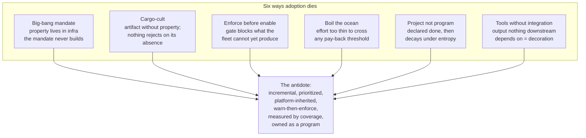
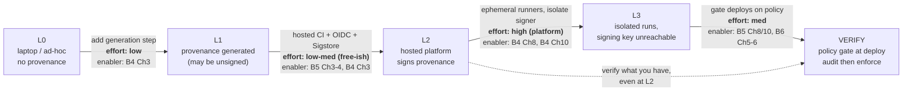
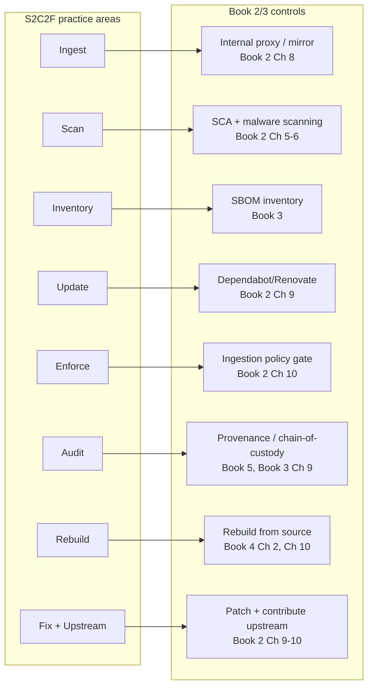
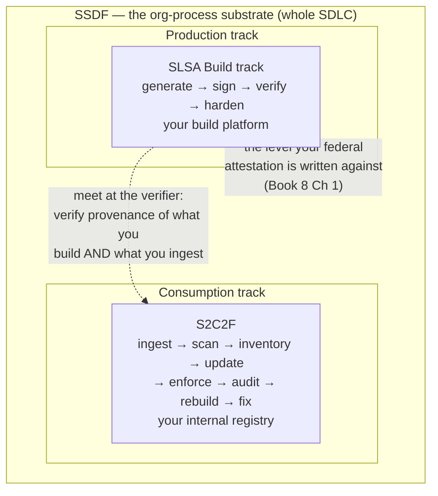
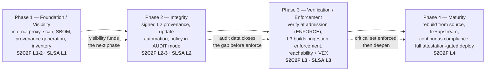
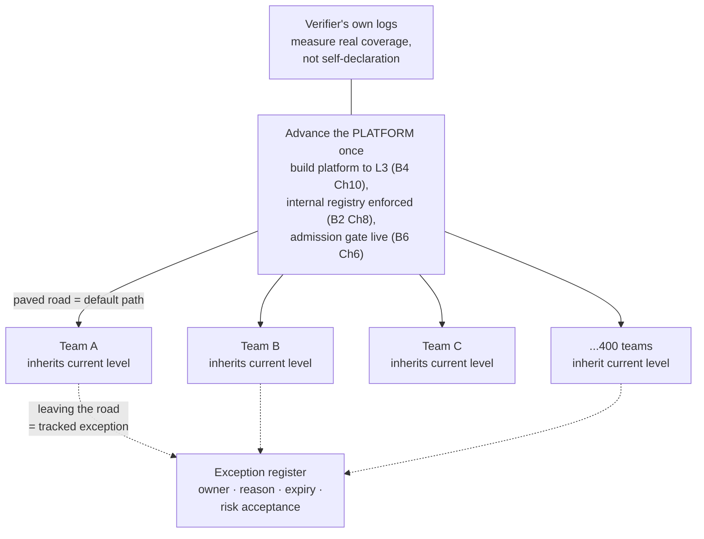
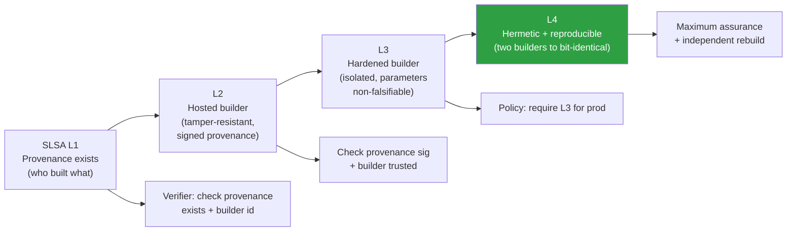
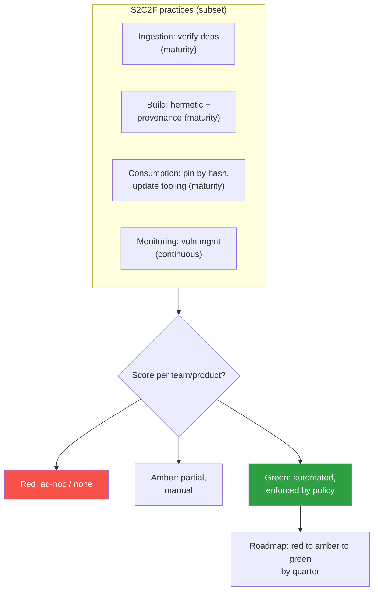

# Chapter 2 — Adopting SLSA and S2C2F: Roadmaps That Work

*What this chapter covers.* Book 1, Chapter 7 gave you the map: SLSA, SSDF, and S2C2F as three
composable frameworks on two axes. It was, in its own words, the map and not the expedition. This
chapter is the expedition. It is about the thing the frameworks conspicuously do not tell you —
*how a real organization gets from where it is to where the framework describes, without stalling,
without a developer revolt, and without cargo-culting a level it does not actually hold.* A
framework is a description of a destination. It contains no route. The route is a program-execution
problem, and it is the one that kills most supply chain security initiatives — not because the teams
picked the wrong controls, but because they sequenced them wrong, mandated before they enabled,
bought tools they never wired in, or treated a multi-year program as a one-quarter project. This
chapter is the honest playbook: what to do first, what to do next, how to advance SLSA (what you
*produce*) and S2C2F (what you *consume*) together under the SSDF umbrella, and how to measure real
coverage rather than a number on a slide. Everywhere, it points at the technical books that build
the actual capabilities — because adoption, at bottom, is the work of *wiring those capabilities
into an inherited, enforced, measured program*.

Learning goals — after this chapter you should be able to:

- Name the common ways framework adoption fails — big-bang mandates, cargo-culting, enforcing
  before enabling, boiling the ocean, project-not-program thinking, tool-buying without integration
  — and design a rollout that avoids each.
- Sequence **SLSA Build track** adoption as *generate → sign → verify → harden*, and explain why
  the middle of that ladder (L2/L3 provenance) is nearly free on a hosted CI with OIDC and Sigstore,
  while verification and hardening are the real work.
- Sequence **S2C2F** adoption from Level 1 to Level 4, mapping each of its eight practice areas onto
  the concrete controls built in Books 2 and 3, and recognize that the internal-registry chokepoint
  carries most of the framework.
- Combine SLSA, S2C2F, and SSDF into **one** phased roadmap (four phases) that advances production
  and consumption maturity together, with warn-then-enforce at every gate.
- Measure adoption as *coverage tied to risk* — percent of critical pipelines at L3, percent of
  dependencies through the proxy, percent of artifacts verified at deploy — rather than capability
  checkboxes or fleet averages, and sustain it as an owned, ongoing program.
- Explain why framework level is *necessary structure but not sufficient security*, and keep the two
  from being confused.

## Why adoption fails

Start with the graveyard, because it is instructive. The frameworks are good. The controls are
sound and are built, chapter by chapter, across Books 2 through 7. And yet a large fraction of
supply chain security programs stall out at "we bought a scanner and generate some SBOMs nobody
reads." The failure is almost never technical. It is a failure of *sequencing and program design*,
and it recurs in a small number of recognizable shapes.

**The big-bang mandate.** Leadership reads about SolarWinds, gets a framework in front of them, and
issues an edict: "All services will be SLSA L3 by Q3." This fails for a mechanical reason — the org
has, say, 400 services on a dozen different build setups, most maintained by teams with no security
engineer and no slack in their roadmap. A mandate does not create build isolation; it creates a
compliance scramble that produces the *artifacts* of L3 (a provenance file) without the *property*
of L3 (non-forgeability), and a lot of resentment. The mandate has no route attached, so each team
invents its own, badly, or ignores it until the deadline slips. Big-bang mandates for technical
properties do not scale because the property lives in infrastructure the mandate does not build.

**Cargo-culting.** Book 1, Chapter 7 named this the archetypal error and it is worth restating in
adoption terms: the level becomes the goal instead of the property. A team maps its existing CI onto
some level descriptions, declares "L3," and moves on — the runway and control tower built out of
straw, no planes landing. The tell is always the same: an *artifact* exists (a signature, a
provenance blob, an SBOM) but nothing *rejects* an artifact for lacking it, and no one has tested
whether the property actually holds. Cargo-culting is seductive precisely because it is cheap and
looks identical to the real thing on a slide. It is the thing measurement, done right, is supposed
to catch — and the thing measurement, done wrong (self-declared levels), actively manufactures.

**Enforcing before enabling.** This one produces the developer revolt that Book 1, Chapter 10 warns
about. Security stands up an admission controller that blocks any image without verified provenance,
flips it to enforce on a Friday, and Monday half the fleet cannot deploy because most pipelines
never emitted provenance in the first place. The control was correct; the *sequencing* was fatal.
You cannot enforce a property the fleet does not yet produce. Every gate in this chapter is
introduced in *warn / audit* mode first, run long enough to measure and close the gap, and only then
flipped to *enforce* — and even then, with an exception path. Enforcement is the *last* step of
adopting a control, never the first.

**Boiling the ocean.** The eight S2C2F practice areas and the SLSA ladder and the four SSDF families
present, all at once, as a wall of work. A team that tries to advance all of it simultaneously
advances none of it, because the effort is spread too thin to reach the threshold where any single
control starts *rejecting* bad things and thus *paying back*. Adoption has to be incremental and
prioritized — critical artifacts first, one capability wired end-to-end before the next — precisely
so that each increment produces value that funds and motivates the next.

**Project, not program.** Someone runs "the SLSA project," reaches some milestone, declares victory,
and disbands. Six months later provenance generation has silently broken in a third of pipelines,
the scanner's rules are stale, and new teams onboarded onto build setups that bypass everything.
Supply chain maturity is not a state you reach; it is a state you *maintain* against constant entropy
— new repos, new registries, new build tools, staff churn. It has to be *owned* by a standing team
(platform or security) with the current level baked into the paved road as the default, or it decays
the moment attention moves on.

**Tools without integration.** The org buys an SCA product, a signing service, an SBOM generator,
and a policy engine — and wires none of them into the path where they would actually block
something. Scanners run and email reports no one actions. Signatures get produced and never verified.
This is the most expensive failure because it *looks* like progress (there is a line item, a
dashboard, a vendor) while delivering close to zero security value, since a control that does not sit
in an enforced path is decoration. A tool is not a control until something downstream *depends* on
its output to make a decision.

Every recommendation that follows is, in effect, the negative image of this list. Advance
incrementally by risk; make the platform inherit the level so teams do not each climb; warn before
you enforce; integrate every tool into a path that depends on it; measure coverage against the tail;
and staff it as a program that never ends.

## Adopting SLSA — the Build track as a route

Recall the destination from Book 1, Chapter 7 and Book 4, Chapter 3. SLSA v1.0 restructured into
*tracks*; only the **Build track** is fully specified, running **L0–L3** (the old L4 was dropped).
The rungs climb a scale of *how much you can trust the provenance* — the signed, machine-readable
birth certificate the build emits:

- **L0** — no provenance. Ad-hoc or laptop builds.
- **L1** — provenance *exists*, emitted by a scripted build; may be unsigned. Stops honest mistakes.
- **L2** — a *hosted build platform* generates *and signs* provenance. Stops post-build tampering.
- **L3** — the platform *isolates* runs and keeps signing material *unreachable* by build steps.
  Provenance becomes non-forgeable. Stops in-build tampering.

That is the destination. Here is the route, and its shape is the single most important thing to
internalize: **SLSA adoption is a sequence of four moves — generate, sign, verify, harden — and
those moves are mostly done once, on the shared build platform, not once per repo.**

### L0 → L1: generate provenance

The first move is the cheapest and the one everyone skips because it feels too easy to matter. Get
provenance *generated* for builds — even unsigned — on whatever CI you already run. If you are on
GitHub Actions, that can be as small as adding the `actions/attest-build-provenance` action to a
job; on other platforms, a build step that emits an in-toto provenance predicate describing the
source revision, builder, and inputs (Book 4, Chapter 3 covers the predicate schema and generation).

What does this buy, given L1 provenance can be "trivial to forge"? Three things, none of them about
stopping an attacker. First, it defends against *honest mistakes* — the release built from an
unpushed commit, the dirty working tree. Second, and more important for a program, it establishes
the *practice* and the *plumbing*: every subsequent rung reuses this generation step, and getting it
into pipelines now means later moves are configuration changes, not greenfield work. Third, it
creates *visibility* — you now have a record of what each pipeline builds, from what, which is the
raw material for measuring coverage later. L1 is the on-ramp. Its job is to be nearly free and
nearly universal.

### L1 → L2: sign it, almost for free

This is the move that surprises people. The naive reading of "hosted platform that signs
provenance" sounds like a large project — key management, a signing service, HSMs. It is not,
because of a specific alignment of technologies that has matured since 2022. On a hosted CI with
**OIDC-based keyless signing** through **Sigstore** (Book 5, Chapter 4 for keyless signing; Book 5,
Chapter 3 for Sigstore's architecture), the build platform can sign provenance using a short-lived
certificate bound to the pipeline's *workload identity* — no long-lived key for anyone to steal or
manage. The signing is done by the platform, in a context the pipeline's own logic does not fully
control, using an identity the pipeline cannot mint for itself.

Concretely: on GitHub Actions, `actions/attest-build-provenance` (or the community
`slsa-github-generator`, Book 4, Chapter 3) uses the runner's OIDC token to obtain a Fulcio
certificate, signs an in-toto provenance statement with a DSSE envelope, and records it in the
Rekor transparency log — with essentially no key material you own. That single action, correctly
used, produces **signed provenance from a hosted platform** — the L2 property — and, because
GitHub's `slsa-github-generator` runs the provenance generation in a *separate, isolated reusable
workflow* that the calling job cannot tamper with, many pipelines that adopt it land at **L2 or even
L3** almost as a side effect. This is the "L2/L3 for free-ish via hosted CI + OIDC + Sigstore"
reality, and it is genuinely the biggest leverage point in SLSA adoption: the hard cryptographic and
isolation engineering was done once, by the platform vendors, and you inherit it by configuration.

Do not over-read "free." It is free *if* you are already on a hosted CI whose platform team has
enabled OIDC and whose generator runs in isolation. A team on self-hosted Jenkins with the signing
key in an environment variable next to the build gets none of this — they have the artifact of a
signature without the property, an L1 pipeline wearing an L2 badge. The freeness is a property of the
*platform*, which is exactly why adoption is a platform play.

### L2 → L3: harden and isolate

L3 is where the real, non-inherited work lives, and it is platform-team work, not app-team work. The
platform must guarantee **strong isolation between runs** — one build cannot influence another,
cannot poison a shared cache to corrupt a later build, cannot persist state that leaks into the next
tenant — and it must guarantee the **signing material is inaccessible to user-defined build steps**,
so that even a build running fully attacker-controlled source cannot forge a truthful-looking
provenance for a different artifact. In practice this means **ephemeral build environments** (Book 4,
Chapter 8) — each run in a fresh, isolated VM or container that is destroyed after — and an
architecture where provenance is generated and signed by a *trusted control process* the build
workload cannot reach (the isolation `slsa-github-generator` gets from GitHub's reusable-workflow
model, or that you build into a self-hosted platform per Book 4, Chapter 10).

This is the rung that takes a platform team a quarter or two of real engineering. It is also the
rung that, once done *once*, hands the property to *every tenant of the platform* with no per-repo
work — the paved-road inheritance the distributed-systems section returns to. You do not climb L3 per
repo; you climb it once, in the shared build platform, and migrate repos onto it.

### Then verify — because unverified provenance is theater

Here is the step teams forget, and forgetting it invalidates everything above. **Provenance that
nothing checks is a decoration.** You can be generating beautiful, signed, non-forgeable L3
provenance in every pipeline, and if nothing in your deploy path *reads* it and *refuses* artifacts
that fail policy, you have achieved exactly zero security benefit — you have spent a quarter building
a lie-detector nobody plugs in. Verification is where the produced provenance turns into an enforced
property.

Verification means a policy check — `slsa-verifier`, `cosign verify-attestation`, or an admission
controller — that, before an artifact is deployed, confirms: the provenance is signed by *our*
build platform's identity, attests a source repo on *our* allowlist, meets the *required level*, and
matches the artifact digest (Book 5, Chapter 8 for provenance verification mechanics; Book 5,
Chapter 10 and Book 6, Chapters 5–6 for the deploy-time and admission-controller gates). And — the
recurring discipline — that check goes into **audit mode first**: it evaluates every deploy and
*logs* pass/fail without blocking, for weeks, while you watch the fail rate fall as pipelines are
brought into compliance. Only when the audit log shows the critical set is clean do you flip the gate
to **enforce**. Audit-then-enforce is how you get verification without the Friday-afternoon outage.

### The route in one table

| SLSA level | How to reach it | Effort | Where it lives | Enabling chapters |
|---|---|---|---|---|
| L0 → L1 | Add a provenance-generation step to the scripted build; emit in-toto predicate (may be unsigned) | Low | Per pipeline, but a shared template | Book 4, Ch 3 (SLSA provenance) |
| L1 → L2 | Move to a hosted build platform; sign provenance via OIDC keyless + Sigstore (`attest-build-provenance` / `slsa-github-generator`) | Low–medium ("free-ish" on hosted CI) | Platform + config | Book 5, Ch 3–4 (Sigstore, keyless); Book 4, Ch 3 |
| L2 → L3 | Ephemeral, isolated runners; signing material unreachable by build steps; isolated generator | High (platform team) | Platform | Book 4, Ch 8 (ephemeral envs); Book 4, Ch 10 (secure build platform) |
| Verify | Policy gate at deploy/admission; audit then enforce | Medium | Deploy path | Book 5, Ch 8 & 10 (verification, gates); Book 6, Ch 5–6 (signing, admission) |

### Sequence by risk, not by repo

You do not do this to every pipeline at once. Prioritize: the artifacts that are **prod-critical,
external-facing, or highest-blast-radius** go first — the service on the edge of your network, the
base image every other image derives from, the CLI you ship to customers, the pipeline that has
production deploy credentials. A tier-0 payment service earns the full generate→sign→verify→harden
treatment before an internal cron job does. This is not merely resource triage; it is where the
security value is, because those are the artifacts an attacker most wants to tamper with and the ones
whose compromise hurts most. Sequence the *route* by risk, run each pipeline through the four moves,
and let the long tail follow the paved road later.

## Adopting S2C2F — the consumption side as a route

SLSA is what you *produce*. But most of the code in your running services is code you *consumed*, and
S2C2F is the framework for consuming it safely. Recall from Book 1, Chapter 7: **eight practice
areas** — Ingest, Scan, Inventory, Update, Enforce, Audit, Rebuild, Fix+Upstream — graded across
**four maturity levels**. "S2C2F Level 2" means you meet every requirement tagged Level 1 and 2
across all eight practices.

The adoption insight is that S2C2F, despite its eight-practice breadth, is *largely realized by one
architectural move plus the technical work of Books 2 and 3*. That move is the **internal-registry
chokepoint** — routing all dependency ingestion through a controlled internal proxy/feed (Book 2,
Chapter 8). Once every dependency flows through one place, every other practice has a place to stand:
you scan *there*, you inventory *there*, you enforce *there*, you audit *there*. Ingest without the
chokepoint is a suggestion; Ingest *with* it is the foundation the rest is built on.

### Mapping the eight practices onto controls you already build

The practical adoption move is to stop thinking of S2C2F as eight new things to invent and start
seeing it as eight *labels* on controls Books 2 and 3 already teach you to build. Here is the mapping.

| S2C2F practice | Roughly enters at | Concrete control | Enabling chapters |
|---|---|---|---|
| **Ingest** | L1 | Route all OSS through an internal proxy/mirror; no direct pulls from public registries | Book 2, Ch 8 (internal registries) |
| **Scan** | L1 | SCA for known vulns + malware/behavioral scan of ingested packages, at the chokepoint | Book 2, Ch 5–6 (vuln DBs, SCA) |
| **Inventory** | L1 | SBOM per artifact + a queryable inventory of what OSS runs where | Book 3 (SBOMs); Book 3, Ch 9 (operationalizing) |
| **Update** | L1–L2 | Automated dependency updates; drive down MTTR to patch | Book 2, Ch 9 (update automation) |
| **Enforce** | L2 | Make the internal feed mandatory; block builds that reach public registries directly; policy at ingestion | Book 2, Ch 8 & 10; network policy |
| **Audit** | L2–L3 | Verify chain-of-custody: what was consumed actually flowed through the controls; detect tampering | Book 5 (signing/verification); Book 3, Ch 9 |
| **Rebuild** | L3–L4 | Rebuild critical OSS from source in a trusted, controlled environment | Book 4, Ch 2 & 10 (reproducible builds, secure platform) |
| **Fix + Upstream** | L4 | Privately patch critical issues; contribute the fix upstream to avoid a permanent fork | Book 2, Ch 9–10 (maintenance, evaluation) |

### Level 1–2: the foundation is a chokepoint plus hygiene

The foundational levels are, concretely: **stand up the internal proxy** (Ingest) so that
`npm install`, `pip install`, `go get`, Maven, and your container base pulls all resolve through a
feed you control (Artifactory, Nexus, a language-native proxy, or a cloud artifact registry —
Book 2, Chapter 8). **Scan at that feed** (Book 2, Chapters 5–6) for known vulnerabilities, malware,
and license/EOL problems, so a package's risk is assessed as it enters. **Inventory** what you have
by generating an SBOM per build and aggregating them into something queryable (Book 3, and
Chapter 9 on operationalizing) — this is what lets you answer "are we affected by the next
Log4Shell, and where?" in minutes. And stand up **update automation** (Book 2, Chapter 9) —
Dependabot, Renovate — so patches flow with low friction and MTTR trends down.

Note what makes this achievable: none of it, at L1–L2, is yet *mandatory*. You are building the
chokepoint and the hygiene controls and making them the *default*, the path of least resistance, but
not yet blocking the alternatives. That is deliberate. Enabling before enforcing is the whole game.

### Level 3–4: enforce, audit, and the aspirational tail

The mature levels turn the defaults into requirements and add proactive controls. **Enforce**
(Book 2, Chapters 8 and 10) makes the internal feed *mandatory* — network policy so build
environments cannot reach `registry.npmjs.org` directly, and an ingestion-policy gate that blocks a
package from entering the feed if it fails policy (unsigned, too new, known-malicious, failing
reachability triage). **Audit** verifies chain-of-custody — that what you consumed actually flowed
through the controls and was not swapped — leaning on the signing and verification machinery of
Book 5. Add **reachability analysis and VEX** (Book 2, Chapter 7; Book 3, Chapter 6) so the enforce
gate blocks on vulnerabilities that are *actually reachable* rather than drowning developers in
unreachable-CVE noise — the difference between an enforce gate teams tolerate and one they route
around.

**Rebuild from source** (Level 4) means, for your most critical dependencies, not trusting upstream's
published binary but rebuilding it yourself in a trusted, reproducible environment (Book 4,
Chapters 2 and 10) — S2C2F reaching toward SLSA-style production integrity applied to code you
merely consume. **Fix + Upstream** (Level 4) means privately patching critical issues when you must,
then contributing the fix upstream so you are not carrying a permanent fork. These are genuinely
aspirational — Microsoft-scale postures most organizations rationally never fully reach, and the
maturity model exists precisely so you can say "we are Level 2, moving to 3" honestly instead of
being forced into an all-or-nothing claim.

The point of the mapping is liberating: **you do not adopt S2C2F as a separate program.** You build
the Book 2 and Book 3 controls — proxy, scanning, SBOM, update automation, ingestion policy — and
S2C2F is the *framework language that describes what you built and grades how far you have gotten*.
The chokepoint carries most of it.

## Combining SLSA, S2C2F, and SSDF into one program

You do not run three programs. You run one, and the three frameworks are three views of it. Book 1,
Chapter 7's quadrant is the organizing picture: **SLSA** governs *production* (what you build and
ship — build integrity and provenance), **S2C2F** governs *consumption* (what you pull in — safe OSS
ingestion), and **SSDF** is the broad *organizational-process substrate across the whole SDLC* that
both nest inside. SSDF's "Protect the Software" (PS) practices call for exactly the integrity
verification SLSA provides; its "Produce Well-Secured Software" (PW.4, "reuse well-secured
components") calls for exactly the consumption controls S2C2F provides. One is the syllabus; the
other two are graded modules within it — and SSDF is the one a US federal self-attestation is written
against (Book 8, Chapter 1).

The value of running them as one program is that production and consumption maturity *advance
together* against a single roadmap, funded once, owned by one team, measured on one dashboard —
rather than three initiatives competing for the same platform engineers. The next section is that
single roadmap.

## The phased roadmap

This is the core deliverable of the chapter: a concrete, four-phase route that advances SLSA and
S2C2F together under SSDF, with warn-then-enforce throughout, sequenced by risk. It ties together the
program-building of Book 1, Chapter 10, the secure-build-platform of Book 4, Chapter 10, and the
reference architecture of Book 6, Chapter 10. Treat the phases as *capability thresholds*, not
calendar quarters — an org crosses them at its own pace, and a phase is "done" for a given tier of
services, not for the whole fleet at once.

### Phase 1 — Foundation and visibility

**Goal:** see what you have and establish the plumbing. You cannot secure or measure what you cannot
see, and every later phase reuses this phase's pipes.

**Do:** Stand up the **internal proxy/registry** so dependencies route through one controlled feed
(Book 2, Ch 8). Turn on **scanning** at that feed — SCA plus malware detection (Book 2, Ch 5–6).
Generate an **SBOM** per build and aggregate into a queryable **inventory** (Book 3). Add a
**provenance-generation** step to build pipelines, even unsigned (Book 4, Ch 3). All of it in
observe/default mode — nothing blocks yet.

**Hits:** S2C2F Level 1–2 (Ingest, Scan, Inventory get their foundation), SLSA L1.

**Effort:** Low–medium, mostly platform config. This is a quarter's work for a platform team and it
is where the program earns its early credibility because the inventory *immediately* pays back the
next time a Log4Shell-class CVE drops and you can answer "where are we affected?" in an afternoon.

### Phase 2 — Integrity

**Goal:** make what you produce and consume *tamper-evident*, and start measuring the gap between
current state and the policy you intend to enforce — without yet blocking anyone.

**Do:** Turn on **signed L2 provenance** via hosted CI + OIDC + Sigstore (`attest-build-provenance` /
`slsa-github-generator`; Book 4, Ch 3; Book 5, Ch 3–4) — the "free-ish" move. Stand up **update
automation** to drive MTTR down (Book 2, Ch 9). Introduce your verification and ingestion **policies
in audit mode** — the deploy-time provenance check and the dependency-ingestion gate both *evaluate
and log* but do not block (Book 5, Ch 8/10; Book 6, Ch 6; Book 2, Ch 10). The audit logs are the
instrument: they tell you exactly which pipelines and which dependencies would fail, so you can close
the gap deliberately rather than discover it in an outage.

**Hits:** S2C2F Level 2–3 (Update matures, Enforce and Audit begin in audit mode), SLSA L2.

**Effort:** Low–medium on hosted CI (high if you must first migrate off self-hosted setups that
cannot do keyless signing). This phase is where warn-then-enforce becomes a discipline, not a slogan.

### Phase 3 — Verification and enforcement

**Goal:** turn the audited policies into *enforced* gates for the critical set, and do the real
platform work of L3. This is the phase where the program starts *rejecting* bad things — where the
controls become controls.

**Do:** Flip the deploy-time verification gate from audit to **enforce** for tier-0/critical
services first: an admission controller (Book 6, Ch 5–6) or deployment gate (Book 5, Ch 10) that
*refuses* an artifact lacking verified provenance from your platform attesting an allowlisted source.
Do the platform work for **SLSA L3** — ephemeral, isolated runners; signing material unreachable by
build steps (Book 4, Ch 8 & 10). Flip **ingestion enforcement**: network policy so builds cannot
bypass the internal feed, plus a blocking ingestion policy (Book 2, Ch 8 & 10). Add **reachability
analysis and VEX** (Book 2, Ch 7; Book 3, Ch 6) so the enforce gates block on *reachable* risk, not
raw CVE counts — this is what keeps enforcement tolerable and prevents the route-around.

**Hits:** S2C2F Level 3 (Enforce and Audit go live), SLSA L3.

**Effort:** High — L3 is genuine platform engineering and enforcement requires an exception path,
staged rollout by tier, and someone owning the appeals. Every gate here was audited in Phase 2 first;
you flip to enforce only where the audit data shows the critical set is clean.

### Phase 4 — Maturity

**Goal:** the aspirational tail and continuous operation. Most organizations reach here only for their
crown-jewel dependencies and never fleet-wide, and that is the correct, honest posture.

**Do:** **Rebuild critical OSS from source** in trusted, reproducible environments (Book 4, Ch 2 &
10). **Fix + Upstream** — patch critical issues privately, contribute back (Book 2, Ch 9–10). Move to
**continuous compliance** — the policies and evidence generated and checked continuously, feeding the
attestation and reporting of Book 8, Chapters 1 and 8. Reach **full attestation-gated deploy**: no
artifact reaches production without verified provenance *and* verified consumption controls.

**Hits:** S2C2F Level 4, SLSA L3 sustained, continuous SSDF evidence.

**Effort:** High and selective — apply to the critical few, not the many.

| Phase | What you do | Framework levels | Effort | Enabling books |
|---|---|---|---|---|
| **1 — Foundation / Visibility** | Internal proxy; scan; SBOM + inventory; provenance generation (unsigned OK) | S2C2F L1–2 · SLSA L1 | Low–med | B2 Ch5–6, Ch8; B3; B4 Ch3 |
| **2 — Integrity** | Signed L2 provenance (OIDC+Sigstore); update automation; verification + ingestion policy in **audit** mode | S2C2F L2–3 · SLSA L2 | Low–med (hosted CI) | B4 Ch3; B5 Ch3–4, Ch8/10; B2 Ch9–10 |
| **3 — Verification / Enforcement** | Verify at admission (**enforce**, tier-0 first); L3 isolated builds; ingestion enforcement; reachability + VEX | S2C2F L3 · SLSA L3 | High (platform) | B4 Ch8, Ch10; B5 Ch8/10; B6 Ch5–6; B2 Ch7,10; B3 Ch6 |
| **4 — Maturity** | Rebuild from source; fix + upstream; continuous compliance; full attestation-gated deploy | S2C2F L4 · SLSA L3 sustained | High, selective | B4 Ch2, Ch10; B2 Ch9–10; B8 Ch1, Ch8 |

The two through-lines: **warn-then-enforce** (every gate audits in Phase 2 before it enforces in
Phase 3) and **risk-sequencing** (each phase lands on the critical set first, the long tail follows
via the paved road). Miss either and you get the failure modes from the top of the chapter.

## Measuring adoption without cargo-culting

A program you cannot measure is a program you cannot defend at budget time or trust in an incident.
But *how* you measure is where cargo-culting sneaks back in, because the easiest numbers to produce
are the most misleading.

**Measure coverage, not capability.** "We have the capability to produce L3 provenance" is a
statement about a tool that exists. "84% of tier-0 production traffic is served by artifacts that
came off the L3 paved road and passed the enforce gate" is a statement about *reality*. The first is
a checkbox; the second is coverage. Capability is necessary and worthless alone — the six-way failure
list is full of programs with every capability and near-zero coverage. Track coverage: percent of
pipelines at each SLSA level, percent of dependencies flowing through the proxy, percent of
production artifacts *verified at deploy* (Book 8, Chapter 8 develops the metrics program in full).

**Tie the metric to risk, and watch the tail, not the mean.** As Book 1, Chapter 7 argued, "our mean
SLSA level is 1.8" is a vanity number that hides the risk, because the risk lives in the *tail* — the
5% of critical services still at L0 is where the incident comes from, and the average launders it out
of view. The question that matters is *coverage of the critical set*: are the tier-0, external-facing,
production-credentialed artifacts the ones that are L3-verified? A fleet that is "L3 with a 5% hole in
non-critical internal tools" is in a completely different risk posture than one whose 5% hole is the
edge payment gateway, even at identical averages.

**Measure from the verifier's records, not self-declaration.** The single most important measurement
discipline: the number comes from the *admission controller's / deploy gate's own log* of what it
accepted and rejected — not from a spreadsheet of teams declaring their own level. Self-declared
levels are the exact artifact cargo-culting produces; a survey that asks teams "are you L3?" measures
optimism, not integrity. The platform that *grants* the level (the paved road) and the gate that
*enforces* it (the verifier) should also be the systems that *measure* it, closing the loop between
the property and the number so the number cannot lie.

### Sustaining: it is a program, and the paved road is how it lasts

Adoption is not a finish line; it is a floor you hold against entropy. New repos, new registries, new
build tools, staff churn, and the next reorg all pull the fleet back toward L0 the moment attention
moves elsewhere. Sustaining works when **the current level is the default** — baked into the paved
road (Book 4, Ch 10; Book 6, Ch 10) so that a new service, created the standard way, is *born* at the
fleet's current level with no effort, and *leaving* the road is the thing that takes effort and shows
up as an exception. Ownership sits with a standing platform/security team, not a project that
disbands. And there is always a **long tail** — legacy services that predate the paved road, systems
that cannot migrate, third-party black boxes. Handle them with an explicit, tracked **exception
process**: a documented reason, an owner, an expiry, and a risk acceptance — so the exceptions are
*visible and finite*, not a silent hole. An exception you can see and count is manageable; the ones
that kill you are the ones nobody tracks.

### Level is necessary structure, not sufficient security

Close the loop on the tension Book 1, Chapter 7 opened. A framework level is necessary — it is the
shared vocabulary, the ratchet, the checkable proposition — but it is *not* the same thing as being
secure, and adoption that forgets this optimizes the wrong variable.

**An L3 pipeline building malicious source is still building malice.** SLSA is silent on code quality
and vulnerabilities: it proves *what you got is what that source compiled to*, not *that the source is
safe*. The xz-utils backdoor (Book 1, Ch 5) would have sailed through a Build L3 pipeline untouched,
because the malice was in the source tree the maintainer controlled and the build faithfully compiled
and faithfully attested it. A team that drove hard to L3 while never scanning a dependency has a
perfect birth certificate for a poisoned baby. So the level is structure; *security* comes from
combining it with the rest of the program — **source security** (Book 7: code review, commit
identity, backdoor detection), **dependency security** (Book 2: the S2C2F consumption side that
actually reasons about whether the code is malicious or vulnerable), and **verification** (Book 5).
SLSA + S2C2F + SSDF advanced together is the *frame*; the controls those books build are what hang on
it. Adopt the frameworks to get structure, measurement, and a shared language — and never let the
level on the slide be mistaken for the security in the system.

## Distributed-systems lens: adoption is a platform strategy

Everything in this chapter resolves to one idea at fleet scale, and it is worth stating starkly
because it is the difference between a program that works and one that dies: **framework adoption
across hundreds of teams succeeds as a platform strategy and fails as a per-team strategy.**

Ask 400 teams to each independently reach SLSA L3 — each hardening a build, isolating runs,
protecting signing material — and you have planned to fail, because most teams have no security
engineer, no roadmap slack, and no interest, and the long tail sits at L0 forever. The escape hatch,
built into the frameworks by design, is that the properties that matter are properties of *shared
infrastructure*, not of individual projects. SLSA L2/L3 are properties of the **build platform**
(Book 4, Ch 10): harden it once and every tenant inherits the level for free, with no code change and
often no awareness. S2C2F's Ingest/Scan/Enforce are properties of the **internal registry** (Book 2,
Ch 8): stand up one scanned, enforced feed and the whole fleet climbs the consumption levels together.
Verification is a property of the **admission layer** (Book 6, Ch 5–6): one gate at the deploy
chokepoint enforces the policy for everyone. Advance the *platform*, and the fleet inherits the
current maturity level through the paved road — the unit of adoption is the shared capability, not the
repo.

That reframes the whole program. Sequencing by risk means bringing the *critical artifacts and
pipelines* onto the advanced platform first, not asking risky teams to do risky work. Measuring
coverage means asking *what fraction of critical production is served off the current-level paved
road and passed the verifier* — measured from the verifier's own logs, tail not mean. And sustaining
means keeping the current level as the platform's default so new services are born compliant and
leaving the road is a tracked exception. The frameworks map cleanly onto the platform capabilities
the technical books spend seven volumes building — a hardened build platform (SLSA), an enforced
internal registry (S2C2F), a verifying admission layer (the meeting point). Adoption, in the end, is
not climbing a framework. It is *wiring those capabilities into an inherited, enforced, measured
program* — and then holding the floor.

### SLSA build level progression

### S2C2F capability maturity heatmap

## Key takeaways

- **Frameworks describe destinations, not routes.** Adoption is a program-execution problem, and it
  dies in six recognizable ways: big-bang mandates, cargo-culting, enforcing before enabling, boiling
  the ocean, project-not-program thinking, and buying tools without integrating them. Every
  recommendation here is the negative image of that list.

- **SLSA adoption is generate → sign → verify → harden, done mostly on the platform.** L0→L1: emit
  provenance (low effort). L1→L2: sign it via hosted CI + OIDC + Sigstore — "free-ish" because the
  hard crypto and isolation were done once by the platform (`attest-build-provenance` /
  `slsa-github-generator` land many pipelines at L2/L3). L2→L3: ephemeral isolated runners, signing
  key unreachable — real platform work. Then *verify*, because unverified provenance is theater.

- **S2C2F is largely realized by the internal-registry chokepoint plus Book 2/3 controls.** Route all
  OSS through one controlled feed (Ingest), scan and inventory there (Scan, Inventory, via SBOMs),
  automate updates, then enforce the feed and audit chain-of-custody. The eight practice areas are
  labels on controls you already build; Rebuild and Fix+Upstream (L4) are the aspirational tail.

- **Run one program, not three.** SLSA governs production, S2C2F governs consumption, and both nest
  inside SSDF — the org-process substrate your federal attestation is written against. Advance
  production and consumption maturity together on a single roadmap.

- **Follow the four-phase roadmap with warn-then-enforce throughout.** Phase 1 foundation/visibility
  (S2C2F L1–2, SLSA L1); Phase 2 integrity — signed L2 provenance, policy in *audit* mode (S2C2F
  L2–3, SLSA L2); Phase 3 verification/enforcement — flip gates to *enforce* on critical set first,
  L3 builds, ingestion enforcement, reachability/VEX (S2C2F L3, SLSA L3); Phase 4 maturity — rebuild
  from source, fix+upstream, continuous compliance (S2C2F L4). Sequence every phase by risk.

- **Measure coverage tied to risk, from the verifier's own records — never the mean, never
  self-declaration.** Percent of critical pipelines at L3, percent of deps through the proxy, percent
  of artifacts verified at deploy. The risk lives in the tail; the platform that grants and enforces
  the level should also measure it.

- **It is a program, sustained by the paved road.** Bake the current level in as the default so new
  services are born compliant and leaving the road is a tracked exception with an owner and an expiry.
  Own it with a standing platform/security team; it decays the moment it becomes a finished project.

- **Level is necessary structure, not sufficient security.** An L3 pipeline building malicious source
  is still malicious — SLSA is silent on code quality; xz-utils would sail through L3. Combine the
  frameworks (the frame) with source security (Book 7), dependency security (Book 2), and verification
  (Book 5) — the controls that hang on the frame. Never mistake the level on the slide for the
  security in the system.

- **At fleet scale, adoption is a platform strategy.** Advance the shared build platform (SLSA), the
  internal registry (S2C2F), and the admission layer (verification) once, and hundreds of teams
  inherit the current level via the paved road. The unit of adoption is the shared capability, not the
  repo.

## Further reading

- **SLSA v1.0** — the specification at `slsa.dev`, especially the *Build track levels*,
  *requirements*, and *threats & mitigations* pages. Note that v1.0 tops out at Build L3 (the old L4
  was dropped). (Provenance mechanics: Book 4, Chapter 3; verification: Book 5, Chapter 8.)
- **`slsa-framework/slsa-github-generator`** and GitHub's **`actions/attest-build-provenance`** — the
  two most common on-ramps to signed provenance on hosted CI; their docs explain how the isolated
  reusable-workflow model reaches L3. (`github.com/slsa-framework/slsa-github-generator`.)
- **S2C2F** — the *Secure Supply Chain Consumption Framework* specification in the OpenSSF
  `ossf/s2c2f` repository: the eight practice areas, four maturity levels, the requirements table
  (each requirement tagged with its maturity level), and the OSS threat mapping. Donated to OpenSSF by
  Microsoft, August 2022.
- **NIST SP 800-218**, *Secure Software Development Framework (SSDF) v1.1* (`csrc.nist.gov`) — the
  process substrate the roadmap advances under; PS and PW.4 are the practices SLSA and S2C2F concretely
  satisfy. Its regulatory weight (EO 14028, OMB M-22-18 / M-23-16, CISA attestation form) is developed
  in Book 8, Chapter 1.
- **`slsa-verifier`** and **`cosign verify-attestation`** — the verification tools that turn produced
  provenance into an enforced property at the deploy gate (Book 5, Chapters 8 and 10; Book 6,
  Chapters 5–6 for admission).
- **OpenSSF Scorecard** and the **SLSA "getting started" / "verifying artifacts" guides** — practical
  starting points for measuring per-repo posture and wiring verification, useful inputs to the
  coverage metrics of Book 8, Chapter 8.
- Cross-references within this series: Book 1, Chapter 7 (the frameworks as maps) and Chapter 10
  (building a program); Book 2, Chapters 6, 8, 9, 10 (SCA, internal registries, update automation,
  evaluation); Book 3 (SBOMs and inventory); Book 4, Chapters 3, 8, 10 (SLSA provenance, ephemeral
  builds, secure build platform); Book 5, Chapters 4, 8, 10 (keyless signing, verification, gates);
  Book 6, Chapters 5, 6, 10 (image signing, admission policy, reference architecture); Book 7 (source
  security); Book 8, Chapters 1 and 8 (regulation, metrics).
