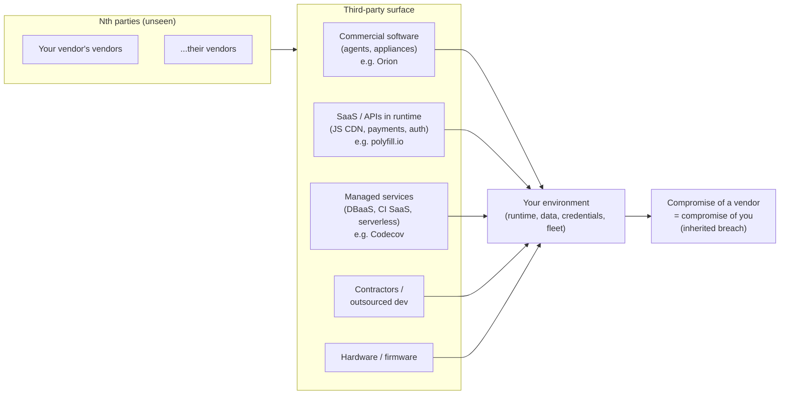
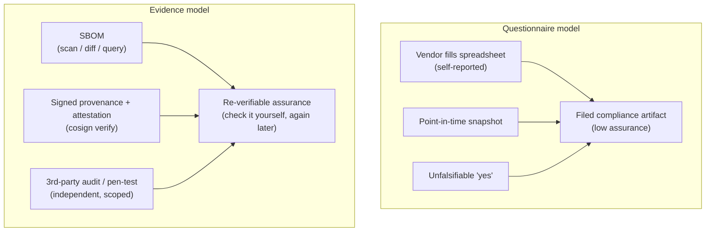
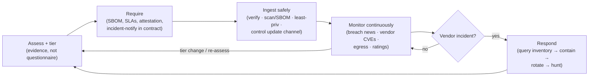
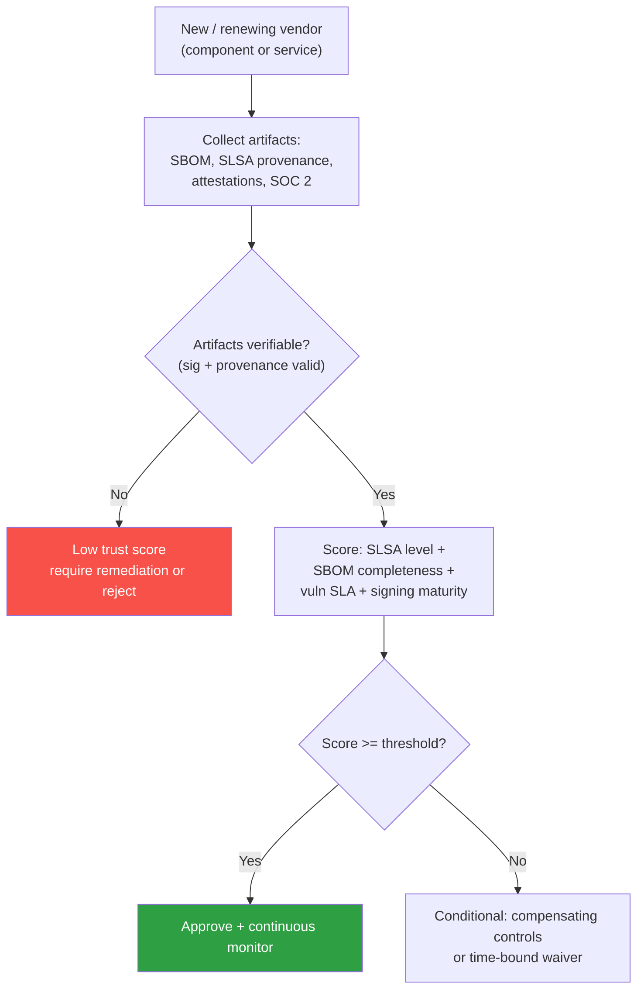
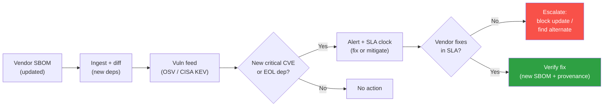
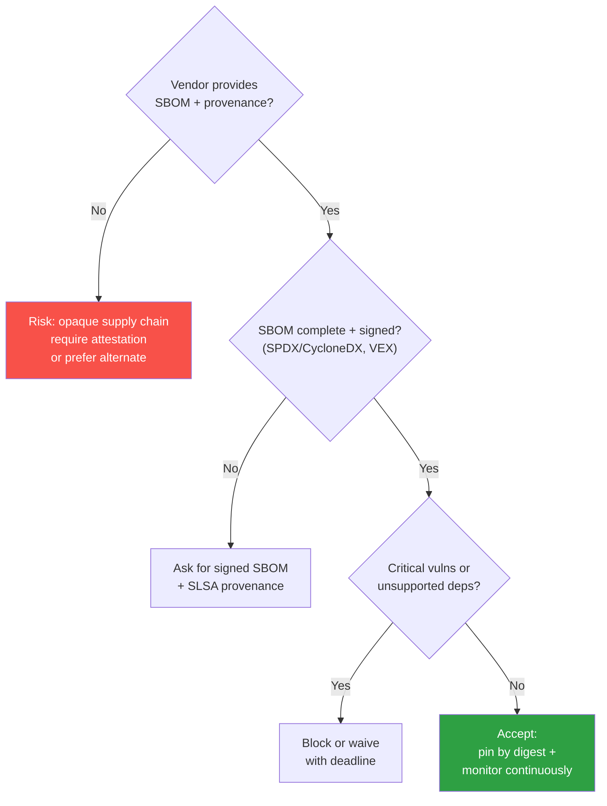

# Chapter 3 — Vendor and Third-Party Software Risk

*What this chapter covers.* The previous seven books built a program for software you can see
into: the open-source dependencies you pull (Book 2), the artifacts you build (Book 4), the
containers you ship (Book 6), the source you control (Book 7). But a distributed system of any
size runs on a large body of software and services you did **not** build and cannot inspect at
will — the commercial products you license, the SaaS APIs your runtime calls, the managed
services your platform stands on, the contractors who commit to your repos, and the firmware in
your fleet. Each of those is a trust relationship, and a trust relationship is a liability: when
your vendor is compromised, *their* breach becomes *your* breach, propagated through the exact
channel you trusted them on. SolarWinds is the canonical proof — Book 1, Chapter 3 dissects it —
because roughly 18,000 organizations inherited one vendor's build-system compromise through a
legitimately signed update. Codecov (Book 1, Chapter 5) did the same through a CI vendor's
script; 3CX did it through a trojanized desktop app. This chapter is about managing that surface
as a discipline: how to assess a vendor before you onboard them, what to require of them in
contract, how to ingest their software and grant them access without inheriting their whole
attack surface, and how to keep watching them after the ink dries — because a one-time
assessment is stale the day it is filed, and the incident always arrives after it.

The through-line to grasp before the details: **vendor risk is the third-party dimension of the
same inventory → provenance → verify → monitor program the rest of this suite builds.** The
capability that lets you answer "where is Log4j in our fleet?" in an hour (Book 3, Chapter 5) is
the same capability that lets you answer "where is this compromised vendor's software and
access in our fleet?" when the SolarWinds moment lands on you. Vendor management done well is
not a parallel GRC workstream bolted onto engineering; it is the same asset inventory, the same
SBOM ingestion, the same least-privilege and egress monitoring, pointed at the boundary of your
organization instead of the interior.

Learning goals — after this chapter you should be able to:

- Map the full **third-party risk surface** — commercial software, SaaS/APIs in your runtime,
  managed services, contractors, hardware/firmware — and reason about the **Nth-party problem**:
  your vendors have vendors, and you cannot see the whole tree.
- Run a **pre-onboarding vendor assessment** that evaluates security posture, SDLC/SSDF
  practices, SBOM availability, disclosure and patch commitments, and certifications — and
  understand why a **security questionnaire is point-in-time self-report**, and what
  **evidence** (SBOM, provenance, attestation, third-party audit) replaces it.
- **Risk-tier** vendors by access and blast radius so assessment depth scales with consequence
  rather than being uniform theater.
- Encode security into **procurement and contracts** — SBOM delivery, vulnerability
  notification SLAs, secure-development attestation, right-to-audit, incident-notification
  obligations, patch commitments — and understand the **buyer leverage** and **regulation**
  (Book 8, Chapter 1) that make these enforceable.
- Apply **technical controls** to vendor software and access: verify provenance, scan and SBOM
  the artifact, sandbox and least-privilege the runtime, control the update channel, and
  monitor egress and behavior — bounding the blast radius the Orion agent never had bounded.
- Stand up **continuous monitoring** and a **vendor incident-response** capability that turns a
  vendor-breach headline into a fast fleet-exposure query and containment.

## The third-party risk surface

Start by naming what is actually in scope, because "vendor risk" is often scoped down to a
procurement spreadsheet of SaaS logins and thereby misses the categories that produced the worst
incidents. Your third-party software supply chain has at least five distinct surfaces, each with
a different compromise mechanism and a different control set:

- **Commercial off-the-shelf software** you install and run inside your environment. This is the
  Orion category: a monitoring, backup, endpoint, or management agent running with high privilege
  on your hosts, updated over a channel you have configured to trust. Its blast radius is enormous
  precisely because that is what it was bought to do — see and touch everything. When the vendor's
  build system is compromised, the malicious update flows to you through the trusted channel and
  runs at the privilege you granted.
- **SaaS and third-party APIs in your runtime.** Software you never install but call — an
  analytics tag, a payments API, a JavaScript widget loaded from a vendor CDN, a feature-flag
  service, an auth provider. The compromise mechanism here is that their code executes in *your*
  context (in the user's browser, or server-side with your data) without ever entering your build.
  The polyfill.io incident (mid-2024, treated in Book 6, Chapter 9) is the archetype: a widely
  embedded JavaScript service changed hands and began serving malicious code to some visitors, and
  every site that referenced it inherited the injection with no change to its own code.
- **Managed services and cloud infrastructure.** The database-as-a-service, the managed Kafka, the
  serverless platform, the CI/CD SaaS. Book 6, Chapter 9 covers the serverless/managed surface;
  the point for vendor risk is that you have outsourced the operational substrate and, with it,
  a share of your control plane. Codecov (Book 1, Chapter 5) sat here: a CI-adjacent SaaS whose
  compromised Bash Uploader script exfiltrated environment secrets from thousands of customers' CI
  runs — the vendor's breach reached straight into every customer's build environment.
- **Contractors and outsourced development.** Humans with commit access, review authority, or
  production credentials who are not your employees. This is the account-takeover and insider
  surface of Book 7, Chapter 6, extended across an organizational boundary you control even less.
- **Hardware and firmware.** BMCs, NICs, drives, and the firmware supply chain beneath them. The
  hardest surface to inspect and the one with the least tooling; largely out of scope for the
  software controls in this book, but it belongs on the map so it is not silently assumed away.



### The Nth-party problem

The surface above is only the first ring. Every vendor on it has its own vendors, and their
compromise can reach you transitively without ever touching a name on your procurement list. Your
SaaS analytics provider runs on a cloud you did not choose, pulls open-source dependencies you
never evaluated, and integrates a sub-processor for email delivery that you have never heard of.
This is the exact structural problem as transitive dependencies in Book 2 — the risk lives in a
tree you can enumerate one level deep and then lose visibility into — but with two differences
that make it harder. First, there is no lockfile: you cannot resolve the full transitive set of
your vendors' vendors, because that information is contractual and commercial, not mechanical.
Second, the edges are trust relationships between organizations, not import statements, so you
cannot scan for them.

You will not solve the Nth-party problem by enumerating the whole tree; nobody can. You bound it
the same way you bound transitive dependency risk: by pushing requirements down one edge at a time
(your contract obligates your vendor to hold *their* sub-processors to equivalent standards and to
disclose material ones), by preferring vendors who are transparent about their own supply chain
(a vendor who ships you an SBOM has already told you a great deal about *their* Nth parties), and
by designing your side of the boundary — least privilege, egress control, blast-radius limits — so
that a compromise two hops away still lands in a contained space. The architectural lesson repeats
at every scale in this suite: you cannot make the tree trustworthy, so you make the *boundary*
defensible.

## Assessing vendor risk

The assessment is the decision gate: before a vendor's software runs in your environment or their
integration holds your credentials, you form a judgment about whether the trust is warranted and
at what cost. Done as a ritual — a questionnaire filed and forgotten — it is theater. Done well,
it produces two durable things: a **risk tier** that determines how much scrutiny and how many
contractual controls this vendor warrants, and a set of **evidence** you can re-verify later.

### Risk tiering: assessment depth follows blast radius

Not all vendors are equal, and treating them uniformly guarantees you spend the same effort on a
read-only status-page widget as on the backup agent that runs as root on every host. Tier vendors
by the consequence of their compromise — their **access** and **criticality** — not by contract
size or vendor prominence. A useful three-tier model:

| Tier | Definition (access × criticality) | Examples | Assessment depth | Contractual requirements |
|------|-----------------------------------|----------|------------------|--------------------------|
| **Tier 1 — Critical** | Runs in your environment with high privilege, or holds/processes sensitive data at scale, or sits in a critical delivery path. Compromise = fleet-wide or data-wide. | Endpoint/monitoring/backup agents (Orion-class), IdP/auth provider, CI/CD SaaS (Codecov-class), primary cloud, code-signing HSM vendor | Deep: evidence-based. SBOM required, provenance/attestation, third-party audit report reviewed, architecture review, right-to-audit exercised, pen-test summary | Full set: SBOM delivery, vuln-notification SLA, SSDF attestation, incident notification, patch commitments, right-to-audit, sub-processor disclosure |
| **Tier 2 — Important** | Meaningful access or data, but scoped; compromise is contained to a service or a data subset. | Feature-flag SaaS, error-tracking, payments API, non-privileged internal tool | Moderate: certifications reviewed (SOC 2 Type II, ISO 27001), SBOM requested, questionnaire cross-checked against evidence | SBOM on request, vuln notification, incident notification, disclosure terms |
| **Tier 3 — Low** | Minimal access, no sensitive data, no runtime code execution in your context; compromise is a nuisance, not a breach. | Read-only status widgets, marketing tools with no PII, isolated informational SaaS | Light: attestation of certifications, standard terms | Baseline security terms, incident notification |

The tier is not static. A Tier 3 marketing tool that later gets an OAuth grant to read your CRM
has become Tier 2 by acquiring access, and the assessment must re-fire. Tiering is a function of
what the vendor can *reach*, and reach changes with every integration you add. The discipline is
to make tier a property you re-evaluate on access change, not a label assigned once at onboarding.

The reason tiering matters beyond effort economics: it is the same **blast-radius** reasoning that
governs the rest of your security program, applied at the vendor boundary. You cannot deeply audit
hundreds of vendors, and you should not try. You deeply audit the handful whose compromise is
existential, you apply proportionate controls to the middle, and you keep the long tail cheap —
and you make sure the *placement* into tiers is driven by access and criticality, because that is
where the SolarWinds-shaped risk actually lives.

### What to evaluate

For a Tier 1 vendor, the assessment is a security review of a company you cannot enter. Evaluate:

- **Security posture and program maturity.** Do they have a security team, a documented SDLC, a
  vulnerability-management program? Map their claims to a framework you already speak — **NIST
  SSDF** (Book 8, Chapter 1) is the right yardstick because it is the same one your own attestation
  is written against, and asking "which SSDF practices do you implement, and how do you evidence
  them?" is far more revealing than a generic maturity self-rating.
- **Build and signing practices.** Can they describe their build platform in SLSA terms (Book 5,
  Book 4)? Do they produce signed provenance for their releases? Is their build hermetic and their
  release path isolated from developer workstations? This is the SolarWinds question asked directly:
  *is your build system a plausible target, and what have you done about it?* A vendor who can
  describe an isolated, provenance-emitting build pipeline is telling you something an insurance
  certificate never will.
- **Transparency: do they provide an SBOM?** Can you see what is *inside* their software (Book 3)?
  An SBOM is the single highest-value artifact a vendor can hand you, because it converts their
  product from a sealed can into an ingredient list you can scan and, later, query against new CVEs.
  Its absence is itself a signal.
- **Vulnerability disclosure and response.** Do they have a published disclosure policy and a
  security contact? How fast do they patch, and how do they notify customers? Ask for their actual
  track record — mean time to patch on recent high-severity issues — not a policy PDF.
- **Certifications and audits.** **SOC 2 Type II** (controls tested over a period, not a
  point-in-time Type I), **ISO/IEC 27001** (an information-security management system), and
  **FedRAMP** (for US federal cloud) are the common ones. They are *inputs*, not verdicts — a SOC 2
  report attests that audited controls operated, but its scope may exclude exactly the system you
  care about. Read the scope and the exceptions, not just the logo.
- **Incident history.** Have they been breached, and how did they handle it? A vendor with a
  disclosed incident and a competent, transparent response is often a *safer* bet than one with a
  silent history, because you have seen their actual behavior under fire.

### Questionnaires and their limits: the shift to evidence

The default instrument of vendor assessment is the security questionnaire — a spreadsheet of a few
hundred yes/no questions the vendor fills in. It has three structural weaknesses that no amount of
question-writing fixes. It is **self-reported**: the vendor grades their own homework, and the
person filling it in is frequently in sales, not security. It is **point-in-time**: it describes a
claimed state on the day it was filed, and vendors change — the answer to "do you enforce MFA
everywhere?" was true until a new acquisition was integrated without it. And it is
**unfalsifiable at your end**: a "yes" and a lie look identical in a spreadsheet cell. The result
is that questionnaires optimize for *completion*, not *assurance* — they generate a compliance
artifact, a filed record that the box was checked, while telling you very little about whether the
control actually operates.

The correction is to shift from *claims* to *evidence*: artifacts you can independently verify
rather than assertions you have to trust. The rest of this suite has already built the evidence
types that matter:

- An **SBOM** (Book 3) is verifiable: you can scan it, diff it against the running artifact, and
  query it against new vulnerabilities. It replaces "we track our dependencies" with a list you
  can check.
- **Provenance and attestations** (Book 4, Book 5) are cryptographically verifiable: signed SLSA
  provenance replaces "we have a secure build pipeline" with a statement bound to the artifact and
  the builder that you can validate with `cosign verify-attestation` (Book 5, Chapter 8).
- A **third-party audit report** (SOC 2 Type II, an ISO 27001 certificate with its Statement of
  Applicability, a pen-test summary) replaces the vendor's self-grade with an independent one —
  imperfect, scope-limited, but not self-issued.



The shift does not mean questionnaires disappear; they remain a useful triage instrument for the
long tail of Tier 3 vendors where evidence collection is not worth the cost. It means that for
Tier 1 vendors — the ones whose compromise is existential — you should weight verifiable evidence
far above self-report, and you should treat a vendor's *ability and willingness* to produce that
evidence as a first-class signal. A vendor who can hand you a current SBOM, signed provenance, and
a SOC 2 Type II with a sensible scope has demonstrated program maturity in the act of handing them
over. A vendor who can only offer a completed questionnaire has demonstrated the opposite, whatever
the cells say.

## Requirements and contracts

Assessment forms a judgment; the contract is where that judgment becomes an obligation you can
enforce. The procurement moment is the point of maximum leverage — before money changes hands, the
vendor wants the deal — and it is the only reliable time to secure commitments that you will need
years later during an incident. Bake security into the contract, or you will be negotiating it in
the middle of a breach, from a position of zero leverage.

The requirements that matter for supply chain risk, roughly in order of value:

- **SBOM delivery.** Require a current SBOM (SPDX or CycloneDX) for each release, delivered through
  a defined channel, at a defined quality bar (Book 3, Chapter 7 on quality). This is the clause
  that makes vendor-CVE triage possible later; without it you are back to guessing whether a vendor
  product contains the vulnerable component.
- **Vulnerability notification with an SLA.** The vendor must notify you of vulnerabilities in
  their product within a defined window, keyed to severity, and provide a remediation timeline.
  This turns "we'll tell you eventually" into a contractual clock.
- **Secure-development attestation.** For US federal-adjacent contexts this is increasingly the
  **CISA secure-software-development attestation** aligned to **SSDF** (Book 8, Chapter 1) — the
  vendor formally attests they follow specified secure-development practices. Even outside the
  federal context, requiring an SSDF-aligned attestation gives the earlier posture claims legal
  weight.
- **Incident-notification obligation.** The vendor must notify you within a bounded window (hours,
  not weeks) if *they* are breached in a way that could affect you. This is the clause you will
  wish you had on the day the vendor's name is in the news; it is also increasingly a regulatory
  requirement — the EU CRA imposes vendor-side incident reporting (Book 8, Chapter 1).
- **Support and patch commitments.** A defined support lifetime and a commitment to patch security
  issues for that lifetime. The **EU Cyber Resilience Act** pushes this toward mandatory: producers
  of "products with digital elements" owe a defined support period and timely security updates
  (Book 8, Chapter 1). A vendor that can EOL your critical dependency with 30 days' notice is a
  risk the contract should price.
- **Right-to-audit.** The contractual ability to audit the vendor's relevant controls, or to
  receive independent audit evidence on a schedule. You will rarely exercise it, but its existence
  changes vendor behavior and gives you an escalation path.
- **Coordinated-disclosure terms.** Agreement on how vulnerabilities *you* find in their product
  are handled — a defined disclosure process, so a researcher on your team reporting a flaw does not
  trigger a legal response instead of a fix.
- **Sub-processor / Nth-party disclosure.** The vendor must disclose material sub-processors and
  hold them to equivalent obligations — the one contractual lever you have against the Nth-party
  problem.

### The leverage, and the regulation behind it

Two forces make these clauses realistic rather than aspirational. The first is **buyer leverage**:
a large buyer can *demand* security evidence, and vendors will produce it because the deal is worth
more than the cost of an SBOM. This is the mechanism by which the ecosystem moves — when enough
large buyers require SBOMs and attestations in procurement, producing them stops being optional and
becomes table stakes, and the transparency the whole suite argues for gets pulled into existence by
demand rather than pushed by regulation alone. Use the leverage: a Tier 1 vendor negotiating a
seven-figure contract will agree to SBOM delivery and incident-notification SLAs if you make them
non-negotiable, and every buyer who does raises the floor for the next.

The second is **regulation**, which converts some of this from leverage-dependent to mandatory.
Book 8, Chapter 1 develops the full landscape; the parts that land in vendor contracts are the US
self-attestation regime (EO 14028 → SSDF → the CISA attestation form, which flows down to your
software vendors when you sell to the government) and the EU CRA (which obligates producers on
security-by-design, vulnerability handling, incident reporting, and support periods as a condition
of market access). Where regulation applies, you are no longer asking the vendor for a favor; you
are requiring what the law already requires of them, and the contract simply makes it enforceable
between you.

## Ingesting and using vendor software safely

Assessment and contracts govern whether you take the vendor on. The technical controls govern what
happens after — and they matter most precisely because assessment and contracts *failed to prevent
SolarWinds, Codecov, and 3CX*. Every one of those victims had a vendor relationship in good
standing, a signed update, a trusted channel. The lesson is not "assess harder"; it is that a
vendor artifact and a vendor's access must be treated as **untrusted input** regardless of the
relationship, and bounded so that a compromise you did not prevent is still contained.

The governing principle: **treat vendor software and updates exactly like any other untrusted
artifact in your supply chain.** You already do this for open-source packages (Book 2) and your own
container images (Book 6). Vendor software gets the same pipeline — verify, scan, least-privilege,
monitor, control the update channel — with the difference that you have less visibility, so the
runtime containment matters more.

| Vendor asset | Verify | Scan / SBOM | Least privilege | Monitor / control |
|--------------|--------|-------------|-----------------|-------------------|
| **Installed software / agent** (Orion-class) | Verify signature and, if provided, SLSA provenance before install (Book 5, Ch 8) | Generate/ingest SBOM of the artifact; scan for known CVEs before and after deploy (Book 6, Ch 4) | Run with the minimum privilege it functions with; not root/domain-admin by default; network-segment it | Egress-monitor for beaconing (Book 4, Ch 9; Book 8, Ch 5); alert on anomalous behavior; **stage and pin updates — do not blind auto-update** |
| **Software update / patch** | Verify signature/provenance on the *update*, not just the base install — the update is the attack vector | Re-scan the updated artifact; diff SBOM against prior version | N/A | Controlled rollout: canary a subset, hold, watch, then fleet-wide — the SolarWinds/3CX kill point |
| **SaaS / runtime API / JS widget** | Subresource Integrity (SRI) or self-hosting for JS; pin versions; verify TLS/cert (polyfill.io lesson) | Inventory which pages/services embed it; treat its code as executing in your context | Scope API tokens to least privilege; short-lived where possible | Monitor for behavior/content change; CSP to constrain what loaded code can do |
| **OAuth app / SaaS integration** | Review requested scopes at grant time; verify publisher | Inventory the grant in your app-governance register | Grant minimum scopes; deny wildcard/offline where not needed (Book 1, Ch 5; Book 7, Ch 6) | Monitor token use; alert on scope escalation; periodic re-attestation and revocation of stale grants |
| **Contractor / vendor human access** | Identity-proof; SSO-federate, no shared accounts | Inventory the access grant and its scope | Time-boxed, least-privilege, no standing production access | Session logging; access review on schedule; revoke on offboarding |

### Verify, scan, and the update channel

**Verify provenance if it exists.** If the vendor signs their releases or ships SLSA provenance,
verify it before you install — the same `cosign verify` / `slsa-verifier` mechanics you use
internally (Book 5, Chapter 8). This does not stop a SolarWinds-style attack — SUNBURST was inside
a *legitimately signed* artifact because the build system itself was compromised, so the signature
verified correctly — which is exactly why verification is necessary but not sufficient and must be
paired with the runtime controls below.

**Scan and SBOM the vendor artifact.** Run the vendor's binary or image through the same scanners
you run your own through (Book 6, Chapter 4), and generate or ingest an SBOM for it. This is how a
new CVE like Log4Shell becomes answerable for vendor software: if you have SBOMs for your vendor
products, "which vendor products contain the vulnerable Log4j?" is a query, not a round of emails.
Where the vendor provides no SBOM and the artifact resists analysis (Book 3, Chapter 7 on SBOM
absence and quality), that gap is itself a risk to record against the vendor's tier.

**Control the update channel — this is the crux.** In SolarWinds, Codecov, and 3CX, *the update
was the attack vector*: the initial install was clean and the malicious payload arrived through the
trusted, often automatic, update mechanism. Blindly auto-updating vendor software hands the vendor —
and anyone who compromises the vendor's build — a direct execution path into your fleet. The
control is to treat vendor updates like your own deploys: **stage them, pin versions, canary to a
small subset, hold and observe, then roll forward.** This does not make you immune, but it converts
"18,000 orgs compromised simultaneously through auto-update" into "a canary showed anomalous egress
before the update reached the fleet." The tension with patch velocity is real — you also do not want
to sit on a critical security fix — so the policy is risk-tiered: security patches for known
exploited vulnerabilities move fast, feature updates canary slowly, and *both* pass through a
controlled channel rather than the vendor's auto-updater with a blank check.

### Least privilege and runtime containment: the Orion lesson

The defining failure of the Orion category is not that the software was compromised — any software
can be — but that it ran with enough privilege and enough network reach that its compromise *was*
the compromise of everything it could touch. A monitoring agent that runs as root/domain-admin on
every host, with unrestricted outbound network access, is a single point of total failure by
design. The mitigation is boring and it works: **run vendor software with the least privilege it
actually needs, and segment its network.** A monitoring agent needs to read; it does not need to
write to arbitrary files or open arbitrary outbound connections. Constrain it — reduced OS
privileges, a restricted service account, network policy that allows only the egress the product
documents — and a compromise is bounded to what that constrained context can reach. This is the
same least-privilege and blast-radius reasoning from the workload security in Book 6 applied to the
one category of software you are most tempted to over-privilege because "it needs to see
everything."

**Monitor its behavior.** The SUNBURST implant beaconed to command-and-control (the
`avsvmcloud.com` infrastructure with algorithmically generated subdomains) before doing anything
else. That beacon is visible in egress monitoring — a signed, trusted agent suddenly resolving and
calling a domain it had never contacted is exactly the anomaly a baseline-and-alert egress control
catches (Book 4, Chapter 9 on build/runtime observability; Book 8, Chapter 5 on detecting
compromise). You will not out-assess a nation-state's implant, but you can watch what the software
*does* after it is installed, and vendor software that suddenly changes its network behavior is one
of the highest-signal detections available for exactly this class of attack.

### Vendor SBOM ingestion into your inventory

The SBOM you require in the contract is worth nothing sitting in an email attachment. Its value is
realized only when you **ingest it into the same fleet inventory** your own SBOMs flow into (Book
3, Chapter 5 on inventory at scale; Chapter 9 on the inbound/operationalizing flow). Consume each
vendor's SBOM into the inventory, tagged with the vendor product and version, so that your central
component-to-consumer index includes not just "which of *our* services use component X" but "which
*vendor products* contain component X." When the next Log4Shell drops, the query fans out across
your own artifacts and your vendors' artifacts in one pass, and you get the same hour-scale answer
for vendor software that you get for your own. Handle the reality that many vendors will provide no
SBOM, a stale one, or a low-quality one (Book 3, Chapter 7): record the gap, weight it in tiering,
and fall back to vendor advisories and your own scanning of the artifact where you can.

### Least privilege for vendor access

Vendor *access* — as opposed to vendor *software* — is one of the top breach vectors in practice,
and it hides in categories that skip the software-review process entirely. Three deserve explicit
governance:

- **SaaS integrations and OAuth apps.** An OAuth grant to a third-party app is a standing, often
  long-lived credential into your SaaS data, and its scopes are frequently far broader than the
  integration needs. Codecov's compromise (Book 1, Chapter 5) demonstrated how a CI-adjacent
  third-party with access to environment secrets becomes a mass-exfiltration channel; the OAuth
  variant is the same shape with a token instead of a script. Govern grants: review scopes at grant
  time, deny the broad/offline scopes an integration does not need, maintain an inventory of active
  grants, and revoke stale ones. This is app governance (Book 7, Chapter 6 on account takeover and
  third-party access), and it is a first-class part of vendor risk, not an IT afterthought.
- **Vendor VPN and network access.** Support and managed-service vendors often hold standing remote
  access. Scope it (which hosts, which times), federate it through your SSO rather than shared
  vendor accounts, log it, and time-box it.
- **Federated identity into your SaaS.** When you grant a vendor's app access via SSO/SCIM, that is
  a trust relationship with the same tiering and monitoring obligations as installed software.

The unifying rule: **third-party access is inventory, and it must be scoped and monitored like any
other privileged path.** A vendor OAuth grant you cannot enumerate is an unmanaged credential into
your environment, and unmanaged credentials are where breaches start.

## Ongoing monitoring

A vendor assessment is a photograph, and vendors are movies. The company you assessed acquires
another company with worse hygiene, changes hands (as the polyfill.io domain did), suffers a breach
between your annual reviews, or ships a new release that pulls in a vulnerable component. A control
program that assesses at onboarding and re-assesses annually is blind for 364 days out of 365 to
exactly the changes that produce incidents. Vendor risk management is therefore a **continuous**
function, not a point-in-time gate.

Continuous vendor monitoring has four practical inputs:

- **Breach and incident monitoring.** The blunt but essential question: *is my vendor in the news?*
  Watch disclosure feeds, security news, and the vendor's own status/security pages for your Tier 1
  and Tier 2 vendors. The signal that a vendor is compromised frequently arrives publicly before
  the vendor notifies you, and the hours between the headline and the notification are hours you can
  spend on exposure assessment if you are watching.
- **CVEs in vendor products.** Run your ingested vendor SBOMs against your vulnerability feeds
  (Book 2, Chapter 5) continuously, exactly as you do your own components. A new CVE in a library
  that three of your vendor products embed should page the same way a CVE in your own code does.
- **Security-rating and posture services.** External services that continuously score a vendor's
  observable posture (exposed services, certificate hygiene, breach history) provide a coarse,
  outside-in signal — useful as a *change detector* (a rating that drops sharply is worth
  investigating) more than as an absolute grade, since the outside-in view is necessarily shallow.
- **Scheduled re-assessment keyed to tier and change.** Re-assess Tier 1 vendors on a cadence and
  on trigger events (their breach, their acquisition, a new integration that raises their tier),
  not on a uniform annual clock that treats the root-privileged backup agent like the status widget.



### Vendor incident response: the SolarWinds moment applied

Eventually a vendor you depend on will be compromised, and the quality of your entire vendor
program is measured in the hours after the headline. Vendor incident response is a specialization
of the incident response in Book 8, Chapter 6, and its defining property is that **almost all of
the work that makes it fast happens *before* the incident** — in the inventory you built and the
SBOMs you ingested. The incident itself is mostly a series of queries against that inventory.

The flow, using SolarWinds as the worked example:

1. **Confirm and characterize.** The vendor (or the public) discloses a compromise. Establish
   which product, which versions, what the malicious behavior is (SUNBURST: a trojanized Orion DLL
   beaconing to specific C2 infrastructure), and what indicators exist (file hashes, C2 domains,
   affected version ranges).
2. **Query the inventory for exposure.** This is the moment the whole program pays off. *Do we run
   this vendor's product? Which versions? On which hosts? With what privilege and network reach? Do
   we hold this vendor's access grants?* If you have the vendor inventory integrated with your fleet
   inventory (Book 3, Chapter 5) and ingested SBOMs, this is a fast structured query — the same
   Log4Shell capability pointed at a vendor. If you do not, this is the frantic, days-long,
   spreadsheet-and-email exercise that most SolarWinds victims actually experienced, and it is the
   single biggest determinant of response speed.
3. **Assess blast radius.** For the affected instances, what could the compromise reach? This is
   where your least-privilege and segmentation work pays a second dividend: a bounded agent has a
   bounded blast radius, and you can say so quickly instead of assuming worst-case everywhere.
4. **Contain and isolate.** Take affected instances off the network, block the known C2 indicators
   at egress, disable the vendor's access grants and integrations.
5. **Rotate.** Anything the compromised software or access could have touched is suspect. Rotate
   credentials, secrets, and tokens in reach of the affected systems — the Codecov response was
   fundamentally a mass secret-rotation exercise, because the compromise's payload was secret
   exfiltration.
6. **Hunt.** Using the indicators and your logs, hunt for evidence of actual (not just potential)
   compromise across the exposed set — the detection and forensics work of Book 8, Chapters 5 and 6.

```mermaid
sequenceDiagram
  participant Vendor as Vendor / public
  participant IR as Your IR
  participant Inv as Fleet + vendor inventory
  participant Fleet as Affected systems
  Vendor->>IR: Compromise disclosed (product, versions, IOCs)
  IR->>Inv: "Where is this vendor's software / access?"
  Inv-->>IR: Instances, versions, privilege, grants (fast if pre-built)
  IR->>IR: Assess blast radius (bounded by least-priv)
  IR->>Fleet: Isolate; block C2 egress; disable grants
  IR->>Fleet: Rotate reachable credentials/secrets/tokens
  IR->>Fleet: Hunt for actual compromise (IOCs, logs)
  IR-->>Vendor: Escalate; demand remediation timeline
```

The point that generalizes: **vendor IR is fleet IR.** It runs on the same inventory, the same
detection, the same containment playbooks as any other supply chain incident — because a vendor
compromise *is* a supply chain incident, entering through a different edge. Everything that makes it
survivable is built in the calm before, not improvised in the panic after.

## Distributed-systems lens

At the scale this suite assumes — hundreds of services, dozens of teams, a portfolio of products —
vendor risk stops being a procurement checklist and becomes an inventory-and-control problem
indistinguishable in shape from the rest of your supply chain program. A large organization has
*hundreds* of vendors, SaaS tenancies, OAuth grants, and managed dependencies scattered across
teams that onboarded them independently, and no human holds the full list. The consequences follow
directly:

- **You need a vendor inventory, and it must be integrated with your fleet inventory.** Which
  vendors, which products, which versions, what access, what tier, what SBOMs — joined to the fleet
  inventory of Book 3, Chapter 5 so that "where is this vendor's software and access?" is a query
  against one system, not a survey across dozens of teams. This is the single highest-leverage
  investment in vendor risk, because it is what converts a vendor-compromise headline into an
  hour-scale exposure answer instead of a week-scale scramble. It is the same asset inventory the
  whole suite keeps returning to, extended across the organizational boundary.
- **Risk-tier by blast radius, because you cannot deeply assess hundreds of vendors.** Depth of
  assessment and weight of contractual controls scale with what the vendor can reach. Spend the
  scrutiny on the Orion-class and Codecov-class Tier 1 vendors whose compromise is existential;
  keep the long tail cheap.
- **Require evidence, not questionnaires, from high-tier vendors.** At fleet scale, self-reported
  questionnaires do not compose into assurance — they compose into a pile of filed spreadsheets.
  SBOMs, attestations, and audit reports are artifacts you can ingest, verify, and *re-verify*
  mechanically across the whole portfolio, which is the only kind of assurance that scales.
- **Least-privilege and monitor every vendor software and access path, to bound blast radius.**
  You will not prevent every vendor compromise — SolarWinds proves signed and trusted is not safe —
  so the design goal is containment: a vendor agent, integration, or OAuth grant that is scoped and
  watched turns a total compromise into a bounded, detectable one. This is the Orion lesson made
  structural.
- **Vendor IR is fleet IR.** The inventory, detection, and containment machinery of Book 8,
  Chapters 5 and 6 is the machinery of vendor incident response; the only vendor-specific parts are
  the mapping from vendor to your systems (which the inventory provides) and the disabling of
  vendor access grants.

Seen this way, vendor risk is not a separate discipline with its own tools. It is the
**third-party dimension of the same inventory → provenance → verify → monitor program** that Books
2 through 7 build for the software you *do* control. The org that has built that program for its own
supply chain already owns most of what it needs to manage its vendors' — it must only point the
inventory outward, require the evidence inbound, and remember that the trusted, signed update from
the vendor in good standing is exactly the shape the last three catastrophes took.

### Vendor assessment scoring flow



### Continuous vendor monitoring loop



### SBOM-driven vendor decision tree



## Key takeaways

- **A vendor is a trust relationship, and a trust relationship is a liability.** Commercial
  software, runtime SaaS/APIs, managed services, contractors, and firmware are each a path by which
  a vendor's compromise becomes yours — SolarWinds fanned one build-system breach to ~18,000 orgs
  through a signed update; Codecov and 3CX did the same through a CI script and a trojanized app.
- **The Nth-party problem is unbounded, so defend the boundary, not the tree.** You cannot
  enumerate your vendors' vendors; you bound the risk by pushing requirements down one edge, by
  preferring transparent vendors, and by making your side of the boundary least-privileged and
  monitored.
- **Tier by blast radius; assessment depth follows consequence.** Deeply, evidence-based assess the
  handful of Tier 1 vendors whose compromise is existential; apply proportionate controls to the
  middle; keep the long tail cheap. Re-tier on access change.
- **Shift from questionnaires to evidence.** Self-reported, point-in-time, unfalsifiable
  questionnaires generate compliance artifacts, not assurance. For high-tier vendors, weight
  verifiable evidence — SBOMs, signed provenance/attestations, third-party audits — and treat a
  vendor's ability to produce it as a first-class signal.
- **Put security in the contract, at the point of maximum leverage.** SBOM delivery,
  vuln-notification SLAs, SSDF-aligned attestation, incident-notification obligations, patch/support
  commitments (CRA-style), right-to-audit, and sub-processor disclosure. Buyer leverage and
  regulation (Book 8, Chapter 1) make these enforceable.
- **Treat vendor software and updates as untrusted input.** Verify signatures/provenance, scan and
  SBOM the artifact, run it least-privileged and network-segmented, and *control the update channel*
  — the update is the attack vector, so stage and canary vendor updates rather than blindly
  auto-updating. The Orion lesson is that an over-privileged agent makes its own compromise total.
- **Monitor continuously and watch egress.** A one-time assessment is stale immediately; watch
  breach news, vendor CVEs (via ingested SBOMs), and — highest-signal for this attack class — the
  egress and behavior of installed vendor software, where a SUNBURST-style beacon shows.
- **Ingest vendor SBOMs into your fleet inventory so vendor IR is a query.** The inventory built
  before the incident is what turns a vendor-compromise headline into an hour-scale "where is this
  in our fleet?" answer instead of a week-scale scramble. Vendor IR is fleet IR.


```text
Vendor tiering rubric (example — adapt to your risk appetite; as of early 2026)
  Tier 1 (critical): direct prod dependency or handles regulated data → SBOM + provenance + continuous monitoring + annual re-assessment
  Tier 2 (important): indirect dependency or privileged SaaS integration → SBOM on request + point-in-time attestation
  Tier 3 (low): tooling with no data/prod access → questionnaire triage
Signal: a Tier 1 vendor unwilling or unable to provide an SBOM/provenance is itself a risk finding.
```

```bash
# Ingest and diff a vendor SBOM across releases to detect new transitive exposure (as of early 2026)
osv-scanner --sbom=vendor-acme-sbom-v1.4.1.cyclonedx.json --format=json > /tmp/vendor-scan-$(date +%F).json
jq -r '.results[].packages[].package.name' /tmp/vendor-scan-*.json | sort -u | comm -13 /tmp/known-good.txt -
# Anything in the new release not in the known-good list is a net-new dependency to vet
```

## Further reading

- **NIST SP 800-161r1**, *Cybersecurity Supply Chain Risk Management Practices for Systems and
  Organizations* (`csrc.nist.gov`) — the authoritative C-SCRM guidance for third-party/supplier
  risk, including tiering, requirements flow-down, and continuous monitoring. The framework this
  chapter's process aligns to.
- **ISO/IEC 27036**, *Information security for supplier relationships*, and **ISO/IEC 27001** with
  its Statement of Applicability — the ISMS and supplier-relationship standards you will see cited
  in vendor audit evidence; read the scope, not the logo.
- **AICPA SOC 2** (Type I vs Type II) — understand that Type II tests controls over a period and
  that the report's *scope* and *exceptions* are the substance; a SOC 2 is an input to assessment,
  not a verdict.
- **CISA / GSA guidance on the secure-software-development attestation form** and **OMB M-22-18 /
  M-23-16** — the mechanism by which SSDF attestation flows down to your software vendors in
  US-federal contexts (developed in Book 8, Chapter 1).
- **EU Cyber Resilience Act (Regulation (EU) 2024/2847)** — producer obligations on
  security-by-design, vulnerability handling, incident reporting, and support periods that reshape
  what you can require of vendors selling into the EU (Book 8, Chapter 1).
- **CISA analyses of the SolarWinds/SUNBURST and 3CX incidents**, and the **Codecov post-incident
  disclosures** — read the primary incident write-ups for the mechanism, not summaries; they are the
  case for every control in this chapter (dissected in Book 1, Chapters 3 and 5).
- **NTIA "Minimum Elements for an SBOM"** and the **CycloneDX / SPDX** specifications
  (`cyclonedx.org`, `spdx.dev`) — what to require and how to consume a vendor SBOM into your
  inventory (Book 3, Chapters 2, 3, 5, and 9).
- **OpenSSF S2C2F** (Book 8, Chapter 2) — the consumption-side framework; vendor ingestion is the
  commercial-software analogue of its OSS-ingestion practices.
- Cross-references within this series: Book 1, Chapters 3 and 5 (SolarWinds, Codecov, Log4Shell);
  Book 2 (dependencies, SCA, vulnerability feeds); Book 3, Chapters 5, 7, 9 (inventory at scale,
  SBOM quality, operationalizing SBOM ingestion); Book 4, Chapter 9 (build/runtime observability);
  Book 5, Chapter 8 (provenance verification); Book 6, Chapters 4 and 9 (image scanning,
  serverless/managed services); Book 7, Chapter 6 (account takeover, third-party access); Book 8,
  Chapters 1, 5, and 6 (regulation, detecting compromise, incident response).
```


- **NIST SP 800-161r1 (C-SCRM)** — https://csrc.nist.gov/pubs/sp/800/161/r1/final
- **ISO/IEC 27036 and 27001** — https://www.iso.org/standard/75234.html and https://www.iso.org/standard/27001
- **AICPA SOC 2** — https://www.aicpa-cima.com/topic/audit-assurance/audit-and-assurance-greater-than-soc-2
- **CISA attestation form and OMB M-22-18/M-23-16** — https://www.cisa.gov/secure-software-development-attestation-form and https://www.whitehouse.gov/wp-content/uploads/2022/09/M-22-18.pdf
- **EU CRA (2024/2847)** — https://eur-lex.europa.eu/eli/reg/2024/2847/oj
- **NTIA SBOM and CycloneDX/SPDX** — https://www.ntia.gov/page/software-bill-materials , https://cyclonedx.org/specification/overview/ , https://spdx.dev/learn/overview/
- **OpenSSF S2C2F** — https://github.com/ossf/s2c2f and https://slsa.dev/spec/v1.0/
