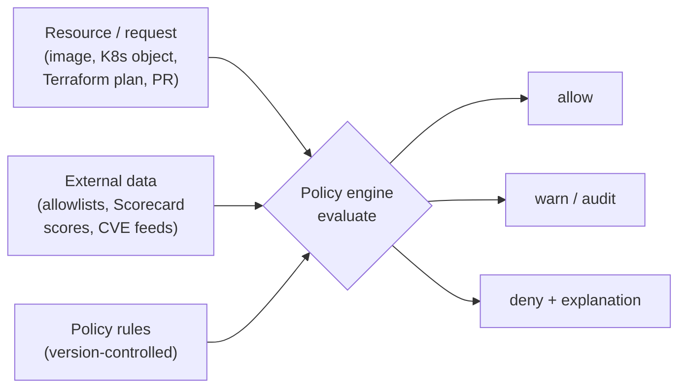
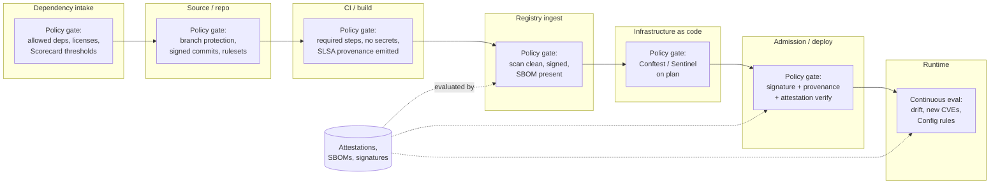
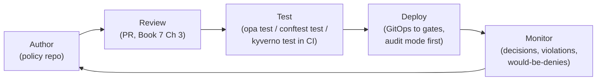
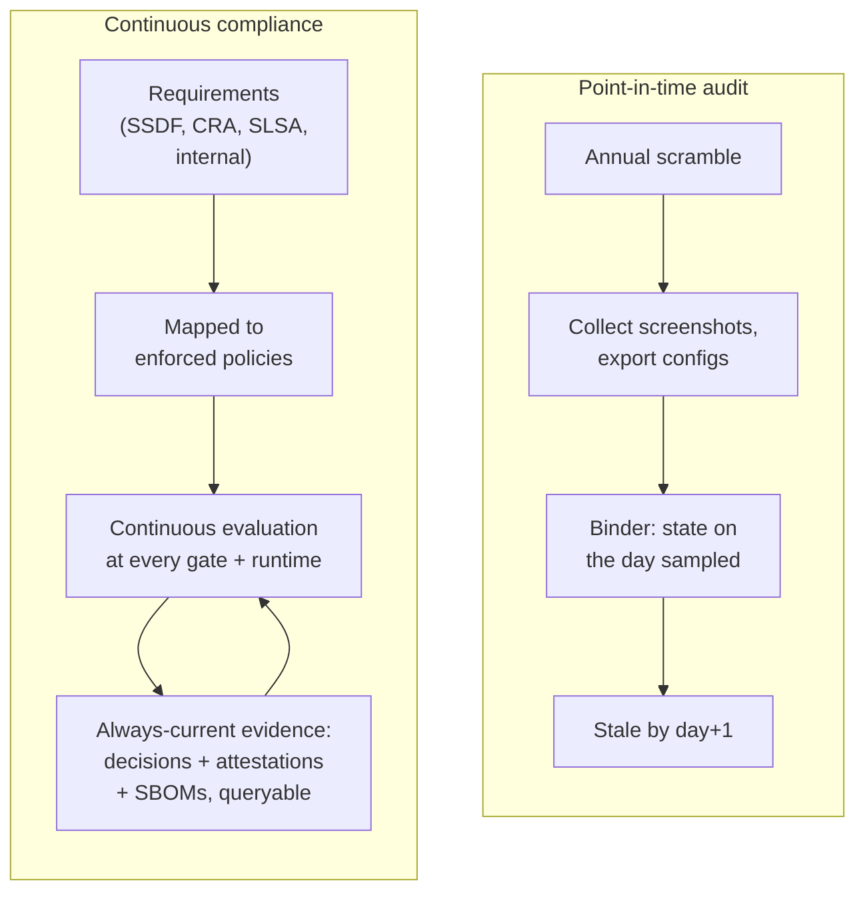
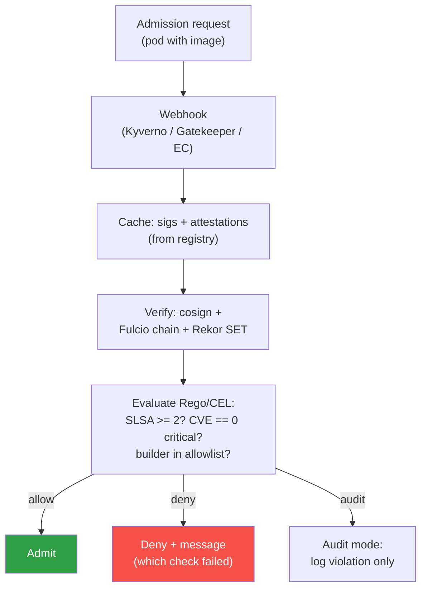
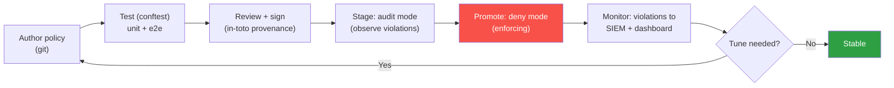
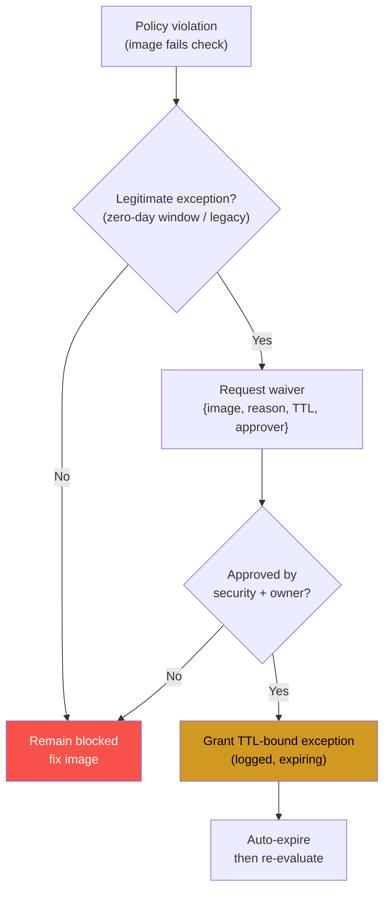

# Chapter 4 — Policy as Code and Continuous Compliance

*What this chapter covers.* Every technical book in this suite ends the same way: a control that
only counts if something *enforces* it. Book 2, Chapter 10 built dependency intake policy;
Book 4 built required-step and SLSA gates; Book 5, Chapter 10 built attestation-based deployment
gates; Book 6, Chapter 6 built admission control; Book 6, Chapter 8 built IaC policy; Book 7,
Chapter 8 built org-wide repository policy. Each of those is a specific instance of one idea. This
chapter is the idea itself: **expressing supply-chain requirements as machine-readable,
version-controlled, testable code, and enforcing them continuously across a fleet.** It is the
meta-treatment — the connective tissue that turns the individual gates of Books 2 through 7 into a
single governance system, and turns the regulatory obligations of Chapter 1 and the frameworks of
Chapter 2 from documents into a continuously-verified running state. A wiki page that says "sign
your images" changes nothing. A policy engine that rejects unsigned images changes everything. This
chapter is about the difference.

We will do four things. First, argue precisely *why* policy must be code, not prose. Second, map
the actual landscape — OPA/Rego, CEL, Kyverno, Sentinel, Conftest, and the domain-specific engines
— accurately and comparatively, so you know which tool fits which gate. Third, treat policy as
software: authoring, review, testing, warn-then-enforce rollout, exceptions-as-code, and the
developer-experience discipline that decides whether a policy is obeyed or circumvented. Fourth,
connect it to the payoff the whole book is building toward — **continuous compliance**: replacing
the point-in-time audit scramble with an always-current, queryable compliance state built from the
attestations, SBOMs, and policy decisions the rest of the suite already produces.

Learning goals — after this chapter you should be able to:

- Explain why manual/document policy does not scale or enforce, and what properties (consistency,
  auditability, testability, automation) policy-as-code buys.
- Distinguish the major policy engines — **OPA/Rego**, **CEL**, **Kyverno**, **Sentinel**,
  **Conftest** — by language model, domain, and enforcement point, and choose correctly.
- Map the **supply-chain enforcement points** across the lifecycle (intake → source → build →
  registry → IaC → admission → runtime) and recognize each as policy-as-code over the
  artifacts and attestations flowing through.
- Run the **policy lifecycle** as a software lifecycle: author, review, unit-test (`opa test`,
  `conftest test`, `kyverno test`), deploy, monitor — with warn-then-enforce and
  exceptions-as-code.
- Describe **continuous compliance** and **compliance-as-code**: mapping requirements (SSDF, CRA,
  SLSA levels) to enforced policies plus collected evidence, and the role of **OSCAL** as a
  machine-readable control layer.
- Reason about **governance of policy itself**: who owns it, how it is distributed across a fleet
  via GitOps, versioned, and rolled out, and where central mandate ends and team flexibility begins.

## Why policy must be code

Start with the failure mode, because it is the reason the discipline exists. A large organization
adopts a security standard. Someone writes it down: a Confluence page, a Google Doc, a PDF titled
*Secure Software Development Standard v3.2*. It says the right things — container images must be
signed and scanned; production dependencies must come through the internal registry; Terraform
must not create public S3 buckets; base images must be from the approved set. It is reviewed,
approved, socialized in an all-hands. And then nothing measurable changes, because a document has
no *enforcement surface*. It cannot reject a request. It relies entirely on every engineer, on
every change, remembering it, understanding it identically, and choosing to comply — and on
reviewers catching the cases where they don't. At a fleet of hundreds of services and thousands of
changes a week, that reliance is a fiction. The document describes a desired state; it does nothing
to *produce* that state.

Prose policy fails on four independent axes, and it is worth naming each because policy-as-code is
precisely the inversion of each failure.

**It does not scale.** A human gatekeeper — a security-review board, a change-approval meeting — is
a serialization point. Every change that needs review queues behind the reviewer's attention. Add
services and deploys and the queue grows without bound; the organization's response is invariably
to review *less* (spot checks, sampling) precisely as the surface grows, which is the opposite of
what security requires. Book 2, Chapter 10 made this point about dependency review and Book 7,
Chapter 3 about code review: humans are the wrong tool for uniform, high-frequency, mechanical
checks. Code is not a serialization point. A policy engine evaluates a thousand admission requests
a second with identical rigor at three in the morning.

**It drifts.** Two teams read the same document and implement it differently, or the document is
copied into a per-team runbook and the copies diverge, or the standard is updated and half the org
never re-reads it. Book 7, Chapter 8 called this configuration drift and made the case that the only
durable fix is *one* source of truth mechanically applied everywhere. Prose has as many
interpretations as readers.

**It is not auditable in the way that matters.** "We have a policy that requires X" is a claim about
intent. An auditor — internal, external, or the CISA attestation form of Chapter 1 — wants evidence
that X was *enforced*, on every artifact, with a record. A document produces no such record. It
cannot answer "show me every deployment in the last quarter that violated the signing requirement
and what happened to it," because prose does not generate decisions and decisions are the audit
trail.

**It is not testable.** You cannot unit-test a paragraph. You cannot ask a Word document "does this
correctly reject a Terraform plan that opens port 22 to 0.0.0.0/0 but allow one that scopes it to
the bastion CIDR?" and get a pass/fail. Untested policy — whether prose or, worse, sprawling
imperative glue code — is policy whose behavior nobody actually knows.

Policy as code is the inversion: rules expressed in a machine-readable language, stored in version
control, reviewed like code, unit-tested like code, and evaluated automatically at the point of
decision. It converts "we require X" into "X is structurally impossible to violate" — or, at
minimum, "a violation of X is automatically detected and recorded." The through-line of this entire
suite is exactly this move: **define policy once, enforce everywhere, automatically.** Books 2
through 7 each built one enforcement point. This chapter is the recognition that they are the same
mechanism wearing different clothes, and that treating them as one system — one authoring model, one
review discipline, one evidence corpus — is what makes governance *real* rather than aspirational.

The four properties that buys, stated as benefits rather than as the absence of failures:

- **Consistency.** The same policy, mechanically applied, produces the same decision on every
  artifact in every cluster and every repo. No drift, because there is one artifact and it is the
  policy (Book 7, Chapter 8).
- **Auditability.** Policy lives in git — every rule change is a reviewed, attributed, timestamped
  commit (Book 7, Chapter 3) — and every *decision* the engine makes is a logged event. The policy
  and its decisions are together an audit trail you can query.
- **Testability.** Policy is unit-tested before it is deployed. You know its behavior on the cases
  you care about because you asserted them.
- **Automation.** No human gatekeeper in the hot path. The engine decides; humans handle exceptions
  and author the next version. The bottleneck is gone.

## The policy-as-code landscape

There is no single policy engine, and there should not be. Different enforcement points have
different data shapes, latency budgets, and operators, and the ecosystem has produced a handful of
engines that fit different niches. What matters is understanding each one's *model* well enough to
place it correctly. The unifying abstraction underneath all of them is simple, and worth stating
before the specifics.



Every engine below is a specialization of this picture: it takes the thing being decided (a
resource or request), optionally some external data (an allowlist, a set of Scorecard thresholds, a
vulnerability feed), and a set of declarative rules, and produces a decision — allow, warn, or deny
— ideally with a human-readable explanation attached. Keep this model in mind; the differences are
in the language, the data model, and where the engine runs.

### OPA and Rego

**Open Policy Agent (OPA)** is the general-purpose policy engine of the cloud-native world, and its
language **Rego** is the closest thing the space has to a lingua franca. Book 6, Chapter 6 covered
its use for Kubernetes admission (via **Gatekeeper**); Book 6, Chapter 8 covered its use for IaC and
arbitrary config (via **Conftest**). Its reach is much wider than either: OPA is a standalone
decision engine that answers the question "given this JSON input and this data, is it allowed?" and
it is embedded in API authorization, CI gates, database access, Envoy/service-mesh authz, and
custom applications. The model is exactly the picture above: OPA loads **policy** (Rego modules) and
**data** (arbitrary JSON documents — allowlists, org charts, threshold tables), receives an
**input** document, evaluates a **query**, and returns a decision. Policy and data are separate on
purpose: the same rule (`deny unless the base image is in the approved set`) reads the approved set
from data, so you update the allowlist without touching the logic.

Rego is a declarative, query-based language descended from Datalog. It is not imperative; you
declare what *is* true, and rules that produce values (like a `deny` set) accumulate. A rule
contributes to `deny` when its body holds:

```rego
package supplychain.images

# Deny any container whose image is not signed by our release identity.
# `input` is the admission review; `data.trusted_signers` comes from
# external data, so the trust anchor is updated without editing logic.

deny contains msg if {
    some container in input.review.object.spec.containers
    not signed_by_trusted_identity(container.image)
    msg := sprintf(
        "image %q is not signed by an approved release identity; see go/signing",
        [container.image],
    )
}

signed_by_trusted_identity(image) if {
    att := data.attestations[image]
    att.signer_identity in data.trusted_signers
    att.verified == true
}
```

Two things to notice. First, the failure carries an *explanation with a runbook link* — we return
to why that matters. Second, the policy references `data.attestations` and `data.trusted_signers`:
the artifact facts (who signed what) come from upstream — the Sigstore verification of Book 5,
Chapters 3 and 8 — and the policy is pure logic over those facts. Rego's strength is exactly this
generality: any decision expressible as "JSON in, allow/deny out" fits, which is why one language
spans admission, CI, IaC, and authz. Its weakness is a learning curve — the Datalog evaluation model
and non-obvious semantics around negation and unification trip up newcomers — and that for the
*specific* case of Kubernetes admission, more specialized tools are often easier.

### CEL and Kubernetes ValidatingAdmissionPolicy

**CEL — Common Expression Language** — is a small, non-Turing-complete expression language
originally from Google, designed to be embedded, safe to evaluate on untrusted input, and cheap. It
is not a general policy *system* like OPA; it is an expression evaluator that a host system embeds to
let users write boolean/attribute predicates. Its rise in this space is driven by Kubernetes: as of
v1.30 (GA) Kubernetes ships **ValidatingAdmissionPolicy (VAP)**, an *in-tree* admission mechanism
that evaluates CEL expressions against admission requests — no external webhook, no separately
operated engine. Book 6, Chapter 6 introduced this as the native alternative to a Gatekeeper/Kyverno
webhook. The appeal is operational: an admission webhook is a network hop in the critical path of
every API write, a service you must run HA or risk wedging the cluster; VAP runs inside the API
server, so it has no availability tail and no webhook to secure.

```yaml
apiVersion: admissionregistration.k8s.io/v1
kind: ValidatingAdmissionPolicy
metadata:
  name: require-non-root
spec:
  matchConstraints:
    resourceRules:
      - apiGroups: ["apps"]
        apiVersions: ["v1"]
        operations: ["CREATE", "UPDATE"]
        resources: ["deployments"]
  validations:
    - expression: >
        object.spec.template.spec.containers.all(c,
          has(c.securityContext) &&
          has(c.securityContext.runAsNonRoot) &&
          c.securityContext.runAsNonRoot == true)
      message: "all containers must set securityContext.runAsNonRoot: true"
      reason: Forbidden
```

CEL is deliberately limited. It has no loops beyond bounded macros (`all`, `exists`, `map`,
`filter`), no I/O, no way to call out to external data mid-evaluation, and guaranteed termination —
which is exactly what you want running *inside* the API server on the hot path. That limitation is
also its ceiling: policies needing external data (is this image's digest in our signed set?),
cross-resource lookups, or complex generation are awkward or impossible in raw VAP, and you fall
back to OPA or Kyverno. CEL now appears well beyond admission — CRD validation rules, autoscaling,
and increasingly as the embedded predicate language in other cloud-native tools — so it is worth
fluency independent of VAP.

### Kyverno

**Kyverno** is a Kubernetes-native policy engine whose distinguishing choice is that **policies are
themselves Kubernetes resources written in YAML** — no separate policy language to learn. Book 6,
Chapter 6 covered it alongside Gatekeeper. For a Kubernetes-shaped audience the ergonomics are
strong: policies are `kubectl apply`-ed, they show up as cluster objects with status, and the
match/validate/mutate/generate structure maps cleanly onto how Kubernetes users already think.
Beyond validation Kyverno can *mutate* (inject a default securityContext), *generate* (create a
NetworkPolicy per namespace), and — relevant to this suite — *verify images* natively, integrating
Sigstore/cosign verification (Book 6, Chapter 5) as a first-class policy type.

```yaml
apiVersion: kyverno.io/v1
kind: ClusterPolicy
metadata:
  name: verify-image-signatures
spec:
  validationFailureAction: Enforce   # start as Audit; flip to Enforce later
  rules:
    - name: check-signature
      match:
        any:
          - resources:
              kinds: ["Pod"]
      verifyImages:
        - imageReferences:
            - "registry.internal.example.com/*"
          attestors:
            - entries:
                - keyless:
                    subject: "https://github.com/example-org/*"
                    issuer: "https://token.actions.githubusercontent.com"
                    rekor:
                      url: "https://rekor.sigstore.dev"
```

That policy enforces, at admission, exactly the deployment gate of Book 5, Chapter 10: only images
signed keylessly (Book 5, Chapter 4) by a workflow in our GitHub org, with the signature logged in
Rekor (Book 5, Chapter 5), may run. Kyverno's cost relative to OPA is generality: it is Kubernetes-
only, and its YAML DSL, while approachable for common cases, becomes verbose and awkward for complex
conditional logic where Rego stays compact. The trade is deliberate — Kyverno optimizes the common
Kubernetes case; OPA optimizes the general case.

### Sentinel and cloud-native policy

**Sentinel** is HashiCorp's proprietary policy-as-code framework, embedded in Terraform Cloud/
Enterprise, Vault, Consul, and Nomad. Book 6, Chapter 8 covered its use gating Terraform runs: a
Sentinel policy evaluates the *plan* (and cost estimate, and prior state) before an `apply` is
allowed, letting you enforce "no public S3 buckets," "all resources tagged with an owner," "no
instance types outside the approved set" as a hard gate in the provisioning path. Its niche is that
it is *inside* the HashiCorp control plane, so it sees Terraform's rich plan representation
directly. It is imperative-ish (rules that must evaluate true) with enforcement levels —
`advisory`, `soft-mandatory` (overridable by an authorized human), `hard-mandatory` — baked into the
model, which is a clean built-in expression of warn-then-enforce.

The broader cloud category includes provider-native controls that are policy-as-code in substance
even when not called that: **AWS Service Control Policies (SCPs)** set organization-wide guardrails
that no IAM principal in an account can exceed (deny launching untagged resources, deny regions, deny
disabling CloudTrail); **AWS Config rules** (and Azure Policy, GCP Organization Policy) continuously
evaluate deployed resources against declarative rules and flag or remediate drift. These operate at
the cloud-account layer rather than the artifact layer, but they are the same pattern — declarative
rule, automatic evaluation, allow/deny/remediate — and a complete supply-chain program uses them
alongside the artifact engines.

### Domain-specific engines

Several tools apply a general engine to a specific job:

- **Conftest** (Book 6, Chapter 8) runs Rego against *arbitrary structured config* — Kubernetes
  manifests, Terraform HCL/plan JSON, Dockerfiles, CI YAML, any JSON/YAML/TOML/HCL. It is OPA's
  language pointed at files in CI rather than at an API server. It is how you shift admission-style
  checks left into the pull request.
- **cosign / policy-controller** (Book 5, Chapter 10; Book 6, Chapter 5) — Sigstore's
  `policy-controller` is an admission controller specialized for signature and attestation
  verification, expressing "which identities may sign what, and which attestations must be present"
  as its policy.
- **Allstar** (Book 7, Chapter 8) enforces *repository* security settings across a GitHub org as
  policy — branch protection present, no binary artifacts, no outside collaborators on admin — and
  files issues or reverts drift. It is policy-as-code for source configuration.
- **CI-native checks** — `osv-scanner`, Scorecard thresholds (Book 2, Chapter 10), and required
  status checks — are policy enforced at the pipeline layer.

The common shape across every one of these is the picture from the start of the section: a resource
or request, plus data, plus declarative rules, evaluated to allow/warn/deny with an explanation. The
strategic point for the rest of the chapter is that the *same requirement* — "artifacts must be
signed by an approved identity" — can be expressed at multiple gates in whichever engine fits that
gate, all reading the same upstream attestations. Here is how the engines line up:

| Engine | Language / model | Primary domain | Where used in this suite |
|---|---|---|---|
| OPA / Rego | Declarative, Datalog-descended; data + query → decision | General-purpose | K8s admission (Gatekeeper), IaC/config (Conftest), CI gates, API authz — Book 6 Ch 6, Ch 8 |
| CEL / VAP | Embedded expression language, non-Turing-complete | K8s admission (in-tree), CRD validation | ValidatingAdmissionPolicy — Book 6 Ch 6 |
| Kyverno | YAML-as-K8s-resource; validate/mutate/generate/verifyImages | Kubernetes only | Admission, image signature verification — Book 6 Ch 5, Ch 6 |
| Sentinel | Proprietary, enforcement levels built in | HashiCorp stack (Terraform/Vault) | IaC/provisioning gates — Book 6 Ch 8 |
| Conftest | Rego over arbitrary config files | Config/IaC in CI (shift-left) | PR-time policy on manifests/HCL — Book 6 Ch 8 |
| cosign policy-controller | Sigstore-specific signature/attestation policy | K8s admission, verification | Deployment gates — Book 5 Ch 10, Book 6 Ch 5 |
| Allstar | GitHub-settings policy, org-wide | Source/repo configuration | Repo integrity at scale — Book 7 Ch 8 |
| Cloud-native (SCP/Config/Azure Policy) | Provider declarative rules | Cloud account/resource layer | Account guardrails, drift detection |

Choosing is mostly mechanical. Admission with only in-request data and a tolerance for the
limitation: **VAP/CEL** (no webhook to run). Admission needing image verification, mutation, or
generation, from a Kubernetes-native team: **Kyverno**. Admission or general decisions needing rich
external data and complex logic, or reuse of the *same* policy across CI and cluster: **OPA/Rego**
(with **Conftest** for the CI/file side). Terraform in the HashiCorp control plane: **Sentinel**.
Source configuration: **Allstar**. In practice a mature org runs several — the goal is not one
engine but one *discipline* (authoring, review, testing, evidence) across whichever engines the
gates require.

## Where supply-chain policy is enforced

Now assemble the suite. Supply-chain security is a lifecycle, and policy-as-code sits at *every
transition* in that lifecycle as a gate that evaluates the artifacts and attestations flowing
through. The individual gates were built book by book; seen together they are a defense in depth
where each stage's policy assumes the previous stage enforced its own.



Walk the gates:

**Dependency intake (Book 2, Chapter 10).** The first gate. Before a dependency enters the build,
policy decides whether it is allowed: is it on the allowlist or off the denylist, is its license
acceptable, does its OpenSSF **Scorecard** meet the threshold, is the version resolvable to a pinned
hash? Enforced at the internal registry/proxy (Book 2, Chapter 8) and in CI. This is policy-as-code
over package metadata and Scorecard data.

**Source / repo (Book 7, Chapter 8).** Policy over *repository configuration*: branch protection and
required reviews present (Book 7, Chapter 3), commit signing enforced (Book 7, Chapter 2), GitHub
rulesets applied org-wide, no force-push to protected branches. Enforced by **Allstar** and org
rulesets — policy-as-code whose subject is the SCM's settings rather than an artifact.

**CI / build (Book 4).** Policy over the *pipeline*: required steps ran (scan, test, sign), no
secrets in the environment or output (Book 4, Chapter 6), the build was hermetic enough to earn its
SLSA level, and **SLSA provenance** (Book 4, Chapter 3) was emitted. Enforced as required status
checks and in-pipeline policy.

**Registry ingest (Book 6, Chapters 2 and 4).** The chokepoint where a built image tries to become a
deployable artifact: policy requires a clean scan (Book 6, Chapter 4), a valid signature, and a
present SBOM before the image is admitted to the trusted registry or promoted.

**IaC (Book 6, Chapter 8).** Policy over the *plan*: **Conftest** (Rego) in the PR and/or
**Sentinel** in the Terraform run reject public buckets, missing tags, over-broad security groups,
unencrypted volumes — before any resource exists.

**Admission / deploy (Book 5, Chapter 10; Book 6, Chapters 5–6).** The last technical gate before
running: verify the image's **signature**, its **provenance** meets the required SLSA level, and the
required **attestations** (Book 5, Chapter 6) are present and trusted — via Kyverno, policy-
controller, Gatekeeper, or VAP. This is the gate that makes all the upstream signing worth anything,
because it is where a missing or bad signature actually stops a deploy.

**Runtime (this book, Chapter 5; cloud Config rules).** Policy does not stop at admission. Config
rules and continuous evaluation re-check the *running* fleet against policy as the world changes — a
new CVE lands against an image already admitted, a resource drifts out of compliance, a namespace
loses its NetworkPolicy — feeding the detection work of Chapter 5.

The unifying idea, and the reason this chapter exists: **one policy framework can express the
requirement at every gate, evaluated against the same attestations flowing through.** "Must be
signed by our release identity" is a Scorecard-style intake check, a registry-ingest check, a
Kyverno `verifyImages` at admission, and a runtime re-verification — the *same requirement*, the
*same trust anchor* (Book 5's Sigstore identities), enforced repeatedly so that a gap at one gate is
caught at the next. The attestations and SBOMs produced upstream (Books 3 and 5) are not paperwork;
they are the *data the policy evaluates*. Here is the mapping made explicit:

| Enforcement point | Example policy | Engine | Book |
|---|---|---|---|
| Dependency intake | Scorecard score ≥ threshold; license in allowlist | OPA/Conftest, registry proxy | Book 2 Ch 10 |
| Source/repo | Branch protection + signed commits required | Allstar, rulesets | Book 7 Ch 8 |
| CI/build | SLSA provenance emitted; no secrets in logs | CI checks, Conftest | Book 4 Ch 3, Ch 6 |
| Registry ingest | No critical CVEs; image signed; SBOM present | Registry policy, cosign | Book 6 Ch 2, Ch 4 |
| IaC | No public S3; owner tag present; encryption on | Conftest / Sentinel | Book 6 Ch 8 |
| Admission/deploy | Signature + provenance + attestation verified | Kyverno / policy-controller / VAP | Book 5 Ch 10, Book 6 Ch 5–6 |
| Runtime | New-CVE re-scan; config drift | Config rules, continuous eval | This book, Ch 5 |

## Writing good policy: policy as software

The hard-won lesson of the whole discipline is that **policy is software and must be treated as
software.** The organizations that succeed do not treat policy as a config file someone edits in the
cluster; they treat it as a codebase with a repository, review, tests, CI, versioning, staged
rollout, and observability. The ones that fail write a policy directly in production, break every
deploy in the fleet at once, roll it back in a panic, and never trust automated policy again. The
lifecycle:



**Author in a repo.** Policy lives in version control — its own repository or a well-defined
directory — not typed into a cluster. Every rule is a file. This is the precondition for everything
else: review, testing, history, distribution.

**Review like code (Book 7, Chapter 3).** A policy change is a pull request, reviewed by the policy
owners, with the same protections as application code — required review, protected branch, signed
commits. A policy is a high-blast-radius change (it can break every deploy), so if anything it
warrants *stronger* review than average code: two-person rule, mandatory owner approval.

**Test like software.** This is the practice most often skipped and most valuable. Every major engine
ships a unit-test harness, and you write tests that assert the policy's decision on known inputs —
both the cases it must *deny* and, critically, the cases it must *allow* (a policy that denies
everything passes no useful test). OPA's is `opa test`:

```rego
package supplychain.images_test

import data.supplychain.images

test_denies_unsigned_image if {
    result := images.deny with input as {
        "review": {"object": {"spec": {"containers": [
            {"image": "registry.internal.example.com/app@sha256:abc"},
        ]}}},
    } with data.attestations as {}
    count(result) == 1
}

test_allows_signed_image if {
    result := images.deny with input as {
        "review": {"object": {"spec": {"containers": [
            {"image": "registry.internal.example.com/app@sha256:def"},
        ]}}},
    }
    with data.attestations as {
        "registry.internal.example.com/app@sha256:def": {
            "signer_identity": "https://github.com/example-org/app/.github/workflows/release.yml@refs/heads/main",
            "verified": true,
        },
    }
    with data.trusted_signers as [
        "https://github.com/example-org/app/.github/workflows/release.yml@refs/heads/main",
    ]
    count(result) == 0
}
```

Run `opa test .` in CI on every policy PR and the pull request cannot merge unless the policy still
denies what it must and allows what it must. **Conftest** has `conftest test` and `conftest verify`
(the latter runs Rego test rules against fixtures); **Kyverno** has `kyverno test`, which runs a
policy against resource manifests and asserts pass/fail/skip per resource in a test YAML. The point
is uniform: policies get a test suite, the suite runs in CI, and a policy change that breaks an
asserted case is blocked before it reaches a single cluster. Testing policy is what lets you evolve
it at fleet scale without fear.

**Deploy via GitOps, in audit mode first.** Merged policy is distributed to the enforcement points by
the same GitOps mechanism that ships everything else (Book 6, Chapter 7) — the policy repo is a
source of truth Argo CD/Flux reconcile into every cluster, or Allstar reconciles into every repo.
And the deploy is *staged*, which brings us to the single most important operational discipline in
policy-as-code.

### Warn before you enforce

This suite has hammered the point in Book 1, Chapter 10, Book 5, Chapter 10, and Book 6, Chapter 6,
and it is worth the repetition because it is the difference between a policy program that survives
and one that gets switched off after its first outage: **never turn a new policy straight to
enforce.** Deploy it in **audit/warn/dry-run** mode first, where it evaluates every request and
*records* what it *would* have denied but allows the request through. Then measure. Every engine has
this switch by design: Kyverno's `validationFailureAction: Audit` versus `Enforce`, Gatekeeper's
`enforcementAction: dryrun` versus `deny`, Sentinel's `advisory`/`soft-mandatory`/`hard-mandatory`,
VAP's `validationActions` including `Audit` and `Warn` alongside `Deny`.

The measurement is the whole point. A policy that looks correct will, on real fleet traffic, surface
violations you did not anticipate — legacy workloads, a team you did not know existed, an edge case
the tests missed. If you had gone straight to enforce, every one of those is a production incident
and a page. In audit mode, each is a data point: a would-be-violation you can quantify ("this policy
would currently deny 340 of 5,000 running pods across 40 namespaces"), triage, and drive to zero —
by fixing the workloads, by adding scoped exceptions, or by discovering the policy is wrong — *before*
you flip the switch. Only when the would-be-violation rate is at or near zero, and the residue is
covered by explicit exceptions, do you move to enforce. This is not timidity; it is how you deploy a
fleet-wide gate without a fleet-wide outage, and it is the operational expression of the "enable
before you mandate" thesis of Chapter 2.

### Exceptions as code

No policy fits every case on day one, and a policy with no exception mechanism is a policy teams
route around — they find the unmanaged cluster, the pipeline without the check, the emergency
override that becomes permanent. The mature move is to make exceptions **first-class, code, and
expiring**, not tribal knowledge and permanent holes. Kyverno provides a **PolicyException** CRD;
OPA/Gatekeeper support exemptions via labels or data; every good policy framework has some form. The
properties that separate a governed exception from a hole:

- **Documented and attributed.** The exception is an object in version control with an owner and a
  stated reason, reviewed like any other policy change — not an out-of-band cluster edit.
- **Scoped.** It exempts a specific workload/namespace/resource from a specific rule, not everything
  from everything.
- **Expiring.** It carries an expiry, after which it lapses and the policy re-applies. A permanent
  exception is a silent policy weakening; an expiring one forces a re-decision. Even where the engine
  does not enforce expiry natively, the policy repo can — a CI check that fails the build when an
  exception's `expires` date has passed.

```yaml
apiVersion: kyverno.io/v2
kind: PolicyException
metadata:
  name: legacy-billing-runasroot
  namespace: billing
  annotations:
    owner: "team-billing@example.com"
    reason: "vendor image requires root; tracked in JIRA SEC-4821"
    expires: "2026-10-01"   # enforced by a CI check in the policy repo
spec:
  exceptions:
    - policyName: require-non-root
      ruleNames: ["check-runasnonroot"]
  match:
    any:
      - resources:
          kinds: ["Pod"]
          namespaces: ["billing"]
          names: ["legacy-billing-*"]
```

Exceptions-as-code turns "we have a policy but half the fleet is exempt via cluster edits nobody
tracks" into "we have a policy and here are the 12 reviewed, owned, expiring exceptions, queryable
in git." The exception list is itself compliance evidence.

### Explanations, or developer experience is a security control

A cryptic denial is a security *liability*, not an asset, because it drives circumvention. An
engineer whose deploy is rejected by `admission webhook denied the request` with no reason does not
conclude "I must be violating a security policy and should investigate." They conclude "the platform
is broken," and they file a ticket, or find the escape hatch, or pressure someone into an exception —
all of which erode the policy. The `deny` messages in the Rego and Kyverno examples above are not
decoration; they are the mechanism by which the policy *teaches* the developer what to do:

```text
Error from server: admission webhook denied the request:
  image "registry.internal.example.com/app:latest" is not signed by an
  approved release identity. Sign it in your release workflow (see
  go/signing) or, if this is an approved exception, request one at
  go/policy-exception. Policy: require-image-signatures (v4).
```

Good policy explanations say three things: **what** rule failed, **why** (in the developer's terms,
not the engine's), and **how to fix it** — the runbook link, the exception path. This is not soft;
it is what determines whether the policy is a paved road engineers stay on or a wall they climb over.
The developer-experience discipline of Book 7, Chapter 8 — guardrails that guide rather than gates
that merely block — applies directly: a policy that only says *no* invites circumvention; a policy
that says *no, and here is yes* is obeyed.

## Continuous compliance: the payoff

Everything so far — the engines, the gates, the lifecycle — pays off in a single shift that this
book has been building toward since Chapter 1: **from point-in-time audit to continuous compliance.**

The traditional model is the periodic audit. Once a year (or before a customer's security review, or
ahead of a certification), the organization scrambles: someone collects screenshots, exports
configs, interviews teams, assembles a binder proving the controls were in place *on the day the
auditor looked*. It is expensive, it is disruptive, and — the part that matters — it proves almost
nothing about the other 364 days. Compliance in this model is a *performance* staged for an auditor,
and the gap between the audit-day state and the everyday state is exactly where breaches live.

Policy-as-code inverts it. If every control is a policy continuously evaluated against every artifact
and every running resource, then the compliance state is not something you *reconstruct* once a year
— it is something the system *knows* at every instant, because the enforcement *is* the evidence.
"Are all production images signed?" is not a question you answer by sampling; it is a query against
the admission decisions your policy engine already made and logged. "Do all repos have branch
protection?" is Allstar's continuously-reconciled state. The audit stops being a scramble and becomes
a *query*.



### Compliance-as-code and the mapping

The mechanism that makes this work is the **mapping** introduced in Chapter 1: regulation →
framework → technical control → evidence. Compliance-as-code is that mapping made *machine-readable*
and *live*. Each requirement — an SSDF practice (PS.1, PW.4, PW.6…), a CRA obligation, an SLSA level
threshold, an internal standard — is bound to the concrete policy that enforces it and the evidence
that policy produces. "SSDF PW.6: configure the build process to produce provenance" maps to the
SLSA-provenance policy at the CI gate (Book 4, Chapter 3) and the provenance-verification policy at
admission (Book 5, Chapter 8), whose enforcement decisions and the provenance attestations
themselves are the evidence. Compliance becomes a *derived, queryable state* over the evidence corpus
rather than a document asserting intent.

The evidence corpus is exactly the output of the rest of this suite, now doing double duty:

- **Policy decisions** — every allow/warn/deny the engines logged, the record that controls were
  enforced.
- **Attestations** (Book 5, Chapter 6) — provenance, SBOM attestations, test/scan attestations,
  cryptographically bound to artifacts.
- **SBOMs** (Book 3) — the component inventory, queryable for "are we exposed to CVE-X across the
  fleet."

These were produced for their own sakes — provenance for tamper-evidence, SBOMs for vulnerability
response — and it turns out they are *also* the audit trail. That is the deep economy of the approach
and the thesis of Chapter 1 restated: done right, **compliance is a byproduct of the technical work,
not a separate workstream.** You do not build evidence for the auditor; you enforce controls as code,
and the evidence falls out.

### OSCAL: machine-readable compliance

The missing piece has historically been that the *control* layer — the frameworks, the mappings, the
assessment results — lived in prose and spreadsheets even when the enforcement was code. **OSCAL —
the Open Security Controls Assessment Language**, a NIST project — closes that gap. OSCAL is a set of
standardized, machine-readable formats (available as XML, JSON, and YAML) for expressing the things
that used to be documents: control catalogs (e.g., NIST SP 800-53), profiles/baselines (a tailored
selection of controls), system security plans, component definitions, assessment plans, and
assessment results.

The relevance to this chapter is the bridge OSCAL builds. An OSCAL **component definition** can state
how a given component satisfies a set of controls; an OSCAL **assessment results** document can carry
the machine-readable findings of evaluating those controls. In a compliance-as-code pipeline, your
policy engines produce decisions, your build produces attestations, and a tool maps those into OSCAL
assessment results keyed to the control catalog — so "are we compliant with this baseline" becomes a
structured, tool-processable artifact rather than a binder. OSCAL does not enforce anything; it is the
*lingua franca* for the control-and-evidence layer, letting the machine-readable enforcement of your
policy engines connect to the machine-readable control frameworks of Chapter 2 without a human
retyping a spreadsheet in between. It is young and adoption is uneven — be honest that much of the
industry is still in spreadsheets — but it is the standard the continuous-compliance vision points
at, and where regulators and large buyers are heading.

The audit trail this produces — policy decisions plus attestations plus SBOMs, mapped to controls —
is also the raw material for the metrics and executive reporting of Chapter 8. Continuous compliance
and continuous *measurement* are the same corpus queried for different audiences.

## Governance of policy itself

A policy system is infrastructure, and like any shared infrastructure it needs an ownership and
distribution model, or it fragments. The final piece is the governance *of* the policy.

**Ownership.** Policy is typically authored and owned by a central platform-security team — the same
team that builds the paved roads of Books 3 through 6. Centralized ownership is what buys consistency:
one team, one review discipline, one test suite, one source of truth. But central *authorship* must
not mean central *bottleneck*; the whole point was to remove the human gatekeeper. The resolution is
that the central team owns the policy *code and the enforcement mechanism*, and teams interact with
it through pull requests (to propose changes or exceptions) and through the self-service exception
path — not through a review queue.

**Distribution — GitOps the policies.** At fleet scale, the policy in the repo must reach every
enforcement point, and drift between them is the failure to avoid (Book 7, Chapter 8). The mechanism
is GitOps (Book 6, Chapter 7): the policy repository is a source of truth that Argo CD or Flux
reconciles into every cluster, so all N clusters run byte-identical policy and a change lands
everywhere through one merged PR; Allstar reconciles repo policy into every repository; the same
model distributes Conftest policies to every pipeline. Multi-cluster and multi-repo policy
distribution is *exactly* a GitOps problem, and solving it that way gives you the consistency,
auditability, and rollback (revert the commit) that ad-hoc per-cluster editing never can.

**Versioning and rollout.** Policies are versioned like any code (the `Policy: require-image-
signatures (v4)` in the denial message is not cosmetic — it tells you which version denied, which
matters when a policy change causes an incident). Rollout is staged: audit → enforce, canary
namespaces or a canary set of repos before the whole fleet, and the ability to roll back by reverting
the commit and letting GitOps propagate the revert. A fleet-wide enforce flip is a production change
and gets production-change discipline.

**Central mandate versus team flexibility.** The genuine tension, and the one Book 7, Chapter 8 framed
as guardrails versus gates. Too much central mandate — every check a hard gate, no flexibility — and
teams are blocked constantly, route around the system, and resent it; the policy becomes an obstacle
rather than a road. Too little — everything advisory, everything overridable — and the policy enforces
nothing. The workable balance is a small set of **non-negotiable hard gates** where the risk is
existential and uniform (unsigned images do not run, secrets do not merge, public buckets do not
provision — the things where an exception is essentially never right), surrounded by a larger set of
**guardrails** that warn, guide, and default-secure but permit a reviewed, expiring exception. The
hard gates are few and load-bearing; the guardrails are many and forgiving. Which checks belong in
which tier is a genuine risk-management decision, not a technical one, and it is the central team's
core judgment call.

## Distributed-systems lens

Policy as code is *how governance scales to a fleet*, and every piece of this chapter is an answer to
a distributed-systems problem. A single service with a single owner does not need policy-as-code; a
diligent engineer suffices. The need appears at scale — hundreds of services, dozens of teams,
thousands of changes a week, many clusters, many repos — where no human process can uniformly enforce
anything and drift is the natural state of the system.

The architecture is: **central policy** — authored, reviewed, tested, versioned in one place —
**distributed to enforcement points** — admission across every cluster, CI across every repo, the
registry, IaC runs, dependency intake — where it **evaluates every artifact and every change against
requirements automatically**. That is a control plane. The policy repo is the desired state; GitOps
is the reconciliation loop; the enforcement points are the actuators; the audit log of decisions is
the observability. Book 7, Chapter 8's org-policy, Book 6, Chapter 6's admission, and Book 5, Chapter
10's deployment gates are not three separate things — they are three actuators of one control plane,
and seeing them that way is the entire contribution of this chapter.

The data the control plane acts on is the attestations and SBOMs produced upstream (Books 3 and 5).
This is why the ordering of the suite matters: you cannot enforce "signed by an approved identity" at
admission unless the build *produced* a verifiable signature; the policy is only as good as the
evidence it evaluates, and the evidence is manufactured by the technical books. Policy-as-code is the
*consumer* of everything the suite produces, and continuous compliance is the report it generates.

And the payoff is that the secure, compliant state is enforced *uniformly, without human gatekeepers*,
and *known continuously* rather than reconstructed annually. The audit scramble of Chapter 1's
regulatory regimes is replaced by an always-current, queryable evidence corpus, because the
enforcement and the evidence are the same events. GitOps'd policy, plus fleet-wide enforcement, plus
the collected evidence, is **governance as running infrastructure** — a system that maintains the
desired security posture the way a control plane maintains desired replica counts — rather than
governance as documents that describe a posture nobody continuously verifies. That is the difference
between a program that says it requires X and a program in which X is structurally true, and it is the
connective tissue that makes the enforcement of Books 2 through 7 add up to a governed whole.

### Policy engine architecture (Kubernetes example)



### Policy lifecycle: author to enforce



### Exception and waiver flow



## Key takeaways

- **Prose policy enforces nothing.** A document has no enforcement surface; it fails on scale, drift,
  auditability, and testability simultaneously. Policy-as-code inverts all four: consistent (one
  mechanically-applied artifact), auditable (policy in git + logged decisions), testable (unit tests),
  automated (no human in the hot path). The suite's through-line: define once, enforce everywhere,
  automatically.
- **Match the engine to the gate.** OPA/Rego for general-purpose and reused-across-CI-and-cluster
  logic; CEL/VAP for in-tree admission with no webhook; Kyverno for Kubernetes-native validate/mutate/
  verify-images; Sentinel for the HashiCorp/Terraform path; Conftest for shift-left config checks;
  Allstar for repo settings. The goal is one *discipline* across many engines, not one engine.
- **The same requirement is enforced at many gates** — intake, source, build, registry, IaC,
  admission, runtime — each reading the same upstream attestations and SBOMs. A gap at one gate is
  caught at the next; the attestations of Books 3 and 5 are the data policy evaluates.
- **Treat policy as software.** Author in a repo, review as a PR, unit-test (`opa test`, `conftest
  test`, `kyverno test`) in CI, distribute via GitOps, monitor decisions. A policy change is a
  high-blast-radius change and earns strong review and staged rollout.
- **Warn before you enforce, always.** Deploy in audit/dry-run, measure would-be-violations, drive
  them to near-zero with fixes and scoped exceptions, then flip to enforce. Going straight to enforce
  is a fleet-wide outage.
- **Exceptions are code: documented, scoped, expiring, reviewed** — never cluster edits and permanent
  holes. The exception list is itself evidence.
- **Explanations are a security control.** A cryptic deny drives circumvention. Good policy says what
  failed, why, and how to fix it, with a runbook link — guardrails that guide, not walls that merely
  block.
- **Continuous compliance replaces the audit scramble.** Because enforcement *is* the evidence, the
  compliance state is queryable at every instant, not reconstructed annually. Compliance-as-code maps
  requirements → policies → evidence; **OSCAL** is NIST's machine-readable format for the control-and-
  evidence layer. Compliance becomes a byproduct of the technical work, not a separate workstream.
- **Govern the policy itself.** Central authorship (platform-security) for consistency, GitOps
  distribution for fleet-wide uniformity, versioning and staged rollback, and a deliberate split
  between a few non-negotiable hard gates and many forgiving guardrails.

## Further reading

- **Open Policy Agent** documentation and the Rego language reference — https://www.openpolicyagent.org/docs/,
  including the policy-testing guide (`opa test`).
- **OPA Gatekeeper** — https://open-policy-agent.github.io/gatekeeper/ — constraint framework,
  audit mode, and mutation.
- **Common Expression Language (CEL)** specification — https://github.com/google/cel-spec — and
  Kubernetes **ValidatingAdmissionPolicy** documentation, https://kubernetes.io/docs/reference/access-authn-authz/validating-admission-policy/.
- **Kyverno** documentation — https://kyverno.io/docs/ — policy types, `verifyImages`,
  PolicyException, and the `kyverno test` command.
- **HashiCorp Sentinel** documentation — https://developer.hashicorp.com/sentinel — enforcement
  levels and Terraform integration.
- **Conftest** — https://www.conftest.dev/ — Rego over arbitrary configuration, `conftest test`
  and `conftest verify`.
- **Sigstore policy-controller** — https://docs.sigstore.dev/policy-controller/overview/ — and
  **cosign** verification policy.
- **OpenSSF Allstar** — https://github.com/ossf/allstar — organization-wide repository policy
  enforcement.
- **NIST OSCAL** — https://pages.nist.gov/OSCAL/ — the Open Security Controls Assessment Language:
  catalogs, profiles, component definitions, and assessment results.
- **NIST SP 800-218 (SSDF)** — https://csrc.nist.gov/pubs/sp/800/218/final — for the practice
  identifiers policies map to (revisited from Chapter 1).
- **AWS Service Control Policies** and **AWS Config** documentation — for the cloud-account layer of
  policy-as-code.
- Cross-references within this suite: Book 2, Chapter 10 (dependency policy); Book 4, Chapter 3
  (SLSA provenance); Book 5, Chapters 6, 8, 10 (in-toto, provenance verification, deployment gates);
  Book 6, Chapters 5–8 (image signing, admission, GitOps, IaC); Book 7, Chapters 3 and 8 (review,
  repository integrity at scale); and Book 8, Chapters 1, 2, and 8 (regulation, framework adoption,
  metrics and reporting).
