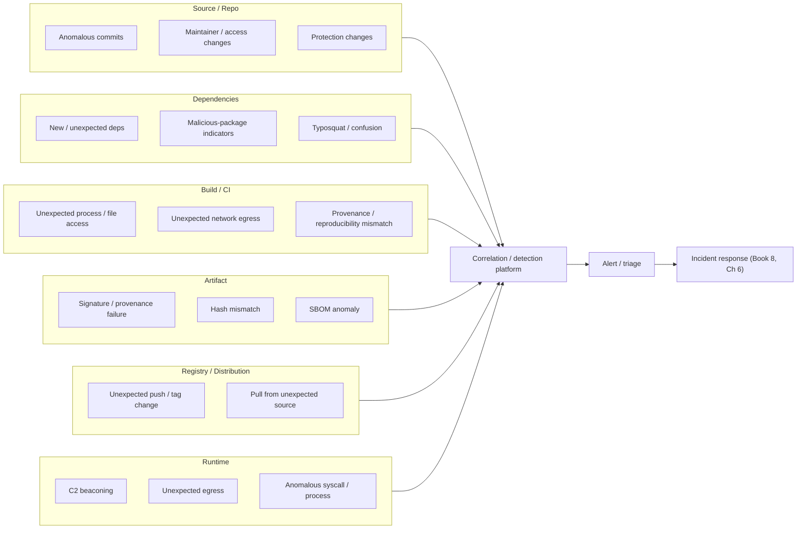
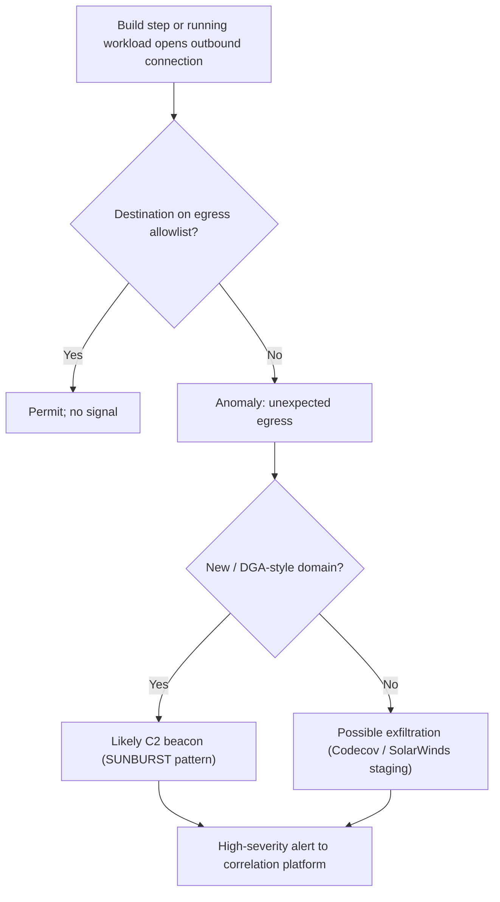
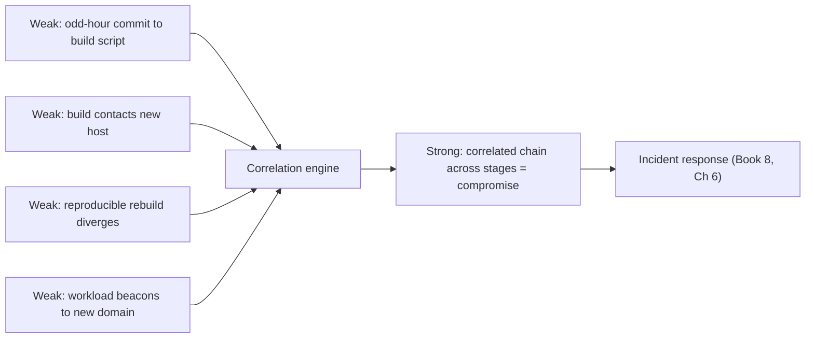
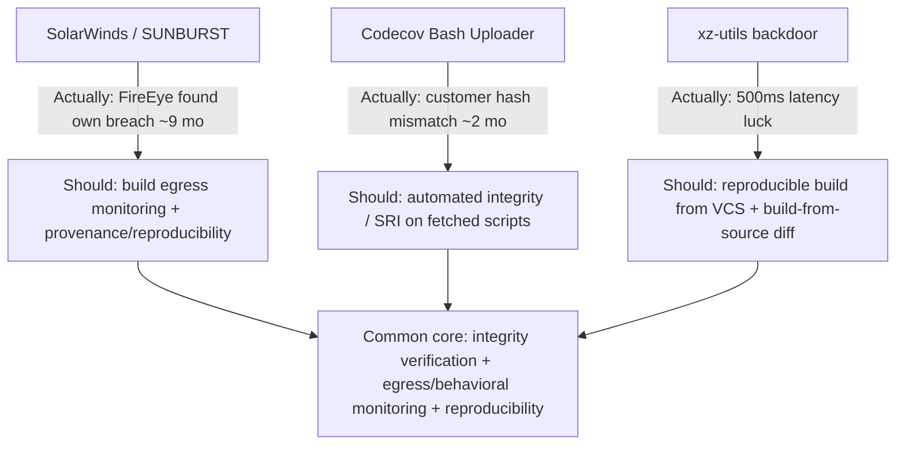
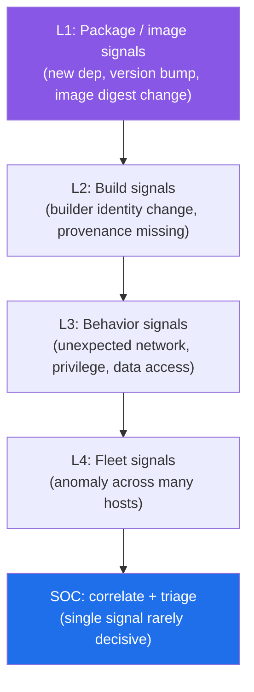
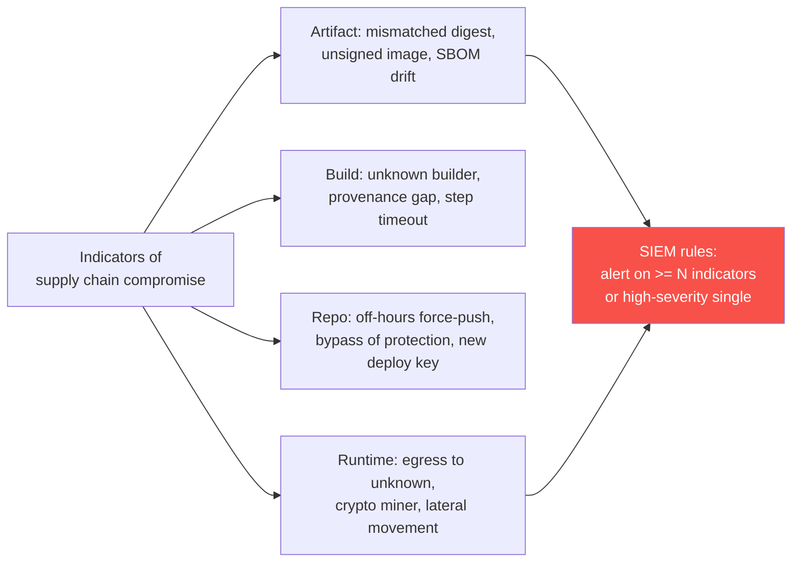
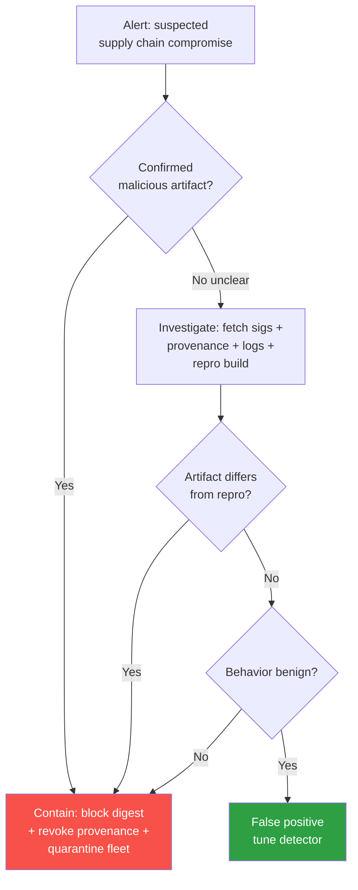

# Chapter 5 — Detecting Supply Chain Compromise

*What this chapter covers.* Books 2 through 7 built prevention: pinned dependencies, hardened
registries, isolated builds, signed provenance, admission gates, protected source. This chapter
starts from the uncomfortable premise that all of it will, somewhere, fail — because supply chain
attacks are *engineered* to defeat prevention. They do not break your controls; they inherit your
trust. A signed artifact is trusted because it is signed (Book 1, Chapter 3 — SolarWinds); a
maintainer's commit is trusted because it is the maintainer's (Book 1, Chapter 5 — xz-utils); a
valid credential is trusted because it is valid (Book 7, Chapter 6). When the malice arrives wearing
the costume of legitimate activity, the prevention layer waves it through. Detection is the second
layer, and historically it has been the weak one: SolarWinds ran roughly nine months in production
before Mandiant found it — while investigating *their own* breach, not SolarWinds'. Codecov ran two
months before a customer noticed a hash mismatch. The xz backdoor was caught by a single engineer
chasing a 500-millisecond latency regression. That is not a detection program. That is luck. This
chapter is about building the thing that should have caught them: a telemetry-and-correlation layer
that watches every stage of the software lifecycle, turns every integrity check into a tripwire, and
assumes breach because prevention against trust-abuse is never complete.

Learning goals — after this chapter you should be able to:

- Explain *why* supply chain attacks evade prevention (they abuse legitimate trust) and why that
  makes detection essential rather than optional — and be honest about how badly it has performed.
- Enumerate the detection signals available at each lifecycle stage — source, dependency, build,
  artifact, registry, runtime — and map each to a concrete technique and tool.
- Distinguish the four families of detection technique — integrity verification, anomaly/behavioral,
  signature/IOC, and malicious-code — and know where each is strong and where it is blind.
- Design a fleet-scale detection platform that aggregates signals across stages into a correlation
  engine, so that weak signals combine into strong ones and "am I affected?" becomes a query.
- Reconstruct what *actually* caught SolarWinds, Codecov, and xz — and what *should* have — and
  derive the small set of high-value detections that would have caught all three.
- Run assume-breach threat hunting against your own supply chain, and feed detections into incident
  response (Book 8, Chapter 6).

## Why detection is hard, and why it is essential

Prevention has a structural blind spot, and supply chain attackers live inside it. Every preventive
control rests on a trust anchor: this key is authorized to sign, this maintainer is authorized to
commit, this credential is authorized to pull. The controls enforce the *authorization*, not the
*intent*. A supply chain attack is precisely the case where the authorization is genuine and the
intent is malicious. SolarWinds' SUNBURST implant was compiled into `SolarWinds.Orion.Core.BusinessLayer.dll`
*inside SolarWinds' own build*, by the SUNSPOT implant sitting on the build server, and then signed
with SolarWinds' legitimate code-signing certificate (Book 1, Chapter 3). Every downstream
verification passed, because every downstream verification was checking the thing the attacker had
already satisfied: is this a validly signed SolarWinds binary? Yes. It was. That is the whole
problem. The xz backdoor was merged by "Jia Tan," a maintainer who had spent two years earning
commit rights and the co-maintainer role through patient, real contributions (Book 1, Chapter 5).
Branch protection, signed commits, review — the source controls of Book 7 — do not fire on a trusted
maintainer merging their own code. The trust anchor was the attack surface.

Because prevention is defeated by design, the only remaining defense is to *notice the effect* — the
anomalous commit, the unexpected build behavior, the hash that changed, the workload beaconing to a
domain it has never contacted. That is detection, and the historical record is grim.

**SolarWinds** was operational in customer environments from roughly February 2020, following a
build-system compromise that began with a dry-run injection in late 2019. It was discovered in
December 2020 — not by monitoring, not by any supply-chain control, but because FireEye/Mandiant
noticed that their own red-team tooling had been stolen, investigated *their* intrusion, and traced
it back to a trojanized Orion update. Roughly nine months of undetected operation across thousands of
organizations, including federal agencies, ended because the attacker got greedy with one
particularly capable victim. Absent that, it might have run indefinitely.

**Codecov's** Bash Uploader script was modified on 31 January 2021 — the attacker had extracted a
GCS credential from a Codecov Docker image and used it to alter the script served from Codecov's
CDN, adding a line that exfiltrated the environment (CI secrets, tokens, keys) of everyone who piped
the uploader into their build. It ran for roughly two months. It was found on 1 April 2021 because a
customer compared the `shasum` of the downloaded script against the checksum Codecov published on
GitHub and saw they did not match. A hash comparison. That is the entire detection.

**xz-utils** (CVE-2024-3094) hid a backdoor in `liblzma` in releases 5.6.0 and 5.6.1 (early 2024).
The payload was not in the readable git source; it was smuggled through two of the exact hiding spots
Book 7, Chapter 5 warns about — binary "test" fixtures in the test corpus, and an obfuscated stanza
in the build machinery (`build-to-host.m4`) that only ran when building from the *release tarball*,
extracting and injecting the payload during `./configure`. It was caught by Andres Freund, a Postgres
developer, who noticed SSH logins on a Debian testing box were about 500 ms slower than expected and
that Valgrind was complaining, and who had the curiosity and skill to chase it to ground before the
backdoored versions reached stable distributions.

The pattern across all three: months of dwell time, and discovery by accident or by a single check
that happened to run. The lesson is not that these victims were negligent — some were sophisticated.
The lesson is that **detection was an afterthought, and the few things that eventually worked were
integrity checks and behavioral anomalies that nobody had operationalized as continuous, fleet-wide
monitoring.** This chapter operationalizes them.

## What to detect, and where: signals across the lifecycle

Detection is not one control; it is a layer that spans the entire lifecycle, because compromise can
be injected at any stage and its effects surface at different stages than its injection. The xz
backdoor was *injected* at source/build and would have *activated* at runtime. SolarWinds was
injected at build and beaconed at runtime. Codecov was injected at distribution and exfiltrated at
build-time (in the victim's CI). A detection program that watches only one stage is a program that
watches for the last attack, not the next one. Here is the map.



### Source and repository signals

The source is where a trusted-maintainer or account-takeover attack begins, and the signals are
about *deviation from normal committer behavior*, because the commit itself is authorized (Book 7,
Chapter 6 — ATO and insider detection). Watch for **anomalous commits**: a maintainer who commits
from a new geography or at an unusual hour, a burst of activity after long dormancy, force-pushes to
release branches. Watch for **unexpected maintainer and access changes**: a new co-maintainer added
to a critical dependency (the xz pattern — "Jia Tan" was granted co-maintainer status shortly before
the backdoor landed), a collaborator added to a repo, a change in who can approve. Watch for
**protection changes** (Book 7, Chapter 8): branch protection weakened, required reviews reduced,
status checks removed — often a precursor to landing something that would otherwise be blocked. And
watch *where* commits land: the highest-signal source anomaly is a change to **test fixtures, build
scripts, or CI configuration** — the xz hiding spots. Legitimate feature work rarely touches
`m4/build-to-host.m4` or adds a 50 KB binary blob to the test corpus; those are exactly where an
attacker hides payload to keep it out of readable diffs and reviewer attention. Finally, **suspicious
dependency additions** in the commit stream — a new transitive dependency, a pinned hash changing to
a fork — is a source-side signal that overlaps the dependency stage.

### Dependency signals

The dependency stage is where you consume other people's compromise, and the detection question is:
*did something enter my dependency graph that should not be there, or did something already in it
change behavior?* (Book 2.) Watch for **new or unexpected dependencies** — anything the lockfile
gains that no human intentionally added. Watch for **malicious-package indicators** (Book 2, Chapter
4): install/postinstall scripts that run on `npm install`, obfuscated code, base64/eval chains,
network calls at install time, reads of `~/.aws`, `~/.npmrc`, or environment variables. Watch for
**version anomalies**: a package that jumps versions oddly, a maintainer's *first* release in years
(the event-stream pattern — a new maintainer shipped the malicious `flatmap-stream`), a release
published outside the project's normal cadence or from an unusual CI identity. Watch for **behavioral
drift**: a dependency that suddenly makes network calls, spawns processes, or reads files it never
touched before — best caught by diffing the new version's *capabilities* against the old. And watch
for **typosquatting and dependency confusion** (Book 2, Chapter 3): an install of `reqeusts` instead
of `requests`, or an internal package name suddenly resolving to a public registry version with a
higher number.

### Build and CI signals

This is, for supply chain attacks, the single highest-value detection point — because the build is
where SolarWinds and xz actually injected, and because the build environment has a *narrow,
knowable* baseline of correct behavior (Book 4, Chapter 9 — build observability and anomaly
detection). A build compiles known source with known tools, reads known files, and — critically —
should talk to a known, small set of network endpoints. Every deviation is a candidate detection.
Watch for **unexpected processes**: a compiler step that spawns a shell, a `curl`, an interpreter
that has no business in the build graph. Watch for **unexpected file access**: a build reading
`/etc/shadow`, writing outside its workspace, or touching credentials. And watch, above all, for
**unexpected network egress** — this is the signal that would have caught both SolarWinds' build-time
staging and Codecov's exfiltration (the victim's CI, running the trojanized uploader, made an
outbound connection to an attacker host that no honest build step required). The set of hosts a build
*legitimately* contacts is small and enumerable: your package registry, your artifact store, maybe a
few APIs. Anything outside that allowlist is, by construction, suspicious (Book 4, Chapters 8 and 9).

The other build-side detection is **provenance and reproducibility mismatch** (Book 4, Chapters 2 and
3). If your build is reproducible, a byte-for-byte rebuild from the same source must produce the same
output; a divergence *is* a detection of tampering. If your build emits provenance, the provenance
records the source, the builder, and the materials; provenance that does not match the expected
builder identity or references unexpected inputs is a detection. Build-time anomaly detection — a
step that takes far longer than baseline, consumes unexpected CPU, or produces an artifact of
unexpected size — rounds out the stage.

### Artifact signals

Once the build produces an artifact, the detections become *integrity* detections, and the beautiful
property here is that **a verification failure is itself a detection**. Watch for **signature and
provenance verification failures** (Book 5, Chapter 8): an artifact that is unsigned when it should
be signed, signed by the wrong identity, or carries provenance that does not verify. Watch for **hash
mismatches** — the Codecov detection, generalized. If you record the expected digest of every
artifact and re-check it at every hop (build output, registry, deploy), a mismatch means something
changed the bytes. Watch for **unexpected artifact changes**: a "rebuild" that changes an artifact
whose inputs did not change. And watch for **SBOM anomalies** (Book 3): a component appearing in the
SBOM that no one added, a version that should not be present, a license or supplier that changed —
the SBOM as a manifest you can diff release-over-release to spot injected components.

### Registry and distribution signals

Between build and runtime sits the registry, and its signals are about *who pushed what, when*
(Book 6, Chapter 2). Watch for **unexpected image pushes**: a push to a production repository from an
identity that is not your build pipeline. Watch for **tag changes**: a mutable tag like `latest` or
`v1.2` repointed to a different digest — tag mutation is how an attacker swaps a good image for a bad
one without touching your build. (This is the argument for digest-pinning and for treating any tag
repoint on a release tag as an alert.) Watch for **pulls from unexpected sources**: a production
workload suddenly pulling from a registry or namespace it has never used.

### Runtime signals

Runtime is the last chance to catch what got through everything else, and it matters enormously
because **much supply chain malware is dormant, then activates** — SUNBURST slept for up to two
weeks before its first beacon, precisely to evade sandboxes and correlation with the update event.
Detection at *activation* is therefore a distinct and vital opportunity. Watch for **C2 beaconing**:
SUNBURST resolved DGA-generated subdomains of `avsvmcloud[.]com`, encoding victim data in the DNS
query and receiving instructions in the response (Book 1, Chapter 3). Regular, low-and-slow outbound
connections to newly-seen domains — especially algorithmically generated ones — are a classic C2
signature. Watch for **unexpected egress** generally: a workload connecting to a host outside its
declared dependencies. And watch for **anomalous process and syscall behavior**: a web service that
suddenly spawns a shell, reads `/etc/passwd`, or loads a kernel module — the province of eBPF-based
runtime monitoring (Falco, Tetragon; Book 4, Chapter 9, and Book 6). Runtime detection is noisy and
late, but it is the only layer that sees the malware *do* something, and for a dormant-then-active
implant it may be the only layer that ever fires.

The following table consolidates the map — stage, the signal to watch, and the technique or tool that
produces it.

| Lifecycle stage | Detection signal | Technique / tool |
|---|---|---|
| Source / repo | Anomalous commits, maintainer/access change, protection weakening, edits to test/build files | Repo audit-log analysis, UEBA (Book 7, Ch 6); CODEOWNERS + protected-path alerts (Book 7, Ch 8) |
| Dependency | New/unexpected dep, install scripts, obfuscation, behavioral drift, typosquat/confusion | Malicious-package scanners, OSV/OSV-Scanner, capability diffing (Book 2, Ch 3–4) |
| Build / CI | Unexpected process/file access/egress; provenance/reproducibility mismatch; build-time anomaly | eBPF/Falco in CI, egress allowlist, reproducible-build check, provenance verify (Book 4, Ch 2–3, 8–9) |
| Artifact | Signature/provenance failure, hash mismatch, SBOM anomaly | `cosign verify`, `slsa-verifier`, digest re-check, SBOM diff (Book 5, Ch 8; Book 3, Ch 5) |
| Registry / distribution | Unexpected push, tag repoint, pull from unexpected source | Registry audit logs, admission-time digest pinning (Book 6, Ch 2, 5–6) |
| Runtime | C2 beaconing, unexpected egress, anomalous syscall/process | eBPF (Falco/Tetragon), EDR, DNS/netflow analytics, egress allowlist (Book 4, Ch 9; Book 6) |

## Detection techniques

The signals above are produced by four families of technique. Each is strong somewhere and blind
somewhere, and a serious program runs all four because the attacker gets to choose which one to
evade.

### Integrity verification as detection

This is the most reliable family, and the most underused. The insight is that **every integrity
check you already perform for prevention is also a detector: when it fails, it has detected
something.** You do not need a separate "detection" system to catch a hash mismatch; you need to
*record the expected value*, *re-check it everywhere*, and *treat every failure as a security event
rather than a build error to be retried.*

- **Signature and provenance verification everywhere** (Book 5, Chapter 8). Verify at pull, at admit,
  at deploy — not once. `cosign verify` and `slsa-verifier` return non-zero on a wrong-identity or
  missing signature; wire that non-zero into your alert pipeline, not just your CI's pass/fail.
- **Reproducible builds and diverse rebuilds** (Book 4, Chapter 2; Book 7, Chapter 5 — Diverse
  Double-Compilation). If a build is bit-for-bit reproducible, rebuild it independently and compare;
  divergence is tampering. DDC generalizes this to defeat a compromised compiler by rebuilding with a
  *different* compiler and checking that the results converge. This is the technique that most
  directly targets a build-injection attack like SolarWinds or xz.
- **Transparency-log monitoring** (Book 5, Chapter 5). Sigstore records every signature in Rekor, a
  public append-only log. Monitor Rekor for entries signed by *your* identities that *you* did not
  produce — a signing event you cannot account for means either a misused identity or an attacker who
  obtained one. This is misuse detection, and it works precisely because the transparency log makes
  signing observable to the signer.
- **Hash/checksum verification** — the Codecov lesson, made routine. Publish and pin digests; compare
  at every hop. Subresource Integrity (SRI) is the same idea for anything you fetch-and-execute: if
  Codecov's uploader had been pinned by digest (or verified against a published one automatically
  rather than by an alert customer), the two-month window closes to zero.

### Anomaly and behavioral detection

Where integrity verification catches *changes to known-good values*, behavioral detection catches
*deviation from known-good behavior* — and it is what you need when there is no signature to check,
as inside a build or a running workload. The method is always the same: **baseline normal, alert on
deviation.**

The highest-value instance is the **egress allowlist**. A build's legitimate network destinations
form a small, stable set; so do a given microservice's. Enumerate them, allow them, and treat every
connection outside the set as an anomaly (Book 4, Chapters 8–9). This single model would have flagged
SolarWinds' build staging, Codecov's exfiltration, and SUNBURST's runtime beacon — all three are, at
bottom, *a connection to a host that had no business being contacted.* Egress is the load-bearing
behavioral signal for supply chain detection precisely because exfiltration and C2 are network
events, and the known-good network surface is far smaller than the space of possible bad
destinations.



Alongside egress: **UEBA for source and access** (Book 7, Chapter 6) baselines committer and
credential behavior and flags the anomalous commit or the impossible-travel login. **Build behavioral
baselining** (Book 4, Chapter 9) learns the normal process tree, file-access set, and duration of a
pipeline and flags the step that spawns a shell or runs long. **Runtime behavioral monitoring**
(Falco, Tetragon, EDR) baselines syscall and process behavior per workload. The weakness of the whole
family is **false positives** — legitimate change looks like anomaly — which is why behavioral signals
are most useful *correlated with others* rather than alerting alone, a point the platform section
develops.

### Signature- and IOC-based detection

The oldest family: match against **known-bad indicators** — file hashes, IP addresses, domains, and
YARA rules for known implants. Once SUNBURST was public, its hashes, its `avsvmcloud[.]com` domain,
and YARA rules for the DLL were IOCs every defender could sweep for. Threat-intel feeds (Book 8,
Chapter 7) distribute these. The strength is precision and low false-positive rate; the fatal
weakness is that **IOCs only exist after someone has already been caught** — they are useless against
a novel, targeted attack, which is exactly what a serious supply chain adversary mounts. IOC matching
is necessary for catching *known campaigns* re-used against you and for sweeping your fleet once an
incident is public ("am I running a backdoored xz version?"), but it is a backstop, never the front
line.

### Malicious-code and malicious-package detection

Between behavioral and IOC sits *static* detection of malicious intent in code and packages (Book 2,
Chapter 4; Book 7, Chapter 5). Scanners look for the syntactic and structural markers of malice —
install scripts, obfuscation, suspicious API usage (network + filesystem + process-spawn in a library
that should do none of them), known-bad code patterns. Package-analysis pipelines (the OpenSSF
Package Analysis project, and commercial equivalents) run candidate packages in a sandbox and observe
what they *do*, blending static and dynamic. This family catches the commodity npm/PyPI malware well
and the sophisticated, obfuscated, staged payload (xz-style) poorly — the xz payload was
deliberately structured to look like build machinery and test data, defeating pattern matching. Still,
for the volume of low-effort dependency malware, it is the right first filter.

## The telemetry and correlation platform

Individually, most of these signals are weak. A maintainer commits at an odd hour — probably nothing.
A build contacts a new host — maybe a legitimate new dependency. A workload's egress ticks up —
could be a traffic spike. Any one of them, alerting alone, either drowns you in false positives or is
tuned so conservatively it misses the real thing. **The power is in correlation.** A suspicious
commit to a build script, *followed by* a build that contacts a new host, *followed by* an artifact
whose reproducible rebuild diverges, *followed by* the deployed workload beaconing — that chain is not
four weak signals; it is one strong detection with a narrative. This is the whole argument for a
central platform: aggregate signals from every lifecycle stage across every pipeline and service, and
correlate across stages and time.



Architecturally, this is **Book 4, Chapter 9's build observability, extended across the entire supply
chain and treated as fleet infrastructure.** Each stage emits structured telemetry — source audit
logs, dependency-resolution events, build process/network/file traces, artifact-verification results,
registry audit logs, runtime syscall/netflow events — into a pipeline (a message bus, a stream
processor) that lands in a SIEM or detection platform where correlation rules and analytics run. The
design constraints are the ordinary ones of a large distributed telemetry system: schema
normalization across heterogeneous sources, sampling and cardinality control so runtime syscall
volume does not bankrupt you, retention long enough to catch a dormant implant (SUNBURST's two-week
sleep defeats any correlation window shorter than that), and correlation identifiers — a commit SHA, a
build ID, an artifact digest, a workload identity — that let you *join* an event in one stage to an
event in another. Without shared join keys you have six data lakes and no correlation; with them you
have a graph from commit to running container.

The platform's second job is **inventory-joined "am I affected?" queries** (Book 3, Chapter 5).
Detection is only actionable if you can answer, in minutes, *where is the affected component running?*
When CVE-2024-3094 broke, the organizations that could query "which of our images contain xz 5.6.0 or
5.6.1?" against an SBOM inventory responded in an afternoon; those that could not spent a week doing
archaeology. The SBOM and asset inventory are not a compliance artifact here; they are the lookup
table that turns a detection into a scoped response. The correlation platform must be joined to the
inventory so that a signal ("xz 5.6.0 is backdoored") resolves immediately to a blast radius ("these
143 services, these 12 teams").

### Threat hunting

Correlation catches what your rules anticipate. **Threat hunting** catches what they do not — it is
the assume-breach discipline of *proactively searching your telemetry and inventory for the
compromise you have not yet detected*, on the working assumption that a SolarWinds-class attacker is
already inside and simply has not tripped a rule. A hunt is a hypothesis run against data: *if an
attacker had trojanized a build, what would the egress logs show? Let me look for any build that ever
contacted a host outside the registry allowlist. If an implant were beaconing, what would DNS show?
Let me look for low-and-slow queries to newly-registered or algorithmically-generated domains. If a
maintainer identity were misused, what does Rekor show for our signing identities that we cannot
account for?* Hunting uses the same three inputs the platform aggregates — inventory (Book 3),
telemetry, and threat intelligence (Book 8, Chapter 7) — but drives them with human hypotheses rather
than standing rules, and it is the only method with any chance against a genuinely novel, dormant
attack. It exists because prevention fails silently against trust-abuse, and the alternative to
hunting for that silent failure is finding out the way SolarWinds' victims did: from someone else.

## Learning from the detection failures

The honest way to validate a detection strategy is to ask, of the attacks that actually happened:
what caught it, and what *should* have? For the three canonical cases, the answers converge on a
small, specific set of controls — and that convergence is the most important practical result in this
chapter.



**SolarWinds** was caught late and by accident (Mandiant's own-breach investigation). What should
have caught it: **build-time egress monitoring** would have seen the SUNSPOT-orchestrated build
staging and, at runtime, SUNBURST's beacon to `avsvmcloud[.]com` was a textbook C2 signal that egress
allowlisting or DNS analytics would have flagged. **Provenance and reproducibility** attack the
injection directly — the backdoored DLL did not correspond to the checked-in source, so a reproducible
rebuild from VCS would have diverged from the shipped binary, and honest provenance would have exposed
that the shipped artifact's materials did not match. The attack survived because none of these were
operational, at SolarWinds or at its customers.

**Codecov** was caught by a customer's manual hash comparison. What should have caught it:
**automated integrity verification** of the fetched uploader. The whole exposure existed because the
world piped a remotely-hosted script into CI without checking it against a published digest.
Subresource-Integrity-style verification — pin the expected hash, verify before execution, fail
closed — reduces a two-month exfiltration to a build that refuses to run the moment the bytes change.
The detection that eventually worked was exactly the right one; it simply was not automated or
universal.

**xz-utils** was caught by luck — a performance regression noticed by one skilled engineer. What
should have caught it: **reproducible builds from the version-control source, and building from source
rather than from opaque release tarballs.** The backdoor's entire delivery mechanism depended on the
release tarball differing from the git tree (the malicious `build-to-host.m4` logic and the binary
test payloads were present in the tarball's build path in a way that the readable repository did not
reflect). A distro or a build system that built from a clean VCS checkout, or that reproducibly
rebuilt and compared against the published tarball, would have surfaced the discrepancy without
depending on a Valgrind error and a curious human.

| Incident | How it was actually detected | How it *should* have been detected |
|---|---|---|
| SolarWinds / SUNBURST (2020) | Mandiant investigating its *own* breach; ~9 months dwell | Build/runtime egress monitoring (C2 beacon); reproducible build vs VCS; provenance mismatch |
| Codecov Bash Uploader (2021) | Customer noticed `shasum` ≠ published checksum; ~2 months | Automated hash/SRI verification of fetched script, fail-closed |
| xz-utils (CVE-2024-3094, 2024) | Engineer chasing ~500 ms SSH latency; luck | Reproducible build from VCS; build-from-source; tarball-vs-repo diff |

The meta-lesson is stark and actionable. Across three very different attacks — one at build, one at
distribution, one at source — the detections that would have worked are the *same three*: **integrity
verification** (hashes, signatures, provenance — Book 5), **egress and behavioral monitoring** (the
unexpected-connection signal — Book 4, Chapters 8–9), and **reproducibility** (rebuild-and-compare —
Book 4, Chapter 2; Book 7, Chapter 5). None is exotic. All were available at the time. The reason the
attacks succeeded for months is that these were treated as prevention niceties rather than *operated
as continuous detectors, fleet-wide.* That is the investment this chapter argues for, and the case
record is the argument.

## Distributed-systems lens

At the scale of one project, detection is a checklist. At the scale of hundreds of services, dozens
of teams, thousands of pipelines, and a high deploy frequency, **detection is a distributed system in
its own right** — and it is the same class of system as the build observability platform of Book 4,
Chapter 9, extended to span the whole supply chain. Its structure is a telemetry pipeline: every
stage of every pipeline and every running workload emits normalized events into a stream, which lands
in a correlation/detection platform where standing rules and hunts execute. The engineering problems
are distributed-systems problems — schema evolution across heterogeneous emitters, backpressure and
sampling under runtime-syscall volume, retention windows long enough to defeat a two-week dormant
implant, and shared join keys (commit SHA → build ID → artifact digest → workload identity) so that a
signal in one stage can be correlated with a signal in another. Get the join keys wrong and you have
telemetry but no detection.

The fleet-wide, highest-leverage detections are the ones the failure analysis identified, deployed
*everywhere* rather than per-project: **integrity verification** at every hop (Book 5 — every failure
is a detection, and the marginal cost of checking a signature you already require is near zero);
**egress monitoring and allowlisting** across builds and runtime (Book 4, Chapters 8–9 — the single
signal that spans SolarWinds, Codecov, and SUNBURST); **transparency-log monitoring** of your signing
identities (Book 5, Chapter 5 — signing misuse, observable because Sigstore made it observable); and
**reproducibility/provenance mismatch** (Book 4, Chapters 2–3 — divergence equals tampering). These
are platform capabilities: you build egress allowlisting into the shared CI runner once and every
pipeline inherits it; you wire signature verification into the admission layer once and every deploy
is checked. The unit of detection, like the unit of prevention in Chapter 2, is the shared
capability, not the repo.

Two further properties are inherently fleet-scale. First, **correlation plus inventory turns weak
signals strong and makes "am I affected?" a query** (Book 3) — at one service you can eyeball the
logs; across the fleet you need the correlation engine to assemble the cross-stage chain and the SBOM
inventory to resolve a detection to a blast radius in minutes rather than a week. Second,
**assume-breach threat hunting is mandatory precisely because prevention fails silently against
trust-abuse** — at fleet scale the probability that *some* trusted dependency, *some* build, *some*
identity is compromised at any given time is not small, and the only way to find the silent failure
before an outsider does is to hunt for it. All of this feeds incident response (Book 8, Chapter 6):
detection is the trigger, and the same inventory-and-telemetry substrate that detected the compromise
scopes and drives the response. Detection is the detective-control layer of the entire program — the
half that Books 2 through 7 do not cover, and the half that history says decides whether a compromise
lasts a day or nine months.

### Detection pyramid for supply chain compromise



### Compromise indicator taxonomy



### Triage workflow for suspected compromise



## Key takeaways

- **Prevention fails against trust-abuse by design; detection is the essential second layer.** Supply
  chain attacks inherit your trust anchors — signed malware, trusted maintainer, valid credential — so
  the preventive control waves them through. Assume prevention fails and invest in detection
  accordingly.

- **Detection has historically been the weak link.** SolarWinds ran ~9 months (found by Mandiant's own
  breach), Codecov ~2 months (found by a customer's hash check), xz was caught by luck (a 500 ms
  latency). Months of dwell and accidental discovery is the record to beat.

- **Detect across every lifecycle stage.** Source (anomalous commits, maintainer/access/protection
  changes, edits to test/build files), dependency (malicious-package indicators, typosquat/confusion),
  build (unexpected process/file/egress, reproducibility/provenance mismatch), artifact
  (signature/hash/SBOM), registry (unexpected push/tag repoint), runtime (C2 beacon, unexpected
  egress, anomalous syscalls). Compromise injected at one stage often surfaces at another.

- **The build is the highest-value detection point, and egress is the highest-value signal.** The
  build has a narrow knowable baseline; unexpected egress alone spans SolarWinds staging, Codecov
  exfiltration, and SUNBURST C2. Allowlist the small known-good egress set and alert on everything else.

- **Every integrity check is a detector.** Verify signatures, provenance, and hashes *everywhere* and
  treat failures as security events, not build retries. Reproducible builds make divergence a
  tamper-detection; transparency-log monitoring makes signing misuse observable.

- **Correlate weak signals into strong ones on a fleet-scale platform.** A suspicious commit + a build
  anomaly + a rebuild divergence + a runtime beacon is one strong detection, not four weak alerts. Join
  keys across stages and an SBOM-joined inventory turn detection into an "am I affected?" query.

- **Hunt, because prevention fails silently.** Assume a SolarWinds you have not found is already
  inside; drive inventory + telemetry + threat intel with human hypotheses to find it before an
  outsider does. Feed every detection into incident response (Book 8, Chapter 6).

- **The three detections that would have caught the famous cases are the same three: integrity
  verification (Book 5), egress/behavioral monitoring (Book 4, Ch 8–9), and reproducibility (Book 4,
  Ch 2). None is exotic; all were available. Operate them continuously, fleet-wide.**


```bash
# Hunt for SolarWinds-style beaconing in DNS/egress logs (illustrative, as of early 2026)
# Flag long DGA-like subdomains under the SUNBURST pattern — tune for your DNS data source
jq -r '.dns.question.name' /var/log/dns.json \
  | grep -E '^[a-z0-9]{12,}\.[a-z0-9.-]+\.appsync-api\.' \
  | sort -u > /tmp/dga-candidates.txt
# Cross-reference with allowlisted beacon domains; alert on net-new

# Detect anomalous Codecov-Bash-Uploader style exfiltration (unexpected egress from CI)
# Baseline: CI jobs should only egress to registry + artifact store; anything to an unknown host is suspect
tshark -r /var/log/ci-egress.pcap -Y 'dns.qry.name and not dns.qry.name contains "registry.internal"' -T fields -e dns.qry.name | sort -u
```

```bash
# Compare a rebuild from VCS against the registry artifact (reproducibility as tamper detection)
# Mismatch means the registry artifact is not what VCS says it should be — investigate as compromise
docker build --no-cache -t rebuild:check .
skopeo copy docker-daemon:rebuild:check oci:/tmp/rebuild-oci
cosign verify-blob --certificate-identity-regexp '.*' --certificate-oidc-issuer https://token.actions.githubusercontent.com --bundle provenance.json /tmp/rebuild-oci
```

## Further reading

- **FireEye/Mandiant, "Highly Evasive Attacker Leverages SolarWinds Supply Chain" (SUNBURST
  disclosure, December 2020)** and **Microsoft's Solorigate technical analyses** — the primary
  accounts of the DGA C2 (`avsvmcloud[.]com`), the dormancy behavior, and the discovery timeline. Read
  for the runtime-detection signals that existed and were not watched. (Mechanism: Book 1, Chapter 3.)
- **Codecov security update (April 2021)** — the Bash Uploader incident post-mortem: the GCS-credential
  extraction, the exfiltration line, and the customer hash comparison that surfaced it. The canonical
  case for automated integrity/SRI verification of fetched-and-executed code. (Book 1, Chapter 5.)
- **Andres Freund's oss-security disclosure of CVE-2024-3094 (xz-utils, 29 March 2024)** and the
  subsequent community analyses — the definitive account of the test-fixture and `build-to-host.m4`
  hiding mechanism and the tarball-vs-repo discrepancy. The case for reproducible builds from VCS.
  (Book 1, Chapter 5; hiding spots, Book 7, Chapter 5.)
- **Reproducible Builds project (`reproducible-builds.org`)** and **David A. Wheeler, "Fully Countering
  Trusting Trust through Diverse Double-Compilation"** — the theory and practice of rebuild-and-compare
  as tamper detection. (Book 4, Chapter 2; Book 7, Chapter 5.)
- **Sigstore Rekor documentation (`docs.sigstore.dev`)** — the transparency-log model that makes
  signing misuse observable; monitor for entries under your identities you cannot account for. (Book 5,
  Chapter 5.)
- **Falco (`falco.org`) and Cilium Tetragon** — eBPF-based runtime syscall/network detection; the
  runtime layer for C2, unexpected egress, and anomalous process behavior. (Book 4, Chapter 9; Book 6.)
- **OpenSSF Package Analysis (`github.com/ossf/package-analysis`) and OSV / OSV-Scanner
  (`osv.dev`)** — sandbox-based malicious-package detection and known-vulnerability matching for the
  dependency stage. (Book 2, Chapters 3–4.)
- **MITRE ATT&CK (Supply Chain Compromise, T1195) and CISA/threat-intel supply-chain advisories** —
  IOC and TTP sources for signature-based sweeps and threat hunting. (Book 8, Chapter 7.)
- Cross-references within this series: Book 1, Chapters 3 and 5 (SolarWinds, Codecov, xz mechanisms);
  Book 2, Chapters 3–4 (dependency and malicious-package detection); Book 3, Chapter 5 (SBOM
  inventory for "am I affected?"); Book 4, Chapters 2, 3, 8, 9 (reproducibility, provenance, egress,
  build observability); Book 5, Chapters 5 and 8 (transparency logs, verification); Book 6, Chapters 2
  and 5–6 (registry, admission); Book 7, Chapters 5, 6, 8 (source hiding spots, ATO/UEBA, protection);
  Book 8, Chapters 6 and 7 (incident response, threat intelligence).


- **Mandiant SUNBURST disclosure (Dec 2020)** — https://www.mandiant.com/resources/blog/evasive-attacker-leverages-solarwinds-supply-chain-compromises-with-sunburst-backdoor
- **Codecov Bash Uploader post-mortem (Apr 2021)** — https://about.codecov.io/security-update/
- **Andres Freund xz-utils disclosure (CVE-2024-3094, 29 Mar 2024)** — https://www.openwall.com/lists/oss-security/2024/03/29/4
- **Reproducible Builds and Diverse Double-Compiling** — https://reproducible-builds.org/ and https://dwheeler.com/trusting-trust/wheeler-dcc-paper.pdf
- **Sigstore Rekor** — https://docs.sigstore.dev/logging/overview/ and https://github.com/sigstore/rekor
- **Falco and Tetragon** — https://falco.org/docs/ and https://tetragon.io/docs/
- **OSV and OSV-Scanner** — https://osv.dev/ and https://google.github.io/osv-scanner/
- **MITRE ATT&CK T1195 and CISA advisories** — https://attack.mitre.org/techniques/T1195/ and https://www.cisa.gov/topics/cybersecurity-best-practices/supply-chain-security
