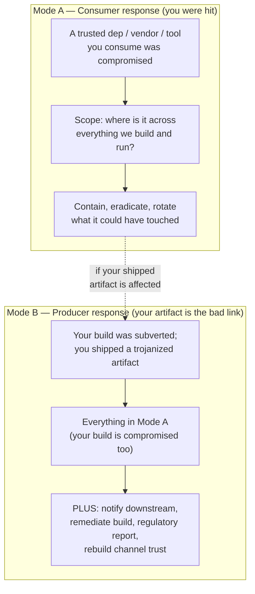
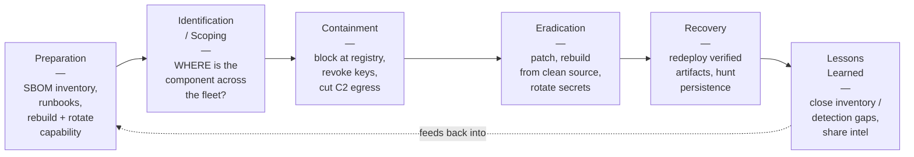
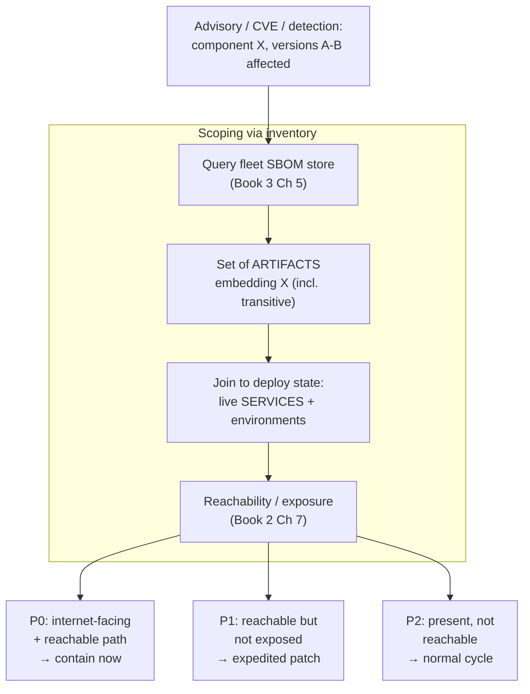
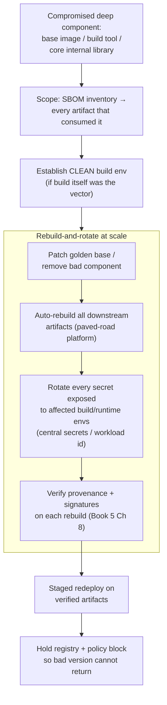
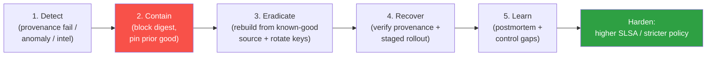
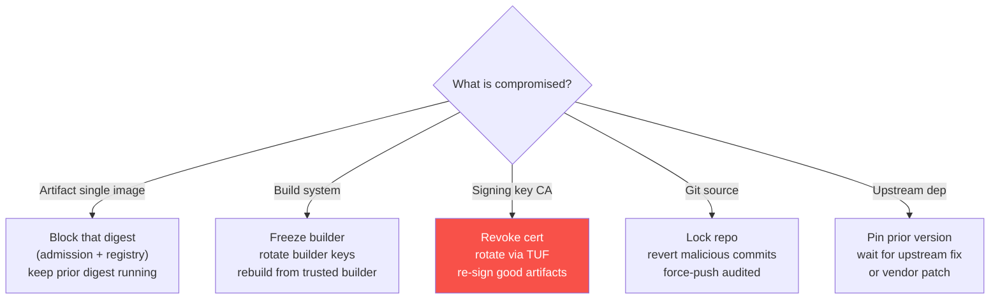
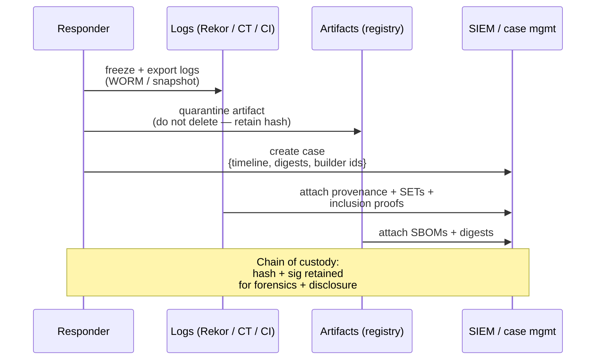

# Chapter 6 — Incident Response for Supply Chain Events

*What this chapter covers.* Chapter 5 built detection: the telemetry-and-correlation layer that turns a
trust-abusing compromise into an alert. This chapter is what happens after the alert fires — when you
have to *respond* to a supply chain incident. And responding to a supply chain incident is not like
responding to an ordinary breach. In an ordinary breach, an outsider forced their way into your
systems and the job is to evict them. In a supply chain incident, the malicious thing is something you
*deliberately installed and trust* — a signed vendor update, a popular dependency, a build tool, a base
image — so there is no perimeter that was breached, no single foothold to evict. The "attacker" is a
line in your lockfile or a DLL in a product you paid for, its blast radius is *every system that
consumed it* (potentially your entire fleet), and remediation is not eviction but the far harder work of
*rebuilding trust*: rotate the credentials the bad thing could have seen, rebuild every artifact that
embedded it, re-verify the rebuild, and make sure the bad version cannot come back. This chapter walks
the incident-response lifecycle — Preparation, Identification/Scoping, Containment, Eradication,
Recovery, Lessons Learned — with the supply-chain-specific action at each stage, grounded in the real
incidents: Log4Shell, SolarWinds, Codecov, event-stream. The through-line is a single, unglamorous
claim: supply chain IR at fleet scale is won or lost in *preparation*, and the most valuable thing you
can build in peacetime is the ability to query your whole fleet for "where is this component, vendor, or
artifact?"

Learning goals — after this chapter you should be able to:

- Explain *why* supply chain IR differs from ordinary IR — the threat is a trusted artifact, the blast
  radius spans every consumer, and remediation means rebuilding trust, not evicting an intruder.
- Distinguish the **consumer response** (you were compromised *via* a dependency/vendor/build) from the
  **producer response** (your own artifact is the compromised link) and run each correctly.
- Map the NIST / SANS PICERL incident lifecycle onto supply chain events, and name the
  supply-chain-specific action and enabling capability at each phase.
- Answer the flagship scoping question — "where is the affected component across everything we build and
  run?" — from SBOM and build/deploy inventory, and prioritize by reachability and exposure.
- Run the hard containment and eradication moves: block a version at the registry chokepoint, revoke and
  rotate a compromised signing key or CI credential, and rebuild-and-rotate at fleet scale.
- Handle the special cases: signing-key compromise investigation via transparency logs, the
  rebuild-everything problem, producer disclosure and CRA reporting, and scoping a dormant targeted
  implant where *exposed* and *exploited* are very different numbers.

## Why supply chain incident response is different

Ordinary incident response has a mental model baked into every runbook: an *external* actor got *in*.
They phished a credential, exploited an internet-facing service, moved laterally. The incident is a
narrative of intrusion, and the response is a narrative of eviction — find the foothold, contain the
lateral movement, remove the implant, close the hole they came through. The threat is foreign to the
system; the system's own components are the *defenders*.

Supply chain IR inverts every one of those assumptions. Nobody forced their way in. The malicious code
arrived through the front door you hold open on purpose — a `npm install`, a signed Orion update through
the vendor's normal patch channel, a `pip install` of a dependency you have used for years. Three
structural differences follow, and they are what make this a distinct discipline.

**The threat is a trusted artifact, not a foreign intruder.** The malice is inside `log4j-core`, inside
`SolarWinds.Orion.Core.BusinessLayer.dll`, inside `flatmap-stream`, inside the Codecov Bash Uploader you
pipe into your CI. These are things your systems trust *by design*. There is no anomalous process to
kill and no attacker session to terminate; there is a component you installed, running exactly where you
put it, doing something you did not intend. "Remove the attacker" is not a coherent instruction. The
question is "remove the *component* — from everywhere it is."

**The blast radius is every consumer, which at fleet scale is potentially everything.** An ordinary
intrusion has a spatial locus — the compromised host, the segment it reached. A compromised dependency
has no locus; it is wherever that dependency was consumed, which for a widely-used library is *every
service that built against it*. Log4Shell was not "an incident on server X." It was a property of every
Java service in the fleet that transitively pulled `log4j-core` — hundreds or thousands of them,
across every team and every environment. The blast-radius question is not "how far did they move?" but
"how far did the component spread through our build graph?", and you cannot answer it by looking at
network logs. You answer it by querying inventory.

**Remediation is rebuilding trust, not eviction.** When an attacker is evicted, the system returns to a
known-good state that predates them. A supply chain compromise has no such state to return to, because
the compromise was *inside the thing you trusted*. You cannot simply "remove" a trojanized base image
from a running fleet; you have to rebuild every image that layered on top of it, from clean source, on a
build you have re-verified, and redeploy them. You cannot "un-see" the CI secrets a malicious uploader
exfiltrated; you have to assume they are all compromised and rotate every one. If a signing key leaked,
you cannot trust anything it signed while it was exposed; you revoke it, re-issue, and re-sign. The work
is *restorative* — rotate, rebuild, re-verify — and proportional to how widely the trusted thing was
used, which is why it dwarfs ordinary eradication.

### Two modes: consumer and producer

Every supply chain incident puts you in one of two roles, and they demand different responses. Most
orgs, most of the time, are in mode A. But if you ship software — and every backend org ships something
to *someone*, even if only internally — you must be prepared for mode B.

**Mode A — you are the consumer.** A dependency, vendor, or build tool you consume was compromised, and
it hit you. This is your response to Log4Shell (a vulnerability in a library you use), to SolarWinds (a
trojanized update from a vendor you deployed), to Codecov (a compromised tool in your CI), to
event-stream (a malicious package in your build graph). Your job: figure out where the bad thing is,
stop it spreading, remove it, and clean up whatever it touched while it was present.

**Mode B — you are the producer whose artifact is the compromised link.** Your build was subverted and
you shipped a trojanized artifact to *your* downstream — the position SolarWinds and Codecov were in as
*companies*. Your job includes everything from mode A (your own build system is compromised, so you are
a victim too), *plus* an obligation you do not have as a consumer: notify and remediate for everyone
downstream who trusted your artifact. That means coordinated disclosure, possibly regulatory reporting
(the EU CRA's 24-hour clock — Book 8, Chapter 1), remediating the build so a clean artifact can be
produced, and the slow work of rebuilding customer trust in your distribution channel.



The two modes are not mutually exclusive. SolarWinds-the-company was simultaneously a mode-B producer
(it shipped SUNBURST to 18,000 customers) and a mode-A consumer (its own build system had been
compromised by SUNSPOT — Book 1, Chapter 3). If a compromised internal library propagates into an
artifact you ship externally, you cross from A into B mid-incident, and the disclosure clock starts.

## The incident lifecycle, applied to supply chain

Incident response has a canonical lifecycle, and it is worth naming precisely because supply chain
events do not get their own playbook — they get *this* playbook, adapted. Two standard framings, largely
isomorphic:

- **NIST SP 800-61** (Computer Security Incident Handling Guide; the long-standing Rev 2, with Rev 3
  published in 2025 reframing it around the CSF functions) uses four phases: **Preparation**;
  **Detection and Analysis**; **Containment, Eradication, and Recovery**; **Post-Incident Activity**.
- **SANS PICERL** expands the same idea into six named stages: **P**reparation, **I**dentification,
  **C**ontainment, **E**radication, **R**ecovery, **L**essons Learned.

I use the PICERL decomposition below because the six stages let me attach a distinct supply-chain action
to each. The mapping to NIST is exact: PICERL's Identification is NIST's Detection and Analysis, and
PICERL's Containment/Eradication/Recovery are NIST's combined third phase.



The single most important thing about this lifecycle for supply chain events is that its outcome is
decided in the *first* box. The difference between an organization that resolved Log4Shell in hours and
one that spent weeks was not skill at containment or eradication — it was whether, at the moment the CVE
dropped, they could answer "where is `log4j-core`?" The rest of this section walks each phase; the
Preparation phase is disproportionately long on purpose, because it is disproportionately important.

### Preparation: the capabilities you need before the pager fires

Preparation for supply chain IR is not a runbook you write; it is a set of *fleet-wide capabilities* you
build during peacetime, and the entire thesis of this chapter — and of this book suite — is that these
are the *same* capabilities the prevention program builds. You do not stand up a separate IR platform.
You discover, at 2 a.m. on the night the CVE drops, whether the platform you built for prevention can
also answer incident questions. Here is the checklist, each item tied to where the suite builds it.

- **A queryable inventory / SBOM across the whole fleet.** The capability to answer "where is component
  X, at what version, in which service, in which environment?" as a *query*, not a survey. This is the
  Log4Shell capability, and it is built in Book 3, Chapter 5 (SBOMs at scale) — a central store of SBOMs
  for every built artifact, joined to deploy state so a component name resolves to a list of running
  services. Without it, scoping is a fleet-wide email asking teams to grep their `pom.xml` files, which
  is how the weeks-long version of Log4Shell happened.
- **Asset and vendor mapping.** For vendor incidents (SolarWinds), you need to know which systems run
  which third-party products, and which vendors have which access into your environment — the vendor
  register and third-party risk inventory of Book 8, Chapter 3. "Do we run Orion, and where?" must be
  answerable in minutes.
- **Detection wired to response.** The telemetry layer of Chapter 5 — integrity checks as tripwires,
  egress monitoring, transparency-log monitoring — is what tells you an incident exists and feeds the
  initial scope. Detection without a response path is just an alarm nobody can act on.
- **The ability to rapidly patch, rebuild, and redeploy the fleet.** Update automation (Book 2, Chapter
  9) to bump a dependency across hundreds of repos; a paved-road build platform (Book 4, Chapter 10) and
  golden base images with automatic rebuild (Book 6, Chapter 3) so that "rebuild everything that used
  the bad thing" is a platform operation, not a per-team scramble; fast, safe deploy/rollback.
- **The ability to rotate credentials at scale.** Centralized secrets management and short-lived
  workload identity (Book 4, Chapter 6; and the broader secrets discipline of Book 7, Chapter 4) so that
  "rotate every CI secret" is a bounded operation. If your secrets are long-lived and scattered across
  team-owned config, mass rotation is itself a multi-week incident.
- **Registry chokepoints you can block at.** An internal registry / proxy (Book 2, Chapter 8; Book 6,
  Chapter 2) that every build pulls through, so that "no build may consume the bad version" is one
  policy change at one place, not a plea to every team.
- **Runbooks for the supply-chain scenarios.** Pre-written, rehearsed playbooks for each incident type —
  vulnerable-dependency, trojanized-vendor-update, compromised-CI-tool, malicious-package,
  signing-key-compromise — with the specific queries, block commands, and rotation scopes filled in.

The Log4Shell lesson is entirely a preparation lesson. When CVE-2021-44228 dropped on 9 December 2021,
the technical fix was trivial — bump `log4j-core` to a fixed version, or set a mitigation flag. The
incident was never about the fix. It was about *finding every place the fix had to be applied*, across a
transitive dependency that was buried inside dozens of other libraries. Organizations with a fleet SBOM
ran one query and had their list. Organizations without one spent the first week of the incident simply
*discovering their own exposure* — and Log4Shell did not wait, because it was trivially exploitable and
under mass scanning within hours. Preparation is the whole game.

### Identification and scoping: "where is it across the fleet?"

Once you know an incident exists (from Chapter 5's detection layer, a vendor advisory, or a public CVE),
the defining supply-chain question is one of *scope*: **where is the compromised component, vendor, or
artifact across everything we build and run, and where is it actually exploitable?** This is where the
inventory investment pays off, and it decomposes into three questions.

**Where is it built into?** Query the SBOM inventory (Book 3, Chapter 5) for the affected component and
version range. This resolves the component to the set of *artifacts* that embed it — including
transitive inclusions the owning team may not know about, which is exactly the Log4Shell case where
`log4j-core` was pulled in three levels deep by something nobody thought of as "a logging library."

**Where is it running?** Join that artifact set to deploy state — which images are running, in which
clusters, in which environments — so the compromised component resolves to a list of *live services*.
This is the difference between "we build 40 things that use it" and "we are running 40 things that use
it in production, right now, here."

**Where is it actually exploitable?** Presence is not exploitability. For a vulnerability like
Log4Shell, reachability and exposure analysis (Book 2, Chapter 7) separates the internet-facing service
that logs attacker-controlled strings through the vulnerable code path (drop everything) from the
internal batch job that has the library on its classpath but never routes untrusted input to it (patch
in the normal cycle). For a targeted implant like SUNBURST, the equivalent question is *presence vs
activation*: 18,000 organizations had the trojanized DLL, but the second-stage payload was only ever
delivered to on the order of 100 of them. Scoping must distinguish "has the artifact" from "was actually
exploited," because they drive completely different response urgency and cost.



Concretely, the scoping query against a modern SBOM inventory is a database question. If SBOMs are
stored in a queryable index (a component graph keyed by purl), scoping Log4Shell is:

```bash
# "Where is log4j-core in the affected range across every built artifact?"
osv-scanner --experimental-all-packages --format json ./sbom-store/ \
  | jq '.results[] | select(.packages[].package.name == "org.apache.logging.log4j:log4j-core")'

# Against a central inventory, it is a single query keyed by package URL:
#   SELECT service, version, environment FROM component_index
#   WHERE purl LIKE 'pkg:maven/org.apache.logging.log4j/log4j-core@%'
#     AND version >= '2.0-beta9' AND version < '2.17.1';
```

The output of identification is a prioritized affected-inventory list: for each service, which version,
which environment, and an exposure tier. That list is the input to every subsequent phase.

### Containment: stop the bleeding

Containment in supply chain IR is about stopping the compromise from spreading further and stopping the
active harm, without yet doing the full cleanup. The moves are supply-chain-specific.

**Block the malicious version at the registry chokepoint.** The highest-leverage containment action for
a bad *package* or *image* is to block it at the registry/proxy every build pulls through (Book 2,
Chapter 8; Book 6, Chapter 2). One policy change stops the entire fleet from consuming the bad version
in any new build — quarantining it fleet-wide from a single control point. This is the containment
analogue of the registry being your prevention chokepoint: the same chokepoint that enforces policy in
peacetime enforces the block in wartime.

```bash
# Quarantine a known-bad package version at the internal registry (illustrative).
# No build in the fleet can resolve it after this.
registry-admin block --purl 'pkg:npm/event-stream@3.3.6'
registry-admin block --purl 'pkg:npm/flatmap-stream'   # the actual malicious dep
```

**Revoke and rotate compromised credentials and signing keys.** If the incident involves a leaked CI
credential, a compromised signing key, or a stolen workload identity, containment *is* revocation:
invalidate the credential so it can no longer be used, before you even finish understanding what it did
(Book 4, Chapter 6; Book 5, Chapter 9). A live compromised signing key is an active bleed — every minute
it stays valid is another minute an attacker can sign a trojanized artifact your fleet will accept.
Revoke first, investigate second.

**Cut C2 egress.** For an active implant (SUNBURST's beacon to `avsvmcloud[.]com`, a malicious package's
exfiltration callback), block the command-and-control and exfiltration destinations at egress — the same
egress-allowlist control Chapter 5 uses for detection now used to sever the channel. This contains an
implant you have not yet removed: it can no longer receive commands or send data.

**Halt and isolate.** Halt the affected pipelines (a poisoned build pipeline should stop producing
artifacts until it is cleaned — Book 4, Chapter 7), and isolate affected systems where an active
hands-on-keyboard adversary is a risk (SolarWinds). Isolation here is ordinary IR; the supply-chain twist
is deciding *which* systems, which comes from the scoping list.

A caution specific to supply chain: containment can break production. Blocking a bad version may block
one that half your fleet currently depends on; isolating a system running a trojanized vendor product may
take down a monitoring platform the rest of your response depends on. The scoping list and exposure tiers
are what let you contain surgically — block the bad version but stage the fix, isolate the exploited hosts
but not the merely-exposed ones.

### Eradication: remove the malicious component

Eradication is removing the bad thing from everywhere it is — and in supply chain IR this is the phase
that is often enormous, because "everywhere" is defined by the blast radius, not by a foothold.

- **Patch or update the dependency.** For a vulnerable or malicious package, bump to a fixed/clean
  version across every affected repo. Update automation (Book 2, Chapter 9) is what makes this a
  fleet operation — open the version-bump PRs across hundreds of repos programmatically rather than by
  hand. Log4Shell's cruelty was that the fix had to be applied hundreds of times.
- **Rebuild artifacts from clean source on a verified build.** Removing the component from source is not
  enough; the *built artifacts* still embed it. Every artifact that consumed the bad component must be
  rebuilt from clean source on a build you trust (Book 4). For a compromised base image, build tool, or
  widely-used internal library, this can mean rebuilding a huge swath of the fleet — the
  rebuild-everything problem, addressed below. Crucially, if the build system *itself* was the point of
  compromise (SolarWinds, Codecov), you must first establish a clean build environment, or you will
  faithfully rebuild the trojan.
- **Remove trojanized artifacts.** Delete the bad artifacts from registries and caches so they cannot be
  pulled again, and purge them from any mirror or CDN.
- **Rotate every potentially-exposed secret.** This is the eradication step teams most often
  under-scope. If a malicious component ran in an environment, assume it saw every secret in that
  environment. The Codecov response is the canonical example: because the Bash Uploader ran inside
  customers' CI with access to the CI environment, the correct response was to rotate *every credential,
  token, and key that had been exposed to that CI* — not just the ones you think it used (Book 4, Chapter
  6; Book 7, Chapter 4). You do not know what it exfiltrated; you assume it took everything it could see.

The eradication list is, again, the scoping list — every artifact and every secret in the blast radius —
which is why an incomplete inventory produces an incomplete eradication, and an incomplete eradication is
how attackers persist.

### Recovery: redeploy clean, verify, and hunt persistence

Recovery restores service on clean, trusted artifacts and confirms the compromise is actually gone. The
supply-chain-specific discipline here is *verify before you trust the rebuild*.

- **Verify provenance and signatures on the clean rebuild.** Before redeploying, verify that the new
  artifacts have valid provenance from the clean build and pass signature verification (Book 5, Chapter
  8). You are re-establishing the trust the incident destroyed; do it by checking the same integrity
  evidence you would demand of any artifact, not by assuming the rebuild is clean because you did it.
- **Redeploy and restore service** on the verified artifacts, using your normal safe-deploy path
  (canary, staged rollout) so a bad rebuild does not become a second incident.
- **Confirm the bad version cannot return.** The registry block and a policy-as-code rule (Book 8,
  Chapter 4) that denies the affected version range must remain in force, so a stale lockfile or a
  cached layer cannot silently reintroduce it. This is what turns eradication into permanent removal.
- **Hunt for persistence.** Supply chain attackers plant follow-on access. SUNBURST's whole purpose was
  to be a *foothold* — for the ~100 selected victims it delivered second-stage implants (TEARDROP) and
  the attacker moved hands-on-keyboard, forged SAML tokens (the "Golden SAML" technique against ADFS),
  and established independent persistence that survived removing Orion. Removing the trojanized component
  does not remove the attacker who used it as a door. Recovery must include threat-hunting for that
  follow-on access — new accounts, anomalous federation trust, credential misuse — informed by the fact
  that eradicating the *supply chain* vector and eradicating the *intrusion it enabled* are two different
  jobs. For a stealthy targeted implant, recovery is not done when the component is gone; it is done when
  you have confirmed the adversary is gone.

### Lessons learned: close the gaps that let it in and slowed the response

The post-incident phase for supply chain events has a distinctive dual focus, because supply chain
incidents fail you in two places: the gap that *let it in* and the gap that *slowed your response*.

A blameless postmortem (in the mold of Book 11, Chapter 6) should close both. On the prevention side:
what control would have stopped this — a missing admission gate, an unpinned dependency, an unmonitored
vendor, a build without provenance? On the *response* side, which is where supply chain incidents most
often reveal their real cost: how long did scoping take, and why? If it took days to answer "where is
`log4j-core`," the lesson is not "patch faster" — it is "the SBOM inventory has gaps," and the corrective
action is an inventory investment. The most valuable output of a supply chain postmortem is usually a
list of the queries you *could not answer fast enough*, because those are your next preparation
investments. Update the runbooks with what you learned, and share intelligence — IOCs, the affected
version ranges, the TTPs — through your disclosure and information-sharing channels (Book 8, Chapter 7),
because supply chain incidents are shared: the dependency that hit you will hit others.

The following table consolidates the lifecycle: each phase, the supply-chain-specific action, and the
peacetime capability that enables it.

| IR phase | Supply-chain-specific action | Enabling capability (book) |
|---|---|---|
| **Preparation** | Build queryable fleet SBOM inventory; vendor/asset map; runbooks; rebuild + rotate + rollback at scale | SBOM at scale (Book 3, Ch 5); vendor register (Book 8, Ch 3); update automation (Book 2, Ch 9); build platform (Book 4, Ch 10); golden base (Book 6, Ch 3); secrets/identity (Book 4, Ch 6) |
| **Identification / Scoping** | "Where is the component/vendor/artifact across all we build and run?" + reachability/exposure | SBOM query (Book 3, Ch 5); deploy inventory; reachability (Book 2, Ch 7); detection (Book 8, Ch 5) |
| **Containment** | Block bad version at registry chokepoint; revoke/rotate keys and credentials; cut C2 egress; halt pipelines; isolate exploited hosts | Registry/proxy (Book 2, Ch 8; Book 6, Ch 2); key mgmt (Book 5, Ch 9); egress control (Book 4, Ch 9); pipeline controls (Book 4, Ch 7) |
| **Eradication** | Patch/update dep; rebuild all affected artifacts from clean source on verified build; remove trojanized artifacts; rotate all exposed secrets | Update automation (Book 2, Ch 9); secure build (Book 4); golden base + auto-rebuild (Book 6, Ch 3); secrets (Book 4, Ch 6) |
| **Recovery** | Verify provenance/signatures on rebuild; staged redeploy; enforce version block via policy; hunt follow-on persistence | Provenance verification (Book 5, Ch 8); policy-as-code (Book 8, Ch 4); safe deploy (Book 11, Ch 9); threat hunting (Book 8, Ch 5) |
| **Lessons Learned** | Blameless postmortem closing both the *let-it-in* and *slowed-response* gaps; update runbooks; share intel | Postmortems (Book 11, Ch 6); metrics (Book 8, Ch 8); threat intel / disclosure (Book 8, Ch 7) |

## Worked scenarios

The abstractions above become concrete against the real incidents. Each of these is a mode-A consumer
response unless noted; SolarWinds and Codecov also carry a mode-B producer story.

### Log4Shell — the flagship scoping incident

On 9 December 2021, CVE-2021-44228 disclosed that `log4j-core` (Apache Log4j 2) would perform a JNDI
lookup on attacker-controlled input in a logged string, letting an attacker load and execute a remote
class — trivial, unauthenticated RCE in one of the most widely deployed Java libraries in existence
(Book 1, Chapter 5). The incident is the archetype of supply chain IR because the fix was easy and the
*finding* was the whole problem.

The consumer response, phase by phase: **Identify/scope** — query the fleet SBOM for
`org.apache.logging.log4j:log4j-core` in the affected range, resolving it to every service, *including*
the many that pulled it transitively through frameworks and had no idea they used Log4j. **Prioritize**
by exposure and reachability (Book 2, Chapter 7): an internet-facing service that logs untrusted input
through the vulnerable path is a drop-everything P0; an internal service with the jar on its classpath
but no untrusted-input path is a lower tier. **Contain/mitigate** — for the P0s, apply the immediate
mitigation (upgrade, or remove the `JndiLookup` class, or set the flag on affected versions) while the
real fix propagates. **Eradicate** — bump `log4j-core` to a fixed version across every repo via update
automation and rebuild. **Recover/verify** — confirm the fix deployed and hold a registry/policy block
on the vulnerable range.

Then the follow-on cascade, which is part of the real incident and a lesson in itself: the first fix was
incomplete. 2.15.0 was found insufficient (CVE-2021-45046), then a DoS via crafted lookups
(CVE-2021-45105), then a further issue (CVE-2021-44832) — the fully-fixed version landing at 2.17.1. An
organization with the inventory ran the *same scoping query* each time a new CVE landed and re-bumped in
hours. An organization without it re-ran the manual survey from scratch, four times. The gap between
"hours" and "weeks" was not patching skill; it was the SBOM inventory (Book 3, Chapter 5). That is the
central lesson of this chapter.

### SolarWinds — trusted-vendor compromise, both modes

SolarWinds is the mode-A/mode-B case. From late 2019, an attacker who had compromised SolarWinds' build
system (SUNSPOT) injected the SUNBURST backdoor into the Orion platform's
`SolarWinds.Orion.Core.BusinessLayer.dll` at build time; it was signed with SolarWinds' legitimate
certificate and distributed through the normal update channel from roughly spring 2020 (Book 1, Chapter
3). Roughly 18,000 organizations installed the trojanized update; the implant stayed dormant ~two weeks,
then beaconed to a DGA C2 (`avsvmcloud[.]com`), and for a selected ~100 targets the attacker delivered
second-stage implants and moved hands-on-keyboard. Discovered December 2020 — by Mandiant investigating
its own breach, not by any downstream control.

**Consumer response** (you ran Orion): scope which systems ran Orion and which versions (asset/vendor
map — Book 8, Chapter 3); contain by isolating those systems and blocking the C2/exfil egress; eradicate
by removing/rebuilding the affected systems; then — the step ordinary IR would miss — *rotate everything
the compromised systems touched*, because a monitoring platform like Orion typically holds broad
credentials into the environment, and hunt for the hands-on-keyboard follow-on (new accounts, forged
SAML/"Golden SAML" tokens, independent persistence). Removing Orion does not remove the intruder who
used it as a door. The presence-vs-exploitation distinction is essential: 18,000 were exposed, ~100 were
exploited, and telling which bucket you are in — via the C2 and second-stage IOCs — determines whether
this is a cleanup or a full intrusion response.

**Producer response** (you are SolarWinds): you are simultaneously a victim (your build was
compromised — run the consumer response on your own environment) and the source of everyone else's
incident. The producer obligations: notify affected customers with accurate scope and IOCs; remediate
the build system so it is provably clean before you ship again; produce and sign a clean release;
publish indicators for downstream hunting; and undertake the long rebuild of trust in your distribution
channel (which for a build compromise means demonstrating the build integrity — provenance, hermeticity,
tamper-evidence — you could not demonstrate before). And under a regime like the EU CRA (Book 8, Chapter
1), the disclosure clock is legal, not just ethical.

### Codecov — mass credential rotation

On 31 January 2021, an attacker who had extracted a GCS credential from a Codecov Docker image modified
the Codecov Bash Uploader script served from Codecov's CDN, adding a line that exfiltrated the
environment of every CI job that piped the uploader into its build. It ran ~two months, discovered 1
April 2021 when a customer compared the script's `shasum` against the published checksum (Book 1, Chapter
5).

The consumer response is defined by one word: **rotate**. Because the malicious uploader ran *inside your
CI* with access to the CI environment, it could exfiltrate every secret exposed there — cloud
credentials, registry tokens, signing keys, deploy keys, whatever your pipelines held. You do not know
which it took. The correct, and widely-taken, response was to rotate *all* credentials and secrets that
had been exposed to CI during the exposure window (Book 4, Chapter 6). This is where the
rotate-at-scale preparation capability earns its keep: if your CI secrets are long-lived and scattered
across per-team config, "rotate everything" is itself a multi-week incident; if they are centrally
managed and short-lived (workload identity), it is a bounded operation. Codecov is the reason "assume it
saw everything in that environment" is the default eradication posture for any compromise that ran inside
your build.

### event-stream — malicious dependency, targeted payload

In 2018, the popular npm package `event-stream` gained a new maintainer who added a dependency,
`flatmap-stream`, containing an obfuscated payload that targeted a *specific* downstream — the Copay
bitcoin wallet — attempting to steal wallet keys (Book 1, Chapter 4). It is the archetypal
malicious-dependency incident and the archetype of a *targeted* payload: most consumers of event-stream
were unaffected because they were not the target, which again makes presence-vs-impact scoping essential.

The consumer response: **scope** which builds pulled `event-stream`/`flatmap-stream` — the registry
audit log (Book 2, Chapter 8) tells you which builds resolved it and when — and which shipped artifacts
embed it (SBOM inventory). **Contain** by blocking the malicious version at the registry. **Eradicate**
by removing/replacing the dependency and rebuilding the artifacts that embedded it. **Rotate** anything
the payload could have exfiltrated from environments where the affected build or artifact ran — even if
you were not the specific target, you cannot assume the payload was inert in your environment without
verifying it. The registry audit log is the star witness here: it is the record of *which of your builds
touched the bad thing and when*, which is exactly the scoping question for a dependency incident.

### Compromised signing key — a category, not one incident

If a signing key or CI credential is itself compromised — leaked, or used by an attacker — the response
is a specific pattern: **revoke** the key/credential immediately (containment); **rotate** to a new one
and re-issue identities; **re-sign** the artifacts that must remain trusted with the new key; and
**investigate what was signed or accessed while it was compromised**. That last step is where a
transparency log is decisive: because Sigstore's Rekor (Book 5, Chapter 5) records every signing event
in an append-only, monitorable log, you can enumerate *everything signed under the compromised identity*
during the exposure window and determine which signatures are suspect — turning "we have no idea what
they signed" into a bounded, auditable list. Without a transparency log, a key compromise forces you to
distrust *everything* the key ever signed, because you cannot tell attacker-signatures from legitimate
ones. This is the operational payoff of the transparency-log architecture: it makes signing-key IR
tractable.

The scenarios, summarized against their response specifics:

| Incident type | What was compromised | Response specifics that differ |
|---|---|---|
| **Log4Shell** (vulnerable dep) | A library you consume, exploitable RCE | Scope via SBOM across transitive graph; prioritize by reachability/exposure; patch + rebuild fleet-wide; expect a follow-on CVE cascade — re-run the *same* query each time |
| **SolarWinds** (trusted-vendor update) | A signed vendor product, build-injected implant | Asset/vendor scope; isolate + cut C2; **rotate everything the system touched**; hunt hands-on-keyboard follow-on; presence (~18k) ≠ exploited (~100). Producer: notify, remediate build, disclose |
| **Codecov** (compromised CI tool) | A CI uploader run inside your build | **Rotate ALL secrets exposed to CI** in the window; assume it saw everything in the build environment |
| **event-stream** (malicious dep) | A dependency with a targeted payload | Registry audit log → which builds pulled it; SBOM → which artifacts embed it; block at registry; rebuild; rotate exfiltratable secrets; targeted ≠ you were safe |
| **Signing-key compromise** | A key/identity used to sign | Revoke + rotate + re-issue + re-sign; enumerate what was signed while compromised via transparency log (Rekor); without a log, distrust everything |

## Special challenges of supply chain incident response

Four challenges recur across supply chain IR and deserve their own treatment, because they are where the
response most often fails or over-runs.

### Credential and key compromise: revoke before you understand

The instinct in IR is to investigate before acting, so you do not act on a false alarm. For a *live*
compromised credential or signing key, invert it: revoke first. A valid credential in an attacker's
hands is an active bleed; every minute of investigation is a minute they can still use it. Revoke or
disable the identity, *then* investigate what it did. Rotate to a replacement, re-issue any dependent
identities, and re-sign or re-authenticate anything that relied on the old one. The investigation — what
was signed, what was accessed, during the exposure window — determines the *blast radius of the trust*,
and this is precisely where transparency logs (Rekor, Book 5, Chapter 5) and good audit logging (registry
logs, Book 2, Chapter 8; cloud audit trails) convert an unbounded "we can't know" into a bounded list.
The difference between an org that can and cannot enumerate what a compromised key signed is the
difference between re-signing a known set of artifacts and re-establishing an entire trust root.

### The rebuild-everything problem

When the compromised thing is *deep* in the build graph — a base image every service layers on, a build
tool every pipeline runs, a foundational internal library hundreds of services depend on — eradication
means rebuilding a huge fraction of the fleet. This is where supply chain IR meets the hard limits of
your build platform. Done by hand, per team, it is a multi-week fleet-wide project with a long tail of
services nobody remembers to rebuild. Done on a platform with a golden base image and automatic rebuild
(Book 6, Chapter 3) plus a paved-road build system (Book 4, Chapter 10), it is tractable: patch the
golden base once, and the platform rebuilds and re-attests every downstream image automatically; the
"rebuild everything" instruction becomes a platform operation with a completion metric rather than a
survey. The rebuild-everything problem is, again, a preparation problem — the capability that makes
peacetime base-image updates painless is the same capability that makes wartime mass-rebuild possible.



### Producer notification, disclosure, and regulatory reporting

If *your* artifact is the compromised link (mode B), you inherit obligations a consumer does not have.
Coordinated disclosure to your downstream (Book 8, Chapter 7): tell them accurately and promptly what
was compromised, which versions, what the indicators are, and what they should do — the same discipline
you would want from an upstream that compromised you. Regulatory reporting increasingly makes this a
legal deadline, not a courtesy: under the EU Cyber Resilience Act (Book 8, Chapter 1), a manufacturer
must file an **early-warning notification within 24 hours** of becoming aware of an actively exploited
vulnerability or a severe incident in its product, a fuller **notification within 72 hours**, and a
**final report** later (on the order of 14 days after a corrective measure is available for a
vulnerability; treat the exact incident-side window as the detail worth checking against the current
text). The 24-hour clock is an engineering requirement disguised as a legal one: to report within 24
hours *which* of your shipped products is affected, you must be able to answer that question about your
own portfolio in far less than 24 hours — which is, once again, the SBOM/inventory capability, now
pointed at your own releases. Producer IR without a product inventory misses the deadline while it is
still discovering its own exposure.

### Scoping a stealthy, dormant, targeted implant

The hardest scoping problem is the SUNBURST problem: a stealthy implant that is *present* far more widely
than it was *activated*. Roughly 18,000 organizations had the trojanized Orion DLL; the second-stage,
hands-on-keyboard compromise reached on the order of 100. The response cost of "you have the artifact"
and "you were actively exploited" differ by orders of magnitude, and telling them apart is the crux of
the response. This is where the detection signals of Chapter 5 become IR inputs: presence is answered by
inventory (do you have the DLL?), but activation is answered by *behavioral* evidence — did the implant
beacon to the C2? did the DGA domain resolve? are the second-stage IOCs present? was there anomalous
federation or account activity? A dormant targeted implant will not show up in "am I affected?" as a
binary; it shows up as a spectrum from "have the artifact, no activation evidence" to "confirmed
hands-on-keyboard," and the response must be tiered accordingly. Getting this wrong in either direction
is costly: treat every exposed org as fully compromised and you drown in unnecessary full-intrusion
responses; treat presence as harmless and you miss the ~100 who were actually breached. The scoping
output for a targeted implant is not a list; it is a triaged spectrum.

## Distributed-systems lens

Everything in this chapter reduces to one claim about scale, and it is worth stating plainly:
**supply-chain IR at fleet scale lives or dies on preparation, and the preparation is the same platform
the rest of this suite builds for prevention.** There is no separate IR system to procure. The SBOM
inventory built in Book 3 (Chapter 5) is what turns "where is the affected component?" from a fleet-wide
survey into a query — and that single capability, the "query the fleet for the affected
component/vendor/artifact" capability, is the highest-return IR investment you can make, because it is
what separated the hours-long Log4Shell response from the weeks-long one, and it is what starts the CRA's
24-hour clock in a place you can actually meet. The registry audit logs of Book 2 (Chapter 8) are what
tell you which builds touched a malicious dependency and when. The build provenance of Book 4 (Chapter 3)
is what lets you verify a rebuild is clean before you trust it. The rapid rebuild/rotate/redeploy
capability — update automation (Book 2, Chapter 9), the paved-road build platform (Book 4, Chapter 10),
golden base images with automatic rebuild (Book 6, Chapter 3), centralized secrets and short-lived
workload identity (Book 4, Chapter 6) — is what turns "rebuild everything that consumed the bad thing"
and "rotate every secret it could have seen" from unbounded scrambles into managed fleet operations with
completion metrics. Containment at the registry chokepoint (Book 2, Chapter 8; Book 6, Chapter 2) is what
lets one policy change stop fleet-wide spread. Rotate-at-scale requires centralized secrets; if yours are
long-lived and scattered, the Codecov response — rotate everything — is itself a multi-week incident
instead of a bounded one.

The deep point is that **the same platform capabilities the suite builds for prevention *are* the IR
capabilities**, viewed under load. An SBOM inventory is a compliance artifact in peacetime and a scoping
engine in an incident; a registry chokepoint is a policy-enforcement point and a containment control;
golden base images with auto-rebuild are patch hygiene and mass eradication; short-lived workload
identity is least privilege and rotate-at-scale. This is why the incident is where the whole program is
tested: the night the CVE drops, you find out whether the inventory is complete, whether the registry
block actually stops every build, whether "rebuild everything" has a completion metric, whether "rotate
everything" is bounded. The organizations that respond in hours are not the ones with better runbooks;
they are the ones whose peacetime platform can be pointed at an incident question and answer it. IR is
the load test for the entire supply chain security program, graded on work done months before the pager
went off.

### IR phases tailored to supply chain



### Containment decision tree



### Evidence preservation flow



## Key takeaways

- **Supply chain IR is structurally different from ordinary IR.** The threat is a *trusted* artifact you
  installed on purpose, not a foreign intruder; the blast radius is *every consumer* of it, which at
  fleet scale is potentially everything; and remediation is *rebuilding trust* — rotate, rebuild,
  re-verify — not evicting an attacker. There is no known-good prior state to return to.
- **Know which mode you are in.** Consumer response (you were hit *via* a dependency/vendor/build:
  Log4Shell, SolarWinds, Codecov, event-stream) is scope-contain-eradicate-rotate. Producer response
  (your artifact is the bad link) is all of that *plus* downstream notification, build remediation,
  regulatory reporting, and rebuilding channel trust. A compromised internal library can move you from
  consumer to producer mid-incident, starting the disclosure clock.
- **Scoping is the crux, and inventory is what makes it fast.** The defining question — "where is the
  compromised component/vendor/artifact across everything we build and run, and where is it actually
  exploitable?" — is answered by a fleet SBOM joined to deploy state and reachability, not by a survey.
  The org with the inventory answered Log4Shell in hours; the org without it spent weeks discovering its
  own exposure. This is the single most important IR investment.
- **Separate presence from exploitation.** For vulnerabilities, reachability/exposure decides priority;
  for targeted implants, presence (~18,000 for SUNBURST) and actual exploitation (~100) differ by orders
  of magnitude. The scoping output for a stealthy implant is a triaged spectrum, not a yes/no.
- **Contain at the chokepoint; revoke keys before you investigate.** Block the bad version at the
  registry every build pulls through — one control, fleet-wide. Cut C2 egress to sever a live implant.
  For a compromised credential or signing key, revoke *first* and investigate second; a valid attacker
  credential is an active bleed.
- **Eradication means rebuild-and-rotate, and it is proportional to the blast radius.** Removing the
  component from source is not enough — rebuild every artifact that embedded it, from clean source on a
  *verified* build (establish a clean build first if the build itself was the vector), and rotate *every*
  secret the component could have seen. Codecov's lesson: assume anything that ran in your CI saw every
  secret in it, and rotate them all.
- **Recovery verifies the rebuild and hunts the follow-on.** Check provenance and signatures before
  trusting the rebuild; hold the registry/policy block so the bad version cannot return; and hunt for the
  persistence a supply chain implant plants — removing SUNBURST did not remove the intruder who used it
  as a door.
- **The preparation *is* the prevention platform.** SBOM inventory, registry audit logs, build
  provenance, golden-base auto-rebuild, centralized secrets — the same capabilities the suite builds to
  *prevent* compromise are the ones that *respond* to it. IR is where the whole program is load-tested,
  and it is graded on peacetime work.

## Further reading

- **NIST SP 800-61, "Computer Security Incident Handling Guide"** — the canonical incident lifecycle
  (Preparation; Detection and Analysis; Containment, Eradication, and Recovery; Post-Incident Activity).
  Read Rev 2 for the classic four-phase model and Rev 3 (2025) for its reframing around the NIST CSF
  functions. Everything in this chapter is this lifecycle adapted to trust-abusing threats.
- **SANS Institute incident-handling material (the PICERL model)** — Preparation, Identification,
  Containment, Eradication, Recovery, Lessons Learned; the six-stage decomposition used to structure this
  chapter. Isomorphic to NIST; useful because each stage takes a distinct supply-chain action.
- **FireEye/Mandiant, "Highly Evasive Attacker Leverages SolarWinds Supply Chain" (December 2020)** and
  **Microsoft's Solorigate analyses** — the primary accounts of SUNBURST: the build-time injection, the
  DGA C2 (`avsvmcloud[.]com`), the presence-vs-activation gap (~18,000 vs ~100), and the hands-on-keyboard
  follow-on including forged SAML tokens. The reference case for consumer *and* producer response. (Book
  1, Chapter 3.)
- **Codecov security update and post-mortem (April 2021)** — the Bash Uploader compromise and the
  mass-credential-rotation response. The canonical case for "assume anything that ran in your CI saw all
  its secrets." (Book 1, Chapter 5; Book 4, Chapter 6.)
- **Apache Log4j security advisories for CVE-2021-44228 and the follow-on CVEs (45046, 45105, 44832)** —
  the vulnerability, the mitigations, and the fix cascade to 2.17.1. Read alongside your SBOM-scoping
  workflow; the incident is the flagship demonstration that inventory, not patching, is the bottleneck.
  (Book 1, Chapter 5; scoping, Book 3, Chapter 5.)
- **The event-stream / flatmap-stream incident write-ups (2018)** — a malicious dependency with a
  targeted payload (Copay). The reference case for registry-audit-log scoping and for "targeted does not
  mean you were safe." (Book 1, Chapter 4.)
- **Sigstore Rekor documentation (`docs.sigstore.dev`)** — the transparency-log model that makes a
  signing-key compromise tractable: enumerate everything signed under a compromised identity during the
  exposure window instead of distrusting the whole key. (Book 5, Chapter 5.)
- **EU Cyber Resilience Act — incident and vulnerability reporting obligations** — the staged 24-hour
  early warning / 72-hour notification / final-report timeline for actively exploited vulnerabilities and
  severe incidents, and why the 24-hour clock is really a product-inventory requirement. (Book 8, Chapter
  1.)
- **CISA and FIRST coordinated-vulnerability-disclosure guidance** — the framework for the producer-side
  notification obligation when your artifact is the compromised link. (Disclosure and information sharing,
  Book 8, Chapter 7.)
- Cross-references within this series: Book 1, Chapters 3–5 (SolarWinds, event-stream, Log4Shell/Codecov
  mechanisms); Book 2, Chapters 7–9 (reachability, internal registries/audit logs, update automation);
  Book 3, Chapter 5 (SBOM inventory at scale — the scoping engine); Book 4, Chapters 3, 6, 7, 10
  (provenance, secrets/rotation, pipeline controls, build platform); Book 5, Chapters 5, 8, 9
  (transparency logs, provenance verification, key management); Book 6, Chapters 2–3 (registries, golden
  base + auto-rebuild); Book 7, Chapter 4 (secrets in source); Book 8, Chapters 1, 3, 4, 5, 7, 8
  (regulatory reporting, vendor risk, policy-as-code, detection, threat intel, metrics); Book 11,
  Chapters 6 and 9 (blameless postmortems, safe deployment).


- **NIST SP 800-61 Rev. 2 and Rev. 3 (2025)** — https://csrc.nist.gov/pubs/sp/800/61/r2/final and https://csrc.nist.gov/pubs/sp/800/61/r3/final
- **SANS PICERL model** — https://www.sans.org/white-papers/incident-handlers-handbook/
- **Mandiant SUNBURST / Microsoft Solorigate analyses** — https://www.mandiant.com/resources/blog/evasive-attacker-leverages-solarwinds-supply-chain-compromises-with-sunburst-backdoor and https://www.microsoft.com/en-us/security/blog/2020/12/18/analyzing-solorigate-the-compromised-dll-file-that-started-a-sophisticated-cyberattack-and-how-microsoft-defender-helps-protect/
- **Codecov post-mortem** — https://about.codecov.io/security-update/
- **Apache Log4j advisories (CVE-2021-44228 et al.)** — https://logging.apache.org/log4j/2.x/security.html
- **event-stream / flatmap-stream write-ups (2018)** — https://blog.npmjs.org/post/180565383195/details-about-the-event-stream-incident
- **Sigstore Rekor** — https://docs.sigstore.dev/logging/overview/
- **EU CRA incident-reporting obligations** — https://eur-lex.europa.eu/eli/reg/2024/2847/oj
