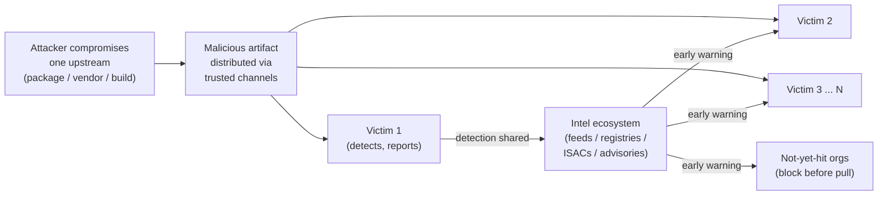
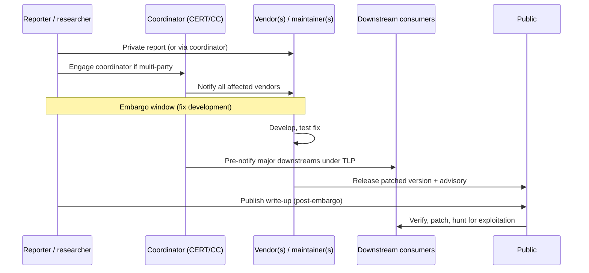
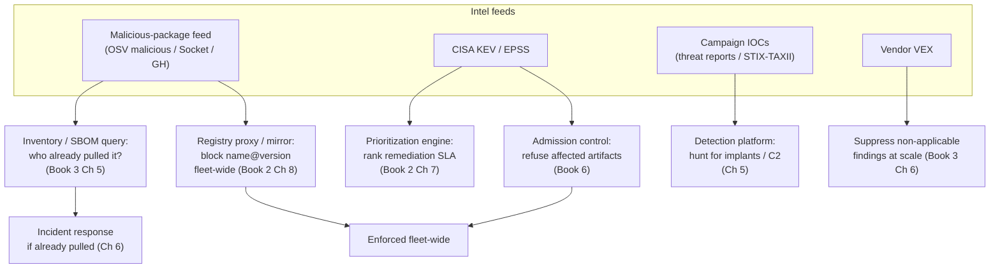
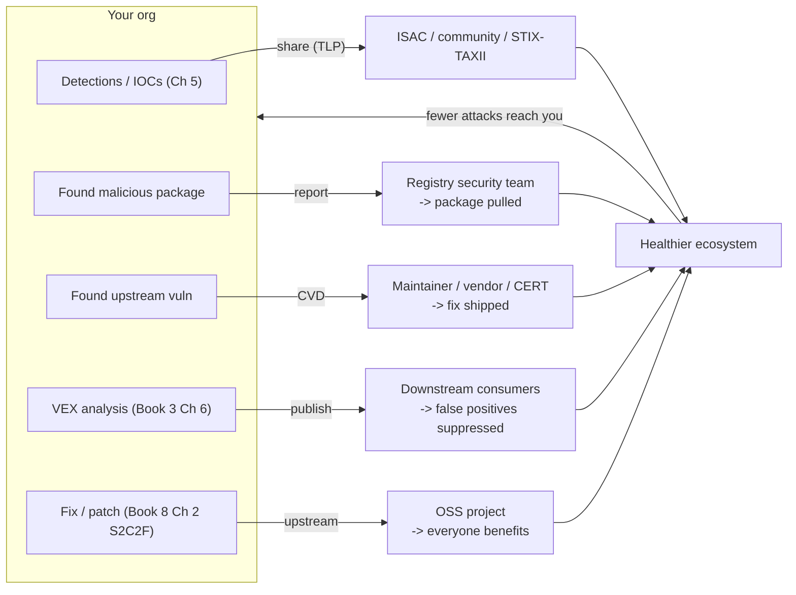
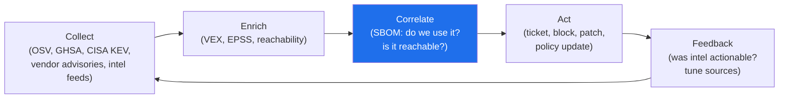
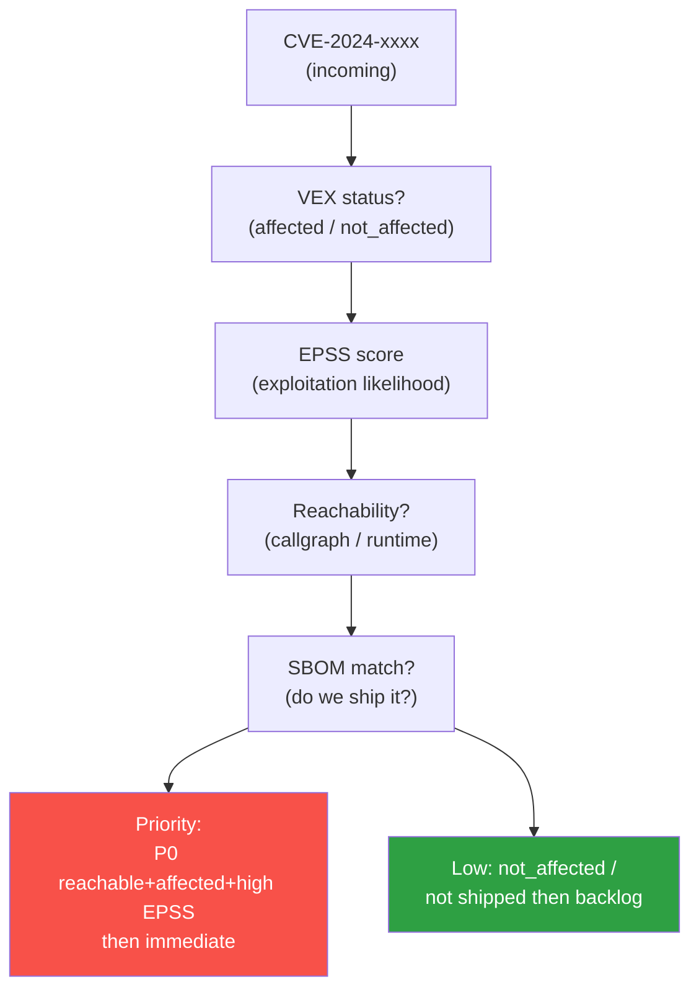
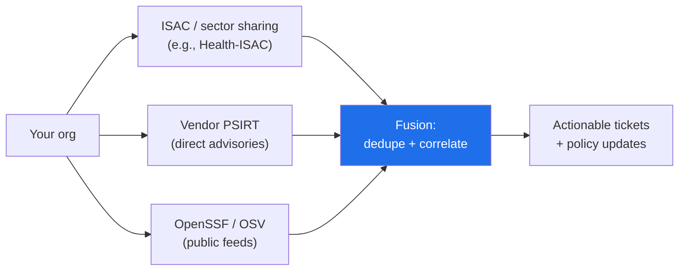

# Chapter 7 — Threat Intelligence and Information Sharing

*What this chapter covers.* Chapter 5 built detection — the telemetry and correlation that notices a
compromise inside your own fleet. Chapter 6 built the response that follows. But detection that starts
cold, from your own signals alone, is detection that starts late: the first organization to encounter a
malicious package, a compromised vendor, or a novel build-system implant pays full price in dwell time,
while everyone downstream inherits the same threat with no warning. Threat intelligence is the layer that
breaks that pattern. It is the mechanism by which *someone else's* detection becomes *your* early warning,
and by which your detection becomes theirs. This chapter is about both directions of that exchange: how to
consume supply-chain threat intelligence and wire it into the enforcement chokepoints the rest of this
suite built, and how — and why — to contribute back into the ecosystem you depend on.

The framing that makes this chapter different from a generic threat-intel primer is a property specific to
supply chains: they are a **shared-fate ecosystem**. A supply chain attack is almost never a single-target
operation. It is a *campaign* — one malicious `npm` package, one poisoned build server, one compromised
maintainer — that fans out to every organization pulling the same artifact (Book 1, Chapter 1). SolarWinds
was one build compromise and roughly 18,000 downstream victims. `event-stream` was one transferred package
and every project that transitively depended on it. When the unit of attack is "everyone who trusts the
same upstream," the unit of defense has to be collective too. The organization that finds the malicious
package and reports it to the registry protects everyone who has not yet pulled it. That is not altruism;
it is the only defense that scales to the actual shape of the threat.

Learning goals — after this chapter you should be able to:

- Explain why threat intelligence is disproportionately valuable for supply chain defense specifically —
  the campaign/shared-fate structure — versus other security domains.
- Enumerate the real **sources** of supply-chain threat intelligence — malicious-package feeds,
  vulnerability intel, campaign/actor intel, transparency-log and ecosystem monitoring, and your own
  telemetry — and know what each actually provides.
- Map the **information-sharing ecosystem**: ISACs/ISAOs, CISA, CERT/CC and national CERTs, FIRST, and the
  machine-readable formats (STIX/TAXII, OSV, VEX, GHSA) that let sharing scale.
- **Operationalize** intel by wiring it into enforcement: malicious-package feeds auto-blocking at the
  registry chokepoint, KEV/EPSS driving fleet-wide prioritization, IOCs feeding fleet detection — so that
  "are we exposed, and can we block it everywhere?" becomes a query with an automated answer.
- Run **Coordinated Vulnerability Disclosure** in both roles — as the reporter who found a bug upstream and
  as the vendor who received one — and understand why supply-chain vulns complicate the choreography.
- Make the **shared-fate argument** for contributing back — reporting malicious packages, disclosing
  responsibly, publishing VEX, upstreaming fixes — as a rational fleet-defense investment.

## Why threat intelligence matters more for supply chain

In classic enterprise security, threat intelligence is useful but bounded: knowing that an actor is
phishing your sector tells you to tighten email defenses, but the attack still has to land on *you*
specifically. Supply chain flips that. The attack has already been engineered once, upstream, and is now
being *distributed* to you through a channel you have deliberately configured to trust — your package
manager, your base image, your vendor's auto-updater. The malice is pre-positioned in something thousands
of organizations will fetch. This has three consequences that make intelligence structurally more valuable
here than almost anywhere else.

**Attacks are campaigns, and campaigns are observable before they reach you.** A malicious-package wave —
say, a burst of typosquats or a dependency-confusion flood targeting an ecosystem (Book 2, Chapter 3) —
hits registries as a *population* of packages published over hours or days. The first researcher or
automated scanner to catch one, and the registry's own detection, can characterize the whole wave: the
author accounts, the install-script patterns, the C2 endpoints, the naming scheme. By the time it would
reach the thousandth victim, it is *known-bad* — if that victim is consuming the feed. The dwell-time
asymmetry that made SolarWinds and Codecov so damaging (nine months and two months of undetected
operation, Book 1, Chapter 3 and 5) exists precisely because the victims were *not* wired into a signal
that someone, somewhere, could have raised earlier.

**One detection protects many.** Because the attack is the same artifact everywhere, a single accurate
detection is a fleet-wide — indeed ecosystem-wide — control if it is shared. When Andres Freund reported
the xz backdoor to the `oss-security` mailing list on 29 March 2024 (Book 1, Chapter 5), the value was not
that *his* box was clean. It was that within hours every distribution, every registry, and every scanner
vendor could pull the affected version range and the IOCs and protect their entire user base before the
backdoored `liblzma` reached stable channels. His detection became millions of organizations' early
warning. That is the shared-fate multiplier, and it only fires if the intelligence moves.

**The defender population is also the sensor population.** Every organization consuming the same upstream
is a potential sensor for compromise in that upstream. If even a small fraction of them detect and report,
the ecosystem's mean-time-to-detect collapses for everyone. This is collective defense in the literal
sense: the value of the network of defenders scales super-linearly with participation, because each
participant both consumes early warning and produces it. The tragedy-of-the-commons failure mode (Book 1,
Chapter 8) — everyone consumes, nobody contributes — is the thing that degrades it, and much of the second
half of this chapter is about why contributing is self-interested.



The rest of this chapter treats intelligence as a two-way pipe wired into the machinery of Books 2 through
7, not as a report you read.

## Sources of supply-chain threat intelligence

Intelligence is only as good as its sources, and the supply-chain domain has a specific, real set of them.
They divide into five families by what they tell you: *these specific packages are malicious*, *these
vulnerabilities exist and are being exploited*, *these actors and techniques are active*, *this ecosystem
behavior is anomalous*, and *here is what we ourselves have seen*.

### Malicious-package feeds

This is the family unique to software supply chains, and the highest-leverage one, because it produces
*blockable identifiers* — specific package names and versions that are known-bad — rather than abstract
risk. The core public source is the **OpenSSF Malicious Packages** dataset
(`github.com/ossf/malicious-packages`), an OpenSSF project that aggregates confirmed-malicious package
reports across ecosystems (npm, PyPI, RubyGems, crates, and others) into a normalized, machine-readable
form consumable through OSV (Book 2, Chapter 4). It is the closest thing the ecosystem has to a shared
"known-bad packages" blocklist.

Alongside it: **GitHub's malware detection**, which surfaces malicious npm and PyPI packages as advisories
in the GitHub Advisory Database (Book 2, Chapter 5); the **Datadog `malicious-software-packages-dataset`**
(`github.com/DataDog/malicious-software-packages-dataset`), a large open corpus of captured malicious
package samples and their manifests, useful both as a feed and as training/validation data for your own
detection; and **OpenSSF Package Analysis** (`github.com/ossf/package-analysis`), which dynamically
sandboxes newly published packages across registries and flags anomalous behavior — network egress,
file writes, process execution during install — producing a *behavioral* feed of suspicious publications
in near-real time.

On the commercial side, **Socket**, **Phylum** (now part of Veracode), and similar vendors (Book 2,
Chapter 4) provide curated, faster-moving malicious-package intelligence with install-time and
behavioral analysis, often integrated directly into the registry-proxy or CI path so a known-bad package
is refused before it is installed. The distinguishing property of this whole family is *actionability*:
its output is a `name@version` you can push to an enforcement point today.

### Vulnerability intelligence

Distinct from malicious packages (deliberately hostile code someone published) is vulnerability
intelligence — flaws in otherwise-legitimate software. The stack here is the one Book 2 built on:

- **OSV** (`osv.dev`) and the **GitHub Advisory Database (GHSA)** — the machine-readable, per-ecosystem
  vulnerability feeds keyed to exact affected version ranges, designed for automated matching by scanners
  like `osv-scanner` (Book 2, Chapter 5). OSV is the aggregation point; GHSA is one of its largest
  upstream feeds and a community intel source in its own right, since anyone can propose advisories.
- **NVD / CVE** — the canonical identifier space, valuable as the join key even where its enrichment lags.
- **CISA KEV** (Known Exploited Vulnerabilities catalog) — the highest-signal prioritization input in the
  set. KEV lists vulnerabilities with *confirmed active exploitation in the wild*, established under CISA
  Binding Operational Directive 22-01 (November 2021). A vuln appearing in KEV is not a prediction; it is
  an observation that attackers are using it *now* (Book 2, Chapter 7).
- **EPSS** (Exploit Prediction Scoring System) — maintained by a FIRST Special Interest Group, EPSS
  produces a daily-updated probability (0–1) that a given CVE will be exploited in the next 30 days
  (Book 2, Chapters 5 and 7). Where KEV is a binary observation, EPSS is a continuous forecast, and the
  two are complementary: KEV says "exploited," EPSS says "likely to be."
- **Vendor advisories and VEX** — vendors' own statements about vulnerabilities in their products, and
  their **VEX** (Vulnerability Exploitability eXchange) documents asserting *whether a given CVE actually
  affects a given product* — "not affected, because the vulnerable function is never called" (Book 3,
  Chapter 6). VEX is both consumed as intel (it suppresses false positives at scale) and, as we will see,
  produced as a contribution.

### Campaign and actor intelligence

Above individual indicators sits the intelligence about *who* and *how*: the actors running supply-chain
campaigns and the techniques they use. The nation-state supply-chain operations of the last several years
— the Orion build-system compromise behind SolarWinds, the trojanized 3CX desktop app, the xz backdoor —
are the canonical studies (Book 1). Attribution here should be hedged: SolarWinds was attributed by the US
government to Russian foreign-intelligence (SVR / the actor tracked as APT29), 3CX was widely attributed by
incident responders to a North Korea-nexus actor (the Lazarus cluster), and the xz operation, though
clearly the work of a patient, well-resourced actor operating under the "Jia Tan" persona, was not
conclusively attributed at disclosure. Treat all such attributions at the confidence level the reporting
actually supports (Book 1's discussion applies).

The practical sources are the **vendor threat reports** from Mandiant, CrowdStrike, Microsoft (MSTIC),
and peers — the primary narrative accounts of campaigns, complete with IOCs and TTPs — and the structuring
framework that makes them comparable: **MITRE ATT&CK**. ATT&CK's supply-chain coverage centers on
technique **T1195 — Supply Chain Compromise**, with sub-techniques **T1195.001** (compromise software
dependencies and development tools), **T1195.002** (compromise software supply chain — the vendor-artifact
case, i.e., SolarWinds), and **T1195.003** (compromise hardware supply chain). ATT&CK gives you a shared
vocabulary for "which supply-chain techniques are the actors targeting *us* actually using," which is the
input to threat-informed defense later in this chapter (Book 1, Chapter 2 and Chapter 6).

### Transparency-log and ecosystem monitoring

A supply-chain-specific source with no analogue in classic threat intel: the public logs and registries
that *record* legitimate supply-chain activity can be monitored for *illegitimate* activity. **Rekor**, the
Sigstore transparency log (Book 5, Chapter 5), records signing events; monitoring it for entries under
*your* signing identities that you cannot account for is a detection for key or identity misuse. **Certificate
Transparency (CT) logs** serve the analogous function for TLS/certificate issuance. **Registry monitoring**
— watching npm/PyPI/registry feeds for new publications under your namespaces, or for typosquats of your
package names — turns the registry's own public activity stream into intel. And **dependency-ecosystem
anomaly feeds** (OpenSSF Package Analysis again, plus maintainer-account-takeover and repo-anomaly
signals) catch the *behavioral* precursors of a wave. The common thread: the supply chain is unusually
*observable* because so much of it is deliberately transparent, and that transparency is an intelligence
source you can subscribe to.

### Your own telemetry as intelligence

Finally, the detection platform of Chapter 5 is itself an intelligence source — the most contextual one you
have, because it is about *your* environment. A hash mismatch your integrity checks caught, a build-egress
anomaly your CI monitoring flagged, a malicious package your registry proxy blocked: each is a datum that
(a) drives your own response and (b), suitably sanitized, is exactly what the ecosystem needs from you. The
consume/contribute loop closes here — your detections feed back out. Keep this in view through the sections
that follow, because the operationalization and contribution halves of this chapter are the two directions
of the same pipe.

The following table maps each source family to what it provides and where in this suite you action it. It
is the spine of the chapter: *intel is only valuable if it drives a control.*

| Intel source | What it provides | How to action it (control / book) |
|---|---|---|
| OpenSSF Malicious Packages, Datadog dataset, GitHub malware advisories | Confirmed-malicious `name@version` identifiers | Block at registry proxy/mirror, fleet-wide; query inventory for prior pulls (Book 2 Ch 8; Book 3 Ch 5) |
| OpenSSF Package Analysis, Socket, Phylum | Behavioral/near-real-time suspicious-package signals | Refuse at install/CI; quarantine pending review (Book 2 Ch 4, Ch 8) |
| OSV / GHSA | Known vulns keyed to version ranges | Automated scanning and matching against SBOM inventory (Book 2 Ch 5; Book 3 Ch 5) |
| CISA KEV | Confirmed active exploitation | Top-priority remediation SLA; admission-block affected artifacts (Book 2 Ch 7; Book 6) |
| EPSS | Exploitation probability forecast | Risk-rank the long tail below KEV (Book 2 Ch 5, Ch 7) |
| Vendor advisories + VEX | Product-specific affected/not-affected assertions | Suppress non-applicable findings; trigger vendor IR (Book 3 Ch 6; Book 8 Ch 3) |
| Vendor threat reports + MITRE ATT&CK (T1195.x) | Actor TTPs, campaign IOCs | Threat hunts; prioritize controls to real threats (Ch 5; Book 1 Ch 2, Ch 6) |
| Rekor / CT logs / registry monitoring | Signing/issuance/publication anomalies | Alert on unaccounted entries under your identities (Book 5 Ch 5) |
| Your own detection platform | First-party detections and IOCs | Drive response; contribute back to ecosystem (Ch 5, Ch 6; this chapter) |

## The information-sharing ecosystem

Sources produce intelligence; the sharing ecosystem *moves* it. Understanding the ecosystem matters because
you are not a passive reader of it — you join it, and where you join determines both what early warning you
receive and how your own findings propagate. It has three layers: the formal sharing bodies, the
machine-readable formats that let sharing scale, and the open-source community mechanisms specific to the
software supply chain.

### Formal sharing bodies

**ISACs — Information Sharing and Analysis Centers** — are sector-based non-profits (FS-ISAC for financial
services, IT-ISAC for information technology, H-ISAC for health, and many others, loosely coordinated by
the National Council of ISACs) that pool threat intelligence among members in the same industry, on the
theory that organizations in a sector face the same adversaries. **ISAOs — Information Sharing and Analysis
Organizations** — are the more general form, established by US Executive Order 13691 (2015) to let sharing
groups form around any affinity, not only recognized critical-infrastructure sectors. For a supply-chain
program, the relevant ISAC is both your sector's (which will circulate vendor-compromise and campaign intel
touching your industry) and, increasingly, technology-specific sharing forums.

**CISA** (the US Cybersecurity and Infrastructure Security Agency) is the national coordination hub: it
publishes advisories and alerts, operates the **KEV** catalog, coordinates disclosure for significant
vulnerabilities, and issues Binding Operational Directives that (for federal agencies) turn intel into
mandated action. For a private organization CISA is a high-signal, free feed and, during a major event
(Log4Shell, xz), the de-facto clearinghouse.

**CERT/CC** — the CERT Coordination Center at Carnegie Mellon's Software Engineering Institute — is the
elder statesman of **coordinated vulnerability disclosure (CVD)**. When a vulnerability affects many
vendors at once (the common supply-chain case), CERT/CC acts as the neutral coordinator between reporter
and the affected vendors, running the embargo and the multi-party timeline; its VINCE platform
(Vulnerability Information and Coordination Environment) is the tooling for exactly the many-downstream
disclosures that supply-chain vulns produce. National CERTs/CSIRTs (e.g., country-level teams) play the
same role regionally.

**FIRST** — the Forum of Incident Response and Security Teams — is the global community that ties the
incident-response teams together, and it owns several of the standards this chapter relies on: it stewards
**CVSS**, hosts the **EPSS** SIG, and maintains the **Traffic Light Protocol (TLP)** — the TLP:RED /
AMBER / AMBER+STRICT / GREEN / CLEAR labels (TLP 2.0) that govern how far a piece of shared intelligence
may be redistributed. TLP is small but load-bearing: it is the handshake that lets organizations share
sensitive intel (a not-yet-public vendor compromise, say) with the confidence it will not leak past the
intended audience.

### Machine-readable formats: sharing at scale

Human-readable advisories do not scale to fleet size. The shift that makes intelligence *automatable* is
the move to structured, machine-readable formats, and the supply-chain-relevant ones are:

- **STIX / TAXII** — **STIX** (Structured Threat Information eXpression, currently STIX 2.1) is the OASIS
  standard data model for threat intelligence: indicators, observables, threat actors, campaigns,
  attack-patterns (which map to ATT&CK), and the relationships among them, all as typed JSON objects.
  **TAXII** (Trusted Automated eXchange of Intelligence Information) is the companion HTTPS-based transport
  protocol for pulling and pushing STIX over the wire. Together they are how ISACs, CISA, and commercial
  feeds deliver machine-consumable intel that your TIP (threat-intelligence platform) or SIEM can ingest
  and auto-action without a human retyping IOCs.
- **OSV** — the vulnerability *and* malicious-package interchange format (`osv.dev` schema), the
  supply-chain-native standard that keys everything to exact package versions for automated matching
  (Book 2, Chapters 4–5).
- **VEX** — as a *sharing* format. A VEX document is a machine-readable statement of exploitability, and
  when a vendor publishes "product X is not affected by CVE-Y because the vulnerable code path is
  unreachable," that is intelligence shared downstream that suppresses a false alarm across every consumer
  at once (Book 3, Chapter 6). VEX is intel-sharing in the affirmative-negative: it shares *safety*, not
  just threat.
- **GHSA** — GitHub Security Advisories, both as a database and as a *contribution surface*: advisories are
  community-authored, so GHSA is simultaneously a feed you consume and a channel you publish into.

| Body / format | Layer | Role in the ecosystem |
|---|---|---|
| ISAC / ISAO | Sharing body | Sector/affinity-based pooling of threat intel among members |
| CISA | Sharing body | US national hub: advisories, KEV, coordination, directives |
| CERT/CC + national CERTs | Sharing body | Neutral coordinator for multi-vendor CVD; VINCE tooling |
| FIRST | Community/standards | Global IR community; stewards CVSS, EPSS, TLP |
| STIX / TAXII | Format + transport | Structured, automatable threat-intel exchange (OASIS) |
| OSV | Format | Version-keyed vuln + malicious-package interchange |
| VEX | Format | Machine-readable exploitability ("(not) affected because…") |
| GHSA | Feed + contribution | Community advisory database; consume and publish |

### The open-source community layer

The software supply chain has a sharing mechanism most security domains lack: the open-source community
itself functions as a distributed threat-intelligence and response network, and it is often *faster* than
the formal bodies. The **OpenSSF** (Book 1, Chapter 8) coordinates much of the tooling (Package Analysis,
Malicious Packages, OSV, Scorecard). The **registry security teams** at npm, PyPI, RubyGems, and others are
the enforcement endpoints: a security researcher or maintainer who finds a malicious package reports it,
and the registry pulls it — protecting every future puller. **GHSA** is the community advisory feed.
**huntr** (`huntr.com`, run by Protect AI) and other **bug-bounty** programs create an economic incentive
for researchers to find and responsibly report vulnerabilities in open-source dependencies rather than sell
them. When a malicious-package wave hits, the response is frequently a matter of *hours*, driven by this
loose network of researchers, registry admins, and scanner vendors — a collective-defense reflex that the
formal ISAC/CERT machinery complements but does not replace.

## Coordinated Vulnerability Disclosure

Disclosure deserves its own treatment because it is the process through which a large fraction of
supply-chain intelligence is *created*, and because in a supply chain you will occupy both sides of it.

**Coordinated Vulnerability Disclosure (CVD)** is the choreographed dance among a reporter (who found a
vulnerability), the vendor or maintainer (who must fix it), optionally a coordinator (CERT/CC when many
parties are involved), and the public (who eventually needs to know to protect themselves). The core
tension is timing: disclose too early and you arm attackers before a fix exists; disclose too late — or
never — and defenders stay exposed while the vulnerability quietly rots, or gets independently rediscovered
and exploited. CVD manages that tension with an **embargo**: a private window, conventionally on the order
of 90 days (with variation), during which the vendor develops and ships a fix before public disclosure,
after which details are released so defenders can verify remediation and detect exploitation.



The supply-chain twist is that supply-chain vulnerabilities are almost always **multi-party** — a flaw in a
widely-used library affects thousands of downstream products, each of which must ship its own patched
build. Single-vendor CVD is a two-party negotiation; supply-chain CVD is a coordination problem across an
entire dependency graph, which is exactly why CERT/CC's coordinator role and TLP-governed pre-notification
exist. **Log4Shell** (CVE-2021-44228, Book 1, Chapter 5) is the cautionary study: it was reported
responsibly to Apache (by the Alibaba Cloud security team in late November 2021), and Apache was preparing a
coordinated release — but a proof-of-concept and details leaked publicly around 9 December 2021 before the
coordination completed, and disclosure went from orderly to chaotic overnight. Attackers were mass-scanning
within hours; defenders were patching a still-moving target as follow-on CVEs in the same library landed.
The lesson is not that CVD failed but that supply-chain CVD is *fragile*: the more downstream parties who
must be pre-notified, the larger the surface from which the embargo can break, and the more consequential
the break when it happens.

You will be on **both sides** of this process, and a mature program is competent at both:

- **As reporter.** Your teams find vulnerabilities in your dependencies — a bug in an open-source library,
  a flaw in a vendor product. The responsible path is CVD: report privately to the maintainer or vendor
  (via their `SECURITY.md` / security contact or a coordinator), agree an embargo, and hold disclosure
  until a fix ships. Doing this well earns you standing in the ecosystem and, pragmatically, a fix for a
  bug you were exposed to anyway.
- **As receiver.** Someone finds a vulnerability in *your* software and reports it to you. You need a
  published intake path (a `security.txt` / `SECURITY.md`, a monitored security inbox, ideally a program on
  a platform researchers already use), a triage-and-fix process, and a disclosure practice. This is not
  optional under the emerging regulatory regime: the EU **Cyber Resilience Act** imposes affirmative
  vulnerability-handling and disclosure/notification obligations on manufacturers of products with digital
  elements, including reporting actively-exploited vulnerabilities within tight windows (Book 8, Chapter 1).
  CVD-as-receiver is becoming a legal duty, not merely a courtesy.

## Consuming and operationalizing intelligence

Everything above is inert until it changes what your systems do. The defining principle — and the point
the distributed-systems lens sharpens — is that **at fleet scale, intelligence must be automated and wired
directly into enforcement.** A human reading an advisory and manually chasing exposure across hundreds of
services is not a program; it is a bottleneck that guarantees the intel arrives too late. The goal is a set
of standing integrations where a feed update *mechanically* produces a control action.



### Block the known-bad package everywhere, now

The single most important supply-chain intelligence capability is this: **the moment a package version is
known-malicious, block it across the entire fleet and identify everyone who already pulled it.** It is the
intersection of three things this suite already built:

1. A **malicious-package feed** producing the `name@version` (this chapter).
2. The **registry chokepoint** — the internal proxy/mirror through which all dependency pulls flow (Book 2,
   Chapter 8) — which is the single control point where a block, once applied, is *fleet-wide* by
   construction. Every service pulls through it; deny there and you deny everywhere.
3. The **fleet inventory / SBOM index** (Book 3, Chapter 5) — which turns the same identifier into the
   query "which of our services already have this?" for the retrospective half of the response.

Wired together, a feed entry becomes, within minutes and without human fan-out: *(a)* a deny rule at the
proxy so no further service can pull the bad version, and *(b)* an inventory query producing the exact list
of already-affected services to hand to incident response (Chapter 6). This is the concrete, operational
form of "consume intel." A sketch of the enforcement layer:

```yaml
# Registry-proxy denylist, populated automatically from a malicious-package feed.
# The proxy (Book 2 Ch 8) is the chokepoint: a deny here is fleet-wide.
policy: deny-known-malicious
source_feed: "osv-malicious-packages"   # + Socket/Phylum/GH advisories, merged
rules:
  - ecosystem: npm
    package: "@some-scope/compromised-lib"
    versions: ["1.4.2", "1.4.3"]        # exact bad versions from the feed
    action: deny
    reason: "OSV MAL-2024-xxxx: install-script credential exfiltration"
  - ecosystem: pypi
    package: "typo-squatted-name"
    versions: ["*"]                      # whole package is malicious
    action: deny
```

```bash
# The retrospective half: query the fleet SBOM index for prior pulls (Book 3 Ch 5).
$ fleet-sbom query --purl "pkg:npm/%40some-scope/compromised-lib@1.4.2"
service            first_seen            image_digest
api-gateway        2024-05-02T09:11Z     sha256:3f9a...   <-- already deployed
batch-worker       2024-05-02T14:03Z     sha256:0b21...   <-- already deployed
# -> two services confirmed exposed; hand to IR (Ch 6), rotate any exposed secrets.
```

### KEV and EPSS driving prioritization

Vulnerability intel operationalizes as **prioritization**, not blocking (most vulns are not worth an
emergency, and treating them as if they were is how remediation programs drown). The wiring: your scanners
match SBOM inventory against OSV/GHSA; the resulting findings are then *ranked* by intel. A finding whose
CVE is in **CISA KEV** jumps to the top with a tight SLA — it is being exploited *now*. Below KEV, **EPSS**
orders the long tail by exploitation probability so effort flows to the ~2% of vulns that actually carry
exploitation risk rather than being spread uniformly across thousands of low-probability findings (Book 2,
Chapter 7). At fleet scale this ranking is not advisory; it is the input to an automated SLA-assignment and,
for the worst cases, an admission-control block (Book 6) that stops newly-affected artifacts from deploying.

### IOCs feeding fleet detection

Campaign intelligence — the IOCs and TTPs from threat reports, ideally delivered as STIX over TAXII — feeds
the **detection platform** of Chapter 5. Known C2 domains and implant hashes become sweep queries across
the fleet ("has any workload beaconed to this domain; does any artifact match this hash"); ATT&CK technique
mappings become hunt hypotheses ("the actor targeting our sector uses T1195.002 build-system compromise —
do our build-egress and provenance signals show it"). The value is turning a narrative report into standing
queries against your own telemetry, so that yesterday's disclosed campaign becomes today's automated hunt.

### Threat-informed defense

Finally, campaign and actor intelligence should *shape which controls you invest in*. **Threat-informed
defense** means using ATT&CK and the intel about actors actually targeting your sector to prioritize the
supply-chain controls that matter for *your* threat model rather than uniformly hardening everything (Book
1, Chapter 6). If the credible threat to your organization is nation-state build-system compromise
(T1195.002), the marginal dollar goes to hermetic builds, provenance, and reproducibility (Book 4); if it
is opportunistic malicious-package waves (T1195.001), it goes to registry-proxy blocking and behavioral
package analysis (Book 2). Intelligence is what lets you make that allocation from evidence instead of from
the vendor with the loudest booth.

## Contributing back: the shared-fate argument

Consumption is half the pipe. The other half — contributing intelligence back — is where the shared-fate
nature of supply chains turns what looks like altruism into fleet-defense self-interest. The argument is
mechanical, not moral: because a supply-chain attack is the same artifact hitting everyone who trusts the
same upstream, *a healthier upstream is a smaller attack surface for you specifically*. Every malicious
package you get pulled from a registry is one you (and your dependency graph) can never pull again. Every
vulnerability you responsibly disclose and get fixed upstream is one removed from the software you were
going to ship anyway. Contribution is a control on your own supply chain, applied at the source.



The concrete contribution channels, each mapping to something you already do internally:

- **Report malicious packages** to the registry security teams (npm, PyPI, and peers) and to the OpenSSF
  Malicious Packages dataset when your registry proxy or package analysis catches one. This is the highest-
  leverage single act in the chapter: it converts your one detection into an ecosystem-wide block.
- **Disclose vulnerabilities responsibly** via CVD when you find them in dependencies or vendor products —
  the reporter role above. Use the maintainer's security contact or CERT/CC for multi-party cases.
- **Share IOCs and detections** through your sector ISAC and the broader community, TLP-labeled, ideally as
  STIX over TAXII so they are machine-ingestible by recipients. Your Chapter 5 detections are exactly the
  early warning the next org needs.
- **Publish VEX** for the software you ship (Book 3, Chapter 6). When you have analyzed that a CVE in one of
  your dependencies does not actually affect your product, publishing that determination saves every one of
  your downstream consumers the same analysis — and, symmetrically, is the input others' automation
  consumes to suppress false positives at scale.
- **Contribute to OSS security** by upstreaming fixes rather than carrying private patches — the S2C2F
  **Fix + Upstream** practice (Book 8, Chapter 2). A fix you keep private protects only you and rots against
  the next release; a fix you upstream protects everyone and is maintained by the project.

The counterweight is the **tragedy of the commons** (Book 1, Chapter 8): the open-source substrate everyone
depends on is maintained by a comparatively tiny, often unpaid population, and the rational-free-rider
temptation is to consume the early warning without ever producing any, and to depend on critical libraries
without ever funding or contributing to them. That under-investment is *itself* a supply-chain risk — the
xz backdoor succeeded partly because a critical library had a single overworked maintainer susceptible to a
patient social-engineering takeover (Book 1, Chapter 5). The initiatives fighting this — OpenSSF's funding
and tooling work, the Sovereign Tech Fund, corporate OSS-contribution programs — are worth engaging with
precisely because they harden the upstream you inherit. Contribution is not charity you can afford to skip;
it is maintenance on infrastructure you are already standing on.

## Distributed-systems lens

At fleet scale, the entire consume-and-contribute loop of this chapter has to be **machine-to-machine**,
because the volume and velocity defeat any human-in-the-loop design. Three properties fall out of that.

**Intel must terminate in enforcement, automatically.** A malicious-package feed that emails a security
analyst is a program that blocks the bad package hours or days after it was known — after more services have
pulled it. The same feed wired to the registry proxy (Book 2, Chapter 8) blocks it fleet-wide in minutes,
and the same identifier queried against the SBOM index (Book 3, Chapter 5) enumerates the already-exposed
services with no manual fan-out. KEV/EPSS wired to the prioritization engine (Book 2, Chapter 7) ranks the
whole fleet's remediation queue on every daily feed update. IOCs delivered as STIX/TAXII and pushed into the
detection platform (Chapter 5) become standing sweeps. The measure of a fleet-scale intel program is the
count of feeds that produce a control action with no human between the update and the enforcement.

**Correlation with inventory is what makes intel answer questions.** The recurring fleet capability this
suite builds — the SBOM-and-asset index that answers "where is X in our fleet" (Book 3, Chapter 5) — is the
join key that turns every intel item into an exposure query. "Is this newly-disclosed malicious version
anywhere in our fleet, and can we block it everywhere?" is not a project when the inventory and the
chokepoint already exist; it is a query and a deny-rule. That is the entire operational payoff, and it is
why the intel layer is worthless without the inventory and enforcement layers beneath it.

**Machine-readable formats are the enabling substrate.** STIX/TAXII, OSV, VEX, and the OSV-keyed
malicious-package datasets exist precisely so that intelligence can be *consumed and produced by machines*
at scale. A program that depends on humans transcribing IOCs from PDF threat reports does not scale past a
handful of services; a program built on structured feeds and structured contribution scales to the whole
fleet and the whole ecosystem. Adopt the formats not for elegance but because they are the only thing that
lets both directions of the pipe run at fleet velocity.

And the loop is genuinely bidirectional. The organization both **consumes** — pulling early warning to
block, detect, and prioritize across the fleet — and **contributes** — pushing its detections, disclosures,
VEX, and fixes back so the ecosystem's mean-time-to-detect drops for everyone, itself included. In a
shared-fate ecosystem, that second direction is not a cost center bolted onto the security program. It is
the same automated inventory-provenance-verify-monitor machinery pointed *outward*, and it is a rational
fleet-defense investment: the upstream you help harden is the upstream that attacks you next.

### Threat intel lifecycle for supply chain



### Indicator enrichment pipeline



### Trust groups for intel sharing



## Key takeaways

- **Supply chain is a shared-fate ecosystem; that makes intelligence disproportionately valuable.** Attacks
  are campaigns — one compromised upstream, many downstream victims — so one organization's detection is the
  whole ecosystem's early warning if it is shared. Collective defense here is not idealism; it matches the
  actual shape of the threat.

- **Know the five source families and what each provides.** Malicious-package feeds (OpenSSF Malicious
  Packages, Datadog dataset, Package Analysis, Socket/Phylum) give blockable `name@version` identifiers;
  OSV/GHSA/NVD/KEV/EPSS give vulnerability intel and prioritization; vendor threat reports and MITRE ATT&CK
  (T1195.x) give actor TTPs; Rekor/CT/registry monitoring give ecosystem anomalies; your own detection
  platform (Ch 5) is itself a source.

- **The sharing ecosystem has bodies, formats, and a community layer.** ISACs/ISAOs, CISA, CERT/CC, and
  FIRST are the formal bodies; STIX/TAXII, OSV, VEX, and GHSA are the machine-readable formats that let
  sharing scale; and the OSS community (OpenSSF, registry security teams, GHSA, huntr) is a fast,
  supply-chain-specific response network. FIRST stewards CVSS, EPSS, and TLP.

- **CVD is a two-sided competency, and supply-chain CVD is fragile.** You are both reporter (found a bug
  upstream) and receiver (someone found one in your software — now a CRA obligation, Book 8 Ch 1).
  Multi-party supply-chain disclosure needs a coordinator (CERT/CC) and TLP-governed embargoes; Log4Shell
  shows how a leak turns coordinated disclosure chaotic when thousands of downstreams must be notified.

- **Intel is worthless until it drives a control — automate the wiring.** Malicious-package feed → block at
  the registry chokepoint fleet-wide + inventory query for prior pulls (Book 2 Ch 8, Book 3 Ch 5); KEV/EPSS
  → prioritization and admission (Book 2 Ch 7, Book 6); IOCs → fleet detection (Ch 5); VEX → false-positive
  suppression (Book 3 Ch 6). The central capability is "block the known-bad package everywhere, now, and
  find who already pulled it."

- **Contributing back is self-interested, not charitable.** Reporting malicious packages, disclosing
  responsibly, sharing IOCs, publishing VEX, and upstreaming fixes (S2C2F Fix+Upstream, Book 8 Ch 2) all
  harden the upstream you inherit. In a shared-fate ecosystem a healthier ecosystem is a smaller attack
  surface for you; the tragedy-of-the-commons free-rider posture is itself a supply-chain risk (xz, Book 1
  Ch 5).

## Further reading

- **CISA Known Exploited Vulnerabilities (KEV) catalog** (`cisa.gov/known-exploited-vulnerabilities-catalog`)
  and **Binding Operational Directive 22-01** — the confirmed-exploitation feed and the directive that
  established it. The single highest-signal prioritization input. (Book 2, Chapter 7.)
- **FIRST — EPSS** (`first.org/epss`) and **Traffic Light Protocol 2.0** (`first.org/tlp`) — the
  exploitation-probability model and the redistribution-control labels that govern shared intel. FIRST also
  stewards CVSS. (Book 2, Chapter 5.)
- **OpenSSF Malicious Packages** (`github.com/ossf/malicious-packages`), **OpenSSF Package Analysis**
  (`github.com/ossf/package-analysis`), and the **Datadog `malicious-software-packages-dataset`** — the open
  malicious-package feeds and behavioral-analysis tooling that produce blockable identifiers. (Book 2,
  Chapters 3–4.)
- **OSV** (`osv.dev`) and the **GitHub Advisory Database** (`github.com/advisories`) — the version-keyed
  vulnerability and malicious-package interchange, consumable by `osv-scanner`. (Book 2, Chapter 5.)
- **OASIS STIX 2.1 and TAXII 2.1 specifications** (`oasis-open.github.io/cti-documentation`) — the standard
  data model and transport for automatable threat-intel exchange. The substrate for machine-to-machine
  sharing at fleet scale.
- **CERT/CC — "The CERT Guide to Coordinated Vulnerability Disclosure"** and the **VINCE** platform
  (`kb.cert.org`) — the definitive treatment of multi-party CVD, exactly the many-downstream case supply
  chains produce.
- **MITRE ATT&CK — Supply Chain Compromise (T1195, incl. .001/.002/.003)** (`attack.mitre.org`) — the TTP
  vocabulary for threat-informed defense and for mapping campaign intel to hunt hypotheses. (Book 1,
  Chapters 2 and 6.)
- **Vendor threat reports** — Mandiant, CrowdStrike, and Microsoft (MSTIC) analyses of the SolarWinds, 3CX,
  and xz operations — the primary campaign narratives and IOC sources. Read with attribution treated at the
  confidence the reporting supports. (Book 1, Chapters 3 and 5.)
- **CISA supply-chain advisories and the ICT Supply Chain Risk Management resources** (`cisa.gov`) — the US
  national-hub advisories and the clearinghouse role during major events (Log4Shell, xz).
- **CISA/NTIA VEX documentation** and the **CycloneDX / CSAF VEX** profiles — VEX as a sharing format for
  downstream exploitability determinations. (Book 3, Chapter 6.)
- Cross-references within this series: Book 1, Chapters 1, 2, 5, 6, 8 (campaign structure, ATT&CK, xz/
  Log4Shell, threat modeling, tragedy of the commons); Book 2, Chapters 3–5, 7–8 (malicious-package
  detection, OSV/GHSA, KEV/EPSS prioritization, registry chokepoint); Book 3, Chapters 5–6 (SBOM inventory,
  VEX); Book 4 (build integrity for T1195.002); Book 5, Chapter 5 (Rekor transparency-log monitoring); Book
  8, Chapters 1–3, 5–6 (regulatory/CRA disclosure duties, S2C2F Fix+Upstream, vendor IR, detection,
  incident response).
