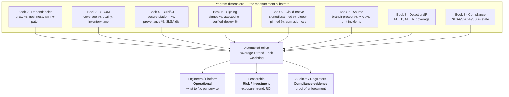
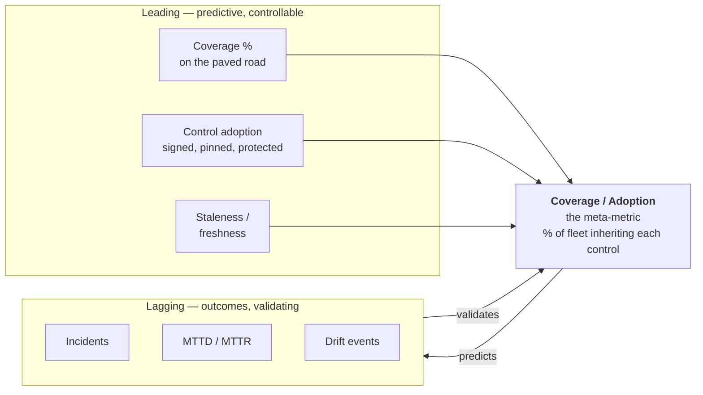
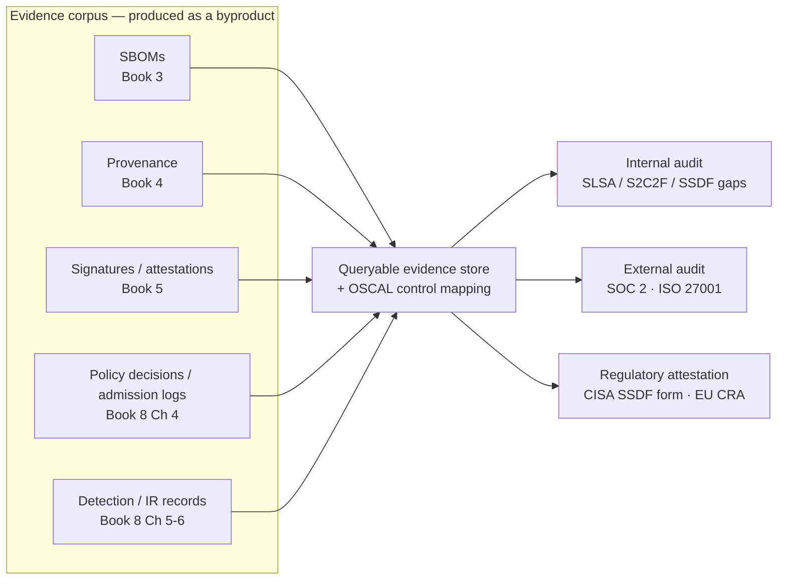
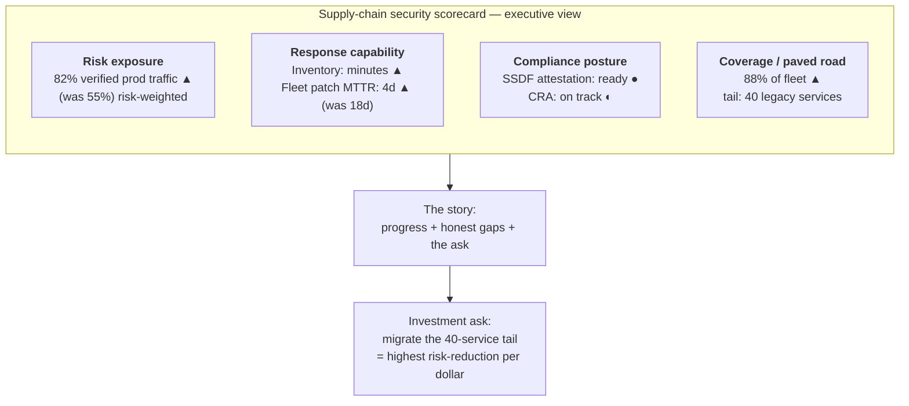
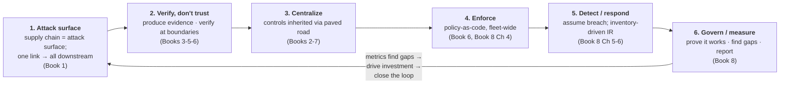

# Chapter 8 — Metrics, Audits, and Executive Reporting

*What this chapter covers.* This is the last chapter of Book 8 and the last chapter of the whole
volume, and it has two jobs. The first is the chapter's stated subject: how you *measure* a
supply-chain security program, *prove* it works, and *report* it to the people who fund it and the
people who audit it. The second is to land the plane — to step back from seventy-odd chapters of
threats, dependencies, SBOMs, builds, signatures, admission control, source integrity, policy, and
incident response, and answer the only question that ultimately matters to an organization: *is the
program working, and how do you know?* Those two jobs are the same job. Metrics are how a program
knows itself. Everything the previous seven books built — the internal proxy, the SBOM pipeline, the
hermetic builds, the signatures and attestations, the admission gates, the protected source, the
detection substrate, the policy engine — produces data as a byproduct of doing its job, and that
data *is* the measurement layer. A program that produces verifiable evidence at every boundary is,
almost for free, a program that can measure and report itself. That is not a coincidence. It is the
payoff.

We will do four things. First, frame *why* you measure and for *whom* — because the same fact means
three different things to an engineer, an executive, and an auditor, and getting the audience wrong
is how good programs get defunded. Second, synthesize *what* to measure across every dimension the
volume built, with an unsparing eye on the difference between real coverage tied to risk and vanity
numbers that measure nothing. Third, treat audits and continuous compliance honestly — the shift
from the annual point-in-time scramble to always-current evidence. Fourth, translate all of it into
the language leadership actually speaks — risk, trend, response capability, and regulatory posture —
and close with a synthesis of the whole volume's argument.

Learning goals — after this chapter you should be able to:

- Explain why a program must be measured at all, and tailor metrics and framing to three distinct
  audiences: engineers/platform teams, leadership, and auditors/regulators.
- Build a program scorecard organized by the volume's dimensions (dependencies, SBOM, build,
  signing, cloud-native, source, detection/IR, compliance), and choose **leading vs lagging**
  indicators deliberately.
- Recognize **coverage/adoption** as the meta-metric of a platform-based program, and distinguish it
  from capability-without-adoption.
- Detect and avoid **vanity metrics** and **metric gaming**, and tie every number to actual risk
  (threat model, reachability, exposure) rather than to activity.
- Design the **structural end-state tests** — "can an unsigned artifact reach prod?", "can one actor
  ship unreviewed code?" — as the strongest possible metrics.
- Run internal and external **audits** against SLSA/S2C2F/SSDF, SOC 2, and ISO 27001, and understand
  **continuous compliance** and the audit-ready evidence corpus.
- Produce an **executive report**: risk-framed, trended, honest about gaps, with clear asks — and
  answer the board's post-SolarWinds question, *"are we exposed, and how fast can we tell?"*

## Why measure at all

Start with the management truism and then earn it. *You cannot manage, improve, or justify what you
do not measure.* All three verbs matter, and they are why an unmeasured program is not merely
un-optimized but structurally doomed.

You cannot *manage* it because you cannot see it. A fleet of hundreds of services generates changes
faster than any human can inspect. Without measurement, "how are we doing on supply-chain security?"
has no answer better than anecdote — the last incident, the loudest team, the demo that went well.
Anecdote does not tell you where the next SolarWinds gets in. Measurement turns the fleet from an
opaque mass into a surface you can reason about: here is our coverage, here is the uncovered tail,
here is where the risk concentrates.

You cannot *improve* it because improvement is a delta and a delta requires a baseline. "We made the
build pipeline more secure this quarter" is unfalsifiable without a number attached. Was it 40% of
builds on the hardened platform, now 75%? Was MTTR-to-patch a vulnerable dependency eleven days, now
four? Improvement that cannot be stated as a movement between two measured points is improvement you
are asserting, not demonstrating — which is exactly what cargo-cult security does (Book 1, Chapter 7).
The distinction between a real program and a theater program is often *only visible in the metrics*:
both have SBOMs and signatures; only one can show that the SBOMs are consumed and the signatures
verified.

You cannot *justify* it because a security program is a cost center asking for budget, and budget is
allocated against demonstrated value — the failure mode that kills more programs than any technical
gap. Security spends money to make bad things *not happen*, and non-events are invisible. The team
that prevented the breach looks identical, on the budget line, to the team that got lucky — until the
metrics tell the difference: risk exposure reduced by this much, response capability improved from
*months* to *hours*, coverage extended from the easy 30% to the hard 90%.

The through-line of the whole volume gives this a sharper form. Every technical chapter ended with a
control that *only counts if something enforces it* (Book 8, Chapter 4). Metrics are the analogous
statement for the program as a whole: **a control only counts if you can show its coverage.** "We
sign our artifacts" is a capability claim. "98.6% of artifacts deployed to production last quarter
carried a valid signature and a required provenance attestation, verified at admission, up from 71%"
is a *program* claim — and the gap between the two is the entire subject of this chapter.

### Three audiences, three framings

The single most common reporting mistake is producing one report for everyone. A supply-chain
security program has three distinct audiences, and each needs different metrics *and* different
framing of the same metric. The same underlying fact — say, "62% of container images run on
pinned digests" — is an action item to one audience, a risk statement to another, and a piece of
compliance evidence to the third.

**Engineers and platform teams** need *operational* metrics: specific, disaggregated, actionable.
The right granularity is per-service, per-repository, per-pipeline, because the engineer's question
is "what do *I* need to fix?" A dashboard row that says `payments-api: image not signed, base image
90 days stale, 2 reachable criticals unpatched` is useful. The fleet aggregate "94% signed" is
useless to that engineer — it hides them in the compliant majority. Operational metrics must name
the uncovered tail, because the tail is the work. This audience also tolerates — needs — leading
indicators, the predictive ones, because their job is to move the number before it becomes an
incident.

**Leadership** needs *risk and investment* framing: aggregated, trended, and stated in the currency
of business decisions. An executive does not want (and should not be given) SLSA levels per pipeline.
They want "our supply-chain risk exposure and how it's trending," "our ability to respond to the next
Log4Shell," "our compliance posture for the markets we sell into," and "where the next dollar of
security investment reduces the most risk." The metrics are the same underlying data as the
engineers' — but rolled up, weighted by risk, and translated. We devote the last third of this
chapter to getting this translation right, because it is the one most technical teams do worst.

**Auditors and regulators** need *evidence*: proof, with a record, that a stated control was actually
enforced on actual artifacts over a stated period. This audience does not accept capability claims;
they sample. "Show me every production deployment in Q3 and prove each one passed signature
verification" is an auditor question, and the answer is not a dashboard — it is the queryable
decision log and attestation corpus that Chapter 4 built. This is the compliance framing: the SSDF
practice, the SOC 2 control, the CRA obligation, mapped to the enforced policy and its evidence
(Chapter 1, Chapter 4).

The discipline is to build *one* measurement substrate and produce *three* views from it. The
substrate is the telemetry the program already emits. The three views are audience-specific
projections. Conflating them — showing engineers the risk-weighted executive rollup, or handing
auditors a marketing dashboard — is how the report loses the room.

## What to measure: synthesizing the whole program

Here is the core of the chapter, and the place where the volume's argument becomes a set of numbers.
We organize the metrics by the program's dimensions, one per book, because that mapping is also the
map of the whole volume. For each dimension we name the *meaningful* metrics — the ones tied to risk
— and note whether each is leading or lagging and which audience it primarily serves.

### The dimensions, book by book

**Dependencies and open source (Book 2).** The dependency layer is the most-attacked and the
best-instrumented, because the internal proxy of Book 2, Chapter 6 sees every fetch. The metrics that
matter:

**SBOM and transparency (Book 3).** The recurring warning of the whole suite lives here in its
sharpest form. The naive metric is "% of artifacts with an SBOM," and it is close to worthless.

**Build and CI/CD (Book 4).**

**Signing and attestation (Book 5).**

- **% of artifacts signed** and **% with required attestations** — the coverage metrics for the
  cryptographic evidence layer (Book 5). Leading.
- **% of deploys through verified admission** — the enforcement metric: not "signed" but "verified at
  the boundary and rejected if not" (Book 5, Chapter 10; Book 6, Chapter 6). This is stronger than the
  signing coverage number, because it measures that the signature is *checked*, closing the gap the
  suite keeps warning about: producing evidence nobody verifies. Leading, and it feeds directly into
  the structural test below.

**Cloud-native (Book 6).**

- **% of images signed / scanned / on golden base images** (Book 6, Chapters 3–5). Leading.
- **% on digest-pinned references** — not floating tags (Book 6, Chapter 3). A `:latest` tag is a
  mutable pointer an attacker or a mistake can repoint; a digest is immutable. Leading.
- **Admission-policy coverage across clusters** — the fraction of clusters and namespaces where the
  admission controller actually enforces (not audits) the signing/provenance policy (Book 6, Chapter 6;
  Book 8, Chapter 4). A policy that runs in enforce mode on 3 of 40 clusters has 7.5% coverage, not
  100% — and the aggregate "we have admission control" hides exactly that.

**Source (Book 7).**

- **% of repos with branch protection / required review / signed commits / secret scanning** (Book 7,
  Chapters 3, 5, 8). Per-control coverage across the repository fleet, each leading.
- **% of developers on phishing-resistant MFA** — WebAuthn/hardware keys, not TOTP (Book 7, Chapter 6).
  This is a leading indicator against the account-takeover vector, and one of the highest-leverage
  numbers in the source dimension.
- **Drift incidents** — count of detected deviations from the enforced repository baseline (Book 7,
  Chapter 8). A rising drift rate is an early warning; a near-zero rate with high coverage is the
  goal. Lagging.

**Detection and incident response (Book 8, Chapters 5–6).**

- **MTTD / MTTR for supply-chain events** — mean time to detect and to respond, the classic
  security-operations pair, scoped to supply-chain signals (Chapter 5). Both lagging, both the numbers
  that would have exposed how badly the industry did on SolarWinds (nine months), Codecov (two
  months), and xz (caught by luck). A program with instrumented detection can state these; a program
  without cannot, which is itself a finding.
- **Detection coverage** — the fraction of lifecycle stages emitting the tripwire signals of Chapter 5
  into the correlation substrate. Leading.
- **IR readiness** — measured by drills, not hope: time-to-inventory and time-to-scope in a tabletop
  or game-day exercise (Chapter 6). Leading, and the proactive way to know your MTTR before the real
  incident forces the measurement.

**Compliance (Book 8, Chapters 1, 2, 4).**

- **Framework-level coverage** — the fraction of SLSA / S2C2F / SSDF requirements met, as a maturity
  position (Chapter 2). Leading.
- **Continuous-compliance state** — the fraction of controls whose evidence is *currently* green in
  the always-on compliance view (Chapter 4), as opposed to last-audited-green. Leading.

The following table consolidates the dimension → metric → type → audience mapping. It is the
skeleton of the program scorecard.

| Dimension (Book) | Key metric | Leading / Lagging | Primary audience |
|---|---|---|---|
| Dependencies (2) | % deps via internal proxy | Leading | Engineers |
| Dependencies (2) | Dependency staleness distribution | Leading | Engineers |
| Dependencies (2) | MTTR-to-patch across fleet | Lagging | Leadership |
| Dependencies (2) | % deps meeting Scorecard policy | Leading | Engineers/Audit |
| SBOM (3) | % artifacts with current, quality SBOM | Leading | Audit/Engineers |
| SBOM (3) | SBOM quality score | Leading | Engineers |
| SBOM (3) | MTTR-to-inventory ("where is X?") | Lagging | Leadership |
| Build/CI (4) | % builds on secure platform | Leading | Engineers/Leadership |
| Build/CI (4) | % artifacts with provenance | Leading | Audit |
| Build/CI (4) | SLSA level distribution | Leading | Leadership/Audit |
| Signing (5) | % artifacts signed / attested | Leading | Audit |
| Signing (5) | % deploys through verified admission | Leading | Leadership/Audit |
| Cloud-native (6) | % images signed/scanned/golden-base | Leading | Engineers |
| Cloud-native (6) | % on digest-pinned refs | Leading | Engineers |
| Cloud-native (6) | Admission-policy enforce coverage | Leading | Leadership/Audit |
| Source (7) | % repos branch-protected / reviewed / secret-scanned | Leading | Engineers/Audit |
| Source (7) | % devs on phishing-resistant MFA | Leading | Leadership |
| Source (7) | Drift incidents | Lagging | Engineers |
| Detection/IR (8.5–6) | MTTD / MTTR supply-chain | Lagging | Leadership |
| Detection/IR (8.5–6) | Detection stage coverage | Leading | Engineers |
| Detection/IR (8.5–6) | IR readiness (drill times) | Leading | Leadership |
| Compliance (8.1,2,4) | Framework coverage (SLSA/S2C2F/SSDF) | Leading | Audit/Leadership |
| Compliance (8.1,2,4) | Continuous-compliance green % | Leading | Audit |

### Leading vs lagging, and coverage as the meta-metric

Two organizing ideas run through that table, and both recur from Book 1, Chapter 10.

## Vanity, gaming, and measuring real risk

Now the honest part, and the part that separates a measurement program from a measurement theater.
Metrics are not neutral. The moment a number becomes a target, it starts to distort the behavior it
measures — Goodhart's law, and it is savage in security. Three failure modes recur.

**Gaming** is teams optimizing the metric instead of the outcome, and it is provoked by well-meaning
targets. The classic self-inflicted wound is the mandate "close all criticals within 7 days." It
sounds like risk reduction. In a large org it reliably produces *mass false-suppression*: under a
deadline they cannot meet with real fixes, teams mark findings as false-positive, won't-fix, or
accepted-risk *to make the number go green*, without doing the analysis. The dashboard turns green
while the actual exposure is unchanged or worse, because now the real criticals are buried in a pile
of reflexive suppressions nobody will revisit. The metric drove the opposite of its intent. This is
not hypothetical; it is the default outcome of naive vuln-SLA policies at scale.

The *right* way to handle the same pressure is the reachability-and-VEX discipline of Book 2,
Chapter 7. Instead of "close all criticals in 7 days," the meaningful target is "triage all criticals
in 7 days and remediate all *reachable* criticals in production within the risk-based SLA." VEX (the
Vulnerability Exploitability eXchange) is the structured, auditable way to say "this CVE is present
but not exploitable in our context, and here is the machine-readable justification" — which is the
legitimate version of the suppression that gaming does illegitimately. The difference is that a VEX
statement is *evidence*, reviewed and recorded, not a checkbox flipped to beat a clock. Measure
reachable-and-exploitable exposure, not raw finding counts, and the incentive to game largely
evaporates because there is no cheap way to move a risk-weighted number without reducing risk.

**Metrics that drive bad behavior** is the general category the 7-day mandate belongs to. Any metric
becomes a hazard when hitting it is easier by distorting reality than by improving it. The defense is
to tie every metric to *actual risk* — to the threat model (Book 1, Chapter 6) and to reachability
and exposure (Book 2, Chapter 7) — so that the cheapest path to a better number is a genuine risk
reduction.

The table below contrasts the vanity/gameable metric with its meaningful counterpart. The pattern is
consistent: replace activity with coverage-of-risk, replace raw counts with reachable/exploitable
exposure, replace existence with verification.

| Vanity / gameable metric | Why it misleads | Meaningful replacement |
|---|---|---|
| "4.2M components scanned" | Activity, not risk; only goes up | Reachable criticals in prod, and their trend |
| "1.1M vulnerabilities found" | A backlog dressed as progress | Exploitable exposure fixed vs. introduced (net) |
| "100% of repos have an SBOM" | Existence, not quality or use | % with current, quality SBOMs that are *consumed* |
| "100% of artifacts signed" | Signing without verification is theater | % of deploys *rejected* when unsigned (enforce) |
| "0 criticals open" (7-day mandate) | Provokes mass false-suppression | % reachable criticals remediated within risk SLA; VEX-justified suppressions reviewed |
| "We have admission control" | Says nothing about scope | % clusters/namespaces in *enforce* mode |
| "Malicious packages blocked: 900" | Context-free count | Block-rate trend, with detection-vs-targeting attribution |

### The structural end-state tests: the strongest metrics of all

There is a class of metric stronger than any percentage, and it is the natural endpoint of the
"structurally impossible" bar the volume built in Books 5 through 7. Instead of asking "what fraction
of artifacts are signed?" ask the *structural* question: **can an unsigned, unverified artifact reach
production at all?** If the honest answer is "no — the admission gate rejects it, in enforce mode, in
every cluster, with no bypass," then you do not need the coverage percentage, because the
percentage is definitionally 100 and, more importantly, it *cannot regress without someone
deliberately dismantling a gate*. A coverage metric measures the current state of a fleet that could
drift tomorrow. A structural test measures a property of the system that holds until someone changes
the system — and changing it is itself a reviewed, logged, high-blast-radius event (Book 8,
Chapter 4).

These are the best metrics a mature program has, because they are binary, adversarial, and
regression-resistant. State them as pass/fail claims and verify them by *trying to violate them* — a
red-team check, not a self-report.

| Structural test | The question | Passing state | Built in |
|---|---|---|---|
| Unsigned-artifact-to-prod | Can an unsigned/unattested artifact deploy? | Admission rejects, enforce mode, no bypass | Book 5 Ch 10; Book 6 Ch 6 |
| Unverified-provenance | Can an artifact without valid SLSA provenance run? | Policy denies at admission | Book 4 Ch 3; Book 8 Ch 4 |
| Single-actor-code-path | Can one person ship code to prod unreviewed? | Required review + protected branches block it | Book 7 Ch 3, 5 |
| Direct-to-upstream dependency | Can a build pull a dependency bypassing the proxy? | Network/policy prevents egress | Book 2 Ch 6, 10 |
| Untracked artifact | Can something deploy with no SBOM/provenance record? | No record → no admission | Book 3; Book 5 |
| Floating-tag deploy | Can a mutable `:latest` reach prod? | Digest-pinning enforced | Book 6 Ch 3 |

The migration from percentage metrics to structural tests is itself a maturity signal. Early, you
report "72% of deploys verified" and drive it up. Mature, you report "verification is structurally
mandatory; here is the red-team confirmation that we could not bypass it, and here is the count of
exception grants, all scoped and expiring." The second is a far stronger statement of security
posture, and it is exactly what an auditor and a board both want to hear.

## Audits: internal, external, and continuous

Metrics feed audits, and audits are where the program's claims meet an adversarial reviewer. Three
kinds matter, and the volume's evidence corpus changes the character of all three.

The crucial insight is the arrow's direction: **the evidence corpus is a byproduct of doing the
security work, not a separate workstream.** The SBOMs exist because Book 3 built the pipeline. The
provenance exists because Book 4 hardened the build. The attestations exist because Book 5 signed the
artifacts. The decision logs exist because Book 4 (this book) enforced policy. An organization that
did the technical work of Books 2–7 *already has* the audit-ready artifacts; the audit becomes a
projection over data it generates anyway. An organization that skipped the technical work and tries to
pass the audit with documentation is doing the scramble — and the scramble is the tell that the
program is theater.

**Regulatory attestation** is the sharpest external form. The U.S. CISA Secure Software Development
Attestation Form requires a software producer selling to the federal government to attest, by a
responsible executive's signature, that its development aligns with SSDF (NIST SP 800-218) practices
(Book 8, Chapter 1). The EU Cyber Resilience Act imposes ongoing obligations — including SBOM
provision and vulnerability handling — on products with digital elements placed on the EU market
(Chapter 1). These are not audits you can cram for; they are attestations an executive signs, with
personal and corporate liability attached. They are the ultimate reason the metrics must be *real*:
someone is signing their name to them.

## Executive reporting: translating to the language of the business

Everything above is inert until it reaches the people who fund the program, and reaching them
requires a translation most engineering teams do badly. Leadership does not care about SLSA levels,
Rego policies, or SBOM formats — not out of ignorance, but because those are *implementation*, and
leadership's job is *risk and capital allocation*. The report that lands frames the same data in four
currencies:

### The scorecard and dashboard

The vehicle for this is a rolled-up, trended, risk-framed **scorecard** — a single view that
collapses the whole dimension table into a small number of headline indicators, each with a trend and
a risk weighting, plus a drill-down for the audiences that need it. The design principles:

- **Roll up, but preserve the tail.** The headline is the aggregate; the drill-down names the
  uncovered services, because the aggregate hides exactly the work that matters.
- **Trend over snapshot.** A single number is nearly useless; the *direction and slope* is the story.
  "82%" means little; "82%, up from 55%, accelerating" is a narrative leadership can act on.
- **Risk-weight the rollup.** A percentage that treats all services equally lies about risk. Weight by
  blast radius (data sensitivity, internet exposure, traffic) so the number tracks actual exposure.
- **Benchmark.** Comparison gives an absolute number meaning. Internally, rank teams (carefully — this
  can provoke gaming). Externally, the **OpenSSF Scorecard** run org-wide gives a comparable posture
  measure per repository (Book 2, Chapter 10), and framework maturity (SLSA/S2C2F level distribution,
  Book 8, Chapter 2) benchmarks you against a published standard rather than a vibe.

**Cadence and story.** Report on a regular cadence — a monthly or quarterly executive readout, backed
by an always-live dashboard for those who want to look between readouts. And *tell a story*, in three
beats: **progress** (the trends moving the right way, credibly attributed to specific investments),
**honest gaps** (the uncovered tail, the dimensions behind, the risks you are carrying — because a
report with no gaps is not believed, and rightly), and **the ask** (the specific next investment and
the risk it retires). The honest-gaps beat is what earns the trust that makes the ask land. A report
that is all green is a report leadership learns to discount; a report that says "here is where we are
strong, here is precisely where we are exposed, and here is what closing it costs" is a report that
gets funded.

### The one metric that matters most to a board

Since SolarWinds and Log4Shell, boards ask a supply-chain question they did not ask before, and it is
strikingly consistent across industries: *"Are WE exposed to this — and how fast can we tell, and
fix?"* When the next widely-exploited component vulnerability is disclosed — and there will be a next
one — the board does not want a lecture on SLSA. They want to know, that afternoon, whether the
organization is affected and how long remediation takes. That question decomposes into exactly two
metrics the whole volume was secretly building toward:

- **MTTR-to-inventory** — "how fast can we tell?" — delivered by the SBOM and inventory infrastructure
  of Book 3. In minutes, not weeks, because the fleet's components are indexed and queryable.
- **MTTR-to-remediate across the fleet** — "how fast can we fix?" — delivered by the paved-road
  platform of Books 2, 4, and 6: patch once in the base image or the proxy allowlist, rebuild, and let
  admission control roll it out fleet-wide.

This is the punchline of the measurement chapter and, in a sense, of the entire volume. **The single
most leadership-relevant metric is fleet response capability, and response capability is precisely
what the platform program delivers.** Every other chapter's work — the proxy, the SBOMs, the
provenance, the signatures, the admission gates, the protected source, the detection substrate —
converges on the ability to answer, quickly and truthfully, "are we exposed, and how fast can we
fix?" A program that answers in hours has justified itself to any board; one that cannot is, from the
board's chair, indistinguishable from no program at all. Measure that number, report it, and drive it
down — it connects every technical control to the one question leadership actually asks.

## Capstone: the whole volume in one argument

This is the last section of the last chapter, so we step all the way back. Eight books, and one
argument running through all of them. It is worth stating the argument as a whole, because seeing it
whole is the point of a capstone, and because the argument is a *loop* that metrics close.

**One: the supply chain is the attack surface.** Book 1 established the premise the whole volume rests
on: a compromise of any link — a dependency, a build server, a signing key, a maintainer's account,
a base image — propagates to *everything downstream*. SolarWinds was one build server; it reached
~18,000 organizations. Log4Shell was one logging library; it was everywhere at once. xz was one
maintainer; it nearly backdoored a large fraction of the internet's servers. The supply chain is not
a peripheral concern to application security; it *is* the attack surface, because software is
assembled from thousands of other people's components through dozens of other people's tools, and any
one of them is a path in.

**Two: shift from trust to verification.** The recurring mechanism of every real supply-chain attack
is *trust abuse* — the malice arrives wearing the costume of legitimate, authorized activity (Book 8,
Chapter 5). The only structural answer is to stop trusting position and start *verifying evidence*:
**produce** verifiable evidence at every step (SBOMs — Book 3; provenance — Book 4; signatures and
attestations — Book 5) and **verify** it at every boundary (admission — Books 5–6). Trust becomes a
thing you check, not a thing you assume.

**Three: centralize controls into a platform.** Verification at every boundary across a fleet of
hundreds of services cannot be each team's job — that does not scale and it drifts (the argument of
every platform chapter, Books 2 through 7). Centralize the controls into a paved road and let security
be *inherited*: route dependencies through one proxy, build on one hardened platform, sign through one
service, deploy through one admission gate. Do the hard security engineering once; make it the default
path.

**Four: enforce uniformly via policy.** A paved road that is optional is a suggestion. Enforcement —
policy-as-code evaluated at every gate, uniformly, across the fleet (Book 8, Chapter 4; admission,
Book 6) — is what turns "we recommend signing" into "unsigned artifacts cannot deploy." Enforcement is
also what generates the decision log that becomes the evidence corpus.

**Five: detect and respond, because prevention fails.** Prevention against trust-abuse is never
complete, because the attacker satisfies the very authorization the control checks (Book 8,
Chapters 5–6). So assume breach: instrument every stage as a tripwire, correlate the weak signals,
and build the inventory-driven response that turns "are we affected?" into a query.

**Six: govern and measure.** And this book — the ability to know the program works, find its gaps,
justify its cost, and satisfy the auditor and the regulator. Governance and measurement are how the
program sees itself.

Metrics and reporting are the arrow that closes the loop. Measurement takes the outcomes of detection
and response, the coverage of enforcement, the adoption of the platform, and the state of compliance,
and feeds them back to the top: *here is where the attack surface is still exposed, here is where
verification does not yet reach, here is the uncovered tail of the paved road, here is where to invest
next.* A program without this loop is open-loop — it applies controls and hopes. A program with it is
a control system: it senses its own state, compares to the desired state, and drives the error down.
That is the difference between security as a pile of tools and security as an *engineered system*, and
it is the note the volume ends on because it is the note the volume began on.

**The mature end state.** Put it together and picture the fleet the volume has been building toward.
Every artifact carries verifiable provenance, a current high-quality SBOM, and signatures with
required attestations. Every boundary — intake, build, registry, admission, runtime — verifies that
evidence and rejects what fails, structurally, so an unsigned or unverified artifact *cannot* reach
production and one actor *cannot* ship unreviewed code. Controls are inherited by default because
everything is on the paved road, and enforced uniformly because policy-as-code evaluates every gate.
Compromise is detectable because every stage is a tripwire, and response is fast because inventory is
a query and remediation is a fleet-wide rebuild. And all of it is measured continuously and reported
honestly — to engineers as work items, to leadership as risk and response capability, to auditors as
always-current evidence. That fleet answers the board's question — *are we exposed, and how fast can
we tell and fix?* — in hours, with evidence. That is the realization of the whole volume: not a
document that says you are secure, but a running system that demonstrates it, and knows when it isn't.

## Distributed-systems lens

Measuring a supply-chain program is itself a fleet-scale distributed-systems problem, and the volume's
infrastructure is what solves it — which is why the measurement layer is nearly free once the program
exists.

- **The telemetry *is* the metrics substrate.** You do not build a separate measurement system. The
  same infrastructure the suite already built — the SBOM distribution and inventory layer (Book 3,
  Chapter 5), the build telemetry and provenance store (Book 4, Chapter 9), the detection correlation
  substrate (Book 8, Chapter 5), the policy decision logs (Chapter 4) — *is* the data plane over which
  metrics are computed. Metrics collection is automated aggregation across every stage and service,
  not manual survey. At fleet scale, any metric that requires a human to go ask each team is a metric
  you will never have current; only metrics that fall out of the running system as a byproduct are
  sustainable.
- **Coverage/adoption is a distributed-inventory query.** The meta-metric — what fraction of the fleet
  inherits each control — is a join over the fleet's inventory: which services route through the
  proxy, which pipelines are on the platform, which clusters enforce admission. Computing it correctly
  across hundreds of services with partial, eventually-consistent data is a real distributed-data
  problem, and it is the same problem the SBOM inventory solves. Measuring the paved road's reach is
  the same operation as answering "where is component X?"
- **Response capability is the fleet-scale metric that matters.** MTTR-to-inventory and
  MTTR-to-remediate are inherently distributed measurements — they measure how fast a query and a fix
  propagate across the whole fleet. They are the numbers that matter most to leadership precisely
  because they measure the *system's* behavior, not any one service's, and only the platform program
  can deliver them.
- **Continuous measurement replaces the manual audit.** The shift from point-in-time audit to
  continuous compliance is the same shift distributed systems made from batch reconciliation to
  streaming state: governance stops being a periodic job that reconstructs the past and becomes
  running infrastructure that reports the present. Governance as a continuously-running control system
  over the fleet — that is the distributed-systems framing of this entire book.

## Key takeaways

- **Measure to manage, improve, and justify.** An unmeasured program is invisible to its operators,
  has no baseline for improvement, and is indistinguishable from luck to its funders. Metrics turn "we
  do supply-chain security" into "here is our coverage, our risk reduction, our gaps, and our trend."
- **One substrate, three audiences.** Engineers need operational, per-service metrics (what to fix);
  leadership needs risk/investment framing (exposure, trend, ROI); auditors need evidence of
  enforcement. Build one measurement layer, project three views — conflating them loses the room.
- **Measure real coverage tied to risk, not vanity.** "4M components scanned," "1M vulns found," "100%
  have an SBOM" reflect activity, not risk. Replace them with reachable/exploitable exposure, current+
  quality+*consumed* SBOMs, and *verified* (not merely signed) deploys.
- **Coverage is the meta-metric.** For a platform program, a control's value equals its coverage of
  the fleet; capability without adoption is worth zero. Don't measure whether the control exists —
  measure what fraction of the fleet inherits it, and hunt the uncovered tail. The tail is the attack
  surface.
- **Balance leading and lagging.** Leading indicators (coverage, adoption, staleness) are predictive
  and controllable — steer by them. Lagging indicators (incidents, MTTD, MTTR, drift) are outcomes —
  validate by them. Neither alone is a program.
- **Beware gaming; measure risk, not the metric.** "Close all criticals in 7 days" produces mass
  false-suppression, not fixes. Tie targets to reachability and exposure (Book 2, Chapter 7) and use
  VEX for auditable, evidence-backed exceptions, and the incentive to game largely disappears.
- **Structural tests are the strongest metrics.** "Can an unsigned artifact reach prod?" and "can one
  actor ship unreviewed code?" are binary, adversarial, and regression-resistant. A passing structural
  test beats any coverage percentage: it measures a property of the system, not a snapshot of a fleet
  that could drift tomorrow.
- **Audit honestly; let evidence be a byproduct.** Self-assess to the enforced-and-evidenced standard,
  not generously (the cargo-cult trap). Continuous compliance replaces the annual scramble because
  enforcement *is* the evidence — the SBOMs, provenance, attestations, and decision logs the program
  already emits are the audit-ready corpus, mapped via OSCAL.
- **Report in the language of the business.** Risk exposure and trend, response capability, compliance/
  market access, and where investment retires the most risk — not SLSA levels. Tell the story in three
  beats — progress, honest gaps, the ask. All-green reports get discounted; honest-gap reports get funded.
- **The board's question is the program's purpose.** "Are we exposed, and how fast can we tell and
  fix?" decomposes into MTTR-to-inventory and MTTR-to-remediate — exactly what the platform program
  delivers. Fleet response capability is the most leadership-relevant metric and the volume's
  convergence point.
- **The whole volume is a loop.** Attack surface → verify not trust → centralize → enforce → detect/
  respond → govern/measure → back to the top. Metrics close the loop, turning a pile of controls into
  an engineered control system that drives its own error down. The mature end state is a fleet that can
  *prove* — not assert — that it is secure, and know when it isn't.

## Further reading

- **NIST SP 800-55, *Measurement Guide for Information Security*** — <https://csrc.nist.gov/pubs/sp/800/55/v1/final> —
  the foundational treatment of security metrics: measures, targets, and the distinction between
  implementation, effectiveness, and impact metrics.
- **NIST SP 800-218 (SSDF)** — <https://csrc.nist.gov/pubs/sp/800/218/final> — the practice set that
  regulatory attestation (the CISA form) maps to; the measurement target for the compliance dimension.
- **CISA Secure Software Development Attestation Form** — <https://www.cisa.gov/resources-tools/resources/secure-software-development-attestation-form> —
  the executive-signed regulatory attestation that makes real metrics non-optional.
- **NIST OSCAL** — <https://pages.nist.gov/OSCAL/> — the machine-readable control/assessment format
  that turns compliance from a binder into a diffable data structure (revisited from Chapter 4).
- **SLSA v1.0 specification** — <https://slsa.dev/spec/v1.0/> — for the build-level distribution
  metric and the provenance-verification structural test.
- **OpenSSF Scorecard** — <https://github.com/ossf/scorecard> — automated, comparable repository
  posture checks for org-wide benchmarking (revisited from Book 2, Chapters 9–10).
- **OpenSSF Security Metrics / Security Insights** and the **OpenSSF Best Practices Badge** —
  <https://openssf.org/> — community efforts on comparable open-source security measurement.
- **CycloneDX VEX** and the **CISA VEX** documents — <https://www.cisa.gov/vulnerability-exploitability-exchange-vex> —
  the auditable, evidence-backed way to express "present but not exploitable," and the antidote to
  suppression-driven metric gaming.
- **SOC 2 (AICPA Trust Services Criteria)** and **ISO/IEC 27001:2022** — for the external-audit
  framings (revisited from Book 8, Chapters 1 and 3); Type II and the ISMS test *operating
  effectiveness over a period*, which is what continuous compliance delivers cheaply.
- **EU Cyber Resilience Act** — <https://eur-lex.europa.eu/eli/reg/2024/2847> — the ongoing SBOM and
  vulnerability-handling obligations that make measurement a market-access requirement (Chapter 1).
- Marks & Meunier and the SRE literature on **SLIs/SLOs** (Google SRE Book, <https://sre.google/books/>) —
  the discipline of choosing indicators that reflect what you actually care about, directly transferable
  from reliability to security measurement.
- Cross-references within this suite: Book 1, Chapters 6, 7, 10 (threat modeling, cargo-cult, metrics
  and coverage); Book 2, Chapters 7, 9, 10 (reachability/VEX, health, intake policy); Book 3, Chapters
  4, 5 (SBOM generation and distribution); Book 4, Chapters 3, 9, 10 (provenance, telemetry, adoption);
  Book 5, Chapter 10 and Book 6, Chapter 6 (verified admission); Book 7, Chapters 3, 6, 8 (review, MFA,
  repository integrity at scale); and Book 8, Chapters 1, 2, 4, 5, 6 (regulation, frameworks, continuous
  compliance, detection, and incident response).
