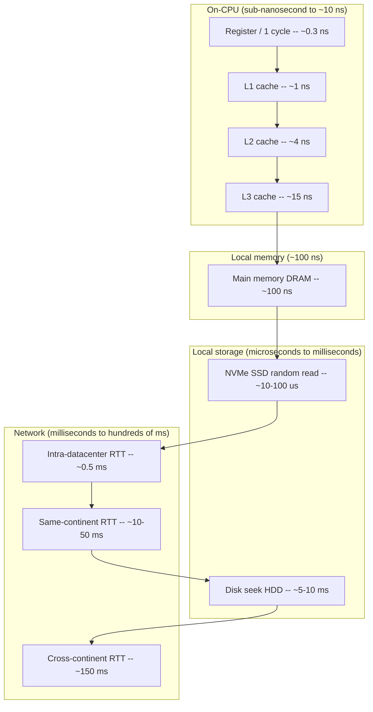
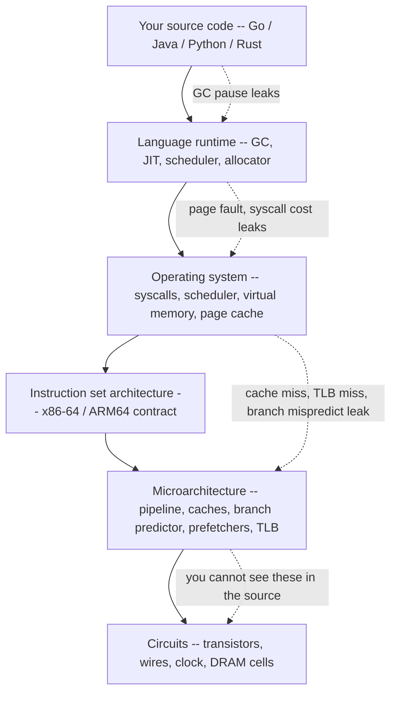
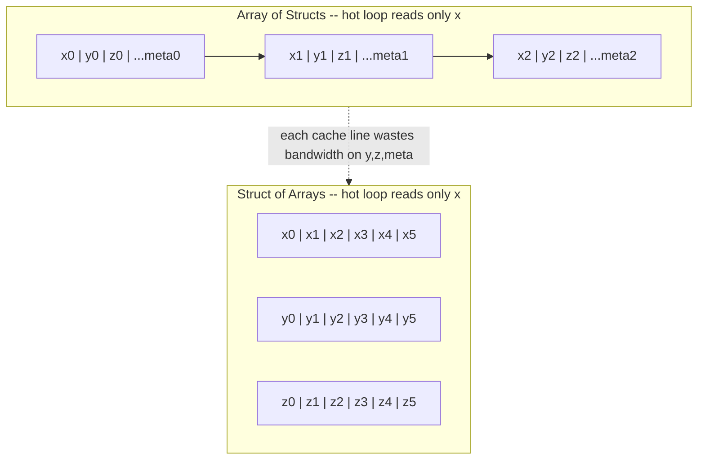
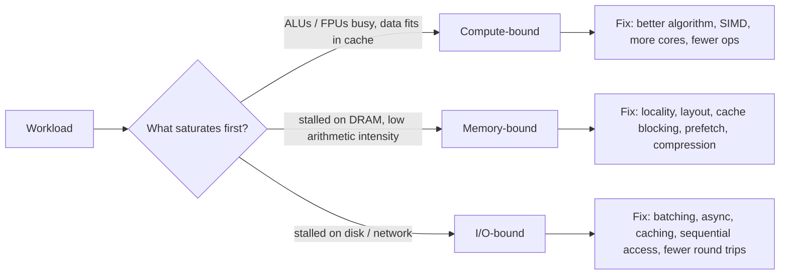

# Chapter 1 — Why Architecture Matters: Mechanical Sympathy

**What this chapter covers.** This is the opening chapter of a volume about the machine
underneath your services. Its job is to convince you that a senior backend engineer — one
who spends their days thinking in terms of services, queues, RPCs, and SLOs — cannot
reason about performance, cost, or tail latency without a working model of the hardware
those abstractions run on. We introduce *mechanical sympathy*: the discipline of writing
software that works *with* the grain of the hardware rather than against it. We anchor it
in the numbers every engineer should carry in their head — the latency hierarchy that
spans roughly nine orders of magnitude from a register access to a cross-continent
round trip. We trace the abstraction stack from your source code down to circuits and show
where performance *leaks* through those abstractions in ways your source cannot express. We
argue that all of this matters *more*, not less, at fleet scale, where a constant-factor
inefficiency multiplies across thousands of nodes into real money and blown latency
budgets. Finally, we lay out the mental model and the roadmap for the rest of the volume.

This chapter is deliberately a motivating opener. The concrete effects we tease here —
cache misses, branch mispredictions, NUMA, false sharing, sequential vs. random I/O — each
get a full chapter later. Here we draw the map.

Learning goals — after this chapter you should be able to:

- Define mechanical sympathy and explain its origin and its backend-engineering meaning:
  that latency, throughput, and cost are ultimately set by hardware behavior your
  high-level code hides.
- Recite the latency hierarchy to the correct *order of magnitude* — register, L1/L2/L3
  cache, DRAM, SSD, intra-datacenter network, disk seek, cross-continent — and explain why
  spanning nine orders of magnitude means *which tier you hit* dominates performance.
- Name the layers of the abstraction stack and identify, for a given performance symptom,
  which layer is leaking (a cache miss, a page fault, a syscall, a GC pause).
- Explain why data *movement*, not compute, usually dominates modern backend performance,
  and reason about a workload as compute-bound, memory-bound, or I/O-bound.
- Articulate why per-node hardware efficiency is a fleet-level cost and tail-latency
  concern, and why the network is just another (slow) tier of the same latency hierarchy.
- Apply the practitioner's stance: design for locality and sequential access, assume you
  cannot intuit modern hardware, and measure.

## The term, and why a racing driver owns it

The phrase *mechanical sympathy* comes from motorsport. Sir Jackie Stewart, three-time
Formula One world champion, is widely quoted for the idea that you don't have to be an
engineer to be a racing driver, but you do need mechanical sympathy: an understanding of
how the car works so you can get the best out of it and not destroy it. A driver who
understands what the gearbox, the tyres, and the engine are actually doing brakes,
shifts, and corners in a way that cooperates with the machine. A driver without that
understanding fights the car and loses — either lap time or the whole engine.

Martin Thompson, one of the architects of the LMAX Disruptor, borrowed the phrase for
software and made it a term of art among performance engineers. The Disruptor is the
canonical demonstration. LMAX ran a retail financial-exchange matching engine that needed
to process on the order of millions of orders per second on a single thread with
predictable, low latency. The team found that conventional concurrency primitives — bounded
queues guarded by locks — were fundamentally at odds with how the hardware works. Their
replacement, the Disruptor, is a pre-allocated ring buffer coordinated by a small set of
sequence counters. It has almost nothing to do with clever algorithms in the big-O sense
and almost everything to do with respecting the machine: keep data in contiguous memory so
the prefetchers win, avoid the cache-line ping-pong that locks and shared counters cause,
avoid allocation so the garbage collector stays quiet, and let a single writer own a cache
line so no coherence traffic is needed to update it. The result outperformed the queue-based
design by a large margin not because it did less algorithmic work, but because it did far
less *mechanical* work — fewer cache misses, less coherence traffic, less garbage.

That is the whole idea. **Your high-level code describes what to compute. The hardware
decides how fast that computation actually runs, and it decides based on properties your
source code never mentions:** where the data lives in the memory hierarchy, whether it is
laid out contiguously, whether the branch predictor can guess your control flow, whether
two threads are quietly fighting over the same cache line. Mechanical sympathy is the
practice of holding a model of those properties in your head while you design, so that the
machine and your code pull in the same direction.

For a backend engineer the stakes are not lap times. They are the three numbers you are
actually judged on:

- **Latency** — how long a single request takes, and specifically the tail (p99, p999),
  where hardware effects dominate.
- **Throughput** — how many requests a node sustains, which sets how many nodes you need.
- **Cost** — nodes times price, plus power, plus the human cost of chasing performance
  regressions you don't understand.

All three are downstream of hardware behavior. A service that touches memory in a
cache-hostile pattern doesn't return a wrong answer; it returns the right answer using two
to ten times more machine, which shows up as a bigger fleet, a fatter cloud bill, and a
p99 that violates your SLO under load. None of that is visible in the source diff. It is
all mechanical sympathy — or the lack of it.

## The numbers every engineer should know

In 2009 Jeff Dean began circulating, and Peter Norvig popularized, a table titled
"Latency Numbers Every Programmer Should Know." It is the single most useful thing a
performance-minded engineer can memorize, because it collapses an intimidating machine into
a short list of magnitudes. The exact figures are era-dependent and hardware-dependent —
they have shifted as CPUs, DRAM, SSDs, and networks have improved — so treat every number
below as *approximate and order-of-magnitude*. The point is never the third significant
digit; the point is the *ratio between tiers*, and those ratios are remarkably stable.

Here is a representative version, normalized to nanoseconds, for a modern server-class
machine circa the mid-2020s:

| Operation | Approx. latency | In nanoseconds | Relative to L1 (~1 ns) |
|---|---|---|---|
| CPU register access / one clock cycle | ~0.3 ns | ~0.3 | ~0.3× |
| L1 cache reference | ~1 ns | 1 | 1× |
| Branch mispredict | ~3 ns | 3 | ~3× |
| L2 cache reference | ~4 ns | 4 | ~4× |
| L3 cache reference | ~10–20 ns | ~15 | ~15× |
| Main memory (DRAM) reference | ~100 ns | 100 | ~100× |
| Read 1 MB sequentially from DRAM | ~10–20 µs | ~15,000 | ~15,000× |
| NVMe SSD random 4 KB read | ~10–100 µs | ~50,000 | ~50,000× |
| Read 1 MB sequentially from SSD | ~50–200 µs | ~100,000 | ~100,000× |
| Round trip within a datacenter | ~0.5 ms | ~500,000 | ~500,000× |
| Disk (spinning HDD) seek | ~5–10 ms | ~7,000,000 | ~7,000,000× |
| Read 1 MB sequentially from HDD | ~5–20 ms | ~10,000,000 | ~10,000,000× |
| Round trip, same continent | ~10–50 ms | ~30,000,000 | ~30,000,000× |
| Round trip, cross-continent (e.g., CA↔Europe) | ~150 ms | ~150,000,000 | ~150,000,000× |

Read the last column again. From an L1 hit to a cross-continent round trip is a factor of
roughly one hundred million — and if you include a sub-nanosecond register access at the
top, the full span is close to **nine orders of magnitude**. That span is the most
important fact in this book. It means that the dominant term in any latency budget is
almost always *which tier of the hierarchy you touched*, not how much work you did once you
got there. Sorting a thousand elements that are already in L1 is free compared to the single
DRAM miss you took to find the pointer to them. A function that is algorithmically optimal
but chases pointers across DRAM will lose to a "worse" algorithm that stays in cache.

A useful trick for building intuition is to scale everything up by a billion, turning
nanoseconds into seconds — human time:

- **L1 cache (1 ns → 1 second):** grabbing something off your desk.
- **DRAM (100 ns → ~2 minutes):** walking to another room to fetch it.
- **NVMe SSD random read (~50 µs → ~14 hours):** an overnight errand.
- **Intra-DC round trip (0.5 ms → ~6 days):** shipping something across the country.
- **Disk seek (~10 ms → ~4 months):** a long, slow logistics operation.
- **Cross-continent round trip (150 ms → ~5 years):** a multi-year expedition.

When you internalize that a network hop is *days* and a cross-region call is *years* on the
scale where a cache hit is *one second*, you stop being surprised that a service which
"just adds one more downstream call" doubled its p99. The call didn't add compute; it
teleported the request several tiers down the latency hierarchy and back.

The following diagram renders the same hierarchy as a log-scale ladder. Each rung is
roughly an order of magnitude below the one above it; the vertical distance is the whole
game.



Two caveats keep this honest. First, the numbers *move*: L3 sizes and latencies vary across
microarchitectures, NVMe has compressed the storage tier by orders of magnitude relative to
the HDDs the original table assumed, and datacenter networks have gotten faster. Always
re-measure on your actual hardware. Second, the ladder is not perfectly monotonic in every
dimension — a large sequential SSD read can beat a scattered set of DRAM-missing random
accesses in *throughput* even though DRAM wins on *per-access latency*. That tension between
latency and throughput is a theme we return to below.

## The abstraction stack, and where it leaks

You write in Go, Java, Python, Rust, or C++. Beneath that source is a tower of
abstractions, each of which exists to let you *not* think about the layer below it:



Each arrow downward is an abstraction doing its job: your source doesn't name registers, the
runtime hides the allocator, the OS hides physical memory behind virtual addresses, the ISA
hides the pipeline behind a clean sequential-execution contract, the microarchitecture hides
the wild reality of out-of-order speculation behind that contract. This is a triumph. It is
why you can be productive at all.

But abstractions leak, and they leak specifically in the dimension they were *not* designed
to hide: **performance**. The ISA promises that instructions execute one after another with
well-defined results. It says nothing about *how long* each takes — and the answer varies by
orders of magnitude depending on state that the abstraction deliberately conceals. Consider
what is invisible in your source code yet decisive in production:

- **A cache miss.** `user.balance` is a field access. If `user` is in L1, it costs ~1 ns.
  If it was evicted and lives in DRAM, the *same source line* costs ~100 ns — a 100×
  difference the syntax cannot express.
- **A branch misprediction.** An `if` is one keyword. If the CPU's branch predictor guesses
  right, the branch is nearly free because the pipeline stays full; if it guesses wrong on a
  data-dependent branch, the pipeline flushes and you eat ~10–20 cycles. The source looks
  identical in both cases.
- **A page fault.** A memory read is a memory read — until the page isn't resident, and the
  OS takes over to fetch it (from the page cache, or worse, from disk), turning a
  nanosecond-scale access into a microsecond or millisecond stall.
- **A syscall.** `read()` and `write()` look like function calls. They are privilege-level
  transitions that cost far more than an ordinary call, flush microarchitectural state, and
  may block. The cost of crossing the user/kernel boundary is a recurring theme in
  high-performance I/O (it is why `io_uring`, batching, and kernel-bypass networking exist).
- **A garbage-collection pause.** In a managed runtime, an innocuous allocation can trigger
  a collection. Your code did not "call the GC"; the runtime did, on its own schedule,
  possibly pausing your thread. GC pauses are one of the most common causes of backend tail
  latency, and — crucially — they interact with the memory hierarchy: a collector that walks
  the heap evicts your working set from cache, so even a short pause leaves a cold-cache
  crater behind it.

None of these appear in a code review. All of them appear in a flame graph, a `perf`
profile, or a latency histogram. This is the core reason the rest of this volume exists: the
abstractions are excellent at hiding *correctness* details and terrible at hiding
*performance* details, and performance is your job. Mechanical sympathy is, operationally,
the skill of reasoning about the leaks — knowing which layer a symptom is coming from, and
knowing which of your design choices controls it.

## Why compute is cheap and moving data is expensive

There is a structural reason the latency table looks the way it does, and it drives almost
every design decision in this volume: **arithmetic has gotten enormously faster than memory
access, so modern machines are overwhelmingly bottlenecked on data movement, not
computation.**

A single core can retire several instructions per cycle, and with SIMD it can perform dozens
of floating-point operations per cycle. At a few GHz, that is tens to hundreds of billions
of operations per second per core. Meanwhile a single DRAM access costs ~100 ns — during
which that same core could have executed hundreds of instructions. This gap, sometimes
called the *memory wall*, has widened for decades: compute throughput grew far faster than
memory latency shrank. The entire cache hierarchy — L1, L2, L3, prefetchers, out-of-order
execution — is elaborate machinery built for one purpose: to hide memory latency so the
arithmetic units don't starve.

The practical consequence is a rule of thumb worth tattooing somewhere: **for most backend
workloads, the question is not "how many operations does this do?" but "how far does the data
have to travel, and how predictably?"** Two algorithms with identical big-O complexity can
differ by an order of magnitude in wall-clock time purely because one respects the memory
hierarchy and the other thrashes it. Big-O counts operations; it says nothing about the
*constant factor* that data movement imposes, and at these ratios the constant factor is
often the whole story.

### The classic demonstration: array scan vs. linked-list traversal

Consider summing a million integers. In an array (or a Go slice, or a `std::vector`), the
elements are contiguous in memory. The hardware prefetcher recognizes the sequential access
pattern and streams the next cache lines into L1 *before* you ask for them, so almost every
access is an L1 hit. You are essentially bandwidth-limited, and DRAM bandwidth is large.

In a linked list, each node holds a value and a pointer to the next node, and those nodes may
be scattered anywhere in memory (especially after a program has run for a while and the
allocator has interleaved them with other objects). Each `node = node->next` is a
pointer chase: you cannot compute the next address until the current node has arrived, so the
prefetcher can't help and the accesses can't overlap. Every hop risks a cache miss that
serializes behind ~100 ns of DRAM latency. Same operation count, same O(n), but the array
scan can run *an order of magnitude faster* because it respects locality and the linked list
defeats it. This is why performance-sensitive code overwhelmingly favors flat, contiguous
structures over pointer-linked ones, and why "cache-friendly data structures" is a design
discipline unto itself.

### Array-of-structs vs. struct-of-arrays

The same principle governs how you lay out records. Suppose you have ten million particles,
each with a position and a large bag of other fields, and a hot loop that reads only the
position. The natural object-oriented layout is an *array of structs* (AoS): each particle's
fields sit together, so the array in memory alternates position, other-stuff, position,
other-stuff. Memory moves in cache-line units (typically 64 bytes). When your loop reads one
particle's position, the CPU pulls in a whole cache line — most of which is the *other*
fields you don't need. You pay full memory bandwidth to move data you immediately discard,
and your effective bandwidth for the field you care about collapses.

The *struct of arrays* (SoA) layout stores all positions contiguously in one array and the
other fields in separate arrays. Now the position loop touches only position data; every byte
in every cache line is useful; the prefetcher streams perfectly; and if you later want to
vectorize the loop with SIMD, the data is already in the shape the vector units want.



Neither layout is universally correct — if your access pattern reads *all* fields of one
record at a time, AoS is better because it keeps that record's fields on one line. The point
is that the *right* layout is the one that matches your *access pattern* to the cache line,
and you cannot make that call without a mechanical model of how memory moves. Chapter 3
(memory hierarchy) and Chapter 7 (SIMD) develop this in depth.

### Sequential vs. random I/O

The same locality logic extends all the way down the hierarchy to storage. On a spinning
disk, sequential reads avoid the mechanical seek that dominates random-access latency, so
sequential throughput can exceed random throughput by two to three orders of magnitude. NVMe
SSDs have no heads to move and are far more forgiving of random access, but even they strongly
prefer sequential, aligned, batched I/O because of how flash pages, the flash translation
layer, and internal parallelism work (Chapter 5). This single fact — sequential beats random
— shapes the design of nearly every high-performance storage system you use. Log-structured
storage engines (LSM-trees in RocksDB, Cassandra, and their kin) exist largely to turn random
writes into sequential ones. Write-ahead logs are sequential by design. Kafka's throughput
comes in significant part from treating the disk as an append-only sequential log and letting
the OS page cache do the rest. Locality is not a CPU-only concern; it is the same idea
repeated at every tier.

## Compute-bound, memory-bound, I/O-bound: the roofline way of thinking

Given that data movement usually dominates, how do you reason about what is actually limiting
a specific workload? The most useful framework is the *roofline model*, introduced by
Williams, Waterman, and Patterson. Its full form plots attainable performance against
*arithmetic intensity* — the ratio of compute operations to bytes moved from memory — and
shows that any kernel is bounded by one of two ceilings: a horizontal *compute roof* (the
machine's peak FLOP/s) or a slanted *memory-bandwidth roof* (peak bytes/s times arithmetic
intensity). Where your workload's intensity falls determines which roof you hit.

You don't need the formal plot to use the idea. The practical version is a triage question:
**for this workload, which resource saturates first — the arithmetic units, the memory
system, or I/O?** Every workload is dominated by one of three regimes:



- **Compute-bound.** The arithmetic units are the bottleneck; the working set fits in cache
  so memory isn't the limit. Cryptographic hashing, compression, media transcoding, and dense
  numeric kernels often live here. Remedies are algorithmic (do fewer operations), parallel
  (more cores), or vectorized (SIMD, Chapter 7).
- **Memory-bound.** The cores spend most of their time *stalled* waiting for DRAM; the
  arithmetic intensity is low, so you move a lot of bytes per operation. A great deal of
  ordinary backend code — traversing large in-memory structures, hash-map lookups over big
  tables, JSON parsing, pointer-chasing object graphs — is memory-bound. Adding cores barely
  helps because they all queue on the same memory system; the fixes are the locality and
  layout techniques above, plus compression to move fewer bytes.
- **I/O-bound.** The bottleneck is storage or, most often for services, the *network*. The
  CPU is mostly idle, waiting on a database, a cache tier, or a downstream RPC. Remedies are
  batching, asynchrony/pipelining, caching to avoid the trip entirely, sequential access
  patterns, and — the highest-leverage of all — *eliminating round trips*.

The reason this triage matters is that **the three regimes have disjoint fixes, and applying
the wrong fix wastes effort or makes things worse.** Adding CPU cores to a memory-bound
service buys almost nothing because the new cores just deepen the queue at the memory
controller. Micro-optimizing a hot function in an I/O-bound service is pure motion — the CPU
was idle anyway. Before you optimize, you must know which roof you are under, and the only
reliable way to know is to measure: a profiler and the CPU's performance counters (cache-miss
rate, stalled cycles, IPC) will tell you whether you are starved for compute, for memory
bandwidth, or for data from another machine.

## Why it matters more at scale, not less

A reasonable objection at this point: modern hardware is fast and cheap, most services are
I/O-bound on the network anyway, and premature micro-optimization is a genuine sin. All true.
At one request per second, nobody should care about a cache miss, and reaching for `perf` to
shave nanoseconds off a rarely-called handler is malpractice. So why does a backend engineer
need any of this?

Because **the distributed-systems setting inverts the usual economics of micro-optimization.**
The reasons small inefficiencies are usually ignorable — they're rare, they're per-process,
the machine is idle anyway — all evaporate when the same code runs on thousands of nodes,
millions of times per second, under a latency SLO. Three multipliers turn hardware behavior
from a curiosity into a first-order business concern.

### Constant factors multiply across the fleet

Suppose a poor memory-access pattern makes your service's hot path 2× slower than it needs to
be — a very ordinary amount of "wrong data layout." At low traffic this is invisible. But if
that service runs a fleet of, say, 2,000 nodes to handle its load, then fixing the 2× lets
the same traffic run on ~1,000. That is a thousand machines of compute, RAM, power, cooling,
rack space, and network — recurring, every month, forever. The constant factor that big-O
analysis throws away is precisely the quantity that, multiplied by fleet size, shows up on
the invoice. At hyperscale, *backend performance is hardware efficiency*, and hardware
efficiency is money and energy. A 10% CPU reduction on a large service is a widely-shared,
career-making result at big companies precisely because 10% of a giant fleet is enormous.

### Utilization amplifies latency non-linearly

Constant factors don't just cost machines; they cost *tail latency*, and non-linearly.
Queueing theory tells us that as a server's utilization ρ approaches 1, its queueing delay
grows roughly as 1/(1−ρ) — it heads to infinity as the system saturates. A workload that runs
your nodes at 80% utilization has a very different, and far worse, latency tail than one that
runs them at 40%, even though average service time is unchanged. So an inefficiency that
raises per-request work doesn't just cost more nodes; if you *don't* add those nodes, it
pushes every existing node up its utilization curve into the region where the tail explodes.
Hardware efficiency and latency SLOs are the same problem viewed from two angles.

### Tail latency is hardware-effect-dominated

This is the deepest reason the volume exists. At scale, you are not judged on average latency;
you are judged on the tail — p99, p999 — because a request to a service that fans out to many
backends is only as fast as its *slowest* dependency. Jeff Dean and Luiz Barroso made this
precise in "The Tail at Scale": if each backend has a 1-in-100 chance of a slow response, a
request that touches 100 backends will *almost always* hit at least one slow one, so the
system-level p99 is governed by the per-node p999 and worse. Rare per-node slowness becomes
common system-level slowness.

And what causes those rare per-node slow responses? Overwhelmingly, *hardware and
runtime effects*:

- A **GC pause** that stalls the thread — and, as noted, evicts the working set from cache so
  the post-pause requests run cold and slow too.
- A **NUMA** effect (Chapter 6) where a thread migrated to a socket whose local memory doesn't
  hold its data, so every access pays the remote-memory penalty.
- **Cache and TLB** pressure from a noisy neighbor on the same host evicting your lines.
- A **page fault** or a cold **page cache** turning an expected memory read into a disk read.
- **False sharing** (Chapter 8) where two threads' unrelated variables land on the same cache
  line and ping-pong it between cores under the coherence protocol.

These are exactly the leaks from the abstraction stack, and they are exactly what dominates
the tail. You cannot debug a p999 problem with a model of the machine that stops at the source
code. The tail lives in the microarchitecture, and reasoning about it *requires* the mechanical
model this volume builds.

## The distributed-systems lens: the network is just another tier

The unifying insight for a distributed-systems engineer is that **the latency hierarchy does
not stop at the edge of the machine — the network is simply its slowest tiers, and the same
locality thinking spans the entire ladder from register to region.**

Look again at the latency table. Cache → DRAM → SSD → intra-DC network → cross-region network
is one continuous ladder of increasing cost. A cross-region round trip (~150 ms) sits below a
disk seek (~10 ms) sits below an SSD read (~50 µs) sits below a DRAM access (~100 ns) sits
below a cache hit (~1 ns) on the same logarithmic scale. The mental discipline you apply to
cache locality — *keep the data you need close, touch it sequentially, avoid unnecessary trips
to slower tiers* — is the identical discipline behind every distributed-systems performance
pattern you already know:

- **Caching tiers** (a local cache, then Redis/Memcached, then the database) are literally a
  memory hierarchy built out of network hops instead of silicon: each layer trades capacity for
  latency exactly as L1/L2/L3/DRAM do.
- **Data locality / colocation** — putting compute next to data, keeping a request's data in
  one region, sharding so a request hits one shard — is cache locality at datacenter scale.
- **Batching and pipelining** RPCs to amortize round trips is the network version of
  amortizing DRAM latency by streaming cache lines; both are attacks on the same
  latency-per-access problem.
- **Avoiding chatty protocols** — collapsing N round trips into one — is the network's version
  of avoiding pointer chasing. Every avoidable round trip is a jump several tiers down the
  ladder, and, as the human-scaled numbers showed, a cross-region trip is *years* where a cache
  hit is a *second*.

Two further points make the lens concrete for a fleet operator:

**Per-node efficiency multiplies globally.** Every constant-factor improvement on one node —
better layout, fewer cache misses, less GC — is multiplied by the node count and by the request
rate. At fleet scale, per-node mechanical sympathy is a *global* cost, energy, and carbon lever,
not a local one. This is why the largest operators invest heavily in profiling entire fleets
continuously (Google's fleet-wide profiler and the "Datacenter Tax" analysis found that a
double-digit percentage of all cycles across the fleet went to a handful of low-level
primitives — memory allocation, memory movement, hashing, compression, serialization,
RPC — the "datacenter tax." Shaving those primitives is worth thousands of machines.)

**Capacity planning is hardware-behavior modeling.** When you answer "how many nodes do we need
for peak?" you are, whether you say so or not, modeling hardware: how many requests a node
sustains before its memory system saturates or its tail latency crosses the SLO. Get the
mechanical model wrong and you over-provision (burning money) or under-provision (missing the
SLO under load). Good capacity planning is applied mechanical sympathy plus queueing theory.

## The engineer's mental model

Pulling the chapter together, here is the working model to carry into the rest of the volume
and into your day job:

1. **Know the hierarchy and its magnitudes.** Keep the latency ladder in your head to the
   nearest order of magnitude. When you add a step to a request, ask which tier it lands on —
   because *which tier* dominates, not how clever the step is.
2. **Assume data movement dominates, not compute.** Modern cores are starved for data. Reason
   about a workload in terms of bytes moved and how far, and classify it as compute-, memory-,
   or I/O-bound before you touch it. The fixes for the three are disjoint.
3. **Design for locality and sequential access — at every tier.** Prefer contiguous, flat data
   structures over pointer-linked ones. Match your data layout (AoS vs. SoA) to your access
   pattern and the cache line. Turn random access into sequential where you can. Then apply the
   same thinking to storage and to the network: colocate, batch, cache, and eliminate round
   trips.
4. **Respect the abstractions — but know where they leak.** The stack from source to circuits
   is what makes you productive; don't fight it needlessly. But when performance is the
   requirement, remember that the abstractions hide correctness, not cost. A cache miss, a
   branch mispredict, a page fault, a syscall, and a GC pause are all invisible in the source
   and decisive in the profile.
5. **You cannot intuit modern hardware — measure.** Out-of-order execution, speculation,
   prefetching, and multi-level caching make performance genuinely counterintuitive; expert
   guesses about what is slow are wrong a large fraction of the time. Profile with real tools
   (`perf`, flame graphs, hardware performance counters for cache-miss rate, IPC, and stalled
   cycles) on representative workloads. Mechanical sympathy tells you *what to look for* and
   *what your options are*; it does not replace measurement, it makes measurement legible.

The two halves of that last point matter equally. Without a mechanical model, a profile is a
wall of numbers you can't act on — you see a high cache-miss rate but don't know it points at
your data layout. Without measurement, a mechanical model is a way to be confidently wrong at
higher resolution. The engineer who is dangerous, in the good sense, has both.

Two hands-on measurements make this concrete on any Linux server. Run them now; they take
seconds and they anchor the abstractions above in numbers you produced yourself.

**False sharing, seen in `perf stat`.** The canonical hardware leak that source cannot express
is two threads hammering *different* variables that happen to share a cache line. The coherence
protocol ping-pongs the line between cores, and throughput collapses.

```c
// false_sharing.c — compile: gcc -O2 -pthread false_sharing.c -o false_sharing
#include <pthread.h>
#include <stdint.h>

// Case A: two counters on the SAME cache line (false sharing)
struct { uint64_t a; uint64_t b; } shared;          // a and b likely same 64-B line

// Case B: padded so each counter owns its line — swap to this to see the fix:
// struct { uint64_t a; char pad[56]; uint64_t b; } shared;
// (56 = 64 - sizeof(uint64_t); or use alignas(64) per field)

void *inc_a(void *_) { for (long i = 0; i < 100000000L; i++) shared.a++; return NULL; }
void *inc_b(void *_) { for (long i = 0; i < 100000000L; i++) shared.b++; return NULL; }
int main() {
    pthread_t t1, t2;
    pthread_create(&t1, NULL, inc_a, NULL);
    pthread_create(&t2, NULL, inc_b, NULL);
    pthread_join(t1, NULL); pthread_join(t2, NULL);
    return 0;
}
```

```bash
# Same line (false sharing) — high coherence traffic
$ perf stat -e cache-misses,cache-references,cycles,instructions,LLC-load-misses ./false_sharing 2>&1 | tail -n 12
# ── trimmed output (Intel Xeon, 2 threads, 100M increments each) ──────────
     1,842,103,411      cache-misses              #   38.2% of all cache refs
     4,821,905,203      cache-references
    12,403,812,009      cycles
     3,102,445,871      instructions              #    0.25  insn per cycle
       891,204,118      LLC-load-misses
       4.82 seconds time elapsed

# Padded to separate lines — same work, coherence traffic gone
$ perf stat -e cache-misses,cache-references,cycles,instructions,LLC-load-misses ./false_sharing_padded 2>&1 | tail -n 12
# ── trimmed output (same machine, same work) ─────────────────────────────
        42,103,812      cache-misses              #    2.1% of all cache refs
     2,011,482,093      cache-references
     2,901,445,201      cycles
     3,098,102,441      instructions              #    1.07  insn per cycle
        11,204,118      LLC-load-misses
       0.92 seconds time elapsed
# IPC 0.25→1.07 and ~4× fewer cycles: the only change was layout. Chapter 8
# dissects why and how to detect it with perf c2c / toplev.
```

What to read: `cache-misses` / `LLC-load-misses` collapse by ~40×, cycles by ~4×, and
instructions-per-cycle recovers from 0.25 (stalled on coherence) to >1. The fix is pure layout
— padding or `alignas(64)` — not fewer operations. This is the constant factor that fleet-wide
profiling (Kanev et al., \"Profiling a Warehouse-Scale Computer\") repeatedly finds dominating
real services.

**Memory latency, seen in one line.** `lat_mem_rd` from lmbench (or a single `fio` rand-read)
measures the hierarchy you just memorized. No setup beyond the package:

```bash
$ lat_mem_rd 32 512  # stride 32 B, up to 512 MB working set — prints latency vs size
# ── trimmed output (lmbench 3, EPYC Milan, DDR4, single socket) ────────────
"stride=32"
0.00049 1.02    # 0.5 KB working set — L1 hit
0.00391 1.15    # 4 KB — still L1
0.01562 3.8     # 16 KB — L2
0.06250 12.4    # 64 KB — L3 hit region
0.25000 18.1    # 256 KB — still L3
1.00000 78.5    # 1 MB — spilling to DRAM
4.00000 92.3    # 4 MB — DRAM
32.0000 104.1   # 32 MB — DRAM (TLB effects visible)
128.000 112.7   # 128 MB — DRAM
# First column: working-set MB. Second: load latency (ns). Steps at ~32 KB,
# ~512 KB, ~16 MB are L1→L2→L3→DRAM transitions. Compare your machine's steps
# to the table above; the absolute numbers move, the ladder shape does not.

# Equivalent quick check with fio (if lmbench not installed):
$ fio --name=randread --rw=randread --bs=4k --size=1G --runtime=5 --time_based \
      --iodepth=1 --direct=1 --filename=/dev/nvme0n1 --output-format=json 2>&1 \
  | python3 -c "import json,sys; d=json.load(sys.stdin); j=d['jobs'][0]['read']; print(f\"IOPS={j['iops']:.0f}  p50 lat={j['clat_ns']['percentile']['50.000000']/1000:.0f}µs  p99={j['clat_ns']['percentile']['99.000000']/1000:.0f}µs\")"
IOPS=184203  p50 lat=38µs  p99 lat=71µs
# Random 4 KB over NVMe: ~38 µs median — place it on the hierarchy and note the
# gap to DRAM (~100 ns) and to a cross-region RPC (~150 ms).
```

Both snippets are runnable as written. The `perf stat` counters exist on any modern x86-64 or
ARM64 Linux with `perf` installed (`apt install linux-tools-generic` / `yum install perf`);
on VMs without PMU access, `cache-misses` may read zero — use `perf stat -e task-clock,cycles`
as a fallback. `lat_mem_rd` is `apt install lmbench`; `fio` is `apt install fio`.

## Roadmap to the volume

The rest of Volume 1 turns each teaser in this chapter into a working understanding. Read it in
order for a build-up from silicon to systems, or jump to the chapter that matches the roof
you're currently under.

- **Chapter 2 — The Modern CPU: Pipelines, Out-of-Order, Speculation.** Why a CPU is not the
  sequential machine the ISA pretends it is, how pipelining and out-of-order execution hide
  latency, and why branch prediction and speculation both give you your performance and,
  occasionally, take it (and your security) away.
- **Chapter 3 — The Memory Hierarchy and Caches.** The heart of the volume: cache lines,
  associativity, the levels, prefetchers, and the locality principles that make the AoS/SoA and
  array/linked-list differences from this chapter concrete and quantifiable.
- **Chapter 4 — Cache Coherence and Hardware Memory Consistency.** What actually happens when
  multiple cores share data: the coherence protocol, memory ordering, and the hardware reality
  underneath the memory models your concurrent code relies on.
- **Chapter 5 — Storage Hardware: HDD, SSD, NVMe, and Persistent Memory.** Why sequential beats
  random all the way down, how flash and the FTL really behave, and what NVMe and persistent
  memory change about storage-engine design.
- **Chapter 6 — Multi-Socket Systems and NUMA.** When "main memory" stops being uniform, why a
  thread's socket affinity moves its latency by a large factor, and how NUMA shapes the tail.
- **Chapter 7 — Data Parallelism: SIMD, Vectorization, and GPUs for Backend.** Getting many
  operations per instruction, why data layout (hello again, SoA) determines whether
  vectorization is even possible, and when a GPU belongs in a backend.
- **Chapter 8 — Performance Anti-Patterns: False Sharing, Branch Misprediction, Cache
  Thrashing.** A field guide to the specific ways well-intentioned code fights the hardware,
  with how to spot each in a profile.
- **Chapter 9 — Number Representation and Floating Point.** How integers and IEEE-754 floats
  really behave, the correctness and performance traps in each, and why "just use a float" is
  sometimes a bug.
- **Chapter 10 — Hardware Support for Virtualization and Isolation.** The hardware underneath
  VMs and containers, what isolation actually costs in mechanical terms, and how virtualization
  reshapes every layer above it.

## Key takeaways

- **Mechanical sympathy** — the term from Jackie Stewart, brought to software by Martin Thompson
  and demonstrated by the LMAX Disruptor — is the practice of writing software that works with
  the hardware's grain. For a backend engineer, latency, throughput, and cost are all ultimately
  set by hardware behavior your high-level code hides.
- The **latency hierarchy** spans roughly nine orders of magnitude from a register/L1 access
  (~1 ns) to a cross-continent round trip (~150 ms). Treat the numbers as approximate and
  era-dependent, but know the *ratios* cold: which tier you touch dominates performance far more
  than how much work you do once you're there.
- Abstractions from source down to circuits hide **correctness details, not performance
  details.** Cache misses, branch mispredictions, page faults, syscalls, and GC pauses are all
  invisible in the source and decisive in the profile — the "leaks" are where performance
  actually lives.
- **Data movement, not compute, dominates.** Because arithmetic outran memory (the memory wall),
  most backend code is memory- or I/O-bound. Classify a workload as compute-, memory-, or
  I/O-bound (the roofline idea) before optimizing — the three regimes have disjoint fixes.
- **Design for locality and sequential access at every tier.** Contiguous over pointer-linked;
  layout matched to access pattern (AoS vs. SoA) and cache line; sequential over random I/O; and
  on the network, colocate, batch, cache, and cut round trips.
- Hardware behavior matters **more at scale, not less.** Constant factors multiply across the
  fleet into real money and energy; utilization amplifies latency non-linearly; and **tail
  latency (p99/p999) is dominated by hardware and runtime effects** — GC, NUMA, false sharing,
  cache pressure — per "The Tail at Scale."
- **The network is just the slowest tier** of the same latency ladder. Distributed caching,
  data locality, batching, and avoiding chatty protocols are the datacenter-scale versions of
  cache locality, prefetching, and avoiding pointer chasing.
- You **cannot intuit modern hardware — measure.** Mechanical sympathy tells you what to look
  for and what your options are; profilers and performance counters tell you where you actually
  are.

## Further reading

- Jeff Dean and Peter Norvig, "Latency Numbers Every Programmer Should Know." Widely circulated
  slide/table; see Peter Norvig's "Teach Yourself Programming in Ten Years" (norvig.com/21-days.html)
  for the canonical figures, and the interactive "Latency Numbers Every Programmer Should Know"
  visualizations maintained by the community (e.g., colin-scott.github.io/personal_website/research/interactive_latency.html).
- Martin Thompson, "Mechanical Sympathy" blog (mechanical-sympathy.blogspot.com) and the LMAX
  Disruptor technical paper: Thompson, Farley, Barker, Gee, Stewart, "Disruptor: High Performance
  Alternative to Bounded Queues for Exchanging Data Between Concurrent Threads" (2011).
- Jeffrey Dean and Luiz André Barroso, "The Tail at Scale," *Communications of the ACM*, 56(2),
  2013. The definitive treatment of why per-node hardware effects dominate system-level tail
  latency.
- Samuel Williams, Andrew Waterman, David Patterson, "Roofline: An Insightful Visual Performance
  Model for Multicore Architectures," *Communications of the ACM*, 52(4), 2009.
- Ulrich Drepper, "What Every Programmer Should Known About Memory" (2007). A long, deep, and
  still-relevant treatment of the memory hierarchy and its performance implications.
- Svilen Kanev et al., "Profiling a Warehouse-Scale Computer," *ISCA* 2015. The origin of the
  "datacenter tax" — the fleet-wide cost of low-level primitives like allocation, memcpy, hashing,
  and serialization.
- Luiz André Barroso, Urs Hölzle, Parthasarathy Ranganathan, *The Datacenter as a Computer: An
  Introduction to the Design of Warehouse-Scale Machines*, 3rd ed., Morgan & Claypool, 2018.
- John L. Hennessy and David A. Patterson, *Computer Architecture: A Quantitative Approach*, 6th
  ed., Morgan Kaufmann, 2017 — the standard reference underpinning the rest of this volume.
- Brendan Gregg, *Systems Performance: Enterprise and the Cloud*, 2nd ed., Addison-Wesley, 2020,
  for the measurement discipline (`perf`, flame graphs, the USE method) this chapter insists on.
