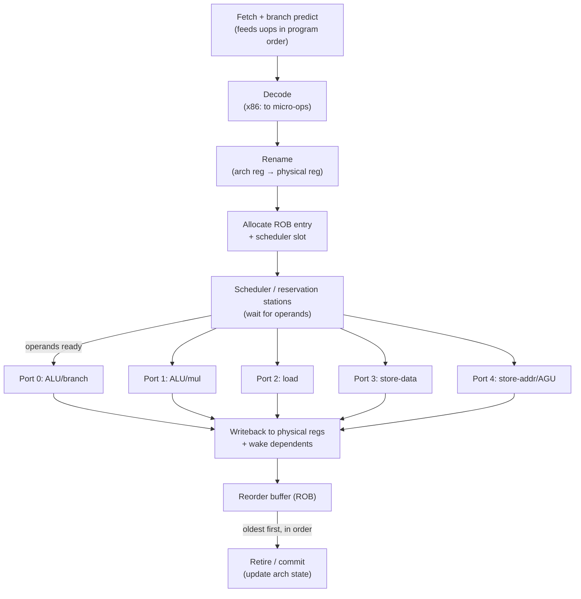
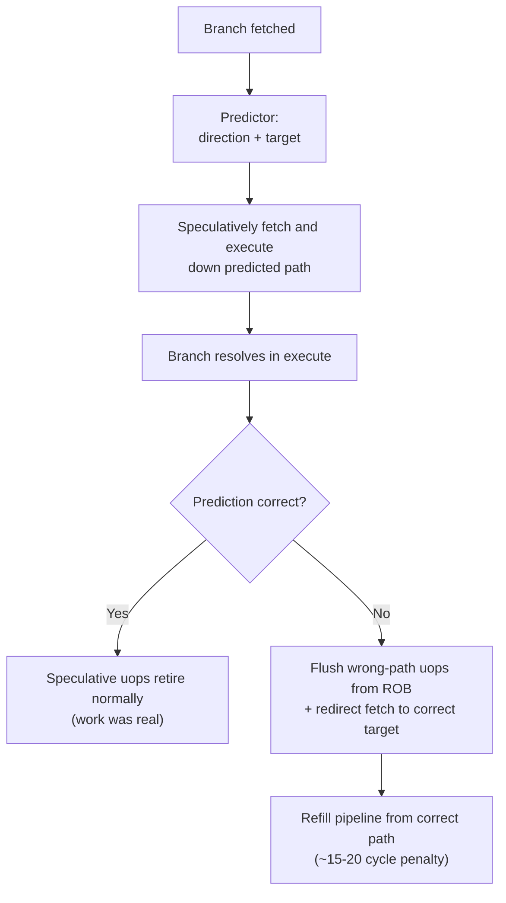
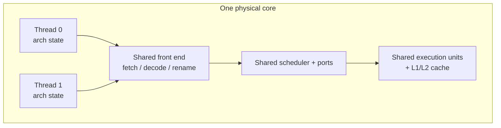

# Chapter 2 — The Modern CPU: Pipelines, Out-of-Order, Speculation

*What this chapter covers.* Chapter 1 argued for mechanical sympathy: the machine has a
grain, and code that runs with the grain is often an order of magnitude faster than code that
fights it. This chapter opens the box and looks at the engine directly. A modern server core
— a Graviton4 Neoverse V2, an AMD Zen 5, an Intel Redwood/Granite Rapids core — is a deeply
pipelined, superscalar, out-of-order, speculative machine that bears almost no resemblance to
the sequential fetch-execute loop most engineers carry in their heads. It fetches, decodes,
and *renames* instructions; it executes them out of program order the instant their inputs are
ready; it guesses the outcome of branches long before it knows them; and it retires results
back into program order so that, from the outside, the illusion of sequential execution holds.
Understanding this machine is what lets you reason about why one loop runs at four instructions
per cycle and a functionally identical loop runs at one — and why, at fleet scale, that ratio
is a line item on your cloud bill.

Learning goals:

- Trace an instruction through the classic five-stage pipeline and explain how pipelining buys
  throughput without reducing latency.
- Classify the three hazard families — structural, data, control — and state the mechanism by
  which each stalls a pipeline and how hardware mitigates it.
- Explain why IPC greater than one is possible (superscalar issue) and what caps instruction-level
  parallelism in real code.
- Describe the out-of-order engine's pieces — register renaming, the scheduler and reservation
  stations, execution ports, and the reorder buffer — and how dataflow execution with in-order
  retirement reconciles speed with correctness.
- Explain branch prediction, the cost of a misprediction, and why data-dependent branches are
  expensive while predictable ones are nearly free.
- Reason about how the OoO engine hides memory latency, and what memory-level parallelism buys.
- Place CISC/RISC and micro-ops correctly, and know why the distinction rarely matters to backend
  throughput — but why ARM in the datacenter does.
- Understand SMT/Hyper-Threading as resource sharing, when it helps and when it hurts, and its
  security and capacity-planning implications for multi-tenant clouds.

## The naive model, and why it is wrong

Most engineers' mental model of a CPU is a loop: fetch the instruction at the program counter,
decode it, execute it, write the result, advance the program counter, repeat. This model is
pedagogically useful and operationally false for any core you will actually deploy on. It is
false in three compounding ways. The CPU does not finish one instruction before starting the
next (it *pipelines*). It works on more than one instruction per stage (it is *superscalar*).
And it does not execute instructions in the order you wrote them (it is *out-of-order* and
*speculative*). Each of these is a throughput optimization layered on the previous, and each
introduces a class of hazard that the hardware must paper over to preserve the illusion of
sequential execution your program depends on.

The through-line of the entire chapter is a single tension: **program order is a correctness
contract; execution order is a performance decision.** The core's job is to violate execution
order as aggressively as it can get away with while making the outside world — memory, other
cores, the architectural register file — believe program order was honored. Everything that
follows is machinery for having it both ways.

Two definitions anchor the discussion. The **clock** is the core's heartbeat; a 3 GHz core ticks
three billion times per second, and a *cycle* is one tick. **IPC** — instructions per cycle — is
the average number of instructions the core completes (retires) per tick. Performance is,
to first order,

```
instructions_per_second = clock_frequency × IPC
```

Frequency is bounded by physics and thermals and has barely moved in fifteen years (server parts
sit around 2.5–3.8 GHz sustained). IPC is where architecture earns its keep, and where your code
either cooperates or does not. A modern wide core can retire 4–8 instructions per cycle in the
best case and well under 1 in the worst; the same silicon, the same frequency, a 5–10× swing
driven entirely by how the code interacts with the pipeline, the predictors, and the caches.

## The classic five-stage pipeline

Start with the textbook RISC pipeline, because every real machine is an elaboration of it. An
instruction passes through five stages:

1. **Fetch (IF)** — read the instruction bytes from the instruction cache at the program counter.
2. **Decode (ID)** — interpret the bytes into an operation and operands; read source registers.
3. **Execute (EX)** — perform the ALU operation, or compute a memory address, or resolve a branch.
4. **Memory (MEM)** — for loads and stores, access the data cache.
5. **Writeback (WB)** — write the result back into the register file.

Without pipelining, each instruction occupies the entire datapath for all five stages before the
next begins: five cycles per instruction, one instruction at a time. Pipelining overlaps them.
Once instruction *i* leaves Fetch and enters Decode, instruction *i+1* enters Fetch. In steady
state, all five stages are busy on five different instructions at once, and the pipeline retires
one instruction per cycle.


The crucial insight is that pipelining does **not** reduce the *latency* of any single instruction
— that instruction still takes five stages, and in a deeper pipeline it takes more. What pipelining
buys is *throughput*: the rate at which instructions complete. This is the assembly-line analogy,
and it is exact. A car still takes hours to build; the factory ships one every few minutes because
many cars are in progress at once. The distinction between latency and throughput recurs at every
level of a distributed system — a request's latency and a service's throughput are governed by
different things — and it starts here, in the pipeline.

Pipelining also lets each stage be simpler and therefore faster, which raises the clock. A stage
that does one-fifth of the work can settle in one-fifth of the time, so the clock can tick roughly
five times faster than an unpipelined design of the same logic. This is why pipeline *depth* and
clock frequency are coupled, a relationship we return to below.

### Hazards: where the assembly line jams

The assembly-line illusion holds only if every instruction is independent of the ones ahead of it.
Real code is full of dependencies, and dependencies create **hazards** — situations where naively
advancing the pipeline would produce a wrong answer. There are three families.

**Structural hazards** arise when two instructions need the same hardware resource in the same
cycle — a single memory port that both a fetch and a load want, or a single divider that two divides
contend for. The fix is either duplication (separate instruction and data caches, the "Harvard"
split, so fetch and load never collide) or arbitration (one instruction waits). Modern cores spend
enormous area duplicating resources specifically to eliminate structural hazards.

**Data hazards** arise when an instruction needs the result of one still in flight. The canonical
case is *read-after-write* (RAW), a true dependency: `b = a + 1; c = b + 1` — the second add needs
`b`, which the first add has not yet written back. In the naive pipeline the second instruction
would read a stale `b` from the register file. The classic mitigation is **forwarding** (also called
bypassing): wire the ALU output directly back to the ALU input so the result is available to the next
instruction the cycle after it is computed, without waiting for writeback. Forwarding eliminates most
RAW stalls but not all — a load feeding a dependent instruction still costs a cycle (the *load-use*
delay), because the loaded value is not available until the MEM stage completes.

The other two data-hazard types are *false* dependencies and matter enormously later: **write-after-read**
(WAR) — an instruction writes a register that an earlier instruction still needs to read — and
**write-after-write** (WAW) — two instructions write the same register and the later write must win.
Neither reflects a real flow of data; both are artifacts of *naming* — the program reused an architectural
register. Register renaming, discussed below, dissolves them entirely.

**Control hazards** arise from branches. Until a conditional branch resolves in EX, the fetch stage
does not know which instructions to fetch next — the fall-through path or the branch target. In a
five-stage pipeline that is a two-to-three cycle bubble per branch; in a fifteen-stage pipeline it is
catastrophic. This is the hazard that motivates branch prediction, the second-biggest idea in the chapter.

| Hazard type | Cause | Example | Primary mitigation |
|---|---|---|---|
| Structural | Two instructions need the same hardware unit in the same cycle | Fetch and load both want the single memory port | Duplicate resources (split I/D cache), multiple execution ports |
| Data — RAW (true) | Instruction reads a register a prior in-flight instruction writes | `add b,a,1; add c,b,1` | Forwarding/bypass; stall on load-use; OoO scheduling |
| Data — WAR/WAW (false) | Reuse of a register name creates an ordering constraint with no real data flow | `add a,b,c; add b,d,e` (WAR on `b`) | **Register renaming** (eliminates entirely) |
| Control | Next fetch address unknown until branch resolves | Any conditional branch or indirect jump | Branch prediction + speculative execution; flush on mispredict |

### Pipeline depth is a trade-off, not a free lunch

If splitting work into more, smaller stages raises the clock, why not make the pipeline fifty stages
deep? Intel tried something close: the Pentium 4 "Prescott" core ran a ~31-stage pipeline chasing
clock frequency, reached the high-3-to-4 GHz range in the mid-2000s — and was a thermal and performance
disappointment relative to its shorter-pipeline successors. The reason is the cost of getting it wrong.

Every stage in flight when a branch mispredicts or an exception fires must be **flushed** — thrown away
— and refilled from the correct path. A deeper pipeline has more instructions in flight, so each flush
discards more work and takes more cycles to refill. Deep pipelines multiply the misprediction penalty.
The Pentium 4's branch mispredict penalty was roughly 20–30+ cycles; the shorter Core-derived pipelines
that replaced it paid far less per mispredict and clocked lower, and won decisively on real workloads.

Modern server cores settle around 14–20 pipeline stages — deep enough to sustain high clocks, shallow
enough that a mispredict costs on the order of 15–20 cycles rather than 30+. The number is a designed
compromise between frequency and flush cost, and it explains why raw GHz stopped being a useful proxy
for performance around 2005. Depth is one axis of the "why has single-thread performance plateaued"
story; the ILP wall, next, is the other.

## Superscalar: IPC greater than one

A scalar pipeline retires at most one instruction per cycle — IPC ≤ 1. A **superscalar** core has
multiple copies of the pipeline's back-end resources and can fetch, decode, issue, and retire *several*
instructions per cycle. A wide modern core fetches on the order of 4–8 instructions per cycle, decodes
similarly, and has 8–12+ execution units it can dispatch to in parallel. IPC greater than one is not
exotic; it is the entire point of a modern core, and the reason a 3 GHz chip vastly outperforms a
3 GHz chip from 2004.

For a superscalar core to actually sustain IPC > 1, it must find, in each window of the instruction
stream, multiple instructions that can execute simultaneously — instructions with no true data
dependency between them. This property of a program is its **instruction-level parallelism (ILP)**.
Consider:

```
a = x + y      # (1)
b = p + q      # (2)
c = a + b      # (3)
```

Instructions (1) and (2) are independent and can execute in the same cycle on two different ALUs.
Instruction (3) depends on both and must wait. The best achievable here is two cycles for three
instructions — IPC 1.5 — bounded by the dependency chain (1)/(2) → (3). No amount of hardware width
executes (3) before its inputs exist. This is the fundamental limit: **ILP is a property of the
program's dataflow graph**, and the critical path through that graph is a hard floor on latency that
width cannot lower.

Real programs have limited, bursty ILP. Long dependency chains (pointer chasing, accumulator loops),
unpredictable branches, and memory stalls all starve the execution units. Classic studies (Wall,
*Limits of Instructional-Level Parallelism*, 1991, and much subsequent work) found that with realistic
prediction and window sizes, sustainable ILP for general-purpose integer code sits in the low single
digits — which is precisely why cores are 4–8 wide rather than 32 wide. Beyond a point, adding width
yields nothing because the code has no more independent work to feed it. This is the **ILP wall**, and
it is one of the reasons the industry pivoted from making single cores wider to putting many cores on
a die — pushing the parallelism problem up to the software, where you now solve it with threads,
goroutines, and, at the largest scale, a fleet of machines.

To extract even that low-single-digit ILP, an in-order superscalar is not enough. Consider a load that
misses the L1 cache: in an in-order machine, that load and *every instruction behind it* stall for the
tens or hundreds of cycles the miss takes to resolve — even instructions that do not depend on the load
at all. The independent work is *right there* in the stream, but in-order execution cannot reach past
the stalled instruction to run it. Recovering that work is the job of out-of-order execution.

## Out-of-order execution: the heart of the machine

Out-of-order (OoO) execution is the single most important idea in this chapter and the one most often
garbled. The core principle is **dataflow**: an instruction executes as soon as its input operands are
available and an execution unit is free, *regardless of its position in program order*. Instructions that
are ready run; instructions waiting on a slow load or a long dependency chain sit aside and let others
pass. Then — and this is what preserves correctness — results are committed back to architectural state
**in program order**. Execute out of order for speed; retire in order for correctness. That reconciliation
is what the whole OoO apparatus exists to perform.

Walk through the pieces. The conceptual lineage is Tomasulo's algorithm (IBM System/360 Model 91, 1967);
you do not need the full algorithm, but you must get the pieces right.



**Front end — fetch, decode, in program order.** Instructions enter in program order. On x86 they are
decoded into one or more fixed-format internal operations called **micro-ops** (uops); on ARM/RISC-V the
instructions are already close to uop-like but still get cracked into internal ops. The front end also
runs the branch predictor (next section) to keep fetching down the predicted path without waiting for
branches to resolve. Everything downstream operates on uops.

**Register renaming — killing false dependencies.** The architectural register file that the ISA exposes
is small: x86-64 has 16 general-purpose architectural registers, AArch64 has 31. Real cores have a much
larger **physical register file** — hundreds of registers. At rename, each uop's destination architectural
register is mapped to a *fresh* physical register, and its sources are mapped to whichever physical registers
currently hold those architectural values. This single mechanism eliminates WAR and WAW hazards **completely**:
because every write goes to a brand-new physical register, two instructions that both "write RAX" write
different physical registers and can proceed independently; there is no false ordering constraint left.
Only *true* (RAW) dependencies survive renaming, because those reflect real data flow — a source that maps
to a physical register some earlier uop will produce. Renaming is why the tiny architectural register file
of x86 is not the bottleneck you might fear: the visible names are few, but the hardware has plenty of
storage and hands out fresh names constantly.

**Dispatch to the scheduler / reservation stations.** Renamed uops are allocated an entry in the reorder
buffer (below) and a slot in the **scheduler** — a pool of waiting uops, historically organized as
**reservation stations** attached to execution ports. A uop sits in its scheduler slot until all its source
operands are ready. Operands become ready as producing uops finish and *broadcast* their results (the
"wake-up"); a waiting uop watching for that physical register captures the value and becomes eligible to
issue. This is the dataflow engine: readiness, not program position, gates execution.

**Execution ports and units.** When a uop is ready and its port is free, the scheduler **issues** it to an
**execution port**. A port is a dispatch lane to a cluster of functional units — integer ALUs, the
multiplier, the load unit, the store-address and store-data units, the floating-point/SIMD units. A wide
core has on the order of 8–12 ports; the mix (how many can do loads, how many can do FP multiply-add)
directly shapes what code patterns saturate the machine. Two independent adds go to two ALU ports in the
same cycle; that is superscalar issue in action. Port contention — for example, code that is all loads on
a machine with two load ports — is a real and measurable throughput ceiling that a good profiler will
surface.

**Writeback and wake-up.** A finished uop writes its result to its physical register and broadcasts that the
register is ready, waking any scheduler entries waiting on it. Those dependents can now issue, possibly the
very next cycle. The chain of produce → wake → consume is the pipeline's inner clockwork.

**The reorder buffer (ROB) — in-order retirement.** Every uop, at allocation, is assigned an entry in the
**reorder buffer**, a FIFO in program order. Uops complete execution out of order and mark their ROB entry
done, but they **retire** — commit their results to architectural state and become irrevocable — strictly
from the head of the ROB, oldest first, in program order. Retirement is where the out-of-order world is
folded back into the sequential contract. It is also where speculation is resolved: if an instruction at the
ROB head raises an exception, or a branch turns out mispredicted, everything younger in the ROB is discarded
before it can affect architectural state. The ROB is the ledger that lets the core run ahead recklessly and
still present a clean, in-order history. Its size — a few hundred entries on modern cores — bounds the
**instruction window**: how far ahead of a stalled instruction the core can look for independent work. A
bigger window hides more latency (it can find more to do while a cache miss resolves) at the cost of area
and power.

To make the dataflow idea concrete, reconsider the cache-missing load. In the OoO machine the load issues,
misses, and goes off to memory — but it does *not* block the pipeline. The core keeps fetching, renaming,
and dispatching younger instructions into the window; any that do not depend on the missing load execute
freely, out of order, while the miss is outstanding. Only the load's actual dependents wait. When the data
arrives, the load completes, wakes its dependents, and — because retirement is in order — the whole sequence
still commits as though nothing had been reordered. The stall that would have frozen an in-order core for a
hundred cycles is, on the OoO core, largely *hidden* behind useful work. This is the mechanism by which the
memory hierarchy of Chapter 3 becomes tolerable at all.

## Branch prediction and speculation

Return to the control hazard. A conditional branch's direction is not known until it executes, but the front
end must keep fetching every cycle or the whole superscalar machine starves. Waiting for each branch would
cost the pipeline-depth penalty on *every branch*, and branches are roughly one instruction in five in
typical code — the machine would spend most of its life fetching bubbles. The solution is to **guess**: the
core predicts the direction (taken/not-taken) and the target of each branch and speculatively fetches and
executes down the predicted path, before it knows whether the guess was right.



Speculatively executed instructions run through the OoO engine like any others, writing physical registers
and sitting in the ROB — but they **cannot retire** until the branch they depend on resolves. If the
prediction was correct, that speculative work was real work; those uops retire in order and nothing was
wasted. If it was wrong, every wrong-path uop is squashed from the ROB, the physical registers they claimed
are reclaimed, and fetch is redirected to the correct target. The penalty is a full pipeline refill — on
modern server cores commonly cited as roughly **15–20 cycles**, though the exact figure varies by
microarchitecture and by where the mispredict is detected, so treat any single number as approximate. At
2–4 uops per cycle, a mispredict throws away on the order of 40–80 uops of potential work. Branches are
common enough that predictor accuracy is one of the largest levers on real IPC.

### How the prediction is made

Modern predictors are **history-based** and startlingly good — well over 95%, often above 99%, accuracy on
typical code. The core idea is that branch behavior is highly correlated with history: a given branch tends
to go the same way (loop back-edges are taken almost every iteration), and, more powerfully, a branch's
outcome is often correlated with the *pattern* of recent branches leading up to it. Predictors exploit both:

- **Local history** — the recent taken/not-taken pattern of *this* branch. A branch alternating T,N,T,N is
  perfectly predictable from its own history.
- **Global history** — the pattern of the last *N* branches system-wide, capturing correlations like "if the
  bounds check above was taken, this branch is not."

State-of-the-art designs are **TAGE-class** predictors (TAgged GEometric history length; Seznec and Michaud).
Conceptually, TAGE keeps several tables indexed by hashes of the program counter combined with **geometrically
increasing history lengths** — one table keyed on the last few branches, another on the last dozen, another on
the last several dozen, and so on. A prediction is taken from the table with the *longest* matching history
that has a confident entry, on the theory that a longer matching context is a more specific, more reliable
predictor. Shorter-history tables provide fallbacks when the long-history context has not been seen before.
You do not need the update math; the load-bearing intuition is: **modern predictors learn long, precise
correlations across the recent branch stream, and they are extremely accurate when a branch's outcome is a
learnable function of history.** Cores also keep a separate **Branch Target Buffer** for the *target* address
(needed for indirect branches and calls) and a **Return Address Stack** for returns, since predicting the
target is a distinct problem from predicting the direction.

### Why predictable branches are free and data-dependent ones are not

The predictor is only as good as the pattern it can learn. A branch whose outcome is a learnable function of
history — a loop condition, a null check that is almost always false, a bounds check that almost always passes
— is predicted correctly nearly every time and costs essentially nothing; the speculative work is real work.
A branch whose outcome is *effectively random from the predictor's viewpoint* — a comparison against
unsorted, unpredictable data — cannot be learned. It mispredicts roughly half the time, and each mispredict
costs the full flush.

This is the origin of one of the most-cited performance lessons in practice, developed in depth in
Chapter 8: iterating over an array and branching on `if (data[i] > threshold)` runs dramatically faster when
`data` is **sorted** than when it is random, even though the instruction count is identical. Sorted, the
branch is a long run of not-taken followed by a long run of taken — trivially predictable. Random, it is a
coin flip the predictor cannot beat, and the mispredict penalty dominates the loop. Nothing about the
arithmetic changed; the predictor's success rate did. The engineering responses — making branches
predictable, or eliminating them with **branchless** code (conditional moves, masking, `SIMD`) so there is
nothing to mispredict — are Chapter 8's subject. The point here is *why* they work: they attack the
misprediction penalty at its root.

### Speculation as a security boundary: Spectre and Meltdown

Speculation executes instructions that may be on the wrong path and are later squashed. Architecturally,
squashed instructions leave no trace — that is the whole design. But they leave *microarchitectural*
traces: a speculatively executed load can pull a line into the cache, and that cache state persists after
the squash. The **Spectre** and **Meltdown** family of vulnerabilities (disclosed January 2018) weaponize
exactly this. An attacker trains the predictor so the core speculatively executes a load it should not —
reading, transiently, memory it is not architecturally allowed to read — and encodes that secret into the
cache footprint, then recovers it with a cache-timing side channel (Chapter 3 covers the timing mechanism).
The architectural result is correctly rolled back; the microarchitectural side effect is not. Meltdown
exploited speculation past a permission check to read kernel memory; Spectre-v1 exploited speculation past a
bounds check; Spectre-v2 exploited mistrained indirect-branch prediction to steer speculation into
attacker-chosen gadgets.

The deep lesson — pursued in Chapter 10 on hardware isolation, and connected to multi-tenant trust in the
supply-chain volume (Book 6, cloud-native security) — is that **speculation broke the assumption that
architectural isolation implies physical isolation.** The mitigations (retpolines and later hardware IBRS/eIBRS
for branch-target injection, kernel page-table isolation for Meltdown, microcode updates, and speculation
barriers) cost real performance and reshaped how kernels and hypervisors defend tenant boundaries. For a
backend engineer the operational takeaway is concrete: the mitigations are not free, they landed as measurable
throughput regressions across fleets, and on shared hardware the boundary between your workload and a
co-tenant's is enforced in part by microarchitectural controls you do not see.

## Memory and the CPU: hiding latency

The OoO engine's greatest single service is hiding memory latency. Chapter 3 details the hierarchy; the
number that matters here is the gap: an L1 hit is a few cycles, a last-level-cache miss to DRAM is on the
order of a couple hundred cycles. At 3 GHz, a couple hundred cycles is ~70 nanoseconds during which an
in-order core would be frozen. The OoO core instead runs ahead.

Loads and stores flow through dedicated **load/store units** behind their execution ports. Stores are
special: a store's value must not become visible until the store retires (it might be on a mispredicted
path), so stores are buffered in a **store buffer** and drained to cache only at retirement. That buffer
enables **store-to-load forwarding**: a later load to an address a pending store has just written gets the
value straight from the store buffer rather than waiting for it to reach cache. The store buffer is also,
not incidentally, a primary source of the memory-reordering behavior that Chapter 4's memory-consistency
discussion is about — it is why a store followed by a load to a different address can appear reordered to
other cores.

The performance-critical capability is **memory-level parallelism (MLP)**: the core can have *many*
outstanding cache misses in flight at once. Because non-dependent loads issue out of order, the core can
send several independent misses to memory concurrently and overlap their latencies, rather than paying for
them one after another. A structure of **miss-status handling registers** (MSHRs) tracks the outstanding
misses; their count bounds MLP. This is why the *access pattern* dominates memory-bound performance far more
than raw bandwidth: a pointer-chasing linked list serializes misses (each load's address depends on the
previous load's result — a dependency chain the OoO engine cannot break), so latencies add up; an array
traversal exposes many independent misses the core overlaps, so latencies hide behind one another. Same
bytes moved, wildly different throughput, entirely because of how much MLP the pattern exposes. Hardware
**prefetchers** amplify this further by detecting sequential and strided patterns and fetching lines before
they are demanded — which is precisely why linear scans are so much friendlier than random access. Chapter 8
turns all of this into concrete data-structure guidance.

## Instruction sets: CISC, RISC, and why the uop settles the argument

x86 is a **CISC** (complex instruction set): variable-length instructions, many addressing modes,
instructions that both access memory and compute. ARM and RISC-V are **RISC** (reduced): fixed-length
(AArch64 is 32-bit-wide instructions), load/store architectures where only explicit loads and stores touch
memory. For decades this distinction was framed as a fundamental performance divide. Inside a modern core,
it has largely dissolved, and the reason is the **micro-op**.

An x86 core does not execute x86 instructions directly. Its decoders **crack** each variable-length x86
instruction into one or more fixed-format internal uops, and everything past decode — rename, schedule,
execute, retire — operates on those uops, which look much like RISC operations. A `add [rax], rbx`
(load-add-store) becomes a load uop, an add uop, and a store uop. So beneath the ISA, an x86 core and an
ARM core are the *same kind of machine*: wide, out-of-order, superscalar, speculative, uop-based. Cores also
cache decoded uops in a **uop cache** so hot loops skip the expensive x86 decode entirely, blunting the one
place CISC decoding genuinely costs more (variable-length decode is harder to parallelize than fixed-length).

The practical consequence for backend engineers is that **the ISA is rarely the thing determining your
service's throughput.** Both families are OoO superscalar underneath; both have good predictors and deep
windows. What differs and *does* matter is not RISC-vs-CISC in the abstract but the concrete
microarchitecture, the memory system, the core count, the frequency, and — increasingly — the price and power
of the specific part.

Which is why **ARM in the datacenter is not a footnote.** AWS Graviton (Neoverse cores), Ampere Altra, Google
Axion, Microsoft Cobalt, and NVIDIA Grace are real, deployed, general-purpose server parts, and the driver is
economics, not ISA elegance: competitive per-core performance at meaningfully better performance-per-watt and
lower price, which at fleet scale is the whole game. For most managed-runtime and compiled backend workloads,
porting is close to a recompile-and-retest (JVM, Go, Node, .NET, Python all run natively on AArch64), with the
usual caveats about native dependencies, hand-written assembly or SIMD intrinsics, and x86-specific
assumptions. The migration story is a cost story, and it belongs in the same conversation as instance sizing
and reservation strategy, not in a discussion of instruction encodings.

## SMT / Hyper-Threading: sharing one core

A wide OoO core is frequently *underutilized* by a single thread: dependency chains and cache misses leave
execution ports idle even with a deep window. **Simultaneous multithreading (SMT)** — Intel's brand is
Hyper-Threading — exploits those idle resources by running *two* (sometimes more) threads on one physical
core at once. Each thread has its own architectural state (registers, program counter), but they **share** the
physical execution resources: the ports, the schedulers, the caches, the TLBs, and — critically — they compete
for slots in the ROB and physical register file.



SMT **helps** when a single thread cannot keep the ports busy — which is most of the time for
latency-bound, memory-stalling backend workloads. While thread 0 waits on a cache miss, thread 1's
independent instructions fill the idle ports; the core's aggregate throughput rises. Typical real-world
gains are modest and workload-dependent — commonly in the ballpark of 10–30% additional throughput per core,
occasionally more, essentially never the 2× a naive "two threads" count would suggest, because the two
threads are sharing one core's finite execution capacity, not doubling it.

SMT **hurts** when a single thread already saturates the shared resources. Two threads that both hammer the
FP units, or that between them thrash a shared L1/L2 or the ROB, contend rather than complement: each runs
slower than it would alone, and total throughput can even *drop*. Cache-sensitive workloads are the classic
losers — two threads halve the effective per-thread cache. This is why SMT is a throughput optimization with
a **latency and predictability cost**: a thread's performance now depends on what its sibling is doing, which
makes tail latency noisier and harder to reason about.

SMT is also a **security** surface. Because the two threads share microarchitectural resources, one can
observe the other's behavior through timing. **L1TF** (L1 Terminal Fault) and the **MDS** family
(Microarchitectural Data Sampling — RIDL, Fallout, ZombieLoad, 2019) let a thread sample data flowing through
shared microarchitectural buffers on the sibling thread. The mitigations are heavy: some environments disable
SMT entirely for untrusted multi-tenancy, and cloud schedulers use **core scheduling** / **gang scheduling**
so that only sibling threads from the *same* trust domain share a core. For a backend engineer this is not
abstract — it is why some security-sensitive fleets run with Hyper-Threading off, eating the throughput loss
to close the side channel.

## Distributed-systems lens: IPC is a line item

Everything above is single-core mechanics, but you operate fleets, and at fleet scale these mechanics become
economics and SLOs.

**IPC is money.** A service that runs at IPC 1.0 instead of 2.0 needs roughly twice the cores to serve the
same request rate — twice the instances, twice the bill, twice the power. Frequency is fixed by the part you
rented; IPC is the dimension your code controls. At a few instances this is noise; across tens of thousands
of cores it is a budget line, and it is why performance engineering on hot paths (Chapter 8, and the
performance volume) has a direct, computable ROI. "Cycles, not instructions" is the mindset: a profiler that
shows instruction counts can lie, because two functions with equal instruction counts can differ 5× in cycles
depending on cache misses and mispredicts. Measure cycles and IPC, not instruction count.

**Your vCPU is probably a hyperthread.** On most public clouds a "vCPU" is one SMT thread, and two vCPUs on
one instance may be the two siblings of a single physical core, sharing all the execution resources above.
This reframes capacity planning: a 2-vCPU instance is not two independent cores, and CPU-bound work will not
scale linearly across its vCPUs. It also reframes **noisy neighbors**: in multi-tenant environments a
co-tenant's thread sharing your physical core competes for your ports and pollutes your caches, and you see it
as unexplained latency variance you cannot fix from inside your VM. Instance types that guarantee full
physical cores (or that pin/isolate cores) exist precisely to sell predictability back to workloads that need
it.

**ARM migration is a fleet-cost decision.** Graviton-class parts change the performance-per-dollar and
performance-per-watt of the whole fleet. Because the ISA rarely gates backend throughput, the migration is
usually gated by toolchain and dependency portability, not by any inherent x86 advantage — which makes it a
platform-engineering project with a clear financial payoff, evaluated with the same rigor as any other
capacity decision.

**Warmup, prediction training, and tail latency.** The predictors, the caches, and (for managed runtimes) the
JIT all **learn** — they need to see the workload before they are fast. A cold process mispredicts branches it
will later predict perfectly, runs interpreted before it is JITed, and misses caches it will later hit. This is
the microarchitectural half of the **cold-start** problem: a freshly scheduled serverless function or a
just-started pod pays a warmup tax that a long-running, steady-state service does not. It is also why
**microbenchmarks mislead**: without warmup, you measure the cold, untrained machine; with unrealistic warmup,
you train the predictor on a pattern production never sees and measure a fiction. Benchmark methodology — warm
up, use realistic data distributions so the predictor faces production-like branch patterns, measure many
iterations, report distributions not means — is not pedantry; it is the difference between a number that
predicts production and one that does not.

**Frequency scaling is real and it moves your numbers.** Turbo, thermal throttling, and power-cap governors
mean the "3 GHz" part runs at a frequency that depends on how many cores are busy, the workload's instruction
mix (heavy AVX-512 code often clocks *lower* to stay in the power envelope), the ambient thermals, and the
governor policy. Two runs of the same code on the same instance can differ because the second ran at a lower
turbo bin. For repeatable measurement, pin frequency where you can; for production reasoning, know that your
effective clock is a runtime variable, not a datasheet constant.

**Reading the counters.** The hardware exposes performance counters that make all of this observable. On Linux,
`perf stat` reports the essentials:

```bash
perf stat -e cycles,instructions,branches,branch-misses,\
cache-references,cache-misses ./your_service --bench
```

```
     45,231,509,884      cycles
     58,004,112,340      instructions      #    1.28  insn per cycle
      9,880,441,203      branches
        512,003,918      branch-misses     #    5.18% of all branches
      2,140,556,001      cache-references
        401,229,847      cache-misses      #   18.75% of all cache-refs
```

Read it as a diagnosis. **IPC 1.28** on a core capable of 4+ says the pipeline is stalling most cycles — the
question is why. A **5% branch-miss rate** is high (well-predicted code is under 1–2%) and points at
data-dependent branches worth making predictable or removing. **18% cache misses** point at the memory system
(Chapter 3) and access patterns (Chapter 8). To attribute stalls precisely, top-down methodologies
(`perf`'s `topdown` events, Intel VTune, AMD uProf) break each cycle into *retiring*, *bad speculation*,
*front-end bound*, and *back-end bound*, telling you whether you are losing cycles to mispredicts, to fetch,
or to memory. The performance volume (Volume 2) develops this into a full workflow; the point here is that the
abstract machine of this chapter is directly measurable, and the counters are how you turn "it feels slow"
into "IPC 1.28, back-end bound on L2 misses in `parseRecord`."

## Key takeaways

- The real core pipelines (throughput without lower latency), is superscalar (IPC can exceed one), and
  executes out of order and speculatively. The naive fetch-execute loop is the wrong mental model for any
  server CPU.
- Performance ≈ frequency × IPC. Frequency is largely fixed; IPC is where code cooperates or fights, and a
  5–10× IPC swing on identical silicon is entirely realistic.
- Three hazard families jam the pipeline: structural (shared units), data (RAW is real; WAR/WAW are false
  names), and control (branches). Renaming eliminates false dependencies; forwarding and OoO scheduling
  attack real ones; prediction attacks control hazards.
- The OoO engine is dataflow with an in-order commit: rename to a large physical register file (killing
  WAR/WAW), wait in the scheduler until operands are ready, issue to execution ports, and retire in program
  order from the reorder buffer. The ROB size bounds how far ahead the core sees to hide stalls.
- Branch prediction (TAGE-class, history-based, >95% typical) makes control-heavy code fast; a misprediction
  costs a full pipeline flush, roughly 15–20 cycles (hedge it). Predictable branches are nearly free;
  data-dependent, unpredictable branches are expensive — the root of the sorted-vs-unsorted phenomenon and
  the case for branchless code (Chapter 8).
- Speculation is the root of Spectre/Meltdown: squashed instructions leave microarchitectural traces
  (cache state) that break the assumption that architectural isolation implies physical isolation — a
  multi-tenant concern (Chapter 10; Book 6).
- The OoO engine hides memory latency by running ahead; memory-level parallelism (many outstanding misses)
  is why access pattern beats raw bandwidth, and why pointer chasing is slow.
- CISC vs RISC mostly does not matter to backend throughput — both are OoO superscalar under a uop layer —
  but ARM in the datacenter (Graviton and peers) is a real performance-per-dollar and per-watt decision.
- SMT shares one core between threads: it helps hide stalls, hurts under resource contention, adds tail-latency
  noise, and opens side channels (L1TF, MDS). Your cloud "vCPU" is usually one such thread.
- At fleet scale, IPC is cost, oversubscribed vCPUs and noisy neighbors are shared-core contention, warmup
  and prediction training shape cold-start tail latency, and turbo/thermal scaling makes your effective clock
  a runtime variable. `perf stat` makes all of it measurable.

## Further reading

- John L. Hennessy and David A. Patterson, *Computer Architecture: A Quantitative Approach*, 6th ed.
  (Morgan Kaufmann, 2017) — the standard reference; Chapters 3 (ILP, OoO, speculation) and Appendix C
  (pipelining) cover this chapter's core material rigorously.
- Agner Fog, *The Microarchitecture of Intel, AMD and VIA CPUs* and *Instruction Tables* —
  https://www.agner.org/optimize/ — the definitive open reference on real port layouts, uop breakdowns,
  and latencies per microarchitecture.
- R. M. Tomasulo, "An Efficient Algorithm for Exploiting Multiple Arithmetic Units," *IBM Journal of Research
  and Development*, 1967 — the origin of register renaming and reservation-station scheduling.
- André Seznec and Pierre Michaud, "A case for (partially) TAgged GEometric history length branch prediction"
  (TAGE), *Journal of Instruction-Level Parallelism*, 2006 — the basis of modern branch predictors.
- David W. Wall, "Limits of Instruction-Level Parallelism," DEC WRL Research Report 93/6, 1993 — the classic
  empirical study of how much ILP real programs actually contain.
- Kocher et al., "Spectre Attacks: Exploiting Speculative Execution," and Lipp et al., "Meltdown: Reading
  Kernel Memory from User Space" — the 2018 disclosures; see also https://meltdownattack.com/.
- van Schaik et al. (RIDL) and the MDS disclosures — https://mdsattacks.com/ — for the SMT-shared-buffer
  side channels (ZombieLoad, RIDL, Fallout).
- Ulrich Drepper, "What Every Programmer Should Know About Memory," 2007 — dated in specifics but excellent on
  how the OoO core interacts with the memory hierarchy.
- Intel, *64 and IA-32 Architectures Optimization Reference Manual*, and Arm, *Neoverse V2 Software Optimization
  Guide* — vendor microarchitecture and optimization references, including the top-down performance methodology.
- Brendan Gregg, *Systems Performance*, 2nd ed. (Addison-Wesley, 2020) — practical `perf`, PMCs, and CPU
  performance analysis on Linux at production scale.
```
