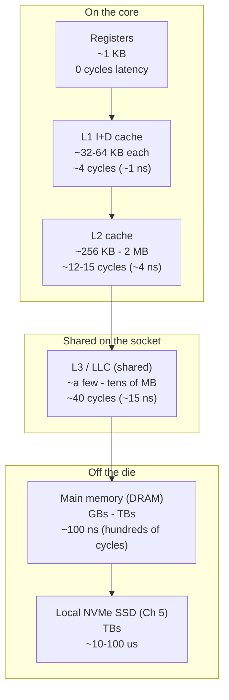
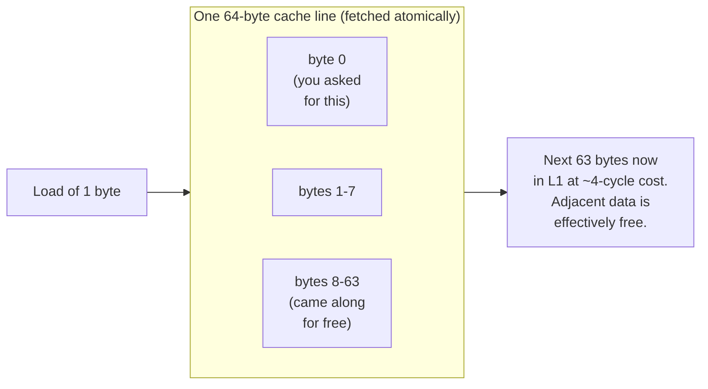
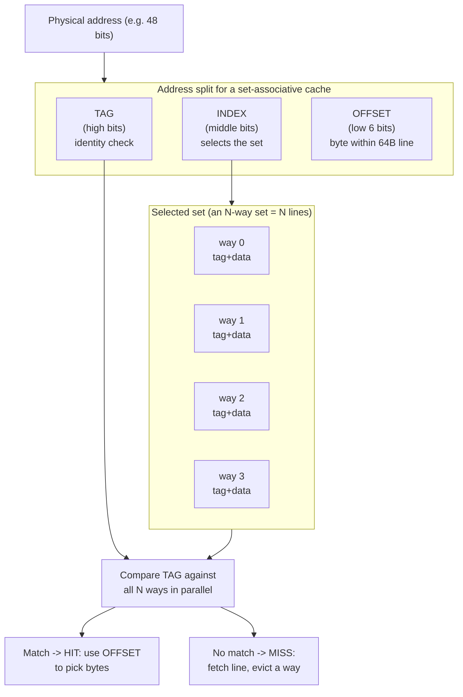
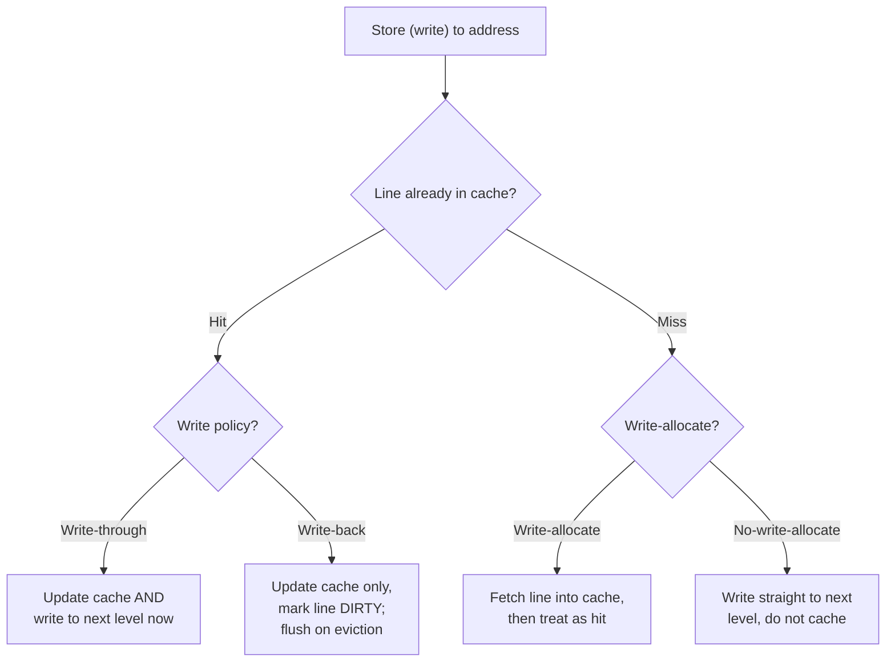
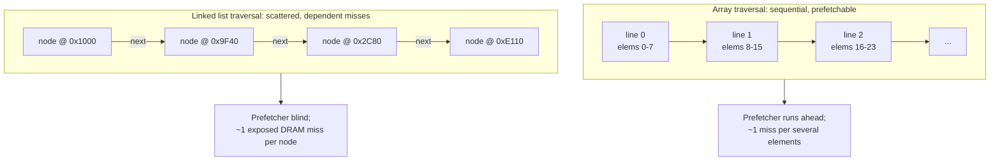
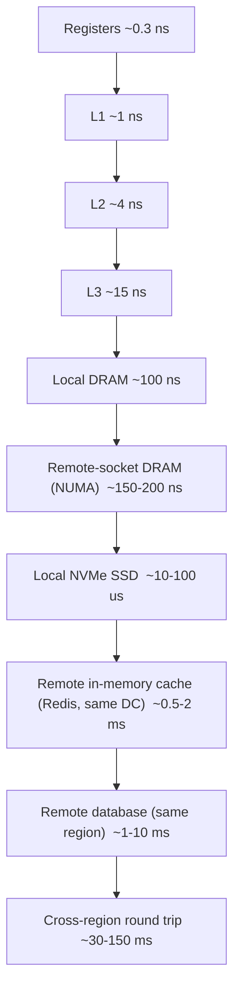

# Chapter 3 — The Memory Hierarchy and Caches

*What this chapter covers.* Of all the hardware topics a backend engineer can internalize, the
memory hierarchy pays the highest dividend. The reason is a single, decades-old, still-widening
fact: **the processor can compute far faster than main memory can feed it.** Every trick modern
hardware plays — caches, prefetchers, out-of-order execution (Chapter 2), speculation — exists to
paper over that gap. Programs that respect the hierarchy run an order of magnitude faster than
algorithmically identical programs that ignore it, on the same silicon, with the same
instruction count. This chapter explains *why* the gap exists, *how* the cache hierarchy hides
it, and *how to write code and design data structures* that keep the fast paths hot. It closes by
extending the same locality principle outward: past the die, past the socket, out to SSDs, remote
caches, and other regions — because the memory hierarchy does not stop at the chip's edge, and
neither does the reasoning.

Learning goals — after this chapter you should be able to:

- Explain the **memory wall** — the growing latency gap between CPU and DRAM — and why caches, not
  faster DRAM, are the industry's answer.
- Reason quantitatively about the **cache hierarchy** (L1/L2/L3/DRAM), with order-correct sizes
  and latencies, and distinguish inclusive from exclusive caches.
- Explain the **cache line** as the atomic unit of data movement (typically 64 bytes) and derive
  most cache-friendly-code advice from that one fact.
- Define **temporal** and **spatial locality**, and connect them to the two structural properties
  of real programs that make caches work.
- Decompose a physical address into **tag / index / offset**, and explain **set-associative**
  mapping, the **3 C's** (compulsory, capacity, conflict), and the eviction and **write policies**
  a cache implements.
- Explain **hardware prefetching**, why sequential access is dramatically faster than random, and
  why pointer-chasing defeats the prefetcher.
- Explain the **TLB** as the "other cache," why TLB misses trigger page walks, and how huge pages
  relieve TLB pressure.
- Apply all of it: **data-oriented design**, struct-of-arrays vs array-of-structs, cache blocking,
  and why arrays beat linked lists — and see the same ideas govern **distributed caching tiers**.

## The memory wall: the fact that motivates everything

Start with the numbers, because the argument is entirely about numbers. A modern server core
retires several instructions per cycle at a few GHz. Call it a ~0.3 ns cycle time. In that cycle
the core can do real arithmetic — an add, a multiply, a compare. Now ask that core to read a value
from main memory (DRAM) that is not cached anywhere. The round trip is on the order of **~100 ns**.
At ~0.3 ns per cycle, 100 ns is **several hundred cycles**. The exact figure is
vendor-, generation-, and configuration-dependent — 60–120 ns is a reasonable spread for a local
DRAM access on contemporary server parts — but the order of magnitude is stable and it is the point:
**a DRAM miss costs hundreds of instructions' worth of time.** A core that stalls on memory is a
Ferrari idling at a red light.

This gap is not an accident of one bad generation; it is a structural divergence that has widened
for decades. CPU throughput (clock times instruction-level parallelism) improved far faster than
DRAM *latency*. DRAM *bandwidth* has grown respectably — each generation moves more bytes per
second — but the time to service a single, latency-bound, dependent access has barely improved.
The industry has a name for the cumulative result: the **memory wall**. The gap between how fast a
core can consume data and how fast memory can deliver a single random datum grew until memory
latency, not compute, became the dominant cost for most workloads. Backend software is squarely a
"most workloads": chasing pointers through a request graph, walking a hash map, deserializing a
payload — all latency-bound, all memory-bound.

Why not just build faster DRAM? Because the physics and economics trade off against each other.
Fast memory (SRAM, the stuff caches are made of) uses ~6 transistors per bit, is expensive, power
hungry, and physically large per bit — you cannot afford gigabytes of it. Dense memory (DRAM, one
transistor plus one capacitor per bit) is cheap and huge but slow, and it sits across a bus, off
the die, sometimes across a socket (Chapter 6). You cannot have capacity and latency in the same
technology at an acceptable price. So the industry did the only thing it could: it built a
**hierarchy** — a small amount of very fast memory close to the core, backed by progressively
larger and slower tiers — and bet that programs access memory in a way that lets small fast tiers
capture most of the traffic. That bet is called *locality*, and it almost always pays.



Notice the shape: as you move away from the core, capacity grows by roughly 10-100x per step and
latency grows by a similar factor. Each tier is a cache for the tier below it. The core's job — and
the compiler's, and yours — is to arrange that the overwhelming majority of accesses are satisfied
by the tiers near the top.

## The hierarchy, tier by tier

The following table gives order-correct figures for a contemporary x86 or ARM server core. Treat
every number as an approximation whose **order of magnitude is the durable fact**; the exact cycle
counts and sizes vary by vendor (Intel, AMD, ARM designs differ), by generation, and by SKU.

| Tier            | Typical size (per core unless noted)   | Typical latency        | Notes                                             |
|-----------------|----------------------------------------|------------------------|---------------------------------------------------|
| Registers       | Dozens of named regs, ~1 KB total      | 0 extra cycles         | Named operands; the compiler allocates these      |
| L1 data (L1d)   | ~32-64 KB                              | ~4-5 cycles (~1 ns)    | Split from L1 instruction cache; per core         |
| L1 instr (L1i)  | ~32-64 KB                              | ~4-5 cycles            | Feeds the front end (Chapter 2)                    |
| L2 (unified)    | ~256 KB - 2 MB                        | ~12-15 cycles (~4 ns)  | Per core on most designs                          |
| L3 / LLC        | ~a few to tens of MB                    | ~40 cycles (~10-20 ns) | **Shared** across cores on a socket               |
| DRAM (local)    | GBs to TBs                              | ~60-120 ns             | Off-die; non-uniform under NUMA (Chapter 6)       |
| Remote DRAM     | —                                      | ~1.5-2x local DRAM     | Another socket's memory (Chapter 6)               |

A few structural points that matter more than the exact numbers:

**L1 is split, lower levels are unified.** L1 is two caches: L1i for instructions and L1d for data.
They are separate because the front end fetching instructions and the load/store units fetching data
would otherwise contend for the same port every cycle. From L2 down, one unified cache holds both.

**L3 is shared; L1/L2 are private.** Each core has its own L1 and (usually) L2. The last-level cache
(LLC, usually L3) is shared by all cores on the socket. This sharing is what makes the LLC the
coordination point for **cache coherence** — the protocol that keeps per-core caches consistent when
multiple cores touch the same line — which is the entire subject of Chapter 4. It is also where
**false sharing** does its damage (Chapter 8).

**Latency compounds on a miss.** The latencies above are not additive in the happy path — a hit in
L1 costs ~4 cycles, full stop. But a *miss* pays the cost of checking each level it misses in before
finding the data. An L1 miss that hits in L2 costs roughly the L2 latency; an access that misses all
the way to DRAM has paid the tag checks along the way and then eats the ~100 ns. This is why miss
*rates* at each level, not just averages, drive real performance.

### Inclusive vs exclusive caches

When a line lives in L1, does a copy also occupy L2 and L3? That is the inclusion policy, and
designs differ:

- **Inclusive** (historically common on Intel LLCs): every line in an upper level is *also* present
  in the level below. This wastes some capacity (the same bytes are stored twice) but simplifies
  coherence: to know whether *any* core has a line, a snoop only has to check the shared LLC. If it
  is not in the LLC, it is in no private cache.
- **Exclusive** (common on many AMD designs): a line lives in *exactly one* level, so aggregate
  capacity is the sum of the levels. This maximizes effective cache size but complicates coherence
  and eviction (evicting from L2 may require inserting into L3).
- **Non-inclusive / NINE** (neither strictly inclusive nor exclusive): a middle ground many modern
  designs use.

You rarely tune for inclusion policy directly, but it explains otherwise-surprising numbers — e.g.,
why an "N MB L3" does not always behave like N MB of *additional* room, and why coherence traffic
patterns differ between vendors.

## The cache line: the atomic unit of data movement

Here is the single most load-bearing fact in this chapter. **Caches do not move bytes. They move
lines.** A cache line is a fixed-size, aligned block of memory — on essentially every current
mainstream CPU, **64 bytes** — and it is the smallest unit the cache tracks, fetches, and evicts.

When your code reads one `int` at address `0x...40`, the hardware does not fetch 4 bytes. It fetches
the entire aligned 64-byte line containing that address (here, `0x...40` through `0x...7F`) from
wherever it currently lives, and installs the whole line in L1. The consequences ripple through
everything:



- **Accessing one byte costs you 64.** Bandwidth and cache capacity are consumed in 64-byte units. A
  struct with one hot 4-byte field still drags its 60 neighboring bytes into cache.
- **Adjacency is free — that is spatial locality made physical.** If you access byte 0 and will soon
  access byte 8, the second access is already in L1 because the whole line arrived together. Data
  structures that place things-used-together next to each other get this for free.
- **Alignment matters.** A value that straddles a 64-byte boundary lives in *two* lines, so touching
  it can cost two cache accesses (and two misses). Aligning hot structures to line boundaries avoids
  split accesses.
- **False sharing is a cache-line artifact.** If two cores write two *different* variables that
  happen to share one 64-byte line, the coherence protocol treats it as contention over one line and
  ping-pongs it between cores, even though the variables are logically independent. This is entirely
  a consequence of the line being the unit of coherence, and it is dissected in Chapter 8.

Internalize this: **almost every piece of cache-friendly-code advice reduces to "make good use of
each 64-byte line you pull in."** Pack the bytes you will use together; do not pull in lines you will
touch once; do not let two threads fight over one line.

## Locality: why the bet pays off

Caches work because real programs are not random-access machines over their whole address space.
They exhibit two kinds of *locality of reference*:

- **Temporal locality:** if you access a location, you are likely to access *the same* location again
  soon. Loop induction variables, the top of a hot stack frame, a frequently dereferenced object, a
  configuration struct read on every request — all reused within a short window. A cache exploits
  temporal locality automatically: once a line is in, subsequent accesses hit.
- **Spatial locality:** if you access a location, you are likely to access *nearby* locations soon.
  Iterating an array, reading successive fields of a struct, walking a contiguous buffer. A cache
  exploits spatial locality by fetching whole lines — the neighbors ride along.

These are not laws of nature; they are empirical properties that emerge from how we write code:
loops, sequential data structures, function-local working sets, and the stack. The cache hierarchy
is a bet that *your program has locality*, and for well-written code it wins overwhelmingly. The
corollary is the engineer's lever: **cache-friendly code is code engineered to maximize both kinds
of locality** — reuse data while it is still hot (temporal), and lay data out so that
things-used-together are physically adjacent (spatial).

The **working set** is the vocabulary for reasoning about this: the set of memory a piece of code
touches over a given time window. If the working set of a hot loop fits in L1, the loop runs at L1
speed. If it fits in L2 but not L1, at L2 speed. If it spills to DRAM, the loop runs at DRAM speed
and no amount of micro-optimization elsewhere will save it. Much of practical performance work is
*shrinking the working set of the hot path until it fits in a fast tier* — a theme we will see again,
at the fleet level, when sizing an in-memory store.

## Cache organization: how an address finds its line

A cache must answer one question quickly: for a given address, is the line present, and if so where?
It cannot afford to search all of itself on every access. The solution is to slice the address into
three fields and use them to look up a small number of candidate slots.

Take a physical address and a cache with 64-byte lines. The low bits index *within* a line; the
middle bits select a *set*; the high bits are the *tag* that confirms identity:



The math is concrete. With **64-byte lines**, the low **6 bits** are the offset (2^6 = 64). If the
cache has **S sets**, the next **log2(S)** bits are the index. Everything above is the tag. Worked
example: a 32 KB, 8-way set-associative L1d with 64-byte lines has 32768 / 64 = 512 lines total,
divided into 512 / 8 = **64 sets**. So offset = 6 bits, index = log2(64) = 6 bits, and the tag is
the remaining high bits. Given an address, the hardware masks out bits [11:6] to pick 1 of 64 sets,
reads all 8 ways in that set, compares their stored tags against bits [47:12] in parallel, and on a
match uses bits [5:0] to select the requested bytes.

The knob here is **associativity** — how many ways (candidate slots) a set has — and it defines three
points on a spectrum:

- **Direct-mapped (1-way):** each address maps to exactly one slot. Fast and cheap to build (one tag
  compare), but two hot addresses that map to the same slot evict each other on every access, even if
  the rest of the cache is empty. Pathological for certain stride patterns.
- **Fully associative (N-way over the whole cache):** a line may go in *any* slot. No conflict
  misses, but every access must compare against every tag — too expensive for anything but tiny
  caches (the TLB is often built this way; see below).
- **Set-associative (the real answer):** a compromise. The cache is divided into sets; a line maps to
  exactly one set (by its index bits) but may occupy any of the N ways within that set. Real caches
  are typically 4-way to 16-way. This keeps tag comparison cheap (N compares) while giving each
  address N places to live, which drastically cuts conflicts versus direct-mapped.

### The 3 C's: a taxonomy of misses

Every cache miss falls into one of three categories — the classic **3 C's** — and naming the category
tells you what to do about it:

| Miss type       | Cause                                                                 | How to reduce it                                                        |
|-----------------|-----------------------------------------------------------------------|-------------------------------------------------------------------------|
| **Compulsory**  | First-ever access to a line ("cold" miss); it was never in cache      | Prefetching; larger lines; unavoidable for truly first touches          |
| **Capacity**    | Working set exceeds cache size; lines evicted before reuse            | Shrink the working set; blocking/tiling; better algorithms              |
| **Conflict**    | Too many hot lines map to the same set; evicted despite free capacity | More associativity; change data layout/stride to spread across sets     |

The distinction is practically important. A **capacity** problem means your hot data is simply too big
for the tier — the fix is to make it smaller or process it in cache-sized chunks (blocking). A
**conflict** problem means data that *would* fit is colliding on a few sets because of an unlucky
stride (e.g., iterating a large 2D array by a power-of-two column stride can map every access to the
same set) — the fix is to change the layout or padding so accesses spread across sets. **Compulsory**
misses are the cost of touching data for the first time; prefetching is how the hardware hides them.

## Cache operations: hits, evictions, and writes

On every memory access the cache does a lookup as above. A **hit** returns data at that tier's
latency. A **miss** must fetch the line from a lower tier and install it — and if the target set is
full, it must first **evict** an existing line to make room.

**Eviction / replacement policy.** True LRU (evict the least-recently-used way) is the theoretical
ideal for exploiting temporal locality, but tracking exact recency across many ways is expensive in
hardware. Real caches use **pseudo-LRU** approximations (tree-based PLRU, or aging/NRU schemes) that
get most of LRU's benefit with a few bits of state per set. You cannot control the policy, but knowing
it is *recency-biased* tells you the mental model: recently touched lines survive; lines you stopped
touching get evicted — which is exactly why temporal locality (reuse soon) pays.

**Write policies.** What happens on a *store* is governed by two orthogonal decisions:



| Dimension        | Option              | Behavior                                                                                  |
|------------------|---------------------|-------------------------------------------------------------------------------------------|
| On a write hit   | **Write-through**   | Write updates this level and propagates to the next level immediately. Simple; more traffic. |
| On a write hit   | **Write-back**      | Write updates only this level; the line is marked **dirty**. The dirty line is written to the next level lazily, on eviction. Far less write traffic; standard for L1/L2/L3. |
| On a write miss  | **Write-allocate**  | Fetch the missing line into cache first, then perform the write (pairs naturally with write-back). |
| On a write miss  | **No-write-allocate** | Write to the next level without caching the line (pairs naturally with write-through). |

Modern data caches are overwhelmingly **write-back + write-allocate**, because write-through's traffic
is ruinous when writes are frequent and re-read. The **dirty bit** is the key piece of state: it marks
a line whose cached copy is newer than memory, so eviction knows it must be flushed rather than simply
dropped. Dirty lines are also central to coherence (Chapter 4): a modified line held privately by one
core is the thing other cores must be prevented from reading stale.

One practical consequence: even *write-only* patterns pull data into cache. Writing a large buffer you
will never read back still consumes cache (via write-allocate) and evicts useful lines. For exactly
this case, ISAs provide **non-temporal / streaming stores** (e.g., x86 `MOVNT*`) that bypass the cache
and write straight to memory, preserving the cache for data with real reuse.

## Prefetching: why sequential access flies and random access crawls

A compulsory miss stalls the core for ~100 ns. If the hardware could *predict* which line you will
need next and fetch it *before* you ask, the stall would be hidden. That is exactly what a **hardware
prefetcher** does, and it is the reason sequential access is often 5-10x faster than random access
even when the same number of bytes is touched.

Each core has one or more prefetchers watching the stream of cache accesses for patterns:

- **Next-line / sequential prefetchers** notice you are walking forward and fetch the following
  line(s) ahead of demand.
- **Stride prefetchers** detect constant-stride patterns — accessing every 200th byte, say — and
  project the stride forward, fetching ahead along the arithmetic progression.

When your access pattern is predictable, the prefetcher runs ahead of the core, and by the time the
core issues the demand access the line is already in (or on its way to) L1/L2. The ~100 ns latency is
overlapped with useful work and effectively disappears. This is why **iterating an array is nearly as
fast as the CPU can consume it**: the prefetcher turns a sequence of would-be compulsory misses into
hits.

Now consider **random access** — hash tables with poor locality, and especially **pointer chasing**
through a linked structure where each node's address is only known *after* dereferencing the previous
node. The prefetcher sees no pattern (the addresses are unpredictable), so it cannot run ahead. Worse,
the accesses are *dependent*: the core literally cannot issue the next load until the current one
returns, because the current load produces the address of the next. There is nothing to overlap. Every
node is a fresh ~100 ns compulsory miss, fully exposed, serialized. A linked list of a million nodes
scattered across the heap is a million serialized DRAM round trips: tens of milliseconds of pure stall
for data an array would stream in microseconds. **This is the mechanism behind "arrays beat linked
lists,"** and we will return to it as a design rule.

Software can also *hint* prefetches. Compilers emit prefetch instructions (x86 `PREFETCHT0/T1/T2/NTA`),
and C/C++ expose `__builtin_prefetch`. These are worth reaching for only in narrow cases — e.g., when
you know the address several iterations ahead but the hardware cannot infer it (walking an index array
into a large table). Used carelessly they hurt: a mistimed prefetch evicts a useful line or wastes
bandwidth. The reliable, general strategy is not to hint the prefetcher but to **give it a pattern it
can follow**: sequential and constant-stride access.

## The TLB: the "other cache"

There is a second cache in the critical path of every memory access, and backend engineers routinely
forget it exists: the **Translation Lookaside Buffer**. Under virtual memory (Volume 2), the addresses
your program uses are *virtual*; the hardware must translate each to a *physical* address before the
cache hierarchy can be consulted. That translation walks a multi-level **page table** in memory —
potentially several dependent DRAM accesses just to find where your data lives. If every load paid a
page walk, virtual memory would be unaffordable.

The TLB caches recent virtual-to-physical translations, keyed by page. On a **TLB hit**, translation
is effectively free and overlapped with the cache lookup. On a **TLB miss**, the hardware performs a
**page walk** — traversing the page-table levels (four levels for standard x86-64 4 KB pages, so up to
four dependent memory accesses, themselves possibly cache misses) to find the translation, then fills
the TLB. A page walk can cost tens to well over a hundred cycles, sometimes more if the page-table
entries are themselves not cached.

The TLB is small — often on the order of dozens to a few thousand entries, split into L1 and L2 TLBs
and frequently split for instructions vs data, and commonly fully or highly associative because it is
tiny. Its **reach** — how much memory it can map without a miss — is entries times page size. With 4 KB
pages, even a 1500-entry TLB reaches only ~6 MB. A backend service with a multi-gigabyte heap, touching
memory sparsely (a large hash map, a big in-process cache), can miss the TLB constantly even while its
*data* fits in the CPU caches. TLB pressure becomes the bottleneck, invisible to anyone only watching
cache miss rates.

The standard fix is **huge pages** (2 MB or 1 GB on x86-64) instead of 4 KB pages. Each huge-page TLB
entry maps 512x or 262144x more memory, so the same number of TLB entries reaches vastly more of the
heap and page walks (when they happen) traverse fewer levels. This is why databases, JVMs, and large
in-memory stores expose huge-page / `MADV_HUGEPAGE` options and why Linux offers transparent huge pages.
The mechanics of paging, page tables, and huge pages belong to Volume 2 (Virtual Memory); the point
here is architectural: **the TLB is a cache with the same hit/miss/reach economics as the data caches,
it sits on every access, and huge pages are to the TLB what good locality is to the data cache.**

## Measuring what actually happens

None of this is guesswork you have to do in your head. The CPU exposes **hardware performance counters**
that report exactly how the hierarchy is behaving, and on Linux `perf` reads them. A first pass:

```bash
# Overview: IPC plus L1 and last-level cache miss rates for a run
perf stat -e cycles,instructions,\
L1-dcache-loads,L1-dcache-load-misses,\
LLC-loads,LLC-load-misses,\
dTLB-loads,dTLB-load-misses \
  ./my-service --benchmark
```

A trimmed, illustrative output:

```
     1,204,551,239,004      cycles
       842,113,908,551      instructions      #    0.70  insn per cycle
       310,442,118,900      L1-dcache-loads
        61,884,203,110      L1-dcache-load-misses   #  19.9% of all L1-dcache accesses
        58,110,442,001      LLC-loads
        41,203,118,774      LLC-load-misses         #  70.9% of all LL-cache accesses
        22,441,905,003      dTLB-loads
         3,110,884,220      dTLB-load-misses        #  13.9% of all dTLB accesses
```

Read it as a diagnosis. **IPC of 0.70** on a core capable of 3-4 is the signature of a memory-bound
workload — the core is stalling, not computing. A **~20% L1 miss rate** feeding a **~71% LLC miss rate**
says a large fraction of accesses fall all the way to DRAM: a working set that does not fit and poor
locality. The **~14% dTLB miss rate** flags TLB pressure worth trying huge pages against. To find *where*
in the code, `perf record`/`perf report` attributes misses to functions and source lines; `perf c2c`
specifically hunts cache-line contention (false sharing) — the subject of Chapter 8. Intel's Top-down
Microarchitecture Analysis (TMA), surfaced by tools like `toplev`, classifies stalls into
front-end/back-end/memory-bound buckets so you can confirm you are memory-bound before optimizing for
it. Volume 2's chapters on observability go deeper; the discipline to carry from here is: **measure the
hierarchy directly — do not infer cache behavior from wall-clock time alone.**

## Cache-friendly design: the payoff

Everything above converges on a small set of design rules. These are the highest-leverage,
lowest-glamour performance techniques in backend engineering, and they follow mechanically from cache
lines, locality, and prefetching.

### Prefer sequential over random access

Restated as a rule because it is the most important one: lay out data so the hot path walks it
*forward*, in order, and let the prefetcher do its job. Sequential access converts compulsory misses
into hidden latency; random access exposes every one. When you must access randomly (hashing, indexing),
at least make each random access *land in a line whose other bytes you will also use*, so one miss pays
for more work.

### Arrays beat linked lists (and pointer graphs)

An array of N elements occupies N contiguous, aligned lines. Iterating it is sequential: the prefetcher
streams it, and each 64-byte line delivers several elements. A linked list of the same N elements is N
separately-allocated nodes scattered across the heap, each holding a pointer to the next. Iterating it
is pointer chasing: unpredictable *and* dependent, so every node is an exposed, serialized DRAM miss —
and part of each fetched line is wasted on the `next` pointer itself.



The lesson generalizes to any pointer-heavy structure: trees of individually heap-allocated nodes,
hash maps with per-entry allocations, graphs of objects. When traversal performance matters, prefer
**contiguous, index-based** layouts: array-backed structures, flat arrays with integer indices instead
of pointers, arena/pool allocation that packs nodes together, B-trees (wide, cache-line-sized nodes)
over binary trees, open-addressing hash tables (probe within a line) over chained ones. The
algorithmic complexity may be identical; the constant factor from cache behavior is not.

### Struct-of-arrays vs array-of-structs (hot/cold splitting)

Suppose you process a million records but the hot loop only reads two fields out of twenty. In the
natural **array-of-structs (AoS)** layout, the twenty fields of each record are contiguous, so each
64-byte line you fetch is mostly the eighteen *cold* fields you did not want — you burn bandwidth and
cache capacity on data the loop never touches.

```c
// Array-of-structs: hot loop touches 2 of 20 fields, but each line
// is dominated by cold fields. Poor line utilization.
struct Record { int id; float score; /* + 18 cold fields */ };
struct Record records[N];
for (int i = 0; i < N; i++) total += records[i].score;   // strided over cold fields

// Struct-of-arrays: hot fields are contiguous. Each fetched line is
// all 'score' values. Sequential, dense, prefetchable.
struct Records {
    int   id[N];
    float score[N];   // the hot loop streams this array with perfect line utilization
    /* cold fields in their own arrays */
};
for (int i = 0; i < N; i++) total += records.score[i];   // pure sequential stream
```

**Struct-of-arrays (SoA)** stores each field in its own contiguous array. Now the hot loop over
`score[]` touches only lines full of `score` values — every byte fetched is useful, and the access is
perfectly sequential. This is the same idea as **hot/cold field splitting**: separate the frequently
accessed ("hot") fields from the rarely accessed ("cold") ones so the hot working set is dense and
small. Columnar databases and analytics engines are SoA taken to its logical end — storing by column so
scans touch only the columns queried — which is *why* columnar formats dominate analytical workloads.
SoA also feeds SIMD (Chapter 7): contiguous same-type values vectorize cleanly.

The trade-off is real: SoA hurts when you need *all* fields of *one* record at once (now they are
scattered across N arrays), and it complicates code. Choose the layout that matches the *access
pattern of the hot path*, not the one that models the domain most naturally.

### Pack, align, and shrink

- **Pack** structures to eliminate padding waste, but be aware that packing hot and cold fields into
  one line can *reduce* line utilization — sometimes deliberate padding to separate them is better.
  Order fields by access, not by whim.
- **Align** hot, frequently-accessed structures to 64-byte boundaries so they do not straddle two lines
  (`alignas(64)` in C++, `#[repr(align(64))]` in Rust). For data written by multiple threads, pad to a
  full line to prevent false sharing (Chapter 8).
- **Shrink** the working set. Smaller types (int32 vs int64), bit-packing, interning, and dropping
  fields the hot path never reads all pull the working set toward a fast tier. Halving a struct can
  double how much of it fits in L2.

### Blocking / tiling for cache

When a computation's working set is larger than a cache but can be decomposed, restructure it to
operate on cache-sized **blocks** so each block's data is loaded once and fully reused before moving on.
The textbook case is dense matrix multiply: the naive triple loop streams entire rows and columns,
evicting data before it is reused (a capacity-miss disaster on large matrices). **Tiled** matrix
multiply processes small sub-blocks that fit in cache, reusing each loaded block many times, and can
run several times faster for the identical FLOP count. The general principle — *restructure the loop so
the inner iterations reuse a cache-resident block* — applies far beyond linear algebra: batch
processing, join algorithms, and any nested iteration over large data.

### Data-oriented design

Step back and the through-line is **data-oriented design**: design around *how data is accessed and
transformed*, not around abstract objects. Ask what the hot path reads, in what order, how often; then
lay out memory so that path is sequential, dense, and small. It is a deliberate inversion of
object-oriented instinct (one rich object per entity, pointers everywhere), and in performance-critical
code it routinely delivers order-of-magnitude wins because it aligns the software with the machine the
CPU actually is: a fast core starved by a slow memory, rescued by lines, locality, and prefetching.

## Distributed-systems lens: the hierarchy does not stop at the die

Everything in this chapter is a special case of one principle: **data movement dominates cost and
latency, so keep data close to where it is used, and organize tiers so the fast/near tier absorbs most
of the traffic.** That principle does not care whether the "tier" is an SRAM cache or a datacenter in
another region. The memory hierarchy is the innermost few rungs of a ladder that extends all the way out
to cross-region replication, and the same reasoning governs every rung.



Look at the latency scale: each rung is ~10-1000x slower than the one above, exactly like the on-die
hierarchy — just extended by twelve orders of magnitude from registers to cross-region. A backend
architecture *is* a memory hierarchy design problem wearing different words:

- **Distributed caches are just another tier.** Redis or Memcached in front of a database is the same
  move as L3 in front of DRAM: a smaller, faster store that absorbs the hits so the slow tier below is
  spared. The hit-rate math is identical, and so is the failure mode — a cold cache or a poor hit rate
  exposes the slow tier's latency to every request, the distributed analogue of a working set that does
  not fit. **CDNs** are the same idea pushed to the network edge: cache content near the user because
  the "latency" of the far tier is now propagation delay across the planet.
- **"Working set fits in cache" governs in-memory store sizing.** Sizing a Redis cluster or an
  in-process cache is precisely the L1-vs-DRAM question at fleet scale: does the hot working set fit in
  RAM, or does it spill to disk/DB and pay the slow tier on every miss? The eviction policy you pick
  (LRU/LFU) is the same recency/frequency reasoning as a CPU's pseudo-LRU, and a poorly chosen one
  thrashes the tier exactly as a bad stride thrashes a cache set. Provisioning service memory is
  working-set analysis: give the hot path enough fast tier that it does not fall to the slow one.
- **Data locality is the distributed spatial locality.** Co-locating a service with its data (same
  rack, same AZ, same region), partitioning so related data lands on the same shard, and denormalizing
  so one read fetches everything a request needs — these are spatial locality and struct-of-arrays,
  re-expressed. "One round trip that fetches everything the request needs" is "one cache line that holds
  everything the loop touches," scaled up. The N+1 query problem is pointer chasing across the network:
  a chain of dependent, latency-exposed round trips where a single batched (sequential) fetch would do.
- **The multiplication effect.** A cache inefficiency that costs one core a few nanoseconds per request
  is multiplied by every request, every core, every host in the fleet, every hour. At scale, a
  data-layout change that improves LLC hit rate a few points can translate into materially fewer
  servers and lower power — the fleet-wide version of the same arithmetic. Data movement is the
  dominant cost at every scale, so the payoff of reducing it compounds as you multiply the machines.
- **Even "DRAM" is not uniform — NUMA.** On a multi-socket server (Chapter 6), a core's access to
  memory attached to *another* socket is meaningfully slower than to its local memory — remote DRAM is
  itself a slower tier. The flat "~100 ns DRAM" is already an approximation the moment you have more
  than one socket, and thread/memory placement (NUMA affinity) becomes a locality decision at the host
  level. The hierarchy has non-uniformity baked in before you even leave the box.

The engineer who has internalized cache lines, locality, and working sets already owns the mental model
for the whole distributed stack. It is hierarchies of tiers with growing latency, and the game is always
the same: keep the working set in the fast tier, move data in useful-sized chunks, and make access
patterns predictable enough that the system can run ahead of demand. The constants change by twelve
orders of magnitude; the reasoning does not change at all.

## Key takeaways

- The **memory wall** is the motivating fact: a DRAM miss costs ~100 ns = hundreds of cycles, the gap
  has widened for decades, and it makes most backend workloads memory-bound. Caches exist to hide DRAM
  latency because faster DRAM at capacity is not economical.
- The hierarchy — registers → L1 (~4 cyc) → L2 (~12 cyc) → shared L3 (~40 cyc) → DRAM (~100 ns) — grows
  ~10-100x in size and latency per step; each tier caches the one below. Order-correct numbers matter;
  exact figures are vendor/generation-dependent.
- The **cache line (64 bytes)** is the atomic unit of data movement, and almost all cache-friendly
  advice follows from it: accessing one byte fetches 64, adjacency is free (spatial locality), and false
  sharing is a line artifact.
- Caches exploit **temporal** (reuse soon) and **spatial** (nearby soon) locality. Cache-friendly code
  maximizes both; keep the hot **working set** small enough to fit a fast tier.
- An address splits into **tag / index / offset**; **set-associative** mapping balances conflict misses
  against hardware cost. Misses are **compulsory / capacity / conflict**, and the category dictates the
  fix. Real caches use **write-back + write-allocate**, pseudo-LRU eviction, and **dirty** bits.
- **Hardware prefetchers** hide compulsory misses on sequential/strided access, which is why sequential
  access is far faster than random. **Pointer chasing** is unpredictable *and* dependent — every node is
  an exposed, serialized DRAM miss — which is why **arrays beat linked lists**.
- The **TLB** is the "other cache," on every access; misses trigger expensive **page walks**, and **huge
  pages** extend TLB reach for large heaps.
- Practical wins: sequential over random, arrays over pointer graphs, **struct-of-arrays / hot-cold
  splitting**, packing/alignment, shrinking the working set, and **blocking/tiling** — the essence of
  **data-oriented design**. Measure it directly with `perf` counters, not wall clock.
- The hierarchy **extends past the die**: distributed caches, CDNs, and data-locality decisions are the
  same locality principle at larger constants. "Working set fits in cache" sizes Redis and service RAM;
  N+1 queries are network pointer-chasing; the payoff of reducing data movement multiplies across the
  fleet.

## Further reading

- John L. Hennessy and David A. Patterson, *Computer Architecture: A Quantitative Approach*, 6th ed.
  (Morgan Kaufmann, 2017) — Chapter 2 and Appendix B are the canonical, quantitative treatment of the
  memory hierarchy, the 3 C's, associativity, and write policies.
- Ulrich Drepper, "What Every Programmer Should Know About Memory" (2007), Red Hat —
  https://people.freebsd.org/~lstewart/articles/cpumemory.pdf — long, detailed, and still the best
  single deep dive on cache mechanics and cache-friendly code, despite its age.
- Denning, "The Locality Principle" (Communications of the ACM, 2005) — the foundational articulation
  of locality and working sets.
- Wulf and McKee, "Hitting the Memory Wall: Implications of the Obvious" (ACM SIGARCH Computer
  Architecture News, 1995) — the paper that named the memory wall.
- Intel 64 and IA-32 Architectures Optimization Reference Manual — https://www.intel.com/sdm — the
  authoritative source for prefetcher behavior, cache organization, non-temporal stores, and TLB
  details on Intel parts (vendor-specific but rigorous).
- Brendan Gregg, *Systems Performance*, 2nd ed. (Addison-Wesley, 2020), and https://www.brendangregg.com
  — practical guidance on `perf`, PMCs, and diagnosing memory-bound workloads on Linux.
- Agner Fog, "Optimizing software in C++" and the microarchitecture manuals —
  https://www.agner.org/optimize/ — detailed, measured latency/throughput data across CPU generations.
- "Data-Oriented Design" — Richard Fabian, *Data-Oriented Design* (2018),
  https://www.dataorienteddesign.com/dodbook/ — the design philosophy of laying out data for the
  cache, with worked examples.
- Igor Ostrovsky, "Gallery of Processor Cache Effects" —
  https://igoro.com/archive/gallery-of-processor-cache-effects/ — short, empirical demonstrations of
  line size, associativity, and false sharing you can reproduce.
- Denis Bakhvalov, *Performance Analysis and Tuning on Modern CPUs* —
  https://github.com/dendibakh/perf-book — a modern, free treatment of Top-down analysis, `perf`, and
  memory-hierarchy optimization.
