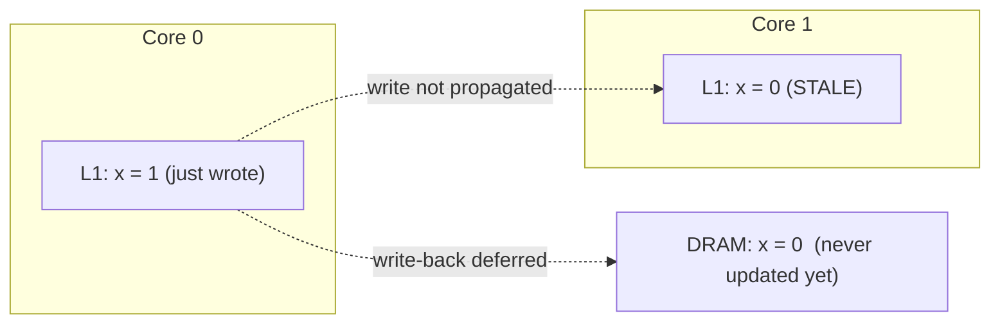
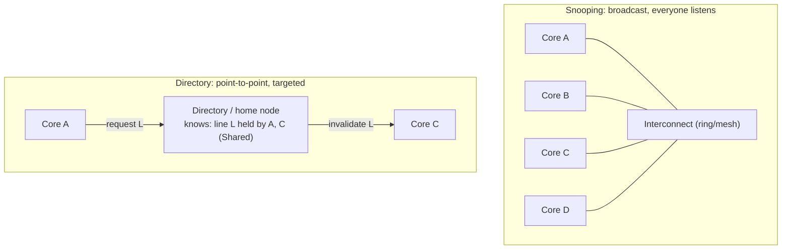
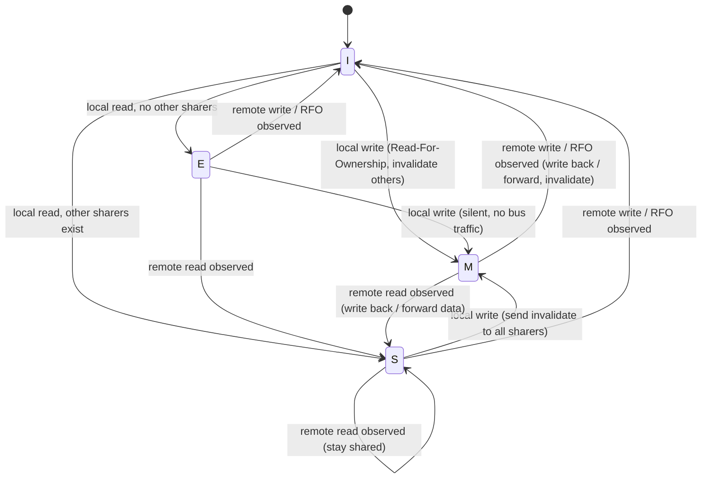
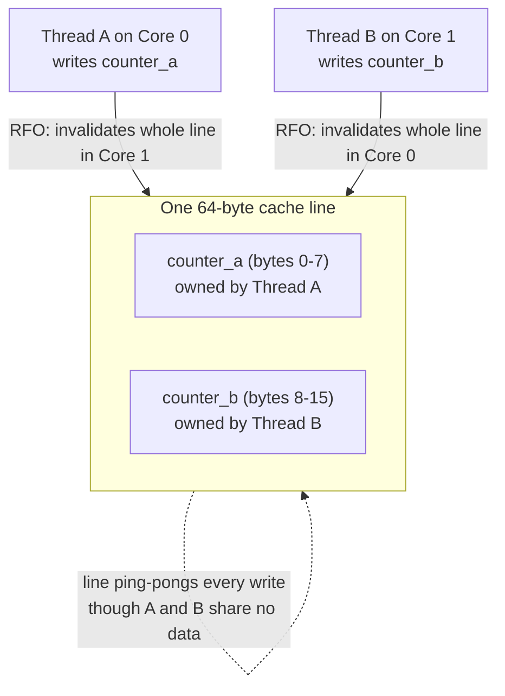
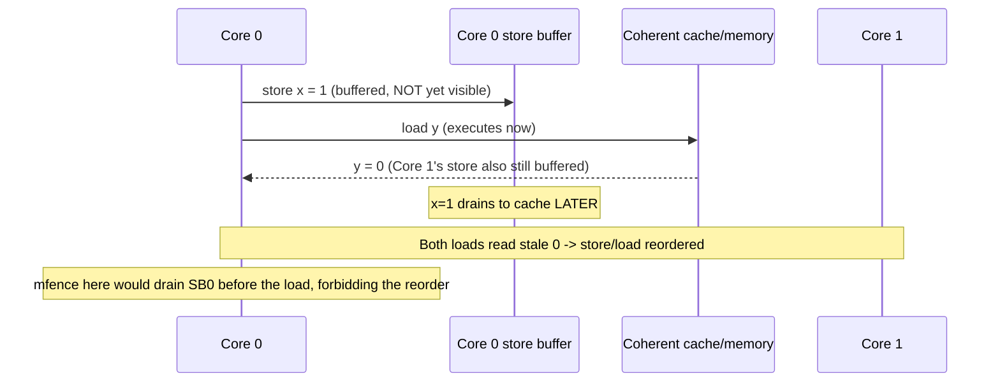

# Chapter 4 — Cache Coherence and Hardware Memory Consistency

*What this chapter covers.* Chapter 3 gave every core its own private, fast caches and showed why
that hierarchy is the difference between a core that computes and a core that stalls. But private
caches create a problem the moment there is more than one core: the *same* line of memory can sit in
several cores' caches at once, and when one core writes, every other copy is instantly, silently
wrong. **Cache coherence** is the set of protocols by which the cores conspire to keep their private
caches consistent, so that the many-cache reality still presents software with the illusion of a
single, shared memory. This chapter explains that machinery — MESI and its variants, snooping versus
directories — and then confronts its cost: coherence traffic, true and false sharing, cache-line
ping-ponging, and why an innocuous-looking pair of counters can run ten times slower than it should.
From there it climbs to the harder, subtler topic that coherence is *not*: **memory consistency** —
the order in which one core's writes to *different* locations become visible to another core, where
store buffers, weak memory models, x86-TSO versus ARM, and memory fences live. It closes on the
observation that makes all of it worth a backend engineer's time: hardware memory consistency and
distributed-systems consistency are the same theory twelve orders of magnitude apart, and the
engineer who understands one already understands the other.

Learning goals — after this chapter you should be able to:

- State the **coherence problem** precisely and give the two invariants (write propagation and
  write serialization) that any coherent system must satisfy.
- Explain **snooping** versus **directory-based** coherence, and why the choice tracks system
  size — bus snooping for a few cores, directories for many-core and multi-socket (Chapter 6).
- Walk the **MESI** state machine cold: the four states, the transitions on local and remote reads
  and writes, how an invalidate protocol propagates writes, and how a read of a Modified line gets
  the freshest data. Place **MESIF** (Intel) and **MOESI** (AMD) as the real-world variants.
- Diagnose **true sharing** (contention on genuinely shared data) and **false sharing** (distinct
  data colliding on one 64-byte line), quantify the latter's cost, and fix it with padding and
  alignment (Chapter 8).
- Explain how **atomic read-modify-write** operations (CAS, fetch-add) are implemented on top of
  coherence — the x86 `LOCK` prefix, ARM's LL/SC — and why contended atomics are a scalability
  killer.
- Draw the **sharp line between coherence and consistency**: coherence is per-location agreement;
  consistency is the ordering of operations across *different* locations.
- Compare **sequential consistency**, **x86-TSO**, and **ARM/POWER weak ordering**; explain the
  store buffer as the root cause of store→load reordering; and place **fences** (`mfence`, `dmb`)
  and acquire/release semantics as the tools that restore the ordering software needs — the
  hardware substrate that Volume 4's software memory models compile down to.
- See the exact analogy between hardware and distributed consistency — coherence ≈ single-object
  linearizability, consistency ≈ multi-object ordering, Lamport underneath both (Volume 6).

## The coherence problem

Return to the machine Chapter 3 built. Each core has a private L1 (split instruction/data) and
usually a private L2; the L3, or last-level cache, is shared across the socket. The unit of
everything is the 64-byte **cache line**. Now put two cores to work on the same data.

Core 0 reads the line containing a variable `x` (say `x = 0`), fetched from DRAM through L3 into
core 0's L1. Core 1 reads `x` too and gets its own copy in its own L1 — harmless, both copies are
identical and reading changes nothing. Now core 0 executes `x = 1`, writing into *its* L1 copy. Core
0's L1 now says `x = 1`; core 1's L1 still says `x = 0`. If nothing intervenes, core 1 reads `0`
forever — from its point of view the value is right there in L1, so why go to DRAM? Worse, under the
write-back policy of Chapter 3, core 0's new value never even reaches DRAM until the line is evicted,
so *neither* other caches *nor* memory reflect the write.

This is the **cache coherence problem**: private caches let the same location have multiple
independent copies, and an uncoordinated write makes the others stale. Left unmanaged, a
multiprocessor would present not shared memory but N disagreeing memories, and no shared-memory
program — no lock, no queue, no `volatile` flag — could work.



A memory system is **coherent** if it upholds two invariants, stated here the way architecture
texts state them:

1. **Write propagation.** A write to a location by one core eventually becomes visible to every
   other core. No copy stays stale indefinitely.
2. **Write serialization.** All writes to *a single location* are seen by *all* cores in the *same
   order*. If core A observes the sequence `x=1` then `x=2`, no other core may observe `x=2` then
   `x=1`. There is one global order of writes *per location*, and everyone agrees on it.

Note carefully what coherence does *not* promise: nothing about the ordering of writes to
*different* locations. That is the domain of memory consistency, the second half of this chapter,
and conflating the two is the single most common confusion in this area. Hold the line:
**coherence is a per-location guarantee.** Each location behaves, on its own, as if there were one
true copy that all cores read and write in a single agreed order — even though the bytes are
physically smeared across a dozen caches.

Coherence is implemented in hardware, transparently, on every commodity multicore. Software does not
opt in. The interesting questions are *how* the hardware does it and what it *costs*, because the
cost lands directly on the performance of every concurrent data structure a backend service runs.

## Snooping versus directories

To keep copies consistent, the caches must communicate: when a core wants to write a line, the
other cores holding that line must find out and drop or update their copies. There are two
architectural families for that communication, and the choice tracks system scale.

**Snooping (broadcast) coherence.** Historically the caches shared a common bus, and every cache
controller *snoops* — watches — every transaction on it. When core 0 wants exclusive ownership of a
line to write, it broadcasts an invalidation for that address; every other cache checks whether it
holds the line and, if so, invalidates its copy. Reads work the same way: a read request is
broadcast, and whichever cache holds the freshest copy (or memory) responds. Snooping is simple and
low-latency for small systems because the broadcast *is* the coordination — everyone hears
everything. Its fatal flaw is bandwidth: broadcast traffic grows with the number of participants,
and a shared bus becomes a bottleneck. Modern chips do not use a literal shared bus but a ring or
mesh interconnect with a snoop filter; the logical model — coherence requests are broadcast (or
filtered-broadcast) and observed by all — is still snooping, and it dominates within a single
socket's handful-to-dozens of cores.

**Directory-based coherence.** Instead of broadcasting to everyone, the system keeps a
**directory**: metadata, distributed alongside memory, recording *which caches hold each line and in
what state*. To write a line, a core consults the directory (a point-to-point message to the line's
home node), which knows exactly which cores have copies and sends invalidations only to *those*
cores — not a broadcast. This trades latency and complexity (an extra indirection, a directory to
maintain) for scalability: coherence traffic is proportional to the number of *sharers* of a line,
not the number of cores in the machine. Directories are how coherence scales to many-core chips and,
crucially, across **sockets**. On a multi-socket server the inter-socket links (Intel UPI, AMD
Infinity Fabric) carry directory-based coherence traffic, and the non-uniform cost of that traffic
is exactly the NUMA effect Chapter 6 develops: touching a line owned by another socket's cache means
a cross-socket coherence round trip.



The two families are not mutually exclusive. Large systems are hierarchical: snooping (or a snoop
filter) within a socket, directories between sockets. The mental model to keep is that coherence is
a *messaging protocol between caches* whose cost is the messages it must send — a framing that is the
through-line to the distributed-systems lens at the end of the chapter. It is not a metaphor.
Coherence *is* a consensus protocol implemented in silicon.

## MESI in depth

The protocol that decides what messages to send and when is a state machine. Each cache line, in
each cache, carries a few bits of coherence state. The canonical protocol — the one to know cold,
because the variants are deltas on it — is **MESI**, named for its four states.

| State | Meaning | Other caches may hold it? | Memory up to date? | Can read? | Can write without a bus transaction? |
|-------|---------|---------------------------|--------------------|-----------|--------------------------------------|
| **M** — Modified | This cache has the only copy, and it is dirty (differs from DRAM). | No | No — this cache owns the truth | Yes | **Yes** — already exclusive and dirty |
| **E** — Exclusive | This cache has the only copy, and it is clean (matches DRAM). | No | Yes | Yes | **Yes** — silently transitions to M |
| **S** — Shared | This cache has a copy; others may too. Clean. | Yes (possibly) | Yes | Yes | **No** — must invalidate others first |
| **I** — Invalid | No valid copy here. | — | — | No (miss) | No |

The four states encode two orthogonal bits of information: **is this copy exclusive or shared?**
and **is it clean or dirty?** Modified is exclusive+dirty; Exclusive is exclusive+clean; Shared is
shared+clean; Invalid is no copy. (There is no "shared+dirty" state in plain MESI — that is exactly
the state MOESI adds, below.)

The **E** state is what makes MESI better than the older MSI protocol. When a core reads a line no
one else holds, it lands in **E**, not S — no need to tell anyone, it has the only copy. If it then
writes, it transitions **E → M silently**, no bus transaction, because it already holds the line
exclusively. This is the common case for thread-local data: read then write, no contention, no
coherence traffic. Had the read landed in S, the write would have needed a bus transaction to
invalidate copies that do not even exist. E makes the uncontended case free.

### The transitions

The state machine is driven by two kinds of events: **local** events (this core's loads and stores)
and **remote** events (coherence messages observed from other cores — another core's read, another
core's read-for-ownership/write). The essential transitions:



Read the machine event by event.

**Local read of an Invalid line (a read miss).** If no other cache holds the line, the data comes
from memory (or L3) and the line goes to **E**. If other caches *do* hold it, the reader lands in
**S** and any E holder demotes to S. If a remote cache held the line in **M**, that cache supplies
the freshest data — writing it back and both settling in S, or forwarding it — because DRAM is stale.
This is how a read of a modified line gets the latest value: the protocol routes the read to the
owner of the dirty copy, not to stale memory.

**Local write of an Invalid or Shared line.** To write, the core must own the line exclusively. It
issues a **Read-For-Ownership (RFO)**: a request that both fetches the data (if needed) *and*
invalidates every other copy, dropping every other holder to **I**. Only once all copies are gone
does the writer transition to **M** and store. This is the **invalidate protocol**: a write does not
push the new value to other caches (that would be an *update* protocol, rare in practice); it
*removes* the other copies, forcing them to re-fetch on next access. Invalidate wins because one
invalidation message is cheaper than broadcasting every new value, and because it serializes writes.

**Local write of an Exclusive line.** No one else has a copy, so no invalidation is needed: **E → M
silently**. The cheap path E exists to enable.

**Remote read observed while in M or E.** The line must demote: **M → S** (writing back or forwarding
the dirty data first, so the reader gets the fresh value) or **E → S**. Now two caches share it,
clean.

**Remote write / RFO observed.** This cache must **invalidate**: M/E/S → **I**. If it was M, it first
supplies its dirty data (the new writer needs the current value). Afterward the remote core owns the
line in M and this core has nothing.

Write serialization — coherence invariant 2 — falls out of this structure: to write a line you must
first gain exclusive ownership via RFO, and only one core can hold M at a time. The ownership
hand-offs impose a single global order on the writes to that line, and every core observes writes in
that order because it only ever reads the line by acquiring a coherent copy from the current owner.

### A concrete scenario: two readers, one writer

Trace the canonical sequence — two cores read a line, then one writes it — through MESI, because
this is the pattern under every shared flag, every reference count, every spinlock.

```mermaid
sequenceDiagram
    participant A as Core A cache
    participant B as Core B cache
    participant M as Memory / L3
    Note over A,M: Line L initially only in memory
    A->>M: read L (miss)
    M-->>A: data
    Note over A: A holds L in E (exclusive, clean)
    B->>A: read L (miss, snoops A's E copy)
    A-->>B: data (A demotes E to S)
    Note over A,B: Both hold L in S (shared)
    A->>B: RFO L (A wants to write)
    Note over B: B invalidates its copy (S to I)
    Note over A: A gains M, performs store
    Note over A,B: A holds L in M; B holds nothing
    B->>A: read L (miss, snoops A's M copy)
    A-->>B: fresh data (A writes back/forwards, M to S)
    Note over A,B: Both hold L in S again, both see the new value
```

Step by step: A reads L, finds no other holder, caches it in **E**. B reads L, snoops A's copy, A
demotes to **S**, both hold L in **S**. A writes L: because L is Shared, A issues an **RFO**, B
invalidates (**S → I**), A transitions to **M** and stores. When B next reads L it misses, snoops
A's **M** copy, A supplies the fresh data and demotes to **S**, and B gets the new value. Coherence
held: B's stale copy was invalidated *before* A's write completed, and B's re-read was routed to the
current owner, never to stale memory.

Every arrow crossing between caches is a coherence message with real latency — tens of nanoseconds
within a socket, more across sockets. Run once, this pattern is invisible; run in a tight loop on
contended data, it is the dominant cost, and the next section is about exactly that.

### MESIF and MOESI: the real-world variants

Commodity chips extend MESI with a fifth state to handle the case plain MESI handles clumsily: what
happens when a Shared line, held clean by several caches, is requested by yet another cache? In
MESI, either memory supplies it (slow) or the responders race (redundant). Both major vendors add a
state to designate a single responder, but they solve slightly different problems.

- **MESIF (Intel).** Adds **F — Forward.** Among several caches sharing a clean line, exactly one
  holds it in **F**; that cache is the designated forwarder that responds to new read requests.
  The others stay in S and stay silent. This makes cache-to-cache transfer of *clean, shared* data
  fast (one nearby cache forwards it, rather than a slow memory fetch) while avoiding the redundant
  responses of naive MESI. F is essentially "Shared, and I'm the one who answers."

- **MOESI (AMD).** Adds **O — Owned.** O is the "shared *and* dirty" state that plain MESI lacks.
  In MESI, transitioning M → S requires writing the dirty data back to memory so the shared copies
  are clean. MOESI lets the owner keep the line **dirty** while *also* sharing it: the O holder has
  the authoritative (dirty) copy, supplies it to readers cache-to-cache, and defers the write-back.
  Other sharers are in S; memory stays stale until the O line is evicted. This avoids a memory
  write-back on every M → shared transition — valuable when producer/consumer patterns pass dirty
  data core-to-core repeatedly.

Both extensions exist to make **cache-to-cache data transfer** the fast path, because in a busy
multicore the freshest copy of a contended line usually lives in *another core's cache*, not in
memory. You will not program to F or O, but knowing they exist explains why "the data was in another
core's cache" is a distinct, often cheaper cost than "the data was in DRAM." For the rest of the
chapter, MESI is the model; MESIF/MOESI are the production refinements.

## The cost of coherence

Coherence is correct and automatic, but it is not free, and its cost is not spread evenly. It
concentrates precisely where multiple cores touch the same cache lines — which is precisely where
concurrent backend code lives. Two phenomena dominate: true sharing and false sharing. They have the
same mechanism (coherence traffic on a contended line) and completely different cures.

### True sharing and cache-line ping-ponging

**True sharing** is contention on data the cores genuinely share. A global counter incremented by
every thread, a shared work-queue head, a spinlock word, a reference count on a hot object: these
are single locations that many cores read and write. Each write requires an RFO that invalidates
every other holder; each subsequent read by another core re-fetches the line from the current owner.
The line bounces from cache to cache — **cache-line ping-ponging** — and every bounce is a coherence
round trip. The line spends its life in transit, owned by no core long enough to be useful.

The scalability consequence is stark. A single shared counter under a fetch-add from N cores does
not run N times faster; it runs *slower than one core*, because coherence traffic grows with N while
useful work does not. The line can be in **M** in only one cache at a time, so the cores serialize on
the ownership hand-off *plus* pay interconnect latency the single-core case never pays. This is the
mechanical-sympathy face of a deep truth: **shared mutable state does not scale.** The cure is to
*stop sharing* — per-thread counters summed on read (sharded counters), thread-local accumulation,
combining trees, or partitioning so each core owns its slice. Volume 4 develops the software patterns
(`LongAdder`-style structures, per-CPU data); the hardware reason they exist is on this page.

### False sharing: the subtle killer

**False sharing** is the one that catches good engineers, because the code *looks* contention-free.
Two threads update two *different* variables — no shared state in the program's logic — but the two
variables happen to sit on the *same 64-byte cache line*. Coherence operates on lines, not
variables (Chapter 3: the line is the atomic unit). So even though the threads never touch the same
datum, every write by one thread invalidates the *whole line* in the other thread's cache,
including the byte the other thread cares about. The hardware cannot tell that the writes are
logically independent; it sees two cores writing the same line, and it ping-pongs the line between
them exactly as if they were truly sharing.



Make it concrete. Two threads, each hammering its own counter:

```c
struct counters {
    long a;   // updated only by thread A
    long b;   // updated only by thread B
};            // sizeof == 16 bytes, both fields on ONE cache line

struct counters ctr;

void *thread_a(void *_) { for (long i = 0; i < 1'000'000'000; i++) ctr.a++; return 0; }
void *thread_b(void *_) { for (long i = 0; i < 1'000'000'000; i++) ctr.b++; return 0; }
```

Logically these threads are independent — `a` and `b` are never both touched by anyone. Run them on
two cores and the program is often **5–10x slower** than running the same two loops on data in
separate lines, and sometimes slower than running the two loops *sequentially on one core*. Every
`ctr.a++` on core 0 issues an RFO that invalidates the line in core 1, so core 1's next `ctr.b++`
misses and must re-acquire the line, which invalidates core 0's copy, and so on. The line
ping-pongs a billion times. No lock, no atomic, no shared variable — just an accident of memory
layout, turning two embarrassingly parallel loops into a coherence storm.

The fix is to force the two variables onto **different cache lines** by padding and aligning:

```c
struct counters {
    alignas(64) long a;   // start of its own 64-byte line
    alignas(64) long b;   // start of a different 64-byte line
};                        // sizeof == 128 bytes; a and b never share a line
```

With each counter on its own line, core 0's writes to `a` never invalidate the line holding `b`.
Both counters live permanently in their owner's L1 in **M** state, the loops hit no coherence
traffic, and the program runs at full speed and scales linearly. The cost is 112 wasted bytes — a
trade every performance-sensitive concurrent data structure makes deliberately. C++ standardizes the
line size hint as `std::hardware_destructive_interference_size` (the granularity to *separate* to
avoid false sharing) and `std::hardware_constructive_interference_size` (the granularity to *pack
together* for true sharing benefit); the JVM offers `@Contended` (with `-XX:-RestrictContended`);
Go and Rust libraries pad hot per-CPU structures the same way. Chapter 8 treats alignment and struct
layout as a first-class design concern; false sharing is its most expensive failure mode.

False sharing is nasty in production because it is invisible in the source: no shared state, no lock
contention, nothing a code review flags. It shows up only under profiling — a high
`mem_load_l3_hit_retired.xsnp_hitm` (cross-core snoop hit on a modified line, "HITM") on Intel
`perf` is the fingerprint — or as a mysterious refusal to scale past a couple of cores. Canonical
sightings: adjacent fields of a hot struct written by different threads; an array indexed by thread
ID (`counts[thread_id]++` with 8-byte elements packs eight threads' counters into one line); the
head and tail pointers of a concurrent queue on the same line, so producers and consumers fight over
it. The defense is a habit: any field written by one thread and sitting near a field written by
another is a false-sharing candidate — separate them by a line.

## Atomic operations at the hardware level

Coherence keeps individual reads and writes consistent, but concurrent algorithms need more: an
**atomic read-modify-write (RMW)** — read a value, compute a new one, write it back, with *no other
core able to intervene* in between. `compare-and-swap` (CAS), `fetch-and-add`, `exchange`, and
`test-and-set` are the primitives every lock, every lock-free queue, every reference count is built
on. They are not free coherence rides; they are the most expensive operations on the coherence
fabric, and understanding why is the key to understanding the scalability ceiling of any
lock-based or lock-free design.

**How an atomic RMW uses coherence.** To perform, say, `fetch_add(&x, 1)` atomically, the core must
hold the line containing `x` in **M** (exclusive, dirty) for the entire duration of read-compute-write,
and it must prevent any other core from stealing the line in the middle. There are two hardware
strategies:

- **x86: the `LOCK` prefix.** Instructions like `lock xadd`, `lock cmpxchg`, `lock inc` acquire the
  cache line exclusively (RFO to M) and hold it locked against snoops for the duration of the RMW,
  so no other core can observe or modify the line mid-operation. On any line that fits within a
  cache line (the normal case), the lock is a **cache lock** — cheap-ish, local to the coherence
  fabric. Only pathological cases — an atomic that straddles two cache lines — fall back to a **bus
  lock** that locks the whole memory subsystem, which is catastrophically slow and why you keep
  atomics naturally aligned. Modern Intel parts even fault or heavily penalize split-lock (bus-lock)
  operations to protect the system from a noisy neighbor holding the bus.

- **ARM / RISC / POWER: load-linked / store-conditional (LL/SC).** Rather than locking, these
  architectures use an *optimistic* pair. `LL` (load-linked / load-exclusive, `LDXR` on ARM) reads
  the location and sets a monitor on the line. Code computes the new value. `SC` (store-conditional,
  `STXR`) writes it back *only if* no other core touched the line since the LL — otherwise SC fails
  and the code retries the whole sequence in a loop. The hardware monitor is driven by coherence: a
  remote RFO to the monitored line clears the reservation, making the SC fail. This is lock-free at
  the ISA level and maps naturally onto weakly-ordered machines. ARMv8.1's LSE atomics (`LDADD`,
  `CAS`, `SWP`) add true single-instruction atomics on top, which scale better than LL/SC retry
  loops under contention.

**Why atomics are expensive** has two components that map onto the two halves of this chapter.
First, **coherence**: an atomic RMW *must* acquire the line exclusively (M), so it can never be
satisfied by a shared copy the way a plain read can — every atomic is at least an RFO, and a
coherence transfer if another core holds the line. Second, **ordering**: atomics carry
memory-ordering semantics (below), and enforcing them constrains the store buffer and the
out-of-order engine (Chapter 2), draining pipelines and blocking reordering the core would otherwise
do for speed. An uncontended atomic on a line already in M costs a few to a couple dozen cycles
(mostly ordering); a *contended* atomic — the line bouncing between cores — costs a full cross-core
coherence round trip *per operation*, tens to hundreds of cycles, and serializes the cores on the
line.

**Contended atomics are a scalability killer** for the same reason true sharing is: they force the
line to ping-pong and add ordering fences on top. A spinlock hammered by 32 cores spends almost all
its cycles moving the lock line between caches, not working. This is why modern concurrency avoids
centralized atomics: back-off, MCS/CLH queue locks that spin on *local* memory instead of a shared
word, per-CPU data with no cross-core atomics, and lock-free structures engineered to minimize
contended CAS on the hot path. Volume 4 covers those designs; the hardware reason they are necessary
— an atomic is a coherence exclusive-acquire plus an ordering fence, both exploding under contention
— is here.

## Coherence is not consistency

Now the pivot, and the most important conceptual distinction in the chapter. Everything so far —
MESI, snooping, invalidation, atomics acquiring lines — is about a **single memory location** and
keeping its many cached copies in agreement. That is **coherence**. But concurrent programs care
about a second, harder question that coherence says *nothing* about: given writes to *different*
locations, in what order do other cores observe them?

Make the distinction sharp with the two questions:

| | Coherence | Consistency (memory ordering) |
|---|-----------|-------------------------------|
| **Scope** | A single location | Multiple, different locations |
| **Question** | Do all cores agree on the order of writes to `x`? | Do all cores agree on the *relative* order of a write to `x` and a write to `y`? |
| **Guaranteed by** | Cache coherence protocol (MESI) — always, on all commodity hardware | The memory **consistency model** (SC, TSO, weak) — varies by architecture |
| **Analogy (Vol 6)** | Single-object linearizability | Multi-object / cross-key ordering |

The classic program that exposes the gap: two locations `x` and `y`, both initially 0; core 0 runs
`x = 1; r1 = y;` and core 1 runs `y = 1; r2 = x;`. Coherence guarantees each location behaves sanely
on its own. But it does *not* forbid the outcome `r1 == 0 && r2 == 0`: both cores read the *old*
value of the other's variable, as if each store had not happened when the other's load ran. On a
sequentially consistent machine that is impossible (no interleaving of the four operations produces
it); on real x86, ARM, and POWER hardware, **it happens** — and coherence is not violated, because
coherence never promised anything about the *cross-location* ordering of `x`'s write relative to
`y`'s read. That is a *consistency* question, answered by the memory model. Coherence is necessary
but not sufficient: a machine can be perfectly coherent and still reorder operations across
locations in ways that break naive concurrent code. The rest of the chapter is about that reordering.

## Memory consistency models

A **memory consistency model** is the contract between the hardware and software specifying which
reorderings of memory operations (to different locations) the hardware is allowed to perform — that
is, which outcomes a multithreaded program can legally observe. It is the formal answer to "what can
another core see, and in what order?"

### Sequential consistency: the intuitive ideal

**Sequential consistency (SC)**, defined by Leslie Lamport in 1979, is the model programmers
intuitively assume. Its definition: the result of any execution is the same as if all cores'
operations were executed in *some single sequential order*, and each core's operations appear in
that order *in the order the program issued them*. In plain terms: pick some interleaving of all the
threads' memory operations that respects each thread's program order; the machine behaves as if that
interleaving actually happened. No operation appears to move before an earlier operation from the
same thread.

SC makes the `r1==0 && r2==0` outcome impossible, and it is what you *wish* the machine gave you. The
problem is performance. SC effectively forbids the store buffer and most of the reordering the
out-of-order engine (Chapter 2) wants to do, forcing each memory operation to become globally
visible before the next begins; a store that misses in cache would stall every subsequent operation,
including independent ones, for the full coherence latency. No mainstream CPU implements SC in
hardware, for the same reason no database defaults to serializable isolation: the strongest, most
intuitive model is the slowest, so designers relax it and hand software the tools to recover
strictness where it matters.

### Why hardware reorders: the store buffer

The single most important source of relaxation on modern hardware is the **store buffer** (Chapter
2's write path). When a core executes a store, it does not wait for the store to reach the cache and
propagate coherently — that could take hundreds of cycles on a miss. Instead it drops the store into
a **store buffer**, a small FIFO of pending writes, and moves on immediately. The store retires from
the buffer to the L1 cache in the background, once the line is owned. This is essential for
performance: it lets the core keep executing past a store that missed, overlapping the store's
coherence cost with later work.

But it breaks SC in a specific way. Consider a core that executes `store x = 1` then `load y`. The
store sits in the buffer, not yet visible to other cores, while the load of `y` — a *different*
location — executes and completes. So from another core's perspective, this core's **load of `y`
happened before its store to `x` became visible** — a **store→load reorder**. That is exactly the
mechanism behind `r1==0 && r2==0`: each core's store is stuck in its buffer while its load reads the
other's stale value. The store buffer is not a bug but a universal optimization, and its consequence
— loads can appear to overtake earlier stores — is the defining relaxation of x86's memory model.



### x86-TSO versus ARM/POWER: strong versus weak

Real architectures sit on a spectrum from SC (strongest, unimplemented) to very weak. Two points on
that spectrum matter for backend work.

**x86-TSO (Total Store Order)** is the memory model of Intel and AMD x86. It is *relatively strong*.
Its one significant relaxation is the store buffer's: **a load may be reordered before an earlier
store to a different location** (store→load reordering). Everything else is kept in order:
store→store ordering is preserved (stores become visible in program order — hence "Total Store
Order"), load→load ordering is preserved, and load→store ordering is preserved. The store buffer is
also **FIFO and drains in order**, and a core sees its *own* stores immediately (store forwarding
from its buffer). TSO is close enough to SC that a large amount of racy-but-lucky x86 code happens to
work — which is a trap when the same code is ported to ARM.

**ARM and POWER are weakly ordered.** They relax *almost all* orderings: store→store, load→load,
load→store, and store→load can *all* be reordered, subject only to preserving single-thread data
dependencies (a load that feeds an address for a later access, and coherence per-location). Two
independent stores can become visible to other cores in the opposite order from program order; two
independent loads can complete out of order. This gives the hardware far more freedom to reorder for
performance (and simpler, lower-power out-of-order machinery), at the cost of demanding that software
insert explicit ordering instructions wherever it actually needs order. POWER is weaker still in some
respects (it does not even guarantee a single global store order the way simpler models do). The
practical upshot for backend engineers is the porting hazard: **code that is accidentally correct on
x86-TSO because TSO only reorders store→load will break on ARM Graviton**, where load→load and
store→store reorder freely. As ARM servers went mainstream in the datacenter (Chapter 2), this
stopped being an academic concern and became a real source of bugs surfacing only on the ARM fleet.

| Reordering allowed? | Sequential Consistency | x86-TSO | ARM / POWER (weak) |
|---------------------|:----------------------:|:-------:|:------------------:|
| Store → Store       | No  | No  | **Yes** |
| Load → Load         | No  | No  | **Yes** |
| Load → Store        | No  | No  | **Yes** |
| Store → Load (diff. loc.) | No | **Yes** | **Yes** |
| Own store visible to self early | — | Yes (store forwarding) | Yes |
| Single global store order | Yes | Yes | Not guaranteed (POWER) |

Two takeaways from the table. First, *every* real model allows store→load reordering, because every
real machine has a store buffer — even the strong x86. Second, the gap between TSO and weak is *which
other* reorderings are allowed, and it is large: three additional reordering freedoms that weak
machines have and x86 does not. Portable concurrent code cannot rely on the model; it must state its
ordering requirements explicitly, which is what fences and the language memory models do.

## Memory barriers and fences

If the hardware reorders memory operations for speed, software needs a way to say "not here — this
ordering is load-bearing." That tool is the **memory barrier** (fence): an instruction that
constrains the reordering of memory operations around it. Fences are how a program recovers exactly
as much ordering as it needs and no more, paying the performance cost only at the specific points
where correctness demands it.

**x86 fences.** Because x86-TSO already preserves most orderings, x86 needs few fences. The
important one is **`mfence`** (full memory fence): it prevents *any* memory operation before it from
reordering with *any* after it, and in particular it **drains the store buffer** — all buffered
stores become globally visible before any later load executes. `mfence` is precisely the instruction
that forbids the store→load reorder, closing the `r1==0 && r2==0` hole. `sfence` (store fence)
orders stores and `lfence` (load fence) orders loads and also serializes execution; both are rarely
needed on TSO for ordinary code but appear around non-temporal stores (Chapter 3's streaming writes,
which are *not* TSO-ordered) and in speculation-control contexts. Note: on x86 a `lock`-prefixed
atomic (`lock xadd`, etc.) *also* acts as a full fence — which is why atomics carry an ordering cost
on top of their coherence cost, and why you rarely need a separate `mfence` next to one.

**ARM fences.** Weak ordering means ARM needs fences far more often. **`DMB`** (Data Memory Barrier)
orders memory accesses around it (with options for the scope and which accesses — e.g. `DMB ISH` for
inner-shareable). **`DSB`** (Data Synchronization Barrier) is stronger: it not only orders but blocks
execution until prior memory accesses *complete*. **`ISB`** (Instruction Synchronization Barrier)
flushes the pipeline for self-modifying-code and system-register changes. In practice, ARMv8 also
provides ordered load/store variants — **load-acquire (`LDAR`)** and **store-release (`STLR`)** —
that bake the common ordering directly into the memory instruction, which is usually cheaper and
more precise than a standalone `DMB`.

**Acquire and release semantics** are the ordering vocabulary you will actually think in, because
they are what language memory models expose (Volume 4). They are *one-way* barriers, which is what
makes them cheaper than a full fence:

- A **load-acquire** guarantees that no memory operation *after* it (in program order) is reordered
  *before* it. It is the read side of a handoff: once you acquire, everything the producer did before
  its release is visible to you. Reads/writes cannot "leak up" above an acquire.
- A **store-release** guarantees that no memory operation *before* it is reordered *after* it. It is
  the write side: everything you did before the release is published atomically-visibly to whoever
  acquires. Reads/writes cannot "leak down" below a release.

Together they implement the **publish/subscribe** pattern at the heart of every lock and lock-free
handoff: a producer writes data, then does a store-release on a flag; a consumer does a load-acquire
on the flag, and if it sees the flag set it is guaranteed to see all the data the producer wrote
*before* the release. Acquire/release is strictly weaker than a full fence — it orders one direction,
not both — which is why it is the default: it buys exactly the ordering a handoff needs without the
two-directional store-buffer drain of `mfence`/`DMB`. On x86-TSO, acquire/release loads and stores
are often *free* (plain `mov`) because TSO already provides the ordering; on ARM they compile to
`LDAR`/`STLR`. Same source, different cost, because the memory model differs.

**This is the hardware substrate for Volume 4.** High-level languages do not make you write `mfence`
or `DMB`. They define a *software* memory model — `std::memory_order_acquire`/`release`/`seq_cst` in
C++11, the happens-before edges of the Java Memory Model, Go's `sync/atomic`, Rust's `Ordering` — and
the *compiler* lowers those abstractions to the right fences per target: the same acquire/release
C++ source emits nothing on the load path on x86-TSO but `LDAR`/`STLR` on ARM, the minimum barriers
that honor the language's promised ordering. Volume 4 is entirely about that upper layer — data
races, happens-before, the C++/Java/Go memory models, lock-free algorithms — and it *compiles down to
the fences on this page*. When Volume 4 says a release-store synchronizes-with an acquire-load, the
machine underneath is doing store-buffer discipline and `STLR`/`LDAR` or `mov`. Coherence and
consistency are the floor; the software memory model is the language you reason in on top of it.

## Distributed-systems lens

The reason this chapter belongs in a backend engineer's education is not that you will hand-tune
MESI transitions. It is that **the entire problem — and its entire theory — is the distributed
systems problem, one abstraction layer down.** The parallels are not analogies of convenience; they
are the same mathematics applied at different scales, and seeing that is a genuine unlock.

**Coherence is distributed consensus in hardware.** Cores with private caches that must agree on the
current value of a location are *replicas* that must agree on the current value of an object. The
coherence protocol — request ownership, invalidate other copies, serialize writes through a single
owner — is a replication/consensus protocol. RFO-and-invalidate is a single-leader scheme: to write
you must become the leader (M owner) for that line, and only one exists at a time — exactly how a
single-leader replicated log serializes writes to a key. The directory is a metadata service
tracking which replicas hold which objects in which state, the role a placement service plays in a
distributed store. Cross-socket coherence traffic on UPI/Infinity Fabric (Chapter 6) *is*
cross-replica coordination latency, and NUMA is the hardware's version of "some replicas are in
another datacenter."

**The consistency models are literally the same models.** This is the highlight. The hierarchy of
hardware memory models maps one-to-one onto the hierarchy of distributed consistency models, and
Lamport is underneath *both*:

| Hardware (this chapter) | Distributed systems (Volume 6) | What it guarantees |
|-------------------------|-------------------------------|--------------------|
| Cache coherence (per location) | **Linearizability** of a single object | One object behaves as one copy with a real-time-consistent total order of ops |
| **Sequential consistency** (Lamport 1979) | **Sequential consistency** (same name, same author) | A single total order consistent with each thread's/client's program order; no real-time guarantee across objects |
| x86-**TSO** / weak ordering | **Causal / bounded-staleness** models | Some orderings preserved (causal, or store order), others relaxed for performance |
| No ordering / racy | **Eventual consistency** | Writes propagate eventually; readers may see stale/reordered values until they converge |

This is no coincidence of naming: Lamport's 1979 paper "How to Make a Multiprocessor Computer That
Correctly Executes Multiprocess Programs" *defined* SC for hardware, and the identical definition is
the SC distributed systems use. Linearizability (Herlihy and Wing, 1990) is SC *plus* a real-time
ordering constraint, and it is precisely what coherence provides per location: a single location,
viewed across all cores, is a *linearizable register*. The `r1==0 && r2==0` litmus test is the
hardware twin of a distributed anomaly where two clients each read the other's key before the other's
write propagates — same shape, same cause (relaxed cross-object ordering), same fix (a
synchronization point: a fence in hardware, a coordination round trip in the distributed system).

**Coordination is expensive — at every scale.** The chapter's cost story is the distributed cost
story. An atomic RMW acquires a line exclusively and fences: a coordination round trip. Contended
atomics collapse throughput because coordination serializes the cores — exactly as a distributed
system routing every write through one consensus group collapses because coordination serializes the
clients. False sharing is *accidental* coordination — two parties forced to coordinate because they
landed on the same coherence unit though they share no logic — whose distributed twin is two
unrelated keys hashed to the same partition. The fix is identical in spirit: **change the layout so
independent things stop sharing a unit of coordination** — pad to separate cache lines; re-shard so
hot keys land on different partitions.

Which yields the unifying principle, the mechanical-sympathy version of the distributed mantra:
**shared mutable state is the enemy of scale, in silicon exactly as across a network.** The cures are
the same: partition so each worker owns its slice (per-core data ↔ sharding); prefer local to shared
state (`LongAdder` ↔ CRDTs); minimize writes that must coordinate (lock-free hot paths ↔ fewer
cross-partition transactions); accept the weakest consistency the problem tolerates (acquire/release
instead of `seq_cst` ↔ causal/eventual instead of linearizable). A backend engineer who has
internalized why 32 cores hammering one atomic run slower than one core has *already internalized*
why a system funneling every write through one leader does not scale — and the reason to prefer
share-nothing architectures (Volume 7) is the reason to prefer per-CPU data structures (Volume 4).
The constants differ by twelve orders of magnitude; the theory — Lamport's — does not change at all.

## Key takeaways

- **Coherence** keeps the many cached copies of a *single* memory location in agreement. It
  guarantees **write propagation** (writes eventually become visible) and **write serialization**
  (all cores see writes to one location in the same order). It is automatic on all commodity
  hardware; software does not opt in.
- **MESI** is the canonical protocol: **M**odified (exclusive dirty), **E**xclusive (exclusive
  clean — enables the silent E→M write with no bus traffic), **S**hared (clean, possibly-shared,
  write needs an invalidate), **I**nvalid. Writes use **Read-For-Ownership** to invalidate other
  copies (invalidate protocol); a read of a Modified line is routed to the dirty owner, not stale
  memory. **MESIF** (Intel, adds Forward) and **MOESI** (AMD, adds Owned = shared+dirty) optimize
  cache-to-cache transfer.
- **Snooping** (broadcast, all caches observe) suits a socket's cores; **directories** (targeted,
  track sharers) scale to many-core and cross-socket, where they are the NUMA coherence traffic of
  Chapter 6. Coherence is a message-passing consensus protocol in hardware.
- **True sharing** (genuinely shared hot data) and **false sharing** (distinct variables colliding
  on one 64-byte line) both cause **cache-line ping-ponging** — the line bounces between cores, one
  coherence round trip per bounce. False sharing is invisible in source and can cause **5–10x
  slowdowns**; fix it by **padding/aligning** hot per-thread fields to separate cache lines (Chapter
  8). The `perf` fingerprint is cross-core snoop hits on modified lines (HITM).
- **Atomic RMW** (CAS, fetch-add) must acquire the line **exclusively** (M) and enforce ordering:
  x86 `LOCK`-prefix (cache lock; a full fence too), ARM **LL/SC** or LSE atomics. They cost coherence
  *plus* ordering, and **contended atomics serialize cores** — a scalability killer that motivates
  per-CPU data and queue locks (Volume 4).
- **Coherence ≠ consistency.** Coherence is per-location; **consistency** is the ordering of
  operations to *different* locations as seen by other cores. The `r1==0 && r2==0` litmus test is
  legal on real hardware without violating coherence.
- **Sequential consistency** is the intuitive, unimplemented ideal. Real hardware relaxes it for
  speed, driven mainly by the **store buffer**, which lets a **load overtake an earlier store to a
  different location**. **x86-TSO** relaxes *only* store→load; **ARM/POWER** relax store→store,
  load→load, and load→store as well — so racy code that survives on x86 can break on ARM Graviton.
- **Fences** restore ordering where needed: x86 `mfence` (drains the store buffer), ARM `DMB`/`DSB`,
  and the one-way **acquire/release** semantics (`LDAR`/`STLR`) that implement publish/subscribe
  handoffs cheaply. This is the substrate that **Volume 4's software memory models** (C++/Java/Go/Rust
  atomics) compile down to.
- **The distributed-systems parallel is exact.** Coherence ≈ single-object **linearizability**;
  hardware consistency models ≈ distributed consistency models (SC/TSO/weak ↔ sequential/causal/
  eventual), with **Lamport** underneath both. Atomics-are-expensive ↔ coordination-is-expensive;
  false sharing ↔ accidental co-partitioning; the cure in both worlds is **stop sharing the unit of
  coordination** — partition, per-core/per-node state, share-nothing (Volumes 6 and 7).

## Further reading

- Leslie Lamport, "How to Make a Multiprocessor Computer That Correctly Executes Multiprocess
  Programs," *IEEE Transactions on Computers*, 1979 — the paper that defined sequential consistency;
  the common ancestor of hardware and distributed consistency.
- Maurice Herlihy and Jeannette Wing, "Linearizability: A Correctness Condition for Concurrent
  Objects," *ACM TOPLAS*, 1990 — defines linearizability; the per-object guarantee coherence provides.
- Vijay Nagarajan, Daniel J. Sorin, Mark D. Hill, David A. Wood, *A Primer on Memory Consistency and
  Cache Coherence*, 2nd ed. (Morgan & Claypool, 2020) — the definitive, rigorous modern treatment of
  both topics together; the single best source for this chapter's material.
- Hennessy and Patterson, *Computer Architecture: A Quantitative Approach*, 6th ed. (Morgan Kaufmann,
  2017), Chapter 5 — coherence protocols, snooping vs directory, consistency models.
- Sewell, Sarkar, Owens, Nardelli, Myreen, "x86-TSO: A Rigorous and Usable Programmer's Model for x86
  Multiprocessors," *Communications of the ACM*, 2010 — the formal, verified model of x86 memory
  ordering; the authority for the TSO claims here.
- Paul E. McKenney, *Is Parallel Programming Hard, And, If So, What Can You Do About It?* —
  https://mirrors.edge.kernel.org/pub/linux/kernel/people/paulmck/perfbook/perfbook.html — deep,
  practical coverage of memory barriers, RCU, per-CPU data, and real weak-memory hardware.
- Ulrich Drepper, "What Every Programmer Should Know About Memory" (2007) —
  https://people.freebsd.org/~lstewart/articles/cpumemory.pdf — Section 6 covers coherence, atomics,
  and false sharing with measurements.
- Preshing on Programming, "Memory Barriers Are Like Source Control Operations," "Acquire and Release
  Semantics," and the weak-vs-strong-ordering posts — https://preshing.com/ — the clearest informal
  explanations of acquire/release and hardware reordering for practitioners.
- Intel 64 and IA-32 Architectures Software Developer's Manual, Vol. 3A, "Memory Ordering," and the
  Arm Architecture Reference Manual (ARMv8-A), "Memory model" — https://www.intel.com/sdm and
  https://developer.arm.com/documentation/ — authoritative per-architecture ordering rules, `LOCK`,
  `mfence`, `DMB`/`DSB`, `LDAR`/`STLR`.
- Hans-J. Boehm and Sarita Adve, "Foundations of the C++ Concurrency Memory Model," *PLDI 2008* — the
  bridge from these hardware models to the language memory models of Volume 4.
- Herb Sutter, "Eliminate False Sharing," Dr. Dobb's, 2009 — a practitioner walk-through of false
  sharing and padding fixes with numbers.
