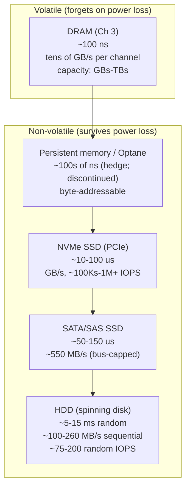
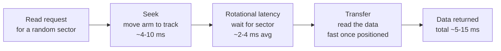
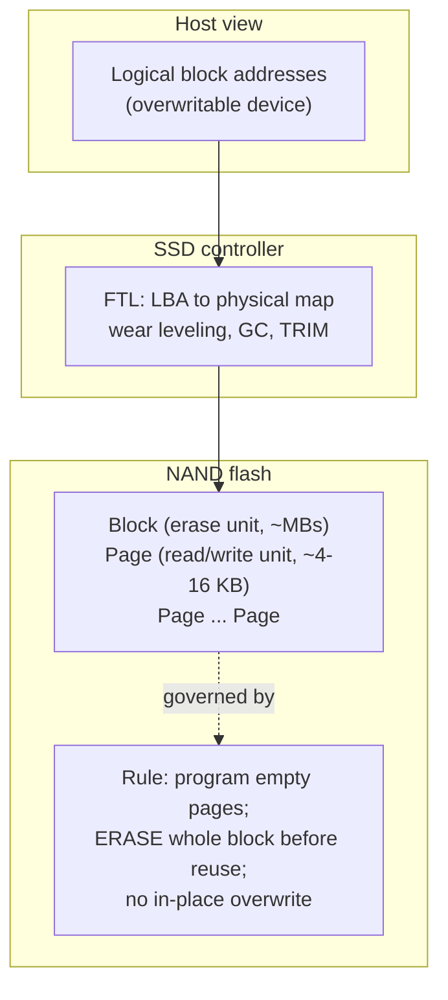
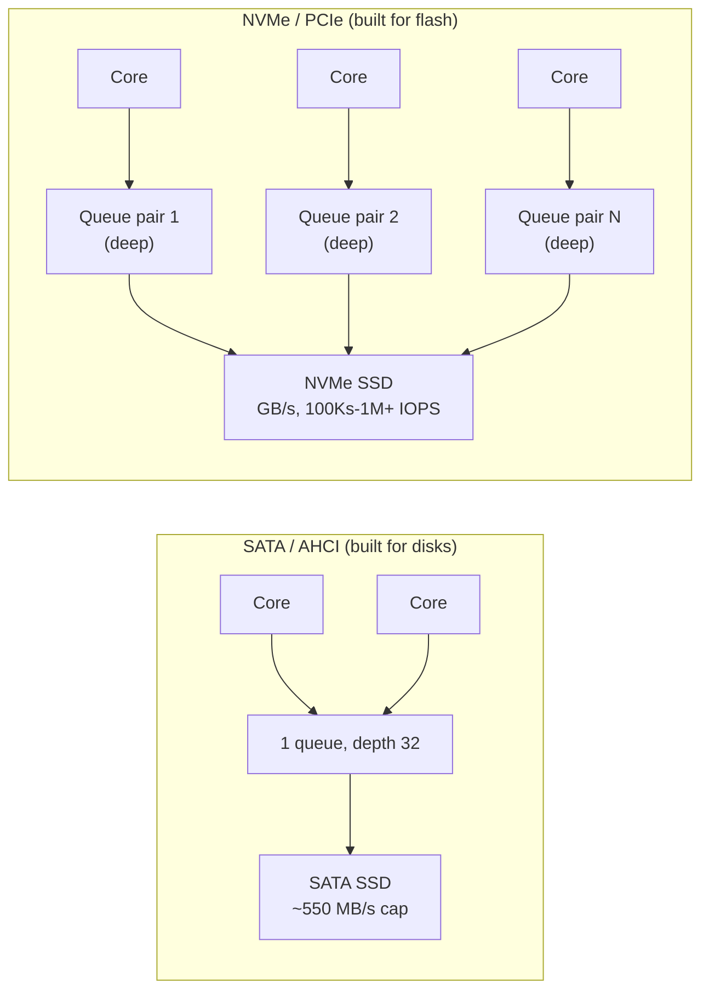
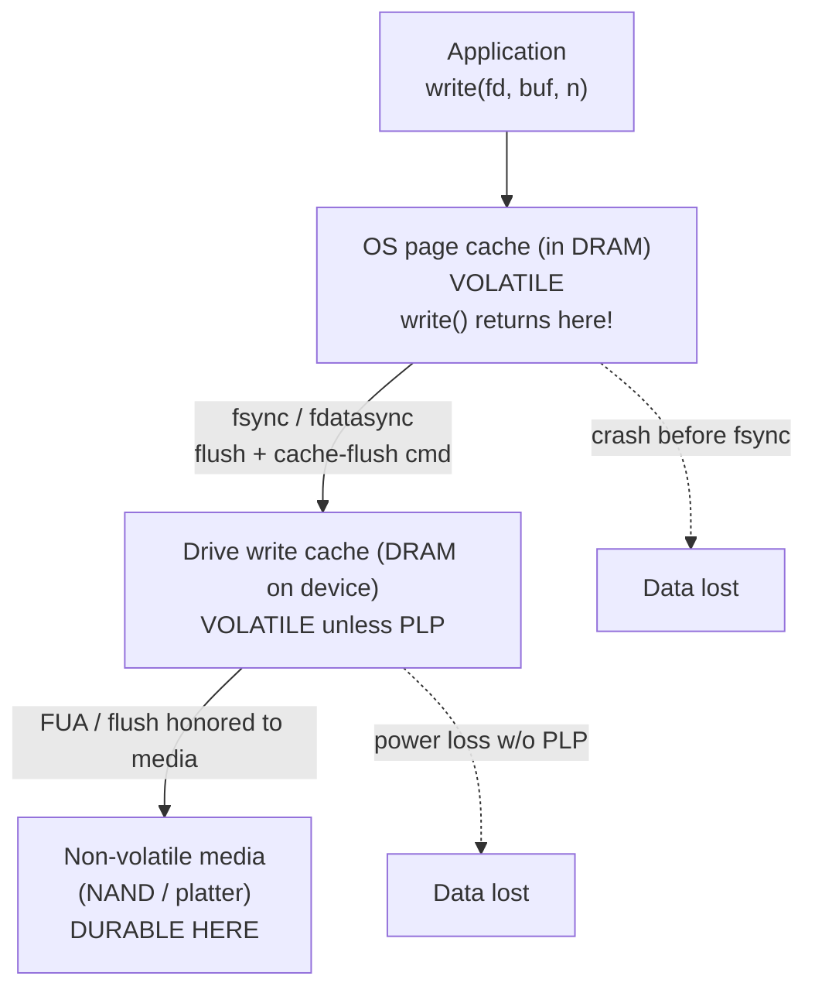

# Chapter 5 — Storage Hardware: HDD, SSD, NVMe, and Persistent Memory

*What this chapter covers.* Chapter 3 built a hierarchy of tiers with growing latency — registers,
caches, DRAM — and stopped at the edge of the box. This chapter goes one tier further down, to the
tier where data actually *survives*: persistent storage. Everything a backend engineer cares about
preserving — the write-ahead log, the committed transaction, the Kafka partition, the object in the
bucket — ultimately lands on a spinning platter, a NAND flash cell, or (briefly, historically) a
persistent-memory module. And the *physics* of those media is not a curiosity: it is the hidden
premise behind almost every design decision in a data system. Append-only logs, LSM trees, B-tree
node sizes, the obsession with `fsync`, the difference between a "committed" write and a durable
one — none of these make sense until you understand what the hardware underneath is actually doing.
This chapter explains how each storage technology works mechanically, what performance and durability
guarantees it really provides, and how those guarantees propagate up into the correctness of
distributed systems. It is, deliberately, the hardware chapter that sets up Volume 5 (Databases).

Learning goals — after this chapter you should be able to:

- Place **storage in the hierarchy** below DRAM, and reason about the latency / bandwidth /
  persistence / cost trade-offs that separate the tiers by orders of magnitude.
- Explain **HDD mechanics** — seek time and rotational latency — and derive from them why random
  I/O is catastrophic on disk and why storage engines evolved toward **sequential, append-only**
  access.
- Explain **NAND flash**: cells (SLC/MLC/TLC/QLC), the page/block asymmetry, **erase-before-write**,
  and the **Flash Translation Layer** — wear leveling, garbage collection, write amplification, and
  the endurance limits (DWPD/TBW) they exist to manage.
- Explain why **NVMe over PCIe** displaced SATA/AHCI: deep parallel queues, low latency, high IOPS,
  and how NVMe-oF disaggregates storage across a network.
- Describe **persistent memory** (Intel Optane / 3D XPoint) accurately, including its
  byte-addressable programming model, its durability/ordering challenges, and its **discontinuation**.
- Reason precisely about **durability**: what "the write is persistent" actually requires, the path
  from application through page cache and drive cache to media, and where `fsync`, FUA, and
  **power-loss protection** actually make the guarantee.
- Use the right **performance metrics** — IOPS vs bandwidth vs latency, queue depth, random vs
  sequential — and connect them to cloud storage abstractions (provisioned IOPS, network-attached
  disks).

## The storage tier: below DRAM, and persistent

Chapter 3's hierarchy had a floor of DRAM at ~100 ns. Storage sits below that floor and differs from
every tier above it in one categorical way that dwarfs all the quantitative differences: **it is
non-volatile.** DRAM forgets everything the instant power drops; storage remembers. That single
property is why storage exists, and also why it is slow — the mechanisms that make a bit *stick*
(magnetizing a platter region, trapping charge on a floating gate) are inherently costlier to read and
write than flipping an SRAM cell or refreshing a DRAM capacitor.

The result is a chasm. Where the memory hierarchy spans registers (sub-nanosecond) to DRAM (~100 ns) —
three orders of magnitude — the jump from DRAM to storage adds several more. A local NVMe SSD read is
on the order of **tens of microseconds**; a random HDD read is **milliseconds**. From an L1 hit (~1 ns)
to an HDD seek (~10 ms) is roughly **seven orders of magnitude** — the difference between one second
and four months. It is why data systems are, at bottom, the art of not going to storage — and of going
there cheaply when forced to.

The table below gives order-correct figures. As in Chapter 3, treat every number as an
approximation whose **order of magnitude is the durable fact**; exact values depend on the specific
part, generation, and workload. What matters is the *shape*: each row down is roughly an order of
magnitude slower and cheaper per byte than the row above, and the persistence column is the reason
any of the lower rows exist at all.

| Tier                | Read latency (typical)   | Bandwidth (typical)        | Random IOPS (typical)   | Persistent? | $/GB (relative) |
|---------------------|--------------------------|----------------------------|-------------------------|-------------|-----------------|
| DRAM                | ~100 ns                  | tens of GB/s per channel   | n/a (byte-addressable)  | No          | highest         |
| Persistent memory   | ~100s of ns (hedge)      | several GB/s               | very high               | Yes         | high (historic) |
| NVMe SSD (PCIe)     | ~10-100 us               | ~3-14 GB/s (Gen3-Gen5 x4)  | ~100Ks to 1M+           | Yes         | medium          |
| SATA/SAS SSD        | ~50-150 us               | ~550 MB/s (SATA III cap)   | ~50K-100K               | Yes         | medium-low      |
| HDD                 | ~5-15 ms (random)        | ~100-260 MB/s (sequential) | ~75-200                 | Yes         | lowest          |

Read the IOPS column against the latency column and a pattern jumps out that governs the rest of
this chapter: **the gap between random and sequential access widens as the medium gets slower.** On
DRAM, random vs sequential differs by a small factor (prefetching, row buffers). On an SSD, random
4K reads are slower than sequential but still respectable. On an HDD, random access is *two to three
orders of magnitude* worse than sequential, because a spinning disk must physically move to reach a
random location. Storage physics does not just make storage slow; it makes *access-pattern discipline*
the single highest-leverage decision in a storage engine's design.

## HDDs: mechanical latency and the tyranny of the seek

A hard disk drive is the last electromechanical component in a modern server. It matters even though
flash has displaced it for hot data — because the design lessons HDDs burned into database engineering
are still with us, and because HDDs remain the economical choice for cold, bulk, and archival storage
where capacity per dollar dominates.

An HDD stores bits as magnetized regions on the surfaces of rigid **platters** that spin on a
**spindle** at a constant rate — commonly 5,400, 7,200, or (in enterprise parts) 10,000 or 15,000
RPM. A stack of read/write **heads**, one per surface, is mounted on an **actuator arm**. To read
or write a specific sector, the drive must do two mechanical things in sequence:

1. **Seek.** The actuator swings the head to the correct radial track. Moving the arm and letting it
   settle takes, on average, **~4-10 ms** (a full stroke across all tracks is longer; a short seek
   to an adjacent track is shorter — the "average seek time" on the datasheet is a mean over random
   track pairs).
2. **Rotational latency.** Once the head is on the right track, it must wait for the platter to spin
   the desired sector underneath it. On average this is half a revolution. At 7,200 RPM a full
   revolution takes ~8.3 ms, so average rotational latency is **~4.2 ms**. At 15,000 RPM it is
   ~2 ms. This is why RPM is on the spec sheet: it directly sets the rotational-latency floor.

Add seek and rotation and a single **random** access costs on the order of **5-15 ms** before a
single useful byte moves. Invert that and you get the brutal headline number: a 7,200-RPM drive
services only **~75-150 random IOPS**. That is not a typo and it has not meaningfully improved in
decades, because it is bounded by mechanics, not electronics — arms and platters obey Newton, not
Moore.

Now contrast **sequential** access. Once the head is positioned, the platter streams data under it
continuously; adjacent sectors require no seek and no extra rotational wait. Sequential throughput
is therefore governed by areal density and RPM, and lands at **~100-260 MB/s** on modern drives —
respectable, and *thousands* of times more efficient per byte than random access. This is the
single most important fact about the HDD:

> On a hard disk, **sequential access is not a little faster than random access; it is
> catastrophically, order-of-magnitudes faster.** A workload of small random reads can leave a drive
> delivering well under 1 MB/s of useful data while its head thrashes; the same drive reads
> sequentially at 200 MB/s.

### What the HDD taught databases

This one asymmetry shaped the storage-engine designs you study in depth in Volume 5. Every classic
technique is, at root, a strategy to turn random I/O into sequential I/O:

- **Append-only logs and write-ahead logging (WAL).** Writing new data by *appending* to the end of

The enduring lesson generalizes past HDDs. Chapter 3 showed sequential memory access beats random
because of prefetching; storage multiplies the stakes: **sequential beats random at every tier, and
the slower the tier, the more extreme the penalty.** Design access patterns for the slowest tier your
data touches.

## SSDs: NAND flash and the erase-before-write problem

A solid-state drive has no moving parts. It stores bits as trapped electric charge in **NAND flash**
cells, and it reads them electronically. That alone removes seek and rotational latency and is why
SSDs deliver random reads three to four orders of magnitude faster than an HDD. But NAND flash has
its own deeply peculiar physics, and that peculiarity — not raw speed — is what a backend engineer
must understand, because it drives write behavior, tail latency, endurance, and cost across a fleet.

### Cells: the density-vs-endurance trade-off

A NAND cell stores charge on a floating gate (or a charge-trap layer in modern 3D NAND). How many
*bits* you store per cell is a design choice that trades density against speed and endurance:

| Type | Bits/cell | Voltage levels | Relative density | Relative endurance (P/E cycles, hedge) | Relative speed |
|------|-----------|----------------|------------------|----------------------------------------|----------------|
| SLC  | 1         | 2              | 1x               | ~50K-100K                              | fastest        |
| MLC  | 2         | 4              | 2x               | ~3K-10K                                | fast           |
| TLC  | 3         | 8              | 3x               | ~1K-3K                                 | medium         |
| QLC  | 4         | 16             | 4x               | ~100-1K                                | slowest        |

The physics is intuitive once stated: to store *n* bits in a cell you must distinguish 2ⁿ distinct
charge levels. More levels means finer voltage margins, so reads and (especially) writes take longer
and more care, and the cell tolerates fewer erase cycles before the insulation degrades and the
margins collapse. SLC is fast and durable but expensive per bit; QLC is cheap and dense but slow to
write and short-lived. Most mainstream drives today are TLC; QLC targets read-heavy, cost-sensitive
bulk storage. (Modern capacity comes largely from stacking layers vertically — "3D NAND," now well
past 200 layers — rather than from shrinking cells, which had hit reliability limits.) The endurance
numbers above are deliberately hedged ranges; the ordering (SLC ≫ MLC ≫ TLC ≫ QLC) is the durable
fact.

### Pages and blocks: the asymmetry that drives everything

Here is the property that makes flash unlike any storage that came before it. NAND is organized into
two different units for two different operations:

- A **page** is the unit of **read and write (program)** — commonly ~4-16 KB.
- A **block** is the unit of **erase** — a block contains many pages (often 128-256+), so a block is
  on the order of a few megabytes.

And the rule that follows is the crux of the entire chapter:

> You can **read** a page and you can **write (program)** an *empty* page, but you **cannot
> overwrite a page in place.** To rewrite a page you must first **erase the entire block** it
> belongs to — and erase only works at block granularity.

Flash cells are programmed by pushing charge onto the floating gate one page at a time, but charge
can only be *removed* in bulk, a whole block at once. So "modify these 4 KB" cannot be done directly.
If the drive naively erased the whole block to change one page, it would (a) destroy the other 200-odd
valid pages in that block and (b) burn a precious erase cycle for a tiny change. No drive does that.
Instead, every SSD interposes a layer of indirection.

### The Flash Translation Layer (FTL)

The **FTL** is firmware running on the SSD's controller that presents a normal, overwritable block
device to the host while hiding all of NAND's quirks. It is, in effect, a tiny log-structured
storage engine embedded in the drive. It does several jobs at once.

**Logical-to-physical mapping and out-of-place writes.** The host addresses the drive by *logical*
block address (LBA); the FTL keeps a mapping table from LBAs to *physical* NAND locations. When the
host "overwrites" LBA 42, the FTL does **not** touch the old physical page — it writes the new data to
a fresh, already-erased page elsewhere, remaps LBA 42 to it, and marks the old page **stale**.
Overwrite-in-place becomes write-elsewhere-and-remap, which is why an SSD's random-write pattern, as
seen by the NAND, is actually sequential appends into erased blocks — the FTL is log-structuring for
you.

**Wear leveling.** Because each block tolerates only a limited number of program/erase (P/E) cycles,
the FTL spreads writes evenly across all blocks — rotating writes and occasionally relocating cold data
— so the whole device ages uniformly rather than wearing out a few hot blocks while the rest stay
fresh.

**Garbage collection (GC).** Over time, blocks fill with a mix of valid and stale pages. To reclaim
space the FTL must produce *fully erased* blocks. It picks a victim block, copies its still-valid
pages into a fresh block, then erases the victim. That copy step is the catch: **to free space, the
drive must itself write data** — internal writes the host never asked for.

**TRIM.** When a filesystem deletes a file, the underlying LBAs are free from the host's point of
view, but the SSD has no way to know that — as far as the FTL knows, that data might still be needed.
The **TRIM** command (SATA) / **Deallocate** (NVMe) lets the OS tell the drive "these LBAs are now
garbage." This lets GC treat those pages as stale immediately instead of dutifully copying dead data
during collection, which improves both performance and endurance. A filesystem that does not issue
TRIM slowly degrades an SSD's write performance.

### Write amplification, endurance, and the p99 tail

Two consequences of the FTL matter enormously to a backend engineer.

**Write amplification.** Because of out-of-place writes and GC's copy-valid-pages step, the NAND
physically writes *more* bytes than the host sent. The ratio is the **write amplification factor
(WAF)**: bytes written to NAND ÷ bytes written by the host. A WAF of 3 means one host-write becomes
three flash-writes. WAF rises when the drive is full (fewer free blocks, GC runs more often and
copies more valid data per erase) and when the workload is small random writes (which scatter stale
pages across many blocks, so GC finds few fully-stale blocks to reclaim cheaply). Drives fight this
with **over-provisioning** — hidden spare capacity (often ~7% to 28%) the FTL uses as GC breathing
room. This is why enterprise SSDs quote *usable* capacity below their raw NAND, and why keeping an
SSD below ~80% full materially improves both its speed and its lifespan.

**Endurance.** Because cells wear out and WAF multiplies host writes, an SSD has a finite write
budget, quoted two ways on the datasheet:

- **TBW (terabytes written)** — total host bytes the drive is warranted to absorb over its life.
- **DWPD (drive writes per day)** — how many times you may overwrite the *entire* capacity every day
  for the warranty period (typically 5 years). A 2 TB drive at 1 DWPD tolerates 2 TB/day; at 3 DWPD,
  6 TB/day.

Read-optimized QLC drives may be rated well below 1 DWPD; write-intensive enterprise drives reach
3-10 DWPD. Sizing a database or Kafka fleet means checking that your *actual* write rate, times
real-world WAF, fits under the drives' DWPD — or you replace drives on an unplanned schedule.

**GC-induced tail latency.** This is the one that bites backend engineers in production and rarely
appears in benchmarks. Garbage collection runs *concurrently with host I/O*, contending for the same
NAND channels and controller. A read or write that arrives while the drive is mid-GC on the block it
needs can be delayed far beyond the drive's nominal latency. The average latency looks great; the
**p99 / p999 tail** spikes, correlated with write pressure and how full the drive is. If your service
has a tight tail-latency SLO and its p999 mysteriously worsens under write-heavy load or as disks
fill, SSD garbage collection is a prime suspect. Enterprise drives with better GC algorithms and more
over-provisioning exist largely to tame this tail; it is a real, recurring cause of production
latency incidents.

### What the SSD changed for database design

The HDD's lesson was "sequential ≫ random, avoid seeks at all costs." The SSD rewrites part of that
lesson and reinforces another part:

- **Random *reads* became cheap.** With no seek and no rotation, a random read is roughly as fast as a

## NVMe: the interface catches up to the media

For years the SSD's real bottleneck was not the flash — it was the *cable*. Early SSDs shipped on the
**SATA** interface with the **AHCI** protocol, both designed in the era of spinning disks. That
legacy showed in two crippling limits:

- **Bandwidth.** SATA III tops out at 6 Gb/s, ~550 MB/s of usable throughput. A SATA SSD can saturate
  that with sequential reads and then simply stop scaling — the flash could go faster, the wire could
  not.
- **Parallelism.** AHCI was built for a device that could only do one thing at a time (a disk with one
  head). It exposes **a single command queue with depth 32**. That is fine for a mechanical drive that
  cannot service more than a couple of hundred IOPS anyway. It is absurd for flash, which is
  internally a massively parallel array of NAND dies across many channels and *wants* thousands of
  requests in flight.

**NVMe** (Non-Volatile Memory Express) is the storage protocol designed for flash from scratch, and it
speaks over **PCIe** directly to the CPU rather than through a legacy storage controller. Its two
defining moves are the mirror image of AHCI's two limits:

- **PCIe bandwidth.** NVMe rides PCIe lanes. A Gen3 x4 link delivers ~3.5 GB/s, Gen4 x4 ~7 GB/s, Gen5
  x4 ~14 GB/s — roughly an order of magnitude above SATA and rising each PCIe generation. The wire is
  no longer the bottleneck.
- **Massive parallelism.** NVMe supports up to **65,535 I/O queues, each up to 65,536 entries deep**.
  In practice a driver creates one submission/completion queue pair *per CPU core*, so cores issue
  I/O to the drive without contending on a shared lock or a single shallow queue. This matches the
  flash's internal parallelism and lets a single NVMe SSD sustain hundreds of thousands to over a
  million IOPS.

The latency picture follows. An NVMe SSD read is on the order of **~10-100 µs** end to end — the NAND
itself contributes ~10-20 µs; the rest is the driver, queueing, and PCIe. That is still ~100x slower
than DRAM, but ~100x *faster* than an HDD seek, and low enough that the *software* overhead (system
calls, interrupts, context switches) becomes a visible fraction of the total. This is why modern
high-performance storage stacks cut per-I/O software cost with `io_uring` (batched, low-syscall async
I/O), polling instead of interrupts at very high IOPS, and userspace drivers like **SPDK** that bypass
the kernel to talk to the NVMe queues directly. When the device answers in microseconds, kernel
overhead you cheerfully ignored in the HDD era becomes the bottleneck.

### NVMe over Fabrics: disaggregating storage across the network

## Persistent memory: the tier that almost was

For a few years it looked as though the wall between "memory" and "storage" might come down. **Intel
Optane** persistent memory (built on **3D XPoint** technology, co-developed with Micron) shipped as
**DCPMM** modules that plugged into DDR4 DIMM slots and sat on the **memory bus** alongside DRAM —
but retained their contents across power loss. The promise was extraordinary: **byte-addressable
persistence at near-DRAM speed.**

That phrase describes a genuinely different kind of device. It is **byte-addressable**: unlike a block
device (SSD/HDD) reached in ≥512-byte sectors through a driver and a system call, persistent memory is
addressed with ordinary CPU **load and store instructions**, byte by byte, through the memory
controller — no I/O stack. It is **persistent**: after a power cut, the bytes are still there. And it
ran at **near-DRAM speed** — latency higher than DRAM but far below flash, on the order of **hundreds
of nanoseconds** (hedge; it varied by access pattern and read vs write). Densities exceeded DRAM's, so
a single server could hold multiple terabytes.

Optane offered two operating modes. In **Memory Mode**, it acted as a large *volatile* main-memory
pool with DRAM as a cache in front of it — cheap capacity, persistence not exposed to software. In
**App Direct Mode**, applications saw a separately addressable, durable region and managed persistence
explicitly — the mode that actually let a database keep its structures directly in persistent memory.

### The hard part: durability and ordering

App Direct mode surfaced a subtle correctness problem that is worth understanding even though the
product is gone, because it is the same problem `fsync` solves for block devices, just moved up into
the CPU's cache hierarchy. When you execute a store to a persistent-memory address, the write does
**not** immediately reach the persistent media. It lands first in the CPU's **store buffers and
caches** (Chapter 3 and Chapter 4), which are volatile. If power drops while the data is still in a
cache line, it is lost — even though it was "written to persistent memory." So making a persistent-
memory write *durable* required an explicit sequence:

1. **Flush the cache line** to the memory controller with an instruction like `CLWB` (cache-line
   write-back) or `CLFLUSHOPT`.
2. **Fence** with `SFENCE` to order the flush before subsequent operations.
3. Rely on the platform's **Asynchronous DRAM Refresh (ADR)** / enhanced ADR guarantee, which
   promised that data reaching the memory controller's write pending queue would be flushed to media
   on power failure (backed by capacitors/reserve energy).

Getting this ordering right — so a crash never leaves a half-updated persistent structure — is exactly
as hard as crash-consistent on-disk formats, minus the block granularity. Intel's **PMDK** (Persistent
Memory Development Kit) gave programmers transactional primitives over this model: powerful, and
genuinely difficult to use correctly.

### Status: discontinued

Despite the promise, adoption stayed limited — the programming model was demanding, it required
specific Intel platforms, the price/capacity story never clearly beat DRAM-plus-fast-SSD, and little
software was rewritten for App Direct mode. **Micron exited the 3D XPoint business and sold its fab in
2021, and Intel announced it was winding down the Optane business in 2022.** The product line is
discontinued; treat any Optane figures here as historical.

The *concept* — non-volatile, byte-addressable memory on or near the memory bus — has not gone away.
The industry's current vehicle for memory expansion and pooling is **CXL (Compute Express Link)**, a
cache-coherent interconnect over PCIe that lets large, possibly persistent, memory tiers attach to a
host and be shared across hosts. Whether byte-addressable persistence returns as a mainstream tier is
open, but the design problems Optane exposed — cache-flush durability, crash-consistent in-memory
structures, a tier between DRAM and SSD — are real and will recur. For now the mainstream persistent
tier is the NVMe SSD, and durability there flows through the block I/O stack — the next section.

## Durability: what "the write is persistent" actually costs

This is the section a backend engineer must not skim, because it is where correctness lives. A
distributed database, a message queue, a consensus log all promise "once I acknowledge your write, it
will survive a crash." That promise is only as good as the weakest link in the physical path the write
takes — and that path has more volatile stages than most engineers realize. Consider `write()`
appending a record to a file:

Walk the stages:

**Stage 1 — the page cache (volatile).** By default, `write()` copies your bytes into the kernel's
**page cache** in DRAM and returns *immediately*, reporting success. Nothing has touched the disk; the
kernel flushes dirty pages *eventually*, on its own schedule. Lose power in that window and the
"successful" write is gone. `write()` returning is **not** durability; it is a promise to try later.
(`O_DIRECT` bypasses the page cache, sending data toward the device — but that still does not guarantee
it reached non-volatile media; see stage 2.)

**Stage 2 — the drive's write cache (volatile, unless protected).** Almost every SSD and HDD has its
own **DRAM write cache**, and may **acknowledge a write while it still sits in that volatile on-device
cache**, before it is committed to NAND or platter. This lets the drive batch and reorder writes — and
is a **data-loss trap** on power failure. This is the stage most engineers forget.

**Stage 3 — non-volatile media.** Only when the bytes are actually written to NAND cells or magnetized
onto the platter are they durable. Everything above this line is volatile.

### Making it durable: fsync and friends

To force the write down through the volatile stages, the application must call **`fsync(fd)`**, which
does two things: it flushes the file's dirty page-cache pages to the device, *and* issues a **cache-
flush command** (SATA `FLUSH CACHE`, NVMe `Flush`) telling the drive to push its volatile write cache
to non-volatile media, waiting for confirmation. Only after `fsync` returns has the write plausibly
reached durable media. **`fdatasync`** is a cheaper variant that flushes the file *data* plus only the
metadata needed to read it back (e.g., a size change), skipping non-essential updates like `mtime` —
which is why databases that manage their own file layout prefer it. The **FUA (Force Unit Access)**
flag is an alternative: it tells the drive a specific write must reach media before acknowledgment,
bypassing the volatile cache for that write.

`fsync` is **slow** — it turns an asynchronous, batchable operation into a synchronous round trip that
blocks until the media confirms. That is precisely why databases *obsess* over it. The write-ahead
log's job is to make the commit-path `fsync` as cheap as possible: one sequential append, one
`fdatasync`, and the transaction is durable — while the expensive random updates to the main structures
flush lazily and replay from the log after a crash. **`fsync` on the WAL is the moment a transaction
becomes durable, and its latency is a floor on commit latency.** Volume 5's durability chapters are
largely a study of amortizing this one system call — group commit (batching many transactions into one
`fsync`), commit pipelining, and `synchronous_commit`-style knobs are all responses to how expensive
stage-2-and-3 durability is.

### Power-loss protection: the enterprise-vs-consumer trap

There is one more subtlety that has caused real, catastrophic data-loss incidents. Some drives —
notably **enterprise SSDs** — contain **power-loss protection (PLP)**: on-board **capacitors** holding
enough energy to flush the volatile write cache to NAND if power is cut mid-write. On such a drive,
data acknowledged into the drive's cache is effectively safe even without waiting for it to reach
NAND, because the capacitors guarantee it will get there. This makes `fsync` dramatically faster
(the drive can honor a flush from its protected cache) *and* keeps the durability guarantee intact.

**Consumer SSDs typically have no PLP** — their volatile cache really is volatile. Worse, some consumer
drives (and misconfigured systems) have historically **ignored or lied about cache-flush commands** to
win benchmarks, acknowledging a flush without committing to media. On such hardware `fsync` returns,
your database believes the write is durable, and a power cut proves otherwise. This is the durability
trap:

> Building a database or replicated log on **consumer SSDs without power-loss protection** — or on any
> device that does not honor flush/FUA — means your durability guarantee is a fiction. The layer above
> did everything right (`fsync`, WAL, replication) and the hardware silently broke the contract.

The table summarizes where durability is and is not guaranteed:

| Layer                         | Location             | Volatile? | Made durable by                                  |
|-------------------------------|----------------------|-----------|--------------------------------------------------|
| Application buffer            | Process DRAM         | Yes       | `write()` (moves it to page cache)               |
| OS page cache                 | Kernel DRAM          | Yes       | `fsync`/`fdatasync` (flush to device)            |
| Drive write cache (no PLP)    | On-device DRAM       | Yes       | flush/FUA reaching media; **lost on power cut**  |
| Drive write cache (with PLP)  | On-device DRAM       | Effectively safe | capacitors flush to NAND on power loss     |
| NAND / platter                | Non-volatile media   | No        | this *is* durability                             |

## Reasoning about storage performance

With the mechanisms in hand, here are the metrics an engineer reasons with.

**Latency, IOPS, and bandwidth are three views of the same device, and they trade off.**

- **Latency** — time to service one operation. The right metric for a single dependent read (e.g., an
  index lookup on the critical path). Report it as a *distribution*, not a mean: p50, p99, p999. As
  the SSD GC discussion showed, the tail is where storage hurts a latency-sensitive service.
- **IOPS** — operations per second, usually quoted for small (4 KB) random ops. The right metric for
  workloads dominated by many small scattered accesses (OLTP, key-value). Note IOPS and latency are
  linked through concurrency (Little's Law): sustained IOPS ≈ queue depth ÷ per-op latency.
- **Bandwidth (throughput)** — bytes per second, usually quoted for large sequential ops. The right
  metric for scans, backups, log replay, analytics. A device can be bandwidth-rich but IOPS-poor or
  vice versa; ask which one your workload needs.

**Queue depth.** A single outstanding request exposes the full per-op latency and leaves the device's
internal parallelism idle. NVMe SSDs reach their headline IOPS only at **high queue depth** — many
requests in flight so the drive keeps all its NAND channels busy. This is why benchmarks specify queue
depth (e.g., "4K random read, QD32"), why async I/O (`io_uring`, SPDK) matters for full throughput, and
why a synchronous, one-`fsync`-at-a-time write path leaves most of the drive unused. But depth trades
against latency: deeper queues raise throughput *and* per-op latency (requests wait behind others).
Choosing a queue depth is choosing a point on the throughput-vs-latency curve.

**Random vs sequential — still real, less extreme.** On flash the random/sequential gap shrank
dramatically from the HDD's 100-1000x but did not vanish. Sequential still wins: large sequential
writes are far friendlier to the FTL (less write amplification, easier GC), and sequential reads
benefit from read-ahead and larger transfers. The HDD-era instinct to batch and sequentialize is still
correct on flash; it is just no longer life-or-death for reads.

### Cloud storage inherits — and taxes — the physics

Most backend engineers no longer touch a physical drive; they provision an abstraction. But the
abstraction does not repeal the physics — it repackages it and often adds a network tax on top. Two
families matter (Volume 12 covers them in depth):

- **Network-attached block storage** — AWS **EBS**, GCP **Persistent Disk**, Azure Managed Disks.

The lesson: know *which* physics your abstraction is standing on. "Provisioned IOPS," "the network-
storage latency tax," "local NVMe is fast but ephemeral," and "object storage is durable but
high-latency and coarse-grained" are all direct descendants of the mechanisms in this chapter.

## Distributed-systems lens: storage physics is data-system physics

Everything above was single-node. The payoff is that these mechanisms propagate directly into the
correctness and cost of distributed data systems.

**Append-only and log-structured designs are storage physics made architecture.** Kafka (Volume 10)
stores each partition as an append-only sequence of segment files and gets much of its throughput from
never doing random writes — riding the same "sequential ≫ random" fact the HDD taught, with cheap
sequential consumer reads for the same reason. LSM stores (Volume 5) exist because buffering writes and
flushing them as large sequential runs is the pattern flash rewards. The log is not just a convenient
abstraction; it is the shape of write that storage hardware is fastest at, at every tier.

**The durability-vs-latency trade-off is a core design axis.** Because `fsync` is slow, every
replicated data system chooses where to sit on a spectrum: `fsync` on every write (maximally durable,
slowest); batching writes and flushing periodically (faster, with a window of un-flushed data at risk
on crash); or replicating to *N* nodes' memory instead of any single disk (fast, durable only against
uncorrelated failures — vulnerable to correlated power loss). Group commit, `synchronous_commit=off`
modes, and "flush every N ms" knobs are all points on this axis, and choosing among them *is* choosing
a durability guarantee — trading acknowledged-write latency against the data-loss window on failure.

**Write amplification and endurance are fleet-economics problems.** On one machine, WAF and DWPD are
curiosities; across thousands of write-heavy nodes they set the drive-replacement rate and a real slice
of the storage bill. A compaction strategy that halves write amplification does not just run faster —
it doubles drive lifetime across the fleet. This is why database and streaming teams at scale measure
device-level write amplification, not just application write rate.

**Disaggregation and the network-storage tax reshape architecture.** NVMe-oF and cloud block storage
let compute and storage scale independently and let a database survive the loss of any compute node —
at the cost of a network round trip on every I/O. Newer "compute-storage separation" databases accept
higher per-I/O latency in exchange for elastic, durable storage, then claw it back by caching hot data
on local NVMe and DRAM. It is Chapter 3's hierarchy at datacenter scale, with the same rule: keep the
working set in the fast local tier; go to the slow, shared, durable tier as rarely as possible.

The through-line from Chapter 3 holds all the way down: hierarchies of tiers with growing latency and
growing persistence, where the game is always to keep hot data in the fast tier, move data in large
sequential chunks, make access patterns predictable, and — new at this tier — be precise about the
exact moment a write becomes durable, because distributed correctness is built on that moment.

## Key takeaways

- **Storage is the persistent tier below DRAM**, adding several orders of magnitude on top of the
  memory hierarchy — from an L1 hit (~1 ns) to an HDD seek (~10 ms) is ~7 orders of magnitude.
  Non-volatility is the reason storage exists and the reason it is slow.
- **HDDs pay seek (~4-10 ms) + rotational latency (~2-4 ms) per random access** — only ~75-200 random
  IOPS but ~100-260 MB/s sequential. This 100-1000x random/sequential gap drove databases toward
  append-only logs, WAL, and large-node B-trees: sequential ≫ random, more extreme than any tier above.
- **NAND's defining rule is erase-before-write**: read/write per page (~4-16 KB), erase per block
  (~MBs), no in-place overwrite. The **FTL** hides this with out-of-place writes, an LBA→physical map,
  **wear leveling**, **garbage collection**, and **TRIM**.
- Cells trade density for endurance/speed (**SLC > MLC > TLC > QLC**). Endurance is finite (**DWPD/
  TBW**) and **write amplification** (GC + out-of-place writes) multiplies host writes; over-
  provisioning and staying below ~80% full mitigate both. **GC contends with host I/O and spikes
  p99/p999 tail latency** under write pressure — a real production issue averages hide.
- SSDs made **random reads cheap** (relaxing index design); writes still favor large sequential batches
  (now for erase semantics, not seeks), reshaping the **LSM-vs-B-tree** trade-off (Volume 5).
- **NVMe over PCIe** replaced SATA/AHCI's single depth-32 queue and 550 MB/s cap with up to 64K deep
  queues and multi-GB/s bandwidth, reaching 100Ks-1M+ IOPS at ~10-100 µs — low enough that software
  overhead matters (`io_uring`, SPDK). **NVMe-oF** extends the protocol over a network for
  disaggregated storage.
- **Persistent memory** (Optane / 3D XPoint) offered byte-addressable persistence at ~100s of ns with
  a cache-flush durability model (`CLWB`/`SFENCE`/ADR), but is **discontinued** (Micron exited 2021,
  Intel wound down Optane 2022); the concept lives on around CXL. Treat its figures as historical.
- **Durability requires reaching non-volatile media, not just returning from `write()`** (which only
  reaches the volatile page cache). `fsync`/`fdatasync` flushes to the device and issues a cache-flush;
  the drive's own DRAM cache is **volatile unless it has capacitor-backed power-loss protection**.
  Consumer SSDs without PLP (or drives that lie about flushes) silently break the durability contract.
- **Cloud storage inherits the physics**: provisioned IOPS decoupled from capacity, a network-latency
  tax on network-attached volumes (EBS/PD), the durability-vs-ephemerality trap of local instance NVMe,
  and object storage as a durable-but-high-latency, coarse-grained bottom tier (Volume 12).
- **Distributed-systems consequence:** append-only/LSM/Kafka exist because of storage write physics;
  `fsync` + power-loss protection are the physical foundation of consensus correctness (a "committed"
  write that was never durable breaks Raft/Paxos, Volume 6); write amplification/endurance are
  fleet-cost problems; and durability-vs-latency is a core data-system design axis (Volume 5).

## Further reading

- John L. Hennessy and David A. Patterson, *Computer Architecture: A Quantitative Approach*, 6th ed.
  (Morgan Kaufmann, 2017) — the storage/memory appendices give the quantitative treatment of disk
  mechanics, flash, and dependability.
- NVM Express base specification — https://nvmexpress.org/specifications/ — the authoritative source
  for the NVMe queueing model, command set, Flush/FUA semantics, and NVMe-oF transports.
- Cai, Ghose, Haratsch, Luo, Mutlu, "Error Characterization, Mitigation, and Recovery in Flash-Memory-
  Based Solid-State Drives" (Proceedings of the IEEE, 2017) — a rigorous survey of NAND cell physics,
  wear, and FTL techniques.
- "The Unwritten Contract of Solid State Drives" — Jun He et al., EuroSys 2017 — how SSD internals
  (GC, mapping, write amplification) leak into application performance, and what software must do to
  cooperate.
- Patterson, Gibson, Katz, "A Case for Redundant Arrays of Inexpensive Disks (RAID)" (SIGMOD 1988) —
  foundational on disk performance/reliability trade-offs; still the mental model for storage
  redundancy.
- "Ext4, btrfs, and the others" / kernel documentation on the block layer and cache flushing —
  https://www.kernel.org/doc/html/latest/block/ and the `fsync(2)`/`open(2)` man pages — the precise
  Linux semantics of the page cache, `O_DIRECT`, `fdatasync`, and barrier/flush behavior.
- Ramnatthan Alagappan et al., "Protocol-Aware Recovery for Consensus-Based Storage" (FAST 2018) and
  Pillai et al., "All File Systems Are Not Created Equal: On the Complexity of Crafting Crash-
  Consistent Applications" (OSDI 2014) — how real `fsync`/crash-consistency assumptions interact with
  (and break) storage-backed distributed protocols.
- SNIA (Storage Networking Industry Association) NVM Programming Model and persistent-memory
  documentation — https://www.snia.org/ — the standardized programming model behind persistent memory,
  including flush/fence durability semantics.
- Intel, "Intel Optane Persistent Memory" product documentation and the 2022 wind-down announcements —
  background on 3D XPoint, App Direct vs Memory Mode, and the discontinuation; PMDK at
  https://pmem.io/ for the (still-instructive) persistent-memory programming model.
- Brendan Gregg, *Systems Performance*, 2nd ed. (Addison-Wesley, 2020) and
  https://www.brendangregg.com — practical measurement of disk latency distributions, IOPS, queueing,
  and `fio`/`biolatency` for characterizing real storage devices.
- AWS EBS and GCP Persistent Disk documentation — https://docs.aws.amazon.com/ebs/ and
  https://cloud.google.com/compute/docs/disks — the actual provisioned-IOPS, throughput, durability,
  and local-vs-network-attached semantics of cloud block storage (Volume 12).