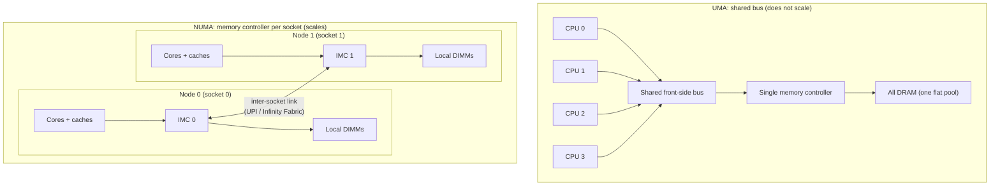
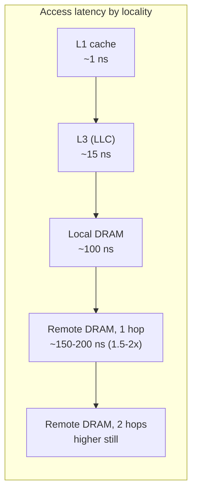
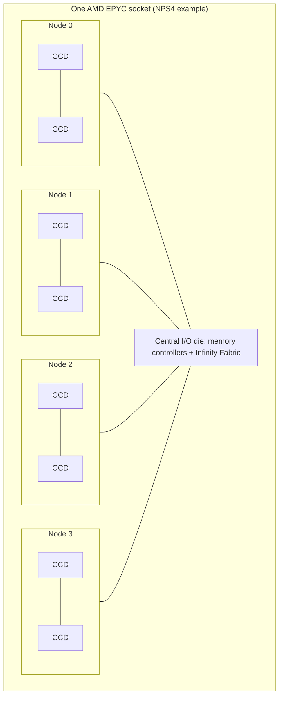
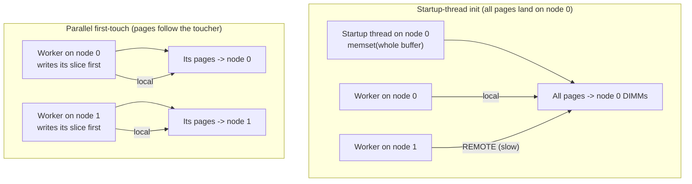
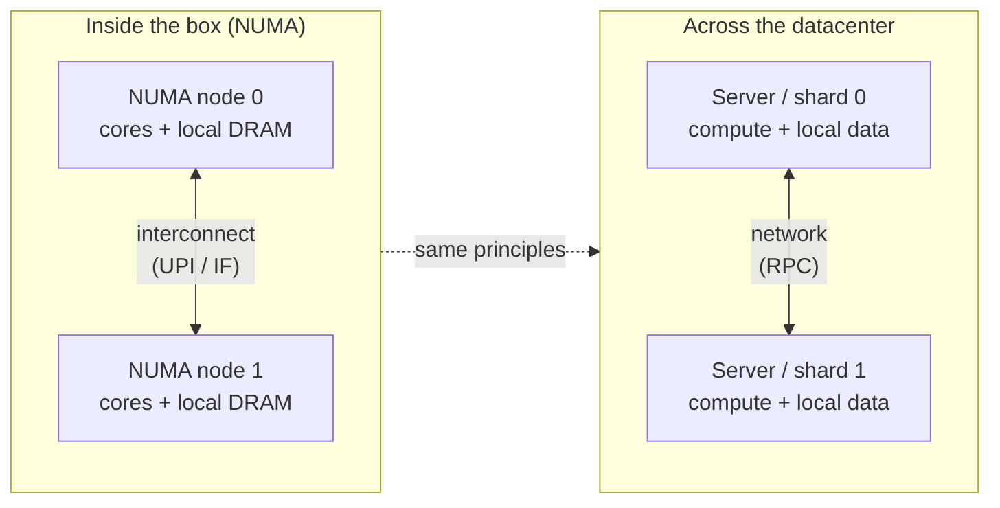
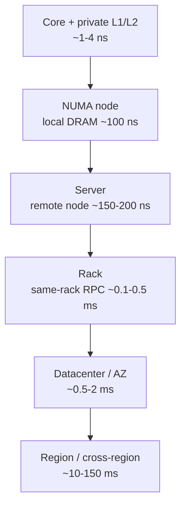

# Chapter 6 — Multi-Socket Systems and NUMA

*What this chapter covers.* Chapters 3 and 4 treated main memory as a single flat tier: past the
last-level cache lies "DRAM," a uniform pool every core reaches at roughly the same ~100 ns cost. On
a laptop, a phone, or a small cloud instance that model is accurate enough to reason with. On the
machines that run serious backend workloads — dual- and quad-socket servers, and increasingly even
large *single*-socket chiplet parts — it is a lie, and an expensive one. Memory on these systems is
physically partitioned into **NUMA nodes**, each welded to a particular socket or memory controller.
A core reading its *local* node's memory pays the familiar DRAM latency; a core reading a *remote*
node's memory must first cross an inter-socket interconnect, and pays noticeably more — commonly on
the order of 1.5–2x the local latency, at lower bandwidth. This chapter explains how memory became
non-uniform, what the hardware actually looks like, how the OS lets you control placement, and how to
design services that respect node locality instead of scattering threads and data at random across a
box. The organizing idea, developed in the closing lens, is that **a NUMA machine is a distributed
system inside the chassis** — nodes with local memory joined by a network — and that the same
locality, partitioning, and coordination-minimizing instincts you already apply across services apply
unchanged, just at nanosecond scale.

Learning goals — after this chapter you should be able to:

- Explain why **UMA** (uniform memory access over a shared bus) stopped scaling and why modern servers
  are **NUMA**, with memory partitioned into per-socket nodes.
- Describe the physical anatomy of a NUMA system: sockets, integrated memory controllers, DIMMs per
  node, and the inter-socket interconnect (**Intel UPI/QPI**, **AMD Infinity Fabric**).
- Reason quantitatively (with correct hedging) about **local vs remote** memory latency and bandwidth,
  and read **NUMA distance** from the topology.
- Explain **sub-NUMA clustering** and **chiplet NUMA** — why one socket can be several NUMA nodes — and
  how cache coherence (Chapter 4) scales across sockets via directories.
- Explain the OS's NUMA policies: **first-touch** allocation, explicit binding (`numactl`, `mbind`,
  `set_mempolicy`), **interleaving**, and NUMA-aware scheduling.
- Use `numactl`, `numastat`, and `lscpu` to observe topology and diagnose remote-access problems.
- Apply the engineer's playbook: per-node data partitioning, first-touch initialization, thread/memory
  affinity, avoiding cross-node shared mutable state, and deciding when to **pin to one node** vs span.
- Connect all of it to cloud instance sizing (Volume 12) and to distributed-systems design writ small.

## From uniform to non-uniform: why the shared bus died

For a long stretch of computing history, multiprocessor memory really was uniform. Several CPUs sat on
a **shared front-side bus**, and beyond that bus was a single **memory controller** (in the "north
bridge" chipset) fronting all of DRAM. Every processor was electrically equidistant from every byte of
memory; an access cost the same regardless of which CPU issued it. This is **UMA — Uniform Memory
Access** — and it is the model of memory most engineers still carry in their heads. It is simple to
program: memory is one flat pool, and where a thread runs has no bearing on how fast it reaches its
data.

UMA has a fatal scaling property: the shared bus and the single memory controller are a **centralized,
contended resource**. Every CPU's every DRAM access funnels through the same wires and the same
controller. Add processors and you add demand on a fixed-bandwidth channel that all of them must
arbitrate for. Bus contention rises, effective per-core bandwidth falls, and electrical constraints
(a shared multi-drop bus cannot clock arbitrarily fast as you hang more devices off it) cap how far the
design goes. Two or four cores on a shared bus is fine. Dozens of cores, each capable of issuing
memory requests every few nanoseconds, saturate any single controller. The bottleneck is structural,
not a matter of building a faster bus — it is the same centralization problem you would recognize
instantly if someone proposed routing every microservice's database traffic through one shared
connection.

The industry's answer was to **decentralize the memory system**, and it arrived in mainstream x86 when
the memory controller moved *onto the CPU die* (Intel calls it the **integrated memory controller**,
IMC; AMD integrated it with Opteron in the mid-2000s and Intel with Nehalem in 2008). Once each socket
has its *own* memory controller and its *own* directly-attached DIMMs, aggregate memory bandwidth
scales with socket count: two sockets have two controllers and two sets of DIMMs, roughly doubling
bandwidth versus one. But this decentralization has an unavoidable consequence. A core on socket 0 can
reach socket 0's DIMMs directly through socket 0's controller — fast. To reach socket 1's DIMMs, its
request must travel *across a link between the sockets*, be serviced by socket 1's controller, and the
data must travel back. That extra hop is real distance and real latency. Memory is no longer uniform:
it is **NUMA — Non-Uniform Memory Access**. The performance of a memory access now depends on *which
node* holds the data relative to *which core* is asking.



The trade is deliberate and, on balance, overwhelmingly worth it: you accept that *some* accesses are
slower (remote) in exchange for far higher *aggregate* bandwidth and the ability to scale past what any
single controller could feed. NUMA is not a defect to be engineered away; it is the price of a memory
system that scales to many cores. The engineer's job is not to eliminate non-uniformity — you cannot —
but to arrange that the *overwhelming majority of accesses are local*. That sentence is the whole
chapter in miniature, and you will notice it is the identical instinct as "keep the working set in the
fast tier" from Chapter 3, now applied one rung out.

## The hardware: sockets, controllers, and the interconnect

A concrete two-socket server makes the anatomy tangible. Each **socket** holds one physical processor
package: many cores, their private L1/L2 caches, a shared last-level cache, and an **integrated memory
controller** driving several **DDR channels**, each populated with DIMMs. The memory hung off socket
0's controller is **node 0**; the memory off socket 1's controller is **node 1**. A **NUMA node** is
precisely this pairing of *a set of cores* with *the memory local to them* — a locality domain.

The two sockets are joined by a dedicated **cache-coherent inter-socket interconnect**:

- **Intel** uses **UPI (Ultra Path Interconnect)** on modern Xeon (Skylake-SP onward, ~2017), which
  superseded the older **QPI (QuickPath Interconnect)** introduced with Nehalem. UPI is a
  point-to-point, packetized, coherent link; a socket typically has multiple UPI links so that in
  two- and four-socket topologies every socket can reach every other with few hops.
- **AMD** uses **Infinity Fabric**, the same coherent fabric that also stitches together the multiple
  chiplets *inside* an EPYC package (more on that below). Between sockets it carries coherent memory
  and cache traffic; AMD markets the inter-socket links as xGMI ("global memory interconnect").

This interconnect is the defining piece of hardware in a NUMA system, and the single most important
thing to understand about it is that it is a **shared, finite, saturable resource** — a network link.
Every remote memory access, every cache line that must be shipped between sockets to maintain coherence
(Chapter 4), every atomic operation on a line another socket owns — all of it crosses these links. Its
bandwidth is high but bounded, and it is *shared* by all cores on both sockets. A workload that
generates heavy cross-socket traffic can saturate the interconnect, at which point *even local-looking*
performance degrades because coherence and remote traffic are queued behind each other on a congested
link. Hold onto that framing: the interconnect is a network, and networks congest.

### Local vs remote: the numbers, hedged

The performance signature of NUMA is the gap between local and remote access. The exact figures are
vendor-, generation-, topology-, and BIOS-configuration-dependent, so treat these as order-of-magnitude
guidance whose *ratios* are the durable fact:

| Property                    | Local (same node)        | Remote (across one interconnect hop)          |
|-----------------------------|--------------------------|-----------------------------------------------|
| Load latency                | ~80–120 ns (Ch. 3 DRAM)  | **~1.5–2x local** (roughly ~120–200+ ns)      |
| Sustained read bandwidth    | Full local channel BW    | **Lower** — capped by interconnect, often well below local |
| Multi-hop remote (4-socket) | —                        | Worse still: 2 hops cost more than 1          |

Two clarifications the ratio alone hides. First, the **latency** penalty (~1.5–2x) is the number most
often quoted, but the **bandwidth** penalty can matter more for streaming workloads: remote bandwidth
is throttled by the interconnect's capacity, which is typically lower than the aggregate local DRAM
bandwidth of a node, and it is shared with coherence traffic. A bandwidth-bound job pulling data from a
remote node can run several times slower than the same job pulling locally, not merely 1.5–2x. Second,
in topologies larger than two sockets, not all "remote" is equal: on a four-socket box wired so that
some socket pairs are directly linked and others are reached via an intermediate socket, a **two-hop**
remote access is slower than a one-hop remote access. Non-uniformity has *gradations*, which is why the
topology exposes a distance *matrix*, not a single local/remote bit.



### NUMA distance and topology

Firmware describes the topology to the OS through an ACPI table — the **SLIT (System Locality
Information Table)** — which encodes a **distance matrix** between nodes. By convention the distance
from a node to itself is **10** (representing "1.0x"), and remote distances are expressed relative to
it: a common value for one-hop remote is around **21** (roughly 2.1x), with larger numbers for
multi-hop. These are *relative* figures the firmware advertises, not measured nanoseconds, but they
give the OS scheduler and allocator a cost model for placement decisions. You can read the matrix
directly:

```
$ numactl --hardware
available: 2 nodes (0-1)
node 0 cpus: 0 1 2 3 ... 31   (and their SMT siblings)
node 0 size: 257843 MB
node 0 free: 201120 MB
node 1 cpus: 32 33 34 35 ... 63
node 1 size: 258048 MB
node 1 free: 245880 MB
node distances:
node   0   1
  0:  10  21
  1:  21  10
```

The diagonal `10`s are local; the off-diagonal `21`s say "remote memory on this box costs about 2.1x
local." A four-socket machine would show a 4x4 matrix, potentially with a mix of `21` (directly linked)
and higher (multi-hop) entries. This table *is* the machine's locality map, and every NUMA tuning
decision is ultimately about keeping accesses on the cheap diagonal.

### Sub-NUMA clustering and chiplet NUMA: one socket, several nodes

The clean "one socket = one node" picture is now the exception on high-core-count parts. Two hardware
realities split a single socket into multiple NUMA nodes.

**Sub-NUMA Clustering (SNC)** — Intel's feature (its predecessor was Cluster-on-Die) — deliberately
partitions one physical socket into two or more NUMA nodes in firmware. A big socket internally has its
LLC and memory controllers distributed across a mesh of cores; a core on one side of the die reaches
"its" nearby LLC slices and memory controller faster than the ones on the far side. SNC exposes those
internal locality domains as separate NUMA nodes so the OS can keep threads near the LLC and memory
channels physically closest to them, shaving latency. The cost is that the socket now presents multiple
smaller nodes with the same local/remote asymmetry *within the package*.

**Chiplet NUMA** is even more fundamental, and AMD EPYC is the canonical example. An EPYC package is not
a single monolithic die; it is several **core complex dies (CCDs)** plus a central **I/O die**, all
joined by on-package **Infinity Fabric**. The memory controllers live on the I/O die. Depending on the
generation and the **NPS (Nodes Per Socket)** firmware setting, a single EPYC socket can present as one
NUMA node (NPS1, memory interleaved across all the socket's channels) or be split into 2 or 4 nodes
(NPS2 / NPS4), each node binding a subset of CCDs to the memory channels physically nearest them. The
first-generation EPYC (Naples) was even more explicitly NUMA: four dies each with their own memory
controller meant **four NUMA nodes in a single socket** by default. The lesson is blunt: **you can have
NUMA effects on a one-socket machine.** "It's a single-socket box, so NUMA doesn't apply" is a mistake
on modern high-core-count parts — check `numactl --hardware`, do not assume.



### Coherence across sockets: the directory scales, snooping does not

Chapter 4 established cache coherence (MESI and its cousins) as the protocol that keeps per-core caches
consistent. On a single socket, small core counts can maintain coherence by **snooping** — broadcasting
"who has this line?" and letting every cache answer. Broadcast does not scale across sockets: flooding
the interconnect with a snoop for every miss would saturate it instantly. Large NUMA systems therefore
lean on **directory-based coherence** (Chapter 4): the system tracks, for each line, which nodes hold a
copy, so a coherence action can be sent *only to the nodes that matter* rather than broadcast to all.
Intel implements this with **home agents** and **snoop filters / directory** state associated with each
memory region; AMD's Infinity Fabric carries coherence with probe-filtering to avoid needless
broadcasts (earlier Opterons called this "HT Assist").

The performance consequence for the backend engineer is the crucial part: **coherence traffic crosses
the interconnect.** When a line is modified on socket 0 and read on socket 1, the protocol must ship the
line (and its ownership) across the link — a cross-socket cache-line transfer that costs far more than a
local one. A cache line that ping-pongs between sockets because two nodes are writing the same data is
the NUMA-scale version of false sharing (Chapter 8), and every bounce is an interconnect round trip.
This is why *cross-node shared mutable state is the cardinal NUMA sin*: it converts what should be local
cache activity into interconnect congestion, and it does so invisibly — the code looks like an ordinary
memory write.

## Why it matters for backend performance

Now make it concrete for the services you actually run. Consider a large in-memory workload — a
database buffer pool, a Redis-like cache, a JVM with a big heap, a search index — on a two-socket box.
Nothing about the *code* mentions NUMA. But every one of its memory accesses is either local or remote,
and the ratio between them is set by two placement decisions that, left to chance, go badly:

1. **Where the process's memory pages physically live** (which node's DIMMs hold them).
2. **Which node each thread runs on** at the moment it touches that memory.

If a thread pinned nowhere in particular runs on socket 1 and hammers data that happens to sit in
socket 0's DIMMs, *every access is remote*: 1.5–2x latency, reduced bandwidth, and interconnect traffic.
Do this across dozens of threads whose memory and execution are scattered independently across both
nodes, and you get **remote accesses everywhere** — a workload paying the remote penalty on a large
fraction of its memory traffic, plus an interconnect saturated by the resulting cross-socket transfers
and coherence probes. The service's throughput and tail latency degrade, sometimes severely, for
reasons *invisible in the application code and invisible to anyone measuring only CPU utilization*: the
cores look busy, but they are stalling on remote memory.

The magnitude is not academic. Large in-memory services on multi-socket hardware have been measured
losing double-digit percentages of throughput to naive NUMA placement, recovered by nothing more than
pinning memory and threads to the same node. The classic pathology is a service that **allocates its
big data structures on one thread at startup** (say, a main thread on node 0 that builds the whole heap
or buffer pool) and then serves requests from a **pool of worker threads spread across both nodes**. By
default (first-touch, below), all that memory landed on node 0. Now half the workers — those scheduled
on node 1 — do *all* their work against remote memory, forever. The fix is a placement decision, not an
algorithm change.

There is also a second-order effect worth naming. The interconnect is shared, so NUMA problems are
*coupling* problems: a bandwidth-hungry, badly-placed job on one node can congest the interconnect and
degrade a well-behaved job on the other node that merely needs occasional coherence traffic to get
through. Non-uniformity plus a shared link means one tenant's remote-access storm is another tenant's
latency spike — a theme that returns under the cloud and distributed-systems lenses.

## The OS and NUMA: policies, placement, and tools

The hardware presents non-uniform memory; the operating system decides *where pages go* and *where
threads run*. This is the Volume 2 (Operating Systems) side of the story — memory management and
scheduling — but the mechanisms are essential here because they are the levers a backend engineer
actually pulls.

### First-touch: the default that surprises people

Linux's default memory policy is **first-touch** (the local-allocation policy, `MPOL_DEFAULT` /
`MPOL_LOCAL`). When your program calls `malloc`/`mmap`, no physical page is allocated yet — the virtual
mapping exists but is not backed by DRAM. The physical page is allocated lazily on the **first write
(the first "touch")**, and — this is the key rule — it is allocated on the NUMA node of **the CPU that
performed that first touch**, provided that node has free memory.

The consequence is subtle and constantly trips people up: **it is not the thread that *allocates* the
memory that determines placement, it is the thread that first *touches* it.** A common bug: a program
`malloc`s and then `memset`s a huge buffer on its startup thread (node 0), then hands slices of that
buffer to worker threads across both nodes. First-touch already placed *every* page on node 0 during the
`memset`; the node-1 workers are now permanently remote. The corresponding *correct* pattern — and the
single most important NUMA idiom in practice — is **first-touch initialization**: have each worker
thread initialize (first-write) the memory *it* will subsequently use, from the CPU it will run on, so
each page is placed on that worker's local node.



This is why HPC and database codebases parallelize their array initialization loops with the *same*
thread/data decomposition they use for the compute loop: it is not to speed up the initialization, it
is to place each page on the node that will own it. First-touch is a good default precisely because, if
you *do* initialize data on the thread that will use it, it does the right thing automatically. It only
bites when allocation and use are separated across nodes.

### Explicit placement: numactl, mbind, set_mempolicy

When first-touch is not enough, Linux exposes explicit control at two granularities.

**Whole-process, from the outside:** `numactl` launches a process under a chosen policy without touching
its code:

```bash
# Pin a service's CPUs AND memory to node 0: run only on node 0's cores,
# allocate only from node 0's DIMMs. The "mini-machine" recipe.
numactl --cpunodebind=0 --membind=0  ./my-service

# Prefer node 1 for allocation but allow spillover if it fills up.
numactl --preferred=1  ./my-service

# Interleave all allocations across both nodes (bandwidth play, below).
numactl --interleave=all  ./my-service
```

**In-process, from code:** the `libnuma` library wraps the underlying syscalls —
**`set_mempolicy(2)`** sets the calling thread's default policy for future allocations,
**`mbind(2)`** sets a policy for a specific address range, and **`move_pages(2)`** migrates already-placed
pages to chosen nodes. These let a service that understands its own data structures place them
deliberately: bind the per-node shards to their nodes, interleave a shared read-only table, and so on.
Thread placement is the complementary half, set with **`sched_setaffinity(2)`** / `pthread_setaffinity_np`
(or `taskset`), pinning threads to the CPUs of the node whose memory they use.

The three placement policies and when to reach for each:

| Policy         | Mechanism                                   | Effect                                                        | Use when                                                                 |
|----------------|---------------------------------------------|--------------------------------------------------------------|--------------------------------------------------------------------------|
| **First-touch** | Default (`MPOL_LOCAL`) + init on the using thread | Page placed on the node of the first writer                  | The common, correct default — *if* you initialize data on the thread that uses it |
| **Bind**        | `numactl --membind` / `mbind(MPOL_BIND)`    | Allocations forced onto a specific node (fails/spills if full) | Per-node share-nothing partitioning; pin a latency-sensitive service to one node |
| **Preferred**   | `numactl --preferred` / `MPOL_PREFERRED`    | Prefer a node, but fall back to others if it is full         | You want locality but cannot tolerate allocation failure on pressure     |
| **Interleave**  | `numactl --interleave` / `MPOL_INTERLEAVE`  | Pages round-robined across nodes                              | A single large structure accessed uniformly by all nodes; **bandwidth** over latency |

**Interleaving deserves a special note** because it inverts the usual goal. Binding maximizes locality:
great when a thread mostly hits its own node's data. But some workloads have one big shared structure
that *every* thread on *every* node pounds — no partitioning makes it local to everyone. Binding it to
one node makes that node's controller and the interconnect a hotspot; the other node's accesses are all
remote and all funnel through one controller. **Interleaving** spreads the structure's pages evenly
across nodes, so its *aggregate* bandwidth demand is served by *all* the memory controllers in parallel
and no single node is the bottleneck. You trade guaranteed-local latency (now roughly half the accesses
are remote by construction) for balanced, aggregated bandwidth. Interleave is a bandwidth optimization
for shared, uniformly-accessed data; bind is a latency optimization for partitionable data. Choosing
between them is choosing which resource is scarce.

### NUMA-aware scheduling and automatic balancing

The scheduler's half of the job is to run threads on the node holding their memory. The Linux scheduler
is NUMA-aware: it prefers to keep a task on its "home" node and is reluctant to migrate it across nodes,
because migration turns local accesses remote. Linux also ships **automatic NUMA balancing**
(`kernel.numa_balancing`), which samples a task's memory accesses and *reactively* migrates pages toward
the node running the task, or the task toward its pages, trying to converge on locality without any
application involvement. It helps unmanaged workloads, but it is a heuristic operating with delay and
overhead: it reacts after the remote accesses have already happened, its page-fault-driven sampling
costs cycles, and it can thrash on workloads whose access pattern shifts. For a service you control and
care about, **explicit placement beats relying on the balancer** — the balancer is the safety net for
code that didn't bother, not a substitute for a service that knows its own data. (The scheduler and
memory-management internals are Volume 2, Operating Systems; here the point is that placement is a
first-class, controllable property, not something to leave to chance.)

### Observing NUMA behavior

You cannot tune what you cannot see. The essential tools:

| Tool / source                 | What it tells you                                                                 |
|-------------------------------|-----------------------------------------------------------------------------------|
| `numactl --hardware`          | Node count, cores and memory per node, and the **distance matrix**                |
| `lscpu`                       | NUMA node → CPU mapping (`NUMA node0 CPU(s): ...`), sockets, cores, SMT layout     |
| `numastat`                    | Systemwide per-node hit/miss counters: `numa_hit`, `numa_miss`, `numa_foreign`    |
| `numastat -p <pid>`           | Per-process memory distribution across nodes — *is this process's memory scattered?* |
| `/proc/<pid>/numa_maps`       | Per-mapping node placement for a process                                          |
| `perf stat` / PMU events      | Local vs remote DRAM access counters (e.g. offcore/uncore memory events)          |

The `numastat` counters are the diagnosis. **`numa_hit`** is allocations that landed on the intended
(local) node; **`numa_miss`** is allocations that wanted a node but had to spill elsewhere;
**`numa_foreign`** is allocations intended for another node that landed here. A healthy, well-placed
service shows `numa_hit` dominating. High `numa_miss`/`numa_foreign` means memory pressure is forcing
spillover across nodes — you are getting remote placement not by choice but because the target node was
full. `numastat -p <pid>` on a suffering service that shows its memory split roughly 50/50 across nodes,
when it *should* be partitioned, is the smoking gun for the "scattered allocation" pathology above.

## Designing for NUMA: treat each node like a mini-machine

The techniques converge on one mental model: **treat each NUMA node as a small, self-contained machine
— its own cores, its own memory — and design so that work stays inside its node.** This is the same
share-nothing instinct you already apply to distributed systems, and it produces the same playbook.

**Partition data per node (share-nothing).** Give each node its own shard of the data and its own pool
of threads that work only that shard. A connection or request is routed to a node, and everything it
touches — its buffers, its slice of the index, its scratch memory — lives on that node's DIMMs and is
worked by that node's cores. No thread reaches across the interconnect in the common path. This is
exactly horizontal sharding (Volumes 5 and 7), applied to sockets: partition so that the hot path is
node-local, and cross-node work becomes the rare exception rather than the pervasive default.

**First-touch initialization.** As established, allocate *and initialize on the using thread*, from the
CPU that will run it, so each page is placed local. Parallelize your initialization with the same
decomposition as your compute. This one habit prevents the most common real-world NUMA regression.

**Pin threads to their memory (affinity).** Partitioning only pays off if threads *stay* on their node.
Pin worker threads to the CPUs of the node whose data they own (`sched_setaffinity`, `taskset`, or a
runtime's affinity API), so the scheduler cannot drift them across the interconnect and strand them from
their memory. Memory affinity and thread affinity are two halves of one decision; setting one without
the other is half a fix.

**Avoid cross-node shared mutable state.** A hot, mutable data structure written by threads on *both*
nodes is the worst case: every write potentially bounces a cache line across the interconnect (Chapter 4
coherence, now cross-socket) and serializes on that link. Where you need shared state, prefer per-node
replicas reconciled occasionally, per-node counters summed on read, sharded locks, or read-mostly data
that can be replicated to each node. This is *identical* reasoning to minimizing cross-shard
transactions in a distributed database — coordination across nodes is expensive, so design it out of the
hot path.

**Interleave what is genuinely shared and uniformly accessed.** For the residual large structure that
truly cannot be partitioned and is hammered uniformly by all nodes, interleave it for bandwidth rather
than binding it to one node and creating a hotspot.

### When to pin to one node vs span

A recurring practical decision: should a service **span** all nodes or **pin to one**?

- **Pin the whole service to a single node** (`numactl --cpunodebind=N --membind=N`) when its working
  set *fits* in one node's memory and its throughput needs fit within one node's cores and bandwidth.
  You get guaranteed locality — essentially *zero* remote accesses — with trivial configuration and no
  code changes. This is the right default for a latency-sensitive service small enough to fit a node,
  and it is common to run **one service instance per NUMA node** on a big box (two sockets → two pinned
  instances), turning one physical server into N independent single-node machines fronted by a load
  balancer. That "one instance per node" pattern is the cleanest way to use a multi-socket box: it makes
  the share-nothing partitioning explicit at the process boundary and sidesteps in-process NUMA
  complexity entirely.
- **Span nodes with careful internal partitioning** when the service genuinely needs more memory or
  cores than one node provides — a database whose buffer pool must be larger than one node's DIMMs, or a
  throughput target exceeding one node's capacity. Now you must do the per-node partitioning, first-touch,
  and affinity work *inside* the process, because you cannot avoid using both nodes.
- **Ignore NUMA entirely** when there is only one node — small cloud instances, single-socket parts that
  present as NPS1 — or when the workload is not memory-bound enough for the remote penalty to matter.
  The cost of NUMA-tuning is real (complexity, rigidity); spend it only where the box is actually
  multi-node and the workload actually feels it. Always verify with `numactl --hardware` first; do not
  tune NUMA on a machine that has one node, and do not ignore it on a "single socket" that turns out to
  be four nodes.

## Cloud and virtualization: NUMA you didn't ask for

Most backend engineers meet NUMA not on bare metal they racked but on **large cloud instances**, and the
virtualization layer adds a twist worth understanding (developed further in Volume 12, Cloud
Infrastructure).

The large instance types — the ones with many vCPUs and hundreds of gigabytes of RAM — are backed by
**multi-socket physical hosts**, and their NUMA topology is (for the biggest sizes) **exposed to the
guest**. Inside a big VM, `numactl --hardware` shows multiple nodes because the hypervisor has presented
a virtual NUMA (**vNUMA**) topology that mirrors the underlying hardware. It mirrors it precisely because
*hiding* it would be worse: if the guest OS and its NUMA-aware applications (databases especially)
believed memory was uniform when it was not, their placement decisions would be actively wrong. So for
large VMs the hypervisor exposes vNUMA and then works to keep each virtual node's memory and vCPUs backed
by the *same physical node* — a placement problem the hypervisor solves with the same first-touch/affinity
logic, one level down.

Several practical consequences follow:

- **vCPU and memory placement is the hypervisor's job, and it can get it wrong.** If the hypervisor
  scatters a VM's vCPUs and memory across physical nodes — or migrates a VM's vCPUs without moving its
  memory — the guest suffers remote accesses it cannot even see the cause of, because from inside the
  guest the topology *looks* consistent. This is why the largest instance types are often sized to align
  with whole sockets or whole hosts: aligning the VM to the physical NUMA boundaries removes the
  hypervisor's opportunity to split it badly.
- **"NUMA-aware" instance sizing.** Choosing an instance that fits within a *single* physical NUMA node
  (fewer vCPUs, node-sized memory) sidesteps guest-side NUMA entirely — the whole VM is one node, and the
  in-guest tuning above becomes unnecessary. When you *do* need a multi-node instance, size it to whole
  nodes/sockets rather than an awkward fraction, so the hypervisor can place it cleanly.
- **Pinning services to sockets.** On a large multi-node VM, the same "one instance per node" pattern
  applies inside the guest: run one instance of the service per vNUMA node, each pinned, rather than one
  giant process spanning all of them.
- **The noisy-neighbor × NUMA interaction.** In multi-tenant clouds, VMs from different customers share a
  physical host and its interconnect. A co-tenant generating heavy cross-node memory traffic congests the
  *shared interconnect and memory controllers*, degrading your VM's memory latency and bandwidth even
  though your placement is perfect — noisy-neighbor contention expressed through the NUMA fabric. It is
  invisible from inside your guest and is one reason latency-sensitive workloads pay for dedicated hosts
  or whole-socket isolation.

A note on where this is heading: **CXL (Compute Express Link)** attached memory (Volume 12, and touching
Chapter 5's persistent-memory story) appears to the OS as *memory-only NUMA nodes* — nodes with capacity
but no local CPUs, sitting at a higher latency tier than even remote DRAM. The NUMA abstraction is
becoming the OS's general framework for *any* non-uniform memory, not just multi-socket DRAM, which makes
the reasoning in this chapter more central over time, not less.

## Distributed-systems lens: a distributed system inside the box

Here is the frame that makes everything above cohere, and it is worth stating as strongly as it deserves:
**a NUMA machine is a distributed system, and the interconnect is its network.** Look at the ingredients.
There are multiple **nodes**, each with its own **local memory**. The nodes are joined by a **network**
(the interconnect) with **finite, shared, saturable bandwidth**. Accessing another node's data means
sending a request across that network and paying **non-uniform latency**: local is cheap, remote is
1.5–2x, multi-hop remote is worse. Keeping data consistent across nodes requires a **coordination
protocol** (cache coherence) whose messages traverse the network. Substitute "server" for "node,"
"datacenter network" for "interconnect," and "RPC" for "remote access," and you have described a
distributed system in every particular. The constants are nanoseconds instead of milliseconds; the
structure is identical.



Because the structure is identical, the *design principles* transfer without modification — and a backend
engineer who already reasons about distributed data locality *already owns the NUMA mental model*:

- **Data locality — keep computation near its data.** The prime directive of NUMA (run a thread on the
  node holding its memory) is the prime directive of distributed systems (run computation where its data
  lives; do not do remote reads on the hot path). A remote memory access is a remote read. First-touch
  initialization is "provision the data on the node that will serve it." The instinct not to make a
  synchronous cross-region call in a request path is the *same* instinct as not scattering a thread away
  from its memory.
- **Partitioning / sharding — share-nothing per node.** Per-node data partitioning is horizontal sharding
  (Volumes 5 and 7). "Treat each NUMA node like a mini-machine with its own data and threads" is exactly
  "each shard is an independent unit that owns its slice." The "one service instance per NUMA node"
  pattern is literally running one shard per node, load-balanced — sharding applied to sockets.
- **Minimize cross-node coordination.** Cross-socket coherence traffic is cross-node RPC. A cache line
  ping-ponging between sockets is a chatty distributed coordination protocol saturating the network. The
  fix is the same at both scales: design out shared mutable state on the hot path, prefer per-node
  replicas and per-node counters, avoid the distributed-transaction-equivalent of a line owned by two
  sockets. Minimizing cross-shard transactions and minimizing cross-node coherence are the same
  discipline.
- **Affinity / placement-aware scheduling.** Pinning threads to the node with their data is
  locality-aware scheduling — the same idea as scheduling a task on the machine (or rack, or AZ) that
  holds its data, as data-locality schedulers do for data-parallel jobs. Affinity is placement, and
  placement is a locality decision at every scale.
- **The shared network is the scarce, coupling resource.** The interconnect saturates and couples tenants
  exactly as a datacenter network does; a noisy neighbor's cross-node traffic degrades yours through the
  shared fabric. "Watch the interconnect as a bottleneck" is "watch the network as a bottleneck." Both
  reward keeping traffic local so the shared link stays uncongested.

The deepest observation is that **the hierarchy is fractal.** Locality governs every level, with the same
structure and the same rules, differing only in the numerical constants:



At every rung there is a *near* tier that is fast and cheap and a *far* tier reached across some network
that is slower and shared, and at every rung the winning move is the same: **keep the working set and the
coordination local; cross the boundary rarely, in useful-sized chunks; and treat the link between tiers
as a scarce resource to be conserved.** Chapter 3 drew this ladder from registers to cross-region and
argued the reasoning does not change across it. NUMA is one specific rung of that ladder — the rung just
past local DRAM — and it is the rung where "distributed system" first becomes literally true *inside a
single machine*. An engineer who thinks in data locality across services is not learning a new idea when
they learn NUMA; they are recognizing an old one, applied at the hardware level, at nanosecond scale.

## Key takeaways

- **UMA does not scale:** a shared bus and single memory controller are a centralized bottleneck. Moving
  the memory controller onto each socket scales aggregate bandwidth but makes memory **non-uniform**
  (**NUMA**): local access is fast, remote (across the interconnect) is slower.
- A **NUMA node** pairs a set of cores with their local memory. Sockets are joined by a coherent
  interconnect — **Intel UPI/QPI**, **AMD Infinity Fabric** — which is a **shared, saturable network**.
  Remote latency is commonly **~1.5–2x** local; remote **bandwidth** is lower and can hurt streaming
  workloads more than the latency ratio suggests. Firmware advertises a **distance matrix** (SLIT;
  local=10, one-hop remote ≈21).
- **One socket can be several NUMA nodes:** Intel **Sub-NUMA Clustering** and AMD **chiplet/NPS**
  topologies (EPYC's CCDs + I/O die) create intra-package non-uniformity. Never assume "single socket =
  single node" — check `numactl --hardware`.
- Coherence at scale is **directory-based** (Chapter 4); coherence traffic **crosses the interconnect**,
  so **cross-node shared mutable state** (a line ping-ponging between sockets) is the cardinal NUMA sin.
- Naive placement scatters a service's memory and threads across nodes, making a large fraction of
  accesses remote and saturating the interconnect — a double-digit performance loss **invisible in
  application code and CPU-utilization metrics**.
- **First-touch** is the default: a page is placed on the node of the thread that first *writes* it.
  **First-touch initialization** — initialize data on the thread/CPU that will use it — is the single
  most important NUMA idiom. Beyond it: **bind** (force a node), **preferred** (prefer with spillover),
  and **interleave** (spread for bandwidth). Bind optimizes latency for partitionable data; interleave
  optimizes bandwidth for shared, uniformly-accessed data.
- Control placement with `numactl`, `mbind`/`set_mempolicy`/`move_pages`, and thread affinity
  (`sched_setaffinity`/`taskset`). Observe with `numactl --hardware`, `lscpu`, `numastat` (`numa_hit` /
  `numa_miss` / `numa_foreign`), and `numastat -p <pid>`. Linux **automatic NUMA balancing** is a safety
  net, not a substitute for explicit placement.
- The design playbook: **partition per node (share-nothing)**, **first-touch init**, **thread+memory
  affinity**, **avoid cross-node shared mutable state**, **interleave the genuinely shared**. **Pin to
  one node** when the working set fits (often "one instance per node"); **span with internal
  partitioning** only when it must not; **ignore NUMA** on single-node boxes.
- Large **cloud instances are multi-socket NUMA** with **vNUMA** exposed to the guest; size instances to
  whole nodes/sockets, pin per node, and beware the **noisy-neighbor × interconnect** interaction. **CXL**
  memory extends the NUMA model to memory-only tiers.
- **The lens:** a NUMA machine is a **distributed system inside the box** — nodes, local memory, a shared
  network, non-uniform latency, a coordination protocol. Data locality, sharding, minimizing cross-node
  coordination, and affinity scheduling apply unchanged. The hierarchy is **fractal**
  (core→node→server→rack→DC→region); only the constants differ.

## Further reading

- Christoph Lameter, "NUMA (Non-Uniform Memory Access): An Overview," *ACM Queue*, 2013 —
  https://queue.acm.org/detail.cfm?id=2513149 — a clear, authoritative overview of NUMA hardware, Linux
  policies, and tuning from a longtime Linux memory-management maintainer.
- Ulrich Drepper, "What Every Programmer Should Know About Memory" (2007), Red Hat —
  https://people.freebsd.org/~lstewart/articles/cpumemory.pdf — Part 5 covers NUMA support, node
  distances, and first-touch/`libnuma` in depth.
- `numactl(8)`, `numastat(8)`, `mbind(2)`, `set_mempolicy(2)`, `move_pages(2)`, and `sched_setaffinity(2)`
  man pages — the authoritative reference for the policies and syscalls; `numa(7)` and `numa(3)` document
  the Linux NUMA model and `libnuma` API.
- The Linux kernel NUMA documentation — https://www.kernel.org/doc/html/latest/mm/numa.html and the
  automatic NUMA balancing / scheduler NUMA docs — for the memory-policy and balancing internals
  (see also Volume 2, Operating Systems).
- Intel 64 and IA-32 Architectures Optimization Reference Manual and the relevant Xeon uncore/UPI
  documentation — https://www.intel.com/sdm — for UPI, Sub-NUMA Clustering, home agents, and directory
  coherence on Intel parts.
- AMD, "AMD EPYC Processor Memory and NUMA (Nodes Per Socket) Tuning Guides" and the Zen/EPYC
  architecture documentation — https://www.amd.com/en/developer.html — for Infinity Fabric, CCD/I/O-die
  topology, and NPS configuration (vendor-specific but rigorous).
- Brendan Gregg, *Systems Performance*, 2nd ed. (Addison-Wesley, 2020), and
  https://www.brendangregg.com — practical methodology for observing memory locality, `numastat`, and
  PMU-based local/remote access analysis on Linux.
- Hennessy and Patterson, *Computer Architecture: A Quantitative Approach*, 6th ed. (Morgan Kaufmann,
  2017) — Chapter 5 covers distributed/shared-memory multiprocessors, directory coherence, and the
  scaling arguments behind NUMA.
- CXL Consortium specifications — https://computeexpresslink.org — for CXL-attached memory and its
  presentation as memory-only NUMA nodes (see also Volume 12, Cloud Infrastructure, and Chapter 5).
