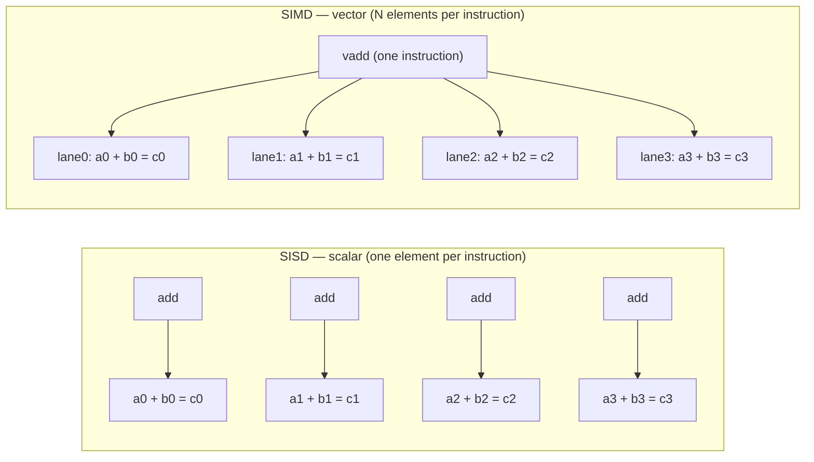
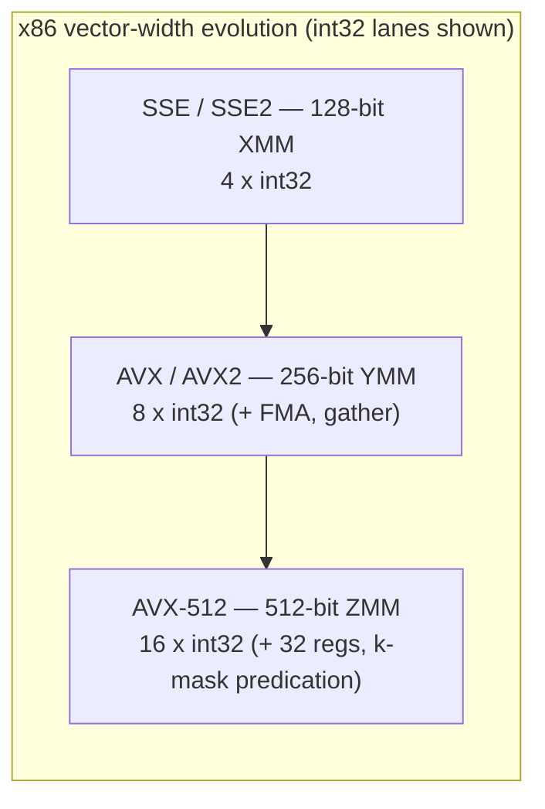
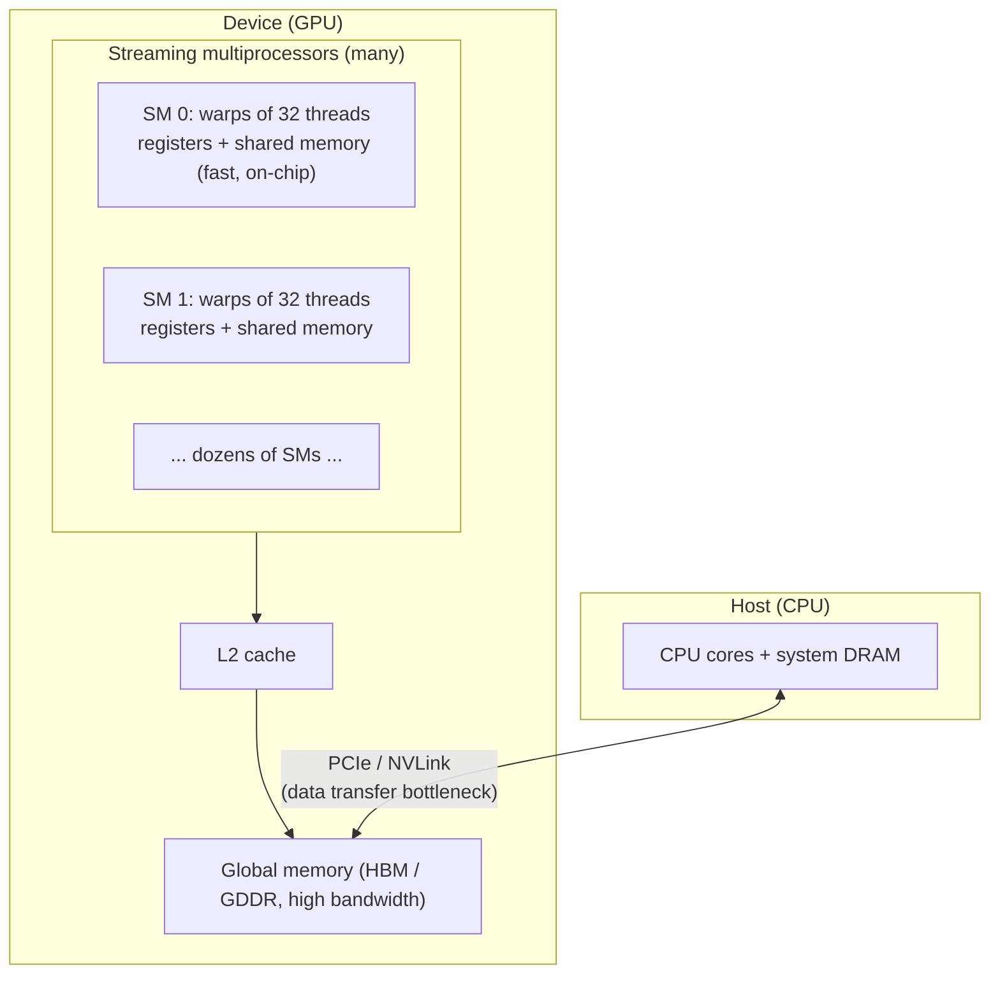
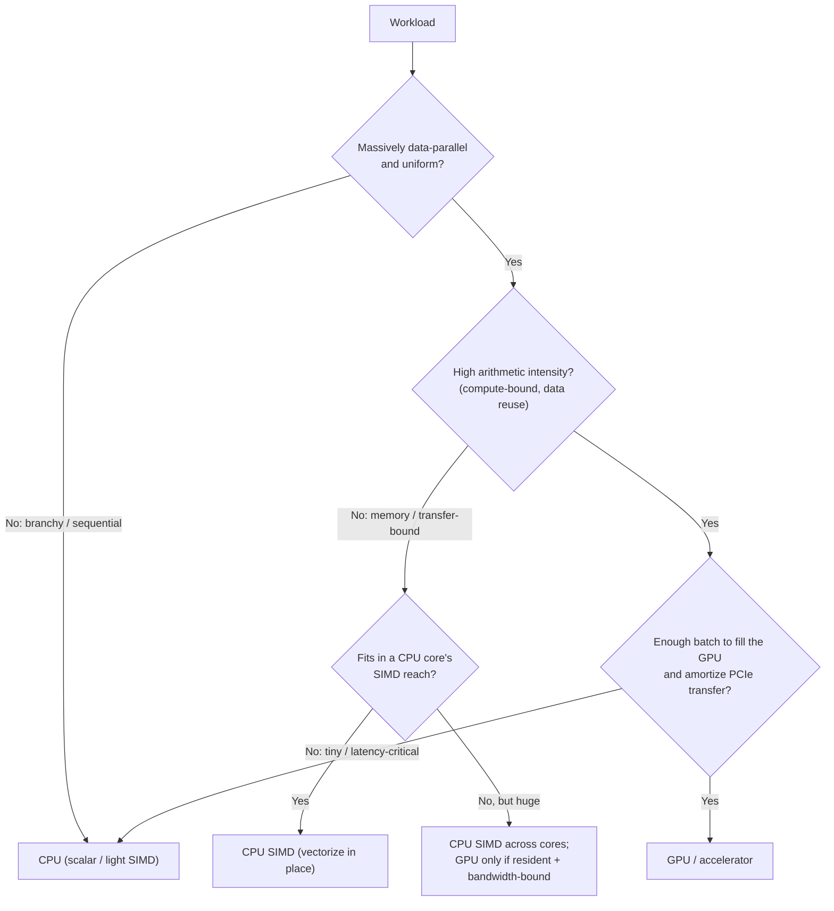
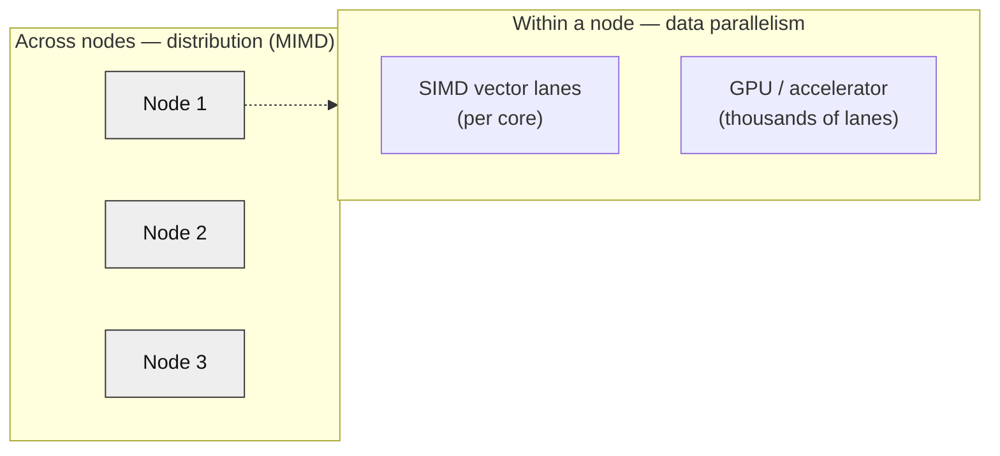

# Chapter 7 — Data Parallelism: SIMD, Vectorization, and GPUs for Backend

*What this chapter covers.* Chapters 2 through 6 pursued one form of parallelism: doing *different*
things at once. Instruction-level parallelism overlaps unrelated instructions inside one core; multicore
and NUMA (Chapters 2, 6) run different threads on different cores; the whole distributed-systems
enterprise runs different requests on different machines. This chapter is about the other axis entirely —
doing the *same* thing to *many pieces of data* at once. When a query engine sums a billion-row column,
when a JSON parser scans a gigabyte payload, when a model scores a batch of embeddings, the work is not a
diverse mix of tasks; it is one operation applied uniformly across a mountain of homogeneous elements.
That shape is **data parallelism**, and hardware exploits it with dedicated machinery: **SIMD** vector
units inside every modern CPU core, and **GPUs** — accelerators built almost entirely out of it. For a
backend engineer these are no longer exotic. Vectorized execution is why modern OLAP engines are fast;
GPU inference is a standard serving tier. The organizing idea, developed in the closing lens, is that
data parallelism scales *the throughput of a single node* — the orthogonal axis to distribution, which
scales *across* nodes — and that the same hard lessons you know from distributed systems (data movement
dominates; locality is everything; batching amortizes fixed cost; measure before you believe) reappear at
the level of vector lanes and PCIe links.

Learning goals — after this chapter you should be able to:

- Distinguish **data parallelism** (SIMD/SIMT) from **task parallelism** (ILP, multicore), and place both
  in **Flynn's taxonomy**.
- Explain CPU **SIMD**: vector registers, lanes, and the ISA progression **SSE (128-bit) → AVX/AVX2
  (256-bit) → AVX-512 (512-bit)**, plus **ARM NEON** and length-agnostic **SVE/SVE2**.
- State the **throughput win** (N elements per instruction) and the **constraints** (contiguous, aligned,
  uniform op, no divergent control flow) that decide whether a loop vectorizes.
- Reason about how you *actually* get SIMD: **auto-vectorization** and why it is fragile, **intrinsics**,
  and portable **SIMD libraries** — and why hand-vectorization is sometimes unavoidable.
- Name the backend workloads that are SIMD wins: **columnar/vectorized analytics**, **simdjson**-style
  parsing, compression, hashing, filtering, and ML inference.
- Explain **GPU architecture**: thousands of simple cores, the **SIMT** model, **warps/wavefronts**, the
  memory hierarchy, and **latency-hiding via massive oversubscription** — and the host/device model where
  **PCIe transfer cost** often dominates.
- Use **arithmetic intensity** and the **roofline** (Chapter 1) to decide when an accelerator helps.
- Situate **TPUs, FPGAs, and DPUs** in the industry's move to **domain-specific, heterogeneous compute**.
- Connect all of it to the distributed reality: vectorized-per-node + sharded-across-nodes OLAP, and
  data-parallel-within-GPU + distributed-across-GPUs ML training.

## Two axes of parallelism, and Flynn's taxonomy

Every parallel machine answers two independent questions: how many *instruction streams* are in flight,
and how many *data streams* each acts on. Michael Flynn's 1966 taxonomy names the four combinations, and
though it is coarse it remains the cleanest framing for this chapter:

- **SISD** — Single Instruction, Single Data. The classical scalar processor: one instruction operates on
  one datum. This is the mental model most code is written against, even on hardware that is nothing like
  it anymore.
- **SIMD** — Single Instruction, Multiple Data. One instruction operates on a *vector* of data elements
  simultaneously. This is what a CPU vector unit does, and the topic of the first half of this chapter.
- **MISD** — Multiple Instruction, Single Data. Different operations on the same datum. Essentially a
  theoretical curiosity; systolic fault-tolerant designs are sometimes shoehorned into it. Ignore it.
- **MIMD** — Multiple Instruction, Multiple Data. Independent instruction streams over independent data.
  This is multicore, multi-socket (Chapter 6), and every cluster of machines you have ever operated.

The crucial contrast is **SIMD vs MIMD**, because it is the contrast between the two ways to parallelize.
The ILP of Chapter 2 (out-of-order, superscalar issue) and the multicore/multi-socket parallelism of
Chapters 2 and 6 are **task parallelism**: the hardware finds or the programmer creates *independent
work*, and runs pieces of it concurrently, each piece potentially different. Its cost is coordination —
dependencies, synchronization, cache coherence (Chapter 4), scheduling. **Data parallelism** is the
opposite bargain. It requires that the work be *homogeneous* — the same operation over many elements —
and in exchange it eliminates most per-element overhead: one instruction fetch, one decode, one dependency
check amortized over 8, 16, or thousands of elements. When a workload fits, data parallelism is the most
*energy- and silicon-efficient* parallelism there is, which is exactly why the industry has poured a
decade of transistor budget into wider vectors and bigger GPUs.

SISD does four adds to add four pairs; SIMD does one `vadd` that produces four results in the same
latency a scalar add takes. Widen the vector and the ratio grows. That is the entire idea. Everything
else is the engineering required to keep the lanes full and the constraints satisfied.

## CPU SIMD: vector registers, lanes, and the ISA ladder

A SIMD instruction operates on a **vector register** — a wide register partitioned into equal-width
**lanes**, each holding one element. The register width is fixed by the ISA; the element width is chosen
by the instruction. A 256-bit register is 8 lanes of 32-bit integers, or 4 lanes of 64-bit doubles, or 32
lanes of 8-bit bytes. A single "add packed 32-bit integers" instruction reads two such registers, adds
lane 0 to lane 0, lane 1 to lane 1, and so on across all lanes independently, and writes the packed
result — the classic **SIMD lane** picture: parallel, non-interacting pipes, one instruction driving all
of them.

The x86 SIMD story is a straight ladder of doubling widths, each rung adding registers and instructions
while keeping the last:

- **MMX** (1997) — the false start: 64-bit, integer-only, aliased onto the x87 floating-point registers so
  you could not use both at once. Effectively dead; mentioned only because its descendants inherited the
  "packed" vocabulary.
- **SSE / SSE2 / SSE3 / SSE4** (1999 onward) — **128-bit** `XMM` registers. SSE added packed single-precision
  float; SSE2 added packed double and packed integers, making 128-bit SIMD general-purpose. A 128-bit
  register is **4 × float32**, **2 × float64**, or **4 × int32** (16 × int8). SSE is the baseline: every
  x86-64 CPU has SSE2, so compilers can assume it unconditionally.
- **AVX** (2011, Sandy Bridge) — **256-bit** `YMM` registers, initially for floating point, with a cleaner
  three-operand (non-destructive) encoding via the VEX prefix. **AVX2** (2013, Haswell) extended the
  256-bit operations to *integers*, and added **FMA** (fused multiply-add: `a*b+c` in one rounding step,
  doubling peak FLOP/s for dot-product-shaped math) and **gather** (load from non-contiguous addresses).
  A 256-bit register is **8 × float32** or **8 × int32**.
- **AVX-512** (Xeon Phi "Knights Landing" 2016; mainstream server with Skylake-SP 2017) — **512-bit** `ZMM`
  registers, **32** of them (up from 16), and, most importantly, **eight mask registers** (`k0`–`k7`) for
  *per-lane predication*. A 512-bit register is **16 × float32**, **16 × int32**, or **8 × float64/int64**.
  AVX-512 is not one extension but a *family* of subsets — F (foundation), CD, BW, DQ, VL, VNNI (integer
  dot-product for inference), BF16, and more — and different CPUs implement different subsets, which makes
  "does this machine have AVX-512" a genuinely fiddly question at deployment time.

The **mask registers** deserve emphasis because they attack SIMD's core weakness. Ordinary SIMD demands
*uniform* operation: every lane does the same thing. Real code has conditionals — "add only where the
value is positive." Without masks you must compute both branches for all lanes and blend the results.
AVX-512's per-lane masks let one instruction write only the lanes the mask selects, so vectorized code can
express `if` without fully abandoning the vector. SVE and modern GPUs use predication for the same reason;
it is one of the defining features of contemporary SIMD.

On the **ARM** side the design philosophy diverged:

- **NEON** (Advanced SIMD) — fixed **128-bit** registers, mandatory in AArch64. Structurally like SSE: four
  float32 lanes, wide vocabulary of packed integer/float ops. Every Apple Silicon, Graviton, and mobile
  ARM core has it.
- **SVE / SVE2** (Scalable Vector Extension, ARMv8-A/ARMv9) — the interesting departure. SVE is **vector-length
  agnostic (VLA)**: the *code does not encode the vector width*. The hardware chooses an implementation
  width — any multiple of 128 bits from 128 up to 2048 — and the *same binary* runs correctly on all of
  them, driven by a `WHILELT`-style predicate loop that handles whatever the remaining element count is.
  Fujitsu's A64FX (the Fugaku supercomputer) implements 512-bit SVE; other parts implement 128 or 256. SVE
  also bakes in per-lane predication and gather/scatter. **SVE2** generalizes the instruction set to cover
  the media/DSP workloads NEON handled, positioning it as NEON's successor. RISC-V's **Vector extension
  (RVV)** takes the same length-agnostic path — a deliberate rejection of x86's "add a new fixed width and
  a new ISA every few years" churn.

| ISA | Register width | int32 lanes | float32 lanes | Notes |
|-----|---------------|-------------|---------------|-------|
| SSE / SSE2 | 128-bit | 4 | 4 | x86-64 baseline; always present |
| AVX / AVX2 | 256-bit | 8 | 8 | AVX2 adds 256-bit integer, FMA, gather |
| AVX-512 | 512-bit | 16 | 16 | 32 regs, k-mask predication; subset zoo |
| ARM NEON | 128-bit (fixed) | 4 | 4 | Mandatory on AArch64 |
| ARM SVE / SVE2 | 128–2048, VLA | width-dependent | width-dependent | Length-agnostic; one binary, many widths |

The throughput arithmetic is simple and seductive: at 256 bits you process 8 × int32 per vector
instruction, at 512 bits you process 16. A tight loop that saturates the vector unit can approach an **N×**
speedup over scalar, where N is the lane count — and FMA doubles it again for multiply-accumulate math. The
catch is the word *saturate*. Getting there requires satisfying constraints that ordinary code routinely
violates, and understanding those constraints is the difference between a headline number and a
disappointment.

### The constraints: what SIMD demands of your data and control flow

SIMD is fast because it is rigid. Four requirements dominate.

**Contiguity and layout.** A vector load pulls N adjacent elements from memory in one shot. That is cheap
only if the N elements you want *are* adjacent. An **array of structs** (`struct { float x, y, z; } pts[]`)
scatters each field across memory, so vectorizing "sum all x" means gathering every third-ish element —
either a slow gather instruction or a manual shuffle. A **struct of arrays** (`float xs[]; float ys[];
float zs[]`) puts all the x's contiguous, and the vector load is trivial. This **AoS → SoA** transformation
is the single most impactful thing you can do to make data SIMD-friendly, and it is exactly the same
instinct as **columnar storage** in analytics (below): store like with like so the machine can stream it.

**Alignment.** Vector loads are fastest (historically, mandatory) when the address is aligned to the vector
width. Modern hardware tolerates unaligned vector loads with a small penalty and a large one when a load
straddles a cache line (Chapter 3), but alignment still matters for peak throughput and is one of the
things the compiler cannot always prove.

**Uniform operation.** Every lane runs the same op. A loop body that does different arithmetic depending on
the element does not map onto one instruction.

**No divergent control flow.** This is the killer. A branch inside the loop — `if (x[i] > threshold)` —
asks different lanes to do different things, which SIMD cannot express directly. The escape hatches are
**predication/masking** (compute all lanes, mask off the unwanted results — wasted work, but branch-free)
and, on wide branches, giving up and staying scalar. Data-dependent early exit, function calls with side
effects, and anything that can throw all defeat vectorization.

These four are not incidental — they *define* what "data-parallel" means. A workload that satisfies them is
SIMD-friendly; one that cannot is not, no matter how much compute it burns.

## How you actually get SIMD

Owning an AVX-512 CPU does not make your code use it. There are four routes, in ascending order of effort
and control.

**Auto-vectorization** is the compiler recognizing a vectorizable loop and emitting vector instructions on
its own (`-O2`/`-O3` with `-march=native` or an explicit `-mavx2`; LLVM's LoopVectorizer, GCC's tree
vectorizer). When it works it is free. The problem is that **it is fragile and fails silently**, and the
reasons it fails are precisely the constraints above dressed up as compiler-provability questions:

- **Aliasing.** If two pointers *might* overlap, writing through one could change what the other reads, so
  the compiler must assume a loop-carried dependency and refuse to vectorize. C's `restrict` (Rust's
  ownership model, Fortran's non-aliasing-by-default) is the promise that unlocks this — and its absence is
  the most common silent failure.
- **Alignment and trip count unknown at compile time** force the compiler to emit peeling/remainder code
  and may make it decide vectorization is not worth it.
- **Loop-carried dependencies** — each iteration reads the previous iteration's result (a running sum
  written back to the same accumulator naively, pointer-chasing, prefix computations) — are unvectorizable
  as written.
- **Function calls, potential exceptions, complex control flow, `break` on a data condition** — all block
  it.
- **Reductions and floating-point reassociation.** Vectorizing a sum means adding elements in a different
  order, and floating-point addition is not associative (Chapter 9), so the result changes in the last
  bits. A strict compiler will *not* reorder FP math unless you pass `-ffast-math` / `-ffp-contract` or use
  a reduction pragma — meaning correct-by-default compilers leave FP reductions scalar unless you opt in.

The practical consequence: **auto-vectorization is a bonus, not a plan.** It reliably handles simple,
`restrict`-annotated, statically-sized loops over contiguous arrays, and it evaporates the moment the code
gets interesting. You must *verify* it happened — read the assembly, check the compiler's vectorization
remarks (`-Rpass=loop-vectorize` / `-fopt-info-vec`), or measure — because the compiler will not warn you
that it silently gave up and left 8× on the table. Treating "the optimizer will vectorize it" as a
guarantee is one of the most common performance misconceptions in backend code.

**Intrinsics** are the explicit route: functions that map one-to-one onto vector instructions
(`_mm256_add_epi32`, `vaddq_s32`), letting you hand-write the exact SIMD you want in C/C++/Rust while the
compiler still handles register allocation and scheduling. This is how the fast libraries are built. It is
powerful and *non-portable* — AVX2 intrinsics do not run on ARM, and 256-bit code does not automatically
become 512-bit — so real projects carry per-ISA code paths selected at runtime by CPU feature detection
(CPUID). It is also verbose and easy to get subtly wrong.

**Portable SIMD libraries** paper over the ISA fragmentation. Google's **Highway** (C++), Rust's
`std::simd` / the `wide` and `packed_simd` ecosystem, C++'s experimental `std::simd`, and Intel's ISPC
(a SIMD-oriented language) let you write vector logic once against an abstract vector type and compile it to
NEON, AVX2, AVX-512, or SVE, often with runtime dispatch built in. This is the sweet spot for most teams
that need explicit SIMD without maintaining four hand-written kernels.

The reason **hand-vectorization survives** despite decades of compiler work is that the highest-value SIMD
routines — parsing, decoding, the inner loops of a database engine — use algorithmic transformations
(clever shuffles, table lookups via `pshufb`, branch-free state machines) that no auto-vectorizer will ever
discover, because they require *rethinking the algorithm* to be data-parallel, not merely widening an
existing scalar loop.

### The AVX-512 frequency caveat

One deployment-relevant wrinkle. On several **older Intel server generations** (notably Skylake-SP and
Cascade Lake, roughly 2017–2019), executing heavy AVX-512 (and to a lesser degree AVX2) instructions drew
enough power that the core **downclocked** — sometimes across the whole socket — to stay within thermal and
voltage limits. The effect: sprinkling a little AVX-512 into an otherwise scalar or lightly-threaded
workload could *slow down* the surrounding non-vector code by dropping the clock, occasionally making the
"optimization" a net loss at the application level. This drove real guidance at the time (Cloudflare and
others documented it) to be cautious about AVX-512 in mixed workloads. The important hedges: it was **always
workload- and SKU-dependent**, it was most acute on those specific generations, and **newer parts (Ice Lake
onward, and AMD's Zen 4 AVX-512) reduced or largely eliminated the penalty**. It is a caution to *measure*
on your actual hardware, not a blanket "avoid AVX-512." (Consumer Alder Lake, incidentally, shipped with
AVX-512 fused off after early enabling — another reason to feature-detect rather than assume.)

## Backend uses of SIMD

SIMD stopped being a graphics/HPC niche and became load-bearing backend infrastructure. The pattern is
always the same: a workload that is *bulk, homogeneous, and column-shaped* gets rewritten to process many
elements per instruction.

**Vectorized query execution — the reason modern OLAP is fast.** The defining architectural choice of
ClickHouse, DuckDB, and the Apache Arrow ecosystem is that they process data in **columnar batches**, not
row-at-a-time. Classic databases execute a query one tuple at a time through a tree of operators (the
"Volcano" iterator model): for each row, call `next()`, chase virtual functions, evaluate the predicate.
The per-row interpreter overhead swamps the actual work. **Vectorized execution** — pioneered by
**MonetDB/X100** (Boncz, Zukowski, Nes, CIDR 2005) — flips this: operators consume and produce *vectors* of
thousands of values from a single column, so the inner loop is a tight, branch-light, cache-friendly, and
**auto-/hand-vectorizable** pass over contiguous, same-type data. A `WHERE price > 100` over a column
becomes a SIMD compare producing a bitmask; a `SUM` becomes a SIMD reduction; a filter becomes a
mask-and-compact. This is why "vectorized execution" is the marquee feature of every fast analytical
engine — the word *vectorized* is literally SIMD. Columnar storage (Volume 5, on data systems) and SIMD are
symbiotic: columns give you the contiguous, uniform-type layout that SIMD demands.

**JSON and string parsing — simdjson.** Parsing looks inherently sequential and branchy — the last place
you would expect SIMD. **simdjson** (Langdale and Lemire, 2019) showed otherwise, parsing JSON at multiple
gigabytes per second by recasting parsing as data-parallel *stages*: use SIMD to classify all bytes at once
(find every quote, brace, backslash, whitespace via packed compares), build a structural-character bitmap
branch-free, and only then walk structure. The lesson generalizes: many "sequential" text problems —
UTF-8 validation, CSV parsing, base64, escaping — have branch-free SIMD reformulations, and the libraries
that implement them (simdjson, and Arrow's and the browsers' adoption of the same techniques) are now
standard dependencies.

**Compression, encoding, hashing, checksums.** LZ4/Zstd matching, bit-packing and delta encoding in
columnar formats (Parquet/ORC), base64, CRC32 and hashing all have SIMD implementations; x86 even exposes a
hardware `CRC32` instruction and carry-less multiply (`PCLMULQDQ`) that GCM-mode AES and hashing exploit.
These sit in the hot path of storage engines and network stacks.

**Search, filtering, and set operations.** Scanning a buffer for a byte or pattern (SIMD `memchr`/substring
search — the guts of fast log grep and packet inspection), intersecting sorted posting lists in a search
index, and bitmap operations (Roaring bitmaps) are all vectorized.

**ML inference on CPU.** Not every model needs a GPU. Quantized (int8) inference, embedding similarity
(dot products at scale), and classical ML lean on FMA and AVX-512's **VNNI** int8 dot-product instructions;
libraries like oneDNN and the inner loops of ONNX Runtime and llama.cpp are heavily hand-vectorized.

| Backend workload | What SIMD does | Representative implementations |
|------------------|----------------|-------------------------------|
| Columnar / OLAP query execution | Batched column filters, aggregations, joins | ClickHouse, DuckDB, Arrow (MonetDB/X100 lineage) |
| JSON / text parsing | Branch-free byte classification, structural scan | simdjson, Arrow, browser parsers |
| Compression / encoding | Match search, bit-packing, delta, base64 | LZ4, Zstd, Parquet/ORC codecs |
| Hashing / checksums / crypto | CRC32, GCM, vectorized hashing | hardware CRC32/PCLMULQDQ, xxHash |
| Search / filtering | memchr, substring, posting-list intersect, bitmaps | ripgrep, search indexes, Roaring |
| CPU ML inference | int8/FP dot products, FMA, VNNI | oneDNN, ONNX Runtime, llama.cpp |

The through-line: SIMD gives you a **per-core throughput multiplier** on data-parallel work, entirely
inside one thread, on hardware you already rent. It is the cheapest performance on this list — no new
machines, no accelerator, no network — which is exactly why the fast systems chase it.

## GPUs: data parallelism as the whole machine

A CPU is a latency machine: a handful of enormously complex cores (Chapter 2 — out-of-order, deep
speculation, big caches) built to finish *one* instruction stream as fast as possible, with SIMD bolted on
the side. A **GPU** inverts every priority. It is a **throughput machine**: thousands of small, simple
arithmetic units, minimal per-core control logic, shallow speculation, and a design that assumes you have
*so much* independent data-parallel work that it can hide latency not by avoiding stalls but by having
thousands of other operations ready to run whenever one stalls. Where a CPU spends transistors making one
thread fast, a GPU spends them making ten thousand threads *coexist*.

### The SIMT execution model

GPUs execute in a model NVIDIA calls **SIMT — Single Instruction, Multiple Thread**. You write a **kernel**
as if it were scalar code for a single thread; you launch it across a huge grid of threads (millions is
routine); and the hardware groups threads into fixed bundles — **warps** of **32 threads** on NVIDIA,
**wavefronts** of **64** (or 32 on RDNA) on AMD — that execute **in lockstep**: all 32 threads of a warp run
the *same* instruction at the same time on their own data. That lockstep bundle *is* a SIMD vector; SIMT is
SIMD with a friendlier programming model, where the hardware manages the lanes and per-lane masking for you
instead of making you write explicit vector code.

The consequence is that GPUs have the *same* fundamental constraint as CPU SIMD, wearing a different name:
**warp divergence**. If threads in a warp take different sides of a branch (`if (tid % 2)`), the hardware
must execute *both* paths with the inactive lanes masked off — serializing the divergent regions and
wasting the masked lanes. Divergent, branchy code on a GPU is exactly as pathological as divergent control
flow in CPU SIMD, and for the identical reason. GPUs love code where every thread in a warp does the same
thing to adjacent data.

### The memory hierarchy and latency hiding

A GPU's memory hierarchy mirrors the CPU's tiers (Chapter 3) but with different proportions:

- **Registers** — per-thread, enormous in aggregate (a GPU has hundreds of KB to MBs of register file per
  SM so thousands of threads can each keep state resident). Fastest.
- **Shared memory** — a small, fast, *software-managed* scratchpad per SM (tens to ~100+ KB), shared by the
  threads of a block. It is the GPU programmer's most important tool: you *explicitly* stage data from
  global memory into shared memory so a block of threads can reuse it, turning many slow global accesses
  into one. It plays the role of a programmer-controlled L1.
- **L1 / L2 caches** — hardware caches, L2 shared across the device.
- **Global memory** — the large off-chip DRAM (**HBM** on datacenter parts, **GDDR** on consumer), with
  **very high bandwidth** (well into the TB/s range on modern datacenter GPUs) but also high latency — many
  hundreds of cycles.

The defining trick is **latency hiding through oversubscription**. A CPU hides memory latency with big
caches and out-of-order execution. A GPU mostly does neither; instead, when a warp issues a global-memory
load and stalls waiting hundreds of cycles, the SM's scheduler instantly switches to *another ready warp*,
and another, keeping the arithmetic units busy while dozens of warps' loads are in flight. This only works
if you give it enough parallelism to hide the latency — high **occupancy**, many resident warps per SM. Too
few threads, or too much per-thread register/shared-memory pressure limiting how many warps fit, and the
latency stops being hidden and the GPU stalls. The GPU's throughput is *contingent on massive
oversubscription*; feed it a small problem and its cores sit idle waiting on memory, no faster than (often
slower than) a CPU.

One more memory subtlety that trips up every GPU newcomer: **coalescing**. When the 32 threads of a warp
each load from global memory, the hardware is fastest when their addresses are *contiguous* — thread 0
reads word 0, thread 1 word 1 — so the accesses **coalesce** into a few wide memory transactions. Strided
or scattered per-thread accesses de-coalesce into many transactions and tank effective bandwidth. This is
the GPU version of the CPU's contiguity/AoS-vs-SoA rule, at warp granularity, and it is the same lesson
Chapter 3 taught about cache lines: **spatial locality decides your bandwidth.**

### The host/device model and the transfer wall

A GPU is a separate device across a bus. The programming model is **host** (CPU) and **device** (GPU) with
*separate memories*, and the workflow is: **copy input from host DRAM to device global memory → launch the
kernel → copy results back**. Those copies traverse **PCIe** (roughly ~32 GB/s each way on PCIe 4.0 x16,
~64 GB/s on PCIe 5.0 x16) — or, on tightly-coupled systems, **NVLink** at several times that — and *that
link is very often the bottleneck*. On-device HBM bandwidth is measured in TB/s; PCIe is an order of
magnitude slower. If a kernel does only a little arithmetic per byte transferred, the PCIe copies dominate
the wall-clock time and the GPU's compute never gets to shine.

This is precisely the Chapter 1 / Chapter 3 lesson restated one level out: **data movement dominates.** The
same instinct that says "don't chase pointers across DRAM" and "keep the working set in cache" says, at the
GPU boundary, "don't ship data across PCIe for a trivial computation." The winning patterns keep data
*resident* on the GPU across many kernels (train/infer in place rather than round-tripping), overlap
transfer with compute (async copies on streams), and batch enough work that the transfer is amortized. A
naive "copy array over, do one cheap op, copy it back" GPU offload is almost always *slower* than just doing
it on the CPU — the classic disappointment.

### When GPUs win, and when they lose — arithmetic intensity and the roofline

The single best predictor of whether an accelerator helps is **arithmetic intensity**: FLOPs performed per
byte of memory traffic (Chapter 1's **roofline** model — Williams, Waterman, Patterson, 2009). A workload
with **low arithmetic intensity** (few operations per byte — a vector add, a filter, a copy) is
**memory-bound**: its speed is capped by bandwidth, and a GPU's edge shrinks to its (real, but bounded)
HBM-bandwidth advantage, easily erased by the PCIe transfer. A workload with **high arithmetic intensity**
(many operations per byte — dense matrix multiply, convolution, attention, where each loaded value is
reused across many multiply-adds) is **compute-bound**, and here the GPU's thousands of FMA units and
dedicated **tensor/matrix cores** deliver order-of-magnitude wins. This is not a coincidence that GPUs
dominate deep learning: neural network training and inference are dense linear algebra, the highest-
arithmetic-intensity workload in mainstream computing, and the accelerators were co-designed with it.

The honest ledger:

**GPUs win** when the work is *massively data-parallel* (millions of independent elements), *high
arithmetic intensity* (compute-bound, reuses data on-chip), *uniform* (little warp divergence),
*batchable* (enough work to fill thousands of cores and hide latency), and *transfer-amortizable* (data
stays resident, or compute per transferred byte is high). Dense linear algebra, deep learning, large-scale
image/video processing, some Monte Carlo and scientific simulation, and increasingly analytical scans over
GPU-resident columns.

**GPUs lose** when the work is *branchy/divergent* (warps serialize), *latency-sensitive* with tiny inputs
(a single small request pays full PCIe + launch overhead to compute almost nothing — the GPU's throughput
is irrelevant when there is no bulk to throughput), *low arithmetic intensity / transfer-bound* (PCIe eats
the benefit), *pointer-chasing or irregular* (no coalescing, no parallelism), or simply *small* (not enough
work to amortize any of the fixed costs). Most of a typical request/response backend — parse, branch, call
services, serialize — is exactly this shape, which is why the CPU still runs the world.

### CUDA, ROCm, and the software reality

The dominant GPU programming stack is **CUDA** (NVIDIA), a C++-based model plus a deep library ecosystem —
cuBLAS, cuDNN, and the frameworks (PyTorch, TensorFlow, JAX) that sit on top and are what most backend
engineers actually touch. AMD's answer is **ROCm** with **HIP**, a near-source-compatible CUDA analog;
cross-vendor efforts include **SYCL/oneAPI** and the older **OpenCL**. For most backend work you will never
write a kernel: you will call a framework that dispatches optimized kernels for you, and your job is the
*systems* problem — feeding the GPU, batching, memory management, and keeping the expensive device busy. The
kernel-level details above matter not because you will write them but because they explain *why* your GPU
service behaves the way it does when a batch is too small or a transfer too frequent.

## GPUs for backend engineering

For most backend teams, the GPU arrives as a **serving tier**, not a library call. The dominant use is
**ML inference** — serving a model (an LLM, a ranking model, an embedding model, a vision model) behind an
RPC — with training the other major consumer. The engineering shape of a GPU inference service is distinct
enough to enumerate, because it is where architecture meets operations.

**Batching is the core lever.** A GPU serving one request at a time is almost entirely idle — a single
inference does not fill thousands of cores, and it pays full fixed overhead. So inference servers (Triton,
TGI, vLLM, TensorFlow Serving) **batch** many concurrent requests into one kernel launch, trading a little
latency (waiting a few milliseconds to accumulate a batch) for a large throughput gain (the GPU processes
the batch nearly as fast as one request). This is a direct **throughput-vs-latency** trade-off, and tuning
the batch window and size is the central operational knob. **Dynamic/continuous batching** (as in vLLM's
paged-attention scheduler for LLMs) refines this by adding and retiring sequences from the running batch
each step. The lesson is the same one batching teaches everywhere in distributed systems (Volume 6):
**amortize fixed cost over many items**, here the fixed cost being kernel launch and the accelerator's
appetite for parallelism.

**The economics are unusual.** Datacenter GPUs are expensive and, in the current AI cycle, supply-
constrained; a GPU that sits at 10% utilization is burning money at a rate that dwarfs CPU waste. This
inverts the usual backend priority: for a GPU tier, *keeping the accelerator saturated* often matters more
than shaving tail latency, because the marginal cost structure is dominated by the device. Hence aggressive
batching, model **quantization** (int8/FP8/FP4 to fit more model and more batch in memory and cut compute),
**KV-cache** management for LLMs, multi-tenancy (MIG partitioning to run several small models on one
physical GPU), and autoscaling policies driven by GPU utilization and queue depth rather than CPU. The
transfer/latency trade-offs from the architecture section become SLO decisions: keep model weights resident
(never reload across PCIe per request), keep the batch on-device, and accept the batching latency as the
price of affordable throughput.

**Beyond inference**, GPUs show up in **GPU-accelerated databases and analytics** (HeavyDB/OmniSci, RAPIDS
cuDF, and GPU-accelerated Spark) that run scans, joins, and aggregations on GPU-resident columns — the same
vectorized-execution idea from earlier, pushed onto SIMT hardware — and in general acceleration of
data-parallel batch jobs. The caveat is always the transfer wall: GPU analytics wins when data can live on
the GPU across the workload, and loses when every query must stream fresh data across PCIe.

## Other accelerators: the heterogeneous datacenter

SIMD and GPUs are two points on a spectrum whose far end is *hardware built for one job*. Hennessy and
Patterson, in their 2018 Turing Award lecture "A New Golden Age for Computer Architecture," argued that with
Moore's Law slowing and Dennard scaling dead (Chapter 1), the future of performance is **domain-specific
architectures** — trading general-purpose flexibility for enormous efficiency on a target workload. The
datacenter is now visibly **heterogeneous**, and a backend engineer should recognize the players:

- **TPUs (Tensor Processing Units)** — Google's ML accelerators, built around a large **systolic array**
  matrix-multiply unit. A systolic array streams data through a grid of multiply-accumulate cells so each
  loaded value is reused across many operations without returning to memory — a hardware embodiment of
  maximizing arithmetic intensity. TPUs (and the broader class of **dedicated inference/training chips** —
  AWS **Inferentia**/**Trainium**, and various startups' parts) trade GPU generality for higher
  efficiency on the narrow domain of dense neural-network math.
- **FPGAs (Field-Programmable Gate Arrays)** — reconfigurable logic you program into a custom circuit for
  your workload. Used for line-rate network processing, custom compression/crypto, and low-latency
  specialized pipelines (financial exchanges, Microsoft's Catapult/Bing and SmartNIC work). Extremely
  efficient for the fixed function they are configured to; costly to develop and slower-clocked than ASICs.
- **DPUs / SmartNICs (Data Processing Units)** — programmable NICs (NVIDIA **BlueField**, AWS **Nitro**,
  Intel IPUs) that offload networking, storage, encryption, and virtualization from the host CPUs, freeing
  those cores for tenant work and providing hardware isolation. In cloud infrastructure the DPU is where a
  growing share of the "infrastructure tax" now runs (Volume 12).

The unifying trend: as general-purpose scaling slows, performance increasingly comes from **matching the
silicon to the workload**. For the backend engineer this means the compute fabric under a large service is
no longer "a pile of x86 cores" but a *portfolio* — CPUs with SIMD, GPUs, and domain-specific accelerators —
and choosing among them, and moving data efficiently between them, becomes a first-class design problem.

## The distributed-systems lens: two axes, one set of lessons

Step back and the whole chapter is about a *second axis of scaling*, orthogonal to the one the rest of your
career has been about.

**Distribution scales *across* nodes; data parallelism scales *within* one.** Sharding, replication, and
service decomposition add machines to handle more load — the horizontal axis. SIMD and GPUs make each
machine do more per unit time — the vertical, per-node throughput axis. They are independent and
multiplicative, and the systems that define the state of the art in bulk data processing **combine both**.

**Distributed columnar OLAP** is the canonical union. A ClickHouse or distributed-DuckDB or Spark
deployment **shards** data across nodes (the distributed axis — partition, scatter the scan, gather-merge
the aggregates) *and* runs **vectorized SIMD execution** on each node's local columns (the data-parallel
axis). Query speed is the product: `nodes × per-node-vector-throughput`. Neglect either axis and you leave
most of the machine on the floor. And the two axes echo each other — columnar layout gives SIMD its
contiguous input *and* gives the distributed layer clean partition boundaries; the same "store like with
like, minimize movement" instinct serves both.

**ML training** is the sharpest example of the same fractal. Training a large model is **data-parallel
within each GPU** (SIMT over a batch), **data-parallel across GPUs in a node** (split the batch or the model
across 8 accelerators over NVLink), *and* **distributed across nodes** (data-parallel and model/tensor/
pipeline-parallel training over the datacenter network, synchronizing gradients with all-reduce). At every
level it is the *same* distributed-systems problem: **partition the work, minimize the coordination and the
data you move, hide the communication behind computation.** All-reduce across nodes is the network-scale
version of warp coalescing; the gradient-synchronization step is a barrier with the same coordination cost
as any distributed consensus round, which is why interconnect bandwidth (NVLink, InfiniBand) is as
load-bearing to training throughput as FLOPs. The partitioning and coordination trade-offs you know from
Volume 6 apply *unchanged*; only the constants shift.

**Data movement dominates — at every level.** This chapter's most portable lesson is one you already hold
from Chapter 1: the bottleneck is usually *moving the data*, not *computing on it*. It recurs at every
scale, and the mitigation is always **locality**:

| Level | The "network" | The dominating cost | The lesson |
|-------|---------------|--------------------|-----------|
| Vector unit | Memory ↔ SIMD registers | Non-contiguous / unaligned loads | AoS → SoA; keep data packed |
| GPU | PCIe host ↔ device | Transfer, launch overhead | Keep data resident; batch; amortize |
| Multi-GPU / node | NVLink | Inter-GPU sync | Overlap comms with compute |
| Cluster | Datacenter network | All-reduce / shuffle | Locality-aware partitioning |

It is the same picture Chapter 6 drew for NUMA — a distributed system inside the chassis — extended outward
until it becomes the literal datacenter. PCIe is to the GPU what the inter-socket link is to NUMA and what
the network is to a cluster: the scarce, saturable channel whose traffic you must minimize.

**Accelerators are a tier in the fleet.** Operationally, a GPU inference service is another service — but
one whose economics (expensive, scarce, saturation-sensitive) push its design toward aggressive batching,
utilization-driven autoscaling, and careful cost accounting (Volumes 7, 11, 12). The heterogeneous
datacenter means capacity planning is no longer a single fungible pool of cores but a portfolio of CPU,
GPU, and specialized silicon, each matched to the workloads whose shape it fits — and the engineer's job
includes knowing *which shape a workload is*.

## The engineer's mental model

Compress everything above into a decision procedure you can run in your head.

1. **Is the workload data-parallel?** Same operation, many homogeneous elements, contiguous or
   contiguous-izable, little data-dependent branching? If yes, SIMD/GPU is on the table. If it is branchy,
   sequential, pointer-chasing, or a diverse mix of tasks, it is not — keep it scalar and parallelize with
   threads/services instead.
2. **How much data, and what is the arithmetic intensity?** Small data or low FLOPs-per-byte → stay on the
   CPU, and reach for **SIMD** (auto-vectorization verified, or intrinsics/portable-SIMD for the hot loops).
   Large data *and* high arithmetic intensity (data reused on-chip, compute-bound) → an **accelerator** can
   deliver order-of-magnitude wins.
3. **Does the data movement pay for itself?** For a GPU, the PCIe transfer and launch overhead must be
   amortized by enough compute or enough batch, with data kept resident where possible. If the workload is
   transfer-bound, the accelerator will disappoint no matter its peak FLOPs. **Roofline first, FLOPs
   second.**
4. **Batch for throughput.** Both SIMD (fill the lanes) and GPUs (fill the cores, hide latency) reward
   processing many elements per invocation. Right-size the batch to trade latency for throughput
   deliberately.
5. **Measure — do not assume.** The compiler silently un-vectorizes; AVX-512 can downclock on old parts; a
   GPU offload can be net-negative when transfer-bound. Read the assembly, check vectorization remarks,
   profile the kernel, watch utilization. Every number in this chapter is a *hypothesis about your
   hardware* until you have measured it on your hardware.

Hold onto the framing: this is the *other axis*. Everything you know about scaling out — partition,
localize, batch, minimize movement, coordinate as little as possible — applies just as forcefully to
scaling *up* the throughput of a single node with vectors and accelerators. The lanes are just narrower and
the network is just shorter.

## Key takeaways

- **Two axes of parallelism.** *Task parallelism* (ILP, multicore, distribution) runs *different* work
  concurrently and pays a coordination cost; *data parallelism* (SIMD/SIMT) runs the *same* operation over
  *many elements* and, when the workload fits, is the most silicon- and energy-efficient parallelism there
  is. Flynn: SISD/SIMD/MISD/MIMD; the live contrast is SIMD vs MIMD.
- **CPU SIMD is a per-core throughput multiplier.** Vector registers hold N lanes; one instruction
  processes all N. x86: **SSE 128-bit (4×int32) → AVX/AVX2 256-bit (8×, +FMA/gather) → AVX-512 512-bit
  (16×, +32 regs, +k-mask predication)**. ARM: **NEON 128-bit fixed**; **SVE/SVE2 length-agnostic** (one
  binary, 128–2048-bit implementations), like RISC-V RVV.
- **SIMD is fast because it is rigid.** It demands **contiguous, aligned** data, a **uniform operation**,
  and **no divergent control flow**. **AoS → SoA** and columnar layout are the highest-leverage
  transformations; masks/predication are the escape hatch for conditionals.
- **Getting SIMD is on you.** **Auto-vectorization** is a fragile bonus that fails *silently* on aliasing,
  unknown alignment/trip-count, loop-carried dependencies, calls, and FP reassociation — *verify it*.
  **Intrinsics** and **portable libraries** (Highway, `std::simd`, ISPC) are the reliable routes;
  hand-vectorization survives because the best kernels need algorithmic rethinking no compiler will do.
- **AVX-512 caveat:** older Intel server parts (Skylake/Cascade Lake) could **downclock** under heavy
  AVX-512, sometimes making it a net loss in mixed workloads; newer parts (Ice Lake+, AMD Zen 4) largely
  fixed this. Feature-detect and measure.
- **SIMD is load-bearing backend infrastructure:** **vectorized query execution** (ClickHouse/DuckDB/Arrow,
  from MonetDB/X100) is *why modern OLAP is fast*; **simdjson** parses JSON at GB/s; compression, hashing,
  search, and CPU ML inference all lean on it.
- **GPUs are throughput machines.** Thousands of simple cores; **SIMT** groups threads into **warps (32) /
  wavefronts (64)** executing in lockstep — SIMD with a scalar programming model, and the **same divergence
  penalty**. Latency is hidden by **massive oversubscription**, not caches. Memory: registers → software-
  managed **shared memory** → L1/L2 → high-bandwidth **HBM/GDDR global memory**; **coalesced** access is the
  warp-level contiguity rule.
- **The transfer wall dominates.** Host/device with separate memory; input and output cross **PCIe**
  (~32–64 GB/s), an order of magnitude below on-device HBM. Naive copy-in/compute/copy-out is often slower
  than the CPU. Keep data **resident**, overlap transfer with compute, **batch**.
- **Arithmetic intensity (roofline) decides.** High FLOPs/byte + compute-bound + massive uniform parallelism
  + batchable → GPU wins (dense linear algebra, deep learning). Branchy, latency-sensitive, small, or
  transfer-bound → CPU wins. Roofline first, peak FLOPs second.
- **GPUs reach backends as a serving tier**, mostly **ML inference**. **Batching** is the core lever
  (throughput vs latency); the **economics** (expensive, scarce, saturation-sensitive) make *keeping the
  accelerator busy* the priority — hence quantization, KV-cache management, MIG multi-tenancy, and
  utilization-driven autoscaling.
- **Heterogeneous compute is the trend** (Hennessy-Patterson's "new golden age"): **TPUs** (systolic
  arrays), **FPGAs**, **DPUs/SmartNICs**, and dedicated inference chips trade generality for domain
  efficiency as general-purpose scaling slows.
- **The lens:** data parallelism scales *within* a node; distribution scales *across* nodes — orthogonal and
  multiplicative. Real bulk systems combine both (**sharded + vectorized OLAP**; **SIMT-within-GPU +
  distributed-across-GPUs training**), and **data movement dominates at every level** — SIMD registers,
  PCIe, NVLink, the network — with **locality** the universal mitigation.

## Further reading

- Michael J. Flynn, "Some Computer Organizations and Their Effectiveness," *IEEE Transactions on Computers*,
  1972 (and the 1966 proceedings) — the original taxonomy (SISD/SIMD/MISD/MIMD).
- Samuel Williams, Andrew Waterman, David Patterson, "Roofline: An Insightful Visual Performance Model for
  Multicore Architectures," *Communications of the ACM*, 2009 — the arithmetic-intensity/roofline model
  underpinning every accelerator decision here (see also Volume 1, Chapter 1).
- Peter Boncz, Marcin Zukowski, Niels Nes, "MonetDB/X100: Hyper-Pipelining Query Execution," CIDR 2005 —
  https://www.cidrdb.org/cidr2005/papers/P19.pdf — the seminal vectorized-execution paper behind modern
  OLAP (see also Volume 5, on data systems).
- Geoff Langdale and Daniel Lemire, "Parsing Gigabytes of JSON per Second," *The VLDB Journal*, 2019 —
  https://arxiv.org/abs/1902.08318 — simdjson and the branch-free SIMD parsing technique; see also
  https://github.com/simdjson/simdjson.
- Intel 64 and IA-32 Architectures Software Developer's and Optimization Reference Manuals —
  https://www.intel.com/sdm — the authoritative reference for SSE/AVX/AVX2/AVX-512 semantics, encodings,
  and optimization guidance (including AVX frequency behavior).
- Arm, "Arm Architecture Reference Manual" and the SVE/SVE2 programming guides —
  https://developer.arm.com/documentation — for NEON, and the vector-length-agnostic SVE/SVE2 model.
- Google Highway (portable SIMD) — https://github.com/google/highway — and Rust `std::simd`
  (https://doc.rust-lang.org/std/simd/) — practical portable-SIMD libraries with runtime dispatch.
- NVIDIA, "CUDA C++ Programming Guide" — https://docs.nvidia.com/cuda/cuda-c-programming-guide/ — the
  definitive description of the SIMT model, warps, the memory hierarchy, coalescing, and host/device
  transfer; AMD ROCm/HIP docs (https://rocm.docs.amd.com) for the cross-vendor analog.
- John L. Hennessy and David A. Patterson, "A New Golden Age for Computer Architecture," *Communications of
  the ACM*, 2019 (2017 Turing Award lecture) — the case for domain-specific/heterogeneous accelerators.
- Norman P. Jouppi et al., "In-Datacenter Performance Analysis of a Tensor Processing Unit," ISCA 2017 —
  https://arxiv.org/abs/1704.04760 — the TPU systolic-array design and its efficiency argument.
- Woosuk Kwon et al., "Efficient Memory Management for Large Language Model Serving with PagedAttention,"
  SOSP 2023 — https://arxiv.org/abs/2309.06180 — the vLLM continuous-batching/KV-cache work that
  exemplifies GPU-inference serving (see also Volumes 7 and 12).
- Hennessy and Patterson, *Computer Architecture: A Quantitative Approach*, 6th ed. (Morgan Kaufmann, 2017),
  Chapters 4 (data-level parallelism: vector, SIMD, GPU) and 7 (domain-specific architectures) — the
  rigorous textbook treatment of everything in this chapter.
