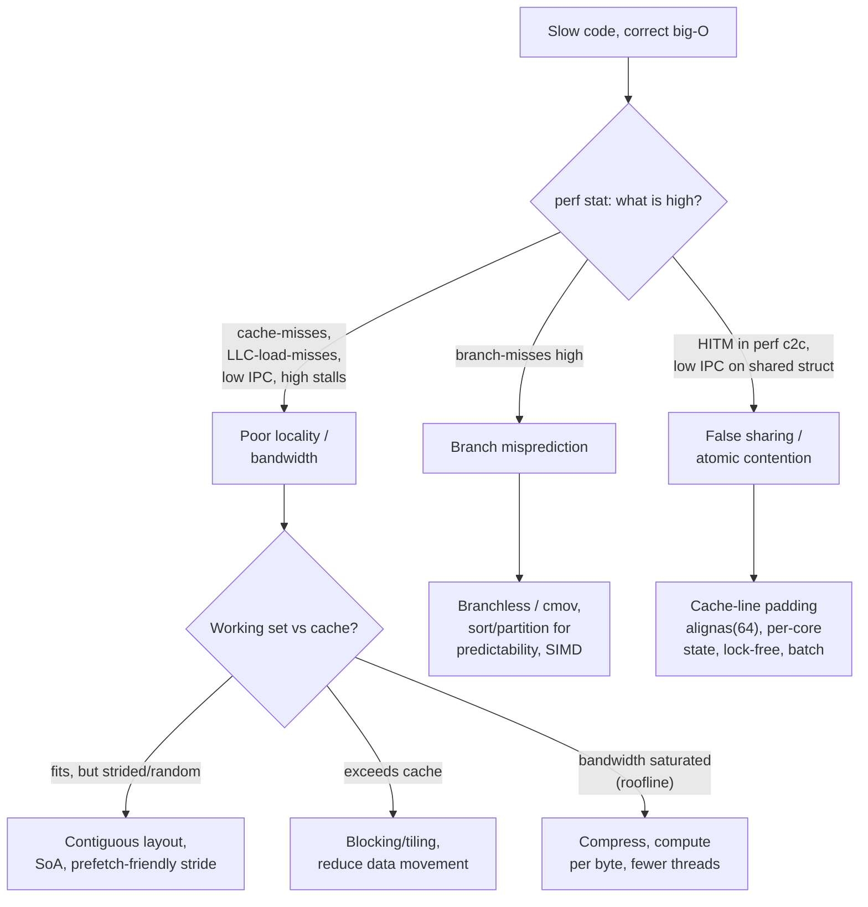
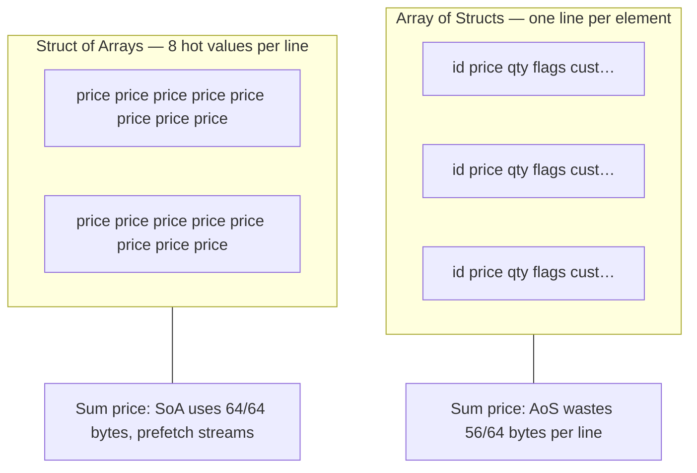
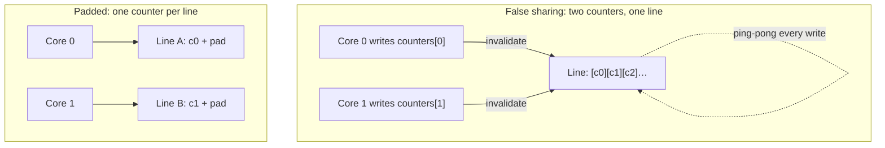
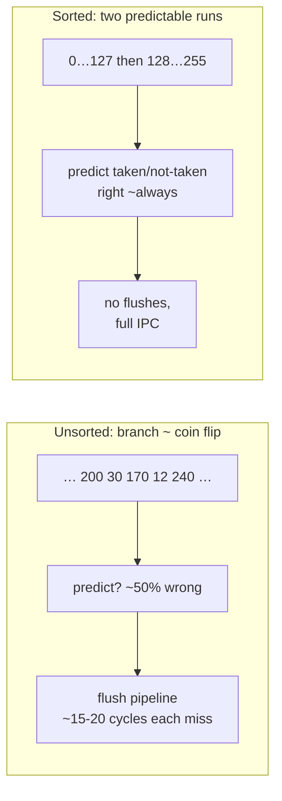

# Chapter 8 — Performance Anti-Patterns: False Sharing, Branch Misprediction, Cache Thrashing

**What this chapter covers.** Chapters 2 through 4 built the machine: a deeply pipelined,
speculating, out-of-order core (Chapter 2); a multi-level cache hierarchy that decides whether
that core computes or stalls (Chapter 3); and the coherence protocol that keeps many private caches
consistent, at a cost (Chapter 4). Those chapters were theory. This one is the payoff: the concrete,
recurring, hardware-level performance anti-patterns that bite production backend code, how to
*recognize* each one from its symptom, how to *measure* it with CPU performance counters instead of
guessing, and how to *fix* it. The throughline is the observation from Chapter 1 that most
performance problems surviving an algorithmic pass are mechanical-sympathy problems — two
implementations with identical big-O complexity routinely differ by 10x, and the difference is
almost always cache misses, branch mispredictions, false sharing, memory-bandwidth saturation,
atomic contention, or allocator pressure. Each of these has a signature you can see in `perf`, and a
matching fix. The chapter ends where every real optimization must: a measurement workflow, because
you cannot fix what you have not measured, and modern hardware is far too counterintuitive to
optimize by inspection.

Learning goals — after this chapter you should be able to:

- Explain why "same big-O, 10x different performance" is the normal case, and why the cause is
  mechanical rather than algorithmic — a data-movement or control-flow problem, not an operations-count
  problem.
- Recognize the six anti-patterns — **pointer chasing / poor locality**, **false sharing**,
  **branch misprediction**, **memory-bandwidth saturation**, **atomic/lock contention**, and
  **allocation/GC pressure** — from code shape *and* from their `perf`-counter fingerprint.
- Apply the matching fix for each: contiguous layout and struct-of-arrays and blocking; cache-line
  padding; branchless code and predictable branches; reducing data movement; sharding shared writes
  into per-core state; and arenas, pools, and value types.
- Use `perf stat`, `perf record`, `perf top`, `perf c2c`, cachegrind, and flame graphs to identify
  the bottleneck *class*, then re-measure to confirm the fix.
- Reason about why every one of these effects *multiplies across a fleet*: a hot-loop cache-miss
  pattern on 10,000 cores is 10,000 cores of waste, false sharing and atomic contention are the
  single-node face of distributed coordination overhead, and p99 tail latency is frequently one of
  these effects firing on one unlucky node.

## The shape of the problem: same big-O, 10x apart

A senior engineer's instinct, faced with a slow endpoint, is to reach for complexity: find the
accidental O(n²), the missing index, the N+1 query. That instinct is correct and you should exhaust
it first. But there is a large, important class of performance problems that *survives* the
algorithmic pass — the profile is flat, the complexity is right, the query plan is clean, and the
code is still three, five, ten times slower than it should be. Those are hardware-effect problems.
The operation count is fine; the *cost per operation* is not, because the operations are stalling
the pipeline, missing cache, bouncing cache lines between cores, or waiting on memory bandwidth.

The reason this is the normal case and not an edge case is the latency hierarchy of Chapter 1. An
L1 hit is a few cycles; a last-level-cache miss to DRAM is on the order of a couple hundred cycles —
two orders of magnitude. A correctly predicted branch is nearly free; a mispredicted one costs the
full pipeline depth, hedged at roughly 15–20 cycles on a modern core. A cache line that ping-pongs
between two cores' L1 caches costs a coherence round trip — tens to low hundreds of cycles — *every
time*. None of these costs appears in your source code, in your big-O analysis, or in a code review.
They are properties of the *data layout* and *access pattern*, which the source deliberately hides.
Two loops that do the same arithmetic can differ by 10x purely in how they touch memory.

This is why the discipline of this chapter is inseparable from measurement. You cannot look at a
loop and know its IPC (instructions per cycle), its cache-miss rate, or its branch-misprediction
rate. Modern cores are too speculative, too out-of-order, too prefetch-driven for the human eye to
model. The professional stance is: form a hypothesis about the bottleneck *class*, confirm it with a
performance counter that is diagnostic of that class, apply the matching fix, and re-measure. The
rest of this chapter is organized as a catalog of classes — each with its code shape, its
mechanism, its counter, and its fix — followed by the workflow that ties them together.



## Cache-unfriendly access patterns

Chapter 3 established the cache's operating assumptions: it moves memory in 64-byte lines, it
rewards **temporal** locality (reuse the same data soon) and **spatial** locality (use nearby data
soon), and its hardware prefetchers stream ahead of *sequential* access. Every cache anti-pattern is
a violation of one of those assumptions.

### Pointer chasing: the linked structure tax

Consider summing a value across a linked list versus an array. Same O(n), wildly different hardware
behavior.

```c
// Linked list: each node is a separate allocation, scattered across the heap.
struct Node { int value; struct Node *next; };
long sum_list(struct Node *head) {
    long s = 0;
    for (struct Node *n = head; n; n = n->next)   // n->next is a data-dependent load
        s += n->value;
    return s;
}

// Array: contiguous, prefetch-friendly.
long sum_array(const int *a, size_t n) {
    long s = 0;
    for (size_t i = 0; i < n; i++)                // a[i], a[i+1] on the same/next line
        s += a[i];
    return s;
}
```

`sum_array` touches memory in strict address order. The prefetcher recognizes the stream and pulls
the next lines into L1 *before* the loop asks for them; sixteen `int`s share one 64-byte line, so
fifteen of every sixteen accesses are guaranteed L1 hits. The loop is bound by arithmetic, not
memory, and runs near the core's peak IPC.

`sum_list` is the opposite. Each node was allocated independently and lives at an unpredictable
address, so `n->next` is a **data-dependent load**: the CPU cannot compute the next address until the
current node arrives from memory. The prefetcher has no stride to lock onto. Worst case — nodes in
random heap order, working set larger than the last-level cache — *every* `n = n->next` is a cache
miss to DRAM. The core issues one load, stalls a couple hundred cycles waiting for it, follows the
pointer, stalls again. This is **pointer chasing**, and it defeats every latency-hiding trick the
core has: out-of-order execution cannot proceed past a load whose *address* isn't known, so the deep
reorder window sits idle. The same logic indicts naive binary trees, hash tables with per-node
chaining, and any "graph of small heap objects" layout. The fingerprint is low IPC (often well under
1.0), a high `cache-misses` count, and a high fraction of `stalled-cycles-backend` — the core is
waiting on memory, not computing.

The fix is layout, not algorithm. Store the nodes in an array and use indices instead of pointers;
allocate from an arena so logically adjacent nodes are physically adjacent; or, where the structure
permits, abandon the linked form for a flat array. A B-tree beats a binary search tree in practice
not because of asymptotics but because packing many keys per cache-line-sized node turns log₂(n)
scattered misses into far fewer wide, cache-friendly reads.

### Array-of-structs vs struct-of-arrays

The most common locality mistake in backend code is loading whole objects to read one field. Take a
million entities and sum one field.

```c
// Array of Structs (AoS): the intuitive layout.
struct Order {                 // sizeof ~= 64 bytes: one full cache line
    uint64_t id;
    double    price;           // the only field we need
    uint32_t  qty, flags;
    char      customer[32];
};
struct Order orders[1'000'000];

double total_aos(void) {
    double t = 0;
    for (size_t i = 0; i < 1'000'000; i++)
        t += orders[i].price;  // touches price, drags in the whole 64B line
}
```

Every iteration needs 8 bytes (`price`) but pulls a full 64-byte line into cache — 56 bytes of `id`,
`qty`, `flags`, and `customer` that the loop never reads. You are running the memory system at
one-eighth of its useful bandwidth, and if `Order` were larger than a line, each element would cost
*multiple* misses. The **struct-of-arrays** (SoA) layout stores each field in its own contiguous
array:

```c
// Struct of Arrays (SoA): one array per field.
struct Orders {
    uint64_t id[1'000'000];
    double    price[1'000'000];   // the hot field, densely packed
    uint32_t  qty[1'000'000];
    uint32_t  flags[1'000'000];
    char      customer[1'000'000][32];
};

double total_soa(const struct Orders *o) {
    double t = 0;
    for (size_t i = 0; i < 1'000'000; i++)
        t += o->price[i];         // eight useful doubles per line, prefetch streams
}
```

Now the `price` array is dense: eight `double`s per line, no wasted bytes, a perfect prefetch
stream, and — as a bonus — a layout the compiler can auto-vectorize into SIMD (Chapter 7). The
speedup on a field-sum over cold data is often ~4–8x, tracking the ratio of struct size to field
size. This is the core idea of **data-oriented design**: organize memory around the *access pattern*
of the hot loop, not around the conceptual "object."

You rarely need to flip the *entire* schema. **Hot/cold splitting** captures most of the win: keep
the few frequently-accessed fields together and dense, and push the rarely-touched fields (the
`customer` blob, audit metadata) into a separate structure reached by index. The hot loop then
streams the hot fields with near-perfect line utilization.



### Large strides and working sets that exceed cache

Two more locality traps. First, **strided access** that steps across lines defeats the prefetcher
and wastes each line. The textbook case is iterating a 2D array in the wrong order:

```c
// Column-major traversal of a row-major array: stride = N * sizeof(elem).
for (size_t j = 0; j < N; j++)
    for (size_t i = 0; i < N; i++)
        s += a[i][j];   // consecutive iterations jump N elements — a new line each time
```

Each inner-loop access lands on a different cache line (and, for large `N`, a different page,
stressing the TLB too). Swapping the loop order to `a[i][j]` with `j` innermost restores sequential
access and can be several times faster with no change to the arithmetic.

Second, and more insidious, is the **working set exceeding cache** — **cache thrashing** in the
capacity sense. As long as the data a loop repeatedly touches fits in a cache level, reuse is free.
The moment the working set grows past that level's capacity, every reuse becomes a capacity miss to
the next level down, and throughput falls off a cliff. This is why a matrix multiply written as three
naive nested loops collapses once the matrices no longer fit in cache: each element of one operand is
re-read n times, but by the time it is needed again it has been evicted. The fix is **blocking**
(**tiling**): restructure the loops to operate on sub-blocks small enough that the block's working
set fits in cache, so each loaded element is fully reused before eviction.

```c
// Tiled matrix multiply: operate on BxB blocks that fit in L1/L2.
for (size_t ii = 0; ii < N; ii += B)
  for (size_t jj = 0; jj < N; jj += B)
    for (size_t kk = 0; kk < N; kk += B)
      for (size_t i = ii; i < ii+B; i++)
        for (size_t j = jj; j < jj+B; j++) {
          double c = C[i][j];
          for (size_t k = kk; k < kk+B; k++)   // A[i][k], B[k][j] blocks stay resident
            c += A[i][k] * B[k][j];
          C[i][j] = c;
        }
```

Blocking is the single most important loop transformation for bandwidth-bound numerical code, and
the same principle — "size the unit of work to the cache" — reappears in database join algorithms
(cache-conscious hash joins) and in log-structured merge tuning. The fingerprint of a capacity-miss
problem is that performance is fine for small inputs and degrades sharply at the input size where the
working set crosses a cache boundary; `perf stat` shows `LLC-load-misses` climbing and IPC falling as
size grows.

## False sharing: the canonical multicore bug

False sharing is the most subtle anti-pattern in this chapter because it is *invisible in the
source*. The code has no shared variable — two threads touch two *different* variables — and yet they
contend, because coherence operates on 64-byte lines, not on variables (Chapter 4). If two
independent variables happen to land on the same cache line, and two cores write them, the line
ping-pongs between the cores' caches under the MESI protocol as if the writes genuinely conflicted.
Each write must first invalidate the other core's copy and pull the line into Modified state; the
other core's next write does the same in reverse. The line bounces, one coherence round trip per
write, and a workload that should scale linearly with cores instead gets *slower* as you add them.

The canonical example is per-thread counters packed into an array:

```c
// BAD: NTHREADS counters in a contiguous array — several per cache line.
long counters[NTHREADS];              // 8 bytes each: 8 counters share one 64B line

void *worker(void *arg) {
    int id = *(int*)arg;
    for (long i = 0; i < 1'000'000'000; i++)
        counters[id]++;               // thread id's "own" counter — but shares a line
    return NULL;
}
```

Every thread updates a counter no other thread reads. There is no logical sharing, no lock, no data
race — the program is correct. But `counters[0]` through `counters[7]` occupy one line, so eight
threads hammering "their own" counters are all writing the *same line*. The line ping-pongs eight
ways, and the loop can run an order of magnitude slower than the single-threaded version — adding
cores makes it worse. This exact pattern hides in per-thread statistics arrays, sharded rate-limiter
buckets, worker-pool state structs, and any `struct` whose fields are written by different threads.

The fix is to force each thread's hot data onto its own cache line by **padding** or **alignment**:

```c
// GOOD: each counter alone on its own 64-byte cache line.
struct alignas(64) PaddedCounter {    // C++; C11: _Alignas(64)
    long value;
    char pad[64 - sizeof(long)];      // fill the rest of the line
};
struct PaddedCounter counters[NTHREADS];

void *worker(void *arg) {
    int id = *(int*)arg;
    for (long i = 0; i < 1'000'000'000; i++)
        counters[id].value++;         // now the only live datum on its line
    return NULL;
}
```

With each counter alone on its line, no two threads ever share a line, the coherence traffic vanishes,
and the workload scales with cores as intended. The recovery is frequently an order of magnitude on
the contended microbenchmark. The cost is 64 bytes per counter of otherwise-wasted memory — a trade
almost always worth making for genuinely hot, thread-private data.



Languages give you first-class mechanisms for this. C++17 exposes
`std::hardware_destructive_interference_size` (the padding size to *avoid* false sharing) and
`std::hardware_constructive_interference_size` (to deliberately co-locate). Java has
`@Contended` (JDK 8+, gated behind `-XX:-RestrictContended`), which the JVM honors by padding the
annotated field. Rust programmers reach for `crossbeam`'s `CachePadded<T>`. Go has no annotation, so
you pad structurally with an unused `[64]byte` or `_ [8]uint64` field, or by giving each goroutine a
fully separate allocation. The Linux kernel uses `____cacheline_aligned` throughout its per-CPU data
for exactly this reason.

Two caveats. First, some hardware prefetches lines in *pairs* (an "adjacent-line" prefetcher, 128-byte
effective granularity), so on those parts padding to 128 bytes can be safer for the hottest data —
measure. Second, false sharing is a *write* problem: read-only shared data on one line is fine, since
multiple caches can hold a line in Shared state simultaneously. It is concurrent *writes* to distinct
variables on one line that trigger the ping-pong.

## Branch misprediction: when the pipeline guesses wrong

Chapter 2's core is deeply pipelined and speculative: to keep the pipeline full it *predicts* the
direction of each conditional branch and executes speculatively down the predicted path. Modern
predictors are astonishingly good — well over 95% accurate on typical code — because most branches
are highly biased (loop back-edges taken n−1 times, error checks almost never taken). But a branch
whose direction is *data-dependent and effectively random* is unpredictable in principle: the
predictor is right about half the time, and each miss flushes the speculative work and refills the
pipeline, costing roughly the pipeline depth — hedged at ~15–20 cycles on current cores.

The famous illustration — the most-viewed performance question on Stack Overflow — is summing the
elements of an array that exceed a threshold, and discovering that *sorting the array first* makes the
loop several times faster:

```c
int data[N];                 // values in [0, 255]
// ... fill with random values ...
// std::sort(data, data + N); // <-- with this line, the loop below is often ~3-6x faster

long sum = 0;
for (int reps = 0; reps < 100000; reps++)
    for (int i = 0; i < N; i++)
        if (data[i] >= 128)   // the branch whose predictability changes everything
            sum += data[i];
```

The arithmetic is identical whether or not the array is sorted — same number of comparisons, same
number of additions, same O(N) per pass. What changes is the *predictability of the branch*. On
**unsorted** random data, `data[i] >= 128` is true about half the time in no pattern; the predictor
cannot do better than a coin flip, mispredicts roughly half the branches, and eats a pipeline flush
each time. On **sorted** data, the branch is false for the entire first run of small values and then
true for the entire tail — two long, perfectly predictable runs with a single transition. The
predictor is right essentially always, the pipeline never flushes, and the loop runs at full speed.
The visible several-fold speedup is *entirely* the elimination of branch mispredictions; `perf stat`
confirms it as a collapse in `branch-misses` between the two runs.



There are three fixes, and *sorting the data is rarely the real one* — you sorted here only to make
the branch predictable, which is a strange thing to pay O(n log n) for. The direct fix is to remove
the unpredictable branch from the hot loop entirely:

```c
// Branchless: compute the mask, multiply. No conditional to mispredict.
for (int i = 0; i < N; i++)
    sum += data[i] * (data[i] >= 128);   // (cond) is 0 or 1; no branch
// or, encouraging a conditional move:
    sum += (data[i] >= 128) ? data[i] : 0;
```

The comparison `data[i] >= 128` produces a 0/1 value with no control-flow branch; the CPU executes a
straight-line sequence, often lowering the ternary to a **conditional move** (`cmov`) that selects a
result without a jump. There is nothing to mispredict, so the branchless version runs at the *sorted*
speed on *unsorted* data. The third fix is **SIMD** (Chapter 7): vector compare-and-blend
instructions evaluate the predicate across a whole vector lane-wise with no branches at all, and the
compiler will often auto-vectorize the branchless form.

A critical caveat, because branchless code is frequently *misapplied*: converting a branch to a
`cmov` removes the misprediction penalty but also removes the predictor's ability to *skip work* on
the common path. A well-predicted branch is nearly free and lets the core avoid the untaken side
entirely; forcing both sides to execute (as a `cmov` does) can be *slower* when the branch was
predictable. So branchless transformations pay off only for genuinely unpredictable branches in
genuinely hot loops. Everywhere else, leave the branch — it is cheaper, and it is more readable. As
always: measure `branch-misses`, confirm the branch is both hot and unpredictable, and only then
reach for branchless or SIMD.

## Memory-bandwidth saturation

The locality section optimized for *latency* — avoiding misses. But a class of workloads is not
latency-bound at all; it is **bandwidth-bound**. It streams so much data through the cores that the
limiting resource is the sustained bytes-per-second the memory system can deliver, not the miss
latency of any single access. Once a workload is bandwidth-bound, the counterintuitive consequence
is that *adding threads does not help* — every core is already waiting on a shared, saturated memory
channel, so more cores just contend for the same fixed bandwidth. Throughput plateaus (or dips, once
coherence and contention overhead grow) no matter how many cores you throw at it.

The tool for reasoning about this is the **roofline model** (Chapter 1). Plot achievable performance
against **arithmetic intensity** — FLOPs (or useful work) per byte moved from memory. Low-intensity
kernels (a vector add: two reads, one write, one add — a fraction of an op per byte) sit under the
sloped "bandwidth roof" and are limited by memory bandwidth; high-intensity kernels (a well-blocked
matrix multiply that reuses each loaded byte many times) reach the flat "compute roof." The model
tells you, before you write a line of optimization, whether your kernel *can* be sped up by faster
compute (it is under the compute roof) or only by *moving less data* (it is under the bandwidth
roof).

For a bandwidth-bound kernel the fixes all reduce data movement per unit of work — i.e., raise
arithmetic intensity:

- **Better locality / blocking** so loaded bytes are reused before eviction (the SoA and tiling
  fixes above) — this converts a bandwidth problem into a compute problem.
- **Compression** — smaller types (`float32` over `float64`, packed integers, dictionary encoding)
  move fewer bytes per element, so more elements fit per line and per second of bandwidth. Trading a
  little decode compute for a lot less memory traffic is almost always a win when bandwidth-bound.
- **Compute more per byte** — fuse passes so data loaded once is used for several operations instead
  of being re-streamed for each (loop fusion, operator fusion in query and ML engines).
- **Fewer threads, right placement** — because more threads cannot beat the bandwidth wall, and on a
  NUMA machine (Chapter 6) a thread pulling from a *remote* socket's memory pays extra interconnect
  latency and consumes shared interconnect bandwidth. Pin threads to the node that owns their data.

The fleet consequence is direct: a bandwidth-bound service is one where the standard scaling
reflex — add vCPUs — buys nothing, because the bottleneck is the memory subsystem the vCPUs share.
Recognizing bandwidth saturation (flat throughput vs. thread count, high `LLC-load-misses` streaming
to DRAM, and — where available — memory-controller bandwidth counters near their ceiling) prevents
the expensive mistake of scaling a machine that has no headroom left to give.

## Atomic and lock contention

Chapter 4 showed that an atomic read-modify-write (a CAS or `fetch_add`) must acquire the cache line
in exclusive (Modified) state and enforce ordering. When many cores hammer the *same* atomic — a
global counter, a shared queue head, a reference count on a hot object — that line becomes a
single-line bottleneck: it can be Modified in exactly one cache at a time, so the cores serialize,
handing the line back and forth with a coherence round trip per operation. This is true sharing (the
data really is shared) rather than false sharing, but the mechanism and the symptom are the same
cache-line **bouncing**, and it is a scalability killer. The same is true of a contended lock: the
lock word itself is a cache line that ping-pongs among the contenders' caches, and the critical
section serializes them on top of that.

The unifying theme, and the most important sentence in this chapter for concurrent code: **shared
mutable state is the enemy of scaling.** Every write to a shared line is a coherence event, and
coherence events serialize. The fixes are all variations on *stop sharing the written data*:

- **Per-core / sharded state.** Give each core (or thread, or shard) its own counter/accumulator on
  its own cache line, and combine them only when a total is actually read. A billion-increment global
  counter that serializes all cores becomes N independent per-core counters that never contend; you
  pay one cheap sum at read time. This is the Linux kernel's per-CPU-variable pattern and the design
  behind Java's `LongAdder` (which is exactly a striped, padded set of cells) versus a contended
  `AtomicLong`.
- **Reduce the frequency of shared writes.** **Batch** updates locally and flush to the shared
  structure occasionally — accumulate 1,000 events in a thread-local buffer, then do one atomic add
  of the batch. This turns N coherence events into N/1000.
- **Lock-free / wait-free structures where they genuinely fit** (Volume 4). These reduce the
  *serialization* of a lock but do *not* eliminate coherence traffic — a lock-free stack whose single
  head pointer is CAS'd by every thread still bounces that one line. Lock-free is not a magic scaling
  bullet; the scaling comes from *not concentrating writes on one line*, which is a data-layout
  decision, not a synchronization-primitive decision.
- **Read-mostly optimizations.** For data read far more than written, structures like RCU or seqlocks
  (Volume 4) let readers proceed with no writes to shared lines at all, confining coherence cost to
  the rare writer.

The `perf` fingerprint of atomic/lock contention is the same as false sharing — high cross-core snoop
hits on modified lines (HITM), visible in `perf c2c` — plus, for locks, time spent in the futex/park
paths visible in a flame graph. The distinction between *true* sharing (fix by sharding the data or
reducing writes) and *false* sharing (fix by padding) is exactly what `perf c2c` is built to tell
you, because it reports the offsets within the contended line that different cores touched.

## Allocation and garbage-collection effects

Memory allocation is a performance anti-pattern hiding in plain sight, because `new`/`malloc` looks
like a single cheap call. In a hot path it is three separate problems. First, the allocator itself
has cost and, under concurrency, **contention** — a shared global heap serializes threads on its
metadata locks, which is why modern allocators (jemalloc, tcmalloc, mimalloc) use per-thread caches
and per-core arenas, the same "stop sharing" fix as above. Second, allocation **pollutes cache**:
touching fresh memory and the allocator's bookkeeping evicts the loop's hot data, adding misses
elsewhere. Third, and most importantly, allocation produces **pointer-heavy, scattered layouts** —
exactly the pointer-chasing anti-pattern from earlier. A graph of small heap objects, each a separate
allocation, guarantees the cache-miss-per-node behavior; the allocation *is* the layout, and the
layout is the problem.

The fixes are about controlling layout and lifetime:

- **Allocate less.** Hoist allocations out of hot loops; reuse buffers; return by value into
  caller-provided storage. The cheapest allocation is the one you do not do.
- **Arenas / region allocators.** Allocate many objects contiguously from a bump-pointer arena and
  free them all at once by resetting the arena. This makes logically related objects physically
  adjacent (restoring locality) *and* makes allocation and deallocation nearly free (a pointer bump
  and a reset). Ideal for request-scoped data: arena per request, reset at the end.
- **Object pools / free lists** for expensive, frequently recycled objects, so steady-state operation
  does no allocation at all — the LMAX Disruptor's pre-allocated ring buffer (Chapter 1) is the
  archetype.
- **Value types and flat layouts.** Prefer contiguous arrays of values to arrays of pointers to
  objects. In managed runtimes this is the difference between a `long[]` (dense, cache-friendly) and a
  `Long[]` / `List<Long>` (an array of references to boxed heap objects, each a pointer chase). C#
  `struct`s, Java's Project Valhalla value classes, and Go's naturally value-typed structs and slices
  all exist to give you flat layouts on managed heaps.
- **Off-heap / manual memory for large data** (Volume 13) — large buffers, caches, and columnar
  stores kept outside the managed heap avoid both GC scanning cost and pointer-chasing layout.

In garbage-collected languages there is a second, latency-shaped effect: **GC pauses**. The more you
allocate, the more frequently the collector runs, and even mostly-concurrent collectors have
stop-the-world phases and consume CPU and memory bandwidth that steal from the application. A service
that allocates aggressively in its request path pays for it not only in throughput but in **tail
latency** — a request unlucky enough to be in flight during a pause absorbs the whole pause into its
response time. Reducing allocation is therefore a *tail-latency* intervention as much as a throughput
one: fewer, larger, longer-lived allocations mean less collector work, shorter and rarer pauses, and
a tighter p99. This is a central theme of Volume 13 (managed-runtime performance) and reappears in
Volume 11 (SRE, tail latency); the mechanical cause is here.

## Measurement: finding these without guessing

Everything above is a hypothesis generator. The discipline that turns it into engineering is
measurement, and on Linux the primary instrument is `perf`, which reads the CPU's **hardware
performance counters** — dedicated registers that count microarchitectural events (cycles,
instructions retired, cache misses, branch mispredictions, stalls) with negligible overhead.

Start with `perf stat`, which gives the high-level vitals for a whole program or command:

```text
$ perf stat -d ./workload
        12,004.55 msec task-clock                #    1.00 CPUs utilized
   38,204,551,010      cycles                    #    3.18 GHz
   11,204,882,140      instructions              #    0.29  insn per cycle   <- low IPC: stalling
      612,003,884      branches
       88,441,220      branch-misses             #   14.4% of all branches   <- bad prediction
    2,904,551,201      cache-references
    1,880,220,140      cache-misses              #   64.7% of cache refs      <- poor locality
   26,110,884,201      stalled-cycles-backend    #   68.3% of cycles          <- waiting on memory
```

Read it top-down. **IPC** (instructions per cycle) is the master health metric: a modern core can
retire ~3–4 instructions per cycle, so an IPC of 0.3 means the core is stalled ~90% of the time and
*something* is starving it. The rest of the counters tell you *what*: a high **branch-miss** rate
points at the misprediction anti-pattern; a high **cache-miss** rate plus high
**stalled-cycles-backend** points at poor locality or bandwidth; low IPC with neither of those, on
multithreaded code, points at contention. Add `-d` (detailed) for L1/LLC breakdowns; the specific
counters you will name most are `LLC-load-misses` (last-level misses that go all the way to DRAM —
the expensive ones) and `cache-misses`.

| Anti-pattern | Code shape | `perf` fingerprint | Fix |
|---|---|---|---|
| Pointer chasing / poor locality | Linked lists, trees, scattered heap objects | Low IPC, high `cache-misses`, high `stalled-cycles-backend`, high `LLC-load-misses` | Contiguous/array layout, arenas, indices not pointers |
| AoS wasting lines | Loading whole struct for one field | High `cache-misses`, low line utilization | Struct-of-arrays, hot/cold split |
| Cache thrashing (capacity) | Working set > cache; degrades at a size threshold | `LLC-load-misses` climb with input size, IPC falls | Blocking / tiling, shrink working set |
| Strided access | Wrong loop order, big strides | High `cache-misses`, `dTLB-load-misses` | Sequential access, loop interchange |
| False sharing | Per-thread data on shared line; scales *negatively* | `perf c2c` HITM at distinct offsets in one line | `alignas(64)` padding, per-line state |
| Branch misprediction | Data-dependent branch in hot loop | High `branch-misses` (>~5–10%) | Branchless / `cmov`, predictable order, SIMD |
| Bandwidth saturation | Streaming, low arithmetic intensity | Flat throughput vs. threads, DRAM-bound `LLC-load-misses` | Reduce data movement, compress, block, compute per byte |
| Atomic / lock contention | Hot shared counter/lock/queue head | `perf c2c` HITM at the *same* offset; futex in flame graph | Per-core sharding, batching, lock-free where it fits |
| Allocation / GC | `new`/`malloc` in hot path; GC pauses | Allocator/GC frames in flame graph; pause spikes in tails | Arenas, pools, value types, allocate less, off-heap |

When `perf stat` tells you *what* class of problem you have, the next question is *where*. `perf
record` samples the program and `perf report` (or `perf top` for a live view) attributes the events
to functions and source lines — crucially, you can sample a *specific* event, e.g. `perf record -e
cache-misses ./workload` to find exactly which lines take the misses, or `-e branch-misses` to find
the mispredicting branch. Rendered as a **flame graph** (Brendan Gregg's visualization: stacks on the
x-axis, sampled by width), this makes the expensive call paths obvious at a glance and is the fastest
way to orient in unfamiliar code.

For the two contention anti-patterns there is a purpose-built tool: **`perf c2c`** (cache-to-cache).
It records where cache lines are shared and modified across cores and reports the **HITM** events —
loads that hit a line **M**odified in *another* core's cache, the exact signature of a bouncing line.
Its killer feature is that it shows the *offsets within the line* that different cores touched: if
cores are hitting *different* offsets, you have **false** sharing (pad them apart); if they are
hitting the *same* offset, you have **true** sharing (shard the data or reduce writes). This single
distinction is otherwise very hard to make, which is why `perf c2c` is the tool for any "adding cores
made it slower" mystery.

Complementary tools fill gaps. **Cachegrind** (Valgrind) *simulates* a cache and gives exact,
deterministic miss counts per line — no hardware counters, no sampling noise, at the cost of a large
slowdown; excellent for pinning down *which line* misses when hardware sampling is too coarse.
**Intel VTune** and **AMD uProf** provide vendor-specific, deeply annotated microarchitectural
analysis (top-down stall attribution, memory-access analysis, bandwidth against the roofline) that
goes beyond what raw `perf` counters name. In production, **continuous profilers** (Volume 13) sample
`perf`-style data fleet-wide at low overhead — the direct descendant of Google-Wide Profiling — so
you find the hot loop that is wasting cycles across thousands of nodes without attaching to any single
one.

The workflow is a loop, and its order matters:

1. **Measure first.** `perf stat` for the vitals; never optimize on a hunch.
2. **Identify the bottleneck class** from the counters: prediction, locality, bandwidth, or
   contention.
3. **Localize** with `perf record`/`report`/`top` (or `perf c2c` for contention) to the exact
   function and line.
4. **Apply the matching fix** from this chapter — and only that fix.
5. **Re-measure** to confirm the counter moved and the wall-clock improved. If it did not, your
   hypothesis was wrong; revert and return to step 2.

The cardinal sin is optimizing blind — restructuring code on intuition without a counter confirming
the bottleneck. On modern hardware intuition is wrong often enough that blind optimization
frequently makes things *slower* while making them uglier.

## Distributed-systems lens: the same enemy at every scale

These are single-node effects, but their consequences are fleet-shaped, and the pattern of the fix is
identical to the patterns you already apply to distributed systems.

**Waste multiplies across the fleet.** A hot loop that runs at IPC 0.4 instead of 2.0 because of a
cache-miss pattern is wasting ~80% of every core it runs on. On one machine that is an annoyance; on
a service deployed to 10,000 cores it is 8,000 cores of pure waste — a five-figure monthly cloud bill
and a proportional carbon footprint spent stalling on memory. Mechanical-sympathy fixes are among the
highest-leverage cost reductions available precisely because the per-node saving multiplies by the
fleet. Chapter 1's argument — that per-node efficiency *is* a fleet-level cost concern — is cashed out
here in concrete counters.

**Shared mutable state limits scaling at every level, and it is the same theory each time.** False
sharing and atomic contention are the *single-node* face of the exact problem distributed systems
spend their lives fighting: coordination on shared state does not scale. A cache line bouncing between
two cores is the hardware micro-image of two nodes contending on a distributed lock or a hot database
row. The cure is identical at both scales — *stop sharing the unit of coordination*: partition the
data, give each core/node its own state, and combine only when necessary. Per-core counters
(single-node) and sharded/partitioned datastores (distributed, Volumes 5 and 7) are the *same design*
at twelve orders of magnitude apart; share-nothing architectures (Volume 7) are the fleet-scale
statement of "one writer per cache line" (Chapter 4). The engineer who internalizes why the padded
counter scales already understands why the partitioned service scales.

**Tail latency is frequently one of these effects firing on one node.** A p99 spike rarely means the
median got slower; it means one request hit something the others did not. Very often that something is
mechanical: a GC pause the request happened to be in flight for, a node whose memory bandwidth got
saturated by a noisy neighbor, a cache-thrashing code path triggered by an unusually large input, a
lock that went contended under a burst. The p99/p999 that SRE teams chase (Volume 11) is, at the
bottom of the stack, often the anti-patterns in this chapter manifesting on the unlucky node — which
is why reducing allocation, eliminating contention, and fixing locality are tail-latency
interventions, not just throughput ones.

**The profiling workflow scales to the fleet.** The measure-identify-fix-remeasure loop that finds a
false-sharing bug on your laptop is the same loop, instrumented continuously and aggregated across
thousands of hosts, that finds the fleet's most expensive function. Google-Wide Profiling and its
descendants (Volume 13) are `perf` sampling at fleet scale; a 1% CPU regression that would be invisible
on one host is a screaming, ranked line item across the fleet. Mechanical sympathy per node,
multiplied by fleet scale, is the entire performance-and-cost story of a large backend — and this
chapter is its practical core.

## Key takeaways

- **Most performance problems that survive an algorithmic pass are hardware-effect problems.** "Same
  big-O, 10x different performance" is the normal case, and the cause is mechanical — cache misses,
  branch mispredicts, false sharing, bandwidth, contention, allocation — not operation count.
- **Poor locality is the biggest single lever.** Pointer chasing (linked lists, trees, scattered heap
  objects) causes a cache miss per node and defeats out-of-order execution and prefetch; AoS wastes
  most of every line when you read one field; strides and oversized working sets thrash the cache. Fix
  with contiguous layout, **struct-of-arrays** and hot/cold splitting, sequential access, and
  **blocking/tiling** — data-oriented design.
- **False sharing is the subtle multicore killer.** Independent variables on one 64-byte line, written
  by different threads, ping-pong the line via coherence and can run an order of magnitude slower while
  *scaling negatively*. Fix by padding/aligning hot per-thread data to its own line (`alignas(64)`,
  `@Contended`, `CachePadded`).
- **Unpredictable, data-dependent branches in hot loops flush the pipeline** (~15–20 cycles each). The
  sorted-vs-unsorted array sum is faster sorted *only* because the branch becomes predictable; the real
  fix is branchless code (`cmov`), predictable ordering, or SIMD — but only for branches that are both
  hot and genuinely unpredictable, because a well-predicted branch is nearly free.
- **Bandwidth-bound workloads do not scale with threads.** When you are limited by bytes/second, not
  miss latency, more cores contend for the same channel. Use the **roofline** to tell latency-bound from
  bandwidth-bound; fix by moving less data — locality, compression, fusion, per-byte compute, NUMA-local
  placement.
- **Contended atomics and locks serialize cores** by bouncing one line. Shared mutable state is the
  enemy of scaling: shard into per-core state, batch updates, and use lock-free/read-mostly structures
  where they genuinely fit — the scaling comes from *not concentrating writes on one line*.
- **Allocation is not free.** It contends, pollutes cache, and produces pointer-chasing layouts; GC
  turns it into tail-latency spikes. Allocate less; use arenas, pools, value types, and off-heap for
  big data.
- **Measure, never guess.** Each anti-pattern has a `perf`-counter fingerprint — IPC, `cache-misses`,
  `LLC-load-misses`, `branch-misses`, `stalled-cycles-backend`, `perf c2c` HITM. Run the loop:
  measure → identify the class → localize → apply the matching fix → re-measure. Optimizing blind on
  modern hardware usually fails.
- **Every effect multiplies across the fleet.** Per-node waste × 10,000 cores is real money and real
  tail latency; false sharing and atomic contention are the single-node face of distributed coordination
  overhead; the cure at every scale is the same — stop sharing the unit of coordination, and partition.

## Further reading

- Ulrich Drepper, "What Every Programmer Should Know About Memory" (2007) —
  https://people.freebsd.org/~lstewart/articles/cpumemory.pdf — the definitive practitioner treatment
  of cache behavior, access patterns, false sharing, and NUMA, with measurements; Sections 3–6 map
  directly onto this chapter.
- Brendan Gregg, *Systems Performance*, 2nd ed. (Addison-Wesley, 2020), and the flame-graph and
  `perf` material at https://www.brendangregg.com/ — the reference for `perf`, flame graphs, and the
  measurement-first methodology; see especially the "CPU Flame Graphs" and `perf` one-liner pages.
- Joe Mario and Don Zickus, "C2C — False Sharing Detection in Linux Perf" —
  https://joemario.github.io/blog/2016/09/01/c2c-blog/ — the definitive walkthrough of `perf c2c`,
  HITM events, and telling true from false sharing.
- Samuel Williams, Andrew Waterman, David Patterson, "Roofline: An Insightful Visual Performance Model
  for Multicore Architectures," *Communications of the ACM*, 2009 — the roofline model for reasoning
  about bandwidth-bound vs. compute-bound kernels.
- The Stack Overflow question "Why is processing a sorted array faster than processing an unsorted
  array?" — https://stackoverflow.com/q/11227809 — the canonical branch-prediction demonstration, with
  accurate explanations of the mechanism.
- Herb Sutter, "Eliminate False Sharing," Dr. Dobb's Journal, 2009 — a practitioner walkthrough of
  false sharing and padding fixes with numbers; pairs with the `std::hardware_*_interference_size`
  facilities in C++17.
- Richard Fabian, *Data-Oriented Design* — https://www.dataorienteddesign.com/dodbook/ — book-length
  treatment of organizing data around access patterns (SoA, hot/cold splitting) rather than around
  objects.
- Mike Acton, "Data-Oriented Design and C++," CppCon 2014 —
  https://www.youtube.com/watch?v=rX0ItVEVjHc — the influential talk making the case for laying out
  memory for the hardware, not the abstraction.
- Ulrich Drepper, "A Case Study in Performance: memcpy," and Agner Fog's optimization manuals at
  https://www.agner.org/optimize/ — microarchitectural detail on branches, `cmov`, and instruction
  costs across Intel/AMD parts; the authority for the branch-misprediction and branchless claims here.
- Brendan Gregg, *BPF Performance Tools* (Addison-Wesley, 2019) — eBPF-based observability that
  extends `perf`-style measurement into production tracing (ties to Volume 2).
- Paul E. McKenney, *Is Parallel Programming Hard, And, If So, What Can You Do About It?* —
  https://mirrors.edge.kernel.org/pub/linux/kernel/people/paulmck/perfbook/perfbook.html — per-CPU
  data, `LongAdder`-style striping, RCU, and why sharding beats contended atomics.
