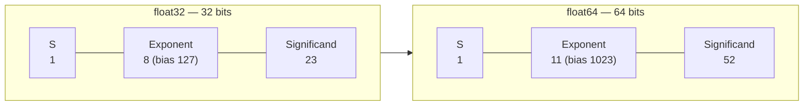
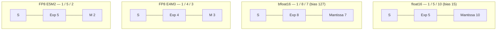
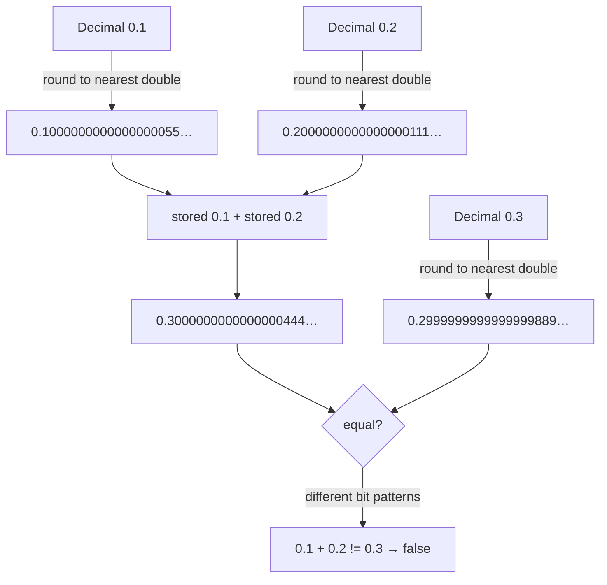
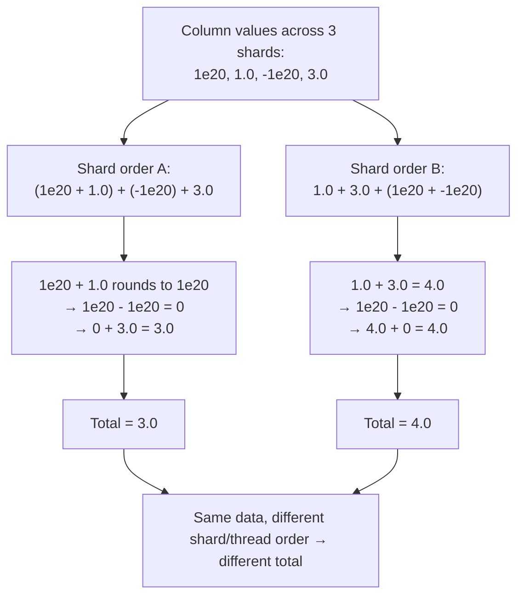
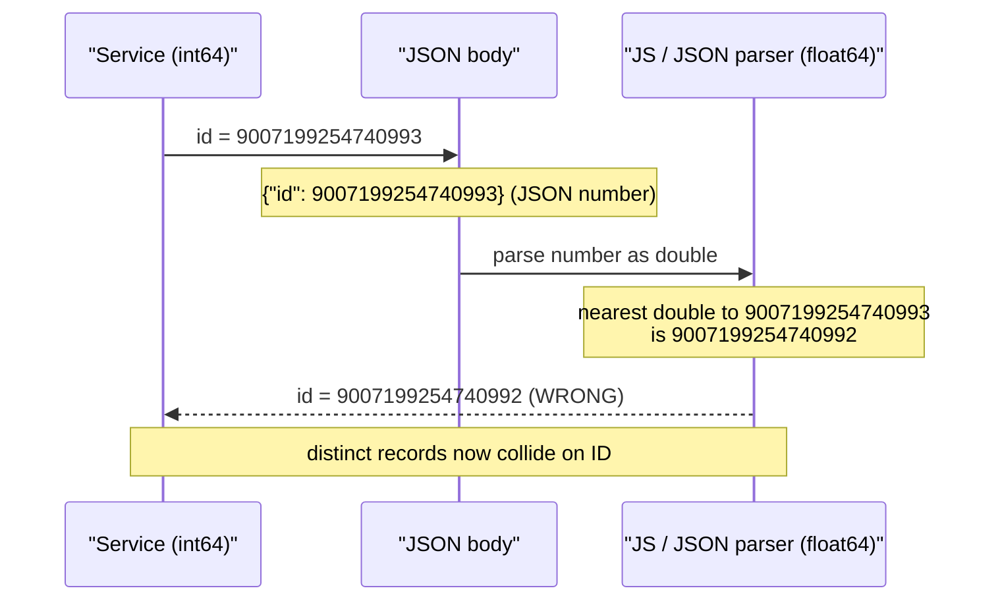
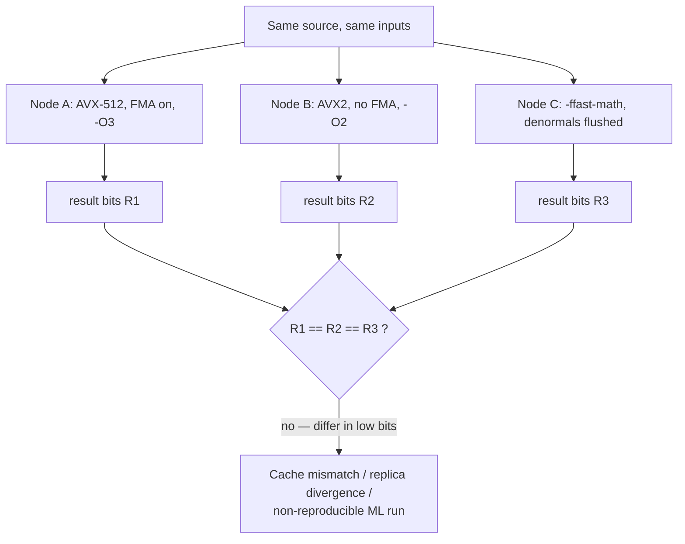

# Chapter 9 — Number Representation and Floating Point

**What this chapter covers.** Every prior chapter in this volume treated numbers as a given: caches
move them, SIMD lanes multiply them, coherence protocols keep them consistent. This chapter opens
the number itself. A machine word is a fixed-width bit pattern, and the *meaning* of that pattern —
whether `0xFFFFFFFF` is 4,294,967,295 or −1, whether `0x3FF0000000000000` is the integer
4,607,182,418,800,017,408 or the floating-point value 1.0 — is a convention imposed by the code that
reads it. Most of the time the convention is invisible and correct. The rest of the time it is the
source of a class of bug that is uniquely nasty for backend engineers: it is silent, it is
data-dependent, it crosses service boundaries, and it corrupts *money*, *identifiers*, and
*aggregates* — the three things a backend system exists to get right. This chapter is a precise
account of how integers and, especially, floating-point numbers are represented, why the
representation leaks, and the specific discipline that keeps the leaks out of production. The
throughline is that number representation is not arithmetic trivia; it is a *correctness and
consistency* problem that shows up at exactly the seams where distributed systems are already
fragile — serialization boundaries, cross-language APIs, and parallel reductions across a
heterogeneous fleet.

Learning goals — after this chapter you should be able to:

- Explain two's-complement integer representation and *why* it is universal (one zero, one
  add/subtract circuit), and predict the behavior of overflow: defined wraparound for unsigned,
  undefined behavior for signed C, and the real incidents both have caused.
- Read an IEEE 754 float bit-for-bit — sign, biased exponent, significand, the implicit leading 1,
  subnormals, and the special values `±0`, `±∞`, and `NaN` — and explain why `NaN != NaN` and why
  `0.1 + 0.2 != 0.3`.
- Name the four backend floating-point hazards — catastrophic cancellation, accumulation error,
  non-associativity, and precision loss at large magnitude — and apply the matching fix (tolerance
  comparison, Kahan/pairwise summation, deterministic reduction order, integer/decimal money).
- Diagnose the classic cross-service bug where a 64-bit ID round-trips through a JSON/JavaScript
  `float64` and is silently corrupted above 2^53, and prescribe the fix.
- Reason about floating-point *determinism* across a fleet: why FMA, x87 80-bit intermediates, SIMD
  reassociation, and `-ffast-math` make the "same" computation produce different bits on different
  nodes, and why that breaks caching, replication, and ML reproducibility.

## Integers: two's complement and its universality

An *n*-bit unsigned integer is the obvious thing: the bits are the base-2 digits, the range is
`0 … 2^n − 1`, and arithmetic is modular — it wraps around 2^n with no notion of negative. The
interesting design decision is how to represent *signed* integers, and here the industry converged,
decades ago and essentially without exception, on **two's complement**.

In two's-complement representation the most significant bit carries *negative* weight. For an *n*-bit
value with bits `b_{n-1} … b_0`:

```
value = −b_{n-1}·2^{n-1} + Σ_{i=0}^{n-2} b_i·2^i
```

So for an 8-bit byte, `0b1111_1111` is `−128 + 127 = −1`, and `0b1000_0000` is `−128`. The range is
asymmetric: `−2^{n-1} … 2^{n-1} − 1`. For a 32-bit `int` that is `−2,147,483,648 … 2,147,483,647`.

Two's complement won for reasons that are directly architectural, not aesthetic:

- **There is exactly one zero.** The competing schemes — sign-magnitude (a dedicated sign bit) and
  ones' complement (negate by inverting all bits) — both have a distinct `+0` and `−0`. Two
  representations of zero mean every equality comparison and every branch-on-zero must special-case a
  second bit pattern. Two's complement has a single `0b0000_0000`.
- **Addition and subtraction use one circuit.** In two's complement, `a − b` is just
  `a + (two's-complement of b)`, and the two's complement of `b` is `~b + 1` (invert the bits, add
  one). The same ripple-carry adder that computes `a + b` computes `a − b` with no sign logic, no
  special cases, and — critically — the *same* addition works whether you interpret the operands as
  signed or unsigned. The hardware does not need to know. That is why an ALU has an `ADD` and the sign
  interpretation is left to the flags and to the compiler. Sign-magnitude, by contrast, needs the
  adder to inspect signs and conditionally subtract.
- **Carry-out and wraparound are natural.** Modular wraparound at 2^n falls out of dropping the carry
  bit, which is exactly what a fixed-width adder does.

The one wart is the asymmetric range. There is a most-negative value (`INT_MIN`, `−2^{n-1}`) with no
positive counterpart, so `−INT_MIN` overflows: negating the smallest int gives back the smallest int.
`abs(INT_MIN)` is a real bug — it returns a negative number. This is not a curiosity; it has produced
CVEs in image decoders and length calculations for decades.

### Widths and the cost of choosing wrong

The common widths are 8, 16, 32, and 64 bits, and the choice is not free-form. A width is a promise
about the maximum magnitude a value will ever take, and violating that promise is overflow. The
default `int` in C, Go, Java, and most systems is 32-bit, which tops out near 2.1 billion — a number
that many production quantities blow past: row counts in a large table, cumulative byte counters on a
busy interface, view counts on a viral video, IDs in a high-throughput system. **The reflexive fix
for anything that counts real-world events at scale is a 64-bit integer**, whose range (~9.2 quintillion
signed) is large enough that overflow stops being a practical concern for counters and IDs. This is
why Snowflake IDs, database bigint primary keys, and Unix nanosecond timestamps are all 64-bit. It is
also, as we will see, exactly why they are dangerous when they meet JSON.

### Integer overflow: wraparound, undefined behavior, and real incidents

When an arithmetic result exceeds the width, what happens depends on signedness and language, and the
distinction is a genuine footgun.

**Unsigned overflow is defined**: it wraps modulo 2^n. `uint32` `0xFFFFFFFF + 1 == 0`. This is
predictable but still dangerous — a wrapped-around length or index becomes a small or huge number that
sails past a bounds check. The classic pattern is an allocation size computed as `count * size`, which
wraps to a small value; the code then allocates the small buffer but writes `count` elements into it —
a heap overflow. This is a staple of memory-safety CVEs.

**Signed overflow in C and C++ is *undefined behavior* (UB)**, and this is one of the sharpest edges
in systems programming. The standard does not say signed overflow wraps; it says the program's
behavior is undefined, which licenses the optimizer to assume it *never happens*. A compiler may prove
that `x + 1 > x` is always true for signed `x` (because overflow "can't" occur) and delete a bounds
check that depended on the wraparound. The infamous shorthand is that `if (x + 1 < x)` — a hand-rolled
overflow check — can be optimized away entirely, because the compiler reasons the condition is
impossible. Overflow checks must therefore be written *before* the operation (`if (x > INT_MAX - 1)`)
or with compiler builtins (`__builtin_add_overflow`) or in a language that defines the behavior. Rust
makes this explicit: signed and unsigned overflow *panic* in debug builds and wrap in release builds
by default, with `checked_add`, `wrapping_add`, and `saturating_add` as intent-revealing choices.

The consequences are not academic. Two illustrative classes:

- **Underhanded / supply-chain attacks.** Integer-overflow bugs are a favorite of the "underhanded C"
  genre precisely because they are invisible in review: a size calculation that looks correct wraps on
  a large but attacker-controllable input, and the resulting undersized allocation becomes an exploit
  primitive. In a supply-chain context — a dependency deep in your build — such a bug is a plausible
  vector for a deliberately planted vulnerability that passes casual audit. The general lesson from
  the supply-chain incidents catalogued in Volume 4 applies: subtle arithmetic in untrusted code is
  exactly where planted vulnerabilities hide.
- **Physical-world failure.** The most cited example is the loss of the maiden flight of the Ariane 5
  (Flight 501, June 1996). The reused inertial-reference software converted a 64-bit floating-point
  value related to horizontal velocity into a 16-bit signed integer; the Ariane 5's higher velocity
  produced a value outside the 16-bit range; the conversion overflowed and raised an unhandled
  exception; the inertial reference units shut down; and the vehicle, now flying on garbage guidance,
  self-destructed. The precise chain has been studied exhaustively in the official inquiry board
  report — the salient point for us is that it was a *conversion-with-overflow* bug in reused code
  whose input assumptions no longer held.

### The 2038 problem

A specific, scheduled instance of signed overflow deserves its own mention because it will actually
arrive. Traditional Unix `time_t` is a **signed 32-bit** count of seconds since the epoch,
1970-01-01T00:00:00Z. A signed 32-bit second counter overflows at **2038-01-19T03:14:07Z**, after
which it wraps to a large negative number and time appears to jump to December 1901. This is the
integer-overflow bug with a deadline. The fix is a 64-bit `time_t`, which pushes the overflow roughly
292 billion years out; modern 64-bit platforms and updated 32-bit ABIs have moved to it, but embedded
systems, on-disk formats, wire protocols, and databases that baked in 32-bit timestamps remain
exposed. If your system stores or transmits a 32-bit epoch anywhere, it has a 2038 liability, and the
audit is worth doing now rather than in 2037.

### Endianness and the serialization boundary

A multi-byte integer must be laid out in memory as a sequence of bytes, and there are two conventions.
**Big-endian** stores the most significant byte at the lowest address; **little-endian** stores the
least significant byte first. The 32-bit value `0x0A0B0C0D` is `0A 0B 0C 0D` in memory big-endian and
`0D 0C 0B 0A` little-endian.

Within a single machine, endianness is invisible — the CPU reads back what it wrote. It becomes real
the moment bytes cross a boundary: a network socket, a memory-mapped file, a binary protocol, a device
register. x86 and most ARM deployments are little-endian; many older RISC systems and some network
gear are big-endian. Crucially, **network byte order is big-endian** by convention (the IP/TCP/UDP
header fields are big-endian), which is why the socket API ships `htons`/`htonl`/`ntohs`/`ntohl` —
host-to-network and network-to-host conversions that are no-ops on a big-endian host and byte-swaps on
a little-endian one. Any binary serialization that does not pin an explicit byte order is a
cross-system bug waiting for a heterogeneous fleet or a new client platform. This is the number-level
face of the serialization discipline developed in Volume 3 (networking) and Volume 8 (APIs): every
wire format must specify byte order, and every reader must honor it. Text formats like JSON dodge
endianness entirely by encoding numbers as decimal strings of digits — but, as the second half of
this chapter shows, they trade the endianness bug for a precision bug.

## Floating point: IEEE 754

Integers represent a bounded range of exact values with uniform spacing. Real computation — physics,
statistics, graphics, ML, anything with fractions or a wide dynamic range — needs to represent numbers
from the very small to the very large, and it accepts *approximation* as the price. The universal
standard for this is **IEEE 754** (first published 1985, substantially revised as IEEE 754-2008 and
754-2019). Essentially every FPU, GPU, and language `float`/`double` implements it, which is what makes
cross-platform floating point *mostly* portable — and the exceptions to "mostly" are the subject of
the determinism section below.

A 754 binary float encodes a number in three fields, in the spirit of scientific notation
`(−1)^sign × significand × 2^exponent`:

- a **sign** bit `s`;
- a biased **exponent** field `e` of width chosen per format;
- a **significand** (also called mantissa) field `f`, the fractional bits.

For a *normalized* number, the value is:

```
(−1)^s × 1.f × 2^(e − bias)
```

The `1.` is the **implicit leading bit**: because a normalized binary significand always starts with
a 1, the standard does not store it, buying one extra bit of precision for free. The exponent is
stored *biased* (offset by a constant) rather than in two's complement, so that the bit patterns of
floats sort in the same order as signed integers of the same width — a trick that lets hardware
compare magnitudes with integer comparisons.



The two workhorse formats:

- **float32 (single precision):** 1 sign, 8 exponent (bias 127), 23 significand bits. With the
  implicit bit that is 24 bits of significand, giving roughly 7 decimal significant digits and a range
  up to ~3.4×10^38.
- **float64 (double precision):** 1 sign, 11 exponent (bias 1023), 52 significand bits — 53 effective —
  for roughly 15–16 decimal digits and a range up to ~1.8×10^308. This is the default `double` in C
  family languages, Python's `float`, and — importantly — *every* number in JavaScript and JSON.

### The ML formats: fp16, bfloat16, and FP8

Machine learning changed the economics of precision. Training and inference are bottlenecked by memory
bandwidth and by the die area and energy of multiply-accumulate units, and it turns out neural networks
tolerate — sometimes benefit from — dramatically reduced precision. The result is a family of narrow
formats, each a different answer to the question "given very few bits, spend them on range or on
precision?" (See Volume 7 on ML systems for how these interact with training stability and
mixed-precision schemes.)



The key contrast is **float16 vs bfloat16**, both 16 bits:

- **float16** (IEEE half) spends 5 bits on exponent and 10 on mantissa — more precision, but a narrow
  dynamic range (~6×10^−5 to ~65,504) that overflows and underflows easily during training, requiring
  loss-scaling gymnastics.
- **bfloat16** (Google Brain's format) spends 8 bits on exponent and only 7 on mantissa. It has the
  *exact same exponent range as float32* — so a float32 can be truncated to bfloat16 by dropping the
  low 16 mantissa bits, and values rarely overflow — at the cost of much coarser precision. For deep
  learning this trade is usually the right one: the network cares more about dynamic range than about
  the low mantissa bits, and bfloat16 became the default training precision on TPUs and modern GPUs.

**FP8** pushes further, to 8 bits, standardized by the Open Compute Project in two variants: **E4M3**
(4 exponent, 3 mantissa — more precision, used for weights/activations) and **E5M2** (5 exponent, 2
mantissa — more range, used for gradients). At 8 bits the encodings deviate from strict IEEE 754 —
E4M3 in the OCP definition, for instance, forgoes infinities to reclaim those bit patterns for finite
values — so "FP8" is a family of closely-specified formats rather than a single 754 type. The takeaway
for a backend engineer serving models is that *precision is now a deployment parameter*: the same model
weights exist as float32, bfloat16, and FP8 quantizations, and which one a node uses affects both its
throughput and — the theme of this chapter — the exact bits it computes.

| Format | Bits | S/E/M | Approx. range | Approx. significant digits | Typical use |
|---|---|---|---|---|---|
| int8 | 8 | — | −128 … 127 | exact | flags, quantized weights |
| int16 | 16 | — | −32,768 … 32,767 | exact | small counters, audio |
| int32 | 32 | — | ±2.1×10^9 | exact | default int, IDs (risky) |
| int64 | 64 | — | ±9.2×10^18 | exact | IDs, counters, nanotime |
| FP8 E4M3 | 8 | 1/4/3 | ~±448 | ~1 | ML inference (weights) |
| FP8 E5M2 | 8 | 1/5/2 | ~±5.7×10^4 | ~1 | ML training (gradients) |
| float16 | 16 | 1/5/10 | ~±6.5×10^4 | ~3 | ML, graphics |
| bfloat16 | 16 | 1/8/7 | ~±3.4×10^38 | ~2–3 | ML training/inference |
| float32 | 32 | 1/8/23 | ~±3.4×10^38 | ~7 | graphics, DSP, ML |
| float64 | 64 | 1/11/52 | ~±1.8×10^308 | ~15–16 | scientific, JS/JSON default |

### Subnormals and the special values

The exponent field has two reserved patterns — all-zeros and all-ones — that encode the edges of the
number line.

**All-zero exponent** signals a **subnormal** (denormal) number. Normalized numbers cannot represent
values arbitrarily close to zero, because the implicit leading 1 imposes a smallest normalized
magnitude. Subnormals fill the gap between that smallest normalized value and zero: the implicit
leading bit becomes 0 instead of 1, so the significand is `0.f` rather than `1.f`, and the numbers get
progressively less precise but degrade *gradually* to zero rather than snapping to it (this is
"gradual underflow," a deliberate 754 design goal). Subnormals are correctness-preserving but can be a
performance cliff: some hardware handles them via microcode or traps that run orders of magnitude
slower, which is why performance-sensitive and ML code often enables **flush-to-zero / denormals-are-zero**
modes — trading the tail of precision for predictable latency (a mechanical-sympathy concern in the
spirit of Chapter 8).

**All-one exponent** signals the special values:

- **Infinity** when the significand is zero: `+∞` and `−∞`, produced by overflow or by `1.0/0.0`.
- **NaN** (Not a Number) when the significand is nonzero: the result of `0.0/0.0`, `∞ − ∞`,
  `sqrt(−1)`, and any operation with no meaningful real answer. The standard distinguishes **quiet
  NaN** (qNaN, top significand bit set) which propagates through arithmetic silently, from **signaling
  NaN** (sNaN) which is intended to raise an exception when used — in practice almost everything you
  encounter is a quiet NaN, and the distinction rarely surfaces above the FPU.
- **Signed zero:** `+0` and `−0` are distinct bit patterns. They compare *equal* (`+0 == −0` is true)
  but are distinguishable by operations like `1.0/x`, which yields `+∞` for `+0` and `−∞` for `−0`.

The single most bug-productive property is that **`NaN` is not equal to anything, including itself**:
`NaN == NaN` is `false` and `NaN != NaN` is `true`. This is by design — NaN means "no meaningful
value," so no equality holds — but it wrecks code that assumes reflexivity. A `NaN` slipped into a sort
comparator produces inconsistent orderings and can corrupt or crash the sort. A `NaN` key in a hash
map can never be found again. A `NaN` in a running max/min silently swallows subsequent comparisons
(`NaN < x` and `NaN > x` are both false). A deduplication or set membership check on floats breaks. The
canonical *detection* idiom exploits the reflexivity failure: `x != x` is true if and only if `x` is
`NaN` (which is what `isnan()` does under the hood). The canonical *defense* is to reject or sanitize
NaN and infinity at ingestion — a validated numeric input at an API boundary should exclude them
unless they are genuinely meaningful.

## The fundamental problem: floating point is approximate

Here is the fact that every backend engineer must internalize: **most decimal fractions cannot be
represented exactly in binary floating point.** A binary float can exactly represent only numbers of
the form `integer × 2^k`. The decimal `0.5` is `2^−1` — exact. The decimal `0.1` is *not* a
finite sum of powers of two; in binary it is the infinitely repeating fraction
`0.0001100110011001100…₂`, the base-2 analog of how `1/3` is `0.333…` in decimal. Stored in a float64,
`0.1` is rounded to the nearest representable value, which is very slightly more than one tenth. The
same is true of `0.2` and most "round" decimals.

This is why the most famous floating-point surprise is true in essentially every language with 754
doubles:

```python
>>> 0.1 + 0.2
0.30000000000000004
>>> 0.1 + 0.2 == 0.3
False
```

Neither `0.1`, `0.2`, nor `0.3` is stored exactly. The stored `0.1` and stored `0.2` sum to a value
whose nearest representable double is *not* the nearest representable double to `0.3`, and the tiny
representation errors fail to cancel. The result is off by one unit in the last place — about
`5.5×10^−17` — which prints as the notorious `…04` tail.



Two consequences follow, and they are the root of most floating-point bugs:

- **Rounding error is inherent and it accumulates.** Every operation whose true result is not exactly
  representable is rounded (by default, round-to-nearest-even), introducing an error of up to half a
  unit in the last place. One rounding is negligible; a billion roundings, correlated, are not.
- **`==` on floats is a bug.** Because the exact bits depend on the exact sequence of roundings, two
  computations that are mathematically equal routinely differ in their low bits. Testing floats for
  equality asks whether two approximations landed on the *identical* approximation, which is almost
  never what you mean.

**Machine epsilon** quantifies the granularity: it is the gap between 1.0 and the next representable
value — `2^−52 ≈ 2.22×10^−16` for float64, `2^−23 ≈ 1.19×10^−7` for float32. It is the *relative*
precision floor. The correct way to compare floats is with a tolerance that respects this scale —
either an absolute epsilon for values near a known magnitude, a *relative* tolerance
(`|a − b| <= eps × max(|a|, |b|)`), or a **ULP** (units-in-the-last-place) comparison that counts how
many representable values lie between the two operands. Language ecosystems provide these:
`math.isclose` in Python (with `rel_tol` and `abs_tol`), `numpy.isclose`/`allclose`, and equivalent
helpers elsewhere. There is no universally correct tolerance — the right one depends on the magnitudes
and the accumulated error of the specific computation — which is precisely why float equality cannot
be papered over with a library call and must be reasoned about.

## Floating-point hazards for backend systems

Approximation by itself is benign; you learn to compare with tolerance and move on. The hazards that
actually break production are the ones where errors are not tiny and independent but *large* or
*correlated* or *order-dependent*.

| Hazard | Cause | Symptom | Fix |
|---|---|---|---|
| Catastrophic cancellation | Subtracting near-equal values cancels the leading digits, exposing rounding noise | Result has few or no correct significant digits | Reformulate the algorithm to avoid the subtraction (stable variance, stable quadratic) |
| Accumulation error | Summing many values; each add rounds; errors correlate and drift | Total is wrong by growing amount; order-dependent | Kahan/compensated summation, pairwise summation, or sort by magnitude |
| Non-associativity | `(a+b)+c ≠ a+(b+c)` because each add rounds | Parallel/sharded reductions disagree; non-reproducible | Fix a canonical reduction order or use reproducible-reduction techniques |
| Precision loss at magnitude | Beyond 2^53 a float64 cannot represent consecutive integers | Large IDs corrupted; large counters skip values | Keep exact integers as int64/decimal/strings, never as float |
| Overflow / underflow | Result exceeds format range or is flushed to zero | `±∞` or `0` silently; NaN downstream | Range checks; log-domain arithmetic; wider format |

### Catastrophic cancellation

When you subtract two nearly-equal floating-point numbers, the high-order digits cancel and the result
is dominated by the *rounding error* in the low-order digits of the operands — you can lose most or all
of your significant figures in a single subtraction. The textbook case is the naive variance formula
`E[x²] − E[x]²`: for data with a large mean and small spread, `E[x²]` and `E[x]²` are two large,
nearly-equal numbers whose difference is a small variance, and the subtraction annihilates precision —
it can even produce a *negative* variance, which is mathematically impossible. The fix is algorithmic:
use a numerically stable formulation such as Welford's online algorithm, which updates mean and
variance incrementally without ever forming that difference. The same reformulation logic applies to
the quadratic formula (rationalize to avoid subtracting `b` from a nearly-equal `sqrt(b² − 4ac)`) and
to computing `log(1+x)` and `exp(x)−1` for small `x`, which is why the standard library ships `log1p`
and `expm1` — dedicated, cancellation-free implementations.

### Accumulation error and Kahan summation

Summing a large array of floats is the most common backend numeric operation — it is what every
`SUM()`, every average, every metric rollup does — and the naive loop drifts. Each addition rounds the
running total to a representable value, discarding a little of the addend's low bits; when you add many
numbers, especially many small numbers to a large running total, those discarded bits accumulate into a
visible error. Add a million values around 1.0 and the total can be off by a noticeable amount, because
once the running sum is large, each new small addend loses precision relative to it.

**Kahan (compensated) summation** fixes this by keeping a second variable that tracks the low-order
bits lost on each addition and feeds them back into the next one:

```python
def kahan_sum(values):
    total = 0.0
    c = 0.0          # running compensation for lost low-order bits
    for x in values:
        y = x - c           # apply previous compensation
        t = total + y       # total may be big; low bits of y are lost here
        c = (t - total) - y # recover exactly what was lost
        total = t
    return total
```

The algebra `(t − total) − y` recovers the rounding error exactly (in the absence of overflow), so the
compensation `c` carries the lost precision forward. Kahan summation makes the error roughly constant
regardless of the number of terms, instead of growing with it. Alternatives with different trade-offs:
**pairwise (cascade) summation** recursively sums halves and has good error behavior with better
cache/vectorization properties — it is what NumPy's `sum` uses — and **sorting by magnitude** before
summing (smallest first) reduces the relative error of the naive loop. The engineering point is that
"sum this column" is not a solved primitive; at scale it is an algorithm choice.

### Non-associativity and the distributed reduction

This hazard is the one that graduates from a single-node numerics footnote to a genuine
distributed-systems correctness problem, so it gets the distributed-systems lens treatment below and a
diagram here. Floating-point addition is **commutative** (`a + b == b + a`) but **not associative**:
`(a + b) + c` can differ from `a + (b + c)` because the two orderings round at different intermediate
values. Concretely, adding a large and a small number can round the small one away entirely, so the
order in which you fold values determines whether small contributions survive.



When the same aggregation runs across shards, threads, or nodes, and the runtime is free to combine
partial sums in whatever order they complete, the *final total depends on scheduling* — which is
non-deterministic. This is not a rounding curiosity; it means two replicas computing the "same" sum can
disagree, a re-run of the same job can produce a different answer, and a cached result can mismatch a
freshly computed one.

### Precision loss at large magnitude, and the 64-bit-ID-through-JSON bug

Float64 has 53 bits of significand, so it can represent every integer exactly up to **2^53 =
9,007,199,254,740,992**. Above that, consecutive integers are no longer all representable — at 2^53 the
spacing becomes 2, so `2^53 + 1` rounds to `2^53`. JavaScript exposes this boundary as
`Number.MAX_SAFE_INTEGER = 2^53 − 1 = 9,007,199,254,740,991`, the largest integer for which
`n` and `n + 1` are both exactly representable.

This collides head-on with the backend habit of using 64-bit integer IDs. A Snowflake ID, a database
bigint, or any int64 identifier routinely exceeds 2^53. The danger is that **JavaScript has a single
number type — float64 — and JSON, following JavaScript, defines its `number` as a double in every
mainstream parser.** So the moment a 64-bit integer ID is serialized as a JSON *number* and parsed by a
JavaScript client (or many other JSON libraries that decode numbers to doubles), any value above 2^53
is silently rounded to the nearest representable double — a *different integer*. The ID
`9007199254740993` comes back as `9007199254740992`. Two distinct records now share an ID; a lookup
misses; an idempotency key collides; a permission check matches the wrong row.



The corruption is silent — no error, no exception, just a wrong number — and it is intermittent,
because IDs below 2^53 round-trip fine, so it hides until your ID space grows or a Snowflake timestamp
crosses the threshold. The fix is unambiguous and belongs to the API-design discipline of Volume 8:
**serialize 64-bit identifiers as JSON strings, not numbers.** `{"id": "9007199254740993"}` is
lossless everywhere, because a string of digits has no float64 rounding. Twitter's API famously learned
this and began returning both `id` (number, deprecated) and `id_str` (string) for exactly this reason.
The same caution applies to any int64 that flows through a JavaScript, JSON, or protobuf-to-JSON layer:
protobuf's JSON mapping already encodes 64-bit integer fields as strings for this precise reason.

## Money and decimals: never use float

Money is the domain where floating-point approximation stops being an academic error and becomes a
financial discrepancy, an accounting mismatch, or a regulatory problem. **You must never represent
monetary amounts as binary floating point.** The reason is exactly the `0.1` problem: currency is
decimal, and `0.10`, `0.01`, and most prices are not exactly representable in binary. A `double` of
`0.10` is slightly off; multiply it by a quantity, sum thousands of line items, apply a percentage tax,
and the sub-cent errors compound into totals that do not reconcile, that round inconsistently, and that
differ from what a decimal-correct system computes. `0.1 + 0.2 != 0.3` is a rounding curiosity; the
same effect across a ledger is a real deviation that auditors and customers notice.

There are two correct approaches, and both eliminate binary fractions entirely:

| Approach | Representation | Pros | Cons / caveats |
|---|---|---|---|
| Integer minor units | Store amounts as an integer count of the smallest unit (cents, satoshis, or a fixed number of decimal places) in int64/int128 | Exact, fast, simple, database-friendly; arithmetic is plain integer math | Must track the scale/currency out of band; must handle currencies with different minor-unit exponents; risk of overflow at extreme scale (use int64/128 deliberately) |
| Decimal / fixed-point type | A base-10 type: SQL `DECIMAL(p,s)` / `NUMERIC`, Java `BigDecimal`, Python `decimal.Decimal`, C# `decimal`, Rust `rust_decimal` | Exact decimal arithmetic with explicit precision and rounding mode; handles fractional cents and multi-currency scales | Slower than native ints/floats; must set precision and rounding policy explicitly; not a hardware type |

Integer minor units are the workhorse: store `$19.99` as the integer `1999` cents. All arithmetic is
exact integer arithmetic; you divide by 100 only for display. This is simple, fast, and unambiguous,
and it is why payment systems and ledgers overwhelmingly use it. Its one discipline is that *scale is
metadata* — `1999` means nothing without knowing it is US cents at two decimal places — and currencies
differ (JPY has zero minor-unit digits, BHD has three), so a robust money type carries currency and
exponent alongside the integer.

The **decimal type** is the choice when you need fractional minor units (interest accrual, per-unit
pricing, tax computed to four decimal places) or when the arithmetic is genuinely decimal. `BigDecimal`,
Python `Decimal`, and SQL `NUMERIC(p,s)` all perform exact base-10 arithmetic and let you specify the
rounding mode explicitly — which matters, because financial rounding rules (round-half-up,
round-half-even/banker's rounding) must be *chosen*, not left to whatever the FPU does. The database
column type is the last line of defense: a monetary column should be `DECIMAL`/`NUMERIC` with an
explicit scale, never `FLOAT` or `DOUBLE`. IEEE 754 also defines *decimal* floating-point formats
(decimal64, decimal128) used in some financial and database engines (IBM's hardware, PostgreSQL's
`numeric` semantics), which give decimal exactness in a floating format — but the everyday rule stands:
if a value is money, it is an integer of minor units or a decimal type, fleet-wide, at every layer.

## Determinism and reproducibility across a fleet

The final hazard is the most subtle and the most distributed: the *same* floating-point program, given
the *same* inputs, can produce *different bits* on different machines, compilers, or optimization
settings. IEEE 754 pins the result of each individual operation, but a real computation is a sequence
of operations, and several things below the source level are free to change that sequence or its
intermediate precision:

- **Fused multiply-add (FMA).** Modern CPUs and GPUs have an `FMA` instruction that computes
  `a*b + c` with a *single* rounding instead of two (one after the multiply, one after the add). This
  is more accurate, but it produces a *different* result than a separate multiply and add — and whether
  the compiler emits FMA depends on the target architecture and flags. The same source computes
  different bits on a chip with FMA than on one without, or between `-O2` and a build that contracts to
  FMA.
- **x87 80-bit extended precision.** Legacy 32-bit x86 code using the x87 FPU computes intermediates in
  80-bit extended precision and rounds to 64-bit only when a value is stored to memory. Whether a
  temporary stays in an 80-bit register or gets spilled to a 64-bit memory slot — a decision the
  *register allocator* makes — changes the result. This is the classic "it gives different answers in
  debug vs. release" bug. SSE/AVX (the default on 64-bit x86) largely eliminated it by computing
  directly in 32/64-bit, but it survives in older toolchains and targets.
- **SIMD reassociation and reduction order.** Auto-vectorizing a sum splits it across vector lanes and
  reassociates the additions — which, per the non-associativity result above, changes the total. A
  loop summed scalar, summed with AVX2 (8 lanes), and summed with AVX-512 (16 lanes) can give three
  different answers, all "correct," because they fold the values in different orders.
- **`-ffast-math` and friends.** This family of flags (`-ffast-math`, `/fp:fast`,
  `--use_fast_math`) explicitly tells the compiler to *abandon* strict IEEE semantics for speed: assume
  no NaNs or infinities, assume associativity (licensing free reassociation), flush denormals to zero,
  and use lower-precision reciprocal/sqrt approximations. It makes numeric code faster and its results
  non-portable and non-reproducible — and it can silently break code that relied on `NaN` propagation
  or on strict rounding. Enabling it is a deliberate trade, not a free optimization.



Why a backend engineer must care: the moment a computed floating-point value is *compared across
nodes* or *cached and reused*, bit-level non-determinism becomes a consistency bug. Concretely:

- **Caching computed results.** If you cache a computed metric or score keyed by its inputs, and two
  nodes compute slightly different bits, a cache populated by node A is "wrong" from node B's
  perspective — or worse, cache validation that recomputes and compares by equality thrashes forever.
- **Replicated computation.** Systems that run the same computation on multiple replicas and compare
  results for agreement (some consensus, verification, or Byzantine-tolerance schemes) will see
  spurious disagreement on a heterogeneous fleet if the computation is floating point and the nodes
  differ in ISA, SIMD width, or build. This ties directly to the determinism and consistency material
  in Volume 6: *deterministic replay and state-machine replication require deterministic computation*,
  and floating point is a leading source of non-determinism.
- **ML reproducibility.** Training and even inference are famously hard to reproduce bit-for-bit
  because of exactly these effects — GPU reduction order, mixed-precision accumulation, non-associative
  `all-reduce` across a distributed training job, and library kernels that reassociate. Reproducible ML
  (a concern for debugging, auditing, and regulatory sign-off — Volume 7) requires pinning the versions,
  the reduction order, the precision, and sometimes disabling fast-math and non-deterministic kernels
  (e.g., framework "deterministic mode" flags), at a real throughput cost.

The mitigations form a spectrum. Where you need *bit-reproducibility*, you buy it: pin the compiler and
flags across the fleet, disable fast-math, fix the reduction order (a canonical serial or tree order
rather than "whatever finished first"), pin library and kernel versions, and consider
reproducible-summation algorithms (e.g., pre-rounding or wide-accumulator techniques that are provably
order-independent). Where you only need *agreement to a tolerance*, design the comparison around a ULP
or relative-error budget rather than equality, and never let a downstream decision hinge on the low
bits of a distributed float reduction.

## Distributed-systems lens

Number representation is a small topic on one node and a large one across a fleet, because every
service, language, and CPU is free to treat a number slightly differently, and the disagreements
surface exactly at the boundaries where distributed systems are already hard:

- **Non-associativity breaks determinism in parallel and sharded aggregation.** Summing a column across
  shards, threads, or GPU lanes in whatever order they complete yields *order-dependent totals*. For
  analytics this is a reproducibility and correctness problem (the same query returns different totals);
  for replicated state machines and consensus it is a divergence bug (replicas that must agree do not);
  for ML it is the reason distributed training is hard to reproduce. The fix is to make reduction order
  a *contract*, not an accident — see Volume 6 on determinism and consistency.
- **The 64-bit-ID-through-float64 corruption is a canonical cross-service API bug.** It lives at the
  JSON boundary between an int64-native backend and a float64-native JavaScript/JSON world, it is
  silent, and it is intermittent. The fleet-wide fix — *large identifiers travel as strings* — is an
  API-contract decision (Volume 8), not a per-service patch.
- **Reproducibility across a heterogeneous fleet is a caching and consistency concern.** Different CPUs,
  SIMD widths, compilers, and flags compute different bits for the "same" floating-point work, so any
  design that caches a computed float, compares computed floats across nodes, or assumes recomputation
  yields the identical value is exposed. Either pin the entire numeric toolchain fleet-wide or design
  for tolerance, never equality.
- **Money correctness is a fleet-wide discipline, not a local one.** A single service that uses `double`
  for an amount contaminates every total it touches downstream. Integer-minor-unit or decimal
  representation has to be the invariant *across* the financial system — at the API, in the database
  column, in every intermediate service — because the errors compound across hops.
- **Endianness and representation must be pinned at every serialization boundary.** Byte order for
  binary formats, and precision for text formats, are properties of the *wire contract*. A format that
  leaves either unspecified is a latent cross-system bug that fires the day a new client platform, a
  new CPU architecture, or a larger value enters the system (Volumes 3 and 8).

The unifying observation is that a number is only unambiguous *within* one representation. The instant
it crosses a boundary — a socket, a JSON body, a language runtime, a different CPU — it is
re-interpreted, and every difference in signedness, width, byte order, precision, or reduction order is
a place where the value can silently change. Distributed systems are, among other things, a very large
number of such boundaries.

## Key takeaways

- **Two's complement is universal** because it has a single zero and lets one adder do signed and
  unsigned add/subtract; its only wart is the asymmetric range (`INT_MIN` has no positive counterpart,
  so `-INT_MIN` and `abs(INT_MIN)` overflow).
- **Integer overflow is defined wraparound for unsigned but *undefined behavior* for signed C/C++** —
  the optimizer may delete overflow checks that assume wraparound. Write checks before the operation or
  use a language (Rust) that defines the behavior. Overflow has caused real incidents (undersized
  allocations → memory-safety CVEs; the Ariane 5 64-bit-float-to-16-bit-int conversion overflow) and
  has a scheduled one: the 2038 signed-32-bit `time_t` rollover.
- **Endianness matters at every binary serialization boundary;** network byte order is big-endian
  (`htonl`/`ntohl`). Text formats avoid it but trade it for a precision bug.
- **IEEE 754 encodes `(−1)^s × 1.f × 2^(e−bias)`** with an implicit leading 1, subnormals for gradual
  underflow, and special values `±0`, `±∞`, and `NaN`. **`NaN != NaN`** — which breaks sorts, hash
  keys, and equality — and is also the standard `isnan` test (`x != x`).
- **Floating point is approximate:** `0.1`, `0.2`, `0.3` are not exactly representable, so
  `0.1 + 0.2 != 0.3`. Never compare floats with `==`; use a relative/ULP tolerance sized to the
  computation. Machine epsilon (`~2.2×10^−16` for float64) is the relative-precision floor.
- **The backend hazards are cancellation, accumulation, non-associativity, and magnitude loss.**
  Reformulate to avoid subtracting near-equal values (stable variance, `log1p`/`expm1`); use
  Kahan/pairwise summation for large sums; fix reduction order for reproducible distributed sums; and
  keep exact large integers out of floats.
- **The 64-bit-ID-through-JSON/JavaScript bug:** float64 is exact only up to 2^53
  (`Number.MAX_SAFE_INTEGER`), and JSON numbers are doubles, so int64 IDs above 2^53 are silently
  corrupted at a JS/JSON boundary. **Send large identifiers as strings.**
- **Never use float for money.** Use integer minor units (cents) or a decimal/fixed-point type
  (`BigDecimal`, `DECIMAL(p,s)`), with an explicit rounding mode, at every layer including the database
  column.
- **Floating point is non-deterministic across a fleet** due to FMA, x87 80-bit intermediates, SIMD
  reassociation, and `-ffast-math`. For bit-reproducibility, pin the toolchain, flags, precision, and
  reduction order fleet-wide; otherwise design for tolerance, never equality. This underlies caching,
  replication, and ML reproducibility.

## Further reading

- IEEE, "IEEE Standard for Floating-Point Arithmetic," IEEE 754-2019 (and the 2008 and original 1985
  editions) — https://standards.ieee.org/ieee/754/6210/ — the authoritative definition of formats,
  rounding, special values, and operations.
- David Goldberg, "What Every Computer Scientist Should Know About Floating-Point Arithmetic," *ACM
  Computing Surveys*, 1991 — https://docs.oracle.com/cd/E19957-01/806-3568/ncg_goldberg.html — the
  canonical deep treatment of rounding, cancellation, and 754 rationale.
- William Kahan, "Further remarks on reducing truncation errors," *Communications of the ACM*, 1965 —
  the original compensated-summation note; see also Kahan's collected lecture notes at
  https://people.eecs.berkeley.edu/~wkahan/ for the definitive practitioner's perspective on 754.
- Nicholas J. Higham, *Accuracy and Stability of Numerical Algorithms*, 2nd ed. (SIAM, 2002) — the
  rigorous reference on cancellation, summation error, and numerical stability (Chapter 4 on summation).
- ARIANE 5 Flight 501 Failure — Report by the Inquiry Board (ESA/CNES, 1996) —
  https://esamultimedia.esa.int/docs/esa-x-1819eng.pdf — the primary source for the 64-bit-float to
  16-bit-signed-integer conversion overflow.
- Intel 64 and IA-32 Architectures Software Developer's Manuals — https://www.intel.com/sdm — for x87
  80-bit extended precision, SSE/AVX floating-point behavior, and the FMA instructions.
- "The Open Compute Project OCP 8-bit Floating Point Specification (OFP8)," and Micikevicius et al.,
  "FP8 Formats for Deep Learning," 2022 — https://arxiv.org/abs/2209.05433 — the E4M3/E5M2 definitions;
  and Google's bfloat16 documentation — https://cloud.google.com/tpu/docs/bfloat16.
- ECMAScript Language Specification, Number type (float64) and `Number.MAX_SAFE_INTEGER` —
  https://tc39.es/ecma262/ — and RFC 8259 (JSON), §6 Numbers —
  https://www.rfc-editor.org/rfc/rfc8259 — on why JSON numbers lose 64-bit integer precision; see the
  protobuf JSON mapping (https://protobuf.dev/programming-guides/json/) for the string-encoding remedy.
- "What Every Programmer Should Know About Floating-Point Arithmetic" (floating-point-gui.de) —
  https://floating-point-gui.de/ — an accessible practitioner's companion to Goldberg, with the
  comparison-with-tolerance and money guidance restated concretely.
- Martin Fowler, "Money" pattern (*Patterns of Enterprise Application Architecture*) —
  https://martinfowler.com/eaaCatalog/money.html — the canonical statement of the integer-minor-unit
  money type and why float is disqualified.
- James Demmel and Hong Diep Nguyen, "Fast Reproducible Floating-Point Summation," IEEE ARITH 2013 —
  the reference on order-independent, reproducible parallel summation for distributed reductions.
