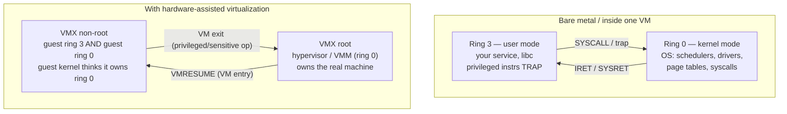
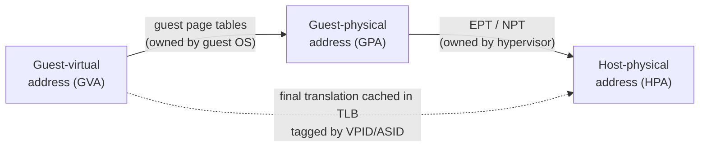
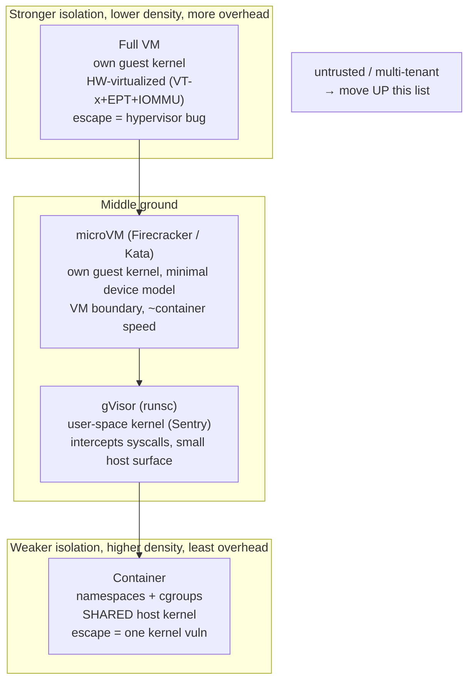

# Chapter 10 — Hardware Support for Virtualization and Isolation

**What this chapter covers.** Every previous chapter of this volume treated the machine as
*yours*: your pipeline (Chapter 2), your caches (Chapters 3–4), your NUMA nodes (Chapter 6),
your cores. That was a useful fiction. In production, your code runs on a sliver of a machine
that is simultaneously running other people's code — a co-tenant's batch job, another team's
service, in the public cloud a total stranger's workload — and the only thing keeping their bug,
their greed, and their malice out of your address space is a set of hardware mechanisms the CPU
enforces on every instruction. This final chapter is about those mechanisms: privilege levels,
the MMU as an isolation device, the specific silicon that makes a virtual machine possible
(Intel VT-x / AMD-V, EPT/NPT, the IOMMU), the isolation *spectrum* you actually choose from in
production (VMs, microVMs, gVisor, containers), the confidential-computing features that try to
remove the cloud provider itself from your trust boundary (SEV-SNP, TDX, SGX), and the honest
bad news: the isolation is imperfect, and speculation (Chapter 2) plus shared microarchitectural
state (Chapters 2–4) leak data *across* boundaries that the architecture swears are airtight.
This is the chapter where hardware architecture hands off to the operating system (Volume 2) and
to the multi-tenant cloud (Volume 12): the backend engineer does not run on hardware, they run on
*virtualized, multi-tenant* hardware, and the boundaries between tenants are drawn in silicon.

Learning goals — after this chapter you should be able to:

## Why isolation is a hardware problem

Isolation is usually discussed as an operating-system or cloud-platform feature — namespaces,
security groups, IAM. But every one of those software boundaries is ultimately *cashed out in
hardware*. A namespace the kernel can be tricked into ignoring is no boundary; a process separation
a `mov` instruction can read across is no separation. Isolation works at all because the CPU refuses
to execute certain instructions, and refuses to resolve certain addresses, unless it is in the right
state — enforced on every single instruction, at hardware speed, with no software in the fast path.

This matters to a backend engineer for three concrete reasons. First, **security**: in a
multi-tenant environment your process's confidentiality and integrity depend on hardware
boundaries you did not build and cannot see. Second, **performance isolation** — the "noisy
neighbor": a co-tenant saturating memory bandwidth (Chapter 3), thrashing the last-level cache
(Chapter 4), or hammering the same NUMA node (Chapter 6) degrades *your* tail latency to the
extent the hardware fails to partition those resources. Third, **economics**: the isolation
strength you need dictates whether you pack a thousand tenants onto a host (containers) or a
hundred (VMs), and that density ratio is the dominant term in cloud unit cost. Isolation,
overhead, and density form a triangle you cannot escape; understanding the silicon is what lets
you sit on it deliberately.

## The base primitive: privilege levels

The oldest and most important isolation mechanism in a CPU is the **privilege level**, or
protection ring. On x86 there are four rings, 0 through 3, but in practice operating systems use
exactly two: **ring 0** (kernel/supervisor mode) and **ring 3** (user mode). Rings 1 and 2 exist,
were used by a few historical systems (and, briefly, by paravirtualized Xen guests), and are
otherwise dead. ARM uses the equivalent concept under the name **exception levels** (EL0 for user,
EL1 for kernel, EL2 for hypervisor, EL3 for secure-monitor firmware); RISC-V calls them
**privilege modes** (U, S, M). The names differ; the idea is identical.

The current ring is a piece of CPU state, and it gates two things. First, a set of **privileged
instructions** will only execute in ring 0 — instructions that reconfigure the machine itself:
loading the page-table base register (`mov` to `CR3`), changing control registers, executing
`HLT`, `LGDT`/`LIDT` (loading the descriptor tables), `INVLPG`, reading/writing most model-specific
registers via `RDMSR`/`WRMSR`, and direct port I/O (`IN`/`OUT`). Execute any of these in ring 3 and
the CPU raises a **general-protection fault** instead of doing the thing. Second, the ring gates
memory and I/O access via page-table permission bits and the I/O privilege level.

This is the entire foundation of the user/kernel split. Application code cannot touch a disk,
reprogram the interrupt controller, or remap memory, because the instructions that would do so
trap. The only way for user code to get privileged work done is to *ask the kernel*: it executes a
`SYSCALL` (or `SVC` on ARM), which is a controlled, hardware-defined doorway that transitions to
ring 0 at a fixed kernel entry point of the kernel's choosing — never at an address the user
controls. The kernel validates the request and does the work on the process's behalf. This is the
system-call boundary, and it is the subject of Volume 2, Chapter 5 — but the *enforcement* is pure
hardware: the ring bit and the trap.



The key insight for virtualization is that this two-ring model is *not enough* to run a whole
guest operating system safely. A guest kernel expects to run in ring 0 and issue privileged
instructions. If you demote it to ring 3, its privileged instructions trap — which is exactly what
you want *if every sensitive instruction traps*. Whether they do is the crux of the classic
virtualization problem.

## Virtual memory as isolation

Before virtual machines, there is the humbler and more pervasive isolation mechanism you already
met in Chapter 3: **virtual memory**. Each process gets its own virtual address space, and the
**MMU** translates its virtual addresses through per-process **page tables** to physical frames,
caching the hot translations in the **TLB**. The page-table root for the running process lives in
`CR3` (x86) / `TTBR` (ARM); on a context switch the kernel loads a different root, and the same
virtual address now means a different physical frame.

This is process isolation, and it is enforced by hardware on every load and store. Process A
literally cannot name a byte of process B's memory: there is no virtual address in A's page tables
that maps to B's private frames. It is not that the kernel checks and forbids it on each access —
the kernel is not in the loop; the MMU simply has no translation, and an access to an unmapped
address faults. Permission bits in the page-table entries add the finer-grained rules — writable,
user-accessible, no-execute (the NX/XD bit) — enforced by the same walk. The kernel's own memory is
mapped into every address space but marked supervisor-only, so ring-3 code faults if it dereferences
a kernel pointer. (Hold that thought: Meltdown is precisely the story of that last guarantee failing
*speculatively*, which is why KPTI later stopped mapping the kernel into user space at all.)

Virtual memory is therefore the *foundation of process isolation*, and — crucially — the technique
generalizes one level up. To isolate whole virtual machines you need a *second* translation: the
guest's notion of physical memory must itself be virtualized, so that guest "physical" address 0 is
not host physical address 0. That second translation is what EPT/NPT provide, below. Virtual memory
is the pattern; hardware virtualization applies it twice.

## The classic virtualization problem: Popek–Goldberg and x86

In 1974 Gerald Popek and Robert Goldberg gave the formal criterion for whether a machine can host a
classical **trap-and-emulate** virtual-machine monitor. Classify instructions into:

- **Privileged** instructions: those that trap when executed outside ring 0.
- **Sensitive** instructions: those that either read or change privileged machine state (the
  *control-sensitive* ones change configuration; the *behavior-sensitive* ones behave differently
  depending on privilege level or on the real hardware configuration).

The **Popek–Goldberg theorem** says an architecture is *efficiently virtualizable* if the set of
sensitive instructions is a **subset** of the privileged instructions. The reason is elegant: run
the guest kernel deprivileged in ring 3; every sensitive instruction then traps into the VMM, which
emulates its effect against the guest's *virtual* machine state and returns. Non-sensitive
instructions run natively at full speed. If every sensitive instruction traps, the VMM sees and
controls everything that matters, and the guest cannot tell it has been deprivileged.

x86 famously **failed this test**. A 2000 analysis by Robin and Irvine catalogued seventeen
sensitive-but-*unprivileged* instructions — instructions that read or depend on privileged state
yet do **not** trap in ring 3; they just silently do the wrong thing. The canonical example is
`POPF`/`PUSHF`: `POPF` can modify the interrupt-enable flag (`IF`), but when executed in ring 3 it
does *not* fault — it simply ignores the write to `IF` silently. A deprivileged guest kernel that
does `POPF` to enable interrupts gets no trap and no effect; the VMM never learns the guest wanted
interrupts on, and the guest's view of the machine silently diverges from reality. Others in the
list include `SGDT`/`SIDT`/`SLDT` and `SMSW` (they *read* privileged descriptor/machine-status
registers from ring 3, letting a guest observe the host's real tables), and `LAR`/`LSL`/`VERR`/`VERW`
(behavior depends on privilege). Because these leak or corrupt silently, plain trap-and-emulate is
impossible on classic x86. Three families of solutions emerged.

### Binary translation

VMware's 1999 breakthrough was **dynamic binary translation**. The VMM does not run the guest
kernel's ring-0 code directly; it scans it just ahead of execution, and translates it block by block
into safe code, replacing every sensitive instruction with a call into the VMM that emulates it
correctly against virtual state. User-mode guest code (the common case) runs natively; only the
kernel's privileged code is translated, and translated blocks are cached so the cost amortizes. This
works on stock hardware with no guest modification, which is why VMware could virtualize unmodified
operating systems years before the CPU vendors caught up. The cost is the translation machinery and
the fact that some operations that would be a single instruction become a VMM round trip.

### Paravirtualization

Xen (2003) took the opposite tack: **change the guest**. A paravirtualized guest kernel is ported to
run knowingly on top of a hypervisor. Instead of executing sensitive instructions and hoping they
trap, it calls the hypervisor explicitly through **hypercalls** (the VM analog of a syscall) for
privileged operations — page-table updates, interrupt control, I/O. There is no need to emulate an
instruction set faithfully because the guest never issues the problematic instructions; it asks
politely. This is fast — no translation, no silent-instruction problem — but it requires modifying
the guest OS, so it only works for open, cooperative kernels (Linux, the BSDs) and never for an
unmodified Windows. Paravirtualization survives today not as a whole-kernel strategy but as the
right way to do **I/O**: `virtio` (below) is paravirtualized device access, and even
hardware-virtualized guests use it.

### Hardware-assisted virtualization

In 2005–2006 Intel shipped **VT-x** and AMD shipped **AMD-V (SVM)**, and the classic problem simply
went away. They added a new dimension of privilege *orthogonal* to the rings.

## VT-x / AMD-V: a new privilege axis

Hardware virtualization introduces two new processor operating modes: **VMX root** and **VMX
non-root** (AMD's SVM has the same structure under the names *host* and *guest*). Critically, this
is a *separate axis* from rings 0–3. Inside non-root mode the guest has its full complement of rings
— the guest kernel runs in **guest ring 0**, believing it owns the machine — but the whole non-root
mode is subordinate to root mode, where the hypervisor lives. The hardware itself now knows the
difference between "the guest's kernel" and "the real supervisor."

The transitions between these modes are the two operations that define hardware virtualization:

- A **VM entry** (`VMLAUNCH` the first time, `VMRESUME` thereafter) drops the CPU from root mode into
  the guest, loading the guest's register and control state, and runs guest code at native speed.
- A **VM exit** happens when the guest does something the hypervisor configured to be intercepted — a
  privileged or sensitive operation, an external interrupt, an EPT fault, an explicit `VMCALL`
  hypercall, etc. The CPU atomically saves guest state, restores host state, and jumps to the
  hypervisor's exit handler in root mode.

**The VM exit is the cost model of virtualization.** A VM exit is a full pipeline serialization plus
a state save/restore — historically hundreds to low thousands of cycles, driven down steadily across
CPU generations but never free. Every intercepted operation pays it. This is why the entire art of
efficient virtualization is *minimizing exits*: for memory, by using EPT so ordinary page faults and
page-table edits never exit; for I/O, by using `virtio` or device passthrough so data-path
operations don't trap; for interrupts, by using posted interrupts and APIC virtualization so
delivering an interrupt to a guest doesn't require a round trip through the host. When you read that
a workload "virtualizes with under 5% overhead," what that number really measures is how successfully
the design kept the guest out of root mode.

## Memory virtualization: EPT/NPT vs. shadow page tables

A guest OS runs its own MMU logic: it builds page tables mapping **guest-virtual** addresses (GVA)
to what it believes are **guest-physical** addresses (GPA). But GPA is a fiction — it must be
translated again to a real **host-physical** address (HPA). There are two ways to do the second
translation.

The old, software way is **shadow page tables**. The hypervisor maintains a hidden set of "shadow"
page tables that map GVA directly to HPA, and points the real `CR3` at *those*. It keeps them in sync
with the guest's own tables by marking the guest page tables read-only and taking a VM exit on every
guest attempt to edit them, then reflecting the change into the shadows. This works but is brutal:
every guest page-table write, every `CR3` reload on a guest context switch, becomes a VM exit, and
the shadow structures consume memory proportional to the guest's mappings. Page-table-heavy
workloads (fork-heavy servers, JITs) suffered badly.

Hardware **second-level address translation** (SLAT) fixed this: Intel **EPT** (Extended Page
Tables, from Nehalem, 2008) and AMD **NPT/RVI** (Nested Page Tables, from Barcelona, 2007). The MMU
now walks *two* sets of page tables in hardware. The guest's own page tables (in guest-physical
space) translate GVA→GPA as normal, and a second, hypervisor-owned table (the EPT/NPT) translates
GPA→HPA. The guest can edit its own page tables and reload its own `CR3` freely, with **no VM exit**,
because the hypervisor no longer cares — the second-level table is where isolation is enforced, and
the guest never touches it. This is exactly virtual memory applied twice, and it is what makes memory
virtualization cheap enough to be the default.



The cost is a **longer page walk**. A native 4-level page walk is up to four memory references. With
nested paging, *each* of those guest-level references must itself be translated through the EPT,
turning a 4-level walk into as many as 4×4 ≈ up to 24 memory accesses on a full TLB miss — the "2D
page walk." Hardware hides most of this: the final GVA→HPA translation is cached in the TLB just like
a native one, so a TLB *hit* costs nothing extra, and page-walk caches shortcut the intermediate
levels. To avoid flushing the TLB on every VM entry/exit, the translations are tagged: Intel's
**VPID** and AMD's **ASID** stamp each TLB entry with a virtual-processor identifier so guest and host
(and different guests) entries coexist without cross-flushing. The residual cost is why TLB-miss-heavy
workloads — those with huge, sparse working sets (Chapter 3) — see more virtualization overhead than
cache-resident ones, and why **huge pages** in the guest matter even more under virtualization: they
shrink both levels of the walk at once.

## Device and DMA isolation: the IOMMU, VT-d, and SR-IOV

CPU and memory virtualization are only two-thirds of the machine. Devices do **DMA** — they read and
write host memory directly, bypassing the CPU and therefore bypassing the MMU. A device handed to a
guest that could DMA to *any* physical address would be a trivial escape: program its DMA engine to
overwrite the hypervisor. The **IOMMU** closes this hole. Intel calls it **VT-d**, AMD calls it
**AMD-Vi**; ARM has the SMMU. It is an MMU *for devices*: it sits between devices and memory and
translates the addresses devices use (I/O virtual addresses, IOVA) to host-physical addresses,
according to per-device page tables the hypervisor controls. A device can now only touch the memory
the IOMMU maps for it — DMA isolation, enforced in hardware.

The IOMMU is what makes **device passthrough** safe: you can assign a physical NIC or GPU or NVMe
drive (Chapter 5) directly to a guest for native-speed I/O, and the IOMMU guarantees the device's DMA
stays inside that guest's memory. On its own, one physical device serves one guest. **SR-IOV**
(Single-Root I/O Virtualization) generalizes it: an SR-IOV-capable device advertises one **physical
function** (PF) and many lightweight **virtual functions** (VFs), each of which looks like an
independent PCIe device with its own DMA context. The hypervisor assigns one VF per guest, the IOMMU
isolates each VF's DMA, and every guest gets near-native network or storage throughput without the
hypervisor on the data path. This is the standard way high-performance cloud instances get their
networking — the "enhanced networking" tiers are SR-IOV VFs behind the scenes.

The IOMMU is also load-bearing for the *non*-virtualized case: it is the hardware behind Linux's
VFIO framework and DPDK, and it is the reason a malicious or buggy peripheral (a Thunderbolt device,
say) cannot DMA over your kernel — DMA-attack protection is the IOMMU doing its day job.

## Hypervisors: type 1, type 2, and KVM

A **hypervisor** (or virtual-machine monitor, VMM) is the software that owns root mode and multiplexes
the hardware among guests. The classic taxonomy:

- **Type 1 (bare-metal)**: the hypervisor runs directly on the hardware, with no host OS beneath it.
  VMware **ESXi**, Microsoft **Hyper-V**, and **Xen** are type 1. They are the standard for
  production servers because there is no general-purpose OS underneath to add overhead or attack
  surface.
- **Type 2 (hosted)**: the hypervisor runs as an application on a normal host OS, using the host's
  drivers and scheduler. VMware Workstation/Fusion and VirtualBox are type 2 — great for a laptop,
  not how clouds run.

**KVM** (Kernel-based Virtual Machine) sits awkwardly and interestingly across the line. KVM is a
*Linux kernel module*: it turns the Linux kernel itself into a hypervisor by exposing VT-x/AMD-V
through the `/dev/kvm` interface. Because the thing owning root mode is the Linux kernel — a
full-featured OS with all its drivers and its scheduler — KVM has the *convenience* of type 2 but the
*performance* of type 1 (the kernel is the bare-metal supervisor, not a guest of one), which is why
the neat taxonomy breaks down and people argue about which bucket KVM belongs in. It doesn't matter;
what matters is that KVM is how essentially all of the open-source cloud runs.

KVM alone virtualizes the CPU and memory. It does **not** emulate devices — a guest needs a disk
controller, a NIC, a serial port, a BIOS. That is the job of a separate userspace process, the
**VMM / device model**, and historically that is **QEMU**. The division of labor is clean: KVM (in
the kernel) handles the VM-exit fast path, the vCPU threads, EPT, and interrupt injection; QEMU (in
userspace) implements the virtual devices and handles the exits that need device emulation. For the
data path, they use **`virtio`** — paravirtualized devices (`virtio-net`, `virtio-blk`,
`virtio-scsi`) where the guest driver and the host share ring buffers, avoiding the hundreds of
per-operation VM exits that emulating a *real* device register-by-register would cost. This is
paravirtualization's living legacy: even a fully hardware-virtualized Linux guest uses `virtio`
drivers because emulating a real e1000 NIC faithfully would be absurdly slow.

This KVM-plus-VMM structure is exactly how cloud VMs work, and it is the substrate under Volume 12.
AWS's Nitro system, for instance, is a purpose-built lightweight KVM-based hypervisor that offloads
networking, storage, and security to dedicated Nitro *cards* (hardware), leaving almost the entire
host CPU for the guest — an architectural move to drive the virtualization tax toward zero by pushing
the device model off the main CPU entirely.

## The isolation spectrum: VMs, microVMs, gVisor, containers

Here is the synthesis, and the single most consequential architecture decision a platform team makes.
You are running many tenants' workloads on shared hosts, and you must choose *how strongly to isolate
them*. There is no free lunch: **isolation strength, runtime overhead, and density trade off against
one another**, and the four dominant options sit at different points on that triangle.



**Full VMs** sit at the strong-isolation corner. Each guest has its **own kernel**, and the boundary
between guest and host is the hardware-virtualization boundary itself: VT-x/AMD-V, EPT, and the
IOMMU. To escape, an attacker must break the *hypervisor* or the virtual device model — a small,
hardened, heavily audited surface. The cost is that each VM carries a full kernel and its memory
footprint, boots in seconds, and you fit fewer per host. This is the right default when tenants are
mutually untrusting and the workload is long-lived.

Between these poles are two designs that try to buy VM-grade isolation without VM-grade cost.

**gVisor** takes an entirely different route: a **user-space kernel**. Google's `runsc` runtime runs
the container as normal but interposes a process called the **Sentry** — a re-implementation of a
large part of the Linux system-call surface, written in Go, running in user space. Guest syscalls are
intercepted (via `ptrace` or a KVM-based platform) and serviced by the Sentry, which itself makes a
small, tightly restricted set of real syscalls to the host kernel. The point is *defense in depth on
the syscall surface*: a container exploit now has to get through the Sentry's reimplementation before
it can reach the host kernel, and the host-kernel surface the Sentry exposes is a fraction of the full
Linux ABI. gVisor sits in the middle of the triangle — stronger than a bare container, cheaper than a
full VM — at the cost of *compatibility* (some syscalls and features are unimplemented or subtly
different) and *performance* (every syscall is now an interception plus a user-space round trip, which
punishes syscall-heavy and I/O-heavy workloads).

| Technology | Isolation mechanism | Boundary strength | Overhead | Density | Use when |
|---|---|---|---|---|---|
| Full VM | VT-x/AMD-V + EPT + IOMMU; own kernel | Strongest — escape = hypervisor bug | Highest (full kernel, seconds to boot) | Lowest | Untrusted, long-lived tenants; strong compliance |
| microVM (Firecracker/Kata) | Same HW virtualization, minimal VMM/device model | Very strong — small VMM surface | Low (~ms boot, few MB) | High | Serverless/functions; untrusted code at scale |
| gVisor (runsc) | User-space kernel intercepts syscalls | Medium — shrinks host-kernel surface | Medium (syscall interception cost) | High | Untrusted code where microVM is impractical |
| Container | Namespaces + cgroups; shared kernel | Weakest — escape = one kernel CVE | Near zero (native process) | Highest | Trusted / first-party workloads; density-critical |

The decision rule is simple to state and hard to live by: **the less you trust the workload, the
higher up this list you go.** First-party services you wrote and review can share a kernel in
containers; a platform running arbitrary customer code (a CI runner, a function-as-a-service, a
notebook host) must not — it belongs in a microVM or, at minimum, gVisor. Where you land on the
triangle is a direct input to your cloud unit economics (density) and your blast radius (isolation),
and it is the daily architecture decision of any multi-tenant platform team.

## Confidential computing: not trusting the hypervisor

Everything above assumes the hypervisor and the host operator are *trustworthy* — they own root mode
and can read every guest's memory at will. In the public cloud that is a real assumption: you are
trusting the provider's operators, firmware, and hypervisor with your plaintext data in RAM.
**Confidential computing** is the hardware effort to remove that assumption — to run a workload whose
memory even the hypervisor and the host OS cannot read. This directly addresses the
cloud-provider-trust concern of the supply-chain volume (Book 6, Chapter 9): the provider is part of
your supply chain, and confidential computing narrows what you must trust them for.

There are two generations of the idea, with importantly different scopes.

**Process-level enclaves — Intel SGX.** SGX (2015) lets an application carve out an **enclave**: a
region of memory (the Enclave Page Cache) that is encrypted by the memory controller and inaccessible
to *everything* outside the enclave — including ring 0, the hypervisor, and DMA. Code inside the
enclave runs with its data confidential and integrity-protected, and **remote attestation** lets a
remote party verify (via an Intel-signed quote) that it is really talking to a genuine enclave running
the expected code before provisioning secrets to it. SGX's problems are the cautionary tale of the
field. The early EPC was tiny (~128 MB total, of which ~96 MB usable), so real workloads paged enclave
memory in and out at brutal cost. The programming model is invasive (you must partition your app).
And it has been repeatedly broken by side channels — Foreshadow/L1TF (below) read enclave memory
speculatively; Plundervolt used voltage glitching; SGAxe extracted attestation keys. Intel **removed
SGX from consumer Core processors** (11th/12th-gen client parts dropped it), and it survives on Xeon
server parts (with a much larger EPC). Treat SGX as a specialized tool with a bloody history, not a
general isolation primitive.

**VM-level confidential computing — AMD SEV-SNP and Intel TDX.** The newer, more practical generation
encrypts an *entire VM* so an unmodified guest OS runs confidentially, with the hypervisor outside the
trust boundary. AMD's line evolved in three steps: **SEV** encrypts guest memory with a per-VM key
generated and held by an on-die security processor (the memory controller encrypts/decrypts with
AES; the hypervisor sees only ciphertext). **SEV-ES** adds encryption of the guest's *register state*
on VM exit, so the hypervisor can't read the CPU context either. **SEV-SNP** (Secure Nested Paging)
adds the crucial piece: **integrity and anti-remapping protection**. A malicious hypervisor can't just
*read* the memory — with SNP it also can't silently *remap*, replay, or corrupt guest pages without
detection, closing a class of active attacks the earlier versions left open. Intel's **TDX** (Trust
Domain Extensions, from Sapphire Rapids) provides the analogous capability — a **Trust Domain** is a
confidential VM with encrypted memory and integrity protection, mediated by a small, Intel-signed
**TDX module** running in a special SEAM mode that sits even below the hypervisor. Both provide remote
attestation so a relying party can verify the confidential VM's identity and measurement before
trusting it.

| Feature | Vendor(s) | Purpose |
|---|---|---|
| VT-x / AMD-V | Intel / AMD | CPU virtualization: root/non-root modes, VM exits, VMCS/VMCB |
| EPT / NPT | Intel / AMD | Second-level address translation (GPA→HPA) without shadow page tables |
| IOMMU (VT-d / AMD-Vi) | Intel / AMD | DMA remapping and device isolation; enables safe passthrough |
| SR-IOV | PCI-SIG | One physical device → many isolated virtual functions for guests |
| SGX | Intel | Process-level encrypted enclaves + attestation (deprecated on client) |
| SEV / SEV-ES / SEV-SNP | AMD | Confidential VMs: encrypted memory, encrypted registers, integrity |
| TDX | Intel | Confidential VMs (Trust Domains): encrypted, integrity-protected, attested |
| MPK / PKU | Intel | Fast intra-process memory-domain isolation via protection keys |
| CET | Intel/AMD | Control-flow integrity: shadow stack + indirect-branch tracking |
| Pointer Authentication / MTE / BTI | ARM | Pointer signing, memory tagging, branch-target enforcement |

Be honest about what confidential computing does **not** give you. It shrinks the trusted computing
base but does not eliminate it: you still trust the **CPU vendor** (silicon, microcode, and signing
keys — the very keys SGX side channels have extracted), the firmware, and the attestation
infrastructure. Memory encryption defeats a hypervisor *reading* RAM but does not, by itself, defeat
**microarchitectural side channels** — several confidential-computing schemes have been partially
broken by the same speculation-and-cache attacks discussed next. It is a genuine, valuable reduction
of who you must trust — moving the cloud operator out of your data's plaintext path — not a
mathematical guarantee of secrecy. Sold as the former it is a real advance; believed to be the
latter it will burn you.

### Finer-grained hardware isolation features

Below whole-VM and whole-enclave isolation, several features harden the *intra-process* boundary and
matter for defense in depth. **Intel MPK / PKU** (Protection Keys for Userspace) tags each page with a
4-bit *protection key* and lets a thread change access rights for a whole key domain by writing the
`PKRU` register — no syscall, no TLB shootdown — which makes it cheap to sandbox a plugin or wall off
a secret region within one address space. **CET** (Control-flow Enforcement Technology) adds a
hardware **shadow stack** (a protected copy of return addresses, defeating ROP) and **indirect-branch
tracking** (indirect jumps must land on an `ENDBR` landing pad, defeating JOP). On ARM, **Pointer
Authentication (PAC)** signs pointers with a key into their unused high bits and verifies the
signature before use, making pointer corruption detectable; **MTE** (Memory Tagging) colors
allocations to catch use-after-free and overflow; **BTI** is ARM's branch-target enforcement. None of
these virtualize anything — they harden the boundaries the isolation stack depends on.

## The leak: microarchitectural side channels

Now the honest closer. Everything above enforces the **architectural** boundary: what an instruction
is *allowed* to read according to the ISA. But a modern CPU (Chapters 2–4) is full of **speculative,
out-of-order, shared microarchitectural state** — branch predictors, the cache hierarchy, line-fill
and store buffers, load ports — that is *not* part of the architectural contract and is *not* reset at
isolation boundaries. Starting in 2018, a class of attacks showed that this state **leaks data across
boundaries the architecture guarantees are sealed**. This is the deepest reason isolation is imperfect,
and it is a direct consequence of the performance mechanisms this volume spent nine chapters admiring.

The common structure of every attack is: (1) get the CPU to *speculatively* access data it will never
architecturally commit — the speculation is squashed, the result never appears in a register — but (2)
the speculative access leaves a **microarchitectural footprint**, typically a line pulled into cache,
and (3) the attacker *times* memory accesses afterward to infer which line was touched, reconstructing
the secret one bit at a time. The architectural boundary held — the value was never legally read — but
it leaked through timing anyway.

```mermaid
sequenceDiagram
    participant A as Attacker (own boundary)
    participant CPU as Core (speculation + shared cache)
    participant S as Victim secret (across boundary)
    A->>CPU: Train predictor / trigger speculative path
    CPU->>S: Speculatively read secret byte (never committed)
    CPU->>CPU: Use secret to index a cache line (footprint left)
    Note over CPU: Speculation squashed — architecturally "nothing happened"
    A->>CPU: Probe cache lines, measure access latency
    CPU-->>A: Fast line reveals secret value (timing leak)
    Note over A,S: Architectural boundary held; microarch. state leaked across it
```

The landmark instances, accurately:

Notice the recurring villain: **SMT** (Chapter 2). Simultaneous multithreading shares the L1 cache and
these buffers between two threads on one core, so if those two threads are in different trust domains,
much of the leakage is continuous rather than requiring elaborate speculation tricks. This is why the
strongest response to L1TF and MDS is to **turn SMT off** — and why cloud providers offer, and
security-sensitive tenants pay for, non-SMT or dedicated-core instances. It is a stark trade: SMT buys
throughput (Chapter 2), and disabling it for isolation directly sacrifices that throughput — often
double-digit percentages.

The multi-tenant implication is the point of this whole chapter. The "noisy neighbor" of Chapter 3 and
Chapter 4 — the co-tenant thrashing your shared cache and bandwidth — has an evil twin: a co-tenant who
*times* that shared state to exfiltrate your data. On shared hardware the two are the same phenomenon
seen from different angles: **shared microarchitectural resources are both a performance-interference
channel and an information-leakage channel.** Mitigations — KPTI, retpoline, L1D flush, buffer clears,
disabling SMT — are all real performance costs, layered on top of the machine, and they are the
standing tax the industry pays for having built breathtakingly fast speculative cores and then run
mutually distrusting tenants on them. Hardware isolation is *good*, and steadily improving, and *not
perfect*. A senior engineer running untrusted multi-tenant workloads treats side channels as a live,
permanent risk to be managed — with VM/microVM boundaries, SMT policy, and up-to-date microcode — not
as a solved problem.

## Distributed-systems lens: the fleet runs on virtualized, multi-tenant silicon

Zoom out to the fleet. Not one of the services you operate runs on a machine it owns. It runs in a VM
or a container, on a host shared with strangers, behind a hypervisor you did not write, on silicon
whose isolation is enforced by the mechanisms in this chapter — and the *choice* of mechanism is a
recurring, high-stakes design decision, not a detail.

The isolation spectrum **is** the multi-tenancy architecture of Volume 12. Every platform team
repeatedly answers the same question — VM, microVM, gVisor, or container? — and the answer is dictated
by trust: first-party services co-scheduled in containers for density; arbitrary customer code
(functions, CI runners, build farms) pushed up into microVMs for a hardware boundary. **Firecracker is
the concrete reconciliation** — hardware-virtualization isolation at container-like density and startup
— which is precisely why serverless (Lambda, Fargate) could offer per-invocation isolation of untrusted
code without the old VM tax, and why the supply-chain properties of serverless (Book 6, Chapter 8) rest
on it. **Confidential computing** (SEV-SNP, TDX) is the fleet's answer to a different trust question —
*must I trust the cloud operator with my plaintext?* — and it maps directly onto the provider-chain
concern of Book 6, Chapter 9: it shrinks the provider from "can read all my data" to "I trust their
silicon and attestation," a meaningful narrowing of the supply chain even though it is not zero-trust.
And **side channels** are the fleet's worst-case multi-tenant risk: the noisy neighbor who doesn't just
slow you down but reads you, which is why SMT policy and instance-isolation tiers are line items in a
serious platform's threat model and its bill.

The through-line of this entire volume lands here. The privilege ring, the MMU, VT-x and EPT, the
IOMMU — this stack is *what makes secure multi-tenancy possible at all*, and it is why the cloud can
sell you a fraction of a machine as if it were a whole one. Its imperfections — the VM-exit tax, the
2D page walk, the isolation-versus-density triangle, the persistent side-channel leak — are not
footnotes; they shape cloud pricing, instance-type menus, and security postures. The hardware you
spent nine chapters learning to run *fast* is the same hardware that must, simultaneously, keep a
thousand tenants from running *into each other* — and understanding both sides is the difference
between using the cloud and reasoning about it. From here, Volume 2 picks up the operating system
that drives these mechanisms — ring transitions, page tables, namespaces and cgroups — and Volume 12
picks up the distributed, multi-tenant cloud they make possible.

## Key takeaways

- **Isolation is enforced in hardware, on every instruction.** Privilege rings (ring 3 vs. ring 0)
  gate privileged instructions and force user code to trap into the kernel; the MMU/TLB give each
  process its own address space. These are the base primitives; everything else builds on them.
- **Classic x86 was not virtualizable** (Popek–Goldberg fails: ~17 sensitive-but-unprivileged
  instructions like `POPF` don't trap). The fixes were binary translation (VMware), paravirtualization
  (Xen/`virtio`), and finally hardware assist (VT-x/AMD-V), which added a new privilege axis.
- **VT-x/AMD-V = VMX root vs. non-root**, controlled by the VMCS/VMCB; **VM exits** are the cost model,
  and efficient virtualization is the art of avoiding them. **EPT/NPT** provide GPA→HPA translation in
  hardware, retiring shadow page tables at the cost of a longer (2D) page walk. The **IOMMU** (VT-d/
  AMD-Vi) isolates device DMA and makes **SR-IOV** passthrough safe.
- **KVM turns Linux into the hypervisor**; QEMU (or a minimal VMM) supplies the device model; this is
  how cloud VMs run. Type 1 vs. type 2 is a fuzzy taxonomy that KVM straddles.
- **The isolation spectrum is the core decision**: VMs (own kernel, strongest, priciest) → microVMs
  (Firecracker/Kata: VM boundary at container speed — the basis of Lambda/Fargate) → gVisor (user-space
  kernel, shrinks host-syscall surface) → containers (namespaces+cgroups, shared kernel, weakest —
  one kernel CVE escapes). Less trust ⇒ move up. It's an isolation-vs-overhead-vs-density triangle.
- **Confidential computing** (SEV-SNP, TDX; SGX at process level) encrypts VM/enclave memory to remove
  the hypervisor/operator from the trust boundary — a real narrowing of the supply chain, but you still
  trust the CPU vendor and it does *not* by itself defeat side channels. Don't overstate the guarantee.
- **Side channels are the permanent tax of shared silicon.** Meltdown, Spectre, L1TF, and MDS leak
  across architecturally-sealed boundaries via speculation plus shared cache/buffers; SMT makes it
  worse. Mitigations (KPTI, retpoline, L1D flush, buffer clears, disabling SMT) all cost performance.
  Hardware isolation is good and improving, not perfect — treat multi-tenant side channels as a live
  risk.

## Further reading

- Gerald J. Popek and Robert P. Goldberg, "Formal Requirements for Virtualizable Third Generation
  Architectures," *Communications of the ACM*, 17(7), 1974 — the founding paper; the sensitive ⊆
  privileged criterion.
- John Scott Robin and Cynthia E. Irvine, "Analysis of the Intel Pentium's Ability to Support a Secure
  Virtual Machine Monitor," USENIX Security 2000 — the catalogue of x86's sensitive-but-unprivileged
  instructions.
- Keith Adams and Ole Agesen, "A Comparison of Software and Hardware Techniques for x86
  Virtualization," ASPLOS 2006 — VMware's own measured comparison of binary translation vs. early VT-x;
  the definitive account of why early hardware assist wasn't automatically faster.
- Paul Barham et al., "Xen and the Art of Virtualization," SOSP 2003 — the paravirtualization design
  and hypercall model.
- Intel, *Intel 64 and IA-32 Architectures Software Developer's Manual*, Volume 3C (System Programming
  Guide) — the authoritative VT-x reference: VMX operation, the VMCS, VM entries/exits, EPT.
  https://www.intel.com/content/www/us/en/developer/articles/technical/intel-sdm.html
- AMD, *AMD64 Architecture Programmer's Manual, Volume 2: System Programming* — SVM, the VMCB, and
  Nested Page Tables (NPT). https://www.amd.com/en/search/documentation/hub.html
- Avi Kivity et al., "kvm: the Linux Virtual Machine Monitor," Linux Symposium 2007 — how KVM exposes
  hardware virtualization through `/dev/kvm`.
- Alexandru Agache et al., "Firecracker: Lightweight Virtualization for Serverless Applications,"
  USENIX NSDI 2020 — the microVM design behind Lambda and Fargate, with its density and boot numbers.
  https://www.usenix.org/conference/nsdi20/presentation/agache
- The gVisor documentation, https://gvisor.dev/docs/ — architecture of the Sentry user-space kernel and
  the `ptrace`/KVM platforms; and the Kata Containers architecture docs, https://katacontainers.io/.
- Confidential Computing Consortium, "A Technical Analysis of Confidential Computing,"
  https://confidentialcomputing.io/ — vendor-neutral treatment of SEV-SNP, TDX, and SGX threat models
  and limits. See also AMD's SEV-SNP whitepaper and Intel's TDX whitepapers on their developer sites.
- Victor Costan and Srinivas Devadas, "Intel SGX Explained," IACR ePrint 2016/086 — the thorough
  reference on SGX internals; pair with the Foreshadow paper (Van Bulck et al., USENIX Security 2018)
  for its side-channel limits.
- Paul Kocher et al., "Spectre Attacks: Exploiting Speculative Execution," and Moritz Lipp et al.,
  "Meltdown: Reading Kernel Memory from User Space," both IEEE S&P / USENIX Security 2019 —
  https://spectreattack.com and https://meltdownattack.com — plus the L1TF/Foreshadow
  (https://foreshadowattack.eu) and MDS/RIDL/ZombieLoad (https://mdsattacks.com) sites for the
  cross-boundary microarchitectural attacks and their mitigations.
