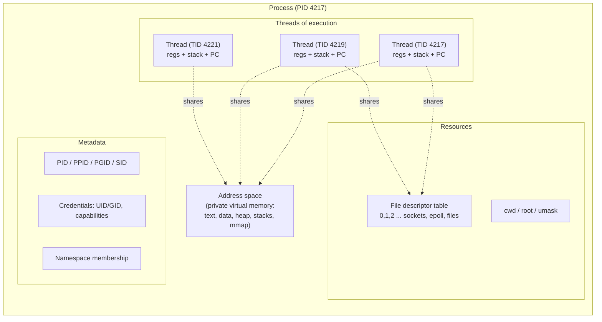
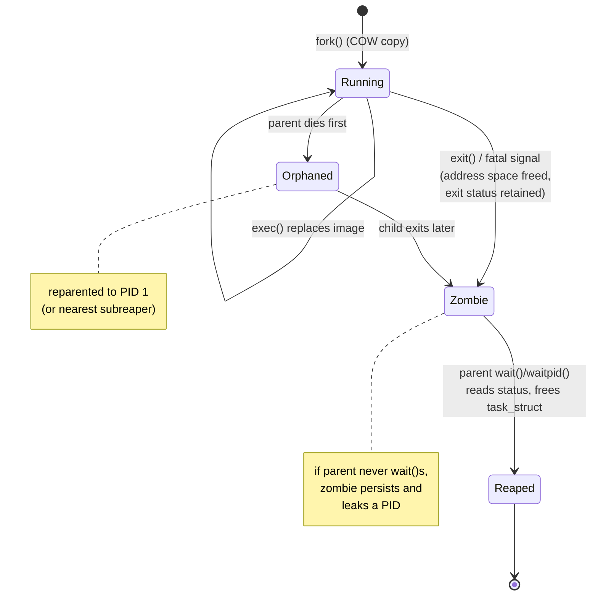
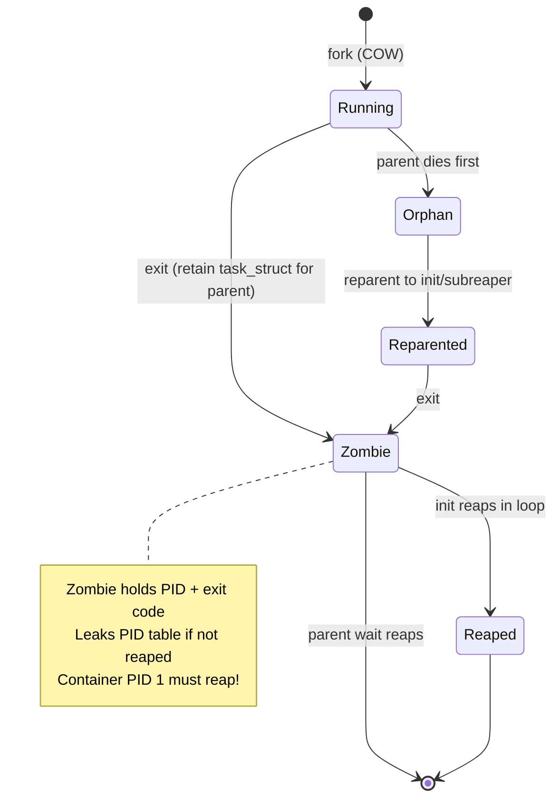
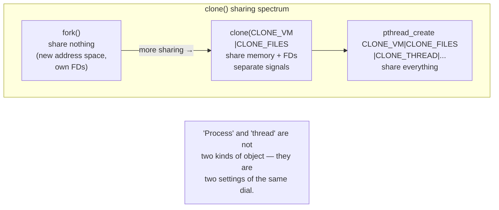
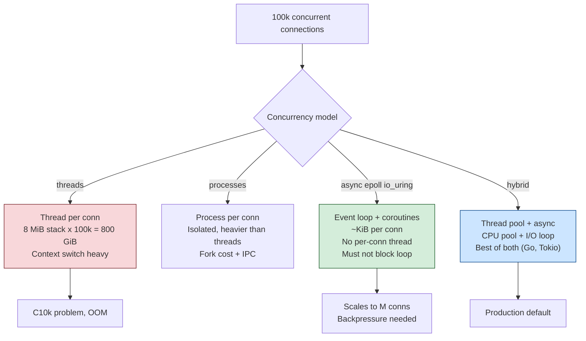
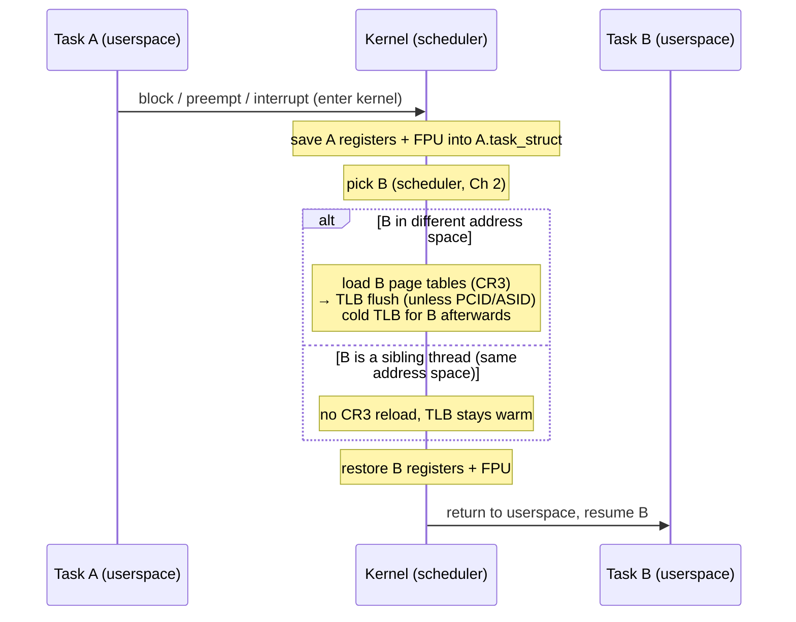
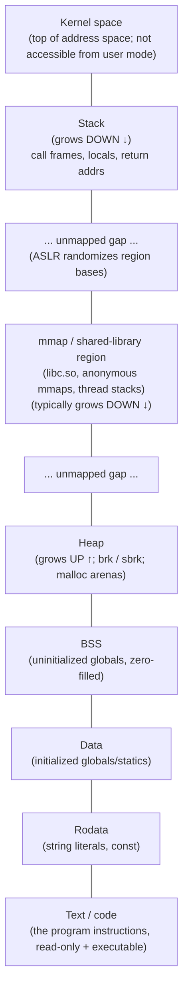

# Chapter 1 — The Process Model: Processes, Threads, and Address Spaces

**What this chapter covers.** This is the opening chapter of a volume about the operating
system as it actually behaves underneath a high-throughput backend service. Everything else
in this volume — scheduling, virtual memory, system calls, I/O models, namespaces — builds
on one foundation: the kernel's model of a *running program*. This chapter builds that
foundation for Linux specifically. You run processes and threads every day. You fork
workers, you size thread pools, you debug a container that leaks zombies, you argue about
threads versus processes versus async. This chapter gives you the kernel-level model those
daily decisions actually rest on: what a process *is* to the kernel, how Linux represents
every schedulable thing as a *task*, how `fork`/`exec`/`wait` and `clone` really work, why
"a thread is just a task that shares memory" is the single most useful sentence you can
memorize about Linux concurrency, and what a context switch costs you.

We are deliberately precise about Linux mechanics, because the abstractions leak in ways
that matter at scale. The difference between a thread and a process on Linux is a bitmask of
sharing flags, not two different kinds of object — and that fact explains everything from
why `fork` is cheap to why a PID namespace's init must reap zombies.

Learning goals — after this chapter you should be able to:

- Define a Linux process as the tuple of an *address space*, one or more *threads of
  execution*, a set of *resources* (file descriptors, etc.), and *metadata* (PID,
  credentials, namespaces), and explain why the process is the unit of resource ownership
  and isolation.
- Describe the kernel's actual representation — the `task_struct` per schedulable entity —
  and the distinction between a kernel task PID and the userspace PID/TID (`getpid` vs
  `gettid`, `pid` vs `tgid`).
- Explain the `fork`/`exec`/`wait` lifecycle precisely: copy-on-write, why Unix splits
  process creation from program loading, what a zombie is, and why some process must reap.
- State the unifying insight: `fork` and `pthread_create` are both `clone` with different
  sharing flags, and place "process" and "thread" as two points on a spectrum of sharing.
- Reason about the threads-vs-processes-vs-async decision for a backend service, and about
  context-switch cost (including TLB effects) as a real performance factor.
- Read a process's virtual-memory map and its credentials, and connect PID 1 / zombie
  reaping to a concrete container gotcha.

## What a process is

Ask ten engineers what a process is and you get "a running program." That is true and
useless. To the kernel, a process is a *container for resources* — the noun the kernel hangs
everything else on. Concretely, a Linux process is the bundle of four things:

- **An address space.** A private virtual address space: the set of virtual-to-physical
  mappings that define what memory the program can see and touch. This is where the code,
  the globals, the heap, and the stacks live. The address space is the strongest isolation
  boundary the hardware and kernel jointly provide: process A cannot read or corrupt process
  B's memory, because the page tables simply do not map it. Virtual memory is the subject of
  Chapter 3; here we treat the address space as the first-class thing a process owns.

- **One or more threads of execution.** A thread is an execution context: a program counter,
  a register set, and a stack, scheduled onto a CPU. A process always has at least one
  thread. Multiple threads in a process share the one address space. On Linux, as we will
  see, each thread is itself a scheduler-visible task.

- **Resources.** Open file descriptors (which point at open files, sockets, pipes, epoll
  instances, `eventfd`s, `timerfd`s — nearly everything in Linux is a file), the current and
  root directory, the umask, memory mappings, timers, and so on. File descriptors are the
  most important: they are small integers indexing a per-process table of open file
  descriptions, and they are the handles through which a backend service talks to the
  outside world.

- **Metadata.** The process identifier (PID), the parent PID, credentials (user and group
  IDs, capabilities), scheduling parameters, resource limits (`rlimit`), signal state, and
  namespace membership. This is the bookkeeping that makes the process a governable unit —
  the thing you can `kill`, `nice`, `cgroup`, `setuid`, or place in a namespace.

The reason to hold all four in your head at once is that *the process is the unit of both
resource ownership and isolation*. When we discussed isolation as a security boundary in
Book 1, Chapter 10, the address space plus credentials plus namespaces are exactly what that
boundary is made of at the OS level. When a container "runs a process," it is this tuple —
address space, threads, FDs, metadata — that the container runtime configures.



The threads share the address space and the FD table; each has its own stack and registers.
Hold that picture — the rest of the chapter is essentially an elaboration of it.

## The kernel's view: everything is a task

Here is the first place Linux differs from the textbook. Classic OS courses describe a
"process control block" (PCB) per process and a separate "thread control block" per thread.
Linux does not work that way. **Linux has exactly one kind of schedulable object: the
task.** Each task is represented by a `struct task_struct`, an enormous structure defined in
`include/linux/sched.h`. There is no separate process object. A "process" is an emergent
concept — a *group of tasks that happen to share the right things* — not a distinct kernel
structure.

Every schedulable entity — what userspace calls a thread — is one `task_struct`. A
single-threaded process is one task. A process with eight threads is eight `task_struct`s
that share an address space and other resources. The scheduler (Chapter 2) schedules tasks,
full stop; it does not know or care whether a task is "a process" or "a thread."

### PID versus TID: `pid` and `tgid`

This design creates a naming problem that trips up almost everyone the first time. Inside
the kernel, each `task_struct` has:

- a `pid` field — a unique per-task identifier, and
- a `tgid` field — the *thread group ID*.

The thread group is the set of tasks that constitute one userspace process. The first task
created — the thread group leader — has `pid == tgid`. Every additional thread created in
that process gets its own unique `pid` but inherits the leader's `tgid`.

Now the mapping to what userspace calls things:

- `getpid()` returns the **`tgid`** — the process ID that is stable across all threads. All
  threads in a process see the same `getpid()`.
- `gettid()` returns the **`pid`** — the unique per-thread kernel task ID, what tools and
  `/proc` call the *thread ID* (TID).

So the kernel's `pid` is the userspace TID, and the kernel's `tgid` is the userspace PID.
The naming is historically backwards, but the model is clean: a process is a thread group,
identified by the leader's TID, and every thread has its own TID. You can see this directly:
`/proc/<pid>/task/` lists one directory per thread, each named by its TID.

```
$ ps -T -p 4217
  PID  SPID TTY          TIME CMD
 4217  4217 pts/3    00:00:01 server       # thread group leader: pid==tgid
 4217  4219 pts/3    00:00:00 server       # worker thread, own TID
 4217  4221 pts/3    00:00:00 server       # worker thread, own TID
```

### The process tree, PID 1, and reparenting

Processes form a tree by parentage. Every process except the first records a parent PID
(PPID); `fork` creates a child whose parent is the caller. At the root of the tree sits **PID
1**, the `init` process, started by the kernel at boot (Chapter 12 covers `systemd` as the
modern PID 1). PID 1 is special in several ways we will return to.

When a process exits, its children do not die with it — they become **orphans**. An orphan
must still have a parent (the tree must stay connected and someone must eventually reap it),
so the kernel *reparents* orphans. By default they are reparented to PID 1. Since Linux 3.4,
a process can call `prctl(PR_SET_CHILD_SUBREAPER)` to volunteer as a "subreaper," so that its
orphaned descendants reparent to *it* rather than all the way up to PID 1 — this is how
`systemd` user sessions and some container supervisors keep process subtrees under their own
management. The reparenting mechanism is exactly why a container's init matters, as we will
see under zombies.

### Process groups and sessions

Two more groupings sit alongside the parent/child tree, and both matter for signals and job
control (Chapter 8):

- A **process group** is a set of related processes, identified by a process group ID
  (PGID). It is the unit of *signal delivery for job control*: sending a signal to `-PGID`
  delivers it to every member. When your shell runs `cmd1 | cmd2 | cmd3`, all three land in
  one process group so that Ctrl-C hits the whole pipeline.

- A **session** is a collection of process groups, identified by a session ID (SID), created
  with `setsid()`. A session may have a *controlling terminal*; one process group in the
  session is the *foreground* group (receives terminal-generated signals), the rest are
  background. Daemons call `setsid()` precisely to escape a controlling terminal so they
  are not killed when it closes.

These groupings are why "who receives this signal" is more subtle than "the process I named."
We defer the full treatment to Chapter 8, but note them here because PGID and SID are part of
the process metadata the kernel tracks per task.

## The process lifecycle: fork, exec, wait

Unix creates processes with a design that surprises engineers coming from other systems:
process *creation* and program *loading* are two separate operations. `fork()` duplicates the
calling process; `execve()` replaces the current program image with a new one. You almost
always do them together — fork, then exec — but the split is deliberate and, it turns out,
deeply useful.

### fork() and copy-on-write

`fork()` creates a new process that is a near-exact duplicate of the caller. The child gets a
copy of the parent's address space, a copy of its file descriptor table (the descriptors are
duplicated, so parent and child share the *open file descriptions* and thus file offsets),
its credentials, and so on. `fork` returns twice: it returns the child's PID in the parent,
and `0` in the child. That is how each side knows which it is.

Copying an entire address space eagerly would make `fork` catastrophically expensive — a
multi-gigabyte process would take forever to duplicate, and most of that copy would be
pointless because the child usually calls `exec` immediately and throws the whole image away.
Linux avoids this with **copy-on-write (COW)**. At `fork`:

1. The kernel copies the *page tables*, not the *pages*. Parent and child page tables point
   at the same physical frames.
2. Every writable page in both processes is marked **read-only** in the page tables.
3. Both processes run, reading shared physical pages happily.
4. The instant either process *writes* a shared page, the CPU raises a page fault. The
   kernel's fault handler sees a write to a COW page, allocates a fresh physical frame,
   copies the page's contents into it, remaps the faulting process's page to the private
   copy (now writable), and resumes. Only the pages actually written are ever duplicated.

This makes `fork` cheap-*ish*: its cost is proportional to the size of the page tables, not
the size of the address space. A large process still pays to copy its page-table hierarchy
(and to take those first write faults), which is one reason `fork` in a huge multi-gigabyte
JVM or a database can be noticeably slow and why the `fork()`-based `multiprocessing` start
method in Python has to be used carefully. But it is vastly cheaper than a full copy, and it
is the reason the fork-then-exec idiom is affordable.

COW has one more famous consequence worth internalizing: `fork` in a *multithreaded* process
is a minefield. `fork` duplicates only the calling thread; the child has a single thread but
inherits the full memory image, including any mutexes that other threads held at the instant
of the fork. Those locks can never be released in the child. This is why POSIX restricts a
child between `fork` and `exec` to *async-signal-safe* functions only, and why fork-without-exec
in a threaded program is a known source of deadlocks.

### exec(): replacing the program

`execve()` (and its `libc` front-ends `execl`, `execvp`, etc.) does the opposite of `fork`:
it keeps the process — same PID, same PPID, same open file descriptors (unless marked
close-on-exec, `O_CLOEXEC`), same credentials subject to setuid rules — but *discards the
entire address space* and loads a new program in its place. The old text, data, heap, and
stack are gone; the kernel maps in the new executable's segments, sets up a fresh stack with
the new `argv`/`envp`, and jumps to the new entry point. `exec` does not return on success —
there is nothing to return to.

The fork-then-exec pattern, then, is: `fork` to get a new process that is a copy of the
shell/server, then `exec` in the child to become the target program, while the parent keeps
running. The child inherits the parent's file descriptors, which is precisely how a shell
wires up pipelines and redirections: it `fork`s, rearranges FDs 0/1/2 with `dup2` in the
child *before* `exec`, and the new program starts with stdin/stdout/stderr already pointing
where the shell wants them.

Why separate the two operations at all? Because the gap between `fork` and `exec` is where
the child — running as a copy of the parent, with the parent's privileges — can *set up the
environment for the new program*: redirect file descriptors, change the working directory,
drop privileges (`setuid`/`setgid`), adjust signal dispositions, join namespaces, set
resource limits. A combined "spawn" call would need every one of those as a parameter. Unix
instead says: fork gives you a fully-configurable copy of yourself; do whatever setup you
like with ordinary syscalls; then exec. That is why Unix never needed a baroque
`CreateProcess` with dozens of arguments. The cost is the expense and multithreading hazards
of `fork`, which is why `posix_spawn()` (often implemented over `clone`/`vfork`) exists as a
fast path for the common "fork+exec with a little setup" case.

### wait(), zombies, and reaping

When a process exits (via `exit()`, returning from `main`, or a fatal signal), it does not
vanish. The kernel tears down its address space, closes its file descriptors, and releases
most of its resources — but it *retains* a small husk of the `task_struct` holding the exit
status (the return code or terminating signal). The process is now in state **`EXIT_ZOMBIE`**
(shown as `Z` and `<defunct>` in `ps`). It exists only so its parent can retrieve the exit
status.

The parent retrieves it by calling `wait()` / `waitpid()` / `waitid()`. This is called
**reaping**: the parent reads the child's exit status, and *then* the kernel finally frees
the last of the child's `task_struct`. A reaped child is gone. An unreaped terminated child
stays a zombie forever.

Zombies consume almost no memory, but they hold a **PID**, and PIDs are a finite resource
(`/proc/sys/kernel/pid_max`). A process that forks children and never `wait`s leaks PIDs; a
busy server doing this exhausts the PID space and then *nothing on the machine can fork* —
`fork` returns `EAGAIN`, and the box is effectively dead until the leak is cleared. Zombie
leaks are a classic production incident.

Two cases determine who reaps:

- **Normal case.** The parent outlives the child and calls `wait`. Clean.
- **Orphan case.** The parent dies first. The child (alive or already a zombie) is reparented
  to PID 1 (or the nearest subreaper). Well-behaved inits **reap in a loop** — they call
  `wait` repeatedly to clear any child that reparents to them. This is a *core
  responsibility* of PID 1.



**The container gotcha.** This is not academic trivia — it is one of the most common
container bugs. In a container, the process the runtime launches becomes **PID 1 inside the
container's PID namespace** (Chapter 9). If your entrypoint is an application that was never
written to be an init — say, a shell script that execs your server, or a server that spawns
subprocesses — then *it* is PID 1, and it inherits PID 1's reaping duty. Most applications
never call `wait` for children they did not directly create, so any process that reparents to
them becomes an immortal zombie. Over time the container accumulates zombies and can exhaust
PIDs. PID 1 also has *special signal semantics*: the kernel does not apply default signal
dispositions to PID 1, so a naive PID 1 that installs no handler will ignore `SIGTERM`
entirely — which is why `docker stop` on such a container hangs for ten seconds and then
`SIGKILL`s it. The fix is a tiny real init as PID 1: `tini` (shipped as Docker's `--init`),
`dumb-init`, or `s6`. They do two jobs: reap orphaned zombies in a `wait` loop, and forward
signals to the real application. We revisit this in Book 6 on cloud-native security and in
Chapter 9; for now, remember: **a container's PID 1 must reap.**




## clone(): the primitive under fork and threads

We have described `fork` (new process) and, shortly, `pthread_create` (new thread) as if they
were different mechanisms. On Linux they are the same mechanism. Both are thin wrappers over
one syscall: **`clone()`**. This is the unifying insight of the whole chapter.

`clone()` creates a new task. What makes the new task a "child process" versus a "thread" is
entirely a set of **sharing flags** you pass. Each flag says "share this resource with the
caller instead of copying it":

| `clone` flag | Meaning when set |
|---|---|
| `CLONE_VM` | Share the address space (same page tables) — the defining flag of a thread |
| `CLONE_FILES` | Share the file-descriptor table |
| `CLONE_FS` | Share filesystem info: cwd, root directory, umask |
| `CLONE_SIGHAND` | Share the table of signal handlers |
| `CLONE_THREAD` | Same thread group (same `tgid`) — makes it a thread, not a child process |
| `CLONE_SYSVSEM` | Share System V semaphore adjustments |
| `CLONE_SETTLS` | Set up a new thread-local-storage area for the new task |
| `CLONE_PARENT_SETTID` / `CLONE_CHILD_CLEARTID` | Machinery for `pthread_join` via a futex |
| `CLONE_NEWNS`, `CLONE_NEWPID`, `CLONE_NEWNET`, … | Create *new* namespaces (the container primitives, Chapter 9) |

Now the two familiar operations are just two points in this flag space:

- **`fork()`** ≈ `clone` with *none* of the sharing flags (only `SIGCHLD` so the parent is
  notified on exit). Nothing is shared: the child gets its own COW copy of the address space,
  its own FD table, its own signal handlers. Two independent processes.

- **`pthread_create()`** ≈ `clone` with `CLONE_VM | CLONE_FS | CLONE_FILES | CLONE_SIGHAND |
  CLONE_THREAD | CLONE_SYSVSEM | CLONE_SETTLS | CLONE_PARENT_SETTID | CLONE_CHILD_CLEARTID`.
  Everything is shared: same address space, same FDs, same signal handlers, same thread
  group. A new thread.



Between the extremes lies a continuum most engineers never touch but which the kernel fully
supports: you can share memory but not FDs, share FDs but not memory, and so on. `vfork()` is
another point — it shares the address space and *suspends the parent* until the child execs
or exits, an optimization for the fork-immediately-exec case that predates COW. The takeaway
is conceptual and permanent: **on Linux, "process" and "thread" are not two kinds of object.
They are two configurations of one object — a task — distinguished by how much they share.**

## Threads on Linux

With `clone` understood, Linux threading is almost anticlimactic. A **thread is a task that
shares an address space** (and FDs, signal handlers, and thread-group identity) with its
siblings. There is no special "thread" kernel object. This is different from some other
kernels that maintain a heavyweight process object with lightweight threads dangling off it;
on Linux the thread *is* a first-class scheduler task, and the process is the group.

### 1:1 threading (NPTL)

Modern Linux uses the **1:1 threading model**: every userspace thread maps to exactly one
kernel task. This is implemented by **NPTL**, the Native POSIX Thread Library, which replaced
the older, badly-broken LinuxThreads around Linux 2.6 (2003) and is part of `glibc`. Under
1:1, when you `pthread_create`, the library calls `clone` and the kernel gets a new
schedulable task; the kernel scheduler multiplexes those tasks across CPUs directly.

The historical alternative was **M:N threading**: map M userspace threads onto N kernel
threads via a userspace scheduler. Linux tried it (the NGPT project) and abandoned it: M:N
interacts terribly with blocking syscalls, signals, priorities, and the kernel scheduler, and
was not worth the complexity once kernel tasks were made cheap enough. So Linux is firmly
1:1. (Language runtimes that want cheap "threads" — Go goroutines, Java virtual threads —
build an *M:N-like* userspace scheduler on *top* of 1:1 kernel threads, to get the
cheap-userspace-switch benefit without the kernel-level problems. That is a runtime concern,
Volume 4; the kernel still sees one task per OS thread.)

### What is shared, what is per-thread

Because a thread is a task sharing selected resources, "what's shared vs. per-thread" is just
a reading of the `clone` flags plus a few architectural facts:

| Resource | Shared across threads? | Notes |
|---|---|---|
| Address space (code, globals, heap, mmaps) | **Shared** | `CLONE_VM` — one set of page tables |
| Open file descriptors | **Shared** | `CLONE_FILES` — one FD table; closing in one affects all |
| Signal handlers (dispositions) | **Shared** | `CLONE_SIGHAND` — one handler table |
| cwd, root dir, umask | **Shared** | `CLONE_FS` |
| PID (`tgid`) | **Shared** | All threads report the same `getpid()` |
| Credentials (UID/GID) | Shared *by POSIX* | Kernel `cred` is per-task; `glibc` broadcasts changes (see below) |
| Stack | **Per-thread** | Each thread has its own stack (main thread's on the classic stack; others `mmap`ed) |
| Registers / instruction pointer | **Per-thread** | The execution context itself |
| Thread ID (`gettid`) | **Per-thread** | Unique kernel `pid` |
| Thread-local storage (TLS) | **Per-thread** | `CLONE_SETTLS`; `errno` lives here |
| Signal mask | **Per-thread** | Each thread can block signals independently (`pthread_sigmask`) |
| Scheduling priority / affinity | **Per-thread** | Set per task |
| `errno` | **Per-thread** | It is a TLS macro, not a global, precisely for this reason |

Two subtleties worth carrying:

- **`errno` is per-thread.** In a threaded program `errno` is not a global variable; it
  expands to a per-thread location in TLS. If it were shared, one thread's failed syscall
  would clobber another's error code. This is invisible in your C but essential to
  correctness.

- **Credentials are per-task in the kernel, per-process in POSIX.** The kernel stores
  credentials in each `task_struct`, and the raw `setuid` syscall changes only the *calling*
  thread. But POSIX mandates that `setuid()` affect the whole process. `glibc` bridges the
  gap: its `setuid()` wrapper uses an internal real-time signal to make every thread perform
  the credential change, so the process-wide semantics hold. It is a good example of the
  Linux "threads are tasks" model poking through an abstraction that pretends otherwise.

## Threads vs. processes vs. async for backend concurrency

Now the decision you actually make. A backend service that handles concurrent requests must
choose a concurrency substrate, and the process model gives you three fundamental options,
often combined. This is one of the most consequential architectural choices a service makes,
so it deserves a clear-eyed comparison.

| Dimension | Threads (one process, many threads) | Processes (many processes) | Async / event loop (one thread, many connections) |
|---|---|---|---|
| Communication | Shared memory — cheap, direct | IPC required: pipes, sockets, shared mem (Ch 8) | Shared memory within the thread; no cross-thread needed |
| Isolation / fault domain | **Weak** — one thread's memory bug or crash takes down the whole process | **Strong** — a worker crash is contained; the rest survive | Weak — a crash or a blocking call stalls all connections on that loop |
| Memory footprint | Low — one address space, shared code/heap | Higher — N address spaces (COW mitigates shared pages) | Lowest — one stack, per-connection state is small |
| Synchronization complexity | **High** — locks, races, memory model (Vol 4) | Low within a worker — no shared mutable state | Low — cooperative, single-threaded logic |
| CPU parallelism | Yes — threads run on multiple cores | Yes — processes run on multiple cores | **No** — one loop uses one core (run one loop per core) |
| Scaling limit | Context-switch cost and lock contention at high thread counts | Memory and fork cost per worker | Excellent connection scaling; blocked by any blocking call |
| Blast radius of a leak/corruption | Whole process | One worker | Whole process |

A few real architectures make the trade-offs concrete:

- **Thread-per-request** (classic Apache `worker`/`event` MPM, many Java servers): a thread
  handles a connection start to finish. Simple to reason about, but each thread needs a
  stack (often megabytes of reserved address space) and each blocking I/O parks a whole
  thread. This is the model that hit a wall at the **C10K problem** (Dan Kegel's famous
  articulation): ten thousand concurrent connections meant ten thousand threads, and the
  context-switch and memory overhead made that untenable. C10K is the historical pressure
  that drove the industry toward event loops and thread pools — we take it up fully in
  Chapter 7.

- **Multi-process for isolation and to dodge shared state.** **nginx** runs a master process
  plus a small number of **worker processes** (typically one per core), each running an event
  loop. Processes, not threads, so that a worker crash cannot corrupt siblings and so each
  worker is a clean fault domain. **PostgreSQL** forks **one backend process per connection**:
  strong isolation between sessions, and it long predates good threading — the process model
  is baked into its architecture. **Python** services frequently reach for the
  `multiprocessing` module rather than threads for CPU-bound work, because CPython's **Global
  Interpreter Lock (GIL)** serializes bytecode execution across threads in one interpreter;
  to use multiple cores for Python-level compute you need multiple *processes*, each with its
  own interpreter and GIL. (The GIL is a CPython implementation detail — a runtime topic for
  Volume 4 — but it is a first-order reason real Python services are multi-process.)

- **The hybrid: multi-process *and* multi-threaded (and async).** The dominant high-scale
  pattern combines them. A supervisor forks **one worker process per core** (fault isolation,
  no cross-core lock contention, no NUMA-hostile shared heap — see Volume 1, Chapter 6 on
  NUMA), and *within* each worker runs either a small thread pool or an event loop to
  multiplex many connections onto that one core's worth of CPU. Apache's `event` MPM,
  gunicorn with multiple workers each running an async worker class, and Envoy's
  worker-thread-per-core model are all variations on this theme. You get the isolation of
  processes at the granularity where it matters (a core) and the efficiency of shared-memory
  concurrency inside each unit.

The connecting idea — the distributed-systems lens on all of this — is that **multi-process
isolation at the node is the same idea as fault isolation across the distributed system, one
level down.** A distributed system partitions work across nodes so that one node's failure
does not take down the service; a multi-process server partitions work across worker
processes so that one worker's segfault does not take down the node. nginx workers,
PostgreSQL backends, and Python multiprocessing pools are node-level bulkheads, mirroring the
bulkheads you draw between services. The threads-vs-processes-vs-async choice is not a
micro-optimization; it sets the fault-domain granularity and the scaling ceiling of every
node your distributed system runs on.




## Context switching and its cost

The scheduler (Chapter 2) multiplexes many tasks over few CPUs by *switching* between them. A
**context switch** saves the currently-running task's execution state and restores another's.
Understanding what it costs is essential, because "too many runnable threads" is a real and
common performance failure, and the cost is the reason.

What actually happens on a context switch from task A to task B:

1. **Enter the kernel.** A switch happens in kernel mode — triggered by A blocking (a syscall
   that must wait), A being preempted (its timeslice expired, or a higher-priority task woke),
   or an interrupt.
2. **Save A's register state** into A's `task_struct` (kernel stack): general registers,
   program counter, stack pointer, and the FPU/SIMD state.
3. **Switch address space *if B is in a different process*.** If A and B belong to different
   processes, the kernel loads B's page-table base into the MMU — on x86-64, writing the
   `CR3` register. **This is the expensive part.** A naive `CR3` reload *flushes the TLB*
   (the translation lookaside buffer, Volume 1, Chapter 3 / Chapter 10), because the cached
   virtual-to-physical translations belonged to A's address space and are now wrong. After
   the switch, B runs into a cold TLB and pays page-walk costs on its early memory accesses.
4. **Restore B's register state** and return to userspace, resuming B where it left off.



The cost has two components:

- **Direct cost:** the cycles to save/restore registers, run the scheduler, and reload page
  tables. On modern x86 this is on the order of a microsecond or a few, dominated by the
  register/FPU save-restore and the address-space switch.

- **Indirect cost — usually larger:** cache and TLB pollution. When B runs, the L1/L2 caches
  and the TLB are full of A's data. B suffers a burst of cache and TLB misses warming up its
  working set, and A pays again when it is switched back in. This *indirect* cost does not
  show up in a simple "time to switch" microbenchmark but dominates in practice, especially
  when many tasks with large working sets rotate through a core. This is the mechanical
  reason a machine can be "busy" with context switches and yet get little useful work done —
  the caches never stay warm.

Two crucial refinements:

- **Thread-to-thread within a process is cheaper than process-to-process.** Sibling threads
  share page tables, so step 3 is skipped — no `CR3` reload, no TLB flush. The TLB stays
  valid across the switch. This is one concrete efficiency advantage of threads over
  processes, and it is why intra-process concurrency has a lower per-switch tax.

- **PCID/ASID soften the flush.** Modern x86-64 CPUs support **PCID** (Process Context
  Identifiers; ARM calls the analogous feature ASID), which tags TLB entries with an
  address-space identifier. With PCID, switching address spaces need *not* flush the whole
  TLB — the CPU keeps A's and B's entries side by side, distinguished by tag, so a later
  switch back to A finds warm entries. The Linux kernel uses PCID, and it materially reduced
  context-switch cost — a benefit that became conspicuous when the Meltdown mitigation (KPTI,
  kernel page-table isolation) forced extra address-space switches on every syscall and PCID
  was what kept that overhead survivable.

The kernel distinguishes **voluntary** context switches (a task blocks on I/O, a lock, or
`sleep` — it *gives up* the CPU) from **involuntary** ones (the scheduler *preempts* a
runnable task, e.g. its timeslice expired). You can read both counts per process in
`/proc/<pid>/status` as `voluntary_ctxt_switches` and `nonvoluntary_ctxt_switches`. High
involuntary counts mean CPU contention — more runnable tasks than cores, everyone getting
preempted; high voluntary counts mean lots of blocking, often on I/O or locks. This
distinction is a first diagnostic when a service is slow.

Do not confuse a context switch with a **user-kernel transition** (a mode switch). A syscall
(Chapter 5) crosses from user mode to kernel mode on the *same* task — no page-table switch,
no scheduler, no register hand-off to a different task. It is far cheaper than a context
switch (tens of nanoseconds to a few hundred, versus a microsecond-plus), though KPTI made
even mode switches pricier. Every context switch involves kernel entry, but most kernel
entries are *not* context switches.

The distributed-systems consequence closes the loop with the concurrency-model section:
**context-switch cost is why thread-per-request does not scale to C10K, and why the industry
moved to event loops and bounded thread pools.** If every one of ten thousand connections
owns a thread, and thousands are runnable, the core spends its time switching and polluting
caches instead of serving requests. An event loop (Chapter 7) inverts this: one thread stays
resident, keeps its caches warm, and multiplexes thousands of connections with *no* context
switch between them — you switch stack frames and state machines in userspace, not tasks in
the kernel. Sizing thread pools to roughly the core count, rather than the connection count,
is the same insight applied to threaded servers. The process model is what makes the cost
real; the I/O model (Chapter 7) is how you dodge it.

## The process memory layout

A process's address space is not an undifferentiated blob; it is a set of **regions** (the
kernel calls them virtual memory areas, VMAs), each with its own permissions and purpose.
Knowing the classic layout lets you read a crash address, a memory map, or a
`/proc/<pid>/maps` dump and immediately know *what* was at fault. Chapter 3 covers how these
mappings are backed by physical memory and paging; here is the layout itself, for a 64-bit
Linux process, from low addresses to high:



Region by region:

- **Text (code).** The machine instructions, mapped read-only and executable from the binary.
  Read-only so the code cannot be rewritten, and so the same physical pages are shared across
  every process running the same binary — run a hundred copies of a server and they share one
  physical copy of the text.
- **Rodata / Data / BSS.** Read-only constants (`rodata`); initialized global and static
  variables (`data`, loaded from the binary); and **BSS**, the zero-initialized globals,
  which take *no space in the file* (the loader just maps zero-filled pages) but do take
  address space and memory once touched.
- **Heap.** Dynamically allocated memory, classically grown *upward* by moving the "program
  break" with `brk`/`sbrk`. In practice `malloc` (Chapter 4) also uses `mmap` for large
  allocations and per-thread arenas, so the neat "heap grows up" picture is only part of the
  story — but the brk-managed heap still exists.
- **mmap region.** Where shared libraries (`libc.so` and friends), large `malloc` chunks,
  file mappings, and **the stacks of non-main threads** live. When you `pthread_create`, the
  new thread's stack is `mmap`ed here, not carved from the main stack. This region typically
  grows downward from below the stack.
- **Stack.** The main thread's call stack, growing *downward*. Each function call pushes a
  frame (return address, saved registers, locals); it unwinds on return. It grows on demand
  up to a limit (`RLIMIT_STACK`, commonly 8 MB); overrun that and you get the segfault every
  engineer has met via infinite recursion — or, historically, a stack-clash attack.
- **Kernel space.** The top of the address space is reserved for the kernel and simply not
  accessible from user mode; a user access there faults. It is mapped into every process so
  that syscalls and interrupts can run without a full address-space switch (a design that
  Meltdown/KPTI complicated, as noted above).

**ASLR** (Address Space Layout Randomization) randomizes the base of the stack, the mmap
region, the heap, and — for position-independent executables — the text, so that an attacker
cannot predict where anything lives. This is why the addresses in two runs of the same
program differ, and why the gaps in the diagram exist.

Note the per-thread multiplicity: there is *one* text, *one* data/BSS, *one* heap — but *one
stack per thread*. Each thread's stack is a separate region; the shared heap is where threads
communicate. That single fact is the memory-layout expression of "threads share the address
space but each has its own stack," and it is exactly why passing a pointer to a stack-local
variable to another thread is a bug waiting to happen: that thread is reaching into a
region that belongs to a different execution context.

You can read all of this live:

```
$ cat /proc/self/maps
55e3c1a00000-55e3c1a01000 r--p 00000000 fe:01 ...   /usr/bin/cat      # text (r--/r-xp)
55e3c1a01000-55e3c1a05000 r-xp 00001000 fe:01 ...   /usr/bin/cat
...
55e3c2b1f000-55e3c2b40000 rw-p 00000000 00:00 0     [heap]
7f9a2c000000-7f9a2c028000 r-xp ...                  /usr/lib/libc.so.6  # mmap'd library
7ffe1b2c0000-7ffe1b2e1000 rw-p 00000000 00:00 0     [stack]
ffffffffff600000-... --xp ...                       [vsyscall]
```

Each line is a VMA: address range, permissions (`r/w/x`, `p`rivate or `s`hared), and what
backs it. This is the single most useful file for understanding a process's memory at
runtime.

## Credentials, capabilities, and namespaces

The last piece of the process tuple is the metadata that governs *what a process is allowed
to do* — the subject of least-privilege design (Book 1, Chapter 10; Book 6). Briefly, because
these thread through the rest of the volume:

- **User and group IDs.** Each task carries a real, effective, and saved UID and GID, plus
  supplementary groups. The *effective* UID is what permission checks use; the *real* UID is
  who you are; the *saved* UID lets a program temporarily drop and later regain privilege.
  UID 0 is `root`. The fork-then-exec window is exactly where a service *drops privileges* —
  a server may bind port 443 as root, then `setuid` to an unprivileged account before serving
  requests, so a compromise cannot exploit root.

- **Capabilities.** Linux breaks the monolithic power of root into ~40 discrete
  **capabilities** — `CAP_NET_BIND_SERVICE` (bind ports below 1024), `CAP_NET_ADMIN`,
  `CAP_SYS_ADMIN` (dangerously broad), `CAP_CHOWN`, and so on. A process can hold a subset,
  so you can grant a service exactly the privilege it needs and nothing more. This is the
  least-privilege lever containers pull: a container runtime drops all capabilities and adds
  back only the few required, so a "root" process inside a container is far weaker than real
  root. `prctl(PR_SET_NO_NEW_PRIVS)` further guarantees that no `exec` can *gain* privilege,
  closing setuid-binary escalation.

- **Namespaces.** Each task points (via `nsproxy`) at a set of **namespaces** — PID, mount,
  network, UTS, IPC, user, cgroup, time — that virtualize what the process can *see* of the
  system. Two processes in different PID namespaces have different views of the process tree
  (and each namespace has its own PID 1, connecting straight back to the reaping discussion).
  Namespaces are created with the `CLONE_NEW*` flags to `clone` — the very same syscall that
  makes threads and processes. This is not a coincidence: **a container is a process (or
  process tree) created by `clone` with new-namespace flags, running with dropped
  capabilities and a cgroup limit.** Chapter 9 builds the full container out of exactly these
  primitives. The process model *is* the container model; containers are not a separate
  technology bolted on, but a particular configuration of the task/clone machinery this
  chapter describes.

## Distributed-systems lens

Pull the threads together (so to speak). The process/thread model is the **per-node
concurrency substrate** on which every backend service runs, and its details propagate all
the way up to system architecture:

- **The concurrency-model choice sets the node's scaling ceiling and fault granularity.**
  Threads vs. processes vs. async (fleshed out in Chapter 7) is not an implementation detail;
  it decides how many connections a node serves, how a crash is contained, and how much
  synchronization complexity your code carries. Every service in your fleet made this choice,
  and it shows up in their tail latency and their failure modes.

- **Context-switch cost drove an industry-wide architectural shift.** C10K was, mechanically,
  a context-switch and per-thread-memory wall. The move to event loops (nginx, Node, async
  runtimes) and bounded thread pools is the process model's cost structure expressed as
  architecture. When you choose an async framework, you are choosing to *not pay* the
  context-switch and TLB-pollution tax this chapter quantified.

- **Multi-process isolation is node-level bulkheading.** nginx workers, PostgreSQL backends,
  and Python multiprocessing pools isolate faults at the process boundary the same way you
  isolate faults at the service boundary in a distributed system. The address space is a
  bulkhead; the fleet is bulkheads all the way up.

- **PID 1 / zombie reaping is a real container operational hazard.** The kernel's reaping
  contract — orphans reparent to PID 1, PID 1 must `wait` — becomes your problem the moment
  your app is a container's PID 1. The `tini`/`dumb-init` pattern exists solely to satisfy a
  process-model invariant. Miss it and you leak PIDs or ignore `SIGTERM`; Book 6 and Chapter
  9 return to this.

- **Containers are the process model, configured.** Namespaces, capabilities, and cgroups are
  attributes of tasks. The isolation your distributed system leans on at the node — one
  tenant's container cannot see another's — is the address space, credentials, and namespace
  membership of ordinary Linux tasks. There is no magic layer; there is `clone` with the
  right flags.

The rest of this volume zooms into each facet: how the scheduler picks among tasks (Chapter
2), how the address space maps to physical memory (Chapter 3), how the user-kernel boundary
is crossed (Chapter 5), how threads and processes actually talk (Chapter 8), and how
namespaces and cgroups turn tasks into containers (Chapter 9). All of it stands on the model
in this chapter: a process is an address space plus threads plus resources plus metadata, and
on Linux, every one of those threads is a task, and every task — thread, process, or
container init — was born from `clone`.

## Key takeaways

- **A Linux process is a tuple:** a private *address space*, one or more *threads of
  execution*, a set of *resources* (file descriptors, cwd, timers), and *metadata* (PID,
  credentials, namespaces). It is the unit of both resource ownership and isolation.
- **Linux has one schedulable object: the task (`task_struct`).** A "process" is a *thread
  group* — tasks sharing an address space and identity. The kernel's `pid` is the userspace
  **TID** (`gettid`); the kernel's `tgid` is the userspace **PID** (`getpid`).
- **`fork` is cheap-ish because of copy-on-write:** it copies page tables, marks pages
  read-only, and duplicates a page only when it is first written. **`exec` replaces the
  address space** with a new program. Unix splits them so the child can configure the
  environment (redirect FDs, drop privilege, join namespaces) in the gap before `exec`.
- **A terminated-but-unreaped child is a zombie**, holding a PID until its parent `wait`s.
  Orphans reparent to PID 1 (or a subreaper), which is why **a container's PID 1 must reap** —
  the `tini`/`dumb-init` pattern — and must forward signals.
- **`fork` and `pthread_create` are both `clone` with different sharing flags.** A thread is
  a task that shares the address space (`CLONE_VM`), FDs, signal handlers, and thread-group
  identity; a process shares nothing. "Process" and "thread" are two settings of one dial.
- **Linux threading is 1:1 (NPTL):** one kernel task per userspace thread, `glibc`-backed,
  having replaced M:N. Threads share the address space, FDs, and signal handlers; each has
  its own stack, registers, TID, TLS (`errno` lives there), and signal mask.
- **Choose threads vs. processes vs. async deliberately:** threads give cheap shared-memory
  communication at the cost of a shared fault domain and synchronization complexity;
  processes give isolation at the cost of IPC; async gives connection scaling on one core.
  Real high-scale servers are hybrids — one process per core, a loop or pool inside.
- **Context switches are expensive** — direct register/page-table cost plus larger *indirect*
  cache/TLB pollution. Cross-process switches reload page tables (`CR3`, TLB flush unless
  PCID); sibling-thread switches do not. Too many runnable threads is a real performance
  failure and the mechanical root of C10K.
- **The address space has structured regions** — text, rodata, data, BSS, heap, mmap
  (libraries + thread stacks), stack, kernel — randomized by ASLR and readable in
  `/proc/<pid>/maps`. One heap, one text, but one stack per thread.
- **Credentials, capabilities, and namespaces are task attributes.** Containers are not a
  separate mechanism: a container is a task created by `clone` with new-namespace flags,
  reduced capabilities, and a cgroup limit. The process model *is* the container model.

## Further reading

- **The Linux Programming Interface**, Michael Kerrisk, No Starch Press, 2010. The definitive
  practitioner's reference for the Linux/Unix process model — `fork`, `exec`, `wait`, `clone`,
  threads, credentials, process groups and sessions. Chapters 24–28 and 33–35 cover this
  chapter's material in exhaustive, accurate detail.
- **Linux `man` pages**, section 2/3: `fork(2)`, `execve(2)`, `wait(2)`, `clone(2)`,
  `pthreads(7)`, `credentials(7)`, `capabilities(7)`, `pid_namespaces(7)`, and `proc(5)` (for
  `/proc/<pid>/maps` and `/proc/<pid>/status`). The `clone(2)` and `pthreads(7)` pages in
  particular document the exact sharing flags and the 1:1 NPTL model.
- **Understanding the Linux Kernel**, 3rd ed., Bovet and Cesati, O'Reilly, 2005, and
  **Professional Linux Kernel Architecture**, Wolfgang Mauerer, Wrox, 2008 — for the
  `task_struct`, process descriptor, and scheduler internals at the source level. Dated on
  specifics but sound on the model.
- **Linux Kernel Development**, 3rd ed., Robert Love, Addison-Wesley, 2010. Chapters 3 (process
  management) and 4 (process scheduling) are a concise, accurate tour of tasks, `clone`, and
  the thread-group model.
- Dan Kegel, **"The C10K Problem"** (kegel.com/c10k.html). The historical statement of the
  connection-scaling wall that thread-per-request hit, and the survey of I/O models that
  followed — essential background for Chapter 7.
- Ulrich Drepper, **"The Native POSIX Thread Library for Linux"** (2003) and **"Thread-Local
  Storage Dwarves"** — primary sources on NPTL's 1:1 design and TLS, from one of its authors.
- **"Copy-on-write"** and **PCID/ASID** treatments in the Linux kernel documentation
  (`Documentation/`), and Ulrich Drepper, **"What Every Programmer Should Know About Memory"**
  (2007) for TLB and address-space-switch costs underpinning the context-switch discussion.
- The `tini` and `dumb-init` project READMEs (github.com/krallin/tini,
  github.com/Yelp/dumb-init) for the container PID-1 reaping and signal-forwarding problem,
  and Docker's `--init` documentation.
