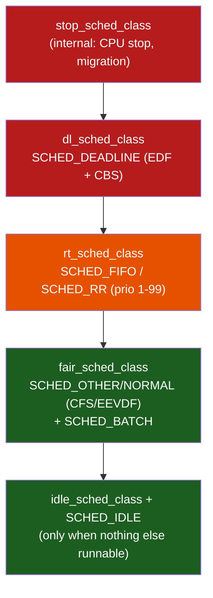
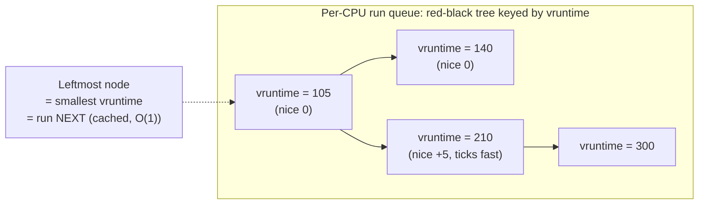
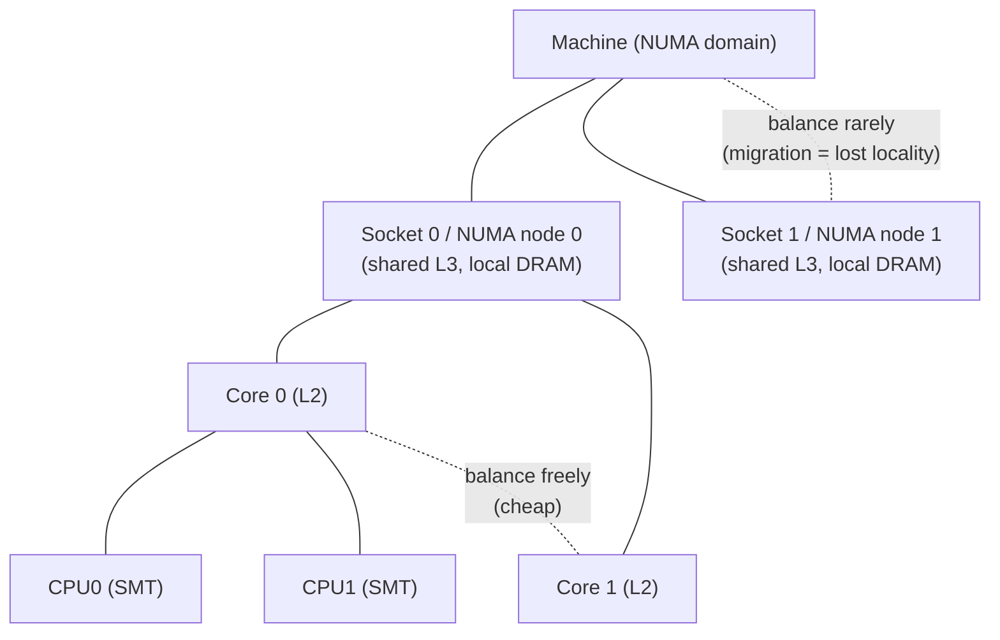
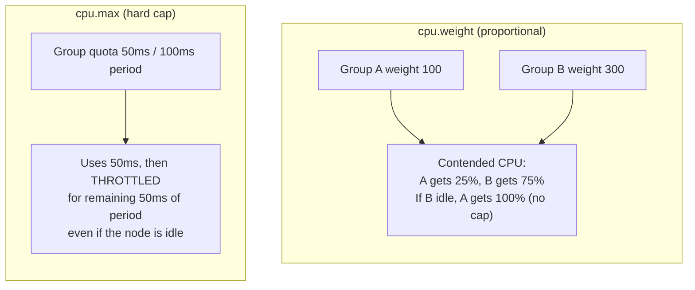
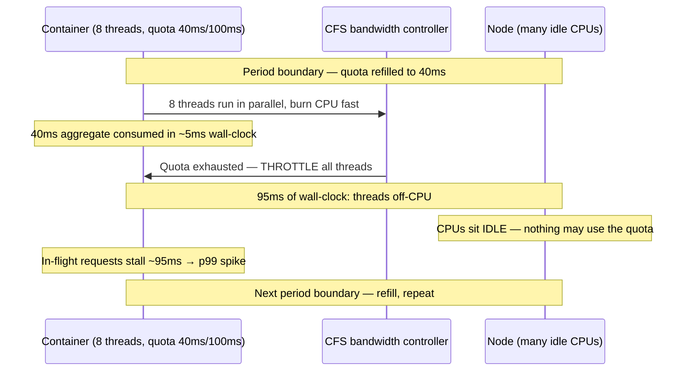

# Chapter 2 — CPU Scheduling: CFS, Real-Time, and cgroup CPU Control

**What this chapter covers.** Chapter 1 gave us the runnable thing — the *task*. This chapter
is about the decision the kernel makes millions of times a second: *given many runnable tasks
and few CPUs, which task runs next, on which CPU, for how long?* That decision is the CPU
scheduler, and for a backend engineer it is not academic. It determines your service's tail
latency, how fairly a shared node divides its cores among tenants, and whether a container
that is nowhere near its CPU budget still stalls for tens of milliseconds. The single most
common cause of "mysterious p99 latency" in a containerized fleet — CFS quota throttling — is
a scheduling phenomenon, and by the end of this chapter you will understand its mechanism
well enough to diagnose and fix it.

We stay precise about Linux specifically: the scheduling-class hierarchy, the Completely Fair
Scheduler and its `vruntime`/weight machinery, its EEVDF successor (merged in 6.6), how the
scheduler behaves across many CPUs and NUMA nodes, the kernel preemption models, and — the
practical heart of the chapter — how cgroup CPU controls (`cpu.weight`, `cpu.max`, `cpuset`)
and their Kubernetes surface (`requests`/`limits`) actually work underneath.

Learning goals — after this chapter you should be able to:

- State the scheduling problem and its tensions (throughput vs. latency vs. fairness vs.
  power), and explain preemption, time slices, and the per-CPU run queue.
- Place Linux's scheduling policies in their strict priority hierarchy — `SCHED_DEADLINE` >
  real-time (`SCHED_FIFO`/`SCHED_RR`) > normal (`SCHED_OTHER`/CFS) > `SCHED_BATCH`/`SCHED_IDLE`
  — and know when each is appropriate and how RT policies can starve a system.
- Explain CFS from first principles: `vruntime`, nice-as-weight, the red-black tree ordered by
  `vruntime`, and how targeted latency plus minimum granularity replace fixed time slices; and
  describe accurately what EEVDF changes.
- Reason about multiprocessor scheduling: per-CPU run queues, load balancing, migration cost,
  affinity/`cpuset`, NUMA-aware placement, and the locality-vs-balance tension.
- Explain the CFS bandwidth (quota) throttling mechanism, why it produces latency spikes on a
  node with idle CPU, how Kubernetes `requests`/`limits` map to `shares`/`quota`, and why
  setting CPU limits can *hurt* latency.
- Observe scheduling with `/proc`, `schedstat`, `perf sched`, run-queue-latency tooling, and
  PSI, and diagnose scheduling-induced latency.

## The scheduling problem

A modern server has a few dozen to a few hundred logical CPUs and, at any instant, potentially
thousands of runnable threads: your service's worker pool, the sidecars, the runtime's GC and
JIT threads, kernel worker threads, the neighbours' pods. The scheduler *multiplexes* those
runnable tasks onto the physical CPUs, giving each a turn. It runs constantly and it must be
cheap — a scheduler that spends microseconds deciding is a scheduler that has stolen those
microseconds from real work.

The goals are in genuine tension, and no single policy optimizes all of them:

- **Throughput** — total useful work per unit time. Favoured by long time slices (fewer
  context switches, warmer caches) and by never preempting a task that is making progress.
- **Latency / responsiveness** — how quickly a newly-runnable task gets a CPU. Favoured by
  short slices and aggressive preemption, which cost throughput. This is the one backend tail
  latency lives and dies on: a request-handler thread that becomes runnable when its I/O
  completes wants a CPU *now*, not in 12 ms.
- **Fairness** — every task (or every tenant) gets its due share; nobody starves. On a
  multi-tenant node this is *isolation*: one tenant's runaway thread must not consume the node.
- **Power / efficiency** — on laptops and increasingly in data centres, keeping CPUs in deep
  idle states and packing work onto few cores saves energy, which fights the latency goal of
  spreading work out.

Linux resolves these with **preemptive scheduling**: the kernel can take a CPU away from a
running task involuntarily — at a timer interrupt, at a wakeup that makes a higher-priority
task runnable, or (depending on the preemption model) at almost any kernel point. This is
unlike cooperative scheduling, where a task keeps the CPU until it voluntarily yields. Preemption
is what bounds how long any one task can monopolize a core and is therefore the foundation of
both fairness and latency.

The unit of "a turn" is the **time slice** (quantum): the interval a task is allowed to run
before the scheduler reconsiders. Classic schedulers used a fixed slice; CFS, as we will see,
computes it dynamically. When a task's slice expires, or a higher-priority task wakes, the
kernel performs a **context switch** (Chapter 1) — save the outgoing task's registers, load the
incoming task's, possibly switch the address space — and the new task runs.

Runnable tasks live on a **run queue**, and the first structural fact to internalize is that
Linux keeps **one run queue per CPU** (`struct rq`), not one global queue. Each CPU schedules
primarily from its own queue, which is what makes the scheduler scale to hundreds of cores
without a single contended lock. The cost of that design — keeping the per-CPU queues balanced —
is *load balancing*, discussed later. A task is on exactly one CPU's run queue at a time; moving
it to another is a *migration*, and migrations are not free.

## Scheduling classes and policies

Linux does not have one scheduler. It has a stack of **scheduling classes**, consulted in a
strict, fixed priority order. When a CPU needs to pick the next task, it asks each class in
turn, highest first, "do you have a runnable task?" The first class that says yes wins. Only
when every higher class is empty does a lower class get to run at all.



The consequence is absolute precedence: a single busy `SCHED_FIFO` task at priority 50 will
completely lock out every normal (CFS) task on its CPU for as long as it runs, because the RT
class is always consulted before the fair class. This is a feature for latency-critical code and
a foot-gun for everything else.

The policies, from a task's point of view (set with `sched_setscheduler(2)` /
`sched_setattr(2)`, or `chrt`):

| Policy | Class | Selection rule | Time slice | Typical use |
|---|---|---|---|---|
| `SCHED_DEADLINE` | deadline | Earliest virtual deadline (EDF) with bandwidth reservation (CBS) | Per-task `runtime`/`period` | Hard-ish real-time: media, control loops with explicit CPU budgets |
| `SCHED_FIFO` | real-time | Highest fixed priority (1–99); runs until it blocks/yields/is preempted by higher prio | None (run to completion) | Latency-critical threads that must not be interrupted by normal work |
| `SCHED_RR` | real-time | Like FIFO but round-robins equal-priority tasks | `sched_rr_timeslice_ms` (default 100 ms) | RT work that should share among equal-priority peers |
| `SCHED_OTHER` (a.k.a. `SCHED_NORMAL`) | fair | Fair share by weight (CFS/EEVDF) | Dynamic | The default — essentially all application threads |
| `SCHED_BATCH` | fair | Like `SCHED_OTHER` but assumed CPU-bound; no wakeup preemption | Dynamic | Throughput batch jobs that should not preempt interactive tasks |
| `SCHED_IDLE` | fair (very low weight) | Runs only when nothing else wants the CPU | Dynamic | Best-effort background work; the lowest of the low |

Note the two ends. `SCHED_DEADLINE` sits *above* the RT priorities and uses Earliest Deadline
First with a Constant Bandwidth Server: each task declares a `(runtime, deadline, period)` triple
— "I need `runtime` microseconds of CPU every `period`, done by `deadline`" — and the kernel runs
**admission control**, refusing `sched_setattr` if the total reservation would exceed capacity.
That admission control is what makes it the only Linux policy with a real schedulability
guarantee. At the other end, `SCHED_IDLE` tasks (weight 3, versus 1024 for a nice-0 task) get a
CPU only when literally nothing else is runnable.

### Real-time policies and the danger of starvation

`SCHED_FIFO` and `SCHED_RR` implement classic fixed-priority real-time scheduling over 99
priority levels (higher number = higher priority). A `SCHED_FIFO` task, once running, keeps the
CPU until it voluntarily blocks (I/O, lock, `sched_yield`) or a *higher*-priority RT task
preempts it. It is never preempted by an equal- or lower-priority task and never by a normal
task. `SCHED_RR` adds a round-robin quantum so that equal-priority RT tasks take turns.

This is exactly what a low-jitter thread wants — a packet-processing thread, an audio callback,
a market-data handler. It is also a loaded gun pointed at the whole system. A `SCHED_FIFO` task
that spins in a loop and never blocks will starve *everything* of lower priority on its CPU
indefinitely, including kernel threads the system needs to make progress. A classic way to hang
a box is a buggy real-time thread in an infinite loop.

Linux ships a safety valve: **RT throttling**. By default the RT classes are collectively
capped at `sched_rt_runtime_us` out of `sched_rt_period_us` — 950,000 of 1,000,000 microseconds,
i.e. RT tasks may consume at most 95% of each CPU-second, leaving 5% for normal tasks so the
system can recover and you can log in to kill the runaway. You can see and tune these in
`/proc/sys/kernel/`. Do not disable the throttle unless you have engineered the RT workload to
be provably bounded.

```bash
# Inspect the RT bandwidth safety valve
$ cat /proc/sys/kernel/sched_rt_period_us      # 1000000
$ cat /proc/sys/kernel/sched_rt_runtime_us     # 950000  (95% cap for all RT tasks)

# Run a latency-critical thread at FIFO priority 80
$ chrt -f 80 ./packet_pump
# Move an existing thread to SCHED_IDLE (lowest)
$ chrt -i 0 -p <pid>
```

## CFS: the Completely Fair Scheduler

Almost everything you run is `SCHED_OTHER`, handled by the fair class. From 2007 (kernel 2.6.23)
until 6.6, that class *was* the Completely Fair Scheduler. CFS is worth understanding in its own
right both because it still describes the mechanism accurately for most deployed kernels and
because EEVDF is an evolution of it, not a replacement of its core ideas.

### The core idea: ideal fairness via virtual runtime

CFS models an idealized, infinitely-fine multitasking CPU: if there are *N* equally-important
runnable tasks, each should get exactly *1/N* of the CPU, all running "simultaneously" at *1/N*
speed. Real hardware runs one task at a time, so CFS approximates that ideal by always running
the task that is *furthest behind* its fair share.

To measure "furthest behind," CFS gives every task a **virtual runtime** (`vruntime`): a running
total of CPU time the task has consumed, *weighted by priority*. For a default-priority (nice 0)
task, `vruntime` advances at exactly wall-clock rate while it runs. The scheduling rule is then
almost trivially simple:

> **Always run the runnable task with the smallest `vruntime`.**

A task that has run a lot has a large `vruntime` and drifts to the back; a task that just woke
up, or has been starved, has a small `vruntime` and gets picked. Over time everyone's `vruntime`
advances at roughly the same rate, which *is* fairness. The kernel also tracks `min_vruntime`
per run queue — a monotonically-advancing floor — and places newly-woken tasks near it so a task
that slept for an hour cannot come back with `vruntime = 0` and monopolize the CPU to "catch up."

### Nice as a weight, not a slice

The subtlety that trips people up: **nice values do not directly set time slices.** They set a
*weight*, and the weight controls the *rate* at which `vruntime` accumulates. Each task has a
weight from the kernel's `sched_prio_to_weight[]` table; nice 0 maps to weight 1024
(`NICE_0_LOAD`), and each nice level changes the weight by roughly 1.25×, chosen so that one
nice level corresponds to about a 10% change in CPU share. The `vruntime` update is:

```
delta_vruntime = delta_exec * (NICE_0_LOAD / task_weight)
```

So a high-priority task (low nice, large weight) accumulates `vruntime` *slowly* — for the same
real CPU time, its virtual clock ticks less — so it stays near the front of the queue and is
picked more often. A niced-down task (high nice, small weight) accumulates `vruntime` fast and
falls behind. Two nice-0 tasks split a CPU 50/50; a nice-0 against a nice-5 splits it roughly
75/25. Priority is expressed as *how fast your fairness clock runs*, which is a far more elegant
mechanism than handing out bigger quanta.



CFS stores the runnable tasks in a **red-black tree keyed by `vruntime`**. The leftmost node is
the smallest `vruntime` — the next task to run — and the kernel caches a pointer to it, so
picking is O(1); inserting a woken or re-queued task is O(log N). When the current task's slice
ends, its updated `vruntime` is reinserted and the new leftmost is chosen.

### No fixed slices: targeted latency and minimum granularity

How long does a task run before CFS reconsiders? Not a constant. CFS aims to give every runnable
task a turn within a **targeted scheduling latency** (`sched_latency_ns`, on the order of 6–24 ms,
scaled up with CPU count). It divides that window among the runnable tasks in proportion to their
weights: with 4 equal tasks and a 24 ms target, each gets ~6 ms; with 8 tasks, ~3 ms each. This
adapts the slice to load automatically — light load means long slices and good throughput; heavy
load means short slices and good responsiveness.

There is a floor. If you divide the target among too many tasks, the slice shrinks until context-
switch overhead dominates. So CFS enforces a **minimum granularity** (`sched_min_granularity_ns`,
around 0.75–3 ms): no task runs for less than that. Below a threshold task count the effective
latency window simply grows. A related knob, `sched_wakeup_granularity_ns`, controls how much
better a waking task's `vruntime` must be before it preempts the current task — hysteresis that
prevents wakeup thrashing. These live under `/proc/sys/kernel/` (or `/sys/kernel/debug/sched/`
on newer kernels).

## EEVDF: the successor merged in 6.6

Since kernel 6.6 (October 2023), the default fair-class scheduler is **EEVDF** — Earliest
Eligible Virtual Deadline First — replacing the classic CFS pick rule. Treat what follows as an
accurate but deliberately high-level account; EEVDF is still maturing and details shift release
to release, and the policy name userspace sees is unchanged (`SCHED_OTHER`/`SCHED_NORMAL`, in
`kernel/sched/fair.c`).

EEVDF keeps the fair-share core — weights, a virtual clock, a (now augmented) red-black tree —
but replaces "always pick the smallest `vruntime`" with a formulation that gives better *latency*
guarantees. Two concepts:

- **Lag** — the difference between the CPU time a task *should* have received (its fair share)
  and what it *actually* got. A task with positive lag is owed time; with negative lag it is
  ahead. A task is **eligible** only when its lag is non-negative — i.e. it has not yet consumed
  more than its fair share. This is a cleaner fairness invariant than CFS's `min_vruntime`
  heuristics.
- **Virtual deadline** — from a task's requested slice length and its virtual clock, EEVDF
  computes a virtual deadline and, among *eligible* tasks, runs the one with the **earliest
  deadline**. Shorter requested slices produce nearer deadlines, so latency-sensitive tasks that
  ask for small slices get scheduled promptly without needing a higher priority.

The practical payoff is that **latency becomes a first-class, per-task knob** distinct from CPU
share. CFS had only nice, which coupled "how much CPU" and, indirectly, "how promptly." EEVDF
introduces **latency-nice** (`sched_setattr` with `SCHED_FLAG_LATENCY_NICE`): a task can ask to
be scheduled more eagerly (shorter slices, earlier deadlines) *without* claiming a larger share,
or accept higher latency in exchange for longer, throughput-friendly slices. For a backend
service this is the knob you have always wanted — "this request-handler pool is latency-critical,
this batch pool is not" — expressed independently of relative CPU weight. For most operational
purposes CFS-era intuition still holds: fair share by weight, priority via nice, plus a better
handle on tail latency.

## Scheduling on many CPUs

Everything so far described one CPU and one run queue. Real servers have many, and the second
half of the scheduler's job is deciding *which* CPU a task runs on. The design is per-CPU run
queues (for scalability) plus **load balancing** to keep them roughly even — and the whole thing
is a negotiation between two opposing goods: **balance** (keep all CPUs busy) and **locality**
(keep a task where its data is warm).

### Migration is not free — and the reason is Volume 1

When a task migrates from CPU A to CPU B it leaves behind everything CPU A had cached on its
behalf: L1/L2 lines, branch predictor state, and — if B is on a different socket — the L3 and,
crucially, *NUMA locality*. As Volume 1, Chapter 6 (NUMA and Cache Coherence) explains, a task's
memory is physically resident in some NUMA node's DRAM; a thread pinned near that memory reaches
it in tens of nanoseconds, while a thread on a remote socket pays a cross-interconnect penalty
on every miss. Migrating a task across sockets can silently double its effective memory latency
until (if ever) its pages follow it. So the scheduler treats migration as expensive and balances
*reluctantly*, especially across sockets.

### Scheduling domains model the topology

Linux represents the machine's topology as a hierarchy of **scheduling domains** (`sched_domain`):
SMT siblings (two hardware threads on one core) at the bottom, then cores sharing an L2/L3, then
a socket/NUMA node, then the whole machine. Balancing is *cheap and aggressive* within low domains
(moving between SMT siblings loses almost nothing) and *expensive and reluctant* across high
domains (moving across NUMA nodes loses locality). The scheduler runs periodic load-balancing
passes at each domain level, and on the fast paths — a task waking up, a CPU going idle — it makes
placement decisions using heuristics like `wake_affine` (put a woken task near the task that woke
it, since they likely share data) balanced against spreading load.



### Affinity, cpuset, and NUMA-aware placement

You can override the scheduler's placement:

- **CPU affinity** — `sched_setaffinity(2)` or `taskset` pins a thread to a set of CPUs. The
  scheduler will not migrate it off that set. Pinning a latency-critical thread to a dedicated
  core keeps its cache warm and removes it from load-balancing churn — the price is you have hand-
  bound one core's worth of policy the scheduler can no longer optimize.
- **`cpuset`** — the cgroup way (below) to confine a whole group of tasks to a set of CPUs and
  NUMA nodes.
- **Automatic NUMA balancing** (`kernel.numa_balancing`) — the kernel samples page faults to
  learn which node a task actually touches and migrates *pages toward the task* and *tasks toward
  their pages*, converging a workload onto local memory. It helps unpinned NUMA workloads but adds
  fault overhead; latency-sensitive services often prefer explicit pinning to leave nothing to
  chance.

```bash
# Pin a thread pool to cores 8-15 (e.g. one NUMA node)
$ taskset -c 8-15 ./service
# Inspect where a running thread is allowed to run
$ taskset -cp <tid>
# Confirm memory/CPU locality
$ numactl --hardware        # node distances
$ numastat -p <pid>         # per-node memory of a process
```

The locality-vs-balance tension is a genuine engineering choice, not a solved problem. Let the
scheduler balance freely and you get high utilization but jittery latency as threads migrate; pin
aggressively and you get predictable latency but risk idle cores while other cores queue. Latency-
critical services lean toward pinning and isolation; throughput batch fleets lean toward letting
the balancer pack work tightly.

## Preemption and latency

*When* the kernel is allowed to preempt determines your worst-case scheduling delay, which
translates directly into tail latency. Linux is built with one of several **preemption models**:

| Model | Kernel preemptible? | Latency | Throughput | Use |
|---|---|---|---|---|
| `PREEMPT_NONE` | Only at syscall return / explicit points | Worst | Best | Throughput servers, batch |
| `PREEMPT_VOLUNTARY` | Adds explicit reschedule points in long kernel paths | Better | Slightly less | General/desktop-ish |
| `PREEMPT` (full) | Almost anywhere except critical sections | Good | Lower | Low-latency desktop/interactive |
| `PREEMPT_RT` | Nearly everything preemptible (sleeping locks, threaded IRQs) | Best/bounded | Lowest | Hard real-time, determinism |

With `PREEMPT_NONE`, a task executing a long operation *in the kernel* cannot be preempted until
it returns to user space or hits a voluntary point; a higher-priority task that wakes must wait,
adding to its scheduling delay. That is fine for throughput but bad for tails. Full `PREEMPT`
shortens the non-preemptible windows at some throughput cost.

**`PREEMPT_RT`** is the real-time variant, long maintained out-of-tree and now largely mainlined
(the bulk landed by 2024, around kernel 6.12). It converts almost all kernel spinlocks into
sleeping mutexes, threads interrupt handlers so they can be scheduled and preempted, and makes
critical sections as short as possible. The result is a bounded, small worst-case scheduling
latency — what hard real-time needs — at a real throughput cost. Most backend fleets do *not*
run `PREEMPT_RT`; they run a general model and lean on `SCHED_FIFO`/`DEADLINE` for the few threads
that need determinism.

Modern kernels also support **dynamic preemption** (`PREEMPT_DYNAMIC`): the model can be selected
at boot (`preempt=none|voluntary|full`) or switched at runtime, so a single kernel build can be
tuned per node without recompiling.

**The tick.** The scheduler is driven partly by a periodic timer interrupt, the **tick**, at
`CONFIG_HZ` (commonly 250 or 1000 Hz). Each tick is a chance to update `vruntime` accounting and
decide whether to preempt. But a tick on every CPU every millisecond is overhead and jitter.
Two mitigations:

- **`NOHZ_IDLE`** (tickless idle, standard everywhere) — stop the periodic tick on a CPU that is
  idle, so it can stay in a deep C-state and save power, waking only for real work.
- **`NOHZ_FULL`** (full tickless) — on a CPU running exactly one runnable task, stop the tick
  *even while busy*. With nothing to preempt to, the tick is pure noise. Combined with `isolcpus`
  / `cpuset` isolation and IRQ steering, `NOHZ_FULL` gives a nearly-uninterrupted core for a
  latency-critical pinned thread — the standard recipe for jitter-sensitive workloads (packet
  processing, HFT, HPC).

## cgroup CPU control: the multi-tenant knob

Everything above schedules *tasks*. On a shared node — which is every Kubernetes node — you also
need to allocate CPU among *tenants*: pods, containers, services owned by different teams. That is
the job of the **cgroup CPU controllers**, and this is the material most likely to bite you in
production. (cgroups themselves — the hierarchy, controllers, and delegation — are Chapter 9;
here we cover the CPU controllers' scheduling behaviour.) We describe cgroup **v2**, the unified
hierarchy that is now the default on modern distros and Kubernetes; the v1 names are noted for
translation.

There are two fundamentally different CPU controls, and conflating them is the root of most
confusion:

### Proportional share: `cpu.weight` (v1: `cpu.shares`)

`cpu.weight` (range 1–10000, default 100; v1 `cpu.shares`, default 1024) sets a group's *relative*
claim on CPU. It is **soft and only matters under contention.** If two sibling groups have weights
100 and 300 and both are CPU-hungry on a contended CPU, they get 25% and 75% respectively. If one
is idle, the other may use the *entire* CPU — weight imposes **no cap**. This maps cleanly onto the
CFS/EEVDF weight machinery: a cgroup is essentially a scheduling entity with a weight, and the fair
scheduler divides time among groups exactly as it divides time among tasks. Weight gives you
*fairness and isolation without waste*: a well-behaved tenant is never throttled below its share,
but is free to soak up idle CPU that no one else wants.

### Hard cap: `cpu.max` (v1: `cpu.cfs_quota_us` / `cpu.cfs_period_us`)

`cpu.max` sets an absolute ceiling: `"<quota> <period>"` in microseconds, e.g. `"50000 100000"`
means "at most 50,000 µs of CPU time per 100,000 µs period" = 0.5 CPU-equivalent, *no matter how
idle the node is.* This is **CFS bandwidth control** (a.k.a. CFS quota/throttling). The default
period is 100 ms. Once a group has consumed its quota within a period, every task in the group is
**throttled** — removed from the run queues — until the next period boundary, even if there are
free CPUs sitting idle right next to it. That "even if idle" is the entire problem, and we devote
the next section to it.

### `cpuset`: pinning groups to CPUs and NUMA nodes

The third control is `cpuset` (`cpuset.cpus`, `cpuset.mems`): confine a whole cgroup to a specific
set of CPUs and NUMA nodes. Unlike weight and quota, which are *time*-based, cpuset is *space*-based
— it partitions cores rather than time. It is how you give a latency-critical service exclusive
cores (no noisy neighbours, warm caches, local memory) and how Kubernetes' CPU Manager static
policy pins Guaranteed pods. cpuset is the strongest isolation of the three and, notably, is the
*only* one that does not cause quota throttling — a pinned pod on dedicated cores has no aggregate
time budget to exhaust.

| Control | v2 name | Semantics | Cap under idle node? | Best for |
|---|---|---|---|---|
| Proportional share | `cpu.weight` | Relative CPU share when contended | No — can burst to full | Fair multi-tenancy without waste |
| Hard bandwidth | `cpu.max` | Absolute quota per 100 ms period | **Yes — throttled even if idle** | Billing caps, hard isolation (with a cost) |
| CPU pinning | `cpuset.cpus`/`.mems` | Confine group to specific CPUs/NUMA nodes | N/A (space, not time) | Latency-critical exclusive cores |



## CFS quota throttling: the fleet-wide p99 killer

This is the single most valuable operational idea in the chapter. CFS bandwidth throttling is a
top cause of unexplained tail latency in containerized backends, and the mechanism is subtle
enough that teams chase it for weeks.

### The mechanism

Quota is granted **per period** (default 100 ms) as an amount of *aggregate CPU time* summed
across *all threads* in the group. Consider a container with `cpu.max = "40000 100000"` — 40 ms of
CPU per 100 ms, i.e. "0.4 CPUs" on paper. Now suppose the container is a typical multi-threaded
service (a JVM, a Go binary, a Node process with a worker pool) with, say, 8 runnable threads and
it receives a burst of requests. Those 8 threads run *in parallel* on 8 different cores. They burn
40 ms of aggregate CPU time in as little as **5 ms of wall-clock time** (8 threads × 5 ms = 40 ms).
Quota exhausted. For the **remaining 95 ms of the period, every thread in the container is
throttled** — off-CPU, not runnable — *even though the node has dozens of idle cores.*



The result, seen from a client, is a request that was flying along suddenly stalling for the tail
of a period — up to ~95 ms — because the handler thread was throttled mid-request. Averaged over
many requests it barely dents mean latency (the container really is using only its 0.4 CPUs on
average), but it wrecks p99/p999, which is exactly what SLOs are written against. The **more
threads, the worse the amplification**: parallelism drains the aggregate budget faster in wall-
clock terms, so highly-threaded runtimes are hit hardest, and giving a container *more* cores can
make throttling *worse* if a low limit stays fixed.

### The historical accounting bug (pre-5.4)

For years the problem was compounded by a genuine kernel bug. CFS bandwidth distributed quota to
per-CPU "slices" (default 5 ms) and *expired* unused slices at period boundaries. On a many-CPU
box, a multi-threaded app would get small slices scattered across CPUs, fail to use them fully
before they expired, and get throttled while *below* its configured quota — throttling that should
not have happened at all. This was fixed in **kernel 5.4** (2019) by Dave Chiluk, commit
`de53fd7aedb1` "sched/fair: Fix low cpu usage with high throttling by removing expiration of slice"
— unused runtime within a period is no longer expired. If you are on a pre-5.4 kernel and see
throttling far below the limit, that bug is likely why; upgrade. Note the distinction: 5.4 fixed
*spurious* throttling below quota, but the *inherent* throttling of a bursty, parallel app that
genuinely hits its quota is not a bug — it is the quota doing exactly what it says.

Later kernels (5.14+) added **CFS burst** (`cpu.max.burst`): a group may accumulate a bounded
amount of unused quota from quiet periods and spend it to absorb a spike, smoothing the bursty-
workload case without raising the average cap. It mitigates but does not eliminate the fundamental
tension.

### How Kubernetes maps onto this — and the "don't set CPU limits" debate

Kubernetes exposes exactly these two knobs as pod `requests` and `limits`, and the mapping is
direct:

| Kubernetes field | cgroup control (v2) | Meaning | Effect |
|---|---|---|---|
| CPU `request` (e.g. `500m`) | `cpu.weight` (from `cpu.shares`) | Relative share; `1000m` ≈ 1024 shares | Scheduling weight + node bin-packing; guarantees a *floor* under contention, no cap |
| CPU `limit` (e.g. `500m`) | `cpu.max` quota (`limit/1000 × 100ms`) | Absolute ceiling per 100 ms period | **Hard cap → CFS throttling** when exhausted |

A `request` sets `cpu.weight` (via shares: 1 core ≈ 1024 shares) *and* is what the kube-scheduler
uses to bin-pack pods onto nodes — it reserves a proportional floor without limiting upside. A
`limit` sets `cpu.max` quota: a `500m` limit becomes quota `50000` per `100000` µs period. The
moment a pod's threads collectively burn 50 ms of CPU inside a 100 ms window, they are throttled
for the rest of it.

This produces the well-known guidance, argued forcefully by Kubernetes maintainers (Tim Hockin
among them) and echoed across SRE incident write-ups: **be very cautious with CPU limits, and
often omit them.** The reasoning:

- **Limits cause throttling that hurts latency even when the node is idle.** You pay tail-latency
  cost to enforce a ceiling that, on an under-utilized node, buys you nothing.
- **Requests already provide isolation.** `cpu.weight` guarantees each pod its proportional floor
  under contention *and* lets it use idle CPU that would otherwise be wasted. That is usually the
  behaviour you actually want from "fair sharing."
- **Correctly-set requests plus no limits** gives every pod at least its share when the node is
  busy and full burst when it is not — better p99 than the same pods throttled to their limits.

The counter-arguments are real and you should not cargo-cult "never set limits":

- Limits give **predictability and hard isolation** — a mandatory ceiling so one tenant cannot
  starve co-tenants during a bug or attack, and reproducible capacity planning.
- Some environments require them for **billing, chargeback, or multi-tenant guarantees**.
- For a **Guaranteed** QoS pod with *integer* CPU requests, the **CPU Manager static policy** side-
  steps the whole problem: it gives the pod *exclusive, pinned* cores via `cpuset` instead of a
  time quota, so there is no aggregate budget to exhaust and no throttling — the right tool for a
  latency-critical service. (Kubernetes QoS classes: **Guaranteed** = requests equal limits;
  **Burstable** = requests below limits; **BestEffort** = neither.)

The pragmatic synthesis most teams converge on: **set CPU requests carefully** (they drive both
fairness and bin-packing), **avoid CPU limits on latency-sensitive services** unless a specific
isolation or billing requirement forces them, and for the truly latency-critical, **pin with
cpuset** (CPU Manager static policy) rather than cap with quota. Always **monitor throttling**
(next section) so the decision is data-driven.

## Observing scheduling

You cannot fix what you cannot see, and scheduling problems hide well — the CPU graphs look fine,
the app just occasionally stalls. The tools, roughly from cheapest to deepest:

**cgroup throttling counters — check these first for any container.** `cpu.stat` exposes exactly
whether and how much a group is throttled:

```bash
$ cat /sys/fs/cgroup/<path>/cpu.stat
usage_usec 1423000000
nr_periods 84210        # bandwidth-control periods elapsed
nr_throttled 5130       # periods in which the group WAS throttled
throttled_usec 41230000 # total time spent throttled
```

A non-trivial `nr_throttled / nr_periods` ratio, or growing `throttled_usec`, is a smoking gun. In
a fleet this is surfaced by cAdvisor as `container_cpu_cfs_throttled_periods_total` and
`container_cpu_cfs_throttled_seconds_total` in Prometheus — alert on the ratio. Many p99
investigations end here.

**Pressure Stall Information (PSI)** — the modern, low-overhead answer to "is *anything* stalling
for lack of CPU?" `/proc/pressure/cpu` (and per-cgroup `cpu.pressure`) reports the share of time
tasks were runnable but *waiting for a CPU*:

```bash
$ cat /proc/pressure/cpu
some avg10=7.35 avg60=4.12 avg300=1.90 total=98234123
```

`some` = at least one task was stalled on CPU. Rising `some` pressure means real CPU contention —
runnable work that could not get a core — distinct from raw utilization, and a far better signal
for saturation and for autoscaling than load average.

**Run-queue latency** — the time a task spends *runnable but not yet running* (waiting in the run
queue) is the most direct measure of scheduling delay and a primary tail-latency contributor.
`runqlat` (a bcc/BPF tool, Chapter 11) prints it as a histogram:

```bash
$ runqlat 10 1
     usecs         : count    distribution
     16 -> 31      : 4821     |***********                             |
     32 -> 63      : 9210     |********************                    |
    ...
   4096 -> 8191    : 137      |*                                       |  <- tail: 4-8ms in queue
```

Those multi-millisecond outliers are threads that became runnable and then *waited* for a CPU —
pure scheduling-induced latency, invisible in utilization metrics.

**`perf sched`** — records every scheduling event and reconstructs the timeline:

```bash
$ perf sched record -- sleep 5
$ perf sched latency          # per-task avg/max scheduling delay
$ perf sched timehist         # per-event timeline: wakeup -> run, delays
```

`perf sched latency` gives per-task average and maximum run-queue delay; `timehist` shows the
blow-by-blow, letting you attribute a stall to a specific preemption or migration.

**`/proc` and `schedstat`** — `/proc/<pid>/schedstat` (three numbers: time on CPU, time waiting on
run queue, timeslices run) and `/proc/<pid>/sched` expose per-task scheduling statistics; `/proc/
schedstat` gives per-CPU/per-domain balancing stats (requires `CONFIG_SCHEDSTATS`). Lower-level than
the above but useful for scripted per-thread accounting.

A workable diagnosis flow: PSI or run-queue-latency says "scheduling delay is real" → `cpu.stat`
says "this cgroup is throttled" → the fix is a limits/requests/cpuset change; or `cpu.stat` is
clean but `perf sched`/`runqlat` shows migration- or preemption-driven delay → the fix is affinity,
`NOHZ_FULL`, or a preemption/priority adjustment.

## The distributed-systems lens

Zoom out and the CPU scheduler is a **per-node multi-tenancy engine**, and its concerns recur at
every layer of a fleet.

**The node scheduler and the cluster scheduler are the same problem at two scales.** Linux packs
runnable tasks onto CPUs subject to fairness and locality; Kubernetes packs pods onto nodes subject
to requests and topology. Bin-packing tasks-to-CPUs ≈ bin-packing pods-to-nodes; load balancing
across per-CPU run queues ≈ the cluster autoscaler and descheduler rebalancing pods across nodes;
CPU affinity/`cpuset` ≈ node affinity and taints/tolerations. The `request`/`limit` knobs you set
in a pod spec are literally the cgroup `cpu.weight`/`cpu.max` values the node's scheduler enforces —
the cluster policy and the node policy are one continuous mechanism (Volume 12, on cloud and
Kubernetes, and Book 6, on cloud-native platforms).

**CFS quota throttling is a fleet-wide gotcha, not a one-off.** It is *the* canonical example of a
per-node scheduling detail causing fleet-scale symptoms: a default template that sets CPU limits,
copied across hundreds of services, produces p99 latency spikes on thousands of pods, on nodes that
are *under-utilized*. The failure is counter-intuitive precisely because CPU dashboards look
healthy — the diagnostic signal is `throttled` counters and run-queue latency, not utilization.
This is well-documented across the industry's incident write-ups and conference talks
(Zalando/Omio-style "CPU limits caused our latency" postmortems, and the long-running Kubernetes
issues on CFS throttling). Treat "are we setting CPU limits, and are pods throttled?" as a standing
question in any latency investigation.

**Requests and limits are the fleet's isolation knobs — and they encode a philosophy.** Choosing
weight-only (requests, no limits) versus hard caps (limits) is choosing between *work-conserving
fairness* (never waste a core; a tenant may burst) and *strict partitioning* (predictable ceilings;
some cores may idle). This is the multi-tenancy trade-off of Volume 12 in miniature, decided per
CPU controller. For the services that must not be perturbed by noisy neighbours, the answer is
neither knob but *space* partitioning — `cpuset` pinning (CPU Manager static policy), the OS-level
echo of dedicating hardware, and the same isolation instinct as Volume 1, Chapter 6 (NUMA) and the
isolation discussion of Book 1, Chapter 10.

**Scheduling delay is a first-class contributor to tail latency at scale.** Volume 11 (on latency)
treats p99/p999 as the metric that matters, and a large slice of unexplained tail latency is
scheduling: a handler thread that woke on I/O completion and then waited in a run queue; a thread
throttled mid-request; a task migrated off its warm cache; a low-priority task holding a CPU under
`PREEMPT_NONE`. None of these show up as high CPU utilization. Across a fleet of many services and
high request rates, these millisecond-scale scheduling stalls, multiplied by fan-out, are a
dominant source of the long tail — which is why the observability signals above (PSI, run-queue
latency, throttling counters) belong in your standard dashboards, not just your debugging toolkit.

## Key takeaways

- **The scheduler multiplexes many runnable tasks onto few CPUs**, trading throughput against
  latency, fairness, and power. Linux is **preemptive**, uses **per-CPU run queues**, and computes
  slices dynamically rather than fixing a quantum.
- **Scheduling classes form a strict hierarchy**: `SCHED_DEADLINE` (EDF + admission control) >
  real-time `SCHED_FIFO`/`SCHED_RR` (fixed priority 1–99) > normal `SCHED_OTHER` (CFS/EEVDF) >
  `SCHED_BATCH`/`SCHED_IDLE`. A higher class fully preempts a lower one — an unbounded `SCHED_FIFO`
  loop can hang the box, which is why **RT throttling** caps RT at 95% by default.
- **CFS approximates ideal fairness via `vruntime`**: run the task with the smallest weighted
  virtual runtime, stored in a **red-black tree** (leftmost = next, O(1) pick). **Nice is a weight,
  not a slice** — it changes how fast `vruntime` accrues. Slices come from a **targeted latency**
  divided by weight, floored by **minimum granularity**.
- **EEVDF (default since 6.6)** keeps fair-share-by-weight but replaces "pick min `vruntime`" with
  **eligibility (non-negative lag) + earliest virtual deadline**, and adds **latency-nice** so
  responsiveness is tunable independently of CPU share. Details still evolving; CFS-era intuition
  mostly carries over.
- **Multiprocessor scheduling balances per-CPU run queues against locality.** Migration loses
  cache and NUMA warmth (Volume 1, Chapter 6); **scheduling domains** make balancing cheap within
  cores and reluctant across NUMA nodes. Pin with `taskset`/`sched_setaffinity`/`cpuset` for
  latency-critical threads.
- **Preemption models set worst-case scheduling delay**: `PREEMPT_NONE` (throughput) →
  `PREEMPT_RT` (bounded latency, mainlined ~6.12). `NOHZ_FULL` removes the tick from a single-task
  isolated core for near-zero jitter.
- **Two cgroup CPU controls, do not conflate them:** `cpu.weight` (proportional, soft, no cap,
  work-conserving) vs. `cpu.max` (absolute quota per 100 ms period, **hard cap that throttles even
  on an idle node**). `cpuset` partitions *space* (CPUs/NUMA), the strongest isolation, and does
  not throttle.
- **CFS quota throttling is a top cause of container p99 latency.** Quota is aggregate CPU per
  period; a multi-threaded app burns it in a fraction of the period's wall-clock time, then stalls
  for the remainder despite idle cores. The pre-5.4 slice-expiry bug made it worse (fixed by commit
  `de53fd7aedb1`); `cpu.max.burst` (5.14+) helps the bursty case.
- **Kubernetes: `request` → `cpu.weight`/shares (floor + bin-packing), `limit` → `cpu.max` quota
  (hard cap → throttling).** Setting CPU limits can *hurt* latency; prefer well-set requests, avoid
  limits on latency-sensitive services unless isolation/billing demands them, and use CPU Manager
  static policy (`cpuset` pinning) for the truly latency-critical. Always monitor `cpu.stat`
  throttling.
- **Observe scheduling with `cpu.stat` (throttling), PSI (`/proc/pressure/cpu`), run-queue latency
  (`runqlat`), `perf sched`, and `schedstat`.** Scheduling-induced latency is invisible in
  utilization graphs and is a dominant, fan-out-amplified contributor to fleet tail latency.

## Further reading

- **Linux kernel documentation**, `Documentation/scheduler/`: `sched-design-CFS.rst`,
  `sched-bwc.rst` (CFS bandwidth control / quota — the authoritative description of the throttling
  mechanism), `sched-rt-group.rst`, `sched-deadline.rst`, and `sched-domains.rst`. Primary sources,
  version-accurate. `Documentation/admin-guide/cgroup-v2.rst` for `cpu.weight`, `cpu.max`,
  `cpu.stat`, and `cpuset`.
- **Peter Zijlstra et al., the EEVDF patch series and LWN coverage** — "An EEVDF CPU scheduler for
  Linux" (lwn.net, 2023) and follow-ups. The clearest accessible account of what changed in 6.6 and
  why, including lag, eligibility, virtual deadlines, and latency-nice.
- **Robert Love, *Linux Kernel Development*, 3rd ed. (2010), Chapter 4**; and **Bovet & Cesati,
  *Understanding the Linux Kernel*, 3rd ed. (2005)** — dated on EEVDF but sound on run queues,
  `vruntime`/weights, priorities, and load balancing at the source level.
- **Dave Chiluk, "sched/fair: Fix low cpu usage with high throttling by removing expiration of
  slice"** (kernel commit `de53fd7aedb1`, merged 5.4, 2019), and the associated `kubernetes/
  kubernetes` issues on CFS quota throttling (notably the long-running issues #67577 and #51135).
  The primary record of the throttling bug and the community's response.
- **The `man` pages**: `sched(7)` (policies overview), `sched_setscheduler(2)`, `sched_setattr(2)`
  (deadline params and latency-nice), `sched_setaffinity(2)`, `chrt(1)`, `taskset(1)`,
  `cpuset(7)`. Exact syscall and flag semantics.
- **Brendan Gregg, *Systems Performance*, 2nd ed. (2020), Chapter 6 (CPUs)**, and his `runqlat`/
  `runqlen`/`cpudist` BCC tools — the practical guide to measuring run-queue latency and scheduler
  behaviour with `perf` and eBPF (see also Chapter 11 of this volume).
- **PSI (Pressure Stall Information)** — `Documentation/accounting/psi.rst` and Facebook/Meta's
  original PSI write-ups. The modern saturation signal for CPU, memory, and I/O.
- **Kubernetes documentation**: "Resource Management for Pods and Containers", "CPU Management
  Policies on the Node" (CPU Manager static policy), and "Configure Quality of Service for Pods".
  The authoritative mapping of `requests`/`limits`/QoS onto cgroup controls, and the "for the truly
  latency-critical, pin" guidance.
