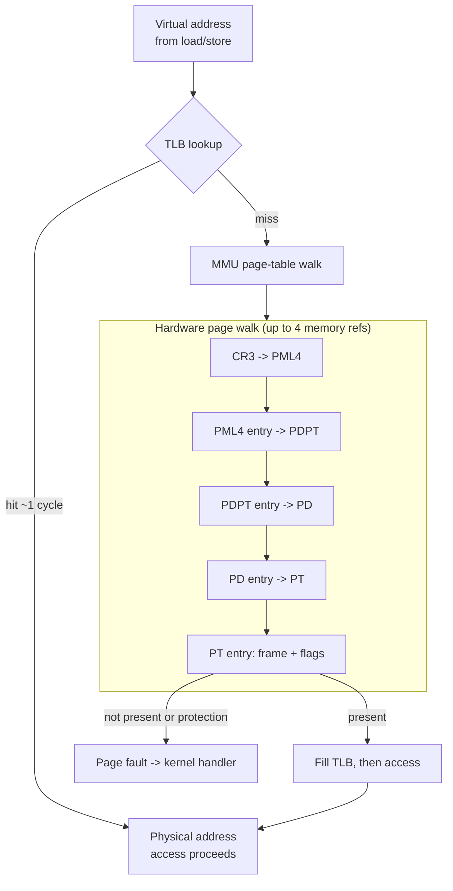
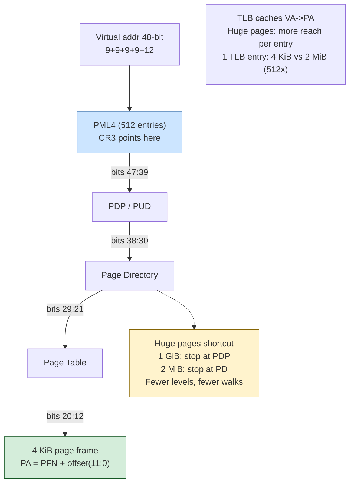
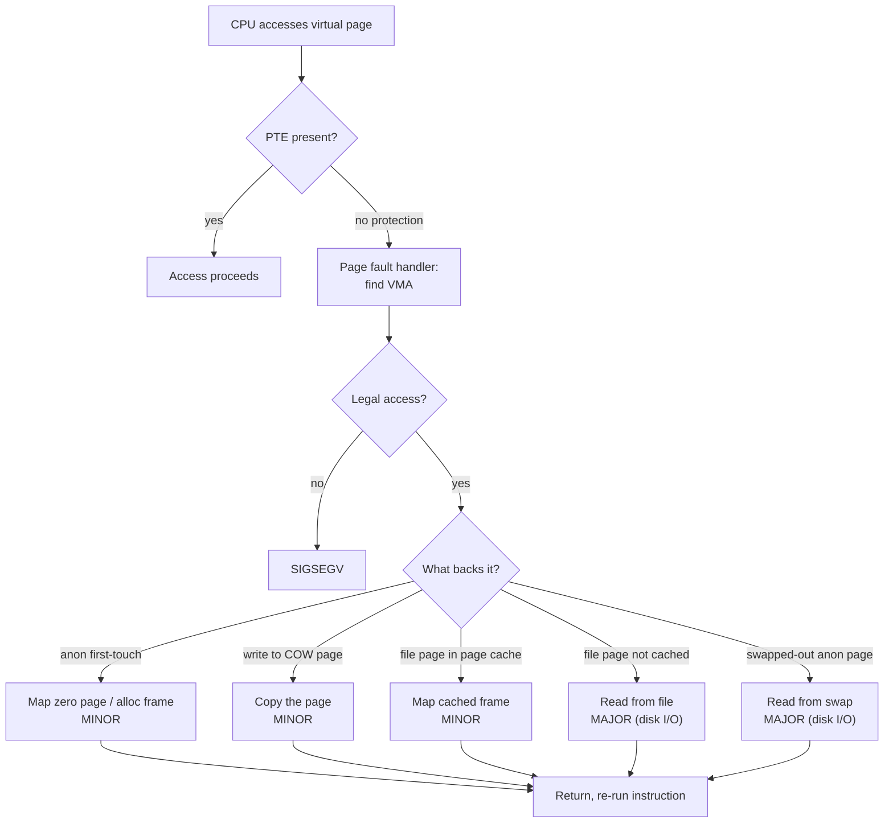
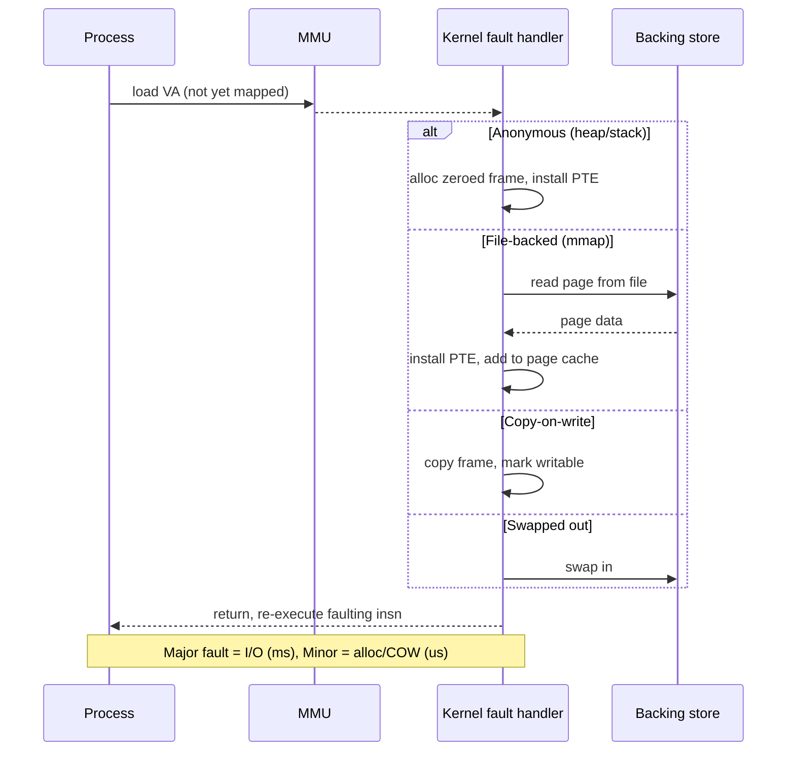
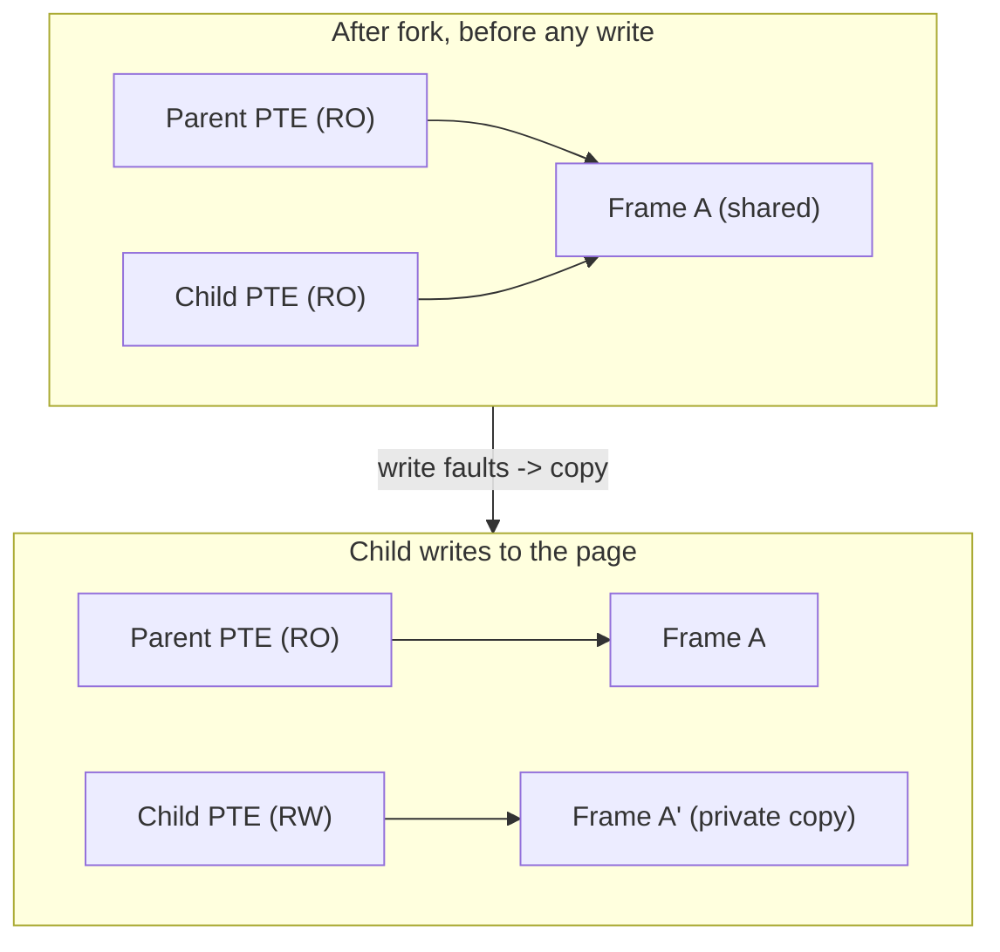
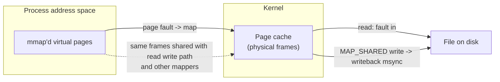
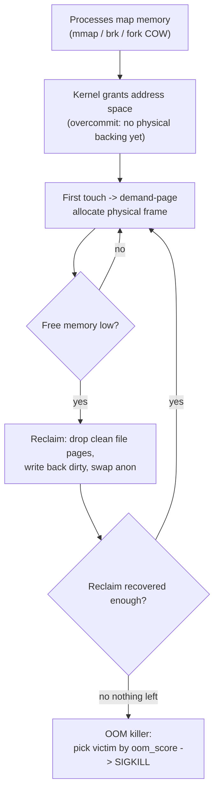

# Chapter 3 — Virtual Memory and Paging

**What this chapter covers.** Chapter 1 defined a process as, first and foremost, an
*address space*: a private, contiguous-looking range of virtual addresses that only that
process can see. This chapter explains the machinery that makes that abstraction real. Every
memory access your backend service makes — dereferencing a pointer, pushing a stack frame,
reading a `mmap`'d index file — passes through hardware address translation before it reaches
a byte of DRAM. That translation layer is *virtual memory*, and it is not a performance
detail you can ignore. It is the mechanism behind process isolation, behind the cheap `fork`
Redis uses to snapshot, behind the mysterious multi-millisecond stalls that wreck your p99,
behind the container that keeps getting `OOMKilled`, and behind the difference between the
`VSZ` your monitoring reports and the RSS that actually costs you money.

We are Linux- and x86-64-specific where it matters, because the abstraction leaks in
concrete, generation-specific ways. An engineer who can reason about page tables, the TLB,
minor versus major faults, copy-on-write, `mmap`, reclaim, overcommit, and the OOM killer can
debug an entire class of production incidents that otherwise look like black magic.

Learning goals — after this chapter you should be able to:

- Explain **why** virtual memory exists and what it buys: per-process isolation, the
  illusion of a large contiguous address space, and the features (demand paging, COW, `mmap`,
  swap) it enables.
- Describe **paging mechanics** on x86-64: pages and frames, the 4-level (and 5-level) page
  table hierarchy, the hardware page-table walk, and the meaning of the key PTE bits.
- Explain the **TLB** as the cache that makes translation affordable, why a TLB miss triggers
  a page walk, why context switches historically flush it, and how **PCID/ASID** avoid that.
- Distinguish **minor from major page faults** and explain why a major fault in a hot path is
  a tail-latency catastrophe, plus the difference between anonymous and file-backed pages.
- Explain **copy-on-write**, why it makes `fork` cheap, and the transient memory blow-up it
  can cause (the Redis-snapshot gotcha).
- Reason about **`mmap`** — file-backed vs anonymous, shared vs private — and articulate the
  case for and against `mmap` as a database's storage manager.
- Explain **swap, page reclaim, and the OOM killer**, why latency-sensitive fleets disable
  swap and `mlock` hot data, and how Linux **overcommit** sets up the OOM failure mode.
- Read the memory metrics that actually matter — **RSS vs VSZ**, page cache, `PSI` — and stop
  being misled by the ones that don't.

## Why virtual memory exists

Give a program raw physical addresses and two problems appear immediately. First,
**isolation** is gone: any process can read or scribble on any other's memory, or the
kernel's, because addresses are physical and shared. Second, **placement** becomes the
programmer's problem: two programs both want to load at address `0x400000`, physical memory
is fragmented, and nothing can assume a contiguous region large enough for its heap. Early
systems lived with both. Modern systems solve both with one idea.

Virtual memory interposes a translation layer between the addresses a program uses (*virtual*
addresses) and the addresses DRAM responds to (*physical* addresses). Each process gets its
own private mapping. The hardware unit that performs the translation on every access is the
**MMU** (Memory Management Unit), and the mapping it consults is the process's **page
table**, which the kernel builds and the CPU's `CR3` register points at. Switch processes,
switch `CR3`, switch the entire meaning of every address.

That single indirection delivers a stack of properties:

- **Isolation.** Process A cannot touch process B's memory because A's page table simply does
  not contain a mapping for B's physical frames. The absence of a translation is the security
  boundary — the same boundary Volume 1, Chapter 10 (*Hardware Support for Virtualization and
  Isolation*) described from the silicon side, and the one Chapter 1 named as the core of what
  a process *is*. There is no software check to bypass; an unmapped access simply faults.
- **The illusion of contiguity.** A process sees a flat linear address space (the layout from
  Chapter 1: text, data, heap, `mmap` region, stacks). The physical frames backing it can be
  scattered anywhere in DRAM, or not present at all. The program neither knows nor cares.
- **The illusion of abundance.** A process can map far more address space than the machine
  has RAM. Most of it is never touched, and what is touched can be paged in on demand and
  paged out under pressure.
- **A substrate for features.** Because every access is mediated by a per-page table entry
  with permission bits, the kernel can lazily populate memory (**demand paging**), share
  pages until someone writes (**copy-on-write**), back a region with a file (**`mmap`**), or
  evict pages to disk and fault them back (**swap**). All of these are the *same mechanism* —
  page faults on absent or protected pages — used for different ends.

The cost is that translation is now on the critical path of every load and store. The rest of
this chapter is, in one sense, the story of how hardware and kernel keep that cost low enough
to be worth paying — and what happens at scale when they can't.

## Paging mechanics

### Pages and frames

Physical memory is divided into fixed-size **page frames**; the virtual address space is
divided into equal-size **pages**. On x86-64 the base page is **4 KiB**. Translation is done
at page granularity: the low 12 bits of an address are the **offset** within a page and pass
through untranslated; the high bits are the **virtual page number**, which the MMU maps to a
**physical frame number**. Paging (fixed-size units) rather than segmentation (variable-size
units) is what makes physical memory allocation tractable — any free frame can back any page,
so external fragmentation of physical memory disappears.

### Why the page table is a tree

A flat page table — one entry per virtual page — is a non-starter on 64-bit machines. The
x86-64 virtual address space is 48 bits wide in the common configuration (256 TiB). At 4 KiB
pages that is 2^36 pages; at 8 bytes per entry, a flat table would be **512 GiB per
process**, almost all of it describing unmapped address space. The address space is
enormously **sparse**: a real process maps a few megabytes of text, some heap, some stacks,
some libraries, and leaves terabytes of the range untouched.

The fix is a **radix tree** — a multi-level page table. On x86-64 with 4 KiB pages the tree
has **four levels**, each indexed by 9 bits of the virtual address, with the final 12 bits as
the page offset:

```
 47              39 38          30 29          21 20          12 11             0
+------------------+--------------+--------------+--------------+----------------+
|  PML4 index (9)  | PDPT idx (9) |  PD idx (9)  |  PT idx (9)  |  offset (12)   |
+------------------+--------------+--------------+--------------+----------------+
```

Intel calls the levels PML4 → PDPT → PD → PT; Linux's architecture-neutral names are **PGD →
PUD → PMD → PTE** (with an extra **P4D** level slotted in for 5-level paging). Each table is
itself one 4 KiB page holding 512 eight-byte entries. The beauty of the tree is that
**unmapped subtrees cost nothing**: if a process maps no memory in some 512 GiB region, the
corresponding PML4 entry is simply absent and no lower tables exist. A typical process's full
page-table hierarchy is a few tens of kilobytes, not half a terabyte.

Modern server CPUs (Intel Ice Lake and later, recent AMD) support **5-level paging**, adding
a PML5 (Linux **P4D**) level to widen the virtual address space to 57 bits (128 PiB) and the
physical range accordingly. Linux enables it when the hardware supports it and it is
configured; the vast majority of deployments still run 4-level. The mechanism is identical —
one more 9-bit index, one more memory reference on a walk.

### The page-table walk

When the MMU needs a translation it does not have cached, it performs a **page-table walk**:
starting from the physical address in `CR3`, it uses the PML4 index to select an entry, reads
that entry to get the physical address of the next table, uses the PDPT index there, and so
on down four levels until it reaches a **PTE** holding the physical frame number. On x86 this
walk is done **in hardware** by the MMU's page-miss handler (unlike software-managed TLBs on
some RISC architectures). Crucially, each level is a **memory access**: a 4-level walk is up
to four dependent DRAM reads before the actual access can proceed. That is why the walk is
expensive, and why the TLB (next section) exists. CPUs also keep **page-walk caches** that
memoize the upper levels, so most walks that reach memory only touch the last level or two.

### Page table entry bits

A PTE is 64 bits: mostly the physical frame address plus a set of control and status flags
the MMU and kernel both use. The ones a backend engineer should recognize:

| Bit | Name | Meaning |
|-----|------|---------|
| P | Present | If clear, the page is not mapped in RAM; any access faults. The kernel uses "not present" for unmapped pages, demand-zero pages, and swapped-out pages, stashing swap location in the other bits. |
| R/W | Read/Write | If clear, writes fault. This is how **COW** and read-only text are enforced. |
| U/S | User/Supervisor | If clear, user-mode access faults. Separates kernel pages from user pages. |
| A | Accessed | Set by hardware on any access. The reclaim code reads and clears it to approximate LRU. |
| D | Dirty | Set by hardware on write. Tells reclaim whether a page must be written back before it can be dropped. |
| PS | Page Size | At the PD/PMD or PDPT/PUD level, marks a 2 MiB or 1 GiB **huge page** (Chapter 4) — the walk stops early. |
| G | Global | The translation survives a TLB flush on `CR3` change (used for kernel mappings). |
| NX | No-Execute | Bit 63. If set, instruction fetches from the page fault — the hardware `W^X` primitive. |

The `A` and `D` bits are the hardware's small contribution to memory management: they let the
kernel observe usage and modification cheaply without trapping every access.






## The TLB, deepened

Volume 1, Chapter 3 (*The Memory Hierarchy and Caches*) introduced the **Translation
Lookaside Buffer** as "the other cache." Here is why it is the linchpin of usable virtual
memory. If every memory access required a full page-table walk, every access would cost up to
four extra dependent DRAM reads — virtual memory would be unaffordable. The TLB is a small,
fast, fully-or-set-associative cache of recent virtual-page → physical-frame translations. On
a **hit**, translation costs roughly a cycle and the access proceeds. On a **miss**, the MMU
walks the page table, fills the TLB, and retries — tens to well over a hundred cycles,
depending on how much of the walk hits the page-walk cache versus DRAM.

TLBs are small — typically a few hundred to a couple thousand entries, split into instruction
and data TLBs and often a two-level hierarchy (L1 dTLB/iTLB plus a shared L2 STLB). Because
each 4 KiB entry covers only 4 KiB, the **TLB reach** — total memory addressable without a
miss — is modest: a 1500-entry TLB reaches roughly 6 MiB with 4 KiB pages. A backend service
with a multi-gigabyte working set, hopping around a hash map or a large heap, blows past that
constantly and pays a stream of page-walk costs invisible in normal profiles. This is the
central motivation for **huge pages** (2 MiB / 1 GiB), covered in Chapter 4: each huge-page
TLB entry covers 512× or 262144× more memory, multiplying reach and shortening walks. The
mechanics of huge pages belong to Chapter 4; the point here is that **the TLB sits on the
critical path of every access, and its capacity is a real, finite resource you can exhaust.**

### Context switches and the TLB

TLB entries are, in the naive model, tied to whatever page table `CR3` currently points at.
So when the kernel switches to a different process's address space, the cached translations
are stale and dangerous — process B must not see A's mappings. The classic x86 behavior is
that **writing `CR3` flushes the entire TLB** (except pages marked Global). Chapter 1 flagged
this as part of the *indirect* cost of a context switch: after a cross-address-space switch,
the new process runs "cold," refilling the TLB (and caches) with a burst of page walks. This
is precisely why switching between two threads of the *same* process is cheaper than switching
between processes — same address space, same `CR3`, no flush.

Flushing the whole TLB on every switch is wasteful when the machine ping-pongs between a few
processes. The fix is to **tag** TLB entries with an address-space identifier so entries for
multiple processes coexist and a switch need not flush. Intel calls this the **PCID** (Process
Context Identifier, a 12-bit tag); ARM calls it the **ASID**. With PCIDs, `CR3` can be
reloaded without flushing, and the `INVPCID` instruction invalidates entries for a specific
context. Linux has used PCIDs since the 4.14 era, and they became especially important after
**Meltdown**: the KPTI (kernel page-table isolation) mitigation switches page tables on every
kernel entry/exit, which without PCIDs would mean a full TLB flush per syscall — brutal.
PCIDs turn that into a much cheaper tagged switch. When you read that "syscalls got more
expensive after Meltdown," the TLB is a large part of why, and PCIDs are what kept it from
being catastrophic.

## Demand paging and page faults

The kernel does not populate physical memory when you `malloc` a gigabyte or `mmap` a file.
It records the *mapping* (a virtual address range with permissions and a backing object) in
the process's memory-region metadata — the VMAs, visible in `/proc/<pid>/maps` — and leaves
the PTEs marked not-present. Physical pages are allocated **on demand**, when the memory is
first touched. This is **demand paging**, and it is why a process's `VSZ` can be enormous
while its RSS is small: address space is cheap; resident pages are not.

The mechanism is the **page fault**. When the CPU translates an address whose PTE is
not-present (or violates permissions), it traps into the kernel's fault handler with the
faulting address and the reason. The handler consults the VMAs to decide whether the access
is legal and what should back the page:

- **Illegal** (no VMA, or a permission the mapping forbids) → `SIGSEGV`. The segfault is just
  a page fault the kernel refused to satisfy.
- **Legal** → the handler makes the page present and returns; the faulting instruction
  re-executes and succeeds. What it does to make the page present is where the cost lives.

The single most important distinction in this chapter is **minor vs major**:

- A **minor fault** (soft fault) is resolved **without disk I/O**. The needed data is already
  in RAM, or no data is needed at all. Examples: the first touch of anonymous memory (map the
  shared zero page, or allocate a fresh zeroed frame), a **COW** write (copy an in-memory
  page), or faulting in a file page that is already resident in the **page cache** (Chapter 4).
  Cost: microseconds — a trap, some bookkeeping, maybe a memcpy.
- A **major fault** (hard fault) **requires I/O**: the page's contents must be read from a
  backing store — a file on disk for file-backed pages, or the **swap** device for anonymous
  pages that were paged out. Cost: the latency of that I/O, which per Volume 1, Chapter 5
  (*Storage Hardware*) is tens of microseconds on NVMe, but historically milliseconds, and
  *orders of magnitude* worse than a minor fault.

| | Minor fault | Major fault |
|---|---|---|
| Also called | Soft fault | Hard fault |
| Requires disk I/O | No | **Yes** |
| Typical latency | Sub-microsecond to a few µs | Tens of µs (NVMe) to milliseconds (rotational/loaded) |
| Causes | First-touch anon (zero page), COW copy, file page already in page cache, shared page | File page not in cache, swapped-out anon page returning from swap |
| Counter | `min_flt`, `ru_minflt` | `maj_flt`, `ru_majflt` |
| p99 impact | Negligible in bulk | **Severe — a hidden tail-latency source** |

You can watch both counters per process (`ps -o pid,min_flt,maj_flt,cmd`, or
`getrusage(2)`'s `ru_minflt`/`ru_majflt`, or `/proc/<pid>/stat`). **Major faults are the ones
that kill latency.** A single major fault on a hot request path — a swapped-out page in your
cache, an `mmap`'d index page not yet resident — injects a synchronous disk read into the
middle of an otherwise CPU-bound operation. The request thread blocks. There is no way to see
it in application-level timing except as an inexplicable multi-millisecond spike. At fleet
scale, a low rate of major faults distributed across millions of requests is a persistent
p99/p999 tax (Volume 11).

### Anonymous vs file-backed pages

Two categories of pages, with different lifecycles:

- **File-backed** pages mirror a region of a file (program text, shared libraries, `mmap`'d
  data files). Their canonical home is the file on disk, reached through the **page cache**.
  A clean file page can be dropped instantly under memory pressure (it can be re-read from the
  file); a dirty one must be written back first. Faulting one in is a minor fault if it's in
  the page cache, a major fault otherwise.
- **Anonymous** pages have no file behind them — heap, stacks, anonymous `mmap`. Their only
  backing store is **swap**. With no swap configured, anonymous pages **cannot be evicted**;
  they are pinned in RAM until freed. This fact drives much of the swap discussion below.






## Copy-on-write

Chapter 1 introduced copy-on-write as the reason `fork` is cheap. Now we can be precise.
`fork` must give the child a logically independent copy of the parent's entire address space.
Doing that eagerly — copying every resident page — would be enormously expensive and almost
entirely wasted, because the child usually `exec`s a new program immediately, or shares most
data read-only.

So `fork` copies only the **page tables**, not the pages. For every writable private page, the
kernel marks the PTE **read-only** in *both* parent and child and bumps the page's reference
count. Both processes now share the same physical frames, and either can read freely. The
moment either one **writes**, the read-only PTE triggers a **protection fault**. The handler
recognizes this as COW: it allocates a fresh frame, copies the shared page into it, makes the
writer's PTE point at the private copy with write permission, and returns. If the reference
count has dropped to one (the other side already copied or exited), it can simply re-grant
write permission without copying.

The result: `fork` cost is proportional to the size of the page tables, not the resident
memory, and pages are duplicated **lazily, one at a time, only as they are actually
modified.** Pages that are never written are never copied — text, read-only data, and
untouched heap stay shared.



COW is used far beyond `fork`. Private file mappings (`MAP_PRIVATE`) are COW against the page
cache. The kernel's `MADV_FREE` and same-page merging (KSM) build on it. But the operational
gotcha every backend engineer should internalize is the **memory blow-up under write load
after fork.** The textbook example is **Redis persistence**: to take a point-in-time snapshot
(`RDB`) or rewrite the append-only file, Redis `fork`s and lets the child serialize a
consistent view while the parent keeps serving. COW makes this near-instant and, in the
common case, cheap. But every key the parent *writes* during the save triggers a COW copy —
and if the workload is write-heavy, the parent can duplicate a large fraction of the dataset
before the child finishes. In the pathological case memory usage approaches **2×** the
dataset size, transiently, on the node. This is a real capacity-planning hazard: a Redis
instance sized to fit comfortably in RAM can OOM *during a background save* under a write
spike. Transparent huge pages make it worse, because a COW copy is then 2 MiB instead of
4 KiB — a single small write dirties a huge page — which is exactly why Redis recommends
disabling THP.

## `mmap`: memory-mapping and its discontents

`mmap(2)` maps a region of virtual address space to a backing object and lets you access it
with ordinary loads and stores instead of `read`/`write` syscalls. It is central to backend
systems: it backs shared libraries, large allocations, shared memory, and the storage engines
of many databases. The behavior depends on two orthogonal choices.

**What backs the mapping:**

- **File-backed** (`mmap` of a file descriptor): the mapping mirrors file contents through the
  **page cache** (Chapter 4). Reads fault pages in from the file; the same physical page in the
  page cache backs every mapper of that file and the buffered `read`/`write` path too.
- **Anonymous** (`MAP_ANONYMOUS`): no file; zero-filled pages backed only by swap. This is how
  allocators (`malloc`, via `glibc`) obtain large chunks of heap, and how you get big
  zero-initialized regions. Anonymous `mmap` is the subject of the allocator discussion in
  Chapter 4.

**How writes propagate:**

- **`MAP_SHARED`**: writes go to the shared page-cache page and are visible to other mappers
  and eventually written back to the file (on `msync`, or by the writeback machinery). This is
  true shared memory and true file mutation.
- **`MAP_PRIVATE`**: **copy-on-write** against the backing object. Reads see the file (or
  zeros); the first write copies the page and your changes stay private and are never written
  back. Program text and initialized data segments are `MAP_PRIVATE` file mappings.



Two controls matter for performance. **`MAP_POPULATE`** prefaults the whole mapping at `mmap`
time, trading a slow `mmap` for no later fault storm — useful when you know you'll touch
everything and want the cost up front instead of scattered through request handling.
**`madvise(2)`** hints access patterns: `MADV_WILLNEED` kicks off readahead, `MADV_SEQUENTIAL`
tells the kernel to read ahead aggressively and drop behind, `MADV_RANDOM` suppresses
readahead, `MADV_DONTNEED` drops resident pages (forcing them to be re-faulted), `MADV_FREE`
lazily marks anonymous pages reclaimable, and `MADV_HUGEPAGE` requests THP backing (Chapter
4).

### The "should a DBMS use `mmap`?" debate

`mmap` is seductive for a database storage engine: map the data file, access records as if
they were in memory, and let the kernel's page cache and reclaim be your buffer pool for free.
Several real systems took this route (LMDB is built on it; MongoDB's original MMAPv1 engine
did, and was later replaced by WiredTiger). But the consensus among serious database engineers
— crystallized in the 2022 paper *"Are You Sure You Want to Use MMAP in Your DBMS?"* by
Crotty, Leis, and Pavlo — is that `mmap` is a poor foundation for a high-performance
transactional DBMS. The arguments, stated at the level of confidence they deserve:

| Concern | `read`/`write` (buffer pool) | `mmap` |
|---|---|---|
| **Eviction control** | DBMS decides what stays resident and what evicts | Kernel decides; you cannot pin your working set or control eviction order without fighting reclaim |
| **I/O latency visibility** | I/O is explicit; can be async, prefetched, scheduled | A page fault is a **synchronous, invisible** stall inside any instruction; a query thread blocks unpredictably on a **major fault** |
| **Transactional safety** | DBMS controls exactly when dirty pages hit disk (WAL ordering, fsync) | Kernel can write back a dirty `MAP_SHARED` page **at any time**, breaking write-ordering guarantees and enabling torn/partial writes |
| **Error handling** | I/O errors returned from a syscall you can handle | An I/O error surfaces as a **`SIGBUS`** mid-access — hard to handle correctly |
| **Scalability** | Buffer-pool structures tuned by the DBMS | Page-table contention and **TLB shootdowns** on eviction across many cores; historically a single mmap-lock bottleneck |

The counterpoint is real: `mmap` is dramatically simpler to build, avoids double-buffering
(no copy from page cache into a private buffer pool), and performs well for read-mostly
workloads whose working set fits in RAM — LMDB's sweet spot. The honest summary is not
"`mmap` is always wrong" but "**`mmap` hands the kernel control over eviction, durability, and
fault latency — three things a serious transactional DBMS wants to own.**" The transferable
lesson is broader than databases: **any `mmap`-backed data store inherits page-fault latency
and eviction unpredictability from the OS**, a property you must budget for, not a free lunch.

## Swap, reclaim, and the working set

Physical memory is finite, and Linux aggressively uses all of it — for anonymous pages, for
the page cache, for kernel structures. When free memory runs low, the kernel must **reclaim**
pages to make room for new allocations. This is the machinery of swap and page eviction, and
it is where memory pressure turns into latency.

### The reclaim algorithm

Linux approximates LRU with per-cgroup, per-node **active/inactive lists**, split into
anonymous and file lists (four lists total). Newly faulted pages start on the **inactive**
list; a second reference promotes them to the **active** list. Reclaim scans the **tail of
the inactive lists** for eviction candidates, using the PTE **Accessed** bit to detect recent
use and demote or rotate pages accordingly. The split lets the kernel bias reclaim toward the
kind of page that is cheaper to drop. (Kernels 6.1+ can use **MGLRU**, a multi-generation LRU
that replaces the two-list scheme with aging generations; the principle — evict cold pages,
protect the working set — is the same.)

Reclaiming a page differs by type:

- **Clean file page**: just drop it. It can be re-read from the file. Cheap.
- **Dirty file page**: must be **written back** to the file first, then dropped.
- **Anonymous page**: must be **written to swap** first (there is nowhere else to put it),
  then dropped. If there is no swap device, it *cannot be reclaimed at all.*

Two actors do reclaim. **`kswapd`** is a per-node kernel thread that reclaims in the
background when free memory falls below the low watermark, working back up to the high
watermark — asynchronous, off the allocating thread's critical path. But if an allocation
needs a page *now* and `kswapd` hasn't kept up, the allocating thread itself enters **direct
reclaim**: it synchronously scans and evicts pages before its allocation can proceed. Direct
reclaim is a stall injected into whatever code allocated memory — a hidden, hard-to-attribute
latency source, and a sign the machine is under real pressure.

**`vm.swappiness`** (0–200 in recent kernels; default 60) biases reclaim between evicting
anonymous pages (swapping) and evicting file pages (dropping page cache). Low values push the
kernel to reclaim file cache before swapping application memory; `0` avoids swapping anonymous
memory until it is nearly unavoidable (it does **not** fully disable swap — that requires
`swapoff`).

### Why swap is a latency problem

Here is the chain. Swapping out an anonymous page is fine — it happens in the background. The
problem is swapping it **back in**: when the process next touches that page, it takes a
**major fault** and blocks on a disk read. If the working set genuinely exceeds RAM, the
system enters **thrashing**: pages are evicted, immediately re-referenced, faulted back in,
and evicted again, and the machine spends nearly all its time waiting on swap I/O making no
forward progress. Throughput collapses; latency goes to the moon. **Pressure Stall
Information** (`/proc/pressure/memory`, the `PSI` interface) is the modern way to quantify
this: it reports the fraction of time tasks stall waiting on memory.

This is why **latency-sensitive backend deployments frequently disable swap entirely.** The
reasoning: for a service with a strict tail-latency SLO, a swap-in is never an acceptable
outcome — you would rather fail fast (OOM) than serve a request that stalled 10 ms on a
swapped page. Kubernetes historically *required* swap to be off on nodes (the kubelet refused
to start otherwise) precisely so that the scheduler's memory accounting and the cgroup limits
would map cleanly to physical RAM, without the confounding variable of disk-backed memory;
swap support for Kubernetes has since been added as an opt-in alpha/beta feature, but the
default posture in latency-sensitive fleets remains swap-off. The trade-off is stark and worth
naming: **swap-off converts "slow" into "dead."** Without swap, a memory spike that swap would
have absorbed instead trips the OOM killer. That is usually the *right* trade for a service
behind a load balancer with retries, and the *wrong* trade for a workstation.

### Keeping the working set resident

The **working set** (Volume 1, Chapter 3) is the set of pages a process actively uses over a
window of time. Good behavior is a working set that **fits in RAM** and stays resident — the
node-level analog of the cache-locality argument from Volume 1. When it fits, faults are rare
and mostly minor; when it doesn't, you thrash. This is the governing constraint for sizing
in-memory data stores: a Redis or an in-memory cache should be sized so its working set (plus
COW headroom, plus overhead) is comfortably smaller than node RAM.

When you must guarantee specific pages never get evicted — a latency-critical index, crypto
key material you don't want written to swap, a low-latency trading path — use **`mlock(2)`**
or **`mlockall(2)`** to pin pages into RAM, exempting them from reclaim (subject to the
`RLIMIT_MEMLOCK` limit). `mlock` is the explicit "this is working set, keep it resident"
instruction, and it is the standard tool for shielding hot data from the reclaim machinery.

## Overcommit and the OOM killer

Linux, by default, will let processes map **more memory than the machine can actually back**
with RAM plus swap. This is **overcommit**, and it is a deliberate bet: processes routinely
reserve far more address space than they touch. `malloc` grabs big anonymous regions that stay
mostly untouched; `fork` COW-shares pages that mostly never diverge; sparse data structures
map ranges they never fill. Refusing to allocate address space until physical backing is
guaranteed would waste enormous memory and break the `fork`/COW model. So Linux promises
freely and allocates physical frames only on **first touch** (demand paging). The gamble pays
off almost always — because the promises are rarely all called in.

The behavior is tunable via `vm.overcommit_memory`:

- **`0` (heuristic, default):** the kernel allows most overcommit but rejects allocations it
  judges wildly unreasonable via a heuristic. Works well in practice; the mode almost everyone
  runs.
- **`1` (always):** never refuse; every `mmap`/`brk` succeeds regardless. Used by workloads
  that legitimately map huge sparse regions (some sparse-array numeric code, some
  language runtimes) and know they won't touch them.
- **`2` (strict / never):** the kernel enforces a `CommitLimit` = swap + physical ×
  `overcommit_ratio` (default 50%), and refuses allocations beyond it. Allocations fail
  honestly at `malloc`/`mmap` time rather than succeeding and detonating later. Predictable,
  but requires headroom tuning and can surprise software that assumes overcommit.

The gamble's downside: when the promises **are** called in — many processes touch their mapped
pages at once and demand exceeds RAM plus swap — the kernel is out of memory with no page to
give and nothing left to reclaim. It cannot fail the allocation (the memory was already
"granted"), so it invokes the **OOM killer**: it selects a victim process and sends it
`SIGKILL`. The victim is chosen by **`oom_score`** (a "badness" heuristic dominated by the
process's memory footprint, so the biggest hog is the usual target), adjustable per process
via `oom_score_adj` (−1000 to +1000; −1000 makes a process effectively unkillable, useful for
critical daemons). The kill is abrupt and unappealable — no cleanup, no chance to flush — and
it is one of the more feared events in production because it appears as an unexplained process
death in the logs. Chapter 4 dissects OOM selection and tuning in depth; the point here is
that **overcommit and the OOM killer are two ends of one policy** — promise generously,
reconcile violently.



### Overcommit in containers

In a container world the failure is more localized and far more common. A container runs in a
**cgroup** with a memory limit (`memory.max` in cgroup v2; Chapter 9 covers the mechanism).
When the processes in that cgroup exceed their limit and reclaim within the cgroup can't
recover enough, the kernel triggers a **cgroup-scoped OOM kill** — it kills a process *inside
that cgroup*, not somewhere else on the node. To the orchestrator this surfaces as the
container terminating with exit code **137** (128 + SIGKILL's signal 9) and a reason of
**`OOMKilled`**. This is one of the single most common causes of container restart loops in
production Kubernetes: a memory limit set too low, a workload whose RSS grows past it, and a
`CrashLoopBackOff` that looks like an application bug but is a sizing problem. Getting limits
right — and understanding *what* counts against them (RSS and, in cgroup v2, much of the page
cache attributed to the cgroup) — is core operational competence, developed further in Chapter
9 and Book 6 (*Cloud Native*).

## Practical VM behavior for backend engineers

The abstractions above produce a handful of everyday observations that trip up engineers who
haven't internalized virtual memory. Getting these right is the difference between reading
your monitoring correctly and chasing ghosts.

### RSS vs VSZ vs page cache

`ps` and `top` show two memory figures per process, and only one of them means anything:

| Metric | What it is | Is it "real" memory? |
|---|---|---|
| **VSZ** (virtual size) | Total virtual address space **mapped** — every VMA, including untouched `mmap` regions, unbacked reservations, guard pages, and all mapped shared libraries | **No.** Overcommit makes it routinely huge and largely meaningless. A JVM or Go process can show tens of GiB of VSZ while using a fraction. |
| **RSS** (resident set size) | Physical pages **currently resident** for the process, including shared pages (libraries, shared mappings) counted in full per process | Mostly. It is real physical memory, but **over-counts shared pages** across processes. |
| **PSS** (proportional set size) | Like RSS but shared pages divided by the number of sharers | The most honest per-process figure; sum of PSS across processes ≈ total used. |
| **Page cache** (`buff/cache` in `free`) | File-backed pages the kernel caches; **reclaimable** | It's "used" but **available on demand** — not a leak, not pressure. |

Two rules follow. First, **ignore VSZ for capacity reasoning** — it tells you how much address
space is mapped, not how much memory is consumed. Reason about RSS (or better, PSS, and for
containers the cgroup's memory accounting). Second, **"free memory is wasted memory."** Linux
fills otherwise-idle RAM with page cache; `free` showing little "free" and lots of "buff/cache"
is *healthy* — that cache is accelerating your file I/O and will be surrendered the instant
anything needs the memory. The meaningful figure is **available** (the `available` column in
`free`, which accounts for reclaimable cache), not **free**. Alerting on "free memory" instead
of "available memory" is a classic false-alarm generator. Chapter 4 treats the page cache in
full.

### Page-fault latency in hot paths

Because faults are invisible in application timing, they are a favorite hiding place for tail
latency. The mitigations follow directly from the mechanism:

- **Pre-fault** memory you know you'll use: `MAP_POPULATE` at `mmap` time, or touch pages
  during startup/warm-up so the faults happen off the request path. A cold cache served its
  first thousand requests slowly because every page was a fault; warming it moves that cost to
  deploy time.
- **`mlock`** the pages that must never fault — the hot index, the low-latency path — so
  reclaim can't evict them out from under you.
- **Disable swap** on latency-sensitive nodes so a fault is never a swap-in.
- **Huge pages** (Chapter 4) to cut TLB misses (which aren't page faults, but are the *other*
  invisible translation cost) for large working sets.

The unifying idea: on a latency-critical path you want **all faults to have already happened**.
Every page your request touches should be resident and translated before the request arrives.

## Distributed-systems lens

Virtual memory is a per-node mechanism, but its behavior sets the economics and the tail
latency of an entire fleet.

- **Major faults are a hidden p99 killer.** A service that looks CPU-bound in aggregate can
  have a p999 dominated by swap-ins and cold `mmap` faults — synchronous disk reads spliced
  into request handling, invisible to application timers. This is why latency-sensitive fleets
  standardize on **swap-off + `mlock` hot data**, converting the "slow" failure mode into a
  "fail fast" one they can handle with retries and load balancing (Volume 11). The node-level
  choice directly shapes the tail of the distributed system.
- **cgroup limits and OOM kills are a top cause of container churn.** Across a large
  Kubernetes fleet, `OOMKilled` / exit-137 restart loops are a leading operational failure,
  and every one is a memory-sizing decision: limit too tight, RSS growth unaccounted, page
  cache misattributed, or a load spike. Right-sizing limits — and knowing RSS vs cache vs the
  cgroup's own accounting — is fleet hygiene (Chapter 9, Book 6, Volume 12).
- **`mmap`-backed data stores inherit OS eviction and fault latency.** Databases and indexes
  built on `mmap` (Volume 5) hand the kernel control over what stays resident and when faults
  happen. That makes their tail latency a property of node memory pressure and reclaim policy,
  not just their own code — a coupling you must model when you co-locate them or set limits.
- **COW `fork` can transiently double memory.** The Redis-snapshot pattern is a fleet-wide
  capacity gotcha: a node sized to hold the dataset can OOM *during a background save* under
  write load, because COW duplicates dirtied pages. Provisioning must include COW headroom, or
  the save itself becomes the incident.
- **Working-set-fits-in-RAM is the node-level cache-locality law.** The same principle that
  governs L1/L2/L3 in Volume 1, Chapter 3 governs DRAM vs swap here, and governs in-memory
  store sizing across the fleet: keep the hot set in the fast tier. Every tier of the
  distributed memory hierarchy — registers, caches, RAM, local SSD, remote cache, remote disk —
  obeys the same locality logic; virtual memory is where the RAM-vs-disk boundary of that
  hierarchy is enforced.
- **Overcommit + OOM is the node's resource-exhaustion failure mode.** It mirrors distributed
  resource exhaustion exactly: promise capacity you statistically won't all need, and when the
  bet fails, shed load violently. The OOM killer is admission control by assassination. Under
  a coordinated demand spike — the correlated-failure pattern — many nodes call in their
  promises at once, and a fleet of overcommitted nodes OOMs together. Understanding the local
  mechanism is understanding one instance of the global pattern.

## Key takeaways

- **Virtual memory interposes per-process address translation** between virtual and physical
  addresses. The MMU translates on every access using the process's page table (rooted at
  `CR3`); the absence of a mapping *is* the isolation boundary. This one indirection buys
  isolation, contiguity, the illusion of abundance, and the substrate for demand paging, COW,
  `mmap`, and swap.
- **Page tables are radix trees** because the 64-bit address space is sparse. x86-64 uses
  **4 levels** (PML4/PDPT/PD/PT → Linux PGD/PUD/PMD/PTE) for 48-bit VAs, **5 levels** for
  57-bit; a hardware page-table walk on a TLB miss costs up to four dependent memory reads.
  Key PTE bits: Present, R/W (enforces COW), U/S, Accessed, Dirty, NX.
- **The TLB caches translations** and sits on every access. Misses trigger page walks; **TLB
  reach** is small with 4 KiB pages, which is why huge pages matter. `CR3` reload flushes the
  TLB unless **PCID/ASID** tags let address spaces coexist — critical after Meltdown/KPTI.
- **Demand paging** populates memory on first touch via page faults. **Minor faults** need no
  I/O (first-touch, COW, page-cache hit); **major faults require disk/swap I/O** and are the
  hidden tail-latency source. Anonymous pages are swap-backed; file-backed pages live in the
  page cache.
- **Copy-on-write** makes `fork` cheap by sharing pages read-only and copying lazily on write.
  It also means a `fork`-and-snapshot workload (Redis) can transiently approach **2×** memory
  under write load — a real capacity hazard, worsened by THP.
- **`mmap`** maps files (via page cache) or anonymous memory, shared or private (COW). It is
  powerful but hands the kernel control over **eviction, durability, and fault latency** —
  which is the core of the argument against `mmap` as a serious DBMS's storage manager.
- **Swap turns memory pressure into latency.** Reclaim uses active/inactive LRU lists;
  `kswapd` reclaims in the background, direct reclaim stalls the allocator. Swap-in is a major
  fault; a working set larger than RAM **thrashes**. Latency-sensitive fleets disable swap and
  `mlock` the hot set; keep the working set resident in RAM.
- **Linux overcommits** memory because promises are rarely all called in. When they are, the
  **OOM killer** picks a victim by `oom_score` and `SIGKILL`s it. In containers this is a
  cgroup-scoped kill surfacing as **exit 137 / `OOMKilled`** — a leading cause of restart
  loops.
- **Read the right metrics.** **VSZ is meaningless** (mapped address space); **RSS/PSS** is
  real memory; **page cache is reclaimable** ("free memory is wasted memory" — watch
  *available*, not *free*). On hot paths, arrange for **all faults to have already happened**:
  pre-fault, `mlock`, swap-off, huge pages.

## Further reading

- **The Linux Programming Interface**, Michael Kerrisk, No Starch Press, 2010. Chapters 6, 7,
  and 49 (`mmap`) and the memory-management material are the definitive practitioner reference
  for the Linux side of this chapter — `mmap`, `mlock`, `madvise`, demand paging, and the
  `/proc` memory interfaces.
- **Understanding the Linux Kernel**, 3rd ed., Bovet and Cesati, O'Reilly, 2005, and
  **Professional Linux Kernel Architecture**, Wolfgang Mauerer, Wrox, 2008 — for page tables,
  the fault handler, reclaim, and swap at the source level. Dated on specifics, sound on the
  mechanism.
- **Intel 64 and IA-32 Architectures Software Developer's Manual**, Volume 3A, "Paging"
  chapter — the authoritative description of 4- and 5-level paging, PTE bit definitions, the
  page-table walk, and PCIDs. The AMD64 Architecture Programmer's Manual, Volume 2, covers the
  same for AMD.
- The Linux kernel documentation under `Documentation/` — especially `admin-guide/mm/`
  (transparent huge pages, `concepts.rst`, overcommit accounting), `vm/` internals, and the
  `proc(5)` man page for `/proc/<pid>/maps`, `/proc/<pid>/smaps` (per-mapping RSS/PSS), and
  `/proc/<pid>/status`.
- Crotty, Leis, and Pavlo, **"Are You Sure You Want to Use MMAP in Your
  DBMS?"**, CIDR 2022 — the careful statement of why `mmap` is a poor storage-manager
  foundation for a transactional DBMS (eviction control, I/O stalls, `SIGBUS`, torn writes,
  TLB shootdowns). Read alongside the LMDB design notes for the opposing, read-mostly case.
- `man` pages: `mmap(2)`, `madvise(2)`, `mlock(2)`, `mincore(2)`, `getrusage(2)` (fault
  counters), `proc(5)`, and the `overcommit-accounting` documentation. `vm.overcommit_memory`,
  `vm.overcommit_ratio`, `vm.swappiness`, and the OOM `oom_score_adj` interface are documented
  in `Documentation/admin-guide/sysctl/vm.rst`.
- Redis documentation, **"Redis persistence"** and the latency/THP guidance — the canonical
  real-world description of `fork` + COW for snapshotting and why transparent huge pages hurt
  it. A concrete, load-bearing example of everything in the COW section.
- Ulrich Drepper, **"What Every Programmer Should Know About Memory"** (2007), sections on
  virtual memory, TLBs, and page tables — still the best single narrative on why translation
  costs what it does. Pairs with Volume 1, Chapter 3.
- Brendan Gregg, **Systems Performance**, 2nd ed., Addison-Wesley, 2020 — the memory chapter
  for the diagnostic side: reading RSS/PSS/`smaps`, page-fault analysis, `PSI`, swap and
  reclaim under load, and the `bcc`/`bpftrace` tooling to observe faults live (Chapter 11).
