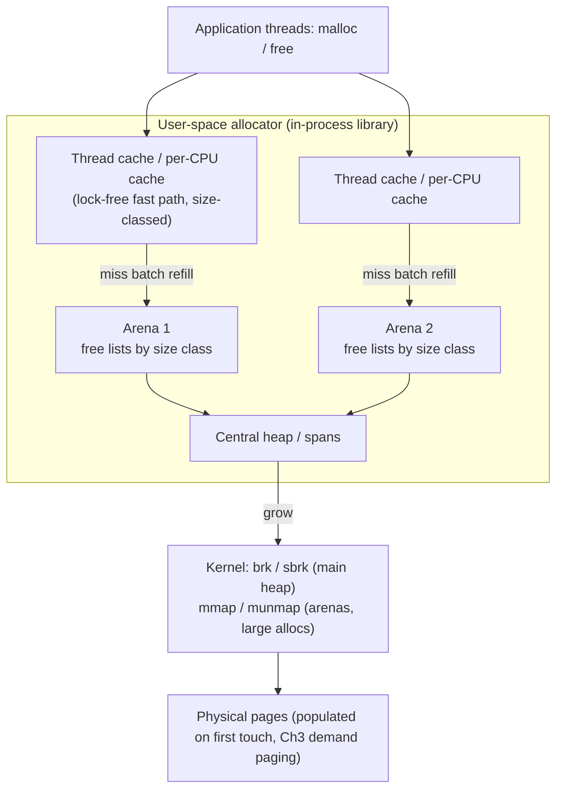
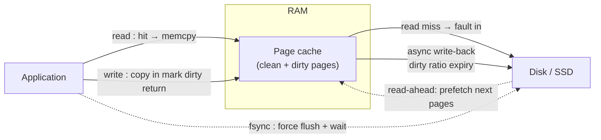
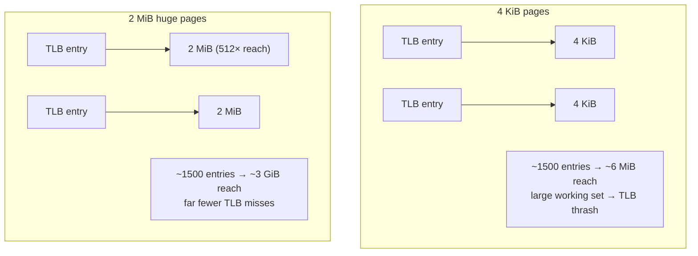
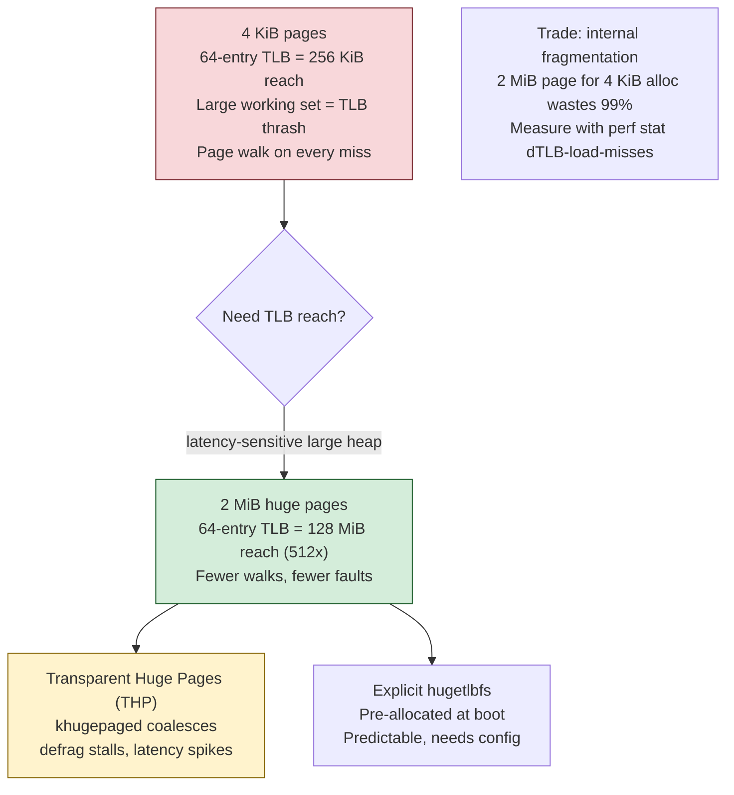
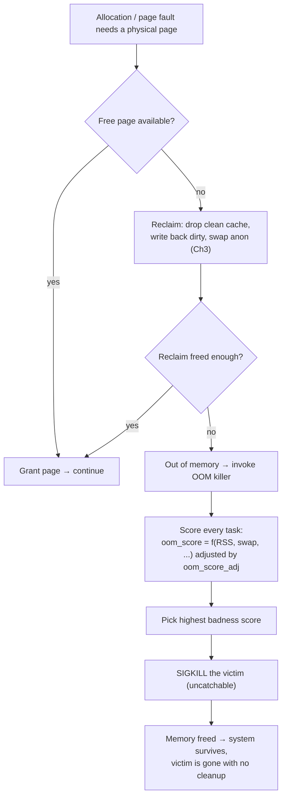
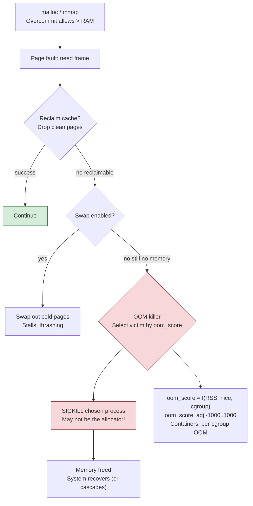
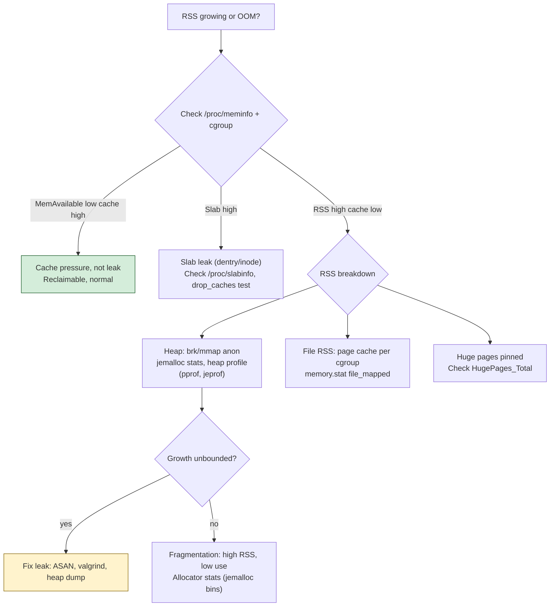

# Chapter 4 — Memory in Practice: Allocators, Page Cache, Huge Pages, OOM

**What this chapter covers.** Chapter 3 built the machinery: virtual address spaces, page
tables, the TLB, demand paging, overcommit, and reclaim. This chapter turns that machinery
into the operational reality a backend engineer actually manages. When you run a service at
scale, you do not directly manipulate page tables. You *do* choose an allocator, watch RSS
climb on a Grafana dashboard, get paged for an `OOMKilled` pod at 3 a.m., argue about whether
Transparent Huge Pages should be on, and stare at `free` output trying to decide whether a
box is genuinely out of memory or just doing its job. Those are the four surfaces where
Chapter 3's mechanisms meet your day: the **user-space allocator** that hands out heap memory,
the **page cache** that makes file I/O fast and makes memory dashboards lie, **huge pages**
that relieve TLB pressure on big-memory workloads, and the **OOM killer** that ends a process
when overcommit finally comes due. We treat all four with Linux specifics and an honest eye on
the failure modes.

The through-line: almost every memory problem you will debug in production is one of a small
set — a real leak, fragmentation, a mis-sized cgroup limit, THP-induced tail latency, or an
alert firing on reclaimable page cache. Knowing which one you are looking at, from the metrics
alone, is the skill.

Learning goals — after this chapter you should be able to:

- Explain how `malloc`/`free` work *above* the kernel: how an allocator gets memory via
  `brk`/`sbrk` and `mmap`, and how size classes, free lists, per-thread/per-CPU arenas, and
  thread caches reduce lock contention and syscall overhead.
- Compare glibc `malloc` (ptmalloc), jemalloc, tcmalloc, and mimalloc, and justify swapping
  the allocator as a real fleet-wide performance and footprint lever.
- Distinguish internal from external fragmentation, explain why long-running services grow
  and fragment, and recognize the "a restart fixes it" smell.
- Explain the page cache: why "free memory is wasted memory," why `buff/cache` is not `used`,
  how write-back and the dirty ratio work, where the fsync durability gap lives, and when
  `O_DIRECT` and read-ahead matter.
- Explain huge pages (2 MB / 1 GB), the difference between hugetlbfs and THP, and give an
  honest account of when THP helps versus why Redis and many databases tell you to disable it.
- Explain the OOM killer end to end: overcommit, `oom_score`/`oom_score_adj`, the uncatchable
  `SIGKILL`, and — critically — cgroup-level OOM, the Kubernetes `OOMKilled`/exit-code-137
  failure mode, and cgroup v2 `memory.max`/`memory.high`/`memory.min`.
- Read the metrics that matter — RSS vs VSZ vs PSS vs page cache, `/proc/meminfo`,
  `memory.stat`, PSI — and tell a leak from fragmentation from cache, and know what to alert on.

This chapter is Linux-specific and leans throughout on Chapter 3 (Virtual Memory and Paging),
on Volume 1 Chapter 3 (The Memory Hierarchy) and Chapter 4 (Cache Coherence) for the hardware
underneath, on Volume 1 Chapter 8 (Performance Anti-patterns) for hot-path allocation, on
Volume 5 (Databases) for `O_DIRECT` and self-managed caches, on Volume 12 / Book 6
(Containers and Kubernetes) for cgroup OOM, and on Volume 13 (Language Runtimes) for how
managed runtimes sit on top of these same allocators.

## The allocator sits between your program and the kernel

The kernel does not hand out bytes. It hands out *pages* — 4 KiB regions of a process's
virtual address space, mapped on demand (Chapter 3). Your program, meanwhile, calls
`malloc(37)` and expects 37 bytes, fast, a billion times a second. Bridging that gap — the
mismatch between page-granular, syscall-priced kernel memory and byte-granular, nanosecond-
priced application allocation — is the entire job of the user-space **memory allocator**.

The allocator is a library, linked into your process, that manages a pool of virtual memory it
has obtained from the kernel and sub-divides it into the small, arbitrarily-sized objects your
code requests. It has exactly two ways to get memory from the kernel:

- **`brk`/`sbrk`** move the "program break" — the top of the classic contiguous heap segment.
  Growing the heap is cheap (one syscall bumps a pointer; pages are populated on first touch),
  but it is a single linear region: you can only shrink it by moving the break back down, which
  you cannot do if any allocation above the intended new break is still live. This is one
  mechanical reason heaps grow but rarely shrink.
- **`mmap`** creates an independent anonymous memory region anywhere in the address space.
  Allocators use `mmap` for large allocations (glibc's default threshold is 128 KiB, tunable
  via `M_MMAP_THRESHOLD`) and for whole arenas. An `mmap` region can be returned to the kernel
  independently with `munmap`, so large allocations *can* release physical memory on free —
  unlike the `brk` heap.

Every design decision in a modern allocator exists to avoid two costs: the **syscall** (going
to the kernel is expensive relative to a pointer bump — Chapter 5) and the **lock** (multiple
threads hitting one shared free list serialize, and on a 64-core box that is death — Volume 1
Chapter 4). The result is a fairly standard architecture:



**Size classes.** Rather than track every possible request size, allocators round each request
up to one of a fixed set of *size classes* (e.g., 8, 16, 32, 48, 64, 80, … bytes, then coarser
spacing for larger objects). All objects of a class come from the same pool and are
interchangeable on `free`, which turns allocation into "pop a block off this class's free
list" and free into "push it back." The rounding-up is the source of **internal
fragmentation** (below), traded for speed and simplicity.

**Free lists.** Each size class keeps a list of freed-but-not-returned blocks. `malloc` pops;
`free` pushes. This is the hot path, and it must be O(1) and, ideally, lock-free.

**Arenas.** To avoid a single global lock, allocators partition their memory into multiple
independent **arenas**, each with its own lock and its own free lists. Threads are distributed
across arenas, so contention drops roughly by the number of arenas. glibc calls these arenas;
jemalloc calls them arenas too. The natural extreme is **per-CPU** rather than per-thread
partitioning, which tcmalloc and modern jemalloc favor: a per-CPU cache never contends because
only one thread runs on a CPU at a time (given a stable CPU, aided by restartable sequences).

**Thread caches.** On top of arenas sits a small **per-thread cache** (tcmalloc's "thread-
caching malloc" is named for it; jemalloc has `tcache`). The common case — allocate and free
small objects on the same thread — never touches a lock at all: it pops and pushes a
thread-local list, refilling from the arena in batches only when the cache empties or
overflows. This is why a well-designed allocator's fast path is a handful of instructions.

### The major allocators, and why the choice is a real lever

Swapping the allocator under a high-throughput service is one of the highest-leverage,
lowest-effort performance changes available, precisely *because* the allocator sits on the hot
path of every request that touches the heap — and in a managed runtime, of the runtime itself.
It is usually a one-line change: `LD_PRELOAD=/usr/lib/libjemalloc.so` or linking `-ltcmalloc`,
no code changes. The gains show up as higher throughput, lower tail latency (fewer lock
stalls), less fragmentation, and a smaller resident footprint.

| Allocator | Origin | Concurrency model | Notable traits | Typical use |
|---|---|---|---|---|
| glibc `malloc` (ptmalloc2) | Default on Linux | Multiple **arenas** (up to ~8×cores), per-thread arena assignment; `tcache` per thread since glibc 2.26 | Ubiquitous, decent, but prone to higher fragmentation and RSS bloat on some long-running multi-thread workloads | Whatever you get if you do nothing |
| **jemalloc** | FreeBSD / Facebook | Arenas + per-thread `tcache`; size-class design tuned for low fragmentation | Excellent fragmentation control, strong profiling (`prof`), predictable RSS; can proactively return memory (`background_thread`, `dirty_decay_ms`) | Redis (bundled default), Rust historically, many high-perf C/C++ services |
| **tcmalloc** | Google | Per-thread and now **per-CPU** caches (restartable sequences) | Very fast small-object path, good scalability, integrated heap profiler; the Google-fleet allocator | Google-scale C++ services, gRPC-heavy workloads |
| **mimalloc** | Microsoft Research | Free-list sharding, per-thread heaps | Small, fast, good locality; sharded free lists reduce contention; simple to embed | Newer services, .NET, embedded use |

The differences are real but workload-dependent. jemalloc's reputation for low fragmentation is
why Redis bundles and defaults to it — a long-running in-memory store is exactly the workload
where glibc's fragmentation would show up as slow, unbounded RSS growth. tcmalloc's per-CPU
caches shine on many-core machines with high allocation rates. The correct engineering posture
is not dogma but measurement: pick two candidates, run your real workload, and compare
throughput, p99, and steady-state RSS. Do not, however, ignore the lever — running the default
glibc allocator under a heap-churning service and then blaming "a memory leak" for RSS growth
that is actually fragmentation is a common and avoidable mistake.

A note for Volume 13: managed runtimes do not escape this. A JVM allocates its heap from the OS
in big chunks and manages objects itself with a garbage collector, but the *native* side (JNI,
NIO direct buffers, thread stacks, the JIT, Netty's off-heap pools) still goes through the
system allocator, and swapping in jemalloc under a JVM to fix native-memory fragmentation and
RSS growth is a well-worn production move. Go and Rust ship their own allocators (Go's is a
tcmalloc descendant; Rust historically used jemalloc, now the system allocator by default) —
the same principles, different packaging.

### Fragmentation: why long-running services grow

**Internal fragmentation** is wasted space *inside* an allocation: you asked for 37 bytes, the
allocator gave you a 48-byte size class, 11 bytes are lost. It is bounded and predictable —
the price of size classes — and usually small in aggregate.

**External fragmentation** is the killer for long-running services. It is free memory that
exists but cannot be used because it is chopped into pieces too small, or too scattered, to
satisfy requests. Picture an arena that filled up with a mix of object sizes over hours of
traffic; objects free in a scattered pattern, leaving a Swiss cheese of holes. The allocator
holds plenty of free bytes, but no contiguous run large enough for the next big request, so it
asks the kernel for *more* — and because the `brk` heap can only shrink from the top, the freed
holes below stay mapped. RSS ratchets upward and never comes back down. The application has no
leak in the "lost pointer" sense; it is simply fragmenting.

This is the mechanical root of the most common false alarm in production: **"it grows for days,
then a restart fixes it, so it must be a leak."** Often it is not a leak — it is fragmentation,
and the fix is an allocator with better fragmentation behavior (jemalloc, tcmalloc) or better
decay tuning, not a hunt for a lost `free`. The distinguishing signal is in the allocator's own
stats: a true leak shows *live* allocated bytes growing without bound; fragmentation shows a
growing gap between allocated bytes and RSS (mapped-but-free memory). jemalloc's
`stats.allocated` versus `stats.resident`, or `malloc_info`/`mallctl`, expose exactly this.

The last defense is architectural, and it ties to Volume 1 Chapter 8: **do not allocate in the
hot path.** Every `malloc` in a per-request code path is lock traffic, cache misses on freshly
touched memory, and fragmentation pressure. High-performance services use **object pools**,
**arena/region allocators** (allocate a big block per request, bump-pointer within it, free the
whole block at once), and pre-allocated buffers precisely to keep the general allocator off the
critical path. "Allocate once, reuse forever" is the pattern; the general-purpose allocator is
for setup, not for steady state.

## The page cache: why "free memory" is a lie you should love

Here is the single most misunderstood fact about Linux memory, and the one that generates the
most wrong alerts: **Linux uses all otherwise-idle RAM as a cache for file data, and this is
correct behavior, not a problem.** A box showing "200 MB free" out of 128 GB is not about to
fall over. It is doing its job.

The **page cache** is the kernel's cache of file contents in RAM. When you read a file with
ordinary buffered I/O, the data does not go disk→application; it goes disk→page cache→
application, and stays in the page cache. The next read of the same bytes is served from RAM at
memory speed — no disk touched. When you write, your bytes land in the page cache (marked
*dirty*) and the syscall returns immediately; the kernel flushes them to disk later. The page
cache is how Linux makes the memory hierarchy of Volume 1 Chapter 3 transparent for files: DRAM
transparently caches disk the way the CPU's SRAM caches DRAM, except the kernel manages it in
software at page granularity.



The principle the kernel follows is **"free memory is wasted memory."** RAM sitting idle earns
nothing; RAM holding cached file data saves a disk I/O the moment that data is needed again. So
Linux aggressively fills unused RAM with page cache. Crucially, this cache is **reclaimable**:
the instant a process needs anonymous memory and none is free, the kernel drops clean cache
pages (they are just copies of on-disk data — no write needed) and hands the memory over,
transparently. Cache is not a claim on memory; it is opportunistic use of memory that is
available the moment anyone wants it.

### Reading `free` correctly

This is why `free`, `top`, and every naive "used memory" dashboard mislead. Consider:

```text
$ free -h
               total        used        free      shared  buff/cache   available
Mem:            125Gi        18Gi       1.2Gi       0.4Gi       106Gi       105Gi
Swap:            8.0Gi          0B       8.0Gi
```

Only 1.2 GiB "free," and a novice panics. But look at **`available`: 105 GiB.** That is the
number that matters — the kernel's own estimate of how much memory a new workload could get
*without swapping*, counting reclaimable page cache. The 106 GiB of `buff/cache` is almost
entirely reclaimable file cache doing useful work. The genuine application footprint is `used`:
18 GiB. The right mental model:

| Field | What it means | Alert on it? |
|---|---|---|
| `used` | Memory in active use by processes (anonymous + non-reclaimable kernel) | This is real pressure — but see cgroups and PSI below |
| `free` | Truly unused RAM, holding nothing | **No.** Low free is normal and healthy |
| `buff/cache` | Page cache + buffers + reclaimable slab — file data cached in RAM | **No.** This is memory working, and reclaimable on demand |
| `available` | Kernel estimate of memory obtainable without swapping (free + reclaimable) | **Yes.** This is your real headroom |

Alerting on `used` or on `free` at the node level is one of the most common capacity-and-
alerting mistakes in a fleet: it fires constantly on healthy nodes (because Linux always fills
cache) and trains everyone to ignore memory alerts, so the one time it matters, no one looks.
Alert on `available`, on swap activity, and — best of all — on **PSI memory pressure** (below).

### Write-back, the dirty ratio, and the durability gap

Dirty pages (written but not yet on disk) are flushed asynchronously by the kernel's
**write-back** machinery — the per-backing-device `flush` kernel threads (the modern successor
to the old `pdflush`/`bdflush`). Two knobs govern when:

- `vm.dirty_background_ratio` / `vm.dirty_background_bytes`: when dirty pages exceed this,
  background write-back kicks in *asynchronously* — the application is not blocked.
- `vm.dirty_ratio` / `vm.dirty_bytes`: the hard ceiling. When dirty pages exceed this, writing
  processes are **throttled synchronously** — `write()` blocks until write-back drains enough.
  A burst of writes that outruns your disk manifests as latency spikes here, and on a
  write-heavy service this is a real and non-obvious source of p99 pain. `vm.dirtytime_expire`
  and `vm.dirty_expire_centisecs` bound how long a page may stay dirty regardless of ratio.

Now the part that matters for correctness, and ties directly to Volume 1 Chapter 5 (Storage)
and Volume 5 (Databases): **a successful `write()` does not mean your data is on disk.** It
means your data is in the page cache. If the machine loses power between the `write()` and the
write-back, that data is gone, even though the syscall returned success. This is the
**durability gap**, and closing it is exactly what `fsync(fd)` (and `fdatasync`, `O_SYNC`,
`sync_file_range`) is for: `fsync` forces the file's dirty pages to stable storage and blocks
until the device confirms. Every database's write-ahead log, every "we guarantee durability"
claim, rests on `fsync` being called at the right point and the storage stack honoring it (the
notorious "does the drive lie about its write cache" problem — Volume 1 Chapter 5). The page
cache is a performance win precisely because it decouples the fast `write()` from the slow,
durable flush — and it is a crash-consistency hazard for the same reason. Know where your
`fsync` boundaries are.

### Read-ahead and O_DIRECT

**Read-ahead** is the read-side optimization: when the kernel detects sequential access, it
prefetches pages *ahead* of the application, so the next `read()` hits warm cache instead of
waiting on disk. This is the file-level analog of the CPU's hardware prefetcher (Volume 1
Chapter 3) and is why streaming a large file sequentially is dramatically faster than random
access. `posix_fadvise(POSIX_FADV_SEQUENTIAL/RANDOM/WILLNEED/DONTNEED)` and the `readahead(2)`
syscall let an application tune or disable it — `FADV_RANDOM` to kill useless prefetch on a
random-access workload, `FADV_DONTNEED` to evict pages a backup job just streamed so it does
not blow away a database's warm cache.

**`O_DIRECT`** is the opt-out: open a file with `O_DIRECT` and I/O bypasses the page cache
entirely, moving data straight between the application's buffers and the device (with alignment
constraints on offset, length, and buffer address). Why would you *give up* the free cache?
Because a serious database manages its own cache — a buffer pool sized and evicted with
knowledge the kernel lacks (which pages are index roots, which are cold leaf pages, what the
query plan will touch next). Running through the page cache on top of that means **double
caching**: the same data in the DB's buffer pool *and* the kernel's page cache, wasting RAM,
plus unpredictable eviction the DB does not control. PostgreSQL famously *relies* on the page
cache (and tunes around it); Oracle, MySQL/InnoDB (`O_DIRECT` is a common `flush_method`), and
many others prefer `O_DIRECT` to own their caching end to end. This is a genuine architectural
fork covered in Volume 5; the point here is that the page cache is a default, not a mandate,
and the "manage your own cache" camp turns it off deliberately.

Under memory pressure, page cache is the *first* thing reclaimed (Chapter 3's reclaim path):
clean pages are dropped for free, dirty pages are written back then dropped, all before the
kernel resorts to swapping anonymous memory or invoking the OOM killer. That ordering is why a
cache-heavy box shrinks its cache gracefully as real demand rises, and why cache should never,
by itself, be read as pressure.

## Huge pages: buying TLB reach

Recall the TLB from Volume 1 Chapter 3: a small, fast cache of virtual→physical translations.
Every memory access needs a translation; a TLB hit is nearly free, a TLB miss walks the page
table (four memory accesses on x86-64) and hurts. With the standard **4 KiB** page, each TLB
entry covers 4 KiB, so a typical TLB of ~1500 entries reaches only ~6 MiB of memory before
thrashing. A database with a 64 GiB buffer pool, or a JVM with a 40 GiB heap, or an in-memory
store touching tens of gigabytes, blows through the TLB constantly — and TLB misses become a
measurable, sometimes dominant, cost.

**Huge pages** fix this by making each page — and thus each TLB entry — bigger. On x86-64 the
hardware supports **2 MiB** and **1 GiB** pages. A single 2 MiB TLB entry covers 512× the
memory of a 4 KiB entry; the same ~1500-entry TLB now reaches ~3 GiB. For a large, stable
working set the reduction in TLB misses (and in page-table memory and walk cost) is a real
throughput win — commonly a few percent, sometimes much more for pointer-chasing,
memory-latency-bound workloads.



There are two very different ways to get huge pages, and conflating them is the source of most
huge-page trouble.

**Explicit huge pages (hugetlbfs).** You reserve a pool of huge pages up front
(`vm.nr_hugepages`, or per-NUMA-node), and applications request them explicitly — via
`mmap(MAP_HUGETLB)`, `shmget(SHM_HUGETLB)`, or a `hugetlbfs` mount. These pages are pinned:
reserved, never swapped, never split, never transparently moved. This is deterministic and is
how databases that want huge pages get them — Oracle's SGA, PostgreSQL's `huge_pages=on`, and
KVM guest memory all use hugetlbfs. The cost is operational: you must size and reserve the pool,
ideally at boot before memory fragments (a running system may not be able to find enough
contiguous 2 MiB regions to grow the pool). It is explicit, predictable, and a bit of work.

**Transparent Huge Pages (THP).** The kernel tries to give you huge pages *automatically*,
with no application changes: it hands out 2 MiB pages for suitable anonymous mappings when it
can, and a background kernel thread, **`khugepaged`**, scans memory and *collapses* runs of
4 KiB pages into 2 MiB pages after the fact. THP has three modes via
`/sys/kernel/mm/transparent_hugepage/enabled`: `always`, `madvise` (only regions that opt in
with `madvise(MADV_HUGEPAGE)`), and `never`.

### The THP caveat: why Redis and databases tell you to turn it off

THP sounds like a free win, and for some batch and analytics workloads it is. But for
**latency-sensitive** and **fork-heavy** services it is a notorious source of tail-latency
spikes and memory bloat, and the guidance from Redis, MongoDB, Oracle, Couchbase, and many
others to **disable THP** (specifically the `always` mode) is well-founded, not cargo-cult.
The mechanisms, accurately:

- **Allocation stalls.** To hand out a 2 MiB page, the kernel needs 2 MiB of *physically
  contiguous* free memory. On a fragmented system it may not have it, so a huge-page fault can
  trigger **synchronous compaction** — the kernel shuffles pages around to manufacture a
  contiguous region *while your thread waits*. That stall lands as a multi-millisecond spike in
  an otherwise microsecond-scale operation. On a p99-sensitive service this is exactly the
  jitter you are trying to eliminate, and it appears unpredictably under memory pressure.
- **`khugepaged` overhead.** The collapsing thread does real work scanning and rewriting page
  tables, competing for CPU and locks, and its activity correlates with latency blips.
- **Memory bloat.** THP rounds allocations up toward 2 MiB granularity. A process that touches
  a few 4 KiB pages scattered across a region can end up backed by full 2 MiB pages, inflating
  RSS well beyond what the application actually uses. This is the reported bloat.
- **The fork amplifier — the Redis case.** Redis persists by `fork`ing and letting
  copy-on-write share pages between parent and child (Chapter 1, Chapter 3). With 4 KiB pages,
  a write to one key dirties one 4 KiB page and copies 4 KiB. With THP, a write to one key can
  dirty a whole **2 MiB** page, copying 512× as much — so during a background save, a
  write-heavy Redis can see its memory balloon and its latency degrade dramatically. This CoW
  amplification is the specific, concrete reason the Redis docs tell you to disable THP, and it
  generalizes to any fork-and-CoW persistence design.

| Situation | Huge pages: help or hurt? | Why |
|---|---|---|
| Large, stable working set (DB buffer pool, big JVM heap), long-lived | **Help** — use explicit hugetlbfs | Big TLB reach win; reserved pool avoids runtime stalls |
| Latency-sensitive request/response service, p99 matters | **Hurt** (THP `always`) | Compaction stalls and khugepaged jitter spike tails |
| Fork-heavy CoW persistence (Redis background save) | **Hurt** (THP) | 2 MiB CoW amplifies copy on every dirtied page |
| Scattered/sparse memory access | **Hurt** (THP) | RSS bloat from rounding up to 2 MiB |
| Batch / analytics, throughput over latency, dense access | **Often help** (THP fine) | Fewer TLB misses, stalls don't matter without tight SLOs |

The honest, practical posture: for a big database or JVM with a large stable heap, use
**explicit huge pages** (hugetlbfs, `huge_pages=on`, `-XX:+UseLargePages`) — you get the TLB
win deterministically, with the pool reserved at boot. For a **latency-sensitive** service,
set THP to `madvise` or `never` and follow the vendor guidance — the default `always` on many
distros is the mode that bites. `madvise` is a reasonable middle ground: allocators like
jemalloc and tcmalloc, and runtimes that want huge pages, opt in per-region and avoid the
blanket behavior. This is a fleet p99 gotcha: one wrong default in a base image, replicated
across thousands of pods, is a fleet-wide tail-latency regression.




## The OOM killer: when overcommit comes due

Chapter 3 explained **overcommit**: Linux hands out more virtual memory than it has physical
RAM plus swap, betting that not everyone touches all their pages. Usually the bet pays. When it
does not — when actual demand for physical pages exceeds what reclaim can free — the kernel is
cornered. It cannot fault in a page that a running instruction needs, and it has already
reclaimed all the cache it can and swapped what it can. Something has to give, and what gives is
a whole process: the **OOM (out-of-memory) killer** selects a victim and kills it to free
memory and keep the system alive.



### How the victim is chosen

The kernel computes a **badness score** for candidate processes. The core heuristic is simple
and mostly about size: a process's score is roughly proportional to its memory footprint (RSS
plus swap plus page-table pages), normalized so it is comparable across the relevant memory
domain. The idea is that killing the biggest hog frees the most memory for the least number of
kills. You can read the current effective score at `/proc/<pid>/oom_score`.

You tune it with **`oom_score_adj`** (`/proc/<pid>/oom_score_adj`, range −1000 to +1000). It is
added into the badness calculation: **−1000 makes a process effectively unkillable** (score
floored to zero), positive values make it a preferred victim. This is how you protect critical
processes — the node's monitoring agent, sshd, the control-plane daemon — by biasing the killer
away from them and toward the fungible workload. Set it too aggressively unkillable on the wrong
process, though, and you can make a box that cannot recover because the killer has no legal
victim. (`oom_score_adj` supersedes the old `oom_adj` interface.)

### SIGKILL is brutal

The victim receives **`SIGKILL`** — signal 9, the uncatchable one. It cannot be trapped,
handled, blocked, or ignored (Chapter 8 on signals). The process does not get to flush buffers,
close sockets cleanly, finish in-flight requests, release locks, or write a shutdown log line.
It is simply stopped, and its memory is reclaimed. There is no graceful cleanup, by design —
the whole point is to reclaim memory *right now*, and a well-behaved shutdown that itself needs
to allocate would deadlock the very condition it is resolving. For your service this means an
OOM kill is *abrupt data-loss-shaped*: any state not already durably persisted is gone, held
locks may be left in whatever recovery the rest of the system implements, and clients see
connections drop. Design for it — assume any process can vanish between two instructions.

### cgroup OOM: the `OOMKilled` pod and exit code 137

This is the failure mode you will actually meet most, and the one most often misdiagnosed.
Everything above described *system-wide* OOM, triggered by the whole node running out. But
containers run inside **cgroups** with memory limits (Chapter 9; Volume 12 / Book 6), and a
cgroup can hit *its own* limit while the node has gigabytes of free RAM. When a cgroup's memory
usage reaches its hard limit and reclaim within the cgroup cannot free enough, the kernel
invokes the OOM killer **scoped to that cgroup** — it kills a process *inside the container*,
not somewhere else on the node.

In Kubernetes this surfaces as a pod with status **`OOMKilled`** and the container's exit code
**137** (128 + 9, i.e., terminated by signal 9). The single most important thing to internalize:
**`OOMKilled` almost always means the container exceeded its cgroup memory limit, not that the
node is out of memory.** Engineers routinely misread it as "the node needs more RAM" and go add
nodes, when the node is fine and the container's limit is simply too low for its real working
set (or the app has a genuine leak, or it is fragmenting, or a load spike pushed it over). The
fix is right-sizing the limit and understanding the workload — not node capacity.

cgroup **v2** gives you a more nuanced set of controls, and knowing the difference between them
is core operational competence:

| Control (cgroup v2) | Type | Behavior when reached |
|---|---|---|
| `memory.max` | **Hard limit** | The wall. Exceeding it triggers cgroup OOM kill inside the cgroup (→ `OOMKilled`, 137). This is what Kubernetes' `resources.limits.memory` sets. |
| `memory.high` | **Throttle / soft** | Above this, the cgroup is aggressively reclaimed and its allocating tasks are **throttled** (slowed via induced reclaim/scheduling delay) — but **not killed**. A pressure valve, not a wall. |
| `memory.min` | **Hard reservation** | Memory below this is **never reclaimed** from the cgroup, even under system pressure. Guarantees a working set. |
| `memory.low` | **Soft reservation** | Memory below this is reclaimed only as a last resort — best-effort protection. |
| `memory.current` | Observed | Current usage; watch it against `max`/`high`. |

The `max`-versus-`high` distinction is the operational lever people miss. `memory.max` alone
means a workload that briefly overshoots gets killed outright. Setting `memory.high` *below*
`memory.max` creates a throttle zone: as the workload approaches its limit it is slowed and
reclaimed hard, giving it a chance to shed memory (e.g., a GC to run, a cache to evict) *before*
it hits the fatal wall — trading latency for survival. Kubernetes historically only exposed the
hard limit, but this throttle-then-kill shape is exactly what you want for services that can
respond to back-pressure. `memory.min`/`memory.low` go the other way: they *protect* a
latency-critical container's working set from being reclaimed when a noisy neighbor spikes.

### PSI: measuring pressure before the kill

The best early-warning signal is **Pressure Stall Information (PSI)**, exposed at
`/proc/pressure/memory` and per-cgroup at `<cgroup>/memory.pressure`. PSI measures the fraction
of time tasks are **stalled waiting on memory** — blocked on reclaim, refaulting pages,
thrashing — as `some` (at least one task stalled) and `full` (all non-idle tasks stalled)
percentages over 10 s / 60 s / 300 s windows:

```text
$ cat /proc/pressure/memory
some avg10=0.00 avg60=0.12 avg300=0.31 total=8420431
full avg10=0.00 avg60=0.04 avg300=0.10 total=3021994
```

This is a *far* better alerting signal than "used memory" or "percent of limit," because it
measures **actual harm** — time lost to memory shortage — rather than a level that may be
perfectly healthy (all that reclaimable cache again). A cgroup with rising `memory.pressure`
`full` is thrashing and heading for trouble; a cgroup at 90% of `memory.max` with zero pressure
is fine. `systemd-oomd` uses PSI to proactively kill workloads *before* the kernel's hard OOM
kicks in, precisely because PSI sees the pain coming. Alert on PSI.




## Observing memory: telling leaks from fragmentation from cache

You cannot manage what you cannot measure, and memory metrics are riddled with traps —
double-counted shared pages, cache masquerading as usage, virtual size that means almost
nothing. Here are the metrics that matter and what each actually tells you.

| Metric | What it counts | What it's good for | Trap |
|---|---|---|---|
| **VSZ** (virtual size) | Total virtual address space mapped — including memory never touched, files mmap'd, guard pages | Almost nothing operationally | Wildly overstates real usage; a Go/JVM process may reserve huge VSZ it never populates. **Do not alert on VSZ.** |
| **RSS** (resident set size) | Physical pages currently resident for the process, **including shared pages counted in full** | First-order "how much RAM is this using" | Double-counts shared memory: 10 processes sharing a 100 MB library each report +100 MB RSS, so summing RSS overcounts wildly |
| **PSS** (proportional set size) | Private pages in full + shared pages **divided by the number of sharers** | The honest per-process footprint; PSS sums across processes to (roughly) true total | Costlier to compute; from `/proc/<pid>/smaps` |
| **Page cache** | File data cached in RAM (`buff/cache`) | Reclaimable, not a per-process cost in the usual sense | Confused with process memory; it is not "used" in the alarming sense |

**RSS vs VSZ vs PSS in one line:** VSZ is what the process *could* touch (mostly meaningless),
RSS is what it *has* touched but over-counts sharing, and **PSS** is the number to use when you
want a real, additive per-process footprint on a box where processes share libraries and
memory. On a fleet, PSS-based accounting (via `smem`, or Prometheus exporters that read
`/proc/<pid>/smaps_rollup`) is what tells you the truth about where RAM is going.

The primary sources:

- **`/proc/meminfo`** — the system-wide truth: `MemTotal`, `MemFree`, `MemAvailable`,
  `Cached`, `Buffers`, `Dirty`, `Writeback`, `AnonPages`, `Slab`
  (`SReclaimable`/`SUnreclaim`), `KReclaimable`, `HugePages_*`, `AnonHugePages`, `SwapFree`.
  `MemAvailable` is the field to trust for headroom.
- **`/proc/<pid>/status`** — `VmRSS`, `VmSize`, `RssAnon` (heap/stack), `RssFile` (mapped
  files), `RssShmem`. `RssAnon` is the closest quick proxy for "the app's own heap."
- **`/proc/<pid>/smaps_rollup`** — per-process `Pss`, `Private_Clean/Dirty`, `Shared_*`,
  `Swap`. This is where PSS lives.
- **`smem`** — a userspace tool that reports PSS/USS/RSS per process, saving you the smaps
  arithmetic.
- **cgroup `memory.stat`** — inside a container, *the* source: `anon` (anonymous memory — your
  real app footprint), `file` (page cache attributed to the cgroup), `kernel_stack`, `slab`,
  `sock`, `shmem`, `file_dirty`, `file_writeback`, and reclaim/refault counters. Crucially,
  `memory.current` includes page cache, so a container near its `memory.max` may be near it
  *because of reclaimable cache*, not app memory — check `anon` vs `file` before concluding the
  app is bloated.

### Which problem is it?

The diagnostic skill is separating four look-alike symptoms, all of which present as "memory
going up" or "OOMKilled":

- **A real leak.** `RssAnon` / cgroup `anon` grows monotonically and without bound, tracking
  allocation, never plateauing. The allocator's *live allocated* bytes grow. A heap profile
  (jemalloc `prof`, tcmalloc heap profiler, `pprof`, or runtime tools like Go's `pprof` or JVM
  `NMT`) shows a growing allocation site. Fix: find the lost reference.
- **Fragmentation.** `anon`/RSS grows but the allocator reports lots of *free* memory inside its
  arenas — a growing gap between `stats.allocated` and `stats.resident` (jemalloc). Live bytes
  are stable-ish; RSS is not. The "restart fixes it" smell. Fix: better allocator or decay
  tuning, pooling.
- **Just cache.** `memory.current` (or node `used`) is high but it is `file`/`buff/cache`, not
  `anon`. `available`/`MemAvailable` is healthy, PSI is quiet. **Not a problem.** Fix: stop
  alerting on the wrong metric.
- **Legitimately under-provisioned.** `anon` genuinely needs more than the limit — real working
  set exceeds `memory.max`. PSI climbs, refaults rise, then OOMKilled. Fix: raise the limit or
  shrink the workload; this is a sizing decision, not a bug.

**What to alert on**, distilled: node/cgroup **PSI memory pressure** (`full` especially),
`MemAvailable` (or `memory.max − anon` headroom), **swap-in rate** and **major page-fault /
refault rate** (thrashing), and **OOM-kill events** (a kill already happened — this is a "why"
alert, not a "prevent" one). Do **not** alert on raw `used`, `free`, VSZ, RSS-sum, or "percent
of `memory.max`" without separating cache from anon. Getting this right across a fleet is the
difference between actionable pages and alert fatigue.




## Distributed-systems lens

At fleet scale, these four surfaces are not academic — they dominate reliability and cost, and
each maps to a recurring class of incident:

- **`OOMKilled` is a top container-restart cause.** The mechanism is *cgroup-limit* OOM, not
  node-memory exhaustion (exit 137, `SIGKILL`, no cleanup). The organizational failure is
  misdiagnosis: teams add nodes when they should right-size `memory.limits`, or set limits by
  copy-paste with no relation to the real working set. Fix it with PSS-based footprint data,
  `memory.high` throttle zones for services that can shed load, and `memory.min` protection for
  latency-critical pods — and by teaching everyone that 137 means "your limit, not the node."
- **The page cache misleads capacity and alerting fleet-wide.** Every healthy node looks
  "nearly full" because Linux fills RAM with reclaimable cache. Alerting on `used`/`free`
  generates constant false pages and trains teams to ignore memory alerts. The fix is fleet
  policy: alert on `MemAvailable`, swap activity, and PSI — never on raw used/free.
- **Allocator choice is a fleet-wide perf and footprint lever.** For high-throughput services,
  `LD_PRELOAD`-ing jemalloc or tcmalloc — one line in a base image — can lift throughput, cut
  p99, and shrink steady-state RSS across thousands of instances, reducing both latency and the
  memory bill. It is among the cheapest wins available and is frequently left on the table.
- **THP is a fleet p99 gotcha.** A base image shipping THP `always` replicates compaction
  stalls and CoW bloat across every pod. The Redis/MongoDB/DB guidance to disable it (use
  `madvise` or `never`) is a fleet-wide tail-latency policy, not a per-host tweak — set it in
  the image or via a `tuned` profile / node bootstrap.
- **Huge pages are a fleet lever the other direction.** For big-memory data services (databases,
  large JVMs), explicit hugetlbfs reduces TLB pressure across the fleet — a throughput and
  efficiency gain worth the operational cost of reserving pools.
- **Fragmentation is the "restart fixes it" epidemic.** Long-running services on the default
  allocator grow slowly for days and get restarted on a cron "to be safe." That is
  fragmentation masquerading as a leak; the real fix is an allocator with better decay behavior,
  not a babysitting restart. At fleet scale those restarts are churn, capacity waste, and
  masked bugs.

Memory sizing, limits, and OOM are, in aggregate, the *daily* operational reality of running
services at scale — more so than almost any single mechanism from Chapter 3. The mechanisms are
the kernel's; the consequences are yours to size, alert on, and tune.

## Key takeaways

- **The allocator lives in your process, between `malloc` and the kernel.** It gets pages via
  `brk`/`mmap` and sub-divides them with size classes, free lists, per-thread/per-CPU arenas,
  and thread caches to dodge syscalls and lock contention. glibc's `malloc` is the default;
  jemalloc and tcmalloc are drop-in levers for throughput, tail latency, and lower fragmentation
  — swapping the allocator is a real, cheap win.
- **Fragmentation, not leaks, causes much long-running memory growth.** A growing gap between
  live-allocated bytes and RSS is fragmentation; monotonic live-byte growth is a leak. "A
  restart fixes it" usually means fragmentation. Keep allocation off the hot path with pools and
  arenas (Volume 1 Chapter 8).
- **"Free memory is wasted memory."** Linux fills idle RAM with reclaimable page cache; low
  `free` is normal and healthy. Read `available`/`MemAvailable`, not `used`/`free`. Never alert
  on raw used/free at the node level.
- **A successful `write()` is not durability.** Data sits dirty in the page cache until
  write-back (governed by the dirty ratio) or `fsync`. The gap between them is where power-loss
  data loss lives — every database's durability rests on `fsync` (Volume 1 Chapter 5, Volume 5).
  `O_DIRECT` exists so self-caching databases can bypass the page cache and avoid double
  caching.
- **Huge pages buy TLB reach** (2 MiB / 1 GiB entries cover far more memory), a real win for
  large stable working sets. Use **explicit hugetlbfs** for databases and big JVMs. But **THP**
  (`always`) causes compaction stalls, khugepaged jitter, RSS bloat, and — for fork-and-CoW
  designs like Redis — copy amplification; disable it (`madvise`/`never`) for latency-sensitive
  and fork-heavy services.
- **OOM kill is `SIGKILL`: uncatchable, no cleanup.** Victim selection is size-driven badness,
  tunable with `oom_score_adj` (−1000 = protected). Assume any process can vanish between two
  instructions.
- **`OOMKilled` / exit 137 is almost always a cgroup limit, not the node.** In cgroup v2,
  `memory.max` is the hard wall (→ kill), `memory.high` throttles-and-reclaims without killing,
  and `memory.min`/`low` reserve a protected working set. Right-size limits; don't add nodes to
  fix a limit.
- **Measure with the right metric.** VSZ is noise; RSS over-counts sharing; **PSS** is the
  honest per-process footprint. Inside a container, split cgroup `memory.stat` `anon` (app) from
  `file` (cache). **Alert on PSI memory pressure**, `MemAvailable`, swap-in, and refault rate —
  the signals that measure actual harm.

## Further reading

- **The Linux Programming Interface**, Michael Kerrisk, No Starch Press, 2010. Chapters 7
  (memory allocation), 49 (memory mappings), and 15/13 (file I/O, buffering, `fsync`) are the
  accurate practitioner reference for `brk`/`sbrk`, `mmap`, and the page-cache/durability
  boundary.
- **jemalloc** documentation and Jason Evans, **"A Scalable Concurrent malloc(3)
  Implementation for FreeBSD"** (2006) — primary source on arenas, thread caches, and the
  fragmentation-control design. See also the jemalloc `TUNING.md` and `mallctl` reference for
  `dirty_decay_ms`/`background_thread`.
- **TCMalloc** design doc (`github.com/google/tcmalloc`, `docs/design.md`) and **mimalloc**
  (Microsoft Research technical report, `github.com/microsoft/mimalloc`) — the per-CPU-cache and
  sharded-free-list designs, respectively.
- **Linux kernel documentation**: `Documentation/admin-guide/mm/transhuge.rst` (THP semantics
  and tuning), `Documentation/admin-guide/mm/hugetlbpage.rst` (explicit huge pages),
  `Documentation/admin-guide/cgroup-v2.rst` (`memory.max`/`high`/`min`/`low`, `memory.stat`),
  and `Documentation/accounting/psi.rst` (Pressure Stall Information).
- **Redis documentation, "Latency and CPU" / "THP"** and **MongoDB / Oracle** THP-disable
  guidance — the primary, accurate statements of the fork-CoW amplification and compaction-stall
  problems, from the vendors that hit them.
- **man pages**: `malloc(3)`, `mallopt(3)`, `proc(5)` (for `/proc/meminfo`,
  `/proc/<pid>/status`, `smaps`, `smaps_rollup`, `oom_score`, `oom_score_adj`),
  `madvise(2)`, `posix_fadvise(2)`, `mmap(2)` (`MAP_HUGETLB`), `open(2)` (`O_DIRECT`),
  `cgroups(7)`.
- **"What Every Programmer Should Know About Memory"**, Ulrich Drepper (2007) — the TLB, huge
  pages, and memory-hierarchy background underpinning the huge-page discussion (Volume 1
  Chapter 3).
- **Brendan Gregg, *Systems Performance*, 2nd ed.** (Addison-Wesley, 2020), memory chapter, and
  Gregg's blog posts on PSI, `MemAvailable`, and memory saturation — for what to measure and
  alert on in production. The `free(1)`, `vmstat(8)`, and `smem(8)` man pages complete the
  observability toolkit.
- **Facebook Engineering / systemd-oomd** writeups on PSI-driven OOM avoidance — how
  pressure-based, userspace OOM management improves on the kernel's last-resort killer.
