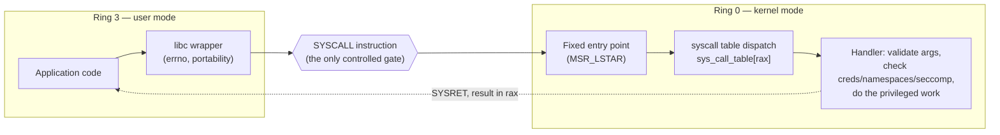
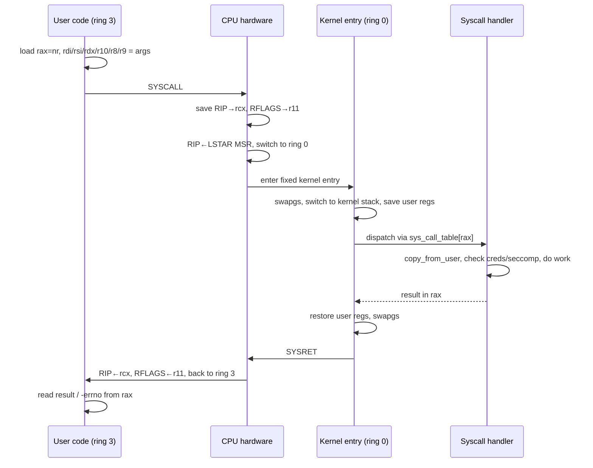
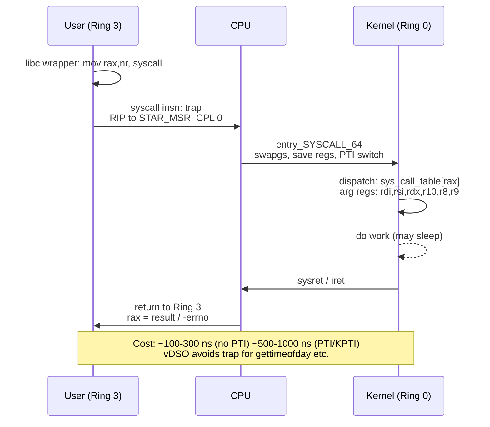
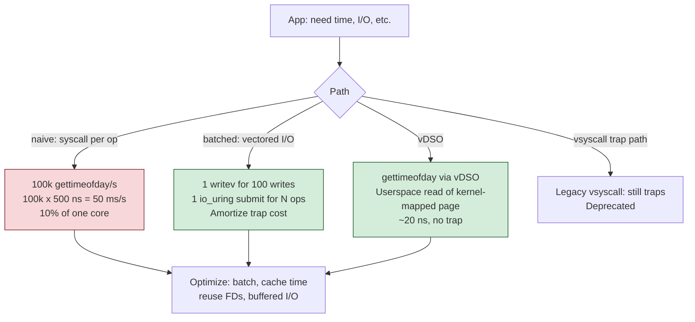
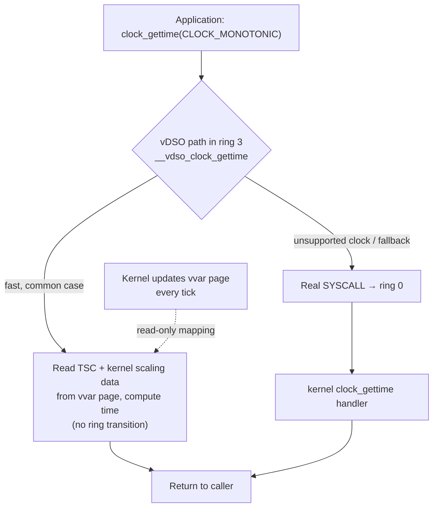
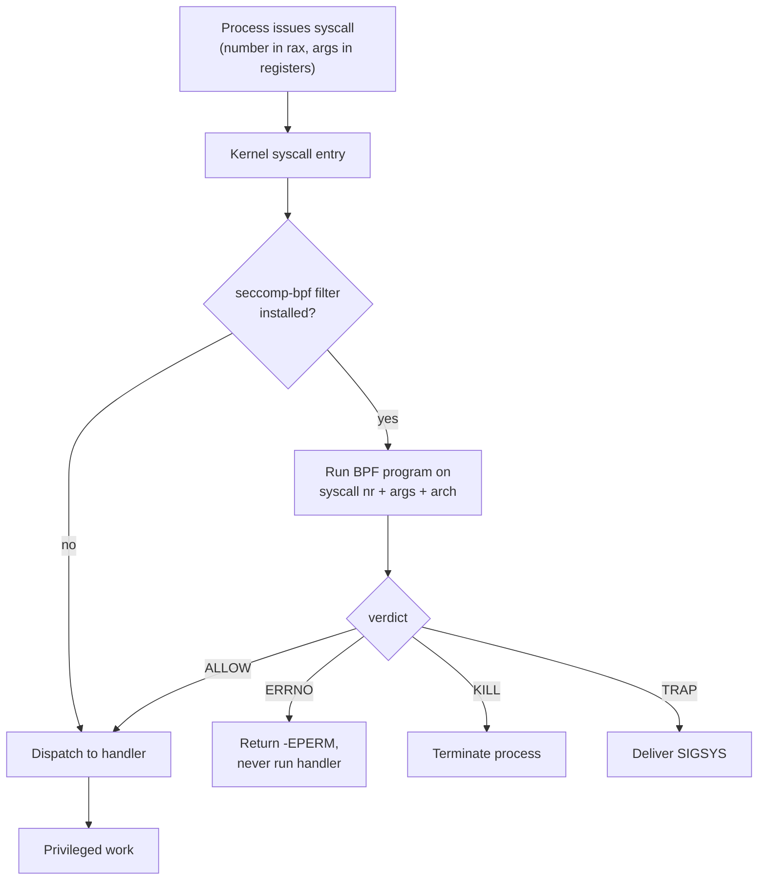

# Chapter 5 — System Calls and the Kernel Boundary

**What this chapter covers.** A running program is not allowed to do anything interesting on
its own. It cannot read a file, send a packet, map memory, create a process, or read the
clock from a device — every one of those touches hardware or shared kernel state, and the
hardware forbids user code from touching them directly. So a program *asks*. The system call
is the mechanism of asking: a controlled, hardware-enforced doorway from your code in ring 3
into the kernel in ring 0, the one and only sanctioned way across the privilege boundary
Volume 1, Chapter 10 (Hardware Virtualization) established. The set of syscalls *is* the API
of the operating system — everything a libc function, a language runtime, a database, or a
web server ultimately does to the outside world bottoms out in a syscall.

This chapter is about that boundary: what crossing it costs, why the cost matters at fleet
scale, and how high-performance systems are organized to cross it as rarely as possible. We
walk the `SYSCALL` instruction end to end on x86-64, distinguish the *mode switch* it causes
from the *context switch* it does not, account honestly for its price (worse since the 2018
speculative-execution mitigations), and then survey the entire toolbox of syscall-reduction:
buffered and vectored I/O, `sendfile`/`splice`, `io_uring`, and the vDSO trick that services
some "syscalls" without entering the kernel at all. Then we turn the boundary around and look
at it as the security perimeter — the place `seccomp`, gVisor, and the LSMs enforce isolation
by controlling *which* syscalls a process may make. We close on the ABI-stability rule that
makes this interface a contract you can build a decade of software on.

Learning goals — after this chapter you should be able to:

- Explain why user code cannot perform privileged operations directly, and why the syscall
  is the *only* controlled entry into ring 0.
- Walk a syscall through the x86-64 mechanism: the register convention (`rax` = number;
  `rdi`, `rsi`, `rdx`, `r10`, `r8`, `r9` = args), the `SYSCALL`/`SYSRET` fast path versus the
  legacy `int 0x80`, kernel-stack switch, syscall-table dispatch, and the `-errno` return.
- Distinguish a **mode switch** (same task, ring 3 → ring 0) from a **context switch**
  (different task) and account for the real cost of each, including the KPTI/Spectre overhead.
- Justify syscall reduction as a first-class performance lever and choose the right technique
  — buffering, `readv`/`writev`, `sendfile`/`splice`, `io_uring`, vDSO — for a given hot path.
- Explain what libc wrappers add (errno, portability), how `syscall()` bypasses them, and how
  the vDSO services `clock_gettime`/`gettimeofday` with no mode switch.
- Observe syscalls in anger with `strace`, `perf trace`, and eBPF, and know why the first is a
  debugging tool and the last two are production tools.
- Explain the syscall boundary as the isolation enforcement point: `seccomp-bpf`, Docker's
  default profile, gVisor's user-space kernel, and LSM hooks.

This chapter is Linux/x86-64-specific and builds directly on Volume 1, Chapter 10 (rings and
the isolation spectrum) and Volume 2, Chapter 1 (the process/task model). It sets up Chapter 7
(Linux I/O Models — `io_uring` and zero-copy get their full treatment there), Chapter 11
(perf and eBPF), and Book 6 (Containers and Kubernetes — seccomp profiles and sandboxing).

## The boundary and why it exists

Recall the hardware fact from Volume 1, Chapter 10: an x86-64 CPU runs in one of two privilege
levels that matter in practice — **ring 3** (user mode) and **ring 0** (kernel/supervisor
mode). A class of **privileged instructions** — loading the page-table base register `CR3`,
executing `HLT`, reading and writing model-specific registers via `RDMSR`/`WRMSR`, doing port
I/O with `IN`/`OUT`, masking interrupts — will simply fault if attempted in ring 3. That is
the whole basis of process isolation. The application literally *cannot* reprogram the MMU to
see another process's memory, cannot talk to the disk controller, cannot mask the timer
interrupt that lets the scheduler preempt it, because the instructions that would do those
things trap the moment it tries.

But a real program needs those effects constantly. Opening a socket reprograms a device.
Allocating heap changes page tables (Chapter 3). `fork` creates a task (Chapter 1). Reading a
file pulls bytes off a block device through the page cache. All of it requires ring-0 power the
process does not have. The resolution is not to grant the power — it is to let the process
*ask a trusted intermediary that already has it*. That intermediary is the kernel, and the ask
is a **system call**.

The crucial design property is that the transition into ring 0 does not let the user jump to an
arbitrary kernel address. If it did, the boundary would be worthless — you would just `SYSCALL`
into the middle of a routine that skips the permission check. Instead, the hardware entry is
fixed: the kernel, at boot, writes the address of *its* single entry point into a
model-specific register, and the `SYSCALL` instruction transfers control only there. The user
side chooses *which* service it wants by putting a number in a register; it does not choose
*where* in the kernel execution lands. Everything the kernel does after that — validating
arguments, checking credentials and namespaces, enforcing seccomp filters — happens on the
kernel's terms, in the kernel's code, on the kernel's stack.



This is the mental model to hold for the whole chapter: **one gate, chosen by the kernel, that
the user can only request to pass through.** Performance work is about passing through it less
often. Security work is about controlling what happens once you are through.

## How a syscall works, mechanically (x86-64)

Let us take the simplest possible example and follow every step. A program calls
`write(fd, buf, len)`. The libc wrapper does almost nothing interesting; the interesting part
is the raw syscall it emits. On x86-64 Linux the convention is fixed and worth memorizing:

| Register | Role |
|----------|------|
| `rax` | System call **number** (e.g., `write` = 1, `read` = 0, `openat` = 257) |
| `rdi` | Argument 1 |
| `rsi` | Argument 2 |
| `rdx` | Argument 3 |
| `r10` | Argument 4 |
| `r8`  | Argument 5 |
| `r9`  | Argument 6 |
| `rax` | Return value (on the way back): result, or `-errno` in `[-4095, -1]` |

Two details trip people up. First, syscalls take arguments in `r10`, not `rcx`, even though
`rcx` is the fourth argument in the normal System V C calling convention. That is because the
`SYSCALL` instruction itself clobbers `rcx` (it stashes the return address, `RIP`, there) and
`r11` (it stashes `RFLAGS` there). The kernel ABI works around the hardware by using `r10` for
the fourth argument. Second, there is no separate "error" return — success and failure both
come back in `rax`, and the convention is that a return value in the range `-4095` to `-1` is
interpreted as a negative errno. libc is what turns `-2` into "return `-1`, set
`errno = ENOENT`."

Here is the raw sequence for `write(1, buf, len)` in assembly, deliberately unwrapped:

```asm
    mov    rax, 1          ; syscall number for write
    mov    rdi, 1          ; fd = 1 (stdout)
    mov    rsi, buf        ; pointer to buffer
    mov    rdx, len        ; byte count
    syscall                ; enter the kernel
    ; on return: rax = bytes written, or negative errno
```

The `SYSCALL` instruction is the fast path, introduced with AMD64 and standard on every x86-64
CPU. The legacy mechanism was the software interrupt `int 0x80`, which went through the
interrupt descriptor table — a much heavier path involving a memory read of the IDT and full
interrupt-gate semantics. `SYSCALL` is deliberately lean: the CPU has the kernel's entry
address pre-loaded in the `LSTAR` model-specific register, so entry is a register-to-`RIP`
transfer with no table lookup. (The 32-bit-compatible fast entry is `sysenter`; the modern
64-bit world is `SYSCALL`/`SYSRET`.)

What `SYSCALL` does in hardware, precisely:

1. Saves the user return address into `rcx` and the user flags into `r11`.
2. Loads `RIP` from the `LSTAR` MSR — the kernel's fixed entry point.
3. Switches the CPU to ring 0 and applies the flag mask from the `SFMASK` MSR (this is how
   interrupts and the trap flag get disabled on entry).
4. Loads the kernel code segment from `STAR`. Notably, `SYSCALL` does **not** switch the stack
   pointer — `rsp` still points at the *user* stack the instant the kernel gets control.

That last point is why the very first thing the kernel entry code does is switch to the kernel
stack for that task. It uses the `swapgs` instruction to get at per-CPU kernel data (the kernel
stashes the kernel `GS` base so it can find its own structures without trusting any user
register), loads the task's kernel stack pointer, and only then saves the full user register
set onto that kernel stack. Now the kernel has a safe, trusted execution context. It reads the
syscall number out of the saved `rax`, bounds-checks it against the size of the table, and
dispatches:

```c
/* Conceptually, the dispatch is an indexed jump through a function-pointer table. */
if (nr < NR_syscalls)
        regs->ax = sys_call_table[nr](regs);   /* run the handler */
else
        regs->ax = -ENOSYS;                      /* unknown syscall number */
```

`sys_call_table` is exactly what it sounds like: an array indexed by syscall number whose
entries are pointers to handler functions (`sys_write`, `sys_openat`, and so on, generated from
`syscall_64.tbl` in the kernel tree). Dispatch is an array index and an indirect call — cheap.
The handler does the real work: it copies arguments in from user space with the
`copy_from_user` family (which validates that the pointers actually point into the caller's
address space, never trusting a user-supplied pointer), performs permission and namespace
checks, and carries out the privileged operation. When it finishes, it leaves the return value
in the saved `rax`, restores the user register set, executes `swapgs` again to hand `GS` back,
and issues `SYSRET`, which restores `RIP` from `rcx` and `RFLAGS` from `r11`, drops back to
ring 3, and resumes the user program on the instruction after its `SYSCALL`.



### Mode switch, not context switch

A syscall crosses privilege levels but stays inside the *same task*. Nothing about the process
identity changes: the same `task_struct`, the same address space, the same open file table
(Chapter 1). This is a **mode switch** (also called a privilege transition or a domain
crossing), and it is categorically cheaper than a **context switch**, in which the scheduler
tears down one task's CPU state and installs another's. Conflating the two is one of the most
common performance misunderstandings, so pin the distinction down:

| Property | Mode switch (syscall) | Context switch |
|----------|----------------------|----------------|
| Task changes? | No — same process/thread | Yes — different task |
| Address space (`CR3`) changes? | No, in classic design (see KPTI below) | Often yes (different process) |
| Scheduler runs? | No | Yes — pick next task |
| Registers saved/restored | User GPRs onto kernel stack | Full task CPU + FPU state |
| TLB impact | Minimal classically; KPTI added a `CR3` reload | Flush or PCID reload on address-space change |
| Rough cost | Tens to a few hundred ns | ~1–several µs (plus cold-cache aftershock) |
| Triggered by | `SYSCALL`, faults, interrupts | `schedule()`: preemption, blocking, yield |

A syscall *can* lead to a context switch — if `read` finds no data ready, the task blocks, the
scheduler runs, and some other task gets the CPU — but the boundary crossing itself is not one.
For a syscall that does not block (`getpid`, a `write` that lands in a buffer, a `clock_gettime`
that falls through to the kernel), you pay only the mode switch: save/restore of the user
register set, the ring transition, the `swapgs` pair, and the second-order costs — the pipeline
serialization the transition forces, and the cache and TLB pollution from running kernel code
in the middle of your user working set. Those second-order effects are why even a "cheap"
syscall is not free: you resume in ring 3 with some of your data and translations evicted by
the kernel's own footprint.

### What the mitigations cost

Before 2018 the raw `getpid` round trip on a modern x86-64 core was on the order of a few tens
of nanoseconds. Then Meltdown and Spectre changed the arithmetic, and the change is directly
relevant to anyone counting syscalls in a hot path.

- **KPTI (Kernel Page-Table Isolation)**, the Meltdown fix, stopped mapping the full kernel
  into the user page tables. Now a syscall must switch `CR3` from the user page tables to the
  kernel page tables on entry and switch back on exit. On CPUs without PCID that means TLB
  flushes on every crossing; with PCID the cost is smaller but real. Either way, syscalls got a
  new per-crossing tax they never had before.
- **Spectre v2** mitigations (retpolines, and IBRS/IBPB/STIBP where microcode provides them)
  slowed indirect branches and added barrier work around privilege transitions.

The net is workload-dependent, but on affected hardware the boundary crossing got meaningfully
more expensive — on some microbenchmarks the bare syscall cost roughly doubled or worse. Treat
any pre-2018 "syscalls are ~50 ns" figure with suspicion, hedge your own numbers, and — the
operative lesson — recognize that the mitigations *raised the price of the boundary*, which is
precisely what pushed the industry toward architectures that cross it far less often.




## The cost of syscalls, and why you reduce them

So a syscall is cheap-ish but not free: on the order of hundreds of nanoseconds for the
crossing alone on mitigated hardware, plus whatever the handler does, plus the cache/TLB
aftershock. In isolation that is nothing. In a hot path it is everything. A service doing four
syscalls per request at a million requests per second is doing four million boundary crossings
a second, and at a few hundred nanoseconds each that is a meaningful slice of a core spent
doing nothing but crossing — before any actual work. This is the recurring theme of the
chapter and of high-performance Linux backend engineering generally: **the number of syscalls
per unit of work is a first-class performance metric, and most of the I/O toolbox exists to
drive it down.**

The techniques form a ladder, from "make each syscall carry more work" to "stop synchronously
crossing at all":

| Technique | What it reduces | Mechanism | Chapter |
|-----------|-----------------|-----------|---------|
| **Buffered I/O** (stdio, `bufio`) | Number of `write`/`read` calls | Accumulate in a user buffer; one syscall per buffer flush, not per record | this chapter |
| **Vectored I/O** (`readv`/`writev`, `preadv`/`pwritev`) | Calls for scattered buffers | One syscall moves many non-contiguous buffers (scatter/gather) | this chapter |
| **`sendfile` / `splice`** | Copies *and* calls | Move bytes fd→fd inside the kernel; no user-space bounce buffer (zero-copy) | Ch 7 |
| **`io_uring`** | Synchronous crossings | Submit many ops via a shared ring; batch-submit, reap completions; near syscall-free steady state | Ch 7 |
| **vDSO** | The crossing itself | Service `clock_gettime`/`gettimeofday`/`getcpu` in user space from a kernel-updated page | this chapter |
| **Kernel bypass** (DPDK, AF_XDP) | The kernel path entirely | Poll the NIC from user space; no per-packet syscall | Ch 10 |

**Buffering** is the oldest and simplest. `fprintf` to a stream does not call `write` per line;
it fills an in-process buffer and flushes when full (or on newline for a terminal). One
thousand log lines become a handful of `write` syscalls instead of a thousand. The cost is a
durability/visibility gap — data sits in the user buffer until flush — which is exactly why
you `fflush`/`fsync` at points that matter and why crash-consistency discussions (Chapter 6)
care about where the bytes actually are.

**Vectored I/O** attacks a different waste. Suppose you are writing an HTTP response: a status
line, several header buffers, and a body, each a separate allocation. Naively that is many
`write` calls, or an extra copy to concatenate them into one buffer first. `writev` takes an
array of `iovec` (pointer, length) pairs and writes them all in one syscall, in order, with no
concatenation copy:

```c
struct iovec iov[3] = {
    { status_line, status_len },
    { headers,     hdr_len     },
    { body,        body_len    },
};
ssize_t n = writev(fd, iov, 3);   /* one syscall, three buffers, gathered */
```

One boundary crossing, no user-space copy to stitch the pieces together. This is why HTTP
servers and RPC frameworks build responses as buffer lists and emit them with a single
`writev`. `sendmsg`/`recvmsg` generalize the same idea for sockets (and carry ancillary data
like SCM_RIGHTS fd-passing, Chapter 8).

**`sendfile` and `splice`** go further: they eliminate the user-space copy *and* the extra
crossings. Serving a static file the naive way is `read` into a user buffer then `write` it to
the socket — two syscalls and two copies (disk→page cache→user buffer, then user
buffer→socket) per chunk. `sendfile(out_sock, in_file, ...)` tells the kernel to move the bytes
from the file's page cache to the socket *without ever copying them into user space*, in one
syscall. `splice` does the same through a pipe as a general plumbing primitive. This is the
"zero-copy" family, and it is Chapter 7's subject; here the point is that it collapses both the
copies and the syscall count.

**`io_uring`** is the endgame and the reason the industry rethought Linux I/O after the
mitigation tax. Instead of one syscall per operation, the application and kernel share two ring
buffers in memory — a submission queue and a completion queue. The application writes many
operation descriptors into the submission ring and, in the best case, the kernel picks them up
and posts completions without the application issuing a syscall per op at all (with
`IORING_SETUP_SQPOLL`, a kernel thread polls the submission ring, so the steady state can be
*zero* syscalls for submission). A server that once did read/write/accept as three syscalls per
connection event can drive thousands of operations across a handful of `io_uring_enter` calls —
or none. `io_uring` gets its full treatment in Chapter 7; note here only that its entire reason
for existing is to amortize and then eliminate the boundary crossing that this chapter has been
pricing.

The distributed-systems reading of all this: these are not micro-optimizations, they are
fleet-level efficiency levers. A syscall reduction that saves 300 ns per request, multiplied
across a service handling millions of requests per second across thousands of machines, is
cores — real, budgeted, dollar-denominated capacity. The teams that run the largest I/O-bound
fleets (CDNs, proxies, databases, message brokers) obsess over syscalls-per-request precisely
because at their scale the boundary crossing is a line item.




## libc wrappers, `syscall()`, and the vDSO

Almost no application issues raw `SYSCALL` instructions. It calls libc — glibc or musl — and
libc wraps the syscall. The wrapper is thin but does three genuinely useful things: it exposes
a normal C function signature, it marshals arguments into the register convention and executes
`SYSCALL`, and it translates the `-errno` return into the POSIX contract of "return `-1` and
set the thread-local `errno`." That is the entire reason `errno` exists: the kernel has no
`errno`, it just returns negative numbers in `rax`, and libc is the layer that turns
`-ENOENT` into `errno = ENOENT`. musl and glibc differ in size and behavior (musl is smaller
and simpler, glibc has more compatibility machinery and caching), but both play this role.

When you need to invoke a syscall libc does not wrap — a very new one, or one libc deliberately
hides — you can reach the raw interface with the `syscall()` function:

```c
#include <sys/syscall.h>
#include <unistd.h>

/* gettid had no glibc wrapper for years; you called it raw. */
pid_t tid = syscall(SYS_gettid);
```

`syscall()` still sets `errno` and still goes through the kernel; it just skips the
purpose-built wrapper. It is the escape hatch for new kernel features that predate their libc
support (io_uring's `io_uring_setup`/`io_uring_enter` were reached this way before liburing).

### The vDSO: a "syscall" with no mode switch

Here is the clever part. Some things the kernel exposes as syscalls do not actually require
kernel privilege to *compute* — they require only kernel *data*. Reading the wall-clock time is
the canonical example. `clock_gettime(CLOCK_MONOTONIC, ...)` needs the current time, which the
kernel derives from a hardware clock source and some scaling factors it updates on every tick.
But the *reading* of that time is pure arithmetic: take the clock-source counter, apply the
kernel's current multiplier and offset, done. None of that needs ring 0. It only needs the
kernel's up-to-date scaling values.

So the kernel publishes those values into a page it maps read-only into every process's address
space, and it maps alongside them a small shared library — the **vDSO** (virtual dynamic shared
object) — containing user-space implementations of `clock_gettime`, `gettimeofday`, `time`, and
`getcpu`. When your program calls `clock_gettime`, glibc first tries the vDSO version, which
runs entirely in ring 3: it reads the counter (often via a `rdtsc`-based path), reads the
kernel's scaling data from the shared page, does the multiply-add, and returns — **no `SYSCALL`,
no mode switch, no boundary crossing at all.** Only if the vDSO path cannot serve the request
(an exotic clock, or a clock source that genuinely requires kernel work) does it fall through
to a real syscall.



Why it matters: time is read *constantly*. Every log line with a timestamp, every latency
measurement, every timeout check, every span in a distributed trace calls a clock function. In
an observability-heavy service that can be one of the hottest calls in the process. Turning it
from a ~hundreds-of-nanoseconds boundary crossing into a ~tens-of-nanoseconds arithmetic
routine, at that frequency, is a large win — and it is invisible, which is the point. The vDSO
is the one place the boundary is optimized by *not crossing it*, using the observation that the
privilege wall exists to protect state, and reading a value that is safe to expose does not need
protecting. (The vDSO superseded the older, fixed-address `vsyscall` mechanism, which had its
own security problems and is now emulated or disabled; the vDSO is ASLR-friendly and is the
mechanism you should think about.)

## Observing syscalls

Because the syscall boundary is where a process meets the world, watching syscalls tells you
exactly what a program is actually asking the kernel to do — which files it opens, which it
fails to find, which network calls block, how many `futex` calls a lock-contended run makes.
The tools differ enormously in cost, and the difference is instructive.

**`strace`** is the classic. It shows every syscall a process makes, with decoded arguments and
return values:

```
$ strace -tt -T curl -s https://example.com -o /dev/null
openat(AT_FDCWD, "/etc/ssl/certs/ca-certificates.crt", O_RDONLY) = 4 <0.000018>
socket(AF_INET, SOCK_STREAM|SOCK_CLOEXEC, IPPROTO_TCP) = 5 <0.000021>
connect(5, {sa_family=AF_INET, sin_port=htons(443), ...}, 16) = -1 EINPROGRESS <0.000040>
...
```

`strace` is built on **`ptrace`**, the same debugging facility a debugger uses. It arranges
(via `PTRACE_SYSCALL`) for the traced process to *stop* on both syscall entry and syscall exit,
at which point the kernel wakes the tracer, which reads the stopped process's registers, decodes
the call, and lets it continue. That is the mechanism, and it explains the enormous cost: every
single syscall in the tracee turns into two stops, two context switches to the tracer and back,
and register reads across process boundaries. A program that makes heavy syscall use can run an
order of magnitude or more slower under `strace`. This is fine — even ideal — for debugging a
single misbehaving process ("why can't it find its config file?", "is it hanging in `connect`
or `read`?"), and disastrous if pointed at a busy production process, whose latency it will
wreck and whose real behavior it may perturb (a Heisenbug generator).

For production, use the low-overhead tools:

- **`perf trace`** does the same job as `strace` but is built on the kernel's tracing
  infrastructure (tracepoints and the perf ring buffer) rather than stop-the-world `ptrace`. It
  samples/streams syscall events through an in-kernel buffer without stopping the target twice
  per call, so its overhead is a fraction of `strace`'s. It is the right first reach on a system
  you cannot afford to slow down.
- **eBPF** tools (`bpftrace`, and the bcc scripts like `syscount`, `opensnoop`, `execsnoop`) are
  the production standard. You attach a small verified program to the syscall tracepoints or to
  specific kernel functions, and it aggregates *in the kernel* — counting syscalls per process,
  histogramming latencies, snooping every `openat` fleet-wide — emitting only the summary to user
  space. Because the filtering and aggregation happen in-kernel and there is no per-call
  stop/copy, overhead is low enough to run continuously in production. eBPF is the whole subject
  of Chapter 11; for now, the ladder to remember is: **`strace` to debug one process, `perf
  trace` for a lighter look, eBPF to observe the fleet without perturbing it.**

A quick `strace -c` (which counts and times syscalls rather than printing each) is often the
fastest way to answer "what is this process spending its kernel time on?":

```
$ strace -c -f ./server
% time     seconds  usecs/call     calls    errors syscall
------ ----------- ----------- --------- --------- ----------------
 41.2    0.512340           5     102400           read
 33.8    0.420110           4     102400           write
 18.1    0.225300          11      20480           futex
  ...
```

That table — dominated by `read`/`write`, or by `futex` (lock contention), or by
`clock_gettime` (a hint the vDSO is not being used, or a genuinely time-obsessed loop) — is
frequently the fastest route to "you are making too many syscalls, and here is which ones."

## The syscall as the isolation boundary

Everything so far has treated the boundary as a performance surface. It is equally a *security*
surface — arguably *the* security surface of the operating system. A process's entire ability to
affect the world outside its own address space is mediated by syscalls: to touch a file, a
socket, another process, the clock's *setting*, a device, it must call the kernel. Therefore, if
you can control which syscalls a process may make, you can bound what damage it can do. A process
that cannot call `ptrace` cannot inspect other processes; one that cannot call the mount or
network-configuration syscalls cannot reconfigure the host; one that cannot call `execve` a
second time cannot pivot to a new program. **Restricting the syscall set shrinks the attack
surface**, and this is the foundation of every serious sandbox on Linux.

### seccomp and seccomp-bpf

**seccomp** (secure computing mode) is the kernel's in-process syscall firewall. Its modern form,
**seccomp-bpf** (mode 2), lets a process install a **classic BPF** program that the kernel runs
on *every* syscall the process subsequently makes. The filter sees the syscall number and the
raw argument registers (and the architecture, which you must check to avoid multiplexing
attacks), and returns a verdict:

| seccomp return action | Effect |
|-----------------------|--------|
| `SECCOMP_RET_ALLOW` | Let the syscall proceed normally |
| `SECCOMP_RET_ERRNO` | Block it; return a chosen errno (e.g., `EPERM`) without running it |
| `SECCOMP_RET_KILL_PROCESS` / `KILL_THREAD` | Terminate — the process asked for something forbidden |
| `SECCOMP_RET_TRAP` | Deliver `SIGSYS` so the process can handle the denial |
| `SECCOMP_RET_TRACE` | Hand off to a `ptrace` supervisor to decide |
| `SECCOMP_RET_LOG` | Allow, but log — used to build profiles by observation |

The filter is set once and is **irrevocable and inherited** across `fork` and `execve` (a
process cannot loosen its own sandbox, and children stay confined), which is exactly what you
want for a security boundary. Crucially, seccomp filters operate on the syscall number and
register-level arguments only — they cannot dereference a user pointer to inspect, say, a path
string (that would be a TOCTOU hazard, since the memory could change between check and use), so
seccomp is good at "may this process call `mount` at all?" and not the right tool for "may it
open *this specific* path?" (that is the LSMs' job, below).



This is not a niche feature. **Docker applies a default seccomp profile to every container it
runs** unless you explicitly disable it. That profile allows the ~300-plus syscalls a normal
workload needs and *blocks* a few dozen dangerous or rarely-legitimate ones — the ones that
manipulate kernel modules, reconfigure the machine, or have been sources of container escapes:
`kexec_load`, `init_module`/`finit_module`, `reboot`, `mount`/`umount2`, `ptrace` (by default),
`bpf`, the old obscure or namespace-manipulation calls, and so on. Blocking them costs a normal
containerized service nothing (it never calls them) and removes whole categories of escape and
privilege-escalation primitives from a compromised container's reach. That trade — near-zero
cost to legitimate workloads, large reduction in what an attacker can reach — is why seccomp is
on by default in the container runtimes and why Book 6 (Containers and Kubernetes) treats a
tightened seccomp profile as baseline hardening. Kubernetes exposes it through the
`seccompProfile` field (with `RuntimeDefault` as the recommended setting, and localhost profiles
for custom ones).

### gVisor: intercept the syscalls in user space

seccomp *filters* the real syscall interface; **gVisor** replaces it. As Volume 1, Chapter 10
described, Google's `runsc` runtime interposes a **user-space kernel** (the *Sentry*) between the
container and the host. Guest application syscalls are trapped — via `ptrace` or a KVM-based
mechanism — and redirected into the Sentry, a re-implementation of a large part of the Linux
system-call surface written in Go, running in user space. The Sentry services the guest's
syscalls itself and makes only a small, tightly restricted set of *real* syscalls to the host
kernel (itself further confined by seccomp). The security argument is defense in depth: the
enormous, historically bug-prone Linux syscall surface is no longer directly reachable by
untrusted guest code; a guest exploit has to get through the Sentry first, and even then the
Sentry's own access to the host is minimal. The cost is compatibility (not every syscall or edge
case is implemented) and performance (that interposition is not free — syscall-heavy workloads
pay for it). gVisor is the clearest illustration of the chapter's thesis from the security side:
**the syscall boundary is the enforcement point, and you can harden a system by controlling,
filtering, or wholesale re-implementing what crosses it.**

### LSMs: policy on the objects, not just the numbers

seccomp answers "which syscall numbers?" The **Linux Security Modules** framework — SELinux,
AppArmor, and others — answers the richer question "may *this* subject perform *this* operation
on *this* object?" LSMs work by placing **hooks** at security-relevant points deep inside syscall
handlers — after the arguments have been safely copied in and resolved to kernel objects (an
inode, a socket, a task). At each hook the active LSM consults its policy (SELinux's type
enforcement, AppArmor's per-program path rules) and returns allow or deny. Because the hook fires
*inside* the handler with fully resolved kernel objects, an LSM can enforce "this web-server
process may read `/etc/nginx` but may not read `/etc/shadow` and may not connect outbound except
to the app tier" — the object-level, context-sensitive policy seccomp structurally cannot express.
The two compose: seccomp coarsely removes whole syscalls a workload never needs; the LSM finely
governs what the permitted syscalls may touch. Together, plus namespaces and cgroups (Chapter 9),
they are how the syscall boundary is turned into a real multi-tenant isolation perimeter.

## ABI stability: the boundary as a contract

There is one more property of the syscall interface that makes all of the above worth building
on: it does not change out from under you. Linus Torvalds' cardinal rule for the Linux kernel is
**"we do not break userspace."** A syscall's number, its argument layout, and its documented
behavior are a stable contract; a kernel upgrade will not renumber `write` or change what its
arguments mean or repurpose an existing flag bit to break existing binaries. A program compiled
against the syscall ABI in 2008 still runs on a 2026 kernel. This is why the syscall table only
ever *grows* — numbers are assigned and never reused — and why a program can depend on the
interface for a decade.

The corollary shapes how the interface evolves. Because you cannot change an existing syscall's
meaning, new capabilities arrive as **new syscalls** or as previously-reserved **flag bits**.
Where a syscall needs a new behavior, the kernel adds a successor rather than mutating the
original: `dup` → `dup2` → `dup3`, `pipe` → `pipe2`, `accept` → `accept4`, `open` → `openat` →
`openat2`, `clone` → `clone3`, `epoll_create` → `epoll_create1`. The pattern is almost always
"same thing, plus a `flags` argument," and the reserved-must-be-zero flag fields are how *future*
extensions get room without breaking today's callers: a program that passes `0` today keeps
working when a new flag is defined tomorrow, and a program that passes the new flag on an old
kernel gets a clean `EINVAL` rather than silent misbehavior. That discipline — extend, never
mutate; grow the table, never renumber; reserve flag space for the future — is what lets the
whole ecosystem (every libc, every language runtime, every container runtime, every static
binary in a scratch image) treat the syscall boundary as bedrock.

## Distributed-systems lens

Pull the threads together at fleet scale, and the syscall boundary shows up as two levers and one
diagnostic.

**Efficiency lever.** The syscall is the per-request unit of kernel interaction, and for
I/O-bound services it is the cost that multiplies. A proxy, an API gateway, a database, a cache,
a message broker — their throughput ceiling and tail latency are shaped substantially by how many
times they cross into ring 0 per request and how much each crossing carries. Reducing
syscalls-per-request via buffering, `writev`, `sendfile`/`splice`, and above all `io_uring`
(Chapter 7) is not micro-optimization at this scale; a few hundred nanoseconds saved per crossing,
across millions of requests per second across thousands of hosts, is measured in cores and in the
capacity budget. The 2018 mitigation tax, which raised the price of every crossing, is a large part
of *why* `io_uring` and kernel-bypass frameworks (DPDK, AF_XDP — Chapter 10) moved from exotic to
mainstream: when the boundary got more expensive, the value of not crossing it went up. And the
vDSO is the quiet everyday version — timestamping is so frequent in an observable service that
servicing the clock in user space, invisibly, is a real fleet-wide win.

**Isolation lever.** For multi-tenant infrastructure — many workloads from many teams packed onto
shared hosts — the syscall boundary is *the* enforcement point. seccomp profiles shrink each
tenant's reachable syscall set (Docker's default profile fleet-wide, tightened further per
workload); LSMs govern what the permitted syscalls may touch; gVisor re-implements the surface in
user space for untrusted code. Every one of these is a statement about the syscall boundary:
control what crosses it, and you bound the blast radius of a compromised workload across the whole
fleet (Book 6). The container escapes that matter are, almost by definition, syscalls that should
have been filtered and were not.

**Diagnostic.** When a service misbehaves in ways that do not show up in application metrics — it
is slow, or chatty, or blocking somewhere unexpected — the syscall stream is ground truth for what
it is actually doing to the kernel. `strace -c` on one instance to see the distribution;
`perf trace` for a lighter look; and eBPF (`syscount`, `bpftrace`, Chapter 11) to answer the
same question continuously across the fleet without perturbing anything. "Which service is
hammering the kernel, with what, and how much does each call cost?" is a question you answer at
the syscall boundary, and at scale you answer it with eBPF.

## Key takeaways

- User code cannot perform privileged operations; the **syscall is the single controlled gate**
  into ring 0, and the kernel — not the caller — chooses where execution lands and what checks run.
- On x86-64 the convention is fixed: **number in `rax`; args in `rdi`, `rsi`, `rdx`, `r10`, `r8`,
  `r9`; result (or `-errno`) in `rax`.** `SYSCALL`/`SYSRET` is the fast path (`LSTAR` entry, no
  stack switch by the instruction), superseding legacy `int 0x80`; the kernel switches to the
  kernel stack, dispatches through `sys_call_table[nr]`, and returns.
- A syscall is a **mode switch, not a context switch** — same task, no scheduler, far cheaper —
  but it is not free: register save/restore, the ring transition, cache/TLB aftershock, and since
  2018 the **KPTI/Spectre mitigation tax** that roughly doubled the bare crossing on affected CPUs.
- **Syscalls-per-request is a first-class performance metric.** Drive it down with buffering,
  vectored I/O (`readv`/`writev`), zero-copy (`sendfile`/`splice`, Chapter 7), and batched async
  (`io_uring`, Chapter 7); the **vDSO** optimizes time-reads by not crossing at all.
- **libc wraps syscalls** (argument marshaling, `errno` from the `-errno` return, portability);
  `syscall()` is the raw escape hatch for calls libc does not wrap.
- **Observe** with `strace` (ptrace-based, two stops per call — great for one process, ruinous in
  production), `perf trace` (lighter, tracepoint-based), and **eBPF** (in-kernel aggregation, the
  fleet-scale tool — Chapter 11).
- The syscall boundary is **the isolation enforcement point**: **seccomp-bpf** filters which
  syscalls a process may make (Docker's default profile, Kubernetes `seccompProfile`), **gVisor**
  re-implements the surface in user space, and **LSMs** (SELinux/AppArmor) hook inside handlers to
  govern which objects the permitted syscalls may touch (Book 6, Volume 1 Chapter 10).
- The interface is a **stable contract** — "don't break userspace." The table only grows; new
  behavior arrives as new syscalls (`openat2`, `clone3`, `accept4`) or reserved flag bits, never as
  mutation of an existing call.

## Further reading

- **Linux man-pages**: `syscall(2)` (the per-architecture calling conventions, including the
  x86-64 register table), `syscalls(2)` (the full list), `vdso(7)` (what the vDSO exports and how
  it is mapped), `seccomp(2)` and `seccomp_unotify(2)`, `ptrace(2)`, and `writev(2)`/`sendfile(2)`.
  The canonical, version-tracked reference for everything in this chapter.
- **The Linux kernel source**: `arch/x86/entry/entry_64.S` (the `SYSCALL` entry path, `swapgs`,
  stack switch), `arch/x86/entry/syscalls/syscall_64.tbl` (the number-to-handler table), and
  `kernel/seccomp.c`. Reading the entry assembly once demystifies the whole crossing.
- **Intel 64 and IA-32 Architectures Software Developer's Manual**, Volume 2 — the `SYSCALL` and
  `SYSRET` instruction descriptions and the `LSTAR`/`STAR`/`SFMASK` MSR semantics. The AMD64
  Architecture Programmer's Manual, Volume 2, covers the same (AMD introduced `SYSCALL`).
- Jonathan Corbet et al., **LWN.io** — the running record of syscall and mitigation evolution:
  the KPTI and Spectre/Meltdown coverage (early 2018) for the mitigation-cost story, and the
  `io_uring` series for the batched-async design. Primary-source-quality kernel journalism.
- **gVisor documentation** (gvisor.dev), "What is gVisor?" and the security model / platform
  pages — the authoritative description of the Sentry, syscall interception, and the host
  restriction argument. Pairs with Volume 1, Chapter 10.
- **Docker default seccomp profile** (`default.json` in moby/moby) and the Docker "Seccomp
  security profiles" documentation — the concrete list of syscalls blocked by default and the
  rationale, plus the Kubernetes "Restrict a Container's Syscalls with seccomp" task guide.
- **KPTI / Kernel Page-Table Isolation** documentation under `Documentation/x86/` and the
  original Meltdown (Lipp et al., 2018) and Spectre (Kocher et al., 2018) papers — for the
  mechanism behind the syscall mitigation tax.
- Brendan Gregg, **Systems Performance**, 2nd ed., Addison-Wesley, 2020, and his BPF work — the
  practical syscall-observation toolkit (`strace` vs `perf trace` vs `bpftrace`/bcc) that
  Chapter 11 builds on.
- The `liburing` project and Jens Axboe's **"Efficient IO with io_uring"** design document — the
  primary source on the shared-ring, batch-submit model that is Chapter 7's centerpiece and the
  ultimate answer to syscall overhead.
