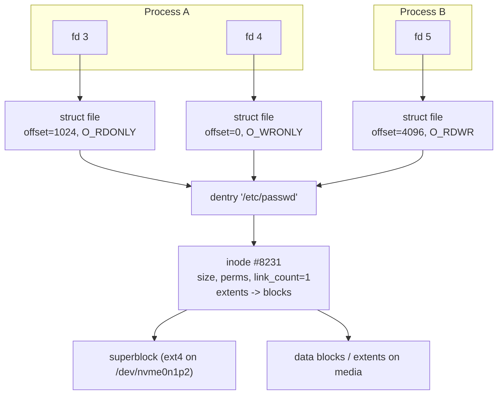
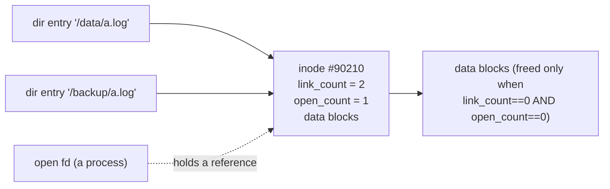
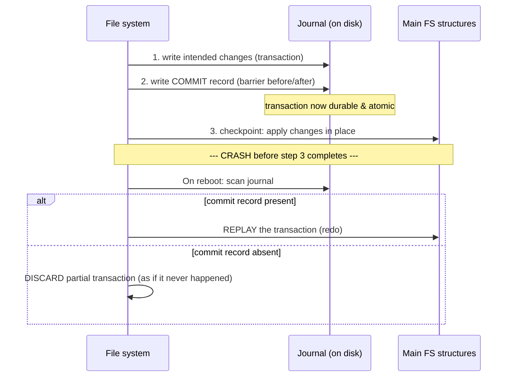
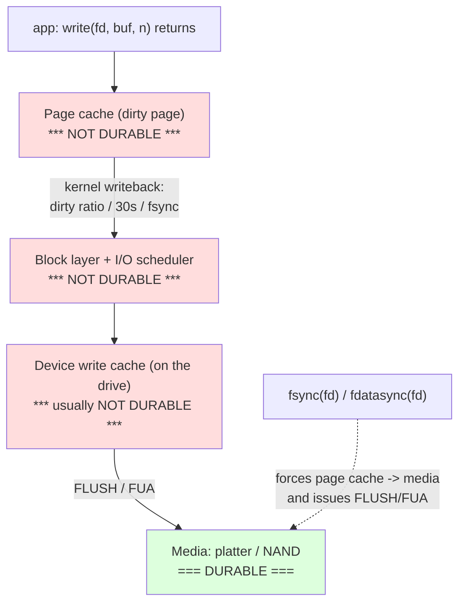

# Chapter 6 — File Systems and the VFS

**What this chapter covers.** Chapter 4 explained the page cache — the RAM layer that makes
file I/O fast and makes your memory dashboards lie. Volume 1 Chapter 5 explained the media
underneath — platters, NAND, NVMe, and the physics of what it takes to make a bit *stick*.
This chapter fills the gap between them: the **file system**, the kernel subsystem that turns
a linear array of disk blocks into named files, directories, and metadata, and — crucially —
that decides what "your write is safe" actually means. Every stateful thing a backend engineer
ships lives on a file system: the Postgres data directory, the Kafka segment, the RocksDB SST,
the etcd WAL, the container image layer. When one of those systems claims a transaction is
committed, the claim ultimately rests on a chain of assumptions about the file system beneath
it — assumptions that, when wrong, produce silent data loss that survives replication and
breaks consensus.

We proceed in three movements. First, the **VFS abstraction**: the object model (superblock,
inode, dentry, file) that lets `open`/`read`/`write` work identically across ext4, XFS, Btrfs,
and NFS, plus path lookup and the dentry cache. Second, the **on-disk reality**: how ext4, XFS,
Btrfs/ZFS, and tmpfs lay out blocks, and how each solves — or sidesteps — the
**crash-consistency problem** via journaling or copy-on-write. Third, and most important for
backend correctness, the **durability write path**: the layers a `write()` traverses before it
is truly safe, why `fsync` is the only thing that closes the gap, the subtle directory-fsync
bug, and the 2018 Postgres *fsyncgate* incident that taught the database industry that even
`fsync` can lie.

This chapter is Linux-specific throughout, and the durability material is load-bearing for
Volume 5 (Databases) and Volume 6 (Consensus) — a distributed system's "committed" is only
as durable as the local `fsync` underneath it.

Learning goals — after this chapter you should be able to:

- Explain the **VFS object model** — superblock, inode, dentry, file — and how the layered
  indirection from a file descriptor down to on-disk blocks enables one syscall API over many
  file systems.
- Describe **path resolution** and the **dentry cache**, and why name lookup is cached
  separately from inode data.
- State precisely the **inode-versus-name model**: why a file's name lives in its directory,
  not its inode; how hardlinks, link counts, `unlink`, and open file descriptors interact; and
  why "I deleted the file but the disk is still full" happens.
- Compare **ext4, XFS, Btrfs/ZFS, and tmpfs** on-disk designs — extents, allocation groups,
  copy-on-write, checksums — and pick the right one for a database or log workload.
- Explain the **crash-consistency problem** and the two families of solutions: **journaling**
  (ext4 `data=ordered`/`journal`/`writeback`) and **copy-on-write** (Btrfs/ZFS), plus what
  `fsck` is for and why journaling mostly retired it.
- Trace the **durability write path** end to end and state exactly where data becomes safe:
  `write()` → page cache → writeback → block layer → device cache → media, with `fsync` /
  `fdatasync` / FUA as the barriers.
- Explain **fsyncgate (Postgres, 2018)** accurately, the directory-fsync requirement, and
  `O_DIRECT`, and connect all of it to why different file systems give different crash
  guarantees ("All File Systems Are Not Created Equal").
- Reason about the **breadth topics** — file locking, extended attributes, FD/open-file-table
  semantics, `/proc` and `/sys`, FUSE, and NFS close-to-open consistency — well enough to
  avoid their classic footguns.

## The VFS: one API, many file systems

A backend service opens a config file on ext4, reads a log segment on XFS, and stats a value
in `/proc`, all with the same four syscalls: `open`, `read`, `write`, `close`. It never
learns, and never needs to learn, which file system backs each path. That uniformity is not
an accident of convention — it is enforced by a kernel layer called the **Virtual File
System** (VFS), sometimes the Virtual Filesystem Switch.

The VFS is indirection in the classic sense: it defines *abstract objects* and *operation
tables* (structs of function pointers), and each concrete file system fills in those pointers.
When your process calls `read()`, the VFS resolves the descriptor to a generic `struct file`
and calls `file->f_op->read_iter()` — a pointer ext4 set to `ext4_file_read_iter`, XFS set to
something else, and a FUSE mount set to a stub that forwards to a userspace daemon. The syscall
layer, the page cache, and your application see one interface; the diversity lives below the
function-pointer boundary. This is the *pluggable storage engine* pattern you know from
databases (InnoDB vs MyISAM behind one query API) — the same discipline, one level down.

Four object types carry the model.

| VFS object | Represents | Lifetime / scope | Key contents |
|---|---|---|---|
| **superblock** | A *mounted* file system instance | One per mount | Block size, total/free blocks, the FS type's op tables, dirty inode list, root dentry |
| **inode** | A *file* (its metadata + data location) — **not its name** | One per file, shared across all names/opens | Size, mode/permissions, owner, timestamps, link count, pointers to data blocks/extents |
| **dentry** | A *directory entry*: one name→inode mapping | Cached in RAM (the dcache); the on-disk directory is authoritative | Name component, pointer to its inode, parent dentry |
| **file** | An *open instance* of a file | One per `open()` (roughly) | Current offset, open flags/mode, a pointer to the inode (via dentry), the op table |

The separation is the whole point, so state each boundary precisely.

- A **superblock** is a *mounted file system*, not a file. `mount /dev/nvme0n1p2 /data` creates
  one; it holds everything global to that mount — block size, free-space accounting, and the FS
  type's operation tables.
- An **inode** is a *file's identity and metadata*: size, permissions, ownership, the three
  timestamps (atime/mtime/ctime), the **link count**, and the map from file offsets to physical
  blocks (a block list, or extents in modern file systems). It is identified by an inode number,
  unique within its file system. **The inode does not contain the file's name.**
- A **dentry** (directory entry) *is* the name — one path component (`"passwd"`) mapped to an
  inode. Directories are, on disk, essentially tables of dentries. The RAM dentry object caches
  that mapping and points at its parent dentry, which is how the kernel reconstructs a path.
- A **file** object is one *open instance*: it holds the **offset** (so two independent
  `open()`s have independent positions) and the open flags, and points through its dentry at
  the inode.



Read the diagram from the top: a **file descriptor** is a small integer into the process's
private FD table, pointing to a `struct file`. Multiple descriptors — same process or different
— can point at the *same* file object (what `dup()` and `fork()` produce; more below) or at
*different* file objects resolving to the *same inode* (two independent `open()`s). Every path
funnels into one inode per file, and every inode belongs to one superblock. This layering —
**fd → file → dentry → inode → superblock** — is the mechanical answer to how Linux mounts a
dozen file systems at once and lets one program walk across all of them: each layer is generic,
only the leaf operations are FS-specific.

### Path resolution and the dentry cache

Turning `/var/lib/postgresql/16/main/base` into an inode is *path resolution* (the kernel
calls it *pathwalk*, implemented in `fs/namei.c`). It is a component-by-component walk: start
at the root dentry (or the process's current-directory dentry for a relative path), look up
`var` in the root directory to get its inode and dentry, look up `lib` in *that* directory,
and so on. Each step involves a permission check (execute bit on the directory) and, on a
naive implementation, a disk read of the directory's contents.

Doing that from disk on every `open()` would be ruinous, so Linux caches the results in the
**dentry cache** (dcache): a hash table of recently used name→inode mappings, keyed by
(parent dentry, name). A cache hit turns a directory lookup into a hash lookup with no I/O.
The dcache is why re-opening a hot path is nearly free, and why a `find` over a cold tree is
slow the first time and fast the second. Negative dentries — cached *non-existence* of a name
— are also kept, so repeatedly `stat`-ing a file that does not exist (a real pattern: language
runtimes probing library search paths) does not repeatedly hit disk.

Two consequences matter operationally. First, the dcache and the **inode cache** are distinct
caches: a dentry can be evicted while its inode stays hot, or vice versa; they are reclaimed
under memory pressure as "slab" memory, which is why `slabtop` shows `dentry` and
`inode_cache` as large consumers on a box that has walked many paths. Second, symlink
resolution happens *during* pathwalk: when the walk hits a symlink dentry, the kernel reads
the link target and restarts the walk from there, with a recursion limit (40 links) to bound
loops. That mid-walk restart is why a symlink can point across file systems and why a symlink
loop returns `ELOOP` rather than hanging.

## Files and inodes: the name is not the file

The single most consequential fact about Unix file systems — the one that explains a whole
cluster of production surprises — is that **a file and its name are different objects with
different lifetimes.** The inode *is* the file: its metadata and its data blocks. The name is
a directory entry pointing at that inode. The link between them is counted.

### Hardlinks and the link count

Every inode carries a **link count** (`st_nlink`): the number of directory entries pointing
at it. A freshly created regular file has link count 1 (one name). A **hardlink** —
`ln existing newname` — creates a *second* directory entry pointing at the *same inode* and
bumps the count to 2. There is no "original" and "copy"; both names are equal, first-class
references to one inode with one set of data blocks. Editing through one name changes the
bytes seen through the other, because there is only one file.



`unlink()` — the syscall behind `rm` — does **not** delete a file. It removes one *directory
entry* and decrements the link count. The inode and its data blocks are freed only when the
link count reaches **zero** *and* no process still holds the file open. Concretely, the kernel
frees a file's storage only when **link count == 0 AND open count == 0.**

### The "deleted file, disk still full" gotcha

This is where the model bites in production. Suppose a long-running service has
`/var/log/app.log` open for writing, and an operator runs `rm /var/log/app.log` (or a broken
logrotate does). The directory entry is gone — `ls` shows nothing, the name is free to reuse —
but the *inode's link count is now 0 while the open count is still 1*. The file therefore
still exists, invisibly, and the process keeps writing to it. Its blocks are **not** reclaimed.
`du` on the directory tree shows nothing; `df` shows the disk filling up; the two disagree and
juniors lose an afternoon. The disk frees only when the process closes the descriptor (or
exits). The forensic move is `lsof | grep deleted` (or `ls -l /proc/<pid>/fd`), which lists
the still-open, already-unlinked inodes and points at the offending process. The fix is to
restart or signal the process, or truncate through `/proc/<pid>/fd/<n>` — not to hunt for a
file name that no longer exists.

This mechanism is a *feature* almost as often as a footgun. Creating a temp file and
immediately `unlink`-ing it while keeping the FD gives you private scratch storage that
vanishes even on crash — the anonymous-temp-file idiom, the spirit of `O_TMPFILE`. Atomic
config replacement uses the same invariants: write new content to a temp file, `fsync` it,
then `rename()` it over the old name. `rename` is atomic within a file system, and any reader
holding the old inode open keeps reading consistent bytes until it reopens; there is never a
moment where the name points at a half-written file.

### Symlinks versus hardlinks

A **symbolic link** is a different animal: it is its own inode whose data is a *path string*.
Resolving it means re-running pathwalk on that string. Because it stores a path, not an inode
reference, a symlink can point across file systems and can point at something that does not
exist (a dangling link) — neither of which a hardlink can do. A hardlink shares an inode, so
it is confined to a single file system (inode numbers are only unique within one), cannot
target a directory (that would create cycles the tree model forbids), and keeps the data alive
by the link count. Symlinks are fragile references to a *name*; hardlinks are robust
references to a *file*.

## On-disk structures: how the major file systems lay out bytes

Above the VFS boundary the API is uniform; below it, file systems make very different bets
about how to arrange blocks on media, and those bets show up as real performance and
durability differences. The four you will actually meet on backend infrastructure:

| File system | Allocation model | Crash consistency | Standout traits | Typical backend use |
|---|---|---|---|---|
| **ext4** | Extents (block-mapped legacy) | Metadata journaling (JBD2); optional data journaling | Mature, predictable, default on many distros | General-purpose root/data; safe default |
| **XFS** | Extents + B+ trees, **allocation groups** | Metadata journaling | High parallelism, huge files/FS, excellent large sequential I/O | Databases, big storage, RHEL default |
| **Btrfs / ZFS** | **Copy-on-write**, extents | CoW (no overwrite in place) + checksums | Snapshots, data+metadata checksums, integrated volume management | Snapshotting fleets, integrity-critical storage |
| **tmpfs** | Page cache pages (RAM/swap) | N/A (volatile) | No persistence, no fsync cost | `/dev/shm`, scratch, secrets in memory |

### ext4: block groups, extents, journaling

ext4 divides the device into **block groups**, each a self-contained region with its own
inode table, block/inode bitmaps, and data blocks. Keeping a file's inode and data in the same
block group improves locality (short seeks on HDD; better locality of reference generally).
Inodes are pre-allocated in fixed tables at format time — which is why an ext4 file system can
run out of *inodes* while it still has free *blocks* (`df -i` vs `df`), a real failure mode on
volumes holding millions of tiny files.

The important modern change is **extents**. Classic ext2/ext3 mapped a file's logical blocks
through a tree of indirect block pointers — fine for small files, wasteful for large ones (a
1 GiB file needed hundreds of thousands of pointer entries). An **extent** is a single record
saying "logical blocks 0..32767 live at physical block X, contiguously." A large contiguous
file needs a handful of extents instead of a huge pointer list, shrinking metadata and making
sequential I/O map cleanly to sequential media access. This is the same insight Volume 1
Chapter 5 drove home: contiguous, sequential access is what storage hardware — spinning or
flash — rewards.

ext4 defends contiguity with **delayed allocation**: dirtied data sits in the page cache
without a physical block assignment until writeback, so the allocator can see the whole write
and place it as one large extent rather than dribbling out blocks per `write()`. This reduces
fragmentation but has a durability subtlety we return to: unallocated data has more latitude to
be lost or reordered around a crash unless you `fsync`.

### XFS: allocation groups and scalability

XFS, originally from SGI and now the RHEL default, is built for parallelism and size. It
partitions the device into several **allocation groups (AGs)**, each with its own free-space
and inode B+ trees, and each independently lockable. Two threads allocating in two different
AGs do not contend, so XFS scales allocation throughput with cores in a way a single-locked
allocator cannot — which is exactly why it is favored for busy databases and large storage
arrays. Everything internal is a **B+ tree** (free space indexed by both offset and size,
inodes, directories), giving logarithmic operations at very large scale. XFS allocates inodes
dynamically rather than in fixed tables, so it does not hit ext4's fixed-inode-count wall. Its
journal covers metadata only; XFS never offered full data journaling, betting instead on
delayed allocation plus a metadata-only journal for speed. For large-file, high-concurrency,
sequential-heavy workloads — logs, database data files — XFS is frequently the right default.

### Btrfs and ZFS: copy-on-write, checksums, snapshots

Btrfs (Linux) and ZFS (from Solaris, widely used via OpenZFS) take a fundamentally different
stance: they are **copy-on-write (CoW)** file systems that **never overwrite live data in
place.** Modifying a block writes a *new* block elsewhere, then updates the pointer to it,
then updates that pointer's parent, up a tree of block pointers to a single root ("uberblock"
in ZFS, the tree root in Btrfs). The old blocks remain untouched until the new tree is fully
written and the root pointer is atomically switched. Two enormous properties fall out of this:

- **Cheap snapshots.** A snapshot is just a retained old root pointer; the shared blocks are
  not copied. Snapshot-heavy workflows (backups, dev/test clones, container base layers) become
  nearly free.
- **Integrity checksums.** Because every block is written fresh with a checksum stored in its
  parent pointer, ZFS and Btrfs can detect *silent data corruption* (bit rot, misdirected
  writes, a lying drive) on read, and with redundancy can self-heal from a good copy. This is
  end-to-end integrity the overwrite-in-place file systems cannot offer.

The trade-offs are real. CoW causes **fragmentation** under random-overwrite workloads — a
database rewriting B-tree pages in place turns each overwrite into a new-block allocation
elsewhere, scattering a once-contiguous file. This is why Postgres/MySQL on Btrfs often means
disabling CoW for the data directory (`chattr +C`), and why ZFS DB tuning centers on matching
`recordsize` to the DB page size. CoW also amplifies writes (one block change dirties the whole
pointer chain to the root). ZFS is a mature integrated storage-plus-volume-manager; Btrfs's
single-device and RAID-1 modes are solid while its parity-RAID modes have carried historical
caveats. Choose CoW when snapshots and integrity matter more than in-place random-write speed.

### tmpfs: a file system backed by RAM

**tmpfs** is a file system whose "storage" is the page cache itself, backed by RAM and swap.
Files on a tmpfs mount (`/dev/shm`, and often `/tmp` and `/run`) live in memory; they are fast,
they never touch a disk, and they vanish on reboot. `fsync` on tmpfs is a no-op because there
is no durable medium to flush to — which is the point when you want a scratch area or an IPC
shared-memory region, and a hazard if you mistake it for durable storage. tmpfs respects a
size limit and counts against memory, so a runaway writer to `/dev/shm` can pressure the OOM
killer (Chapter 4) exactly as anonymous memory would.

## Crash consistency: journaling and copy-on-write

Here is the problem every persistent file system must solve. A single logical operation —
create a file, append a block, rename — typically requires **several** separate on-disk updates
that must all happen or none happen. Appending a block means: allocate it (update the free-space
bitmap), point the inode at it, and update the inode's size and mtime. Lose power *between*
those writes and the file system is left **inconsistent**: a block marked allocated that no
inode references (a leak), or an inode pointing at a block still marked free (which the
allocator may hand to another file — silent cross-file corruption). Media and the block layer
guarantee neither the *order* in which independent writes reach the platter nor atomicity across
sectors, so the file system must impose that guarantee itself.

Historically the answer was **`fsck`** (file system check): after an unclean shutdown, scan
the *entire* file system at boot, cross-check bitmaps against inodes, and repair discrepancies.
This works but does not scale — a full `fsck` of a multi-terabyte volume can take many
minutes to hours, an unacceptable recovery time for a server. Two modern approaches make the
common-case crash recover in seconds instead.

### Journaling (ext4, XFS)

A **journal** (a write-ahead log for the file system's own metadata) turns a multi-write
update into an atomic one. Before touching the real on-disk structures, the file system writes
a description of the intended change to a dedicated journal area and marks it committed. Only
then does it apply the change to the actual inode/bitmap/directory locations (the "checkpoint").
The atomicity comes from a **commit record**: the change is durable if and only if its commit
record made it to the journal.



On recovery the file system reads only the journal, not the whole volume: replay every
committed transaction (idempotently — hence *redo*), discard any transaction lacking a commit
record. Recovery is proportional to the journal size, not the file system size — seconds, not
hours. That is why a modern Linux box boots cleanly after a power cut without a long `fsck`
(though `fsck` still exists as a last-resort repair for corruption the journal cannot cover).

ext4 (via the JBD2 journaling layer) offers three modes, and the distinction is a genuine
durability/performance lever:

- **`data=ordered`** (the default): journals **metadata only**, but *forces the associated
  data blocks to be written to their final location before the metadata transaction commits.*
  The ordering guarantee means you never see a metadata pointer to a block that contains stale
  garbage — after a crash, a file either has its old contents or its new contents at a given
  offset, never someone else's freed data. This is the sane default.
- **`data=journal`**: journals **both data and metadata** — every data block is written twice
  (once to the journal, once to its final location). Strongest ordering, safest, and the
  slowest, because of the double write. Rarely used except where its specific guarantees are
  required.
- **`data=writeback`**: journals metadata only and does **not** order data against it. Fastest,
  and the dangerous one: after a crash a file's metadata (new size) can be updated while its
  data blocks were never written, so a freshly extended file can expose **stale on-disk
  contents** — potentially another file's deleted data. Avoid for anything sensitive.

The crucial thing to internalize: journaling protects the **file system's own structural
integrity** so it never becomes unmountable garbage. It does **not**, by itself, guarantee
*your application's* data is durable at any particular instant. That is a separate promise you
must extract with `fsync`, discussed next.

### Copy-on-write as the alternative

CoW file systems (Btrfs, ZFS) get crash consistency almost for free, without a separate
journal for data, precisely because they never overwrite live data. A transaction builds an
entirely new tree of blocks off to the side; the only in-place mutation is the final,
single-sector **atomic switch of the root pointer**. Before the switch, the on-disk state is
entirely the old, consistent tree; after, it is entirely the new one. A crash mid-transaction
simply leaves the old root in place, and the half-written new blocks are unreferenced garbage
to be reclaimed. There is no window of structural inconsistency to repair, which is why ZFS
has no `fsck` at all — the design makes the inconsistent state unrepresentable. The cost is the
fragmentation and write-amplification discussed earlier; the benefit is a simpler, arguably
stronger consistency story plus the checksums and snapshots that ride along on the same
mechanism.

## The durability write path: where "written" becomes "safe"

This is the section that matters most for anyone building a database, a queue, a log, or a
consensus system. The central, expensive truth: **`write()` returning success does not mean
your data is on stable media.** It means your bytes were copied into the kernel's page cache
(Chapter 4) and the syscall returned. If the power fails one microsecond later, those bytes
are gone, and the file system's journal will not save them — journaling protects *its* metadata,
not *your* un-flushed data. Closing the gap is your job, and it has a specific cost.

Follow a byte from `write()` to permanence:



Trace each hop and note exactly where durability is *not* yet achieved:

1. **`write()` → page cache.** Your bytes become *dirty pages* in RAM. Fast, and volatile.
   Nothing has been persisted. The kernel will eventually flush them via **writeback**, driven
   by the dirty-page thresholds (`vm.dirty_ratio` / `dirty_background_ratio`) and a periodic
   timer (`dirty_expire_centisecs`, ~30 s) — Chapter 4's machinery. "Eventually" is the enemy
   of durability.
2. **Page cache → block layer.** Writeback hands dirty pages to the block layer and I/O
   scheduler, which orders and merges requests. Still in transit, still not durable.
3. **Block layer → device cache.** The drive accepts the write into its own **volatile write
   cache** (DRAM on the controller) and, by default, acknowledges *immediately* — before the
   bits reach the platter or flash. Fast, and a lie about durability, which is the whole reason
   the next step exists.
4. **Device cache → media, via FLUSH / FUA.** To force the drive to move data from its volatile
   cache to non-volatile media, the kernel issues a **cache-flush** command, or tags the write
   **FUA** (Force Unit Access — "do not acknowledge until this specific write is on media").
   These are the *write barriers* of Volume 1 Chapter 5. Only after a successful flush/FUA is
   the data genuinely safe against power loss (absent power-loss-protected drive caps, which
   enterprise SSDs have and consumer drives usually do not).

`fsync(fd)` is the syscall that drives this whole chain to completion: it writes back all of
that file's dirty pages, waits for them, and issues the cache flush, returning only when the
data (and the metadata needed to find it) is on media. That is why `fsync` is *slow* — it
converts an asynchronous, batched, cache-friendly operation into a synchronous round trip to
physical media, and it is the single dominant cost in the commit path of every durable data
system. Every design you know for amortizing it — **group commit**, batching many transactions
into one `fsync`; the WAL's sequential-append shape (Volume 5) — exists to spread one
expensive flush across many logical commits.

### `fsync` versus `fdatasync`

`fsync` flushes the file's data **and** all metadata needed to retrieve it — including
metadata that changed but is not strictly required for the data to be readable, like the
modification timestamp. `fdatasync` is the leaner variant: it flushes the data and *only* the
metadata **required to read it back** (notably the file size, if the write extended the file),
and skips inessential metadata updates like timestamps. When appending to a preallocated WAL —
where the file size is not changing — `fdatasync` can avoid an extra metadata write and inode
flush per commit, which is a measurable win at high commit rates. Databases that care about
commit latency (Postgres, MySQL) let you choose the sync method precisely for this reason.

| Primitive | Data to media? | Metadata to media? | Bypasses page cache? | Typical use |
|---|---|---|---|---|
| `write()` | No (page cache only) | No | No | Ordinary I/O; durability deferred |
| `fsync(fd)` | Yes | Yes (all) | No | Full durability incl. timestamps |
| `fdatasync(fd)` | Yes | Only size/essential | No | WAL append; skip inessential metadata |
| `O_DIRECT` write | To device cache | — | Yes (skips page cache) | DB managing its own cache/durability |
| FUA / FLUSH | — (mechanism) | — | — | The barrier `fsync` uses under the hood |

### The directory-fsync requirement (a classic subtle bug)

Here is the footgun that has bitten nearly every storage system at least once. You create a
new file, write to it, and `fsync` the file descriptor. The **file's data and inode** are now
durable — but the **directory entry** that *names* the file might not be. Recall the inode/name
split: the file's presence in its parent directory is a separate on-disk structure (the
directory's own data blocks and dentries), owned by the *directory's* inode, not the file's.
`fsync` on the file does not flush the *directory*. If the machine crashes after the file's
`fsync` but before the directory's own writeback, you can reboot to find a durable inode that
**no name points to** — an orphaned file, effectively lost, or a rename whose new name is gone.

The correct pattern for durably creating a file is therefore:

```c
int fd = open("/data/wal/000123.log", O_WRONLY | O_CREAT, 0644);
write(fd, buf, n);
fsync(fd);                 /* file data + inode durable */
close(fd);
int dfd = open("/data/wal", O_RDONLY | O_DIRECTORY);
fsync(dfd);                /* directory entry durable -> name now survives crash */
close(dfd);
```

The same directory `fsync` is required after a `rename()` if you need the rename itself to
survive a crash. The atomic-rename-for-config-replacement idiom is only *actually* crash-safe
when you `fsync` the file, `rename`, then `fsync` the containing directory. This is easy to
forget precisely because it works fine every time you test it — until a real power loss lands
in the millisecond window.

### fsyncgate: when `fsync` itself lies (Postgres, 2018)

The durability model above assumes `fsync` reliably *reports* failure. In 2018 the Postgres
community discovered — the episode is remembered as **"fsyncgate"** — that on Linux this
assumption was false in a way that could silently lose committed data. The mechanism, described
accurately:

When writeback of a dirty page fails (a transient I/O error, a thin-provisioned volume that
filled up, a disconnected network block device), the Linux kernel would mark the error on the
page, but in the process of handling it, **clear the page's dirty flag** and, in versions of
the era, drop the error state after reporting it *once*. Postgres's architecture separates the
process that writes dirty pages from the process (the checkpointer) that later calls `fsync` to
flush them. So the sequence could be:

1. A backend writes a dirty page; asynchronous writeback later *fails*, and the kernel records
   the error and clears the dirty bit — the page is now clean-but-not-persisted, and the error
   is latched to be reported to *the next* `fsync` caller.
2. Some process's `fsync` consumes that error (getting `EIO`) and the kernel then *clears* the
   error.
3. The checkpointer later calls `fsync` on the same file, gets **success** (the error was
   already consumed, the dirty bit already cleared), and concludes the data is safe.
4. Postgres advances its checkpoint, discarding the WAL records that could have recovered the
   lost page. The data is **gone**, and the system believes it committed.

The failure is doubly bad: the error could be delivered to a process that was not the one
responsible for durability, and — critically — a failed `fsync` that *is* seen cannot be
retried, because the kernel had already discarded the dirty page contents. Nothing was left to
write again; retrying `fsync` after `EIO` returned success while the data stayed lost. This
affected not just Postgres but MySQL, MongoDB (WiredTiger), and others trusting Linux `fsync`
error semantics.

Fixes came from both sides. The kernel improved error reporting so errors latch per open file
description and reach every `fsync` caller since the file was opened. Postgres changed policy to
**treat an `fsync` failure as unrecoverable and PANIC** (crash and recover from the WAL) rather
than retry — because after such a failure the page-cache state is untrustworthy and WAL replay
is the only path back to a known-good state.

The distributed-systems lesson is the load-bearing one for the rest of this suite: a database's
"committed" and a consensus protocol's "durable log entry" (Volume 6) are *defined* in terms of
a successful local persist. If the local persist can silently fail, the entire correctness
argument built on top of it — replication that trusts each replica's durable state, a Raft
leader that has "committed" an entry because a quorum reported it fsynced — rests on a false
premise. fsyncgate was not a performance bug; it was a **distributed-correctness bug rooted in
local file-system semantics.** It is why serious storage engineers treat fsync error handling
as a first-class correctness concern, not a detail.

### `O_DIRECT`: opting out of the page cache

Databases that manage their own buffer pool often do not want the kernel's page cache: it
double-buffers (once by InnoDB/Postgres, again by the kernel), makes memory accounting opaque,
and interposes kernel writeback heuristics between the database and the device. Opening a file
with **`O_DIRECT`** bypasses the page cache — reads and writes DMA (almost) straight to the
device from user buffers — and hands the application the obligations the page cache used to
cover: block-aligned buffers, its own caching, its own read-ahead. `O_DIRECT` does **not** by
itself guarantee durability: the write can still sit in the *drive's* volatile cache, so a
durable `O_DIRECT` write still needs a flush/FUA (or `O_DSYNC`). What it buys is *control* — the
database, not the kernel, decides what is cached and when data is flushed, exactly what a
system implementing its own WAL and buffer pool wants.

### Different file systems, different guarantees

A subtle and important research result underlies all of the above: **the crash-consistency
guarantees an application actually gets depend on which file system and mount options it runs
on.** The OSDI 2014 study by Pillai, Chidambaram, Alagappan, Al-Kiswany, Arpaci-Dusseau, and
Arpaci-Dusseau — *"All File Systems Are Not Created Equal: On the Complexity of Crafting
Crash-Consistent Applications"* — built a tool (ALICE) to enumerate the crash states an
application could observe, and found that widely deployed applications (databases, key-value
stores, version-control systems) harbored **crash-vulnerabilities**: they relied on ordering
or atomicity properties that *some* file systems happened to provide but the POSIX standard
does **not** require. An application that appeared correct on ext4 `data=ordered` could corrupt
on ext4 `data=writeback`, or on a different FS, because it depended on, say, "a `rename` is
atomic and ordered after the preceding `write`" — true on one substrate, not guaranteed on
another. POSIX says remarkably little about crash behavior; the concrete guarantees live in
each file system's implementation and mount options.

The practical consequence: **know your substrate.** File system type, journaling mode, whether
the drive's write cache and barriers are on — these are inputs to your durability argument, not
sysadmin trivia. The same database binary on the same hardware gives different crash guarantees
on ext4 `data=journal` vs XFS vs Btrfs vs a network block device with an intervening cache.
Systems that assume "the disk is a disk" get surprised; the ones that survive production either
constrain the substrate (documented, tested FS + mount options) or design recovery to tolerate
the weakest guarantee it can give.

## Breadth: locking, xattrs, FD semantics, pseudo-filesystems, FUSE, NFS

The VFS surfaces several more features that a backend engineer meets regularly. Each has a
sharp edge worth knowing.

### File locking is advisory, and does not cross machines

Linux offers two classic locking APIs. **`flock()`** takes a whole-file shared or exclusive
lock tied to the open file *description*. **`fcntl()`** byte-range locks (POSIX record locks)
lock a range and are tied to the *(pid, inode)* pair — with famously error-prone semantics: a
POSIX lock is released when the process closes *any* descriptor to that inode, which makes them
treacherous in libraries. Both are **advisory**: they coordinate only among processes that
*choose* to check. Nothing stops a process that ignores locking from writing through a
"locked" file. (Mandatory locking existed but was unreliable and is effectively gone.) Linux
`OFD` locks (`F_OFD_SETLK`) fix the worst POSIX semantics by tying the lock to the open file
description like `flock`, and are what new range-locking code should use. The distributed
caveat: **none of this coordinates across machines.** File locks are a single-kernel construct;
two nodes locking "the same file" on a shared NFS mount get, at best, unreliable server-side
emulation. Cross-node mutual exclusion needs a real distributed lock (etcd, ZooKeeper, a
lease) — a file lock is not it.

### Extended attributes

**Extended attributes** (xattrs) are key/value metadata attached to an inode beyond the fixed
fields, namespaced as `user.*`, `system.*`, `security.*`, `trusted.*`. They carry SELinux
labels (`security.selinux`), POSIX ACLs, file capabilities, and application metadata (object
stores overlaid on a file system stash checksums and content-type here). They are stored by the
file system (inline in the inode if small, in a separate block if large), and — a durability
note consistent with everything above — an xattr change is metadata that an `fsync` covers.

### The open file table, dup, shared offsets, fork inheritance

Recall the three-level structure and connect it to Chapter 1. A process's **FD table** maps
small integers to entries in the kernel's **open file table** (the `struct file` objects), and
each of those points to an inode. The distinctions matter:

- **`dup()` / `dup2()`** copy a *descriptor* so two FDs point at the **same `struct file`** —
  and therefore share the **same offset**. A write through one advances the read position of the
  other. This is exactly how shell redirection (`2>&1`) makes stdout and stderr share a
  position so their interleaved output does not overwrite itself.
- **`fork()`** (Chapter 1) copies the FD table, so the child's descriptors point at the **same
  `struct file` objects** as the parent's — again, **shared offsets**. Parent and child writing
  to an inherited log FD append in sequence rather than clobbering, *because* they share the
  offset. (Append safety across independent `open()`s instead needs `O_APPEND`, which makes each
  write atomically seek-to-end.)
- Two independent **`open()`** calls of the same path create **two different `struct file`
  objects** with **independent offsets**, both resolving to the one inode.

This is why "why did my two processes' writes interleave cleanly?" and "why did they clobber
each other?" both have precise answers: it comes down to whether they share a `struct file`
(dup/fork) or merely share an inode (independent opens), and whether `O_APPEND` is set.

### /proc and /sys: the kernel as files

The VFS abstraction is powerful enough that Linux exposes much of the kernel's *own* state
through it, as **pseudo-filesystems** with no backing storage. **`/proc`** presents per-process
and system state as files: `/proc/<pid>/status`, `/proc/<pid>/fd/` (open descriptors — your
`lsof` for deleted files), `/proc/meminfo`, `/proc/mounts`. **`/sys`** (sysfs) exposes the
device/driver model — block-device queue parameters, scheduler settings — as a tree.
**`/proc/sys`** (the `sysctl` tree) exposes writable tunables: `echo 3 >
/proc/sys/vm/drop_caches`, or the `vm.dirty_ratio` knobs from Chapter 4. None of these are on
disk; reading a file invokes a kernel function that formats the answer on the fly — the same VFS
function-pointer mechanism, with "file operations" implemented as "compute and return kernel
state." It is why `cat /proc/...` monitoring works uniformly, and why a container's namespaced
`/proc` can honestly differ from the host's.

### FUSE: file systems in userspace

**FUSE** (Filesystem in Userspace) lets a normal userspace program implement a file system: the
kernel FUSE driver receives VFS operations and forwards them, over a device channel, to a
userspace daemon that answers. This is how `sshfs`, `s3fs`, many cloud-storage mounts, and some
container image tools work. The cost is round trips: every `read`/`getattr` crosses the
kernel/user boundary and back, so FUSE trades performance for the ability to write a file system
in ordinary code with ordinary libraries. For metadata-heavy workloads it can be dramatically
slower than a native FS; for gluing an object store onto the POSIX API at acceptable throughput
it is often exactly right.

### NFS and the surprise of network file systems

The VFS lets a **network file system** sit behind the same `open`/`read`/`write` — **NFS** is
the canonical example — but the *consistency model* is where local intuition breaks. NFS (v3
especially) provides **close-to-open (CTO) consistency**: changes a client makes are guaranteed
visible to *other* clients only after the writer **closes** the file and the reader subsequently
**opens** it. In between, each client caches aggressively and does *not* see others' concurrent
changes in real time. An application assuming a POSIX-local model — "my write is immediately
visible to the node reading the same file" — will observe stale data, and finds `flock` across
NFS clients unreliable. NFS also introduced the "silly rename" (an unlinked-but-open file is
renamed to a hidden `.nfsXXXX` name to preserve open-file semantics across a stateless
protocol), and its caching means `fsync` durability now depends on the *server's* storage
stack. The general lesson: **a network file system offers the file system *interface* but not
the *guarantees* you assumed.** Treat "it's just a mounted directory" on NFS as a distributed
system in disguise, with its own consistency model to learn — not a local disk.

## Distributed-systems lens

File systems are the exact boundary where distributed data systems meet physical durability,
and nearly every hard lesson in the storage half of this suite lives at that boundary.

- **A "committed" write is only as durable as the `fsync` under it.** Volume 5's WAL and
  Volume 6's consensus logs define correctness in terms of durable local persistence. fsyncgate
  showed that if the local persist can silently fail, then replication trusting each replica's
  durable state — and a Raft/Paxos leader that "committed" because a quorum reported success —
  are building on sand. Local file-system semantics are a *distributed*-correctness input.
- **Different substrates give different guarantees, so distributed storage must know its
  ground.** "All File Systems Are Not Created Equal" is not academic: the same binary gives
  different crash behavior across ext4 modes, XFS, Btrfs, and network block devices. Serious
  systems pin and test their substrate or design recovery for the weakest guarantee it can give.
- **The write-path cost drives the durability/latency trade-off at the heart of data systems.**
  Because `fsync` is a synchronous round trip to media, every commit pays for durability in
  latency. Group commit, batched flushes, and sequential-append WALs all exist to amortize that
  one expensive barrier — and you can only reason about them if you know *where* in the
  page-cache-to-media path durability is actually achieved.
- **Network file systems have their own consistency models.** NFS close-to-open consistency,
  unreliable cross-client locking, and server-dependent durability mean "just put it on the NFS
  mount" quietly changes your correctness model. Shared-FS storage is a distributed system, not
  a disk.
- **The VFS mirrors the pluggable-backend pattern you use one level up.** One API over many
  implementations (ext4/XFS/Btrfs/FUSE/NFS) is the same discipline as a database with pluggable
  storage engines — and only as good as the guarantees each backend actually honors.

## Key takeaways

- The **VFS** provides one syscall API (`open`/`read`/`write`/`close`/`stat`) over many file
  systems via four objects: **superblock** (a mounted FS), **inode** (a file's metadata + block
  map, *not its name*), **dentry** (a name→inode entry, cached in the dcache for fast pathwalk),
  and **file** (an open instance, holding the offset). Descriptors resolve **fd → file → dentry
  → inode → superblock**.
- **The name is not the file.** The inode is the file; names are directory entries with a
  **link count**. `unlink` removes a name and decrements the count; storage frees only when
  **link count == 0 AND no open FD remains** — the source of hardlinks, the "deleted file, disk
  still full" gotcha, and the atomic anonymous-temp-file idiom. Symlinks store a *path*;
  hardlinks share an *inode*.
- **ext4** (block groups, extents, JBD2 journaling), **XFS** (allocation groups, B+ trees,
  high concurrency — a strong DB/large-storage default), **Btrfs/ZFS** (copy-on-write,
  checksums, cheap snapshots — at the cost of fragmentation under random overwrite), and
  **tmpfs** (RAM-backed, volatile) make different, load-bearing trade-offs.
- **Crash consistency** is solved by **journaling** (write intent + commit record to a journal,
  then checkpoint; replay committed / discard uncommitted on reboot — recovery in seconds, not a
  full `fsck`) or by **copy-on-write** (never overwrite in place; a single atomic root-pointer
  switch). ext4's `data=ordered`/`journal`/`writeback` modes trade safety for speed;
  `writeback` can expose stale data after a crash. **Journaling protects the FS's integrity,
  not your application's un-flushed data.**
- **A `write()` that returns is not durable** — it is a dirty page in the page cache. Durability
  requires driving the chain **page cache → writeback → block layer → device cache → media** to
  completion, which is what **`fsync`** does (via a FLUSH/FUA barrier). `fdatasync` skips
  inessential metadata (faster for WAL append). Creating a file durably also needs an
  **`fsync` on the containing directory** to persist the name.
- **fsyncgate (Postgres, 2018):** Linux could clear a dirty page's error state after reporting
  it once, so a failed writeback could be lost and a later `fsync` return success on data that
  was never persisted — and the failure could not be fixed by retry. The fix: kernel error
  reporting improved, and databases now **PANIC and recover from the WAL** on `fsync` failure
  rather than trust the page cache. `O_DIRECT` bypasses the page cache for DBs managing their own
  durability but still needs a flush for persistence.
- **Different file systems and mount options give genuinely different crash guarantees**
  ("All File Systems Are Not Created Equal") — so a distributed storage system must know and
  constrain its substrate. File locks are advisory and do not cross machines; `/proc` and `/sys`
  are the VFS exposing kernel state as files; FUSE trades performance for userspace flexibility;
  and NFS offers the file *interface* with **close-to-open** consistency, not local guarantees.

## Further reading

- Robert Love, *Linux Kernel Development*, 3rd ed. — chapters on the VFS, the block I/O layer,
  and the page cache; the clearest treatment of the superblock/inode/dentry/file object model.
- Bovet & Cesati, *Understanding the Linux Kernel*, 3rd ed. — detailed VFS, ext, and I/O
  internals.
- Remzi and Andrea Arpaci-Dusseau, *Operating Systems: Three Easy Pieces* — the "Persistence"
  chapters (file system implementation, FSCK and journaling, crash consistency). Free online at
  https://pages.cs.wisc.edu/~remzi/OSTEP/.
- Thanumalayan Sankaranarayana Pillai, Vijay Chidambaram, Ramnatthan Alagappan, Samer
  Al-Kiswany, Andrea C. Arpaci-Dusseau, Remzi H. Arpaci-Dusseau, *"All File Systems Are Not
  Created Equal: On the Complexity of Crafting Crash-Consistent Applications,"* OSDI 2014 —
  https://www.usenix.org/conference/osdi14/technical-sessions/presentation/pillai.
- The PostgreSQL *fsyncgate* thread (pgsql-hackers, 2018) and the LWN.net write-up
  *"PostgreSQL's fsync() surprise"* (https://lwn.net/Articles/752063/) — the incident, the
  kernel error-reporting semantics, and the PANIC-on-fsync-failure resolution.
- Linux man pages: `fsync(2)`, `fdatasync(2)`, `open(2)` (`O_DIRECT`, `O_APPEND`, `O_TMPFILE`),
  `write(2)`, `unlink(2)`, `rename(2)`, `flock(2)`, `fcntl(2)` (OFD locks), and `path_resolution(7)`.
- The `ext4` and `xfs` documentation in the kernel tree (`Documentation/filesystems/`), and the
  Btrfs and OpenZFS project documentation for copy-on-write internals, snapshots, and checksums.
- Volume 1, Chapter 5 — *Storage Hardware* (the media, device caches, FUA/flush, power-loss
  protection); Volume 2, Chapter 4 — *Memory in Practice* (the page cache, writeback, dirty
  ratios); Volume 5 (Databases — WAL, group commit, `O_DIRECT`); Volume 6 (Consensus — durable
  log entries and why local persistence underpins distributed commit).
