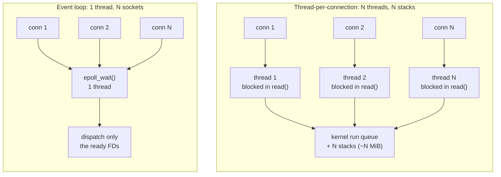
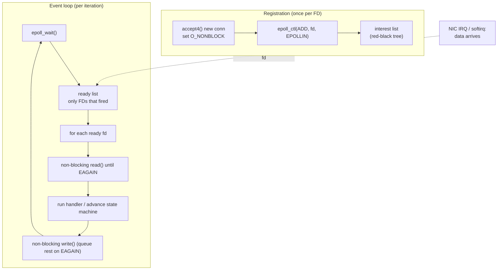
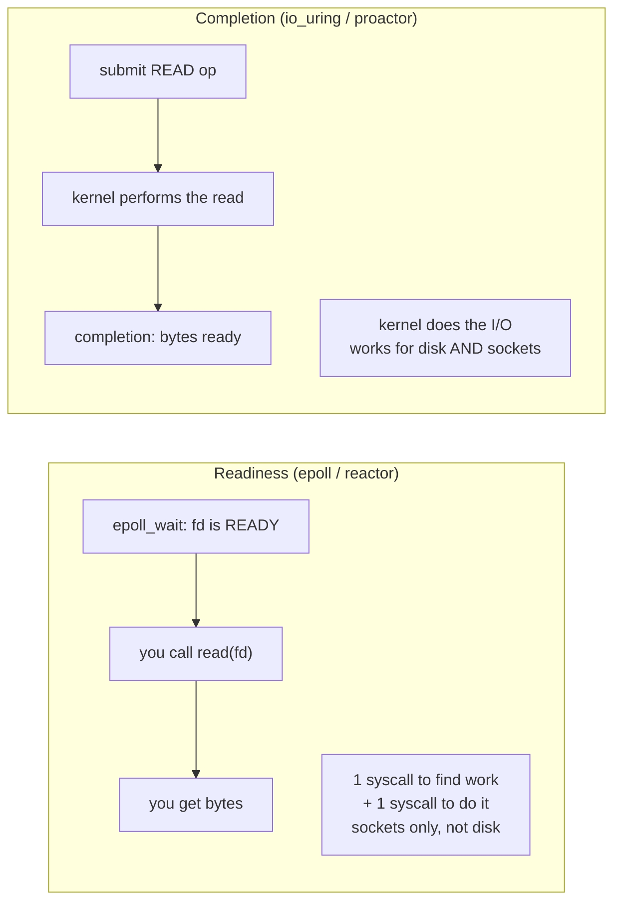
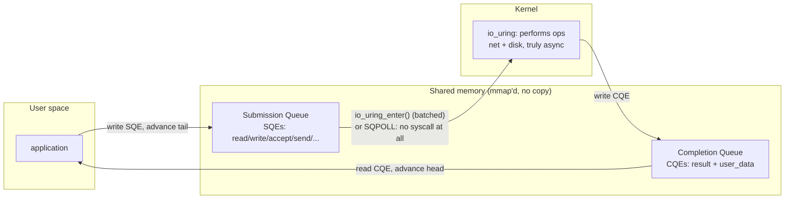
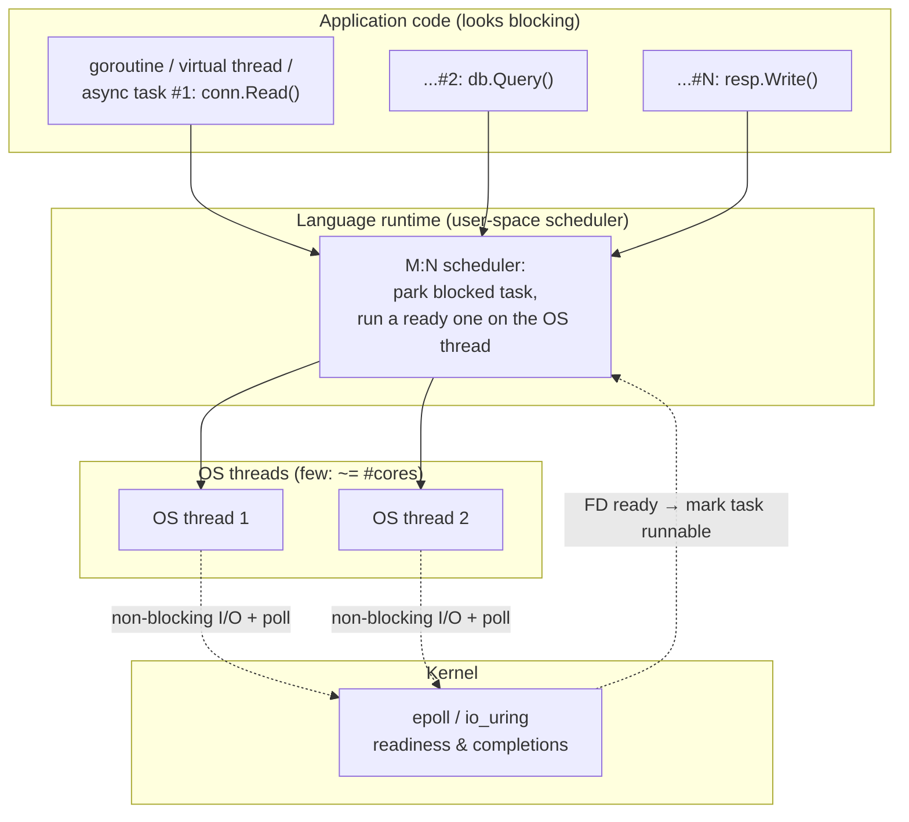

# Chapter 7 — Linux I/O Models: Blocking, epoll, and io_uring

**What this chapter covers.** A backend service is, mechanically, a machine for waiting. An
API gateway holding 200,000 keep-alive connections is *doing* almost nothing at any instant:
the overwhelming majority of those sockets are idle, waiting for the next request byte, the
next database reply, the next disk block. The single most consequential architectural
decision in such a service is not the language or the framework — it is **how it waits on
I/O**. That choice determines how many connections one box can hold, how CPU-efficient each
request is, and — critically — what your p99 latency does when load spikes. This chapter is
the "how does one server handle 100,000+ concurrent connections" story, told as an evolution:
from a thread blocked per connection, to a single thread multiplexing thousands of sockets
with `epoll`, to true completion-based asynchrony with `io_uring`, and finally to the
"looks-blocking" runtimes (Go, Java virtual threads, Rust/Tokio) that hide an event loop
behind ordinary sequential code.

We build directly on earlier chapters. The cost of a thread — its stack, its context-switch
overhead, its scheduler pressure — was quantified in Chapter 1 (The Process Model) and
Chapter 2 (CPU Scheduling); that cost is exactly what pushes servers off the
thread-per-connection model. The syscall boundary and its per-call cost, from Chapter 5
(System Calls and the Kernel Boundary), is what `epoll` amortizes and what `io_uring` nearly
eliminates. And the page cache and `O_DIRECT` distinctions from Chapter 6 (File Systems and
the VFS) are what made the old Linux AIO so disappointing and `io_uring` so overdue.

Learning goals — after this chapter you should be able to:

- Explain *why* I/O-bound concurrency is the defining problem of backend servers, and frame
  the C10K → C10M progression as a story about the per-connection cost of waiting.
- Describe blocking I/O with thread-per-connection precisely, and state exactly which
  resources (stack memory, context switches, scheduler run-queue length) make it hit a wall.
- Distinguish **readiness** models (`select`/`poll`/`epoll`) from **completion** models
  (POSIX/native AIO, `io_uring`), and place the reactor and proactor patterns on that axis.
- Use `epoll` correctly, including the difference between level-triggered and edge-triggered
  modes and the draining discipline ET demands — a classic and expensive bug source.
- Explain the shared-memory ring architecture of `io_uring` (SQ/CQ), why it removes a syscall
  per operation, why it delivers true async for *both* network and disk, and its security
  caveats.
- Explain how Go's netpoller, Java virtual threads (Loom), and `async/await` runtimes give
  you blocking-style ergonomics over an `epoll`/`io_uring` event loop with user-space
  scheduling — and why "don't block the event loop" is a law, not a style preference.
- Match an I/O model to a workload, and reason about the tail-latency consequences of each.

## The core problem: waiting is the workload

Consider a service that, for each request, reads a few kilobytes from a socket, issues one
database query over another socket, waits for the reply, and writes a response. On a modern
box the CPU work per request — parsing, serialization, a little business logic — might be a
few tens of microseconds. The *waiting* — for the client's bytes to arrive over the network,
for the database round-trip — is easily milliseconds, often tens of milliseconds. The ratio
of waiting to computing is frequently 100:1 or 1000:1.

This is the essential asymmetry of backend work: **your service spends almost all of its wall
time blocked on I/O, and almost none of it running instructions.** A design that dedicates an
expensive resource — an OS thread — to each connection for the entire duration it is *mostly
idle* is spending that resource on nothing. The whole history in this chapter is the search
for a way to hold a huge number of mostly-idle connections without paying a thread's worth of
cost for each.

Two numbers name the eras. **C10K** — coined by Dan Kegel in his 1999 essay "The C10K
problem" — asked how a single server could handle ten thousand simultaneous clients, a number
that broke the thread-per-connection assumptions of late-1990s Unix. **C10M**, popularized a
decade and a half later, asks the same question at ten million: a target reachable only by
ruthlessly minimizing per-connection cost, and often by pulling work out of the kernel
entirely (kernel-bypass, `AF_XDP`, DPDK — beyond this chapter but see Volume 3, The Linux
Network Stack). The models below are the rungs of that ladder.



The left side pays O(N) in memory and scheduler pressure. The right side pays O(1) threads
regardless of N, and CPU proportional only to the connections that are *actually ready* at a
given instant. That contrast is the entire chapter in one picture.

## Blocking I/O and thread-per-connection

The oldest model is the one every engineer learns first because it maps to sequential
thinking. A socket is blocking by default. You call `accept()` to get a connection, hand it
to a thread, and that thread calls `read()`; if no data is available, `read()` *blocks* — the
kernel puts the thread to sleep (off the run queue, in state `TASK_INTERRUPTIBLE`; see
Chapter 2) and wakes it when bytes arrive. The code reads top to bottom, exactly as you'd
write a single-user program:

```c
// one of these runs per connection, on its own thread
void handle(int fd) {
    char buf[4096];
    for (;;) {
        ssize_t n = read(fd, buf, sizeof buf);  // BLOCKS until data or EOF
        if (n <= 0) break;                       // 0 = peer closed, <0 = error
        process(buf, n);
        write(fd, buf, n);                       // may also block
    }
    close(fd);
}
```

The appeal is real: it is trivially correct, trivially debuggable (a stack trace tells you
exactly what each connection is doing), and each connection's state lives naturally on its own
call stack — no explicit state machine. For a service with tens or a few hundreds of
concurrent connections, thread-per-connection is a perfectly good, and often *correct*, choice.
Do not let this chapter talk you out of simplicity when your concurrency is low.

It hits a wall at scale for three concrete, kernel-level reasons, all developed in Chapters 1
and 2:

- **Stack memory.** Every thread needs a stack. The Linux default (`ulimit -s`) is commonly
  8 MiB of *virtual* address space, and while only touched pages are backed by physical
  memory (Chapter 3), the reservation and the touched pages add up. Even at a frugal 64–256
  KiB of resident stack per thread, 100,000 threads is gigabytes of RAM spent on stacks that
  are, per the asymmetry above, mostly parked. Thread-pool frameworks trim this, but the
  reservation is a real ceiling.
- **Context-switch overhead.** Waking a blocked thread, and later switching away from it,
  costs the direct register save/restore plus the indirect cost measured in Chapter 1 and 2:
  TLB and cache pollution. With thousands of runnable threads churning, the machine spends an
  increasing fraction of its cycles switching *between* work rather than doing work.
- **Scheduler pressure.** The CFS/EEVDF run queue (Chapter 2) is not free to manage. A run
  queue with thousands of runnable tasks lengthens scheduling decisions and worsens wakeup
  latency — and wakeup latency is directly your tail latency (Volume 11, Reliability and
  Observability). The scheduler was not designed on the assumption that "number of threads" and
  "number of connections" are the same large number.

None of these is a hard limit at a thousand connections; all of them bite hard at a hundred
thousand. C10K was, precisely, the observation that the thread-per-connection model's costs
grow linearly with a quantity (connection count) that was growing far faster than per-thread
cost was shrinking.

A crucial caveat, which the last section of this chapter cashes out: **the wall was a wall for
1:1 OS threads, not for the blocking-style *code***. Modern runtimes revived looks-blocking
programming by making the "thread" cheap — Go goroutines, Java virtual threads — while doing
event-driven I/O underneath. The ergonomics of this section came back; the costs did not.

## Non-blocking I/O and readiness

The way out is to stop dedicating a thread to each wait. Set the socket non-blocking with
`O_NONBLOCK` (via `fcntl` or `accept4(SOCK_NONBLOCK)`), and now `read()` on an empty socket
does not sleep — it returns immediately with `-1` and `errno == EWOULDBLOCK` (spelled `EAGAIN`
on Linux; they are the same value). The thread is never parked in the kernel on that one FD.

By itself that only converts blocking into busy-polling, which is worse. The missing piece is
a **readiness notification** mechanism: a way for *one* thread to ask the kernel "of these
thousands of FDs, which ones can I read or write *right now* without blocking?" and to *sleep*
until at least one can. That question — readiness multiplexing — is answered by three
successive syscalls, each fixing the previous one's scaling flaw.

### select and poll: O(n) every call

`select()` is the oldest. You build three bitmaps (read, write, exception), each an `fd_set`,
set a bit per FD you care about, and call `select()`; it blocks until at least one FD is ready,
then rewrites the bitmaps to mark which. Two flaws make it unusable at scale. First, `fd_set`
is a fixed-size bitmap — `FD_SETSIZE`, almost universally **1024** — so an FD number ≥ 1024
cannot even be represented (setting it is undefined behavior, and a classic security/corruption
bug). Second, the kernel must **scan every FD** in the set on every call: cost is O(highest FD
number), not O(interesting FDs). And because `select()` clobbers your bitmaps, you rebuild and
recopy them across the user/kernel boundary on every single call.

`poll()` fixes the count limit: you pass an array of `struct pollfd { int fd; short events;
short revents; }`, of any length, and the kernel fills in `revents`. No 1024 ceiling, and
input/output are separated (`events` vs `revents`) so you don't rebuild the interest set. But
the fundamental cost is unchanged: the kernel still scans the **entire array** on every call
to see which FDs are ready — O(n) in the number of *watched* FDs, whether or not any are
active — and you still copy the whole array in and out each time. For an event loop watching
100,000 connections where 50 are ready, `poll()` does 100,000 units of work to find those 50,
on every iteration.

### epoll: the kernel keeps the ready list

`epoll` is Linux's answer, and it is an architectural change, not just a faster `poll()`.
Instead of passing the full FD set on every wait, you register interest *once* and let the
kernel maintain the state across calls. Three syscalls:

- `epoll_create1(0)` — create an epoll instance; returns an FD referring to a kernel object
  that holds two structures: an **interest list** (the FDs you're watching, kept in a
  red-black tree keyed by FD for O(log n) add/remove) and a **ready list** (a linked list of
  FDs that have become ready).
- `epoll_ctl(epfd, EPOLL_CTL_ADD|MOD|DEL, fd, &event)` — register, modify, or remove one FD in
  the interest list. You do this once per FD (and again only when its interest mask changes),
  *not* on every wait.
- `epoll_wait(epfd, events, maxevents, timeout)` — block until one or more watched FDs are
  ready, then return **only the ready ones**, filled into your `events` array.

The decisive property is how the ready list is populated. When you `epoll_ctl(ADD)` an FD,
the kernel attaches a callback to that FD's wait queue. When data arrives on the socket, the
network stack's wakeup path fires that callback, which appends the FD to the epoll instance's
ready list. `epoll_wait()` therefore does *no scanning*: it simply returns whatever is on the
ready list. Its cost is proportional to the number of **ready** FDs, not the number of
**watched** FDs. Watching 100,000 mostly-idle connections and finding the 50 that are ready
now costs ~O(50), not O(100,000). That is the whole game.



The comparison, made concrete:

| Property | `select` | `poll` | `epoll` |
|---|---|---|---|
| Max FDs | `FD_SETSIZE` (≈1024) | unlimited | unlimited |
| Cost per wait | O(max FD number) | O(watched FDs) | O(ready FDs) |
| Interest set passed | every call (rebuilt) | every call | registered once (`epoll_ctl`) |
| Kernel state across calls | none | none | persistent instance |
| Portability | POSIX (everywhere) | POSIX (everywhere) | Linux only |
| Edge-triggered mode | no | no | yes (`EPOLLET`) |

`epoll` is Linux-specific. The BSD family (and macOS) has **`kqueue`**, reached via
`kqueue()`/`kevent()`, which solves the same problem with the same "register once, kernel keeps
the ready list" architecture and is, if anything, more general (it multiplexes not just socket
readiness but timers, file-system events, process and signal events through one interface).
Portable event-loop libraries — libev, libevent, libuv (Node.js's loop) — exist precisely to
paper over `epoll` vs `kqueue` vs Windows IOCP behind one API. Solaris had `/dev/poll` and
event ports in the same vein. The lesson generalized; the syscalls differ per OS.

### Level-triggered vs edge-triggered — the classic bug

`epoll` supports two notification semantics, and confusing them is one of the most common and
most painful bugs in event-driven code.

**Level-triggered (LT)** is the default and matches `poll()`'s behavior. `epoll_wait()` reports
an FD as ready *whenever it is ready* — i.e., as long as there is data in the receive buffer.
If you read only part of the available data and loop again, `epoll_wait()` will report the FD
ready *again* because data still remains. LT is forgiving: you may read once per wakeup, do a
fixed amount of work, and come back; you will be re-notified about the leftover.

**Edge-triggered (ET)**, enabled with the `EPOLLET` flag, reports an FD only on a *transition*
— roughly, only when *new* data arrives that moves the socket from not-ready to ready. After an
ET notification, you will **not** be told again until *more* new data comes in, even if there
is still unread data sitting in the buffer. This is more efficient (fewer wakeups, no
re-scanning of FDs whose data you already know about) and is what high-performance loops often
use — but it imposes a strict discipline:

> With edge-triggered epoll you **must drain the FD completely** on each notification —
> `read()` in a loop until it returns `EAGAIN`/`EWOULDBLOCK`. If you stop early, the unread
> bytes sit in the buffer with no pending edge to re-notify you, and that connection **hangs
> forever** (a stuck request, a leaked connection, a mysterious partial read). The same applies
> to `write()`/`EPOLLOUT`: drain the send buffer until `EAGAIN`.

ET therefore only makes sense with non-blocking FDs — if the socket were blocking, the drain
loop's final `read()` (with the buffer empty) would block the entire event loop. The canonical
ET read handler is:

```c
// edge-triggered: MUST loop until EAGAIN, FD is non-blocking
for (;;) {
    ssize_t n = read(fd, buf, sizeof buf);
    if (n > 0)            { process(buf, n); continue; }
    if (n == 0)           { close(fd); break; }          // peer closed
    if (errno == EAGAIN)  { break; }                     // fully drained — done
    if (errno == EINTR)   { continue; }                  // interrupted, retry
    close(fd); break;                                    // real error
}
```

| Aspect | Level-triggered (default) | Edge-triggered (`EPOLLET`) |
|---|---|---|
| Notifies while | data remains readable | only on new-data transition |
| Wakeups | more (re-notified until drained) | fewer (once per arrival) |
| Read discipline | may read once; re-notified for the rest | **must** drain until `EAGAIN` |
| Blocking FD safe? | tolerable | no — must be non-blocking |
| Failure mode | busy-ish, but correct | forget to drain → connection hangs |
| Typical use | simpler loops, most apps | max-throughput loops (nginx, Netty option) |

A related flag, `EPOLLONESHOT`, disables an FD after one notification until you re-arm it with
`epoll_ctl(MOD)`; it is the standard tool for safely handing a ready FD to a worker thread in a
multi-threaded event loop without two threads racing on the same connection. Getting LT/ET
right is the difference between an event loop that works and one that intermittently strands
connections under load — and because ET bugs only manifest when a read is *partial* (large
messages, slow clients, TLS records split across packets), they routinely escape testing and
surface as tail-latency incidents in production.

## The reactor: an event loop over epoll

Put the pieces together and you get the **reactor** pattern (named by Douglas Schmidt): a small
number of threads — often *one* — each running a loop that calls `epoll_wait()`, and for every
ready FD dispatches to a handler that does non-blocking I/O and advances that connection's
state. All the connection's state that used to live implicitly on a thread's call stack now
lives explicitly in a per-connection structure (a state machine, a continuation, a callback
chain).

```c
// the reactor, in miniature
int ep = epoll_create1(0);
add(ep, listen_fd, EPOLLIN);                 // watch the listener too
struct epoll_event evs[MAX];
for (;;) {
    int n = epoll_wait(ep, evs, MAX, -1);    // sleep until something is ready
    for (int i = 0; i < n; i++) {
        int fd = evs[i].data.fd;
        if (fd == listen_fd) {
            int c = accept4(listen_fd, ..., SOCK_NONBLOCK);
            add(ep, c, EPOLLIN | EPOLLET);   // register the new connection
        } else {
            handle_ready(fd, evs[i].events); // non-blocking read/write, advance state
        }
    }
}
```

This scales because the number of threads is decoupled from the number of connections. One
event-loop thread can hold tens or hundreds of thousands of connections, waking only for the
handful ready at any instant, paying no per-connection stack and adding no per-connection entry
to the scheduler run queue. This architecture powers the highest-concurrency servers in the
industry:

- **nginx** runs one event-loop process per CPU core (worker processes), each an `epoll`
  reactor, which is why it holds enormous connection counts at low memory.
- **Redis** is famously a (mostly) single-threaded `epoll` event loop; its speed comes partly
  from never paying synchronization or context-switch cost on the hot path (see Chapter 4 on
  why its fork-based persistence interacts badly with THP).
- **Node.js** is a single-threaded JavaScript event loop over libuv (which is `epoll` on Linux,
  `kqueue` on BSD/macOS, IOCP on Windows).
- **Netty** (the JVM's high-performance networking framework, under gRPC-Java, Cassandra,
  Elasticsearch and much else) is an `epoll`/`kqueue` reactor with a small pool of event-loop
  threads, each owning a shard of the connections.

The reactor's virtues come with a sharp, defining constraint, which is worth stating as a law:

> **You must never block the event loop.** Every handler runs *on* the loop thread. If one
> handler makes a blocking call — a synchronous DB query, a `read()` on a blocking FD, a
> filesystem `stat` on a slow mount — or does a long CPU-bound computation (a big JSON parse, a
> crypto operation, a regex on a megabyte), the *entire loop stops*. Every other connection
> that thread was serving is frozen until the handler returns. One slow request becomes a
> latency spike for thousands.

The consequences shape real service design. CPU-bound work is offloaded to a **worker thread
pool**, with results posted back to the loop. Blocking dependencies must be replaced with
non-blocking/async clients, or likewise pushed to a pool. Node.js's cultural aversion to
synchronous APIs, and its `libuv` thread pool for filesystem and DNS work, are this law made
concrete. The other cost is cognitive: because a connection's control flow is spread across
callbacks fired at different times, reactor code historically degenerated into deeply nested
callbacks — "callback hell" — and error handling and backpressure became genuinely hard to get
right. That pain is exactly what the async/await and green-thread runtimes later set out to
erase, without giving up the loop underneath.

## From readiness to completion: the async I/O gap

Everything so far — `select`, `poll`, `epoll`, `kqueue` — is a **readiness** model. The kernel
tells you *when* an FD is ready, and then **you** perform the actual `read()`/`write()`
syscall. This is the reactor pattern, and it has two residual costs. First, you still make a
data-moving syscall per ready FD (`epoll_wait` finds the work; the `read` does it) — two
crossings per I/O. Second, and more fundamentally, **readiness only works for sockets and
pipes**. A regular file on a local disk is *always* "ready" as far as `epoll` is concerned —
you can always call `read()` on it — but that `read()` may still block for milliseconds while
the block layer fetches from storage. `epoll` cannot help you wait for *disk* without blocking.
For disk, you need a different model entirely.

That model is **completion-based** (the **proactor** pattern, also from Schmidt): instead of
being told when you *can* start an operation, you *submit* the operation and are later notified
when it has **completed**, with the result. The kernel does the I/O on your behalf; you get a
completion event carrying "your read of 4096 bytes finished; here they are." Readiness asks
"can I go?"; completion says "it's done."



Linux's history of completion-based I/O before `io_uring` is a history of disappointment, and
understanding why is what makes `io_uring` legible as a *solution* rather than just a new API:

- **POSIX AIO** (`aio_read`, `aio_write`, `aio_suspend`, …) is the standard's answer. On Linux,
  glibc implements it in **user space with a hidden thread pool** — each async op is really a
  blocking op on a background thread. It "works" but delivers none of the efficiency promise:
  you're back to thread-per-operation, just concealed. It is little used for serious work.
- **Linux native AIO** (`io_submit`/`io_getevents`, the `libaio` interface) is a real
  in-kernel async interface — and it is notoriously disliked. Its crippling limitation: it is
  truly asynchronous *only* for **`O_DIRECT`** file I/O (Chapter 6). For ordinary
  page-cache-backed (buffered) file I/O, `io_submit` silently falls back to **blocking** —
  defeating the entire purpose. It doesn't cover network I/O usefully, and even in its intended
  path, operations like metadata lookups can block the submitting thread. Databases that wanted
  async disk (e.g., certain storage engines) tolerated it *only* under `O_DIRECT`, and everyone
  agreed it was a dead end.

So on the eve of `io_uring`, Linux had: excellent scalable *readiness* for sockets (`epoll`),
and no good *completion*-based async for disk. That gap — plus the per-operation syscall cost
that even `epoll` couldn't remove — is what `io_uring` was built to close.

## io_uring: shared-memory rings

`io_uring`, created by Jens Axboe and merged in **Linux 5.1 (2019)**, is the most significant
advance in the Linux I/O interface in many years. Its core idea is to replace the
syscall-per-operation model with **two shared-memory ring buffers** mapped into both user space
and the kernel, so that submitting work and reaping results become, in the common case,
*memory writes and reads with no syscall at all*.

The two rings:

- **Submission Queue (SQ).** A ring of **SQEs** (submission queue entries). To ask for an
  operation, user space writes an SQE describing it — an opcode (`IORING_OP_READ`,
  `_WRITE`, `_ACCEPT`, `_SEND`, `_RECV`, `_FSYNC`, `_OPENAT`, `_CLOSE`, `_SENDMSG`, `_POLL_ADD`,
  `_TIMEOUT`, and dozens more), the target FD, buffer pointer, length, offset, and flags — and
  advances the ring's tail. It can queue *many* SQEs this way before ever entering the kernel.
- **Completion Queue (CQ).** A ring of **CQEs** (completion queue entries). When an operation
  finishes, the kernel writes a CQE containing the result (bytes transferred or a negative
  errno) and a `user_data` field the app set on the SQE to correlate completion with request.
  User space reads CQEs and advances the head — again, just memory operations.



The mechanics behind that picture:

- Setup is `io_uring_setup(entries, params)`, which returns a ring FD; user space then `mmap`s
  the SQ, CQ, and SQE array. The **`liburing`** library wraps this boilerplate and is what most
  applications actually call (`io_uring_queue_init`, `io_uring_get_sqe`,
  `io_uring_prep_read`, `io_uring_submit`, `io_uring_wait_cqe`).
- To hand queued SQEs to the kernel and/or wait for completions you call
  `io_uring_enter()`. The batching win: you can prep **N** operations and submit them all with
  **one** `io_uring_enter` — N operations, one syscall, versus N syscalls with `read`/`epoll`.
  This is Chapter 5's "amortize the syscall boundary" taken to its limit.
- **`SQPOLL` mode** goes further: a dedicated kernel thread *polls* the submission ring, so
  user space submits work by writing an SQE and advancing the tail with **no syscall at all**
  in steady state. Combined with **`IOPOLL`** (busy-poll completions for low-latency NVMe), this
  yields a submission-to-completion path that can avoid syscalls entirely on the hot path.
- **Registered files and fixed buffers** (`io_uring_register`) let the kernel pre-pin buffers
  and cache file references, removing per-operation lookup and page-pinning cost — cutting the
  copy/refcount overhead Chapter 5 attributes to each crossing.

Why it is a genuine breakthrough, not just a faster API:

1. **True async for both network *and* disk**, buffered *and* direct — the thing native AIO
   never delivered. A single interface asynchronously handles socket `recv`, file `read` from
   the page cache, `fsync`, `accept`, and more, all through the same rings.
2. **Syscall reduction to near zero.** Batched submission collapses many operations into one
   `io_uring_enter`; `SQPOLL` removes even that. At high request rates the per-op syscall cost
   that dominated `read`/`epoll` loops largely disappears.
3. **Fewer copies and less per-op setup** via fixed buffers and registered files.
4. **Breadth of operations and chaining.** Beyond basic I/O it supports linked operations
   (`IOSQE_IO_LINK` — "do B after A completes"), multishot operations (one `accept` or `recv`
   SQE that keeps producing CQEs for each new connection/message), and timeouts — letting you
   express whole request pipelines with minimal kernel round-trips.

Adoption reflects this: high-performance databases and storage engines (ScyllaDB was an early,
prominent adopter through its Seastar framework; PostgreSQL added `io_uring`-backed async I/O
in its 18 release), proxies and web servers, and language runtimes are all moving toward it.
The Rust ecosystem has `tokio-uring` and `glommio`; the JVM and Go have experimental
integrations discussed in the last section.

### The security caveat — hedge it

`io_uring` must be discussed with a clear caveat, because it directly affects whether you can
use it in production. Its power comes from a large, complex new kernel-facing surface — many
opcodes, asynchronous execution contexts, shared memory — and that surface has been a
**significant source of kernel vulnerabilities**. Google's security teams reported that
`io_uring` accounted for a disproportionate share of the exploitable Linux kernel bugs they saw
through their kCTF/VRP program (as of early 2026; current posture may have evolved — check Google's security blog and kernel release notes), and consequently **disabled `io_uring`** across ChromeOS,
Android, and their production servers. Container platforms restrict it: gVisor and many seccomp
default profiles block the `io_uring` syscalls, and hardened environments turn it off via
`sysctl kernel.io_uring_disabled`. The honest guidance: `io_uring` is a major performance win,
but it is **relatively young and has a live security track record**, so treat "is `io_uring`
permitted in this environment?" as a real question — of kernel version, seccomp profile, and
security posture (Volume 0, Book 6, Container and Cloud-Native Supply Chain Security) — not a
given. Many fleets gate it behind an explicit, per-workload decision.

## The "looks-blocking" comeback: user-space scheduling

The reactor solved scalability but taxed the programmer: explicit state machines, callback
chains, the never-block law. The final movement in this story reclaims blocking-style
*ergonomics* while keeping event-driven *scalability*, by moving the scheduler that
multiplexes "connections onto threads" **out of the kernel and into user space**. You write
code that *looks* like it blocks; the runtime turns each block into a park-and-resume over an
`epoll` (or increasingly `io_uring`) event loop. This is exactly the M:N threading model
introduced in Chapter 1 — many lightweight tasks multiplexed onto few OS threads — applied to
I/O.



The instances differ in machinery but share the idea:

- **Go goroutines.** Go's runtime schedules many goroutines (G) onto a small set of OS threads
  (M), coordinated by logical processors (P) — the **G-M-P** model (Volume 4, Concurrency; Volume
  13, Language Runtimes). When a goroutine does a network `Read`, the runtime sets the socket
  non-blocking, registers it with the **netpoller** (which is `epoll` on Linux, `kqueue` on
  BSD/macOS), and **parks** the goroutine, freeing its OS thread to run other goroutines. When
  the netpoller reports the FD ready, the runtime marks the goroutine runnable and resumes it —
  right where its `Read` left off. You wrote `n, err := conn.Read(buf)`, straight-line; the
  runtime silently ran an `epoll` event loop under it. (Blocking *file* and other syscalls Go
  handles differently — it hands them to a dedicated OS thread and may spin up another M so the
  P keeps running goroutines; native disk async via `io_uring` has been explored but network
  is the netpoller's domain.)
- **Java virtual threads (Project Loom).** Finalized in **Java 21 (2023, JEP 444)**, a virtual
  thread is a `Thread` scheduled by the JVM onto a pool of **carrier** platform threads. When
  virtual-thread code executes a blocking operation — `socket.read()`, a JDBC call over NIO —
  the JVM **unmounts** the virtual thread's continuation from its carrier and parks it, using
  non-blocking I/O and a poller underneath, so the carrier runs other virtual threads. The
  payoff is that decades of straightforward blocking Java — thread-per-request servlets, blocking
  clients — suddenly scale to enormous concurrency with no rewrite. The caveat is **pinning**:
  certain constructs (historically `synchronized` blocks holding a monitor across a blocking
  call, and native/`Object.wait`-style waits) pin the virtual thread to its carrier, and enough
  pinned carriers can starve the pool — the Loom-era version of "don't block the event loop."
- **`async`/`await` (Rust/Tokio, Python/asyncio, C#).** These are **stackless coroutines**:
  `async fn` compiles to a state machine (a `Future`/`Task`) that the compiler generates, and
  an executor drives it, calling `poll` and suspending at each `.await` until the awaited I/O is
  ready. Rust's **Tokio** runs a work-stealing multi-thread scheduler over an `epoll` reactor
  (via `mio`), with `io_uring` backends emerging (`tokio-uring`, `glommio`). Python's `asyncio`
  event loop sits on the `selectors` module — `epoll` on Linux. C#'s `Task`/`async` sits on the
  thread pool and IOCP (Windows) or `epoll` (Linux). Stackless coroutines are cheaper in memory
  than a full stack but make blocking mistakes *visible in the type system*: a synchronous call
  in an `async` function is a compile-time-obvious "coloring" mismatch, and calling a blocking
  API from an async task still stalls that executor thread — the never-block law, re-expressed.

The unifying truth: **all of these are `epoll`/`io_uring` event loops with a user-space
scheduler on top.** The green thread, the virtual thread, and the `async` task are three ways to
represent "a paused connection waiting on I/O" that cost far less than an OS thread — kilobytes,
not megabytes; a runtime queue entry, not a kernel run-queue entry. They give you the reactor's
scalability with the blocking model's readability. And they inherit the reactor's cardinal rule:
because they all multiplex many logical tasks onto few real threads, **a task that truly blocks
or hogs a CPU stalls everything sharing that thread** — the exact failure mode from the reactor
section, now wearing a friendlier API.

## Zero-copy: moving less data per byte served

Orthogonal to *how you wait* is *how much you copy*, and for I/O-heavy servers the copies
dominate. A naive "serve a file over a socket" does four copies and multiple crossings: disk →
page cache (DMA), page cache → user buffer (`read`), user buffer → socket buffer (`write`),
socket buffer → NIC (DMA), plus context switches around each syscall. The middle two go
*through user space* for no reason if the application never inspects the bytes. Linux offers
**zero-copy** primitives to cut them out (tying back to Chapter 5's syscall accounting and
Volume 1's memory-bandwidth story):

- **`sendfile(out_fd, in_fd, offset, count)`** copies data between two FDs **inside the
  kernel**, never landing in a user buffer. Classic use: file → socket. It collapses the four
  copies toward two DMA copies and removes the user-space round trip entirely. This is the
  mechanism behind Apache Kafka's famously cheap consumer fan-out — brokers `sendfile` log
  segments from the page cache straight to consumer sockets, so a hot topic served to many
  consumers barely touches the CPU.
- **`splice(fd_in, fd_out, ...)`** moves data between two FDs via a kernel **pipe** buffer with
  no user-space copy; one end must be a pipe. It generalizes `sendfile` (socket→file,
  file→socket, socket→socket via a pipe), and with `tee()`/`vmsplice()` supports duplicating and
  gifting user pages into the pipe.
- **`MSG_ZEROCOPY`** (the `SO_ZEROCOPY` socket option, for `send()`) lets the kernel transmit
  directly from **user pages** without copying them into the socket buffer — worthwhile for
  large writes. Because the pages must stay stable until the NIC has actually sent them, the
  kernel signals completion asynchronously via the socket's error queue (`MSG_ERRQUEUE`) —
  itself a small completion-model wrinkle, and one `io_uring` integrates natively
  (`IORING_OP_SEND_ZC`).

Zero-copy interacts with the models above: `io_uring` can issue `splice`/`sendfile`-style and
zero-copy send operations as ring ops, unifying "async" and "zero-copy" in one submission. For a
CDN node, a video origin, or a Kafka broker, these primitives are the difference between being
CPU/memory-bandwidth-bound and being network-bound — i.e., between wasting the box and
saturating the wire.

## Distributed-systems lens

**The I/O model is the concurrency architecture of the service.** It is not a low-level detail
you can defer to a library and forget; it determines the fundamental shape — thread-per-request
vs event loop vs async-runtime — and therefore the connection ceiling, the memory footprint per
connection, and the CPU cost per request. Fleet-wide, that shape is dollars: the shift from
thread-per-connection to `epoll` reactors to async runtimes is *why* a single modern proxy
instance holds connection counts (C10K → C10M) that would have needed a rack of thread-bound
boxes, at a fraction of the RAM and CPU.

**Connection-heavy infrastructure lives or dies on I/O-model efficiency.** The systems that sit
between everything else — L7 load balancers and API gateways (Envoy, nginx), service-mesh
sidecars, message brokers, database proxies (Volume 3; Volume 0 Book 6) — hold vast numbers of
mostly-idle connections and forward bytes. Envoy is an `epoll`/`libevent` reactor precisely
because a mesh sidecar riding alongside every pod must be cheap per connection; a
thread-per-connection sidecar would double every service's footprint. For this whole class of
software, the I/O model *is* the product's viability.

**"Don't block the event loop" is a distributed-systems failure mode, not a coding tip.** In a
reactor or an async runtime, a single blocking call — a synchronous DNS lookup, an un-pooled
blocking DB driver, a CPU-heavy handler — freezes every connection sharing that thread. Under
load, that converts one slow dependency into a correlated latency spike across *all* in-flight
requests on that loop: your p99 and p999 detonate together (Volume 11). The mitigations are
architectural: offload CPU work to a worker pool, use non-blocking clients for every downstream,
bound and monitor thread-pool/carrier occupancy, and treat "a slow handler" as a system-wide
availability risk. Thread-per-connection pools have the dual failure: **pool exhaustion**. When
every thread is blocked on a slow downstream, new requests queue for a thread that never frees,
and latency climbs as a step function — the classic thread-pool-saturation cascade that
propagates backpressure the wrong way and takes services down in sympathy.

**User-space scheduling mirrors the OS scheduler one level up.** The Go scheduler, the Loom
carrier pool, and the Tokio executor are doing, in the application, exactly what Chapter 2's CFS
does in the kernel: multiplexing more logical work than there are CPUs, making
fairness/preemption/starvation decisions, and turning "blocked on I/O" into "descheduled." The
same reasoning transfers — a starved goroutine and a starved thread have the same shape — and so
do the same pathologies: a non-preemptible hot loop (Go before asynchronous preemption; a
CPU-bound async task) is a runaway task starving its peers, the app-level analog of a kernel
task that won't yield.

**io_uring is a fleet-level cost lever.** Its syscall and copy reductions look like microseconds
per operation, but multiplied across a fleet handling millions of requests per second, those
microseconds are cores — real capacity and real money, plus tail-latency improvement from fewer
mode transitions. That is why databases and high-throughput data-plane software are adopting it
despite the operational and security overhead — and why the security caveat matters as an
org-wide policy decision, not a per-service whim.

## Choosing a model

The models are a ladder from simplicity to scalability; pick the lowest rung that meets your
concurrency and throughput needs, because each rung up costs complexity.

| Model | Scales to | Complexity | Use it when |
|---|---|---|---|
| Blocking + thread-per-conn | ~10²–10³ conns | lowest (sequential) | low concurrency; internal tools; simplicity wins; batch workers |
| `select`/`poll` reactor | ~10³ (poll) | medium | portability to old/tiny systems; legacy; small FD sets |
| `epoll`/`kqueue` reactor | 10⁵–10⁶ conns | high (state machines / callbacks) | very high connection counts; proxies, gateways, caches; you can enforce never-block |
| `io_uring` | 10⁵–10⁶+, incl. async disk | high + young/security-gated | max throughput; async disk *and* network; DBs, storage, data-plane — where kernel version & security policy permit |
| Async runtime (Go / Loom / Tokio) | 10⁵–10⁶ conns | medium (blocking-style code, real gotchas) | almost all new high-concurrency services — reactor scalability with sequential ergonomics |

The pragmatic reality for most engineers: **you do not choose these syscalls directly.** You
pick a language and a framework — Go, a JVM stack on Netty or Loom, Rust on Tokio, Node — and it
picks the model for you, usually an `epoll`/`io_uring` event loop with user-space scheduling.
The reason to understand what's underneath is not to reimplement it but to **explain and predict
behavior**: why a synchronous call in one handler tanked your whole service's p99, why
goroutines let you write a million-connection server in blocking style, why a partial read
hangs an edge-triggered loop, why disabling `io_uring` in a hardened container changed your
throughput, why the Kafka broker serves fan-out for nearly free. The abstraction is excellent
right up until it leaks — and when it leaks, at 3 a.m., during a load spike, this chapter is the
map.

## Key takeaways

- **Backend servers are I/O-bound: they spend almost all their time waiting.** The I/O model —
  how you wait — is the most consequential concurrency decision in a service, setting its
  connection ceiling, per-connection cost, and tail latency.
- **Thread-per-connection is simple and correct for low concurrency, and hits a wall at high
  concurrency** on stack memory, context-switch overhead, and scheduler pressure (Chapters 1–2).
  This is the C10K problem; C10M is the modern bar.
- **Non-blocking sockets plus a readiness mechanism decouple thread count from connection
  count.** `select` (O(n), ≤1024 FDs) and `poll` (O(n), unlimited) scan every watched FD;
  **`epoll` returns only the ready ones** by having the kernel maintain the ready list — O(ready),
  scaling to 100k+ connections. `kqueue` is the BSD/macOS equivalent.
- **Level-triggered vs edge-triggered epoll is a real correctness distinction.** ET notifies
  once per arrival and **demands you drain the FD to `EAGAIN`** on non-blocking sockets; forget,
  and the connection hangs — a bug that hides until reads go partial under load.
- **The reactor (epoll event loop) powers nginx, Redis, Node, and Netty** and scales superbly —
  but *you must never block the loop*: one slow or CPU-heavy handler freezes every connection on
  that thread. Offload CPU work; use non-blocking downstreams.
- **Readiness (`epoll`) tells you *when* to do I/O; completion (`io_uring`) does the I/O and
  tells you it's *done*.** Old Linux completion I/O was broken: POSIX AIO is a hidden thread
  pool; native AIO (`io_submit`) is truly async only under `O_DIRECT` and disliked. Neither did
  async network or buffered disk.
- **`io_uring` (Linux 5.1, 2019) is the modern leap:** shared SQ/CQ rings remove the
  syscall-per-op (batched `io_uring_enter`, or `SQPOLL` for none), deliver true async for both
  network and disk, and cut copies. Weigh its **security track record** — Google disabled it in
  several environments; containers/seccomp often block it — as an explicit policy decision.
- **The "looks-blocking" runtimes are the synthesis.** Go goroutines (netpoller/`epoll`), Java
  virtual threads (Loom), and `async/await` (Tokio/asyncio) are M:N user-space schedulers over an
  `epoll`/`io_uring` loop: blocking-style code, event-driven scalability. They inherit the
  never-block law (pinning, blocking calls, CPU hogs stall their pool).
- **Zero-copy (`sendfile`, `splice`, `MSG_ZEROCOPY`) is the orthogonal win** for I/O-heavy
  servers — moving bytes kernel-to-kernel without a user-space round trip (why Kafka fan-out is
  cheap).
- **Match the model to the workload, and know what your framework chose for you** — because when
  the abstraction leaks under load, understanding the layer underneath is what lets you diagnose
  the p99 spike.

## Further reading

- **Dan Kegel, "The C10K problem"** (`kegel.com/c10k.html`, 1999, updated through the 2000s) —
  the original framing of high-concurrency server I/O and a survey of the strategies (blocking
  threads, `select`/`poll`, edge/level readiness) that this chapter's history follows.
- **man pages** (the authoritative Linux reference): `epoll(7)` (LT vs ET semantics,
  `EPOLLONESHOT`, the canonical usage example), `epoll_create1(2)`, `epoll_ctl(2)`,
  `epoll_wait(2)`, `select(2)`, `poll(2)`, `fcntl(2)` (`O_NONBLOCK`), `accept4(2)`,
  `sendfile(2)`, `splice(2)`, and `socket(7)` (`SO_ZEROCOPY`).
- **The Linux Programming Interface**, Michael Kerrisk (No Starch Press, 2010), chapters 63
  ("Alternative I/O Models") and 44–61 — the precise, accurate treatment of non-blocking I/O,
  `select`/`poll`/`epoll`, level vs edge triggering, and the readiness model.
- **Jens Axboe, "Efficient IO with io_uring"** (the `io_uring` design document / "kernel-recipes"
  writeup) and the **`liburing`** repository (`github.com/axboe/liburing`) with its `man`
  pages (`io_uring_setup(2)`, `io_uring_enter(2)`, `io_uring_register(2)`) — the primary sources
  on SQ/CQ rings, `SQPOLL`/`IOPOLL`, fixed buffers, and linked/multishot operations.
- **Lord of the io_uring** (`unixism.net/loti/`) — a thorough, example-driven tutorial on
  `io_uring` semantics and `liburing` usage.
- **Google Security Blog, "Learnings from kCTF VRP's 42 Linux kernel exploits" (2023)** and
  Google's subsequent guidance disabling `io_uring` on ChromeOS/Android/production (as of early 2026; verify current `io_uring` default/allowlist in your target kernel, container runtime, and seccomp profile) — the primary
  statement of the `io_uring` kernel-security concern this chapter hedges.
- **Douglas C. Schmidt, "Reactor: An Object Behavioral Pattern for Demultiplexing and
  Dispatching Handles for Synchronous Events"** and the companion **Proactor** pattern paper —
  the canonical descriptions of the reactor (readiness) and proactor (completion) architectures.
- **The Go runtime source and design talks** on the scheduler and **netpoller**
  (`src/runtime/netpoll_epoll.go`, `proc.go`) — how goroutine parking maps onto `epoll` (Volume
  4, Concurrency; Volume 13, Language Runtimes).
- **JEP 444: Virtual Threads** (openjdk.org) and the Project Loom materials — carrier threads,
  continuation unmounting, and the pinning caveat, for the JVM's "looks-blocking" model.
- **The Tokio documentation** (`tokio.rs`) and **`mio`** — Rust's `async`/`await` executor over
  an `epoll` reactor, and the emerging `io_uring` backends (`tokio-uring`, `glommio`).
- **nginx** and **Redis** architecture documentation, and the **Netty** user guide — production
  reactors to read as concrete instances of this chapter's event-loop model.
