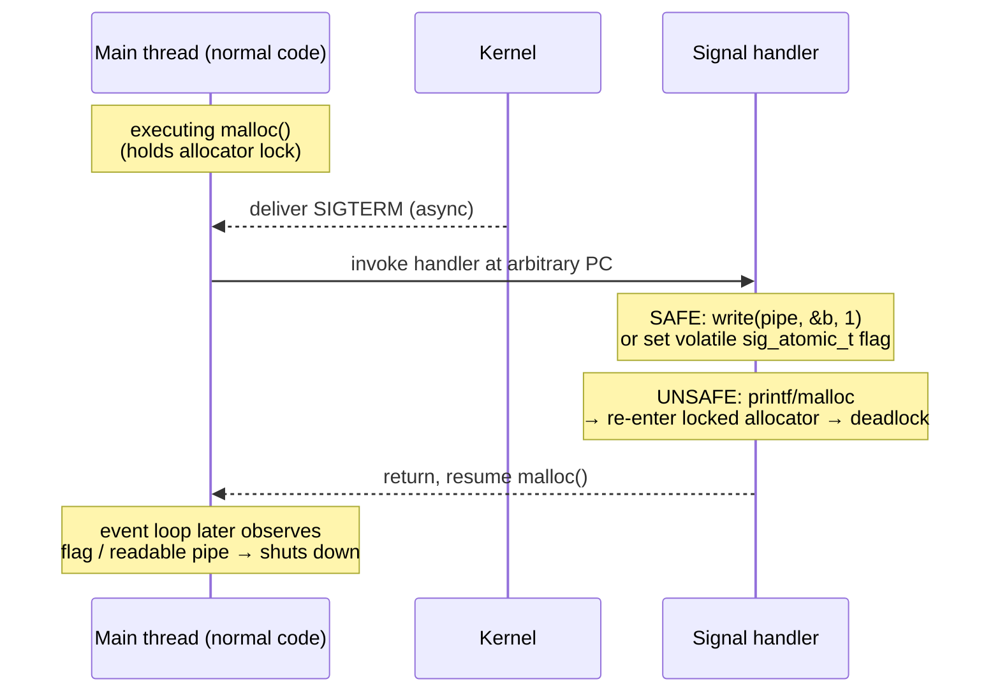
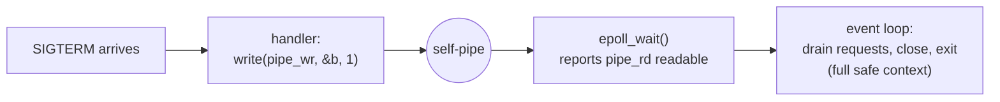
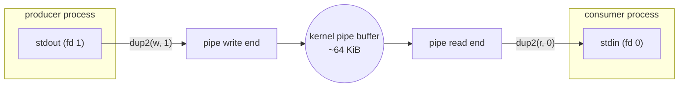
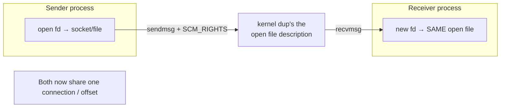
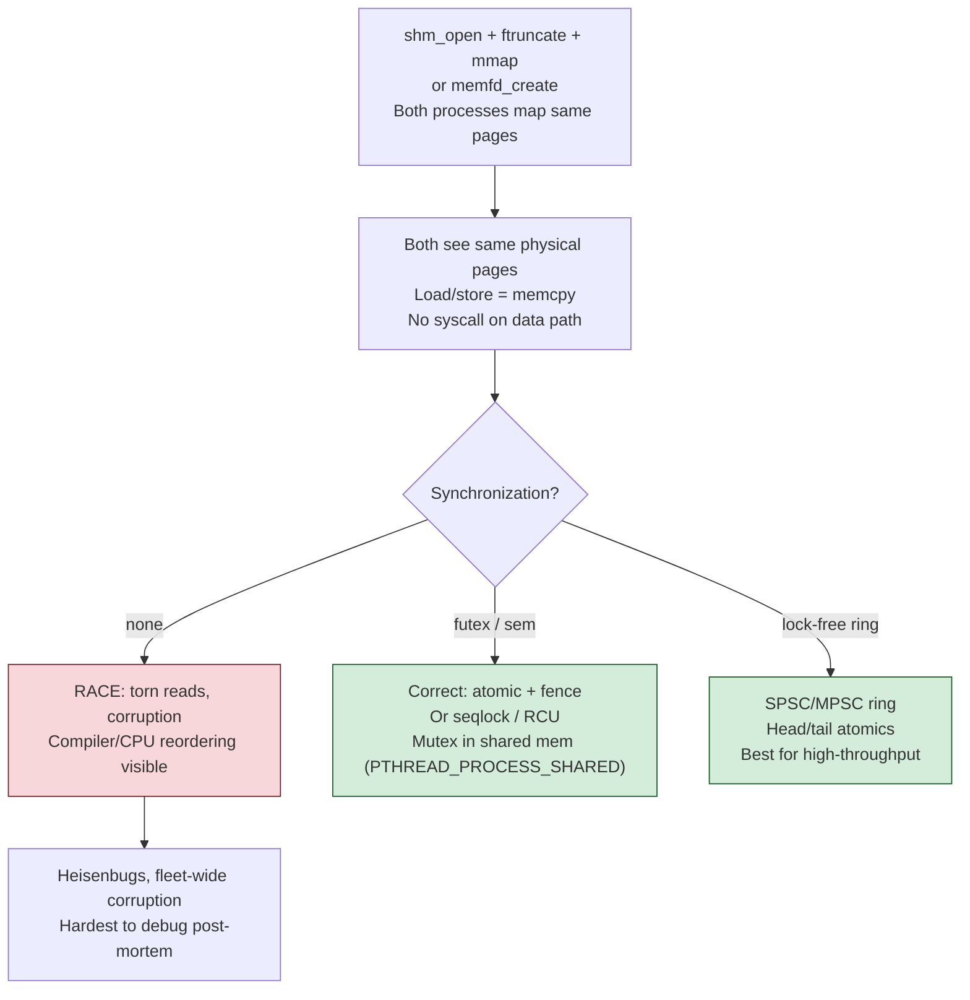
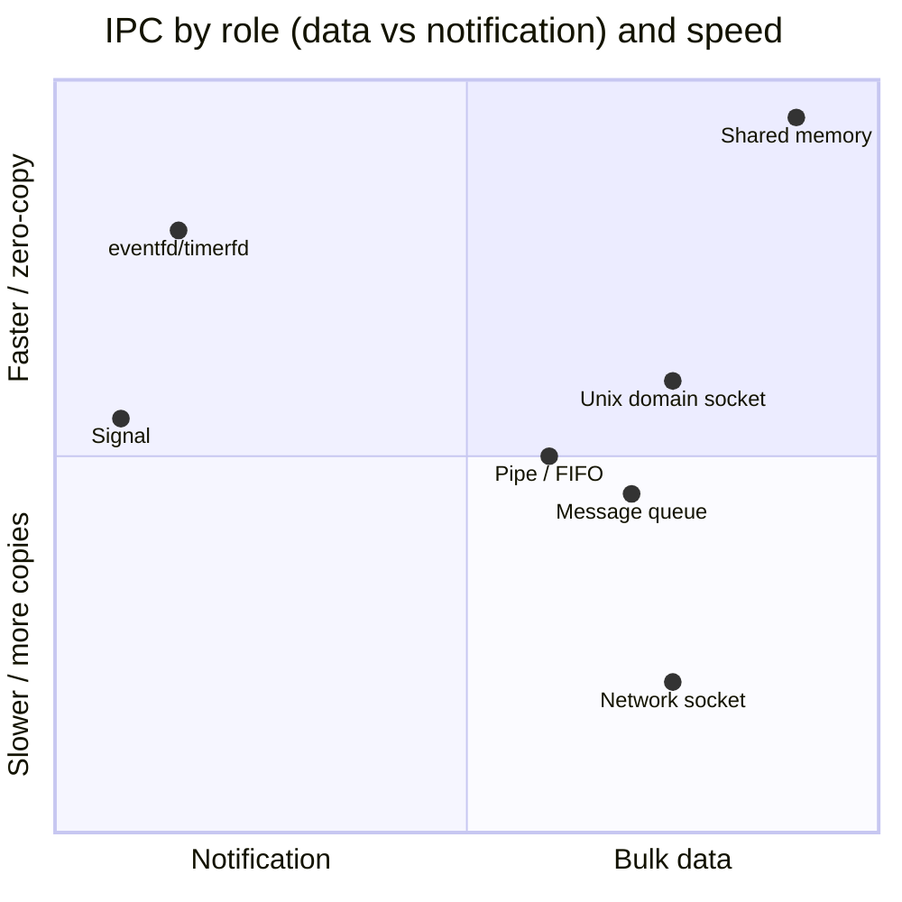
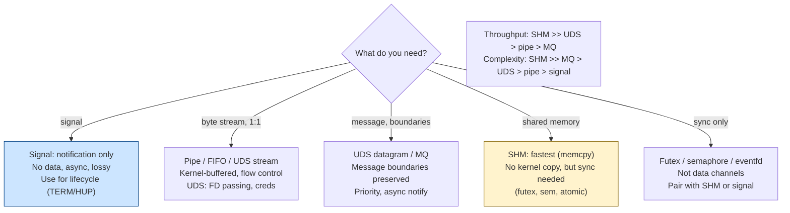

# Chapter 8 — Signals, Pipes, and IPC

**What this chapter covers.** Processes are the kernel's isolation boundary (Chapter 1 — The
Process Model): separate address spaces that, by construction, cannot touch each other's
memory. That isolation is the whole point — and it is also the problem. Real systems are not
one process; they are a shell pipeline, a supervisor and its workers, an application and its
sidecar, a container and the orchestrator that owns its lifecycle. The moment you have two
processes that must *coordinate*, you need a way to punch a controlled hole through the
isolation boundary. That is inter-process communication, and Linux offers a dozen mechanisms
for it, from a single asynchronous bit (a signal) to a shared page of memory.

For a backend engineer, one slice of this material is disproportionately important, so we lead
with it and keep returning to it: **signals are the protocol by which the container and
orchestration layer controls your process's lifecycle.** When Kubernetes rolls out a new
version, it does not politely ask your service to stop — it sends `SIGTERM`. Whether your
service finishes its in-flight requests and closes connections cleanly, or drops them on the
floor and returns 502s to users, comes down to a signal handler you either wrote or forgot to
write. A service that mishandles `SIGTERM` is a service that causes a small outage on *every
single deploy*, and at high deploy frequency that is one of the most common self-inflicted
availability bugs in the industry. We will make that mechanism exact.

Around that core we survey the full IPC toolbox — pipes and FIFOs, Unix domain sockets, shared
memory, message queues, semaphores, and the "everything is a file descriptor" event primitives
(`eventfd`/`timerfd`/`signalfd`) that fold IPC into the event loop from Chapter 7 — and we
place each one on the axes that matter: throughput, latency, complexity, and whether it carries
*data* or merely a *notification*.

Learning goals — after this chapter you should be able to:

- Explain what a signal is at the kernel level: an asynchronous notification with a numeric
  identity, a per-process *disposition* (default / ignore / handler), and delivery semantics
  that interrupt the target at an arbitrary instruction boundary.
- State precisely why signal handlers are dangerous — the **async-signal-safety** constraint —
  and use the standard escape hatches (`signalfd`, the self-pipe trick) to turn signals into
  pollable event-loop inputs.
- Describe the Kubernetes pod termination sequence (`SIGTERM` → grace period → `SIGKILL`) and
  write a correct graceful-shutdown / connection-draining path for a backend service.
- Explain the special signal semantics of **PID 1**, why they cause the "my container ignores
  `SIGTERM`" gotcha, and what `tini`/`dumb-init`/`--init` actually fix.
- Wire up anonymous pipes with `fork` + `dup2` (the shell `|`), reason about pipe buffering and
  `SIGPIPE`, and avoid the broken-pipe crash.
- Choose among Unix domain sockets, shared memory, pipes, and message queues for a local-IPC
  problem, and understand FD passing over `SCM_RIGHTS`.
- Frame local IPC vs network RPC as the same locality decision that governs distributed system
  design.

## Signals: an asynchronous notification, not a channel

A signal is the smallest possible message: a small integer, delivered asynchronously to a
process, that interrupts whatever it was doing. It carries no payload beyond its number (the
real-time signals and `SA_SIGINFO` add a little, more below). It is closer to a hardware
interrupt aimed at a process than to a message on a queue. This is the first thing to
internalize: **signals are for notification and control, not for moving data.** If you find
yourself trying to stream information through signals, you have chosen the wrong mechanism.

Each signal has a numeric identity and a conventional meaning. The standard signals every
backend engineer should know:

| Signal | Num* | Default action | Catchable? | Typical meaning |
|---|---|---|---|---|
| `SIGTERM` | 15 | Terminate | Yes | "Please shut down cleanly." The polite stop. |
| `SIGKILL` | 9 | Terminate | **No** | "Die now." Uncatchable, unblockable, unignorable. |
| `SIGINT` | 2 | Terminate | Yes | Interrupt from terminal (Ctrl-C). |
| `SIGQUIT` | 3 | Terminate + core | Yes | Quit from terminal (Ctrl-\\); dumps core. |
| `SIGHUP` | 1 | Terminate | Yes | Controlling terminal hung up; by convention, **reload config**. |
| `SIGCHLD` | 17 | Ignore | Yes | A child stopped or terminated — the reaping trigger. |
| `SIGPIPE` | 13 | Terminate | Yes | Wrote to a pipe/socket with no reader. |
| `SIGSEGV` | 11 | Terminate + core | Yes | Invalid memory access. |
| `SIGBUS` | 7 | Terminate + core | Yes | Bad memory access (misalignment, `mmap` past EOF). |
| `SIGABRT` | 6 | Terminate + core | Yes | `abort()`; failed assertion. |
| `SIGSTOP` | 19 | Stop | **No** | Suspend the process. Uncatchable. |
| `SIGCONT` | 18 | Continue | Yes | Resume a stopped process. |
| `SIGUSR1`/`SIGUSR2` | 10/12 | Terminate | Yes | Application-defined (nginx, etc.). |
| `SIGALRM` | 14 | Terminate | Yes | Timer from `alarm`/`setitimer`. |

\* Numbers are the common values on Linux x86-64; a few (`SIGUSR1`, `SIGCHLD`, …) differ on
other architectures, which is exactly why you use the *names*, never the raw numbers, in code.

Two signals are special and worth memorizing as a pair: **`SIGKILL` and `SIGSTOP` cannot be
caught, blocked, or ignored.** They are enforced by the kernel, not the process. This is a
deliberate design: the system must always retain an unstoppable way to kill or freeze a
process, no matter how buggy or malicious. Everything about graceful shutdown flows from this
one fact — `SIGTERM` is a request the process may honor or delay; `SIGKILL` is a command it
cannot refuse.

Beyond these standard signals (1–31, the historical Unix set), Linux provides **real-time
signals**, `SIGRTMIN` through `SIGRTMAX` (typically 34–64). They differ in two ways that matter:
multiple instances of the same RT signal are *queued* (standard signals are not — see below),
and they can carry a small `int`/pointer payload via `sigqueue`. Most backend code never uses
them directly, but runtimes and libraries do.

### Disposition: default, ignore, or handler

Every process has, for each signal, a **disposition** — what happens when that signal is
delivered:

- **Default (`SIG_DFL`).** The kernel's built-in action from the table above: terminate,
  terminate-and-core-dump, ignore, stop, or continue.
- **Ignore (`SIG_IGN`).** The signal is discarded. (You cannot ignore `SIGKILL`/`SIGSTOP`.)
- **Catch with a handler.** A function you register that the kernel invokes on delivery.

You set the disposition with `sigaction(2)`. You will see older code use `signal(2)`, but its
semantics are historically inconsistent across Unixes (BSD vs System V behavior on handler
reset and syscall restart). **Use `sigaction`.** It gives explicit control over the flags that
matter:

```c
#include <signal.h>
#include <string.h>

volatile sig_atomic_t shutting_down = 0;   /* the ONLY safe global type here */

static void on_term(int signo) {
    shutting_down = 1;                       /* set a flag; do the real work in main loop */
}

int main(void) {
    struct sigaction sa;
    memset(&sa, 0, sizeof sa);
    sa.sa_handler = on_term;
    sigemptyset(&sa.sa_mask);   /* which signals to block *while the handler runs* */
    sa.sa_flags = SA_RESTART;   /* auto-restart interrupted slow syscalls */
    sigaction(SIGTERM, &sa, NULL);
    sigaction(SIGINT,  &sa, NULL);
    /* ... run the event loop, checking `shutting_down` ... */
}
```

Key `sigaction` flags:

- **`SA_RESTART`** — if a signal interrupts a slow syscall (`read`, `accept`, …), the kernel
  restarts it automatically instead of failing with `EINTR`. Without this, every blocking call
  in your program must be prepared to see `EINTR` and retry. (Even *with* it, a few calls are
  never restarted — `poll`, `epoll_wait`, `select` — so event loops must still handle `EINTR`.)
- **`SA_SIGINFO`** — use the three-argument handler (`sa_sigaction`) that receives a
  `siginfo_t`: the sending PID/UID, the faulting address for `SIGSEGV`, the `sigqueue` payload,
  etc.
- **`SA_NOCLDWAIT` / `SA_NOCLDSTOP`** — for `SIGCHLD`: don't create zombies, and don't signal on
  mere *stop* of a child (Chapter 1).

### The async-signal-safety problem

Here is the single most important — and most misunderstood — fact about signal handlers, and a
classic subtle bug.

A handler does not run "between iterations" of your program. It runs **asynchronously**: the
kernel can deliver a signal, and thus invoke your handler, at *any* machine instruction
boundary in the interrupted thread. If the signal arrives while your program is halfway through
`malloc`, the handler runs with `malloc`'s internal data structures in an inconsistent,
mid-mutation state, and with `malloc`'s internal lock held.

Now suppose your handler calls `printf`. `printf` calls `malloc`. That `malloc` tries to take
the lock the interrupted `malloc` already holds — in the *same thread* — and, depending on the
allocator, either deadlocks or corrupts the heap. This is not a rare race; it is a structural
consequence of asynchronous delivery. Most of the C library is **not reentrant** and therefore
**not safe to call from a signal handler.**

The rule: **inside a signal handler you may call only async-signal-safe functions.** POSIX
defines the exact list (`signal-safety(7)` on Linux). It is short and deliberately boring:
`write`, `read`, `_exit`, `kill`, `signalfd`, `sem_post`, most raw syscalls. Conspicuously
*absent*: `malloc`/`free`, `printf` and all of stdio, most of the string-formatting family,
anything that takes a lock, anything that touches non-atomic global state. Also: **save and
restore `errno`** if your handler makes any syscall, because it runs "inside" the interrupted
code which may be about to read `errno`.

```c
/* SAFE: write a fixed string to stderr, no allocation, no stdio */
static void on_segv(int signo) {
    const char msg[] = "caught SIGSEGV, aborting\n";
    write(STDERR_FILENO, msg, sizeof msg - 1);   /* async-signal-safe */
    _exit(1);                                     /* not exit(); exit runs atexit handlers */
}
```

The only data a handler should touch in shared memory is a variable of type
`volatile sig_atomic_t` — the one type POSIX guarantees you can read/write atomically with
respect to signal delivery. Everything else the handler communicates must go through an
async-signal-safe *channel*, which is exactly what the next section is about.

The practical discipline that falls out of this: **do essentially nothing in the handler.**
Set a flag, or write one byte to a pipe/eventfd, and return. Do the real work — the logging,
the cleanup, the shutdown — back in your normal code, where every function is fair game.



### Blocking and pending signals: `sigprocmask`

A thread has a **signal mask** — a set of signals it currently *blocks*. A blocked signal is
not lost; it becomes **pending** and is delivered as soon as it is unblocked. You manipulate
the mask with `sigprocmask(2)` in a single-threaded program, or `pthread_sigmask(3)` in a
multithreaded one (the mask is per-thread).

A critical subtlety: **standard signals do not queue.** The pending set is a bitmask — one bit
per signal. If two `SIGCHLD`s arrive while `SIGCHLD` is blocked, exactly one is pending, and the
handler runs once. This is why a correct `SIGCHLD` reaper loops on `waitpid(-1, …, WNOHANG)`
until it returns 0: one delivery may represent several dead children. (Real-time signals *do*
queue, which is one reason they exist.)

Blocking is not just defensive; it is the foundation of the modern approach to signals in
event-driven servers, which we turn to now.

### Making signals pollable: `signalfd` and the self-pipe trick

The async-signal-safety constraint sits awkwardly with the event-loop architecture from
Chapter 7. Your whole server is one thread sitting in `epoll_wait`, and you want signal arrival
to be *just another readable fd* you can react to on your own terms — in normal code, with
`malloc` and logging available. Two mechanisms achieve this.

**The self-pipe trick** (portable, decades old): create a pipe, make both ends non-blocking,
and register the read end with your `epoll` set. The signal handler does exactly one
async-signal-safe thing — `write(pipe_wr, &byte, 1)` — and returns. `epoll_wait` then reports
the read end as readable, and your event loop handles the signal in full, safe context.



**`signalfd(2)`** (Linux-specific, cleaner): create a file descriptor that becomes readable
whenever one of a specified set of signals is pending, and read `struct signalfd_siginfo`
records from it. There is no handler at all. The essential setup: **block the signals first** so
they are never delivered the old asynchronous way — instead they stay pending and surface
through the fd.

```c
sigset_t mask;
sigemptyset(&mask);
sigaddset(&mask, SIGTERM);
sigaddset(&mask, SIGINT);
sigprocmask(SIG_BLOCK, &mask, NULL);   /* essential: block, so they route to the fd */

int sfd = signalfd(-1, &mask, SFD_NONBLOCK | SFD_CLOEXEC);
/* add sfd to your epoll set; when readable, read struct signalfd_siginfo and act */
```

This is how a modern high-concurrency service should consume lifecycle signals: no
async-signal-safety minefield, signal delivery unified with all other I/O readiness in the same
`epoll` loop. Go's runtime does the moral equivalent internally — it dedicates handling so that
your `signal.Notify` channel receives `os.Signal` values in ordinary goroutine context, never in
a raw handler. (`timerfd` and `eventfd`, later in this chapter, complete this "everything is an
fd" family.)

## Signals as the service lifecycle protocol

Now the payoff. Everything above exists, for a backend engineer, mostly in service of one
scenario: your process is being asked to stop, and how it responds determines whether users
notice.

### `SIGTERM` vs `SIGKILL`: the graceful/forceful pair

| | `SIGTERM` (15) | `SIGKILL` (9) |
|---|---|---|
| Meaning | "Shut down cleanly." | "Terminate immediately." |
| Catchable | Yes — you decide what happens | No — kernel-enforced |
| Cleanup runs? | Yes, if you wrote a handler | None. Process just stops. |
| In-flight requests | Can be finished/drained | Dropped mid-flight |
| Open connections | Can be closed with proper FIN | Reset (`RST`) or left hanging |
| Buffered data / flush | You can flush | Lost |
| Use it for | Normal shutdown, deploys | Last resort, hung process, OOM killer |

`SIGTERM` is the beginning of a negotiation; `SIGKILL` is the end of it. The universal pattern
across supervisors (systemd, Docker, Kubernetes, `runit`, `supervisord`) is: **send `SIGTERM`,
wait a bounded grace period, then send `SIGKILL` if the process is still alive.** Your job is to
do all your cleanup *within* that grace window.

Recall from Chapter 4 that the kernel **OOM killer** uses `SIGKILL` — an out-of-memory process
gets no chance to clean up, which is one more reason to keep memory bounded: you never want the
kernel choosing `SIGKILL` for you.

### Graceful shutdown and connection draining

A correct shutdown path for a stateless HTTP/gRPC service, triggered by `SIGTERM`:

1. **Stop accepting new work.** Close the listening socket (or stop the accept loop). New
   connections are refused; the load balancer/orchestrator will route elsewhere.
2. **Drain in-flight requests.** Let currently-executing handlers finish, up to a deadline.
3. **Close idle keep-alive connections** cleanly (send HTTP `Connection: close` / GOAWAY for
   HTTP/2 so clients reconnect elsewhere rather than getting a mid-request reset).
4. **Flush and release** — flush logs/metrics, commit or roll back transactions, close DB pools,
   deregister from service discovery.
5. **Exit 0**, well before the grace period expires.

Every major framework gives you this: Go's `http.Server.Shutdown(ctx)`, Java's Spring Boot
graceful shutdown, Node's `server.close()`, Python's `uvicorn`/`gunicorn` handlers. What they
*cannot* do for you is receive the signal — that is the line of code people forget. Here is the
idiomatic Go shape:

```go
func main() {
    srv := &http.Server{Addr: ":8080", Handler: mux}
    go func() { srv.ListenAndServe() }()

    ctx, stop := signal.NotifyContext(context.Background(),
        syscall.SIGTERM, syscall.SIGINT)
    defer stop()
    <-ctx.Done() // blocks until SIGTERM/SIGINT

    // Give in-flight requests up to 25s; must finish inside the grace period.
    shutdownCtx, cancel := context.WithTimeout(context.Background(), 25*time.Second)
    defer cancel()
    srv.Shutdown(shutdownCtx) // stops accepting, waits for active handlers
}
```

The number 25 is not arbitrary — it must be **less** than the orchestrator's grace period, so
your clean shutdown finishes before the `SIGKILL` fallback fires.

### The Kubernetes pod termination sequence

Kubernetes turns the `SIGTERM` → grace → `SIGKILL` pattern into a documented lifecycle. When a
pod is deleted (a rolling update, a scale-down, a node drain), for each container:

1. The pod is marked **`Terminating`**. The endpoints controller removes it from the `Endpoints`
   / `EndpointSlice` for its Services, so kube-proxy (and ingress controllers, and mesh sidecars)
   *begin* to stop routing new traffic to it.
2. If a **`preStop`** hook is defined, it runs to completion first.
3. The container runtime sends **`SIGTERM`** to **PID 1** of the container.
4. The **grace period** counts down: `terminationGracePeriodSeconds` (default **30**). The
   clock covers the preStop hook *and* the post-`SIGTERM` drain — they share the budget.
5. If the container is still running when the grace period expires, the runtime sends
   **`SIGKILL`**.

```mermaid
sequenceDiagram
    participant API as kube-apiserver
    participant EPC as Endpoints controller
    participant Klt as kubelet / runtime
    participant App as Container PID 1
    API->>EPC: Pod → Terminating
    EPC->>EPC: remove from EndpointSlice<br/>(new traffic stops routing — async!)
    API->>Klt: begin termination (start grace clock)
    Klt->>App: run preStop hook (optional)
    Klt->>App: SIGTERM
    Note over App: stop accepting; drain in-flight;<br/>close conns; flush; exit 0
    alt exits before grace period
        App-->>Klt: process gone → pod removed
    else grace period expires
        Klt->>App: SIGKILL (in-flight dropped)
    end
```

**The race that bites everyone.** Step 1 (endpoint removal) and step 3 (`SIGTERM`) are *not*
synchronized. Endpoint removal propagates asynchronously through many components — apiserver →
endpoints controller → each node's kube-proxy → conntrack. Meanwhile `SIGTERM` may reach your
app almost immediately. So for a short window, **new requests can still be routed to a pod that
has already received `SIGTERM`.** If your handler reacts to `SIGTERM` by *immediately* closing
the listener, those in-flight-routed requests get connection-refused — a burst of 502s on every
deploy.

The standard mitigations:

- A **`preStop` sleep** (`sleep 5`–`15`) that delays `SIGTERM` long enough for endpoint removal
  to propagate, so by the time your app starts draining, the LB has already stopped sending it
  new work. Crude but extremely effective and framework-agnostic.
- Or have the app **keep serving for a few seconds after `SIGTERM`** before it stops accepting,
  achieving the same overlap in code.

Either way: your service **must** install a `SIGTERM` handler and drain. A service that lets
`SIGTERM` hit the default action — instant termination — resets every in-flight connection on
every deploy. At one deploy per service per day across a fleet of hundreds of services, that is
continuous low-grade error-rate noise and a real user-facing reliability problem. This is a
distributed-systems reliability pattern (Volume 11) whose root is a single signal handler.

### PID 1: the container init gotcha

Here is where the theory turns into a notorious operational bug, and it hinges on a kernel
special case.

**The kernel treats PID 1 differently.** For an ordinary process, a signal with default
disposition performs the default action (e.g. `SIGTERM` terminates). **For PID 1, the kernel
does *not* apply default actions.** A signal sent to PID 1 is delivered only if PID 1 has
*explicitly installed a handler* for it; otherwise it is silently dropped. Even `SIGKILL` and
`SIGSTOP` are ignored when sent to PID 1 *from within its own PID namespace* (the kernel marks
init `SIGNAL_UNKILLABLE`). This exists so you can't accidentally kill the real `init` and
panic the machine.

In a container, **your application is often PID 1** of its PID namespace. Two failure modes
follow:

- **Shell-form `CMD`.** `CMD myapp --flag` in a Dockerfile runs as `/bin/sh -c "myapp --flag"`,
  so `/bin/sh` becomes PID 1 and `myapp` is its child. `sh` does not forward signals to its
  child. `docker stop` / K8s sends `SIGTERM` to PID 1 (`sh`), which ignores it (no handler,
  and default actions don't apply to PID 1). Your app never even sees the signal. The
  orchestrator waits the full grace period, then `SIGKILL`s — an *always-hard-kill*, drop-in-
  flight shutdown on every deploy. Fix: **exec form** `CMD ["myapp", "--flag"]`, which makes
  `myapp` PID 1 directly.
- **App as PID 1 with no handler.** Even in exec form, if `myapp` never installs a `SIGTERM`
  handler, PID 1 semantics mean `SIGTERM` is dropped rather than terminating it. Same symptom:
  grace period wasted, then `SIGKILL`. Fix: **handle `SIGTERM`** (which you must do for
  draining anyway). Note the corollary: locally, `docker kill` works because the host sends
  `SIGKILL` from the *parent* namespace, where the unkillable protection does not apply.

There is a second PID 1 duty: **reaping zombies** (Chapter 1). PID 1 inherits orphaned
processes and must `wait()` on them, or the container accumulates zombie PIDs. Application code
rarely does this correctly.

The fix for both is a **minimal init process** as PID 1 that (a) forwards signals to your app
and (b) reaps zombies: **`tini`**, **`dumb-init`**, or `s6`/`runit`. Docker's `--init` flag
injects `tini`; Kubernetes users add a lightweight init or rely on the app being a
signal-aware runtime. The one-line takeaway: **if your container's PID 1 is a shell, a
signal-ignorant app, or anything that neither forwards signals nor reaps children, you have a
shutdown-correctness bug — use exec form and either handle `SIGTERM` yourself or run a real
init.**

### `SIGHUP` for config reload, `SIGCHLD` for reaping

Two more conventional uses round out the lifecycle picture:

- **`SIGHUP` — reload configuration.** Historically "the terminal hung up," `SIGHUP` was
  repurposed by daemons to mean "re-read your config without restarting." **nginx** is the
  canonical example: `nginx -s reload` sends `SIGHUP` to the master, which re-parses
  `nginx.conf`, spins up new workers with the new config, and gracefully shuts down old workers
  after they finish in-flight requests — a zero-downtime reload built entirely on signals.
  (nginx also uses `SIGUSR1` to reopen log files for rotation and `SIGUSR2` for binary upgrades.)
- **`SIGCHLD` — reap children.** As covered in Chapter 1, a parent that spawns workers must reap
  them. `SIGCHLD` fires on child exit; the handler (or `signalfd` reader) loops
  `waitpid(-1, &st, WNOHANG)` until it returns 0, because standard signals don't queue and one
  `SIGCHLD` may cover several deaths.

## Pipes and FIFOs

The oldest IPC mechanism in Unix, and the one whose philosophy — small tools composed by
streaming bytes — shaped everything. A pipe is a **unidirectional, in-kernel byte stream** with
a write end and a read end.

### Anonymous pipes and the shell `|`

`pipe(int fd[2])` returns two file descriptors: `fd[0]` (read) and `fd[1]` (write). Bytes
written to `fd[1]` are buffered by the kernel and read from `fd[0]` in order. Because the ends
are file descriptors, they are shared across `fork` (Chapter 1's FD inheritance), which is how
*related* processes get connected — a parent and its children, or two children of the same
parent.

The shell `|` is the archetype. For `producer | consumer`, the shell:

1. Calls `pipe()` to get `[r, w]`.
2. `fork`s the producer; in the child, `dup2(w, STDOUT_FILENO)` redirects its stdout onto the
   pipe's write end, closes the now-redundant `r` and `w`, and `exec`s `producer`.
3. `fork`s the consumer; in the child, `dup2(r, STDIN_FILENO)` redirects its stdin from the
   pipe's read end, closes `r` and `w`, and `exec`s `consumer`.
4. The parent shell closes both ends (it is neither producer nor consumer).

**Closing the unused ends is not optional.** The read end returns EOF only when *all* write-end
FDs are closed. If any process still holds a write end open, the reader blocks forever waiting
for bytes that will never come — a classic hang. `dup2` (Chapter 5) is doing the essential
work: it points a well-known FD number (0 or 1) at the pipe so the exec'd program, which knows
nothing about pipes, just reads stdin and writes stdout.



### Buffering, blocking, and atomicity

The kernel pipe buffer is finite — **64 KiB (16 pages) by default** on Linux, adjustable per
pipe with `fcntl(F_SETPIPE_SZ)`. This buffer is the flow-control mechanism:

- **Write to a full pipe blocks** (or returns `EAGAIN` in non-blocking mode) until the reader
  drains it. This is natural backpressure — a fast producer is throttled to the consumer's rate.
- **Read from an empty pipe blocks** until data arrives, or returns 0 (EOF) if all write ends
  are closed.
- **Writes up to `PIPE_BUF` (4096 bytes) are atomic** — they will not be interleaved with other
  writers' data. Larger writes may be split and interleaved, which matters when multiple
  processes write to the same pipe (a common logging-fan-in mistake).

### `SIGPIPE`: the broken-pipe gotcha

**Writing to a pipe or socket whose read end is closed raises `SIGPIPE`, whose default action
terminates the process** — and simultaneously the `write` would return `EPIPE`. This is one of
the most surprising ways a backend process dies. Picture an HTTP server streaming a response;
the client disconnects mid-stream; the server's next `write` to that socket triggers `SIGPIPE`,
and with default disposition the *entire server process* dies — taking down thousands of other
connections because one client hung up.

The fix is standard practice in every network server:

- **Ignore `SIGPIPE` process-wide** (`signal(SIGPIPE, SIG_IGN)`) and handle the `EPIPE` return
  from `write`/`send` as an ordinary error (close that connection, move on), **or**
- Pass **`MSG_NOSIGNAL`** to `send`/`sendmsg` per call to suppress the signal for that write,
  **or** on Linux set `SO_NOSIGPIPE`-style behavior where available.

Managed runtimes do this for you: **Go ignores `SIGPIPE`** for writes to its own network/file
descriptors (it only lets `SIGPIPE` kill the process for writes to the original stdout/stderr,
matching command-line-tool expectations). If you write servers in C/C++, ignoring `SIGPIPE` at
startup is close to mandatory.

### Named pipes (FIFOs)

An anonymous pipe requires a common ancestor to share the FDs. A **FIFO** (named pipe) lifts
that restriction: `mkfifo(path, mode)` (or the `mkfifo` command) creates a special file in the
filesystem that *any* process with permission can `open`. Semantics are otherwise identical — a
unidirectional byte stream. `open` for reading blocks until a writer opens the other end and
vice versa (unless `O_NONBLOCK`). FIFOs are handy for simple decoupled producer/consumer setups
and shell scripting, but for anything bidirectional or structured, a **Unix domain socket** is
almost always the better choice.

## Unix domain sockets: the local-IPC workhorse

If pipes are the oldest IPC and signals the most misunderstood, **Unix domain sockets (UDS)**
are the most *important* for modern backend systems. They are the local-IPC backbone of the
entire cloud-native stack.

A UDS uses the same sockets API as TCP/UDP (`socket`, `bind`, `listen`, `accept`, `connect`,
`send`, `recv`) but with address family **`AF_UNIX`** instead of `AF_INET`. The endpoint is a
**filesystem path** (`/var/run/docker.sock`) rather than an IP:port — or, on Linux, an
**abstract-namespace** name (a leading NUL byte, no filesystem object, auto-cleaned on close).
Because both endpoints are on the same host, the kernel short-circuits the entire network stack:
**no IP routing, no TCP handshake, no checksums, no congestion control, no loopback packet
processing.** The result is meaningfully lower latency and higher throughput than
`127.0.0.1` TCP, with the same familiar API.

UDS supports three socket types:

- **`SOCK_STREAM`** — reliable, ordered byte stream (like TCP). The default choice.
- **`SOCK_DGRAM`** — reliable (locally!), *message-boundary-preserving* datagrams. Unlike UDP,
  local datagrams are not dropped.
- **`SOCK_SEQPACKET`** — reliable, ordered, *and* message-boundary-preserving. The best of both
  for message-oriented local protocols.

Where you already rely on UDS, usually without thinking about it:

- **The Docker socket** `/var/run/docker.sock` — the Docker CLI and every tool that talks to the
  daemon speaks HTTP over this UDS. (Mounting it into a container is also a well-known privilege-
  escalation risk — Book 6.)
- **Local database connections.** PostgreSQL and MySQL default to a UDS for same-host clients
  (`/var/run/postgresql/.s.PGSQL.5432`); it is faster than TCP loopback and sidesteps the
  network entirely.
- **Service-mesh and sidecar communication.** App ↔ sidecar (Envoy) traffic, and the mesh's
  control-plane xDS channels, frequently ride UDS for the latency win when co-located in a pod.
  This is the local half of the service mesh (Volume 3).
- **systemd socket activation**, container runtime shims (containerd ↔ runc), `containerd`'s
  own API, and countless daemons (`Xorg`, `dbus`, `gpg-agent`).

### Two superpowers: FD passing and peer credentials

UDS can carry, alongside ordinary bytes, **ancillary data** ("control messages") via
`sendmsg`/`recvmsg` — and this unlocks two things no network socket can do.

- **`SCM_RIGHTS` — passing file descriptors between processes.** You can send an *open file
  descriptor* — a socket, a file, a pipe, a `memfd` — across a UDS to an unrelated process. The
  kernel does not copy the bytes of a number; it installs a *new reference to the same open file
  description* in the receiver's FD table, exactly as `dup` would within one process. The
  receiver ends up sharing the very same connection/file/offset. This is the mechanism behind
  privilege separation (a sandboxed worker receives an already-opened socket it could not have
  opened itself), zero-downtime restarts that hand live listening sockets to a new process,
  container runtimes and the seccomp *notify* fd, and browser sandbox architectures. It is one
  of the most powerful and least-known capabilities in Unix.
- **`SO_PEERCRED` / `SCM_CREDENTIALS` — peer credentials.** The kernel can tell the receiver the
  *authenticated* PID, UID, and GID of the process on the other end — it cannot be forged,
  because the kernel fills it in. This is how a daemon does local authorization ("is the client
  root?") without passwords: `systemd`, `polkit`, and many privileged sockets rely on it.



## Shared memory: the fastest, and the most dangerous

The mechanisms so far all *copy* data through the kernel: a `write` to a pipe or socket moves
bytes into a kernel buffer, and a `read` copies them out again. **Shared memory eliminates the
copy entirely.** Two processes map the *same physical pages* into their address spaces; once set
up, a write by one process is instantly visible to the other with **zero syscalls and zero
copies.** It is the highest-throughput, lowest-latency IPC Linux offers.

There are two APIs:

- **POSIX shared memory** (preferred): `shm_open("/name", …)` returns an FD backed by a `tmpfs`
  object under `/dev/shm`; `ftruncate` sizes it; `mmap(…, MAP_SHARED, fd, 0)` maps it. Both
  processes `shm_open` the same name and `mmap` it. `shm_unlink` removes it. Because it is
  fd-based and lives in `tmpfs`, it composes cleanly with the rest of Unix.
- **System V shared memory** (legacy): `shmget`/`shmat`/`shmdt`/`shmctl` keyed by `key_t`,
  administered with `ipcs`/`ipcrm`. Still seen in older databases and HPC code. Its kernel-
  persistent, key-namespaced model is clunky compared to POSIX.
- For **related** processes, `mmap(MAP_SHARED | MAP_ANONYMOUS)` before `fork` shares the mapping
  with no name at all — the simplest form.

The catch, and it is a big one: **shared memory gives you the memory but not the
synchronization.** Two processes writing the same page will race exactly as two threads do; you
own every concurrency hazard from Volume 4. You must place synchronization primitives *in the
shared region*: a `pthread_mutex`/`pthread_cond` created with the `PTHREAD_PROCESS_SHARED`
attribute, a POSIX semaphore, or hand-rolled atomics/futexes. You must also handle a process
crashing while holding a shared lock (robust mutexes, `EOWNERDEAD`) — a hazard that simply does
not exist with a pipe. This is the fundamental trade: **shared memory is the fastest IPC and the
one that pushes the entire correctness burden onto you.** High-performance systems — market-data
buses, some databases' buffer pools, the LMAX Disruptor pattern, single-node caches — pay that
price deliberately; most services should not.

A modern, fd-friendly variant: **`memfd_create`** creates an anonymous memory-backed file (no
filesystem path). Combined with `SCM_RIGHTS`, one process can create a `memfd`, populate it, and
pass the fd to another process, which `mmap`s it — shared memory established over a UDS with no
shared namespace. Sealing (`F_SEAL_*`) lets the receiver trust the buffer won't change size —
used by Wayland, `dma-buf`, and Chromium's graphics IPC.




## The rest of the toolbox

**POSIX and System V message queues.** A message queue is a kernel-managed queue of
*discrete messages* (unlike a pipe's undifferentiated byte stream), with optional priorities.
POSIX (`mq_open`/`mq_send`/`mq_receive`, visible under `/dev/mqueue`) is the cleaner API and,
crucially on Linux, its descriptor is **pollable** — it integrates with `epoll`. System V
(`msgget`/`msgsnd`/`msgrcv`) is the older, key-based variant. Message queues give you
message-boundary preservation and priority ordering for free, but in practice most backend
systems reach for a UDS `SOCK_SEQPACKET` or an out-of-process broker (Volume 3) instead.

**Semaphores.** A pure *synchronization* primitive — a counter with atomic wait/post — not a
data channel. POSIX named semaphores (`sem_open`) coordinate unrelated processes; unnamed
semaphores (`sem_init` in shared memory) coordinate related ones or threads. They are the
classic companion to shared memory. Full treatment is in Volume 4 (Concurrency).

**The "everything is a file descriptor" event primitives.** Linux exposes several kernel event
sources as ordinary, `epoll`-able file descriptors, which is what lets a single event loop
(Chapter 7) unify all of them:

- **`eventfd`** — a 64-bit counter in the kernel. `write` adds to it; `read` returns and resets
  (or decrements with `EFD_SEMAPHORE`) it; it is readable when non-zero. The canonical
  lightweight cross-thread/cross-process **wakeup**: one thread's `write` makes another thread's
  `epoll_wait` return. `io_uring` uses an `eventfd` to signal completions into an event loop.
- **`timerfd`** — a timer that becomes readable when it expires. Instead of `SIGALRM`
  (asynchronous, all the safety problems above), you get timer expiry as a pollable fd, folded
  into the same loop as your sockets.
- **`signalfd`** — signals as an fd, covered earlier: the clean way to consume `SIGTERM` in an
  event loop.
- **`memfd`** — anonymous memory as an fd (above).

This family is the Linux answer to "how do I get *notifications* into a readiness-based event
loop without signal handlers or dedicated blocking threads?" — and it is why a modern reactor
can wait on sockets, timers, signals, and cross-thread wakeups in a single `epoll_wait`.

**D-Bus.** A higher-level message bus, mostly for desktop and system-management IPC on Linux. A
broker (`dbus-daemon`, or the in-kernel-adjacent successors) mediates a **system bus** and
per-session **session buses**, offering method calls, broadcast signals, and properties with an
interface/object model — all transported over UDS underneath. `systemd`, `NetworkManager`,
`logind`, and `PolicyKit` speak D-Bus. Backend services on servers rarely use it directly, but
you will meet it when scripting host management (`busctl`, `systemctl` talks to `systemd` over
D-Bus).

## Comparing the mechanisms

The whole zoo collapses onto a few axes: does it carry **data or just a notification**, how
**fast** is it, how much **synchronization complexity** does it impose, and does it work
**across a common ancestor / across the host / across the network**.

| Mechanism | Carries | Throughput | Latency | Sync burden | Reach |
|---|---|---|---|---|---|
| **Signal** | Notification only (a number) | n/a | Low | You must be async-signal-safe | Any process (perm-checked) |
| **Pipe (anon)** | Byte stream | Medium | Low | None (kernel-serialized) | Related processes |
| **FIFO** | Byte stream | Medium | Low | None | Any process on host |
| **Unix domain socket** | Byte/message stream + FDs + creds | High | Low | None | Any process on host |
| **Message queue** | Discrete messages (priority) | Medium | Low | None | Any process on host |
| **Shared memory** | Raw memory | **Highest** | **Lowest** | **You own all of it** | Processes mapping it |
| **eventfd/timerfd** | Notification (counter/timer) | n/a | Very low | None | Related / passed FD |
| **Network socket (TCP)** | Byte stream | Network-bound | Network RTT | None | **Any host** |



How to choose, in practice:

- **Need to notify, not transfer?** Signal (for lifecycle/control from outside) or
  `eventfd`/`timerfd` (for in-app/event-loop wakeups). Don't stream data through signals.
- **Simple one-way stream between related processes?** A pipe. It is the least code and has
  automatic backpressure.
- **General local IPC between two services on a host?** **Unix domain socket.** It is the
  default answer: familiar API, fast, bidirectional, FD passing, peer credentials, and a trivial
  upgrade path to TCP if the peer ever moves to another host.
- **Absolute lowest latency / highest throughput, and you can afford the concurrency work?**
  Shared memory plus explicit synchronization.
- **The peer might be on another machine?** A network socket (Volume 3) — and now you are in
  distributed-systems territory with partial failure, retries, and timeouts.




## Distributed-systems lens

Signals and IPC feel like single-machine minutiae, but they are load-bearing for
fleet-scale reliability in three concrete ways.

**Signals are the container lifecycle protocol, and `SIGTERM` handling is mandatory for
zero-downtime deploys.** At any real deploy frequency — many services, continuous delivery,
autoscaling that constantly creates and destroys pods — termination is not an edge case; it is a
routine, high-frequency event. A service that ignores `SIGTERM` (or whose PID 1 swallows it)
turns *every* rollout, scale-down, and node drain into a burst of dropped in-flight requests and
reset connections. That shows up as elevated error rates correlated with deploys — one of the
most common and most fixable availability regressions in production. Graceful shutdown with
connection draining (Volume 11 — Reliability) is a distributed-systems pattern whose root cause,
when it's broken, is almost always a missing or wrong signal handler.

**PID 1 semantics are a fleet-wide gotcha.** The kernel's special treatment of PID 1 — no
default actions, unkillable within its namespace — means the *shape* of your container's entry
point (shell form vs exec form, app-as-init vs a real init) silently determines whether
shutdown works. Standardizing on exec-form entry points, `tini`/`--init` where appropriate, and
signal-aware application code is a fleet-level hygiene decision, not a per-service afterthought.
It also ties back to Chapter 1: PID 1 is the zombie reaper, and a container whose init doesn't
reap leaks PIDs until it hits the namespace limit.

**Local IPC vs network RPC is the same locality decision that governs system design.** The gap
between a Unix domain socket (sub-microsecond, no partial failure, same fate as the peer) and a
network RPC (millisecond RTT, retries, timeouts, the peer can vanish independently) is enormous —
orders of magnitude in latency and a categorical difference in failure model. It is the same
local-vs-remote trade-off from Volume 1: co-located processes (an app and its sidecar in one
pod, a service and its local cache) should use fast local IPC — UDS or shared memory — while
genuinely distributed components pay the network cost and inherit the network's failure modes
(Volume 3 — The Linux Network Stack). Recognizing which side of that boundary two components sit
on, and matching the IPC mechanism to it, is a recurring architectural judgment. Putting a
network hop where a UDS would do wastes latency and adds failure modes; putting shared memory
where you actually needed a network boundary couples two things that should have failed
independently.

Finally, the **"everything is a file descriptor"** model is what lets all of this live in one
event loop. `signalfd` for lifecycle, `timerfd` for deadlines, `eventfd` for wakeups, UDS and
pipes for data — every one of them is a pollable fd, so the same `epoll` reactor from Chapter 7
that drives your high-concurrency request handling also drives your signal handling, your
timeouts, and your inter-thread coordination. The uniformity is not an aesthetic nicety; it is
what makes a correct, single-threaded-core, high-concurrency service tractable to write.

## Key takeaways

- **A signal is an asynchronous notification, not a data channel.** It carries a number and
  interrupts the target at an arbitrary instruction. Use signals for control and lifecycle; use
  pipes/sockets/shared memory for data.
- **`SIGKILL` and `SIGSTOP` cannot be caught, blocked, or ignored.** Everything about graceful
  shutdown is the difference between the catchable `SIGTERM` (a request) and the uncatchable
  `SIGKILL` (a command). The OOM killer uses `SIGKILL` — bound your memory.
- **Signal handlers may call only async-signal-safe functions.** `malloc`, `printf`, and most of
  libc are off-limits because a handler can interrupt them mid-mutation. Do nothing in the
  handler but set a `volatile sig_atomic_t` flag or write one byte; do the real work in normal
  code. `signalfd` / the self-pipe trick make signals into pollable fds and sidestep the whole
  minefield.
- **Handle `SIGTERM` and drain — every backend service, no exceptions.** Stop accepting, finish
  in-flight, close connections cleanly, flush, exit within the grace period. Kubernetes'
  `SIGTERM → terminationGracePeriodSeconds → SIGKILL` sequence makes this the mechanism of
  zero-downtime rollouts; account for the async endpoint-removal race with a `preStop` delay or a
  post-`SIGTERM` serve window.
- **PID 1 is special: no default signal actions, unkillable in its namespace.** An app or shell
  as container PID 1 that doesn't handle/forward `SIGTERM` gets hard-killed on every deploy. Use
  exec-form `CMD`, handle `SIGTERM`, and/or run a real init (`tini`/`--init`) that forwards
  signals and reaps zombies.
- **Pipes are unidirectional byte streams wired with `fork` + `dup2`;** close unused ends or you
  hang on missing EOF. **`SIGPIPE` kills you when you write to a closed peer** — ignore it and
  handle `EPIPE` (managed runtimes do this for you).
- **Unix domain sockets are the local-IPC default:** sockets API without the network stack, plus
  FD passing (`SCM_RIGHTS`) and unforgeable peer credentials. They are the backbone of the
  cloud-native local stack (Docker socket, local DB, sidecars).
- **Shared memory is the fastest IPC and moves the entire concurrency burden onto you.** Reach
  for it only when the throughput justifies owning synchronization and crash recovery.
- **Local IPC vs network RPC is the locality decision.** Co-located → fast local IPC;
  distributed → pay the network and its failure model. Match the mechanism to the boundary.

## Further reading

- **man pages** (the authoritative Linux reference): `signal(7)` (the signal model, standard
  vs real-time, default actions), `signal-safety(7)` (the async-signal-safe function list),
  `sigaction(2)`, `sigprocmask(2)`/`pthread_sigmask(3)`, `signalfd(2)`, `eventfd(2)`,
  `timerfd_create(2)`, `pipe(7)`, `fifo(7)`, `unix(7)` (`AF_UNIX`, abstract namespace,
  `SCM_RIGHTS`, `SO_PEERCRED`), `mq_overview(7)`, `sem_overview(7)`, `shm_overview(7)`,
  `memfd_create(2)`, and `credentials(7)` (PID 1 / `SIGNAL_UNKILLABLE` behavior via
  `pid_namespaces(7)`).
- **The Linux Programming Interface**, Michael Kerrisk (No Starch Press, 2010), chapters 20–22
  (signals: fundamentals, handlers, advanced), 44 (pipes and FIFOs), 46–48 (System V IPC,
  shared memory), 52–53 (POSIX message queues, semaphores), and 57 (Unix domain sockets) — the
  precise, authoritative treatment of everything in this chapter.
- **Kubernetes documentation — "Pod Lifecycle"** (`kubernetes.io/docs/concepts/workloads/pods/pod-lifecycle/`),
  specifically the termination section on `terminationGracePeriodSeconds`, `preStop` hooks, and
  the `SIGTERM → grace → SIGKILL` sequence — the primary source for the graceful-shutdown flow.
- **"Graceful shutdown in Kubernetes"** writeups from the Kubernetes blog and from Google
  Cloud/learnk8s — the practical treatments of the endpoint-removal race and the `preStop`-sleep
  mitigation.
- **`tini`** (`github.com/krallin/tini`) and **`dumb-init`** (`github.com/Yelp/dumb-init`)
  READMEs — clear explanations of why a container needs a signal-forwarding, zombie-reaping
  PID 1, and Docker's `--init` documentation.
- **W. Richard Stevens & Stephen Rago, *Advanced Programming in the UNIX Environment* (APUE),
  3rd ed.** — chapters 10 (signals) and 15 (IPC: pipes, FIFOs, message queues, semaphores,
  shared memory), the classic reference.
- **W. Richard Stevens, *UNIX Network Programming, Volume 2: Interprocess Communications*,
  2nd ed.** — the definitive deep dive on pipes, message queues, semaphores, shared memory, and
  FD passing over Unix domain sockets.
- **nginx documentation — "Controlling nginx"** (`nginx.org/en/docs/control.html`) — the
  canonical real-world signal protocol: `SIGHUP` reload, `SIGUSR1` log reopen, `SIGUSR2`/`SIGWINCH`
  binary upgrade and graceful worker shutdown.
- **Go standard library**: `os/signal` (`signal.NotifyContext`), `net/http` (`Server.Shutdown`),
  and the runtime's `SIGPIPE` handling notes — a production model of correct signal + graceful-
  shutdown handling to read as reference.
