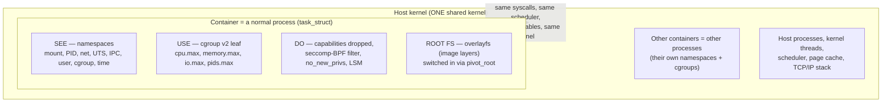
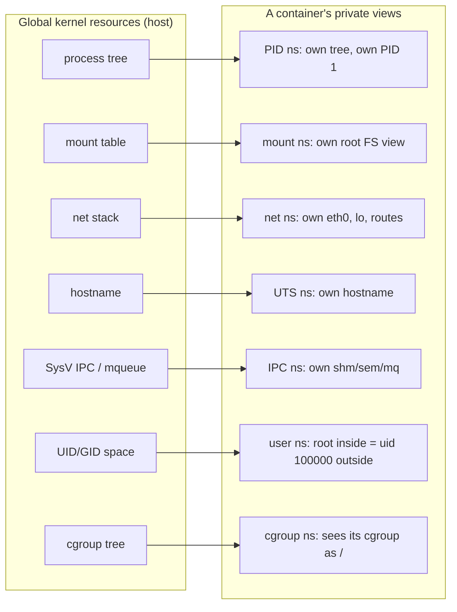
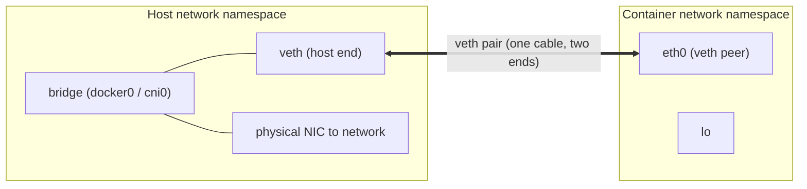
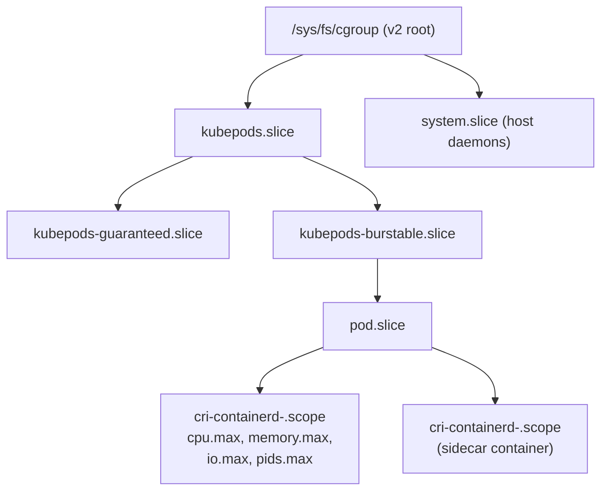
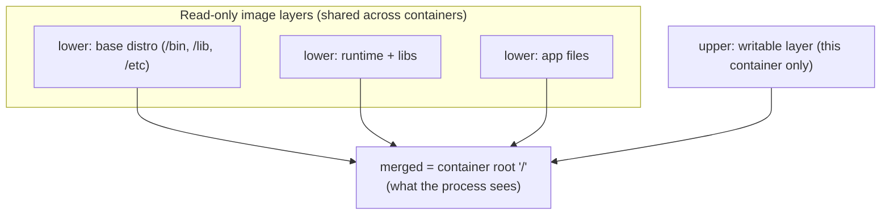
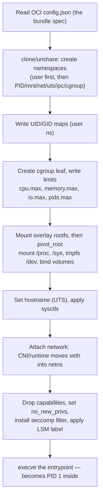
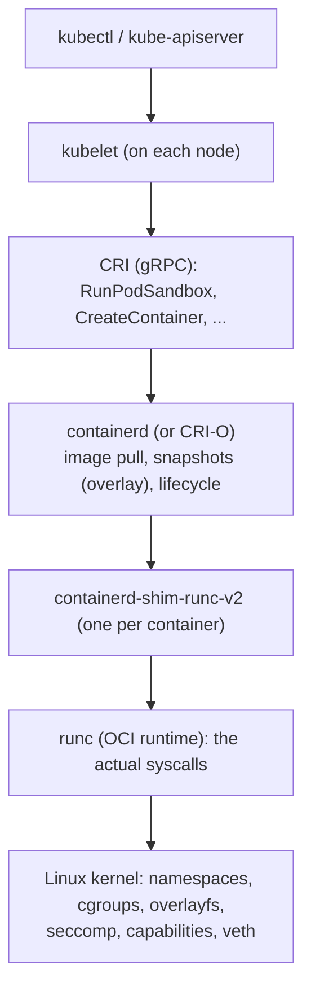

# Chapter 9 — Namespaces, cgroups, and Container Internals

**What this chapter covers.** You deploy in containers every day. You write a Dockerfile,
push an image, and a scheduler runs it on a node you never see. This chapter dismantles that
abstraction and shows you the machinery underneath, because the machinery is not exotic — it
is a handful of Linux kernel features you have already met in this volume, wired together. The
single most important idea in the chapter is this: **a container is not a lightweight virtual
machine.** It has no separate kernel, no virtual hardware, no hypervisor. A container is an
ordinary Linux *process* (Chapter 1) that the kernel has been told to lie to. It is a process
running with (a) **namespaces** that restrict what it can *see*, (b) **cgroups** that limit
what it can *use*, (c) **capabilities, seccomp, and LSMs** that restrict what it can *do*, and
(d) a **private root filesystem** assembled from image layers. There is no `container` object
in the kernel. As the saying goes, *containers are a feature of the Linux kernel, not a thing.*

Once you internalize that, container behavior stops being magic. A pod that gets `OOMKilled`
is a process hitting a cgroup `memory.max` (Chapter 4). A "container" that leaks zombies is a
PID-namespace init that forgot to reap (Chapter 1). `kubectl exec` dropping you into a running
container is `setns` joining that process's namespaces. A "container escape" is a namespace,
cgroup, or capability boundary failing. This chapter is the *mechanism* behind everything Book
6 (Cloud-Native Supply Chain Security) says about container *security*, and behind everything
Volume 12 says about container *operations*.

Learning goals — after this chapter you should be able to:

- State precisely what a container is in terms of kernel primitives, and explain why "it's a
  lightweight VM" is wrong and why that wrongness matters for isolation strength.
- Describe each namespace type — mount, PID, network, UTS, IPC, user, cgroup, time — and the
  global resource it virtualizes, and explain `clone`/`unshare`/`setns` and `/proc/[pid]/ns`.
- Explain PID-namespace nesting and why PID 1 inside a container must reap zombies and handle
  signals, tying back to Chapter 1 and Chapter 8.
- Explain user namespaces and UID/GID mapping as the basis of rootless containers, and why
  they are the most security-relevant namespace (Book 6).
- Deepen your cgroup knowledge from Chapters 2 and 4: the v2 unified hierarchy, the cpu /
  memory / io / pids controllers, delegation, and why cgroup accounting is the source of every
  container resource metric.
- Explain how an OCI image becomes a root filesystem via overlayfs (lower/upper/copy-up) and
  `pivot_root`.
- Walk the full sequence a runtime performs on `docker run` / `crictl run`, and place
  runc / containerd / CRI-O / the CRI / Kubernetes in one stack.

This chapter is Linux-specific. It builds directly on Chapter 1 (processes, `clone`, reaping),
Chapter 2 (cgroup CPU control), Chapter 4 (cgroup memory and OOM), Chapter 5 (the syscall
boundary, seccomp, capabilities), Chapter 8 (signals and IPC), and looks ahead to Chapter 10
(the network stack). It complements Volume 1 Chapter 10 (Hardware Support for Virtualization
and Isolation) for the container-vs-VM boundary, Volume 3 (Networking) for CNI and service
mesh, and Book 6 (Cloud-Native) for the security posture built on these primitives.

## A container is a process, decorated

Start from the process. Chapter 1 defined a Linux process as a tuple: an address space, one or
more threads, a set of resources (file descriptors, mounts, etc.), and metadata (PID,
credentials, namespace membership). A container adds nothing to that list. It *configures* the
existing fields. Specifically, running a container means launching a process whose:

- **namespace membership** points at fresh namespaces instead of the host's, so it sees its own
  process tree, its own mounts, its own network;
- **cgroup** is a leaf in the cgroup hierarchy with limits written into it;
- **credentials and capability set** have been narrowed, and a **seccomp** filter installed;
- **root directory** has been switched (`pivot_root`) to an overlay-assembled image filesystem.

That is the whole trick. Four decorations on a normal `task_struct`. The kernel schedules it
with the same CFS you read about in Chapter 2, faults its pages through the same VM you read
about in Chapter 3, and delivers its signals through the same machinery as Chapter 8. There is
one kernel, shared by the host and every container on it. This is the anatomy to hold in your
head:



Contrast this with a virtual machine (Volume 1, Chapter 10). A VM runs a *second kernel* on
*virtual hardware* presented by a hypervisor; the guest kernel's syscalls never touch the host
kernel. That is a hardware-enforced boundary (Intel VT-x / AMD-V, a second level of page
tables). A container's boundary is enforced entirely by *kernel software* — namespace lookups
and permission checks in the same kernel the container's syscalls run against. That difference
is the whole isolation-strength story, and we return to it at the end: a container escape needs
only a kernel bug; a VM escape needs a hypervisor bug, a much smaller and more scrutinized
surface. It is why untrusted, multi-tenant workloads increasingly run on microVMs
(Firecracker, Kata) or user-space kernels (gVisor) — Volume 1 Chapter 10 and Book 6.

## Namespaces: virtualizing what a process can see

A namespace virtualizes a *global* kernel resource so that processes inside the namespace see
their own isolated instance of it. "Global" is the key word. Process IDs are global — there is
one PID 1 on a normal system. Mount points are global. Network interfaces are global. A
namespace takes one of these globals and gives a group of processes a private copy. Two
processes in different PID namespaces can both be "PID 1" and never collide, because the PID
namespace is the scope in which a PID is unique.

As of modern kernels (5.6+), there are eight namespace types:

| Namespace | `clone`/`unshare` flag | Global resource virtualized | Since |
|-----------|------------------------|------------------------------|-------|
| Mount     | `CLONE_NEWNS`     | Mount points / filesystem view | 2.4.19 |
| UTS       | `CLONE_NEWUTS`    | Hostname and NIS domain name   | 2.6.19 |
| IPC       | `CLONE_NEWIPC`    | SysV IPC objects, POSIX message queues | 2.6.19 |
| PID       | `CLONE_NEWPID`    | Process IDs (own process tree) | 2.6.24 |
| Network   | `CLONE_NEWNET`    | Interfaces, routes, sockets, netfilter | 2.6.29 |
| User      | `CLONE_NEWUSER`   | UID/GID number space, capabilities | 3.8 |
| Cgroup    | `CLONE_NEWCGROUP` | The cgroup root directory view | 4.6 |
| Time      | `CLONE_NEWTIME`   | `CLOCK_MONOTONIC`/`CLOCK_BOOTTIME` offsets | 5.6 |



### How namespaces are created and joined

There are three system calls, and you already met the first in Chapter 1:

- **`clone(2)`** — create a new process *and* place it in new namespaces in one shot, by ORing
  the `CLONE_NEW*` flags into the clone flags. This is how a runtime starts a container: the
  child is born already inside fresh namespaces. Recall Chapter 1's unifying insight — `fork`,
  `pthread_create`, and container creation are all `clone` with different flag bitmasks. A
  container is just a particular choice of flags.
- **`unshare(2)`** — move the *calling* process into new namespaces without creating a child.
  The `unshare(1)` command exposes this: `unshare --pid --net --mount --fork --map-root-user
  /bin/sh` gives you a shell in new PID, network, mount, and user namespaces. Great for poking
  at the mechanism by hand.
- **`setns(2)`** — *join* an existing namespace, given a file descriptor referring to it. This
  is how you enter a container that is already running.

Every namespace a process belongs to is exposed as a magic symlink under
`/proc/[pid]/ns/`:

```bash
$ ls -l /proc/self/ns/
lrwxrwxrwx ... cgroup -> 'cgroup:[4026531835]'
lrwxrwxrwx ... ipc    -> 'ipc:[4026531839]'
lrwxrwxrwx ... mnt    -> 'mnt:[4026531840]'
lrwxrwxrwx ... net    -> 'net:[4026531992]'
lrwxrwxrwx ... pid    -> 'pid:[4026531836]'
lrwxrwxrwx ... user   -> 'user:[4026531837]'
lrwxrwxrwx ... uts    -> 'uts:[4026531838]'
```

The number in brackets is the namespace's inode; two processes in the *same* namespace have the
same inode there. Opening one of these symlinks yields an FD you can hand to `setns`. That is
exactly what `nsenter(1)` does — and exactly what `docker exec` and `kubectl exec` do under the
hood. To "exec into" a container is to `open` its `/proc/[container-pid]/ns/*`, `setns` into
each namespace, and then `execve` your shell. The shell is a brand-new process on the host that
has *joined* the container's views. This is not a special code path; it is the same primitive a
Kubernetes sidecar or an Istio/Envoy service-mesh proxy uses to *share* a pod's network
namespace (Volume 3, Chapter 10; Book 6).

### PID namespace: your process tree, and why PID 1 matters

A PID namespace gives a process group its own process-ID number space and its own process tree.
The first process created in a new PID namespace becomes **PID 1 inside** that namespace. Two
facts make PID namespaces the ones most likely to bite a backend engineer.

First, PID namespaces are **nested/hierarchical**. A process has a PID in its own namespace
*and* a (different) PID in every ancestor namespace up to the host. Your container's PID 1 might
be PID 1 inside and PID 48213 on the host. A process can see and signal processes in its own and
descendant namespaces, never ancestor ones. This is why, from the host, you can `kill` a
container process, but from inside, the container cannot even see the host's processes.

Second, **PID 1 inherits Unix init duties** (Chapter 1, Chapter 8). Two of them:

- **Reaping.** When any process's parent dies, it is re-parented to PID 1 of its namespace.
  PID 1 must `wait()` on these orphans or they accumulate as zombies. A naive container whose
  entrypoint is an application that never reaps — say a shell script that `exec`s a server which
  spawns and abandons children — leaks zombies inside the container's PID table. This is the
  classic "why is my container full of zombies" bug. The fix is a real init as PID 1: `tini`
  (Docker's `--init`), `dumb-init`, or a language runtime that reaps.
- **Signal semantics.** PID 1 is special: the kernel does *not* apply default signal actions to
  it. A `SIGTERM` sent to PID 1 with no installed handler is *ignored*, not fatal. This is why a
  container running a shell as PID 1 often refuses to stop on `docker stop` and only dies when
  the 10-second grace period elapses and it gets `SIGKILL`. The application never saw the
  `SIGTERM` because the shell, as PID 1, dropped it. Correct graceful shutdown across a fleet
  depends on PID 1 forwarding signals — again, a real init or an app that installs handlers.
- If PID 1 in a namespace exits, the kernel sends `SIGKILL` to every other process in that
  namespace. The container dies with its init.

### Mount namespace: the basis of a private root filesystem

The mount namespace virtualizes the set of mount points — the filesystem hierarchy a process
sees. This is the namespace that makes a container's isolated root filesystem possible: inside
its own mount namespace, a process can mount, unmount, and `pivot_root` without affecting the
host or any other container. We cover the overlay-plus-`pivot_root` assembly in its own section
below.

One subtlety that causes real production surprises is **mount propagation**. A mount point is
`shared`, `private`, `slave`, or `unbindable`, and this controls whether mount/unmount events
propagate between namespaces (`mount --make-rshared` and friends). Runtimes deliberately make
the container's mounts `private`/`slave` so a mount inside a container does not leak to the
host. When bind-mounting host paths in (volumes), propagation mode determines whether a later
host mount under that path becomes visible inside — the source of "my volume shows an empty
directory" bugs. See `mount_namespaces(7)`.

### Network namespace: an isolated network stack

A network namespace is a complete, independent copy of the network stack: its own loopback, its
own set of interfaces, its own routing table, its own `iptables`/`nftables` rules, its own
socket port space. A freshly created netns has only a down `lo`. To give a container real
connectivity, the runtime (or a CNI plugin) creates a **veth pair** — a virtual Ethernet cable
with two ends — leaves one end in the host namespace (attached to a bridge, e.g. `docker0`, or
wired by the CNI) and *moves the other end into the container's netns*, where it becomes the
container's `eth0`.



This is the entire basis of pod networking. In Kubernetes, all containers in a **pod share one
network namespace** — they reach each other over `localhost` and share one IP — precisely
because they are `setns`-joined into a common netns set up for the pod's "pause"/infra
container. The CNI plugin (Calico, Cilium, flannel, …) is the component that creates the veth,
moves it into the pod netns, and programs routes; Volume 3 and Book 6 cover CNI in depth. When
you debug "pod can't reach a service," you are debugging routing and netfilter *inside a network
namespace* — enter it with `nsenter -t <pid> -n ip route`.

### UTS and IPC namespaces

The **UTS namespace** ("UNIX Time-sharing System," a historical name) virtualizes just two
things: the hostname and the NIS domain name. It is why `hostname` inside a container returns the
container's name, and why setting it inside does not rename the host. Small but real — logging
and service discovery often key off hostname.

The **IPC namespace** virtualizes System V IPC objects (shared memory segments, semaphores,
message queues) and POSIX message queues (Chapter 8). Two containers in different IPC namespaces
cannot see each other's `shmget` segments even at the same key. Pods that need shared-memory IPC
between containers must share an IPC namespace (`shareProcessNamespace`/`hostIPC`-style options
at the pod level).

### User namespace: mapping UIDs, and the road to rootless

The user namespace is the most security-consequential, and the trickiest. It virtualizes the
UID and GID number space *and* the capability set. Inside a user namespace, a process can be
UID 0 (root) with a full capability set, while the kernel maps that UID to an *unprivileged* UID
on the host. The mapping lives in `/proc/[pid]/uid_map` and `gid_map`:

```
# inside-uid  outside-uid  length
0             100000       65536
```

This says "UID 0 inside == UID 100000 outside, for a range of 65536 IDs." A process that is root
inside the container, if it somehow touches a host resource, acts with the *host* identity
100000 — an ordinary user who owns nothing important. Capabilities held inside the user
namespace (Chapter 5) are only powerful *with respect to objects owned by that namespace*;
`CAP_SYS_ADMIN` inside a user namespace does not let you do namespace-external privileged
operations.

This is the foundation of **rootless containers**: a *non-root* host user can create a user
namespace, become root *inside* it, and from there create the other namespaces (which normally
require `CAP_SYS_ADMIN`) — because within the new user namespace they now hold that capability.
Rootless Docker, Podman, and rootless Kubernetes are built on exactly this. The security payoff
is large: a container breakout lands the attacker as an unprivileged host user, not host root
(Book 6, least privilege and blast-radius reduction). The historical cost is that user
namespaces themselves widened the kernel's attack surface (much privileged code became reachable
by unprivileged users), which is why some hardened distros gate them.

### cgroup and time namespaces

The **cgroup namespace** virtualizes the process's *view* of the cgroup hierarchy: it makes the
container's own cgroup appear as the root (`/`) in `/proc/self/cgroup` and under
`/sys/fs/cgroup`, so a container cannot see the host's cgroup paths above it. It virtualizes the
naming, not the limits — the limits are the cgroups themselves, next section.

The **time namespace** (5.6+) lets a namespace offset `CLOCK_MONOTONIC` and `CLOCK_BOOTTIME`
(not wall-clock `CLOCK_REALTIME`). Its main purpose is making checkpoint/restore (CRIU) work —
a restored container can keep a consistent monotonic clock — rather than everyday isolation.

## cgroups: limiting what a process can use

Namespaces control what a process *sees*; **cgroups** (control groups) control what it can
*use* and *account for how much it used*. You met cgroups already: Chapter 2 for CPU
(shares/weight, quota, throttling) and Chapter 4 for memory (`memory.max`/`high`/`min`, cgroup
OOM). Here we tie them into the container picture and cover the pieces those chapters did not.

A cgroup is a node in a hierarchy of process groups. Each cgroup has *controllers* attached
(cpu, memory, io, …), and each controller exposes *interface files* — pseudo-files under
`/sys/fs/cgroup` you read for accounting and write to set limits. Processes are assigned to a
cgroup; the controller enforces limits on the group as a whole.

### cgroup v1 vs v2: the unified hierarchy

There are two generations, and the difference matters operationally.

**cgroup v1** had a *separate hierarchy per controller*. You mounted `cpu`, `memory`, `blkio`,
etc. as independent trees, and a process could sit at different positions in each. This was
flexible and a mess: no coherent way to see a group's *combined* resource picture, and awkward
interactions (the memory and I/O controllers could not cooperate for writeback accounting).

**cgroup v2** replaced this with a **single unified hierarchy**: one tree, and every controller
attaches to the same set of cgroups. A process belongs to exactly one cgroup, full stop. Key v2
rules and files:

- `cgroup.controllers` — controllers available in this cgroup; `cgroup.subtree_control` —
  which of them are enabled for *children* (you enable a controller downward with `+cpu +memory`).
- The **"no internal processes" rule**: a cgroup that has controllers enabled for its children
  may not itself contain processes (except the root). Processes live in leaves. This is what
  makes the accounting coherent.
- Pressure Stall Information (`cpu.pressure`, `memory.pressure`, `io.pressure`) — the PSI
  signals Chapter 4 recommended alerting on — are a v2 feature.

cgroup v2 is the modern default (systemd, all current distros, Kubernetes 1.25+ defaults to it;
the in-tree cgroup-v1 support is deprecated). If you still see per-controller directories under
`/sys/fs/cgroup/cpu/`, `/memory/`, etc., you are on v1 (or hybrid); a single unified tree with
`cgroup.controllers` at the root means v2.

| Concern | cgroup v1 | cgroup v2 |
|---------|-----------|-----------|
| Hierarchy | One tree *per controller* | One *unified* tree |
| Process placement | Different per controller | Exactly one cgroup |
| CPU limit | `cpu.cfs_quota_us`/`cpu.cfs_period_us`, `cpu.shares` | `cpu.max` (quota + period), `cpu.weight` |
| Memory limit | `memory.limit_in_bytes` | `memory.max`, `memory.high`, `memory.low`, `memory.min` |
| I/O limit | `blkio.throttle.*` | `io.max`, `io.weight` |
| PID limit | `pids.max` | `pids.max` |
| Pressure (PSI) | Not available | `cpu/memory/io.pressure` |
| Status | Deprecated | Default |

### The controllers that build a container's resource envelope



- **cpu** — proportional sharing via `cpu.weight` (v2; default 100, range 1–10000; maps from
  v1 `cpu.shares` where 1024 ≈ weight 100), and a hard ceiling via `cpu.max` = "`<quota>
  <period>`" in microseconds. `cpu.max = "50000 100000"` means 50 ms of CPU per 100 ms window =
  half a core; exceed it and the group is **throttled** — runnable tasks are stalled until the
  next period. This is Kubernetes CPU *limits*, and the source of the notorious CFS-throttling
  tail-latency problem Chapter 2 dissected: a bursty, latency-sensitive service pinned under a
  low quota gets throttled mid-request. `cpu.stat` reports `nr_throttled` and
  `throttled_usec` — the numbers behind your throttling dashboards. Requests, by contrast,
  become `cpu.weight`.
- **memory** — `memory.max` is the hard wall: exceed it and the cgroup OOM killer fires,
  killing a process *inside the cgroup* (the Kubernetes `OOMKilled`, exit code 137 of Chapter
  4), while the rest of the node is fine. `memory.high` throttles and reclaims without killing;
  `memory.min`/`low` protect a working set. `memory.current` and `memory.stat` (anon vs file,
  etc.) are the accounting Chapter 4 taught you to read.
- **io** — `io.max` throttles block-I/O bandwidth and IOPS per device
  (`io.max: "8:0 rbps=10485760 wiops=1000"`), and `io.weight` does proportional sharing. This
  is how a noisy-neighbor container is prevented from saturating a shared disk. v2's unified
  hierarchy is what finally let I/O throttling account cache writeback correctly.
- **pids** — `pids.max` caps the number of tasks (processes + threads) in the cgroup.
  `pids.max = 1024` is **fork-bomb protection**: a runaway `:(){ :|:& };:` inside the container
  hits the cap and can no longer `clone`, protecting the host's global PID space. Cheap, and
  every serious deployment sets it.

### Accounting is the source of all container metrics

Every "container CPU," "container memory," "container throttling," and "container I/O" number
you have ever seen on a dashboard comes from reading these cgroup interface files. cAdvisor
(built into the kubelet), `docker stats`, and node exporters read `cpu.stat`, `memory.current`,
`memory.stat`, `io.stat`, and `pids.current` for each container's cgroup and emit them as
metrics (Volume 11, observability). There is no separate "container telemetry" subsystem — the
cgroup *is* the meter. When two tools disagree on a container's memory, they are almost always
disagreeing about which `memory.stat` line to sum (anon + file? include kernel? include
tmpfs?). Knowing the cgroup files makes those arguments resolvable.

### Delegation and systemd

On a systemd host, systemd *owns* the cgroup v2 root and organizes it into **slices** (groups),
**scopes** (externally-created process groups), and **services**. A container runtime does not
scribble directly into the root; it is **delegated** a subtree (systemd's `Delegate=yes`) and
manages cgroups within it. This is why Kubernetes cgroups sit under `kubepods.slice` and why
`systemd` is the recommended cgroup driver for the kubelet and containerd — two managers writing
the same tree without coordination corrupt each other's bookkeeping. `systemd-cgls` and
`systemctl status` show you the tree.

## The container root filesystem: overlayfs and pivot_root

We have isolated what the process sees and capped what it uses. Now it needs a filesystem — a
`/` that is the container image, not the host. Two mechanisms combine: **overlayfs** builds the
root filesystem cheaply from image layers, and **`pivot_root`** switches the process onto it.

### OCI images are stacks of layers

An OCI image (Book 6, Chapter 1) is an ordered stack of *layers*, each a tarball of filesystem
changes relative to the one below. Layer 0 might be a minimal distro, layer 1 adds your runtime,
layer 2 your app. Layers are content-addressed and shared: a hundred containers from the same
base image store that base *once* on disk. But a running container needs a *writable* root
where it can create temp files and logs, without mutating the shared read-only layers. That is
exactly the problem a **union filesystem** solves.

### overlayfs: lower (read-only) + upper (writable) → merged

Linux's `overlayfs` unions directories into a single view:

- **`lowerdir`** — one or more read-only layers, stacked (the image layers). Multiple lowers are
  colon-separated; upper layers in the string shadow lower ones.
- **`upperdir`** — a single writable directory (the container's private scratch layer).
- **`workdir`** — an empty scratch directory overlayfs needs internally for atomic operations.
- **`merged`** — the unified mountpoint the container sees as `/`.



```bash
mount -t overlay overlay \
  -o lowerdir=/layers/app:/layers/runtime:/layers/base,\
upperdir=/containers/abc/upper,workdir=/containers/abc/work \
  /containers/abc/merged
```

**Reads** resolve top-down: the file is served from the highest layer that has it. **Writes**
trigger **copy-up**: the first time the container modifies a file that lives in a lower
(read-only) layer, overlayfs copies the whole file up into `upperdir`, then applies the write
there. The lower layer is untouched, so other containers sharing it are unaffected. This is
copy-on-write at file granularity, and it has a real cost: modifying one byte of a large file in
a base layer copies the *entire* file up. Write-heavy workloads that mutate big image files
should use a **volume** (a bind mount to a real filesystem) instead of the overlay upper —
which is why databases in containers put their data on volumes.

**Deletions** in the upper layer are recorded as *whiteouts* (a character device with major/minor
0/0) that mask the lower file; removing an entire directory that exists below uses an *opaque*
directory marker. This is why `rm` inside a container does not shrink the image — it adds a
whiteout to the upper layer.

### pivot_root switches the process onto the new root

With the merged directory built, the runtime must make it the process's `/`. Inside the
container's *mount namespace*, it uses **`pivot_root(new_root, put_old)`**, which moves the root
mount to `new_root` and stashes the old root at `put_old` so it can be unmounted and detached.
Runtimes prefer `pivot_root` over the older `chroot` because `chroot` changes only the root
*directory* (not the root *mount*) and has well-known escape techniques (an attacker with an
open fd on a directory outside the jail, or with `CAP_SYS_CHROOT`, can climb out). `pivot_root`,
followed by unmounting the old root, leaves the container with *no reference at all* to the host
filesystem — a strictly stronger boundary. After the pivot the runtime mounts the container's
`/proc` (a fresh proc for the new PID namespace), `/sys`, a `tmpfs` `/dev` with a minimal device
set, and any **bind-mounted volumes** the spec requested.

The full pipeline: **image (manifest + config) → layer tarballs unpacked into
content-addressed directories (containerd calls these *snapshots*) → overlayfs mount stacking
them as lowers plus a fresh upper → `pivot_root` into the merged view → mount `/proc`, `/sys`,
`/dev`, volumes.** Book 6, Chapter 1 covers the image side; this is the runtime side.

## Restricting what a process can do: capabilities, seccomp, LSMs

Isolation of *see* and *use* is not enough; a container process still makes syscalls against the
shared kernel, and some syscalls are dangerous. The third leg narrows what the process may *do*.
Chapter 5 covered these primitives; here is how the runtime wields them.

- **Capabilities.** Root's monolithic power is split into ~40 capabilities (`capabilities(7)`).
  A container runtime drops nearly all of them. Docker's default keeps a small set (roughly 14 —
  `CAP_CHOWN`, `CAP_NET_BIND_SERVICE`, `CAP_SETUID`, etc.) and drops the dangerous ones:
  `CAP_SYS_ADMIN` (the "new root," which alone enables mount, and much namespace manipulation),
  `CAP_SYS_MODULE` (load kernel modules), `CAP_SYS_PTRACE`, `CAP_NET_ADMIN`, and more. `--privileged`
  restores *all* capabilities and drops most other restrictions — effectively unconfined, and a
  frequent escape vector (Book 6).
- **`no_new_privs`.** A one-way `prctl` flag: once set, `execve` can never grant more privileges
  (no setuid escalation). Runtimes set it so a container process cannot regain privilege it was
  denied.
- **seccomp-BPF.** A classic-BPF program the kernel runs on *every syscall*, deciding
  allow/deny/errno/kill (Chapter 5). The default Docker/containerd profile blocks ~40+ rarely
  needed and dangerous syscalls (`keyctl`, `add_key`, `ptrace` in some configs, obscure and
  legacy calls, `mount`, `reboot`, `kexec_load`, …), drastically shrinking the kernel attack
  surface a container can reach. Kubernetes exposes this as `seccompProfile:
  RuntimeDefault`.
- **LSMs.** AppArmor (Debian/Ubuntu) or SELinux (RHEL) apply a Mandatory Access Control profile
  on top, confining file, capability, and network access by policy. Containers get a default
  profile; hardened deployments write tighter ones (Book 6).

| Primitive | Restricts | Container default | If it fails / is disabled |
|-----------|-----------|-------------------|----------------------------|
| Namespaces | What you *see* | Own PID/mnt/net/uts/ipc/user | Escape: see/affect host resources |
| cgroups | What you *use* | cpu/memory/io/pids capped | DoS: exhaust host CPU/RAM/PIDs |
| Capabilities | Privileged ops | Most dropped | Mount, load modules, ptrace host |
| seccomp | Syscall surface | ~40+ blocked | Reach kernel bugs in blocked calls |
| user ns | Privilege mapping | root→unprivileged (rootless) | Breakout lands as host root |
| LSM (AppArmor/SELinux) | MAC policy | Default profile | Broader file/network access |

Notice the pattern the table encodes: **each container primitive maps to a specific security
property, and each failure mode is a specific escape or DoS.** This is the exact seam where this
chapter (the mechanism) meets Book 6 (the security posture). "Container hardening" is nothing
more than tightening each row: drop more capabilities, restrict seccomp, enable user namespaces,
apply a strict LSM profile, set cgroup limits.

## Putting it together: what a container runtime actually does

Now assemble the pieces into the sequence a runtime executes when you run a container. The
industry standard is the **OCI Runtime Specification**: a *bundle* is a directory containing a
root filesystem plus a `config.json` describing the process, namespaces to create, cgroup
limits, mounts, capabilities, seccomp profile, and so on. **runc** is the reference OCI runtime
— a small Go/C program (built on `libcontainer`) that reads `config.json` and performs the
syscalls. Roughly, `runc create`/`start` does:



A few precise points about that sequence:

- The **order is load-bearing and security-critical**. The user namespace is set up first so
  everything after runs with the mapped identity. Capabilities are dropped and the seccomp
  filter installed *just before* `execve`, so the setup work (which needs privilege) can run but
  the application starts already confined. runc uses a small C helper (`nsexec`) that runs before
  the Go runtime, because some namespace transitions (especially PID and user) must happen at a
  precise moment relative to `fork`.
- **runc creates the empty network namespace, but does not usually wire it.** Network setup is
  delegated: Docker's libnetwork, or in Kubernetes the **CNI** plugin, creates the veth pair and
  moves one end into the netns (Volume 3, Book 6). This separation is why CNI is pluggable.
- runc is **not a daemon**. It runs, does the setup, `execve`s the container process, and exits.
  The container process is now a normal host process (with all its decorations). Something must
  stay behind to hold the container's stdio, watch for its exit, and let containerd reconnect
  after a restart — that is the **shim**.

### The stack: Kubernetes → CRI → containerd → runc → kernel

Real deployments layer higher-level runtimes over runc:



- **runc** — the OCI runtime; does the low-level syscall work above. Alternatives:
  **crun** (C, faster startup), **gVisor's `runsc`** (user-space kernel), **Kata's runtime**
  (each container in a real microVM) — drop-in OCI runtimes with different isolation strength.
- **containerd** — a daemon that manages the full container lifecycle above runc: pulling images
  from registries, unpacking layers into **snapshots** (the overlay lowers), managing the shim,
  streaming logs, exposing metrics. **CRI-O** is a functionally similar daemon built specifically
  for Kubernetes.
- **containerd-shim-runc-v2** — one shim process per container. It is the container's real
  parent for stdio and exit-status purposes; crucially, it *survives containerd restarts*, so
  upgrading containerd does not kill running containers. The shim reaps the container and reports
  its exit code up.
- **CRI (Container Runtime Interface)** — the gRPC contract between the kubelet and the runtime
  (`RunPodSandbox`, `CreateContainer`, `StartContainer`, …). It is what makes the kubelet
  runtime-agnostic and is why Docker's own daemon was removed from the kubelet ("dockershim"
  removal in Kubernetes 1.24) — Kubernetes talks CRI to containerd/CRI-O directly.
- **kubelet / Kubernetes** — turns pod specs into CRI calls: create a pod sandbox (the shared
  network/IPC namespaces and the "pause" container that holds them), then create each container
  joined into that sandbox.

So a pod is: a set of containers (processes) sharing a network and IPC namespace, each in its
own PID and mount namespace, each a cgroup leaf under the pod's slice, each with dropped
capabilities and a seccomp filter, each rooted in its own overlay filesystem — orchestrated by a
chain of daemons that ultimately call the same `clone`, `mount`, `pivot_root`, and cgroup writes
you could type by hand. Every layer above the kernel is convenience; the isolation is all in the
bottom box.

## Distributed-systems lens

Containers are the fleet's **unit of deployment**, and almost every operational surprise at
scale is one of these primitives showing through.

- **Resource limits are cgroups, and their failures are cgroup failures.** A pod `OOMKilled`
  (exit 137) is `memory.max` enforcement in one cgroup, not a sick node (Chapter 4). Mysterious
  p99 latency on a service that looks CPU-idle in aggregate is almost always **CFS throttling**
  from `cpu.max` (Chapter 2) — `cpu.stat`'s `nr_throttled` proves it. A node that stops
  scheduling new work may be out of PIDs because someone forgot `pids.max`. You cannot reason
  about any of these without knowing they are cgroup controllers.
- **Shared-kernel isolation sets the security ceiling.** Every container on a node trusts the
  *same* kernel. A kernel privilege-escalation bug (historically Dirty COW, CVE-2016-5195, or
  Dirty Pipe, CVE-2022-0847) or a runtime bug (runc's `/proc/self/exe` overwrite, CVE-2019-5736)
  can breach the boundary that namespaces and capabilities draw. That is the whole reason a
  fleet running *untrusted* or strongly multi-tenant workloads reaches for **microVMs**
  (Firecracker, Kata) or **user-space kernels** (gVisor): a second, hardware- or software-
  enforced boundary that a mere kernel bug does not cross (Volume 1 Chapter 10, Book 6). The
  container-vs-microVM decision is exactly a decision about how much you trust the shared kernel.
- **The runtime stack is the fleet's execution substrate.** Kubernetes → CRI → containerd →
  shim → runc → kernel is the path every workload takes to run. Knowing where each layer's
  responsibility begins and ends is what lets you diagnose "image pulls fail" (containerd /
  registry), "container won't start" (runc / OCI config / seccomp), or "pod has no network"
  (CNI / netns) instead of blaming "Kubernetes."
- **`setns` is how the mesh and sidecars work.** A service-mesh data-plane proxy (Envoy) shares
  the pod's *network namespace* so it can transparently intercept the app's traffic; a debugging
  ephemeral container `setns`-joins a running pod. Sidecars, `kubectl debug`, and mesh injection
  are all the same `setns`/shared-namespace primitive (Volume 3 Chapter 10, Book 6).
- **User namespaces and capability-dropping bound blast radius.** Rootless containers and
  aggressive capability drops mean a breakout lands an attacker as an unprivileged host user with
  nothing, not as host root — the least-privilege posture Book 6 argues for, implemented in the
  UID map and the capability bounding set.
- **cgroup accounting is your telemetry.** Every container CPU/memory/IO/throttle metric your
  fleet emits is a read of a cgroup interface file by cAdvisor or an exporter (Volume 11). The
  cgroup is the meter; the dashboard is a rendering of `memory.stat` and `cpu.stat`.

The payoff of this whole chapter is demystification. Containers are the concrete primitives
under everything the cloud-native books discuss. Once you see a container as *a process with
namespaces, cgroups, capabilities, and an overlay root*, its behaviors, limits, and failure
modes stop being properties of a black box and become properties of Linux features you can
inspect, reason about, and debug directly.

## Key takeaways

- **A container is a process, not a VM.** It is an ordinary Linux `task_struct` decorated with
  namespaces (what it *sees*), cgroups (what it *uses*), capabilities/seccomp/LSM (what it
  *does*), and an overlay root filesystem. There is one shared kernel and no `container` object
  in it — "containers are a kernel feature, not a thing."
- **Namespaces virtualize global resources.** Eight types (mount, PID, net, UTS, IPC, user,
  cgroup, time) each give a process group a private view of one global resource, created by
  `clone`/`unshare` flags, joined via `setns` (the mechanism behind `docker exec`, `kubectl
  exec`, sidecars, and mesh proxies), and visible under `/proc/[pid]/ns/`.
- **PID 1 inside a container has init duties.** It must reap orphans (or leak zombies) and
  forward/handle signals (or `docker stop` hangs to `SIGKILL`); the kernel ignores default
  signal actions for PID 1. Use a real init (`tini`, `dumb-init`) if your app does not reap.
- **User namespaces map root inside to unprivileged outside** — the basis of rootless containers
  and the biggest lever for shrinking breakout blast radius (Book 6).
- **cgroup v2's unified hierarchy is the modern default.** `cpu.max`/`cpu.weight` (throttling
  and shares), `memory.max`/`high` (the OOMKilled wall and soft throttle), `io.max`, and
  `pids.max` (fork-bomb protection) are the controllers that build a container's resource
  envelope — and their interface files are the source of *every* container resource metric.
- **The root filesystem is overlayfs plus `pivot_root`.** Read-only image layers as `lowerdir`,
  a per-container writable `upperdir`, merged into one view; writes trigger file-granular
  copy-up; `pivot_root` (stronger than `chroot`) switches the process onto it and detaches the
  host root.
- **A runtime just calls these syscalls in order.** runc reads the OCI `config.json` and does
  clone-with-namespaces → user maps → cgroup limits → overlay + `pivot_root` → drop caps + seccomp
  → exec, with networking delegated to CNI. containerd/CRI-O + the shim + the CRI + the kubelet
  layer convenience on top; the isolation is all at the bottom.
- **Shared kernel is the isolation ceiling.** A kernel or runtime bug can breach namespace and
  capability boundaries, which is why untrusted multi-tenant workloads move to microVMs or
  user-space kernels (Volume 1 Chapter 10). Hardening a container = tightening each primitive.

## Further reading

- **Linux man pages** — the primary, authoritative source: `namespaces(7)`, `pid_namespaces(7)`,
  `mount_namespaces(7)`, `network_namespaces(7)`, `user_namespaces(7)`, `cgroups(7)`,
  `clone(2)`, `unshare(2)`, `setns(2)`, `pivot_root(2)`, `capabilities(7)`, `seccomp(2)`, and
  `overlayfs` in the kernel docs. `nsenter(1)` and `unshare(1)` for hands-on exploration.
- **The Linux Programming Interface**, Michael Kerrisk, No Starch Press, 2010 — Chapters on
  process creation, capabilities, and (in later material) namespaces; Kerrisk's LWN namespace
  series ("Namespaces in operation," lwn.net) is the canonical readable walkthrough of each type.
- **Linux kernel documentation**: `Documentation/admin-guide/cgroup-v2.rst` (the definitive
  cgroup v2 reference — controllers, interface files, the no-internal-processes rule, delegation,
  PSI) and `Documentation/filesystems/overlayfs.rst` (lower/upper/work, copy-up, whiteouts).
- **OCI specifications** (opencontainers.org): the **Runtime Specification** (the `config.json`
  bundle format runc consumes), the **Image Specification** (layers, manifest, config), and the
  **Distribution Specification** — the standards the whole ecosystem implements. Pair with Book
  6, Chapter 1 (Container Images: OCI Format, Layers, and Attack Surface).
- **runc**, **containerd**, and **CRI-O** project documentation and source
  (`github.com/opencontainers/runc`, `containerd/containerd`, `cri-o/cri-o`) — `libcontainer`
  and `nsexec.c` in runc are worth reading to see the exact syscall order; containerd's
  architecture docs explain snapshots and the shim.
- **Kubernetes documentation**: "Container Runtime Interface (CRI)," the dockershim-removal
  notes (1.24), and the "Configure a Security Context for a Pod or Container" and "Seccomp"
  guides — how pod specs become the primitives in this chapter.
- **Jérôme Petazzoni, "Containers From Scratch"** talks/writeups and **Liz Rice, "Containers
  From Scratch" (GOTO/DockerCon)** and her book *Container Security* (O'Reilly, 2020) — building
  a container by hand from `clone`, `pivot_root`, and cgroup writes; the best way to see there is
  no magic. Complements Book 6.
- **Firecracker** (firecracker-microvm.github.io) and **gVisor** (gvisor.dev) documentation, and
  the **Firecracker NSDI 2020 paper** — the microVM and user-space-kernel alternatives that add a
  second isolation boundary over the shared kernel (Volume 1, Chapter 10).
