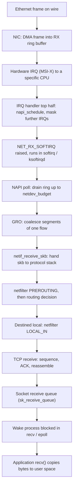
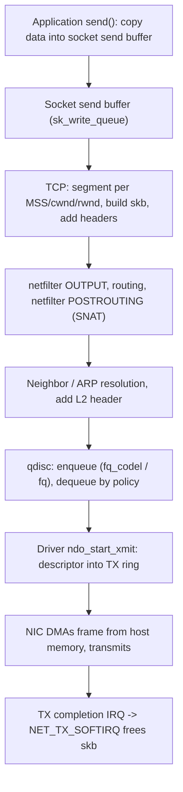
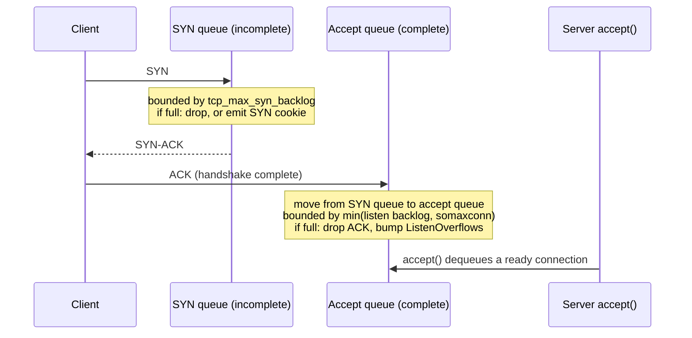
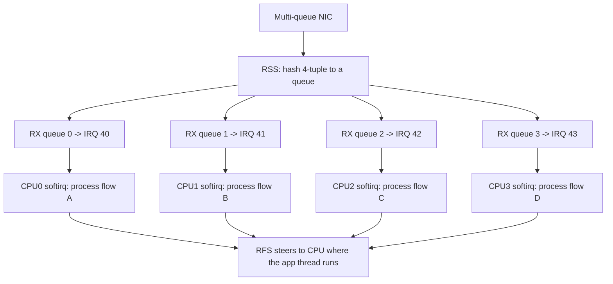
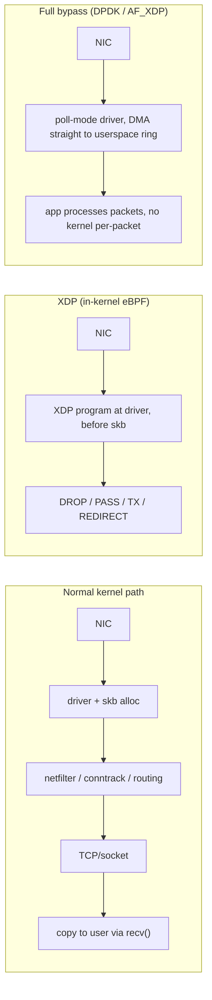

# Chapter 10 — The Linux Network Stack

**What this chapter covers.** Every remote procedure call your service makes, every HTTP
request it answers, every gRPC stream, every database round-trip — all of it is bytes moving
through the Linux network stack, twice per hop: once out through the sender's kernel, once in
through the receiver's. For a backend engineer this stack is not an implementation detail to
be abstracted away; it is the layer where your tail latency is actually decided, where a
misconfigured accept queue turns a load spike into a connection storm, where a conntrack table
fills and a whole node stops accepting traffic. This chapter is a deep, mechanical tour of
that stack: how a packet travels from the wire into a `recv()` call and back out, what an
`sk_buff` is, how interrupts and NAPI polling share the load, how the socket layer's queues
and buffers behave, how netfilter and connection tracking sit in the fast path, how the qdisc
layer paces transmission, how NIC offloads and multi-queue steering let one host saturate
100 Gbit/s links, and finally how DPDK and XDP bypass most of the stack when even a
well-tuned kernel is not fast enough.

We build on the rest of Volume 2. The softirq and scheduling machinery from Chapter 2 (CPU
Scheduling) is exactly what runs packet processing off the interrupt path. The syscall
boundary from Chapter 5 (System Calls and the Kernel Boundary) is the `send()`/`recv()`
cost we amortize. The readiness and completion models from Chapter 7 (Linux I/O Models:
Blocking, epoll, and io_uring) are the application-facing end of the socket receive queue we
study here. NUMA locality from Volume 1, Chapter 6 governs where interrupts and their data
should land. Full TCP congestion-control theory belongs to Volume 3 (Networking); here we
cover only the kernel-side buffers and knobs a backend engineer tunes.

Learning goals — after this chapter you should be able to:

- Trace a packet end to end on both the receive and transmit paths, naming every queue,
  buffer, and softirq it passes through, and explain where drops happen and how to see them.
- Explain the `sk_buff`, NAPI polling, and interrupt coalescing, and why they exist.
- Distinguish the **SYN queue** from the **accept queue**, size both correctly, and diagnose
  overflow with real counters — the single most common connection-scaling bug.
- Reason about socket send/receive buffers, autotuning, Nagle vs `TCP_NODELAY`, and the
  `SO_*` options that matter for latency and connection reuse.
- Understand connection tracking and netfilter well enough to predict their performance cost
  and recognize conntrack-table exhaustion before it takes a node down.
- Explain NIC offloads (checksum, TSO/GSO/GRO/LRO) and multi-queue steering (RSS/RPS/RFS)
  and configure IRQ and CPU affinity for network processing with NUMA in mind.
- Diagnose ephemeral-port exhaustion and `TIME_WAIT` accumulation, and apply
  `SO_REUSEADDR`/`SO_REUSEPORT` correctly.
- Decide when kernel bypass (DPDK, XDP, AF_XDP) is justified and how modern L4 load balancers
  use eBPF/XDP.

## The shape of the stack

The Linux network stack is a layered pipeline with queues between the layers. Data crosses
three boundaries: the wire-to-hardware boundary at the NIC, the hardware-to-kernel boundary
(DMA plus interrupts), and the kernel-to-application boundary (the socket API and its
syscalls). Between those boundaries sit rings, buffers, and queues whose sizes and drain
rates determine throughput and latency. The mental model that pays off is this: **the stack
is a series of producer/consumer queues, and every one of them can overflow**. Throughput is
set by the slowest consumer; latency is set by how deep the queues are allowed to grow
(bufferbloat); and drops happen at whichever queue fills first. Almost every network incident
a backend team sees reduces to one of those three statements.

The layers, top to bottom on transmit and bottom to top on receive, are: the socket layer
(BSD sockets, per-socket send/receive buffers), the transport layer (TCP/UDP), the network
layer (IP, routing, netfilter), the traffic-control layer (qdiscs, on TX only), the device
layer (the driver and its DMA rings), and the NIC hardware itself. We will walk a packet
through all of them in both directions.

## The receive path: from wire to recv()

When a frame arrives, the NIC does not interrupt the CPU for each byte. Modern NICs are bus
masters: the driver has pre-allocated a **receive ring** — a circular array of descriptors,
each pointing at a DMA-mappable buffer in host memory — and handed those buffer addresses to
the NIC. The NIC writes the incoming frame directly into host RAM by DMA, advances the ring,
and only then signals the CPU.



Step by step:

1. **DMA into the RX ring.** The NIC copies the frame into a buffer the driver pre-posted.
   No CPU involvement yet. If the ring has no free descriptors — the driver has not refilled
   it fast enough — the NIC drops the frame and increments a hardware counter (`rx_no_buffer`,
   `rx_missed_errors`, or similar, visible in `ethtool -S`). These are *hardware* drops, before
   the kernel ever sees the packet.

2. **The interrupt (top half).** The NIC raises an MSI-X interrupt targeted at a specific CPU
   (which CPU is set by IRQ affinity — see multi-queue below). The driver's hard IRQ handler
   does almost nothing: it acknowledges the interrupt, **masks further receive interrupts for
   that queue**, and calls `napi_schedule()` to raise the `NET_RX_SOFTIRQ`. The design goal is
   to spend as little time as possible in hard-IRQ context, which runs with interrupts
   disabled.

3. **NAPI poll (the softirq).** The real work happens in softirq context (Chapter 2), either
   inline after the IRQ or, under sustained load, in the per-CPU `ksoftirqd` kernel thread.
   The driver's `poll()` function drains the RX ring, pulling frames into `sk_buff`s, up to a
   **budget** — `net.core.netdev_budget` (default 300 packets) or `netdev_budget_usecs`
   (default 2000 µs), whichever comes first. This is NAPI: **under low load you get interrupts;
   under high load the NIC stays in polled mode and interrupts are suppressed**, avoiding an
   interrupt storm (one IRQ per packet at line rate would melt a CPU). When the ring is
   drained below budget, NAPI re-enables interrupts and goes back to sleep.

4. **GRO (Generic Receive Offload).** Before packets go up the stack, GRO coalesces multiple
   received segments belonging to the same flow into one large `sk_buff`, so the expensive
   per-packet trip up the stack is paid once for, say, 45 KB instead of 30 times for 1500-byte
   frames. This is a major throughput win and is done in software (or assisted by hardware
   LRO).

5. **Into the protocol stack.** `netif_receive_skb()` hands the `sk_buff` to the registered
   protocol handler (IP). The packet passes the **netfilter PREROUTING** hook (where DNAT and
   raw/conntrack rules live), then the routing decision determines whether it is for this host
   (`LOCAL_IN`) or to be forwarded (`FORWARD`). Connection tracking is consulted here.

6. **TCP processing.** For a local TCP segment, the kernel finds the matching socket, validates
   the sequence number, updates the receive window, sends or schedules an ACK, reassembles
   in-order data, and appends it to the socket's **receive queue** (`sk_receive_queue`). Out-of-
   order segments wait in a separate out-of-order queue until the gap fills.

7. **Wake the application.** The kernel marks the socket readable and wakes any thread blocked
   in `recv()` or registered via `epoll` (Chapter 7). The application's `recv()` copies bytes
   from the kernel receive buffer into user space and frees that space, which lets TCP advance
   the window it advertises back to the sender.

The critical backend insight: between the socket receive queue and the application there is a
syscall and a copy, and if the application is slow to drain (a stalled event loop, a
GC pause, head-of-line blocking on a mutex), the receive buffer fills, TCP shrinks the
advertised window to zero, and back-pressure propagates all the way to the sender. **A slow
consumer is felt as network back-pressure, not as a local queue growing unbounded** — this is
TCP flow control doing its job, and it is why a stuck downstream shows up as elevated latency
upstream.

## The transmit path: from send() to wire

Transmit is the mirror image, with one extra layer — traffic control — that has no receive
equivalent.



1. **send() and the send buffer.** `send()`/`write()` copies user data into the socket's
   **send buffer** (bounded by `SO_SNDBUF` / autotuning). If the buffer is full and the socket
   is blocking, the call blocks; if non-blocking, it returns `EAGAIN` and your event loop must
   wait for writability (Chapter 7). Once copied, the kernel owns the data and can retransmit
   it — TCP keeps a copy until it is ACKed.

2. **TCP segmentation.** TCP carves the byte stream into segments no larger than the MSS,
   subject to the congestion window (`cwnd`) and the peer's advertised receive window (`rwnd`).
   Each segment becomes an `sk_buff` with TCP and IP headers. With TSO/GSO (below), this
   segmentation is deferred so the stack carries one giant `sk_buff` almost to the wire.

3. **IP, routing, netfilter.** The packet passes the **OUTPUT** hook, a routing lookup picks
   the egress interface and next hop, and the **POSTROUTING** hook (SNAT/masquerade) runs.
   Neighbor resolution (ARP/NDP) supplies the destination MAC and the L2 header is prepended.

4. **The qdisc (traffic control).** `dev_queue_xmit()` hands the packet to the interface's
   **queueing discipline**. This is where packets are buffered, prioritized, paced, or dropped
   before the driver. On a modern kernel the default qdisc (`net.core.default_qdisc`) is
   typically `fq_codel`. The qdisc dequeues by its own policy and pushes to the driver.

5. **The driver and TX ring.** The driver's `ndo_start_xmit()` writes a descriptor into the
   **transmit ring**, pointing the NIC at the buffer. The NIC DMAs the frame out of host memory
   and onto the wire.

6. **TX completion.** When the NIC finishes transmitting, it raises a completion interrupt;
   the `NET_TX_SOFTIRQ` reclaims the now-sent `sk_buff`s and frees their memory. Only after the
   peer ACKs does TCP release its retained copy.

## The sk_buff: the packet's in-kernel identity

Everything above moves one central structure: the **`sk_buff`** (socket buffer, universally
"skb"). It is the kernel's representation of a packet in flight, and understanding its layout
explains several performance behaviors.

An `sk_buff` is metadata; the packet bytes live in a separately allocated data area. The skb
holds pointers into that area — `head`, `data`, `tail`, `end` — carving it into **headroom**
(space before `data`, so lower layers can prepend headers without reallocating), the packet
payload (`data`..`tail`), and **tailroom**. As a packet goes down the stack, each layer moves
`data` backward and writes its header into the headroom — no copy, just pointer arithmetic.
That is why drivers reserve generous headroom, and why XDP (below) needs headroom to insert
encapsulation.

Two more features matter. First, **cloning**: `skb_clone()` produces a second skb head sharing
the same data (via a reference-counted `skb_shared_info`); TCP uses this to keep a copy for
retransmission while the original travels down the stack. Copy-on-write kicks in only if
someone must modify the shared data. Second, **fragments**: the `skb_shared_info` at the end of
the data area holds an array of page fragments, so a large segment (from TSO/GSO or `sendfile`)
can reference payload pages directly without linearizing them into one contiguous buffer —
essential for zero-copy TX. Allocating and freeing skbs at millions of packets per second is
itself a cost the whole stack is designed to minimize, which is one reason coalescing (GRO,
TSO) and kernel bypass exist.

## Interrupts, NAPI, and coalescing

At 10/25/100 Gbit/s, per-packet interrupts are untenable: a 10 GbE link can deliver ~14.8
million minimum-size packets per second, and no CPU can service that many hard IRQs. Two
mechanisms tame this.

**NAPI** (New API), described above, is the software half: switch to polling under load. The
hardware half is **interrupt coalescing** — the NIC waits a short interval or a small count of
packets before raising an interrupt, batching several packets per IRQ. You tune it with
`ethtool -C`:

```bash
# Show coalescing settings
ethtool -c eth0
# Coalesce: raise an RX interrupt after 50 us OR 64 frames, whichever first
ethtool -C eth0 rx-usecs 50 rx-frames 64
# Adaptive coalescing: let the NIC vary the interval by load
ethtool -C eth0 adaptive-rx on
```

Coalescing is a **latency/throughput/CPU trade-off**. Larger `rx-usecs` batches more, cutting
CPU and raising throughput, but adds up to that many microseconds of latency to every packet.
Latency-sensitive services (a trading gateway, a low-latency cache) tighten it; throughput-
bound bulk movers loosen it. This is a knob you actually turn in production, and it interacts
with tail latency (Volume 11) directly: a fat coalescing window is invisible in the mean and
very visible at p999.

## The socket layer: buffers, backlog, and the two queues

### Send and receive buffers, and autotuning

Each socket has a send buffer and a receive buffer. `SO_SNDBUF`/`SO_RCVBUF` set them via
`setsockopt`, but Linux normally **autotunes** them within limits so you should rarely pin
them. Two gotchas: the kernel roughly **doubles** the value you set (accounting for bookkeeping
overhead), and setting `SO_RCVBUF`/`SO_SNDBUF` explicitly **disables autotuning** for that
socket. The autotuning limits are three-valued sysctls — min, default, max:

```bash
# min default max, in bytes, for the receive buffer
sysctl net.ipv4.tcp_rmem       # e.g. 4096   131072  6291456
sysctl net.ipv4.tcp_wmem       # e.g. 4096    16384  4194304
# hard ceilings that also bound explicit SO_RCVBUF/SO_SNDBUF requests
sysctl net.core.rmem_max net.core.wmem_max
# receive-buffer autotuning on/off
sysctl net.ipv4.tcp_moderate_rcvbuf   # 1 = enabled
```

The receive buffer must be large enough to hold a full **bandwidth-delay product** or TCP
cannot keep the pipe full: the advertised window caps in-flight data, and window = buffer. On
a 10 Gbit/s path with 30 ms RTT, the BDP is ~37 MB, far above the default max — so a
cross-region bulk transfer that seems mysteriously capped at a few hundred Mbit/s is usually
hitting `tcp_rmem`'s ceiling, not the network. Raise `net.core.rmem_max` and the top of
`tcp_rmem` for such workloads. (Full window/BDP theory is Volume 3.)

### The listen backlog: SYN queue vs accept queue

This is the most misunderstood corner of the socket API and the source of a recurring class
of production incidents, so it earns a diagram. A listening socket has **two** queues, not
one.



- The **SYN queue** (also "request queue", incomplete connection queue) holds connections in
  `SYN_RECV`: a SYN arrived, a SYN-ACK went out, the final ACK is awaited. Its size is bounded
  by `net.ipv4.tcp_max_syn_backlog`. When it fills — classically during a SYN flood — new SYNs
  are dropped **unless SYN cookies are enabled**.

- The **accept queue** (completed connection queue) holds fully established connections that
  finished the three-way handshake and are waiting for the application to call `accept()`. Its
  size is `min(backlog, net.core.somaxconn)`, where `backlog` is the argument you passed to
  `listen(fd, backlog)`. **You cannot exceed `somaxconn` no matter what you pass to `listen`.**

Two overflow behaviors, two different symptoms:

- **Accept-queue overflow.** If the handshake completes but the accept queue is full (the app
  is not calling `accept()` fast enough — a busy or stalled event loop), the kernel by default
  **silently drops the client's final ACK** and increments `ListenOverflows` and `ListenDrops`.
  The client thinks the connection is established and starts sending or waiting; the server
  eventually retransmits the SYN-ACK, forcing a retry after an RTO. This shows up as
  *mysterious multi-second connection latency under load* while CPU looks fine — the give-away
  is a climbing `ListenOverflows`. Setting `net.ipv4.tcp_abort_on_overflow=1` makes the kernel
  send an RST instead (fail fast rather than hang), but the real fix is a bigger queue and a
  faster `accept()` loop.

- **SYN-queue overflow / SYN cookies.** When the SYN queue fills, `net.ipv4.tcp_syncookies`
  (default 1) lets the kernel encode the connection state into the SYN-ACK's initial sequence
  number and keep **no** server-side state; when the client's ACK returns, the state is
  reconstructed from the cookie. This defeats SYN-flood memory exhaustion, at the cost of
  disabling a few TCP options for cookie-established connections. Cookies engage only when the
  queue actually overflows, so they are a safety valve, not a steady-state mechanism.

Diagnosing this is one `ss` command: for a listening socket, `Recv-Q` is the **current** accept
queue depth and `Send-Q` is its **maximum**.

```bash
$ ss -tlnp
State   Recv-Q  Send-Q  Local Address:Port  Peer Address:Port  Process
LISTEN  129     128     0.0.0.0:8080        0.0.0.0:*          users:(("app",pid=42,fd=6))
```

Here `Recv-Q` (129) has exceeded `Send-Q` (128 = the effective backlog): the accept queue is
overflowing right now. Confirm with the global counter:

```bash
$ nstat -az | grep -i listen
TcpExtListenOverflows   14823   0.0
TcpExtListenDrops       14823   0.0
```

The fix is threefold and must be applied together, because the smallest of the three wins:
raise `net.core.somaxconn`, pass a matching `backlog` to `listen()` (many runtimes default to
128 or even `SOMAXCONN` frozen at compile time — check your framework), and make sure the app
drains the queue. The kernel default for `somaxconn` was **128** for many years and was raised
to **4096** in Linux 5.4; on older kernels or containers you must set it explicitly.

## TCP in the kernel: the knobs a backend engineer touches

Full TCP — congestion control, loss recovery, the state machine — is Volume 3. Here are the
kernel behaviors that change how your *application* code performs.

**Nagle's algorithm and delayed ACK.** Nagle (`RFC 896`) withholds a small segment until the
previous small segment is ACKed, coalescing tiny writes to avoid flooding the network with
40-byte-header, 1-byte-payload packets. Delayed ACK (`RFC 1122`) withholds an ACK briefly
(up to ~40 ms on Linux) hoping to piggyback it on a reply. Individually reasonable, **together
they interact pathologically**: a request/response protocol that does a small write then waits
can stall — Nagle holds the request waiting for an ACK, the peer's delayed-ACK timer holds the
ACK waiting for data, and you eat tens of milliseconds per exchange. The fix for latency-
sensitive request/response traffic is `TCP_NODELAY`, which disables Nagle:

```c
int one = 1;
setsockopt(fd, IPPROTO_TCP, TCP_NODELAY, &one, sizeof(one));
```

Most RPC libraries (gRPC, most HTTP servers) set `TCP_NODELAY` by default for exactly this
reason. If you write a custom protocol and see inexplicable ~40 ms latency spikes, this is the
first suspect.

**TCP_CORK** is the inverse: it *accumulates* data and refuses to send partial segments until
you uncork or the buffer fills, so you can assemble a full-MSS packet from several writes (a
header plus a body) and send it as one. `sendfile()`-based static servers use it to merge
headers with file data. `TCP_NODELAY` and `TCP_CORK` express opposite intents — "send now,
latency matters" vs "wait, packing matters."

**Keepalive** (`SO_KEEPALIVE` plus `tcp_keepalive_time`/`_intvl`/`_probes`) detects dead peers
on idle connections; important for long-lived connection pools behind stateful load balancers
and NATs that silently drop idle flows.

## Netfilter, iptables/nftables, and connection tracking

Every packet that is filtered, NATed, or load-balanced by the kernel passes through
**netfilter** — a set of hooks at fixed points in the IP path (PREROUTING, INPUT, FORWARD,
OUTPUT, POSTROUTING). `iptables` and its successor `nftables` install rules at those hooks;
Kubernetes' `kube-proxy` in iptables mode, Docker's port publishing, and every host firewall
you run are netfilter rules.

The performance story matters because in a Kubernetes cluster these rule sets are enormous.
**`iptables` evaluates rules linearly**: a packet is tested against rules in order until one
matches. With one Service that is trivial; with thousands of Services and endpoints,
`kube-proxy` in iptables mode generates tens of thousands of rules, and every new connection
walks a long chain — O(n) per connection, with rule-set *update* cost that can spike CPU when
endpoints churn. **`nftables`** replaces linear chains with a bytecode VM and, crucially,
**maps and sets** that give O(1) or O(log n) lookups (hash/interval maps), so a Service lookup
is a single map dereference rather than a chain walk. This is why `kube-proxy`'s nftables mode
and eBPF dataplanes (Cilium, below) exist: to escape the linear-scan cost.

### Connection tracking (conntrack)

**Conntrack** (`nf_conntrack`) is the stateful engine underneath NAT and stateful firewalling.
It records every connection's tuple and state in a hash table so that reply packets can be
matched to their flow and NAT translations applied consistently. It is invisible until it
isn't, and when it isn't, it is a classic fleet-wide outage.

The table has a fixed maximum, `net.netfilter.nf_conntrack_max`, and a fixed number of hash
buckets. **When the table fills, the kernel drops new connections and logs**:

```
nf_conntrack: table full, dropping packet
```

To a service this looks like random connection failures and timeouts with no application-level
cause, often across an entire node or cluster at once — a NAT gateway, a busy ingress node, or
a node running short-lived connection-heavy workloads (think a scraper, a health-checker, or a
serverless burst) can exhaust conntrack in seconds. Each connection also holds an entry for a
timeout after it closes (`nf_conntrack_tcp_timeout_time_wait` and friends), so high connection
*churn* fills the table even when concurrent connections are modest.

Observe and size it:

```bash
sysctl net.netfilter.nf_conntrack_max        # table capacity
sysctl net.netfilter.nf_conntrack_count       # current entries (also /proc/sys/.../nf_conntrack_count)
cat /proc/sys/net/netfilter/nf_conntrack_buckets   # hash buckets
conntrack -S                                  # per-CPU stats incl. 'insert_failed', 'drop'
conntrack -L | wc -l                          # dump the live table
```

Rising `nf_conntrack_count` toward `nf_conntrack_max`, and non-zero `insert_failed`/`drop` in
`conntrack -S`, are the leading indicators. Mitigations: raise `nf_conntrack_max` (and the
bucket count proportionally, so the hash stays shallow), shorten timeouts for churny traffic,
or exempt high-volume trusted flows from tracking with a `NOTRACK` rule in the `raw` table so
they never consume an entry. The deeper fix — for clusters where conntrack is a bottleneck — is
to move the dataplane to eBPF, which can bypass conntrack for known flows.

## The qdisc layer and bufferbloat

On transmit, every interface has a **queueing discipline**. The historical default,
`pfifo_fast`, is a simple three-band FIFO. Its problem is **bufferbloat**: large, dumb FIFO
buffers (in the qdisc, the driver ring, and the NIC) fill up under load and add enormous
queueing delay — a bulk transfer fills the buffer, and every latency-sensitive packet behind
it waits through the whole backlog. Bufferbloat is why a large upload can wreck the latency of
an interactive session sharing the link.

The modern default is **`fq_codel`** (Fair Queuing with Controlled Delay). CoDel is an
**active queue management** algorithm: instead of only dropping when the buffer is full (tail
drop), it measures the *time* packets spend in the queue and starts dropping (or ECN-marking)
when the standing queue delay exceeds a target (~5 ms), signaling TCP to back off before the
queue grows deep. The "fq" part hashes flows into separate sub-queues and round-robins them, so
one fat flow cannot starve or delay the others. Together they keep latency low under load
without hand-tuning buffer sizes.

**`fq`** (fair queue, without CoDel) adds **pacing**: it spaces a flow's packets out to match
its computed rate rather than sending them in bursts. This is the recommended qdisc for the
**BBR** congestion-control algorithm, which depends on pacing to estimate bandwidth. You set
these globally or per-interface:

```bash
sysctl -w net.core.default_qdisc=fq_codel     # default for new interfaces
tc qdisc replace dev eth0 root fq             # pacing qdisc, e.g. for BBR
tc -s qdisc show dev eth0                      # show stats incl. drops, overlimits
```

For backend fleets the takeaway is that `fq_codel` should be your default and that
`tc -s qdisc show`'s drop and backlog counters are where egress queueing latency becomes
visible.

## Offloads: doing packet work in the NIC

To saturate fast links the CPU must do *less* per byte, so the NIC takes over repetitive work.
These are the offloads, viewable with `ethtool -k` and toggled with `ethtool -K`:

| Offload | Direction | What it does |
|---|---|---|
| Checksum (rx/tx) | both | NIC computes/verifies IP/TCP/UDP checksums |
| **TSO** (TCP Segmentation Offload) | TX | Kernel hands the NIC one large buffer; NIC splits into MSS-sized segments |
| **GSO** (Generic Segmentation Offload) | TX | Same idea in software: defer segmentation to just before the driver |
| **GRO** (Generic Receive Offload) | RX | Software coalesces received segments of a flow into one large skb |
| **LRO** (Large Receive Offload) | RX | Hardware version of GRO; lossy, must be off for forwarding/bridging |

The unifying principle is **amortization**: the per-packet cost of traversing the stack
(skb allocation, header processing, function calls) is paid once for a 64 KB super-packet
instead of ~43 times for 1500-byte frames. TSO/GSO can multiply TX throughput several-fold on
a CPU-bound sender; GRO does the same on RX. LRO is the exception you often *disable*: because
it irreversibly merges packets, a router or bridge (and thus most Kubernetes nodes) must use
GRO instead, which preserves enough information to re-segment. Inspect and adjust:

```bash
ethtool -k eth0 | grep -E 'segmentation|generic|large|checksum'
ethtool -K eth0 gro on tso on lro off        # typical for a forwarding node
```

One debugging trap: packet captures taken on the local host see **super-sized "packets"**
(e.g., 64 KB) because `tcpdump` taps the stack *after* GRO on RX and *before* TSO on TX. Those
are not real wire frames; the NIC segments them. Do not conclude your MTU is broken from a
local capture — capture at a switch mirror or disable offloads temporarily to see wire-sized
frames.

## Multi-queue NICs, RSS/RPS/RFS, and affinity

A single CPU cannot process 100 Gbit/s of packets. Modern NICs expose **multiple hardware
queues**, and the work of spreading traffic across CPUs is done by a family of steering
mechanisms.



- **RSS (Receive Side Scaling)** is the hardware mechanism: the NIC hashes each packet's
  4-tuple (a Toeplitz hash over source/dest IP and port) to one of N receive queues, each with
  its own interrupt. Because the hash is over the *flow*, all packets of one TCP connection land
  on the same queue and thus the same CPU — preserving in-order processing and cache locality
  for that flow. You spread flows across cores; you do not split a single flow.

- **RPS (Receive Packet Steering)** is the software fallback when the NIC has fewer queues than
  CPUs (or no RSS): after the IRQ, the kernel hashes the flow and steers the packet to another
  CPU's backlog for protocol processing. It costs an inter-CPU interrupt but spreads load.

- **RFS (Receive Flow Steering)** goes further: it tracks *which CPU the application thread that
  will `recv()` this flow is running on*, and steers the packet's processing to that same CPU,
  so the data is hot in the right L1/L2 cache when the app reads it. Accelerated RFS pushes this
  hint into the NIC hardware so RSS itself targets the right queue.

- **XPS (Transmit Packet Steering)** is the TX analog: it maps CPUs to TX queues so a thread
  transmits on a queue local to its core.

**Affinity ties this to NUMA (Volume 1, Chapter 6).** Each RX queue's interrupt should be
pinned to a CPU, and — critically — to a CPU **on the NUMA node local to the NIC**, so the DMA'd
packet data and the descriptors are in local memory. Cross-NUMA packet processing pays a remote
memory penalty on every access, and at millions of packets per second that is real throughput
lost.

```bash
# Which CPUs is IRQ 41 allowed to run on? (bitmask)
cat /proc/irq/41/smp_affinity_list
# Pin IRQ 41 to CPU 1
echo 1 > /proc/irq/41/smp_affinity_list
# Which NUMA node is the NIC on?
cat /sys/class/net/eth0/device/numa_node
# Per-queue IRQ names
grep eth0 /proc/interrupts
```

A subtlety: the `irqbalance` daemon will happily *move* your carefully pinned IRQs around.
For latency-sensitive or high-PPS workloads, teams commonly disable `irqbalance` and pin RX
queue IRQs statically to NIC-local cores, sometimes isolating those cores from the scheduler
(`isolcpus`, `nohz_full`) so nothing else preempts packet processing. This is the same
placement discipline as pinning application threads — the packets and the threads that consume
them should share a NUMA node and, ideally, not fight for the same cores.

## Ephemeral ports, TIME_WAIT, and reuse

A client (or a proxy dialing upstreams — your service is a client too) needs a local port for
each outbound connection. The kernel allocates these from the **ephemeral range**,
`net.ipv4.ip_local_port_range` (default `32768 60999`, ~28k ports). Since a connection is
identified by the full 4-tuple, the limit is 28k connections **per (destination IP, destination
port)** pair, not 28k total — but a service that fans out to one backend address (a single
database VIP, one upstream) hits exactly that ceiling, and new `connect()` calls fail with
`EADDRNOTAVAIL`.

**`TIME_WAIT`** makes it worse. When a connection closes, the side that sent the last active
close (typically the client) holds the 4-tuple in `TIME_WAIT` for a fixed **60 seconds** on
Linux (`TCP_TIMEWAIT_LEN`, compiled in, not tunable via sysctl) to absorb delayed duplicate
segments and complete the close reliably. A connection-per-request client churning thousands of
short connections per second accumulates tens of thousands of `TIME_WAIT` sockets, each
occupying its ephemeral tuple — and exhausts the range.

The fixes, in order of preference:

1. **Reuse connections.** The real answer is a connection pool / HTTP keep-alive / HTTP/2 or
   gRPC multiplexing, so you open few long-lived connections instead of one per request. This
   eliminates the problem rather than working around it. `TIME_WAIT` at scale is almost always
   a symptom of missing connection reuse.

2. **`net.ipv4.tcp_tw_reuse=1`** lets the kernel reuse a `TIME_WAIT` socket for a *new outbound*
   connection when TCP timestamps (`RFC 7323`) make it safe. This is the safe, recommended
   sysctl for client-side port pressure.

3. Do **not** reach for `tcp_tw_recycle` — it was aggressive, broke clients behind NAT (it keyed
   on per-host timestamps), and was **removed from the kernel in 4.12**. Any tuning guide that
   still recommends it is outdated.

On the **server/listen** side, `SO_REUSEADDR` lets you `bind()` to a port that still has
sockets in `TIME_WAIT` — this is why it is standard practice to set it before binding a server
socket, so a restarted service can rebind immediately instead of waiting out `TIME_WAIT` on the
listener.

### SO_REUSEPORT: scaling accept across cores

`SO_REUSEADDR` and `SO_REUSEPORT` are often confused. **`SO_REUSEPORT`** lets *multiple sockets*
— typically one per worker process or thread — bind to the **same** IP and port simultaneously.
The kernel then load-balances incoming connections across the listening sockets by hashing the
4-tuple, giving each worker its **own accept queue**.

```c
int one = 1;
setsockopt(fd, SOL_SOCKET, SO_REUSEPORT, &one, sizeof(one));
bind(fd, ...);      // each worker binds its own fd to the same addr:port
listen(fd, backlog);
```

This solves a real scaling problem. In the classic model, N workers share one listening socket
and one accept queue; they contend on that socket's lock and suffer the "thundering herd" of
many workers waking for one connection. With `SO_REUSEPORT`, the kernel distributes connections
in-kernel across independent queues — no shared lock, no herd, and near-linear accept scaling
across cores. NGINX, Envoy, and HAProxy all support it for exactly this. The caveats: the hash
distribution is not perfectly even, and a worker that dies with connections sitting in its
private accept queue *drops them* (they were already assigned to that queue) — so graceful
restart needs care. Combined with multi-queue RSS (packets for a flow already land on a
particular CPU) and CPU-pinned workers, `SO_REUSEPORT` lets a whole request ride one core from
NIC queue to accept to processing, maximizing cache locality.

## Tuning knobs, gathered

The sysctls scattered above, collected as the ones you actually set on a backend host, and
what each protects against:

```bash
# Accept queue: cap and the SYN queue
net.core.somaxconn            = 4096      # max accept-queue length (and check listen() backlog!)
net.ipv4.tcp_max_syn_backlog  = 8192      # SYN (incomplete) queue length
net.ipv4.tcp_syncookies       = 1         # SYN-flood safety valve

# Softirq backlog: the per-CPU queue between NAPI and the stack (RPS uses it)
net.core.netdev_max_backlog   = 16384     # drops here show as /proc/net/softnet_stat col 2
net.core.netdev_budget        = 300       # packets per NAPI poll cycle

# Socket buffer ceilings and autotuning ranges
net.core.rmem_max             = 16777216
net.core.wmem_max             = 16777216
net.ipv4.tcp_rmem             = 4096 131072 6291456
net.ipv4.tcp_wmem             = 4096 16384 4194304

# Client-side port pressure
net.ipv4.ip_local_port_range  = 10240 65535
net.ipv4.tcp_tw_reuse         = 1

# Egress queueing
net.core.default_qdisc        = fq_codel

# Stateful firewall / NAT capacity
net.netfilter.nf_conntrack_max = 1048576
```

`netdev_max_backlog` deserves a note: it bounds the per-CPU input queue *between* the NAPI poll
and the rest of the stack (also used by RPS). If a CPU's softirq processing cannot keep up,
packets pile there and are dropped — visible as the second column of `/proc/net/softnet_stat`
(per-CPU: processed, dropped, time-squeezed). A nonzero "squeezed" (third column) means NAPI hit
its budget with more work pending — a sign to raise `netdev_budget` or spread load with more
queues.

## Observability: seeing every drop

The stack instruments itself thoroughly; the skill is knowing which counter names which queue.

- **`ss`** — the modern replacement for `netstat`. `ss -tln` for listen sockets (Recv-Q/Send-Q =
  accept queue depth/max), `ss -ti` for per-connection TCP internals (cwnd, rtt, retransmits,
  send/recv buffer). `ss -s` for a summary. This is your first tool for connection-state
  questions.

- **`nstat` / `/proc/net/netstat` / `/proc/net/snmp`** — the SNMP and extended TCP counters.
  `nstat -az` dumps everything; the ones that matter most: `TcpExtListenOverflows`,
  `TcpExtListenDrops` (accept queue overflow), `TcpExtTCPSynRetrans` (SYN retransmits — a sign
  of drops or SYN-queue pressure), `TcpRetransSegs`, `TcpExtTCPTimeouts`.

- **`ethtool -S eth0`** — driver/hardware counters: `rx_dropped`, `rx_no_buffer_count`,
  `rx_missed_errors` (ring overrun — the NIC dropped before the kernel), `tx_dropped`. These are
  the *hardware* drops; if they climb, the RX ring is too small or the CPU can't drain it.

- **`/proc/net/dev`** — per-interface RX/TX packets, bytes, errors, drops at the interface level.

- **`/proc/net/softnet_stat`** — per-CPU softirq processing: processed, dropped (backlog full),
  squeezed (budget exhausted). The place to see softirq-layer drops.

- **`conntrack -S`** — conntrack insert failures and drops; watch alongside
  `nf_conntrack_count` vs `_max`.

- **`tc -s qdisc show dev eth0`** — egress qdisc drops, backlog, and overlimits.

- **`tcpdump` / `bpftrace`** — packet-level and kernel-tracepoint visibility. Remember the GRO/
  TSO super-packet caveat above when reading local captures.

The diagnostic discipline is to **walk the path and read the counter at each queue**: hardware
(`ethtool -S`) → softirq backlog (`softnet_stat`) → conntrack → accept queue (`ss`,
`ListenOverflows`) → application. The first counter that is climbing tells you which queue is
the bottleneck, and therefore which knob to turn.

## Kernel bypass: XDP, AF_XDP, and DPDK

For most services a well-tuned kernel stack is more than enough. But at the extreme edge —
a Tbps-scale load balancer, a DDoS scrubber, a packet broker, an NFV dataplane — the per-packet
cost of the generic stack (skb allocation, the full IP/netfilter/socket path, syscalls, copies)
is the bottleneck, and teams reach for **kernel bypass**.



**XDP (eXpress Data Path)** runs an **eBPF program at the earliest point in the driver**, on the
raw DMA'd buffer **before an `sk_buff` is even allocated**. The program returns a verdict:
`XDP_DROP` (discard immediately — the fastest possible drop, used for DDoS filtering at tens of
millions of pps), `XDP_PASS` (continue up the normal stack), `XDP_TX` (bounce the packet back
out the same NIC, e.g. as a load-balancer redirect), or `XDP_REDIRECT` (send to another
interface or to an AF_XDP socket). Because it runs before skb allocation and is JIT-compiled and
verified, XDP delivers line-rate packet manipulation *inside* the kernel, without leaving it —
the sweet spot when you need speed but also want to coexist with the normal stack.

**AF_XDP** is a socket family that lets a userspace application receive raw frames with
**zero copy** via shared memory rings (`XDP_REDIRECT` into an AF_XDP socket), getting most of
DPDK's performance while keeping the NIC under kernel control and reusing the driver.

**DPDK (Data Plane Development Kit)** is the maximal approach: it **unbinds the NIC from the
kernel entirely**, replaces the driver with a userspace **poll-mode driver** (no interrupts —
dedicated cores busy-poll the rings), uses hugepages for its buffer pools, and hands packets to
the application with no kernel involvement per packet at all. It achieves the highest throughput
and lowest latency, at the cost of burning whole CPU cores at 100% (polling), losing the
kernel's TCP stack and tooling (you bring your own), and dedicating the NIC to one application.
It is the right tool for a purpose-built appliance, the wrong tool for a general service.

**When to use which.** The vast majority of backend services should use the normal stack and
tune it — the topics in the rest of this chapter get you a very long way. Reach for XDP when you
need line-rate *filtering or forwarding* while still running a normal host (DDoS mitigation,
L4 load balancing); reach for AF_XDP or DPDK when you are building the dataplane itself and the
kernel's per-packet overhead is provably your ceiling. These are specialist tools with real
operational cost, not a default.

## Distributed-systems lens

Everything in this chapter compounds because in a distributed system the stack is traversed
**twice per hop, on every request**. A single user request that fans out through an API gateway,
three microservices, and a database crosses the network stack roughly a dozen times end to end.
That means a per-packet or per-connection inefficiency you would ignore on one machine is
multiplied across the whole call graph and shows up as tail latency (Volume 11).

**Accept queues and buffer sizing shape tail latency and cause connection storms.** The
accept-queue overflow story is the canonical example: under a load spike, the app falls a little
behind on `accept()`, the queue overflows, the kernel silently drops final ACKs, clients wait
out an RTO and *retransmit*, which adds load, which deepens the backlog — a feedback loop that
turns a small overload into a connection storm. The same shape appears with undersized socket
buffers throttling throughput, and with SYN-queue pressure. Sizing these queues is not premature
optimization; it is setting the shock absorbers for load spikes.

**`SO_REUSEPORT` plus multi-queue RSS is how you scale accept across a many-core box.** A modern
server has dozens of cores; a single listening socket and a single accept queue is a scalability
cliff. The combination — RSS spreading flows to per-queue IRQs on NIC-local NUMA cores, RFS
steering processing to the consuming thread's core, `SO_REUSEPORT` giving each worker its own
accept queue — lets a request ride one core from wire to application logic, and lets accept
throughput scale with cores instead of bottlenecking on one lock. This is why high-performance
proxies are architected around it.

**Conntrack exhaustion is a classic fleet outage.** In a Kubernetes cluster with NAT-heavy
networking and churny short connections, a node's conntrack table fills, and the node starts
dropping *new* connections with no application-level error — just timeouts. Because the trigger
is connection churn, an innocuous change (a new health-check interval, a batch job that opens
many short connections) can tip a whole fleet over at once. Knowing the counter
(`nf_conntrack_count` vs `_max`, `insert_failed`) turns a baffling outage into a five-minute
diagnosis.

**eBPF/XDP is quietly rewriting the dataplane.** The industry's largest L4 load balancers run in
XDP: Meta's **Katran** is an XDP-based L4 LB, and **Cilium** (Book 6, Cloud-Native Security)
replaces `kube-proxy`'s iptables rules with an eBPF dataplane that does service load balancing,
network policy, and NAT with hash-map lookups instead of linear chains — escaping exactly the
O(n) iptables and conntrack costs described above. When you deploy Cilium or a cloud provider's
eBPF networking, you are moving the mechanisms in this chapter from the generic stack into
programmable, per-packet eBPF — the same stack, made fast and observable at the point where your
distributed system actually lives.

The through-line: your service's behavior under load is, to a large degree, the behavior of
these kernel queues under load. The engineer who can name them, size them, and read their drop
counters is the one who can keep tail latency flat when traffic doubles.

## Key takeaways

- The stack is a chain of producer/consumer queues — RX ring, softirq backlog, socket receive
  buffer on ingress; socket send buffer, qdisc, TX ring on egress. Throughput is set by the
  slowest consumer, latency by queue depth, and **every queue can drop**. Diagnosis is walking
  the path and reading each queue's counter.
- NAPI plus interrupt coalescing converts an unservable interrupt storm into batched polling;
  coalescing (`ethtool -C`) is a real latency/throughput/CPU knob.
- A listening socket has **two** queues: the SYN queue (`tcp_max_syn_backlog`, guarded by SYN
  cookies) and the accept queue (`min(listen backlog, somaxconn)`). Accept-queue overflow
  silently drops ACKs and inflates tail latency; `ss` Recv-Q/Send-Q and `ListenOverflows`
  diagnose it. `somaxconn` defaulted to 128 and became 4096 in kernel 5.4 — set it explicitly.
- Socket buffers must cover the bandwidth-delay product or TCP caps throughput; autotuning
  handles most cases but has ceilings (`tcp_rmem`/`rmem_max`) you raise for long fat pipes.
  Setting `SO_RCVBUF`/`SO_SNDBUF` disables autotuning.
- `TCP_NODELAY` disables Nagle to avoid the ~40 ms Nagle/delayed-ACK stall on request/response
  traffic; `TCP_CORK` does the opposite for packing.
- iptables evaluates rules linearly (O(n)); nftables and eBPF use maps for O(1) lookups.
  Conntrack table exhaustion (`nf_conntrack_max`) is a classic node-wide outage — watch
  `nf_conntrack_count` and `conntrack -S` insert failures.
- `fq_codel` (AQM + fair queuing) is the default qdisc and the cure for bufferbloat; `fq` adds
  pacing for BBR.
- Offloads (TSO/GSO/GRO, checksum) amortize per-packet cost to saturate fast links; LRO is
  usually disabled on forwarding nodes. Local captures show super-packets, not wire frames.
- RSS/RPS/RFS spread and steer packet processing across cores; pin RX-queue IRQs to NIC-local
  NUMA cores (Volume 1, Chapter 6) and beware `irqbalance` moving them.
- Ephemeral-port and `TIME_WAIT` exhaustion are symptoms of missing connection reuse; fix with
  pooling first, `tcp_tw_reuse` second; never `tcp_tw_recycle` (removed in 4.12). `SO_REUSEADDR`
  rebinds a `TIME_WAIT` listener; `SO_REUSEPORT` load-balances accept across per-worker queues.
- Kernel bypass (XDP in-kernel, AF_XDP zero-copy, DPDK full-userspace) is the high-PPS frontier;
  XDP/eBPF power modern L4 load balancers (Katran, Cilium). Tune the normal stack first — it
  goes a very long way.

## Further reading

- Christian Benvenuti, *Understanding Linux Network Internals* (O'Reilly) — the reference on
  the pre-NAPI-to-NAPI stack internals and `sk_buff` handling.
- The Linux kernel documentation tree: `Documentation/networking/scaling.rst` (RSS/RPS/RFS/XPS),
  `Documentation/networking/napi.rst`, and `Documentation/admin-guide/sysctl/net.rst` — the
  authoritative descriptions of the sysctls and steering mechanisms in this chapter.
  <https://www.kernel.org/doc/html/latest/networking/scaling.html>
- `man 7 socket`, `man 7 tcp`, `man 7 ip` — the definitive semantics of `SO_*`/`TCP_*` options,
  the listen backlog, and the sysctls (`man 7 tcp` documents `tcp_syncookies`, `tcp_rmem`, etc.).
- Cloudflare Engineering Blog, Marek Majkowski, "SYN packet handling in the wild" (and
  companion posts) — a precise, well-illustrated treatment of the SYN queue / accept queue
  two-queue model and its overflow behavior. <https://blog.cloudflare.com/>
- Toke Høiland-Jørgensen, Jesper Dangaard Brouer, et al., "The eXpress Data Path: Fast
  Programmable Packet Processing in the Operating System Kernel" (CoNEXT 2018) — the XDP design
  paper. <https://dl.acm.org/doi/10.1145/3281411.3281443>
- The Cilium documentation, "eBPF and XDP Reference Guide" and the BPF/XDP concepts pages —
  how an eBPF dataplane replaces iptables/conntrack. <https://docs.cilium.io/>
- Meta Engineering, "Open-sourcing Katran, a scalable network load balancer" — XDP in production
  as an L4 LB. <https://engineering.fb.com/>
- The Bufferbloat project and the CoDel/`fq_codel` papers (Nichols & Jacobson, "Controlling Queue
  Delay", ACM Queue 2012). <https://www.bufferbloat.net/> and
  <https://queue.acm.org/detail.cfm?id=2209336>
- Brendan Gregg, *Systems Performance* (2nd ed.), the networking chapter — a practical
  methodology for the observability tools (`ss`, `nstat`, `ethtool`, `bpftrace`) used here.