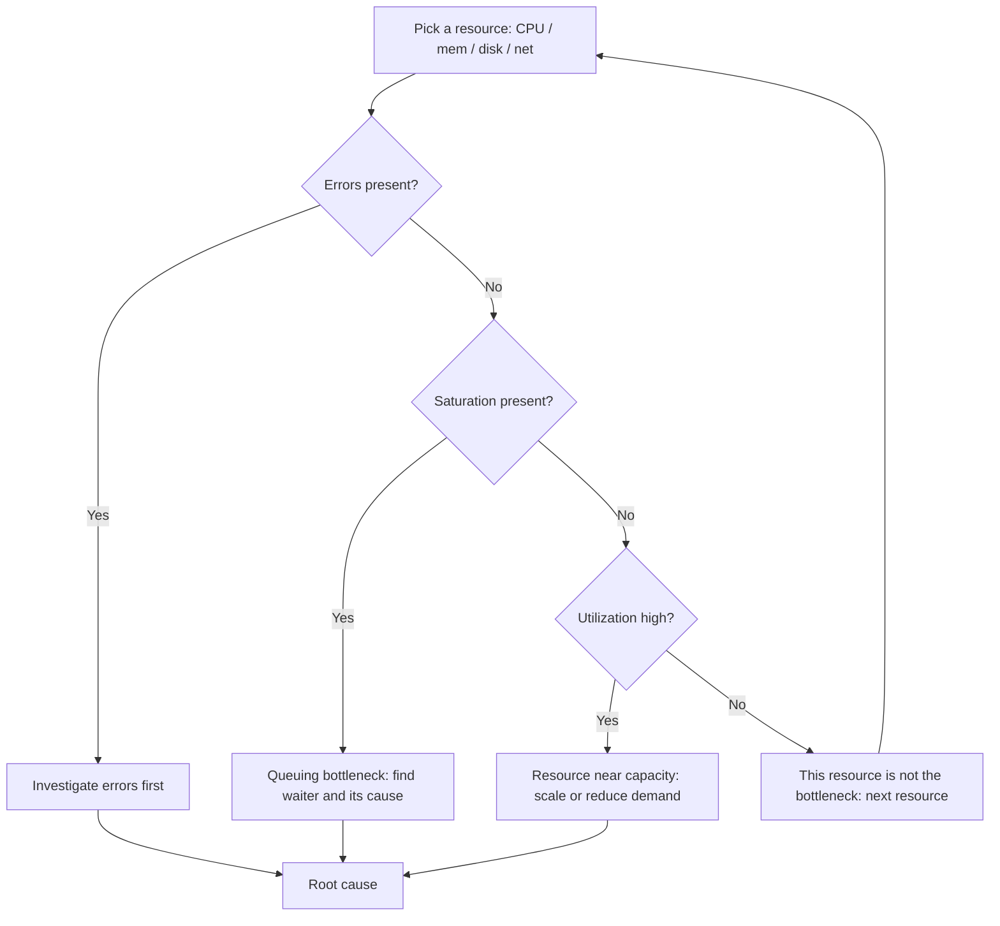
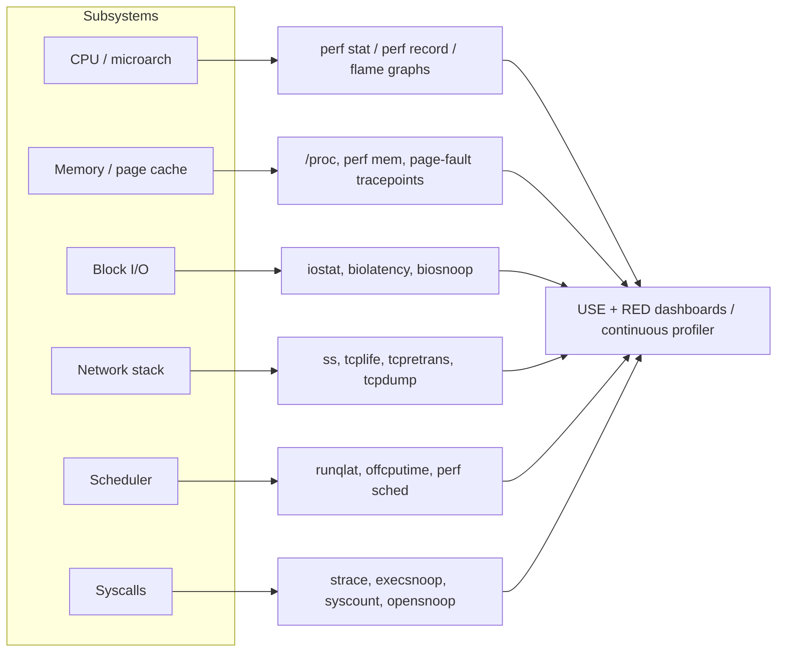
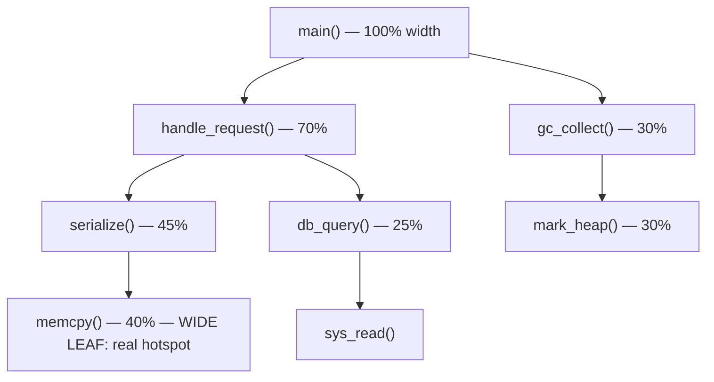
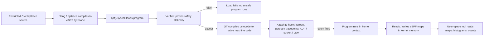
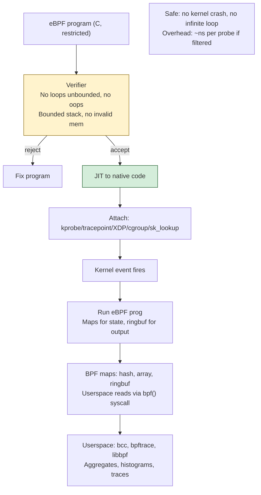
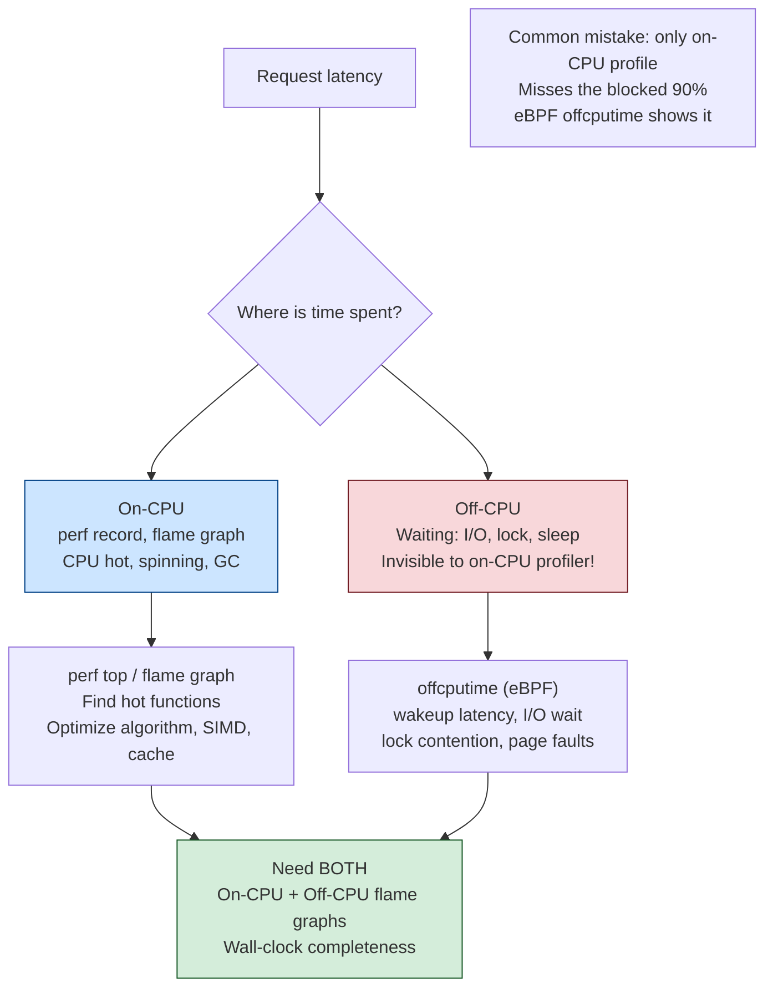

# Chapter 11 — Performance Analysis: perf, ftrace, and eBPF

**What this chapter covers.** Every prior chapter in this volume built a mechanism: the
scheduler puts your thread on a CPU (Chapter 2), the MMU translates its addresses (Chapter 3),
a system call crosses into the kernel (Chapter 5), the block layer moves a page to disk
(Chapter 7), the network stack ships a segment (Chapter 10). This chapter is about *seeing* all
of it — in production, on a running service, at line rate, without a debugger, without a
recompile, and without taking the process down. It is the chapter that turns "the p99 latency
doubled after the last deploy" from a shrug into a root cause.

The tools are the least interesting part. What matters is the *method*: how you decide where to
look, how you distinguish a saturated resource from a slow one, how you tell an on-CPU problem
(too much work) from an off-CPU problem (waiting for something), and how you go from a symptom
to a line of code with the fewest possible guesses. We anchor everything on Brendan Gregg's USE
method and the RED method for services, then descend through the three great instrumentation
technologies Linux gives you — hardware performance counters exposed by **perf**, the in-kernel
tracer **ftrace**, and the programmable tracing runtime **eBPF** — and finish with how all of
this runs continuously across a fleet of thousands of machines.

Learning goals — after this chapter you should be able to:

- Apply the **USE method** (Utilization, Saturation, Errors) to hardware resources and the
  **RED method** (Rate, Errors, Duration) to services, and know when to reach for each.
- Read `perf stat` output — IPC, cache misses, branch mispredictions — and connect the numbers
  to the microarchitecture from Volume 1 (Chapters 2, 3, 8).
- Use `perf record`/`report`/`top` for CPU profiling, understand sampling vs counting, and read
  and build a **flame graph**.
- Explain what **ftrace** is, the difference between static **tracepoints** and dynamic
  **kprobes/uprobes**, and use `function_graph` and `trace-cmd`.
- Explain **eBPF** end to end: the verifier, the JIT, maps, program types and attach points,
  and *why* it made production-safe dynamic tracing possible.
- Write **bpftrace** one-liners and read the **BCC** tool suite (`execsnoop`, `biolatency`,
  `runqlat`, `tcplife`, …) to observe CPU, memory, disk, network, the scheduler, and syscalls.
- Distinguish **on-CPU** from **off-CPU** analysis and diagnose scheduler-latency problems.
- Explain **continuous profiling** (Parca, Pyroscope, Google-Wide Profiling) and why always-on,
  low-overhead profiling is now table stakes for large fleets.

This chapter is Linux-specific and deliberately practical. It is the observability counterpart
to every mechanism chapter before it, and it is the technical foundation under Volume 11 (SRE
and Observability) and Book 6 (Cloud-Native Security), where the same eBPF machinery that traces
a slow query also enforces runtime security policy.

## Method first: measure, don't guess

The single most expensive mistake in performance work is optimizing something that was never the
bottleneck. Engineers are pattern-matchers; shown a slow service, we leap to the last thing we
read about — "it must be GC," "it must be the database," "it must be lock contention" — and then
spend a week confirming a bias. The discipline that prevents this is almost embarrassingly
simple: **measure, don't guess.** Form a hypothesis, but let a metric kill it before you write
code. The tools in this chapter exist so that the loop from hypothesis to evidence is minutes,
not days.

But raw measurement without structure is its own trap — you can stare at a hundred graphs and
learn nothing. You need a *checklist* that guarantees coverage. That is what a method provides.

### The USE method

The USE method, due to Brendan Gregg, is a checklist for finding resource bottlenecks. For
**every resource** — CPUs, memory, disks, network interfaces, I/O controllers, interconnects —
you ask three questions:

- **Utilization** — the fraction of time the resource was busy servicing work (or, for
  capacity-typed resources like memory, the fraction consumed). CPU at 90% busy; a disk 70% of
  the time doing I/O; memory 80% allocated.
- **Saturation** — the degree to which work is *queued* because the resource cannot keep up. A
  run queue with waiting threads; a block device with a deep request queue; swapping because
  memory demand exceeds capacity. Saturation is the honest signal; utilization can read a
  comfortable 60% while a bursty saturation is destroying your tail latency.
- **Errors** — error counts for the resource: ECC-corrected memory errors, disk I/O errors,
  dropped or malformed network packets, failed allocations.

The power of USE is that it is *exhaustive and cheap*. You enumerate the resources once, wire up
one metric per cell, and any bottleneck of the "a resource is maxed out" variety shows up.
Crucially, it steers you toward **saturation**, which is where tail latency lives and which
naive dashboards (that show only utilization) hide. High utilization with zero saturation is a
well-fed system; moderate utilization with periodic saturation is a system with a queuing
problem you cannot see in the average.



USE is a *hardware/resource* lens. It tells you which resource is the constraint; it does not,
by itself, tell you which request is slow or which user is affected. For that you want a
service-oriented view.

### The RED method for services

RED (Tom Wilkie's formulation, closely related to Google's "Four Golden Signals") characterizes
a *service* rather than a resource. For every service — and for every endpoint within it — track:

- **Rate** — requests per second.
- **Errors** — failed requests per second (and error ratio).
- **Duration** — the distribution of request latency, always as percentiles (p50/p90/p99/p999),
  never as a mean. The mean of a bimodal latency distribution is a number that describes no real
  request.

USE and RED are complementary, not competing. RED (or the Four Golden Signals — latency,
traffic, errors, saturation) is what your on-call dashboard shows: it answers "is the service
healthy, and are users hurting?" USE is what you reach for once RED says something is wrong and
you need to find the constrained resource underneath. A typical incident flows RED → USE → the
tracing tools in this chapter: the service's p99 (RED Duration) spikes, USE points at disk
saturation, and `biolatency` (below) shows the I/O latency histogram that confirms it.

### Latency vs throughput, and workload characterization

Two framings must stay separate in your head. **Throughput** is work per unit time (requests/s,
bytes/s, IOPS). **Latency** is time per unit of work (ms per request). They are not the same
axis and optimizing one routinely degrades the other: batching raises throughput and raises
latency; running a disk queue deep maximizes IOPS and destroys per-I/O latency. Backend services
are almost always latency-governed at the tail — the p99 is what breaks SLOs and cascades through
call graphs (a fan-out request is as slow as its slowest dependency) — so you optimize latency
subject to a throughput floor, not the reverse.

Before you profile, **characterize the workload**: who is calling, what are they asking for, how
often, and how is the load shaped in time? A cache-hit-heavy read workload and a write-heavy
workload on the same service have entirely different bottlenecks. Bursty arrival (the real world;
traffic is rarely Poisson) produces saturation that a steady-state average never reveals.
Workload characterization is the input that makes the USE/RED output interpretable.

### The observability tooling map

Linux gives you a layered set of tools, and part of expertise is knowing the cheapest tool that
answers the question. Counting is cheaper than sampling; sampling is cheaper than tracing every
event; and static, pre-existing instrumentation (tracepoints, `/proc`) is cheaper than dynamic
instrumentation (kprobes). The map below is the mental model for the rest of the chapter:
which tool observes which subsystem, and roughly at what cost.



## Hardware performance counters and perf

Underneath every backend service is a CPU whose behavior you cannot infer from `top`. Volume 1
established that a modern core is a deeply pipelined, out-of-order, speculating machine (Vol 1
Ch2) sitting on a multi-level cache hierarchy (Vol 1 Ch3), and that the difference between fast
and slow code is often microarchitectural — cache misses, branch mispredictions, false sharing
(Vol 1 Ch8). The **Performance Monitoring Unit (PMU)** is the hardware that measures exactly
those events: a small bank of hardware counters, per logical CPU, that increment on architectural
and microarchitectural events (retired instructions, cycles, cache references and misses, branch
instructions and mispredicts, and hundreds of vendor-specific events). `perf`, the tool shipped
in the Linux kernel tree (`tools/perf`), is the user-space front end to the kernel's
`perf_events` subsystem, which programs and reads those counters.

### perf stat: counting

`perf stat` runs a command (or attaches to a PID/CPU) and *counts* events over the whole run.
This is the cheapest, most accurate view of what the silicon actually did:

```bash
$ perf stat -d ./my_service --benchmark

 Performance counter stats for './my_service --benchmark':

          8,214.63 msec task-clock                #    0.998 CPUs utilized
               142      context-switches          #   17.286 /sec
                 6      cpu-migrations            #    0.730 /sec
             1,204      page-faults               #  146.567 /sec
    28,451,220,441      cycles                    #    3.464 GHz
    19,004,882,101      instructions              #    0.67  insn per cycle
     3,982,110,220      branches                  #  484.75 M/sec
        71,884,201      branch-misses             #    1.81% of all branches
     6,120,884,001      L1-dcache-loads           #  745.0  M/sec
       402,118,229      L1-dcache-load-misses     #    6.57% of all L1-dcache accesses
        41,229,110      LLC-loads                 #    5.02  M/sec
        18,004,221      LLC-load-misses           #   43.67% of all LL-cache accesses

       8.230115 seconds time elapsed
```

Read this the way Volume 1 taught you. **IPC** (instructions per cycle) is the headline: 0.67 is
poor — a modern wide core can retire 3–4 instructions per cycle, so an IPC below ~1.0 means the
core is stalled most of the time, usually waiting on memory. The **LLC-load-miss rate of ~44%**
confirms it: nearly half the loads that reached the last-level cache missed and went to DRAM,
each miss costing on the order of a hundred-plus cycles (Vol 1 Ch3). The **1.81% branch-miss
rate** is unremarkable; a rate climbing toward 5–10% would point at the misprediction penalties
of Vol 1 Ch8. This is the fingerprint of a memory-bound workload: low IPC, high LLC miss rate.
No amount of algorithmic micro-tuning fixes it; you fix it by changing *data layout* — improving
locality, shrinking the working set below cache size, eliminating pointer chasing.

> Interpretation guardrail: absolute event counts and even the "good" IPC threshold are
> microarchitecture- and workload-dependent. Use `perf stat` for *comparison* — before vs after
> a change, hot path vs cold path — and treat single absolute numbers with suspicion. For a
> rigorous decomposition of *where* cycles went, use the vendor **Top-down Microarchitecture
> Analysis** methodology, exposed via `perf stat --topdown` / the `toplev` tool, which attributes
> stalls to frontend-bound, backend-bound, bad-speculation, and retiring categories.

### perf record/report/top: sampling

Counting tells you *what* happened aggregate; it does not tell you *where* in the code. For that
you **sample**. `perf record` programs a counter (by default cycles) to fire an interrupt every
N events; on each interrupt the kernel captures the instruction pointer and, if asked, the call
stack. Because it samples rather than instruments every instruction, overhead is bounded and
tunable via the sample rate — this is what makes it usable on production:

```bash
# Sample on-CPU stacks at 99 Hz for a running PID for 30s.
# -F 99 (not 100) avoids lock-stepping with periodic timers.
# -g captures call stacks; --call-graph dwarf works without frame pointers.
$ perf record -F 99 -p $(pgrep my_service) -g --call-graph dwarf -- sleep 30
$ perf report --stdio            # interactive TUI without --stdio
```

`perf top` is the live equivalent — a continuously updating `top`-like view of the hottest
functions system-wide or per-PID, invaluable for "what is burning CPU *right now*." A note on
**stack unwinding**: capturing correct call graphs requires either frame pointers (compile with
`-fno-omit-frame-pointer`; many distro binaries omit them for a small speed gain, which silently
breaks stack collection), DWARF call-frame information (`--call-graph dwarf`, heavier), or Intel
**Last Branch Record** (`--call-graph lbr`). Missing or broken frame pointers are the single most
common reason a production profile shows truncated, useless stacks; enabling them across your
fleet is one of the highest-leverage observability investments you can make.

### Flame graphs

`perf report`'s tree is accurate but hard to read at scale. The **flame graph**, invented by
Brendan Gregg, is the visualization that made CPU profiling legible. It is built from the same
sampled stacks:

1. Collect thousands of stack samples (`perf record -g`).
2. Fold each stack into a single semicolon-delimited line (`func_a;func_b;func_c`) and count
   identical lines (`stackcollapse-perf.pl`).
3. Render each unique stack as a column of stacked boxes — one box per frame, parent below child
   — and set each box's **width proportional to how many samples contained that frame**
   (`flamegraph.pl`).

```bash
$ perf record -F 99 -p $(pgrep my_service) -g -- sleep 30
$ perf script | stackcollapse-perf.pl | flamegraph.pl > profile.svg
```

How to *read* one:

- **The x-axis is not time.** Frames are sorted alphabetically and merged; width means "fraction
  of samples," i.e., fraction of on-CPU time. A wide box is expensive.
- **The y-axis is stack depth.** The bottom is the root (e.g., thread entry); each box directly
  above is a callee.
- **You hunt for wide plateaus.** A wide box near the *top* of the graph is a leaf that itself
  burns CPU — the actual hot code. A wide box that is wide only because of a *tall tower* above it
  is a function whose cost is in its callees. The eye scans left-to-right along the top for the
  widest leaves; those are where the CPU actually went.



That illustration says: 40% of on-CPU time is inside `memcpy` under serialization, and 30% is
garbage collection. Two clear targets, found in seconds by eye — this is why flame graphs became
the default profiling output across the industry. The same technique extends to **off-CPU flame
graphs** (below), **differential flame graphs** (before/after, colored by delta), and mixed
kernel+user stacks.

## ftrace: the kernel's built-in tracer

`perf` samples and counts. When you need to trace *specific kernel events* — every call to a
function, every scheduler switch, every block I/O issue — with full fidelity rather than a
statistical sample, the kernel's built-in tracer **ftrace** is the oldest and lowest-dependency
option. It requires no external agent; it is driven entirely through the `tracefs` filesystem,
usually mounted at `/sys/kernel/tracing`.

Two categories of instrumentation feed ftrace, and the distinction is fundamental to everything
that follows (including eBPF):

- **Static tracepoints** — stable, named instrumentation points *compiled into the kernel* by
  its developers at meaningful events: `sched:sched_switch`, `block:block_rq_issue`,
  `syscalls:sys_enter_openat`, `net:netif_receive_skb`. They have a documented, versioned format
  and near-zero cost when disabled. Because they are a maintained ABI, they are the *preferred*
  attach point when one exists.
- **Dynamic instrumentation** — **kprobes** (and the return variant **kretprobes**) let you
  instrument *almost any kernel function* by patching a breakpoint at runtime, and **uprobes**
  do the same for user-space functions. No recompilation, no reboot. The cost is stability:
  you are attaching to internal functions whose names, arguments, and existence can change
  between kernel versions.

Enabling the function graph tracer to see the call flow under a syscall:

```bash
cd /sys/kernel/tracing
echo function_graph > current_tracer
echo do_sys_openat2 > set_graph_function     # trace only under this function
echo 1 > tracing_on ; cat trace_pipe ; echo 0 > tracing_on
```

```text
 # CPU  DURATION                  FUNCTION CALLS
 #  |     |   |                     |   |   |   |
  2)               |  do_sys_openat2() {
  2)               |    getname() {
  2)   1.204 us    |      __check_object_size();
  2)   3.881 us    |    }
  2)               |    do_filp_open() {
  2)               |      path_openat() {
  2) + 18.402 us   |        link_path_walk.part.0();
  2)   0.512 us    |        vfs_open();
  2) ! 121.760 us  |      }
  2) ! 140.113 us  |    }
  2) ! 150.402 us  |  }
```

The `+` and `!` markers flag calls exceeding latency thresholds — here `path_openat` dominates
the `openat`, which ties directly to the VFS path-walk work of Chapter 6. In practice you rarely
poke `tracefs` by hand; **`trace-cmd`** (record/report front end) and the **KernelShark** GUI
wrap it, and `trace-cmd record -e sched -e block ...` captures whole subsystems by tracepoint.
ftrace remains the right tool when you want deterministic, full-fidelity function-level tracing
of the kernel with nothing installed. But for programmable, aggregating, production-grade
tracing, the state of the art moved to eBPF.

## eBPF: programmable, production-safe tracing

eBPF is the most important development in Linux observability in the last decade, and
understanding *why* requires seeing the problem it solved. Before eBPF, dynamic tracing meant one
of two bad options. Either you used a tool like SystemTap, which compiled your probe into a
kernel module and loaded it — powerful, but a bug in that module panics the kernel, so nobody ran
it in production. Or you exported every event to user space and analyzed it there — safe, but the
data volume (millions of events per second) made it prohibitively expensive. eBPF dissolves the
dilemma: you run **safe, verified programs inside the kernel**, attached to hooks, aggregating
data in kernel memory, and shipping only summaries to user space.

### What eBPF actually is

eBPF ("extended BPF") is a general-purpose in-kernel virtual machine. A program is a small chunk
of bytecode, targeting a RISC-like 64-bit instruction set, that the kernel runs in response to an
event. The lifecycle is the key to its safety and performance:



- **The verifier** is the crux. Before any program runs, the kernel's verifier performs static
  analysis proving the program is safe: it must terminate (originally: no loops at all; modern
  kernels allow *bounded* loops the verifier can prove terminate), it cannot access memory out of
  bounds, it cannot dereference arbitrary pointers, and it has a bounded instruction/complexity
  budget. A program that fails verification is *rejected at load time* — it never executes. This
  is what makes eBPF safe to run on a production kernel: the safety is proven, not trusted.
- **The JIT** compiles the verified bytecode to native machine code, so a running probe executes
  at near-native speed rather than being interpreted.
- **Maps** are the data structures shared between the kernel program and user space (and between
  programs): hash maps, arrays, per-CPU variants (for lock-free aggregation), ring buffers,
  LRU maps, stack-trace maps. This is how a probe *aggregates in the kernel* — incrementing a
  histogram bucket per event and letting user space read the finished histogram — instead of
  forwarding raw events. That in-kernel aggregation is the whole efficiency story.
- **Attach points / program types** span far more than tracing: **kprobes/uprobes** and
  **tracepoints** (dynamic and static tracing), **XDP** (packet processing at the driver, before
  `sk_buff` allocation — Chapter 10), **tc** and socket filters (traffic control, `SO_ATTACH_BPF`),
  **cgroup** hooks, **perf_events**, and **BPF-LSM** (security policy at LSM hooks). The same
  runtime that traces a slow function also drops DDoS packets in the NIC driver and enforces a
  security policy — which is exactly why eBPF underpins both modern observability (Volume 11) and
  runtime security tools like **Falco** and **Tetragon** (Book 6).

Why this "revolutionized observability": you can now attach a probe to essentially any kernel or
user function, on a live production host, with overhead low enough to leave running, with a
kernel-guaranteed safety proof, and no module, no patch, and no reboot. That combination did not
previously exist.

### bpftrace: the one-liner language

You almost never write raw eBPF bytecode. Two front ends dominate. **BCC** (BPF Compiler
Collection) lets you write probes in C with a Python/Lua harness and ships a large suite of
production tools. **bpftrace** is a high-level, awk-inspired language for ad-hoc one-liners and
short scripts — the tracing equivalent of `awk`, and where you should start.

A bpftrace program is a set of `probe /filter/ { action }` blocks. The essentials:

- **Probes**: `kprobe:vfs_read`, `kretprobe:vfs_read`, `uprobe:/bin/bash:readline`,
  `tracepoint:syscalls:sys_enter_openat`, `tracepoint:sched:sched_switch`,
  `interval:s:1` (timer), `BEGIN`/`END`.
- **Built-ins**: `pid`, `tid`, `comm` (process name), `nsecs`, `arg0..argN` (probe arguments),
  `retval`, `kstack`/`ustack` (kernel/user stacks), `cpu`.
- **Maps and aggregations**: `@name[key] = count()`, `sum()`, `hist()` (power-of-2 histogram),
  `lhist()` (linear), `avg()`, `stats()`.

Real one-liners you will actually use:

```bash
# 1. Count system calls by name, system-wide, until Ctrl-C.
bpftrace -e 'tracepoint:raw_syscalls:sys_enter { @[probe] = count(); }'

# 2. Which processes are open()ing files, and which files?  (execsnoop-lite)
bpftrace -e 'tracepoint:syscalls:sys_enter_openat {
    printf("%-16s %s\n", comm, str(args->filename)); }'

# 3. Latency histogram of vfs_read() in microseconds — the canonical pattern.
bpftrace -e '
  kprobe:vfs_read  { @start[tid] = nsecs; }
  kretprobe:vfs_read /@start[tid]/ {
      @us = hist((nsecs - @start[tid]) / 1000);
      delete(@start[tid]); }'

# 4. Count syscalls per process (find the syscall-chatty service).
bpftrace -e 'tracepoint:raw_syscalls:sys_enter { @[comm] = count(); }'
```

The histogram idiom in (3) is the workhorse of latency analysis: timestamp on entry into a
per-thread map, subtract on return, bucket the delta. Its output is a text histogram:

```text
@us:
[1]                  213 |@@@@                                                |
[2, 4)              1918 |@@@@@@@@@@@@@@@@@@@@@@@@@@@@@@@@@@@@@@@@@@@@@@@@@@@@@@|
[4, 8)               942 |@@@@@@@@@@@@@@@@@@@@@@@@@@@                          |
[8, 16)              221 |@@@@@                                               |
[16, 32)              64 |@                                                   |
[32, 64)              12 |                                                    |
[64, 128)              3 |                                                    |
```

Notice the value: this histogram was computed **entirely in the kernel** (each event just bumped
a per-CPU bucket) and only the finished buckets crossed to user space. Tracing millions of reads
this way costs a few percent CPU, not the order-of-magnitude slowdown that forwarding every event
to user space would incur. That is the eBPF efficiency thesis in one screen.

### The BCC tool ecosystem

BCC ships dozens of ready-made, battle-tested tools (packaged as `bcc-tools` /
`bpfcc-tools`), each targeting a subsystem. These are the tools you reach for by name in an
incident; internally they are the same probe-and-aggregate patterns as above. A representative
sample, organized by the subsystems of this volume:

| Tool | Subsystem | What it shows |
|------|-----------|---------------|
| `execsnoop` | processes (Ch 1) | every `execve` — new processes as they launch |
| `opensnoop` | files (Ch 6) | every `open`/`openat` and the file/return code |
| `runqlat` | scheduler (Ch 2) | run-queue latency histogram (time runnable-but-not-running) |
| `runqlen` | scheduler | run-queue length over time |
| `offcputime` | scheduler | why threads block, aggregated by off-CPU stack |
| `biolatency` | block I/O (Ch 7) | block-device I/O latency as a histogram |
| `biosnoop` | block I/O | per-I/O trace: PID, device, sector, latency |
| `tcplife` | network (Ch 10) | one line per TCP session: peers, bytes, duration |
| `tcpretrans` | network | TCP retransmissions as they happen |
| `tcpconnect` / `tcpaccept` | network | active/passive connections with peers |
| `syscount` | syscalls (Ch 5) | syscall counts by type or by process |
| `cachestat` | page cache (Ch 4/7) | page-cache hit/miss ratio |
| `profile` | CPU | timed on-CPU stack sampler (flame-graph source) |

`biolatency` output, for instance, is exactly the histogram you want when USE says "disk is
saturated":

```text
# biolatency 10 1
     usecs               : count     distribution
       128 -> 255         : 12       |@@                          |
       256 -> 511         : 208      |@@@@@@@@@@@@@@@@@@@@@@@@@@@@@@|
       512 -> 1023        : 191      |@@@@@@@@@@@@@@@@@@@@@@@@@@    |
      1024 -> 2047        : 40       |@@@@@                        |
      2048 -> 4095        : 6        |                             |
      8192 -> 16383       : 3        |                             |   <- tail: contended device
```

The bimodal shape — a fast mode around 300µs (likely cache/SSD hits) and a slow tail into
milliseconds — is the visual signature of a device or queue under contention, invisible in the
`iostat` average of `await`.




## On-CPU vs off-CPU: the two halves of latency

Here is the analytical split that reorganizes everything. A thread's wall-clock time is either
**on-CPU** (running, consuming cycles) or **off-CPU** (not running: blocked on I/O, on a lock, on
a condition variable, or simply runnable but waiting for a CPU). Profilers like `perf record` and
flame graphs, by default, only see **on-CPU** time — they sample the instruction pointer, and a
sleeping thread has no instruction executing to sample. So if your service is slow because it
spends its time *waiting*, an on-CPU flame graph will be nearly empty and profoundly misleading.
It will show you the 5% of time spent computing and hide the 95% spent blocked.

**Off-CPU analysis** fills the gap. Instead of sampling running threads, you trace the scheduler:
when a thread goes off-CPU (`sched_switch` away), record its stack and a timestamp; when it comes
back, add the elapsed time to that stack's total. Aggregated, that is an **off-CPU flame graph** —
the map of where your program *waits*. `offcputime` (BCC) produces exactly this. Between an on-CPU
and an off-CPU flame graph you have accounted for *all* of a thread's wall-clock time, which is
the only honest way to explain a latency number.

### Scheduler latency: runqlat

A specific and common off-CPU cause deserves its own tool. A thread can be **runnable** — it has
work to do, nothing is blocking it — and still not running, because every CPU is busy and it is
waiting in a run queue. This is **scheduler latency** (run-queue latency), and it is the classic
reason a service is slow while its own CPU profile looks fine and the box isn't even at 100%
utilization on average. Bursty arrivals, CPU oversubscription (too many threads or a too-tight
cgroup `cpu.max` — Chapter 2), and noisy neighbors all produce it. `runqlat` measures it directly
as a histogram of the time between "became runnable" and "started running":

```text
# runqlat 10 1
     usecs               : count     distribution
         2 -> 3           : 1401     |@@@@@@@@@@@@@@@@@@@@@@@@@@@@@@|
         4 -> 7           : 890      |@@@@@@@@@@@@@@@@@@           |
         8 -> 15          : 233      |@@@@                        |
        16 -> 31          : 44       |                            |
      2048 -> 4095        : 61       |@                           |   <- scheduling delay
      4096 -> 8191        : 18       |                            |   <- tail latency source
```

Most wakeups schedule in microseconds; the millisecond tail is threads that sat runnable while
CPUs were saturated. If that tail correlates with your service's p99, your problem is not the
code the profiler shows — it is CPU saturation and scheduling delay (USE's *saturation* cell for
the CPU resource), and the fix is capacity, concurrency limits, or CPU-quota tuning, not a hot
loop. This is the concrete payoff of holding on-CPU and off-CPU as separate ideas.




## Putting it together: a "service is slow" walkthrough

Method and tools converge in the incident loop. Suppose the on-call graph shows a service's p99
latency doubled after a deploy (RED: Duration up; Rate and Errors flat). A disciplined path:

1. **Confirm the symptom precisely (RED).** Is p99 up across all endpoints or one? Correlated
   with the deploy timestamp? Get the latency distribution, not the mean.
2. **USE the resources.** On an affected host, walk the resources: CPU utilization *and*
   saturation (`runqlat`, run-queue length), memory (RSS growth, page faults, swap), disk
   (`iostat`, `biolatency`), network (`ss -ti`, `tcpretrans`). One cell usually lights up.
3. **Split on-CPU vs off-CPU.** If CPU utilization rose, take an on-CPU flame graph
   (`perf record`/`profile`) and look for a new wide plateau — often the literal code the deploy
   added. If CPU is *not* the story, take an off-CPU flame graph (`offcputime`): the service is
   waiting, and the graph names what on.
4. **Follow the widest box to a subsystem tool.** Off-CPU stack bottoms out in `vfs_read` on a
   data file? `biolatency` to characterize the disk. In a futex? Lock contention — `offcputime`
   already grouped it by the waiting stack. In `tcp_recvmsg`? A slow dependency — `tcplife` /
   `tcpretrans` and move up the call graph to the downstream service.
5. **Confirm the fix by comparison.** Re-measure with the *same* tool. A differential flame graph
   or a before/after `perf stat` (did IPC recover? did the LLC-miss rate drop?) is the evidence
   that closes the loop — and guards against the "measure, don't guess" failure of declaring
   victory on a change that moved nothing.

The point of the sequence is that at each step a *measurement* selects the next tool. You never
jump to "it's probably the database"; you let `biolatency` or `tcplife` say so.

## Distributed-systems lens: fleet-scale, always-on observability

Everything so far assumed you are logged into one box. That is how you *learn* these tools and
how you handle a specific incident, but it does not scale to a fleet of thousands of hosts running
hundreds of services, deploying dozens of times a day. The distributed-systems reframing is the
shift from *on-demand, one-host* profiling to *continuous, fleet-wide* profiling — and it changes
what performance work is *for*.

### Continuous profiling

**Continuous profiling** means every host runs a low-overhead sampling profiler *all the time*,
continuously shipping compact stack profiles to a central store where they are aggregated,
retained over time, and queryable by service, version, and time range. The seminal system is
Google's **Google-Wide Profiling (GWP)**, described in the 2010 paper "Google-Wide Profiling: A
Continuous Profiling Infrastructure for Data Centers," which sampled a small fraction of machines
across the fleet continuously and made whole-datacenter CPU attribution a routine query. The
open-source successors — **Parca**, **Pyroscope** (now part of Grafana), and Polar Signals'
work — use **eBPF** to sample stacks (`perf_event`-based on-CPU sampling) with no code changes to
the profiled applications, storing profiles in the **pprof** format and often correlating them
via **frame-pointer**-based unwinding across the fleet.

Two properties make this transformative at scale:

- **It is retrospective.** When p99 regresses at 3 a.m., you do not need to reproduce it and
  attach a profiler — the profile of the exact bad window is already stored. You query "show me
  the CPU flame graph for `checkout-service` v347 between 03:10 and 03:20," and you get it.
- **It is comparative across the fleet.** You can build a flame graph that aggregates CPU across
  *every instance of every service*, and ask the question that only matters at scale: **which
  code is burning the most CPU across the entire fleet?** At a large company, a single 2%-wide
  plateau in the fleet-wide flame graph — a wasteful serialization path, an over-eager log
  formatter, a hot `memcpy` — can represent thousands of cores and a seven-figure annual bill.
  The USE method plus a fleet flame graph is, quite literally, how you find the 2% of code that
  costs 40% of your compute budget. Performance work becomes a *cost-optimization* function, not
  just a latency one.

The economics only close because the profiler is nearly free to run continuously — sub-1%
overhead per host is the design target — which is precisely the eBPF/`perf_events` sampling
property established earlier. Always-on observability was impossible when tracing meant a kernel
module or a full event stream; eBPF is what made it a fleet-wide default.

### One runtime, two disciplines

The final structural point: the same eBPF machinery is the substrate for two large parts of this
curriculum. On the **operations** side, it is the backbone of modern SRE observability (Volume 11)
— continuous profiling, network flow visibility (Cilium/Hubble build on eBPF at the CNI layer,
Chapter 10), and per-syscall/per-I/O telemetry without agents in the application. On the
**security** side, the identical attach points — kprobes, tracepoints, and especially **BPF-LSM**
— let tools like **Falco** and **Cilium Tetragon** observe and enforce policy on syscalls and
kernel events at runtime (Book 6). An engineer who understands the verifier, maps, and program
types understands both. That convergence — one safe, verified, JITed in-kernel runtime serving
performance, networking, and security — is why eBPF, not any single tool, is the through-line of
this chapter.

## Key takeaways

- **Method beats tools.** Apply the **USE method** (Utilization, Saturation, Errors) to resources
  and **RED** (Rate, Errors, Duration) to services. Let saturation, not utilization, tell you
  where tail latency lives. Measure to kill hypotheses; never optimize on a guess.
- **`perf stat` reads the silicon.** IPC, cache-miss rate, and branch-miss rate connect a slow
  service to the microarchitecture of Volume 1 (Ch 2, 3, 8). Low IPC with a high LLC-miss rate is
  a memory-bound fingerprint you fix with data layout, not micro-optimization. Compare, don't
  read absolute numbers.
- **Sample to find hot code; count to measure it.** `perf record`/`report`/`top` sample stacks at
  bounded overhead; **flame graphs** turn thousands of stacks into a picture where width equals
  cost and wide leaves are the hotspots. Frame pointers (or DWARF/LBR) are mandatory for correct
  stacks.
- **ftrace** is the built-in, dependency-free kernel tracer; the **static tracepoint vs dynamic
  kprobe/uprobe** distinction (stable ABI vs any function, but fragile) recurs throughout tracing.
- **eBPF** is safe (verifier-proven), fast (JITed), and aggregates **in the kernel** via maps, so
  you can trace live production with a few percent overhead, no module, no reboot. That is why it
  revolutionized observability and now also carries networking (XDP) and security (BPF-LSM).
- **bpftrace** for one-liners, **BCC** for the tool suite (`execsnoop`, `runqlat`, `biolatency`,
  `tcplife`, `offcputime`, …) — one tool per subsystem you met earlier in this volume.
- **On-CPU vs off-CPU** is the master split. A near-empty on-CPU profile on a slow service means
  it is *waiting*; use off-CPU flame graphs and `runqlat` (scheduler latency) to see where.
- **At fleet scale, profile continuously.** eBPF-based always-on profiling (Parca, Pyroscope,
  and the GWP lineage) is retrospective and fleet-wide; a single wide plateau in the fleet flame
  graph is thousands of cores of cost. This is the backbone of SRE (Vol 11) and, via the same
  runtime, runtime security (Book 6).

## Further reading

- **Brendan Gregg, *Systems Performance: Enterprise and the Cloud*, 2nd ed. (Addison-Wesley,
  2020)** — the definitive practitioner text for this chapter: USE method, perf, ftrace, and a
  full treatment of the tooling. Pair with his *BPF Performance Tools* (Addison-Wesley, 2019),
  the canonical reference for bpftrace, BCC, and the tool suite, and his site (brendangregg.com),
  especially the USE-method page, the flame-graph pages, and the "Linux Performance" tools map.
- **Linux kernel documentation**: `Documentation/trace/ftrace.rst` (ftrace and tracefs),
  `Documentation/trace/kprobes.rst`, `Documentation/trace/uprobetracer.rst`, and the perf
  subsystem docs; man pages `perf(1)`, `perf-stat(1)`, `perf-record(1)`, `perf-report(1)`,
  `perf-top(1)`. The perf tooling lives in the kernel tree under `tools/perf`.
- **The eBPF documentation and community**: **ebpf.io** (concept overview and the "What is eBPF"
  guide), the kernel BPF docs under `Documentation/bpf/`, and the **BCC** and **bpftrace**
  repositories on GitHub (`iovisor/bcc`, `bpftrace/bpftrace`), whose `tools/` directories and the
  bpftrace reference guide and one-liner tutorial are the best hands-on references.
- **"Google-Wide Profiling: A Continuous Profiling Infrastructure for Data Centers,"** Ren,
  Tune, Moseley, Shi, Rus, Hundt (IEEE Micro, 2010) — the origin of fleet-wide continuous
  profiling and the intellectual basis for Parca and Pyroscope. See also the **pprof** format and
  tool (`github.com/google/pprof`), **Parca** (parca.dev), and **Grafana Pyroscope** docs.
- **Tom Wilkie, "The RED Method"** (Grafana/Weaveworks talks and blog posts) and **Google, *Site
  Reliability Engineering*** (O'Reilly, 2016), the "Monitoring Distributed Systems" chapter for
  the Four Golden Signals — the service-level companions to USE.
- **Intel, *Top-down Microarchitecture Analysis Method*** (Intel 64 and IA-32 Architectures
  Optimization Reference Manual, and Ahmad Yasin's ISPASS 2014 paper) with the **`toplev`** tool
  (`andikleen/pmu-tools`) — the rigorous way to attribute stalls to frontend/backend/bad-speculation/
  retiring, extending the `perf stat` reading in this chapter.
- **Cilium, Falco, and Tetragon** project documentation (cilium.io, falco.org,
  `github.com/cilium/tetragon`) — the networking (XDP/tc) and runtime-security (BPF-LSM) faces of
  the same eBPF runtime, connecting this chapter to Chapter 10, Volume 11 (SRE), and Book 6
  (Cloud-Native Security).
