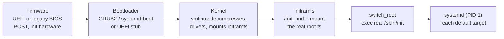
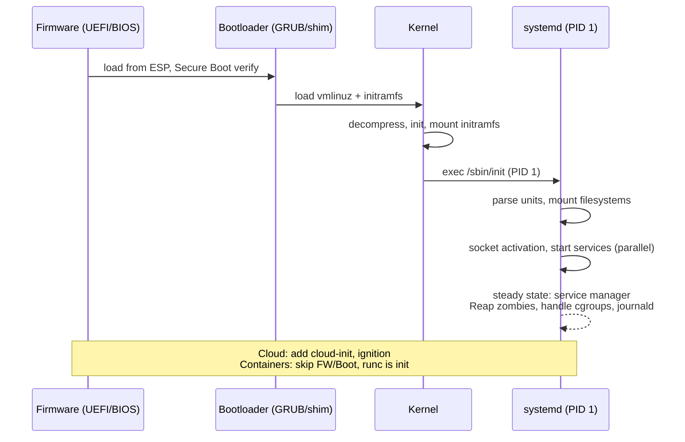
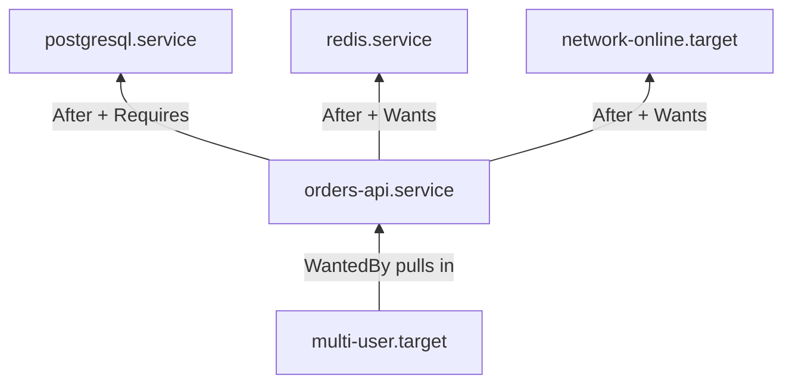
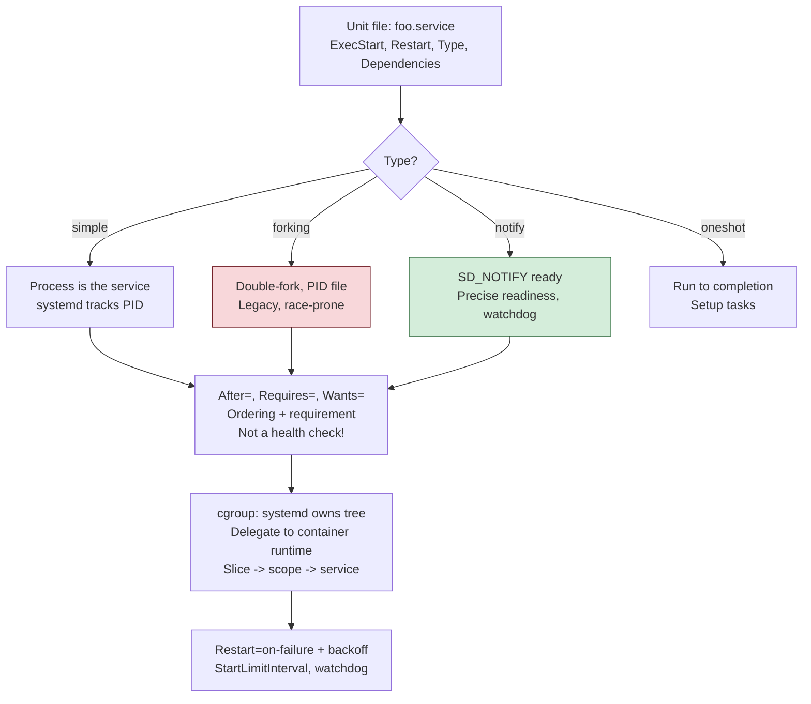
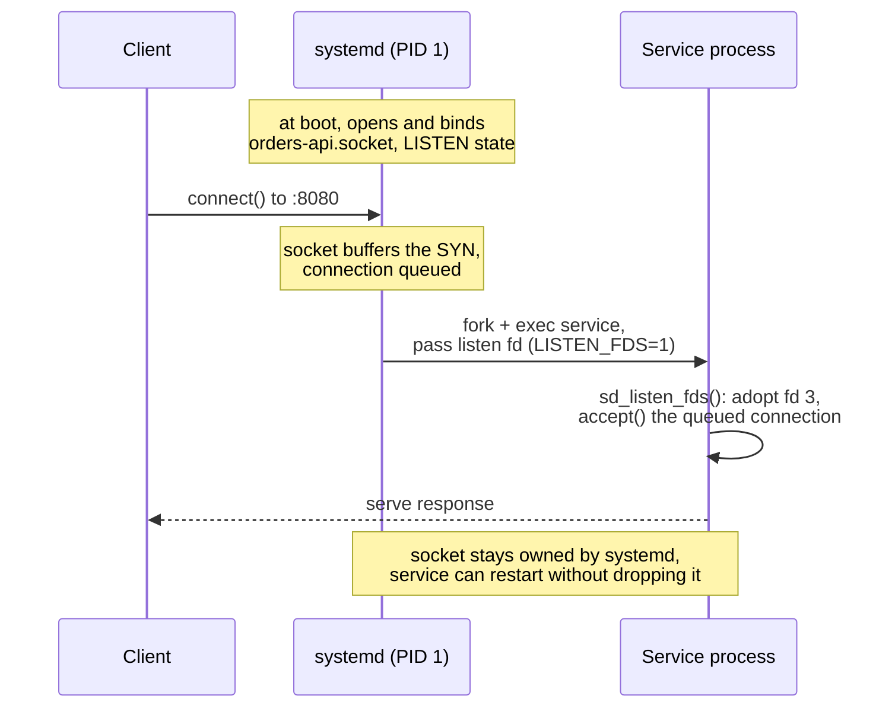
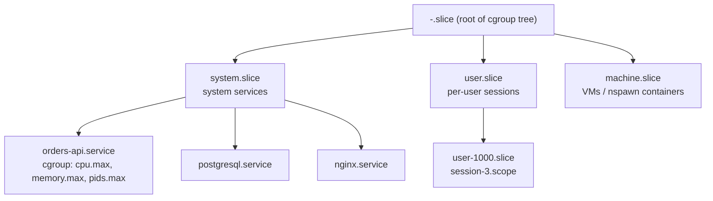

# Chapter 12 — Boot, init, and systemd

**What this chapter covers.** Every service you operate runs on a machine that, at some
moment, was a cold pile of silicon that had to bootstrap itself into a Linux system running
your process under supervision. You rarely watch that happen — a scheduler hands you a node
that is already up — but the mechanism matters the moment something goes wrong: a node stuck
in the initramfs shell, a service that will not restart, a `systemctl status` that says
`activating (start)` forever, a rolling deploy that hangs because PID 1 swallowed your
`SIGTERM`. This chapter traces the full path from firmware to your service being managed as a
supervised unit, and then goes deep on the thing that manages it: **systemd**. The throughline
is that systemd is not "the thing that starts daemons." It is a node-local control plane —
service supervisor, socket multiplexer, cgroup manager, sandbox builder, and log router — and
almost every property a cluster orchestrator gives you (health checks, resource limits,
restart policies, graceful shutdown, log shipping) exists first, and more primitively, in
systemd on each node.

We are Linux-specific and mechanism-first. When we say "systemd holds the socket" we mean a
real file descriptor passed across `execve`; when we say "each service gets a cgroup" we mean
a directory under `/sys/fs/cgroup` that only systemd is allowed to write.

Learning goals — after this chapter you should be able to:

- Trace the boot chain — firmware/UEFI → bootloader → kernel + initramfs → pivot to the real
  root → `init` as PID 1 — and say precisely what each stage does and why initramfs exists.
- Read and reason about the kernel command line (`/proc/cmdline`) and know which knobs matter
  in production.
- Explain what SysV init actually did, why sequential `rc` scripts and PID-file supervision do
  not scale, and what systemd changed — fairly, including the criticism.
- Model systemd's world: unit types (service, socket, target, timer, mount, slice, scope,
  device, path), unit-file structure, and the difference between *requirement* dependencies
  (`Wants`/`Requires`) and *ordering* (`After`/`Before`).
- Use socket activation, `Type=notify` readiness, watchdogs, and restart policies to build a
  service that starts lazily, reports readiness honestly, and recovers from crashes.
- Harden a unit with systemd's sandboxing directives (`NoNewPrivileges`, `ProtectSystem`,
  `PrivateTmp`, `SystemCallFilter`, capability bounding) and connect them to Chapter 5
  (seccomp, capabilities) and Chapter 9 (namespaces, cgroups).
- Explain how systemd + cgroups + socket activation + sandboxing is the same model container
  runtimes implement, why containers usually do *not* run systemd, and how this all feeds the
  kubelet in Book 6 / Volume 12.

This chapter builds on Chapter 1 (processes, PID 1, reaping, signals), Chapter 5 (system calls,
seccomp, capabilities), Chapter 8 (signals and IPC), and Chapter 9 (namespaces and cgroups). It
looks ahead to Volume 11 (deployments and rollouts) and Book 6 / Volume 12 (orchestration).

## The boot chain

From power-on to your service running, control passes through a fixed sequence of increasingly
capable programs, each of which loads and hands off to the next. The invariant is that every
stage is smaller and dumber than the environment it is trying to reach, so its whole job is to
locate and start the next stage.



**Firmware (UEFI or legacy BIOS).** On power-on the CPU begins executing firmware from a fixed
address. The firmware runs POST, initializes enough hardware to find a boot device, and then
loads a bootloader. On a **legacy BIOS** system it reads the first 512-byte sector (the MBR),
which contains a tiny first-stage loader. On **UEFI** — which is what essentially all
server-class hardware and cloud instances use now — the firmware understands a FAT filesystem
called the **EFI System Partition (ESP)**, mounted at `/boot/efi`, and directly loads and runs
`.efi` executables (PE binaries) named in NVRAM boot variables. UEFI **Secure Boot**, when
enabled, verifies each stage's signature against keys in firmware before executing it, which is
why the bootloader (`shim`, then GRUB) and increasingly the kernel image must be signed.

**Bootloader (GRUB2, systemd-boot, or a UEFI stub).** The bootloader's job is narrow: load the
Linux kernel image (`vmlinuz`) and the initramfs into memory, assemble the **kernel command
line**, and jump into the kernel's entry point. GRUB2 is the traditional choice and can read
many filesystems, present a menu, and load kernels by path. On UEFI you can skip a general
bootloader: the Linux kernel can be built with an **EFI stub** so the firmware loads
`vmlinuz.efi` directly, and modern setups increasingly ship a **Unified Kernel Image (UKI)** —
kernel, initramfs, and command line bundled into one signed PE binary — which makes the whole
boot payload signable end-to-end for Secure Boot. Whatever the mechanism, the output is the
same: a kernel and an initramfs in RAM, plus a command-line string.

**Kernel + initramfs.** The kernel decompresses itself, sets up the CPU, memory management, and
the scheduler, and enumerates hardware for which it has built-in drivers. But it now faces a
bootstrapping problem: **the real root filesystem is usually not directly reachable yet.** The
root might be on an NVMe device needing a module, inside an LVM logical volume, on a LUKS-
encrypted partition needing a passphrase, on software RAID, or over the network (iSCSI, NFS).
The kernel cannot contain every storage driver and volume-management tool as built-ins without
becoming enormous. So the bootloader also handed it an **initramfs** ("initial RAM filesystem"):
a compressed `cpio` archive that the kernel unpacks into an in-memory `tmpfs` and uses as a
temporary root. The initramfs contains a minimal userspace — a shell, `udev`/systemd, kernel
modules, and tools like `cryptsetup`, `lvm`, `mdadm` — and an executable `/init`.

The kernel mounts this initramfs, then executes `/init` in it as the first userspace process.
That `/init` (generated by **dracut** on Fedora/RHEL, or **initramfs-tools** on Debian/Ubuntu)
does the real work of *reaching* the root: load the storage/network modules, assemble RAID and
LVM, prompt for and unlock LUKS volumes, wait for the root device to appear (`udev` settle),
then mount the real root filesystem read-only at `/sysroot`.

**Pivot to the real root.** With the real root mounted under `/sysroot`, the initramfs `/init`
calls **`switch_root`**: it moves the mount to `/`, frees the initramfs memory, and `exec`s the
real system's init (`/sbin/init`, which is a symlink to systemd on almost all modern distros).
This is close cousin to the `pivot_root` you met in Chapter 9 for containers — both replace a
process's root filesystem — but `switch_root` is the boot-time variant that additionally
discards the throwaway initramfs. After `switch_root`, PID 1 is the real init running from the
real disk. If something goes wrong before this point — no driver for the root device, a failed
LUKS unlock, a missing UUID — you land in the **initramfs emergency shell** (`dracut:/#`),
which is one of the two or three "the node won't boot" scenarios an on-call engineer must
recognize on sight.

**init as PID 1.** From here, PID 1 is the service manager and never exits for the life of the
system. Because it is PID 1 it inherits the two irreducible init duties from Chapter 1 — it must
**reap** every orphaned zombie the whole system produces, and it is the process the kernel
routes some signals to specially. systemd does both, and layers a control plane on top.

### The kernel command line

The command line is the single string the bootloader passes to the kernel, visible at runtime
in `/proc/cmdline`:

```bash
$ cat /proc/cmdline
BOOT_IMAGE=/vmlinuz-6.8.0 root=UUID=6f1e...c2 ro quiet splash \
  systemd.unit=multi-user.target rd.luks.uuid=...  console=ttyS0,115200
```

It is one of the most operationally important strings on the machine, and it splits into three
audiences. **The kernel** consumes parameters like `root=` (which device or UUID is the root
filesystem), `ro` (mount it read-only initially so fsck can run), `console=` (where early boot
output goes — `ttyS0` for the serial console you rely on in the cloud and in a datacenter KVM),
and hardware tunables (`nomodeset`, `intel_iommu=on`, `mitigations=off`). **The initramfs**
consumes `rd.*` options (dracut): `rd.luks.uuid=`, `rd.lvm.vg=`, `rd.break` (drop to a shell at
a chosen point — invaluable for debugging a broken boot). **systemd** consumes `systemd.*`:
`systemd.unit=` overrides the default target (append `systemd.unit=rescue.target` or the bare
word `single` to boot to single-user mode for recovery), `systemd.log_level=debug`,
`systemd.mask=`. Knowing you can edit this line in the GRUB menu at boot — press `e`, append a
parameter, boot once — is the difference between recovering a node and reimaging it.




## Before systemd: SysV init and its limits

To see why systemd looks the way it does, you have to see what it replaced. The traditional Unix
init, inherited from AT&T System V, is a small PID 1 driven by `/etc/inittab` and organized
around **runlevels**: numbered system states (0 = halt, 1 = single-user, 3 = multi-user text,
5 = multi-user graphical, 6 = reboot). Entering a runlevel meant running a directory of shell
scripts. Under `/etc/rc.d/rc3.d/` (or `/etc/rc3.d/`) sat symlinks like `S20nginx` and
`K80postgresql` pointing at real scripts in `/etc/init.d/`. On entering a runlevel, the `rc`
driver ran every `K*` (kill) script to stop things, then every `S*` (start) script, **in
lexical order of the two-digit number** — which is how you encoded dependencies: give nginx a
higher number than the network so it starts later.

That model has structural problems that get worse at scale:

- **It is sequential.** Scripts run one at a time, each blocking the next. Boot time is the sum
  of every service's startup, even when most are independent and could run in parallel. On a
  server with dozens of daemons this is dead time on every boot and every reboot in a fleet.
- **Dependencies are implicit and fragile.** The `S20`/`S80` numbering is a hand-maintained
  total order standing in for a real dependency graph. LSB init-script headers
  (`# Required-Start: $network`) improved this, but it is still a topological sort a human
  encodes into filenames.
- **There is no supervision.** A classic daemon **double-forks** to detach from its parent and
  reparent to PID 1, writes a PID file, and disappears. SysV init started it and then had *no
  idea whether it was alive*. Crash detection meant a separate watchdog reading a possibly-stale
  PID file. There was no built-in restart, no readiness signal, no way to know a service was
  actually serving versus merely forked.
- **Cleanup is unreliable.** Because the daemon detached, its children scattered across the
  process tree. Stopping "the service" meant killing a PID from a file and hoping you got all
  the workers; strays leaked.
- **No resource control.** SysV init had no concept of bounding a service's CPU, memory, or
  process count. A runaway daemon took down its neighbors.

Ubuntu's **Upstart** (event-based) and Apple's **launchd** (which pioneered socket activation
and on-demand launching, 2005) were the transitional answers. systemd absorbed the good ideas
from both and added a dependency-graph engine and deep cgroup integration.

## systemd: PID 1 as a service manager

systemd, written by Lennart Poettering and Kay Sievers and first released in 2010, became the
default init on Fedora (2011), then RHEL 7, Debian 8 (2015), Ubuntu 15.04, and effectively every
mainstream distribution since. It replaces the pile of shell scripts with a single declarative
model. The debate around that transition was real and worth stating fairly: critics objected to
**scope creep** (systemd grew to manage logging, DNS resolution, network config, time sync,
device management, containers, and more, well beyond "start daemons"), to a **monolithic,
tightly-coupled design** that is hard to replace piecemeal, to **binary journal logs** replacing
grep-able plain-text files, and to the loss of the transparent, debuggable shell-script model.
The counter-argument is that the old model's transparency was mostly the transparency of a
system that did not actually solve dependency ordering, supervision, or resource control — and
those are exactly the problems that matter when you run hundreds of services on thousands of
nodes. Both things are true. In production today, systemd is what you operate, so learn it well.

The central abstraction is the **unit**: a named, typed object systemd knows how to activate,
deactivate, and track. Everything systemd manages — a daemon, a mount point, a listening socket,
a timer, a slice of the resource tree — is a unit, described by a declarative **unit file**.

### Unit types

| Type | Suffix | What it manages |
|------|--------|-----------------|
| service | `.service` | A daemon or one-shot process — the workhorse |
| socket | `.socket` | A listening socket systemd holds; enables socket activation |
| target | `.target` | A named sync point / group of units (the runlevel successor) |
| timer | `.timer` | A time- or event-triggered activation of another unit (cron successor) |
| mount / automount | `.mount` / `.automount` | A filesystem mount point (from `/etc/fstab` or explicit) |
| slice | `.slice` | A node in the cgroup resource tree grouping services |
| scope | `.scope` | A cgroup for externally-created processes systemd did not fork |
| device | `.device` | A `udev`-exposed device, usable as a dependency |
| path | `.path` | Activates a unit when a filesystem path appears or changes |
| swap | `.swap` | A swap device or file |

Unit files live in a search path with clear override precedence: `/usr/lib/systemd/system/`
(shipped by packages, do not edit), `/run/systemd/system/` (runtime), and
`/etc/systemd/system/` (local admin, highest precedence). Drop-in fragments in
`<unit>.d/*.conf` directories override individual settings without replacing the whole file —
`systemctl edit <unit>` creates exactly such a drop-in, which is the correct way to customize a
vendor unit.

A minimal service unit:

```ini
# /etc/systemd/system/orders-api.service
[Unit]
Description=Orders API
After=network-online.target
Wants=network-online.target

[Service]
ExecStart=/usr/local/bin/orders-api --config /etc/orders/config.yaml
Restart=on-failure
User=orders

[Install]
WantedBy=multi-user.target
```

`[Unit]` holds metadata and dependencies; `[Service]` holds how to run it; `[Install]` describes
what happens on `systemctl enable` (it creates the symlink that pulls this unit into
`multi-user.target`). After writing or changing a unit file you must run `systemctl daemon-reload`
so systemd re-parses its configuration — a step that trips up everyone at least once.

### Dependencies vs ordering — the distinction that confuses everyone

systemd separates two orthogonal questions that SysV's numbering conflated:

1. **Requirement** — *if A is started, should B also be started?* Expressed with `Wants=`
   (weak: pull B in, but A survives B failing) and `Requires=` (strong: if B fails to start or
   later fails, A is stopped too). Related: `Requisite=` (B must already be active), `BindsTo=`
   (A stops if B stops, even unexpectedly), `PartOf=` (stop/restart of B propagates to A),
   `Conflicts=` (starting A stops B).
2. **Ordering** — *in what sequence?* Expressed with `After=` and `Before=`, which are purely
   about sequencing and say nothing about whether the other unit is even wanted.

These are independent, and the independence is the whole point. `Requires=B` **without**
`After=B` means "pull B in, but start both in parallel" — which is usually a bug, because A may
race ahead of B. You almost always want both: `Requires=postgresql.service` **and**
`After=postgresql.service`. Conversely `After=network.target` without any `Wants`/`Requires`
means "if the network is coming up, wait for it, but don't force it." The default, absent any
ordering directive, is **no ordering at all**: systemd starts everything in parallel and lets
the dependency graph and socket activation impose only the order that is actually declared. This
parallelism is the first reason systemd boots faster than SysV.



The arrows encode "started after / depends on." `multi-user.target` is the aggregation point:
enabling `orders-api` added it to that target's wants, so reaching the target pulls the whole
subgraph up, in parallel except where `After=` forces sequencing.

### Targets replace runlevels

A **target** is a unit with no behavior of its own — it is a named synchronization point that
groups other units, the direct successor to runlevels. `multi-user.target` is the rough
equivalent of runlevel 3 (full text-mode multi-user), `graphical.target` of runlevel 5,
`rescue.target` of single-user. `default.target` is a symlink to whichever the system should
reach on boot; on a server it points at `multi-user.target`. Special targets are boot
milestones you order against rather than runlevels: `basic.target`, `sysinit.target`,
`network-online.target`, `shutdown.target`. Switch targets at runtime with
`systemctl isolate rescue.target`; change the default with `systemctl set-default multi-user.target`.

### systemctl — the interface

`systemctl` is how you drive all of this. The commands you actually use daily:

```bash
systemctl status orders-api          # state, PID, cgroup, recent log lines
systemctl start / stop / restart orders-api
systemctl reload orders-api          # send the unit's ExecReload (e.g. SIGHUP), no restart
systemctl enable --now orders-api    # create WantedBy symlink AND start it
systemctl disable orders-api         # remove the symlink (no start at boot)
systemctl cat orders-api             # show the effective unit file + drop-ins
systemctl edit orders-api            # create/modify a drop-in override
systemctl list-units --type=service --state=running
systemctl list-dependencies orders-api
systemctl daemon-reload              # re-read unit files after editing
systemctl is-active / is-enabled / is-failed orders-api   # scriptable, exit-code driven
```

The `is-*` subcommands return machine-readable exit codes, which is what your configuration-
management and health-check scripts should key off, never string-matching `status` output.




## journald: structured logging

systemd ships its own logging daemon, **`systemd-journald`**, and it changes the logging model.
Under SysV, a daemon's stdout/stderr went nowhere useful and real logs went through `syslog` to
plain-text files. journald instead captures **everything a service writes to stdout/stderr**
(because the service is a child of systemd, its output is simply piped to the journal), plus the
kernel ring buffer, plus native structured messages, and stores them as **structured, indexed,
binary records**. Each entry is a set of key–value fields — not just a text line — including
trusted metadata the *service could not forge* because systemd attaches it: `_PID`, `_UID`,
`_SYSTEMD_UNIT`, `_BOOT_ID`, `_COMM`, plus any `PRIORITY`, `MESSAGE_ID`, or custom fields the
program emitted via the native protocol.

```bash
journalctl -u orders-api                 # everything from this unit
journalctl -u orders-api -f              # follow (tail -f)
journalctl -u orders-api --since "10 min ago" -p err   # errors in last 10 min
journalctl -u orders-api -b              # this boot only; -b -1 = previous boot
journalctl -u orders-api -o json         # structured output for shipping/parsing
journalctl -k                            # kernel messages (dmesg equivalent, persisted)
journalctl --disk-usage                  # how big the journal is
```

Persistence is a choice: with `/var/log/journal/` present the journal survives reboots; with
only `/run/log/journal/` (tmpfs) it is volatile and lost on reboot — a fact worth checking on a
node before you go debugging a crash from yesterday. `journalctl -b -1` reading the *previous*
boot's log is often how you diagnose why a node rebooted. The binary format is the most common
complaint about journald; in practice you either query it with `journalctl` filters (which are
far more precise than `grep` over text, because you filter on real fields) or you configure
`ForwardToSyslog=` / ship the journal to your central logging system — which on a fleet you do
anyway. The structured fields are exactly what a log pipeline wants.

## Socket activation

Socket activation is one of systemd's best ideas and directly descends from `inetd` and Apple's
`launchd`. The model: **systemd creates and holds the listening socket, and starts the actual
service only when the first connection arrives** — then passes the already-open, already-bound
listening file descriptor to the service across `execve`.



The mechanics: a `.socket` unit tells systemd what to listen on. systemd binds it early (before
the service exists) and watches it with its event loop. When a connection lands, systemd starts
the paired `.service`, and passes the listening socket as file descriptor **3** (and up), setting
the environment variables `LISTEN_FDS` (how many) and `LISTEN_PID` (whose they are). The service
calls `sd_listen_fds()` from `libsystemd` (or reads the env vars directly) to adopt those fds
instead of calling `socket()`/`bind()`/`listen()` itself.

```ini
# /etc/systemd/system/orders-api.socket
[Unit]
Description=Orders API socket

[Socket]
ListenStream=8080
# Accept=no (default): one service instance handles all connections
# Accept=yes: spawn a per-connection instance from a template unit (orders-api@.service)

[Install]
WantedBy=sockets.target
```

Three payoffs make this more than a curiosity:

- **Boot parallelization without ordering headaches.** Because systemd binds *all* sockets up
  front, before any daemon starts, services that talk to each other can start simultaneously.
  If service A connects to B before B is ready, the connection simply sits in B's socket buffer
  (the kernel queued it) until B calls `accept()`. You no longer need to carefully order "start
  B, wait for B to be ready, then start A" — the socket buffer absorbs the race. This is a major
  reason systemd boots fast.
- **Lazy / on-demand start.** Rarely-used services (a debug endpoint, an admin tool) need not run
  until first use, saving memory. This is precisely the `inetd` super-server model, modernized.
- **Zero-downtime restart.** The listening socket's lifetime is decoupled from the service's.
  You can stop, upgrade, and restart the service while systemd keeps the socket open and
  buffering incoming connections; clients see a brief latency blip instead of connection
  refused. This is a genuinely useful primitive for restarts of a stateless daemon.

## cgroups: systemd owns the resource tree

Chapter 9 explained cgroups as the kernel mechanism that limits what a process can *use*.
systemd is the userspace component that *organizes and writes* that tree. This is not a
coincidental pairing — it is architectural. On a cgroup v2 system there must be a **single
writer** to the unified hierarchy (multiple uncoordinated writers corrupt each other's limits),
and on a systemd machine **that single writer is systemd (PID 1)**. Every process systemd starts
is placed in its own cgroup, and those cgroups are organized into a tree of **slices**.



Two unit types map the process tree onto the cgroup tree. A **slice** (`.slice`) is a branch —
a grouping node with no processes of its own but with resource limits that apply to everything
beneath it, so you can bound a whole class of services collectively. The default branches are
`system.slice` (system daemons), `user.slice` (interactive sessions), and `machine.slice` (VMs
and `systemd-nspawn` containers), all under the root `-.slice`. A **scope** (`.scope`) is a
cgroup for processes systemd did *not* fork itself but was asked to manage — a session, or a
container the runtime created — so they still get accounted and controlled.

You set resource control declaratively as unit properties, and systemd translates them into
cgroup v2 interface-file writes:

```ini
[Service]
CPUWeight=200            # relative CPU share vs siblings (-> cpu.weight)
CPUQuota=150%            # hard cap: 1.5 CPUs worth of time (-> cpu.max)
MemoryHigh=1.5G          # soft throttle: reclaim pressure above this (-> memory.high)
MemoryMax=2G             # hard wall: OOM-kill above this (-> memory.max)
TasksMax=512             # fork-bomb protection (-> pids.max)
IOWeight=100             # relative I/O share (-> io.weight)
```

You can inspect the live tree with `systemd-cgls` (the cgroup hierarchy as a process tree) and
`systemd-cgtop` (live per-cgroup CPU/memory/IO, a `top` for the resource tree). This is the same
machinery — the same `memory.max`, the same `cpu.max` — that a container runtime writes when it
starts a pod. Which is the whole point of the next connection: **systemd's cgroup+socket+sandbox
model is the model containers implement.**

## Service hardening: systemd as a sandbox builder

Because systemd is the process that launches your service, it can set up the process's security
context *before* the `execve` — dropping privileges, restricting syscalls, hiding parts of the
filesystem, narrowing capabilities. These are the same primitives from Chapter 5 (seccomp,
capabilities) and Chapter 9 (mount and other namespaces), exposed as declarative unit
directives. Turning them on for a service is often a few lines and no code change, which makes
systemd sandboxing one of the highest-leverage hardening steps available for a bare-metal or VM
service. A hardened unit:

```ini
# /etc/systemd/system/orders-api.service
[Unit]
Description=Orders API (hardened)
After=network-online.target postgresql.service
Wants=network-online.target
Requires=postgresql.service

[Service]
Type=notify
ExecStart=/usr/local/bin/orders-api --config /etc/orders/config.yaml

# --- identity: never run as root ---
DynamicUser=yes                 # allocate a transient UID/GID for this service
# (or: User=orders / Group=orders for a fixed system account)

# --- privilege reduction ---
NoNewPrivileges=yes             # setuid/setgid binaries can never re-gain privilege
CapabilityBoundingSet=          # drop ALL capabilities (empty = none)
AmbientCapabilities=            # grant none; add CAP_NET_BIND_SERVICE here if binding <1024

# --- filesystem isolation ---
ProtectSystem=strict            # entire fs read-only except explicit ReadWritePaths
ProtectHome=yes                 # /home, /root, /run/user made inaccessible
PrivateTmp=yes                  # private /tmp and /var/tmp (own mount namespace)
ReadWritePaths=/var/lib/orders  # the only writable location
ProtectKernelTunables=yes       # /proc/sys, /sys read-only
ProtectKernelModules=yes        # block module load/unload
ProtectControlGroups=yes        # /sys/fs/cgroup read-only
ProtectProc=invisible           # hide other processes in /proc

# --- kernel attack surface ---
RestrictAddressFamilies=AF_INET AF_INET6 AF_UNIX   # no raw/packet sockets, etc.
RestrictNamespaces=yes          # cannot create new namespaces
LockPersonality=yes             # no personality() ABI switching
MemoryDenyWriteExecute=yes      # no W^X-violating mappings (blocks common exploits)
SystemCallFilter=@system-service # seccomp allowlist of "normal service" syscalls
SystemCallFilter=~@privileged @resources   # subtract dangerous groups
SystemCallErrorNumber=EPERM

# --- resource envelope (cgroup) ---
MemoryMax=2G
TasksMax=512
LimitNOFILE=65536               # rlimit: max open file descriptors

Restart=on-failure
RestartSec=2s

[Install]
WantedBy=multi-user.target
```

A few of these deserve a second look. `SystemCallFilter=` compiles to a **seccomp-BPF** program
(Chapter 5) — `@system-service` is a curated allowlist of the syscalls a well-behaved daemon
needs, and the `~` form subtracts named groups like `@privileged` (mount, ptrace, reboot,
kernel-module ops) and `@resources`. `ProtectSystem=strict` and `PrivateTmp=yes` are implemented
by putting the service in its own **mount namespace** with read-only bind mounts and a private
`/tmp` — no code change, kernel-enforced. `DynamicUser=yes` allocates a throwaway UID for the
service's lifetime so there is no long-lived account to compromise. `NoNewPrivileges=yes` is the
same `prctl(PR_SET_NO_NEW_PRIVS)` bit that container runtimes set.

Do not guess at this. Run **`systemd-analyze security orders-api.service`**, which scores each
service's exposure (roughly 0 = locked down, 10 = wide open) and lists exactly which directives
would tighten it. Treating that score as a lint check across a fleet's units is a cheap,
concrete way to raise the security floor of every node.

## Lifecycle: readiness, watchdogs, restart

Supervision is systemd's answer to SysV's biggest gap. Three mechanisms turn "we forked it" into
"we know it is healthy."

**Service type / readiness.** `Type=` tells systemd how to know the service has finished starting
— which matters because ordered dependents wait for "started," and you want that to mean "ready
to serve," not "the process exists."

| `Type=` | "Started" means | Use for |
|---------|-----------------|---------|
| `simple` | the process was `exec`'d (immediately) | trivial daemons that are ready at once |
| `exec` | `execve` succeeded (catches early exec failures) | most simple daemons, slightly safer |
| `forking` | the parent exited after forking a daemon child | classic double-forking daemons (`PIDFile=`) |
| `oneshot` | the process ran to completion (exit 0) | setup/migration steps; pairs with `RemainAfterExit=yes` |
| `notify` | the service sent `READY=1` via `sd_notify` | services that must signal true readiness |
| `dbus` | the service took its D-Bus name | D-Bus services |

`Type=notify` is the honest one and the one to prefer for a real backend service. The service
calls `sd_notify(0, "READY=1")` — a datagram to the `AF_UNIX` socket named in the `NOTIFY_SOCKET`
environment variable — **after** it has loaded config, opened its database pool, warmed caches,
and bound its port. Only then does systemd consider it started and release dependents. This is
the node-local ancestor of a Kubernetes readiness probe: "don't send me traffic / don't start my
dependents until I say I'm ready." A minimal Go example:

```go
import "github.com/coreos/go-systemd/v22/daemon"

func main() {
    srv := setUp()          // load config, connect DB, warm caches
    listenAndServe(srv)     // bind and start accepting
    daemon.SdNotify(false, daemon.SdNotifyReady)   // READY=1: now systemd unblocks dependents
    // ... on shutdown, before draining:
    // daemon.SdNotify(false, daemon.SdNotifyStopping)
}
```

**Watchdog.** With `WatchdogSec=30s`, systemd expects the service to ping it at least every 30
seconds via `sd_notify(0, "WATCHDOG=1")`. Miss the deadline and systemd concludes the process is
hung (not crashed — *hung*, which a PID check would never catch) and acts on the restart policy.
This is a liveness probe implemented in the init system. Pair it with `Restart=on-watchdog` (or
`on-failure`, which includes watchdog timeouts).

**Restart policy.** `Restart=` controls automatic recovery: `no` (default), `on-failure`
(non-zero exit, signal, timeout, or watchdog), `on-abnormal`, `always`. Guard it against crash
loops with rate limiting: `StartLimitIntervalSec=` and `StartLimitBurst=` (e.g. "more than 5
starts in 10s → give up and mark the unit `failed` rather than spin forever"), with `RestartSec=`
inserting a backoff delay between attempts. Without a start limit, a service that crashes
instantly on a bad config will restart in a tight loop and peg a core; the limit is what turns
that into a clean `failed` state you can alert on. This is exactly the crash-loop-backoff logic
Kubernetes reimplements at the pod level — systemd had it first, per node.

## Timers: the cron successor

Timer units activate other units on a schedule and replace `cron` for system tasks, with several
advantages: the triggered work runs as a normal supervised unit (so it gets journald logging,
resource limits, and sandboxing for free), and `Persistent=true` catches up runs missed while
the machine was off. A timer plus its service:

```ini
# /etc/systemd/system/db-backup.timer
[Unit]
Description=Nightly DB backup

[Timer]
OnCalendar=*-*-* 02:30:00        # every day at 02:30 (systemd calendar syntax)
Persistent=true                  # run on next boot if the machine was off at 02:30
RandomizedDelaySec=300           # jitter up to 5 min: de-synchronize a fleet's backups

[Install]
WantedBy=timers.target
```

```ini
# /etc/systemd/system/db-backup.service
[Unit]
Description=DB backup job
[Service]
Type=oneshot
ExecStart=/usr/local/bin/backup-db.sh
```

`RandomizedDelaySec=` is a fleet-scale detail: without jitter, a thousand nodes all fire the same
`OnCalendar` job at exactly 02:30 and stampede your object store or backup target. Enable the
timer (not the service) with `systemctl enable --now db-backup.timer`; list active timers with
`systemctl list-timers`. Also useful: `OnBootSec=`/`OnUnitActiveSec=` for relative-to-boot or
periodic triggers instead of wall-clock.

## The relationship to containers

Now the payoff. Everything above — supervise a process, put it in a cgroup with limits, restrict
its syscalls and capabilities, give it a private filesystem and namespaces, hold its socket — is
*the same set of operations a container runtime performs* (Chapter 9). systemd and `runc` are
doing the same job with the same kernel primitives; they differ in packaging. So the container
picture has three distinct relationships to systemd that engineers routinely confuse.

**The host runs systemd; the container usually does not.** On a Kubernetes node, systemd (PID 1
on the host) supervises `kubelet` and `containerd`, and it owns the cgroup tree those runtimes
carve pods into. Inside a container, though, **PID 1 is normally your application itself**, not
an init system — a container is meant to be a single process (Chapter 1, Chapter 9). This is the
correct default, but it drags in the reaping and signal-handling gotcha from Chapter 1: your app,
now PID 1, must **reap orphaned zombies** and **handle `SIGTERM`** for graceful shutdown, because
the kernel gives PID 1 no default signal dispositions. If your app does neither, you leak zombies
and `docker stop` / pod termination hangs until the 30-second grace period elapses and the
runtime sends `SIGKILL`. The fix is a *tiny* init like `tini` or `dumb-init` as PID 1 (which just
reaps and forwards signals) — **not** a full systemd inside the container. Running systemd in a
container is possible but wants elevated privileges and rarely earns its complexity; reach for it
only when you genuinely need to run several cooperating services in one image.

**systemd's cgroup driver and the kubelet.** When both are present, they must agree on how the
cgroup tree is written. The kubelet and the container runtime each have a **cgroup driver**
setting — `cgroupfs` (write cgroup files directly) or `systemd` (ask systemd to create the
cgroups). On a systemd host, cgroup v2 demands a single writer, so the correct choice is the
**`systemd` cgroup driver** on *both* kubelet and runtime; mixing drivers gives you two writers
fighting over the tree and produces flaky resource enforcement and node instability. This is a
direct, operational consequence of "systemd owns the resource tree."

**systemd-nspawn.** systemd also ships its own container manager, `systemd-nspawn` — think
"`chroot` on steroids," a lightweight container that boots an OS tree in its own namespaces,
landing under `machine.slice` and managed via `machinectl`. It is closer to a lightweight VM /
system container than to a single-process app container, and it is mostly used for OS testing,
build environments, and running a full init inside a namespace — not for shipping microservices.
Its existence is a reminder that the container primitives are general kernel features, and
systemd is one of several tools that compose them.

## Boot performance

Because boot is parallelized against a dependency graph, systemd can tell you exactly where the
time went — invaluable when a fleet's nodes take too long to become schedulable after a reboot.

```bash
$ systemd-analyze time
Startup finished in 2.1s (firmware) + 3.4s (loader) + 1.2s (kernel)
  + 6.8s (initrd) + 12.3s (userspace) = 25.8s

$ systemd-analyze blame          # slowest units, longest first
   6.212s postgresql.service
   3.870s docker.service
   1.402s NetworkManager-wait-online.service
   ...

$ systemd-analyze critical-chain # the ordered dependency path that gated boot
multi-user.target @12.3s
└─orders-api.service @11.1s +1.2s
  └─postgresql.service @4.8s +6.2s
    └─network-online.target @4.7s
```

The distinction between `blame` and `critical-chain` matters: `blame` lists the slowest units in
isolation, but a unit can be slow and *off the critical path* (nothing waited for it), so
optimizing it changes nothing. `critical-chain` shows the actual sequential path that gated
reaching the target — that is where boot-time optimization pays off. `systemd-analyze plot >
boot.svg` renders the whole parallel startup as a timeline. A frequent real finding is a
`*-wait-online.service` blocking for its full timeout because the network never reached the
state it wanted — an ordering assumption, not slow hardware.

## Distributed-systems lens

Zoom out and the shape of systemd is the shape of an orchestrator, one level down. **Service
lifecycle management — start, stop, restart, health, resource limits — is the node-local
foundation that cluster orchestrators build on, not an alternative to them.** The correspondence
is nearly one-to-one:

| systemd concept (per node) | Orchestrator concept (per cluster) |
|----------------------------|------------------------------------|
| `Type=notify` / `sd_notify(READY=1)` | readiness probe |
| `WatchdogSec` / `WATCHDOG=1` | liveness probe |
| `Restart=on-failure` + `StartLimitBurst` | restart policy + CrashLoopBackOff |
| `MemoryMax` / `CPUQuota` on a unit | pod resource limits |
| slices (`system.slice`, nesting) | namespaces / cgroup hierarchy per pod |
| socket activation | (the pattern service meshes and `inetd`-style front ends generalize) |
| journald structured logs | node log agent → central logging |

The kubelet does not replace this machinery — it **drives** it. It asks the container runtime to
create cgroups (which, on a systemd node, means systemd creates them), it supervises `containerd`
as a systemd unit, and it reimplements at the cluster level the same liveness/readiness/restart
loop systemd runs at the node level. Understanding systemd is therefore understanding the
substrate Kubernetes stands on; a "node not ready" or "pods stuck terminating" incident very
often bottoms out in systemd, cgroup-driver mismatch, or PID-1 signal handling — not in the
control plane at all (Book 6, Volume 12).

**Fleet uniformity is built out of these primitives.** Thousands of nodes are made identical by
shipping identical **unit files** (via your configuration-management or image-build pipeline), so
every node supervises services the same way; by defining **resource slices** so a class of
workloads is bounded identically everywhere; and by shipping **journald** logs to a central
system so `journalctl -o json` on each node becomes a queryable, structured stream. A unit file
checked into a repo, `systemd-analyze security`-linted in CI, and rolled out fleet-wide is the
node-level analog of a reviewed, admission-controlled pod spec.

**The PID-1 and signal semantics from Chapter 1 are load-bearing for deploys (Volume 11).** A
graceful rolling deploy depends on a precise shutdown handshake: the orchestrator (or systemd)
sends `SIGTERM`, the process must **catch it, stop accepting new work, drain in-flight requests,
and exit** within the grace period, or it is `SIGKILL`ed mid-request. `Type=notify` with a
`STOPPING=1` notification lets a service tell systemd "I've started draining" so load can be
shed cleanly first. If PID 1 in your container ignores `SIGTERM` (because it is your app and you
never installed a handler, or because a shell wrapper isn't forwarding signals), every rolling
deploy silently degrades into a `SIGKILL` that severs live connections. The unglamorous
node-level details — who is PID 1, does it reap, does it forward `SIGTERM`, does it report
readiness honestly — are exactly what determine whether a fleet-wide rollout is invisible to
users or a wave of 502s.

## Key takeaways

- **Boot is a fixed hand-off chain:** firmware/UEFI → bootloader (GRUB/systemd-boot/EFI stub) →
  kernel + initramfs → `switch_root` to the real root → `init` (systemd) as PID 1. initramfs
  exists solely to contain the drivers and tools needed to *find and mount the real root*
  (modules, LVM, LUKS, RAID, network root) before pivoting to it.
- **The kernel command line (`/proc/cmdline`) is split three ways** — kernel (`root=`, `ro`,
  `console=`), initramfs (`rd.*`), and systemd (`systemd.unit=`). Editing it at the GRUB prompt
  (`systemd.unit=rescue.target`, `rd.break`) is how you recover a node instead of reimaging it.
- **SysV init failed at scale** on four axes: sequential (not parallel) startup, implicit
  filename-numbered dependencies, no real supervision (detached daemons + stale PID files), and
  no resource control. systemd replaces the shell-script pile with a declarative dependency graph
  — and the criticism of its scope creep and binary logs is fair but does not restore those four
  missing capabilities.
- **Units are the model.** Services, sockets, targets, timers, mounts, slices, scopes, devices,
  and paths, described by unit files with clear override precedence
  (`/etc/systemd/system` > `/run` > `/usr/lib`); remember `daemon-reload` after edits.
- **Requirement (`Wants`/`Requires`) and ordering (`After`/`Before`) are orthogonal.** The
  default is *parallel, unordered*; you almost always want both a requirement and an ordering
  edge (`Requires=` + `After=`). Targets are the runlevel successor and act as synchronization
  points.
- **Socket activation** — systemd holds the listening socket and starts the service on first
  connection, passing the fd across `execve` (`sd_listen_fds`, `LISTEN_FDS`) — gives boot
  parallelization (the socket buffer absorbs start-order races), lazy start (`inetd`'s
  successor), and zero-downtime restart (socket outlives the process).
- **systemd is the single writer of the cgroup v2 tree.** Services live in per-unit cgroups
  organized into slices; resource control is declarative (`MemoryMax`, `CPUQuota`, `TasksMax`).
  This is the *same* machinery container runtimes use, which is why the cgroup driver must match
  (`systemd` on both kubelet and runtime).
- **Sandboxing is a few declarative lines, kernel-enforced pre-`exec`:** `NoNewPrivileges`,
  `ProtectSystem=strict`, `PrivateTmp`, `SystemCallFilter=` (seccomp, Chapter 5),
  `CapabilityBoundingSet=`, `DynamicUser`. Audit with `systemd-analyze security`.
- **Supervision means readiness, liveness, and restart.** `Type=notify` + `sd_notify(READY=1)`
  is honest readiness; `WatchdogSec` + `WATCHDOG=1` catches *hangs*; `Restart=on-failure` with
  `StartLimitBurst` gives crash-loop-safe recovery — the node-local ancestors of Kubernetes
  probes and CrashLoopBackOff.
- **Containers usually do not run systemd** — PID 1 is your app, which must reap zombies and
  handle `SIGTERM` (use `tini`/`dumb-init`, not systemd, when it doesn't). The *host* runs
  systemd, which supervises the runtime and owns the cgroups pods land in. `systemd-nspawn` is a
  separate, system-container tool.
- **Node lifecycle management is the substrate orchestrators build on.** Consistent unit files,
  resource slices, and shipped journald logs are how a fleet is made uniform; PID-1 signal and
  readiness semantics are what make rolling deploys graceful instead of a wave of `SIGKILL`s and
  502s (Volume 11, Book 6, Volume 12).

## Further reading

- **systemd man pages** — the authoritative reference, and unusually good: `systemd(1)`,
  `systemd.unit(5)`, `systemd.service(5)`, `systemd.socket(5)`, `systemd.target(5)`,
  `systemd.timer(5)`, `systemd.slice(5)`, `systemd.resource-control(5)` (cgroup properties),
  `systemd.exec(5)` (the full sandboxing directive set), `systemd.kill(5)`, `sd_notify(3)`,
  `sd_listen_fds(3)`, `systemctl(1)`, `journalctl(1)`, `systemd-analyze(1)`, `bootup(7)` (the
  boot-target sequence), and `daemon(7)` (old-vs-new daemon conventions). Available at
  freedesktop.org/software/systemd/man and via `man`.
- **Lennart Poettering, "systemd for Administrators"** — the original blog series
  (0pointer.net/blog) walking through units, socket activation, cgroups, journald, and readiness
  protocols from the author; still the clearest narrative introduction to the design intent.
- **freedesktop.org systemd documentation** (systemd.io) — including "Writing Network
  Configuration Managers," the cgroup delegation notes ("Control Group APIs and Delegation"), and
  the `sd_notify` readiness/watchdog protocol description.
- **Linux kernel documentation**: `Documentation/admin-guide/cgroup-v2.rst` (the single-writer
  rule and controller interface systemd drives) and `Documentation/filesystems/ramfs-rootfs-
  initramfs.rst` (how the kernel unpacks and pivots off the initramfs).
- **dracut** (`man dracut`, `man dracut.cmdline`) and **initramfs-tools** documentation — how the
  initramfs is generated and which `rd.*` command-line options it honors; essential for debugging
  a node that hangs before `switch_root`.
- **UEFI Specification** (uefi.org) and the **GRUB manual** (gnu.org/software/grub/manual) — the
  firmware boot protocol and the bootloader that implements it; pair with the **Boot Loader
  Specification** and **Unified Kernel Image** docs on systemd.io for the modern signed-boot path.
- **The Linux Programming Interface**, Michael Kerrisk, No Starch Press, 2010 — daemons, signals,
  process groups/sessions, and the classic double-fork daemonization that systemd supersedes;
  background for the PID-1 and signal semantics in Chapter 1 and this chapter.
- **Kubernetes documentation**: "Configuring a cgroup driver" and "Container Runtimes" (why the
  kubelet and runtime must share the `systemd` cgroup driver), and the pod-lifecycle / probe docs
  — the cluster-level restatement of the node-level supervision in this chapter (Book 6, Volume
  12).
- **`tini`** (github.com/krallin/tini) and **`dumb-init`** (github.com/Yelp/dumb-init) — minimal
  container inits that solve exactly the PID-1 reaping and signal-forwarding problem so you do
  *not* run systemd inside a container (Chapter 1, Chapter 9).
