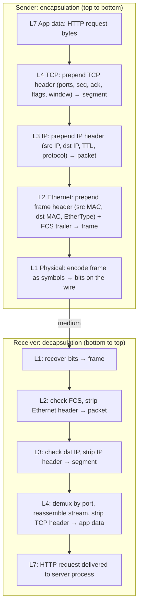
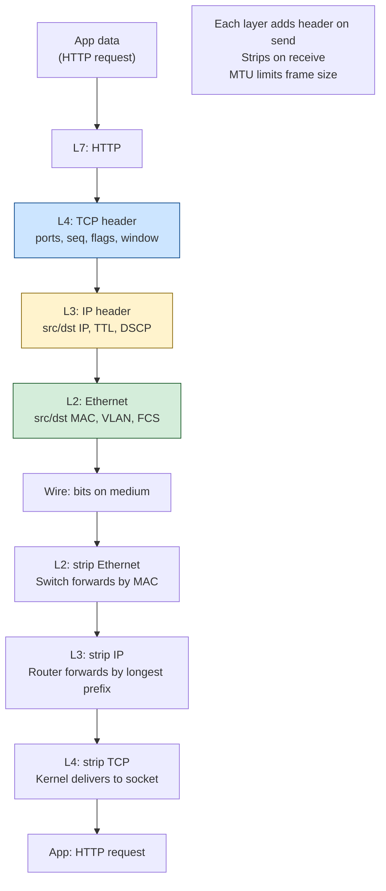
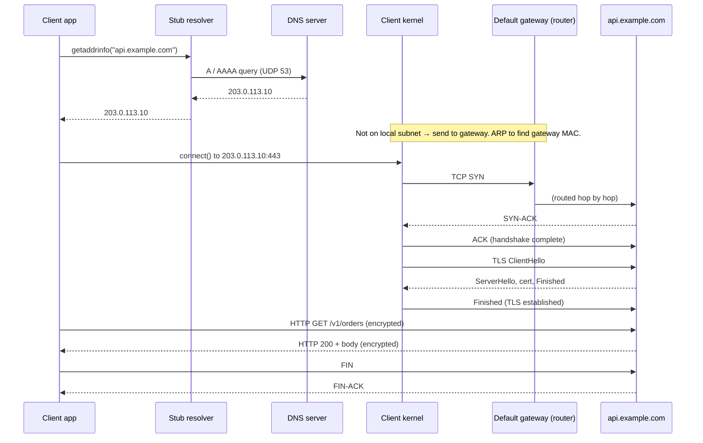
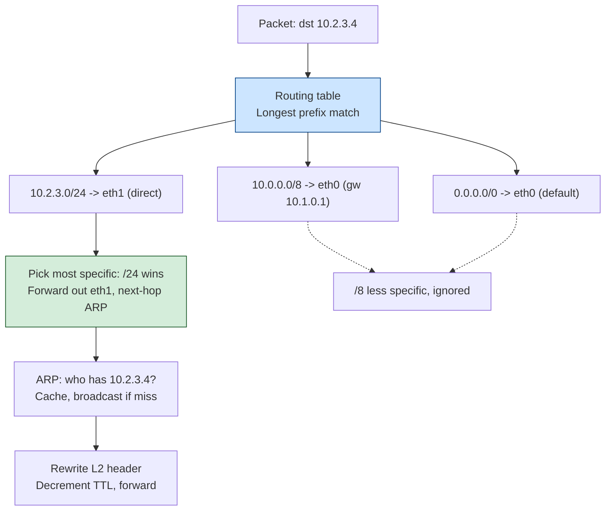
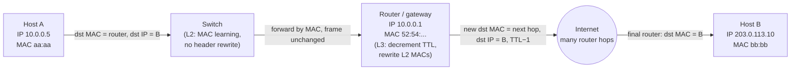
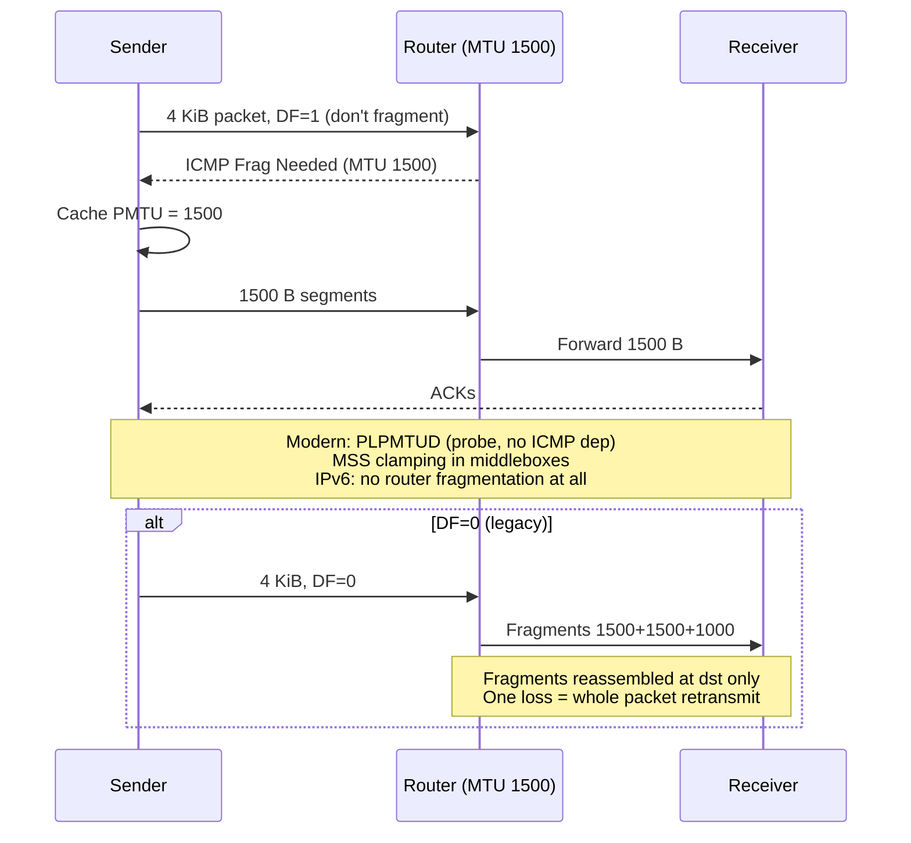
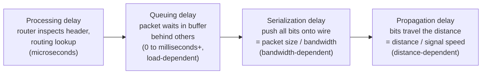

# Chapter 1 — The Journey of a Packet: The Stack End to End

**What this chapter covers.** Before we spend eleven chapters dissecting TCP congestion
control, QUIC's loss recovery, the TLS 1.3 handshake, and the internals of a service mesh
sidecar, we need one shared mental model that the rest of the volume can elaborate: what
actually happens, mechanically, when your service executes `client.Get("https://api.example.com/v1/orders")`.
That single line of code sets off a cascade of DNS lookups, address resolution, a transport
handshake, a cryptographic handshake, an application exchange, and an orderly teardown — and
underneath all of it, bytes are being wrapped in headers, handed down through kernel layers,
serialized onto a wire, switched and routed hop by hop across a data-center fabric or the
public Internet, and unwrapped in the reverse order on the far side. This chapter traces that
journey end to end. It is deliberately broad: almost every topic here gets its own dedicated
chapter later, and I forward-reference aggressively so you know where the deep dive lives. The
goal is not to master any one layer but to be able to *place* any networking phenomenon — a
timeout, a black hole, a throughput ceiling, a partial outage — at the correct layer, because
knowing which layer a problem lives in is most of the work of fixing it.

This chapter builds directly on Volume 2, Chapter 10 (The Linux Network Stack), which traced
a packet through the kernel of a *single host*. Here we zoom out: that per-host stack is one
node in a path of many, and we follow the bytes across the wire between nodes.

Learning goals — after this chapter you should be able to:

- Explain the OSI 7-layer reference model and the practical TCP/IP model, and map real
  protocols and real failures onto specific layers.
- Trace encapsulation and decapsulation precisely: which header is added and stripped at each
  layer, and why each field exists.
- Walk a concrete HTTPS request from `connect()` to teardown, naming DNS, ARP, the TCP
  three-way handshake, the TLS handshake, the HTTP exchange, and connection close.
- Distinguish what a **switch** does (L2 MAC learning and forwarding) from what a **router**
  does (L3 longest-prefix forwarding and TTL decrement), and predict a frame's path hop by hop.
- Reason correctly about MTU, IP fragmentation, and Path MTU Discovery, and recognize the
  PMTUD black-hole failure mode.
- Use the performance vocabulary precisely — bandwidth, latency, RTT, throughput, goodput,
  bandwidth-delay product — and decompose end-to-end delay into serialization, propagation,
  queuing, and processing components.
- Apply the distributed-systems lens: understand that one user request fans out into dozens of
  internal RPCs, each traversing the full stack twice, and that per-hop RTT and BDP, not raw
  link bandwidth, govern what you actually observe.

## Two models: OSI reference vs. the practical TCP/IP stack

Networking is taught with two layered models, and you need both because engineers use both in
conversation. The **OSI (Open Systems Interconnection) 7-layer model**, standardized as
ISO/IEC 7498-1, is a reference framework — a vocabulary — not a description of any protocol
stack anyone actually ships. From the bottom: (1) Physical, the electrical/optical signaling;
(2) Data Link, framing and local addressing; (3) Network, global addressing and routing;
(4) Transport, end-to-end delivery and multiplexing; (5) Session, dialog management; (6)
Presentation, serialization and encryption; (7) Application. The value of OSI is shared
shorthand: when someone says "that's an L7 load balancer" or "we lost L2 connectivity" or "it's
a layer-3 routing problem," they are pointing at a specific band of responsibility, and the
number communicates it unambiguously.

The problem is that the real Internet protocol suite does not have seven layers. The stack that
actually runs — the **TCP/IP model**, described conceptually in RFC 1122 (Requirements for
Internet Hosts) — collapses into four or five layers, and the OSI session and presentation
layers essentially do not exist as separate layers at all. TLS, which does OSI's presentation-
layer job (encryption) and some session work, is in practice implemented *inside* the
application, riding on top of TCP. So working engineers use a pragmatic 5-layer model:

| # | Practical TCP/IP layer | Job | Addressing / unit | Example protocols |
|---|------------------------|-----|-------------------|-------------------|
| 5 | Application | Semantics of the exchange | — / message | HTTP, gRPC, DNS, SMTP |
| 4 | Transport | End-to-end delivery, multiplexing | Port / segment or datagram | TCP, UDP, QUIC¹ |
| 3 | Network (Internet) | Global addressing, routing | IP address / packet | IPv4, IPv6, ICMP |
| 2 | Data Link | Local hop delivery, framing | MAC address / frame | Ethernet, Wi-Fi, ARP |
| 1 | Physical | Signaling on the medium | — / bits & symbols | 10GBASE-T, fiber, PAM4 |

¹ QUIC is an interesting wrinkle: it runs *over* UDP (L4) but internally provides streams,
reliability, and its own TLS-integrated handshake, so it occupies transport and part of the
application band simultaneously. We give it a full treatment in Chapter 4 (UDP and QUIC).

Two properties make layering powerful. First, **encapsulation**: each layer treats the layer
above's output as opaque payload and prepends its own header. Second, **peer-to-peer
abstraction**: each layer on the sender conceptually talks to the same layer on the receiver,
even though the actual bytes travel all the way down one stack, across the wire (possibly
through many intermediate devices), and all the way up the other. TCP on your host behaves as
if it has a direct conversation with TCP on the server, exchanging sequence numbers and ACKs,
blissfully unaware that between them sit a dozen routers that never looked past the IP header.

The layering also tells you *what each device on the path is allowed to look at*. A plain
Ethernet switch reads only L2. A router reads L3. A stateful firewall or NAT reads L3 and L4.
An L7 load balancer or reverse proxy terminates all the way up to the application. This is not
academic: it is exactly why a TLS-terminating proxy can route by HTTP path but a bare L4 load
balancer cannot, and why a network partition at L2 looks completely different from a routing
loop at L3. Hold onto this — it is the through-line of the whole volume.

## Encapsulation and decapsulation

When your application hands a buffer of HTTP bytes to the kernel via `write()` on a socket,
that buffer descends the stack. Each layer wraps it. By the time it reaches the wire it is a
nested set of headers around your original payload, like envelopes inside envelopes.



Walk the headers concretely for an HTTP-over-TCP-over-IPv4-over-Ethernet request. Your payload
starts as, say, 800 bytes of `GET /v1/orders HTTP/1.1\r\nHost: api.example.com\r\n...`.

- **TCP (20 bytes minimum, often 32 with options)** prepends source and destination *port*
  numbers (the multiplexing keys), a 32-bit *sequence number* naming the first byte of this
  segment in the byte stream, a 32-bit *acknowledgment number*, control flags (`SYN`, `ACK`,
  `FIN`, `RST`, `PSH`), a *window* field for flow control, and a checksum. The result is a
  **segment**. Chapter 3 (TCP in Depth) dissects every field and the state machine behind them.
- **IP (20 bytes for IPv4, 40 for IPv6)** prepends the source and destination *IP addresses*,
  a *TTL* (time-to-live, decremented at each router), a *protocol* field (6 = TCP, 17 = UDP,
  1 = ICMP) telling the receiver which L4 to hand the payload to, and — for IPv4 —
  fragmentation fields. The result is a **packet** (or *datagram*). Chapter 2 (IP, Routing,
  Subnetting, and NAT) is the deep dive.
- **Ethernet (14-byte header + 4-byte FCS trailer)** prepends the *destination* and *source*
  MAC addresses and a 2-byte *EtherType* (0x0800 = IPv4, 0x86DD = IPv6, 0x0806 = ARP), and
  appends a 4-byte *Frame Check Sequence* (a CRC-32). The result is a **frame**.
- **Physical** encodes the frame's bits as line symbols — voltage transitions on copper, light
  pulses on fiber, PAM4 or similar modulation at high rates.

On the receiver each layer performs the inverse — **decapsulation** — validating and stripping
its own header before passing the remaining payload up. The Ethernet layer verifies the FCS and
discards corrupt frames silently (this is why L2 corruption shows up as loss, not errors, to the
layers above). The IP layer confirms the destination address is local and reads the protocol
field to choose the L4 handler. The TCP layer uses the four-tuple *(source IP, source port,
destination IP, destination port)* to demultiplex the segment to the correct socket, reorders
by sequence number, and delivers an in-order byte stream to `read()`.

Two observations that matter for the rest of the volume. First, **every header is overhead**.
A minimal TCP/IPv4/Ethernet stack costs 54 bytes of headers per packet before any payload; on
a 1500-byte frame that is ~3.6% off the top, and it is much worse for tiny packets — a
bare ACK is all header and no payload. This is why chatty, small-message protocols waste
bandwidth and why techniques like TCP segmentation offload and jumbo frames exist. Second,
**the layer that added a header is the only one that should interpret it**. When you debug with
`tcpdump`, you are reading these nested headers directly; learning to read them top-down is the
single most useful network-debugging skill, and Chapter 12 (Debugging and Observing Networks)
builds it systematically.




## A concrete request: calling `https://api.example.com/v1/orders`

Now the main event. Your service, running in a pod on a Linux host, executes an HTTPS GET. We
will follow it from the first system call to the last, noting where each step gets its own
chapter. Assume the client has never contacted this host before, so nothing is cached — the
cold path is the instructive one.



### Step 1 — DNS resolution: name to address

`https://api.example.com/...` names a *host*, but IP can only route to *addresses*. The client
calls `getaddrinfo()`, which consults the stub resolver (configured via `/etc/resolv.conf`,
`/etc/nsswitch.conf`, or on a modern Linux desktop `systemd-resolved`). If the answer is not
cached, the resolver sends a DNS query — typically a UDP datagram to port 53 of a recursive
resolver — asking for the `A` record (IPv4) and/or `AAAA` record (IPv6). The recursive resolver,
if it too lacks a cached answer, walks the delegation hierarchy: root servers → `.com` TLD
servers → the authoritative servers for `example.com`, following referrals until it gets the
authoritative answer, say `203.0.113.10`. That answer comes back with a TTL governing how long
it may be cached.

DNS is a distributed, hierarchical, cached database with its own failure modes — stale records,
negative caching, split-horizon views, the interaction with TTLs during failover — and it gets
a full treatment in Chapter 5 (DNS in Depth). For now the essential point is that name
resolution is a *separate network round-trip (or several)* that happens before your connection
even begins, and its latency and reliability are part of your request's latency and reliability.
A slow or flapping resolver is a classic invisible cause of tail latency.

### Step 2 — Is the destination local? Routing decision and ARP

Now the kernel has a destination IP, `203.0.113.10`, and must decide how to send the first
packet. It consults the routing table (`ip route`). It compares the destination against each
route's prefix. If the destination is on a directly connected subnet, the next hop is the
destination itself. If not — as here, since `203.0.113.10` is not on the pod's `/24` — the
packet goes to the **default gateway**, the router whose address is the `default` route's next
hop.

Either way, to build the Ethernet frame the kernel needs the *MAC address* of the next hop on
the local link — the gateway's MAC, not the server's. IP addresses route across the Internet;
MAC addresses deliver across a single link. To translate the gateway's IP into its MAC, the
host uses **ARP** (Address Resolution Protocol, RFC 826) on IPv4, or Neighbor Discovery (NDP,
ICMPv6) on IPv6. ARP is a broadcast: the host sends an Ethernet frame to `ff:ff:ff:ff:ff:ff`
asking "who has `10.0.0.1`? tell `10.0.0.5`," and the gateway replies with its MAC. The result
is cached in the neighbor table (`ip neigh`) for reuse.

```
$ ip route get 203.0.113.10
203.0.113.10 via 10.0.0.1 dev eth0 src 10.0.0.5 uid 1000

$ ip neigh
10.0.0.1 dev eth0 lladdr 52:54:00:a1:b2:c3 REACHABLE
```

Note the crucial asymmetry: the frame's destination MAC is the gateway (`52:54:00:a1:b2:c3`),
but the packet's destination IP is the far-off server (`203.0.113.10`). At each hop, the L2
addresses are rewritten while the L3 addresses stay the same — the mechanism we dissect under
"hop by hop" below.

### Step 3 — TCP three-way handshake: establishing the connection

With an address resolved and a next-hop MAC in hand, `connect()` triggers the TCP three-way
handshake. The client sends a **SYN** (an empty segment with the SYN flag set and an initial
sequence number). The server replies with **SYN-ACK** (SYN flag plus an ACK of the client's
SYN, and its own initial sequence number). The client replies with **ACK**. After this one
round-trip the connection is `ESTABLISHED` on both ends and either side may send data. During
the handshake both sides also negotiate options in the SYN/SYN-ACK: the Maximum Segment Size
(MSS), window scaling, selective acknowledgment (SACK) support, and timestamps.

The handshake costs one RTT before any application byte moves. That is a floor on connection
setup latency and a major reason connection pooling and keep-alive matter so much — you amortize
this cost across many requests. The full state machine (`SYN_SENT`, `SYN_RECV`, `ESTABLISHED`,
`FIN_WAIT`, `TIME_WAIT`, and the rest), the SYN/accept queues, and congestion control are the
subject of Chapter 3 (TCP in Depth). On the kernel side, this is exactly the SYN-queue /
accept-queue machinery from Volume 2, Chapter 10.

### Step 4 — TLS handshake: establishing a secure channel

Because the scheme is `https`, the client now performs a **TLS handshake** on top of the
established TCP connection, before any HTTP is exchanged. In TLS 1.3 (RFC 8446) the handshake
is one round-trip: the client sends `ClientHello` with its supported cipher suites and a
key-share for (EC)DHE key agreement; the server responds with `ServerHello`, its certificate
chain, a `CertificateVerify` signature, and `Finished`; the client verifies the certificate
against the Web PKI, checks the name matches `api.example.com`, and sends its own `Finished`.
Both sides derive symmetric session keys, and all subsequent traffic is encrypted and
authenticated. (TLS 1.2 needed two round-trips; TLS 1.3 also offers 0-RTT resumption for
returning clients, with a replay-safety caveat.)

So on a cold `https` connection you have already paid, in sequence: DNS lookup (one or more
RTTs), the TCP handshake (one RTT), and the TLS handshake (one RTT in 1.3) — all before the
first HTTP byte. On a cross-continent path with an ~80 ms RTT, that is easily 240+ ms of pure
setup. This latency stack is *the* argument for connection reuse, session resumption, and
edge termination. Chapter 6 (TLS 1.3 and the Web PKI) covers the handshake, certificate
validation, and PKI trust in depth.

### Step 5 — The HTTP request and response

Finally, application data. The client writes the HTTP request — request line, headers,
optional body — into the (now encrypted) TCP stream. On HTTP/1.1 this is plaintext framing
inside the TLS record layer; on HTTP/2 it is a `HEADERS` frame with HPACK-compressed headers on
a new stream ID, multiplexed over the single connection; on HTTP/3 it rides QUIC streams over
UDP. The server processes the request and streams back a status line/frame, response headers,
and the body. Chapter 7 (HTTP/1.1, HTTP/2, and HTTP/3) covers all three wire formats and their
very different multiplexing and head-of-line-blocking behavior; Chapter 8 (gRPC and RPC
Framework Internals) covers gRPC, which is HTTP/2 with a specific message framing and trailer
convention layered on top.

Each HTTP message is, of course, just payload as far as TCP is concerned: it is chopped into
MSS-sized segments, each of which becomes an IP packet, each of which becomes an Ethernet frame,
each of which is switched and routed independently to the destination and reassembled in order
by the receiving TCP.

### Step 6 — Teardown

When the exchange is done (or the connection idles past keep-alive), it is closed. TCP's
graceful close is a four-way exchange: each side sends a **FIN** and receives an **ACK**,
independently, because a TCP connection is a pair of independent byte streams (full-duplex).
The side that closes actively enters `TIME_WAIT` and lingers there for a duration meant to be
2×MSL (maximum segment lifetime) — long enough to absorb any delayed duplicate segments and to
ensure the final ACK was received. The RFC's nominal MSL is 2 minutes (so 2×MSL is 4 minutes),
but Linux does not use MSL directly: it fixes `TIME_WAIT` at 60 seconds (the compiled-in
`TCP_TIMEWAIT_LEN`), which is not runtime-tunable via a sysctl. `TIME_WAIT` accumulation on a busy client is a real
operational concern — it can exhaust ephemeral ports — which is why keep-alive and connection
pooling, and options like `SO_REUSEADDR`, matter, as covered in Volume 2, Chapter 10 and again
in Chapter 3 here.

That is the whole life of a request. Everything below re-examines the individual layers this
walk-through passed through quickly.

## Layer 2: Ethernet, MACs, switches, VLANs, and the MTU

The data link layer moves frames across a *single* link or LAN segment. Its addressing is the
**MAC address**: a 48-bit identifier, usually burned into (or assigned to) a NIC, written as
six hex octets like `52:54:00:a1:b2:c3`. The least-significant bit of the first octet
distinguishes unicast from multicast; the next bit up distinguishes globally-unique
(OUI-assigned) from locally-administered addresses (which is what your virtual NICs and
containers use — note the `2` in `52`, whose low bits mark it locally-administered unicast). MAC addresses are *flat* — they
have no hierarchy and carry no location information — which is precisely why they cannot scale
to the global Internet and why we need L3 on top.

A **switch** is an L2 device. Its entire job is to forward frames within a broadcast domain,
and it does so by **MAC learning**. The switch maintains a *forwarding table* (also called a CAM
or MAC table) mapping MAC addresses to physical ports. When a frame arrives, the switch records
"source MAC X is reachable via port P" (learning), then looks up the destination MAC: if known,
it forwards only out the corresponding port; if unknown, it **floods** the frame out every port
except the ingress one, and the eventual reply teaches it the location. Broadcast frames (like
ARP requests) are always flooded. This is why a switch is transparent — hosts do not address the
switch, they address each other, and the switch silently learns the topology from traffic.

A **broadcast domain** is the set of ports across which a broadcast frame propagates. Left
alone, a physical switch is one broadcast domain, which does not scale and does not isolate. The
fix is the **VLAN** (IEEE 802.1Q): a 12-bit tag inserted into the Ethernet header that
partitions one physical switch into multiple logical broadcast domains. Traffic in VLAN 10
cannot reach VLAN 20 without passing through a router, even on the same physical switch. VLANs
are how a single physical fabric is sliced into isolated tenant or tier networks, and their
logical descendant — VXLAN — is how overlay networks in Kubernetes and cloud VPCs tunnel L2
semantics across an L3 fabric. We touch VXLAN and overlays again in Chapter 10 (Proxies,
Reverse Proxies, Service Mesh, and CDNs) and Volume 2, Chapter 9 (Namespaces and cgroups).

Finally, L2 imposes the **MTU** (Maximum Transmission Unit): the largest payload a single frame
can carry. For standard Ethernet the MTU is **1500 bytes**. This one number ripples all the way
up the stack: it bounds the IP packet size, which (minus IP and TCP headers) yields the TCP MSS
— typically 1460 bytes for IPv4 (1500 − 20 IP − 20 TCP). "Jumbo frames" raise the MTU to ~9000
bytes, cutting per-byte header overhead and per-packet processing cost, and are common inside
data centers where every device on the path can be configured consistently. The danger, as we
will see, is a path where the MTU is *not* consistent.

## Layer 3: IP addressing and routing

The network layer provides what L2 cannot: **global, hierarchical addressing** and **routing**
across independently administered networks. An **IP address** is not flat; it is structured as
a *network prefix* plus a *host part*, and that hierarchy is what makes routing tractable. IPv4
addresses are 32 bits (`203.0.113.10`); IPv6 addresses are 128 bits
(`2001:db8::a`). A prefix like `203.0.113.0/24` means "the first 24 bits identify the network;
the remaining 8 identify hosts within it." Routers reason about prefixes, not individual
addresses, so one routing-table entry can represent millions of hosts.

Routing is the process each router performs on every packet: examine the destination IP, find
the most specific matching prefix in the forwarding table, and send the packet out toward that
prefix's next hop. "Most specific" means **longest-prefix match** — if both `10.0.0.0/8` and
`10.1.2.0/24` match the destination, the `/24` wins because it is more specific. The default
route `0.0.0.0/0` is the least specific possible match, the catch-all when nothing else fits.
Addressing structure (subnetting, CIDR), how routers learn prefixes (static routes, and dynamic
protocols like BGP and OSPF), and address translation (NAT, essential to how cloud VPCs and
home networks work) are the entire subject of Chapter 2 (IP, Routing, Subnetting, and NAT).

The key L3 field for our end-to-end story is the **TTL** (IPv4) / **Hop Limit** (IPv6): an
8-bit counter the source sets (commonly 64) and *every router decrements by one*. When it hits
zero, the router drops the packet and sends back an ICMP "Time Exceeded" message. This is not a
timer; it is a hop counter, and it exists to guarantee that a packet caught in a routing loop
eventually dies rather than circulating forever. It is also the mechanism `traceroute` exploits:
by sending packets with TTL 1, 2, 3, … it provokes each successive router on the path to
announce itself via the ICMP error, revealing the route hop by hop.




## How a packet moves hop by hop: switches vs. routers

Now we can assemble the L2/L3 picture into the actual per-hop behavior — the single most
important mechanism in this chapter. A frame's journey alternates between two operations:
switching (within a link/LAN) and routing (between networks).



Trace it precisely. Host A wants to reach Host B on a different network. A builds a frame with:

- **L3 (unchanged end to end):** source IP = A (`10.0.0.5`), destination IP = B (`203.0.113.10`).
- **L2 (rewritten every hop):** source MAC = A's, destination MAC = **the router's**, because
  the router is the next hop on A's link.

The **switch** between A and the router looks only at the destination MAC. It sees the router's
MAC, consults its forwarding table, and sends the frame out the router's port — *without
modifying a single field*. A switch is transparent; it does not appear in `traceroute`, it does
not decrement TTL, it does not touch IP addresses. It forwards frames by MAC and learns
locations as it goes. This is why L2 is fast and cheap and why switching scales to enormous
throughput: it is a table lookup and a copy.

The **router** is where the real work happens. It receives the frame, strips the Ethernet
header, and examines the IP header. It sees destination IP = B, performs a longest-prefix match
against its forwarding table to find the next hop toward B, and then:

1. **Decrements the TTL** and recomputes the IPv4 header checksum (dropping the packet if TTL
   hit zero).
2. **Builds a brand-new Ethernet frame**: source MAC = the router's outgoing-interface MAC,
   destination MAC = the *next* hop's MAC (found via that interface's ARP table). The IP header
   — source and destination IP — is untouched.
3. Forwards the new frame out the appropriate interface.

Repeat this at every router across the Internet: the L3 addresses (A and B) are constant end to
end, and the L2 addresses are rewritten hop by hop. The MAC addresses are *link-local*; they
mean nothing beyond a single link. This is the crisp division of labor: **IP addressing gets the
packet from network to network; MAC addressing gets the frame from device to device on one
link.** Internalize this and NAT, overlay networks, load-balancer behavior, and half of your
future `tcpdump` sessions become legible.

| | Switch (L2) | Router (L3) |
|---|---|---|
| Reads | Destination MAC | Destination IP |
| Forwarding logic | Exact-match MAC table | Longest-prefix match |
| Rewrites headers? | No | Yes — new L2 MACs, TTL−1 |
| Broadcast domain | Extends it | Terminates it |
| Visible to traceroute? | No | Yes |
| Learns topology by | MAC learning from traffic | Routing protocols / config |

## MTU, fragmentation, and Path MTU Discovery

Recall that each L2 link has an MTU, and a path may cross links with *different* MTUs — a host
on a 9000-byte jumbo-frame data-center link, a VPN or tunnel that adds encapsulation overhead
and effectively lowers the MTU to, say, 1400 bytes, and a plain 1500-byte segment somewhere in
between. What happens when a packet is too big for the next link?

Historically, IPv4 allowed **fragmentation**: a router facing a too-large packet with the "Don't
Fragment" (DF) bit clear could split it into fragments, each an independent IP packet with
offset fields, to be reassembled at the *destination* (never at intermediate routers).
Fragmentation is now considered harmful and largely avoided. It is fragile — loss of any single
fragment forces retransmission of the whole original packet — it burdens the destination with
reassembly state, it interacts badly with firewalls and load balancers that need L4 headers
present only in the first fragment, and it opens denial-of-service and evasion vectors. **IPv6
removes router fragmentation entirely**: routers never fragment, and a too-large packet is
simply dropped with an ICMPv6 "Packet Too Big" message returned to the source.

The modern approach is **Path MTU Discovery** (PMTUD, RFC 1191 for IPv4, RFC 8201 for IPv6).
The sender sets the DF bit on every packet and starts by assuming the local MTU. If a router
along the path faces a link with a smaller MTU, it drops the packet and returns an ICMP
"Fragmentation Needed" (IPv4, type 3 code 4) or "Packet Too Big" (ICMPv6) message *stating the
next-hop MTU*. The sender lowers its assumed path MTU accordingly (TCP recomputes its effective
MSS) and retransmits. Over a couple of iterations the sender converges on the smallest MTU along
the path and sends packets that fit everywhere without fragmentation.

PMTUD's Achilles' heel is that it **depends on ICMP being delivered back to the sender**. A
misconfigured firewall or security group that blindly drops all ICMP breaks it: the sender keeps
sending too-large packets, the constricting router keeps silently dropping them (because the
source never lowers its estimate), and the connection **black-holes** — the handshake succeeds
(small packets), but the first large data segment vanishes and the connection hangs. This
**PMTUD black hole** is a genuinely common and maddening production failure: small requests work,
large responses hang, and it looks like an application bug until you notice it correlates with
payload size. The mitigations are to never blanket-drop ICMP "too big" messages, and TCP's
"MSS clamping" (and RFC 4821 Packetization Layer PMTUD, which probes with data segments instead
of relying on ICMP). This is a recurring theme in Chapter 12 (Debugging and Observing Networks).




## Layer 4: ports, TCP vs. UDP

The transport layer adds two things the network layer lacks: **multiplexing** (via ports) and,
optionally, **reliable ordered delivery**. IP delivers a packet to a *host*; it has no notion of
*which process* should receive it. The 16-bit source and destination **port** numbers in the L4
header provide that. A listening server binds a well-known port (443 for HTTPS, 53 for DNS); a
client picks an *ephemeral* port from a local range (Linux default roughly 32768–60999). The
tuple that uniquely identifies a connection — the key the kernel demultiplexes on — is the
**four-tuple**: *(source IP, source port, destination IP, destination port)*. Two connections
from the same client to the same server differ only in the client's ephemeral port, and that
alone keeps their byte streams separate. This four-tuple is also why a single client can open at
most ~28,000 concurrent connections to one (server IP, port) before ephemeral-port exhaustion —
a limit that bites connection-heavy services and one reason `SO_REUSEPORT`, multiple destination
IPs, and connection pooling exist.

The two dominant L4 protocols embody a fundamental trade-off:

- **TCP** is connection-oriented and reliable. It guarantees that bytes arrive in order, exactly
  once, with no gaps, by numbering every byte, acknowledging receipt, retransmitting losses, and
  pacing itself with flow control (respecting the receiver's buffer) and congestion control
  (respecting the network's capacity). You pay for this with the handshake RTT, per-connection
  state, and **head-of-line blocking** — a single lost segment stalls delivery of everything
  behind it until it is retransmitted, even if later bytes already arrived. Chapter 3 is the
  deep dive.
- **UDP** is connectionless and unreliable: it adds ports and a checksum to IP and nothing else.
  No handshake, no ordering, no retransmission, no congestion control. It is a thin veneer over
  IP's best-effort datagram service. That minimalism is a feature for latency-sensitive or
  broadcast/multicast workloads (DNS, real-time media, telemetry) and, crucially, it is the
  substrate on which **QUIC** builds a *better* reliable transport in user space — getting TCP's
  reliability and TLS's security while dodging TCP's head-of-line blocking and kernel ossification.
  Chapter 4 (UDP and QUIC) covers both.

The choice of L4 is one of the highest-leverage decisions in a networked system, and it is
almost always TCP or a TCP-like protocol for backend RPC — but understanding *why* requires
understanding what TCP is buying you, which is the whole of Chapter 3.

## The performance vocabulary: bandwidth, latency, throughput, goodput

Engineers routinely conflate terms that mean very different things, and the confusion leads to
wrong diagnoses. Precise definitions:

- **Bandwidth** is *capacity*: the maximum bits per second a link can carry — a property of the
  medium and hardware (a 10 Gbit/s NIC, a 1 Gbit/s link). It is a ceiling, not a measurement of
  what you are achieving.
- **Latency** is *delay*: the time for one bit to travel from source to destination. Its
  round-trip form, **RTT** (Round-Trip Time), is what you measure with `ping` and what TCP's
  timers and windows revolve around.
- **Throughput** is the *actual* rate of bits delivered over the path — always ≤ bandwidth, and
  often far below it, because of protocol overhead, congestion, loss, and the window/RTT limit
  described below.
- **Goodput** is throughput counting only *useful application payload* — excluding headers,
  retransmissions, handshakes, and ACKs. Goodput is what your users actually get; the gap
  between throughput and goodput is pure overhead.

The relationship people get wrong most often: **bandwidth and latency are independent, and
adding bandwidth does not reduce latency.** A wider pipe does not make bits arrive sooner; it
lets *more* bits be in flight at once. Latency is floored by physics — the speed of light in
fiber is roughly 200,000 km/s (about two-thirds of c), so a one-way trip across, say, 8,000 km
of fiber is at minimum ~40 ms, ~80 ms round trip, *before* any queuing or processing. No amount
of bandwidth changes that. This is why a 1 GB transfer between continents can be slow on a
"fast" link, and why moving computation closer to data (edge, regional replicas) — reducing
*latency* — often matters more than provisioning more *bandwidth*.

### The four components of delay

The end-to-end latency of one packet across one hop decomposes into four additive components.
Understanding which one dominates tells you what to fix.



- **Processing delay** — time for a node to examine a packet's headers, verify the checksum, and
  make a forwarding decision (the longest-prefix lookup). On modern hardware this is
  microseconds, usually negligible except in software routers or deep packet inspection.
- **Queuing delay** — time a packet waits in a buffer behind other packets before it can be
  transmitted. This is the *variable* component: near zero on an idle link, unbounded as a link
  saturates. Queuing delay is the source of most jitter and of the pathology called
  **bufferbloat**, where oversized buffers hold packets for tens or hundreds of milliseconds
  under load instead of dropping them, wrecking latency without improving throughput. Queuing
  delay is where load-dependent tail latency comes from.
- **Serialization (transmission) delay** — time to clock all of a packet's bits onto the wire,
  equal to *packet size / bandwidth*. A 1500-byte (12,000-bit) packet on a 1 Gbit/s link takes
  12 µs to serialize; on a 10 Mbit/s link, 1.2 ms. This is the *only* delay component that
  higher bandwidth actually reduces.
- **Propagation delay** — time for a bit to physically traverse the distance, equal to *distance
  / signal speed*. Governed by the speed of light in the medium and utterly indifferent to
  bandwidth. Dominant on long-haul links.

Summed over every hop, these four give end-to-end latency. The diagnostic value is knowing which
dominates: a saturated link is queuing delay (fix congestion or add capacity), a long-haul link
is propagation delay (move closer or accept it), a slow link with big packets is serialization
delay (raise bandwidth or shrink packets).

### Bandwidth-delay product: why throughput ≠ bandwidth

Here is the single most important quantitative relationship in transport performance. A reliable
protocol like TCP can only have so much data "in flight" — sent but not yet acknowledged —
because it must be able to retransmit anything unacknowledged, and because the receiver's window
bounds it. The maximum useful amount of in-flight data is the **bandwidth-delay product (BDP)**:

```
BDP (bytes) = bandwidth (bytes/sec) × RTT (sec)
```

The BDP is the "volume" of the pipe — how many bytes fit in the path at once. To *fill* the pipe
and achieve throughput equal to bandwidth, the sender's in-flight window must be at least the
BDP. If the window is smaller, throughput is capped at *window / RTT*, regardless of how much
bandwidth is available.

A worked example makes the stakes clear. On a 1 Gbit/s path (125 MB/s) with a 1 ms RTT
(intra-data-center), the BDP is 125 MB/s × 0.001 s ≈ **125 KB** — a modest window fills it. But
on the *same* 1 Gbit/s bandwidth with an 80 ms RTT (cross-continent), the BDP is 125 MB/s ×
0.08 s ≈ **10 MB**. To saturate that link a single TCP connection needs a 10 MB in-flight
window. If the OS default socket buffer or the receiver's advertised window is, say, 256 KB,
throughput is capped at 256 KB / 0.08 s ≈ **3.2 MB/s** — about 2.5% of the available gigabit.
This is why "long fat networks" (high bandwidth × high latency) require **window scaling**
(TCP's option to advertise windows beyond 64 KB) and generous, autotuned socket buffers, and
it is why a single TCP stream often cannot fill a fast, distant link while many parallel streams
can. Every discussion of TCP tuning, of why you parallelize large transfers, and of why RTT (not
bandwidth) is the throughput lever on long paths, comes back to the BDP. Chapter 3 develops the
congestion-control dynamics behind it.

## Where the kernel stack fits

Every layer transition in this chapter, on both hosts, happens *inside the kernel* — and Volume
2, Chapter 10 (The Linux Network Stack) is the mechanical account of that. When your application
calls `write()` on a socket, control crosses the syscall boundary; the kernel copies the payload
into a socket send buffer, the TCP layer segments it and manages sequence numbers and the
congestion window, the IP layer looks up the route and fills the header, the netfilter/conntrack
hooks run, the qdisc layer paces transmission, and the NIC driver DMAs the frame onto the wire —
often with TCP Segmentation Offload doing the actual per-segment carving in hardware. On receive,
an interrupt (moderated by NAPI polling) pulls frames off the NIC, softirq context walks them up
through IP and TCP, reorders and reassembles the byte stream in the socket receive buffer, and
wakes the process blocked in `read()` or reported ready by `epoll`.

The point of naming this here is placement. This chapter's "layers" are not abstract diagrams;
each is concrete kernel code with concrete queues, buffers, and counters, and every one is a
place where packets can be *dropped* — the SYN queue, the accept queue, the socket receive
buffer, the qdisc, the NIC ring. When you tune `net.core.rmem_max` or `net.ipv4.tcp_rmem`, you
are sizing the window that governs the BDP relationship above. When you see `netstat -s` or
`ss` counters incrementing, you are watching decapsulation fail at a specific layer. The
end-to-end mental model of this chapter and the per-host mechanics of Volume 2, Chapter 10 are
two views of the same machine; keep both loaded.

## The distributed-systems lens

Everything above described *one* request between *two* hosts. Real backend systems shatter that
tidy picture, and the consequences define large-scale networking.

**One user request fans out into dozens of internal hops.** When a user hits a single public
endpoint, the edge load balancer forwards to an API gateway, which calls an auth service, which
calls a session store, which the gateway then routes to an orders service, which reads from a
database primary and two caches, emits an event to a message broker, and calls a pricing service
that itself calls three more. A single external request routinely becomes tens of internal RPCs
across many services and teams. **Each of those internal hops traverses the full stack twice** —
down through the caller's kernel and up through the callee's — and in a service mesh, *four*
times per logical hop, because the traffic passes through a sidecar proxy on the way out of the
caller's pod and another on the way into the callee's (Chapter 10 covers this). The stack you
traced once is executed hundreds of times per user action.

**Per-hop latency compounds, and BDP governs each hop.** If each internal RPC adds even 1 ms of
median latency, a fan-out depth of ten adds 10 ms to the median — and tail latency is far worse,
because a request that touches 20 services waits on the *slowest* of 20 samples from each
service's latency distribution. A p99 dependency, hit twenty times, becomes the *common* case
for the overall request. This is why tail latency, not average latency, is the metric that
matters in distributed systems, and why hedging, timeouts, and load balancing (Chapters 9 and
11) exist to tame it. And on every hop that crosses regions, the BDP relationship dictates
whether a single connection can move the required data in the time budget — cross-region
replication and backups live or die by window sizing.

**Layering tells you where an outage lives, and that is most of triage.** When something breaks
at 3 a.m., the fastest path to resolution is localizing the failure to a layer, because each
layer has its own tools and its own owners:

- Requests hang before any response, `ping` works, but `curl` to the service times out → likely
  L4 (accept-queue overflow, connection limits, a firewall dropping SYNs).
- `ping` by IP works but by hostname fails → L7/naming: DNS (Chapter 5).
- TLS handshake fails with a certificate error → L6/PKI (Chapter 6).
- Small requests succeed, large ones hang → the PMTUD black hole (L3/ICMP).
- HTTP 200s but wrong or slow bodies → L7 application logic, or an L7 proxy misrouting.
- Whole subnet unreachable, `ip neigh` shows `FAILED` → L2/L3 local connectivity.

The layered model is not pedagogy you outgrow; it is the coordinate system you localize
incidents in. "Which layer?" is the first question a competent responder asks, and the OSI/TCP-IP
numbers are how the answer is communicated across a room of engineers who each own a different
band of the stack.

**The abstraction is leaky by design, and senior engineers read through it.** Your ORM's
`db.Query()` hides a TCP connection from a pool, which hides a four-tuple, which hides a route
through a VPC, which hides a physical path with a real BDP and real queuing delay. When that
query is slow, the cause can live at any layer, and the engineers who resolve these incidents
quickly are the ones who can descend from application symptom to the specific layer and tool
that reveals the truth. That descent — from `client.Get()` to bits on a wire and back — is the
skill this chapter exists to seed, and the rest of Volume 3 exists to sharpen.

## Key takeaways

- The OSI 7-layer model is shared vocabulary; the real stack is the 4/5-layer TCP/IP model,
  where TLS occupies OSI's presentation role but is implemented inside the application over TCP.
  Use layer numbers to localize problems precisely.
- Encapsulation nests headers (HTTP → TCP segment → IP packet → Ethernet frame → bits);
  decapsulation strips them in reverse. Each layer interprets only its own header, and every
  header is overhead — brutal for small packets.
- A cold `https` request pays DNS + TCP handshake (1 RTT) + TLS handshake (1 RTT in TLS 1.3)
  before the first HTTP byte — the entire case for connection reuse, keep-alive, session
  resumption, and edge termination.
- Switches (L2) forward by MAC with exact-match learning and rewrite nothing; routers (L3)
  forward by longest-prefix match, decrement TTL, and rewrite the L2 MACs every hop. IP
  addresses are constant end to end; MAC addresses are link-local and change at each router.
- MTU mismatches are handled by Path MTU Discovery, which depends on ICMP; blanket-dropping
  ICMP causes the PMTUD black hole — small packets pass, large ones vanish, connections hang.
- Bandwidth (capacity) and latency (delay) are independent; more bandwidth never reduces
  latency. End-to-end delay = processing + queuing + serialization + propagation; queuing is the
  variable, load-dependent, tail-latency-producing component.
- Throughput on a reliable transport is capped by *window / RTT*; to fill a pipe the in-flight
  window must reach the bandwidth-delay product (bandwidth × RTT). Long fat networks demand
  window scaling and large buffers, or a single stream leaves the link mostly idle.
- In distributed systems one user request fans out into dozens of internal hops, each traversing
  the full stack twice (four times through a mesh). Per-hop latency compounds into tail latency,
  BDP governs each cross-region hop, and localizing an outage to a layer is most of triage.

## Further reading

- **RFC 1122**, *Requirements for Internet Hosts — Communication Layers* (IETF, 1989) — the
  canonical description of the TCP/IP layering model. https://www.rfc-editor.org/rfc/rfc1122
- **RFC 826**, *An Ethernet Address Resolution Protocol* (IETF, 1982) — ARP, the L2/L3 glue.
  https://www.rfc-editor.org/rfc/rfc826
- **RFC 1191**, *Path MTU Discovery* (IETF, 1990), and **RFC 8201**, *Path MTU Discovery for
  IPv6* (IETF, 2017). https://www.rfc-editor.org/rfc/rfc1191 and
  https://www.rfc-editor.org/rfc/rfc8201
- **RFC 4821**, *Packetization Layer Path MTU Discovery* (IETF, 2007) — the ICMP-independent
  PMTUD that avoids the black-hole failure. https://www.rfc-editor.org/rfc/rfc4821
- **RFC 9293**, *Transmission Control Protocol* (IETF, 2022) — the consolidated modern TCP
  specification. https://www.rfc-editor.org/rfc/rfc9293
- **RFC 8446**, *The Transport Layer Security (TLS) Protocol Version 1.3* (IETF, 2018).
  https://www.rfc-editor.org/rfc/rfc8446
- **ISO/IEC 7498-1:1994**, *Information technology — Open Systems Interconnection — Basic
  Reference Model* — the OSI model of record.
- Kurose, J. and Ross, K., *Computer Networking: A Top-Down Approach*, 8th ed. (Pearson, 2020) —
  the standard university text; its delay-components and BDP treatment aligns with this chapter.
- Peterson, L. and Davie, B., *Computer Networks: A Systems Approach*, 6th ed. — freely available
  online at https://book.systemsapproach.org/; strong on the systems view of the stack.
- Grigorik, I., *High Performance Browser Networking* (O'Reilly, 2013), free online at
  https://hpbn.co/ — excellent practical treatment of latency, RTT, BDP, and the cost of the
  connection-setup handshakes.
- Beej's Guide to Network Programming, https://beej.us/guide/bgnet/ — sockets, ports, and the
  four-tuple from the programmer's side.
- Volume 2, Chapter 10 — The Linux Network Stack — the per-host, in-kernel companion to this
  chapter's end-to-end view.
