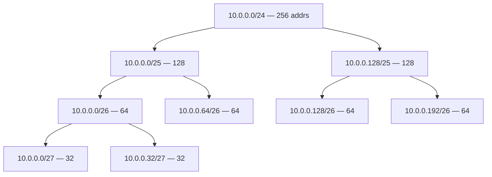
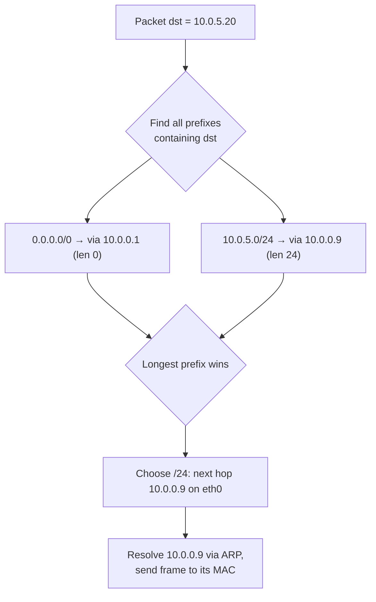
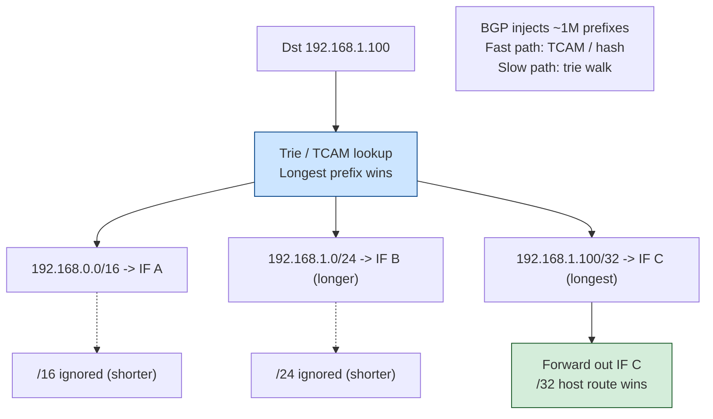
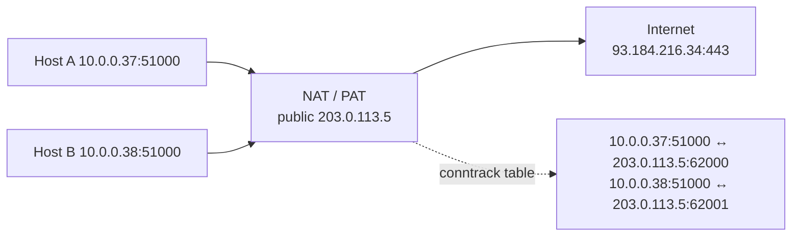
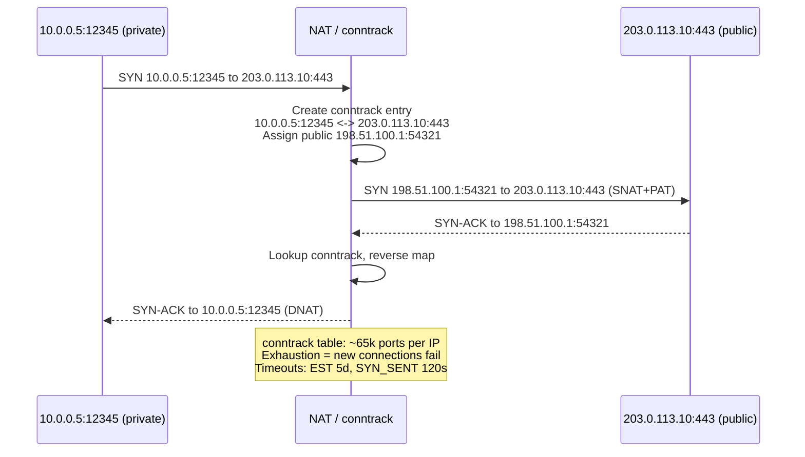
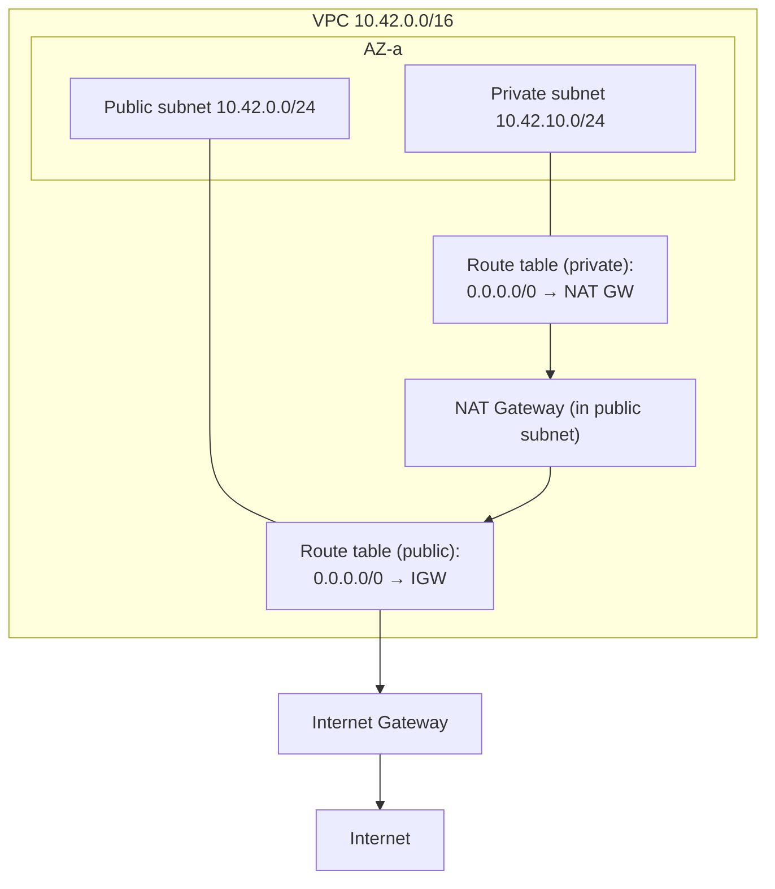
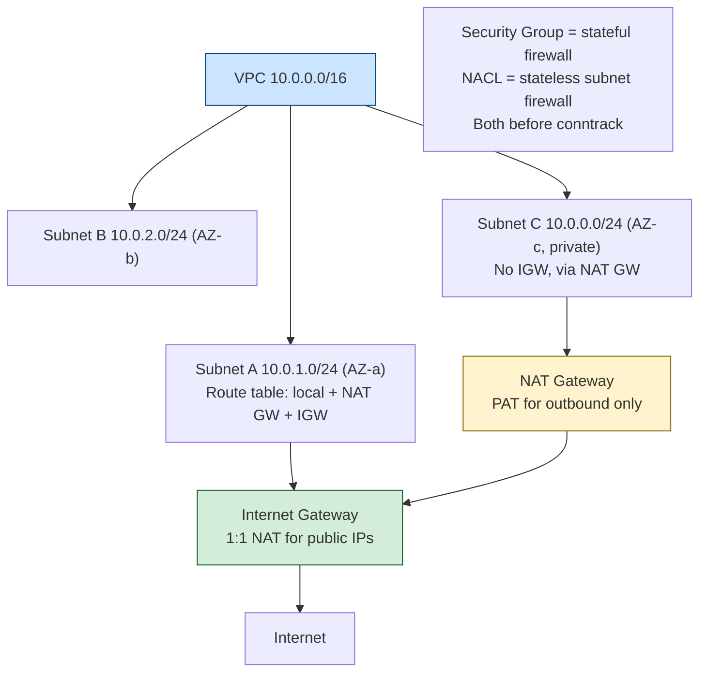
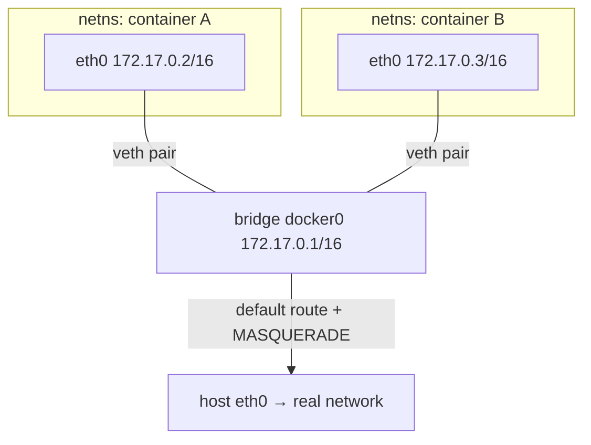

# Chapter 2 — IP, Routing, Subnetting, and NAT

**What this chapter covers.** Chapter 1 (The Journey of a Packet) traced a datagram down one
host's stack, across the wire, and up another's. This chapter zooms in on the layer that
decides *where* a packet goes: the Internet Protocol. For a backend engineer, IP is not
trivia to memorize for an interview — it is the substrate on which every cloud VPC, every
Kubernetes cluster, every service mesh, and every global load balancer is built. When you
allocate a `/16` for a new region and discover eighteen months later that it overlaps a
peered VPC, that is an IP-layer mistake. When a node stops accepting traffic because its
conntrack table filled, that is an IP-layer mistake. When a BGP route leak in some other
company's network makes your API unreachable from half a continent, that is the IP layer's
fragility surfacing in your on-call rotation. This chapter builds the mental model and the
arithmetic you need so that these are decisions you make deliberately rather than accidents
you clean up.

We work bottom to top: IPv4 addressing and the header, CIDR and the subnet math you must be
able to do by hand, the reserved ranges that behave specially (loopback, link-local, the
cloud metadata endpoint, RFC 1918 space), then routing — how a host or router chooses a next
hop by longest-prefix match, how routes are learned statically and dynamically, and how BGP
glues the tens of thousands of autonomous systems that make up the Internet into one whole
while remaining alarmingly easy to break. Then IPv6, which is not "IPv4 with more bits" but a different operational model.
Then NAT: why it exists, the SNAT/PAT machinery, the connection-tracking state it depends on,
why it breaks inbound connections, and how STUN/TURN claw some of that back. We finish by
mapping every one of these primitives onto the cloud objects you actually click and Terraform
— VPCs, subnets, route tables, security groups, internet and NAT gateways — and onto
container networking, so the abstractions stop being magic.

Learning goals — after this chapter you should be able to:

- Do subnet arithmetic by hand: given a CIDR block, compute the network address, broadcast
  address, usable host count, and the split into equal or variable-length subnets, and do it
  fast enough to size a VPC in a design review.
- Recite and reason about the special ranges — RFC 1918 private space, `127/8`,
  `169.254/16` including the `169.254.169.254` metadata endpoint — and explain the security
  consequences of each.
- Explain longest-prefix match and read a real routing table, distinguishing connected,
  static, and dynamically learned routes and the role of the default route.
- Describe, at the mechanism level, what an autonomous system is, what BGP advertises, and
  precisely how route leaks and hijacks happen and propagate — hedging the incident details
  you are not certain of.
- Explain SNAT, PAT, and the conntrack table as state, and predict the failure modes:
  port exhaustion, table exhaustion, broken inbound reachability, and hairpinning.
- Map the whole model onto a cloud VPC and a container network namespace, so a VPC diagram
  and a `veth` pair read as the same primitives you learned here.

## The IPv4 address and header

An IPv4 address is a 32-bit unsigned integer. The familiar dotted-quad notation —
`10.20.30.40` — is a human convenience: each of the four octets is one byte, written in
decimal, most significant first. `10.20.30.40` is exactly the integer
`(10 << 24) | (20 << 16) | (30 << 8) | 40 = 169090600`. Internalize this, because every piece
of subnet math below is integer arithmetic dressed up in dotted-quad clothing, and the moment
you think of an address as "four numbers" instead of "one number displayed in four groups"
you will make off-by-one errors on network and broadcast addresses.

The address alone does not tell you which bits identify the *network* and which identify the
*host within that network*. That split is carried separately — historically by an implied
class (the deprecated Class A/B/C scheme), today by an explicit prefix length. We get to
that in the next section. First, the header the address lives in.

The IPv4 header is a minimum of 20 bytes (five 32-bit words) and carries the fields that
routers and endpoints actually act on. You rarely parse this by hand — the kernel does — but
you must know what these fields *mean*, because they surface constantly in packet captures,
firewall rules, and outage post-mortems.

```
 0                   1                   2                   3
 0 1 2 3 4 5 6 7 8 9 0 1 2 3 4 5 6 7 8 9 0 1 2 3 4 5 6 7 8 9 0 1
+-+-+-+-+-+-+-+-+-+-+-+-+-+-+-+-+-+-+-+-+-+-+-+-+-+-+-+-+-+-+-+-+
|Version|  IHL  |    DSCP   |ECN|         Total Length          |
+-+-+-+-+-+-+-+-+-+-+-+-+-+-+-+-+-+-+-+-+-+-+-+-+-+-+-+-+-+-+-+-+
|         Identification        |Flags|    Fragment Offset      |
+-+-+-+-+-+-+-+-+-+-+-+-+-+-+-+-+-+-+-+-+-+-+-+-+-+-+-+-+-+-+-+-+
|  Time to Live |   Protocol    |        Header Checksum        |
+-+-+-+-+-+-+-+-+-+-+-+-+-+-+-+-+-+-+-+-+-+-+-+-+-+-+-+-+-+-+-+-+
|                       Source Address                          |
+-+-+-+-+-+-+-+-+-+-+-+-+-+-+-+-+-+-+-+-+-+-+-+-+-+-+-+-+-+-+-+-+
|                     Destination Address                       |
+-+-+-+-+-+-+-+-+-+-+-+-+-+-+-+-+-+-+-+-+-+-+-+-+-+-+-+-+-+-+-+-+
|                    Options (if IHL > 5)                       |
+-+-+-+-+-+-+-+-+-+-+-+-+-+-+-+-+-+-+-+-+-+-+-+-+-+-+-+-+-+-+-+-+
```

The fields that matter operationally:

- **Version / IHL.** Version is 4. IHL (Internet Header Length) counts 32-bit words, so the
  common no-options header is IHL 5 = 20 bytes. Options push it higher and are rare on the
  modern Internet; middleboxes frequently drop packets carrying them.
- **DSCP / ECN.** These six plus two bits were once the "Type of Service" byte. DSCP carries
  Differentiated Services class markings for QoS; ECN (Explicit Congestion Notification)
  lets routers signal incipient congestion without dropping, which matters enormously for
  modern congestion control (Chapter 3, TCP in Depth). Note that DSCP markings are almost
  always rewritten or zeroed at administrative boundaries, so they are meaningful within a
  data center, not across the public Internet.
- **Total Length.** The whole datagram in bytes, header plus payload, max 65,535. This, minus
  the header, is how the receiver knows where the payload ends.
- **Identification / Flags / Fragment Offset.** IPv4 fragmentation machinery. If a datagram
  exceeds a link's MTU and the Don't Fragment (DF) flag is clear, a router splits it; the
  three fields let the destination reassemble. Fragmentation is a reliability and security
  liability — it interacts badly with firewalls, load balancers, and PMTUD black holes — and
  modern practice leans hard on Path MTU Discovery with DF set so that an ICMP "fragmentation
  needed" is returned instead. Chapter 1 covered MTU; the operational takeaway is that
  fragmentation in your captures is usually a symptom, not a design.
- **TTL.** Decremented by one at every router; a packet hitting TTL 0 is dropped and an ICMP
  Time Exceeded is returned to the source. This is the entire basis of `traceroute` and a
  crude but effective loop-prevention mechanism. A packet arriving with an unexpectedly low
  TTL tells you it took more hops than you thought.
- **Protocol.** The Layer-4 payload type: 6 = TCP, 17 = UDP, 1 = ICMP, 132 = SCTP, 4 =
  IP-in-IP, 41 = IPv6-in-IPv4, 47 = GRE. This is the demux key the receiving host uses to
  hand the payload to the right protocol handler, and the field your firewall rules match on
  when you say "allow TCP."
- **Header Checksum.** Covers the header only, not the payload (L4 has its own checksum).
  Because TTL changes at every hop, every router must recompute this — one reason IPv6 drops
  it entirely.
- **Source / Destination Address.** The 32-bit addresses. Note that the *source* address is
  chosen by the sender and, on the open Internet, trivially forgeable — the root of spoofing
  and reflection/amplification DDoS. Ingress filtering (BCP 38 / RFC 2827) at the network
  edge is the defense, and its incomplete deployment is why amplification attacks still work.

## CIDR and subnet arithmetic

Classless Inter-Domain Routing (CIDR, RFC 4632) replaced the rigid Class A/B/C system in the
early 1990s. The idea is simple and total: an address block is an address plus a **prefix
length**, written `address/length`. The prefix length is the number of leading bits that are
fixed — the network portion — leaving the remaining `32 − length` bits to enumerate hosts.

`10.20.0.0/16` means: the first 16 bits (`10.20`) are the network; the last 16 bits vary, so
the block spans `10.20.0.0` through `10.20.255.255` — 65,536 addresses. The **network mask**
is the same information expressed as 32 bits: `/16` is `11111111 11111111 00000000 00000000`
= `255.255.0.0`. Masks and prefix lengths are interchangeable; tools accept both.

The arithmetic you must be able to do without a calculator:

- **Number of addresses in a `/n`** is `2^(32−n)`. A `/24` is `2^8 = 256`. A `/22` is
  `2^10 = 1024`. A `/28` is `2^4 = 16`.
- **Usable hosts** is that minus two: the all-zeros host is the **network address** (the
  identity of the subnet itself) and the all-ones host is the **broadcast address**. So a
  `/24` gives 254 usable hosts, a `/28` gives 14. The exceptions: a `/31` (RFC 3021) is used
  for point-to-point links and has *two* usable addresses with no broadcast, and a `/32` is
  a single host route. Clouds bite here too — AWS reserves *five* addresses per subnet (network,
  VPC router, DNS, a future-use address, and broadcast), so an AWS `/24` yields 251 usable,
  not 254.
- **Network address** of any address is the address ANDed with the mask. `10.20.30.40/24`:
  AND with `255.255.255.0` zeroes the last octet, giving network `10.20.30.0`.
- **Broadcast address** is the network address ORed with the inverted mask (the host bits all
  set): `10.20.30.255`.
- **Which subnet an address belongs to** is exactly the network-address computation. This is
  the operation a router performs, at line rate, on every packet.

Worked example. You are handed `172.18.64.0/20` for a Kubernetes cluster's pod network and
must confirm its extent. `/20` fixes 20 bits; the varying bits are the low 12, i.e. the low 4
bits of the third octet plus the whole fourth octet. `2^12 = 4096` addresses. The third octet
ranges over multiples of 16 starting at 64: the block is `172.18.64.0` through
`172.18.79.255`. Network `172.18.64.0`, broadcast `172.18.79.255`, 4094 usable. If someone
else has `172.18.72.0/22`, it falls *inside* your block (`172.18.72.0`–`172.18.75.255`) —
that overlap is the kind of thing that silently breaks routing when two VPCs are peered.

### Subnetting: splitting a block

Subnetting is borrowing host bits to make more, smaller networks. Take `10.0.0.0/24` and
split it into four subnets: you need 2 bits (`2^2 = 4`), so you extend the prefix from `/24`
to `/26`. Each `/26` has `2^6 = 64` addresses, 62 usable. The four are:

| Subnet | Range | Network | Broadcast | Usable |
|---|---|---|---|---|
| `10.0.0.0/26` | .0 – .63 | 10.0.0.0 | 10.0.0.63 | .1 – .62 |
| `10.0.0.64/26` | .64 – .127 | 10.0.0.64 | 10.0.0.127 | .65 – .126 |
| `10.0.0.128/26` | .128 – .191 | 10.0.0.128 | 10.0.0.191 | .129 – .190 |
| `10.0.0.192/26` | .192 – .255 | 10.0.0.192 | 10.0.0.255 | .193 – .254 |

The following diagram shows how one prefix length nests inside another — the mental model for
all subnetting is a binary tree where each additional prefix bit splits a block in half.



**Variable-length subnet masking (VLSM)** drops the requirement that all subnets be equal.
Suppose from `10.0.0.0/24` you need one subnet for ~100 hosts, one for ~50, and two for
point-to-point links. Size each to the smallest prefix that fits, largest first, to avoid
fragmentation:

- 100 hosts needs `/25` (126 usable): `10.0.0.0/25`.
- 50 hosts needs `/26` (62 usable): `10.0.0.128/26`.
- Each point-to-point link needs `/30` (2 usable) — or `/31` if the gear supports RFC 3021:
  `10.0.0.192/30` and `10.0.0.196/30`.

Allocating largest-first keeps the remaining space contiguous and summarizable. Allocating
smallest-first tends to strand unusable gaps — the address-space equivalent of memory
fragmentation.

**Route summarization (aggregation)** is subnetting in reverse: adjacent blocks that share a
prefix collapse into one advertisement. `10.0.0.0/24` and `10.0.1.0/24` are adjacent and
together fill `10.0.0.0/23`, so a router can advertise the single `/23` instead of two `/24`s.
This is why hierarchical, contiguous allocation matters at scale: it is the difference between
a global routing table with a handful of aggregate routes per region and one bloated with
thousands of unaggregatable specifics. CIDR's original purpose in 1993 was precisely to slow
the growth of the global BGP table through aggregation; the table has grown anyway (roughly
900,000+ IPv4 routes as of the mid-2020s — treat that figure as approximate and always
climbing), but far slower than classful routing would have allowed.

## Special and reserved ranges

Several ranges do not behave like ordinary global unicast addresses. A senior engineer must
know these cold, because most of them have security consequences.

**RFC 1918 private space.** Three ranges are reserved for private internets and are never
routed on the public Internet:

- `10.0.0.0/8` — 16,777,216 addresses. The go-to for large cloud VPCs and corporate networks.
- `172.16.0.0/12` — `172.16.0.0`–`172.31.255.255`, 1,048,576 addresses. The one people
  get wrong: it is `/12`, not `/16`, so it is the sixteen `/16`s from `172.16` to `172.31`,
  *not* the whole `172.x`. Docker's default bridge lives here (`172.17.0.0/16`).
- `192.168.0.0/16` — 65,536 addresses. Home and small-office networks; too small for most
  cloud fleets.

These are the pools you carve VPCs from. The catch, revisited in the cloud section, is that
private does not mean *isolated*: the moment two RFC 1918 networks are joined — VPC peering, a
VPN, a Transit Gateway, a corporate acquisition — overlapping ranges collide and routing
becomes ambiguous. Disciplined global CIDR planning is the only prevention.

**Loopback `127.0.0.0/8`.** The entire `/8` loops back to the local host; `127.0.0.1` is the
conventional address but anything in `127/8` works. Packets to it never hit a wire. Note the
whole `/8` is reserved — a common surprise when someone tries to use `127.0.0.2` as a real
address.

**Link-local `169.254.0.0/16`** (RFC 3927). Auto-assigned when no DHCP is available; valid
only on the local link and never routed. Two special-interest members:

- `169.254.169.254` — the **cloud instance metadata service (IMDS)** endpoint on AWS, GCP,
  Azure, and others. A workload queries it to discover its own identity, and critically to
  obtain temporary IAM/role credentials. This single address is one of the most important
  attack surfaces in cloud security: a Server-Side Request Forgery (SSRF) bug that can be
  coerced into fetching `http://169.254.169.254/...` can exfiltrate the instance's cloud
  credentials. The 2019 Capital One breach hinged on exactly this — an SSRF reaching IMDS to
  steal role credentials. AWS's mitigation is **IMDSv2**, which requires a session token
  obtained via a PUT (with a hop-limit-restricted TTL so it cannot be proxied through the
  app), turning a naive GET-based SSRF from a credential theft into a dead end. Enforce IMDSv2
  and set the metadata hop limit to 1.
- `169.254.169.123` (AWS time sync) and similar are further link-local service endpoints; the
  pattern generalizes.

**Other reserved ranges** you will encounter: `0.0.0.0/8` (this network / unspecified;
`0.0.0.0` as a bind address means "all local interfaces," as a route means "default"),
`100.64.0.0/10` (RFC 6598 carrier-grade NAT space, also used by some clouds and Tailscale to
avoid RFC 1918 collisions), `224.0.0.0/4` (multicast), and `255.255.255.255` (limited
broadcast). Documentation ranges (`192.0.2.0/24`, `198.51.100.0/24`, `203.0.113.0/24`,
RFC 5737) exist so examples never accidentally name a real host.

## Routing and longest-prefix match

A host or router forwards a packet by consulting its **routing table**: an ordered set of
destination prefixes, each with a next hop (a gateway address and/or an outgoing interface).
The decision rule is **longest-prefix match (LPM)**: among all routes whose prefix contains
the destination address, the one with the *longest* prefix wins. More specific beats less
specific, always. The default route `0.0.0.0/0` matches everything and therefore, being the
shortest possible prefix, loses to every other matching route — it is the fallback of last
resort, the gateway you send anything you don't have a more specific route for.

Here is a real Linux routing table:

```bash
$ ip route show
default via 10.0.0.1 dev eth0 proto dhcp metric 100
10.0.0.0/24 dev eth0 proto kernel scope link src 10.0.0.37
10.0.5.0/24 via 10.0.0.9 dev eth0 proto static
172.17.0.0/16 dev docker0 proto kernel scope link src 172.17.0.1
```

Reading it:

- `10.0.0.0/24 dev eth0 ... scope link` is a **connected route** — the kernel installed it
  automatically when `eth0` got its address; hosts on this subnet are reachable directly over
  the link, no gateway needed. `src 10.0.0.37` is this host's address.
- `10.0.5.0/24 via 10.0.0.9` is a **static route** — someone (or a config-management tool)
  added it; traffic to that subnet goes to the router at `10.0.0.9`, which is itself on the
  connected `10.0.0.0/24`.
- `172.17.0.0/16 dev docker0` is Docker's connected route for its bridge.
- `default via 10.0.0.1` catches everything else.

Now trace a packet to `10.0.5.20`. It matches both `default` (`/0`) and `10.0.5.0/24` (`/24`);
LPM picks the `/24`, next hop `10.0.0.9`. A packet to `93.184.216.34` matches only `default`,
so it goes to `10.0.0.1`. A packet to `10.0.0.37` matches the connected `/24` — the host talks
to itself over loopback, but that is the socket layer's doing, not this table's.



Note the final step: the next hop is an *IP* address, but the frame is sent to a *MAC*
address. The host uses ARP (Chapter 1) to resolve the next hop's IP to its link-layer address,
then sends the L2 frame there while the IP destination in the header stays the final
destination. This IP-stays-fixed, MAC-changes-per-hop distinction is the single most important
thing to hold in your head about forwarding.

### Static vs dynamic routing

**Static routes** are hand-configured. They are perfect for small, stable topologies and for
the cloud, where the control plane (not a routing protocol) programs the route tables. They do
not react to failure: if the next hop dies, a static route keeps pointing at the corpse until
something rewrites it.

**Dynamic routing protocols** let routers discover topology and reconverge around failures
automatically. Two families matter conceptually:

- **Interior Gateway Protocols (IGPs)** run *within* one administrative domain (an autonomous
  system). **OSPF** (Open Shortest Path First) and **IS-IS** are the dominant link-state IGPs.
  Each router floods "link-state advertisements" describing its own links; every router thus
  builds an identical map of the whole domain and runs Dijkstra's shortest-path algorithm over
  it to compute next hops. Convergence is fast and loop-free by construction. IS-IS is
  favored in large ISP cores (it runs directly over L2, scales well, and carries both IPv4 and
  IPv6 in one instance); OSPF is ubiquitous in enterprise. The mechanism to remember: link-state
  = every router knows the whole graph and computes its own shortest paths.
- **Exterior Gateway Protocol**: **BGP**, which glues autonomous systems together and is
  important enough to get its own section.




## BGP: the Internet's glue and its fragility

The Internet is not one network; it is on the order of a hundred thousand allocated **autonomous
systems (ASes)** — of which some seventy to eighty thousand are actively visible in the global
routing table — networks under independent administrative control, each identified by an AS
number (ASN, now up to 32-bit; e.g., Cloudflare is AS13335, Google AS15169). The **Border Gateway
Protocol** (BGP-4, RFC 4271) is how ASes tell each other which IP prefixes they can reach.

BGP is a **path-vector** protocol. A BGP speaker advertises, to its neighbors (peers), a set of
reachable prefixes, each annotated with the **AS_PATH** — the sequence of ASNs the route has
traversed. When AS A advertises `203.0.113.0/24` to AS B, B re-advertises it to C with A's ASN
prepended, so C sees `AS_PATH = B A`. Two things fall out of carrying the whole path:

1. **Loop prevention.** A router that sees its own ASN already in a received AS_PATH rejects
   the route — that is how BGP avoids counting-to-infinity without a global map.
2. **Policy, not shortest path.** Unlike an IGP, BGP does not pick the objectively shortest
   route. It picks according to *policy* and business relationships. The dominant factors, in
   the order the decision process consults them, start with **LOCAL_PREF** (an operator's
   explicit preference, used to prefer cheaper or customer routes), then shortest AS_PATH,
   then a cascade of tie-breakers. An AS prefers routes through its paying customers over
   peers over its own upstream providers, because money, not hop count, is the objective.

Concretely: origin AS64500 advertises `203.0.113.0/24` with `AS_PATH = 64500`; its
transit provider AS64510 re-advertises it as `AS_PATH = 64510 64500`; your ISP AS64520
passes it on as `AS_PATH = 64520 64510 64500`, and your router selects among all such paths
it hears using the policy-first decision process below.

BGP is astonishingly effective — it has scaled the Internet by three orders of magnitude — and
astonishingly fragile, because at its core it is a system built on *trust*. When a neighbor
advertises a prefix, classic BGP has no built-in way to verify the neighbor is actually
entitled to originate it. Two failure modes follow:

- **Route hijack.** An AS originates a prefix it does not own, and if its advertisement is
  more specific or more preferred, traffic for that prefix is drawn to it — blackholed or
  intercepted. The 2008 incident where Pakistan Telecom's attempt to block YouTube domestically
  leaked a more-specific `208.65.153.0/24` globally and took YouTube offline for much of the
  world is the textbook case. In 2018 a BGP hijack redirected traffic destined for Amazon
  Route 53 DNS to steal cryptocurrency from users of a wallet site. Treat exact figures in
  such incidents as approximate unless you check the specific post-mortem.
- **Route leak.** An AS re-advertises routes in a direction that violates the intended policy
  — for example, propagating routes learned from one provider to another provider, turning
  itself into unintended transit and pulling in traffic it cannot carry. This is usually a
  misconfiguration, not malice, and it causes large, sudden outages and latency spikes. Major
  leaks have repeatedly degraded reachability for large chunks of the Internet for tens of
  minutes at a time.

The defenses, which you should recognize even if you never configure a router: **RPKI**
(Resource Public Key Infrastructure) lets a prefix owner publish a cryptographically signed
**Route Origin Authorization (ROA)** stating which ASN may originate the prefix, and networks
that deploy **Route Origin Validation** drop advertisements that contradict it. RPKI adoption
has climbed substantially in the 2020s but is not universal, and RPKI validates only the
*origin*, not the whole path — path validation (BGPsec, ASPA) remains largely undeployed.
Complementary practices are IRR-based prefix filtering and the **MANRS** norms (filtering,
anti-spoofing, coordination). The distributed-systems point for a backend engineer: your
service's global reachability depends on the correct behavior of networks you neither own nor
can see, and BGP anycast — the mechanism by which one IP is advertised from many locations so
users reach the nearest — is exactly what your CDN and global load balancer rely on
(Chapter 10, Proxies, Reverse Proxies, Service Mesh, and CDNs). When people say "the Internet
had an outage," it was very often BGP.

## IPv6: not IPv4 with more bits

IPv6 uses **128-bit** addresses — `2^128` of them, an amount so large that the scarcity
economics driving NAT in IPv4 simply vanish. But treating IPv6 as "IPv4 with a bigger address
field" leads to operational mistakes, because its addressing and autoconfiguration model is
genuinely different.

**Notation.** Eight groups of four hex digits separated by colons:
`2001:0db8:0000:0000:0000:ff00:0042:8329`. Two abbreviation rules compress it: leading zeros
in a group may be dropped (`0db8` → `db8`, `0000` → `0`), and *one* run of all-zero groups may
be replaced by `::` (only once, else the length is ambiguous). The example becomes
`2001:db8::ff00:42:8329`. Loopback is `::1`; the unspecified address is `::`. `2001:db8::/32`
is the documentation prefix.

**The `/64` convention.** In IPv6, a single subnet is essentially always a `/64`: the top 64
bits are the network prefix, the bottom 64 are the **interface identifier**. This is not a
suggestion — **SLAAC** (Stateless Address Autoconfiguration) depends on it. A host learns the
`/64` prefix from a router's **Router Advertisement** (ICMPv6 Neighbor Discovery replaces
ARP and much of DHCP) and forms its own address by combining that prefix with an interface ID.
The interface ID was historically derived from the MAC via EUI-64, but because that leaks the
hardware address and enables tracking, hosts now use **privacy/stable-random** interface IDs
(RFC 8981 / RFC 7217) by default. The consequence for backend operators: a host can have many
IPv6 addresses at once (a link-local `fe80::/10`, one or more global addresses, a stable one,
temporary ones that rotate), and source-address selection rules (RFC 6724) decide which it
uses — a frequent source of "why did my traffic come from *that* address" confusion.

Address types to know: **global unicast** (`2000::/3`, the routable Internet), **link-local**
(`fe80::/10`, mandatory on every interface, used for neighbor discovery and routing protocols,
never routed off-link), **unique local** (`fc00::/7`, effectively RFC 1918 for IPv6, the
private range for internal networks), and **multicast** (`ff00::/8` — IPv6 has no broadcast at
all; "all-nodes" is a multicast group).

**Dual-stack** is the pragmatic reality: hosts run IPv4 and IPv6 simultaneously, and
applications use **Happy Eyeballs** (RFC 8305) to race A and AAAA connections and use whichever
completes first, so a broken IPv6 path degrades to IPv4 instead of hanging. There is no header
compatibility between the two — a v6 packet is not a v4 packet — so dual-stack means genuinely
running both stacks, with all the config and firewall duplication that implies. For a fleet
this doubles the address-planning and ACL surface, which is exactly why many internal networks
stayed v4-with-NAT far longer than the IANA IPv4 exhaustion (the free pool ran out in 2011)
would suggest they should have.

## NAT: SNAT, PAT, and connection tracking

IPv4 has about 3.7 billion usable unicast addresses and the world has far more than that many
devices. **Network Address Translation** is the load-bearing hack that reconciles the two: a
whole private network hides behind one (or a few) public addresses, with a NAT device
rewriting addresses and ports as packets cross the boundary.

The variant you actually run is **PAT** (Port Address Translation), also called **NAPT**,
overload NAT, or on Linux **masquerade**. It multiplexes many internal hosts onto one public
address by also rewriting *ports*. When `10.0.0.37:51000` sends to `93.184.216.34:443`, the
NAT box rewrites the source to `203.0.113.5:62000` (its public address, a chosen source port),
forwards it, and records the mapping. The reply, addressed to `203.0.113.5:62000`, is matched
against that record, rewritten back to `10.0.0.37:51000`, and delivered inside. The four-tuple
(and the protocol) is the key; the rewritten source port is what makes the reply
unambiguously routable back to one internal flow.



Note that both internal hosts happened to pick source port 51000; PAT disambiguates them by
assigning *different* public ports (62000 vs 62001), which is the whole trick.

**This mapping is state.** NAT is fundamentally a stateful operation, and on Linux that state
lives in the **conntrack** (connection tracking) table of the netfilter subsystem — the same
machinery covered from the kernel side in Volume 2, Chapter 10 (The Linux Network Stack). Two
hard operational limits fall out of NAT being stateful:

- **Table exhaustion.** The conntrack table has a finite size (`nf_conntrack_max`). Every
  active flow consumes an entry; a burst of connections — or a slow leak of entries that never
  time out — fills it, and once full the kernel drops new connections and logs
  `nf_conntrack: table full, dropping packet`. This is a classic, brutal outage mode: a node
  or NAT gateway that suddenly refuses *all new* traffic while existing flows continue, so it
  looks like a partial failure. In Kubernetes this bites regularly because kube-proxy's iptables
  mode relies heavily on conntrack; watch `nf_conntrack_count` against `nf_conntrack_max` and
  size accordingly.
- **Port exhaustion.** One public address has only ~64,000 ports (per protocol, per
  destination tuple). A NAT gateway serving many clients to a *single* popular destination can
  run out of source ports for that tuple and start refusing connections even though CPU and
  bandwidth are idle. Cloud managed NAT gateways surface this as an "ErrorPortAllocation" style
  metric; the fix is more public IPs on the gateway (more port space) or spreading destinations.

Here is Linux masquerade in practice — the config on a NAT/router host:

```bash
# Enable forwarding between interfaces
sysctl -w net.ipv4.ip_forward=1

# Masquerade traffic leaving the public interface (source NAT to eth0's address)
iptables -t nat -A POSTROUTING -o eth0 -s 10.0.0.0/24 -j MASQUERADE

# Inspect live NAT state
conntrack -L -j 2>/dev/null | head
# tcp 6 431999 ESTABLISHED src=10.0.0.37 dst=93.184.216.34 sport=51000 dport=443 \
#     src=93.184.216.34 dst=203.0.113.5 sport=443 dport=62000 [ASSURED] ...

# Watch table pressure
sysctl net.netfilter.nf_conntrack_count net.netfilter.nf_conntrack_max
```

`MASQUERADE` is the source-address-picks-itself-from-the-outgoing-interface variant of SNAT,
convenient when the public address is dynamic; plain `SNAT --to-source` is used when it is
fixed and is slightly cheaper.

### NAT breaks inbound — and how traversal claws it back

The defining asymmetry of NAT: a mapping is created by an *outbound* packet. There is no entry
for an unsolicited *inbound* connection, so the NAT box has no idea which internal host to
deliver it to and drops it. NAT thus silently provides a crude stateful firewall — inbound is
denied by default — but it also *breaks* every protocol that needs a host behind NAT to accept
connections: peer-to-peer, VoIP, WebRTC, some database replication topologies, FTP's data
channel, and so on.

Workarounds, in ascending order of desperation:

- **Static port forwarding / DNAT.** Manually map an inbound public port to an internal host.
  Fine for a handful of servers; unmanageable at scale and impossible when the internal host is
  itself dynamic.
- **UPnP / NAT-PMP / PCP.** Protocols by which an internal host *asks* the NAT to open a
  mapping. Convenient, and a security liability if exposed carelessly.
- **STUN** (Session Traversal Utilities for NAT, RFC 8489). A host asks a public STUN server
  "what source address and port do you see me coming from?" The answer reveals the public-side
  mapping the NAT created, and if both peers learn each other's public mappings they can often
  send directly to them — **hole punching**. STUN is cheap (one small server, no media relayed)
  but fails against **symmetric NAT**, where the NAT assigns a *different* public port per
  destination, so the port a peer learns via STUN is not the port that peer's traffic will
  arrive on.
- **TURN** (Traversal Using Relays around NAT, RFC 8656). The fallback: when hole punching
  fails, both peers connect *outbound* to a public relay, which forwards media between them.
  This always works (both sides made outbound connections, which NAT allows) but costs a
  server that carries all the traffic — expensive at scale.
- **ICE** (Interactive Connectivity Establishment, RFC 8445) is the orchestration layer that
  gathers candidate addresses (host, STUN-derived server-reflexive, TURN relay), tries them in
  priority order, and picks the best working pair. WebRTC uses ICE/STUN/TURN as its whole
  connectivity story; when you build real-time media features, this is the machinery.

The deeper point: NAT is why the end-to-end principle eroded, why running a server "at home" is
hard, and one of the strongest arguments for IPv6, whose abundance removes the address-scarcity
justification for NAT entirely (though NAT's accidental firewall property keeps some operators
attached to it even on v6, via NPTv6 — a practice most engineers consider misguided).




## The cloud realization: a VPC is IP networking

Everything above is not background for cloud networking — it *is* cloud networking, wearing
different names. A cloud **Virtual Private Cloud (VPC)** is a private IP network you define by
choosing a CIDR block. AWS, GCP, and Azure differ in detail but the primitives map cleanly:

| Concept in this chapter | Cloud object |
|---|---|
| CIDR block you carve from RFC 1918 | VPC CIDR (e.g., `10.42.0.0/16`) |
| Subnet (a smaller prefix) | Subnet, pinned to one Availability Zone |
| Routing table + LPM | Route table associated with subnets |
| Default route `0.0.0.0/0` | Route to an Internet Gateway or NAT Gateway |
| Stateful L3/L4 firewall | Security group (stateful) / NACL (stateless) |
| SNAT/PAT for egress | Managed NAT Gateway |
| BGP/anycast to the Internet | Internet Gateway + the provider's edge |



The design that falls out of the model: a **public subnet** is one whose route table sends
`0.0.0.0/0` to the Internet Gateway; instances there can have public IPs and be reached from
outside. A **private subnet** sends its default route to a **NAT Gateway** (which itself lives
in a public subnet), so instances can reach *out* — to pull images, call APIs — but nothing on
the Internet can initiate a connection *in*. That is precisely the NAT-breaks-inbound property
from the previous section, now sold as a security feature. Databases and internal services go
in private subnets; only load balancers and bastions face the Internet.

The distributed-systems failure modes are the ones you now recognize:

- **CIDR planning across a fleet.** Give every region and every VPC a non-overlapping block
  from a master plan *before* you have thirty VPCs. Two VPCs with overlapping `10.0.0.0/16`
  ranges cannot be peered — the router cannot disambiguate a destination that exists in both.
  Fixing this after the fact means renumbering a live network, which is among the least
  pleasant tasks in infrastructure. Reserve generously (v4 address space inside a VPC is free;
  a `/16` per VPC costs nothing) but partition hierarchically so blocks summarize.
- **Subnet sizing and address exhaustion.** Kubernetes on the cloud is voracious with
  addresses — AWS's VPC CNI, for instance, assigns real VPC IPs to *pods*, so a busy cluster
  can exhaust a subnet's addresses and fail to schedule pods with a cryptic ENI/IP error while
  CPU sits idle. Size pod subnets for peak pod count, not node count.
- **NAT Gateway as a shared chokepoint.** A managed NAT Gateway has finite port capacity per
  associated IP; a fleet of instances hammering one external dependency through one NAT Gateway
  can hit port-allocation errors — the cloud incarnation of the PAT port-exhaustion limit. The
  fix is the same: more IPs, or per-AZ NAT Gateways, or interface endpoints that bypass NAT for
  in-cloud service traffic.
- **Security groups are stateful; NACLs are not.** A security group that allows an outbound
  connection automatically permits the return traffic (it tracks state, like conntrack). A
  network ACL is stateless and evaluates each direction independently, so a NACL that forgets
  to allow the ephemeral-port return range silently breaks connections that "should" work — a
  classic subtle bug. Reach for the model, not folklore.

This is the cloud realization; Volume 12 (Cloud Infrastructure) develops VPC design, Transit
Gateways, PrivateLink, and multi-region topologies in depth. Here the point is only that there
is nothing new under the hood — it is subnets, route tables, LPM, and NAT.




## Container networking: the same primitives, one host down

Container networking is IP networking compressed into a single host's kernel, and it reuses
every primitive above. Volume 2, Chapters 9 (Namespaces and cgroups) and 10 (The Linux Network
Stack) cover the kernel mechanics; here is the IP-layer view.

Each container gets its own **network namespace** — an isolated copy of the network stack with
its own interfaces, routing table, and conntrack. A namespace is connected to the host with a
**veth pair**: a virtual Ethernet cable with two ends, one inside the container's namespace
(its `eth0`) and one in the host, plugged into a **bridge** (`docker0`, or a CNI-managed
bridge). The bridge is a virtual L2 switch; all containers on it share a subnet (Docker's
default `172.17.0.0/16`) and reach each other directly, exactly like hosts on a physical LAN.
To reach the outside, the container's default route points at the bridge's address, and the
host **masquerades** the container's private source address behind the host's real IP — the
same `iptables ... MASQUERADE` rule from the NAT section. That is why, by default, a container
can reach the Internet but is not reachable from it without explicit port publishing (`-p`),
which installs a DNAT rule. Container networking *is* subnets + routing + NAT on one box.



Multi-host container networking — where a pod on node 1 must reach a pod on node 2 with a
routable, flat address space — is solved by **overlays** or by making the pod network natively
routable. An overlay (VXLAN, Geneve) encapsulates each inter-node pod packet inside a UDP
packet addressed node-to-node, so the underlying network only ever sees node IPs while pods
enjoy a flat `/16`; the receiving node decapsulates and delivers to the right namespace. The
alternative is to *route* the pod CIDRs directly — Calico can even run BGP between nodes so pod
subnets are advertised as ordinary routes, bringing this chapter full circle: the same
path-vector protocol that glues the Internet also glues a Kubernetes cluster. Book 6
(Cloud-Native Systems) and Volume 2, Chapter 10 develop CNI, kube-proxy, and overlays in
depth; the load-balancing and service-routing layers built on top are Chapter 9 (Load
Balancing) and Chapter 10 (Proxies, Mesh, CDNs) of this volume.

## Distributed-systems lens

Pulling the threads together, here is why this chapter's arithmetic and mechanisms are
operational concerns rather than academic ones for a senior backend engineer:

- **Address planning is capacity planning.** A CIDR allocation is a commitment you make once
  and renumber painfully. The overlap that blocks a VPC peering, the exhausted pod subnet that
  fails scheduling, the region you cannot summarize because its blocks are scattered — all are
  planning failures that compound with fleet size. Treat the master CIDR plan like a schema:
  hierarchical, versioned, allocated with headroom, reviewed before growth.
- **NAT and conntrack are hard limits, not soft ones.** Port exhaustion and table exhaustion
  do not degrade gracefully; they cliff. A NAT Gateway that runs out of source ports or a node
  whose conntrack table fills refuses *new* work while old work continues, producing the
  confusing "half-broken" outages that eat hours of debugging. Monitor `nf_conntrack_count`,
  NAT Gateway port-allocation errors, and ephemeral-port pressure as first-class SLIs.
- **Your global reachability rides on BGP you do not control.** Anycast, the mechanism behind
  every serious CDN and global load balancer, is BGP advertising one prefix from many places.
  Its power and its fragility are the same coin: a route leak or hijack in a network you have
  never heard of can make your service unreachable for a region, and the mitigation (RPKI,
  filtering, provider diligence) is largely out of your hands. Design for it — multiple
  upstreams, monitored from multiple vantage points — rather than assuming the underlay is
  reliable.
- **The cloud abstractions leak into the primitives.** Every VPC console screen is subnets,
  route tables, LPM, and NAT with a friendlier UI. Engineers who understand the primitives
  debug the abstractions; engineers who only know the abstractions are helpless when a security
  group works but a NACL blocks the return traffic, or a private-subnet instance cannot reach
  an API because someone deleted the NAT Gateway route. The abstraction is a convenience, not a
  replacement for the model.

## Key takeaways

- An IPv4 address is one 32-bit integer; CIDR splits it into a network prefix and a host
  suffix at an explicit bit boundary. Number of addresses in a `/n` is `2^(32−n)`; usable
  hosts is that minus two (network and broadcast), with `/31` and `/32` and cloud reservations
  as exceptions. Be able to compute network and broadcast addresses by hand.
- Memorize the special ranges: RFC 1918 (`10/8`, `172.16/12` — note the `/12`, `192.168/16`),
  loopback `127/8`, link-local `169.254/16` and especially the `169.254.169.254` metadata
  endpoint, whose SSRF exposure caused real breaches and whose mitigation is IMDSv2 with a
  hop limit of 1.
- Forwarding is longest-prefix match against the routing table; the default route `0.0.0.0/0`
  is the least specific and loses to every more specific route. The next hop is an IP, but the
  frame goes to that next hop's MAC — IP destination stays fixed hop to hop, L2 address
  changes.
- IGPs (OSPF, IS-IS, link-state) route within an AS by giving every router the whole graph;
  BGP is the path-vector protocol that glues ASes, choosing routes by policy and money rather
  than hop count, and its trust model makes route leaks and hijacks a real and recurring
  operational risk that RPKI only partially addresses.
- IPv6's 128 bits and `/64`-plus-SLAAC model remove the scarcity that justified NAT; dual-stack
  and Happy Eyeballs are the pragmatic transition, at the cost of running two stacks.
- PAT/masquerade is stateful NAT; its state (conntrack) and its single-address port space are
  hard-limited resources whose exhaustion causes cliff-edge outages. NAT breaks inbound by
  design, which STUN/TURN/ICE work around for peer-to-peer and real-time media.
- A cloud VPC is this chapter with a UI: CIDRs, subnets, route tables, security groups,
  internet and NAT gateways. Container networking is the same primitives on one host —
  namespaces, veth, bridge, masquerade — with overlays or BGP for multi-host reachability.

## Further reading

- RFC 791, *Internet Protocol* — the original IPv4 specification; still the authoritative
  header reference.
- RFC 4632, *Classless Inter-Domain Routing (CIDR): The Internet Address Assignment and
  Aggregation Plan* — the definitive CIDR document.
- RFC 1918, *Address Allocation for Private Internets*, and RFC 6598, *IANA-Reserved IPv4
  Prefix for Shared Address Space* (carrier-grade NAT / `100.64.0.0/10`).
- RFC 3927, *Dynamic Configuration of IPv4 Link-Local Addresses* (`169.254/16`), and RFC 3021,
  *Using 31-Bit Prefixes on IPv4 Point-to-Point Links*.
- RFC 4271, *A Border Gateway Protocol 4 (BGP-4)*, and RFC 7454, *BGP Operations and Security*
  (BCP 194) — the protocol and how to run it safely.
- RFC 6480, *An Infrastructure to Support Secure Internet Routing* (RPKI), plus the MANRS
  initiative documentation at manrs.org for current routing-security norms.
- RFC 8200, *Internet Protocol, Version 6 (IPv6) Specification*; RFC 4862, *IPv6 Stateless
  Address Autoconfiguration*; RFC 8305, *Happy Eyeballs Version 2*.
- RFC 8489, *Session Traversal Utilities for NAT (STUN)*; RFC 8656, *Traversal Using Relays
  around NAT (TURN)*; RFC 8445, *Interactive Connectivity Establishment (ICE)*.
- RFC 2827 / BCP 38, *Network Ingress Filtering* — the anti-spoofing baseline everyone should
  deploy and too few do.
- The Linux `ip(8)`, `ip-route(8)`, `iptables(8)`, and `conntrack(8)` man pages, and the
  netfilter project documentation at netfilter.org, for the mechanisms behind the commands in
  this chapter.
- Cloudflare's engineering blog and the MANRS/BGP incident write-ups from RIPE NCC and Oracle
  Internet Intelligence are reliable sources for accurate post-mortems of real BGP hijacks and
  leaks — read the specific write-up before quoting figures.
- Cloud provider VPC documentation: the AWS *VPC User Guide*, GCP *VPC* docs, and Azure
  *Virtual Network* docs, which describe each provider's exact subnet reservations and gateway
  behaviors referenced above. See also Volume 12 (Cloud Infrastructure) for design depth and
  Book 6 (Cloud-Native Systems) for CNI and Kubernetes networking.
