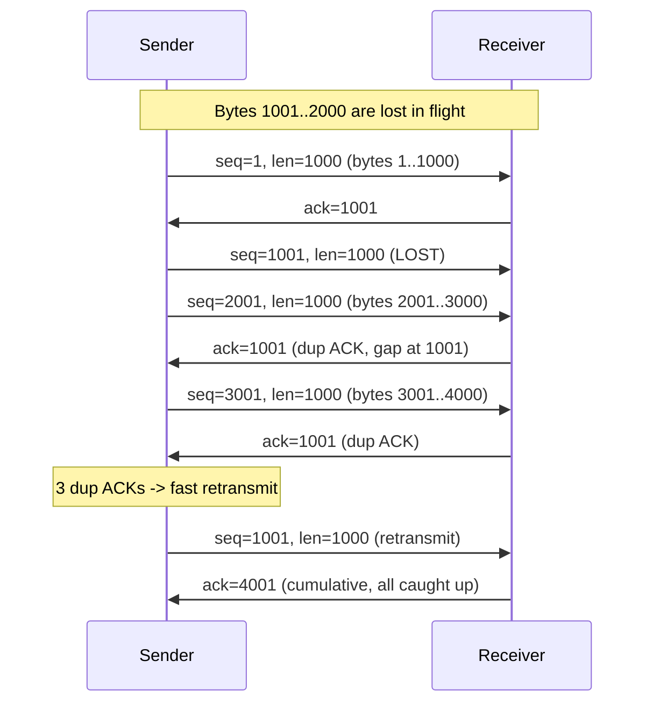
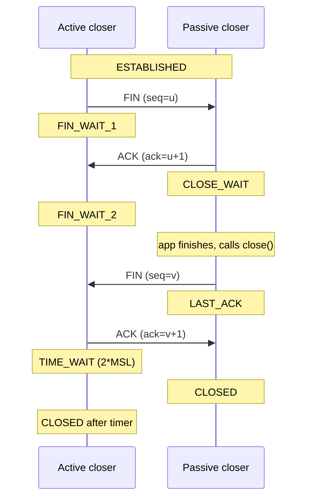
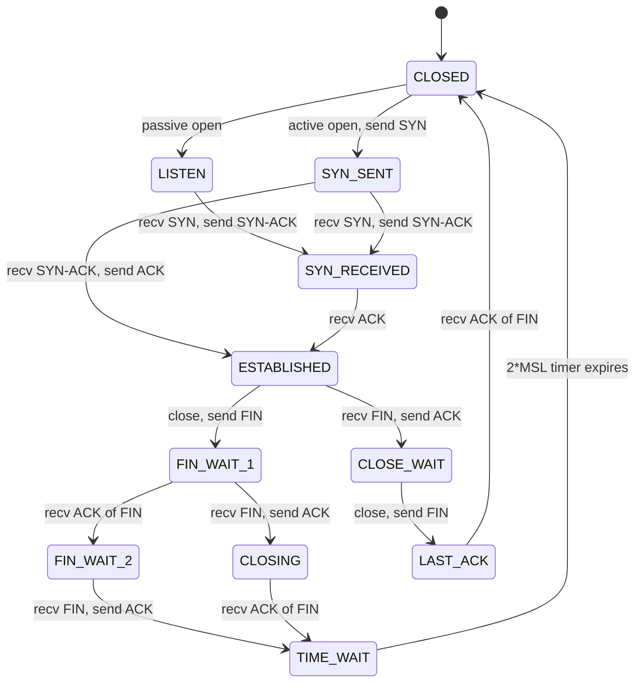
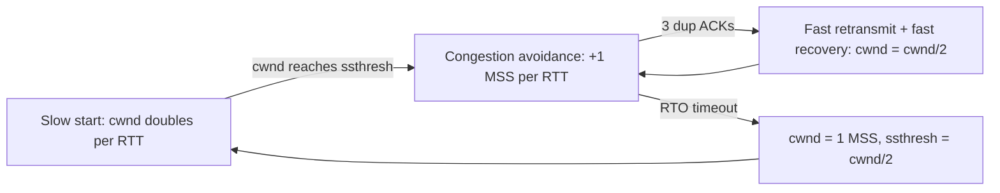
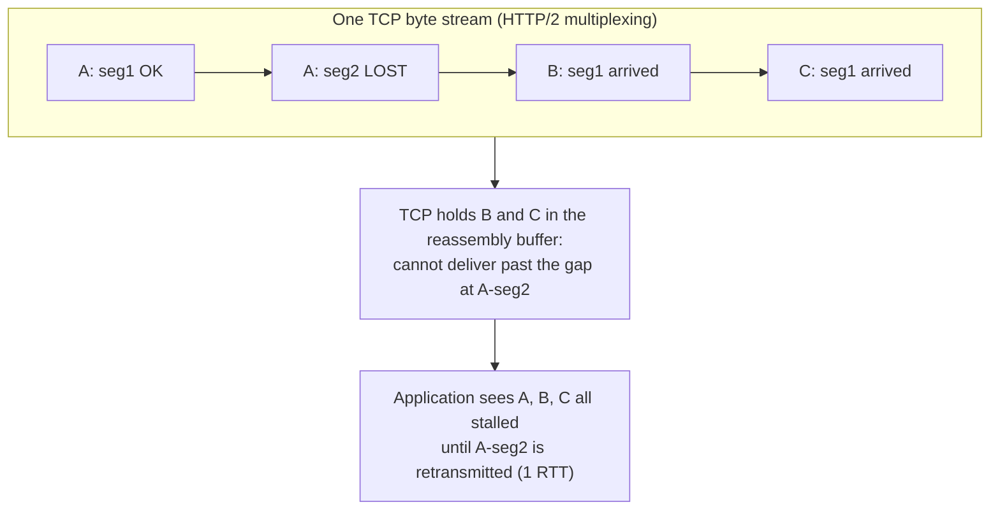

# Chapter 3 — TCP in Depth: Handshake, State Machine, Flow and Congestion Control

**What this chapter covers.** Chapter 1 (The Journey of a Packet) followed a segment down one
stack and up another; Chapter 2 (IP, Routing, Subnetting, and NAT) covered the datagram layer
that delivers packets *best-effort* — unreliable, unordered, size-limited. TCP is the layer
that turns that lossy datagram service into the abstraction almost every backend service
actually programs against: a reliable, ordered, bidirectional byte stream. In Volume 2,
Chapter 10 (The Linux Network Stack) you saw the *kernel machinery* — sockets, `sk_buff`s, the
qdisc, NAPI, the send and receive queues. This chapter is about the *protocol and its
dynamics*: what TCP guarantees, the exact mechanisms by which it keeps those guarantees, and —
most importantly for anyone operating services at scale — how its control loops behave under
load, loss, and latency. TCP is not a black box you can ignore. It is the single most
important determinant of your p99 RPC latency, the reason a healthy service falls over when a
NAT table fills, and the thing that made HTTP/3 abandon it entirely.

We work from the invariants outward: sequence and acknowledgment numbers and how they encode
a byte stream; the three-way handshake and four-way close; the full connection state machine
and the operational trap that is `TIME_WAIT`; flow control (the receive window, window
scaling, zero-window, silly window syndrome); then the heart of the chapter — congestion
control, from Van Jacobson's slow start and AIMD through Reno, NewReno, CUBIC, and BBR — plus
RTO estimation, SACK, ECN, and the small-packet pathologies (Nagle, delayed ACK, and their
famous interaction bug). We close on head-of-line blocking, which is TCP's one irreducible
weakness and the reason QUIC exists (Chapter 4), and on a distributed-systems lens: how these
mechanisms show up as latency, as outages, and as tuning decisions in production.

Learning goals — after this chapter you should be able to:

- Explain precisely how sequence numbers, cumulative ACKs, and retransmission deliver a
  reliable ordered byte stream over an unreliable datagram layer.
- Draw the TCP state machine from memory and reason about every transition, including why
  `TIME_WAIT` lasts 2×MSL and why it accumulates on the connection *initiator*.
- Distinguish flow control (receiver-driven, the advertised window) from congestion control
  (network-driven, the congestion window), and describe slow start, congestion avoidance,
  fast retransmit, and fast recovery at the level of the variables involved.
- Contrast loss-based congestion control (Reno/NewReno, CUBIC) with model-based BBR, and say
  correctly when each wins and how BBR probes bandwidth and RTT.
- Diagnose the classic small-packet pathologies — Nagle interacting with delayed ACK, silly
  window syndrome — and choose `TCP_NODELAY`, `TCP_QUICKACK`, and buffer sizing deliberately.
- Size TCP for a given bandwidth-delay product and explain why slow start punishes
  short-lived connections, motivating pooling, keep-alive, and HTTP/2 multiplexing.

## The guarantees, and the machinery that keeps them

TCP offers exactly three guarantees on top of IP, and it is worth being precise about each
because engineers routinely assume a fourth that does not exist.

**Reliable.** Every byte you `write()` that TCP acknowledges will be delivered to the peer
application, or the connection will be torn down and both ends will find out (via error or
reset). TCP does not silently drop data. It achieves this with sequence numbers, positive
cumulative acknowledgments, and retransmission of anything left unacknowledged past a timeout.

**Ordered.** Bytes are delivered to the receiving application in exactly the order the sender
wrote them, regardless of the order the underlying packets arrived. IP can and does reorder
packets — different packets can take different paths (Chapter 2), and even within a router
multipath and queueing reorder them. TCP reassembles using the sequence space.

**A byte stream.** This is the guarantee people forget. TCP has *no concept of message
boundaries*. If you `write()` 100 bytes then 200 bytes, the peer may `read()` 300 bytes at
once, or 1 then 299, or any other split. The segmentation into packets is TCP's business and
is driven by the MSS, Nagle, and the send window — not by your write boundaries. Every
framing bug in every hand-rolled protocol ("I called `send` once so I'll `recv` once") is a
failure to internalize this. Message framing is the application's job (length prefixes,
delimiters), which is exactly what gRPC and HTTP/2 provide (Chapters 7 and 8).

What TCP does *not* give you: bounded latency (it will retransmit and stall arbitrarily),
message atomicity, or any notion of "the peer received and processed my request." A
successful `write()` means the bytes are in your local send buffer, nothing more. A byte being
ACKed means the peer's *kernel* received it, not that the peer *application* read it, and
certainly not that it acted on it. End-to-end delivery semantics are an application concern
(Chapter 11 — Network Reliability).

### Sequence and acknowledgment numbers

Every byte in each direction of a TCP connection has a 32-bit sequence number. The number is
*per byte*, not per segment, though the header carries only the sequence number of the first
byte in the segment; the rest are implied by the payload length. The initial sequence number
(ISN) is not zero — it is randomized at connection setup, both to avoid confusion with stale
segments from a previous incarnation of the same four-tuple and to make off-path injection
harder (an attacker who cannot see the connection must guess a 32-bit ISN). RFC 6528
specifies deriving the ISN from a clock plus a keyed hash of the four-tuple.

The acknowledgment number is the sequence number of the *next byte the receiver expects* —
equivalently, one past the last contiguous byte received. This is the crucial design choice:
TCP ACKs are **cumulative**. An ACK of 5001 means "I have every byte through 5000." It says
nothing granular about bytes beyond a gap. If segments for bytes 1–1000 and 2001–3000 arrive
but 1001–2000 is lost, the receiver keeps ACKing 1001 — it cannot cumulatively acknowledge the
3000 it is holding, because 1001–2000 is missing. Those repeated identical ACKs are
*duplicate ACKs*, and they are the signal that drives fast retransmit (below). Cumulative
ACKs make the protocol robust — a single later ACK covers all earlier data, so lost ACKs are
usually harmless — but they are also why plain TCP retransmission is coarse, which is what
SACK later fixes.



## Connection setup: the three-way handshake

A TCP connection is established with a three-segment exchange whose purpose is to synchronize
the two independent sequence spaces (one per direction) and to confirm both ends are willing
to talk. "SYN" is the flag that means "synchronize sequence numbers."

1. The client picks an ISN `x` and sends a **SYN** with `seq=x`. It moves to `SYN_SENT`.
2. The server, if listening, picks its own ISN `y`, and replies with **SYN-ACK**: `seq=y`,
   `ack=x+1` (acknowledging the client's SYN, which consumes one sequence number even though
   it carries no data). It moves to `SYN_RECEIVED`.
3. The client sends **ACK**: `ack=y+1`. Both ends are now `ESTABLISHED`.

The `+1` matters: SYN and FIN flags each occupy one sequence number, so they can themselves be
reliably acknowledged and retransmitted. This is why the client's first data byte has sequence
number `x+1`.

Two options are negotiated in the SYN and SYN-ACK and matter enormously for performance:
**MSS** (maximum segment size — the largest payload a segment will carry, derived from the
path MTU, typically 1460 bytes on a 1500-byte Ethernet MTU) and **window scale** (below).
Options present only in the SYN/SYN-ACK — window scaling, SACK-permitted, timestamps — must be
offered in the handshake or they are unavailable for the connection's lifetime.

The handshake costs one full round trip before any application data flows. On a WAN with 80 ms
RTT, that is 80 ms of latency before the first request byte is even sent — the single strongest
argument for connection reuse. **TCP Fast Open** (RFC 7413) lets a client send data in the SYN
on a repeat connection to a server it has a cookie for, saving that round trip, but deployment
is limited by middleboxes that strip the option.

The server side has a subtlety that has caused real outages: the **SYN backlog**. Between the
SYN-ACK and the final ACK, a connection is half-open and sits in a queue. A SYN flood fills
this queue with connections that never complete, exhausting it and denying service. The
mitigation is **SYN cookies**: instead of storing state for a half-open connection, the server
encodes the necessary state into the ISN `y` itself (a hash of the four-tuple, MSS, and a
slowly-changing secret), so it can reconstruct state when the final ACK arrives without having
held a backlog slot. Linux enables this under pressure via `net.ipv4.tcp_syncookies=1`. The
cost is that a few options cannot be preserved, so it is a degradation, not a free lunch.

## Connection teardown: the four-way close

TCP connections are full-duplex and each direction is closed independently, which is why
teardown takes four segments rather than three. Closing is really two half-closes.

1. The end that calls `close()` (or shuts down its send side) sends **FIN**. It moves to
   `FIN_WAIT_1`.
2. The peer ACKs the FIN. The closer moves to `FIN_WAIT_2`. The peer moves to `CLOSE_WAIT` —
   its receive side is done, but *it may still send data*. This half-open state can persist
   indefinitely; the peer application must notice the EOF (a zero-length `read`) and close its
   own side.
3. When the peer is done sending, it sends its own **FIN**. It moves to `LAST_ACK`.
4. The original closer ACKs that FIN and enters **`TIME_WAIT`**. After a fixed wait it
   transitions to `CLOSED`.

The ACK and the peer's FIN can be combined into one segment when the peer has nothing more to
send, collapsing four segments into three in practice. A connection can also be aborted
abruptly with a **RST** (reset), which discards any buffered data and skips the orderly
teardown entirely; you see RSTs when an application crashes, when data arrives for a socket
with no listener, or when `SO_LINGER` is set to zero.



## The state machine

The eleven states and their transitions are the canonical mental model. The active opener
(client) walks down the left; the passive opener (server) down the right; both meet at
`ESTABLISHED` and diverge again at close depending on who closes first.



A few transitions repay study. `SYN_SENT → SYN_RECEIVED` is the *simultaneous open* case,
where two peers SYN each other at once; rare but real in peer-to-peer designs. `CLOSING`
handles *simultaneous close*, where both send FIN before either's arrives. `CLOSE_WAIT` is the
state you will actually debug: a large number of sockets stuck in `CLOSE_WAIT` almost always
means an application bug — the peer closed, the kernel ACKed, but your code never called
`close()` on its end, leaking file descriptors until the process hits `EMFILE`. `netstat -tan`
or `ss -tan state close-wait` piling up is a smell that points at the application, not the
network.

### TIME_WAIT: purpose and the accumulation problem

`TIME_WAIT` is entered by whichever side closes *actively* (sends the first FIN). It lasts
2×MSL — twice the Maximum Segment Lifetime — which on Linux is a hardcoded 60 seconds
(`TCP_TIMEWAIT_LEN`), i.e., an assumed MSL of 30 seconds. It exists for two reasons, and both
are correctness reasons, not paranoia:

1. **To absorb the peer's retransmitted FIN.** If the final ACK is lost, the peer will
   retransmit its FIN. If our socket had already vanished, the retransmitted FIN would elicit
   a RST, and the peer would see its clean close reported as an error. Sitting in `TIME_WAIT`
   lets us re-ACK the FIN.
2. **To let stray segments from this connection die out before the four-tuple is reused.**
   A segment delayed in the network for up to one MSL could otherwise arrive during a *new*
   connection that reused the same (src IP, src port, dst IP, dst port) and be accepted as
   valid data — a data-corruption bug. Waiting 2×MSL guarantees every old segment has expired.

The trouble is scale. `TIME_WAIT` accumulates on the *active closer*, and in a typical
client-server RPC pattern the client (or a proxy in front of a backend) is the active closer of
huge numbers of short connections. Each `TIME_WAIT` socket pins one four-tuple for 60 seconds.
Since the destination IP and port are usually fixed (your backend), and the source IP is fixed
(the client), the only degree of freedom is the **ephemeral source port**, of which there are
at most ~28,000 by default (`net.ipv4.ip_local_port_range`, commonly 32768–60999) and ~64K
absolute. A busy client opening and closing connections faster than its ephemeral range
refills — roughly 28K per 60 s with the default range — to a single destination will run out
of source ports and see `connect()` fail with `EADDRNOTAVAIL` — a
real and common outage mode for API gateways, sidecar proxies, and load-testing rigs.

The correct fixes, in order of preference:

- **Do not open so many connections.** Reuse them: HTTP keep-alive, connection pools, HTTP/2
  multiplexing (Chapter 7). This eliminates the churn rather than papering over it.
- **Make the *server* the active closer** where possible, moving the `TIME_WAIT` burden to the
  side that has more four-tuple diversity (many client IPs).
- `net.ipv4.tcp_tw_reuse=1` lets the kernel reuse a `TIME_WAIT` socket in the *outbound*
  direction when TCP timestamps (RFC 7323) make it safe to distinguish old segments. This is
  the safe knob.
- Do **not** reach for `tcp_tw_recycle`. It was removed from Linux in 4.12 precisely because it
  broke connections from clients behind NAT (it keyed timestamp checks per source IP and
  discarded segments from clients whose clocks appeared to go backwards — i.e., different hosts
  behind one NAT). Any old blog recommending it is dangerous.

And remember conntrack (Chapter 2): even if you dodge ephemeral-port exhaustion, the NAT
connection-tracking table (`nf_conntrack_max`) has its own limit and its own timeouts for
`TIME_WAIT`, and filling it drops new flows silently. TCP-level and netfilter-level state are
two separate tables that can each fail independently.

## Flow control: not overrunning the receiver

Flow control answers a purely local question: *is the receiver's buffer able to accept more
data right now?* It is entirely separate from congestion control, which asks whether the
*network* can carry more. Confusing the two is the most common conceptual error about TCP.

Every ACK carries a 16-bit **receive window** (`rwnd`): the number of bytes of buffer the
receiver currently has free, starting at the ACK number. The sender must never have more
unacknowledged data in flight than the smaller of `rwnd` (receiver's limit) and `cwnd`
(the congestion window — the network's limit, next section). The effective send window is
`min(rwnd, cwnd)`.

### Window scaling

A 16-bit window maxes out at 65,535 bytes. On a fast, high-latency path that is nowhere near
enough. The amount of data that must be in flight to keep a pipe full is the
**bandwidth-delay product** (BDP): bandwidth × RTT. On a 10 Gbps link with 80 ms RTT,
BDP = 10e9 bits/s × 0.08 s ÷ 8 ≈ 100 MB. A 64 KB window on that path caps throughput at
64 KB / 80 ms ≈ 800 KB/s — under 0.1% of the link. **Window scaling** (RFC 7323) fixes this: a
window-scale option, negotiated once in the SYN, is a left-shift applied to the advertised
window, allowing windows up to roughly 1 GB. It must be offered in the handshake or it is
unavailable for the connection. This is why a connection that starts before scaling is
negotiated, or a middlebox that strips the option, can silently cap a fast path at absurdly low
throughput — a nasty, invisible failure.

### Zero-window and the persist timer

If the receiving application stops reading, the receiver's buffer fills and it advertises
`rwnd = 0`, freezing the sender. When the application drains the buffer, the receiver sends a
**window update**. But that window update is a bare ACK, and ACKs are not retransmitted — if it
is lost, the sender waits forever for a window that has actually opened, and the receiver waits
forever for data. TCP breaks this deadlock with the **persist timer**: the sender periodically
sends a **zero-window probe** (one byte, or a bare segment) to force the receiver to re-emit
its current window. A peer stuck at zero window for a long time is a classic sign of a stalled
or CPU-starved consumer — the application is not reading fast enough, and TCP is faithfully
back-pressuring all the way to the sender.

### Silly window syndrome

If the receiver advertises tiny window increments as it drains a few bytes at a time, and the
sender dutifully sends tiny segments to fill them, the connection degenerates into a storm of
40-byte-header packets carrying a handful of payload bytes — enormous overhead, terrible
goodput. This is **silly window syndrome**. TCP avoids it from both sides: the receiver (per
**Clark's solution**) does not advertise a larger window until it can offer a full MSS (or half
the buffer); the sender (via **Nagle's algorithm**, below) coalesces small writes. Modern
stacks implement both, so you rarely see raw SWS — but the sender-side coalescing is Nagle,
which has its own famous pathology.

## Congestion control: not overrunning the network

Flow control protects the receiver; congestion control protects the *network* — the routers
and links between the endpoints, whose queues are shared by every flow and have no explicit
way to tell any single sender to slow down. Before congestion control existed, the early
Internet suffered *congestion collapse* (in October 1986, throughput between LBL and UC
Berkeley — two IMP hops and about 400 yards apart — collapsed from 32 kbps to 40 bps, the
measurement Van Jacobson cites in his 1988 paper): senders retransmitted aggressively into
already-full queues, and throughput fell toward zero. Van Jacobson's 1988 work introduced the
algorithms that saved it and that, in evolved form, still run today.

The core idea: the sender maintains a **congestion window** (`cwnd`), a second limit on
in-flight data, and *infers* the network's capacity from feedback. Loss-based schemes treat a
lost packet as the congestion signal. The sender never sends more than `min(cwnd, rwnd)`
unacknowledged bytes. Everything below is about how `cwnd` moves.

### Slow start

A new connection has no idea what the path can carry. Rather than blast at line rate, it starts
with a small **initial congestion window** (`initcwnd`) — historically 1–4 MSS, raised by
RFC 6928 (and Linux default since ~kernel 2.6.39) to **10 MSS** (~14.6 KB) — and grows
*exponentially*: for every ACK received, `cwnd` increases by one MSS, which roughly doubles
`cwnd` every RTT. "Slow" refers to starting small, not to the growth rate, which is the fastest
growth TCP ever uses. Slow start continues until `cwnd` reaches the **slow-start threshold**
(`ssthresh`) or a loss occurs.

The exponential ramp is why short-lived connections are slow. A cold connection with
`initcwnd=10` can send ~14.6 KB in the first RTT, ~29 KB in the second, ~58 KB in the third.
A 200 KB response over an 80 ms-RTT path spends several RTTs in slow start before it is
allowed to fill the pipe — the transfer is *latency-bound by the congestion controller's ramp*,
not by bandwidth. This is the deep reason connection reuse matters so much: a warm connection
has already grown `cwnd` and skips the ramp. It is a primary motivation for keep-alive,
pooling, and HTTP/2's single long-lived multiplexed connection (Chapters 7 and 8).

### Congestion avoidance and AIMD

Once `cwnd ≥ ssthresh`, TCP switches from exponential to **linear** growth: `cwnd` increases by
roughly one MSS *per RTT* (concretely, `cwnd += MSS*MSS/cwnd` per ACK). This is the "additive
increase" of **AIMD** — Additive Increase, Multiplicative Decrease. On loss, `cwnd` is cut
multiplicatively (halved, classically). The result is the characteristic **sawtooth**: probe
upward gently, back off sharply on congestion, repeat. AIMD is not arbitrary — Chiu and Jain
(1989) showed it is the control law that converges to a fair and efficient allocation when
many flows share a bottleneck, which additive-increase/additive-decrease and other combinations
do not.



Plotted against time, `cwnd` traces a sawtooth: a slow linear climb during congestion
avoidance, interrupted by a multiplicative halving on each loss event, then another climb from
the reduced window — a probe-and-back-off cycle that repeats for the life of the connection.

### Fast retransmit and fast recovery

Waiting for a retransmission *timeout* (RTO, hundreds of milliseconds to seconds) on every lost
packet would be catastrophic for throughput. **Fast retransmit** shortcuts it: three duplicate
ACKs (four identical ACKs) for the same sequence number are taken as strong evidence that the
next segment was lost — not merely reordered — so the sender retransmits *immediately* without
waiting for the timer. Why three? A single duplicate ACK can result from harmless reordering;
requiring three trades a little latency for confidence.

**Fast recovery** governs what `cwnd` does afterward. Rather than collapsing to slow start
(which is reserved for the more severe signal of an actual timeout), the sender halves `cwnd`
and `ssthresh` and continues in congestion avoidance. The intuition: duplicate ACKs mean
packets are still *arriving* at the receiver, so the pipe is not empty — a gentle cut is
appropriate. A full **RTO timeout**, by contrast, means nothing is getting through, so the
sender resets `cwnd` to 1 (or `initcwnd`) and re-enters slow start. The distinction between the
mild signal (dup ACKs → halve) and the severe signal (timeout → collapse) is central to how
TCP behaves under different loss patterns.

### Reno, NewReno, and the multiple-loss problem

**Reno** is the classic combination of slow start, congestion avoidance, fast retransmit, and
fast recovery. Its weakness: with cumulative ACKs alone, it recovers cleanly from only *one*
lost segment per window. If two segments in a window are lost, Reno retransmits the first,
gets a partial ACK, and often has to fall back to a timeout for the second, tanking throughput.
**NewReno** (RFC 6582) fixes this without any new protocol feature: it stays in fast recovery
on *partial* ACKs (an ACK that advances but does not cover the whole window at recovery start),
retransmitting the next hole immediately rather than exiting recovery. NewReno recovers from
multiple losses in a window at one-per-RTT — better than Reno, still slow. The real fix for
multiple losses is SACK.

### SACK: selective acknowledgment

**Selective ACK** (RFC 2018) removes the cumulative-ACK straitjacket for loss recovery. With
SACK negotiated in the handshake, a receiver can tell the sender not just "I have everything
through X" but also "and I additionally have these specific non-contiguous blocks [Y1–Y2],
[Z1–Z2]." The sender then knows *exactly* which segments are missing and retransmits precisely
those, in one round trip, rather than probing hole by hole. SACK is standard on every modern
stack (`net.ipv4.tcp_sack=1`) and, combined with the recovery logic in RFC 6675, is what makes
TCP tolerable on paths with sporadic loss. **D-SACK** (RFC 2883) extends it to report
*duplicate* segments the receiver got, letting the sender detect spurious retransmissions and
un-shrink `cwnd` it cut needlessly.

### CUBIC: the modern loss-based default

Standard Reno/NewReno AIMD grows `cwnd` linearly at one MSS per RTT. On a modern high-BDP path
that is painfully slow: after a loss cuts a 100 MB window in half, refilling it at ~1500 bytes
per 80 ms RTT takes thousands of round trips — minutes. **CUBIC** (Ha, Rhee, Xu, 2008;
RFC 8312; the Linux default since kernel 2.6.19 in 2006) replaces the linear increase with a
*cubic function of the time since the last congestion event*. The window grows quickly right
after a cut (concave region) toward the value where loss last occurred (`W_max`), plateaus
gently around `W_max` (the inflection, where it probes cautiously), then grows quickly again
(convex region) if no loss appears, aggressively searching for new capacity. Crucially, the
growth is a function of *wall-clock time, not RTT count*, which makes CUBIC **RTT-fair**: flows
with different RTTs sharing a bottleneck get more equal shares than Reno gives, where the
short-RTT flow's faster ACK clock lets it grab a disproportionate share. CUBIC is what your
Linux servers run by default today.

CUBIC is still fundamentally **loss-based**: it treats a dropped packet as the signal to back
off. That assumption is its weakness. On paths with *non-congestive* loss — wireless, lossy
long-haul links — CUBIC misreads random loss as congestion and needlessly throttles. And on
paths with deep buffers (**bufferbloat**), loss-based control fills the buffer completely
before it ever sees a drop, so it operates at maximum queueing delay by design — great
throughput, terrible latency, which is why a large download over CUBIC can wreck the latency of
every other flow sharing that oversized home-router or carrier buffer.

### BBR: model-based congestion control

**BBR** (Bottleneck Bandwidth and Round-trip propagation time; Cardwell et al., Google, 2016)
attacks the bufferbloat and random-loss problems by *not treating loss as the primary signal at
all*. Instead of inferring capacity from drops, BBR continuously *estimates* two physical
properties of the path and paces the sender to match them:

- **BtlBw** — the bottleneck bandwidth: the *max* recent delivery rate, measured as delivered
  bytes over time.
- **RTprop** — the round-trip propagation delay: the *minimum* RTT observed, reflecting pure
  propagation with no queueing.

The optimal operating point (Kleinrock's, 1979) is exactly `BtlBw × RTprop` bytes in flight —
enough to fill the pipe but not the queue. BBR *paces* packets out at the estimated BtlBw
rather than sending in ACK-clocked bursts, and periodically runs two probing phases:
**ProbeBW**, where it briefly sends ~25% faster (a pacing gain of 1.25) to test whether more
bandwidth is available, then drains the queue it just built (gain 0.75), then cruises; and
**ProbeRTT** every ~10 seconds, where it drops the in-flight data to a minimum to re-measure
the true, unqueued RTprop (since a persistently full pipe would otherwise inflate the RTT
estimate). Because BBR aims to keep the bottleneck buffer nearly *empty*, it achieves high
throughput at low latency and is largely *immune to non-congestive loss* — a few random drops
do not change its bandwidth estimate. On lossy WAN and high-BDP paths, BBR can dramatically
outperform CUBIC; Google reported large throughput gains and latency reductions on YouTube and
B4 after deploying it.

BBR is not free of controversy. The original **BBRv1** could be *unfair* to concurrent
loss-based (CUBIC/Reno) flows on shallow-buffered links — because it ignores the loss signal
those flows respect, it could crowd them out — and could itself build a standing queue in some
regimes. **BBRv2** and the later **BBRv3** (the version being upstreamed and refined through the
early 2020s) add explicit responses to loss and ECN to improve fairness and coexistence. The
practical guidance: BBR is a strong choice for *your own* long-haul, high-BDP, or lossy WAN
paths (backbone links between datacenters, CDN egress), where you control both ends or the
mix; on shared/short-buffer links with lots of CUBIC neighbors, evaluate before flipping the
switch. On Linux it is one line — `net.ipv4.tcp_congestion_control=bbr` (with `fq` qdisc for
BBR's pacing) — but it is a policy decision, not a default you set blindly.

| Property | Reno/NewReno | CUBIC | BBR |
|---|---|---|---|
| Signal | loss (dup ACK / timeout) | loss | delivery rate + min RTT (model) |
| cwnd growth | linear (+1 MSS/RTT) | cubic in time | paced to BtlBw × RTprop |
| High-BDP paths | poor (slow refill) | good | very good |
| Non-congestive loss | overreacts | overreacts | largely immune |
| Buffer occupancy | fills buffer | fills buffer | keeps buffer near empty |
| Latency under load | high (bufferbloat) | high (bufferbloat) | low |
| Fairness vs CUBIC | n/a (baseline) | RTT-fair-ish | v1 can be unfair; v2/v3 better |

## RTT estimation and the retransmission timeout

The retransmission timeout (RTO) is how long the sender waits for an ACK before assuming loss
and retransmitting. Set it too short and you retransmit segments that were merely delayed,
wasting bandwidth and needlessly cutting `cwnd`; too long and you stall for a second on every
real loss. TCP estimates it adaptively from measured RTTs (Jacobson/Karels, RFC 6298):

```
SRTT   = (1 - alpha) * SRTT   + alpha * RTT_sample     # smoothed RTT, alpha = 1/8
RTTVAR = (1 - beta)  * RTTVAR + beta  * |SRTT - RTT_sample|   # variance, beta = 1/4
RTO    = SRTT + max(G, 4 * RTTVAR)                      # G = clock granularity
```

The key insight is including the *variance* term. On a jittery path a fixed multiple of the
mean is either too tight or too loose; scaling by 4×RTTVAR widens the timeout exactly when the
path is unpredictable. RTO is floored (Linux ~200 ms `TCP_RTO_MIN`) and capped (~120 s).

**Karn's algorithm** solves a subtle sampling problem. When a segment is retransmitted and an
ACK arrives, the sender cannot tell whether the ACK was for the *original* transmission or the
*retransmission* — measuring RTT from the wrong send time corrupts SRTT. Karn's rule: **do not
take an RTT sample from any retransmitted segment.** To still make progress when everything is
being retransmitted, Karn pairs this with **exponential backoff**: each successive
retransmission of the same segment doubles the RTO, so a persistently unreachable peer is
probed with geometrically decreasing frequency rather than hammered. Once an unambiguous
(non-retransmitted) segment is ACKed, normal RTT sampling resumes. Modern stacks that negotiate
**TCP timestamps** (RFC 7323) sidestep the ambiguity entirely — the echoed timestamp identifies
which transmission an ACK corresponds to — allowing RTT samples even from retransmissions.

## The small-packet pathologies: Nagle, delayed ACK, and their bug

Two independent optimizations, each sensible alone, combine into one of the most notorious
latency bugs in networking.

**Nagle's algorithm** (RFC 896) reduces the overhead of tiny segments (a 1-byte payload in a
40-byte-header packet is 98% waste — think a Telnet keystroke). Its rule: *while there is
unacknowledged data outstanding, do not send a new small (sub-MSS) segment; buffer it until
either a full MSS accumulates or the outstanding data is ACKed.* It coalesces small writes into
fewer, fuller packets.

**Delayed ACK** (RFC 1122) reduces pure-ACK traffic: rather than ACK every segment immediately,
the receiver waits up to ~40–200 ms (Linux ~40 ms) hoping to either piggyback the ACK on
outbound data or accumulate a second segment to ACK both cumulatively.

The interaction: a sender using Nagle writes a small request and waits (correctly per Nagle)
for the previous data to be ACKed before sending the tail of it. The receiver, using delayed
ACK, is *sitting on the ACK* hoping for more data or a chance to piggyback — but it will not
send data until it has the full request, which the sender will not send until it gets the ACK.
Deadlock, broken only when the receiver's ~40 ms delayed-ACK timer fires. The result is a
request that should take one RTT taking one RTT **plus ~40 ms**, on a fraction of requests, in
a way that is maddening to diagnose because it is intermittent and load-dependent. This is the
classic "why is my RPC sometimes 40 ms slower for no reason" bug, and it has bitten
Redis clients, database drivers, and RPC frameworks repeatedly.

The fix for any latency-sensitive, request/response protocol is **`TCP_NODELAY`**, which
disables Nagle so small segments go out immediately:

```c
int one = 1;
setsockopt(fd, IPPROTO_TCP, TCP_NODELAY, &one, sizeof(one));
```

Nearly every serious networking library sets `TCP_NODELAY` by default for exactly this reason —
gRPC, most HTTP servers, Redis, Kafka clients. Nagle's coalescing is a benefit only for
bulk-streaming protocols that do many tiny writes and do not care about per-message latency,
which is rare in modern backends. The receiver-side counterpart is **`TCP_QUICKACK`** (Linux),
which suppresses ACK delay — but note it is not sticky; it resets and must be re-applied, so
`TCP_NODELAY` on the sender is the durable fix. The right mental model: **do not disable
delayed ACK to work around Nagle; disable Nagle.** They are only pathological *together*.

## Keepalives

A TCP connection with no traffic sends nothing on the wire — the protocol is happy to leave an
idle connection open forever. That is a problem when the peer has crashed, been rebooted, or
had its path silently torn down by a middlebox: your end still thinks the connection is
`ESTABLISHED` and will discover otherwise only when it next tries to send. **TCP keepalive**
(`SO_KEEPALIVE`) probes an idle connection: after `tcp_keepalive_time` (Linux default *7200
seconds* — two hours) of idleness, it sends a keepalive probe (a bare ACK for the byte before
`snd_una`); if no response, it retries `tcp_keepalive_probes` times at `tcp_keepalive_intvl`
intervals before declaring the connection dead.

The two-hour default is useless for detecting failures quickly and, worse, is far longer than
the idle timeout of most NATs and cloud load balancers (often 60–350 seconds), which silently
drop the flow's state so that your eventual keepalive or data hits a black hole or elicits a
RST. In practice, backends either tune keepalive far lower (per-socket via `TCP_KEEPIDLE`,
`TCP_KEEPINTVL`, `TCP_KEEPCNT`) or, better, implement **application-level heartbeats** with
explicit timeouts, which also verify the *application* is alive and not just its kernel (gRPC's
HTTP/2 PING frames, for example — Chapter 8). Kernel keepalive tells you the peer's TCP stack
answered; an application ping tells you the peer can actually serve you.

## Head-of-line blocking within a stream

TCP's ordering guarantee has a cost that no amount of tuning removes: **head-of-line (HOL)
blocking**. Because bytes must be delivered *in order*, a single lost segment blocks delivery
of *every* later byte that has already arrived, until the retransmission fills the gap. The
receiver's kernel is holding perfectly good data in its reassembly buffer but cannot hand any
of it to the application, because doing so would violate the ordered-byte-stream contract.

This is inherent to TCP's single-stream model and it becomes acute when you multiplex
*independent* logical streams over one TCP connection. HTTP/2 (Chapter 7) does exactly this:
many concurrent requests share one TCP connection to amortize handshakes and warm one `cwnd`.
But if a single packet carrying bytes for request A is lost, TCP stalls the *entire*
connection — every one of the multiplexed requests B, C, D is blocked behind A's retransmission,
even though their bytes have arrived, because TCP cannot see the streams; it sees one byte
stream and one gap in it. HTTP/2 solved application-layer HOL blocking (the HTTP/1.1 problem of
one slow response blocking the pipeline) only to expose it at the transport layer.



This is precisely why **QUIC** (Chapter 4) abandons TCP and runs its own reliable, ordered
delivery *per stream* over UDP: a lost packet for stream A blocks only stream A; streams B and
C are delivered independently because QUIC understands stream boundaries that TCP structurally
cannot. HTTP/3 is HTTP over QUIC, and eliminating transport-layer HOL blocking on lossy paths
(mobile, WAN) is its central motivation. TCP's greatest strength — a simple ordered byte
stream — is also the source of its one unfixable weakness.

## Tuning: buffers, BDP, and the initial window

Getting good throughput out of TCP is mostly about not starving the two windows that gate it.

**Socket buffers must be at least the BDP.** The send buffer (`SO_SNDBUF` /
`net.ipv4.tcp_wmem`) bounds how much unacknowledged data the sender can hold; the receive
buffer (`SO_RCVBUF` / `net.ipv4.tcp_rmem`) bounds `rwnd`. If either is smaller than
bandwidth × RTT, the connection cannot keep the pipe full regardless of congestion control.
For the 10 Gbps × 80 ms path (BDP ≈ 100 MB) you need buffers on that order. Linux does
**autotuning** by default (`net.ipv4.tcp_moderate_rcvbuf=1`), growing the receive buffer toward
the measured BDP up to the `tcp_rmem` maximum — so the usual failure mode is a `tcp_rmem`/`wmem`
*ceiling* set too low for a fat long path, not the tuning logic itself. Inspect and raise:

```bash
sysctl net.ipv4.tcp_rmem net.ipv4.tcp_wmem   # min default max, in bytes
# e.g. net.ipv4.tcp_rmem = 4096  131072  6291456
sysctl -w net.ipv4.tcp_rmem="4096 131072 134217728"   # raise the ceiling for fat paths
```

Note that calling `setsockopt(SO_RCVBUF)` *disables* autotuning for that socket and pins the
buffer — so setting a fixed value can *hurt* on paths where autotuning would have grown larger.
Prefer raising the sysctl ceilings and letting autotuning work, unless you have a specific
reason to pin.

**The initial congestion window (`initcwnd`)** determines how much the server can send in the
first RTT before any ACK returns. Default 10 MSS (~14.6 KB) fits most small responses in one
RTT; a larger `initcwnd` speeds the first flight of bigger responses but risks bursting into an
unknown path. It is set per-route:

```bash
ip route change default via 10.0.0.1 dev eth0 initcwnd 20 initrwnd 20
ip route show   # verify the initcwnd on the route
```

Inspect a live connection's actual state — `cwnd`, RTT estimate, retransmits, chosen congestion
control — with `ss`, which is the single most useful TCP-debugging command:

```bash
ss -tino 'dport = :443'
# ESTAB 0 0  10.0.1.5:52344  93.184.216.34:443
#   cubic wscale:7,7 rto:204 rtt:24.1/3.2 mss:1448 cwnd:32 ssthresh:24
#   bytes_sent:1.2M bytes_acked:1.2M segs_out:900 retrans:0/3 delivery_rate:15.4Mbps
```

`retrans:0/3` (currently retransmitting 0, 3 total over the connection's life), `cwnd:32`,
`rtt:24.1/3.2` (SRTT/RTTVAR), and `delivery_rate` together tell you whether a slow transfer is
loss-bound, RTT-bound, window-bound, or fine. This is where TCP theory meets the on-call
terminal.

## Distributed-systems lens

TCP is not a background detail of your architecture; it is frequently the dominant term in your
latency and the root cause of your stranger outages.

**TCP dominates RPC latency and throughput.** A synchronous RPC pays, at minimum, one RTT for
the handshake (if the connection is cold), plus the transfer time gated by `cwnd` and `rwnd`.
For the small request/response messages that make up most microservice traffic, the handshake
and slow-start ramp *dwarf* the actual data transfer. Your service's p99 is often a TCP
artifact — a retransmission timeout, a delayed-ACK stall, a cold connection's slow start — not
your application code. Measuring the transport (`ss`, `tcpdump`, eBPF probes from Volume 2,
Chapter 11) is often more productive than profiling the handler.

**Slow start punishes short-lived connections, so reuse them.** Every new connection starts
cold: one RTT for the handshake and several more climbing out of `initcwnd`. A service that
opens a fresh connection per request throws away the warmed `cwnd` every time and pays the ramp
repeatedly. This is *the* argument for connection pooling, HTTP keep-alive, and HTTP/2's single
long-lived multiplexed connection (Chapters 7 and 8): keep connections warm so `cwnd` stays
large and the handshake is amortized across thousands of requests. The savings are not marginal;
on a WAN they can be the difference between a 5 ms and a 200 ms call.

**TIME_WAIT, ephemeral ports, and conntrack cause real outages.** The three most common
TCP-exhaustion outages all trace to connection churn: ephemeral source-port exhaustion on a
client or proxy that opens too many short connections to one backend (60-second `TIME_WAIT` ×
~28K ports), `nf_conntrack` table overflow on a NAT gateway or Kubernetes node (Chapter 2),
and file-descriptor exhaustion from `CLOSE_WAIT` leaks in a buggy application. All three
present as "new connections fail" while existing ones work, and all three are fixed at the
*architecture* level — fewer, longer-lived connections — far more reliably than by tuning
timeouts. When an API gateway falls over under load with `EADDRNOTAVAIL` in the logs, this is
the family of causes.

**BBR versus CUBIC matters on the WAN.** Within a datacenter, RTTs are sub-millisecond, loss is
rare, and congestion control barely matters — any algorithm fills the pipe in a couple of round
trips. Across a WAN (region-to-region replication, CDN origin fetches, cross-cloud links) with
tens of milliseconds of RTT and occasional non-congestive loss, the choice is decisive: CUBIC's
loss-based backoff can leave a fat pipe half-empty, while BBR paces to the measured
bandwidth-delay product and shrugs off random loss. Teams running large cross-region data
movement (database replication, backup, analytics egress) increasingly run BBR with `fq`
precisely for this reason — but with the fairness caveats above, so it is a measured rollout,
not a default.

**HOL blocking drove HTTP/3.** The transport-layer HOL blocking that HTTP/2 exposed is not a
bug you can tune away; it is TCP's ordered-byte-stream contract doing exactly what it promises.
On a clean datacenter path it is invisible. On a lossy mobile or long-haul path it is the
difference between a page that renders progressively and one that freezes on a single dropped
packet. That is why HTTP/3 moved to QUIC-over-UDP, replacing one shared TCP byte stream with
many independent QUIC streams (Chapters 4 and 7). Understanding *why* — that TCP cannot see the
streams multiplexed inside its own byte stream — is the whole point of this chapter's last
section.

## Key takeaways

- TCP turns IP's best-effort datagrams into a reliable, ordered *byte stream* — with no message
  boundaries. Framing is the application's job; assuming one `send` maps to one `recv` is a bug.
- Cumulative ACKs and per-byte sequence numbers give robustness but coarse loss recovery; SACK
  restores precision by naming the exact missing blocks.
- The three-way handshake costs a full RTT before data; the four-way close leaves `TIME_WAIT`
  on the *active closer* for 2×MSL (60 s on Linux), which exhausts ephemeral ports under
  connection churn. Fix it by reusing connections, not by dangerous knobs like the
  removed `tcp_tw_recycle`.
- Flow control (`rwnd`, receiver-driven, needs window scaling to fill a fat pipe) is entirely
  distinct from congestion control (`cwnd`, network-driven). The send window is `min(rwnd,
  cwnd)`.
- Slow start ramps `cwnd` exponentially from `initcwnd` (10 MSS); congestion avoidance grows it
  linearly (AIMD sawtooth). Fast retransmit/recovery handles single losses via 3 duplicate
  ACKs without collapsing to slow start; only an RTO timeout resets `cwnd` to 1.
- CUBIC (Linux default) is loss-based and RTT-fair but fills buffers and overreacts to random
  loss; BBR is model-based (paces to BtlBw × RTprop), excels on high-BDP lossy WANs, and keeps
  buffers near-empty — with fairness caveats that v2/v3 address.
- RTO derives from smoothed RTT plus 4× variance; Karn's algorithm forbids sampling RTT from
  retransmitted segments and backs off exponentially.
- Nagle + delayed ACK deadlock adds ~40 ms to request/response latency; disable Nagle with
  `TCP_NODELAY` (do not fight it with disabled delayed ACK). Most modern libraries do this.
- TCP's ordered stream causes head-of-line blocking: one lost segment stalls all multiplexed
  streams above it — the unfixable weakness that motivated QUIC and HTTP/3.

## Further reading

- Kevin R. Fall, W. Richard Stevens, *TCP/IP Illustrated, Volume 1: The Protocols*, 2nd ed.,
  Addison-Wesley, 2011 — the definitive treatment of the mechanisms in this chapter.
- RFC 9293 — *Transmission Control Protocol (TCP)* (2022), the current consolidated TCP
  specification obsoleting RFC 793. <https://www.rfc-editor.org/rfc/rfc9293>
- V. Jacobson, "Congestion Avoidance and Control," *SIGCOMM* 1988 — the origin of slow start
  and congestion avoidance. <https://ee.lbl.gov/papers/congavoid.pdf>
- D.-M. Chiu, R. Jain, "Analysis of the Increase and Decrease Algorithms for Congestion
  Avoidance in Computer Networks," *Computer Networks and ISDN Systems*, 1989 — why AIMD.
- S. Ha, I. Rhee, L. Xu, "CUBIC: A New TCP-Friendly High-Speed TCP Variant," *ACM SIGOPS
  Operating Systems Review*, 2008; and RFC 8312 (informational). CUBIC's design and analysis.
- N. Cardwell et al., "BBR: Congestion-Based Congestion Control," *ACM Queue* / *Communications
  of the ACM*, 2016–2017. <https://queue.acm.org/detail.cfm?id=3022184>
- RFC 6298 — *Computing TCP's Retransmission Timer* (SRTT/RTTVAR/RTO); RFC 2018 — *TCP Selective
  Acknowledgment Options*; RFC 6582 — *The NewReno Modification to TCP's Fast Recovery*.
- RFC 7323 — *TCP Extensions for High Performance* (window scaling and timestamps);
  RFC 6928 — *Increasing TCP's Initial Window* (initcwnd 10).
- RFC 896 — *Congestion Control in IP/TCP Internetworks* (Nagle's algorithm); RFC 1122 —
  *Requirements for Internet Hosts* (delayed ACK).
- RFC 7413 — *TCP Fast Open*; RFC 6528 — *Defending against Sequence Number Attacks* (ISN
  generation).
- The Linux kernel networking documentation on TCP sysctls
  (<https://www.kernel.org/doc/html/latest/networking/ip-sysctl.html>) and the `tcp(7)`,
  `ss(8)`, and `ip-route(8)` man pages — the operational reference for every knob above.
