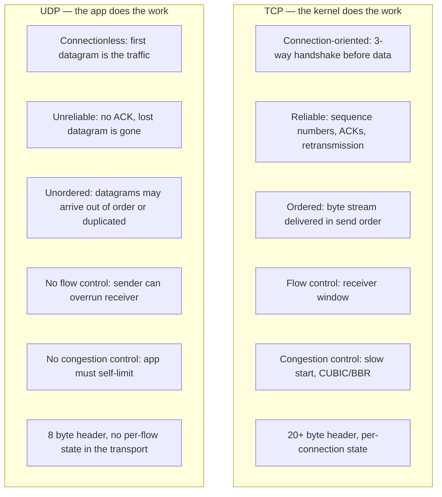
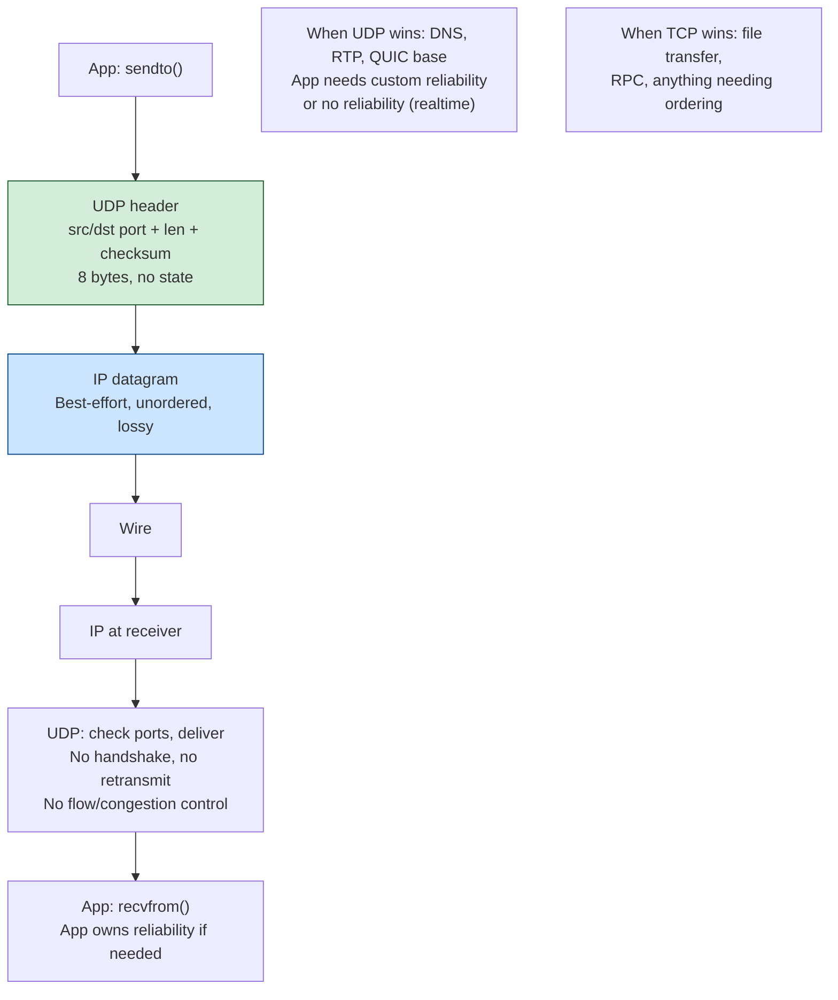
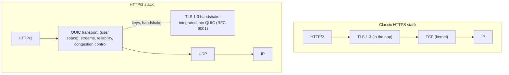
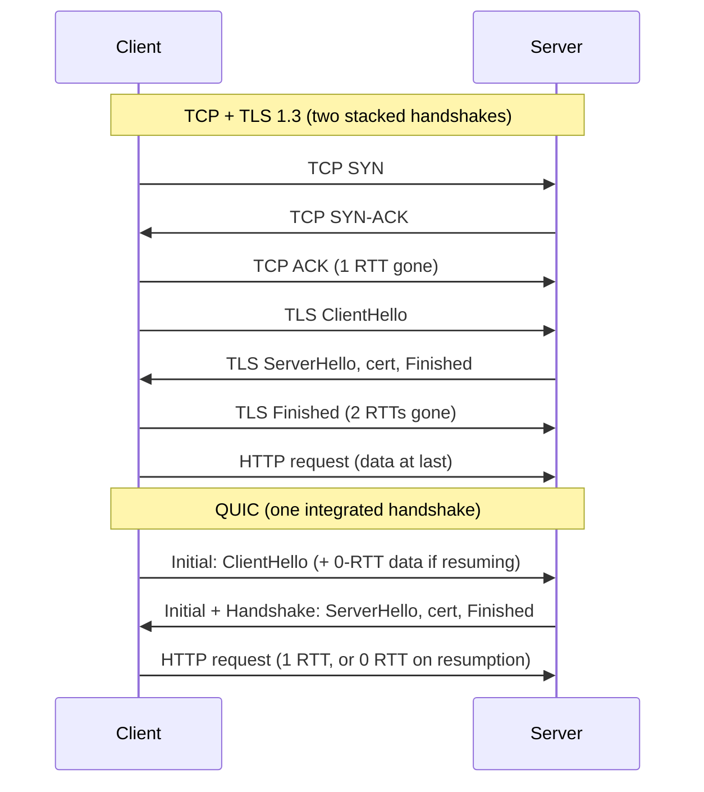
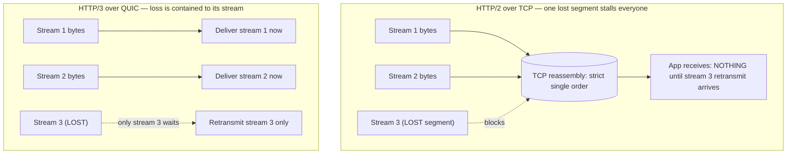
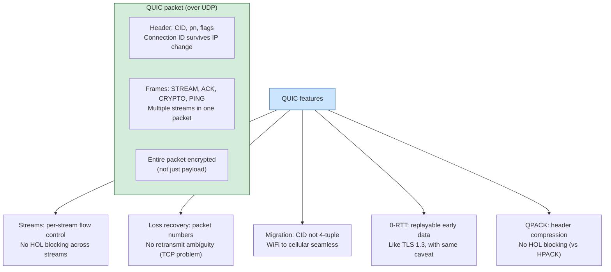
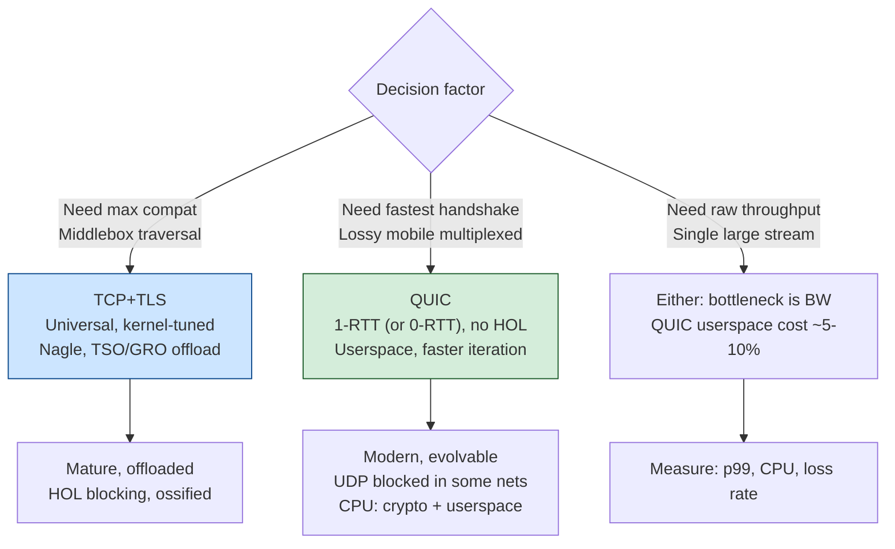

# Chapter 4 — UDP and QUIC

**What this chapter covers.** Chapter 3 (TCP in Depth) spent its length defending a thesis:
that TCP's reliability, ordering, and congestion control are worth their cost, and that most
of the time you should let the kernel do this work for you. This chapter argues the two
exceptions. The first is UDP — the transport that does almost nothing, and is chosen precisely
*because* it does almost nothing, so that the application can supply exactly the delivery
semantics it needs and not one byte more. The second, and the reason this chapter is long, is
QUIC: a full reliable, multiplexed, encrypted transport built *on top of* UDP, in user space,
that exists because TCP had become impossible to evolve. QUIC is not a niche protocol. It is
the transport under HTTP/3, it carries a large and growing fraction of all web traffic to
Google, Meta, Cloudflare, and the major CDNs, and it is the clearest working example in
production networking of a design principle you will meet again and again: when a layer
ossifies, you do not fix it in place — you move the function somewhere you still control. We
will treat UDP as prologue and QUIC as the main event, and we will insist on mechanism
throughout: not "QUIC has 0-RTT," but what packet, carrying what frame, protected by what key,
makes 0-RTT possible and what it costs you in replay safety.

Learning goals — after this chapter you should be able to:

- State exactly what UDP guarantees (integrity of a delivered datagram, port multiplexing) and
  what it does not (delivery, ordering, deduplication, flow control, congestion control), and
  choose UDP correctly for DNS, real-time media, gaming, and custom protocols.
- Reason about UDP datagram sizing, IP fragmentation, and why a UDP-based protocol must do its
  own path-MTU discovery and its own congestion control to be a good network citizen.
- Explain the UDP amplification/reflection attack mechanism and the specific defenses (BCP 38,
  response-rate limiting, QUIC's anti-amplification limit).
- Explain, in mechanism, the four problems that made TCP inevolvable — cross-stream head-of-line
  blocking, slow layered handshakes, middlebox ossification, and kernel-deployment latency — and
  how QUIC's design neutralizes each.
- Describe QUIC's integrated TLS 1.3 handshake, its stream model and per-stream reliability,
  connection IDs and connection migration, and user-space pluggable loss recovery and
  congestion control — and trace a 1-RTT and a 0-RTT connection setup.
- Compare QUIC against TCP+TLS honestly, including QUIC's real costs: UDP being blocked or
  deprioritized, and the CPU overhead of a user-space transport.
- Apply the distributed-systems lens: how 0-RTT and connection migration cut tail latency for
  mobile and edge clients, how per-stream reliability removes the HTTP/2-over-TCP HOL penalty,
  and why user-space transport mirrors kernel-bypass and shifts protocol evolution onto your
  own deploy cadence.

## UDP: the transport that gets out of the way

The User Datagram Protocol, specified in RFC 768 in 1980 in barely three pages, is the
minimal thing you can put on top of IP and still call a transport. It adds exactly two
capabilities to raw IP. First, **multiplexing**: a 16-bit source port and 16-bit destination
port let a host demultiplex an incoming datagram to the right socket, so many application
endpoints can share one IP address. Second, an **optional integrity check**: a 16-bit
checksum over the payload, the UDP header, and a pseudo-header drawn from the IP layer
(source and destination addresses, protocol number, length). Over IPv4 the checksum may be
disabled by sending zero; over IPv6 it is mandatory because IPv6 has no header checksum of
its own. That is the entire contract. The header is eight bytes — source port, destination
port, length, checksum, four 16-bit fields — against TCP's twenty-byte minimum.

Everything TCP does beyond addressing, UDP declines to do. There is no handshake: the first
UDP datagram you send *is* the connection, such as it is, and there is no shared state to
establish because there is no shared state at all. There is no sequence number, so datagrams
can be reordered, duplicated by the network, or silently dropped, and the receiver has no way
to know from UDP alone that anything is missing. There is no acknowledgment and no
retransmission — a lost datagram is simply gone. There is no flow control, so a fast sender
can overrun a slow receiver's socket buffer and the excess is dropped. And, most consequential
for the health of the Internet as a whole, there is **no congestion control**: UDP will emit
datagrams as fast as the application hands them over, with no built-in reaction to loss or
delay that signals a congested path.

This is not a deficiency to be apologized for. It is the point. TCP's guarantees are not free
— they cost a round trip to establish, they cost head-of-line blocking on loss, they cost the
latency of retransmitting data the application may no longer want by the time it arrives. An
application that does not need in-order reliable byte-stream semantics should not pay for them.
UDP is the substrate you reach for when you intend to supply your own delivery semantics,
tuned to the workload, at the application layer — including, as we will see, a complete
reliable transport when that is what you actually want.

### When UDP is the right answer

Four workload families choose UDP, and the reasons differ enough to be worth separating.

**Request/response where the request is a single small datagram and the application handles
retries.** DNS is the archetype (Chapter 5, DNS in Depth). A query and its answer each fit,
classically, in a single sub-512-byte datagram; the resolver sets a timeout and re-queries on
loss, often against a different server; and the amortized cost of a TCP handshake per lookup
would be absurd for a protocol invoked dozens of times per page load. DNS falls back to TCP
only when a response is too large for the negotiated UDP payload (EDNS0 buffer size) or when
the truncation bit forces it. The pattern generalizes: any idempotent, self-contained,
latency-sensitive request/response exchange where you would rather manage your own timeout and
retry than pay for connection setup is a UDP candidate.

**Real-time media, where stale data is worthless.** In a voice or video call, a packet that
arrives 300 ms late is not useful — the moment it describes has already been rendered as a
concealment or a freeze, and re-sending it would only delay everything behind it. TCP's
insistence on in-order delivery is actively harmful here: one lost packet stalls the stream
until the retransmission arrives, injecting exactly the jitter the codec is trying to hide.
RTP (RFC 3550) runs over UDP for precisely this reason and layers on its own sequence numbers
and timestamps so the receiver can reorder, detect loss, and drive jitter buffers and
concealment — reliability the application actually wants, without the reliability it does not.
WebRTC media, SIP-signaled telephony, and live streaming ingest all sit here.

**Interactive gaming and other tight control loops.** A multiplayer game sends frequent small
state updates — positions, inputs — where only the *latest* update matters. Reliable in-order
delivery of stale positions is worse than useless; the game would rather drop an old update and
apply the new one. Many game networking stacks build a thin reliability layer over UDP that is
selective: reliable-ordered for a chat message or an inventory change, unreliable for the
20-per-second position stream, all multiplexed on one UDP flow. QUIC's stream model, which we
reach shortly, is in part a generalization of exactly these hand-rolled layers.

**Custom and infrastructure protocols that want IP-with-ports and nothing else.** SNMP, NTP,
syslog, DHCP, VXLAN and Geneve tunnel encapsulation, QUIC itself — all ride UDP because they
want the multiplexing and the checksum and intend to supply (or deliberately omit) everything
else themselves. Tunneling is a telling case: VXLAN wraps L2 frames in UDP not because it
wants unreliability but because UDP's port field gives ECMP hashing something to spread flows
across, and because UDP passes through middleboxes and NAT that would choke on a raw custom
protocol number.

### The obligations UDP hands you

Choosing UDP means inheriting three responsibilities the kernel was handling for you.

**Sizing and fragmentation.** UDP itself imposes no size limit below the 65,535-byte ceiling
of its length field, but the moment your datagram exceeds the path MTU, the IP layer fragments
it. IP fragmentation is a trap for a datagram protocol: if any single fragment is lost, the
entire datagram is undeliverable and must be discarded, so a 4 KB UDP datagram over a 1500-byte
path is three fragments any one of which loses you the whole thing — and fragments are
disproportionately dropped by firewalls and stateless load balancers that cannot see the ports
in a non-first fragment. The discipline is to keep datagrams within the path MTU and to do
your own path-MTU discovery. This is why DNS historically capped UDP payloads near 512 bytes,
why EDNS0 lets endpoints negotiate a larger but still bounded buffer, and why QUIC requires the
datagrams carrying a client's first flight to be padded to at least 1,200 bytes (a conservative
floor almost every path can carry unfragmented) and performs Datagram PLPMTUD (RFC 8899) to
probe upward safely.

**Being a good citizen: congestion control.** This is the obligation engineers most often
neglect and the one with the widest blast radius. TCP's congestion control is not there to help
the individual connection; it is there to keep the shared network from collapsing when many
flows contend. A UDP application that blasts at line rate ignoring loss is a free rider that
starves every TCP flow sharing the bottleneck, and if enough traffic behaves this way the
network can enter congestion collapse — the pathology that motivated congestion control in the
first place. RFC 8085 (UDP Usage Guidelines, a BCP) is explicit: an application sending more
than trivial volume over UDP **must** implement congestion control, and should reuse a
proven algorithm rather than invent one. "The app handles reliability" is only half the deal;
the app must also handle *restraint*. QUIC takes this seriously — RFC 9002 specifies a full
congestion controller — precisely because a transport that did not would be a menace.

**Security: the amplification/reflection risk.** UDP has no handshake, so a server replies to
the source address in the datagram without ever confirming the sender is really there. Because
the source address in an IP packet can be forged (spoofed), an attacker sends a small query
with the *victim's* address as the source, and the server dutifully mails a large response to
the victim. When the response is much larger than the request, the attacker has an amplifier:
a few bytes of spoofed query become kilobytes aimed at the target, from a server that is not
even compromised. DNS (especially with large DNSSEC responses), NTP's `monlist`, memcached
exposed on UDP 11211, and SSDP have all been abused this way, memcached notoriously with
amplification factors in the tens of thousands. The defenses are layered: network operators
should deploy source-address validation (BCP 38 / RFC 2827) so spoofed packets never leave
the origin network; services should rate-limit responses (DNS Response Rate Limiting); and
protocols should design so that an unverified peer cannot elicit a large response. QUIC bakes
the last of these into the specification, as we will see — a server must not send more than
three times the bytes it has received from an as-yet-unvalidated client address. Keep this
mechanism in mind; it is a recurring theme in why QUIC's handshake is shaped the way it is.

## Why QUIC exists: TCP became inevolvable

Chapter 3 established TCP as a mature, well-tuned reliable transport. So why build a new one?
Not because TCP's algorithms are bad — QUIC reuses most of them — but because TCP as a
*deployed system* had reached a state where its remaining problems could not be fixed. Four
forces combined into an argument for moving the transport out of the kernel and onto UDP.

**Cross-stream head-of-line blocking.** TCP delivers a single, strictly ordered byte stream.
HTTP/2 (Chapter 7) multiplexes many logical request/response streams onto one TCP connection to
avoid the connection-per-request cost of HTTP/1.1. But TCP knows nothing about those streams;
it sees one byte sequence. If a single TCP segment is lost, TCP holds *all* subsequently
received bytes in its reassembly buffer until the retransmission arrives — because it must
deliver in order — which means a packet loss affecting stream 5 also stalls streams 1 through
4, even though their bytes have already arrived. HTTP/2 solved application-layer HOL blocking
(HTTP/1.1's one-at-a-time pipeline) only to inherit a worse *transport-layer* HOL blocking that
gets more painful as loss rises and as you multiplex more streams onto the one connection. You
cannot fix this above TCP; the ordering is TCP's, imposed on bytes it cannot tell apart.

**Handshake latency from layering.** A conventional HTTPS connection pays for two handshakes in
sequence: TCP's three-way handshake to establish the connection (one RTT before any data),
then the TLS handshake on top of it (one more RTT for TLS 1.3, two for TLS 1.2). The layers do
not know about each other, so their round trips stack. For a client far from the server — a
mobile user, an edge client hitting an origin — that is two or three RTTs of pure setup before
the first byte of a response, and on a 150 ms path that is most of what the user perceives as
"slow."

**Middlebox ossification.** TCP runs in the clear: sequence numbers, flags, options, and window
are all visible on the wire. Over three decades, firewalls, NATs, load balancers, and
"transparent" proxies came to inspect and depend on those fields, and worse, to *reject* what
they do not recognize. TCP Fast Open, which would let data ride the SYN, is dropped or mangled
by enough middleboxes to be unreliable in the wild. New TCP options are stripped. Even
deploying a new congestion-control behavior can trip a middlebox that second-guesses the
sender. The protocol calcified because its evolvable surfaces were exposed and something on the
path started depending on their current values — the phenomenon called ossification. The
lesson QUIC draws is blunt: **if it is visible, something will ossify it, so encrypt it.**

**Kernel-deployment latency.** TCP lives in the operating-system kernel. A change to TCP's loss
recovery or congestion control is a kernel change, which propagates at the speed of OS upgrades
across billions of devices and every intermediary — years, sometimes a decade, and on client
devices largely outside any single operator's control. Even a demonstrably better algorithm
cannot reach the traffic that would benefit from it on any useful timescale. The transport had
become un-iterable not only on the wire but in the deployment pipeline.

Put these together and the conclusion is structural. The fixes TCP needs are impossible *where
TCP lives.* So QUIC moves the transport: onto UDP (which middleboxes forward as an opaque
datagram), into user space (where an application ships a new version on its own release
cadence), and behind encryption (so the wire surface cannot ossify). QUIC is, in one sentence,
a reliable, ordered-per-stream, multiplexed, always-encrypted transport implemented in user
space on top of UDP, standardized by the IETF as **RFC 9000** (the core transport), **RFC 9001**
(TLS integration), **RFC 9002** (loss detection and congestion control), and **RFC 8999**
(version-independent properties), all published in **May 2021**, after Google deployed and
iterated its precursor "gQUIC" in Chrome and on its own servers through the mid-2010s.

## Inside QUIC

QUIC's cleverness is not any single feature but the way integration lets features reinforce
each other. We take them one at a time and then show how they compose.

### Integrated TLS 1.3: one handshake, not two

QUIC does not run TLS "on top of" itself the way HTTPS runs TLS on top of TCP. Instead it
embeds the TLS 1.3 handshake *inside* the transport handshake and uses TLS's key schedule to
protect QUIC's own packets. The full mechanics are Chapter 6 (TLS 1.3 and the Web PKI); here we
need the shape. QUIC carries the TLS handshake messages — ClientHello, ServerHello,
Certificate, Finished — inside special CRYPTO frames rather than in a TLS record layer, and it
feeds TLS's derived secrets back to protect QUIC packets. There is no separate TLS record
protocol; QUIC *is* the record protocol. The consequence is that the transport handshake and
the cryptographic handshake are the same round trip. Where TCP+TLS 1.3 spends one RTT on TCP
and then one RTT on TLS, QUIC establishes a connection *and* completes the TLS 1.3 key exchange
in **one RTT** total, because the ClientHello rides in the very first flight of packets. There
is no unencrypted QUIC connection; encryption is not layered on, it is constitutive.

Two further consequences matter. First, because there is no cleartext transport handshake,
QUIC has no "plaintext SYN" for a middlebox to inspect and ossify — the anti-ossification
property falls out of the integration for free. Second, QUIC uses **separate packet number
spaces** for the Initial, Handshake, and Application (1-RTT) phases, each protected with keys
of increasing strength as the handshake progresses, so that early packets sent under weak,
publicly derivable "Initial" keys cannot be confused with, or downgrade, the fully protected
application data.

**0-RTT.** When a client has talked to a server before, TLS 1.3 lets it cache a pre-shared key
(a session resumption ticket). On the *next* connection, the client can encrypt application
data with that key and send it in the very first flight — **0-RTT** — so the request reaches
the server without waiting even one round trip for the handshake to complete. For a repeat
visitor this is the difference between a request that starts immediately and one that waits
150 ms first. The catch, and it is a real one, is **replay**: 0-RTT data is not protected
against an attacker capturing the first flight and re-sending it, because the anti-replay
guarantees come from the handshake the 0-RTT data is trying to skip. So 0-RTT is safe only for
*idempotent* operations — a GET, not a "transfer money" POST — and the specifications (RFC 9001,
and RFC 8446 for TLS generally) require that applications gate what they permit in 0-RTT.
Servers also enforce anti-replay defenses, but the durable rule for the application engineer is:
**never carry a non-idempotent request in 0-RTT.**

### Streams: reliability without cross-stream head-of-line blocking

This is the feature HTTP/3 was built to get. A QUIC connection carries many independent
**streams**, each an ordered, reliable byte sequence, identified by a stream ID. Streams are
cheap: they are created implicitly by sending data with a new ID, and QUIC distinguishes
client- vs server-initiated and bidirectional vs unidirectional streams by the low bits of the
ID. Application data travels in **STREAM frames**, each tagging its bytes with a stream ID and
an offset within that stream. Crucially, **many frames for many streams are packed into one
QUIC packet, which is one UDP datagram** — the multiplexing is inside QUIC, invisible to UDP
and to the network.

Now the payoff. Reliability and ordering in QUIC are **per stream**, not per connection. QUIC
acknowledges *packets* (via ACK frames that reference packet numbers) for loss detection, but
it *delivers* stream data in order **within each stream independently**. If a packet carrying
STREAM frames for stream 5 is lost, QUIC retransmits that stream data — but streams 1 through 4,
whose bytes arrived in other packets, are delivered to the application immediately. There is no
cross-stream blocking, because QUIC understands the stream boundaries that TCP could not see.
This is the exact defect from the "why QUIC exists" section, resolved: HTTP/2's transport-layer
HOL blocking existed because TCP imposed one order on all streams; HTTP/3 over QUIC eliminates
it because QUIC imposes order only within each stream. Under loss — mobile networks, congested
paths, long fat pipes — the difference is large and grows with the loss rate and the number of
concurrent streams.

QUIC also has flow control at two levels — **per-stream** limits (how much data may be
outstanding on one stream) and a **connection-level** limit (aggregate across all streams) —
advertised and raised with MAX_STREAM_DATA and MAX_DATA frames, plus MAX_STREAMS to bound how
many streams a peer may open. This mirrors TCP's receive window but is finer-grained: a single
stalled stream cannot consume the whole connection's buffer budget and starve the others.

One honest caveat: QUIC removes *transport* HOL blocking, not all HOL blocking. Within a single
stream, order is still enforced, so a loss affecting one stream still stalls that stream. And
HTTP/3's header compression (QPACK, RFC 9204) reintroduces a bounded, carefully designed form of
cross-stream dependency that its authors worked hard to keep from re-creating HOL blocking. The
transport-level win is real and central; it is not a claim that ordering ever comes for free.

### Connection IDs and connection migration

A TCP connection is identified by its four-tuple: source IP, source port, destination IP,
destination port. Change any element and it is, definitionally, a different connection — which
is why your phone dropping from Wi-Fi to cellular tears down every TCP connection, because the
source IP changed. For a long-lived download or a video call on a mobile device, this means
re-handshaking (TCP + TLS again) on every network transition, precisely when the user is moving
and latency is already bad.

QUIC breaks the identity free of the address. Each endpoint labels the connection with one or
more **Connection IDs** (CIDs) that it chooses and asks the peer to use as the destination
label on packets. A packet is matched to its connection by its CID, *not* by its four-tuple. So
when the client's IP and port change — Wi-Fi to LTE, or a NAT rebinding after an idle period —
the packets still carry the same Connection ID, and the server recognizes them as the same
connection and continues without a new handshake. This is **connection migration**, and it is
the feature that makes QUIC feel qualitatively different on mobile: a download survives the
elevator, the video call survives walking out of Wi-Fi range.

Migration is designed carefully against abuse, and the design connects back to the UDP
amplification problem. An attacker could otherwise migrate a connection to a victim's address to
redirect a flood, so when a peer sees packets arriving from a new address it must perform
**path validation** — send a PATH_CHALLENGE frame with an unpredictable payload and require a
matching PATH_RESPONSE — before treating the new path as usable at full rate, and it applies the
same anti-amplification limit (send no more than three times what has been received from the
unvalidated path) until validation succeeds. Endpoints also rotate CIDs (issuing new ones with
NEW_CONNECTION_ID frames and retiring old ones) so that a passive observer cannot trivially link
a user's pre-migration and post-migration flows by a stable CID — a genuine, if partial, privacy
improvement over the permanently correlatable TCP four-tuple.

### User-space, pluggable loss recovery and congestion control

QUIC's loss detection and congestion control (RFC 9002) are conceptually close to modern TCP —
the recommended default behaves like NewReno, and implementations routinely run CUBIC or BBR —
but three design choices make them evolve on a different timescale.

First, QUIC **acknowledges packet numbers that never decrease and never repeat.** TCP's ACKs
reference byte sequence numbers, and a retransmitted segment reuses its original sequence
number, creating the classic *retransmission ambiguity*: when an ACK arrives, TCP cannot always
tell whether it acknowledges the original transmission or the retransmit, which muddies RTT
estimation and loss detection. QUIC assigns every packet — including retransmissions of the same
data — a fresh, monotonically increasing packet number, so an ACK is never ambiguous about
which transmission it covers. The stream data is retransmitted (in new STREAM frames, in a new
packet, with a new packet number), while the packet number cleanly identifies the transmission
event. This gives much crisper RTT samples and loss inference than TCP can achieve.

Second, QUIC's ACK frames carry **many acknowledgment ranges** and an explicit **ack delay**,
richer than TCP's cumulative ACK plus the bolt-on SACK option, and — being inside the encrypted
payload — immune to the middleboxes that strip or rewrite TCP options.

Third, and most important structurally, all of this lives **in user-space library code that
ships with the application.** When Google, Meta, or Cloudflare wants to deploy a new congestion
controller or a loss-recovery tweak, they update their QUIC library and roll it out on their
normal release cadence — days to weeks — to both ends they control, rather than waiting for
kernel upgrades across the fleet and the Internet. Congestion control becomes a product feature
you iterate, not a kernel constant you inherit. This is the deployment-velocity argument from
earlier, made concrete.

### Encrypted headers and the wire image

QUIC protects almost the entire packet, not just the payload. It defines a **long header** (used
during the handshake, carrying the version, and the source and destination Connection IDs, all
necessarily visible because a router or load balancer needs them to route Initial packets) and a
**short header** (used after the handshake for 1-RTT data, exposing essentially only the
destination Connection ID and a few bits). Even the packet numbers are encrypted, via
**header protection** derived from the handshake keys. The **only** fields a passive observer
can reliably read are the ones QUIC deliberately leaves in the clear because the network
genuinely needs them: the Connection ID (so stateless load balancers can route packets of one
connection to the same backend) and, optionally, a single **spin bit** that endpoints may toggle
once per RTT so operators can passively estimate round-trip time. That spin bit is worth
noticing: QUIC's designers gave the network *exactly one* deliberately exposed signal precisely
so that operators would not have an excuse to inspect anything else, and so that whatever the
network learns to depend on is a field the protocol chose to expose and can reason about. The
governing principle is stated in RFC 9000's companion documents as protecting the "wire image":
minimize what is observable so that only what is intended to be extensible remains extensible,
and ossification has nothing to grip.

## QUIC versus TCP+TLS: an honest comparison

QUIC is not free lunch, and a senior engineer should be able to argue both sides.

| Dimension | TCP + TLS 1.3 | QUIC |
|---|---|---|
| Where implemented | Kernel (TCP) + userspace (TLS) | Entirely userspace, over UDP |
| Handshake to first byte | 2 RTT (1 TCP + 1 TLS), 0-RTT possible via TFO (fragile) | 1 RTT, 0-RTT on resumption |
| Multiplexing HOL blocking | Cross-stream: one loss stalls all H2 streams | Per-stream: loss contained to its stream |
| Survives IP/port change | No — four-tuple identity | Yes — Connection ID + migration |
| Header/metadata exposure | Seq, flags, options, window in cleartext | Almost all encrypted; CID + optional spin bit exposed |
| Congestion control evolution | Kernel cadence (years) | App release cadence (weeks) |
| Middlebox compatibility | Universally forwarded; TFO/new options ossified | UDP sometimes blocked/deprioritized |
| CPU cost per byte | Low; hardware offload (TSO/GRO, kTLS, NIC crypto) mature | Higher; per-packet userspace work, offload still maturing |
| Ecosystem tooling | Decades of `tcpdump`, `ss`, kernel counters | Newer; needs keylog to decrypt, less kernel visibility |

Two of QUIC's costs deserve emphasis because they are the ones that bite in production.

**UDP is sometimes blocked or deprioritized.** Because UDP has historically carried mostly DNS
and attack traffic, some enterprise firewalls and captive networks block or heavily rate-limit
UDP on port 443, and some paths simply give UDP worse queuing than TCP. Real QUIC deployments
therefore treat it as an *optimization with a fallback*: HTTP/3 is advertised via the HTTP
`Alt-Svc` header (or the HTTPS DNS record), the browser tries QUIC, and if UDP fails or is too
slow it falls back to HTTP/2 over TCP. You get QUIC's benefits where the path allows and lose
nothing where it does not — but you now maintain and test *both* stacks.

**A user-space transport costs CPU.** In the kernel, TCP benefits from decades of offload:
segmentation offload (TSO/GRO) lets the NIC and kernel amortize per-packet work across large
buffers, and kTLS pushes record encryption toward hardware. QUIC, doing per-packet framing,
encryption (including header protection), and ACK processing in user space, historically spent
noticeably more CPU per byte than TCP+TLS. That gap is closing — UDP generic segmentation
offload (GSO) and generic receive offload let QUIC stacks batch datagrams, and NIC-level QUIC
offload is emerging — but at very high throughput on a busy server the CPU difference is a real
line item, which is one reason large operators run QUIC at the edge (where per-connection
latency wins dominate) while intra-datacenter east-west traffic often stays on TCP or plain
HTTP/2, where RTTs are already sub-millisecond and the migration/0-RTT benefits do not apply.

QUIC's default deployment surface is **HTTP/3** (RFC 9114), which maps HTTP semantics onto QUIC
streams — one bidirectional stream per request/response, unidirectional streams for control and
QPACK — and is the subject of Chapter 7 (HTTP/1.1, HTTP/2, and HTTP/3). But QUIC is a general
transport: it also carries DNS-over-QUIC (RFC 9250), it gains an unreliable-datagram service via
the DATAGRAM extension (RFC 9221) — on which the MASQUE proxying protocols (CONNECT-UDP, RFC 9298)
tunnel other traffic — and it is increasingly a substrate people reach for whenever they want
"TCP but evolvable and encrypted." The DATAGRAM extension is a nice closing of the circle: QUIC, itself
built on UDP to escape TCP, hands the application back an *unreliable* datagram service — UDP
semantics — but now inside an authenticated, congestion-controlled, migratable connection.

## The distributed-systems lens

Zoom out from the packet to the fleet, and QUIC's design choices line up with the structural
concerns of large-scale backend systems in ways that are worth naming explicitly.

**Tail latency at the edge and on mobile.** For a global service fronted by a CDN (Chapter 10,
Proxies, Reverse Proxies, Service Mesh, and CDNs), the dominant latency term for a client far
from an origin is round trips, and the dominant *pain* is the tail — the p99 user on a bad
mobile path. QUIC attacks exactly the tail. 0-RTT resumption removes a full RTT from every
repeat connection, which for a returning mobile user on a 200 ms path is a visible chunk of page
load. Connection migration removes the catastrophic re-handshake spike that a network transition
imposes on TCP, converting a multi-hundred-millisecond stall into a seamless continuation.
Per-stream reliability caps how bad a single loss can make things: on a 2% loss path with a
dozen multiplexed streams, HTTP/2-over-TCP degrades sharply because every loss stalls every
stream, while HTTP/3 degrades gracefully because loss is contained. These are not average-case
wins — they are tail-case wins, and the tail is what SLOs and user perception are made of.
This is why CDNs turned QUIC on first: they own the edge where far-from-origin, high-loss,
mobile clients live, and that is where the design pays.

**Per-stream reliability as the fix for a self-inflicted wound.** It is worth being precise about
what HTTP/3 buys, because it is easy to overclaim. HTTP/1.1 had application-layer HOL blocking
(one request per connection at a time). HTTP/2 fixed that by multiplexing over one TCP
connection — and thereby created a *new* transport-layer HOL blocking, because it concentrated
many streams onto one ordered byte stream. HTTP/3 over QUIC is the move that finally resolves
the tension HTTP/2 introduced: multiplex like H2, but over a transport that understands streams
so a loss does not couple them. If you remember one causal chain from this chapter, make it that
one — it explains why the industry did not simply stop at HTTP/2.

**User-space transport is the same idea as kernel bypass.** Volume 2, Chapter 10 (The Linux
Network Stack, and kernel bypass with DPDK/AF_XDP) covered moving packet processing *out of the
kernel* to escape its overhead and its release cadence for the highest-performance datapaths.
QUIC is that same instinct applied not to raw throughput but to *protocol evolvability*: put the
transport where you can change it. The two are cousins. Kernel bypass moves the datapath to user
space for speed; QUIC moves the transport to user space for agility. Both accept that the kernel,
for all its virtues, is a shared, slow-moving resource, and both conclude that when you need to
own the pace of change, you take the function into a component you deploy yourself. The general
principle — **push a function to the layer whose deploy cadence you control** — recurs across the
whole curriculum, from sidecars to feature flags to, here, the transport itself.

**Evolution moves onto your release train — with its costs.** Once congestion control and loss
recovery are library code, improving them is a software-deploy problem, not an
Internet-upgrade problem. That is a genuine and large win: Google could roll BBR experiments
across its QUIC traffic and measure them in production in a way no one can do to kernel TCP at
Internet scale. But there is a flip side the lens must include. You are now responsible for a
transport you used to get from the OS: its correctness, its security patches, its interop
testing against every other implementation, its CPU budget. And because QUIC needs a TCP
fallback for the paths that block UDP, you operate *two* transports, not one, and must keep both
correct and observant. The tooling is younger, too — you cannot read a QUIC connection with
`tcpdump` the way you read TCP, because it is encrypted; debugging requires the endpoint to
export TLS keying material (an `SSLKEYLOGFILE`) and tools like `qlog`/`qvis` that consume
QUIC's structured logging. Observability, covered in Chapter 12 (Debugging and Observing
Networks), is harder for an encrypted user-space transport than for cleartext kernel TCP, and
that is part of the cost of the agility.

**The UDP citizenship lesson generalizes.** The very first obligation UDP handed us — implement
congestion control or be a menace — is not a QUIC-specific footnote; it is the rule for any
service that speaks a custom protocol over UDP inside your own infrastructure. Teams that build
bespoke UDP-based telemetry firehoses, replication streams, or RPC layers routinely rediscover
congestion collapse the hard way when the firehose and the production traffic share a link. If
you find yourself reaching past TCP and past QUIC to raw UDP for an internal system, the
question to answer before you ship is not "how do I retransmit?" but "how do I back off when the
path is congested?" — and the honest answer is usually "reuse QUIC, or a library that already
implements RFC 9002, rather than hand-roll it."

## Key takeaways

- **UDP adds only ports and an optional checksum to IP.** No handshake, no reliability, no
  ordering, no flow control, no congestion control. That minimalism is the feature: you choose
  UDP to supply exactly the delivery semantics your workload needs — DNS, real-time media,
  gaming, tunnels, and custom protocols.
- **Choosing UDP means inheriting obligations.** Keep datagrams within the path MTU to avoid the
  IP-fragmentation trap; implement congestion control (RFC 8085 requires it) so you are not a
  free rider that causes collapse; and design against reflection/amplification, which spoofed
  source addresses make possible whenever a small request elicits a large response.
- **QUIC exists because TCP became inevolvable**, on four fronts at once: cross-stream
  head-of-line blocking, stacked handshake latency, middlebox ossification of its cleartext wire
  image, and kernel-cadence deployment. The structural fix was to move the transport onto UDP,
  into user space, behind encryption.
- **QUIC integrates TLS 1.3 into the transport handshake**, achieving connection setup plus key
  exchange in one RTT, and 0-RTT on resumption — usable only for idempotent requests because
  0-RTT data is replayable.
- **QUIC's streams give per-stream reliability and ordering**, so a lost packet stalls only its
  own stream. This is the core reason HTTP/3 over QUIC removes the transport HOL blocking that
  HTTP/2 over TCP suffers.
- **Connection IDs decouple a connection from its IP/port four-tuple**, enabling connection
  migration so QUIC connections survive Wi-Fi-to-cellular handoffs and NAT rebinding — a decisive
  mobile advantage — with path validation guarding against misuse.
- **QUIC's loss recovery and congestion control live in user space** and use monotonic packet
  numbers to kill retransmission ambiguity, so they evolve on a software-release cadence and can
  be iterated in production.
- **QUIC's costs are real:** UDP is sometimes blocked (so you keep a TCP/HTTP-2 fallback), a
  user-space transport spends more CPU per byte (offload is still maturing), and its encrypted
  wire image makes it harder to observe. Standardized as RFC 9000/9001/9002/8999 in May 2021,
  it is the transport for HTTP/3 (RFC 9114) and increasingly a general-purpose evolvable
  transport.

## Further reading

- RFC 768, *User Datagram Protocol* (1980) — three pages; the entire UDP contract.
- RFC 8085, *UDP Usage Guidelines* (BCP 145) — the authoritative statement of a UDP
  application's obligations, especially congestion control and datagram sizing.
- RFC 9000, *QUIC: A UDP-Based Multiplexed and Secure Transport* (May 2021) — the core
  transport specification; streams, connection IDs, flow control, migration, frames.
- RFC 9001, *Using TLS to Secure QUIC* — how the TLS 1.3 handshake is embedded and how QUIC
  packets are protected, including the packet-number spaces and 0-RTT.
- RFC 9002, *QUIC Loss Detection and Congestion Control* — the recommended loss recovery and
  congestion control, and the reasoning behind monotonic packet numbers.
- RFC 8999, *Version-Independent Properties of QUIC* — the small invariant set that must hold
  across QUIC versions, which is what the network is permitted to depend on.
- RFC 9114, *HTTP/3*, and RFC 9204, *QPACK: Field Compression for HTTP/3* — how HTTP maps onto
  QUIC streams and how header compression avoids re-introducing HOL blocking.
- RFC 9221, *An Unreliable Datagram Extension to QUIC*, and RFC 9250, *DNS over Dedicated QUIC
  Connections* — two illustrative non-HTTP uses of QUIC.
- RFC 8899, *Packetization Layer Path MTU Discovery for Datagram Transports* — the safe
  path-MTU probing QUIC (and other UDP protocols) uses instead of relying on ICMP.
- RFC 2827 / BCP 38, *Network Ingress Filtering* — source-address validation, the network-side
  defense against the spoofing that enables UDP amplification.
- Langley et al., *The QUIC Transport Protocol: Design and Internet-Scale Deployment*,
  SIGCOMM 2017 — Google's account of gQUIC's motivation and its measured production results;
  the empirical case that became IETF QUIC.
- Robin Marx's *qlog* schema (an IETF standardization effort, `draft-ietf-quic-qlog-*`) and the
  *qvis* visualization toolset — the structured logging and visualization used to actually debug
  QUIC in practice; see also Chapter 12 (Debugging and Observing Networks) in this volume.
- Cloudflare's `quiche`, Google's Chromium QUIC, Meta's `mvfst`, and Microsoft's `msquic` —
  four production, open-source QUIC implementations whose source and design docs are the best way
  to see the RFCs realized in code.
