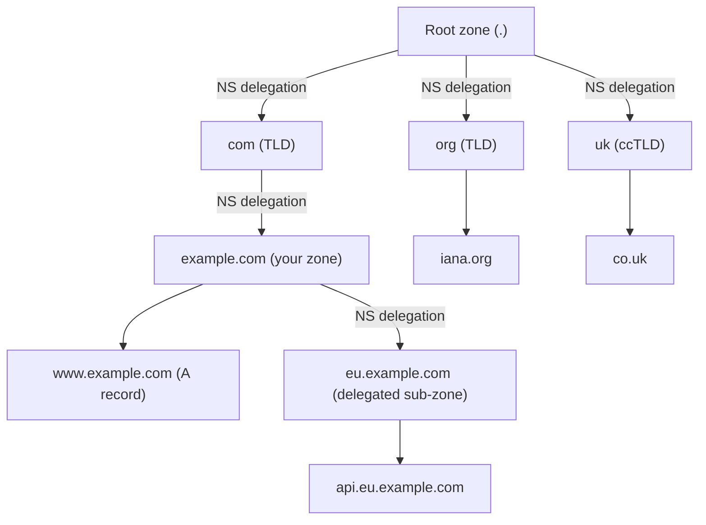
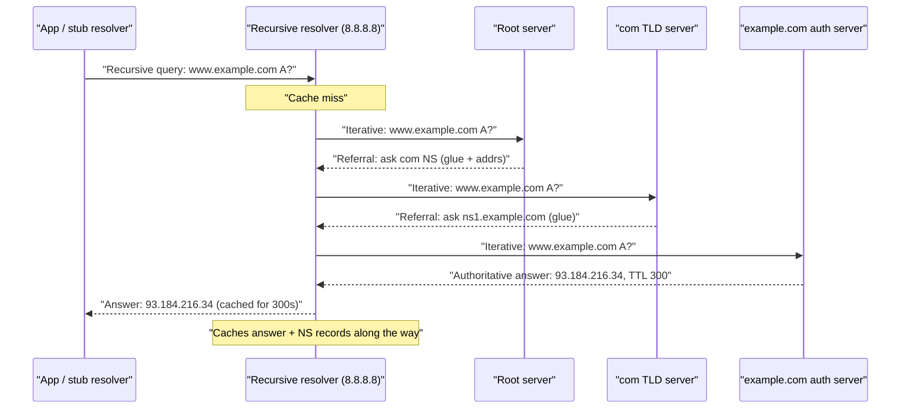
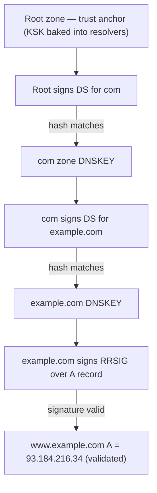
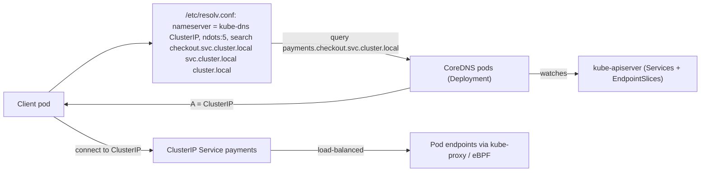
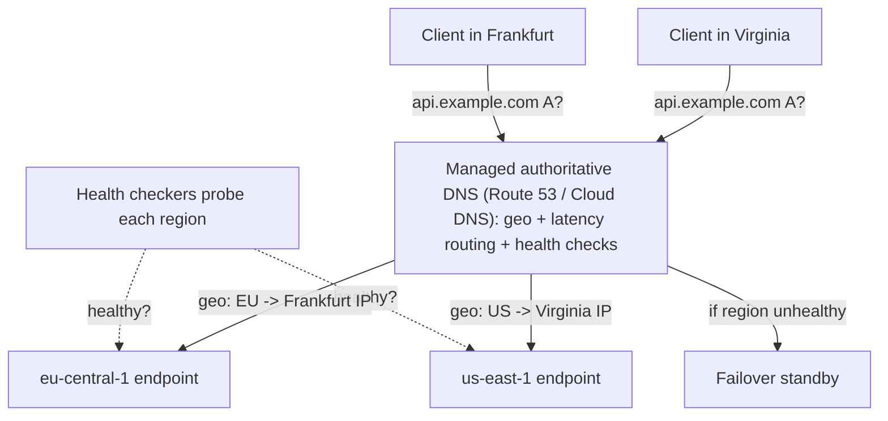

# Chapter 5 — DNS in Depth

**What this chapter covers.** Every request in your fleet begins with a name, not an address.
Before a client opens the TCP connection Chapter 3 described, before IP routing (Chapter 2)
can steer a packet toward a destination, before QUIC (Chapter 4) can complete a 0-RTT
handshake, something must turn `api.internal.example.com` into an IP address — and that
something is the Domain Name System. DNS is easy to dismiss as plumbing: a lookup, a cache,
a config file you edit once. It is not plumbing. It is a globally distributed, hierarchical,
eventually-consistent database whose consistency model, caching behavior, and failure modes
directly determine how fast your service can fail over between regions, how a Kubernetes pod
finds another service, how a request from Frankfurt reaches the nearest healthy datacenter,
and — when it breaks — why your entire product is down even though every server is healthy.
Backend engineers who treat DNS as opaque get burned by it repeatedly: by a client that
cached a dead IP for hours, by a `ndots` setting that quadrupled their lookup latency, by a
TTL that made a failover take twenty minutes instead of thirty seconds, by a single resolver
outage that took the whole company offline. This chapter treats DNS as what it actually is —
distributed systems infrastructure — and insists on mechanism throughout: not "DNS resolves
names," but which resolver asks which server, in what order, over what transport, protected by
what signature, cached for how long, and what precisely goes wrong at fleet scale.

Learning goals — after this chapter you should be able to:

- Describe the DNS namespace as a delegated tree (root, TLD, authoritative zones) and explain
  what delegation is at the record level (NS records and glue), not just as a concept.
- Trace a full resolution — stub resolver to recursive resolver to root to TLD to
  authoritative — and distinguish recursive from iterative queries and who does which.
- Choose the right record type for a job (A, AAAA, CNAME, MX, TXT, NS, SOA, SRV, PTR, CAA),
  and explain the CNAME-at-apex problem and the ALIAS/ANAME workaround managed providers use.
- Reason quantitatively about TTLs and caching — positive and negative (NXDOMAIN) caching —
  and the fundamental trade-off between failover agility and cache efficiency.
- Explain the DNS transport (UDP/53, TCP fallback, EDNS0, the 512-byte legacy limit) and why
  message size matters for DNSSEC and large responses.
- Explain cache poisoning and the Kaminsky attack, how DNSSEC's chain of trust provides origin
  authentication, and how DoT and DoH provide transport privacy — and the limits of each.
- Apply DNS to real backend problems: Kubernetes/CoreDNS service discovery and the `ndots`
  latency trap, DNS-based load balancing and health-checked failover, geo/latency routing via
  managed DNS, anycast DNS, and the client-side DNS-caching pitfalls (the JVM TTL gotcha).

## What DNS actually is: a delegated, hierarchical, cached database

Strip away the folklore and DNS is a distributed key-value database. The keys are
`(name, class, type)` tuples — `www.example.com`, class `IN` (Internet), type `A` — and the
values are resource records. What makes it interesting is not the data model, which is
trivial, but the way authority over the keyspace is partitioned and the way answers are
cached. No single server holds the whole database; no single organization operates it. Instead
the namespace is a tree, and authority over each subtree is *delegated* downward from its
parent. The operator of `.com` does not know or store the address of your web server. They
store a pointer — "for anything under `example.com`, go ask these name servers" — and nothing
more. This delegation is the entire architecture. It is why DNS scales to hundreds of millions
of domains without a central bottleneck, why ICANN can run the root without knowing anything
about your infrastructure, and why you can change your web server's IP without asking anyone's
permission: you control your zone, and the delegation to it is stable.

The tree is read right-to-left. A fully qualified domain name like `api.eu.example.com.` — note
the trailing dot, which denotes the root and which is usually implicit — is a path from the
root through a series of labels: the root (the empty label after the final dot), the top-level
domain `com`, the second-level domain `example`, and so on down to the leaf `api`. Each label
is at most 63 octets; the whole name is at most 255 octets. Case is preserved but comparisons
are case-insensitive for ASCII.



The unit of administrative control is the **zone**, not the domain. A zone is a contiguous
portion of the tree under single authority, bounded below by delegations to child zones. The
`example.com` zone contains `www.example.com` and `mail.example.com` directly, but if you
delegate `eu.example.com` to a different set of name servers — perhaps run by a regional team —
then `eu.example.com` becomes a separate zone with its own authority, and the parent zone holds
only the delegation. This is a real operational lever: teams can own their subtrees
independently, and a compromise or misconfiguration in one zone is contained.

Authority is not a single server. Every zone must have at least two **authoritative name
servers** (in practice more, on diverse networks) that hold the definitive copy of the zone's
records. One is the primary (historically "master"), which holds the editable copy; the others
are secondaries ("slaves") that pull the zone via zone transfer. To the outside world they are
equal — a resolver may ask any of them and must get the same authoritative answer. This
replication is what makes DNS survive the loss of individual servers, and it is why a zone's
NS set is deliberately spread across providers and network paths.

## The resolution flow: who asks whom, and in what order

When your application calls `getaddrinfo("www.example.com", ...)`, an enormous amount of
machinery engages, and understanding its division of labor is what separates engineers who can
debug DNS from those who can only restart things. There are two kinds of resolver and two kinds
of query, and confusing them is the most common conceptual error.

The **stub resolver** is the thin client library inside your process (glibc's resolver,
`systemd-resolved`, Go's built-in resolver, the JVM's `InetAddress`). It does almost nothing
itself. It reads `/etc/resolv.conf` (or its platform equivalent), finds the IP of a configured
**recursive resolver**, and sends it a single **recursive query**: "give me the final answer for
`www.example.com` A — do the work, I'll wait." The stub is not equipped to walk the tree; it
delegates the whole job.

The **recursive resolver** (your ISP's resolver, `8.8.8.8`, `1.1.1.1`, your corporate resolver,
or CoreDNS in a cluster) does the actual walking. If the answer is not in its cache, it performs
a series of **iterative queries** against the authoritative hierarchy. "Iterative" means each
authoritative server it asks does *not* do the work on its behalf; it returns either the answer
or a referral — "I don't have that, but here are the name servers for the next level down, go
ask them." The recursive resolver follows the referrals itself, starting at the root.



Two subtleties matter for real systems. First, the recursive resolver rarely starts from the
root in practice, because it caches aggressively at every level. Having resolved anything under
`.com` recently, it has the `.com` NS records cached and skips the root. Having resolved
anything under `example.com`, it has your authoritative NS records cached and skips both root
and TLD. In a busy resolver, the vast majority of queries are answered from cache with zero
upstream traffic; the full five-hop walk is the cold-cache worst case. The root is protected by
this caching plus anycast (more below) — it handles a firehose of queries precisely because most
resolvers ask it rarely.

Second, **glue records**. When `.com` refers you to `ns1.example.com` as the authoritative
server for `example.com`, you have a chicken-and-egg problem: to ask `ns1.example.com` you need
its IP, but `ns1.example.com` lives inside the very zone you're trying to resolve. The `.com`
zone solves this by including the A/AAAA records for `ns1.example.com` directly in the referral
as **glue** — non-authoritative address hints supplied by the parent so resolution can proceed.
This is why, when you register a domain whose name servers are within the domain itself, your
registrar makes you register the name server host records ("host objects" / glue) separately.

The 13 named root servers (`a.root-servers.net` through `m.root-servers.net`) are not 13
machines. Each is an anycast constellation of hundreds of instances worldwide, all advertising
the same IP, so a resolver's query to `198.41.0.4` is routed by BGP (Chapter 2) to the
topologically nearest instance. We return to anycast at the end of the chapter; for now, note
that the root is a distributed system in exactly the sense this book cares about.

## Record types: the vocabulary of the database

The value side of the DNS database is a resource record, and choosing the right type — and
understanding a few sharp edges — is bread-and-butter backend work.

**A and AAAA** are the base case: `A` maps a name to a 32-bit IPv4 address, `AAAA` to a
128-bit IPv6 address. A single name may have several of each; returning multiple A records is
the oldest and crudest form of load balancing (see below).

**CNAME** (canonical name) is an alias: it says "this name is really that name; go resolve
*that* one and use its records." `www.example.com CNAME example.com` means a lookup for `www`
follows the pointer to `example.com` and returns its A record. CNAMEs are convenient — you point
`www`, `app`, and `cdn` all at one canonical target and change the target's address in one place
— but they carry a rule that trips up nearly everyone: **a name that has a CNAME may have no
other records of any type.** The CNAME must be alone. This is not arbitrary; the CNAME means
"everything about this name is defined elsewhere," so you cannot also attach an MX or TXT to it.


**MX** (mail exchanger) records list, with priority values, the hosts that accept mail for a
domain; lower priority is preferred. **NS** records name the authoritative servers for a zone
and appear both at the zone apex (authoritative) and in the parent as the delegation.

**SOA** (start of authority) is the one-per-zone record carrying the zone's administrative
parameters: the primary name server, the responsible party's email (with `@` written as a dot),
a **serial number** that secondaries compare to decide whether to re-transfer, and the timers —
refresh, retry, expire, and the **negative-caching TTL** (the "minimum" field, repurposed by
RFC 2308) that governs how long NXDOMAIN answers are cached.

**TXT** records hold arbitrary text and have become the universal extension point: SPF, DKIM,
and DMARC email-authentication policies, ACME/Let's Encrypt domain-control challenges
(`_acme-challenge.example.com`), and countless "prove you own this domain" verifications all
ride on TXT.

**SRV** (service) records were DNS's first real answer to service discovery, and they matter
because Kubernetes and Consul use them. An SRV record for
`_service._proto.name` — e.g. `_sip._tcp.example.com` — returns priority, weight, **port**, and
target host. Crucially SRV carries the port, so a client can discover both *where* and *on
which port* a service runs, which plain A records cannot express.

**PTR** records provide **reverse DNS**: mapping an IP back to a name. They live in the special
`in-addr.arpa` (IPv4) and `ip6.arpa` (IPv6) trees, with the address written backward — the PTR
for `93.184.216.34` is `34.216.184.93.in-addr.arpa`. Reverse DNS matters operationally: mail
servers reject senders whose IP has no matching forward-and-reverse (FCrDNS) record, and logs,
traceroutes, and audit systems rely on it. Note the asymmetry — forward and reverse are separate
zones, often under different authority (your cloud provider usually controls the reverse zone
for their address space), so they can and do disagree.

**CAA** (certification authority authorization) records let a domain declare which certificate
authorities are permitted to issue certs for it. `example.com CAA 0 issue "letsencrypt.org"`
tells every compliant CA except Let's Encrypt to refuse issuance. CAA checking has been
mandatory for public CAs since 2017, and it is a cheap, high-leverage control against
mis-issuance — worth setting for any domain you care about.

```
; A / AAAA
www.example.com.        300  IN  A       93.184.216.34
www.example.com.        300  IN  AAAA    2606:2800:220:1:248:1893:25c8:1946

; CNAME (alias) — note: cannot coexist with other records at this name
cdn.example.com.        300  IN  CNAME   d111abcdef8.cloudfront.net.

; MX (mail routing, lower priority preferred)
example.com.            3600 IN  MX      10 mail1.example.com.
example.com.            3600 IN  MX      20 mail2.example.com.

; NS + SOA at the apex
example.com.            86400 IN NS      ns1.example.com.
example.com.            86400 IN NS      ns2.example.com.
example.com.            3600 IN  SOA     ns1.example.com. hostmaster.example.com. (
                                          2026080201 ; serial (YYYYMMDDnn)
                                          7200       ; refresh
                                          3600       ; retry
                                          1209600    ; expire (2 weeks)
                                          300 )      ; negative-cache TTL

; SRV (service discovery: priority weight port target)
_grpc._tcp.example.com. 60   IN  SRV     10 60 50051 api1.example.com.

; TXT (SPF, ACME challenge, verifications)
example.com.            3600 IN  TXT     "v=spf1 include:_spf.google.com ~all"

; CAA (restrict certificate issuance)
example.com.            3600 IN  CAA     0 issue "letsencrypt.org"

; PTR (reverse) lives in a separate zone
34.216.184.93.in-addr.arpa. 3600 IN PTR www.example.com.
```

## Caching and TTL: the knob that trades agility for scale

DNS works at planetary scale for one reason: caching. Every record carries a **TTL** (time to
live) in seconds, set by the zone's authoritative operator — that is, by *you* for your own
records. When a recursive resolver receives an answer, it may serve that same answer from its
cache to any client for up to TTL seconds without asking again. Stub resolvers and even
applications cache too. The TTL is the record owner's instruction to the entire world about how
long a stale answer is acceptable, and choosing it is a genuine engineering decision, not a
default to ignore.

The trade-off is direct and it is the single most important operational fact about DNS. A **low
TTL** — say 60 seconds — means changes propagate fast: when you move traffic off a failed load
balancer by rewriting the A record, the world converges within a minute. But it also means
resolvers must re-query roughly every minute, multiplying load on your authoritative servers and
adding a resolution round-trip to a larger fraction of client requests, hurting tail latency. A
**high TTL** — say 86400, a day — means near-perfect cache efficiency and minimal authoritative
load, but a change you make is invisible to already-cached resolvers for up to a day, and there
is *no way to recall it*. This is the crux: **DNS has no cache invalidation.** You cannot push
an update; you can only wait for TTLs to expire. A record you published with an 86400 TTL is a
commitment to the network that you might serve that value for a day, and if that value is a dead
server, that is a day of partial outage for the clients unlucky enough to hold the cache.

The practical pattern is **TTL as a failover budget**. Records that front infrastructure you may
need to fail over fast — apex records, load-balancer targets, anything health-checked — get low
TTLs (30–60 seconds is common for actively managed endpoints). Records that never change — MX for
a stable mail provider, TXT verification records — get high TTLs to save queries. And before a
*planned* migration, you lower the TTL well in advance (at least one old-TTL period ahead, so the
old high TTL has drained from caches), make the change on a now-short TTL, then raise the TTL
back afterward. Skipping the pre-lowering is a classic mistake: you drop the TTL to 60 and cut
over immediately, but resolvers that cached the record an hour ago under the old 3600 TTL will
keep serving the old value for up to another hour.

**Negative caching** is the counterpart most engineers forget. When a resolver asks for a name
that does not exist, the authoritative server returns **NXDOMAIN**, and — per RFC 2308 — that
*negative* answer is itself cached, for a duration governed by the smaller of the SOA's TTL and
its minimum field. This is why creating a brand-new record sometimes appears not to work: if
anything queried the name before it existed, resolvers cached the NXDOMAIN, and the new record is
invisible until that negative cache expires. Set your SOA negative-cache TTL deliberately (300
seconds is a sane default); a large value there turns "I just added the DNS record" into a
half-hour of confusing 404s.

Reality is messier than the TTL contract suggests. Some resolvers clamp very low TTLs up to a
floor to protect themselves; some clients cache far longer than any TTL (the JVM historically
cached forever — see the failover section); and misbehaving stub resolvers and application code
routinely ignore TTLs entirely. So while you *set* the TTL as your intent, you must design
failover assuming a meaningful population of clients will hold a stale answer well past it. TTL
is a floor on convergence time, never a ceiling.

## The wire: UDP, TCP, EDNS0, and the 512-byte ghost

DNS runs on port 53, and its transport history explains a surprising amount of production
behavior. The default transport is **UDP** (Chapter 4): a query is one datagram, the answer is
one datagram, no handshake, no connection state — ideal for a request that is small and
idempotent and happens billions of times per second. The stateless, no-handshake nature is
exactly why UDP was chosen; the cost is that DNS must handle loss, reordering, and — critically
— spoofing itself, which we return to under security.

The original DNS spec capped a UDP message at **512 bytes**. Anything larger set the **truncated
(TC) bit** in the response, and the resolver was expected to retry the whole query over **TCP**,
which has no such limit (a 2-byte length prefix allows up to 65535 bytes). TCP was long treated
as the exception — used for zone transfers (AXFR/IXFR, which move an entire zone from primary to
secondary and are obviously too big for a datagram) and for the rare oversized answer. The
512-byte limit was not about UDP's capabilities; it was a conservative floor chosen so that any
IP path could carry a DNS datagram without fragmentation.

That floor became a problem the moment responses grew — many A records, SRV sets, and above all
**DNSSEC signatures**, which are large. The fix is **EDNS0** (Extension Mechanisms for DNS, RFC
6891): a pseudo-record (OPT) in the query's additional section by which the client advertises a
larger UDP buffer it is willing to receive — commonly 1232 or 4096 bytes — plus extra flags and
option codes (EDNS0 is also how DNS Cookies and client-subnet hints ride along). With EDNS0, a
DNSSEC-signed answer of 1.5 KB can travel in one UDP datagram instead of forcing a TCP retry on
every query. The 1232 value is a modern recommendation chosen to stay under common IPv6 MTUs and
avoid IP fragmentation, because fragmented UDP responses are both a reliability hazard and a
security one (fragments are easier to spoof and are dropped by many firewalls).

The operational takeaways: (1) your firewalls and load balancers **must permit DNS over TCP on
53**, not just UDP — blocking TCP/53 breaks large answers and DNSSEC in ways that are maddening
to diagnose because small queries still work; (2) EDNS0 must be allowed through; and (3) the
`+dnssec`/`+bufsize` behavior you see in `dig` is EDNS0 in action.

```bash
# Trace the full delegation walk, top-down, showing referrals at each level
$ dig +trace www.example.com

# See exactly what a specific authoritative server returns (bypass caches)
$ dig @ns1.example.com www.example.com A +norecurse

# Force TCP; confirm TCP/53 is actually reachable through your firewall
$ dig +tcp www.example.com

# Ask for DNSSEC records with a large EDNS0 buffer; shows the OPT pseudo-record
$ dig +dnssec +bufsize=1232 example.com A

# Query a specific public resolver and show the TTL counting down on repeat
$ dig @1.1.1.1 www.example.com +noall +answer
www.example.com.  242  IN  A  93.184.216.34
```

## DNS security: spoofing, DNSSEC, and encrypted transport

DNS was designed in a trusting era, and its default properties are alarming when you say them
plainly: queries and answers travel **unencrypted** and **unauthenticated** over **UDP**, a
protocol with no handshake. A recursive resolver accepts an answer as genuine if it arrives on
the right UDP port, is addressed correctly, and matches the query's 16-bit **transaction ID**
and the question. That is the entire authenticity check. Anyone who can guess or observe those
fields and reply before the real authoritative server does can inject a forged answer — **cache
poisoning** — and the resolver will cache the lie and serve it to every downstream client for the
TTL the attacker chooses.


The real cure for authenticity is **DNSSEC** (DNS Security Extensions). DNSSEC does *not* encrypt
anything and does not provide privacy; it provides **origin authentication and integrity** by
having zone operators cryptographically sign their records. Each signed record set (RRset) gets an
**RRSIG** (the signature), the zone publishes its public key as a **DNSKEY**, and — this is the
part that makes it a real trust system rather than a pile of self-signed keys — the *parent* zone
publishes a **DS** (delegation signer) record that is a hash of the child's key. So the `.com`
zone signs a DS record attesting to `example.com`'s key; the root zone signs a DS record attesting
to `.com`'s key; and the root's own key (the "trust anchor") is distributed out-of-band and baked
into validating resolvers. A validating resolver can thus build an unbroken **chain of trust** from
the root down to any signed record, verifying at each step that the parent vouches for the child's
key and that the key signed the data.



Two things about DNSSEC deserve engineering honesty. First, **adoption is partial and slow.** A
large share of zones remain unsigned, and — worse — many recursive resolvers do not *validate* even
when zones are signed, so an end user often gets no protection even for a signed domain unless
their resolver enforces it. The reasons are operational: DNSSEC is fiddly to run (key rollovers,
signing pipelines, the fact that a signing mistake causes a hard `SERVFAIL` outage rather than a
soft degradation), the signatures inflate responses and lean on EDNS0/TCP, and there is a real
denial-of-service surface. Second, DNSSEC authenticates the *data*, not the *channel* — it tells
you the answer genuinely came from the zone owner and was not tampered with, but it does nothing to
hide *which* names you are looking up from anyone watching the wire.


A final security note that ties into cloud security elsewhere in this curriculum: the cloud
metadata endpoint `169.254.169.254` (link-local, source of many SSRF-to-credential-theft incidents)
is *not* a DNS matter — it is a fixed link-local IP, no name involved. But DNS has its own
SSRF-adjacent trap: **DNS rebinding.** An attacker controls a domain, answers the victim browser's
first lookup with a public IP (passing same-origin and firewall checks), then, after a short TTL,
answers the *next* lookup for the same name with an *internal* IP such as `169.254.169.254` or a
`10.x` service. The victim's code, having "resolved the same hostname," now sends requests to an
internal target while believing it is talking to the original external host — the TTL-driven change
of a name's meaning is the whole exploit. Defenses are DNS-aware: forbid resolving internal/RFC
1918/link-local addresses in outbound-fetch code, pin the resolved IP for the life of a request,
and validate `Host` against an allowlist rather than trusting the name to keep meaning one thing.

## Operational DNS: service discovery at fleet scale

Now the part that consumes most of a backend engineer's actual DNS time. In a modern fleet, DNS is
not just how the outside world finds your website; it is the **service discovery** substrate that
lets thousands of ephemeral service instances find each other. The genius, and the danger, is that
it reuses the same protocol and the same caching semantics for a job — tracking fast-changing,
short-lived endpoints — that the protocol was not originally designed for.

### Kubernetes and CoreDNS

Inside a Kubernetes cluster, **CoreDNS** runs as the cluster DNS service and every pod is
configured (via its `/etc/resolv.conf`, injected by the kubelet) to use it as the recursive
resolver. When you create a Service named `payments` in namespace `checkout`, Kubernetes assigns
it a stable virtual IP (the ClusterIP) and CoreDNS publishes an A record at
`payments.checkout.svc.cluster.local`. Any pod resolving that name gets the ClusterIP, and
kube-proxy (or an eBPF dataplane) load-balances connections across the current healthy pod
endpoints. This is the whole trick: pods come and go constantly, but the *name* and the ClusterIP
are stable, so callers use a name and never track individual pod IPs.

**Headless services** are the important variant. A Service with `clusterIP: None` has no virtual
IP; instead CoreDNS returns the A records of *all* the individual pod IPs behind it, and publishes
per-pod names and SRV records. This is how stateful, membership-aware systems — Kafka, Cassandra,
Elasticsearch, a Postgres cluster, anything where a client must address *specific* members rather
than a random one — do discovery: they resolve the headless service and get the full, live set of
peers with their ports via SRV. Here DNS is doing genuine service discovery, membership and all,
and the low TTLs CoreDNS sets (a few seconds by default) are what make membership changes visible
quickly.



Now the trap that has burned nearly every Kubernetes shop: **`ndots` and the search-domain
latency tax.** A pod's `/etc/resolv.conf` typically contains a `search` list of several suffixes
(`checkout.svc.cluster.local`, `svc.cluster.local`, `cluster.local`, plus the node's) and the
option `ndots:5`. The `ndots:N` setting means: if the name you are looking up contains *fewer than
N dots*, treat it as unqualified and try it with each search suffix appended *first*, before trying
it as an absolute name. The value 5 is high — it exists so that names like
`payments.checkout.svc.cluster.local` (which has 4 dots) are still treated as relative and get the
search suffixes tried. The catastrophic side effect: when your code resolves an *external* name like
`api.stripe.com` (2 dots, fewer than 5), the stub resolver dutifully tries
`api.stripe.com.checkout.svc.cluster.local`, then `api.stripe.com.svc.cluster.local`, then
`api.stripe.com.cluster.local`, then the node suffix — each a guaranteed NXDOMAIN round-trip to
CoreDNS — *before* finally trying `api.stripe.com.` itself and succeeding. That is four wasted DNS
round-trips (and with IPv4+IPv6 dual lookups, potentially eight) on the hot path of every external
call, hammering CoreDNS and adding latency to everything.

The fixes are worth knowing because you will need them: append a **trailing dot** to make an
external name **fully qualified** (`api.stripe.com.`), which tells the resolver to skip the search
list entirely; or set a lower `ndots` (e.g. `ndots:1` or `2`) in the pod's `dnsConfig` for
workloads that mostly call external names; or run a **node-local DNS cache** (NodeLocal DNSCache) so
that even the wasted NXDOMAIN queries are answered locally at near-zero latency and CoreDNS is
shielded from the load. Understanding *why* the extra queries happen — the interaction of `ndots`
with the search list — is what lets you diagnose the "why is every external API call slow inside the
cluster" ticket in minutes instead of days.

```yaml
# Per-pod override: fewer search-suffix attempts for external-heavy workloads
apiVersion: v1
kind: Pod
metadata:
  name: outbound-worker
spec:
  dnsConfig:
    options:
      - name: ndots
        value: "2"
  containers:
    - name: app
      image: registry.example.com/outbound-worker:1.4.2
```

### Consul and DNS-based discovery outside Kubernetes

**Consul** offers the same idea for mixed VM/container fleets: it exposes a DNS interface (default
on port 8600, usually fronted by the local resolver) where `web.service.consul` returns the healthy
instances of the `web` service as A records, and `_web._tcp.service.consul` returns SRV records with
ports. Consul's health checks gate what DNS returns — an instance failing its check drops out of the
answer set — so DNS becomes a *health-aware* discovery layer. The pattern generalizes: DNS is a
convenient discovery API because *every* language already has a DNS client built in, which is
precisely why service-mesh and orchestration systems keep choosing it over bespoke protocols despite
its caching quirks.

## DNS-based load balancing and failover

DNS is also the oldest and highest-in-the-stack place to spread and steer traffic, and the trade-offs
are sharp.

The crudest form is **multiple A records / round-robin**: publish several A records for one name and
let the resolver (and client) pick among them, rotating the order on each response. It requires
nothing but DNS and spreads load roughly evenly across a handful of endpoints. Its limits are severe
and you must respect them: DNS-level load balancing is **blind to server health and load** (a plain
round-robin A set happily hands out the IP of a dead server until you edit the record and TTLs
expire), the balancing is coarse (resolvers and clients cache and reuse one answer for many
connections, and OS/JVM behavior around record ordering is inconsistent), and there is no session or
weight control. Round-robin A records are fine for spreading load across a small, stable, healthy set;
they are not a substitute for a real load balancer (Layer 4/7) and certainly not for automatic
failover.

Managed DNS providers turn DNS into a genuine traffic-management layer by attaching **health checks**
and **routing policies** to records. AWS **Route 53**, Google **Cloud DNS**, Azure DNS, NS1, Akamai,
and others let you:

- **Health-checked failover**: the authoritative server probes your endpoints and stops returning the
  A record of an endpoint that fails health checks, returning a standby instead. Now DNS *is*
  failover — but its speed is bounded by TTL plus client cache behavior (below).
- **Weighted routing**: split traffic by configurable weights across endpoints — the mechanism behind
  gradual rollouts, blue/green, and canaries at the DNS layer.
- **Geolocation / geoproximity routing**: return different answers based on the resolver's
  (approximate) location — send European clients to the Frankfurt region, North Americans to Virginia.
- **Latency-based routing**: return the region with the lowest measured network latency to the
  resolver, which is not the same as geographically nearest.



A subtlety that undermines geo/latency routing: the authoritative server sees the **recursive
resolver's** IP, not the end user's. A user in Paris using a resolver in London (or, worse, a big
public resolver whose anycast node is elsewhere) gets routed as if they were where the resolver is.
The partial fix is **EDNS Client Subnet** (ECS, RFC 7871), an EDNS0 option by which the recursive
resolver forwards a truncated prefix of the client's IP to the authoritative server so it can route
by the real client location. ECS trades a slice of user privacy for routing accuracy and is widely
but not universally supported; it is why CDN geo-routing usually works despite the resolver-location
problem, and it interacts with caching (answers must be cached per client-subnet, not per name).

### The failover pitfall: clients that cache DNS forever


```java
// Set explicitly on JVM startup; do NOT rely on defaults for failover-critical services.
// -1 = cache forever (dangerous), 0 = never cache (hammers DNS), 30 = a sane bound.
java.security.Security.setProperty("networkaddress.cache.ttl", "30");
// Also bound the NEGATIVE cache, or a transient NXDOMAIN sticks for 10s by default:
java.security.Security.setProperty("networkaddress.cache.negative.ttl", "5");
```


## Anycast DNS and GSLB

Two techniques make DNS itself globally resilient and fast, and both connect to material elsewhere in
this volume. **Anycast** (Chapter 2, and revisited in Chapter 10) advertises the *same* IP address
from many locations via BGP, so a resolver's query to that IP is routed to the topologically nearest
instance and, if an instance or its site fails, BGP reconverges and queries flow to the next-nearest
instance automatically. Every root server, every major public resolver (`1.1.1.1`, `8.8.8.8`), and
every serious managed authoritative DNS service runs anycast. It gives DNS low latency (you hit a
nearby node) and DDoS resilience (attack traffic is spread across dozens of sites rather than
concentrated), and it makes the loss of an entire datacenter invisible to clients. For your own
authoritative servers, "use an anycast DNS provider" is usually the single highest-leverage
availability decision you can make.

**GSLB** (global server load balancing) is the marriage of health-checked, policy-driven DNS
(geo/latency/weighted) with anycast delivery — the Route 53 / Cloud DNS / Akamai / NS1 pattern above,
operated as the front door for a multi-region service. GSLB is how a global product steers each user
to the nearest *healthy* region: the anycast DNS layer answers quickly from a nearby node, the routing
policy picks the right region for the client, and the health checks pull a failed region out of
rotation. It is DNS operating as the top of the traffic-management stack, above the L4/L7 load
balancers of Chapter 10, and it is the layer at which "the eu-central-1 region is down, send everyone
to eu-west-1" actually gets expressed to the world.

## Distributed-systems lens

Pull back and DNS reveals itself as one of the largest and most consequential distributed systems your
software depends on, with every property this book cares about.

**DNS is an eventually-consistent database with no invalidation, and its consistency model is the
TTL.** Every design decision flows from this. You do not push DNS changes; you publish them and wait
for caches to age out. The TTL is the tunable that sets how eventual the consistency is, and it trades
directly against load and latency: short TTLs mean fast convergence and heavy authoritative load; long
TTLs mean cheap serving and slow, uncontrollable convergence. Treat every TTL as an availability SLO
you are signing — "I may serve this stale for up to N seconds" — because that is exactly what it is.

**DNS is the service-discovery backbone of the modern fleet.** CoreDNS in Kubernetes, Consul across
VMs, and headless services for stateful systems all lean on DNS because every runtime already speaks
it. That ubiquity is a superpower and a coupling: your entire cluster's ability to find its own
services runs through a handful of CoreDNS pods, and the caching/`ndots`/search-domain behavior that
is invisible when healthy becomes a fleet-wide latency multiplier when misconfigured.

**DNS failure is uniquely catastrophic because it is upstream of everything.** When DNS is down,
healthy servers are unreachable because nothing can find them; monitoring can't resolve its own
endpoints; the incident tooling you'd use to fix it may itself fail to resolve. Several of the largest
publicly reported internet outages of the last decade have had DNS at or near the root cause — the
recurring pattern is a resolver, authoritative service, or DNS-dependent control plane failing and
taking down services that were themselves perfectly healthy. The precise details vary from incident to
incident and are best read in the published postmortems rather than recalled from memory, but the
structural lesson is robust and worth internalizing: **a
single DNS dependency is a single point of failure for your entire product**, which is the argument for
multiple diverse authoritative providers, anycast, node-local caching, and treating your resolvers as
tier-0 infrastructure with the redundancy that implies.

**DNS is where global traffic is steered.** Anycast + GSLB is the mechanism by which planetary
services route each request to the nearest healthy region before a single packet of application traffic
is sent. It sits above the load balancers of Chapter 10 and is the coarsest, earliest, and often
fastest-to-configure lever for regional failover and geographic routing — bounded, always, by the
client-caching realities that make DNS failover only as fast as your stalest client.

## Key takeaways

- DNS is a delegated, hierarchical, eventually-consistent database. Authority is partitioned by
  **delegation** (NS records + glue) into **zones**; no server holds the whole thing, which is why it
  scales and why you control your own records.
- Learn the two-resolver / two-query split cold: the **stub** sends one **recursive** query to a
  **recursive resolver**, which does **iterative** queries down the tree (root to TLD to authoritative),
  caching aggressively at every level.
- Know the record types and their edges: **CNAME cannot coexist with other records**, hence the
  **CNAME-at-apex problem** and the provider-specific **ALIAS/ANAME** flattening workaround. **SRV**
  carries a port and underpins service discovery; **CAA** restricts cert issuance; **PTR** is reverse
  DNS in a separate zone.
- **TTL is the master knob**: low TTL = fast failover, high authoritative load; high TTL = cheap
  serving, slow and uninvalidatable convergence. Lower TTLs *before* planned changes. Don't forget
  **negative caching** of NXDOMAIN.
- Allow **DNS over TCP/53** and **EDNS0**, not just UDP — large answers and DNSSEC depend on them; the
  legacy 512-byte UDP limit is why.
- **DNSSEC** provides origin authentication via a signed chain of trust (DS in the parent, DNSKEY +
  RRSIG in the zone, root trust anchor); it does not encrypt. **DoT/DoH** encrypt the
  stub-to-resolver hop; they don't authenticate data. Use both axes deliberately, and defend against
  **DNS rebinding** in outbound-fetch code.
- In Kubernetes, understand **CoreDNS**, **headless services**, and above all the **`ndots:5` +
  search-domain** latency trap: fully-qualify external names, lower `ndots`, or run NodeLocal DNSCache.
- DNS load balancing (round-robin A) is health-blind; real failover/geo/latency routing comes from
  **health-checked managed DNS** (Route 53, Cloud DNS) plus **anycast** and **GSLB** — but its
  convergence is capped by client caching. Bound client DNS TTLs explicitly (the JVM
  `networkaddress.cache.ttl` = -1 "cache forever" gotcha) and don't rely on DNS alone for fast failover.

## Further reading

- **RFC 1034** and **RFC 1035** — *Domain Names: Concepts and Facilities* / *Implementation and
  Specification* (Mockapetris, 1987). The foundational DNS specifications; still the correct reference
  for the data model, message format, and resolution.
- **RFC 2308** — *Negative Caching of DNS Queries (DNS NCACHE)*. Defines NXDOMAIN negative caching and
  the SOA fields that govern it.
- **RFC 6891** — *Extension Mechanisms for DNS (EDNS(0))*. The OPT pseudo-record, larger UDP buffers,
  and the option-code framework.
- **RFC 4033 / 4034 / 4035** — the DNSSEC specification set (introduction, resource records, protocol
  modifications). For the chain of trust, RRSIG/DNSKEY/DS semantics.
- **RFC 7858** — *DNS over TLS (DoT)*; **RFC 8484** — *DNS over HTTPS (DoH)*; **RFC 7871** — *EDNS
  Client Subnet*.
- **RFC 2782** — *A DNS RR for specifying the location of services (DNS SRV)*, and **RFC 8552/8553**
  for the underscore-prefix service-label conventions.
- Kaminsky, Dan — the 2008 DNS cache-poisoning work; see the CERT advisory **VU#800113** and the
  contemporaneous write-ups for the mechanism and the source-port-randomization mitigation.
- **Kubernetes documentation** — *DNS for Services and Pods*, and the **CoreDNS** project docs
  (coredns.io). See also the NodeLocal DNSCache addon docs for the `ndots`/CoreDNS-load mitigation.
- **AWS Route 53 Developer Guide** — routing policies (weighted, latency, geolocation, failover),
  health checks, and ALIAS records; and **Google Cloud DNS** documentation for the equivalent features.
- Cricket Liu & Paul Albitz, *DNS and BIND* (O'Reilly) — the standard operational reference for
  running authoritative and recursive DNS in depth.
- Cross-references in this volume: Chapter 1 (Journey of a Packet) for where name resolution sits in a
  request's lifecycle, Chapter 2 (IP Routing and NAT) for anycast and BGP, Chapter 4 (UDP and QUIC) for
  the transport DNS rides on, and Chapter 10 for load balancing and GSLB. For Kubernetes service
  discovery in depth, see Volume 12 / Book 6 (Cloud-Native) on cluster DNS and CoreDNS.